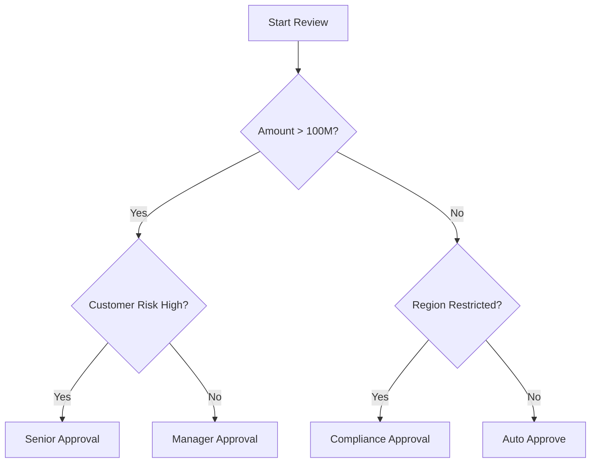
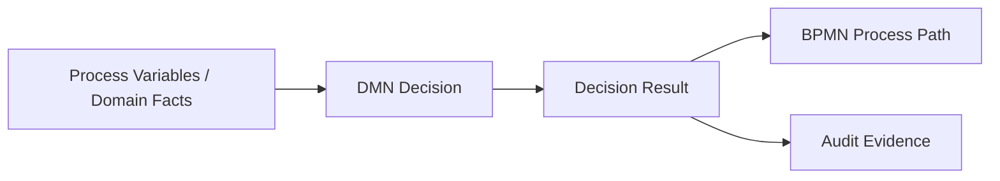
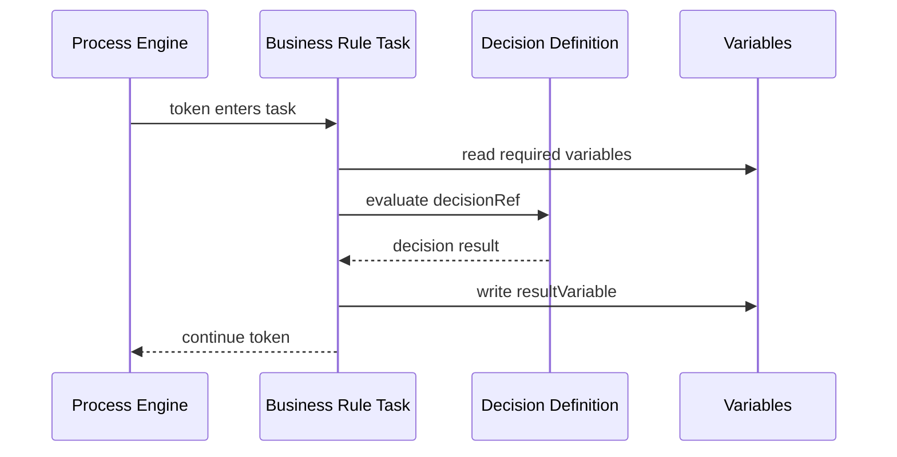
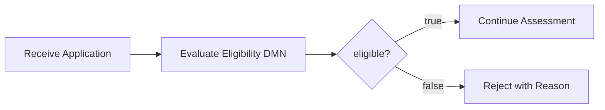
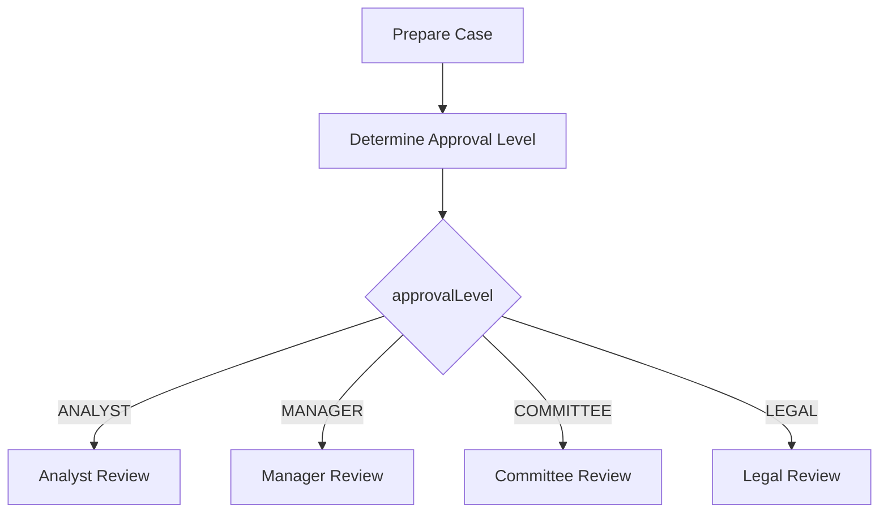
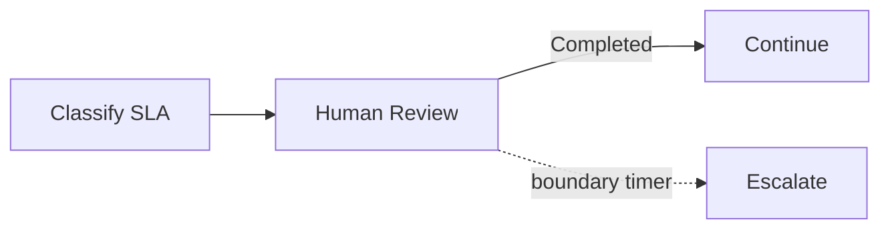
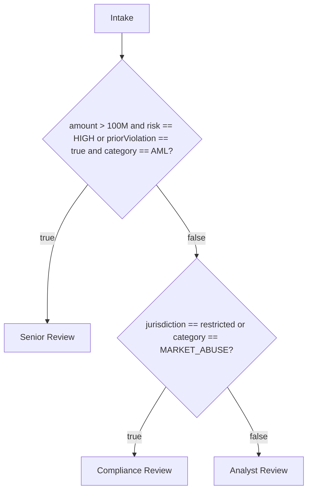
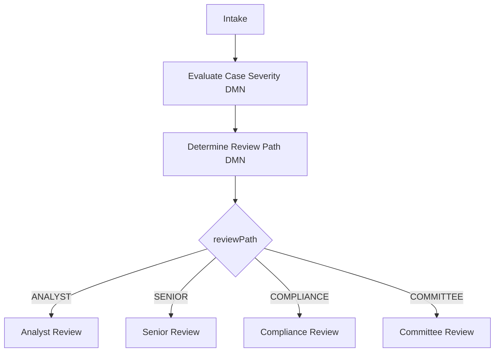

------
title: Learn Java BPMN with Camunda BPM Platform 7 - Part 009
description: Advanced Camunda 7 DMN and business rule integration: decision table modeling, Business Rule Task semantics, DecisionService API, hit policies, versioning, testing, auditability, and rule-engine anti-patterns.
series: learn-java-bpmn-camunda7
seriesTitle: Learn Java BPMN with Camunda BPM Platform 7
order: 9
partTitle: DMN and Business Rule Integration
tags:
- java
- bpmn
- dmn
- camunda
- camunda-7
- business-rules
- decision-service
- decision-table
- workflow
- series
date: 2026-06-27
------

# Part 009 — DMN and Business Rule Integration

Part ini membahas bagaimana memakai **DMN** bersama BPMN di Camunda 7 tanpa membuat proses berubah menjadi kumpulan gateway, delegate, dan conditional expression yang sulit diaudit. Fokusnya bukan hanya “cara membuat decision table”, tetapi bagaimana memisahkan **flow orchestration** dari **decision logic** secara defensible, testable, dan mudah berubah.

Camunda 7 menyediakan DMN engine sebagai Java library untuk mengevaluasi decision table dan mengintegrasikannya dengan process engine. Dalam BPMN, integrasi paling umum dilakukan melalui **Business Rule Task**. Di luar BPMN, keputusan juga bisa dievaluasi langsung lewat `DecisionService`.

> Mental model utama: **BPMN menjawab “apa langkah berikutnya dalam lifecycle?”, DMN menjawab “keputusan apa yang benar berdasarkan fakta saat ini?”** Jangan meletakkan policy matrix yang berubah-ubah di gateway expression, dan jangan menjadikan DMN sebagai tempat menyembunyikan proses.

---

## 1. Kaufman Skill Deconstruction

Untuk menguasai BPMN + DMN integration, pecah skill menjadi sub-skill berikut:

| Sub-skill | Yang harus bisa dilakukan | Failure signal |
|---|---|---|
| Memisahkan flow vs decision | Menentukan kapan logic masuk gateway, DMN, atau Java service | Proses penuh expression panjang dan gateway policy |
| Mendesain decision contract | Mendefinisikan input, output, type, default, dan error behavior | Decision table bergantung pada variable acak dari process context |
| Memilih hit policy | Memilih Unique, First, Priority, Collect, dan lainnya sesuai invariant | Output berubah ketika urutan rule berubah tanpa disadari |
| Mengintegrasikan Business Rule Task | Menggunakan `decisionRef`, binding, result variable, dan mapping dengan benar | Result variable ambigu atau bentrok dengan internal result |
| Menggunakan DecisionService | Mengevaluasi keputusan dari Java API secara explicit dan testable | Delegate melakukan lookup rule manual tanpa version discipline |
| Versioning decision | Mengelola perubahan rule tanpa merusak process instance berjalan | Deploy DMN baru mengubah behavior proses tanpa release note |
| Testing rule | Menguji matrix keputusan, edge cases, dan conflicting rules | Hanya tes happy path BPMN, bukan decision table |
| Auditability | Membuat keputusan bisa dijelaskan dari input, rule match, output, dan version | Tidak bisa menjawab kenapa kasus A mendapat keputusan B |

Kaufman-style target untuk part ini: setelah selesai, kita harus bisa melihat sebuah proses approval, eligibility, scoring, routing, atau escalation, lalu menjawab dengan tegas: bagian mana yang BPMN, bagian mana yang DMN, bagian mana yang domain service, bagaimana versi rules dikunci, bagaimana dites, dan bagaimana diaudit.

---

## 2. Problem yang Diselesaikan DMN

Banyak engineer menggunakan gateway untuk semua percabangan:



Model seperti ini masih masuk akal untuk 2 sampai 5 rule. Tetapi ketika policy berkembang menjadi kombinasi:

- customer type,
- risk level,
- region,
- product,
- amount,
- regulatory category,
- previous violation,
- fraud signal,
- exemption,
- manual override,
- effective date,
- jurisdiction,

maka BPMN akan menjadi policy maze.

DMN membantu karena decision logic bisa dinyatakan sebagai tabel:

| Risk | Amount Band | Region | Prior Violation | Required Approval |
|---|---:|---|---|---|
| LOW | `< 10M` | NORMAL | false | AUTO |
| MEDIUM | `10M..100M` | NORMAL | false | MANAGER |
| HIGH | any | any | any | SENIOR_RISK |
| any | any | RESTRICTED | any | COMPLIANCE |

Perubahan rule menjadi perubahan tabel, bukan perubahan struktur proses.

### BPMN vs DMN Responsibility Split

| Pertanyaan | Cocok di BPMN | Cocok di DMN | Cocok di Java/domain service |
|---|---:|---:|---:|
| Apa lifecycle proses? | ✅ | ❌ | ❌ |
| Siapa task owner berikutnya? | Kadang | ✅ | Kadang |
| Apakah case eligible? | Kadang | ✅ | Kadang |
| Apakah external system call berhasil? | ❌ | ❌ | ✅ |
| Bagaimana menghitung score kompleks berbasis data eksternal? | ❌ | Kadang | ✅ |
| Apakah harus eskalasi? | ✅ untuk flow | ✅ untuk rule | Kadang |
| Bagaimana retry API call? | ✅ untuk orchestration | ❌ | ✅ untuk adapter |
| Bagaimana audit rule policy? | ❌ | ✅ | Kadang |

Rule of thumb:

- **BPMN**: lifecycle, coordination, waiting, human work, SLA, event handling.
- **DMN**: deterministic decision based on known inputs.
- **Java service**: side effects, integration, complex computation, data retrieval, security-sensitive logic, non-tabular algorithms.

---

## 3. DMN Mental Model

DMN adalah model keputusan. Dalam Camunda 7, elemen yang paling sering kita pakai adalah:

| Element | Makna | Engineering concern |
|---|---|---|
| Decision | Unit keputusan yang bisa dievaluasi | Key, version, tenant, deployment |
| Decision table | Bentuk tabular dari rule | Hit policy, rule ordering, default behavior |
| Input | Fakta yang dibaca decision | Name, type, nullability, normalization |
| Output | Hasil keputusan | Single value, object-like structure, enum discipline |
| Rule | Baris kondisi + output | Completeness, overlap, conflict |
| Hit policy | Cara memilih rule yang match | Determinism dan explainability |
| DRG | Decision Requirements Graph | Dependency antar keputusan |
| FEEL/JUEL expressions | Expression untuk input/rule | Type safety dan readability |



Yang penting: DMN tidak menghilangkan kebutuhan domain model. DMN hanya mengevaluasi fakta yang diberikan. Jika input-nya kacau, output-nya juga kacau.

---

## 4. Decision Contract: Fondasi yang Sering Diabaikan

Sebelum membuat decision table, definisikan kontrak keputusan.

Contoh buruk:

```text
Decision: checkApproval
Inputs: amount, user, data, case
Output: result
```

Masalah:

- `user` tidak jelas: applicant, reviewer, current authenticated user, atau owner?
- `data` dan `case` terlalu luas.
- `result` tidak punya type dan semantic.
- Tidak ada null policy.
- Tidak ada rule version expectation.

Contoh lebih baik:

```text
Decision key: required_approval_level
Purpose: menentukan approval level minimal untuk case regulatory enforcement.
Inputs:
  - caseAmount: decimal, required, >= 0
  - jurisdiction: string enum, required
  - subjectRiskLevel: enum LOW|MEDIUM|HIGH|CRITICAL, required
  - hasPriorViolation: boolean, required
  - caseCategory: enum LICENSING|MARKET_ABUSE|CONSUMER_PROTECTION|AML, required
Output:
  - approvalLevel: enum AUTO|ANALYST|MANAGER|SENIOR_MANAGER|COMMITTEE|LEGAL
  - reasonCode: string enum
  - slaHours: integer
Default behavior:
  - Missing required input = technical failure, not AUTO.
  - No matching rule = technical failure or explicit FALLBACK_REVIEW rule.
Audit:
  - Store decision key, version, input snapshot hash, output, and matched rule evidence.
```

Decision contract harus lebih stabil dari implementasi tabel. Tabel boleh berubah, tetapi nama input/output yang dipakai process model sebaiknya tidak berubah sembarangan.

---

## 5. Business Rule Task di BPMN

Business Rule Task adalah BPMN task untuk mengeksekusi rule secara synchronous. Dalam Camunda 7, implementasi umum adalah DMN decision reference.

Contoh BPMN XML sederhana:

```xml
<bpmn:businessRuleTask
    id="DetermineApprovalLevel"
    name="Determine Approval Level"
    camunda:decisionRef="required_approval_level"
    camunda:resultVariable="approvalDecision"
    camunda:mapDecisionResult="singleEntry" />
```

Diagram mental model:



### Attribute Penting

| Attribute | Fungsi | Catatan desain |
|---|---|---|
| `camunda:decisionRef` | Key decision yang dievaluasi | Jangan hardcode versi tanpa alasan |
| `camunda:decisionRefBinding` | Cara resolve versi decision | `latest`, `deployment`, `version`, `versionTag` tergantung release strategy |
| `camunda:decisionRefVersion` | Version numerik | Berguna untuk pinning eksplisit, tetapi perlu proses release disiplin |
| `camunda:decisionRefVersionTag` | Version tag | Cocok jika organisasi memakai semantic tag |
| `camunda:resultVariable` | Variable output hasil mapping | Hindari nama generik |
| `camunda:mapDecisionResult` | Mapper hasil decision | Pilih sesuai hit policy dan output shape |

### Result Mapping

Mapping hasil decision harus eksplisit. Beberapa pola umum:

| Mapper | Cocok untuk | Risiko |
|---|---|---|
| `singleEntry` | Satu rule match, satu output column | Error jika output ternyata multi-column/multi-result |
| `singleResult` | Satu rule match, beberapa output column | Consumer harus tahu nama output |
| `collectEntries` | Banyak rule match, satu output column | Perlu downstream handling list |
| `resultList` | Banyak rule match, banyak output | Paling fleksibel, tetapi paling mudah bocor ke process variable |

Anti-pattern:

```xml
camunda:resultVariable="result"
camunda:mapDecisionResult="resultList"
```

Ini membuat semua downstream task bergantung pada struktur list/map hasil engine. Lebih baik mapping ke value domain yang jelas:

```xml
camunda:resultVariable="requiredApprovalLevel"
camunda:mapDecisionResult="singleEntry"
```

Jika output butuh multi-field, gunakan nama yang domain-specific:

```xml
camunda:resultVariable="approvalPolicyDecision"
camunda:mapDecisionResult="singleResult"
```

---

## 6. Hit Policy Deep Dive

Hit policy menentukan bagaimana rule yang match diterjemahkan menjadi hasil.

| Hit policy | Makna | Cocok untuk | Bahaya |
|---|---|---|---|
| `UNIQUE` | Maksimal satu rule boleh match | Klasifikasi deterministik | Rule overlap menyebabkan error |
| `ANY` | Banyak rule boleh match jika output sama | Redundant rule yang konsisten | Konflik output gagal |
| `FIRST` | Rule pertama yang match dipakai | Priority implisit by order | Urutan tabel menjadi business logic tersembunyi |
| `PRIORITY` | Output dipilih berdasarkan prioritas output | Risk/severity selection | Priority list harus jelas |
| `RULE ORDER` | Semua match dikembalikan sesuai urutan rule | Checklist/action list | Downstream harus handle list |
| `OUTPUT ORDER` | Semua match dikembalikan sesuai prioritas output | Ordered recommendations | Perlu output priority |
| `COLLECT` | Semua output dikumpulkan | Accumulation / multiple grants | Bisa menghasilkan list besar |
| `COLLECT SUM/MIN/MAX/COUNT` | Aggregation | Scoring numerik sederhana | Sering disalahgunakan untuk kalkulasi kompleks |

### Cara Memilih Hit Policy

Gunakan pertanyaan berikut:

1. Apakah secara bisnis hanya boleh ada satu hasil valid?
   - Gunakan `UNIQUE`.
2. Apakah rule boleh overlap tetapi hasilnya harus sama?
   - Gunakan `ANY`.
3. Apakah policy memang berbasis prioritas urutan?
   - Gunakan `PRIORITY`, bukan `FIRST`, jika prioritas bisa diekspresikan sebagai output priority.
4. Apakah perlu menghasilkan daftar action?
   - Gunakan `RULE ORDER` atau `COLLECT`.
5. Apakah butuh score numerik dari beberapa factor?
   - `COLLECT SUM` bisa dipakai untuk simple score, tetapi jangan jadikan DMN sebagai spreadsheet monster.

### Anti-pattern: FIRST sebagai Escape Hatch

`FIRST` sering dipakai agar konflik rule “tidak error”. Ini berbahaya karena konflik tidak hilang, hanya disembunyikan oleh urutan baris.

Gunakan `FIRST` hanya jika:

- urutan rule adalah business concept yang eksplisit,
- tabel diberi komentar/struktur prioritas,
- test membuktikan rule atas memang override rule bawah,
- reviewer bisnis memahami bahwa urutan baris penting.

Jika tidak, gunakan `UNIQUE` agar overlap terdeteksi.

---

## 7. Business Rule Task Pattern Catalog

### 7.1 Eligibility Decision Pattern

Gunakan DMN untuk menentukan apakah case boleh lanjut.



DMN output:

| Output | Type | Meaning |
|---|---|---|
| `eligible` | boolean | Apakah case eligible |
| `reasonCode` | string enum | Alasan rejection/manual review |
| `manualReviewRequired` | boolean | Apakah butuh human override |

BPMN tetap punya gateway karena gateway mengubah flow. Tetapi gateway hanya membaca hasil decision, bukan mengulang rule.

### 7.2 Approval Level Pattern

Gunakan DMN untuk menentukan level approval, lalu BPMN memilih lane/task.



Invariant:

- DMN menentukan **minimum required approval**.
- BPMN menentukan **actual workflow routing**.
- Assignment logic boleh di task assignment service, bukan di DMN jika membutuhkan org directory/live availability.

### 7.3 SLA Classification Pattern

DMN menentukan SLA class, BPMN memasang timer.

| Case category | Risk | SLA hours | Escalation target |
|---|---|---:|---|
| AML | CRITICAL | 4 | COMPLIANCE_HEAD |
| MARKET_ABUSE | HIGH | 8 | ENFORCEMENT_MANAGER |
| LICENSING | LOW | 72 | TEAM_LEAD |

BPMN:



Jangan membuat banyak timer branch berdasarkan kategori bila SLA bisa jadi data-driven. Namun tetap hati-hati: timer due date harus sudah computed dan persistable.

### 7.4 Regulatory Threshold Pattern

DMN cocok untuk threshold yang berubah karena regulation:

- amount threshold,
- risk category,
- exemption rule,
- jurisdiction rule,
- reporting obligation.

Output sebaiknya bukan hanya boolean:

```text
reportingRequired: true
reportingAuthority: OJK
reportingDeadlineDays: 3
legalBasisCode: REG-AML-2025-17
reasonCode: HIGH_RISK_AMOUNT_THRESHOLD
```

Untuk sistem regulatori, `legalBasisCode` atau `policyReference` sering lebih penting daripada boolean result.

---

## 8. DecisionService API

`DecisionService` memungkinkan Java code mengevaluasi deployed decision tanpa harus lewat Business Rule Task. Ini berguna untuk:

- API endpoint yang perlu preview keputusan,
- batch validation,
- testing rule secara eksplisit,
- domain service yang butuh decision deployed,
- comparison antara old/new rule version.

Contoh:

```java
import org.camunda.bpm.engine.DecisionService;
import org.camunda.bpm.engine.variable.VariableMap;
import org.camunda.bpm.engine.variable.Variables;
import org.camunda.bpm.dmn.engine.DmnDecisionResult;

public class ApprovalDecisionClient {

    private final DecisionService decisionService;

    public ApprovalDecisionClient(DecisionService decisionService) {
        this.decisionService = decisionService;
    }

    public String determineApprovalLevel(CaseFacts facts) {
        VariableMap variables = Variables.createVariables()
            .putValue("caseAmount", facts.caseAmount())
            .putValue("jurisdiction", facts.jurisdiction())
            .putValue("subjectRiskLevel", facts.subjectRiskLevel())
            .putValue("hasPriorViolation", facts.hasPriorViolation())
            .putValue("caseCategory", facts.caseCategory());

        DmnDecisionResult result = decisionService
            .evaluateDecisionByKey("required_approval_level")
            .variables(variables)
            .evaluate();

        return result.getSingleEntry();
    }
}
```

### Jangan Leak `DmnDecisionResult` ke Domain Layer

Buruk:

```java
public DmnDecisionResult decide(CaseFacts facts) {
    return decisionService.evaluateDecisionByKey("required_approval_level")
        .variables(toVariables(facts))
        .evaluate();
}
```

Masalah:

- domain layer tahu struktur Camunda DMN result,
- sulit mengganti rule implementation,
- consumer bisa membaca output sembarangan,
- testing domain menjadi tergantung engine object.

Lebih baik:

```java
public record ApprovalPolicyDecision(
    String approvalLevel,
    String reasonCode,
    int slaHours,
    String policyVersion
) {}
```

Kemudian adapter mengubah `DmnDecisionResult` menjadi domain DTO.

---

## 9. DMN Versioning Strategy

Decision versioning harus sinkron dengan process release strategy.

### 9.1 Latest Binding

```xml
camunda:decisionRefBinding="latest"
```

Kelebihan:

- perubahan rule langsung dipakai,
- cocok untuk policy yang memang selalu current-state,
- tidak perlu redeploy BPMN.

Risiko:

- proses lama bisa berubah behavior di tengah jalan,
- audit sulit jika tidak menyimpan version yang dipakai,
- regression rule bisa mempengaruhi semua running process.

Gunakan untuk:

- screening awal yang selalu mengikuti policy terbaru,
- preview keputusan,
- proses pendek dengan risiko rendah.

### 9.2 Deployment Binding

```xml
camunda:decisionRefBinding="deployment"
```

Kelebihan:

- BPMN dan DMN dalam deployment yang sama tetap konsisten,
- cocok untuk release package process + decision,
- behavior running instances lebih predictable.

Risiko:

- hotfix rule butuh redeploy package,
- process dan decision coupling meningkat.

Gunakan untuk:

- approval flow yang harus reproducible,
- regulatory process yang butuh release bundle,
- proses panjang dengan audit ketat.

### 9.3 Version / Version Tag Binding

Gunakan jika perlu pinning eksplisit.

Kelebihan:

- behavior sangat jelas,
- cocok untuk migration atau A/B validation.

Risiko:

- maintenance berat,
- perlu governance agar versi tidak tertinggal.

---

## 10. Data Type and FEEL Discipline

DMN tampak sederhana sampai type mismatch muncul.

Prinsip:

1. Normalize input sebelum masuk DMN.
2. Pakai enum string yang controlled.
3. Hindari object Java kompleks sebagai input decision table.
4. Hindari null yang bermakna ganda.
5. Gunakan explicit fallback rule jika bisnis memang punya fallback.
6. Jangan jadikan DMN tempat data retrieval.

Contoh normalisasi:

```java
public CaseFacts normalize(RawCase raw) {
    return new CaseFacts(
        raw.amount() == null ? BigDecimal.ZERO : raw.amount(),
        normalizeJurisdiction(raw.jurisdiction()),
        classifyRisk(raw.riskScore()),
        raw.priorViolationCount() > 0,
        normalizeCategory(raw.category())
    );
}
```

DMN harus menerima fakta yang sudah bersih. Jika decision table harus menangani semua bentuk data mentah, rule table akan menjadi tempat ETL tersembunyi.

---

## 11. Testing DMN

DMN harus dites seperti production code.

### 11.1 Test Matrix

Minimal test matrix:

| Test type | Tujuan |
|---|---|
| Golden path | Input umum menghasilkan output expected |
| Boundary value | Threshold tepat di bawah/sama/di atas batas |
| Null/missing input | Missing required input gagal dengan jelas |
| Conflict detection | Rule overlap terdeteksi jika hit policy UNIQUE |
| Fallback | No-match menghasilkan fallback yang disengaja |
| Version regression | Rule baru tidak merusak case historis kritikal |
| Audit evidence | Output menyimpan reason/version yang cukup |

### 11.2 Example Unit Test Shape

```java
class RequiredApprovalDecisionTest {

    @Test
    void highRiskCaseRequiresSeniorManagerApproval() {
        VariableMap variables = Variables.createVariables()
            .putValue("caseAmount", new BigDecimal("50000000"))
            .putValue("jurisdiction", "ID")
            .putValue("subjectRiskLevel", "HIGH")
            .putValue("hasPriorViolation", false)
            .putValue("caseCategory", "AML");

        DmnDecisionResult result = decisionService
            .evaluateDecisionByKey("required_approval_level")
            .variables(variables)
            .evaluate();

        assertThat(result.getSingleResult().get("approvalLevel"))
            .isEqualTo("SENIOR_MANAGER");
        assertThat(result.getSingleResult().get("reasonCode"))
            .isEqualTo("HIGH_RISK_AML");
    }
}
```

### 11.3 Property-Inspired Checks

Untuk rule matrix yang penting, buat invariant test:

- CRITICAL risk tidak boleh menghasilkan AUTO.
- Restricted jurisdiction selalu membutuhkan compliance/legal path.
- Prior violation tidak boleh menurunkan approval level.
- Amount lebih tinggi tidak boleh menghasilkan approval level lebih rendah, kecuali ada exemption eksplisit.

Invariant seperti ini lebih kuat daripada hanya test contoh input.

---

## 12. Auditability and Explainability

Sistem workflow regulatori harus bisa menjawab:

- decision key apa yang dipakai,
- version berapa,
- input apa yang dipakai,
- output apa yang dihasilkan,
- rule mana yang match,
- siapa/apa yang memicu evaluasi,
- kapan dievaluasi,
- apakah hasilnya dioverride oleh manusia,
- dasar hukum/policy apa yang dipakai.

Minimal audit record:

```json
{
  "decisionKey": "required_approval_level",
  "decisionVersion": 17,
  "evaluatedAt": "2026-06-27T10:15:30Z",
  "businessKey": "CASE-2026-00091",
  "inputHash": "sha256:...",
  "inputSummary": {
    "caseAmountBand": "50M..100M",
    "jurisdiction": "ID",
    "subjectRiskLevel": "HIGH",
    "caseCategory": "AML"
  },
  "output": {
    "approvalLevel": "SENIOR_MANAGER",
    "reasonCode": "HIGH_RISK_AML",
    "slaHours": 8
  }
}
```

Jangan selalu menyimpan semua input mentah jika mengandung data sensitif. Untuk compliance, kadang yang dibutuhkan adalah snapshot terkontrol, hash, dan link ke evidence immutable.

---

## 13. BPMN + DMN Design Walkthrough

Misal kita punya enforcement lifecycle:

1. Intake case.
2. Classify severity.
3. Tentukan review path.
4. Jalankan human review.
5. Eskalasi jika SLA lewat.
6. Final decision.

Desain buruk:



Desain lebih baik:



DMN `case_severity`:

| riskLevel | amountBand | priorViolation | severity | reasonCode |
|---|---|---|---|---|
| LOW | LOW | false | LOW | STANDARD_LOW |
| HIGH | any | false | HIGH | HIGH_RISK |
| any | HIGH | true | CRITICAL | HIGH_AMOUNT_PRIOR_VIOLATION |

DMN `review_path`:

| severity | category | jurisdiction | reviewPath | slaHours |
|---|---|---|---|---:|
| LOW | any | NORMAL | ANALYST | 72 |
| HIGH | AML | NORMAL | SENIOR | 24 |
| any | any | RESTRICTED | COMPLIANCE | 8 |
| CRITICAL | any | any | COMMITTEE | 4 |

BPMN hanya mengorkestrasi hasilnya.

---

## 14. Operational Failure Modes

### 14.1 No Matching Rule

Gejala:

- Business Rule Task gagal.
- Process berhenti di incident jika async boundary ada.
- Jika synchronous, transaction bisa rollback ke wait state sebelumnya atau ke caller.

Strategi:

- Tambahkan fallback rule eksplisit jika bisnis mengizinkan.
- Untuk rule yang harus complete, gunakan test coverage matrix.
- Jangan fallback ke AUTO kecuali explicitly approved.

### 14.2 Multiple Matching Rules with UNIQUE

Gejala:

- Evaluasi gagal karena lebih dari satu rule match.

Strategi:

- Perbaiki overlap.
- Jika overlap valid dan output sama, pertimbangkan `ANY`.
- Jika prioritas valid, gunakan `PRIORITY` atau `FIRST` dengan governance.

### 14.3 Missing Input Variable

Gejala:

- Expression evaluation error.
- Output salah jika null dianggap wildcard tanpa sengaja.

Strategi:

- Validate input sebelum DMN.
- Gunakan typed DTO untuk facts.
- Jadikan missing required input sebagai technical failure.

### 14.4 Wrong Version Evaluated

Gejala:

- Hasil keputusan berubah setelah deployment DMN baru.
- Audit sulit menjelaskan behavior lama.

Strategi:

- Pilih binding dengan sadar.
- Simpan decision version pada audit.
- Test migration/release sebelum deploy.

---

## 15. Anti-Patterns and Common Pitfalls

### 15.1 Gateway Rule Explosion

Semua policy dipecah menjadi gateway condition.

Dampak:

- BPMN sulit dibaca,
- business reviewer sulit memvalidasi,
- perubahan policy butuh perubahan model proses,
- testing path meledak.

Solusi: pindahkan deterministic rule matrix ke DMN.

### 15.2 DMN as Hidden Process

DMN output menentukan banyak langkah berurutan secara tersembunyi.

Contoh output buruk:

```text
nextStep = "createTaskA_then_callSystemB_then_waitForLegal"
```

Ini bukan decision; ini proses yang disembunyikan.

Solusi: DMN boleh menentukan class/route/policy; BPMN tetap mengorkestrasi lifecycle.

### 15.3 Variable Dumping into DMN

Business Rule Task membaca seluruh process variables.

Dampak:

- decision table bergantung pada variable incidental,
- refactor proses merusak rule,
- audit input tidak jelas.

Solusi: definisikan decision input contract.

### 15.4 Result Variable Ambiguity

Nama `result`, `decision`, `output`, atau `status` dipakai lintas proses.

Dampak:

- variable collision,
- gateway membaca output salah,
- debugging sulit.

Solusi: gunakan nama domain-specific seperti `approvalPolicyDecision`, `caseSeverityDecision`, `requiredApprovalLevel`.

### 15.5 FIRST Hit Policy Without Governance

`FIRST` digunakan karena rule conflict tidak mau dibereskan.

Dampak:

- business behavior bergantung pada urutan row,
- reviewer tidak sadar ada override,
- perubahan drag-and-drop row merusak production.

Solusi: gunakan `UNIQUE`, `ANY`, atau `PRIORITY` jika cocok.

### 15.6 Decision Table Too Large

Satu decision table berisi ratusan baris untuk banyak concern.

Dampak:

- rule sulit direview,
- conflict sulit dideteksi,
- deploy menjadi high-risk.

Solusi: pecah menjadi beberapa decision dengan DRG atau pre-classification.

### 15.7 DMN Reads Live External State

Decision evaluation memanggil service eksternal.

Dampak:

- decision tidak deterministic,
- audit sulit,
- testing lambat,
- retry behavior kacau.

Solusi: ambil fakta sebelum decision, lalu masukkan sebagai input.

---

## 16. Engineering Checklist

Sebelum deploy BPMN + DMN ke production, jawab:

- Apakah setiap decision punya purpose yang jelas?
- Apakah input contract terdokumentasi?
- Apakah output contract domain-specific?
- Apakah hit policy sesuai invariant bisnis?
- Apakah no-match behavior eksplisit?
- Apakah conflict behavior dites?
- Apakah decision binding dipilih dengan sadar?
- Apakah decision version tersimpan di audit?
- Apakah missing input gagal secara aman?
- Apakah gateway hanya membaca hasil decision, bukan mengulang rule?
- Apakah rule table cukup kecil untuk direview manusia?
- Apakah ada regression test untuk kasus historis penting?

---

## 17. Practice: 90-Minute Deliberate Exercise

Bangun mini proses `case-review`:

1. Start process dengan variables:
   - `caseAmount`,
   - `jurisdiction`,
   - `subjectRiskLevel`,
   - `hasPriorViolation`,
   - `caseCategory`.
2. Tambahkan Business Rule Task `Determine Review Path`.
3. Buat DMN `review_path` dengan output:
   - `reviewPath`,
   - `slaHours`,
   - `reasonCode`.
4. Gateway routing ke:
   - analyst review,
   - senior review,
   - compliance review,
   - committee review.
5. Tambahkan test untuk:
   - low risk normal case,
   - high risk case,
   - restricted jurisdiction,
   - prior violation,
   - missing input,
   - overlapping rule.
6. Tambahkan audit variable `reviewDecisionAudit`.

Target self-correction:

- Bisa menjelaskan kenapa rule tertentu match.
- Bisa mengganti DMN tanpa menyentuh BPMN jika output contract tetap sama.
- Bisa membuktikan bahwa CRITICAL case tidak pernah masuk AUTO.

---

## 18. References

- Camunda 7.24 Docs — DMN Engine: `https://docs.camunda.org/manual/7.24/user-guide/dmn-engine/`
- Camunda 7.24 Docs — Business Rule Task: `https://docs.camunda.org/manual/7.24/reference/bpmn20/tasks/business-rule-task/`
- Camunda 7.24 Docs — Decision Service: `https://docs.camunda.org/manual/7.24/user-guide/process-engine/decisions/decision-service/`
- Camunda 7.24 Docs — DMN Decision Table: `https://docs.camunda.org/manual/7.24/reference/dmn/decision-table/`
- Camunda 7.24 Docs — DMN Hit Policy: `https://docs.camunda.org/manual/7.24/reference/dmn/decision-table/hit-policy/`

---

## 19. Key Takeaways

- DMN adalah alat untuk decision logic, bukan replacement untuk BPMN lifecycle.
- Business Rule Task cocok untuk decision yang menjadi bagian natural dari process path.
- `DecisionService` cocok untuk Java-side evaluation, preview, testing, dan service-level decision abstraction.
- Hit policy adalah invariant, bukan setting kosmetik.
- Decision contract harus eksplisit: input, output, type, default, version, audit.
- Rule yang tidak bisa dijelaskan, tidak bisa diaudit, dan tidak bisa dites bukan rule production-grade.
