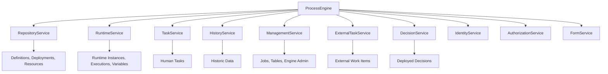
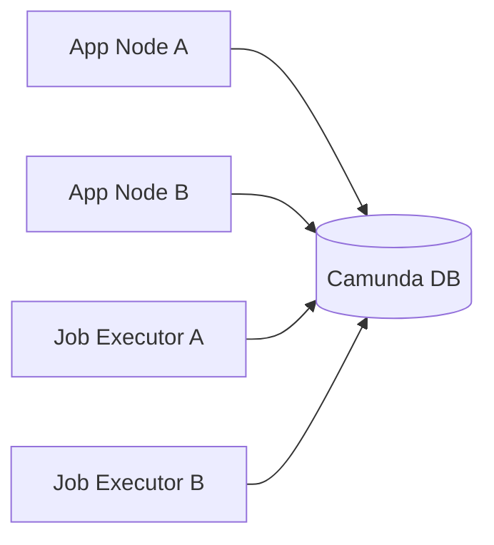
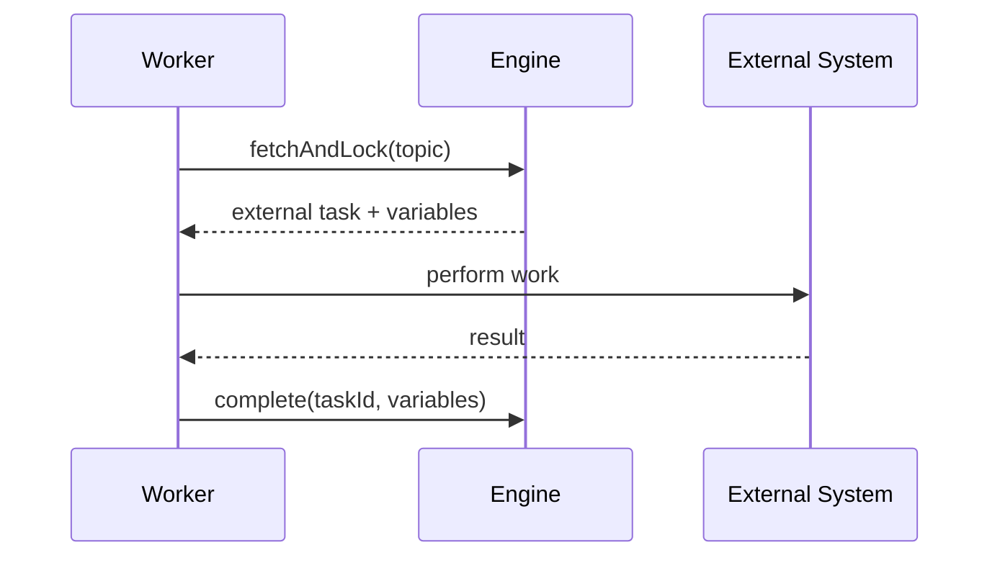
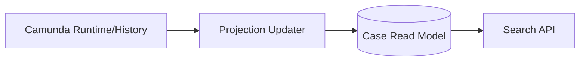
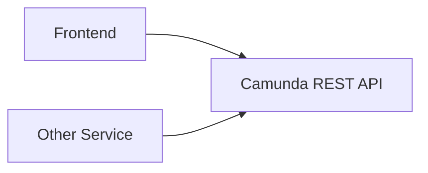
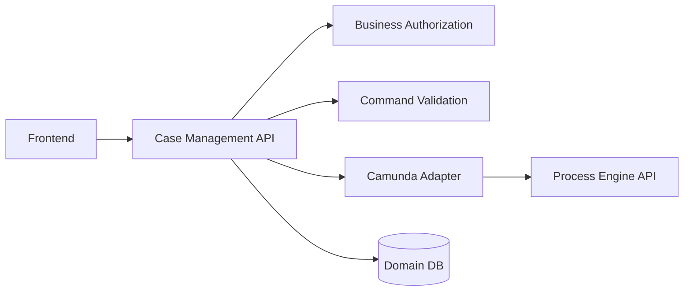

------
title: Learn Java BPMN with Camunda BPM Platform 7 - Part 010
description: Advanced Camunda 7 Process Engine API guide: ProcessEngine, RepositoryService, RuntimeService, TaskService, HistoryService, ManagementService, ExternalTaskService, DecisionService, query patterns, application boundaries, and API anti-patterns.
series: learn-java-bpmn-camunda7
seriesTitle: Learn Java BPMN with Camunda BPM Platform 7
order: 10
partTitle: Process Engine API: Repository, Runtime, Task, History, Management
tags:
- java
- bpmn
- camunda
- camunda-7
- process-engine-api
- repository-service
- runtime-service
- task-service
- history-service
- management-service
- workflow
- series
date: 2026-06-27
------

# Part 010 — Process Engine API: Repository, Runtime, Task, History, Management

Part ini membahas **Camunda 7 Process Engine API** sebagai boundary utama antara aplikasi Java dan process engine. Setelah kita memahami BPMN, event, task, subprocess, dan DMN, sekarang kita perlu menguasai API yang benar-benar dipakai untuk deploy model, start process, query instance, complete task, inspect history, manage jobs, evaluate decisions, dan membangun application layer yang sehat.

> Mental model utama: Process Engine API bukan sekadar CRUD API. Ia adalah **command interface** ke runtime state machine yang persisted di database. Setiap service punya ownership area yang berbeda. Salah memilih service biasanya menandakan salah memahami lifecycle proses.

---

## 1. Kaufman Skill Deconstruction

| Sub-skill | Yang harus bisa dilakukan | Failure signal |
|---|---|---|
| Service boundary reasoning | Menentukan service mana untuk operasi tertentu | `RuntimeService` dipakai untuk semua hal |
| Deployment reasoning | Membedakan deployment, process definition, decision definition, dan resources | Deploy BPMN tanpa version/release strategy |
| Runtime reasoning | Start, correlate, signal, set variable, query execution dengan hati-hati | Instance duplikat karena start tidak idempotent |
| Task API reasoning | Query, claim, assign, complete, delegate user task secara benar | UI menyelesaikan task tanpa authorization/application check |
| History reasoning | Mengambil audit/trace dari history, bukan runtime | Report query langsung ke runtime table |
| Management reasoning | Mengelola jobs, incidents, retries, table metadata dengan batasan operasional | Production recovery dilakukan via SQL update langsung |
| API facade design | Membungkus engine API dalam application service | REST/UI langsung bergantung pada Camunda query model |
| Query discipline | Pagination, tenant, sorting, authorization, variable query dengan sadar | Query lambat dan unpredictable di production |
| Failure handling | Membedakan engine exception, optimistic locking, authorization, business error | Semua exception dianggap “Camunda error” |

Target setelah part ini: bisa membaca sebuah kebutuhan seperti “mulai case baru”, “ambil task reviewer”, “retry failed timer”, “lihat history keputusan”, “deploy process package”, lalu memilih API yang tepat dan mendesain boundary application yang aman.

---

## 2. ProcessEngine Mental Model

`ProcessEngine` adalah entry point utama untuk services.

```java
ProcessEngine processEngine = ProcessEngines.getDefaultProcessEngine();

RepositoryService repositoryService = processEngine.getRepositoryService();
RuntimeService runtimeService = processEngine.getRuntimeService();
TaskService taskService = processEngine.getTaskService();
HistoryService historyService = processEngine.getHistoryService();
ManagementService managementService = processEngine.getManagementService();
ExternalTaskService externalTaskService = processEngine.getExternalTaskService();
DecisionService decisionService = processEngine.getDecisionService();
```

Dalam Spring Boot, biasanya kita tidak memanggil `ProcessEngines.getDefaultProcessEngine()` manual. Kita inject service sebagai Spring bean.

```java
@Service
public class CaseWorkflowService {

    private final RuntimeService runtimeService;
    private final TaskService taskService;

    public CaseWorkflowService(RuntimeService runtimeService, TaskService taskService) {
        this.runtimeService = runtimeService;
        this.taskService = taskService;
    }
}
```

### Mental Model Services



Prinsip sederhana:

- **RepositoryService**: static model and deployment.
- **RuntimeService**: live process instance execution.
- **TaskService**: human task lifecycle.
- **HistoryService**: completed and historic trace.
- **ManagementService**: operational/admin engine concerns.
- **ExternalTaskService**: external task work item lifecycle.
- **DecisionService**: deployed decision evaluation.
- **Identity/Authorization**: users, groups, permissions, not business identity model replacement.

---

## 3. Stateless Services and Cluster Reality

Camunda services tidak menyimpan state process di object service. State utama berada di database engine. Karena itu, beberapa node engine bisa mengakses database yang sama.

Tetapi hati-hati dengan interpretasi “stateless”:

- Stateless service object tidak berarti semua operasi business-safe untuk retry.
- `startProcessInstanceByKey()` dua kali tetap bisa membuat dua process instance jika kita tidak punya idempotency guard.
- `complete(taskId)` bisa gagal jika task sudah completed oleh request lain.
- Query result bisa berubah di antara dua request karena engine state berubah.

Jadi production design tetap butuh:

- business key,
- idempotency key,
- optimistic locking handling,
- retry policy,
- transaction boundary,
- authorization check,
- audit trail.



Cluster safety engine tidak menggantikan application-level invariants.

---

## 4. RepositoryService

`RepositoryService` mengelola artifact statis:

- deployment,
- process definition,
- decision definition,
- case definition,
- deployed resources,
- process diagrams,
- suspension/activation definition.

### 4.1 Deployment

Contoh deployment programmatic:

```java
repositoryService.createDeployment()
    .name("case-review-2026.06.27")
    .source("ci-pipeline")
    .addClasspathResource("processes/case-review.bpmn")
    .addClasspathResource("decisions/review-path.dmn")
    .deploy();
```

Dalam Spring Boot, deployment sering dilakukan otomatis dari resource path. Namun untuk platform engineering, kita tetap perlu paham deployment sebagai unit versioning.

### 4.2 Query Process Definitions

```java
List<ProcessDefinition> definitions = repositoryService
    .createProcessDefinitionQuery()
    .processDefinitionKey("case_review")
    .latestVersion()
    .list();
```

Gunakan query ini untuk admin/diagnostic, bukan untuk setiap request bisnis jika tidak perlu. Cache application-level bisa dipakai untuk metadata yang jarang berubah, tetapi jangan cache authorization-sensitive data sembarangan.

### 4.3 Suspend and Activate Definition

```java
repositoryService.suspendProcessDefinitionByKey("case_review", true, null);
repositoryService.activateProcessDefinitionByKey("case_review", true, null);
```

Parameter `includeProcessInstances` menentukan apakah running instances ikut disuspend/activate.

Gunakan dengan runbook jelas:

- kenapa disuspend,
- siapa approve,
- impact ke SLA,
- cara resume,
- komunikasi ke operator,
- evidence di audit.

### 4.4 Deployment Package Discipline

Satu deployment bisa berisi beberapa BPMN, DMN, forms, diagram, dan resource lain. Pilihan packaging mempengaruhi:

- version consistency,
- rollback,
- migration,
- ownership,
- testing,
- release note,
- incident triage.

Pattern yang sehat:

```text
case-review/
  processes/
    case-review.bpmn
    case-reopen.bpmn
  decisions/
    review-path.dmn
    sla-classification.dmn
  forms/
    analyst-review.form
  metadata/
    release-notes.md
```

Anti-pattern: semua proses organisasi dimasukkan ke satu deployment “all-processes”. Deployment jadi terlalu besar, blast radius tinggi, dan migration sulit.

---

## 5. RuntimeService

`RuntimeService` mengelola process instance yang sedang hidup.

Operasi umum:

- start process instance,
- query process instance,
- query execution,
- get/set variables,
- correlate message,
- signal waiting execution,
- suspend/activate process instance,
- delete process instance.

### 5.1 Start Process Instance

```java
VariableMap variables = Variables.createVariables()
    .putValue("caseId", "CASE-2026-00091")
    .putValue("caseAmount", new BigDecimal("50000000"))
    .putValue("subjectRiskLevel", "HIGH");

ProcessInstance instance = runtimeService
    .startProcessInstanceByKey("case_review", "CASE-2026-00091", variables);
```

`businessKey` harus punya makna domain. Jangan gunakan UUID random jika process instance perlu dikorelasikan dengan business entity.

Good business key:

```text
CASE-2026-00091
ENF-INV-2026-8841
LICENSE-RENEWAL-2026-777
```

Bad business key:

```text
550e8400-e29b-41d4-a716-446655440000
```

UUID boleh dipakai sebagai technical id, tetapi business key harus membantu operasi, korelasi, dan audit.

### 5.2 Idempotent Start Pattern

Bahaya:

```java
runtimeService.startProcessInstanceByKey("case_review", businessKey, variables);
```

Jika client retry setelah timeout, proses bisa dobel.

Pattern:

```java
@Transactional
public String startCaseReview(StartCaseCommand command) {
    CaseRecord record = caseRepository.findById(command.caseId())
        .orElseThrow();

    if (record.workflowInstanceId() != null) {
        return record.workflowInstanceId();
    }

    ProcessInstance instance = runtimeService.startProcessInstanceByKey(
        "case_review",
        command.caseId(),
        toVariables(command)
    );

    record.attachWorkflowInstance(instance.getId());
    return instance.getId();
}
```

Untuk strict idempotency, pakai unique constraint di business database:

```sql
alter table case_workflow add constraint uq_case_workflow_case_id unique (case_id);
```

Camunda sendiri tidak otomatis melarang multiple process instance dengan business key sama.

### 5.3 Query Runtime State

```java
ProcessInstance instance = runtimeService
    .createProcessInstanceQuery()
    .processInstanceBusinessKey("CASE-2026-00091")
    .processDefinitionKey("case_review")
    .singleResult();
```

Hindari `singleResult()` jika secara data bisa ada lebih dari satu. Ia akan error jika result lebih dari satu. Gunakan invariant data agar query benar-benar single.

### 5.4 Variables

```java
runtimeService.setVariable(processInstanceId, "riskLevel", "HIGH");
Object value = runtimeService.getVariable(processInstanceId, "riskLevel");
```

Variable update adalah perubahan runtime state. Jangan gunakan sebagai general-purpose database update.

Anti-pattern:

```java
runtimeService.setVariable(instanceId, "customerProfile", hugeCustomerObject);
runtimeService.setVariable(instanceId, "latestUiPayload", rawJsonFromBrowser);
```

Dampak:

- serialization risk,
- history bloat,
- privacy risk,
- performance issue,
- class evolution problem.

Pattern:

- Simpan reference id di process variable.
- Simpan domain data di domain database.
- Simpan snapshot minimal untuk decision/audit bila perlu.

---

## 6. TaskService

`TaskService` mengelola human task.

Operasi umum:

- query task,
- claim,
- unclaim,
- assign,
- delegate,
- resolve,
- complete,
- set task variables,
- add comments/attachments,
- manage identity links.

### 6.1 Query User Tasks

```java
List<Task> tasks = taskService.createTaskQuery()
    .processDefinitionKey("case_review")
    .taskCandidateGroup("senior-reviewer")
    .active()
    .orderByTaskCreateTime()
    .desc()
    .listPage(0, 20);
```

Production checklist:

- selalu pagination,
- selalu sort deterministic,
- filter berdasarkan authorization/application ownership,
- jangan expose query parameter Camunda mentah ke public API,
- hati-hati variable query karena bisa mahal.

### 6.2 Claim Task

```java
taskService.claim(taskId, userId);
```

Claim berarti user mengambil ownership untuk menyelesaikan task. Namun jangan mengandalkan engine identity saja untuk security. Aplikasi tetap harus memastikan user berhak melihat dan mengambil task.

Pattern:

```java
public void claimReviewTask(String taskId, CurrentUser user) {
    Task task = taskService.createTaskQuery()
        .taskId(taskId)
        .active()
        .singleResult();

    if (task == null) {
        throw new TaskNotFoundException(taskId);
    }

    authorizationPolicy.assertCanClaim(user, task);

    taskService.claim(taskId, user.id());
}
```

### 6.3 Complete Task

```java
VariableMap completionVariables = Variables.createVariables()
    .putValue("reviewOutcome", "APPROVED")
    .putValue("reviewNotes", "Evidence complete.");

taskService.complete(taskId, completionVariables);
```

Completion is a command that advances process token. It can trigger:

- gateway evaluation,
- listener execution,
- service task execution,
- variable persistence,
- job creation,
- incident if downstream fails and transaction boundary allows.

Jangan anggap `complete()` hanya update task row.

### 6.4 Task Completion Facade

UI/API sebaiknya tidak memanggil `TaskService` langsung.


Application service harus menangani:

- authorization,
- task existence,
- ownership,
- form validation,
- business command validation,
- variable mapping,
- audit comment,
- error mapping ke API response.

---

## 7. HistoryService

`HistoryService` menyediakan data historis:

- historic process instance,
- historic activity instance,
- historic task instance,
- historic variable instance,
- historic decision instance,
- user operation log,
- incident history.

### 7.1 Runtime vs History

| Kebutuhan | RuntimeService | HistoryService |
|---|---:|---:|
| Apakah instance masih berjalan? | ✅ | ✅ |
| Di activity mana token sekarang? | ✅ | Kadang |
| Siapa menyelesaikan task kemarin? | ❌ | ✅ |
| Berapa durasi review? | ❌ | ✅ |
| Path proses yang sudah dilewati | ❌ | ✅ |
| Audit decision output | ❌ | ✅ |
| Operational current wait state | ✅ | Kadang |

Jangan membangun report dari runtime jika pertanyaannya historis.

### 7.2 Query Historic Process

```java
HistoricProcessInstance historic = historyService
    .createHistoricProcessInstanceQuery()
    .processInstanceBusinessKey("CASE-2026-00091")
    .singleResult();
```

### 7.3 Query Historic Activities

```java
List<HistoricActivityInstance> activities = historyService
    .createHistoricActivityInstanceQuery()
    .processInstanceId(processInstanceId)
    .orderByHistoricActivityInstanceStartTime()
    .asc()
    .list();
```

Gunakan untuk reconstruct path, tetapi jangan jadikan sebagai satu-satunya audit domain jika regulasi membutuhkan event evidence yang lebih kaya.

### 7.4 History Level Matters

History data tergantung konfigurasi history level. Jika history level rendah, data tertentu tidak tersedia.

Engineering implication:

- definisikan report/audit requirement sebelum memilih history level,
- perhitungkan storage growth,
- aktifkan history cleanup,
- jangan menyimpan data sensitif berlebihan sebagai process variables.

---

## 8. ManagementService

`ManagementService` adalah operational/admin API.

Operasi umum:

- query jobs,
- set job retries,
- execute job manual,
- query job definitions,
- suspend/activate job definition,
- query incidents,
- database table metadata,
- metrics depending on setup.

### 8.1 Query Failed Jobs

```java
List<Job> failedJobs = managementService.createJobQuery()
    .withException()
    .noRetriesLeft()
    .orderByJobDuedate()
    .asc()
    .listPage(0, 50);
```

### 8.2 Retry Failed Job

```java
managementService.setJobRetries(jobId, 3);
```

Do not blindly retry. First classify:

| Failure type | Retry? | Action |
|---|---:|---|
| Temporary network failure | ✅ | Retry with backoff |
| Downstream 503 | ✅ | Retry after dependency recovers |
| Validation error | ❌ | Fix data/model |
| Missing class/delegate | ❌ | Deploy/fix application |
| Optimistic locking | Usually ✅ | Let engine retry or inspect concurrency |
| Business rejection | ❌ | Model as BPMN/business outcome |

### 8.3 Execute Job Manually

```java
managementService.executeJob(jobId);
```

Useful in tests and controlled operations, dangerous as ad-hoc production practice. Manual job execution can run delegate code and side effects immediately in caller thread.

### 8.4 Operational Boundary

Application business API should rarely expose ManagementService. Put it behind admin-only operational endpoints with:

- authentication,
- role-based authorization,
- reason/comment,
- approval if required,
- audit logging,
- dry-run/preview,
- rate limit.

---

## 9. ExternalTaskService

`ExternalTaskService` manages external work items. It is used when BPMN service task is configured as external task.

Worker flow:



Java client often hides raw API, but understanding service operations matters:

- fetch and lock,
- complete,
- handle failure,
- handle BPMN error,
- extend lock,
- unlock.

External task pattern is covered deeper in Part 019. For now, treat `ExternalTaskService` as API for work items processed outside engine transaction.

---

## 10. DecisionService

`DecisionService` evaluates deployed decisions independent of BPMN/CMMN.

```java
VariableMap variables = Variables.createVariables()
    .putValue("status", "bronze")
    .putValue("sum", 1000);

DmnDecisionResult result = decisionService
    .evaluateDecisionByKey("discount_decision")
    .variables(variables)
    .evaluate();
```

Use cases:

- decision preview,
- backend validation,
- batch classification,
- comparing rule versions,
- service-level policy decision.

Do not leak `DmnDecisionResult` outside adapter. Convert into domain DTO.

---

## 11. IdentityService and AuthorizationService

Camunda includes identity and authorization APIs, but they should not be confused with your full enterprise identity architecture.

### 11.1 IdentityService

Used for:

- users,
- groups,
- memberships,
- tenant membership depending on setup.

In many enterprise systems, identity is integrated with LDAP/AD/SSO, and Camunda identity may be used differently depending on distribution and webapp needs.

### 11.2 AuthorizationService

Used for permissions on engine resources.

Important distinction:

- Engine authorization controls access to Camunda resources.
- Business authorization controls whether a user may act on a case under domain policy.

You usually need both.

Example:

```text
User can complete Camunda task: yes
User can approve this specific enforcement case: depends on jurisdiction, role, conflict-of-interest, delegation, and case status
```

Do not collapse business authorization into candidate group alone.

---

## 12. Query API Discipline

Camunda query APIs are convenient, but production misuse causes performance and correctness issues.

### 12.1 Always Paginate Lists

Bad:

```java
List<Task> tasks = taskService.createTaskQuery()
    .taskCandidateGroup("reviewer")
    .list();
```

Good:

```java
List<Task> tasks = taskService.createTaskQuery()
    .taskCandidateGroup("reviewer")
    .orderByTaskCreateTime()
    .desc()
    .listPage(page * size, size);
```

### 12.2 Sort Deterministically

Without sorting, pagination can be unstable. Prefer:

- create time,
- due date,
- priority,
- business key via separate read model,
- task id as tie-breaker if available in custom query/read model.

### 12.3 Avoid Variable Query Abuse

Variable queries are powerful but can be expensive.

Bad:

```java
taskService.createTaskQuery()
    .processVariableValueEquals("customerName", searchText)
    .processVariableValueEquals("region", region)
    .processVariableValueEquals("riskLevel", risk)
    .list();
```

For complex search screens, build a domain read model:



Use Camunda query for workflow operations, not as universal reporting/search engine.

### 12.4 Understand `singleResult()`

`singleResult()` is a correctness assertion. It should only be used when data invariant guarantees at most one result.

If duplicate is possible, use list and handle ambiguity explicitly.

---

## 13. Application Boundary Pattern

Do not expose Camunda API directly to frontend or unrelated services.

Bad architecture:



Problems:

- UI learns engine internals,
- authorization bypass risk,
- process variable schema becomes public API,
- migration to another workflow engine becomes hard,
- business operations are split across clients.

Better:



### 13.1 Command-Oriented API

Expose domain commands:

```http
POST /cases/{caseId}/workflow/start
POST /cases/{caseId}/review-tasks/{taskId}/claim
POST /cases/{caseId}/review-tasks/{taskId}/approve
POST /cases/{caseId}/review-tasks/{taskId}/reject
POST /cases/{caseId}/workflow/escalate
```

Not raw engine operations:

```http
POST /camunda/task/{taskId}/complete
POST /camunda/runtime/process-instance
PUT /camunda/variable/{name}
```

Domain command API gives you room for:

- validation,
- idempotency,
- audit,
- metrics,
- authorization,
- compatibility,
- migration.

---

## 14. Error Mapping

Camunda exceptions should be translated into application-level responses.

| Engine/API condition | Application mapping |
|---|---|
| Task not found | `404 TASK_NOT_FOUND` or `409 TASK_ALREADY_COMPLETED` depending context |
| Authorization failure | `403 FORBIDDEN` |
| Optimistic locking | `409 CONFLICT`, retry if safe |
| Process definition not found | `500 WORKFLOW_CONFIGURATION_ERROR` or deploy issue |
| No unique result | `500 DATA_INVARIANT_VIOLATION` |
| Delegate exception | `500 WORKFLOW_EXECUTION_ERROR` unless modeled as business outcome |
| Incident created | `202 ACCEPTED_WITH_INCIDENT` only for async operations with ops handling |

Do not return raw stack traces or Camunda exception class names to clients.

---

## 15. Transaction Considerations Preview

Part 011 covers transaction and command context deeply. For now, remember:

- A service call is usually one engine command.
- The command may execute multiple BPMN activities until wait state.
- Delegate code may run inside the same transaction.
- Completing a task can trigger downstream service tasks immediately.
- Async boundary changes transaction behavior.
- Exceptions can rollback variable updates and task completion.

Example surprise:

```java
taskService.complete(taskId, variables);
```

This may complete task, evaluate gateway, execute a Java delegate, and fail inside delegate. If no async boundary exists, the task completion may rollback.

API design must account for this.

---

## 16. Service Selection Cheat Sheet

| Need | Service |
|---|---|
| Deploy BPMN/DMN | `RepositoryService` |
| Query process definitions | `RepositoryService` |
| Start process | `RuntimeService` |
| Query running instance | `RuntimeService` |
| Set process variable | `RuntimeService` |
| Correlate message | `RuntimeService` |
| Query open user tasks | `TaskService` |
| Claim task | `TaskService` |
| Complete task | `TaskService` |
| Query completed task history | `HistoryService` |
| Query process path history | `HistoryService` |
| Retry failed job | `ManagementService` |
| Query incidents/jobs | `ManagementService` / history for historic incidents |
| Fetch external task | `ExternalTaskService` |
| Complete external task | `ExternalTaskService` |
| Evaluate deployed DMN | `DecisionService` |
| Manage engine users/groups | `IdentityService` |
| Manage engine permissions | `AuthorizationService` |

---

## 17. Anti-Patterns and Common Pitfalls

### 17.1 RuntimeService as God API

Everything is implemented via runtime variables and process instance queries.

Dampak:

- task lifecycle bypassed,
- audit semantics unclear,
- human workflow behavior broken,
- variables become database substitute.

Solusi: use the service that owns the concept.

### 17.2 UI Directly Completes Camunda Task

Frontend calls Camunda REST `/task/{id}/complete`.

Dampak:

- business authorization bypass,
- variable payload uncontrolled,
- process internals exposed,
- no domain validation,
- migration lock-in.

Solusi: expose domain command API.

### 17.3 Starting Process Without Idempotency

Client retries cause duplicate process instances.

Solusi:

- use business key,
- maintain domain workflow record,
- enforce unique constraint,
- make command idempotent.

### 17.4 Reporting from Runtime Queries

Dashboard queries runtime variables for historical reports.

Dampak:

- completed instances disappear from runtime,
- query slow,
- history incomplete,
- indexes unsuitable.

Solusi:

- use HistoryService for engine history,
- build domain projection for rich reporting.

### 17.5 Manual SQL Mutation

Operator fixes stuck process by updating `ACT_RU_*` tables.

Dampak:

- corrupt execution tree,
- inconsistent cache/history,
- unsupported recovery,
- future migration failure.

Solusi:

- use ManagementService, RuntimeService modification APIs, Cockpit, or supported operations.

### 17.6 Leaking Engine IDs as Business API

Public API requires process instance id or task id as primary reference.

Dampak:

- client coupled to engine,
- hard migration,
- weak security semantics,
- business trace less readable.

Solusi:

- use business key/case id externally,
- resolve engine ids inside application service.

### 17.7 Unbounded Query APIs

Admin screen calls `.list()` without pagination.

Dampak:

- memory pressure,
- slow database query,
- UI timeout,
- engine contention.

Solusi: pagination, filters, read model, operational limit.

---

## 18. Production API Facade Example

```java
@Service
public class CaseReviewWorkflowFacade {

    private final RuntimeService runtimeService;
    private final TaskService taskService;
    private final HistoryService historyService;
    private final CaseRepository caseRepository;
    private final ReviewAuthorizationPolicy authorizationPolicy;

    public CaseReviewWorkflowFacade(
            RuntimeService runtimeService,
            TaskService taskService,
            HistoryService historyService,
            CaseRepository caseRepository,
            ReviewAuthorizationPolicy authorizationPolicy) {
        this.runtimeService = runtimeService;
        this.taskService = taskService;
        this.historyService = historyService;
        this.caseRepository = caseRepository;
        this.authorizationPolicy = authorizationPolicy;
    }

    @Transactional
    public String startReview(StartReviewCommand command) {
        CaseRecord record = caseRepository.findForUpdate(command.caseId())
            .orElseThrow(() -> new CaseNotFoundException(command.caseId()));

        if (record.workflowInstanceId() != null) {
            return record.workflowInstanceId();
        }

        VariableMap variables = Variables.createVariables()
            .putValue("caseId", record.caseId())
            .putValue("caseAmount", record.amount())
            .putValue("subjectRiskLevel", record.riskLevel())
            .putValue("caseCategory", record.category());

        ProcessInstance instance = runtimeService.startProcessInstanceByKey(
            "case_review",
            record.caseId(),
            variables
        );

        record.attachWorkflowInstance(instance.getId());
        return instance.getId();
    }

    @Transactional
    public void approveTask(ApproveReviewTaskCommand command, CurrentUser user) {
        Task task = taskService.createTaskQuery()
            .taskId(command.taskId())
            .active()
            .singleResult();

        if (task == null) {
            throw new TaskNotFoundException(command.taskId());
        }

        authorizationPolicy.assertCanApprove(user, task, command.caseId());

        VariableMap variables = Variables.createVariables()
            .putValue("reviewOutcome", "APPROVED")
            .putValue("reviewComment", command.comment())
            .putValue("reviewedBy", user.id());

        taskService.complete(task.getId(), variables);
    }
}
```

Perhatikan:

- external API menggunakan `caseId`, bukan process instance id sebagai primary concept,
- start operation idempotent,
- task completion melewati authorization policy,
- variables dibentuk oleh server, bukan diterima mentah dari UI,
- Camunda API tersembunyi di application facade.

---

## 19. Practice: 90-Minute Deliberate Exercise

Bangun facade untuk proses `case_review`:

1. Method `startReview(caseId)`:
   - cari case di domain DB,
   - jika workflow sudah ada, return existing instance id,
   - jika belum, start process dengan business key.
2. Method `listMyReviewTasks(user)`:
   - query candidate/assigned task,
   - pagination,
   - map ke DTO domain.
3. Method `claimTask(taskId, user)`:
   - validate task exists,
   - validate user eligible,
   - claim.
4. Method `approveTask(taskId, user, command)`:
   - validate task,
   - validate form,
   - complete with server-controlled variables.
5. Method `getCaseWorkflowTimeline(caseId)`:
   - resolve process instance,
   - query history activities,
   - map to timeline.
6. Method `retryFailedWorkflowJob(jobId, operator, reason)`:
   - admin authorization,
   - inspect failure,
   - set retries,
   - write operation audit.

Self-correction questions:

- Which service owns each operation?
- Which operation must be idempotent?
- Which query needs pagination?
- Which API should be unavailable to normal users?
- What data is safe to expose to UI?
- What happens if `taskService.complete()` fails after a downstream delegate exception?

---

## 20. References

- Camunda 7.24 Docs — Process Engine API: `https://docs.camunda.org/manual/7.24/user-guide/process-engine/process-engine-api/`
- Camunda 7.24 Javadocs — `org.camunda.bpm.engine` package: `https://docs.camunda.org/javadoc/camunda-bpm-platform/7.24/org/camunda/bpm/engine/package-summary.html`
- Camunda 7.24 Docs — Process Engine Concepts: `https://docs.camunda.org/manual/7.24/user-guide/process-engine/process-engine-concepts/`
- Camunda 7.24 Docs — Decisions / Decision Service: `https://docs.camunda.org/manual/7.24/user-guide/process-engine/decisions/decision-service/`
- Camunda 7.24 Docs — External Tasks: `https://docs.camunda.org/manual/7.24/user-guide/process-engine/external-tasks/`

---

## 21. Key Takeaways

- Process Engine API adalah command interface ke persisted workflow state machine.
- Gunakan service sesuai ownership: repository untuk static definitions, runtime untuk live instances, task untuk human work, history untuk audit, management untuk ops.
- Stateless engine services tidak menghilangkan kebutuhan idempotency dan business invariants.
- Jangan expose Camunda API langsung ke UI atau service lain tanpa application boundary.
- Query API harus dipakai dengan pagination, sorting, authorization, dan performance awareness.
- Task completion dan process start adalah command yang bisa menjalankan behavior lanjutan, bukan CRUD update sederhana.
