# Part 011 — Command Context, Transactions, Wait States, and Async Boundaries

Tujuan part ini sederhana tetapi sangat penting: kita ingin bisa membaca model BPMN sebagai rangkaian **unit of work** yang dieksekusi, dipersist, di-rollback, dan dilanjutkan lagi oleh Camunda 7.

Banyak bug Camunda production bukan muncul karena developer tidak tahu simbol BPMN. Bug muncul karena salah memahami pertanyaan berikut:

- Kapan state process instance benar-benar tersimpan?
- Kapan user task dianggap selesai secara durable?
- Kapan delegate Java dijalankan di thread request user?
- Apa yang ikut rollback ketika service task gagal?
- Kapan failure menjadi failed job dan incident?
- Di mana seharusnya kita meletakkan `asyncBefore` atau `asyncAfter`?

Kalau kita salah menjawab pertanyaan ini, model BPMN yang terlihat benar dapat memiliki failure semantics yang salah.

Referensi utama part ini adalah Camunda 7.24 documentation tentang Transactions in Processes, terutama konsep borrowed client thread, wait state, transaction boundary, asynchronous continuation, rollback on exception, dan job executor.

---

## 1. Kaufman Deconstruction

Dalam gaya Josh Kaufman, skill besar “menguasai transaction behavior Camunda” kita pecah menjadi beberapa sub-skill kecil:

| Sub-skill | Kemampuan yang harus terlihat |
|---|---|
| Membaca stable state | Bisa menunjuk node BPMN mana yang menyimpan state ke database |
| Membaca transaction segment | Bisa menentukan aktivitas mana yang berjalan dalam satu transaksi |
| Membaca rollback scope | Bisa menjawab state akan kembali ke mana saat exception |
| Mendesain async boundary | Bisa memilih `asyncBefore`, `asyncAfter`, natural wait state, atau synchronous flow |
| Mendesain retry behavior | Bisa membedakan exception synchronous, failed job, retry, incident |
| Mendesain side effect | Bisa membuat external side effect idempotent dan tidak kacau saat retry |
| Menguji boundary | Bisa membuat test yang membuktikan boundary transaksi bekerja sesuai niat |

Target part ini bukan menghafal attribute Camunda. Targetnya adalah membangun intuisi:

> Camunda tidak hanya menjalankan diagram. Camunda memindahkan process instance dari satu stable state ke stable state berikutnya melalui command yang transactional.

---

## 2. Mental Model Utama: Passive Engine Borrowing a Thread

Camunda 7 process engine pada dasarnya adalah library Java yang pasif. Engine tidak terus-menerus “berjalan” untuk semua process instance. Ia aktif ketika ada trigger:

- aplikasi memanggil `runtimeService.startProcessInstanceByKey(...)`,
- user/app memanggil `taskService.complete(...)`,
- aplikasi mengirim message correlation,
- job executor mengeksekusi timer job atau asynchronous continuation,
- external task worker menyelesaikan external task.

Saat trigger datang, engine akan memakai thread pemanggil. Dokumentasi Camunda menyebut pola ini sebagai **borrowing the client thread**.

Contoh sederhana:

```java
@PostMapping("/applications/{applicationId}/submit")
public SubmitResponse submit(@PathVariable String applicationId) {
    ProcessInstance instance = runtimeService.startProcessInstanceByKey(
        "loanApplicationProcess",
        applicationId,
        Map.of("applicationId", applicationId)
    );

    return new SubmitResponse(instance.getProcessInstanceId());
}
```

Dalam contoh itu, HTTP request thread masuk ke engine. Engine mengeksekusi BPMN dari start event sampai mencapai wait state pertama atau sampai process instance selesai.

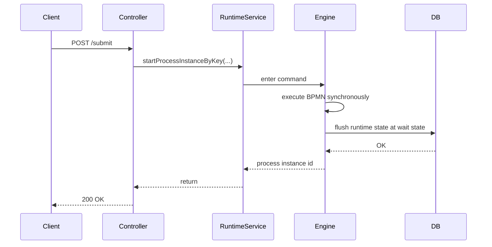

Implikasinya besar:

1. Kalau tidak ada wait state atau async boundary, proses bisa berjalan lama di thread caller.
2. Kalau delegate gagal sebelum state tersimpan, seluruh transaction segment rollback.
3. Kalau proses melakukan remote call synchronous sebelum wait state, user request ikut menanggung latency dan failure remote service.
4. Kalau model terlihat “asynchronous” secara visual tetapi tidak punya async boundary/wait state, runtime-nya bisa tetap synchronous.

---

## 3. Stable State dan Wait State

**Wait state** adalah titik di mana engine berhenti, menyimpan state process instance ke database, lalu menunggu trigger berikutnya.

Wait state natural di Camunda 7 meliputi:

- `User Task`
- `Receive Task`
- `Message Catch Event`
- `Timer Event`
- `Signal Catch Event`
- `Event-based Gateway`
- `External Task`

Model mentalnya:

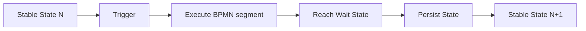

Stable state bukan berarti proses bisnis selesai. Stable state berarti engine punya posisi durable yang bisa dilanjutkan lagi nanti.

Contoh:

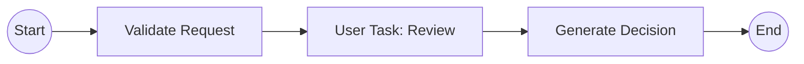

Jika start process dipanggil secara synchronous:

- `Validate Request` dieksekusi di thread caller.
- Saat mencapai `User Task: Review`, task dibuat dan state disimpan.
- Response bisa dikembalikan ke caller.
- `Generate Decision` belum dijalankan sampai user task diselesaikan.

---

## 4. Transaction Segment

Camunda mengeksekusi transisi dari satu stable state ke stable state berikutnya dalam satu transaksi.

Contoh:

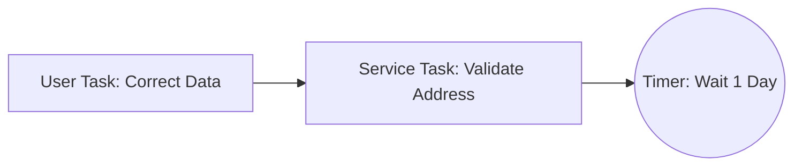

Ketika aplikasi memanggil:

```java
taskService.complete(taskId, variables);
```

Engine akan:

1. menyelesaikan user task,
2. menjalankan service task `Validate Address`,
3. membuat timer job,
4. menyimpan state di timer wait state,
5. commit transaction.

Jika `Validate Address` melempar exception yang tidak ditangani, completion user task ikut rollback. Dari perspektif database, user task masih ada.

Ini sering mengejutkan developer baru:

> “Saya sudah klik complete, kenapa task masih muncul?”

Jawabannya: karena complete task bukan event UI saja. Complete task adalah command yang dapat menjalankan segmen proses berikutnya sebelum commit.

---

## 5. Rollback Scope

Rollback scope adalah area BPMN sejak stable state terakhir sampai titik exception.

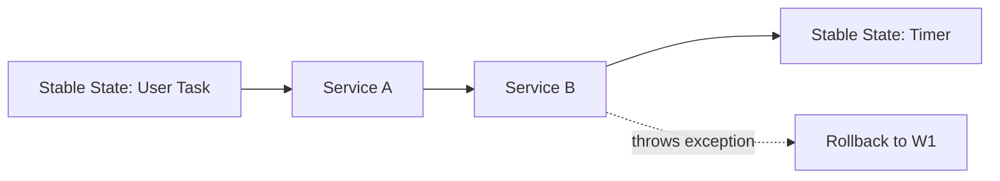

Jika `Service B` gagal:

- side effect transactional yang berada dalam DB transaction yang sama rollback,
- runtime state proses rollback ke stable state sebelumnya,
- user task dapat tetap terlihat belum selesai,
- tidak ada failed job jika eksekusi terjadi synchronously tanpa async boundary.

Perhatikan kalimat terakhir. Banyak orang berharap semua exception otomatis menjadi retry job. Tidak begitu.

Retry job terjadi ketika failure terjadi saat job executor mengeksekusi job, misalnya async continuation atau timer continuation.

---

## 6. Command Context: Cara Praktis Membaca Eksekusi Engine

Untuk penggunaan harian, kita bisa memakai model berikut:

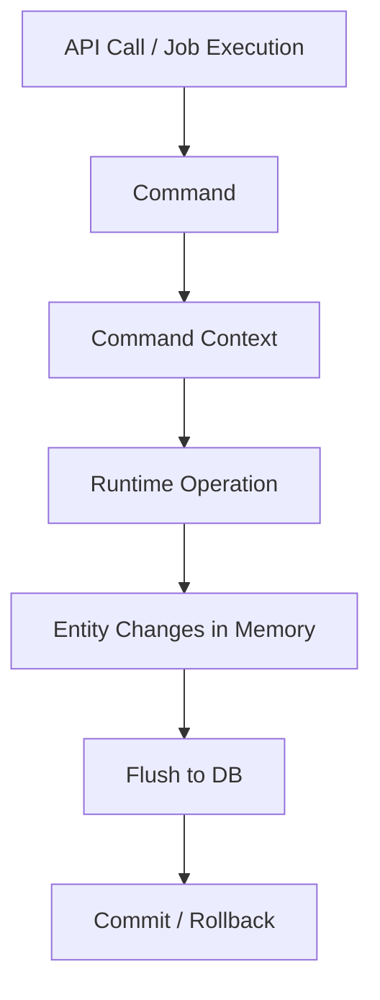

Command context adalah scope internal tempat engine mengelola operasi runtime selama command berjalan.

Contoh command:

- start process instance,
- complete task,
- correlate message,
- execute job,
- suspend process definition,
- set job retries.

Yang perlu kita pegang sebagai engineer aplikasi:

1. API call Camunda biasanya bukan “setter sederhana”. Ia bisa memicu eksekusi BPMN lanjutan.
2. Perubahan state engine di-flush di akhir command/transaction.
3. Exception yang tidak ditangani membatalkan command.
4. Listener/delegate yang dieksekusi dalam command ikut berada di boundary failure yang sama.
5. Menaruh remote call di dalam command berarti remote call itu ikut mempengaruhi commit command.

---

## 7. Synchronous Path: Cepat, Sederhana, tapi Berbahaya Jika Salah Dipakai

Synchronous path cocok untuk operasi yang:

- cepat,
- deterministic,
- tidak melakukan remote call lambat,
- tidak punya side effect irreversible,
- aman rollback,
- tidak memerlukan retry engine.

Contoh bagus:

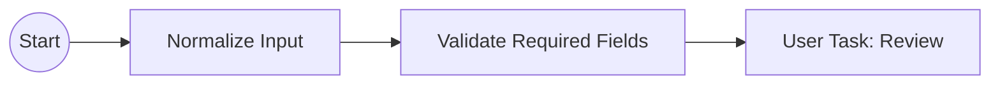

`Normalize Input` dan `Validate Required Fields` bisa synchronous bila hanya memproses data lokal.

Contoh berisiko:

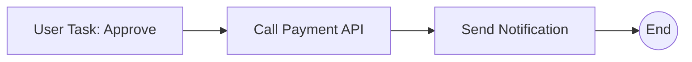

Jika user menyelesaikan approval, HTTP request Tasklist/app dapat memanggil `taskService.complete`. Lalu engine menjalankan `Call Payment API` dan `Send Notification` di transaction segment yang sama. Jika notification gagal setelah payment berhasil, transaction engine rollback, tetapi payment eksternal tidak ikut rollback.

Akibatnya:

- user task bisa muncul lagi,
- operator bisa complete lagi,
- payment API bisa terpanggil dua kali,
- audit trail terlihat membingungkan.

Ini bukan bug Camunda. Ini bug desain boundary.

---

## 8. Asynchronous Continuation

Asynchronous continuation adalah cara eksplisit menambahkan transaction boundary di sekitar activity.

Camunda menyediakan dua attribute utama:

```xml
camunda:asyncBefore="true"
camunda:asyncAfter="true"
```

Contoh:

```xml
<serviceTask id="generateInvoice"
             name="Generate Invoice"
             camunda:class="com.example.workflow.GenerateInvoiceDelegate"
             camunda:asyncBefore="true" />
```

Dengan `asyncBefore="true"`, engine akan:

1. mencapai service task,
2. membuat job,
3. commit state,
4. mengembalikan control ke caller,
5. job executor nanti mengambil job dan menjalankan delegate.

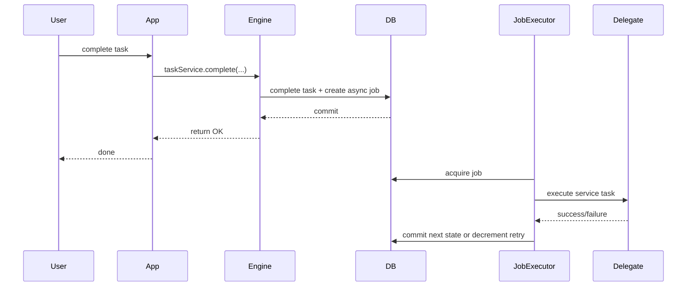

Asynchronous continuation mengubah failure semantics:

- complete user task sudah durable,
- service task failure menjadi failed job,
- retry dapat dikonfigurasi,
- incident dapat muncul jika retry habis,
- caller tidak menunggu delegate selesai.

---

## 9. `asyncBefore` vs `asyncAfter`

Gunakan pertanyaan ini:

> Boundary transaksi seharusnya berada sebelum activity dieksekusi atau setelah activity selesai?

### 9.1 `asyncBefore`

`asyncBefore` membuat job sebelum activity behavior dijalankan.

Cocok ketika:

- activity melakukan remote call,
- activity punya side effect eksternal,
- activity berat atau lambat,
- activity perlu retry engine,
- caller tidak boleh menunggu activity selesai,
- completion sebelumnya harus durable dulu.

Contoh:

```xml
<serviceTask id="sendToRegulator"
             name="Send Case to Regulator"
             camunda:delegateExpression="${sendToRegulatorDelegate}"
             camunda:asyncBefore="true" />
```

Artinya:

- state sebelum kirim regulator sudah commit,
- pengiriman dilakukan oleh job executor,
- jika gagal, job retry/incident menangani.

### 9.2 `asyncAfter`

`asyncAfter` membuat job setelah activity behavior selesai, sebelum flow keluar dari activity dilanjutkan.

Cocok ketika:

- activity harus synchronous dengan command sebelumnya,
- tetapi langkah setelahnya ingin dipisah,
- listener/behavior activity ingin commit dulu,
- gateway/join setelah activity rawan optimistic locking,
- kita ingin checkpoint setelah activity selesai.

Contoh:

```xml
<serviceTask id="calculateEligibility"
             name="Calculate Eligibility"
             camunda:delegateExpression="${eligibilityDelegate}"
             camunda:asyncAfter="true" />
```

Artinya:

- delegate eligibility berjalan dalam transaksi saat activity dimasuki,
- setelah activity selesai, engine membuat job untuk melanjutkan sequence flow berikutnya,
- failure setelah boundary tidak membatalkan delegate eligibility.

### 9.3 Natural wait state

Jangan tambahkan async boundary kalau BPMN element sudah wait state natural dan kebutuhan sudah terpenuhi.

Contoh:

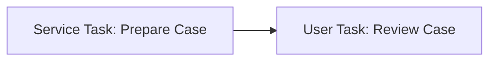

`User Task` sudah membuat stable state. Menambahkan `asyncBefore` pada user task hanya masuk akal jika pembuatan task sendiri ingin dipisah dari transaksi sebelumnya.

---

## 10. Decision Table: Pilih Boundary

| Situasi | Pilihan default | Alasan |
|---|---|---|
| Pure calculation lokal, cepat | synchronous | Tidak perlu overhead job |
| Remote HTTP call | `asyncBefore` | Side effect dan latency dipisah dari caller |
| Kirim email/notifikasi | `asyncBefore` | Retry dan incident lebih jelas |
| Setelah user complete, proses lanjut berat | `asyncBefore` pada service task berikutnya | Complete task durable dulu |
| Setelah service task, masuk parallel join rawan conflict | `asyncAfter` atau async pada gateway terkait | Membantu retry optimistic locking |
| Start process dari API harus cepat | async start event | Instance dibuat durable, eksekusi ditunda |
| Multi-instance parallel ingin benar-benar parallel | async inner activity | Setiap instance dapat menjadi job |
| Task creation harus atomik dengan validation sebelumnya | jangan async sebelum user task | Task hanya dibuat bila validation sukses |

---

## 11. Process Start Asynchronously

Start event dapat diberi `camunda:asyncBefore="true"`.

```xml
<process id="caseIntake" isExecutable="true">
  <startEvent id="start" camunda:asyncBefore="true" />
  <sequenceFlow id="flow1" sourceRef="start" targetRef="validateCase" />
  <serviceTask id="validateCase" camunda:delegateExpression="${validateCaseDelegate}" />
</process>
```

Efeknya:

- process instance dibuat dan dipersist,
- eksekusi setelah start ditunda sebagai job,
- API caller cepat mendapat response,
- execution listener setelah start tidak dieksekusi synchronously.

Gunakan saat:

- proses dimulai oleh high-throughput API,
- langkah pertama berat,
- cluster heterogen mungkin tidak memiliki class delegate di node pemanggil,
- Anda ingin semua proses masuk antrian job executor sejak awal.

Jangan gunakan hanya karena “async terlihat modern”. Gunakan bila boundary failure dan latency memang diinginkan.

---

## 12. Multi-Instance dan Async Boundary

Multi-instance activity punya dua level:

1. **multi-instance body** — container yang mengelola loop,
2. **inner activity** — activity yang dieksekusi per item.

Contoh salah kaprah:

```xml
<serviceTask id="checkDocument"
             camunda:delegateExpression="${checkDocumentDelegate}"
             camunda:asyncBefore="true">
  <multiInstanceLoopCharacteristics isSequential="false">
    <loopCardinality>${documentCount}</loopCardinality>
  </multiInstanceLoopCharacteristics>
</serviceTask>
```

Async pada activity bisa membuat body async, bukan selalu berarti setiap inner instance menjadi job terpisah sesuai niat. Untuk mengontrol inner activity, attribute Camunda dapat diletakkan pada `multiInstanceLoopCharacteristics`.

```xml
<serviceTask id="checkDocument"
             camunda:delegateExpression="${checkDocumentDelegate}">
  <multiInstanceLoopCharacteristics isSequential="false"
                                    camunda:asyncBefore="true">
    <loopCardinality>${documentCount}</loopCardinality>
  </multiInstanceLoopCharacteristics>
</serviceTask>
```

Desain multi-instance perlu menjawab:

- apakah setiap item boleh retry sendiri-sendiri?
- apakah side effect per item idempotent?
- apakah hasil partial perlu disimpan?
- apakah join setelah multi-instance rawan optimistic locking?
- apakah throughput job executor cukup?

---

## 13. Transaction Boundary dan Spring Transaction

Dalam Spring Boot embedded engine, operasi engine sering berjalan dalam konteks transaction manager yang sama dengan aplikasi. Ini nyaman, tetapi juga berbahaya bila boundary tidak jelas.

Contoh:

```java
@Service
public class ApproveCaseApplicationService {

    private final TaskService taskService;
    private final CaseRepository caseRepository;

    @Transactional
    public void approve(String taskId, String caseId) {
        caseRepository.markApproved(caseId);
        taskService.complete(taskId, Map.of("approved", true));
    }
}
```

Apa yang terjadi?

- update domain DB dan complete task bisa berada dalam transaksi yang sama,
- jika proses setelah `complete` gagal sebelum commit, update domain juga dapat rollback,
- jika delegate di proses melakukan call eksternal, external side effect tidak ikut rollback.

### Prinsip praktis

1. Jangan biarkan `taskService.complete` secara diam-diam menjalankan workflow berat dalam transaction service aplikasi.
2. Letakkan async boundary setelah user action jika langkah berikutnya side-effecting.
3. Jangan gunakan `REQUIRES_NEW` untuk “memperbaiki” desain boundary tanpa memahami audit dan consistency impact.
4. Untuk integrasi eksternal, gunakan idempotency dan outbox/inbox bila state bisnis harus konsisten.
5. Pisahkan command aplikasi dan orchestration continuation secara eksplisit.

---

## 14. Pola: Durable User Action Before Heavy Processing

Masalah:

- user mengklik Approve,
- sistem harus melakukan banyak pekerjaan setelah approval,
- user tidak boleh melihat task muncul lagi hanya karena notifikasi gagal.

Desain:

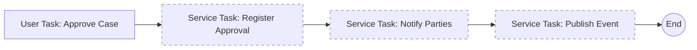

BPMN XML concept:

```xml
<serviceTask id="registerApproval"
             name="Register Approval"
             camunda:delegateExpression="${registerApprovalDelegate}"
             camunda:asyncBefore="true" />

<serviceTask id="notifyParties"
             name="Notify Parties"
             camunda:delegateExpression="${notifyPartiesDelegate}"
             camunda:asyncBefore="true" />

<serviceTask id="publishCaseEvent"
             name="Publish Case Event"
             camunda:delegateExpression="${publishCaseEventDelegate}"
             camunda:asyncBefore="true" />
```

Kelebihan:

- approval durable segera setelah user task complete,
- setiap side effect punya retry boundary,
- failure lebih mudah dilihat sebagai failed job/incident,
- operator tahu titik gagal tepat.

Kekurangan:

- lebih banyak job,
- latency end-to-end bertambah,
- perlu monitoring job backlog,
- perlu idempotency di delegate.

---

## 15. Pola: Synchronous Validation Before Task Creation

Masalah:

- sebelum user task dibuat, data harus valid,
- jika data tidak valid, task tidak boleh muncul.

Desain:

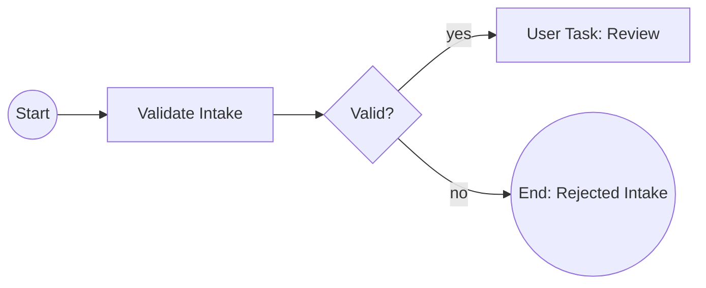

`Validate Intake` boleh synchronous bila hanya validasi lokal cepat. Jangan memberi `asyncBefore` hanya karena semua service task dibuat async. Kalau async, process instance bisa berhenti di job validation, bukan langsung menghasilkan task/rejection.

Boundary yang benar mengikuti invariant bisnis:

> Review task hanya boleh ada bila intake valid.

---

## 16. Pola: Retryable External Side Effect

Masalah:

- proses harus memanggil service eksternal,
- service bisa timeout,
- retry aman bila idempotency key digunakan.

Desain delegate:

```java
@Component
public class SendCaseToExternalSystemDelegate implements JavaDelegate {

    private final ExternalCaseClient client;

    @Override
    public void execute(DelegateExecution execution) {
        String caseId = (String) execution.getVariable("caseId");
        String processInstanceId = execution.getProcessInstanceId();

        String idempotencyKey = "send-case:" + processInstanceId + ":" + caseId;

        client.sendCase(new SendCaseRequest(caseId), idempotencyKey);
    }
}
```

BPMN:

```xml
<serviceTask id="sendCase"
             name="Send Case"
             camunda:delegateExpression="${sendCaseToExternalSystemDelegate}"
             camunda:asyncBefore="true">
  <extensionElements>
    <camunda:failedJobRetryTimeCycle>R5/PT5M</camunda:failedJobRetryTimeCycle>
  </extensionElements>
</serviceTask>
```

Catatan:

- retry tanpa idempotency adalah duplikasi menunggu terjadi,
- idempotency key sebaiknya stabil per business operation,
- jangan gunakan random UUID baru setiap retry,
- simpan external response bila diperlukan untuk audit.

---

## 17. Pola: Asynchronous Boundary Around Gateway Conflict

Parallel flow dapat menghasilkan optimistic locking saat beberapa job mencoba update execution tree yang sama.

Desain umum:

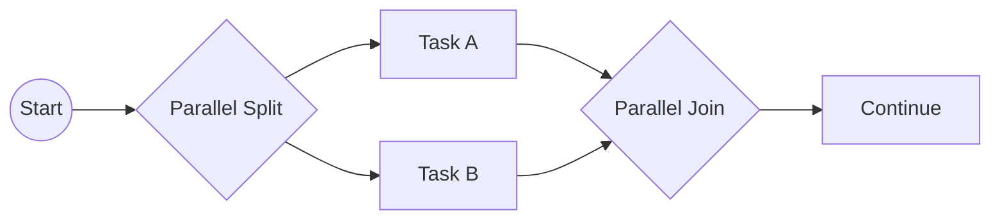

Jika `Task A` dan `Task B` async dan selesai hampir bersamaan, join dapat menjadi titik conflict. Camunda biasanya menangani optimistic locking sebagai retryable conflict, bukan business failure. Namun boundary harus memungkinkan retry.

Praktik:

- pastikan branch asynchronous punya retry aman,
- pertimbangkan async continuation di gateway/join bila dibutuhkan,
- hindari side effect non-idempotent tepat sebelum join tanpa checkpoint,
- jangan menganggap parallel BPMN berarti semua aman secara business.

---

## 18. Anti-Pattern: Async Everywhere

Gejala:

- semua service task diberi `asyncBefore="true"`,
- proses menghasilkan ribuan job kecil,
- latency meningkat,
- debugging makin sulit,
- operator melihat banyak failed job tanpa konteks bisnis,
- database job table menjadi bottleneck.

Async boundary bukan dekorasi. Ia adalah **pemisah transaksi dan retry unit**.

Gunakan async ketika ada alasan:

- failure perlu retry,
- latency perlu dipisah,
- side effect perlu checkpoint,
- throughput perlu dikontrol,
- transaction segment terlalu panjang,
- cluster/deployment membutuhkan job executor.

Jangan gunakan hanya untuk “best practice”.

---

## 19. Anti-Pattern: Synchronous Remote Call After User Complete

Contoh buruk:

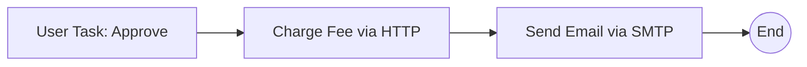

Tanpa async boundary:

- user action bergantung pada HTTP fee service,
- email failure bisa rollback complete task,
- fee charge bisa terjadi tetapi process state rollback,
- retry manual dapat charge ulang.

Perbaikan:

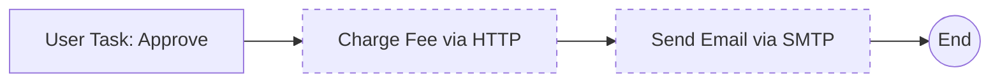

Tambahkan:

- `asyncBefore` pada `Charge Fee`,
- idempotency key untuk charge,
- retry cycle yang sesuai,
- incident runbook,
- business compensation bila charge berhasil tetapi downstream gagal.

---

## 20. Anti-Pattern: Swallow Exception in Delegate

Contoh buruk:

```java
@Component
public class NotifyDelegate implements JavaDelegate {
    @Override
    public void execute(DelegateExecution execution) {
        try {
            // call notification API
        } catch (Exception e) {
            log.warn("Notification failed", e);
        }
    }
}
```

Masalah:

- engine menganggap activity sukses,
- tidak ada retry,
- tidak ada incident,
- proses lanjut dengan state palsu,
- audit menyatakan step completed padahal side effect gagal.

Perbaikan:

```java
@Component
public class NotifyDelegate implements JavaDelegate {
    @Override
    public void execute(DelegateExecution execution) {
        // Let technical failure fail the job.
        notificationClient.notifyCase(
            (String) execution.getVariable("caseId"),
            "notify:" + execution.getProcessInstanceId()
        );
    }
}
```

Tangani expected business condition dengan BPMN error hanya bila memang bagian dari domain path. Tangani technical failure sebagai exception agar retry/incident bekerja.

---

## 21. Boundary Placement by Business Invariant

Jangan mulai dari pertanyaan teknis:

> “Task ini async atau tidak?”

Mulai dari invariant:

- Apa yang harus sudah durable sebelum step ini mulai?
- Apa yang boleh rollback bersama step ini?
- Apa yang tidak boleh rollback karena sudah terlihat user/external system?
- Apa yang harus retry otomatis?
- Apa yang harus berhenti untuk operator?
- Apa yang perlu audit sebagai separate attempt?

Contoh regulatory case:

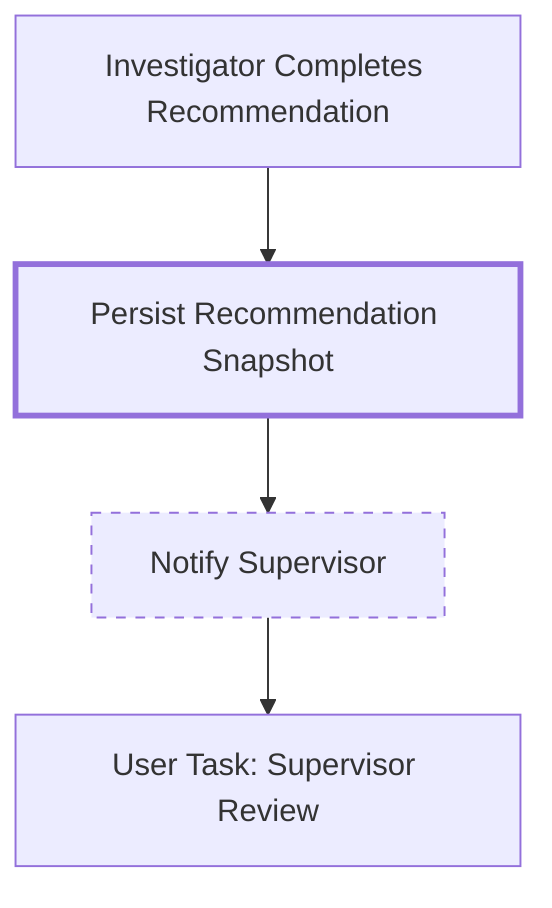

Invariant:

- recommendation snapshot harus durable setelah investigator submit,
- notification boleh retry,
- supervisor task bisa dibuat setelah snapshot durable,
- notification failure tidak boleh membatalkan recommendation submission.

Maka boundary mungkin:

- `Persist Recommendation Snapshot` synchronous atau async tergantung implementasi,
- `Notify Supervisor` `asyncBefore`,
- `Supervisor Review` natural wait state.

---

## 22. Observability of Transaction Boundaries

Transaction boundary harus terlihat di observability:

| Pertanyaan operasional | Data yang perlu tersedia |
|---|---|
| Step mana yang gagal? | activity id, job id, process instance id |
| Failure terjadi sebelum atau setelah user action durable? | activity id + previous wait state |
| Retry keberapa? | job retries, exception log |
| Apakah side effect sudah terkirim? | idempotency key, external request id |
| Apakah process berhenti di incident? | incident query, job query |
| Apakah rollback terjadi? | history/user operation log/domain audit |

Logging delegate minimal:

```java
log.info("Executing activity: processInstanceId={}, activityId={}, businessKey={}",
    execution.getProcessInstanceId(),
    execution.getCurrentActivityId(),
    execution.getBusinessKey());
```

Jangan log sensitive variable mentah. Gunakan business key, process instance id, activity id, dan correlation id.

---

## 23. Testing Transaction Boundary

Test boundary bukan hanya “process ends”. Test harus membuktikan state rollback/retry sesuai desain.

### 23.1 Test synchronous rollback

Scenario:

- process berada di user task,
- complete task memicu service task yang throw exception,
- karena tidak ada async boundary, user task harus tetap ada.

Pseudo-test:

```java
@Test
void completeTask_rollsBack_whenNextSynchronousDelegateFails() {
    ProcessInstance pi = runtimeService.startProcessInstanceByKey("syncFailureProcess");
    Task task = taskService.createTaskQuery()
        .processInstanceId(pi.getId())
        .singleResult();

    assertThrows(RuntimeException.class, () -> taskService.complete(task.getId()));

    Task stillThere = taskService.createTaskQuery()
        .processInstanceId(pi.getId())
        .singleResult();

    assertThat(stillThere).isNotNull();
}
```

### 23.2 Test async failure creates failed job

Scenario:

- process reaches async service task,
- complete previous task succeeds,
- job execution fails,
- retries decrement or incident appears.

Pseudo-test:

```java
@Test
void asyncServiceTask_failure_becomesFailedJob() {
    ProcessInstance pi = runtimeService.startProcessInstanceByKey("asyncFailureProcess");

    Task task = taskService.createTaskQuery()
        .processInstanceId(pi.getId())
        .singleResult();

    taskService.complete(task.getId());

    Job job = managementService.createJobQuery()
        .processInstanceId(pi.getId())
        .singleResult();

    assertThrows(Exception.class, () -> managementService.executeJob(job.getId()));

    Job failedJob = managementService.createJobQuery()
        .processInstanceId(pi.getId())
        .singleResult();

    assertThat(failedJob.getRetries()).isLessThan(3);
}
```

### 23.3 Test idempotency key stability

Delegate test:

```java
@Test
void delegate_usesStableIdempotencyKey() {
    DelegateExecution execution = mockExecution(
        "processInstance-123",
        "case-456"
    );

    delegate.execute(execution);
    delegate.execute(execution);

    verify(client, times(2)).sendCase(
        any(),
        eq("send-case:processInstance-123:case-456")
    );
}
```

---

## 24. Production Checklist

Sebelum deploy BPMN, review setiap segment antar wait state:

```txt
[ ] Apa stable state sebelum segment ini?
[ ] Apa stable state berikutnya?
[ ] Activity mana yang berjalan dalam satu transaction?
[ ] Apakah ada remote call di segment synchronous?
[ ] Apakah ada side effect irreversible?
[ ] Apakah user action bisa rollback secara mengejutkan?
[ ] Apakah boundary retry diletakkan sebelum side effect?
[ ] Apakah delegate idempotent?
[ ] Apakah retry cycle sesuai karakter failure?
[ ] Apakah incident punya runbook?
[ ] Apakah variable yang dibutuhkan sudah durable sebelum async job?
[ ] Apakah observability cukup untuk operator?
[ ] Apakah test membuktikan rollback/retry behavior?
```

---

## 25. Heuristics for Top 1% Engineering Judgment

### 25.1 Treat BPMN as transaction topology

Diagram BPMN bukan hanya control flow. Ia adalah topology transaksi:

- di mana state commit,
- di mana rollback,
- di mana retry,
- di mana operator bisa intervensi,
- di mana audit snapshot harus diambil.

### 25.2 Side effect must have one owner

Jika service task melakukan external side effect, tentukan owner retry:

- Camunda job retry,
- external worker retry,
- message broker retry,
- domain outbox dispatcher retry.

Jangan punya retry berlapis tanpa idempotency.

### 25.3 Async boundary is a contract

`asyncBefore` bukan detail teknis. Ia mengubah kontrak user/application:

- API bisa return sebelum pekerjaan selesai,
- failure muncul di Cockpit/incident,
- state sebelumnya durable,
- operator perlu playbook.

### 25.4 Rollback is not compensation

Database rollback hanya membatalkan transaksi lokal. Jika external payment, email, notification, ticket booking, atau regulator submission sudah terjadi, rollback Camunda tidak membatalkan dunia nyata.

Untuk dunia nyata, desain compensation, cancellation, reversal, atau manual repair.

---

## 26. Mini Case Study: Enforcement Case Submission

Scenario:

- investigator submit enforcement recommendation,
- sistem menyimpan snapshot recommendation,
- sistem membuat supervisor review task,
- sistem mengirim notification,
- sistem menerbitkan event ke case timeline.

Desain naif:

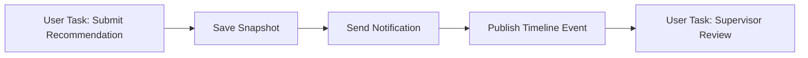

Jika semua synchronous, notification failure bisa rollback submit recommendation. Itu buruk untuk defensibility.

Desain lebih baik:

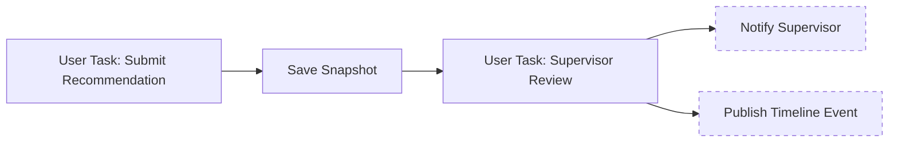

Tergantung invariant, `Save Snapshot` mungkin synchronous agar task supervisor hanya dibuat setelah snapshot tersimpan. Notification dan timeline event bisa async, retryable, dan idempotent.

Alternatif jika timeline event harus durable sebelum supervisor melihat task:

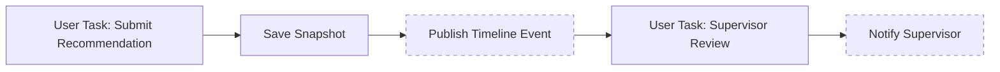

Keputusan bukan soal preferensi diagram. Keputusan mengikuti audit invariant.

---

## 27. Latihan Deliberate Practice

### Latihan 1 — Tandai boundary

Ambil satu BPMN yang sudah Anda buat. Tandai:

- natural wait state,
- async boundary,
- transaction segment,
- side effect,
- rollback target.

Output yang benar berupa diagram annotated.

### Latihan 2 — Failure injection

Untuk setiap service task:

- buat delegate melempar exception,
- amati apakah user task rollback atau failed job terbentuk,
- cocokkan dengan desain yang Anda harapkan.

### Latihan 3 — Ubah boundary

Ambil satu process:

1. jalankan tanpa async,
2. tambahkan `asyncBefore` pada service task pertama setelah user task,
3. tambahkan retry cycle,
4. amati perubahan runtime behavior.

### Latihan 4 — Idempotency review

Untuk setiap service task yang melakukan external call, tulis:

```txt
operationName:
idempotencyKey:
externalSystem:
retryOwner:
safeToRetry: yes/no
compensationNeeded: yes/no
operatorActionWhenIncident:
```

---

## 28. Ringkasan

Hal yang harus melekat setelah part ini:

1. Camunda 7 engine bekerja di thread caller sampai mencapai wait state atau async boundary.
2. Wait state adalah stable state tempat process instance dipersist.
3. Transaction segment berjalan dari stable state ke stable state berikutnya.
4. Exception synchronous rollback ke stable state sebelumnya.
5. Async continuation membuat job dan memindahkan eksekusi ke job executor.
6. `asyncBefore` memisahkan pekerjaan sebelum activity dimulai.
7. `asyncAfter` memisahkan continuation setelah activity selesai.
8. Boundary harus dipilih berdasarkan invariant bisnis, bukan kebiasaan.
9. Remote side effect harus idempotent bila dieksekusi dalam retryable job.
10. Production-grade BPMN selalu punya transaction boundary review.

---

## 29. Referensi

- Camunda 7.24 Docs — Transactions in Processes: `https://docs.camunda.org/manual/7.24/user-guide/process-engine/transactions-in-processes/`
- Camunda 7.24 Docs — The Job Executor: `https://docs.camunda.org/manual/7.24/user-guide/process-engine/the-job-executor/`
- Camunda 7.24 Docs — Error Handling: `https://docs.camunda.org/manual/7.24/user-guide/process-engine/error-handling/`
- Camunda 7.24 Docs — BPMN 2.0 Reference: `https://docs.camunda.org/manual/7.24/reference/bpmn20/`
