# Part 012 — Job Executor Internals: Acquisition, Locking, Retries, and Priorities

Part ini membahas salah satu komponen paling penting di Camunda 7 production: **job executor**.

Pada Part 011 kita sudah melihat bahwa `asyncBefore`, `asyncAfter`, timer, dan beberapa event membuat engine berhenti dan membuat job. Part ini menjawab pertanyaan berikutnya:

- Job itu disimpan di mana?
- Kapan job dianggap siap dieksekusi?
- Bagaimana cluster mencegah job sama dijalankan dua node?
- Mengapa job kadang lambat mulai walaupun sudah dibuat?
- Bagaimana retries dan incident terbentuk?
- Apa itu exclusive job?
- Kapan job priority berguna?
- Kenapa job executor bukan message broker?

Targetnya bukan hanya bisa mengubah konfigurasi. Targetnya adalah bisa melakukan **failure modelling** dan **capacity reasoning** terhadap Camunda runtime.

---

## 1. Kaufman Deconstruction

Skill “menguasai job executor” kita pecah menjadi sub-skill berikut:

| Sub-skill | Output kemampuan |
|---|---|
| Membaca job lifecycle | Bisa menjelaskan create → acquire → lock → execute → commit/fail |
| Membaca job table | Bisa memahami makna `ACT_RU_JOB`, `LOCK_OWNER_`, `LOCK_EXP_TIME_`, `RETRIES_`, `DUEDATE_` |
| Mendesain retry | Bisa memilih retry count dan interval sesuai failure mode |
| Mendesain concurrency | Bisa menjelaskan exclusive jobs, parallel execution, optimistic locking |
| Mendesain cluster behavior | Bisa memilih deployment-aware atau homogeneous deployment |
| Mendesain priority | Bisa mengurutkan pekerjaan saat backlog tinggi |
| Mengoperasikan failed jobs | Bisa membuat runbook retry, repair, dan incident handling |

Mental model utama:

> Job executor adalah mekanisme internal Camunda untuk melanjutkan process execution secara asynchronous, bukan general-purpose queue untuk semua integration workload.

---

## 2. Apa Itu Job?

Job adalah representasi durable dari pekerjaan yang harus dilakukan engine nanti.

Camunda membuat job untuk beberapa hal, terutama:

- asynchronous continuation,
- timer event,
- asynchronous event handling,
- batch operations tertentu,
- history cleanup dan operation internal tertentu.

Dalam konteks BPMN, job paling sering muncul dari:

```xml
<serviceTask id="sendEmail"
             camunda:delegateExpression="${sendEmailDelegate}"
             camunda:asyncBefore="true" />
```

atau timer:

```xml
<intermediateCatchEvent id="waitForCoolingPeriod">
  <timerEventDefinition>
    <timeDuration>PT24H</timeDuration>
  </timerEventDefinition>
</intermediateCatchEvent>
```

Lifecycle dasar:

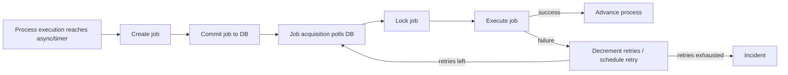

---

## 3. Job Creation

Job creation terjadi dalam transaction segment yang sedang berjalan.

Contoh:


Jika `Charge Fee` diberi `asyncBefore`, maka saat user task selesai:

1. engine menyelesaikan user task,
2. engine mencapai `Charge Fee`,
3. engine membuat job untuk `Charge Fee`,
4. engine commit,
5. job executor nanti menjalankan `Charge Fee`.

Penting: job tidak dieksekusi sebelum transaction yang membuat job commit. Kalau transaction rollback, job juga hilang.

---

## 4. `ACT_RU_JOB`: Runtime Table Mental Model

Camunda menyimpan job runtime di table `ACT_RU_JOB`.

Beberapa kolom penting:

| Kolom | Makna praktis |
|---|---|
| `ID_` | ID job |
| `REV_` | Revision untuk optimistic locking |
| `DUEDATE_` | Kapan job eligible dieksekusi |
| `LOCK_OWNER_` | Executor/node yang mengunci job |
| `LOCK_EXP_TIME_` | Sampai kapan lock valid |
| `RETRIES_` | Sisa retry job |
| `EXCEPTION_MSG_` | Ringkasan failure terakhir |
| `EXCEPTION_STACK_ID_` | Referensi stack trace exception |
| `JOB_DEF_ID_` | Referensi job definition |
| `PROCESS_INSTANCE_ID_` | Process instance terkait |
| `EXECUTION_ID_` | Execution terkait |

Jangan menjadikan table ini sebagai public integration API. Boleh dipahami untuk debugging dan observability, tetapi mutation harus lewat API Camunda.

Query SQL ad-hoc untuk observasi boleh sangat hati-hati, misalnya di read replica atau runbook terbatas. Direct update ke runtime table adalah anti-pattern berat.

---

## 5. Acquirable Job

Job executor tidak mengeksekusi semua job. Ia mencari job yang **acquirable**.

Secara praktis, job acquirable bila:

- due date sudah lewat atau null sesuai konfigurasi,
- retries masih lebih dari 0,
- tidak sedang terkunci oleh executor lain,
- tidak suspended,
- sesuai deployment awareness bila fitur itu aktif,
- sesuai priority/range bila dikonfigurasi.

Diagram:

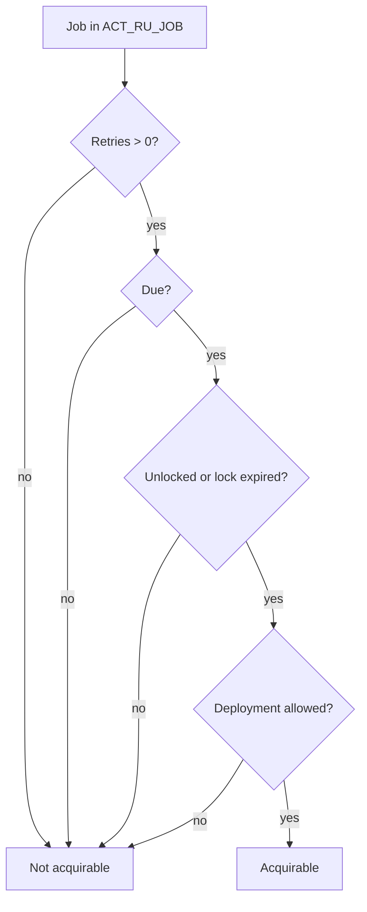

---

## 6. Two Phases of Job Acquisition

Camunda job acquisition punya dua fase besar:

1. query job yang eligible,
2. lock job tersebut.

Locking diperlukan karena dalam cluster beberapa node bisa polling table yang sama.

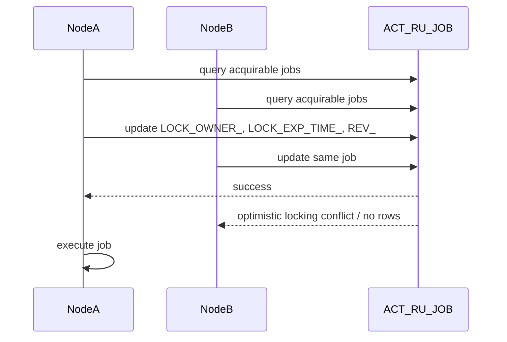

Lock bukan distributed lock service eksternal. Lock adalah update database pada row job.

Kolom utama:

- `LOCK_OWNER_`: identitas executor,
- `LOCK_EXP_TIME_`: waktu lock expired,
- `REV_`: optimistic locking revision.

Jika node mati setelah lock job, job tidak hilang. Setelah `LOCK_EXP_TIME_` lewat, job bisa di-acquire lagi.

Implikasi:

- lock duration harus lebih panjang dari expected execution time,
- delegate yang terlalu lama bisa menyebabkan lock expired saat masih berjalan,
- retry harus idempotent karena job bisa diambil lagi setelah failure/crash,
- monitoring harus melihat lock expired dan backlog.

---

## 7. Acquisition Order: Non-Deterministic by Default

Secara default, job acquisition tidak memberi ordering kuat. Urutan bergantung pada database dan query plan.

Ini penting. Jangan mendesain proses dengan asumsi:

- job A selalu dieksekusi sebelum job B,
- timer yang due lebih lama pasti diproses dulu,
- process instance lebih tua selalu selesai dulu,
- branch parallel selalu diproses urutan diagram.

Kalau urutan penting, modelkan secara eksplisit dengan BPMN dependency, bukan berharap job executor mengambil urutan tertentu.

Contoh salah:

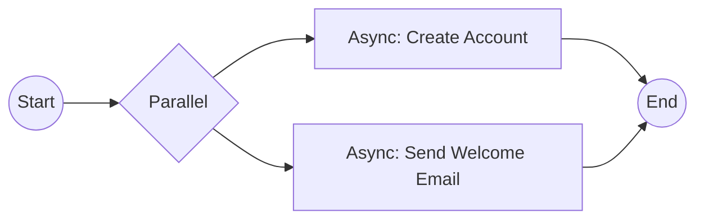

Jika email membutuhkan account sudah dibuat, desain ini salah. Gunakan sequence flow atau event dependency.

---

## 8. Job Execution

Setelah job terkunci, job dipindahkan ke execution thread pool. Dalam embedded process engine, implementasi default memakai `ThreadPoolExecutor`; di Java EE/app server, thread management mengikuti container.

Eksekusi job berarti engine menjalankan command untuk melanjutkan process execution dari titik job.

Contoh async service task:

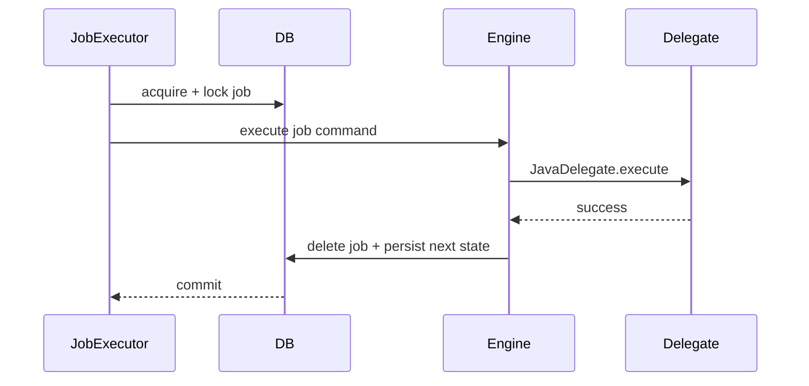

Jika delegate gagal:

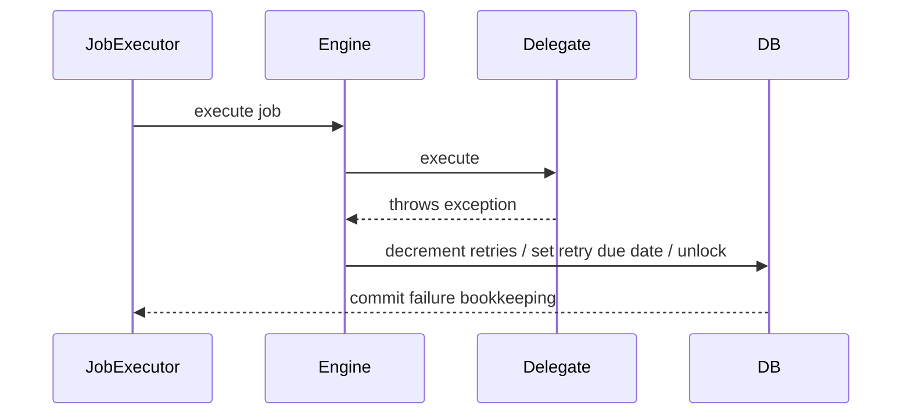

---

## 9. Failed Jobs dan Retries

Saat job gagal karena exception teknis:

- transaksi job rollback untuk perubahan proses yang belum commit,
- job bookkeeping failure dilakukan,
- retries berkurang,
- lock owner dan lock expiration dibersihkan atau due date retry diatur,
- job akan diambil lagi sesuai retry schedule,
- bila retries habis, process berhenti pada job itu,
- incident dapat dibuat jika incident creation aktif.

Jangan samakan failed job dengan BPMN error.

| Kondisi | Makna |
|---|---|
| BPMN error | Business-defined alternative path |
| Failed job | Technical failure saat job execution |
| Incident | Operational signal bahwa engine tidak bisa lanjut otomatis |
| Optimistic locking exception | Concurrency conflict yang biasanya retryable dan tidak dianggap business failure |

---

## 10. Default Retry Behavior dan Retry Time Cycle

Dokumentasi Camunda menjelaskan failed job secara default diretry tiga kali. Dalam konfigurasi produksi, jangan mengandalkan default secara buta.

Gunakan retry cycle yang cocok dengan failure mode.

Contoh global configuration:

```xml
<process-engine name="default">
  <properties>
    <property name="failedJobRetryTimeCycle">R5/PT5M</property>
  </properties>
</process-engine>
```

Makna `R5/PT5M`:

- maksimal 5 retry,
- delay 5 menit.

Contoh lokal pada service task:

```xml
<serviceTask id="sendRegulatoryNotice"
             name="Send Regulatory Notice"
             camunda:delegateExpression="${sendRegulatoryNoticeDelegate}"
             camunda:asyncBefore="true">
  <extensionElements>
    <camunda:failedJobRetryTimeCycle>R10/PT15M</camunda:failedJobRetryTimeCycle>
  </extensionElements>
</serviceTask>
```

Gunakan lokal retry untuk step yang punya karakter failure berbeda.

---

## 11. Retry Design by Failure Type

| Failure type | Retry strategy | Catatan |
|---|---|---|
| transient network timeout | retry beberapa kali dengan delay | wajib idempotency |
| external service maintenance | retry lebih panjang, mungkin operator alert | jangan retry terlalu rapat |
| validation data buruk | jangan retry otomatis terlalu banyak | butuh data correction/manual task |
| authentication/config error | retry sedikit lalu incident | operator harus fix config |
| downstream rate limit | retry dengan backoff lebih panjang | pertimbangkan queue/worker throttling |
| optimistic locking | engine retry-friendly | jangan jadikan incident bisnis |
| bug delegate | retry tidak membantu | fail fast + incident + hotfix |

Anti-pattern:

```xml
<camunda:failedJobRetryTimeCycle>R100/PT1S</camunda:failedJobRetryTimeCycle>
```

Ini bisa membanjiri database dan external service. Retry bukan pengganti desain resilience.

---

## 12. Incident Creation

Incident adalah sinyal operasional bahwa engine tidak bisa melanjutkan eksekusi otomatis.

Dalam failed job scenario, incident biasanya muncul ketika retries habis.

Operator perlu tahu:

- process instance mana,
- activity mana,
- exception terakhir apa,
- job id mana,
- business key apa,
- apakah retry aman,
- apakah data perlu diperbaiki,
- apakah external side effect sudah terjadi.

Runbook minimal:

```txt
Incident: sendRegulatoryNotice failed
1. Inspect businessKey and processInstanceId.
2. Check external notice API status.
3. Check whether notice was already accepted using idempotency key.
4. If external system down: wait or set retries after recovery.
5. If data invalid: correct process variable/domain data through approved tool.
6. If delegate bug: deploy fix, then retry job.
7. Document operator action in case audit log.
```

---

## 13. Manual Job Execution in Tests

Di unit/integration test, background job executor sering dimatikan agar test deterministic. Gunakan `ManagementService` untuk mencari dan mengeksekusi job manual.

```java
Job job = managementService.createJobQuery()
    .processInstanceId(processInstance.getId())
    .singleResult();

managementService.executeJob(job.getId());
```

Ini membantu test:

- async continuation,
- timer continuation,
- failure retry,
- incident creation,
- process path setelah job success.

Test sebaiknya tidak `Thread.sleep` menunggu job executor kecuali benar-benar integration test runtime. Untuk process behavior, manual execution lebih deterministic.

---

## 14. Timer Jobs

Timer event juga menghasilkan job.

```xml
<boundaryEvent id="reviewSlaTimer" attachedToRef="reviewTask" cancelActivity="false">
  <timerEventDefinition>
    <timeDuration>PT48H</timeDuration>
  </timerEventDefinition>
</boundaryEvent>
```

Timer job memiliki due date sesuai timer definition. Job executor hanya mengambil timer ketika due.

Implications:

- timezone dan clock harus konsisten,
- cluster node time drift berbahaya,
- backlog job executor dapat membuat timer terlambat dieksekusi,
- timer due bukan guarantee dieksekusi tepat pada detik itu,
- high-volume timer harus diperlakukan sebagai capacity concern.

Timer bukan scheduler real-time presisi tinggi. Timer adalah durable workflow continuation.

---

## 15. Backoff Strategy

Job acquisition tidak polling database secara agresif terus-menerus. Ada backoff strategy untuk mengurangi konflik acquisition di cluster dan mengurangi load saat tidak ada job due.

Dampaknya:

- job baru bisa punya delay sebelum dieksekusi,
- delay dapat lebih terasa saat sistem idle lalu job baru muncul,
- konfigurasi seperti `maxWait` mempengaruhi respons acquisition,
- menurunkan delay meningkatkan database polling load.

Jangan langsung menaikkan thread pool ketika job lambat. Pertama bedakan:

- acquisition delay,
- execution saturation,
- database bottleneck,
- lock contention,
- retry storm,
- external dependency latency.

---

## 16. Exclusive Jobs

Camunda membuat asynchronous continuation dan timer event sebagai exclusive job secara default.

Exclusive job berarti job dari process instance yang sama tidak dieksekusi bersamaan oleh job executor, sejauh engine dapat mengatur saat acquisition.

Tujuannya:

- mengurangi optimistic locking exception,
- menghindari side effect paralel dari instance yang sama,
- menjaga behavior lebih intuitif.

Contoh parallel branches:

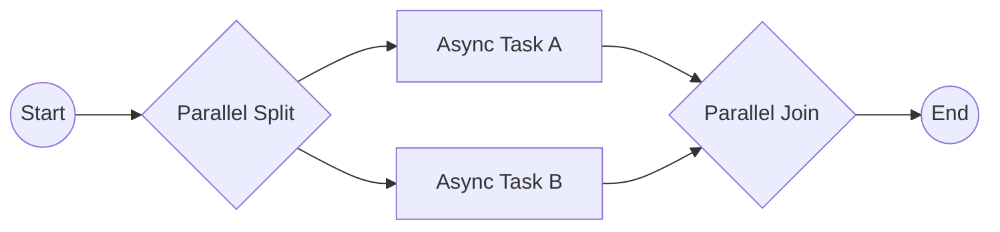

Dengan exclusive jobs default, engine berusaha menjalankan job dari process instance yang sama secara sequential di worker thread yang sama. Ini tidak berarti semua proses global menjadi sequential. Process instance lain tetap bisa berjalan parallel.

---

## 17. Non-Exclusive Jobs

Anda bisa mematikan exclusivity:

```xml
<serviceTask id="independentCheck"
             camunda:delegateExpression="${independentCheckDelegate}"
             camunda:asyncBefore="true"
             camunda:exclusive="false" />
```

Gunakan hanya jika:

- aktivitas benar-benar independen,
- tidak update variable/process state yang sama secara konflik,
- side effect idempotent,
- Anda menerima risiko optimistic locking/retry,
- throughput per instance lebih penting daripada sequential safety.

Pertanyaan review:

```txt
[ ] Apakah job ini membaca/menulis variable yang sama dengan branch lain?
[ ] Apakah job ini memanggil external system yang tidak idempotent?
[ ] Apakah parallelism per process instance benar-benar dibutuhkan?
[ ] Apakah test sudah mensimulasikan concurrency?
[ ] Apakah operator paham retry duplicate possibility?
```

Default exclusive jobs biasanya benar untuk sistem bisnis.

---

## 18. Optimistic Locking Exception

Optimistic locking adalah mekanisme concurrency control ketika dua command mencoba update entity runtime yang sama.

Contoh:

- dua job parallel mencapai join bersamaan,
- dua message correlation bersamaan update execution sama,
- user dan timer boundary race,
- batch operation dan runtime command bersamaan.

Optimistic locking exception biasanya bukan bug bisnis. Ia sering merupakan conflict teknis yang bisa diselesaikan dengan retry.

Namun, retry aman hanya jika side effect sebelum conflict aman.

Masalah klasik:

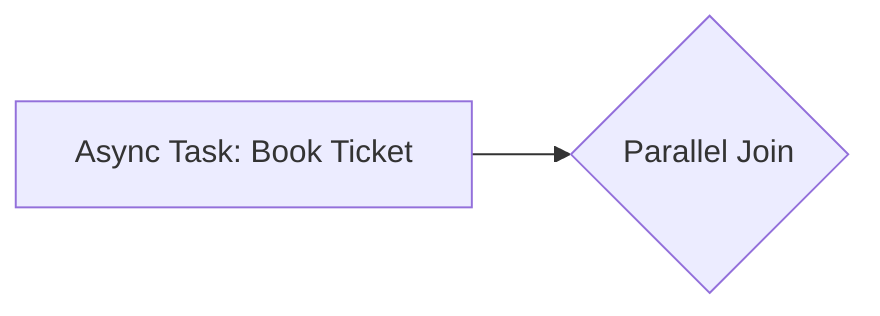

Jika `Book Ticket` memanggil external system lalu conflict di join membuat transaction rollback dan job retry, ticket bisa ter-book dua kali bila idempotency tidak ada.

Prinsip:

> Optimistic locking retry aman untuk state engine. Ia tidak otomatis aman untuk dunia eksternal.

---

## 19. Job Priorities

Job priority berguna saat backlog lebih besar dari kapasitas executor. Tanpa priority, job acquisition order tidak menjamin pekerjaan penting didahulukan.

Use case:

- VIP/high-risk case harus diproses lebih dulu,
- SLA-critical timers harus didahulukan,
- batch maintenance tidak boleh mengalahkan user-facing workflow,
- regulatory deadline lebih penting dari notification non-critical.

Contoh process-level priority:

```xml
<process id="urgentEnforcementCase"
         isExecutable="true"
         camunda:jobPriority="100" />
```

Contoh activity-level priority:

```xml
<serviceTask id="notifyRegulator"
             camunda:delegateExpression="${notifyRegulatorDelegate}"
             camunda:asyncBefore="true"
             camunda:jobPriority="200" />
```

Priority expression:

```xml
<serviceTask id="riskBasedProcessing"
             camunda:delegateExpression="${riskBasedDelegate}"
             camunda:asyncBefore="true"
             camunda:jobPriority="${caseRisk == 'HIGH' ? 300 : 50}" />
```

Agar acquisition memakai priority, konfigurasi engine harus mengaktifkan acquisition by priority, misalnya `jobExecutorAcquireByPriority=true`.

---

## 20. Priority Design Rules

Priority bukan ranking ego. Priority adalah policy saat sistem overload.

| Rule | Reasoning |
|---|---|
| Gunakan range kecil dan jelas | Terlalu banyak level sulit dioperasikan |
| Dokumentasikan makna setiap range | Operator tahu kenapa job tertentu didahulukan |
| Hindari semua job priority tinggi | Kalau semua urgent, tidak ada yang urgent |
| Pisahkan batch vs user-facing | Batch bisa starvation jika salah konfigurasi |
| Monitor starvation | High priority terus-menerus bisa membuat low priority tertahan |
| Test backlog scenario | Priority hanya terasa saat load tinggi |

Contoh policy:

| Priority | Meaning |
|---:|---|
| 1000 | Regulatory deadline breach prevention |
| 500 | User-facing case progression |
| 200 | Normal workflow continuation |
| 50 | Notification and non-critical side effect |
| 10 | Batch cleanup/non-urgent maintenance |

---

## 21. Deployment-Aware Job Executor

Dalam cluster homogen, semua node punya deployment/classes yang sama. Job apa pun bisa dijalankan node mana pun.

Dalam cluster heterogen, node A mungkin punya process application A, node B punya process application B. Jika node A mengambil job yang membutuhkan class delegate hanya ada di node B, failure seperti `ClassNotFoundException` bisa terjadi.

Deployment-aware job executor membatasi acquisition agar node hanya mengambil job dari deployment yang terdaftar pada engine/node tersebut.

Konfigurasi concept:

```xml
<process-engine name="default">
  <properties>
    <property name="jobExecutorDeploymentAware">true</property>
  </properties>
</process-engine>
```

Gunakan deployment-aware bila:

- cluster heterogen,
- process application tidak dideploy ke semua node,
- shared database dipakai beberapa runtime,
- classpath delegate berbeda per node.

Jangan gunakan sebagai pengganti deployment discipline. Lebih baik cluster production dibuat homogen bila memungkinkan.

---

## 22. Homogeneous vs Heterogeneous Cluster

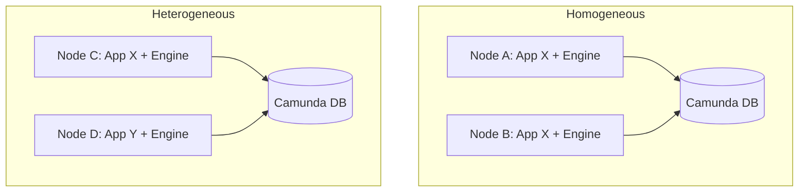

Homogeneous lebih sederhana:

- semua delegate tersedia di semua node,
- job bisa dieksekusi node mana pun,
- scaling horizontal lebih mudah,
- failure classpath lebih rendah.

Heterogeneous lebih kompleks:

- butuh deployment-aware acquisition,
- monitoring per deployment lebih penting,
- version compatibility lebih sulit,
- rolling deployment butuh perhatian ekstra.

Top 1% judgement:

> Jika Anda tidak punya alasan kuat untuk heterogeneous process application cluster, pilih homogeneous runtime untuk mengurangi failure mode.

---

## 23. Job Executor Is Not a Message Broker

Camunda job table sering terlihat seperti queue. Namun jangan salah:

| Job Executor | Message Broker |
|---|---|
| Melanjutkan execution internal Camunda | Mengirim message antar service |
| Coupled ke process engine DB | Dedicated messaging infrastructure |
| Payload adalah process execution context | Payload message/event eksplisit |
| Retry terkait process state | Retry terkait message consumption |
| Operator view melalui Cockpit/engine API | Operator view melalui broker tooling |
| Tidak cocok untuk fan-out integration besar | Cocok untuk pub/sub/stream workload |

Anti-pattern:

- membuat ribuan async service task untuk menggantikan Kafka/RabbitMQ,
- menjadikan Camunda sebagai central event bus,
- memasukkan payload besar ke variables lalu memproses sebagai job queue,
- memakai job priority sebagai business queue routing umum.

Gunakan job executor untuk workflow continuation. Gunakan message broker untuk event distribution dan high-throughput integration.

---

## 24. Throughput and Capacity Model

Throughput job executor dipengaruhi oleh:

- jumlah acquisition threads,
- execution thread pool size,
- database latency,
- job query/index performance,
- delegate execution time,
- external service latency,
- retry storm,
- exclusive job behavior,
- history level/write amplification,
- number of timers due simultaneously.

Model kasar:

```txt
throughput ≈ active_worker_threads / average_job_duration
```

Jika 20 thread menjalankan job rata-rata 2 detik:

```txt
≈ 10 jobs/second
```

Tetapi angka ini turun jika:

- DB commit lambat,
- external calls timeout 30 detik,
- banyak optimistic locking,
- retry storm memenuhi queue,
- job acquisition tertahan lock contention.

Capacity planning tidak bisa hanya menaikkan thread count. Thread lebih banyak dapat memperparah:

- DB contention,
- external system overload,
- optimistic locking,
- CPU saturation,
- connection pool exhaustion.

---

## 25. Observability Metrics

Minimal observability untuk job executor:

| Metric | Makna |
|---|---|
| total acquirable jobs | backlog pekerjaan siap jalan |
| jobs by retries | banyak job hampir incident |
| failed jobs count | technical failure pressure |
| incidents count | proses stuck |
| average job age | latency continuation |
| timer overdue count | SLA/timer delay |
| acquisition cycle duration | DB/acquisition health |
| lock expired jobs | possible stuck/crashed execution |
| execution thread utilization | saturation executor |
| external call latency per delegate | root cause slowdown |

Query concept via API:

```java
long failedJobs = managementService.createJobQuery()
    .withException()
    .count();

long noRetries = managementService.createJobQuery()
    .noRetriesLeft()
    .count();

long incidents = runtimeService.createIncidentQuery()
    .incidentType("failedJob")
    .count();
```

Jangan berhenti di JVM metrics. Job executor sehat bila process continuation sehat.

---

## 26. Runbook: Job Backlog Tinggi

Saat backlog naik:

```txt
1. Apakah jobs acquirable atau belum due?
2. Apakah retries > 0?
3. Apakah banyak job locked lama?
4. Apakah executor thread pool saturated?
5. Apakah DB lambat?
6. Apakah external dependency lambat/down?
7. Apakah batch job sedang berjalan?
8. Apakah priority membuat starvation?
9. Apakah timer storm terjadi?
10. Apakah deployment-aware membuat job tidak diambil node mana pun?
```

Tindakan umum:

- jangan langsung restart semua node,
- jangan langsung set retries massal tanpa root cause,
- identifikasi activity id dominan,
- cek external dependency,
- cek DB locks/query plan,
- cek recent deployment,
- pause/suspend process definition bila storm berbahaya,
- throttle worker/delegate bila downstream overload.

---

## 27. Runbook: Retries Habis

Saat job retries habis:

1. Ambil process instance id dan business key.
2. Ambil activity id dan exception stack trace.
3. Tentukan failure type: transient, data, config, bug, external duplicate.
4. Cek apakah external side effect sudah terjadi.
5. Perbaiki root cause.
6. Set retries kembali jika aman.
7. Dokumentasikan tindakan.

Contoh API:

```java
managementService.setJobRetries(jobId, 3);
```

Untuk banyak job, gunakan batch operation dengan sangat hati-hati. Mass retry tanpa root cause dapat menciptakan retry storm.

---

## 28. Anti-Pattern: Retry as Error Handling Strategy

Retry hanya berguna untuk failure yang kemungkinan sembuh.

Buruk:

```java
throw new RuntimeException("Missing required variable caseId");
```

Jika variable memang hilang karena bug model/data, retry 10 kali tidak memperbaiki apa pun.

Lebih baik:

- validasi variable sebelum async side effect,
- gunakan BPMN path untuk data correction bila data bisnis kurang,
- fail fast untuk bug teknis,
- buat incident dengan pesan jelas,
- sediakan operator repair tool.

Retry adalah mekanisme resilience, bukan mekanisme decision-making.

---

## 29. Anti-Pattern: Long Lock Duration to Hide Slow Delegate

Jika delegate lambat, beberapa tim memperpanjang lock duration. Itu bisa membantu kasus tertentu, tetapi sering menutupi masalah desain.

Pertanyaan:

- Mengapa delegate berjalan lama?
- Apakah ia melakukan polling eksternal?
- Apakah ia melakukan batch processing besar?
- Apakah lebih cocok external task worker?
- Apakah harus dipecah menjadi beberapa step?
- Apakah ada timeout jelas?
- Apakah job bisa retry aman?

Service task di job executor sebaiknya bukan tempat pekerjaan berat tak terbatas.

---

## 30. Anti-Pattern: Direct Database Repair

Contoh buruk:

```sql
UPDATE ACT_RU_JOB
SET RETRIES_ = 3
WHERE ID_ = '...';
```

Masalah:

- melewati API Camunda,
- bisa merusak revision/optimistic locking,
- bisa tidak membuat history/operation log yang benar,
- bisa tidak membersihkan incident dengan benar,
- berisiko pada upgrade/version compatibility.

Gunakan API:

```java
managementService.setJobRetries(jobId, 3);
```

atau REST/API resmi yang sesuai.

---

## 31. Pattern: Critical vs Non-Critical Jobs

Tidak semua async step punya bobot sama.

Contoh enforcement workflow:

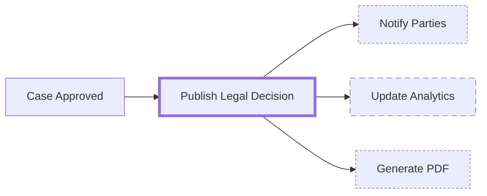

Priority policy:

- legal decision publication: high priority,
- party notification: normal/high depending SLA,
- PDF generation: normal,
- analytics: low.

Retry policy:

- legal publication: fewer but urgent retries + alert,
- notification: more retries with moderate delay,
- analytics: low priority, longer retry.

Ini membuat job executor menjadi operationally aligned dengan business risk.

---

## 32. Pattern: Timer Storm Protection

Timer storm terjadi ketika banyak timer due bersamaan.

Contoh penyebab:

- semua SLA timer di-set `PT24H` dari batch intake jam yang sama,
- sistem down lama lalu semua overdue timers due sekaligus,
- migration/restart membuat banyak job aktif,
- boundary timer pada multi-instance besar.

Mitigasi:

- gunakan jitter di timer bila business mengizinkan,
- batch process intake secara bertahap,
- capacity plan untuk timer due peak,
- priority untuk SLA-critical timers,
- monitor overdue timers,
- hindari membuat timer per item bila bisa aggregate.

Timer storm bukan hanya masalah job executor. Ia bisa menjadi masalah DB, external dependency, dan operator workload.

---

## 33. Pattern: Safe Mass Retry

Saat incident massal karena external system down:

Buruk:

```txt
Set all failed jobs retries=3 immediately after service recovers.
```

Risiko:

- thundering herd ke external system,
- DB spike,
- duplicate side effect,
- incident kembali massal.

Lebih baik:

1. retry sample kecil,
2. validasi idempotency dan external state,
3. retry batch bertahap,
4. monitor error rate,
5. throttle bila perlu,
6. catat operation.

Contoh policy:

```txt
Batch 1: 100 jobs
Wait: 10 minutes
If success rate > 99% and latency OK, continue next 500
If error rate > threshold, pause and investigate
```

---

## 34. Designing Delegate for Job Executor

Delegate yang dieksekusi job executor harus:

- deterministic terhadap variables,
- idempotent untuk side effect,
- punya timeout eksternal eksplisit,
- melempar exception untuk technical failure,
- memakai business error hanya untuk domain alternative path,
- logging dengan process instance id/business key/activity id,
- tidak memakai thread-local request context,
- tidak bergantung pada HTTP session/user request,
- tidak menahan transaction terlalu lama.

Contoh template:

```java
@Component
public class PublishDecisionDelegate implements JavaDelegate {

    private final DecisionPublisher publisher;

    @Override
    public void execute(DelegateExecution execution) {
        String caseId = requireString(execution, "caseId");
        String decisionId = requireString(execution, "decisionId");

        String idempotencyKey = "publish-decision:"
            + execution.getProcessInstanceId()
            + ":"
            + decisionId;

        publisher.publish(caseId, decisionId, idempotencyKey);

        execution.setVariable("decisionPublished", true);
    }

    private String requireString(DelegateExecution execution, String name) {
        Object value = execution.getVariable(name);
        if (!(value instanceof String s) || s.isBlank()) {
            throw new IllegalStateException("Missing required variable: " + name);
        }
        return s;
    }
}
```

Note:

- `IllegalStateException` untuk missing variable akan menjadi failed job bila delegate async.
- Jika missing variable adalah kondisi bisnis yang dapat diperbaiki user, modelkan explicit correction path.
- Jika missing variable adalah bug deployment, incident lebih tepat.

---

## 35. Testing Job Executor Behavior

### 35.1 Test job is created

```java
@Test
void asyncBefore_createsJobBeforeDelegateRuns() {
    ProcessInstance pi = runtimeService.startProcessInstanceByKey("asyncProcess");

    Job job = managementService.createJobQuery()
        .processInstanceId(pi.getId())
        .singleResult();

    assertThat(job).isNotNull();
}
```

### 35.2 Test job success advances process

```java
@Test
void executingJob_advancesToUserTask() {
    ProcessInstance pi = runtimeService.startProcessInstanceByKey("asyncProcess");

    Job job = managementService.createJobQuery()
        .processInstanceId(pi.getId())
        .singleResult();

    managementService.executeJob(job.getId());

    Task task = taskService.createTaskQuery()
        .processInstanceId(pi.getId())
        .taskDefinitionKey("reviewTask")
        .singleResult();

    assertThat(task).isNotNull();
}
```

### 35.3 Test failure decrements retries

```java
@Test
void failingJob_decrementsRetries() {
    ProcessInstance pi = runtimeService.startProcessInstanceByKey("failingAsyncProcess");

    Job job = managementService.createJobQuery()
        .processInstanceId(pi.getId())
        .singleResult();

    int before = job.getRetries();

    assertThrows(Exception.class, () -> managementService.executeJob(job.getId()));

    Job after = managementService.createJobQuery()
        .jobId(job.getId())
        .singleResult();

    assertThat(after.getRetries()).isLessThan(before);
}
```

### 35.4 Test incident after retries exhausted

```java
@Test
void exhaustedRetries_createsIncident() {
    ProcessInstance pi = runtimeService.startProcessInstanceByKey("failingAsyncProcess");

    Job job = managementService.createJobQuery()
        .processInstanceId(pi.getId())
        .singleResult();

    managementService.setJobRetries(job.getId(), 1);

    assertThrows(Exception.class, () -> managementService.executeJob(job.getId()));

    Incident incident = runtimeService.createIncidentQuery()
        .processInstanceId(pi.getId())
        .singleResult();

    assertThat(incident).isNotNull();
}
```

---

## 36. Production Configuration Review

Sebelum production, review:

```txt
[ ] Apakah job executor aktif hanya di node yang seharusnya?
[ ] Apakah cluster homogeneous atau deployment-aware?
[ ] Apakah thread pool sesuai DB/external capacity?
[ ] Apakah retry cycle global masuk akal?
[ ] Apakah task kritikal punya local retry cycle?
[ ] Apakah priority acquisition diperlukan dan aktif?
[ ] Apakah timer peak sudah diperkirakan?
[ ] Apakah failed job dan incident dimonitor?
[ ] Apakah runbook retry ada?
[ ] Apakah mass retry procedure aman?
[ ] Apakah delegate idempotent?
[ ] Apakah direct DB mutation dilarang?
[ ] Apakah test mencakup job failure path?
```

---

## 37. Heuristics for Top 1% Engineering Judgment

### 37.1 Job executor capacity is shared infrastructure

Setiap `asyncBefore` menambah beban ke shared executor dan DB. Desain proses harus memperhitungkan platform capacity, bukan hanya model lokal.

### 37.2 Failed job is a feature

Failed job bukan hal yang harus disembunyikan. Ia adalah visibility mechanism. Yang buruk adalah failed job tanpa context, tanpa idempotency, dan tanpa runbook.

### 37.3 Retry must preserve business correctness

Retry sukses secara teknis bisa tetap salah secara bisnis bila side effect duplikat. Selalu desain idempotency sebelum retry.

### 37.4 Priority only matters under scarcity

Priority tidak membuat sistem lebih cepat. Priority menentukan siapa yang dilayani dulu saat kapasitas kurang.

### 37.5 Exclusive jobs are safety by default

Jangan matikan exclusivity untuk mengejar parallelism sebelum punya bukti bahwa bottleneck memang per-instance sequential execution.

---

## 38. Mini Case Study: Regulatory Notice Dispatch

Scenario:

- case approved,
- legal notice harus dikirim ke regulator,
- party notification dikirim ke applicant,
- analytics update non-critical,
- regulator API kadang rate limited.

Desain:

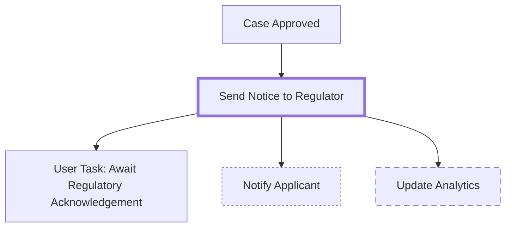

Configuration concept:

```xml
<serviceTask id="sendNoticeToRegulator"
             camunda:delegateExpression="${sendNoticeToRegulatorDelegate}"
             camunda:asyncBefore="true"
             camunda:jobPriority="1000">
  <extensionElements>
    <camunda:failedJobRetryTimeCycle>R6/PT10M</camunda:failedJobRetryTimeCycle>
  </extensionElements>
</serviceTask>

<serviceTask id="notifyApplicant"
             camunda:delegateExpression="${notifyApplicantDelegate}"
             camunda:asyncBefore="true"
             camunda:jobPriority="200">
  <extensionElements>
    <camunda:failedJobRetryTimeCycle>R10/PT15M</camunda:failedJobRetryTimeCycle>
  </extensionElements>
</serviceTask>

<serviceTask id="updateAnalytics"
             camunda:delegateExpression="${updateAnalyticsDelegate}"
             camunda:asyncBefore="true"
             camunda:jobPriority="10">
  <extensionElements>
    <camunda:failedJobRetryTimeCycle>R3/PT1H</camunda:failedJobRetryTimeCycle>
  </extensionElements>
</serviceTask>
```

Design reasoning:

- regulator notice high priority karena legal/SLA impact,
- applicant notification normal priority,
- analytics low priority,
- semua external side effects async dan idempotent,
- retry interval tidak terlalu agresif agar rate limit tidak makin buruk,
- incident runbook berbeda per activity.

---

## 39. Latihan Deliberate Practice

### Latihan 1 — Inspect jobs

Buat process dengan:

- one async service task,
- one timer event,
- one async after gateway.

Jalankan dan amati job query melalui `ManagementService`.

### Latihan 2 — Failure modelling

Untuk setiap async service task, isi:

```txt
activityId:
externalSideEffect:
idempotencyKey:
defaultRetries:
retryInterval:
expectedFailureTypes:
incidentRunbook:
priority:
exclusive:
```

### Latihan 3 — Backlog simulation

Buat 100 process instances yang berhenti pada async service task lambat. Ukur:

- job backlog,
- average time to completion,
- effect of thread pool size,
- effect of external latency,
- failed job behavior saat dependency down.

### Latihan 4 — Priority experiment

Buat dua process definition:

- normal priority,
- high priority.

Buat backlog besar, aktifkan acquisition by priority, buktikan high priority dieksekusi lebih dulu.

---

## 40. Ringkasan

Hal yang harus melekat setelah part ini:

1. Job executor melanjutkan execution asynchronous Camunda.
2. Job dibuat untuk async continuation, timer, dan event handling tertentu.
3. Job disimpan di `ACT_RU_JOB` dan di-acquire melalui database locking.
4. Cluster safety bergantung pada lock owner, lock expiration, dan optimistic locking.
5. Acquisition order default tidak deterministic.
6. Failed job mengurangi retries dan dapat menjadi incident.
7. Retry harus didesain berdasarkan failure mode dan idempotency.
8. Exclusive jobs default membantu menghindari concurrent execution dalam process instance yang sama.
9. Job priority berguna hanya saat backlog/overload.
10. Deployment-aware job executor penting untuk cluster heterogen.
11. Job executor bukan message broker.
12. Production-grade Camunda butuh monitoring backlog, retries, incidents, timer delay, dan executor saturation.

---

## 41. Referensi

- Camunda 7.24 Docs — The Job Executor: `https://docs.camunda.org/manual/7.24/user-guide/process-engine/the-job-executor/`
- Camunda 7.24 Docs — Transactions in Processes: `https://docs.camunda.org/manual/7.24/user-guide/process-engine/transactions-in-processes/`
- Camunda 7.24 Docs — Error Handling: `https://docs.camunda.org/manual/7.24/user-guide/process-engine/error-handling/`
- Camunda 7.24 Docs — Incidents: `https://docs.camunda.org/manual/7.24/user-guide/process-engine/incidents/`
- Camunda 7.24 Docs — ManagementService Javadoc: `https://docs.camunda.org/javadoc/camunda-bpm-platform/7.24/`
