# Part 013 — Variables, Serialization, Scope, and Data Contracts

Part ini membahas salah satu area Camunda 7 yang terlihat sederhana tetapi sering menjadi sumber technical debt besar: **process variables**.

Di level beginner, variable hanya tampak seperti `Map<String, Object>`. Di production, variable adalah:

- kontrak data antar activity,
- state durable yang ikut transaksi engine,
- input untuk gateway dan expression,
- payload audit dan history,
- sumber query operasional,
- sumber masalah serialization,
- sumber risiko security dan privacy,
- penyebab performance degradation kalau dipakai sebagai dumping ground.

Camunda 7 mendefinisikan variable sebagai name/value yang dapat menempel pada runtime state atau variable scope. Scope utama adalah execution, process instance, dan task. Variable parent terlihat oleh child scope kecuali child scope punya variable dengan nama yang sama; sebaliknya child variable tidak terlihat dari parent. Referensi resmi: [Camunda 7.24 Process Variables](https://docs.camunda.org/manual/7.24/user-guide/process-engine/variables/).

Target part ini: setelah selesai, kita bisa mendesain variable sebagai **explicit data contract**, bukan sebagai shared mutable bag.

---

## 1. Mental Model: Variable Bukan Data Store

Camunda variable sering disalahpahami sebagai database bisnis.

Model yang benar:

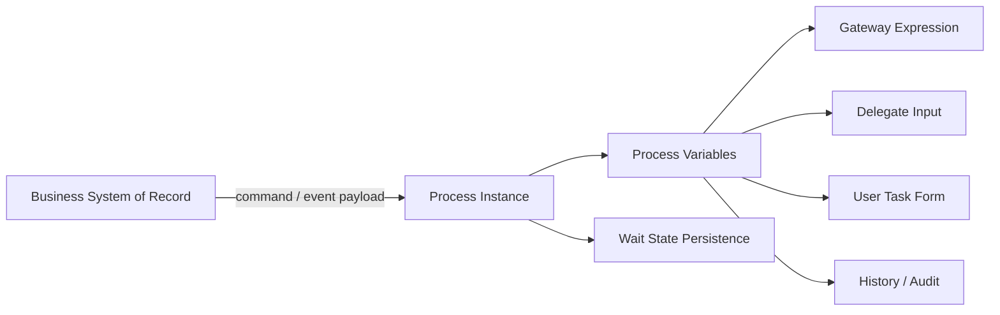

Variable adalah **runtime context** untuk eksekusi proses, bukan canonical source of truth untuk domain.

Contoh buruk:

```text
process variables = seluruh object Customer + seluruh object Case + seluruh document evidence + seluruh response HTTP + seluruh UI form state
```

Contoh baik:

```text
businessKey             = ENF-2026-000123
caseId                  = 8f72...
caseType                = MARKET_ABUSE
riskBand                = HIGH
assignedReviewGroup     = SENIOR_ENFORCEMENT
slaDueAt                = 2026-07-04T17:00:00+07:00
latestDecision          = PROCEED_TO_INVESTIGATION
```

Prinsipnya:

> Simpan di Camunda hanya data yang dibutuhkan engine untuk melanjutkan, memilih jalur, menampilkan task, mengaudit keputusan workflow, atau mengkorelasikan event.

Bukan:

> Simpan semua data karena nanti mungkin perlu.

---

## 2. Variable Sebagai Kontrak Antar Activity

Setiap activity yang membaca variable punya dependency terhadap producer variable tersebut.

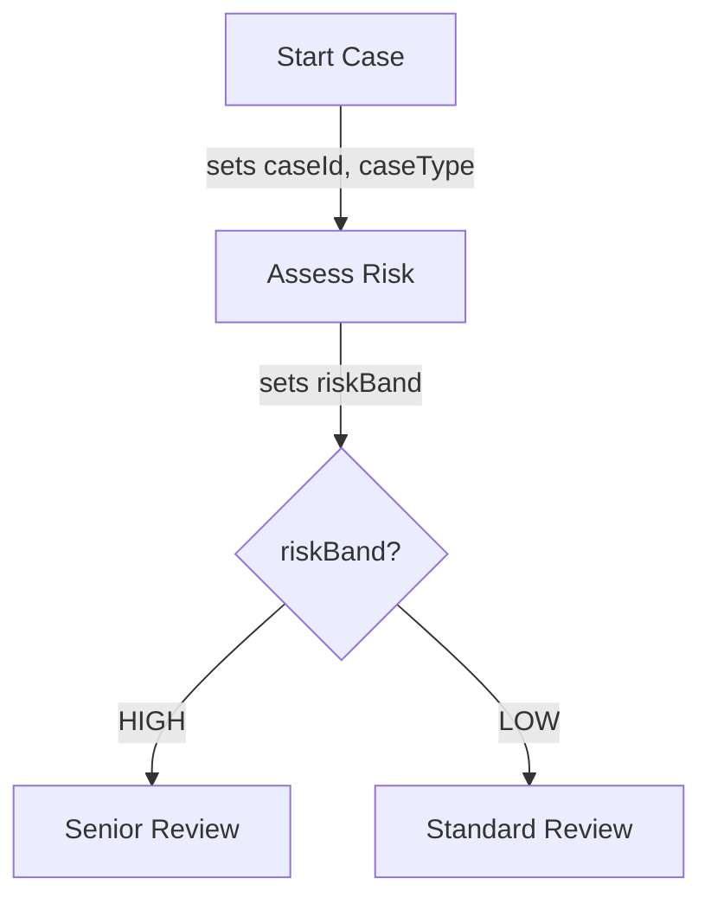

Kontrak implicit:

| Variable | Producer | Consumer | Required? | Type | Meaning |
|---|---|---|---:|---|---|
| `caseId` | Start adapter | All delegates | Yes | UUID/String | Domain case identifier |
| `caseType` | Start adapter | Risk decision | Yes | String enum | Regulatory case type |
| `riskBand` | Risk decision | Gateway | Yes | String enum | Routing classification |

Jika kontrak ini tidak ditulis, maka proses menjadi brittle:

- gateway gagal karena `riskBand` `null`,
- delegate membaca object lama,
- UI form mengirim nama variable berbeda,
- migration sulit karena tidak tahu variable yang masih dipakai,
- incident sulit dianalisis karena variable tidak punya semantic owner.

Rule praktis:

> Untuk setiap BPMN model production, buat **Variable Contract Table** sebagai bagian dari review model.

---

## 3. Variable Scope: Global, Local, Task Local

Camunda variable scope mengikuti tree runtime. Parent variable terlihat oleh child; child variable tidak terlihat oleh parent; local variable dengan nama sama dapat menutupi variable parent.

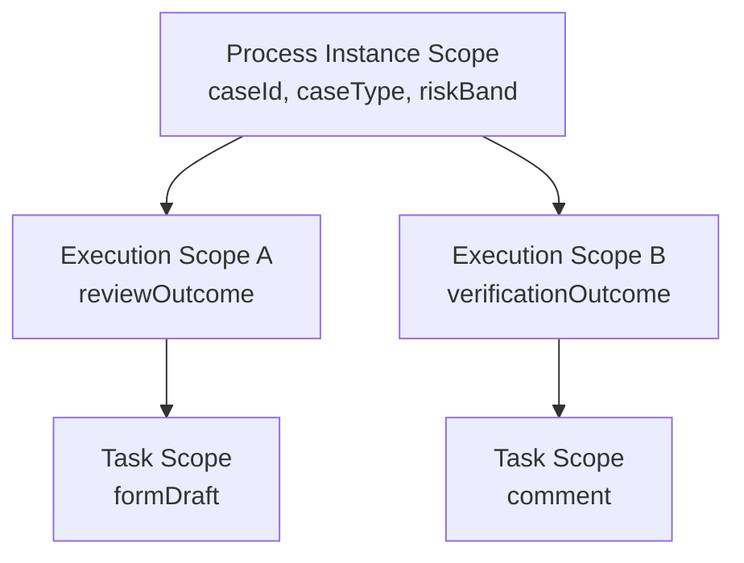

### 3.1 Process Instance Variables

Dipakai untuk data yang memang berlaku bagi keseluruhan process instance:

- `caseId`,
- `businessUnit`,
- `caseType`,
- `currentStage`,
- `riskBand`,
- `slaDueAt`,
- `requiresLegalReview`.

Gunakan untuk routing dan state workflow yang long-lived.

### 3.2 Execution Local Variables

Dipakai untuk data yang hanya relevan di branch tertentu:

- hasil branch parallel,
- temporary result sebelum aggregation,
- local flag untuk subprocess,
- data yang tidak boleh bocor ke branch lain.

Contoh:

```java
execution.setVariableLocal("reviewOutcome", "APPROVED");
```

### 3.3 Task Local Variables

Dipakai untuk data yang melekat ke human task tertentu:

- form draft,
- reviewer note,
- temporary UI state,
- local decision before completion.

Contoh:

```java
taskService.setVariableLocal(taskId, "reviewComment", "Need additional evidence");
```

Task local variable tidak otomatis menjadi process-level decision. Saat task completed, aplikasi harus secara eksplisit mempromosikan data penting menjadi process variable jika proses berikutnya membutuhkannya.

```java
Map<String, Object> completion = Map.of(
    "reviewOutcome", "REQUEST_MORE_INFO",
    "reviewedBy", currentUserId,
    "reviewedAt", OffsetDateTime.now().toString()
);

taskService.complete(taskId, completion);
```

---

## 4. Scope Rule yang Harus Diingat

### Rule 1 — Jangan pakai nama sama di parent dan child kecuali sengaja shadowing

Shadowing bisa valid, tetapi harus jarang.

Buruk:

```text
process.orderStatus = PENDING
subprocess.orderStatus = APPROVED
```

Lebih baik:

```text
orderStatus = PENDING
supplierVerificationStatus = APPROVED
```

### Rule 2 — Parallel branch sebaiknya menulis variable berbeda

Buruk:

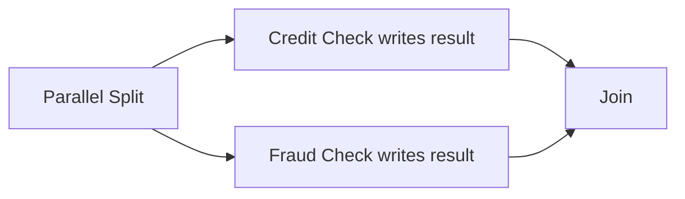

Kedua branch menulis `result`.

Baik:

```text
creditCheckResult
fraudCheckResult
```

### Rule 3 — Aggregator bertanggung jawab membuat variable final

```text
creditCheckResult = PASS
fraudCheckResult  = REVIEW
finalRiskDecision = MANUAL_REVIEW
```

Gateway downstream membaca `finalRiskDecision`, bukan membaca banyak intermediate variable.

---

## 5. Variable Type: Primitive, Object, File, JSON/XML, Transient

Camunda menyediakan Java Object Value API dan Typed Value API. Java Object API lebih sederhana untuk kode process application, sedangkan Typed Value API memberi akses metadata seperti serialization format dan status transient. Referensi resmi: [Camunda Variables — Set and Retrieve Variables](https://docs.camunda.org/manual/7.24/user-guide/process-engine/variables/#set-and-retrieve-variables-overview).

### 5.1 Primitive Values

Gunakan sebanyak mungkin untuk routing dan observability:

- `String`,
- `Boolean`,
- `Integer`,
- `Long`,
- `Double`,
- `Date`.

Contoh:

```java
runtimeService.setVariable(processInstanceId, "riskBand", "HIGH");
runtimeService.setVariable(processInstanceId, "requiresLegalReview", true);
runtimeService.setVariable(processInstanceId, "retryCount", 2);
```

Keunggulan primitive:

- mudah di-query,
- mudah dibaca di Cockpit,
- tidak tergantung classpath domain object,
- lebih aman untuk migration,
- lebih mudah diaudit.

### 5.2 Object Values

Camunda bisa menyimpan Java object, tetapi ini harus digunakan dengan sangat hati-hati.

```java
CustomerSnapshot snapshot = new CustomerSnapshot("C-123", "HIGH", "ID");
execution.setVariable("customerSnapshot", snapshot);
```

Masalah object variable:

- class harus tersedia saat deserialization,
- rename package/class bisa merusak old process instances,
- perubahan field bisa membuat compatibility problem,
- REST clients bisa kesulitan membaca,
- history menjadi sulit dianalisis,
- object besar membuat DB dan history bengkak.

Rule production:

> Hindari menyimpan domain entity sebagai Java serialized object. Simpan ID dan snapshot kecil berbasis JSON kalau memang butuh snapshot.

### 5.3 JSON/XML Values via Spin

Camunda Spin menyediakan abstraction untuk JSON dan XML document. Dokumentasi resmi menyebut Spin dapat membuat serialized object value bisa diinterpretasikan manusia dan tetap bermakna tanpa Java class terkait. Referensi: [Camunda Variables — Object Value Serialization](https://docs.camunda.org/manual/7.24/user-guide/process-engine/variables/#object-value-serialization).

Contoh JSON value:

```java
import static org.camunda.spin.Spin.JSON;

execution.setVariable("riskAssessment", JSON("""
{
  "score": 87,
  "band": "HIGH",
  "reasons": ["cross-border", "repeat-offender"]
}
"""));
```

Lebih eksplisit dengan typed value:

```java
ObjectValue value = Variables
    .objectValue(new RiskAssessmentDto(87, "HIGH"))
    .serializationDataFormat(Variables.SerializationDataFormats.JSON)
    .create();

execution.setVariable("riskAssessment", value);
```

JSON cocok untuk:

- snapshot kecil,
- decision input/output,
- form payload yang harus dibaca manusia,
- audit payload terbatas,
- integration metadata.

JSON tidak cocok untuk:

- payload besar,
- binary documents,
- seluruh response API,
- deeply nested domain aggregate,
- data yang sering berubah tetapi tidak dibutuhkan workflow.

### 5.4 File Variables

File variable bisa dipakai, tetapi di production sebaiknya jarang.

Untuk dokumen bukti, kontrak, attachment, atau report besar, lebih baik simpan di object storage/document management system, lalu simpan referensinya di Camunda:

```text
evidenceDocumentId = DOC-2026-01928
evidenceHash       = sha256:...
evidenceType       = TRANSACTION_REPORT
```

Mengapa?

- DB Camunda bukan document store,
- backup/restore jadi berat,
- history cleanup bisa menimbulkan load besar,
- data privacy lebih sulit,
- access control dokumen biasanya lebih kompleks daripada variable.

### 5.5 Transient Variables

Transient variable hanya bisa dideklarasikan melalui Typed Value API, tidak disimpan ke database, dan hanya hidup selama transaksi saat ini. Saat execution mencapai wait state, transient variable hilang. Referensi resmi: [Camunda Variables — Transient Variables](https://docs.camunda.org/manual/7.24/user-guide/process-engine/variables/#transient-variables).

Contoh:

```java
TypedValue token = Variables.stringValue("temporary-oauth-token", true);
execution.setVariable("accessToken", token);
```

Gunakan transient variable untuk:

- temporary secret,
- request-scoped computation,
- object mahal yang hanya dibutuhkan delegate berikutnya dalam transaksi sama,
- data yang tidak boleh masuk audit/history.

Jangan gunakan transient variable untuk:

- data yang dibutuhkan setelah user task,
- data yang dibutuhkan setelah timer/message wait state,
- correlation key,
- process outcome.

---

## 6. Serialization Model

Ketika variable dipersist, engine harus menyimpan value ke database. Untuk primitive, ini relatif sederhana. Untuk object, engine membutuhkan serialization format.

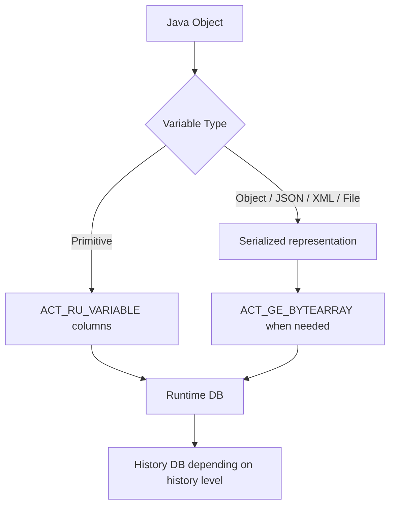

### 6.1 Java Serialization

Camunda ships a built-in serializer for `application/x-java-serialized-object` for objects implementing `java.io.Serializable`. Ini bekerja, tetapi jarang menjadi pilihan terbaik untuk production long-running workflow.

Risiko Java serialization:

- classpath coupling,
- `serialVersionUID` compatibility,
- sulit dibaca operator,
- sulit dibaca REST client non-Java,
- migration Camunda 8 jauh lebih berat,
- security surface lebih besar.

### 6.2 JSON Serialization

JSON lebih disukai untuk cross-boundary variable karena:

- language-neutral,
- human-readable,
- compatible dengan REST,
- lebih mudah di-version,
- lebih mudah untuk audit,
- lebih mudah dipindahkan saat migration.

Tetapi JSON bukan silver bullet. Tetap butuh schema discipline.

Contoh contract:

```json
{
  "schemaVersion": 2,
  "caseId": "ENF-2026-000123",
  "score": 87,
  "band": "HIGH",
  "reasons": ["cross-border", "repeat-offender"],
  "evaluatedAt": "2026-06-27T10:15:30+07:00"
}
```

### 6.3 Deserialization Control

Saat membaca variable lewat Java API atau REST, hati-hati dengan deserialization.

Untuk object variable, prefer membaca serialized form ketika caller tidak membutuhkan object Java:

```java
ObjectValue typedValue = runtimeService.getVariableTyped(
    executionId,
    "riskAssessment",
    false // do not deserialize
);

String serialized = typedValue.getValueSerialized();
```

Ini menghindari:

- class not found,
- loading class dari process application lain,
- accidental expensive deserialization,
- coupling monitoring tool ke domain class.

---

## 7. Variable Naming Convention

Naming yang buruk membuat process unreadable.

### 7.1 Gunakan business language, bukan technical language

Buruk:

```text
flag1
status2
resp
obj
x
valid
```

Baik:

```text
requiresSeniorReview
kycVerificationStatus
paymentCaptureResult
caseClosureReason
latestRiskBand
```

### 7.2 Gunakan suffix konsisten

| Suffix | Meaning | Example |
|---|---|---|
| `Id` | identifier external/domain | `caseId`, `customerId` |
| `Key` | correlation/routing key | `messageCorrelationKey` |
| `Status` | current state of sub-domain | `kycStatus` |
| `Result` | result of activity | `fraudCheckResult` |
| `Decision` | explicit decision outcome | `enforcementDecision` |
| `At` | timestamp instant | `reviewCompletedAt` |
| `DueAt` | deadline | `slaDueAt` |
| `Count` | numeric count | `manualRetryCount` |
| `Reason` | controlled reason code or text | `rejectionReason` |

### 7.3 Hindari overloaded variable

Buruk:

```text
status = NEW / APPROVED / FAILED / SENT / TIMEOUT / CANCELLED
```

Ini mencampur banyak domain.

Baik:

```text
caseLifecycleStatus = OPEN
riskAssessmentStatus = COMPLETED
notificationStatus = SENT
externalCheckStatus = TIMEOUT
```

---

## 8. Data Contract Template

Setiap process definition harus punya tabel kontrak variable.

```md
## Variable Contract

| Name | Scope | Type | Required | Producer | Consumer | Mutability | Retention Sensitivity | Notes |
|---|---|---|---:|---|---|---|---|---|
| caseId | process | String | yes | start adapter | all | immutable | low | Domain case identifier |
| caseType | process | String enum | yes | start adapter | DMN risk | immutable | low | ENFORCEMENT / LICENSING |
| riskBand | process | String enum | yes | risk decision | routing gateway | mutable by reassessment | medium | LOW/MEDIUM/HIGH |
| riskAssessment | process | JSON | no | risk delegate | reviewer form | append/replace | medium | Small snapshot only |
| reviewOutcome | process | String enum | yes after user task | reviewer task | closure gateway | immutable after completion | high | APPROVE/REJECT/MORE_INFO |
```

### Mutability classification

| Class | Meaning | Example |
|---|---|---|
| Immutable | Set once, never changed | `caseId`, `createdBy` |
| Monotonic | Moves forward only | `caseStage` |
| Recomputable | Can be replaced by deterministic recomputation | `riskBand` |
| User-authored | Created by human actor | `reviewComment` |
| Operational | Used for retries/tuning | `manualRetryCount` |

---

## 9. Variables and Gateway Safety

Gateway expression should be boring.

Buruk:

```java
${risk.score > 80 && customer.country != null && service.calculate(customer).isAllowed()}
```

Masalah:

- expression menjalankan logic kompleks,
- bisa memanggil service,
- sulit dites,
- error di expression membuat incident yang tidak jelas,
- model BPMN menjadi tempat business logic tersembunyi.

Baik:

```java
${riskBand == 'HIGH'}
```

Lebih baik lagi, hasil decision dihitung sebelumnya oleh DMN atau delegate tipis:

```text
riskBand = HIGH
routingDecision = SENIOR_REVIEW
```

Gateway membaca outcome, bukan menghitung outcome.

---

## 10. Variables and Message Correlation

Untuk message event, variable sering dipakai sebagai correlation key. Ini harus didesain dengan stabil.

Contoh:

```text
businessKey = ENF-2026-000123
paymentId   = PAY-928381
callbackKey = external-system-x:PAY-928381
```

Pattern:

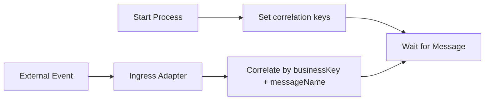

Rules:

1. Correlation key harus immutable setelah event subscription dibuat.
2. Jangan pakai value yang bisa berubah oleh user.
3. Jangan pakai display label sebagai key.
4. Simpan key external secara eksplisit.
5. Buat unique constraint di ingress layer bila perlu, bukan di Camunda variable table.

---

## 11. Variables and User Forms

User task form sering menjadi sumber variable chaos.

Buruk:

```text
Form field names langsung menjadi process variables tanpa mapping atau validation.
```

Akibat:

- user bisa mengirim variable tidak terduga,
- type berubah dari Boolean menjadi String,
- security boundary lemah,
- old form version merusak new process version,
- process variable penuh data UI.

Pattern yang lebih aman:

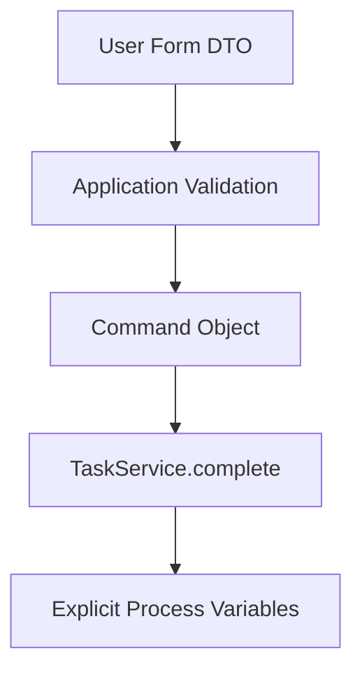

Contoh:

```java
public record CompleteReviewCommand(
    String taskId,
    ReviewOutcome outcome,
    String comment,
    String reviewerId
) {}

Map<String, Object> variables = Map.of(
    "reviewOutcome", command.outcome().name(),
    "reviewComment", sanitize(command.comment()),
    "reviewedBy", command.reviewerId(),
    "reviewedAt", OffsetDateTime.now().toString()
);

taskService.complete(command.taskId(), variables);
```

Jangan expose `TaskService.complete(taskId, arbitraryMapFromBrowser)` langsung.

---

## 12. Data Minimization

Camunda history bisa bertahan lama. Jadi setiap variable punya retention cost.

Pertanyaan sebelum menyimpan variable:

1. Apakah engine membutuhkan value ini untuk routing?
2. Apakah operator membutuhkan value ini untuk recovery?
3. Apakah auditor membutuhkan value ini sebagai evidence?
4. Apakah value ini bisa direkonstruksi dari system of record?
5. Apakah value ini mengandung PII/secret/sensitive data?
6. Apakah value ini besar?
7. Apakah value ini akan berubah berkali-kali?
8. Apakah value ini harus tetap valid selama process instance mungkin berjalan berbulan-bulan?

Jika jawaban 1-3 “tidak”, jangan simpan di Camunda.

### 12.1 Store ID, not object

Buruk:

```json
{
  "customer": {
    "id": "C-123",
    "name": "...",
    "address": "...",
    "phone": "...",
    "documents": [...]
  }
}
```

Baik:

```text
customerId = C-123
customerRiskSnapshotId = SNAP-2026-8123
```

### 12.2 Store decision snapshot, not full input payload

Untuk audit, sering cukup menyimpan:

```json
{
  "decisionId": "risk-band-v3",
  "inputHash": "sha256:...",
  "output": "HIGH",
  "reasons": ["repeat-offender"],
  "evaluatedAt": "2026-06-27T10:15:30+07:00"
}
```

Input penuh bisa tetap di system of record atau evidence store.

---

## 13. Schema Evolution untuk Long-Running Process

Camunda process instance bisa berjalan lama. Variable schema hari ini harus tetap bisa dibaca kode bulan depan.

### 13.1 Problem

Hari ini:

```json
{
  "score": 87,
  "band": "HIGH"
}
```

Tiga bulan lagi:

```json
{
  "score": 87,
  "band": "HIGH",
  "modelVersion": "aml-risk-v4",
  "reasonCodes": ["RPT", "XBR"]
}
```

Jika delegate baru mengasumsikan `reasonCodes` selalu ada, old process instances gagal.

### 13.2 Additive change first

Aturan aman:

- tambah field optional,
- jangan rename field tanpa fallback,
- jangan ubah semantic enum diam-diam,
- jangan ubah type field existing,
- selalu masukkan `schemaVersion` untuk JSON penting,
- buat upgrader/adaptor jika perlu.

Contoh reader:

```java
public RiskAssessment readRiskAssessment(JsonNode node) {
    int schemaVersion = node.path("schemaVersion").asInt(1);

    return switch (schemaVersion) {
        case 1 -> RiskAssessment.fromV1(node);
        case 2 -> RiskAssessment.fromV2(node);
        default -> throw new IllegalArgumentException(
            "Unsupported riskAssessment schemaVersion=" + schemaVersion
        );
    };
}
```

### 13.3 Write new, read old

Deployment rule:

> New code must be able to read variables written by previous supported process versions.

Ini lebih penting daripada kebanyakan engineer kira, karena Camunda process instance lama tetap akan bangun dari wait state dan menjalankan kode baru.

---

## 14. Variable Versioning Strategy

Ada tiga level versioning.

### 14.1 Process definition version

Camunda versioning untuk BPMN deployment.

```text
case-review:1
case-review:2
case-review:3
```

### 14.2 Variable schema version

Versi struktur variable tertentu.

```json
{
  "schemaVersion": 2,
  "score": 87,
  "band": "HIGH"
}
```

### 14.3 Business rule/model version

Versi decision logic external atau DMN.

```json
{
  "decisionDefinitionKey": "risk-band",
  "decisionDefinitionVersion": 5,
  "output": "HIGH"
}
```

Jangan campur ketiganya. Process v4 bisa saja memanggil DMN v7 dan menghasilkan variable schema v2.

---

## 15. Variable Access Layer Pattern

Di aplikasi serius, jangan akses string variable secara acak di semua delegate.

Buruk:

```java
String caseId = (String) execution.getVariable("caseId");
String riskBand = (String) execution.getVariable("riskBand");
Boolean requiresLegal = (Boolean) execution.getVariable("requiresLegalReview");
```

Berulang di puluhan class.

Baik:

```java
public final class CaseProcessVariables {
    public static final String CASE_ID = "caseId";
    public static final String CASE_TYPE = "caseType";
    public static final String RISK_BAND = "riskBand";
    public static final String REQUIRES_LEGAL_REVIEW = "requiresLegalReview";

    private final DelegateExecution execution;

    public CaseProcessVariables(DelegateExecution execution) {
        this.execution = execution;
    }

    public String caseId() {
        return requiredString(CASE_ID);
    }

    public RiskBand riskBand() {
        return RiskBand.valueOf(requiredString(RISK_BAND));
    }

    public void riskBand(RiskBand riskBand) {
        execution.setVariable(RISK_BAND, riskBand.name());
    }

    private String requiredString(String name) {
        Object value = execution.getVariable(name);
        if (!(value instanceof String s) || s.isBlank()) {
            throw new IllegalStateException("Missing required process variable: " + name);
        }
        return s;
    }
}
```

Manfaat:

- typo dicegah,
- validation centralized,
- migration easier,
- delegate lebih tipis,
- contract terlihat.

---

## 16. Input/Output Mapping

Input/output mapping berguna untuk membatasi variable yang masuk dan keluar activity atau call activity.

Mental model:

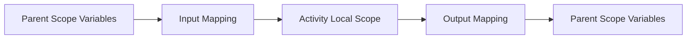

Gunakan mapping untuk:

- call activity contract,
- subprocess isolation,
- menghindari variable leakage,
- membuat reusable module,
- mengubah nama variable antar boundary.

Contoh prinsip:

```text
Parent variable: caseId
Child variable : investigationCaseId
Output         : investigationOutcome
```

Jangan default “pass all variables” untuk reusable process module yang punya lifecycle panjang.

---

## 17. Variables in Parallel and Multi-Instance

Parallel branch dan multi-instance memperbesar risiko write conflict.

### 17.1 Parallel branch conflict

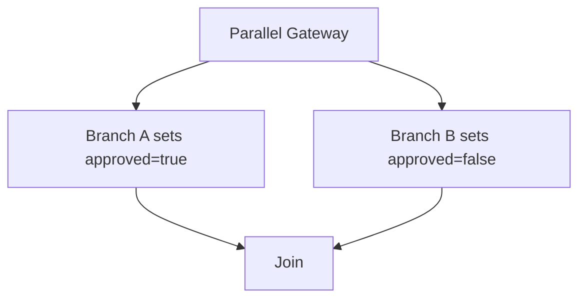

Variable `approved` ambigu.

Baik:

```text
legalReviewApproved = true
financialReviewApproved = false
```

Aggregator:

```text
finalApprovalDecision = REJECTED
```

### 17.2 Multi-instance output

Untuk multi-instance review, jangan setiap instance menulis variable global yang sama.

Buruk:

```text
reviewOutcome = APPROVED
```

Baik:

```text
reviewResults = [
  {"reviewer":"u1", "outcome":"APPROVED"},
  {"reviewer":"u2", "outcome":"REJECTED"}
]
```

Atau simpan detail di domain DB, Camunda hanya menyimpan aggregate:

```text
reviewRoundId = RR-2026-991
reviewQuorumReached = true
reviewAggregateOutcome = REJECTED
```

---

## 18. Variables and Optimistic Locking

Variable update ikut transaction engine. Pada parallel execution, update variable yang sama dapat menyebabkan optimistic locking conflict.

Conflict bukan selalu bug engine. Sering itu tanda model atau data contract salah.

Mitigasi:

1. Gunakan local variables untuk branch parallel.
2. Tulis global variable hanya di aggregator setelah join.
3. Gunakan async boundary jika operation perlu retry.
4. Hindari shared mutable counters di parallel branch.
5. Buat idempotent write ke external systems.

---

## 19. Querying by Variables

Camunda API memungkinkan query process/task berdasarkan variable. Namun variable query bukan pengganti read model.

Cocok untuk:

- operator mencari process instance by `caseId`,
- tasklist filter sederhana,
- support investigation,
- reconciliation kecil.

Tidak cocok untuk:

- dashboard high-volume,
- complex reporting,
- analytics,
- join ke domain table,
- real-time case search dengan banyak filter.

Pattern:

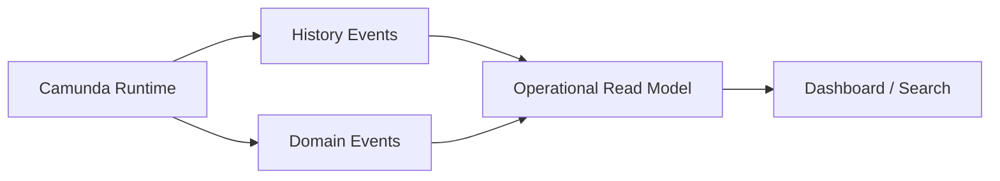

Gunakan read model untuk query bisnis yang kompleks.

---

## 20. Sensitive Data, Secrets, and PII

Jangan menyimpan secret di variable persistent.

Hindari:

- access token,
- password,
- API key,
- raw identity document,
- full address jika tidak perlu,
- medical/financial personal detail yang tidak diperlukan workflow.

Jika terpaksa menyimpan sensitive variable:

- minimalkan value,
- encrypt at application layer,
- batasi authorization Cockpit/REST,
- pastikan history level/cleanup sesuai,
- pastikan backup policy sesuai,
- masking di UI/logging,
- dokumentasikan legal basis.

Rule keras:

> Variable yang masuk Camunda bisa muncul di runtime, history, logs, admin tools, backups, dan support workflows. Perlakukan seperti data persisted, bukan memory sementara.

---

## 21. Logging Variables

Anti-pattern:

```java
log.info("Process variables: {}", execution.getVariables());
```

Masalah:

- PII leak,
- secret leak,
- log volume besar,
- object serialization side effects,
- audit noise.

Pattern:

```java
log.info("Completing risk assessment caseId={} processInstanceId={} riskBand={}",
    vars.caseId(), execution.getProcessInstanceId(), vars.riskBand());
```

Log hanya identifier dan outcome penting.

---

## 22. Variable Failure Modes

| Failure | Symptom | Root Cause | Prevention |
|---|---|---|---|
| Missing variable | Incident at gateway/delegate | producer not executed or wrong name | contract table + tests |
| Wrong type | ClassCastException | form/REST sends string instead of boolean | command validation |
| Serialization error | job failure | class not serializable / incompatible | JSON DTO / primitive |
| Class not found | REST/Cockpit/worker fails | object variable class unavailable | deserialize=false / JSON |
| Stale variable | wrong route | variable recomputed but not updated | explicit owner |
| Oversized variable | slow DB/history | storing payload/documents | store references |
| PII leak | compliance incident | variable visible in history/logs | minimization/masking |
| Race update | optimistic locking | parallel branch writes same variable | local variables + aggregator |
| Scope shadowing | unexpected value | local variable hides parent | naming discipline |

---

## 23. Anti-Pattern: Variable Dumping Ground

```java
execution.setVariables(objectMapper.convertValue(request, Map.class));
```

Ini terlihat cepat, tetapi menciptakan masalah:

- variable tidak punya owner,
- schema tidak jelas,
- browser/API bisa mengontrol process state,
- duplicate names,
- sensitive data ikut tersimpan,
- process upgrade sulit,
- operator tidak tahu mana yang penting.

Solusi:

```java
Map<String, Object> variables = Map.of(
    "caseId", request.caseId(),
    "caseType", request.caseType().name(),
    "submittedBy", request.submittedBy(),
    "submittedAt", clock.now().toString()
);
```

Explicit is safer.

---

## 24. Anti-Pattern: Domain Entity as Process Variable

Buruk:

```java
Customer customer = customerRepository.findById(customerId);
execution.setVariable("customer", customer);
```

Mengapa buruk:

- entity bisa lazy-loaded,
- object graph besar,
- JPA proxy serialization problem,
- data stale,
- class evolution problem,
- privacy problem.

Baik:

```java
execution.setVariable("customerId", customerId);
execution.setVariable("customerRiskBand", customer.riskBand().name());
```

Jika perlu snapshot:

```java
CustomerWorkflowSnapshot snapshot = new CustomerWorkflowSnapshot(
    customer.id(),
    customer.riskBand().name(),
    customer.countryCode(),
    clock.now()
);

execution.setVariable("customerSnapshot", toJson(snapshot));
```

Snapshot harus kecil dan intentional.

---

## 25. Anti-Pattern: Gateway Depends on Missing Optional Data

Buruk:

```java
${approval.amount > 1000000}
```

Jika `approval` null, incident.

Lebih baik:

```text
amountBand = HIGH_VALUE
```

Gateway:

```java
${amountBand == 'HIGH_VALUE'}
```

Hitung `amountBand` di delegate/DMN dengan validation lengkap sebelum gateway.

---

## 26. Testing Variable Contracts

### 26.1 Test start variables

```java
@Test
void startCase_requiresMinimalContract() {
    assertThatThrownBy(() -> caseProcess.start(new StartCaseCommand(null, CaseType.ENFORCEMENT)))
        .isInstanceOf(IllegalArgumentException.class);
}
```

### 26.2 Test process path variables

```java
@Test
void highRiskCase_goesToSeniorReview() {
    ProcessInstance instance = runtimeService.startProcessInstanceByKey(
        "case-review",
        "ENF-2026-000123",
        Map.of(
            "caseId", "ENF-2026-000123",
            "caseType", "ENFORCEMENT",
            "riskBand", "HIGH"
        )
    );

    assertThat(taskService.createTaskQuery()
        .processInstanceId(instance.getId())
        .taskDefinitionKey("seniorReview")
        .singleResult()).isNotNull();
}
```

### 26.3 Test old schema compatibility

```java
@Test
void delegate_readsV1RiskAssessment() {
    String oldJson = """
    { "score": 87, "band": "HIGH" }
    """;

    RiskAssessment assessment = reader.read(oldJson);

    assertThat(assessment.band()).isEqualTo(RiskBand.HIGH);
}
```

---

## 27. Production Checklist

Sebelum deploy process definition baru, cek:

- [ ] Semua required variables punya producer jelas.
- [ ] Semua gateway hanya membaca variable sederhana.
- [ ] Semua variable punya type stabil.
- [ ] Tidak ada arbitrary form map langsung masuk process variables.
- [ ] Tidak ada domain entity/JPA entity disimpan sebagai variable.
- [ ] Object variable punya JSON serialization atau alasan eksplisit.
- [ ] Sensitive data diminimalkan atau dienkripsi.
- [ ] Variable yang dipakai message correlation immutable.
- [ ] Parallel branch tidak menulis variable global yang sama.
- [ ] Multi-instance punya aggregation strategy.
- [ ] Variable schema evolution diuji.
- [ ] Variable contract table ada di repository.
- [ ] History retention memahami dampak variable.
- [ ] Operational dashboard tidak bergantung pada query variable high-volume.

---

## 28. Practice: Variable Contract Review

Ambil salah satu process model yang sudah dibuat sebelumnya. Untuk setiap activity, jawab:

1. Variable apa yang dibaca?
2. Variable apa yang ditulis?
3. Variable apa yang wajib ada sebelum activity?
4. Apa type variable tersebut?
5. Siapa owner semantic-nya?
6. Apakah variable boleh berubah?
7. Apakah masuk history?
8. Apakah mengandung sensitive data?
9. Apakah variable masih valid jika process instance berjalan 6 bulan?
10. Apakah old process instance bisa dibaca oleh kode baru?

Output latihan:

```md
# Variable Contract Review — <process-key>

## Critical Variables
...

## Scope Risks
...

## Serialization Risks
...

## Privacy Risks
...

## Refactoring Plan
...
```

---

## 29. Mental Model Akhir

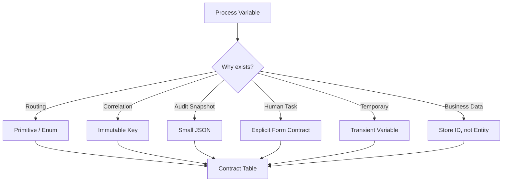

Variable design yang baik membuat BPMN:

- mudah dibaca,
- mudah diuji,
- mudah dioperasikan,
- aman untuk audit,
- aman untuk long-running instances,
- lebih siap migration.

Variable design yang buruk membuat BPMN menjadi distributed mutable global state yang sulit dikontrol.

---

## 30. Referensi Utama

- [Camunda 7.24 — Process Variables](https://docs.camunda.org/manual/7.24/user-guide/process-engine/variables/)
- [Camunda 7.24 — Database Schema](https://docs.camunda.org/manual/7.24/user-guide/process-engine/database/database-schema/)
- [Camunda 7.24 — Spin Dataformats](https://docs.camunda.org/manual/7.24/reference/spin/)
- [Camunda 7.24 — REST Variables](https://docs.camunda.org/manual/7.24/reference/rest/overview/variables/)

---

## 31. Ringkasan

Key takeaways:

1. Variable adalah **workflow runtime contract**, bukan database bisnis.
2. Scope menentukan visibility; salah scope menghasilkan bug subtle.
3. Primitive dan explicit JSON snapshot biasanya lebih aman daripada Java object variable.
4. Transient variable hilang di wait state; gunakan hanya untuk data transaksi sementara.
5. Gateway harus membaca outcome sederhana, bukan menghitung business logic kompleks.
6. Long-running process menuntut variable schema evolution.
7. Data minimization penting karena variable bisa masuk runtime, history, logs, backups, dan admin tools.
8. Parallel/multi-instance membutuhkan strategi variable aggregation.
9. Variable contract table adalah artifact wajib untuk process production.

Part berikutnya membahas **History, Audit, and Operational Trace**: bagaimana Camunda menyimpan jejak eksekusi, history level, user operation log, cleanup, TTL, dan bagaimana membuat evidence trail yang defensible.
