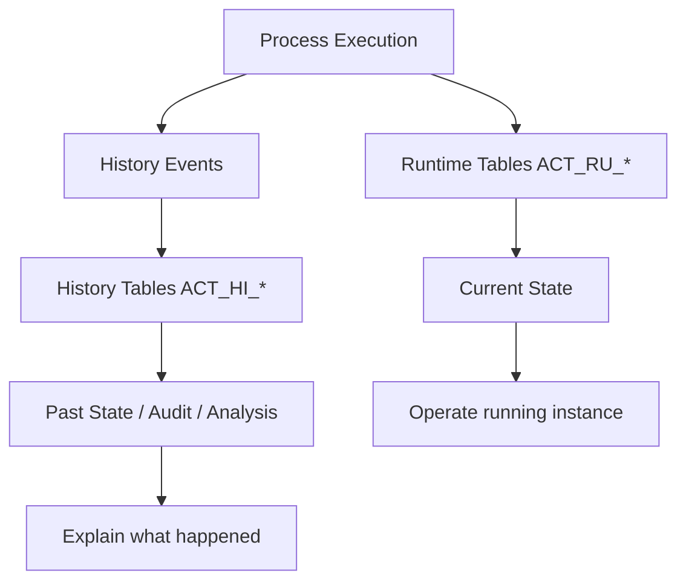
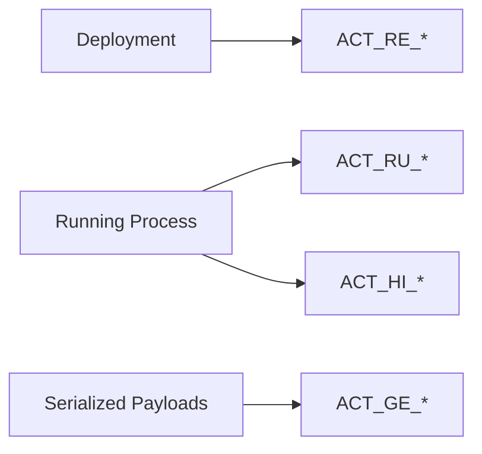
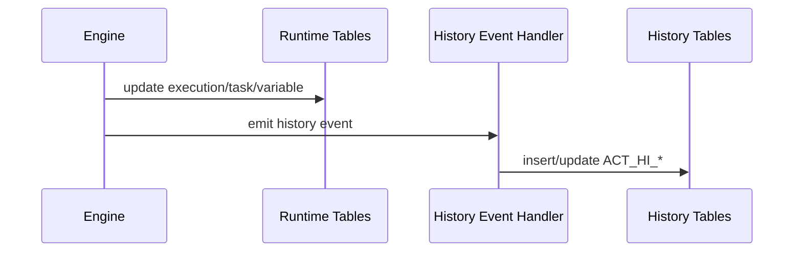
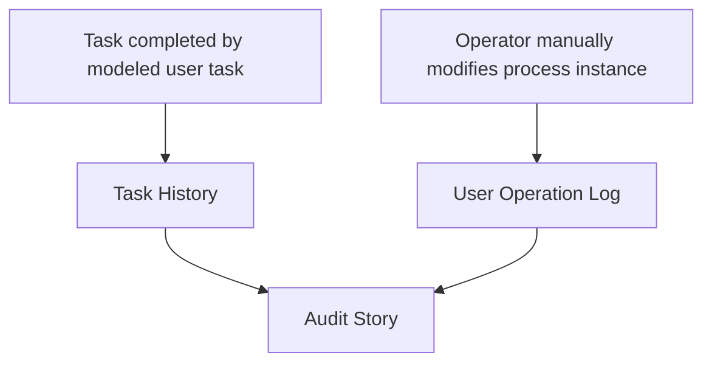
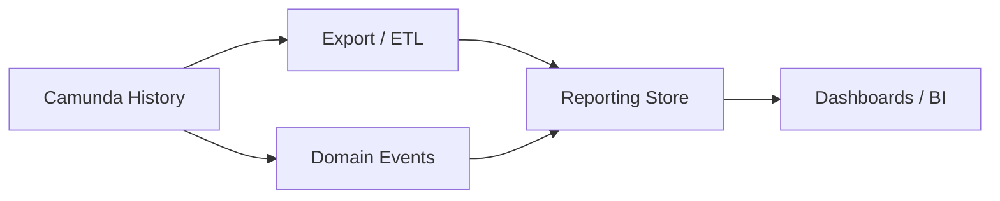
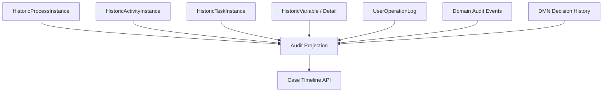
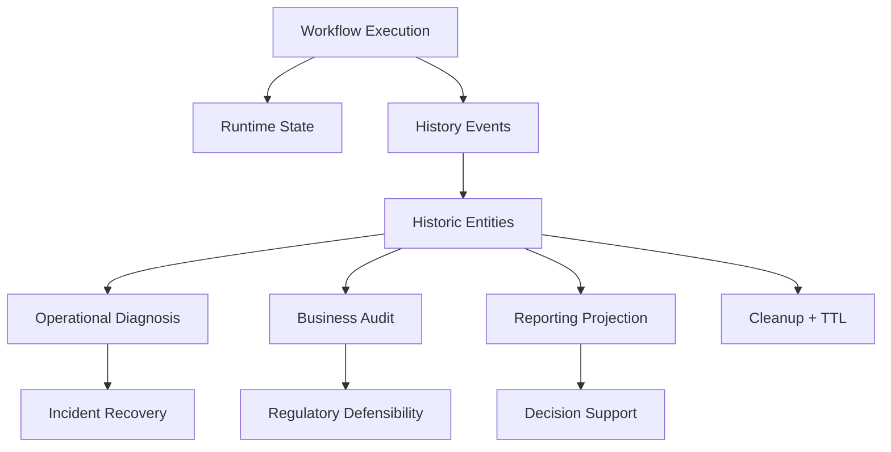

# Part 014 — History, Audit, and Operational Trace

Part ini membahas bagaimana Camunda 7 merekam jejak eksekusi proses.

Ini bukan topik kosmetik. Untuk production workflow, terutama workflow regulatory, financial, enforcement, healthcare, insurance, atau case management kompleks, history menentukan apakah kita bisa menjawab pertanyaan seperti:

- Kapan case dimulai?
- Siapa yang menyelesaikan task?
- Jalur BPMN mana yang dilewati?
- Variable apa yang berubah?
- Decision DMN apa yang dievaluasi?
- Mengapa process instance masuk incident?
- Apakah operator pernah melakukan manual modification?
- Berapa lama task menunggu?
- Apakah SLA dilanggar?
- Apakah data historis sudah boleh dibersihkan?

Camunda 7 menyediakan runtime tables dan history tables. Runtime data hidup selama instance berjalan; historic data dapat tetap ada setelah process selesai, tergantung history level dan cleanup policy. Referensi resmi: [Camunda 7.24 History Configuration](https://docs.camunda.org/manual/7.24/user-guide/process-engine/history/history-configuration/) dan [Camunda 7.24 History Cleanup](https://docs.camunda.org/manual/7.24/user-guide/process-engine/history/history-cleanup/).

Target part ini: kita bisa mendesain **operational trace** dan **audit trail** yang benar, bukan hanya berharap Cockpit cukup.

---

## 1. Mental Model: Runtime State vs Historical Trace



Runtime menjawab:

> Apa yang sedang aktif sekarang?

History menjawab:

> Apa yang pernah terjadi?

Jangan mencampur keduanya.

---

## 2. Database Table Families

Camunda table name dimulai dengan `ACT`. Bagian kedua menunjukkan area penggunaan. Dokumentasi database schema Camunda 7.24 menjelaskan beberapa prefix utama: `ACT_RE_*` untuk repository/static information, `ACT_RU_*` untuk runtime process instances/tasks/variables/jobs, `ACT_ID_*` untuk identity, `ACT_HI_*` untuk history, dan `ACT_GE_*` untuk general data. Referensi: [Camunda 7.24 Database Schema](https://docs.camunda.org/manual/7.24/user-guide/process-engine/database/database-schema/).

| Prefix | Meaning | Example | Lifecycle |
|---|---|---|---|
| `ACT_RE_*` | Repository | process definitions, deployments | static-ish after deployment |
| `ACT_RU_*` | Runtime | executions, tasks, jobs, variables | exists while running |
| `ACT_HI_*` | History | historic instances, tasks, activities, variables | retained by history policy |
| `ACT_GE_*` | General | byte arrays, properties, schema log | shared/general |
| `ACT_ID_*` | Identity | users, groups | identity store if used |

Mental model:



Important:

> Camunda database schema is engine persistence, not your public reporting API.

Gunakan `RuntimeService`, `TaskService`, `HistoryService`, REST API, atau event/export strategy. Query langsung ke DB hanya untuk read-only operational diagnosis yang benar-benar terkontrol.

---

## 3. History Is Not Logging

History berbeda dari application logs.

| Aspect | Camunda History | Application Logs |
|---|---|---|
| Structure | relational domain-specific records | text/event log |
| Query | HistoryService / REST / DB-backed | log platform |
| Retention | TTL/history cleanup | log retention policy |
| Purpose | process trace and audit | debugging and observability |
| Actor info | user operation log/task history | depends on logging |
| Variable changes | depends on history level | only if logged manually |
| Legal defensibility | stronger if controlled | weaker if noisy/unstructured |

Jangan mengandalkan log aplikasi untuk membuktikan lifecycle regulatory case. Log bisa membantu investigasi, tetapi history/audit harus menjadi first-class design.

---

## 4. History Event Stream

Camunda engine menghasilkan history events. Default backend menulis event ke history tables. History level mengontrol jumlah event yang direkam.



Camunda history bukan immutable event store penuh. Beberapa history tables menyimpan last state, bukan semua intermediate state, tergantung history level.

Contoh penting: di history level `AUDIT`, historic variable instance menyimpan value terakhir variable. Untuk melihat intermediate variable updates, diperlukan `FULL` karena FULL menulis historic variable updates. Referensi: [Camunda 7.24 History Levels](https://docs.camunda.org/manual/7.24/user-guide/process-engine/history/history-configuration/#choose-a-history-level).

---

## 5. History Levels

Camunda 7 menyediakan beberapa history levels out of the box:

| Level | Meaning | Use Case |
|---|---|---|
| `NONE` | no history events | ultra-minimal, rarely appropriate for business workflow |
| `ACTIVITY` | process/activity/task lifecycle basics | low audit needs |
| `AUDIT` | activity + variable instance create/update/delete/migrate | common default for business apps |
| `FULL` | audit + variable update details + user ops + incidents + job log + decision evaluation + more | strong audit/diagnosis needs |
| `AUTO` | engine reads already configured DB level | multi-engine same database |

Camunda docs state that history level controls how much data the engine provides via history event stream, and that with the default history backend the history level is stored in the database and cannot be changed later. Cockpit works best with `FULL`; lower levels disable some history-related features. Referensi: [Camunda 7.24 History Configuration](https://docs.camunda.org/manual/7.24/user-guide/process-engine/history/history-configuration/).

### 5.1 Choosing a level

| Requirement | Minimum Recommended |
|---|---|
| Only runtime operation | `ACTIVITY` maybe enough |
| Basic audit of process/task lifecycle | `AUDIT` |
| Variable change trace | `FULL` |
| Incident/job diagnosis | `FULL` |
| User operation audit | `FULL` |
| Regulatory defensibility | Usually `FULL`, plus external audit design |
| High-throughput low-risk technical workflow | `AUDIT` or lower, after measurement |

For most serious case management systems, choose `FULL` unless you have proven data volume constraints and compensating audit mechanisms.

### 5.2 Warning: cannot casually change later

Because default history backend stores history level in DB, changing it later is not a casual config tweak. Decide deliberately during platform design.

---

## 6. Historic Entities

HistoryService exposes queries for many historic entities: process instances, variable instances, activity instances, task instances, incidents, user operation log, job log, decision instances, batches, external task log, identity link log, and more. Referensi: [Camunda 7.24 HistoryService query methods](https://docs.camunda.org/manual/7.24/user-guide/process-engine/history/history-configuration/#history-entities).

Important entities:

| Entity | Why it matters |
|---|---|
| HistoricProcessInstance | lifecycle of a process instance |
| HistoricActivityInstance | which BPMN elements ran and when |
| HistoricTaskInstance | human work, assignment, completion |
| HistoricVariableInstance | current/latest historic variable value |
| HistoricDetail | details such as variable updates/form data, depending on level |
| HistoricIncident | incident trace |
| HistoricJobLog | job lifecycle and failure evidence |
| UserOperationLog | manual/user operations |
| HistoricDecisionInstance | DMN evaluation trace |
| HistoricExternalTaskLog | external task lifecycle |

---

## 7. Process Instance History

Historic process instance answers:

- process definition key/version,
- business key,
- start time,
- end time,
- duration,
- start user,
- delete reason,
- state.

Camunda docs list states such as `ACTIVE`, `SUSPENDED`, `COMPLETED`, `EXTERNALLY_TERMINATED`, and `INTERNALLY_TERMINATED`. Referensi: [Camunda 7.24 HistoricProcessInstance state](https://docs.camunda.org/manual/7.24/user-guide/process-engine/history/history-configuration/#state-of-historicprocessinstances).

### 7.1 Interpretation examples

| State | Interpretation |
|---|---|
| `ACTIVE` | instance still running |
| `SUSPENDED` | instance intentionally paused |
| `COMPLETED` | normal process completion |
| `EXTERNALLY_TERMINATED` | deleted/terminated by API/operator |
| `INTERNALLY_TERMINATED` | ended by BPMN termination semantics |

Audit question:

> Was this case completed naturally, cancelled by business flow, or terminated manually?

You need history to answer that.

---

## 8. Activity Instance History

Historic activity instance shows which BPMN activities executed.

It answers:

- did process enter `seniorReview`?
- how long did `externalCheck` take?
- which branch did gateway effectively lead to?
- did subprocess execute?
- was activity cancelled?

For regulatory workflow, this is often more defensible than only storing `status`.

Example:

```java
List<HistoricActivityInstance> activities = historyService
    .createHistoricActivityInstanceQuery()
    .processInstanceId(processInstanceId)
    .orderByHistoricActivityInstanceStartTime()
    .asc()
    .list();
```

But be careful: Camunda docs warn timestamps generally cannot be used to perfectly sort history events in clustered environments; sequence numbers exist for partial ordering. Referensi: [Camunda 7.24 Partially Sorting History Events](https://docs.camunda.org/manual/7.24/user-guide/process-engine/history/history-configuration/#partially-sorting-history-events-by-their-occurrence).

---

## 9. Task History

Historic task instance answers:

- who was assigned,
- who claimed,
- when task was created,
- when completed,
- due date,
- delete reason,
- duration,
- task definition key,
- process instance relation.

For human workflow, this is core evidence.

Example questions:

- Did a maker and checker differ?
- Was task completed after SLA?
- Did someone reassign task?
- Did task get deleted due to process cancellation?

Task lifecycle history should be paired with user operation log for stronger audit.

---

## 10. User Operation Log

User operation log records operations performed by users/operators, such as claim, delegation, task updates, process instance modification, suspension, and similar operations depending on context and history level.

This matters because normal process execution and manual operation are different evidence categories.



Questions user operation log helps answer:

- Who changed task assignee?
- Who suspended the instance?
- Who manually retried a job?
- Who modified variables?
- Who migrated process instances?

Production rule:

> Any manual operation that can alter business outcome must be captured, authorized, and reviewable.

---

## 11. Variable History

Variable history is tricky.

At `AUDIT`, variable instance history can show current/latest historic value after updates. At `FULL`, Camunda writes historic variable updates, enabling inspection of intermediate variable values. Referensi: [Camunda 7.24 History Levels](https://docs.camunda.org/manual/7.24/user-guide/process-engine/history/history-configuration/#choose-a-history-level).

### 11.1 Do not overestimate variable history

If you need legal-grade evidence of every business field change, consider a dedicated audit/event store in your domain system.

Camunda variable history is useful for workflow trace, but it is not always the ideal canonical audit ledger for domain data.

### 11.2 Use explicit decision snapshots

Instead of relying on many variable updates:

```json
{
  "decision": "PROCEED_TO_INVESTIGATION",
  "decidedBy": "u123",
  "decidedAt": "2026-06-27T10:15:30+07:00",
  "reasonCode": "SUFFICIENT_EVIDENCE",
  "policyVersion": "enforcement-policy-2026.2"
}
```

This is easier to audit than reconstructing dozens of variable changes.

---

## 12. Incident and Job History

For operations, incidents and job logs are essential.

They answer:

- which async job failed,
- when it failed,
- what exception message was recorded,
- how many retries happened,
- whether operator retried/resolved,
- whether failure affected SLA.

Without job history, production support becomes guesswork.

Remember: job failure can be technical, but business consequence can be real. For example, if `Send Notice` job fails, the case may miss a statutory deadline.

---

## 13. Decision History

When BPMN uses DMN, decision history can record decision evaluations depending on history level.

Questions:

- Which decision definition was evaluated?
- What were input values?
- What output was produced?
- Which version of decision table was used?

For regulated domains, this is critical. A case outcome may depend not only on BPMN path but on rule evaluation.

Design rule:

> Store enough decision evidence to explain why a case took a route, but avoid storing excessive sensitive input if a domain audit store already holds it.

---

## 14. External Task History

External task logs matter when using external workers.

They help answer:

- when external task was created,
- when it was locked,
- when it failed,
- when it completed,
- what worker reported failure,
- how retries changed.

If external workers execute important integration steps, their worker logs and Camunda external task history must be correlated by:

- process instance id,
- business key,
- external task id,
- topic name,
- worker id,
- correlation id.

---

## 15. Building an Audit Story

Raw history rows are not yet an audit story. A defensible audit story has structure.

Example audit story for enforcement case:

```text
Case ENF-2026-000123 was submitted on 2026-06-27 09:12 by intake adapter.
Risk assessment v5 evaluated the case as HIGH at 09:13.
The case entered Senior Review at 09:14 and was assigned to group senior-enforcement.
User u482 claimed the task at 10:05 and completed it at 10:22 with outcome PROCEED_TO_INVESTIGATION.
The process generated Notice N-2026-778 at 10:24.
No manual process instance modification occurred.
```

This story combines:

- process instance history,
- activity history,
- task history,
- variable/decision evidence,
- user operation log,
- domain records.

---

## 16. HistoryService Facade Pattern

Do not scatter `HistoryService` queries across UI, reports, and support tools. Create an application-level query facade.

```java
public interface CaseAuditTrailQuery {
    CaseAuditTrail getByCaseId(String caseId);
}
```

Implementation:

```java
public final class CamundaCaseAuditTrailQuery implements CaseAuditTrailQuery {
    private final HistoryService historyService;

    @Override
    public CaseAuditTrail getByCaseId(String caseId) {
        HistoricProcessInstance instance = historyService
            .createHistoricProcessInstanceQuery()
            .processInstanceBusinessKey(caseId)
            .singleResult();

        if (instance == null) {
            throw new NotFoundException("No process instance for caseId=" + caseId);
        }

        List<HistoricActivityInstance> activities = historyService
            .createHistoricActivityInstanceQuery()
            .processInstanceId(instance.getId())
            .list();

        List<HistoricTaskInstance> tasks = historyService
            .createHistoricTaskInstanceQuery()
            .processInstanceId(instance.getId())
            .list();

        return CaseAuditTrail.from(instance, activities, tasks);
    }
}
```

Benefits:

- stable API for audit UI,
- central filtering/masking,
- easier migration,
- avoids direct engine leakage,
- consistent interpretation.

---

## 17. Operational Trace vs Business Audit

Separate two use cases.

### 17.1 Operational trace

Used by support/SRE/engineers:

- failed jobs,
- incidents,
- stack traces,
- retries,
- stuck process instances,
- timer backlog,
- variable state.

### 17.2 Business audit

Used by auditor/compliance/business owner:

- who approved,
- when approved,
- under which rule/policy,
- what evidence existed,
- whether procedure followed,
- whether manual override occurred,
- whether SLA met.

Same Camunda history may feed both, but the presentation and retention requirements differ.

---

## 18. Designing History for Regulatory Defensibility

For regulatory case management, define these invariants:

### 18.1 Actor invariant

Every human decision must identify actor, role/group, timestamp, and authorization context.

```text
reviewedBy = u482
reviewedByRole = SENIOR_REVIEWER
reviewedAt = 2026-06-27T10:22:00+07:00
```

### 18.2 Decision invariant

Every business decision must have outcome, reason, and policy/rule basis.

```text
decision = PROCEED_TO_INVESTIGATION
reasonCode = SUFFICIENT_EVIDENCE
policyVersion = enforcement-policy-2026.2
```

### 18.3 Path invariant

The BPMN path must explain sequence of required steps.

Use activity history and BPMN model version.

### 18.4 Override invariant

Manual changes must be distinguishable from normal process flow.

Use user operation log and explicit business override records.

### 18.5 Retention invariant

History TTL must match legal/business retention.

Do not set blanket short TTL for regulated process definitions.

---

## 19. History Cleanup and TTL

History data grows. Camunda provides history cleanup based on TTL.

Camunda docs define History Time To Live as how long historic data remains before cleanup. TTL can be defined in the XML of process/case/decision definitions and changed after deployment via Java or REST API. Cleanup removes dependent history data; for example, cleaning a process instance removes historic process instance plus historic activity/task data. Referensi: [Camunda 7.24 History Cleanup](https://docs.camunda.org/manual/7.24/user-guide/process-engine/history/history-cleanup/).

### 19.1 TTL example

```xml
<bpmn:process id="case-review" name="Case Review" isExecutable="true"
              camunda:historyTimeToLive="P10Y">
```

Alternative numeric days are also commonly used depending on configuration/version practice:

```xml
<bpmn:process id="holiday-request" isExecutable="true"
              camunda:historyTimeToLive="30">
```

For regulated case:

```text
historyTimeToLive = 10 years or as legally required
```

For low-risk technical process:

```text
historyTimeToLive = 30-180 days
```

### 19.2 Cleanup strategy

Camunda supports removal-time-based and end-time-based cleanup strategies. Removal-time-based is default and recommended in most scenarios; it deletes data where removal time has expired, can use simpler `DELETE` by `REMOVAL_TIME_`, and keeps hierarchy cleanup consistent. End-time-based computes from end time plus TTL during cleanup, can affect already-written data when TTL changes, but is less efficient and can partially remove hierarchies. Referensi: [Camunda 7.24 Cleanup Strategies](https://docs.camunda.org/manual/7.24/user-guide/process-engine/history/history-cleanup/#cleanup-strategies).

### 19.3 Cleanup is job-executor work

History cleanup is implemented via jobs and performed by job executor. It competes with other jobs such as timers. Cleanup can be controlled by cleanup window, batch size, and degree of parallelism. By default, no cleanup window means cleanup is not performed automatically. Referensi: [Camunda 7.24 Cleanup Internals](https://docs.camunda.org/manual/7.24/user-guide/process-engine/history/history-cleanup/#cleanup-internals).

Operational implication:

> History cleanup is not free. It consumes job executor threads, DB connections, locks, and transaction capacity.

---

## 20. Retention Design Matrix

| Process Type | Suggested Retention Thinking |
|---|---|
| Regulatory enforcement | legal requirement first, often years |
| Financial dispute | statute/contract period |
| HR approval | company policy + privacy law |
| Technical sync job | short, e.g. 30-90 days |
| Notification workflow | short unless legally relevant |
| KYC/AML review | legal/regulatory requirement, often long |

Do not choose TTL based only on DB size. Choose TTL based on:

1. legal/compliance need,
2. operational diagnosis window,
3. business dispute window,
4. privacy/data minimization,
5. storage/performance cost.

---

## 21. History Cleanup Failure Modes

| Failure | Symptom | Cause | Mitigation |
|---|---|---|---|
| No cleanup occurs | history tables grow forever | no cleanup window / TTL missing | configure TTL + window |
| Cleanup impacts timers | timer jobs delayed | cleanup uses job executor resources | schedule off-peak, tune parallelism |
| Transaction timeout | cleanup job fails | batch too large / DB slow | reduce batch size |
| Partial retention mismatch | related instances removed at different times | end-time strategy | prefer removal-time when possible |
| Old data not removed | no removal time set | older versions / strategy mismatch | batch set removal time or end-time strategy |
| Compliance data deleted too early | audit gap | TTL wrong | retention review by legal/business |
| DB bloat remains | cleanup insufficient | large payloads / no indexes / old history | archive strategy + data minimization |

---

## 22. Reporting: Do Not Abuse History Tables

Camunda history is queryable, but high-volume analytics directly against `ACT_HI_*` can hurt engine database.

Bad pattern:

```text
BI tool runs large joins on ACT_HI_* during business hours.
```

Better pattern:



Use a reporting replica, ETL, event stream, or domain read model for heavy reports.

---

## 23. Audit Trail Projection Pattern

For business-friendly audit, build projection from history + domain data.



Projection example:

```json
{
  "caseId": "ENF-2026-000123",
  "events": [
    {
      "type": "CASE_STARTED",
      "time": "2026-06-27T09:12:00+07:00",
      "source": "camunda.process"
    },
    {
      "type": "RISK_CLASSIFIED",
      "time": "2026-06-27T09:13:00+07:00",
      "outcome": "HIGH",
      "source": "dmn.risk-band"
    },
    {
      "type": "TASK_COMPLETED",
      "task": "Senior Review",
      "actor": "u482",
      "outcome": "PROCEED_TO_INVESTIGATION",
      "source": "camunda.task"
    }
  ]
}
```

---

## 24. Manual Intervention Trace

Production workflow needs safe intervention.

Manual operations include:

- set job retries,
- resolve incident,
- modify process instance,
- delete/cancel instance,
- migrate instance,
- set variable,
- reassign task,
- suspend definition/instance.

Each operation must answer:

| Question | Required Evidence |
|---|---|
| Who did it? | authenticated user |
| When? | timestamp |
| What changed? | operation log/detail |
| Why? | required reason/comment outside or inside operation wrapper |
| Was it authorized? | authorization record/role |
| Was business owner informed? | approval ticket/change record |

Camunda user operation log gives engine-level evidence, but many organizations also require a support ticket/change request id.

Pattern:

```text
manualOperationReason = INC-2026-9981
supportTicketId       = JIRA-OPS-4412
operatorComment       = Retry failed notice generation after external gateway outage
```

---

## 25. History and Process Instance Modification

Process instance modification can be legitimate and dangerous.

Legitimate cases:

- repair after model bug,
- skip impossible technical step after external outage,
- move instance to correction task,
- cancel wrong branch.

Danger:

- bypass approval,
- hide failed obligation,
- create audit ambiguity,
- break business invariants.

Rule:

> Modification is not just technical operation. It is business state surgery.

For regulated process, require:

- authorization,
- four-eyes approval for high-impact cases,
- explicit reason,
- before/after state capture,
- post-modification validation.

---

## 26. History and Migration

Process instance migration changes running instances from one process definition version to another.

Audit questions:

- Which instances migrated?
- From which definition version?
- To which definition version?
- Who initiated migration?
- Were variables transformed?
- Did migration alter required approval path?

Do not treat migration as deployment detail. It changes the legal/procedural context of running cases.

Design migration runbook with history evidence.

---

## 27. Time, Ordering, and Clocks

History timestamps are useful but not always perfect global ordering. Camunda docs caution that timestamps cannot generally be used to sort history events perfectly because cluster nodes may have unsynchronized clocks or clock changes; engine sequence numbers can partially sort events. Referensi: [Camunda 7.24 Partially Sorting History Events](https://docs.camunda.org/manual/7.24/user-guide/process-engine/history/history-configuration/#partially-sorting-history-events-by-their-occurrence).

Practical implication:

- For human timeline, timestamp order is usually enough.
- For forensic reconstruction, use sequence/order fields where available and correlate with engine logs.
- Keep NTP/time sync healthy across nodes.
- Avoid designing correctness based on sub-millisecond history ordering.

---

## 28. History and SLA Measurement

SLA can be computed from:

- task create/end time,
- activity duration,
- process duration,
- timer due dates,
- domain deadlines.

But be precise:

```text
Task duration != business SLA duration
```

Examples:

- Task was created Friday night but SLA excludes weekends.
- Process waited for external evidence; SLA paused.
- User task completed on time but downstream notice job failed.

For serious SLA, define:

1. SLA clock start event,
2. pause/resume rules,
3. breach event,
4. responsible party,
5. evidence source,
6. remediation workflow.

Camunda history can provide raw events, but business SLA calculation may belong in a dedicated SLA component.

---

## 29. Observability Metrics vs History

History answers “what happened to this instance?”

Metrics answer “what is happening system-wide?”

Examples metrics:

- active process instances,
- open tasks by group,
- incident count,
- job backlog,
- average task age,
- timer due backlog,
- external task failure rate,
- history cleanup duration.

Do not build alerting solely by polling history tables. Use engine metrics, operational queries, and dedicated monitoring.

---

## 30. Anti-Pattern: Runtime Tables as Audit Source

Bad:

```sql
SELECT * FROM ACT_RU_VARIABLE WHERE PROC_INST_ID_ = ?
```

as audit evidence.

Why wrong:

- runtime disappears after completion,
- current variable value may not show past value,
- runtime is mutable,
- direct schema usage couples audit to internals,
- completed instances are not there.

Use history and domain audit records.

---

## 31. Anti-Pattern: FULL History Without Retention Plan

`FULL` history is powerful. It can also create large data volume.

Bad:

```text
Set FULL history, store large JSON variables, never configure TTL, let BI query ACT_HI_* directly.
```

Result:

- slow history queries,
- DB bloat,
- backup time increases,
- cleanup becomes painful,
- privacy risk increases,
- engine performance may suffer indirectly.

Good:

- choose `FULL` deliberately,
- minimize variables,
- set TTL per definition,
- configure cleanup window,
- export reports to read model,
- monitor history growth.

---

## 32. Anti-Pattern: Audit Trail as Screenshot of BPMN

BPMN diagram alone is not evidence that procedure was followed.

You need:

- process definition version,
- activity instance history,
- task completion evidence,
- actor identity,
- decision output,
- variable snapshot,
- manual operation log,
- linked domain records.

Diagram says what should happen. History says what did happen.

---

## 33. Anti-Pattern: Deleting History Manually by SQL

Manual deletion from `ACT_HI_*` is risky:

- referential relationships can break,
- Cockpit views can fail,
- cleanup assumptions break,
- legal retention can be violated,
- future upgrade scripts may assume consistency.

Use supported cleanup mechanisms, API, and documented retention strategy.

---

## 34. Implementation Pattern: Case Timeline API

A good case timeline API hides Camunda internals.

```java
public record CaseTimelineEvent(
    String type,
    OffsetDateTime occurredAt,
    String actor,
    String label,
    Map<String, Object> attributes
) {}
```

Service:

```java
public interface CaseTimelineService {
    List<CaseTimelineEvent> getTimeline(String caseId);
}
```

Mapping rules:

| Camunda History | Timeline Event |
|---|---|
| process start | `CASE_PROCESS_STARTED` |
| user task create | `TASK_CREATED` |
| user task complete | `TASK_COMPLETED` |
| DMN evaluate | `DECISION_EVALUATED` |
| incident create | `INCIDENT_CREATED` |
| process modification | `MANUAL_OPERATION` |
| process end | `CASE_PROCESS_COMPLETED` |

Do not expose raw Camunda IDs to business users unless needed for support.

---

## 35. Testing Audit Behavior

### 35.1 Test history level capability

At integration test startup, assert expected history level.

```java
@Test
void engineUsesExpectedHistoryLevel() {
    String historyLevel = processEngineConfiguration.getHistory();
    assertThat(historyLevel).isEqualTo("full");
}
```

### 35.2 Test task audit trail

```java
@Test
void completedReviewAppearsInHistory() {
    ProcessInstance pi = runtimeService.startProcessInstanceByKey(
        "case-review",
        "ENF-2026-000123",
        startVariables()
    );

    Task task = taskService.createTaskQuery()
        .processInstanceId(pi.getId())
        .taskDefinitionKey("seniorReview")
        .singleResult();

    taskService.claim(task.getId(), "u482");
    taskService.complete(task.getId(), Map.of("reviewOutcome", "APPROVE"));

    HistoricTaskInstance historicTask = historyService
        .createHistoricTaskInstanceQuery()
        .processInstanceId(pi.getId())
        .taskDefinitionKey("seniorReview")
        .singleResult();

    assertThat(historicTask.getAssignee()).isEqualTo("u482");
    assertThat(historicTask.getEndTime()).isNotNull();
}
```

### 35.3 Test no direct arbitrary variable audit pollution

```java
@Test
void browserCannotSetProtectedVariables() {
    CompleteReviewRequest request = new CompleteReviewRequest(
        "APPROVE",
        Map.of("requiresLegalReview", false) // malicious/accidental
    );

    Map<String, Object> variables = mapper.toCompletionVariables(request);

    assertThat(variables).doesNotContainKey("requiresLegalReview");
}
```

---

## 36. Production Checklist

Before going live:

- [ ] History level is chosen deliberately.
- [ ] History level is documented and tested.
- [ ] TTL is set per process/decision definition.
- [ ] Cleanup window is configured.
- [ ] Cleanup load is capacity-tested.
- [ ] Large/sensitive variables are minimized.
- [ ] Audit trail projection exists for business users.
- [ ] Support tools use HistoryService/facade, not direct SQL.
- [ ] Manual operations require reason/change ticket.
- [ ] User operation log is included in support review.
- [ ] DMN decision history is captured where business outcome depends on rules.
- [ ] External task worker logs correlate with Camunda history.
- [ ] BI/reporting workloads do not hammer primary engine DB.
- [ ] Retention policy approved by legal/compliance/business owner.
- [ ] Backup/restore policy includes history retention expectations.

---

## 37. Practice: Audit Trail Design Review

Take one process from previous parts. Produce this document:

```md
# Audit Trail Design — <process-key>

## Audit Questions
- Who can ask this question?
- What evidence answers it?
- Which Camunda history entity stores it?
- Which domain system stores it?

## Required History Level
...

## Variable Evidence
...

## Manual Intervention Policy
...

## Retention and Cleanup
...

## Reporting Projection
...

## Failure Modes
...
```

Minimum questions:

1. Who started the process?
2. Which BPMN version ran?
3. Which path did the case take?
4. Who completed each human task?
5. What decisions were made?
6. Which rules/DMN versions were used?
7. Did incidents occur?
8. Did an operator modify the process?
9. When did the process complete or terminate?
10. When may history be deleted?

---

## 38. Mental Model Akhir



History design yang baik membuat kita bisa menjawab:

- what happened,
- who did it,
- when it happened,
- why the process took that path,
- whether manual intervention happened,
- whether retention is compliant,
- whether the system is operable.

History design yang buruk membuat organisasi bergantung pada screenshot, tribal knowledge, dan ad-hoc SQL.

---

## 39. Referensi Utama

- [Camunda 7.24 — History Configuration](https://docs.camunda.org/manual/7.24/user-guide/process-engine/history/history-configuration/)
- [Camunda 7.24 — History Cleanup](https://docs.camunda.org/manual/7.24/user-guide/process-engine/history/history-cleanup/)
- [Camunda 7.24 — Database Schema](https://docs.camunda.org/manual/7.24/user-guide/process-engine/database/database-schema/)
- [Camunda 7.24 — Process Variables](https://docs.camunda.org/manual/7.24/user-guide/process-engine/variables/)
- [Camunda 7.24 — User Operation Log](https://docs.camunda.org/manual/7.24/user-guide/process-engine/history/user-operation-log/)

---

## 40. Ringkasan

Key takeaways:

1. Runtime state dan history punya tujuan berbeda.
2. `ACT_RU_*` menjawab current state; `ACT_HI_*` menjawab past execution.
3. History level harus dipilih sejak awal; default history backend menyimpan level di DB.
4. `FULL` memberi trace kuat, tetapi butuh retention dan cleanup discipline.
5. Variable history bukan pengganti domain audit ledger.
6. User operation log penting untuk membedakan manual intervention dari normal process flow.
7. History cleanup butuh TTL, cleanup window, dan kapasitas job executor/DB.
8. Regulatory defensibility membutuhkan audit story, bukan hanya raw Camunda rows.
9. Reporting high-volume sebaiknya lewat projection/read model, bukan query berat ke engine DB.
10. Manual process modification harus dianggap business state surgery.

Part berikutnya membahas **Incidents, Errors, Retries, and Recovery Model**: bagaimana membedakan technical failure, BPMN error, incident, failed job, external task failure, manual retry, dan recovery playbook yang aman.
