# Part 015 — Incidents, Errors, and Recovery Model

> Target: setelah part ini, kita tidak lagi melihat failure Camunda sebagai sekadar `Exception` atau "proses error". Kita akan melihatnya sebagai **recovery state**: siapa pemilik recovery-nya, apakah retry aman, apakah butuh operator, apakah harus menjadi jalur bisnis BPMN, dan apakah audit-nya defensible.

Camunda 7 documentation mendefinisikan incident sebagai notable event di process engine yang biasanya menunjukkan masalah pada process execution. Contoh resmi: failed job dengan retries habis (`retries = 0`) yang membuat execution stuck dan membutuhkan administrative action. Default configuration menyimpan incident di `ACT_RU_INCIDENT`, dan query-nya tersedia melalui `RuntimeService#createIncidentQuery()`.

Referensi utama:

- Camunda 7.24 — Incidents: <https://docs.camunda.org/manual/7.24/user-guide/process-engine/incidents/>
- Camunda 7.24 — Error Handling: <https://docs.camunda.org/manual/7.24/user-guide/process-engine/error-handling/>
- Camunda 7.24 — Transactions in Processes: <https://docs.camunda.org/manual/7.24/user-guide/process-engine/transactions-in-processes/>
- Camunda 7.24 — Job Executor: <https://docs.camunda.org/manual/7.24/user-guide/process-engine/the-job-executor/>
- Camunda 7.24 — External Tasks: <https://docs.camunda.org/manual/7.24/user-guide/process-engine/external-tasks/>
- Camunda 7.24 — BPMN Error Events: <https://docs.camunda.org/manual/7.24/reference/bpmn20/events/error-events/>

---

## 1. Kaufman Skill Deconstruction

Kaufman mengajarkan bahwa skill besar harus dipecah menjadi sub-skill kecil yang bisa dilatih dengan feedback cepat. Untuk error handling Camunda 7, sub-skill-nya bukan "bisa pakai try/catch". Sub-skill yang benar adalah:

| Sub-skill | Kemampuan yang harus terlihat |
|---|---|
| Failure classification | Bisa membedakan business rejection, technical transient failure, permanent technical failure, data defect, operator-correctable failure, dan model defect. |
| Transaction reasoning | Bisa menjelaskan apakah exception akan rollback ke caller, menjadi failed job, atau hilang karena tertangkap. |
| Retry safety | Bisa menentukan apakah retry otomatis aman, butuh idempotency key, atau harus dihentikan. |
| Incident diagnosis | Bisa mencari incident, activity, execution, job, stack trace, variable snapshot, dan owning team. |
| Recovery operation | Bisa mereset retry, memperbaiki variable, mengirim message ulang, memodifikasi instance, atau membatalkan instance secara aman. |
| BPMN modeling | Bisa memutuskan kapan failure harus menjadi BPMN error, escalation, timer, compensation, atau incident teknis. |
| Operational design | Bisa membuat runbook yang jelas, repeatable, dan auditable. |

### 1.1 Target performance

Setelah latihan, kita harus bisa menjawab pertanyaan ini tanpa membuka banyak dokumentasi:

1. Apakah failure ini **bagian dari domain** atau **kegagalan teknis**?
2. Apakah Camunda akan menyimpan wait state sebelum failure terjadi?
3. Apakah retry akan mengulangi side effect eksternal?
4. Siapa yang boleh memperbaiki state instance?
5. Bukti audit apa yang tersisa setelah recovery?
6. Apa invariant bisnis yang tidak boleh dilanggar saat retry?

Kalau tidak bisa menjawab enam pertanyaan itu, desain recovery belum production-grade.

---

## 2. Mental Model: Failure Is a State, Not a Stack Trace

Di sistem biasa, exception sering dilihat sebagai kejadian sesaat. Di workflow engine, failure harus dilihat sebagai state karena process instance bisa hidup selama menit, hari, bulan, atau tahun.

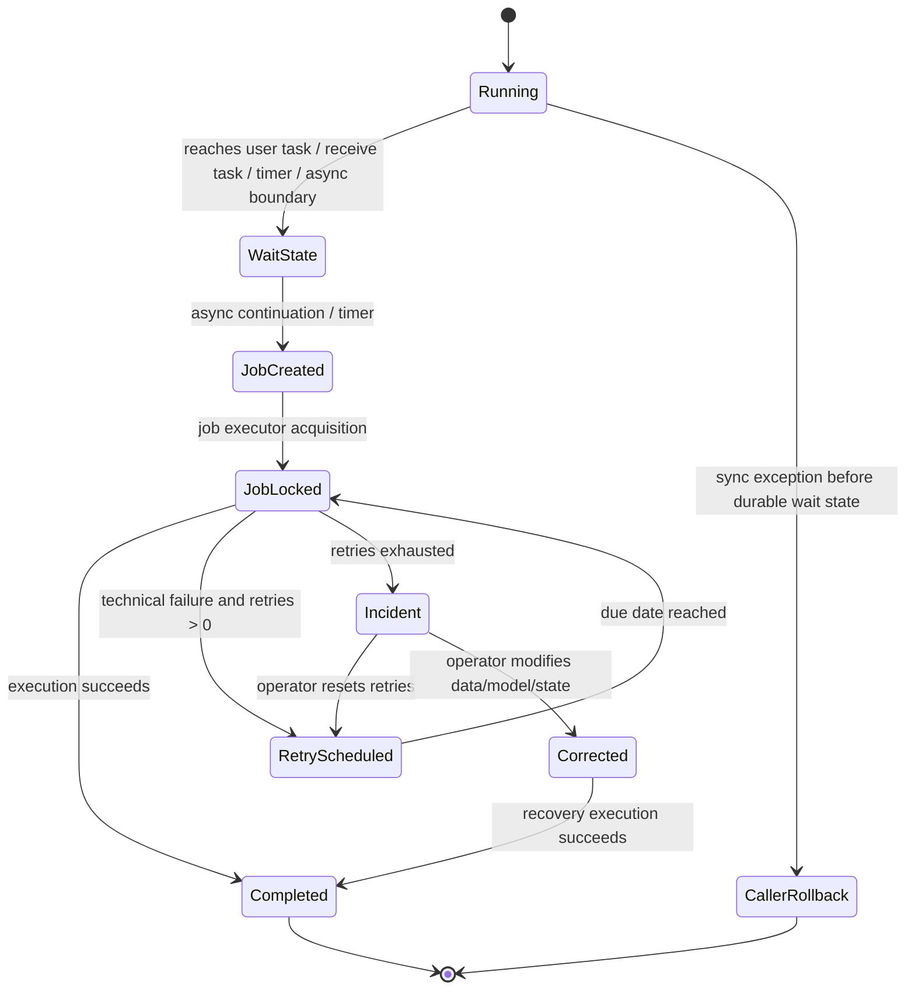

Konsekuensi penting:

- Synchronous exception sebelum wait state biasanya dikembalikan ke caller dan transaksi rollback.
- Exception di job executor tidak dikembalikan ke user request; ia menjadi failed job/retry/incident.
- Incident bukan "end state" bisnis. Incident adalah state operasional yang mengatakan: engine tidak bisa lanjut otomatis.
- Recovery harus didesain seperti API produksi: punya precondition, authorization, audit, dan rollback plan.

---

## 3. Taxonomy Failure dalam Camunda 7

Kita butuh vocabulary yang tajam.

| Failure type | Contoh | Harus dimodelkan sebagai | Recovery owner |
|---|---|---|---|
| Business rejection | Limit kredit tidak cukup, dokumen invalid, approval ditolak | BPMN path normal, gateway, DMN result, BPMN error jika berasal dari reusable subprocess/delegate boundary | Business/user |
| Expected alternative | Customer tidak merespons sampai SLA, supervisor override | Timer boundary, escalation, alternate path | Business/operator |
| Transient technical failure | Timeout HTTP, database downstream sementara down, 503 | Failed job retry / external task retry | System, lalu operator jika habis retry |
| Permanent technical failure | Endpoint salah konfigurasi, schema mismatch, credential invalid | Incident | Platform/app owner |
| Data defect | Missing required variable, invalid enum, stale reference | Incident atau human correction task jika correction adalah bagian domain | App owner/business ops |
| Model defect | Gateway tidak punya path valid, deadlock join, wrong message name | Incident + model fix + migration/modification | Workflow owner |
| Duplicate side effect risk | Payment already submitted lalu delegate retry | Incident sampai idempotency/resolution jelas | App owner + business ops |
| Compensatable failure | Shipment booked tetapi order canceled | Compensation model, saga step, manual correction | Business process owner |

Weak assumption yang harus dibuang: "semua error harus jadi BPMN error." Salah. BPMN error adalah **business-modeled exception**, bukan wadah semua Java exception.

---

## 4. BPMN Error vs Java Exception vs Incident

### 4.1 Java exception

Java exception adalah sinyal teknis di level code. Di Camunda, akibatnya bergantung pada posisi transaction boundary.

```java
@Component("reserveInventoryDelegate")
public class ReserveInventoryDelegate implements JavaDelegate {
  private final InventoryClient inventoryClient;

  public ReserveInventoryDelegate(InventoryClient inventoryClient) {
    this.inventoryClient = inventoryClient;
  }

  @Override
  public void execute(DelegateExecution execution) {
    String orderId = (String) execution.getVariable("orderId");
    inventoryClient.reserve(orderId); // timeout here may fail the command/job
  }
}
```

Jika service task ini synchronous dan dipanggil dalam request `runtimeService.startProcessInstanceByKey(...)`, exception bisa membuat request gagal dan transaksi rollback. Jika activity diberi `asyncBefore="true"`, request awal bisa commit dulu, lalu failure terjadi di job executor.

### 4.2 BPMN error

BPMN error digunakan ketika failure adalah bagian domain dan proses punya jalur eksplisit untuk menanganinya.

```java
throw new BpmnError("DOCUMENT_REJECTED", "Document did not pass validation");
```

BPMN error cocok untuk:

- validation bisnis yang sudah diantisipasi;
- child process yang mengembalikan domain failure ke parent;
- reusable service task yang punya boundary error event;
- kondisi yang harus terlihat di diagram sebagai branch bisnis.

BPMN error tidak cocok untuk:

- database down;
- REST timeout;
- NullPointerException;
- bug mapping variable;
- missing environment variable;
- error yang operator harus investigasi secara teknis.

### 4.3 Incident

Incident adalah penanda operational failure. Camunda 7 mendukung incident type bawaan seperti:

| Incident type | Kapan terjadi | Arti operasional |
|---|---|---|
| `failedJob` | Retry job timer/async continuation habis | Execution stuck dan tidak lanjut otomatis sampai operator action. |
| `failedExternalTask` | Worker melaporkan failure dengan retries `<= 0` | External task tidak akan di-fetch worker sampai retries direset. |
| Custom incident | Dibuat via API | Aplikasi ingin menandai kondisi stuck/custom yang melekat pada execution. |

---

## 5. Transaction Boundary Menentukan Bentuk Failure

Contoh model:

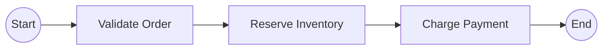

Jika semua service task synchronous dalam satu command, maka failure di `Charge Payment` bisa rollback `Validate Order` dan `Reserve Inventory` dari perspektif Camunda database. Tetapi side effect eksternal yang sudah terjadi tidak otomatis rollback.

Production model yang lebih aman:

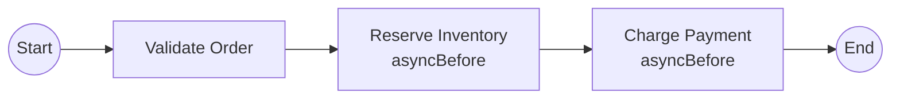

Dengan async boundary:

- state sebelum remote call durable;
- failed job terlihat di Cockpit/API;
- retry bisa dikontrol;
- operator bisa melihat activity yang stuck;
- caller tidak menunggu downstream terlalu lama.

Namun async boundary bukan magic. Ia hanya memindahkan failure dari caller ke job executor. Jika delegate tidak idempotent, retry tetap berbahaya.

---

## 6. Failed Job Lifecycle

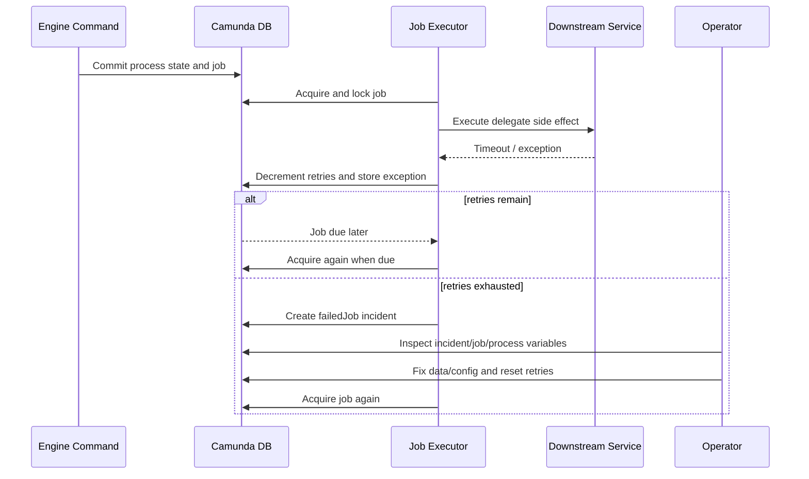

Camunda job failure should be read as:

> "Engine reached a durable continuation point, tried to continue asynchronously, failed, and now either will retry or requires intervention."

### 6.1 What is stored

The important artifacts:

| Artifact | Purpose |
|---|---|
| Runtime job | Pending continuation, timer, async task, batch seed/monitor job, etc. |
| Exception message | Short diagnostic message. |
| Exception stack trace | Full error detail available via management APIs. |
| Incident | Operational marker when retries are exhausted or external task retries reach zero. |
| Historic records | Depending on history level, evidence of activity/task/job/incident lifecycle. |

### 6.2 Retry is not recovery by itself

Retry only helps if the failure is transient or the operation is idempotent.

| Situation | Retry safe? | Reason |
|---|---:|---|
| HTTP 503 before downstream processed request | Usually yes | Downstream likely did not commit side effect. |
| Timeout after sending payment request | Maybe no | Payment may have been accepted. Need idempotency key or reconciliation. |
| Missing process variable | No | Same invalid state will fail again. |
| Bad code deployment | No | Needs code/config fix. |
| Optimistic locking in parallel branch | Usually yes | Engine retry often resolves concurrent update race. |
| Deadlock caused by wrong BPMN join | No | Model must be fixed or instance modified. |

---

## 7. Retry Configuration Strategy

Camunda supports retry control for failed jobs. In BPMN, a common pattern is to define retry cycles using Camunda extension elements.

```xml
<bpmn:serviceTask id="ChargePayment" name="Charge Payment"
                  camunda:delegateExpression="${chargePaymentDelegate}"
                  camunda:asyncBefore="true">
  <bpmn:extensionElements>
    <camunda:failedJobRetryTimeCycle>R5/PT2M</camunda:failedJobRetryTimeCycle>
  </bpmn:extensionElements>
</bpmn:serviceTask>
```

Interpretation:

- `R5` means retry up to five attempts according to the cycle expression.
- `PT2M` means interval around two minutes.
- Use explicit retry cycles for remote calls and timers with known failure behavior.

### 7.1 Retry policy by dependency class

| Dependency | Suggested policy | Reason |
|---|---|---|
| Internal DB read | Few quick retries only if concurrency/transient DB issue | Long retries usually hide bad transaction design. |
| Internal HTTP command | Retry with idempotency key and bounded attempts | Avoid duplicate side effects. |
| External payment | Prefer external task + idempotency + reconciliation | Payment ambiguity is business-critical. |
| Notification/email | Retry more aggressively, failure may be non-critical | But avoid infinite backlog. |
| Document generation | Retry if deterministic input and worker stateless | Store input contract/version. |
| Human task SLA timer | Usually no custom retry needed | Timer firing failure usually code/config issue after timer triggers. |

### 7.2 Retry backoff design

Do not use same retry rhythm for every task. A workflow with 100k stuck instances and `R10/PT10S` can hammer the same broken dependency.

Prefer:

- short retry for optimistic locking/transient DB;
- medium retry for internal services;
- exponential/backoff-like schedules where supported by expression strategy;
- operational alert before backlog becomes large;
- circuit breaker at worker/application layer for downstream outages.

---

## 8. Idempotency Is the Price of Retry

A Camunda retry means the delegate or worker may execute again. Therefore every side-effecting operation needs an idempotency strategy.

### 8.1 Idempotency key construction

Good idempotency key:

```text
{processDefinitionKey}:{processInstanceBusinessKey}:{activityId}:{businessOperationId}
```

Example:

```text
loan-origination:LOAN-2026-000918:reserve-funds:RESERVATION-000918
```

Avoid using only `processInstanceId`. During migration/restart/retry, it may not encode the real business operation.

### 8.2 Delegate pattern

```java
@Component("sendApprovalNotificationDelegate")
public class SendApprovalNotificationDelegate implements JavaDelegate {
  private final NotificationCommandService notificationService;

  public SendApprovalNotificationDelegate(NotificationCommandService notificationService) {
    this.notificationService = notificationService;
  }

  @Override
  public void execute(DelegateExecution execution) {
    String caseId = (String) execution.getVariable("caseId");
    String taskId = (String) execution.getVariable("approvalTaskId");

    String idempotencyKey = "case:" + caseId + ":approval-notification:" + taskId;

    notificationService.sendOnce(new SendNotificationCommand(
      idempotencyKey,
      caseId,
      "APPROVAL_REQUIRED"
    ));
  }
}
```

The delegate should not decide whether duplicate notification is acceptable. That rule belongs in a domain/application service with durable idempotency storage.

---

## 9. Recovery API Patterns

Camunda gives several APIs relevant for recovery.

### 9.1 Query incidents

```java
List<Incident> incidents = runtimeService.createIncidentQuery()
    .processDefinitionKey("loan-origination")
    .incidentType("failedJob")
    .list();
```

### 9.2 Get failed job and stack trace

```java
Incident incident = runtimeService.createIncidentQuery()
    .incidentId(incidentId)
    .singleResult();

String jobId = incident.getConfiguration();

String stackTrace = managementService.getJobExceptionStacktrace(jobId);
```

For failed job incidents, the incident configuration commonly points to the job id. Code should still be defensive because custom incidents may use different configuration semantics.

### 9.3 Reset job retries

```java
managementService.setJobRetries(jobId, 1);
```

Resetting retries is not the same as fixing the cause. Before resetting:

1. classify failure;
2. confirm side effects;
3. fix variable/config/downstream issue;
4. ensure delegate is safe to re-execute;
5. document the operation.

### 9.4 Execute job manually

```java
managementService.executeJob(jobId);
```

Manual execution is useful in controlled maintenance operations and tests. In production, prefer resetting retry and letting normal job acquisition pick it up unless you intentionally want synchronous operator-triggered execution.

---

## 10. Variable Correction Before Retry

Many incidents are not fixed by code deployment. They are fixed by correcting invalid process variables.

```java
runtimeService.setVariable(executionId, "customerSegment", "ENTERPRISE");
managementService.setJobRetries(jobId, 1);
```

But variable correction must be treated as a governed operation.

### 10.1 Correction checklist

| Question | Why it matters |
|---|---|
| What invariant was violated? | Prevents random patching. |
| Is variable global or local? | Avoids changing sibling branch behavior accidentally. |
| Was the bad value already used by previous activities? | May require compensation/reconciliation. |
| Is history enough to prove who changed what? | Regulatory systems need defensible trace. |
| Does the process model expect a different schema version? | Could require migration or instance modification. |
| Will retry duplicate an external side effect? | Avoids creating a second charge/reservation/notification. |

### 10.2 Safer alternative: correction task

For recurring business data corrections, model an explicit human correction task instead of relying on ops variable edits.

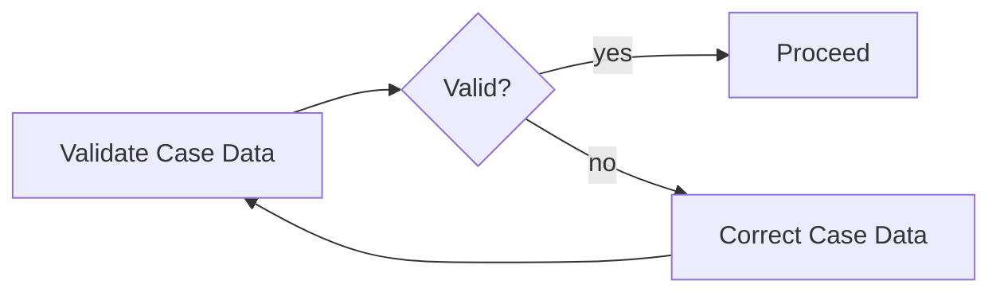

This keeps correction in the business audit trail, not only in platform operations.

---

## 11. External Task Failure Model

External tasks have a different failure shape because the work is executed outside the engine JVM.

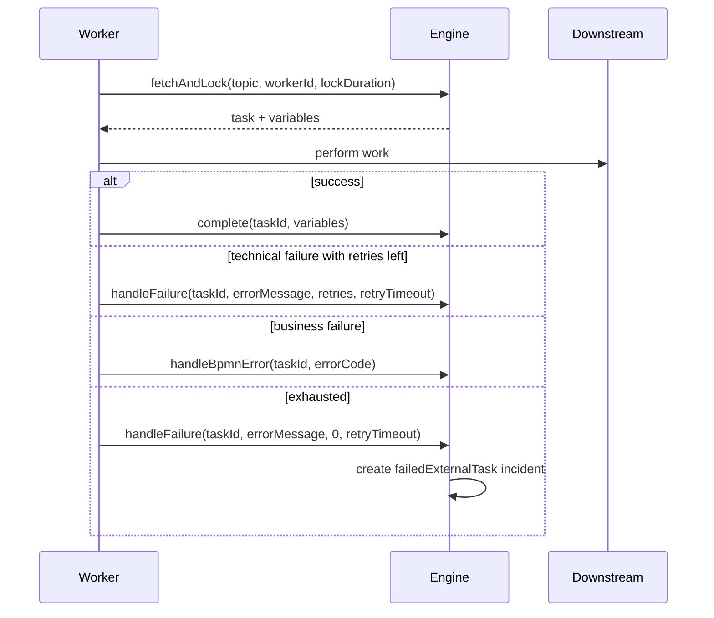

The worker must decide whether to call:

| Worker action | Meaning |
|---|---|
| `complete` | Work done, process can continue. |
| `handleFailure` | Technical failure; engine should retry according to remaining retry count/timeout. |
| `handleBpmnError` | Business-modeled failure; process should follow BPMN error path. |

Anti-pattern: worker catches all exceptions and calls `complete` with a `status = FAILED` variable. That hides operational failure from the engine and forces every downstream activity to interpret ambiguous state.

---

## 12. Custom Incidents

Camunda allows custom incidents tied to an existing execution.

```java
runtimeService.createIncident(
  "caseDataMismatch",
  executionId,
  caseId,
  "Case data projection is inconsistent with process variables"
);
```

Custom incidents are useful when:

- the engine itself can continue but should not;
- a consistency monitor detects a mismatch;
- a business-critical external reconciliation fails;
- you need Cockpit/API visibility for a custom stuck condition.

They are not useful as a generic logging mechanism. If every warning becomes an incident, operators will ignore incidents.

### 12.1 Custom incident design rules

| Rule | Explanation |
|---|---|
| Incident type must be stable | Operators and dashboards depend on it. |
| Message must be actionable | Include what is wrong and where to look, not only stack traces. |
| Configuration should reference recovery context | Example: external reconciliation id, case id, job id, or command id. |
| There must be a documented resolver | Custom incidents without runbook are noise. |
| Resolution should be auditable | Record who resolved and why. |

---

## 13. Recovery Decision Tree

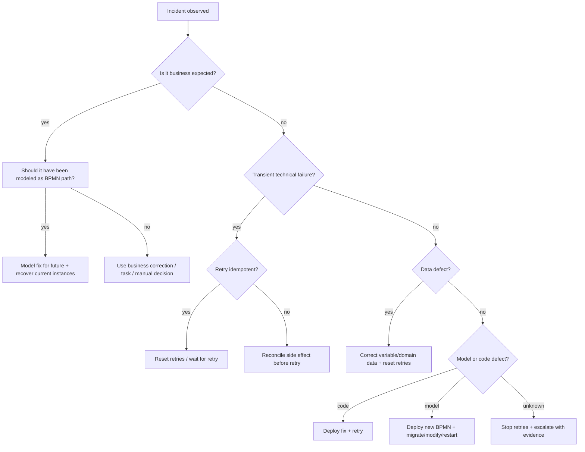

This tree is more useful than a generic "retry failed jobs" SOP.

---

## 14. Operational Runbook Template

Use this template for each critical service task / external task topic.

```md
# Runbook: <activity/topic name>

## Scope
- Process: `<processDefinitionKey>`
- Activity: `<activityId>`
- Incident type: `failedJob` / `failedExternalTask` / custom
- Owning team: `<team>`

## Business impact
- What business cases are blocked?
- SLA impact?
- Customer/regulatory impact?

## Failure classification
- Transient technical
- Permanent technical
- Data defect
- Duplicate side effect risk
- Model defect
- Business exception incorrectly modeled

## Diagnostics
- Query incident by process definition/activity.
- Read exception stack trace.
- Inspect variables: `<safe list>`.
- Check downstream correlation/idempotency record.
- Check application logs using business key and process instance id.

## Safe recovery actions
1. Confirm no duplicate side effect.
2. Fix dependency/config/data.
3. Correct variable if approved.
4. Reset retries to 1 or approved count.
5. Monitor completion.

## Unsafe actions
- Do not update `ACT_RU_*` tables manually.
- Do not reset retries before side-effect reconciliation.
- Do not delete job unless process instance state is understood.
- Do not complete external task manually without domain confirmation.

## Audit evidence
- Incident id
- Process instance id
- Business key
- Operator
- Change reason
- Before/after variable snapshot if allowed
- Approval reference
```

---

## 15. Modeling Recovery in BPMN

Some recovery belongs in BPMN, some belongs in operations.

### 15.1 Timer escalation

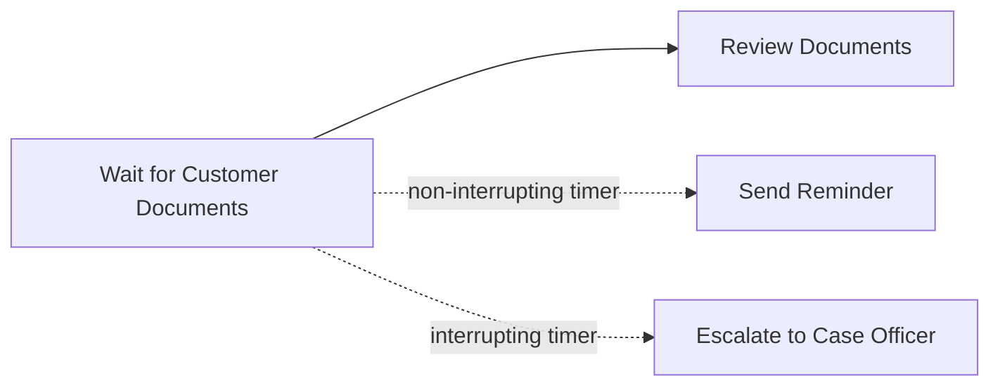

Use BPMN when the alternative path is a business rule.

### 15.2 Manual correction path

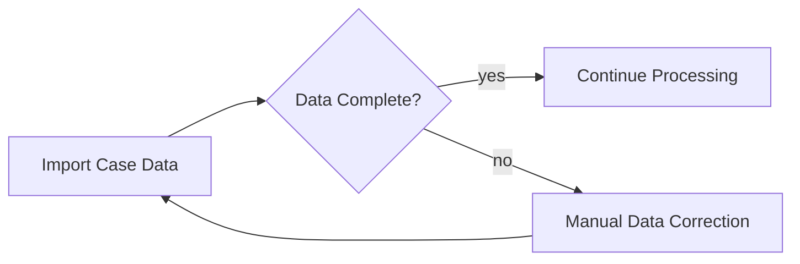

Use BPMN when correction is expected and should be visible to business users.

### 15.3 Incident for unexpected technical defect

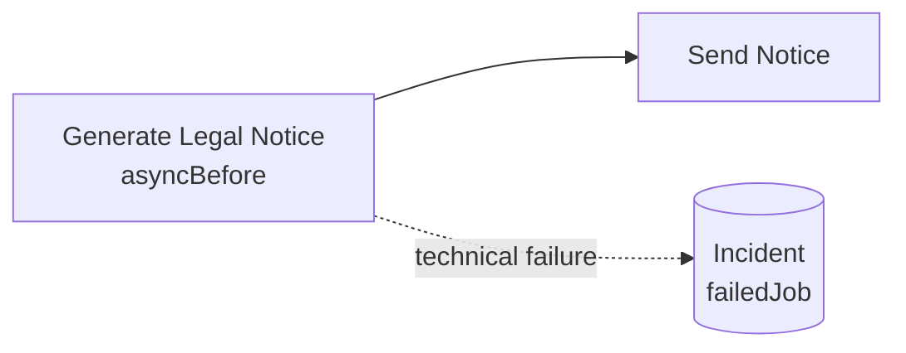

Do not draw every technical failure as a boundary event. That makes diagrams unreadable and hides the real operational control point: job/external task retry.

---

## 16. Error Handling in Delegates

### 16.1 Bad pattern: swallowing exception

```java
@Override
public void execute(DelegateExecution execution) {
  try {
    paymentClient.charge(...);
  } catch (Exception e) {
    execution.setVariable("paymentStatus", "FAILED");
  }
}
```

Why bad:

- engine thinks activity completed successfully;
- retry/incident is bypassed;
- later tasks must interpret ambiguous variable;
- operations cannot see failed job;
- actual stack trace may only exist in logs.

### 16.2 Better pattern: classify business vs technical

```java
@Override
public void execute(DelegateExecution execution) {
  try {
    paymentService.charge(commandFrom(execution));
  } catch (PaymentRejectedException e) {
    throw new BpmnError("PAYMENT_REJECTED", e.getMessage());
  } catch (PaymentProviderUnavailableException e) {
    throw e; // technical failure: let Camunda retry or create incident
  }
}
```

Rules:

- Throw `BpmnError` only for expected domain failures with modeled boundary event.
- Let technical exceptions fail the command/job.
- Do not convert unknown exceptions into successful variables.
- Do not catch `Exception` unless you rethrow or enrich observability safely.

---

## 17. Incident Observability

An incident needs to become a signal in your monitoring system.

### 17.1 Metrics to track

| Metric | Why it matters |
|---|---|
| Open incident count by process/activity/type | Primary stuck-state indicator. |
| Incident age p50/p95/max | Shows recovery SLA breach. |
| Failed job retry count by activity | Detects flaky dependency before incident. |
| External task failures by topic/worker | Identifies problematic worker/dependency. |
| Reopened incidents | Indicates bad recovery or non-idempotent fix. |
| Manual retry count | Detects recurring issue hidden by operator work. |
| Incidents per deployment version | Identifies regression release. |

### 17.2 Tags and correlation

Every process should have:

- business key;
- process definition key and version;
- activity id;
- tenant id if multi-tenant;
- application deployment version;
- downstream correlation id;
- idempotency key for external side effects.

Without these, incident recovery becomes archaeology.

---

## 18. Incident Ownership Model

For production systems, ownership must be explicit.

| Incident category | Primary owner | Secondary owner |
|---|---|---|
| Failed job due to delegate bug | Workflow application team | Platform team |
| Failed external task due to worker | Worker owning team | Workflow owner |
| Wrong process variable | Business operations or source-system owner | Workflow application team |
| Model deadlock | Workflow model owner | Platform team |
| Job executor backlog | Platform/SRE | Application teams |
| Downstream outage | Downstream owning team | Workflow application team |
| Custom incident | Team that defined the incident type | Platform/SRE |

Do not assign all incidents to "Camunda team". The engine reports the stuck state; it is rarely the true owner of the business/technical cause.

---

## 19. Anti-Patterns and Common Pitfalls

### 19.1 Treating incident as process failure

An incident is not necessarily business failure. It is a technical/operational stop. The business case may still be valid and waiting for recovery.

### 19.2 Retrying without side-effect reconciliation

Most dangerous for payment, reservation, account mutation, legal notice, regulatory notification, and external filing.

### 19.3 Modeling technical outage as BPMN error

If downstream `CustomerService` is down, drawing `CustomerServiceUnavailableError` as a BPMN path usually pollutes the model. Use async retry/incident unless business has a real alternative.

### 19.4 Updating Camunda runtime tables directly

Direct SQL mutation of `ACT_RU_*` tables bypasses engine invariants, caches, optimistic locking assumptions, and incident handlers. Use Java/REST APIs.

### 19.5 Completing external task after partial failure

If worker partially executed side effect but cannot confirm result, do not `complete`. Reconcile first.

### 19.6 Infinite retry cycles

Infinite retry hides systemic failure and creates load storms. Bounded retries plus incident is healthier.

### 19.7 No business key

Incident with only process instance id is slow to triage. Business key makes incident actionable.

### 19.8 No runbook

Incident type without recovery instructions becomes alert fatigue.

---

## 20. Engineering Exercise

Build a small process:

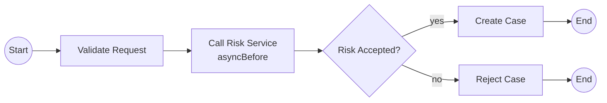

Implement:

1. `ValidateRequestDelegate` throws `BpmnError("INVALID_REQUEST")` for domain validation.
2. `CallRiskServiceDelegate` throws technical exception for simulated timeout.
3. Add retry cycle to risk service task.
4. Start process with business key.
5. Force retries to exhaust.
6. Query incident via `RuntimeService`.
7. Get stack trace via `ManagementService`.
8. Fix variable/config.
9. Reset retries.
10. Verify process completes.

Expected learning: you should see different outcomes for BPMN error vs technical exception.

---

## 21. Production Checklist

Before shipping a Camunda workflow, check:

- [ ] Every remote side-effecting task has async boundary or external task pattern.
- [ ] Every retryable operation has idempotency strategy.
- [ ] Every expected business rejection is modeled as normal BPMN/DMN path or BPMN error.
- [ ] Every unexpected technical failure can become visible as failed job/external task incident.
- [ ] Critical activities have explicit retry policy.
- [ ] Business key is always set.
- [ ] Incident dashboards exist by process/activity/type/age.
- [ ] Operators have runbooks for top incident categories.
- [ ] Recovery actions use Camunda APIs, not direct DB mutation.
- [ ] Variable correction policy is documented.
- [ ] Process instance modification/restart/migration rules are known for model defects.
- [ ] Audit trail records operator actions and reason.
- [ ] External side effect reconciliation exists for ambiguous failures.

---

## 22. Summary

The production-grade mental model is:

> Camunda error handling is not exception handling. It is durable failure classification, retry safety, operational visibility, and auditable recovery.

Key takeaways:

- Use BPMN error for expected business failures.
- Let technical exceptions fail jobs so Camunda can retry or raise incident.
- Use incidents as operational stuck-state markers.
- Retry requires idempotency.
- Async boundary changes where failure appears, not whether failure exists.
- External tasks require explicit worker failure semantics.
- Recovery is a governed process, not a button click.

Next: we move from engine internals into implementation with **Spring Boot Embedded Engine**.
