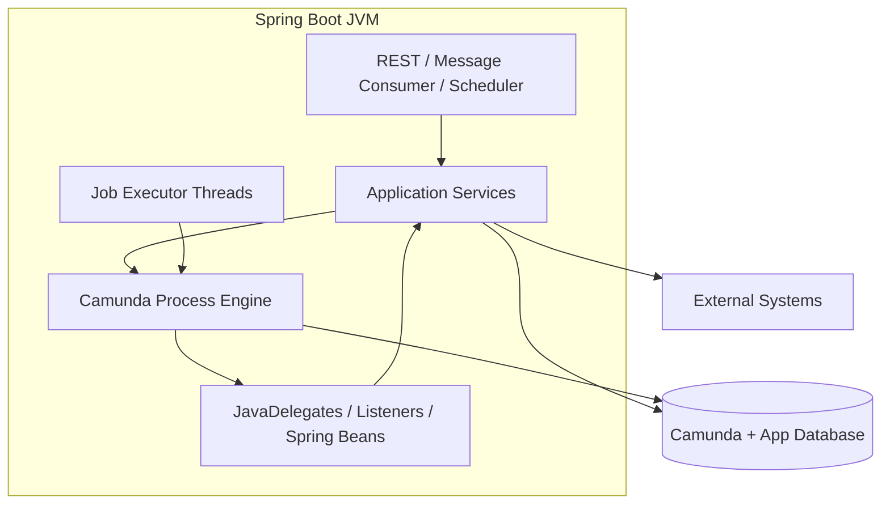
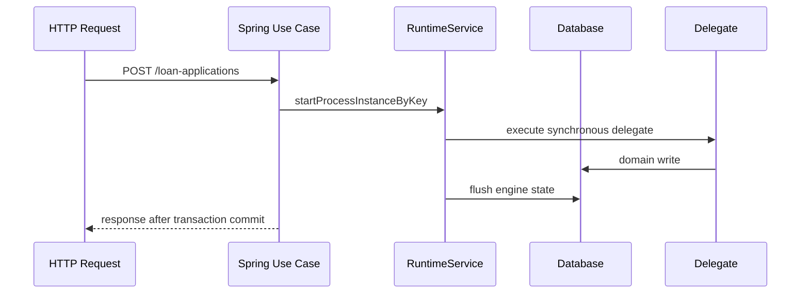
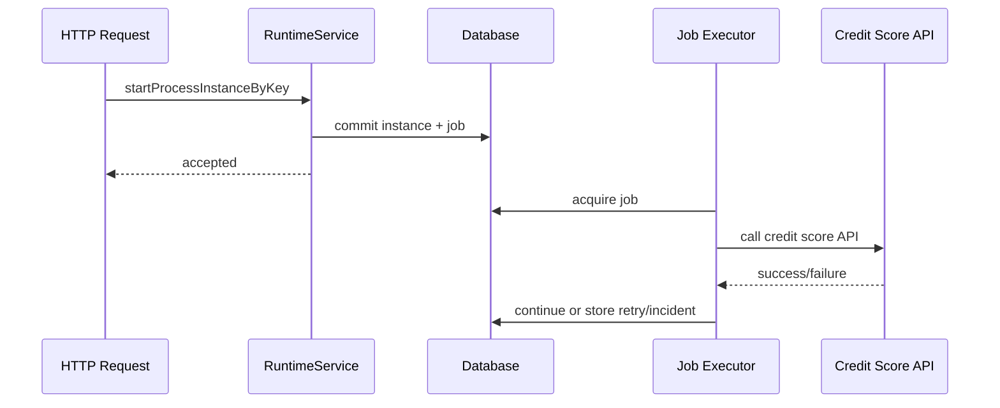

# Part 016 — Spring Boot Embedded Engine

> Target: setelah part ini, kita bisa membuat aplikasi Spring Boot dengan Camunda 7 embedded engine secara benar, tetapi juga tahu batas bahayanya. Embedded engine bukan sekadar dependency Maven. Ia adalah keputusan arsitektur: engine, job executor, transaction manager, datasource, deployment lifecycle, dan business application hidup dalam satu JVM.

Camunda 7.24 documentation menjelaskan bahwa Camunda Engine dapat digunakan di Spring Boot application melalui Spring Boot starters. Starter tersebut melakukan pre-configuration untuk process engine, REST API, dan web applications sehingga dapat digunakan sebagai standalone process application. Dokumentasi 7.24 juga menyebut starter membutuhkan Java 17 dan supported deployment scenario adalah executable JAR dengan embedded Tomcat dan satu embedded process engine, plus webapps jika dibutuhkan.

Referensi utama:

- Camunda 7.24 — Spring Boot Integration: <https://docs.camunda.org/manual/7.24/user-guide/spring-boot-integration/>
- Camunda 7.24 — Spring Boot Starter Configuration: <https://docs.camunda.org/manual/7.24/user-guide/spring-boot-integration/configuration/>
- Camunda 7.24 — Spring Boot Version Compatibility: <https://docs.camunda.org/manual/7.24/user-guide/spring-boot-integration/version-compatibility/>
- Camunda 7.24 — Process Engine Bootstrapping: <https://docs.camunda.org/manual/7.24/user-guide/process-engine/process-engine-bootstrapping/>
- Camunda 7.24 — Spring Framework Transactions: <https://docs.camunda.org/manual/7.24/user-guide/spring-framework-integration/transactions/>
- Camunda 7.24 — Deployment: <https://docs.camunda.org/manual/7.24/user-guide/spring-framework-integration/deployment/>

---

## 1. Kaufman Skill Deconstruction

Untuk Spring Boot + Camunda 7, skill-nya bukan "bisa generate project". Skill-nya adalah mengontrol boundary antara process engine dan application runtime.

| Sub-skill | Target kemampuan |
|---|---|
| Bootstrapping | Bisa membuat minimal Spring Boot app dengan Camunda engine dan datasource eksplisit. |
| Dependency reasoning | Bisa memilih starter engine, REST, webapp, external task client, dan EE artifact dengan sadar. |
| Configuration discipline | Bisa mengatur datasource, schema update, history, job executor, deployment, authorization, metrics. |
| Transaction boundary | Bisa menjelaskan kapan Spring transaction dan Camunda command context berinteraksi. |
| Bean integration | Bisa menggunakan delegate expression ke Spring beans tanpa mencampur domain logic ke BPMN glue code. |
| Deployment lifecycle | Bisa mengontrol auto-deployment BPMN/DMN/forms dan versioning-nya. |
| Production readiness | Bisa menentukan kapan embedded engine cocok dan kapan harus remote/shared/Camunda Run. |
| Testability | Bisa menjalankan process tests dengan profile yang repeatable. |

### 1.1 Performance target

Kita dianggap menguasai part ini jika bisa:

1. Menjelaskan apa yang terjadi saat Spring Boot app start dan engine dibuat.
2. Menunjukkan service beans Camunda (`RuntimeService`, `TaskService`, dsb.) dipakai melalui application boundary.
3. Menjalankan BPMN deployment dari classpath dengan deterministic naming.
4. Mengatur database dan schema lifecycle tanpa H2 accidental production.
5. Memasang async service task dan memahami job executor threads di JVM yang sama.
6. Menghindari anti-pattern "engine embedded di semua microservice".

---

## 2. Mental Model: One JVM, Two Responsibilities

Embedded engine berarti process engine berjalan di process yang sama dengan Spring Boot application.



Important consequences:

- Application startup also starts engine lifecycle.
- Job executor runs inside the same JVM unless disabled.
- Delegate code can call Spring beans directly.
- Engine database load and application database load share infrastructure if using same datasource.
- A bad delegate can hurt the whole application process.
- Scaling application pods also scales job executor capacity unless configured otherwise.

Embedded engine is powerful because local Java calls are simple. It is risky because ownership boundaries can blur.

---

## 3. Starter Dependency Strategy

### 3.1 Minimal engine starter

```xml
<dependency>
  <groupId>org.camunda.bpm.springboot</groupId>
  <artifactId>camunda-bpm-spring-boot-starter</artifactId>
  <version>7.24.0</version>
</dependency>
```

This brings Camunda engine integration into the Spring Boot app.

### 3.2 Optional REST API starter

```xml
<dependency>
  <groupId>org.camunda.bpm.springboot</groupId>
  <artifactId>camunda-bpm-spring-boot-starter-rest</artifactId>
  <version>7.24.0</version>
</dependency>
```

Use this when remote clients need Camunda REST endpoints. Do not expose it publicly without security boundary.

### 3.3 Optional webapp starter

```xml
<dependency>
  <groupId>org.camunda.bpm.springboot</groupId>
  <artifactId>camunda-bpm-spring-boot-starter-webapp</artifactId>
  <version>7.24.0</version>
</dependency>
```

Use webapp starter when you intentionally want Cockpit/Tasklist/Admin in the same Spring Boot app. For production, consider whether operations UI should live in the same deployment unit as business API.

### 3.4 External task client is different

```xml
<dependency>
  <groupId>org.camunda.bpm.springboot</groupId>
  <artifactId>camunda-bpm-spring-boot-starter-external-task-client</artifactId>
  <version>7.24.0</version>
</dependency>
```

This is for a worker app that polls external tasks. It is not the same as embedding the process engine.

---

## 4. Minimal Project Structure

```text
loan-workflow-service/
  pom.xml
  src/main/java/com/acme/loanworkflow/
    LoanWorkflowApplication.java
    api/
      LoanProcessController.java
    process/
      StartLoanApplicationUseCase.java
      delegates/
        ValidateLoanApplicationDelegate.java
        RequestCreditScoreDelegate.java
        CreateCaseDelegate.java
    domain/
      LoanApplicationService.java
      CreditScoreClient.java
  src/main/resources/
    application.yml
    processes/
      loan-origination.bpmn
      loan-risk.dmn
```

Recommended boundary:

- `api` receives HTTP/message input.
- `process` contains workflow adapter/use case layer.
- `delegates` are thin glue from Camunda to application service.
- `domain` owns business rules and side effects.
- BPMN/DMN files are versioned resources, not runtime-generated mystery artifacts.

---

## 5. Minimal Spring Boot Application

```java
package com.acme.loanworkflow;

import org.springframework.boot.SpringApplication;
import org.springframework.boot.autoconfigure.SpringBootApplication;

@SpringBootApplication
public class LoanWorkflowApplication {
  public static void main(String[] args) {
    SpringApplication.run(LoanWorkflowApplication.class, args);
  }
}
```

With Camunda starter on the classpath, Spring Boot auto-configuration creates the process engine and exposes Camunda services as Spring beans.

Example service using `RuntimeService`:

```java
@Service
public class StartLoanApplicationUseCase {
  private final RuntimeService runtimeService;

  public StartLoanApplicationUseCase(RuntimeService runtimeService) {
    this.runtimeService = runtimeService;
  }

  public String start(StartLoanApplicationCommand command) {
    ProcessInstance instance = runtimeService
        .startProcessInstanceByKey(
            "loan-origination",
            command.applicationNumber(),
            Map.of(
                "applicationNumber", command.applicationNumber(),
                "applicantId", command.applicantId(),
                "requestedAmount", command.requestedAmount()
            )
        );

    return instance.getProcessInstanceId();
  }
}
```

Use business key intentionally. Do not start production processes without a business key.

---

## 6. Baseline `application.yml`

```yaml
spring:
  application:
    name: loan-workflow-service
  datasource:
    url: jdbc:postgresql://localhost:5432/loan_workflow
    username: loan_workflow
    password: change-me
    driver-class-name: org.postgresql.Driver
  jackson:
    default-property-inclusion: non_null

camunda:
  bpm:
    enabled: true
    process-engine-name: default
    database:
      schema-update: false
    history-level: full
    deployment-resource-pattern:
      - classpath*:/processes/**/*.bpmn
      - classpath*:/processes/**/*.dmn
    job-execution:
      enabled: true
      deployment-aware: true
    metrics:
      enabled: true
    authorization:
      enabled: true
```

This is illustrative, not universal. Key ideas:

- production datasource must be explicit;
- `schema-update: false` in production avoids accidental schema mutation;
- history level should be a conscious audit/performance decision;
- deployment resource pattern should be deterministic;
- job execution must be intentionally enabled/disabled per node role;
- authorization should not be an afterthought.

### 6.1 Environment split

| Environment | Schema update | Job executor | History | Webapps |
|---|---|---|---|---|
| Local dev | Usually true/create-drop acceptable | Enabled | Full for learning | Optional |
| CI integration test | Controlled ephemeral DB | Enabled or deterministic | Full/audit | Usually no |
| Staging | Migration-managed | Enabled like prod | Prod-like | Maybe |
| Production | Migration-managed, `false` | Role-based | Explicit | Controlled |

---

## 7. Database Strategy

Camunda stores runtime, repository, history, identity, authorization, and general metadata in its database tables. For embedded engine, the app must own database lifecycle carefully.

### 7.1 Same DB vs separate DB

| Option | Pros | Cons |
|---|---|---|
| Same physical DB/schema as app | Simpler local transaction, fewer infrastructure objects | Coupling, noisy query/load interaction, migration blast radius |
| Same DB, separate schema | Better separation, still simple ops | Requires schema permissions and migration discipline |
| Separate DB | Strong isolation, clearer ownership | Cross-resource consistency must be explicit |

For serious production, avoid casual mixing of domain tables and Camunda tables without a clear migration/backup/performance plan.

### 7.2 Schema migration

Production schema should usually be managed via Flyway/Liquibase or platform deployment procedures, not automatic engine schema update.

Bad:

```yaml
camunda:
  bpm:
    database:
      schema-update: true
```

Safer production stance:

```yaml
camunda:
  bpm:
    database:
      schema-update: false
```

Then apply Camunda DDL explicitly as part of release management.

---

## 8. BPMN Deployment in Spring Boot

Put BPMN/DMN under resources and let deployment be deterministic.

```text
src/main/resources/processes/loan-origination.bpmn
src/main/resources/processes/loan-risk.dmn
```

Configuration:

```yaml
camunda:
  bpm:
    deployment-resource-pattern:
      - classpath*:/processes/**/*.bpmn
      - classpath*:/processes/**/*.dmn
```

### 8.1 Deployment rules

| Rule | Reason |
|---|---|
| Stable process id | `processDefinitionKey` is your runtime contract. |
| Version every deployment | Running instances remain on old definitions unless migrated. |
| Use meaningful resource names | Easier Cockpit and repository diagnosis. |
| Set history time to live | Required for cleanup discipline. |
| Avoid runtime-generated BPMN in normal apps | Hard to review, test, and audit. |
| Do not deploy sample BPMN accidentally | Classpath scanning can deploy more than intended. |

---

## 9. Thin Delegate Pattern with Spring Beans

BPMN service task:

```xml
<bpmn:serviceTask id="ValidateLoanApplication"
                  name="Validate Loan Application"
                  camunda:delegateExpression="${validateLoanApplicationDelegate}" />
```

Spring delegate:

```java
@Component("validateLoanApplicationDelegate")
public class ValidateLoanApplicationDelegate implements JavaDelegate {
  private final LoanApplicationService loanApplicationService;

  public ValidateLoanApplicationDelegate(LoanApplicationService loanApplicationService) {
    this.loanApplicationService = loanApplicationService;
  }

  @Override
  public void execute(DelegateExecution execution) {
    String applicationNumber = (String) execution.getVariable("applicationNumber");

    ValidationResult result = loanApplicationService.validate(applicationNumber);

    if (!result.accepted()) {
      throw new BpmnError("LOAN_APPLICATION_INVALID", result.reason());
    }
  }
}
```

Application service:

```java
@Service
public class LoanApplicationService {
  public ValidationResult validate(String applicationNumber) {
    // Domain logic here, not in DelegateExecution plumbing.
    return ValidationResult.accepted();
  }
}
```

Delegate rule:

> Delegate translates between Camunda execution context and application boundary. It should not become the business service itself.

---

## 10. Starting Processes: Application API Boundary

Avoid controllers directly calling low-level Camunda APIs in arbitrary ways. Wrap process operations in use cases.

```java
@RestController
@RequestMapping("/loan-applications")
public class LoanProcessController {
  private final StartLoanApplicationUseCase startLoanApplication;

  public LoanProcessController(StartLoanApplicationUseCase startLoanApplication) {
    this.startLoanApplication = startLoanApplication;
  }

  @PostMapping
  public ResponseEntity<StartLoanApplicationResponse> start(@RequestBody StartLoanApplicationRequest request) {
    String processInstanceId = startLoanApplication.start(request.toCommand());
    return ResponseEntity.accepted().body(new StartLoanApplicationResponse(processInstanceId));
  }
}
```

The use case owns:

- process key;
- business key;
- initial variables;
- idempotency on start;
- input validation;
- API response mapping.

---

## 11. Idempotent Process Start

Starting a process can itself be duplicated by client retry.

Bad:

```java
runtimeService.startProcessInstanceByKey("loan-origination", variables);
```

Better:

```java
runtimeService.startProcessInstanceByKey(
    "loan-origination",
    applicationNumber,
    variables
);
```

But business key alone does not enforce uniqueness automatically for all use cases. Add application-level idempotency.

```java
@Transactional
public String start(StartLoanApplicationCommand command) {
  Optional<StartedProcessRecord> existing = processStartRepository
      .findByIdempotencyKey(command.idempotencyKey());

  if (existing.isPresent()) {
    return existing.get().processInstanceId();
  }

  ProcessInstance instance = runtimeService.startProcessInstanceByKey(
      "loan-origination",
      command.applicationNumber(),
      command.toVariables()
  );

  processStartRepository.save(new StartedProcessRecord(
      command.idempotencyKey(),
      instance.getProcessInstanceId()
  ));

  return instance.getProcessInstanceId();
}
```

If the process start and repository save use same datasource/transaction manager, reason carefully about rollback behavior.

---

## 12. Transaction Integration

Embedded engine usually participates in the same Spring-managed transaction infrastructure. That is convenient but dangerous if misunderstood.



If a synchronous delegate fails, the whole transaction may roll back. If a side effect went to external service before failure, database rollback does not undo the external side effect.

### 12.1 Async boundary in embedded app

```xml
<bpmn:serviceTask id="RequestCreditScore"
                  name="Request Credit Score"
                  camunda:delegateExpression="${requestCreditScoreDelegate}"
                  camunda:asyncBefore="true" />
```

Now process start can commit before credit score call. The call runs later through job executor.



---

## 13. Job Executor Role in Embedded Deployment

In embedded deployment, every app node with job execution enabled may acquire jobs.

### 13.1 Scaling implication

If you scale from 2 pods to 10 pods, you may also scale job executor concurrency and downstream calls.

| Configuration decision | Consequence |
|---|---|
| Job executor enabled on all API nodes | Simple, but API and async work compete in same JVM. |
| Dedicated worker nodes with job executor enabled | Cleaner capacity planning. |
| API nodes job executor disabled | API starts/correlates processes but does not execute async jobs. |
| Deployment-aware executor enabled | Node executes jobs for deployments it knows, important in clustered deployments. |

### 13.2 Node role pattern

```yaml
# api-node profile
camunda:
  bpm:
    job-execution:
      enabled: false
```

```yaml
# worker-node profile
camunda:
  bpm:
    job-execution:
      enabled: true
      deployment-aware: true
```

This pattern separates request traffic from asynchronous workflow execution.

---

## 14. Webapps and REST API Exposure

Adding REST/webapp starters is easy. Securing them is not optional.

### 14.1 REST exposure risks

Camunda REST can:

- start processes;
- complete tasks;
- modify variables;
- correlate messages;
- query runtime/history;
- execute administrative operations depending on endpoint/auth.

Do not expose raw Camunda REST as your public business API. Wrap it behind application-specific endpoints or gateway policies.

### 14.2 Webapp placement

| Option | Suitable when | Risk |
|---|---|---|
| Webapps in same Spring Boot app | Small internal app, local dev, simple ops | Business API and ops UI coupled. |
| Separate Camunda webapp/runtime distribution | Larger ops model | Need engine/database compatibility discipline. |
| No webapps, API-only | Headless workflow service | Need custom ops tooling or external Cockpit setup. |

---

## 15. Configuration as Architecture

Camunda Spring Boot config should be treated like code.

### 15.1 Important config dimensions

| Dimension | Questions |
|---|---|
| Database | Which datasource? Which schema? Who migrates DDL? What isolation level? |
| History | What level? What TTL? What cleanup window? |
| Job execution | Which nodes execute jobs? How many threads? Deployment-aware? |
| Deployment | Which resources are auto-deployed? Duplicate filtering? Naming? |
| Authorization | Is authorization enabled? Who gets admin? |
| Metrics | Are engine metrics enabled and exported? |
| REST/webapps | Are they enabled? Who can access? |
| Serialization | Are JSON/object variables controlled? Class evolution strategy? |
| Tenancy | Single tenant or tenant checks required? |

### 15.2 Configuration class example

```java
@Configuration
public class CamundaConfiguration {

  @Bean
  public ProcessEnginePlugin processEnginePlugin() {
    return new AbstractProcessEnginePlugin() {
      @Override
      public void preInit(ProcessEngineConfigurationImpl configuration) {
        configuration.setHistory("full");
        configuration.setTenantCheckEnabled(true);
      }
    };
  }
}
```

Use plugins carefully. They are powerful and can create surprising global behavior.

---

## 16. Testing Profile

Testing embedded engine should not depend on developer machines.

### 16.1 Test configuration

```yaml
spring:
  datasource:
    url: jdbc:h2:mem:camunda-test;DB_CLOSE_DELAY=-1
    username: sa
    password:

camunda:
  bpm:
    database:
      schema-update: true
    job-execution:
      enabled: false
    history-level: full
```

Disabling job executor in tests lets you execute jobs deterministically.

```java
@Test
void shouldCreateIncidentWhenCreditScoreFails() {
  ProcessInstance pi = runtimeService.startProcessInstanceByKey(
      "loan-origination",
      "APP-001",
      Map.of("applicationNumber", "APP-001")
  );

  Job job = managementService.createJobQuery()
      .processInstanceId(pi.getId())
      .singleResult();

  assertThatThrownBy(() -> managementService.executeJob(job.getId()))
      .isInstanceOf(Exception.class);
}
```

A full testing strategy comes later in Part 021. For now, remember: deterministic job execution is essential for reliable tests.

---

## 17. Embedded Engine Fit/No-Fit Matrix

| Context | Embedded engine fit? | Reason |
|---|---:|---|
| Single bounded-context workflow owned by one team | Good | Simple local integration, clear ownership. |
| Workflow-heavy monolith | Good/Maybe | Works if engine lifecycle and DB load are managed. |
| Many microservices all needing same process engine | Usually bad | Creates scattered process ownership and deployment coupling. |
| Central enterprise workflow platform | Maybe not | Shared/remote/Camunda Run may be cleaner. |
| High-volume external workers | External task workers may fit better | Isolate engine from heavy work execution. |
| Regulatory case management with one owning service | Good | Embedded process owner can enforce domain boundary. |
| Public API directly exposing Camunda operations | Bad | Security and coupling risk. |
| Multi-tenant platform with strict isolation | Requires careful design | Authorization/tenant checks/database strategy matter. |

Embedded engine is excellent when it has one clear owner. It becomes dangerous when everyone treats it as a shared global bus.

---

## 18. Production Readiness Checklist

Before deploying embedded Camunda 7:

- [ ] Java/Spring Boot/Camunda version compatibility verified.
- [ ] Datasource explicit and production-safe.
- [ ] Camunda schema migration managed intentionally.
- [ ] `schema-update` disabled in production.
- [ ] Process deployment resource pattern deterministic.
- [ ] No sample/test BPMN in production classpath.
- [ ] Business key is mandatory for start APIs.
- [ ] Process start is idempotent.
- [ ] Remote side-effect tasks use async boundary or external task pattern.
- [ ] Job executor role is explicit per node profile.
- [ ] History level and TTL are set intentionally.
- [ ] REST/webapps secured or disabled.
- [ ] Authorization model defined.
- [ ] Incident monitoring and runbooks exist.
- [ ] Delegates are thin and call application services.
- [ ] No direct SQL writes to Camunda runtime tables.
- [ ] Load test includes job executor and DB behavior.

---

## 19. Common Anti-Patterns

### 19.1 Tutorial architecture in production

H2, auto schema update, webapps open, admin/admin credentials, no auth, all BPMN auto-deployed: acceptable for first 30 minutes, not for production.

### 19.2 Every microservice embeds an engine

This fragments workflows and makes cross-service process ownership unclear. Prefer one process owner per workflow/bounded context.

### 19.3 Fat delegates

When delegates contain business logic, testing process behavior and domain behavior becomes tangled. Keep delegates as adapters.

### 19.4 API nodes accidentally executing jobs

If every scaled API pod also executes jobs, traffic spikes can become downstream job storms.

### 19.5 Raw Camunda REST as product API

This leaks engine concepts and makes future migration harder.

### 19.6 Relying on classpath auto-deployment without discipline

Accidental BPMN deployment creates unexpected versions and can start instances on wrong definitions.

### 19.7 Same database, no load isolation

Camunda runtime/history queries, job acquisition, and domain queries can compete. Capacity plan database as the workflow bottleneck.

---

## 20. Implementation Exercise

Create `loan-workflow-service` with:

1. Spring Boot + Camunda starter.
2. PostgreSQL datasource locally via Docker Compose.
3. `loan-origination.bpmn` with:
   - start event;
   - service task `ValidateLoanApplication`;
   - service task `RequestCreditScore` with `asyncBefore="true"`;
   - user task `ReviewLoanApplication`;
   - end event.
4. `StartLoanApplicationUseCase` that starts with business key.
5. Thin delegates calling Spring services.
6. Test profile with H2 and job executor disabled.
7. One test that manually executes the async job.
8. One test that simulates failure and verifies failed job exists.

Expected result: you should understand how process start, auto-deployment, Spring beans, transaction boundary, and job executor fit in one app.

---

## 21. Summary

Embedded Camunda 7 with Spring Boot is simple to start but not simple to operate.

Key takeaways:

- Starter dependency bootstraps engine into the Spring Boot application.
- Embedded engine means job executor, delegates, application code, and engine lifecycle share one JVM.
- Production config must explicitly handle datasource, schema, job execution, history, authorization, and deployment resources.
- Delegates should be thin adapters to application services.
- Async boundaries are essential around remote side effects.
- Scaling Spring Boot pods can scale job execution accidentally.
- Exposing raw Camunda REST/webapps requires strong security decisions.
- Embedded engine is a good bounded-context workflow owner, not a universal enterprise service bus.

Next: we go deeper into **delegation code**: `JavaDelegate`, listeners, expressions, field injection, and the patterns that keep process glue maintainable.
