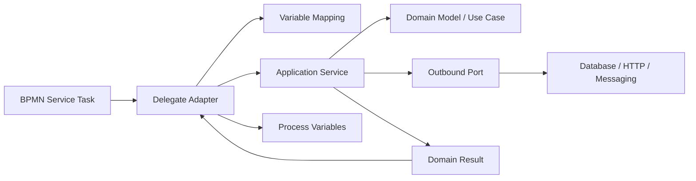
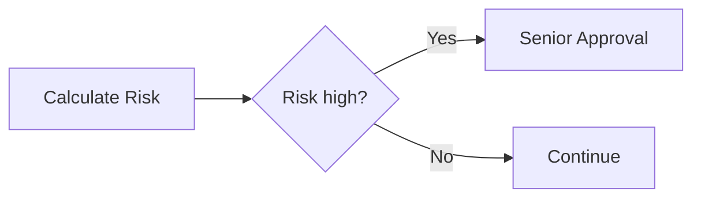
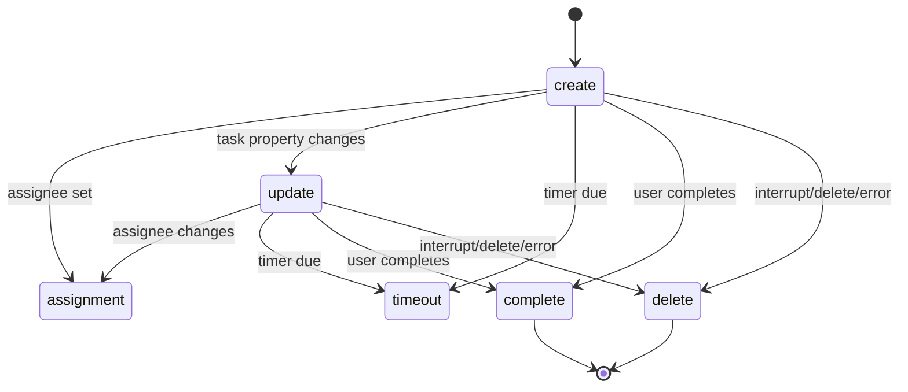
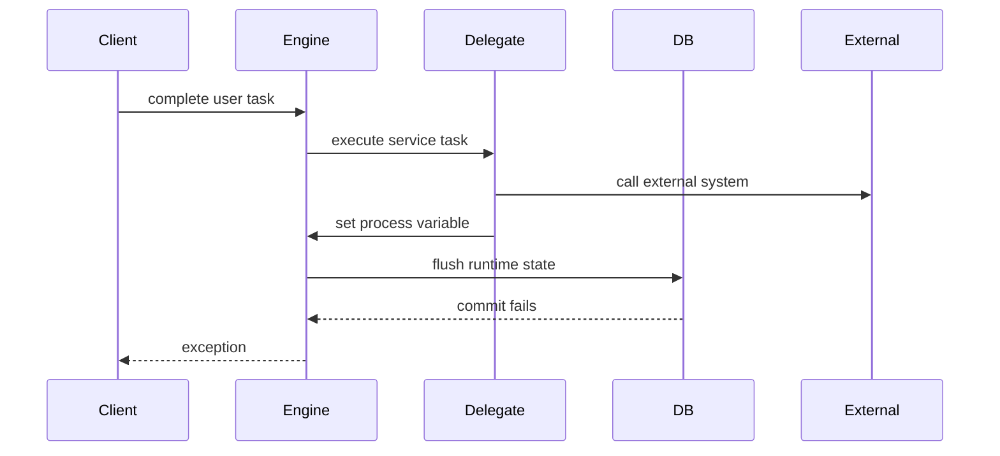
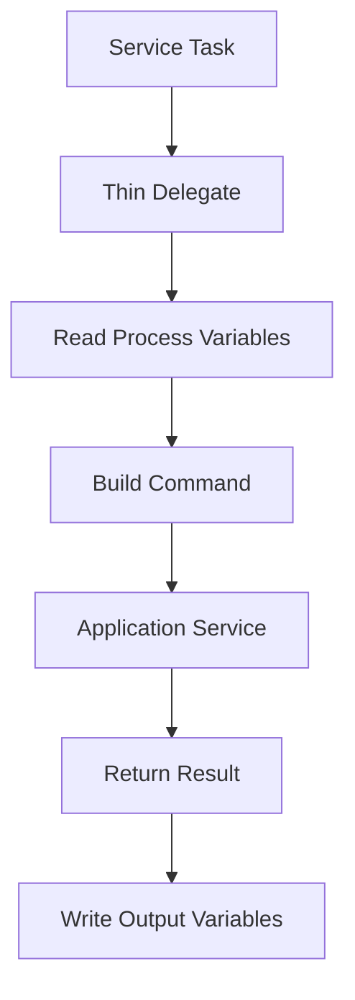
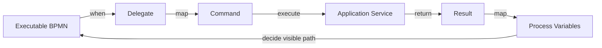

# Part 017 — Delegation Code: JavaDelegate, Listeners, Expressions, Field Injection

> Target: setelah part ini, kita bisa menulis delegation code Camunda 7 yang tipis, aman terhadap retry, testable, dan tidak merusak transaction semantics. Fokusnya bukan sekadar "bagaimana memanggil Java dari BPMN", tetapi bagaimana menjaga batas antara executable process model, domain service, integration adapter, dan operational recovery.

Camunda 7.24 documentation menjelaskan delegation code sebagai mekanisme untuk menjalankan Java code, script, atau expression saat event tertentu terjadi selama process execution. Jenis delegation code yang relevan mencakup Java delegate pada service task, delegate variable mapping pada call activity, execution listener pada event token flow, dan task listener pada lifecycle user task. Dokumentasi juga menjelaskan bahwa `JavaDelegate` perlu mengimplementasikan `execute(DelegateExecution)`, dan informasi instance seperti process variables dapat diakses melalui `DelegateExecution`.

Referensi utama:

- Camunda 7.24 — Delegation Code: <https://docs.camunda.org/manual/7.24/user-guide/process-engine/delegation-code/>
- Camunda 7.24 — Service Task: <https://docs.camunda.org/manual/7.24/reference/bpmn20/tasks/service-task/>
- Camunda 7.24 — Expression Language: <https://docs.camunda.org/manual/7.24/user-guide/process-engine/expression-language/>
- Camunda 7.24 — Spring Bean Resolving: <https://docs.camunda.org/manual/7.24/user-guide/spring-framework-integration/spring-bean-resolving/>
- Camunda 7.24 — Transactions in Processes: <https://docs.camunda.org/manual/7.24/user-guide/process-engine/transactions-in-processes/>
- Camunda 7.24 — Process Variables: <https://docs.camunda.org/manual/7.24/user-guide/process-engine/variables/>

---

## 1. Kaufman Skill Deconstruction

Delegation code adalah titik transisi dari BPMN ke Java. Di sinilah banyak sistem Camunda rusak: model BPMN tampak rapi, tetapi code di baliknya membuat side effect tersembunyi, retry tidak aman, variable contract tidak stabil, dan incident sulit dipulihkan.

| Sub-skill | Target kemampuan |
|---|---|
| Invocation semantics | Bisa membedakan `camunda:class`, `camunda:delegateExpression`, `camunda:expression`, dan method/value expression. |
| Delegate boundary | Bisa membuat delegate sebagai adapter tipis, bukan tempat domain logic besar. |
| Variable discipline | Bisa membaca/menulis variable secara typed, eksplisit, dan schema-aware. |
| Listener discipline | Bisa memilih execution listener/task listener hanya saat benar-benar lifecycle concern. |
| Transaction awareness | Bisa menjelaskan side effect delegate jika command rollback atau job retry. |
| Exception semantics | Bisa memilih antara Java exception, `BpmnError`, retry, incident, dan explicit modeled path. |
| Spring integration | Bisa menghubungkan Spring bean tanpa stateful field injection yang race-prone. |
| Testability | Bisa unit-test delegate dan integration-test process path tanpa full production container. |

### 1.1 Performance target

Kita dianggap menguasai part ini jika bisa:

1. Menulis service task dengan `delegateExpression` ke Spring bean.
2. Menjaga delegate tetap tipis: mapping variable, panggil application service, tulis result.
3. Menghindari mutable fields di singleton delegate.
4. Menentukan kapan listener adalah solusi tepat dan kapan ia menyembunyikan logic.
5. Menjelaskan apa yang terjadi jika delegate melempar exception sebelum transaction commit.
6. Mendesain delegate idempotent ketika task punya `asyncBefore` dan akan di-retry job executor.
7. Menguji happy path, business error path, dan technical failure path.

---

## 2. Mental Model: Delegation Code adalah Adapter, Bukan Workflow

BPMN menentukan **kapan** sesuatu terjadi. Delegation code menentukan **bagaimana satu langkah teknis dieksekusi**. Domain service menentukan **apa arti bisnis dari operasi tersebut**.



Rule engineering-nya:

- BPMN tidak boleh tahu detail repository, HTTP client, SQL, retry library, atau DTO remote vendor.
- Delegate tidak boleh menjadi domain service besar.
- Domain service tidak boleh tergantung `DelegateExecution`.
- Variable process adalah kontrak workflow, bukan object graph application internal.

Jika boundary ini rusak, process model menjadi sulit dipahami karena logic tersebar di diagram, delegate, listener, form, expression, dan SQL.

---

## 3. Invocation Options di Service Task

Camunda service task dapat memanggil Java logic dengan beberapa cara: class yang mengimplementasikan `JavaDelegate`/`ActivityBehavior`, expression yang resolve ke delegation object, method expression, atau value expression. Untuk service task, salah satu dari `camunda:class`, `camunda:delegateExpression`, `camunda:type`, atau `camunda:expression` wajib ada. `camunda:type="external"` digunakan untuk external task, yang akan dibahas khusus di Part 019.

| Mekanisme | Contoh | Cocok untuk | Risiko utama |
|---|---|---|---|
| `camunda:class` | `camunda:class="com.acme.MyDelegate"` | Non-Spring simple delegate, shared engine, classpath-controlled deployment. | Instantiation per execution, dependency injection manual, classloader issue. |
| `camunda:delegateExpression` | `camunda:delegateExpression="${chargeFeeDelegate}"` | Spring/CDI bean, production app code. | Singleton bean + mutable field injection. |
| `camunda:expression` method | `camunda:expression="${feeService.charge(execution)}"` | Simple method call, prototypes, small glue. | Logic tersembunyi di expression, argument contract tidak jelas. |
| `camunda:expression` value | `camunda:expression="${someBean.someValue}"` | Jarang; computed value. | Side effect tidak jelas, result handling tricky. |
| `ActivityBehavior` | custom control flow | Extremely advanced engine-level behavior. | Dapat mem-bypass BPMN semantics; sebaiknya dihindari. |

Rekomendasi default untuk Spring Boot embedded process application:

```xml
<bpmn:serviceTask id="calculateRisk"
                  name="Calculate Risk"
                  camunda:delegateExpression="${calculateRiskDelegate}" />
```

Lalu Java:

```java
@Component("calculateRiskDelegate")
@RequiredArgsConstructor
public class CalculateRiskDelegate implements JavaDelegate {

    private final RiskApplicationService riskApplicationService;

    @Override
    public void execute(DelegateExecution execution) {
        String caseId = (String) execution.getVariable("caseId");
        BigDecimal exposure = (BigDecimal) execution.getVariable("exposureAmount");

        RiskDecision decision = riskApplicationService.calculateRisk(caseId, exposure);

        execution.setVariable("riskScore", decision.score());
        execution.setVariable("riskBand", decision.band().name());
        execution.setVariable("riskDecisionId", decision.decisionId());
    }
}
```

Perhatikan batasnya:

- Delegate membaca variable yang dibutuhkan.
- Delegate memanggil satu application service.
- Delegate menulis output minimal.
- Domain service tidak menerima `DelegateExecution`.
- Tidak ada HTTP/repository logic langsung di delegate.

---

## 4. `JavaDelegate` Contract

Interface utama:

```java
public interface JavaDelegate {
    void execute(DelegateExecution execution) throws Exception;
}
```

`DelegateExecution` memberi akses ke:

- process instance id,
- execution id,
- activity id,
- business key,
- process variables,
- tenant id,
- process engine services melalui context tertentu,
- event name untuk listener context tertentu.

### 4.1 Apa yang boleh dilakukan di delegate

Gunakan delegate untuk:

1. Membaca input variable yang eksplisit.
2. Validasi contract teknis minimal.
3. Convert process variable ke command object.
4. Panggil application service.
5. Map result ke output variable.
6. Lempar business error atau technical exception sesuai semantics.

Contoh adapter yang baik:

```java
@Component("openInvestigationDelegate")
@RequiredArgsConstructor
public class OpenInvestigationDelegate implements JavaDelegate {

    private final InvestigationCommandService commandService;

    @Override
    public void execute(DelegateExecution execution) {
        OpenInvestigationCommand command = new OpenInvestigationCommand(
            requiredString(execution, "caseId"),
            requiredString(execution, "subjectId"),
            optionalString(execution, "triggerReason").orElse("UNKNOWN"),
            execution.getProcessBusinessKey()
        );

        OpenInvestigationResult result = commandService.open(command);

        execution.setVariable("investigationId", result.investigationId());
        execution.setVariable("investigationStatus", result.status().name());
    }

    private static String requiredString(DelegateExecution execution, String name) {
        Object value = execution.getVariable(name);
        if (!(value instanceof String s) || s.isBlank()) {
            throw new IllegalArgumentException("Required process variable missing or invalid: " + name);
        }
        return s;
    }

    private static Optional<String> optionalString(DelegateExecution execution, String name) {
        Object value = execution.getVariable(name);
        return value instanceof String s && !s.isBlank() ? Optional.of(s) : Optional.empty();
    }
}
```

### 4.2 Apa yang tidak boleh dilakukan di delegate

Hindari:

- menyimpan mutable state di field delegate,
- membuat thread manual,
- melakukan sleep/polling panjang,
- melakukan retry loop panjang sendiri,
- mengakses table Camunda secara SQL langsung,
- membangun business process baru secara imperatif di Java,
- memanggil `RuntimeService` untuk melompati token normal tanpa alasan kuat,
- memasukkan seluruh domain decision ke if/else panjang,
- menulis variable besar tanpa TTL/retention awareness,
- swallowing exception lalu set `status = FAILED` tanpa incident/explicit BPMN path.

---

## 5. `camunda:class` vs `delegateExpression`

### 5.1 `camunda:class`

XML:

```xml
<bpmn:serviceTask id="notifyCustomer"
                  name="Notify Customer"
                  camunda:class="com.acme.workflow.NotifyCustomerDelegate" />
```

Karakteristik penting:

- Engine membuat instance delegate saat aktivitas dieksekusi.
- Class tidak diinstansiasi saat deployment; jika class tidak ditemukan saat runtime, engine melempar exception.
- Cocok pada shared engine/classpath deployment tertentu.
- Tidak otomatis memakai Spring dependency injection kecuali ada integration/plugin khusus.

Ini sering menggoda karena terlihat sederhana, tetapi pada Spring Boot application modern `delegateExpression` biasanya lebih bersih.

### 5.2 `camunda:delegateExpression`

XML:

```xml
<bpmn:serviceTask id="notifyCustomer"
                  name="Notify Customer"
                  camunda:delegateExpression="${notifyCustomerDelegate}" />
```

Java:

```java
@Component("notifyCustomerDelegate")
@RequiredArgsConstructor
public class NotifyCustomerDelegate implements JavaDelegate {
    private final NotificationService notificationService;

    @Override
    public void execute(DelegateExecution execution) {
        notificationService.notifyCustomer(
            (String) execution.getVariable("customerId"),
            (String) execution.getVariable("notificationTemplate")
        );
    }
}
```

Kelebihan:

- dependency injection normal,
- testability baik,
- lifecycle dikelola Spring,
- cocok dengan application boundary.

Risiko:

- Spring bean default singleton.
- Jangan gunakan field injection dari BPMN ke mutable field singleton.
- Jangan menyimpan process-specific state di field bean.

Rule praktis:

```java
// Baik: dependency final, stateless per execution.
@Component("goodDelegate")
@RequiredArgsConstructor
class GoodDelegate implements JavaDelegate {
    private final SomeService service;
    public void execute(DelegateExecution execution) { ... }
}

// Buruk: state berubah per process execution.
@Component("badDelegate")
class BadDelegate implements JavaDelegate {
    private String currentCaseId;
    public void execute(DelegateExecution execution) {
        this.currentCaseId = (String) execution.getVariable("caseId");
        ...
    }
}
```

---

## 6. Method Expression: Ringkas, tetapi Mudah Menjadi Opaque

XML:

```xml
<bpmn:serviceTask id="calculateFee"
                  name="Calculate Fee"
                  camunda:expression="${feeService.calculate(execution)}" />
```

Method expression bisa cepat, tetapi production rule-nya harus ketat.

Gunakan hanya ketika:

- method sangat kecil,
- tidak ada mapping kompleks,
- argument contract jelas,
- tidak ada banyak output variable,
- path failure sudah jelas.

Lebih aman:

```xml
<bpmn:serviceTask id="calculateFee"
                  name="Calculate Fee"
                  camunda:delegateExpression="${calculateFeeDelegate}" />
```

Karena delegate memberi tempat eksplisit untuk:

- input validation,
- output mapping,
- metrics/logging,
- exception translation,
- unit test.

### 6.1 `camunda:resultVariable`

Untuk expression service task, return value dapat disimpan ke process variable dengan `camunda:resultVariable`.

```xml
<bpmn:serviceTask id="calculateFee"
                  name="Calculate Fee"
                  camunda:expression="${feeService.calculate(caseId)}"
                  camunda:resultVariable="feeAmount" />
```

Catatan penting:

- `resultVariable` hanya untuk `camunda:expression`.
- Variable yang ada akan di-overwrite.
- Dalam multi-instance, setiap completion dapat menimpa variable yang sama sehingga tampak random.

Anti-pattern:

```xml
<bpmn:multiInstanceLoopCharacteristics isSequential="false" />
<!-- Semua instance parallel menulis resultVariable yang sama -->
<bpmn:serviceTask camunda:expression="${reviewService.review(item)}"
                  camunda:resultVariable="reviewResult" />
```

Lebih baik:

- gunakan collection item result dengan aggregation eksplisit,
- tulis variable local per instance,
- atau gunakan external persistence dengan idempotency key.

---

## 7. Field Injection

Field injection memungkinkan konfigurasi delegate via BPMN XML.

```xml
<bpmn:serviceTask id="sendEmail"
                  name="Send Email"
                  camunda:class="com.acme.workflow.SendEmailDelegate">
  <bpmn:extensionElements>
    <camunda:field name="template" stringValue="CASE_OPENED" />
    <camunda:field name="recipientExpression" expression="${assigneeEmail}" />
  </bpmn:extensionElements>
</bpmn:serviceTask>
```

Delegate:

```java
public class SendEmailDelegate implements JavaDelegate {

    private Expression template;
    private Expression recipientExpression;

    public void setTemplate(Expression template) {
        this.template = template;
    }

    public void setRecipientExpression(Expression recipientExpression) {
        this.recipientExpression = recipientExpression;
    }

    @Override
    public void execute(DelegateExecution execution) {
        String templateCode = (String) template.getValue(execution);
        String recipient = (String) recipientExpression.getValue(execution);
        // call service...
    }
}
```

### 7.1 Field injection rule

| Situation | Recommendation |
|---|---|
| `camunda:class`, new instance per execution | Field injection acceptable for simple static/dynamic config. |
| Spring singleton bean via `delegateExpression` | Avoid field injection into mutable fields. |
| Need runtime input | Prefer reading from variables inside `execute`. |
| Need reusable generic delegate | Prefer immutable config object or explicit adapter classes. |
| Need long text template | Avoid BPMN XML as template store unless content is truly process config. |

Dokumentasi Camunda memperingatkan bahwa field injection biasanya tidak digunakan dengan Spring beans karena Spring bean default singleton dan field dapat terkena concurrent modification. Ini bukan masalah akademis. Dalam production, dua process instance bisa mengeksekusi delegate singleton yang sama secara bersamaan.

### 7.2 Safe alternative untuk Spring

```java
@Component("sendEmailDelegate")
@RequiredArgsConstructor
public class SendEmailDelegate implements JavaDelegate {

    private final NotificationService notificationService;

    @Override
    public void execute(DelegateExecution execution) {
        String template = (String) execution.getVariable("emailTemplate");
        String recipient = (String) execution.getVariable("recipientEmail");

        notificationService.send(template, recipient);
    }
}
```

Atau jika konfigurasi berbeda per activity, buat delegate spesifik:

```java
@Component("sendCaseOpenedEmailDelegate")
@RequiredArgsConstructor
public class SendCaseOpenedEmailDelegate implements JavaDelegate {
    private final NotificationService notificationService;

    @Override
    public void execute(DelegateExecution execution) {
        notificationService.sendCaseOpened(
            (String) execution.getVariable("caseId"),
            (String) execution.getVariable("recipientEmail")
        );
    }
}
```

Verbosity kecil di Java sering lebih murah daripada konfigurasi BPMN yang magical.

---

## 8. Execution Listener

Execution listener mengeksekusi logic pada event token flow, misalnya process start, process end, activity start, activity end, take sequence flow.

Contoh:

```xml
<bpmn:serviceTask id="calculateRisk" name="Calculate Risk">
  <bpmn:extensionElements>
    <camunda:executionListener event="start"
                               delegateExpression="${activityAuditListener}" />
    <camunda:executionListener event="end"
                               delegateExpression="${activityAuditListener}" />
  </bpmn:extensionElements>
</bpmn:serviceTask>
```

Java:

```java
@Component("activityAuditListener")
public class ActivityAuditListener implements ExecutionListener {

    @Override
    public void notify(DelegateExecution execution) {
        String eventName = execution.getEventName();
        String activityId = execution.getCurrentActivityId();
        String processInstanceId = execution.getProcessInstanceId();
        // write lightweight audit event or metric
    }
}
```

### 8.1 Kapan execution listener cocok

Gunakan untuk cross-cutting lifecycle concern:

- audit event ringan,
- metrics,
- business key initialization pada start event tertentu,
- tagging/tracing,
- simple technical normalization,
- integration dengan governance framework.

Jangan gunakan untuk:

- business decision besar,
- remote call penting,
- mengganti gateway,
- mengganti service task,
- membuat path proses tersembunyi,
- mengubah banyak variable utama tanpa terlihat di BPMN.

### 8.2 Hidden workflow smell

Jika listener melakukan ini:

```java
if (riskScore > 80) {
    execution.setVariable("needsSeniorApproval", true);
    runtimeService.createMessageCorrelation("SeniorApprovalNeeded")...
}
```

maka logic proses sedang disembunyikan. Lebih baik tampilkan dalam BPMN:



Listener seharusnya memperkaya lifecycle, bukan menjadi process branch rahasia.

---

## 9. Task Listener

Task listener mengeksekusi logic saat event user task terjadi. Camunda mendukung event seperti `create`, `assignment`, `update`, `complete`, `delete`, dan `timeout`. Timeout listener membutuhkan timer definition dan job executor aktif.

Contoh:

```xml
<bpmn:userTask id="reviewCase" name="Review Case">
  <bpmn:extensionElements>
    <camunda:taskListener event="create"
                          delegateExpression="${reviewTaskCreateListener}" />
    <camunda:taskListener event="complete"
                          delegateExpression="${reviewTaskCompleteListener}" />
  </bpmn:extensionElements>
</bpmn:userTask>
```

Java:

```java
@Component("reviewTaskCreateListener")
public class ReviewTaskCreateListener implements TaskListener {

    @Override
    public void notify(DelegateTask task) {
        task.setPriority(75);
        task.setVariableLocal("taskCreatedByRule", true);
    }
}
```

### 9.1 Task listener lifecycle



Important semantics:

- `create` terjadi setelah task object transient dibuat, sebelum persistence selesai.
- `assignment` terjadi saat assignee diset atau berubah.
- `complete` terjadi tepat sebelum runtime task dihapus karena berhasil selesai.
- `delete` terjadi karena interrupting boundary event, event subprocess, process deletion, atau BPMN error dari listener.
- `complete` dan `delete` adalah terminal yang saling eksklusif untuk lifecycle task normal.

### 9.2 Kapan task listener cocok

Gunakan untuk:

- set priority awal,
- assignment normalization,
- lightweight notification request creation,
- task-local metadata,
- audit envelope,
- guard condition sebelum completion,
- timeout reminder non-interrupting.

Hindari untuk:

- menjalankan full approval logic,
- mengirim email langsung tanpa idempotency,
- membuat external side effect dalam `complete` tanpa async boundary,
- memanggil `TaskService.complete()` dari listener kecuali paham event chaining,
- menyimpan outcome bisnis tersembunyi di task-local variable tanpa process-level contract.

### 9.3 Task event loop hazard

Task listener dapat memanggil `TaskService`, yang dapat memicu task event lain. Ini bisa membuat event loop.

Buruk:

```java
@Component("badAssignmentListener")
@RequiredArgsConstructor
public class BadAssignmentListener implements TaskListener {
    private final TaskService taskService;

    @Override
    public void notify(DelegateTask task) {
        // Dapat memicu assignment/update lagi.
        taskService.setAssignee(task.getId(), "fallback-user");
    }
}
```

Lebih aman:

```java
@Component("safeCreateListener")
public class SafeCreateListener implements TaskListener {
    @Override
    public void notify(DelegateTask task) {
        if (task.getAssignee() == null) {
            task.setAssignee("fallback-user");
        }
    }
}
```

Masih harus diuji pada lifecycle event yang benar.

---

## 10. Delegate Variable Mapping untuk Call Activity

Pada call activity, kita bisa memakai mapping eksplisit di XML atau `DelegateVariableMapping`.

Gunakan `DelegateVariableMapping` ketika:

- mapping input/output cukup kompleks,
- perlu transformasi dari parent contract ke child contract,
- perlu filtering variable ketat,
- perlu default value atau validation,
- ingin menghindari pass-all variable.

Contoh:

```java
@Component("caseReviewVariableMapping")
public class CaseReviewVariableMapping implements DelegateVariableMapping {

    @Override
    public void mapInputVariables(DelegateExecution superExecution, VariableMap subVariables) {
        subVariables.putValue("caseId", superExecution.getVariable("caseId"));
        subVariables.putValue("reviewType", superExecution.getVariable("requiredReviewType"));
        subVariables.putValue("requestedBy", superExecution.getVariable("initiatorUserId"));
    }

    @Override
    public void mapOutputVariables(DelegateExecution superExecution, VariableScope subInstance) {
        superExecution.setVariable("reviewOutcome", subInstance.getVariable("outcome"));
        superExecution.setVariable("reviewCompletedAt", subInstance.getVariable("completedAt"));
    }
}
```

XML:

```xml
<bpmn:callActivity id="performCaseReview"
                   calledElement="case-review-process"
                   camunda:variableMappingDelegateExpression="${caseReviewVariableMapping}" />
```

Principle:

- parent process should not leak entire variable state to child process,
- child process should not mutate parent variables implicitly,
- mapping is a contract boundary.

---

## 11. Exception Semantics: Technical Exception vs `BpmnError`

Delegation code dapat:

1. Selesai normal.
2. Melempar Java exception.
3. Melempar `BpmnError`.
4. Menangkap error dan menulis variable status.
5. Melakukan compensation/recovery sendiri.

Tidak semua failure sama.

| Failure | Contoh | Delegate behavior | BPMN modeling |
|---|---|---|---|
| Technical transient | HTTP 503, DB timeout, lock timeout | Throw Java exception | Retry via job executor / incident. |
| Technical permanent | invalid config, missing class, schema mismatch | Throw Java exception | Incident, operator fix. |
| Business expected | customer not eligible | Throw `BpmnError` or return outcome | Boundary error/event path. |
| Business negative result | risk high, approval rejected | Return result variable | Gateway/user task path. |
| Data contract invalid | missing `caseId` | Usually Java exception | Incident unless modeled as human correction. |

### 11.1 Throwing `BpmnError`

```java
@Component("checkEligibilityDelegate")
@RequiredArgsConstructor
public class CheckEligibilityDelegate implements JavaDelegate {
    private final EligibilityService eligibilityService;

    @Override
    public void execute(DelegateExecution execution) {
        String caseId = (String) execution.getVariable("caseId");
        EligibilityResult result = eligibilityService.check(caseId);

        if (!result.eligible()) {
            throw new BpmnError("NOT_ELIGIBLE", result.reason());
        }

        execution.setVariable("eligibilityDecisionId", result.decisionId());
    }
}
```

BPMN:

```xml
<bpmn:serviceTask id="checkEligibility"
                  name="Check Eligibility"
                  camunda:delegateExpression="${checkEligibilityDelegate}" />

<bpmn:boundaryEvent id="notEligibleBoundary" attachedToRef="checkEligibility">
  <bpmn:errorEventDefinition errorRef="NotEligibleError" />
</bpmn:boundaryEvent>
```

Gunakan `BpmnError` hanya untuk business error yang memang sudah dimodelkan. Jangan gunakan untuk timeout database atau NullPointerException.

### 11.2 Swallowing exception anti-pattern

Buruk:

```java
@Override
public void execute(DelegateExecution execution) {
    try {
        paymentClient.charge(...);
        execution.setVariable("paymentStatus", "PAID");
    } catch (Exception e) {
        execution.setVariable("paymentStatus", "FAILED");
        // Process continues as if nothing operationally wrong happened.
    }
}
```

Masalah:

- job executor tidak bisa retry,
- incident tidak dibuat,
- operator tidak tahu ada failure,
- process mungkin lanjut ke state bisnis yang salah.

Lebih baik:

```java
@Override
public void execute(DelegateExecution execution) {
    paymentClient.charge(...); // technical exception bubbles up
    execution.setVariable("paymentStatus", "PAID");
}
```

Lalu BPMN service task diberi async boundary dan retry cycle yang masuk akal.

---

## 12. Transaction Side Effects

Delegate berjalan di dalam command context Camunda. Jika tidak ada async boundary, delegate sering berjalan dalam transaction yang sama dengan start process, complete task, atau message correlation yang memicu token sampai service task tersebut.



Jika external call sudah berhasil tetapi DB commit gagal, process state rollback tetapi external side effect tidak rollback. Ini classic distributed transaction trap.

### 12.1 Safer boundary with `asyncBefore`

```xml
<bpmn:serviceTask id="chargePayment"
                  name="Charge Payment"
                  camunda:asyncBefore="true"
                  camunda:delegateExpression="${chargePaymentDelegate}" />
```

Effect:

- token mencapai service task,
- job dibuat dan committed,
- client transaction selesai,
- job executor menjalankan delegate di transaction terpisah,
- failure menjadi failed job/retry/incident.

Tetap bukan solusi penuh untuk side effect external. Masih butuh idempotency key.

### 12.2 Idempotency key

Gunakan stable key berdasarkan process instance/business operation, bukan random UUID per retry.

```java
String idempotencyKey = execution.getProcessInstanceId() + ":chargePayment";

paymentClient.charge(new ChargeRequest(
    idempotencyKey,
    caseId,
    amount
));
```

Jika job retry, key sama. External system harus mengembalikan result yang sama atau status already-processed.

---

## 13. Variable Access Discipline

### 13.1 Jangan menyebar string variable name

Buruk:

```java
String caseId = (String) execution.getVariable("caseid"); // typo
execution.setVariable("caseID", caseId);                  // inconsistent
```

Lebih baik:

```java
public final class CaseProcessVars {
    public static final String CASE_ID = "caseId";
    public static final String RISK_BAND = "riskBand";
    public static final String REVIEW_OUTCOME = "reviewOutcome";

    private CaseProcessVars() {}
}
```

Atau gunakan typed accessor:

```java
public final class ProcessVariableReader {
    private final DelegateExecution execution;

    public ProcessVariableReader(DelegateExecution execution) {
        this.execution = execution;
    }

    public String requiredString(String name) {
        Object value = execution.getVariable(name);
        if (value instanceof String s && !s.isBlank()) return s;
        throw new IllegalArgumentException("Missing required String process variable: " + name);
    }

    public BigDecimal requiredBigDecimal(String name) {
        Object value = execution.getVariable(name);
        if (value instanceof BigDecimal bd) return bd;
        if (value instanceof Number n) return BigDecimal.valueOf(n.doubleValue());
        throw new IllegalArgumentException("Missing required BigDecimal process variable: " + name);
    }
}
```

### 13.2 Prefer command/result objects at domain boundary

```java
public record CalculatePenaltyCommand(
    String caseId,
    String violationType,
    BigDecimal baseAmount,
    LocalDate violationDate
) {}

public record CalculatePenaltyResult(
    BigDecimal penaltyAmount,
    String calculationId,
    String ruleVersion
) {}
```

Delegate maps process variable to command, not the other way around.

---

## 14. Logging and Observability in Delegates

Minimal log context:

- process definition key,
- process instance id,
- business key,
- activity id,
- execution id,
- delegate name,
- idempotency key,
- external correlation id.

Contoh:

```java
@Component("calculatePenaltyDelegate")
@RequiredArgsConstructor
@Slf4j
public class CalculatePenaltyDelegate implements JavaDelegate {

    private final PenaltyService penaltyService;

    @Override
    public void execute(DelegateExecution execution) {
        String caseId = (String) execution.getVariable("caseId");
        String activityId = execution.getCurrentActivityId();

        log.info("Executing penalty calculation. processInstanceId={}, businessKey={}, activityId={}, caseId={}",
            execution.getProcessInstanceId(),
            execution.getProcessBusinessKey(),
            activityId,
            caseId);

        CalculatePenaltyResult result = penaltyService.calculate(...);

        execution.setVariable("penaltyAmount", result.penaltyAmount());
        execution.setVariable("penaltyCalculationId", result.calculationId());
    }
}
```

Do not log:

- sensitive personal data,
- large variable payload,
- secrets,
- raw document content,
- full exception body from external systems without sanitization.

---

## 15. Testing Delegation Code

### 15.1 Unit test delegate as adapter

```java
class CalculateRiskDelegateTest {

    private RiskApplicationService service = mock(RiskApplicationService.class);
    private CalculateRiskDelegate delegate = new CalculateRiskDelegate(service);

    @Test
    void mapsVariablesToCommandAndWritesResult() throws Exception {
        DelegateExecution execution = mock(DelegateExecution.class);
        when(execution.getVariable("caseId")).thenReturn("CASE-123");
        when(execution.getVariable("exposureAmount")).thenReturn(new BigDecimal("100000"));
        when(service.calculateRisk("CASE-123", new BigDecimal("100000")))
            .thenReturn(new RiskDecision(91, RiskBand.HIGH, "DEC-1"));

        delegate.execute(execution);

        verify(execution).setVariable("riskScore", 91);
        verify(execution).setVariable("riskBand", "HIGH");
        verify(execution).setVariable("riskDecisionId", "DEC-1");
    }
}
```

Unit test cukup untuk mapping. Jangan berharap unit test mock `DelegateExecution` menangkap token semantics. Itu tugas process integration test.

### 15.2 Process test checks wiring

Process-level test harus memastikan:

- BPMN deploy valid,
- service task resolve ke bean yang benar,
- delegate dipanggil pada path yang tepat,
- output variable mengarahkan gateway dengan benar,
- technical exception menghasilkan failed job jika async,
- `BpmnError` tertangkap boundary event yang benar.

Checklist:

```text
[ ] Test happy path.
[ ] Test missing required variable.
[ ] Test business error path.
[ ] Test technical exception with async retry.
[ ] Test duplicate execution/idempotency behavior.
[ ] Test no accidental variable overwrite.
```

---

## 16. Production Patterns

### 16.1 Thin Delegate Pattern



Characteristics:

- one BPMN activity maps to one delegate,
- delegate code typically under 50–100 lines,
- no business workflow branching inside delegate,
- no direct infrastructure call unless delegate is explicitly an integration adapter,
- domain service can be tested without Camunda.

### 16.2 Delegate as Anti-Corruption Layer

When process variable names are stable workflow contract but domain model evolves, delegate maps between them.

```java
public class CaseAssessmentDelegate implements JavaDelegate {
    public void execute(DelegateExecution execution) {
        CaseAssessmentCommand command = new CaseAssessmentCommand(
            (String) execution.getVariable("caseId"),
            RiskBand.valueOf((String) execution.getVariable("riskBand")),
            toEvidenceRefs(execution.getVariable("evidenceRefs"))
        );

        CaseAssessmentResult result = service.assess(command);

        execution.setVariable("assessmentOutcome", result.outcome().name());
        execution.setVariable("assessmentVersion", result.version());
    }
}
```

The process variable contract can remain stable even if internal domain model changes.

### 16.3 Explicit Error Translator

```java
try {
    EligibilityResult result = eligibilityService.check(command);
    if (!result.eligible()) {
        throw new BpmnError("NOT_ELIGIBLE", result.reason());
    }
} catch (RemoteSystemTemporaryException e) {
    throw e; // retry/incident
} catch (RemoteSystemBusinessRejection e) {
    throw new BpmnError("REMOTE_REJECTED", e.businessReason());
}
```

Keep translation local and visible.

---

## 17. Anti-Patterns

### 17.1 God Delegate

Symptom:

```java
public void execute(DelegateExecution execution) {
    // 700 lines:
    // validate, decide, call 5 services, update DB, send email,
    // complete task, correlate message, start subprocess, set 30 variables.
}
```

Problem:

- BPMN lies; real process is inside Java.
- Testing becomes hard.
- Incident recovery is unclear.
- Change impact is invisible to process modelers/operators.

Fix:

- Split BPMN activities.
- Move decisions to DMN/domain service.
- Use explicit gateways/events.
- Keep delegate as adapter.

### 17.2 Mutable Singleton Delegate

Symptom:

```java
@Component
public class MyDelegate implements JavaDelegate {
    private String caseId;
    public void execute(DelegateExecution execution) {
        this.caseId = (String) execution.getVariable("caseId");
    }
}
```

Problem:

- concurrent process instances share same bean,
- field overwritten between threads,
- data leaks across executions.

Fix:

- local variables inside `execute`,
- constructor injection only for services,
- no per-execution field state.

### 17.3 Listener as Hidden Process

Symptom:

- gateways appear simple,
- but listener mutates variables that decide path,
- listener starts/cancels/correlates process instances.

Fix:

- make branch visible in BPMN,
- use service task for explicit operation,
- document listener as cross-cutting only.

### 17.4 Swallowed Technical Failure

Symptom:

```java
catch (Exception e) {
    execution.setVariable("status", "ERROR");
}
```

Problem:

- no retry,
- no incident,
- no operational signal,
- process continues unpredictably.

Fix:

- throw exception for technical failure,
- use async job retry,
- model business error separately.

### 17.5 Process Variable Object Graph

Symptom:

```java
execution.setVariable("caseAggregate", aggregateRoot);
```

Problem:

- serialization coupling,
- class evolution risk,
- history bloat,
- migration hazard.

Fix:

- store identifiers and stable small DTO/JSON,
- keep aggregate in domain database,
- process stores workflow-relevant facts only.

---

## 18. Review Checklist

Before approving delegation code:

```text
Boundary
[ ] Delegate is adapter, not domain workflow.
[ ] Domain service does not depend on Camunda API.
[ ] Process variables are explicit and typed.

Concurrency
[ ] Delegate has no mutable per-execution fields.
[ ] Field injection is not used on singleton Spring beans.
[ ] External side effects are idempotent.

Transactions
[ ] Async boundary exists before non-trivial side effect.
[ ] Technical failures bubble up.
[ ] Business errors are modeled as `BpmnError` only when boundary event exists.

Observability
[ ] Logs include processInstanceId/businessKey/activityId.
[ ] Sensitive data is not logged.
[ ] Failure mode produces retry/incident or explicit BPMN path.

Testing
[ ] Delegate unit test covers mapping.
[ ] Process test covers BPMN wiring.
[ ] Failure path test exists.
```

---

## 19. Practice Lab

### Lab 1 — Build a thin delegate

Create `CalculateRiskDelegate`:

- input variables: `caseId`, `exposureAmount`, `violationType`,
- domain service: `RiskAssessmentService`,
- output variables: `riskScore`, `riskBand`, `riskDecisionId`,
- failure: missing `caseId` throws technical exception.

### Lab 2 — Business error boundary

Create `CheckEligibilityDelegate`:

- if not eligible, throw `BpmnError("NOT_ELIGIBLE")`,
- BPMN boundary event routes to `Manual Eligibility Review`,
- test both eligible and not eligible paths.

### Lab 3 — Listener hygiene

Add task listener on `create` event:

- set priority based on `riskBand`,
- do not send notification directly,
- instead create variable `notificationRequested = true` and route to explicit notification service task.

### Lab 4 — Idempotent side effect

Create `SendNoticeDelegate`:

- service task is `asyncBefore=true`,
- idempotency key = `processInstanceId + ":sendNotice"`,
- simulate first call succeeds externally but throws before completion,
- retry must not send duplicate notice.

---

## 20. Mental Model Recap

Delegation code is the bridge between BPMN and Java. The bridge must be narrow.



Jika delegate berisi workflow branching, BPMN kehilangan kebenaran. Jika delegate menyimpan state, concurrency rusak. Jika delegate menelan exception, operasi kehilangan recovery. Jika delegate menulis variable sembarangan, long-running process menjadi fragile.

Top-tier Camunda engineering bukan tentang banyak memakai extension point. Justru sebaliknya: memakai extension point sedikit, eksplisit, dan bisa dipulihkan.

---

## 21. Ringkasan

Di part ini kita mempelajari:

- delegation code sebagai adapter boundary,
- `JavaDelegate`, `delegateExpression`, `camunda:class`, method expression, dan `resultVariable`,
- execution listener dan task listener beserta lifecycle risk,
- field injection dan bahayanya pada Spring singleton,
- delegate variable mapping untuk call activity,
- technical exception vs `BpmnError`,
- transaction side effect dan async boundary,
- idempotency untuk retry,
- unit test dan process test,
- anti-pattern delegation code yang sering menyebabkan production incident.

Part berikutnya memperdalam **Service Task Implementation Patterns**: bagaimana memilih synchronous delegate, async delegate, external call adapter, outbox, command handler, retry boundary, dan integration style yang aman untuk production.
