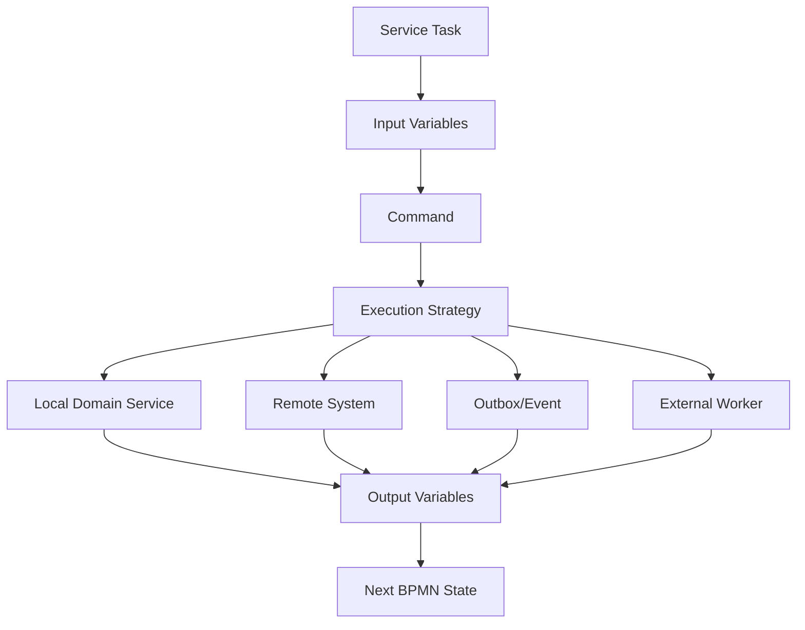
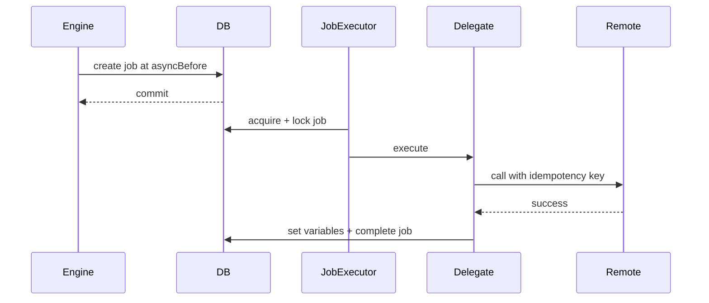
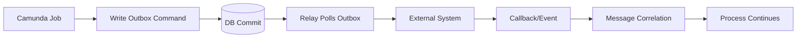
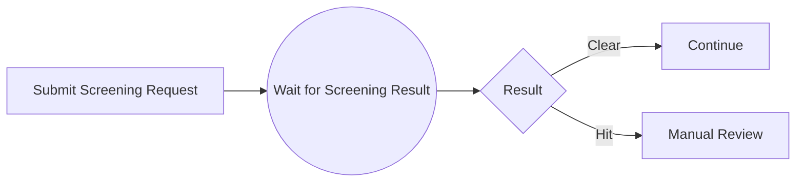
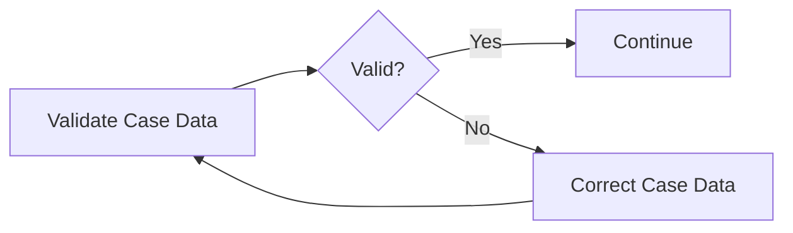
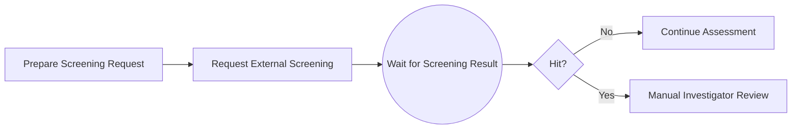
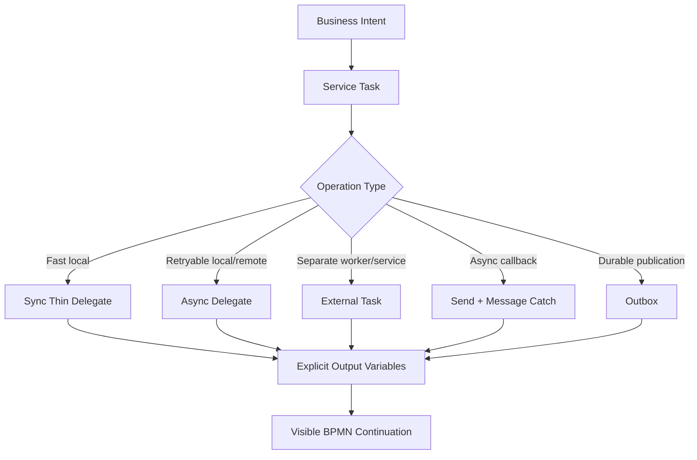

# Part 018 — Service Task Implementation Patterns

> Target: setelah part ini, kita bisa memilih pola implementasi service task yang tepat untuk production. Service task bukan sekadar kotak "call Java". Ia adalah boundary untuk transaction, retry, idempotency, remote integration, auditability, dan recovery.

Camunda 7.24 mendefinisikan service task sebagai task untuk invoke services. Dalam Camunda, service task dapat memanggil Java code, menyediakan work item untuk external worker yang menyelesaikannya secara asynchronous, atau memanggil logic berbentuk web service. Dokumentasi service task menjelaskan empat cara memanggil Java logic: `JavaDelegate`/`ActivityBehavior`, expression yang resolve ke delegation object, method expression, dan value expression. Dokumentasi juga menjelaskan external task sebagai alternatif di mana process engine menyediakan work item yang dipoll worker berdasarkan topic.

Referensi utama:

- Camunda 7.24 — Service Task: <https://docs.camunda.org/manual/7.24/reference/bpmn20/tasks/service-task/>
- Camunda 7.24 — Delegation Code: <https://docs.camunda.org/manual/7.24/user-guide/process-engine/delegation-code/>
- Camunda 7.24 — Transactions in Processes: <https://docs.camunda.org/manual/7.24/user-guide/process-engine/transactions-in-processes/>
- Camunda 7.24 — The Job Executor: <https://docs.camunda.org/manual/7.24/user-guide/process-engine/the-job-executor/>
- Camunda 7.24 — External Tasks: <https://docs.camunda.org/manual/7.24/user-guide/process-engine/external-tasks/>
- Camunda 7.24 — Connectors: <https://docs.camunda.org/manual/7.24/user-guide/process-engine/connectors/>

---

## 1. Kaufman Skill Deconstruction

Service task implementation adalah skill gabungan antara BPMN semantics, Java application design, distributed systems, dan operations.

| Sub-skill | Target kemampuan |
|---|---|
| Pattern selection | Bisa memilih sync delegate, async delegate, external task, outbox, atau message correlation. |
| Transaction modeling | Bisa menentukan boundary commit sebelum/after side effect. |
| Retry design | Bisa membedakan retry engine, retry client, retry worker, dan manual recovery. |
| Idempotency | Bisa memastikan job retry tidak menggandakan external effect. |
| Data contract | Bisa menentukan variable input/output minimal. |
| Failure mapping | Bisa memilih Java exception, BPMN error, incident, compensation, atau manual task. |
| Operational visibility | Bisa membuat service task mudah diamati di Cockpit/log/metrics. |
| Performance | Bisa menghindari bottleneck job executor, DB lock contention, dan remote-call saturation. |

### 1.1 Performance target

Kita dianggap menguasai part ini jika bisa:

1. Mendesain service task untuk call domain service lokal.
2. Mendesain service task untuk call remote API dengan idempotency dan async boundary.
3. Memutuskan kapan external task lebih tepat daripada JavaDelegate.
4. Membedakan retry yang aman dan retry yang berbahaya.
5. Menulis BPMN fragment dengan `asyncBefore`, retry cycle, job priority, dan boundary error yang benar.
6. Menjelaskan kenapa connector langsung dari BPMN biasanya bukan default terbaik untuk sistem enterprise.
7. Membuat runbook untuk failed service task.

---

## 2. Mental Model: Service Task adalah Command Boundary

Sebuah service task idealnya merepresentasikan satu command atau satu technical operation yang meaningful.



Pertanyaan desain utama:

1. Apakah operasi ini purely local atau remote?
2. Apakah side effect bisa diulang aman?
3. Apakah operasi cepat atau long-running?
4. Apakah failure harus retry otomatis atau butuh manusia?
5. Apakah process engine harus block sampai hasil ada?
6. Apakah worker perlu teknologi/runtime berbeda?
7. Apakah output cukup kecil untuk process variable?

---

## 3. Pattern Catalog

| Pattern | Use case | Boundary | Risk |
|---|---|---|---|
| Synchronous Thin Delegate | Local calculation/domain operation cepat | Same transaction unless async added | Rollback coupling, hidden side effect. |
| Async Delegate | Local/remote operation dengan retry engine | Job executor transaction | Duplicate side effect jika tidak idempotent. |
| External Task | Worker terpisah, polyglot, remote scaling | Fetch-lock-complete | Lock duration, duplicate worker completion, worker ops. |
| Outbox Command Task | Need durable command to another system | Local DB commit + relay | More moving parts, eventual consistency. |
| Message Send + Receive | Fire request, wait for callback | Durable wait state | Correlation and duplicate events. |
| Business Error Boundary | Expected business rejection | BPMN path | Misused for technical failure. |
| Manual Recovery Task | Human correction required | User task wait state | Operational queue overload. |
| Connector Direct Call | Simple REST/SOAP in model | Engine executes connector | Secrets/config/error handling in BPMN. |

---

## 4. Pattern 1 — Synchronous Thin Delegate

Gunakan ketika:

- operasi cepat,
- pure/local,
- tidak memanggil remote service lambat,
- tidak membuat side effect eksternal yang harus durable,
- rollback bersama process state memang diinginkan.

BPMN:

```xml
<bpmn:serviceTask id="calculatePenalty"
                  name="Calculate Penalty"
                  camunda:delegateExpression="${calculatePenaltyDelegate}" />
```

Java:

```java
@Component("calculatePenaltyDelegate")
@RequiredArgsConstructor
public class CalculatePenaltyDelegate implements JavaDelegate {

    private final PenaltyCalculationService service;

    @Override
    public void execute(DelegateExecution execution) {
        CalculatePenaltyCommand command = new CalculatePenaltyCommand(
            (String) execution.getVariable("caseId"),
            (String) execution.getVariable("violationType"),
            (BigDecimal) execution.getVariable("baseAmount")
        );

        CalculatePenaltyResult result = service.calculate(command);

        execution.setVariable("penaltyAmount", result.amount());
        execution.setVariable("penaltyRuleVersion", result.ruleVersion());
    }
}
```

### 4.1 Invariant

Synchronous thin delegate harus mematuhi:

```text
operation_time < request timeout budget
side_effects are local or rollback-compatible
failure can be reported to caller immediately
no long polling
no blocking human wait
no remote call without explicit decision
```

### 4.2 Anti-pattern

```java
public void execute(DelegateExecution execution) {
    // Synchronous, no async boundary.
    httpClient.post("https://remote-payment/charge", body);
    execution.setVariable("paid", true);
}
```

Jika process dimulai dari REST request dan remote payment lambat, caller thread ikut tertahan. Jika remote call sukses tetapi DB commit gagal, external state dan process state diverge.

---

## 5. Pattern 2 — Async Delegate with Engine Retry

Gunakan ketika:

- operation bisa gagal transient,
- retry oleh job executor masuk akal,
- caller tidak perlu menunggu completion langsung,
- operation idempotent,
- incident saat retry habis adalah operationally acceptable.

BPMN:

```xml
<bpmn:serviceTask id="sendNotice"
                  name="Send Notice"
                  camunda:asyncBefore="true"
                  camunda:delegateExpression="${sendNoticeDelegate}">
  <bpmn:extensionElements>
    <camunda:failedJobRetryTimeCycle>R5/PT10M</camunda:failedJobRetryTimeCycle>
  </bpmn:extensionElements>
</bpmn:serviceTask>
```

Execution model:



### 5.1 Idempotent delegate

```java
@Component("sendNoticeDelegate")
@RequiredArgsConstructor
public class SendNoticeDelegate implements JavaDelegate {

    private final NoticeClient noticeClient;

    @Override
    public void execute(DelegateExecution execution) {
        String caseId = (String) execution.getVariable("caseId");
        String noticeType = (String) execution.getVariable("noticeType");
        String idempotencyKey = execution.getProcessInstanceId() + ":sendNotice:" + noticeType;

        NoticeResponse response = noticeClient.send(new SendNoticeRequest(
            idempotencyKey,
            caseId,
            noticeType
        ));

        execution.setVariable("noticeId", response.noticeId());
        execution.setVariable("noticeSentAt", response.sentAt().toString());
    }
}
```

### 5.2 Retry policy placement

Do not stack retries blindly.

| Layer | Retry role | Danger |
|---|---|---|
| HTTP client retry | Very short transient network blip | Can multiply load during outage. |
| Camunda job retry | Durable process-level retry | Needs idempotency. |
| External system retry | Provider-specific | Can hide latency/failure semantics. |
| Human retry | Manual recovery after diagnosis | Operational burden. |

Default enterprise approach:

- client retry: small, bounded, jittered, only safe methods or idempotent calls,
- Camunda retry: durable, visible, limited,
- incident after exhaustion,
- operator runbook.

---

## 6. Pattern 3 — Remote Call Adapter Delegate

Remote calls are not just method calls. They are unreliable distributed operations.

### 6.1 Adapter shape

```java
@Component("requestExternalScreeningDelegate")
@RequiredArgsConstructor
public class RequestExternalScreeningDelegate implements JavaDelegate {

    private final ScreeningGateway screeningGateway;

    @Override
    public void execute(DelegateExecution execution) {
        String caseId = requiredString(execution, "caseId");
        String subjectId = requiredString(execution, "subjectId");
        String idempotencyKey = execution.getProcessBusinessKey() + ":screening:v1";

        ScreeningRequest request = new ScreeningRequest(idempotencyKey, caseId, subjectId);
        ScreeningResponse response = screeningGateway.requestScreening(request);

        execution.setVariable("screeningRequestId", response.requestId());
        execution.setVariable("screeningStatus", response.status().name());
    }
}
```

### 6.2 Gateway hides protocol, not failure meaning

```java
public interface ScreeningGateway {
    ScreeningResponse requestScreening(ScreeningRequest request);
}
```

Infrastructure implementation handles:

- HTTP endpoint,
- auth,
- timeout,
- response parsing,
- protocol-specific error mapping,
- circuit breaker,
- metrics,
- sanitized logs.

Delegate handles:

- process variable mapping,
- idempotency key construction,
- process-level output,
- business/technical error translation.

### 6.3 Timeouts

Timeout must be shorter than job lock and transaction budget.

```text
http connect timeout  <= 1s-3s
http read timeout     <= service SLO budget
job lock time         > max delegate execution time + safety margin
job retry interval    > expected remote recovery interval
```

Do not set remote HTTP timeout to minutes inside a job executor thread unless you intentionally allocate capacity for blocked threads.

---

## 7. Pattern 4 — Outbox Command Task

Use this when process must durably request external work, but direct remote call inside job transaction is too risky.

BPMN:

```xml
<bpmn:serviceTask id="enqueueNoticeCommand"
                  name="Enqueue Notice Command"
                  camunda:asyncBefore="true"
                  camunda:delegateExpression="${enqueueNoticeCommandDelegate}" />

<bpmn:intermediateCatchEvent id="waitForNoticeSent" name="Wait for Notice Sent">
  <bpmn:messageEventDefinition messageRef="NoticeSent" />
</bpmn:intermediateCatchEvent>
```

Delegate writes outbox row in same application DB transaction:

```java
@Component("enqueueNoticeCommandDelegate")
@RequiredArgsConstructor
public class EnqueueNoticeCommandDelegate implements JavaDelegate {

    private final OutboxCommandRepository outbox;

    @Override
    public void execute(DelegateExecution execution) {
        String commandId = execution.getProcessInstanceId() + ":notice:v1";

        outbox.insertIfAbsent(new OutboxCommand(
            commandId,
            "SEND_NOTICE",
            Map.of(
                "caseId", execution.getVariable("caseId"),
                "noticeType", execution.getVariable("noticeType"),
                "processInstanceId", execution.getProcessInstanceId()
            )
        ));

        execution.setVariable("noticeCommandId", commandId);
    }
}
```

Outbox relay sends command to external system. Callback correlates message.

```java
runtimeService.createMessageCorrelation("NoticeSent")
    .processInstanceBusinessKey(caseId)
    .setVariable("noticeId", noticeId)
    .correlateWithResult();
```

### 7.1 Why this is powerful

It separates durable process progression from unreliable remote delivery.



Trade-off:

- More components.
- More eventual consistency.
- More observability required.
- Much better recovery semantics.

---

## 8. Pattern 5 — Send Request and Wait for Message

Use when external operation is naturally asynchronous.

BPMN:



Implementation:

1. Service task sends request with correlation key.
2. Process reaches message catch event and persists wait state.
3. External callback/event consumer correlates message.
4. Process resumes.

### 8.1 Correlation contract

Do not rely only on process instance id if external system does not know it. Use business-level correlation key:

```text
caseId + screeningRequestId
```

Variables:

```text
caseId = CASE-123
screeningRequestId = SCR-789
```

Callback handler:

```java
runtimeService.createMessageCorrelation("ScreeningResultReceived")
    .processInstanceBusinessKey("CASE-123")
    .processInstanceVariableEquals("screeningRequestId", "SCR-789")
    .setVariable("screeningResult", "CLEAR")
    .correlate();
```

### 8.2 Duplicate and late event handling

Design callback consumer to handle:

- duplicate result,
- result before process reaches wait state,
- result after process cancelled,
- result with unknown request id,
- conflicting result.

Options:

- inbox table before correlation,
- retry correlation until wait state exists,
- dead-letter unmatched events,
- idempotent message processing keyed by external event id.

---

## 9. Pattern 6 — External Task Service Task

Service task can be external by using `camunda:type="external"` and `camunda:topic="..."`.

```xml
<bpmn:serviceTask id="performScreening"
                  name="Perform Screening"
                  camunda:type="external"
                  camunda:topic="screening" />
```

Use external task when:

- worker should run outside engine JVM,
- worker is polyglot,
- call is long-running/blocking,
- scaling worker separately matters,
- dependency should not be on engine classpath,
- service ownership belongs to another team,
- remote service access/secrets should not live in engine app.

Do not use external task just because it sounds modern. It introduces worker lifecycle, lock duration, fetch-and-lock tuning, completion semantics, and network hops.

Part 019 will cover this deeply. Here, the service task decision is:

| Need | Prefer |
|---|---|
| Fast local domain call | Java delegate |
| Remote call but engine app owns adapter | Async Java delegate with idempotency |
| Remote call owned by separate service/team | External task |
| Fire request and wait callback | Send + message catch |
| Durable event publication | Outbox + relay |

---

## 10. Pattern 7 — Business Error Boundary

Use when service returns expected business rejection and process has explicit alternate path.

BPMN:

```xml
<bpmn:error id="PaymentRejectedError" errorCode="PAYMENT_REJECTED" />

<bpmn:serviceTask id="chargePayment"
                  name="Charge Payment"
                  camunda:asyncBefore="true"
                  camunda:delegateExpression="${chargePaymentDelegate}" />

<bpmn:boundaryEvent id="paymentRejected" attachedToRef="chargePayment">
  <bpmn:errorEventDefinition errorRef="PaymentRejectedError" />
</bpmn:boundaryEvent>
```

Java:

```java
try {
    ChargeResult result = paymentGateway.charge(request);
    execution.setVariable("paymentId", result.paymentId());
} catch (PaymentRejectedException e) {
    throw new BpmnError("PAYMENT_REJECTED", e.reasonCode());
}
```

Do not convert infrastructure outages to `BpmnError`:

```java
catch (SocketTimeoutException e) {
    throw new BpmnError("PAYMENT_REJECTED"); // wrong
}
```

Timeout is technical. Let job retry or incident happen.

---

## 11. Pattern 8 — Manual Recovery Task

Sometimes retry is not enough. A human must correct data or choose path.



Ways to reach manual recovery:

- modeled validation result,
- BPMN error boundary for expected business issue,
- incident handled by operator and process modification,
- explicit escalation path after retries exhausted through custom pattern.

Be careful: Camunda failed job incident itself does not automatically move token to a user task. It waits for operational recovery. If business wants manual correction inside the process, model it explicitly.

Example:

```java
ValidationResult result = validator.validate(command);
if (!result.valid()) {
    execution.setVariable("validationErrors", result.errorCodes());
    execution.setVariable("caseDataValid", false);
} else {
    execution.setVariable("caseDataValid", true);
}
```

Then gateway routes to user task.

---

## 12. Connector Direct Call Pattern

Camunda connectors allow calling REST/SOAP directly from workflow configuration. They can be useful for simple demos, legacy setups, or controlled environments, but they are not my default recommendation for complex enterprise systems.

Why cautious:

- secrets/config can leak into BPMN deployment,
- error mapping is less expressive than Java adapter,
- testability is weaker,
- observability/metrics are harder to standardize,
- resilience policy is harder to share,
- process model becomes infrastructure-aware.

Use connector only when:

- call is simple,
- security model is solved,
- error handling is explicit,
- operational team accepts support model,
- no domain anti-corruption layer needed.

For most production Java/Spring systems, prefer:

```text
BPMN service task -> delegate -> gateway/client -> remote system
```

---

## 13. Async Boundary Decision Matrix

| Situation | `asyncBefore` | `asyncAfter` | Reason |
|---|---:|---:|---|
| Remote side effect | Usually yes | Sometimes | Create durable job before call. |
| Heavy CPU local work | Yes | Maybe | Avoid blocking caller transaction. |
| Pure calculation small | No | No | Simpler transaction. |
| Before parallel split | Maybe | No | Control transaction and job creation. |
| After remote side effect before gateway | Maybe | Yes | Persist result before complex continuation. |
| Before user task | Usually no | Maybe | User task already wait state. |
| External task | N/A-ish | N/A-ish | External task itself creates wait/work item semantics. |

### 13.1 `asyncBefore` before side effect

```xml
<bpmn:serviceTask id="callRemote"
                  camunda:asyncBefore="true"
                  camunda:delegateExpression="${callRemoteDelegate}" />
```

This ensures the process has committed that it intends to perform the operation before job executor starts it.

### 13.2 `asyncAfter` after side effect

```xml
<bpmn:serviceTask id="callRemote"
                  camunda:asyncBefore="true"
                  camunda:asyncAfter="true"
                  camunda:delegateExpression="${callRemoteDelegate}" />
```

This can isolate downstream gateway/continuation failure from re-executing the remote call. The service task completes, then continuation after the task becomes another job.

Use carefully; too many async boundaries create job overhead and operational noise.

---

## 14. Retry Cycle Design

Example:

```xml
<bpmn:serviceTask id="syncWithRegistry"
                  name="Sync with Registry"
                  camunda:asyncBefore="true"
                  camunda:delegateExpression="${syncWithRegistryDelegate}">
  <bpmn:extensionElements>
    <camunda:failedJobRetryTimeCycle>R4/PT15M</camunda:failedJobRetryTimeCycle>
  </bpmn:extensionElements>
</bpmn:serviceTask>
```

Interpretation:

- try initial execution,
- retry according to configured cycle after failure,
- incident when retries exhausted.

Design retry based on failure profile:

| Failure class | Retry strategy |
|---|---|
| Network blip | Short retry, few attempts. |
| Vendor outage | Longer interval, fewer attempts, alert. |
| Rate limit | Backoff matching rate-limit reset. |
| Invalid request | No retry; incident or business correction. |
| Duplicate request | Idempotency handles, retry acceptable. |

### 14.1 Avoid retry storms

If 50,000 jobs fail because a dependency is down and all retry every minute, job executor and dependency get hammered.

Mitigation:

- longer retry interval,
- jitter outside Camunda where applicable,
- circuit breaker in client,
- dependency-specific job priority,
- temporary suspension of process definition or jobs if necessary,
- operational alert before retries exhausted.

---

## 15. Job Priority and Capacity

Use job priority when not all service tasks are equal.

```xml
<bpmn:serviceTask id="sendRegulatoryDeadlineNotice"
                  name="Send Deadline Notice"
                  camunda:asyncBefore="true"
                  camunda:jobPriority="100"
                  camunda:delegateExpression="${sendDeadlineNoticeDelegate}" />
```

Priority is useful when:

- SLA-critical jobs share executor with bulk jobs,
- incident recovery jobs should not be starved,
- timer load competes with service task jobs.

But priority is not a substitute for capacity planning. If job executor has too few threads, high-priority jobs can still backlog.

Operational metrics to track:

```text
pending jobs by process definition/activity
acquired jobs per minute
failed jobs by exception class
incident count by activity id
average job execution time
remote dependency latency
DB lock wait/optimistic locking events
```

---

## 16. Multi-Instance Service Task Hazard

Parallel multi-instance service task can create many concurrent jobs/calls.

```xml
<bpmn:multiInstanceLoopCharacteristics isSequential="false"
    camunda:collection="${items}"
    camunda:elementVariable="item" />
```

Hazards:

- remote dependency overload,
- job executor saturation,
- variable overwrite,
- optimistic locking,
- result aggregation race,
- rate-limit incident storm.

Safer options:

| Requirement | Safer design |
|---|---|
| Small list, local operation | Sequential multi-instance or bounded parallel. |
| Large list | Batch outside process, process tracks batch id. |
| Remote call per item | External task workers with concurrency limit. |
| Need aggregate result | Store item results in domain DB; process receives summary. |
| Rate-limited API | Queue/outbox with throttled relay. |

Do not model 100,000 item loop in BPMN unless you intentionally want 100,000 workflow work units and have operational capacity.

---

## 17. Data Contract Pattern

Every service task should have an input/output contract.

```md
### Service Task Contract — Send Notice

Activity id: `sendNotice`
Delegate: `${sendNoticeDelegate}`
Async: `asyncBefore=true`
Retry: `R5/PT10M`

Inputs:
- `caseId: String` required
- `noticeType: String` required enum: `OPENED`, `DEADLINE_REMINDER`, `DECISION`
- `recipientPartyId: String` required

Outputs:
- `noticeId: String`
- `noticeSentAt: String ISO-8601`

Business errors:
- `RECIPIENT_NOT_REACHABLE` -> manual contact update

Technical failures:
- HTTP timeout -> retry
- provider 5xx -> retry
- invalid template config -> incident

Idempotency:
- key: `processInstanceId + ':sendNotice:' + noticeType`
```

Keep this close to BPMN model documentation or in code metadata.

---

## 18. Service Task Naming

Good names describe business operation, not implementation.

| Bad | Better |
|---|---|
| `Call REST API` | `Request External Screening` |
| `Run JavaDelegate` | `Calculate Penalty` |
| `Update DB` | `Record Enforcement Decision` |
| `Send HTTP` | `Send Deadline Notice` |
| `Execute Rule` | `Determine Review Level` |

Activity id should be stable and code-friendly:

```text
calculatePenalty
requestExternalScreening
recordEnforcementDecision
sendDeadlineNotice
determineReviewLevel
```

Names are for humans; ids are for operations, tests, and migration.

---

## 19. End-to-End Example: Regulatory Case Screening

### 19.1 BPMN fragment



### 19.2 Prepare request delegate

```java
@Component("prepareScreeningRequestDelegate")
@RequiredArgsConstructor
public class PrepareScreeningRequestDelegate implements JavaDelegate {

    private final ScreeningRequestFactory factory;

    @Override
    public void execute(DelegateExecution execution) {
        ScreeningDraft draft = factory.createDraft(
            (String) execution.getVariable("caseId"),
            (String) execution.getVariable("subjectId")
        );

        execution.setVariable("screeningRequestPayload", draft.payloadJson());
        execution.setVariable("screeningRequestVersion", draft.version());
    }
}
```

### 19.3 Request screening delegate with outbox

```java
@Component("requestScreeningDelegate")
@RequiredArgsConstructor
public class RequestScreeningDelegate implements JavaDelegate {

    private final OutboxCommandRepository outbox;

    @Override
    public void execute(DelegateExecution execution) {
        String caseId = (String) execution.getVariable("caseId");
        String commandId = execution.getProcessInstanceId() + ":screening:v1";

        outbox.insertIfAbsent(new OutboxCommand(
            commandId,
            "REQUEST_SCREENING",
            Map.of(
                "caseId", caseId,
                "payload", execution.getVariable("screeningRequestPayload"),
                "processBusinessKey", execution.getProcessBusinessKey()
            )
        ));

        execution.setVariable("screeningCommandId", commandId);
    }
}
```

### 19.4 Callback correlation

```java
@Component
@RequiredArgsConstructor
public class ScreeningResultHandler {

    private final RuntimeService runtimeService;
    private final ProcessedEventRepository processedEvents;

    @Transactional
    public void handle(ScreeningResultEvent event) {
        if (!processedEvents.insertIfAbsent(event.eventId())) {
            return;
        }

        runtimeService.createMessageCorrelation("ScreeningResultReceived")
            .processInstanceBusinessKey(event.caseId())
            .processInstanceVariableEquals("screeningCommandId", event.commandId())
            .setVariable("screeningResult", event.result().name())
            .setVariable("screeningHitCount", event.hitCount())
            .correlate();
    }
}
```

This design is robust because:

- remote request is durable,
- callback is idempotent,
- process waits at explicit message event,
- result path is visible,
- duplicate callback is ignored.

---

## 20. Failure Mode Table

| Failure point | Example | Desired behavior |
|---|---|---|
| Delegate missing input | `caseId` null | Job fails; incident unless modeled correction. |
| Remote timeout | provider slow | Retry with same idempotency key. |
| Remote 400 invalid request | bad payload | Incident or modeled manual correction. |
| Remote business rejection | not eligible | `BpmnError` to explicit path. |
| DB commit failure after remote success | transaction rollback | Idempotency prevents duplicate side effect on retry. |
| Callback duplicate | same event twice | Inbox dedup ignores second. |
| Callback early | process not waiting yet | Store inbox and retry correlation. |
| Callback late | process cancelled | Dead-letter/ignore according to business rule. |
| Job retry exhausted | repeated failure | Incident with runbook. |

---

## 21. Runbook Template for Service Task Incidents

```md
# Runbook — `sendDeadlineNotice`

## Activity
- Process: `enforcement-case-process`
- Activity id: `sendDeadlineNotice`
- Delegate: `${sendDeadlineNoticeDelegate}`

## Symptoms
- Failed job incident at `sendDeadlineNotice`
- Exception class: `NoticeProviderUnavailableException`

## First checks
1. Check notice provider status.
2. Check job exception message in Cockpit.
3. Check process variables: `caseId`, `noticeType`, `recipientPartyId`, `noticeCommandId`.
4. Check idempotency record in notice provider.
5. Check whether notice was already sent.

## Recovery
- If provider was down and recovered: increase retries to 1+.
- If notice already sent: set `noticeId` and complete job only if delegate is idempotent or modify process with approved procedure.
- If recipient invalid: route to manual contact correction process if modeled; otherwise create business support ticket and suspend instance.

## Never do
- Do not delete incident without understanding side effect.
- Do not manually update Camunda runtime DB.
- Do not retry non-idempotent charge/send operation blindly.
```

---

## 22. Anti-Patterns

### 22.1 Synchronous Remote Call in User Request Transaction

Symptom:

```text
REST start process -> service task -> remote API -> gateway -> user task
```

without async boundary.

Problems:

- caller latency depends on remote API,
- transaction spans too much work,
- failure returned to caller may leave unclear business semantics,
- remote success + DB failure divergence.

Fix:

- add `asyncBefore` before remote service task,
- idempotency,
- result wait state if asynchronous response.

### 22.2 Retrying Non-Idempotent Operations

Symptom:

- `chargePayment` has `R5/PT5M`,
- no idempotency key,
- provider charges every request.

Fix:

- provider idempotency key,
- internal transaction log,
- compensation path if duplicate possible,
- disable automatic retry if cannot guarantee safety.

### 22.3 Connector as Enterprise Integration Layer

Symptom:

- BPMN XML contains endpoints, payload mapping, auth details, error handling.

Problems:

- poor testability,
- weak secret management,
- duplicated resilience policy,
- model coupled to infrastructure.

Fix:

- delegate + gateway/client,
- external task worker,
- outbox relay.

### 22.4 Service Task Doing Too Many Things

Symptom:

```text
Validate case + calculate risk + persist decision + notify customer + create task
```

in one service task.

Problems:

- failure recovery ambiguous,
- retry repeats too much,
- audit poor,
- BPMN lies.

Fix:

- split into meaningful service tasks,
- use gateways/events,
- idempotency per side effect.

### 22.5 Timer Explosion as Retry

Symptom:

- model creates loops with timer events for every technical retry.

Problems:

- BPMN clutter,
- too many timers,
- retry semantics duplicated,
- operational overhead.

Fix:

- use failed job retry for technical retry,
- use BPMN timers for business time semantics.

---

## 23. Design Heuristics

### 23.1 One service task = one recoverable unit

Ask:

```text
If this task fails halfway, what exactly do we retry?
If operator sees incident here, what do they need to know?
If this operation was executed twice, what breaks?
```

If answers are unclear, the task is too large or boundary is wrong.

### 23.2 Model business time, configure technical retry

Use BPMN timers for:

- SLA deadlines,
- waiting for customer response,
- regulatory cooling-off period,
- reminder schedule,
- escalation.

Use job retry for:

- transient network failure,
- temporary database deadlock,
- provider 5xx,
- lock timeout.

### 23.3 Store business facts, not transport noise

Good variables:

```text
screeningRequestId
screeningResult
noticeId
paymentAuthorizationId
riskBand
```

Bad variables:

```text
fullHttpResponseBody
entireOAuthToken
rawVendorPayloadWithPII
largeSerializedAggregate
```

### 23.4 Prefer explicit wait states

If operation can take seconds/minutes/hours, do not hold engine thread. Create request, persist wait state, continue on event.

---

## 24. Testing Service Task Patterns

### 24.1 Contract test

For each service task:

```text
Given required input variables
When process reaches activity
Then delegate calls application service with expected command
And output variables are set
And next BPMN path is correct
```

### 24.2 Failure test

```text
Given remote system timeout
When async job executes
Then job retries decrease
And process stays at failed job/incident state
And external call uses same idempotency key on retry
```

### 24.3 Business error test

```text
Given payment provider returns business rejection
When delegate executes
Then `BpmnError(PAYMENT_REJECTED)` is thrown
And boundary event path is taken
And no failed job incident is created
```

### 24.4 Duplicate side effect test

Simulate:

1. first external call succeeds,
2. delegate throws after success before job completes,
3. job retries,
4. second external call receives same idempotency key,
5. no duplicate side effect occurs.

---

## 25. Production Checklist

```text
Service task identity
[ ] Activity id is stable and meaningful.
[ ] Name describes business operation.
[ ] Delegate bean name is explicit.

Contract
[ ] Input variables are documented.
[ ] Output variables are documented.
[ ] Variable types are stable and serializable.

Transaction
[ ] Async boundary is intentional.
[ ] Remote side effects are not hidden in synchronous caller transaction.
[ ] `asyncAfter` considered when downstream failure could re-run side effect.

Retry
[ ] Retry cycle matches failure profile.
[ ] Retry does not overload dependency.
[ ] Retry is safe under duplicate execution.

Idempotency
[ ] Idempotency key is deterministic.
[ ] External system or adapter stores dedup record.
[ ] Runbook covers already-executed side effect.

Failure semantics
[ ] Technical failures throw exception.
[ ] Business expected failures are modeled.
[ ] Manual recovery path exists when required.

Observability
[ ] Logs include processInstanceId/businessKey/activityId.
[ ] Metrics exist for latency/failure.
[ ] Incident runbook exists.

Security
[ ] No secrets in BPMN XML.
[ ] No sensitive payload dumped into variables.
[ ] Logs are sanitized.
```

---

## 26. Practice Lab

### Lab 1 — Convert synchronous remote call to async delegate

Start with:

```xml
<bpmn:serviceTask id="sendNotice"
                  camunda:delegateExpression="${sendNoticeDelegate}" />
```

Refactor to:

- `asyncBefore=true`,
- retry cycle `R5/PT10M`,
- deterministic idempotency key,
- unit test duplicate execution,
- process test failed job behavior.

### Lab 2 — Outbox + message catch

Build:

```text
Create Outbox Command -> Wait for External Result -> Route by Result
```

Requirements:

- outbox insert is idempotent,
- callback handler deduplicates event id,
- message correlation uses business key + request id,
- duplicate callback ignored.

### Lab 3 — Split god service task

Given one service task that:

```text
validate -> calculate -> persist -> notify -> decide
```

Split into:

```text
Validate Data -> gateway -> Calculate Decision -> Record Decision -> Send Notice -> gateway
```

Define recovery behavior for each task.

---

## 27. Mental Model Recap

Service task is a recoverable operation boundary.



Top-tier Camunda service task design is not about "can we call this API from BPMN?" The better question is:

```text
What is the smallest durable, observable, idempotent unit of work that advances this process safely?
```

---

## 28. Ringkasan

Di part ini kita mempelajari:

- service task sebagai command/recovery boundary,
- synchronous thin delegate,
- async delegate dengan engine retry,
- remote call adapter,
- outbox command task,
- send-and-wait message pattern,
- external task decision point,
- business error boundary,
- manual recovery task,
- connector direct call trade-off,
- async boundary decision matrix,
- retry cycle design,
- job priority/capacity,
- multi-instance hazards,
- service task contract documentation,
- production checklist dan runbook.

Part berikutnya akan membahas **External Task Pattern** secara dalam: fetch-and-lock, worker id, topic design, lock duration, long polling, failure, BPMN error, scaling, idempotency, dan worker operations.
