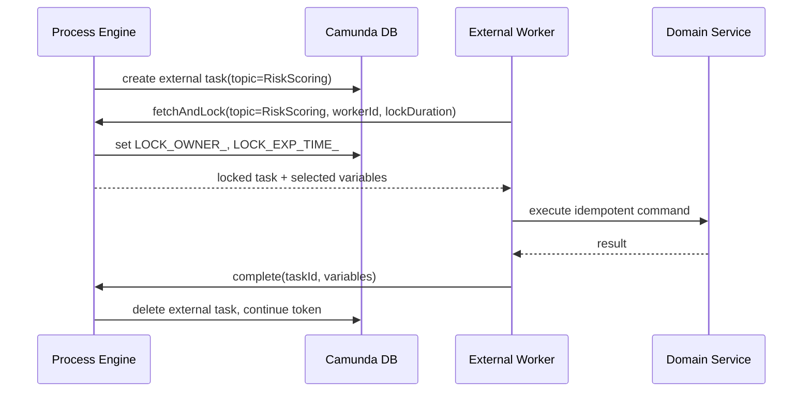
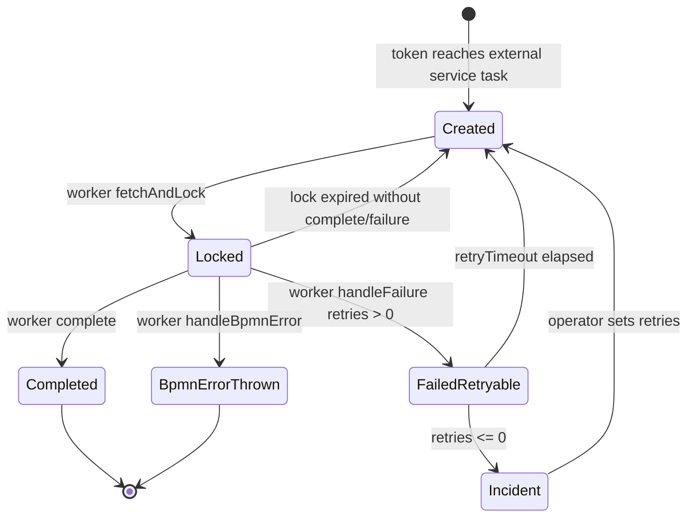
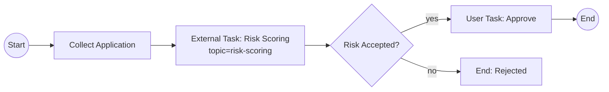
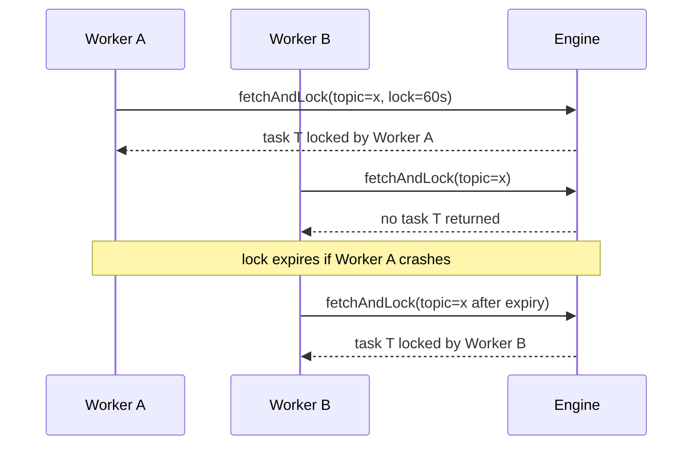
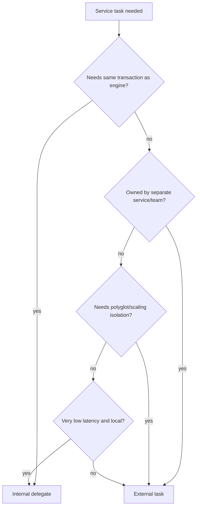
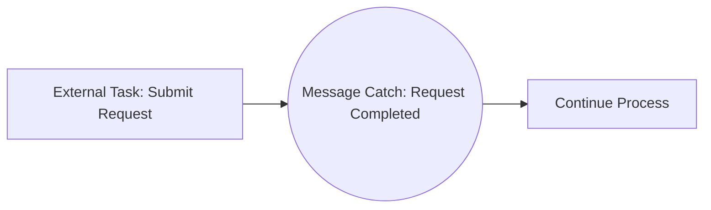
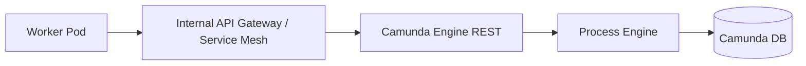
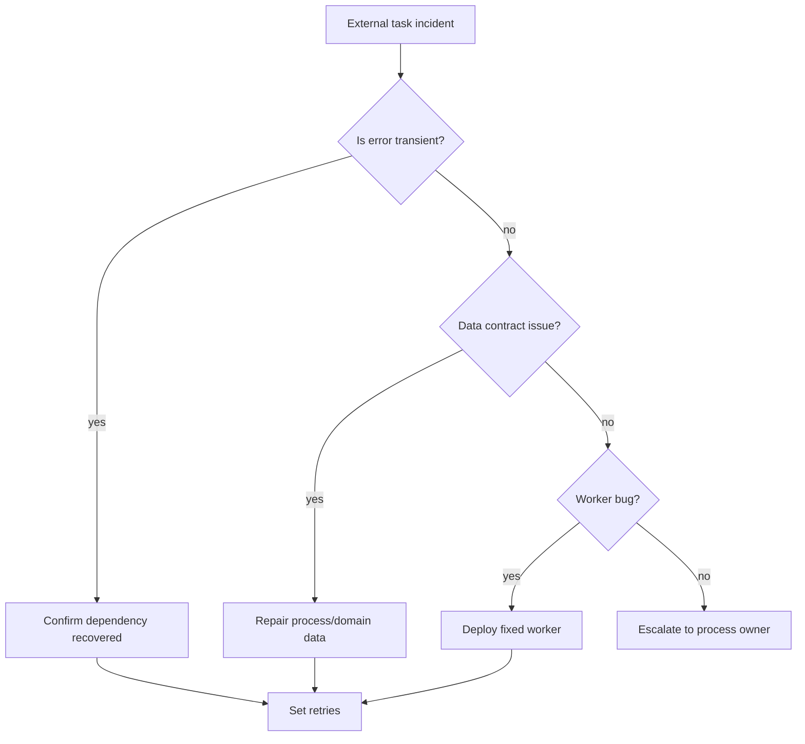
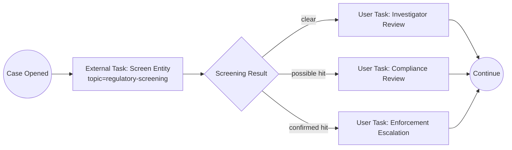

# Part 019 — External Task Pattern: Pull-Based Workers and Service Isolation

> Target skill: mampu mendesain, mengimplementasikan, mengoperasikan, dan men-debug external task worker Camunda 7 sebagai boundary integrasi yang aman, scalable, idempotent, dan tidak berubah menjadi distributed monolith.

External task adalah salah satu pola terpenting di Camunda 7 untuk sistem modern. Ia memindahkan eksekusi kerja dari JVM process engine ke worker eksternal yang melakukan polling ke engine. Secara arsitektur, ini terlihat sederhana: worker ambil task, kerjakan, complete. Secara produksi, detailnya sangat tajam: lock duration, retry, duplicate execution, error classification, variable contract, worker scaling, dan idempotency menentukan apakah sistem stabil atau menjadi mesin incident.

Camunda 7 documentation menjelaskan external task sebagai alternatif service task internal. Internal service task menjalankan code yang dideploy bersama process application. External task membuat unit of work yang bisa dipoll worker. Saat engine mencapai service task external, engine membuat external task instance dengan topic; worker melakukan fetch and lock, mengerjakan task, lalu menyelesaikannya agar process execution lanjut.

Referensi resmi:

- Camunda 7.24 External Tasks: https://docs.camunda.org/manual/7.24/user-guide/process-engine/external-tasks/
- BPMN Service Task: https://docs.camunda.org/manual/7.24/reference/bpmn20/tasks/service-task/
- REST API Overview: https://docs.camunda.org/manual/7.24/reference/rest/overview/
- External Task Client: https://docs.camunda.org/manual/7.24/user-guide/ext-client/

---

## 1. Kaufman Deconstruction

Skill external task perlu dipecah menjadi sub-skill kecil. Jangan mulai dari client library. Mulai dari invariant runtime.

| Sub-skill | Pertanyaan yang harus bisa dijawab | Output praktis |
|---|---|---|
| Runtime model | Apa yang terjadi ketika token mencapai external service task? | Bisa menggambar lifecycle external task |
| Topic design | Apa arti sebuah topic? | Topic taxonomy dan ownership matrix |
| Locking | Apa arti lock, worker id, dan lock expiration? | Lock duration policy |
| Completion | Kapan worker boleh complete? | Idempotent completion contract |
| Failure | Kapan handle failure, BPMN error, incident, atau retry? | Error classification table |
| Scaling | Bagaimana menambah worker tanpa duplicate side effect? | Worker scaling model |
| Observability | Apa metric yang harus dimonitor? | Dashboard dan alert rule |
| Security | Siapa boleh fetch/complete topic tertentu? | API boundary dan credential strategy |
| Testing | Bagaimana membuktikan retry, duplicate, timeout, dan BPMN error? | Test matrix |

Latihan 20 jam untuk part ini:

1. Modelkan satu process dengan 3 external tasks: validate, notify, persist projection.
2. Buat worker yang bisa fetch-and-lock, complete, failure, BPMN error.
3. Simulasikan worker crash setelah side effect tetapi sebelum complete.
4. Simulasikan lock timeout dan duplicate execution.
5. Ukur throughput dengan 1, 2, 5, 10 worker.
6. Buat runbook incident untuk failed external task.

Tujuan akhir bukan “bisa pakai external task client”. Tujuan akhirnya adalah bisa menjawab: **apakah worker ini aman jika dijalankan dua kali, terlambat, crash, atau menerima payload versi lama?**

---

## 2. Mental Model: External Task adalah User Task untuk Mesin

Analogi paling efektif: external task mirip user task, tetapi aktornya bukan manusia.

| User Task | External Task |
|---|---|
| Engine membuat task untuk manusia | Engine membuat task untuk worker |
| Task masuk task list | External task masuk topic |
| User claim task | Worker fetch and lock task |
| User bekerja di luar engine | Worker bekerja di luar engine |
| User complete task | Worker complete task |
| Task bisa reassigned/escalated | External task bisa lock timeout/retry/incident |

Jadi external task bukan “engine memanggil service”. External task adalah **worker mengambil pekerjaan dari engine**.

Perbedaan ini penting:

- Engine tidak perlu tahu alamat worker.
- Worker tidak perlu expose endpoint publik.
- Worker bisa ditulis dalam Java, Go, Node.js, Python, .NET, atau bahasa lain.
- Scaling dilakukan dengan menambah worker yang polling topic yang sama.
- Failure model berubah dari synchronous call failure menjadi work item retry/lock model.



Production invariant:

> External task completion is a signal to the process engine that the off-engine work has already been performed successfully.

Karena itu worker tidak boleh complete sebelum side effect yang wajib dilakukan benar-benar aman.

---

## 3. External Task Runtime Lifecycle

Lifecycle external task:



Terminologi penting:

| Istilah | Makna |
|---|---|
| External task instance | Work item durable yang dibuat engine |
| Topic | Nama kategori work yang dipoll worker |
| Worker ID | Identifier worker yang mengambil lock |
| Lock duration | Durasi lock sebelum task bisa diambil worker lain |
| Lock owner | Worker yang sedang memegang task |
| Complete | Worker menyatakan pekerjaan sukses dan token boleh lanjut |
| Handle failure | Worker melaporkan technical failure dan retry policy |
| Handle BPMN error | Worker melempar business error yang dimodelkan di BPMN |
| Incident | External task stuck karena retries habis |

Camunda menyatakan worker hanya dapat complete task yang sebelumnya dia fetch dan lock; jika task sudah dilock worker lain, complete akan gagal. Ini mencegah dua worker menyelesaikan task yang sama dari perspektif engine, tetapi tidak otomatis mencegah duplicate side effect di sistem eksternal.

---

## 4. BPMN Configuration

External task biasanya dimodelkan sebagai service task dengan `camunda:type="external"` dan `camunda:topic`.

```xml
<bpmn:serviceTask
    id="ScoreRiskTask"
    name="Score Risk"
    camunda:type="external"
    camunda:topic="risk-scoring" />
```

Dengan retry cycle:

```xml
<bpmn:serviceTask
    id="NotifyCustomerTask"
    name="Notify Customer"
    camunda:type="external"
    camunda:topic="customer-notification">
  <bpmn:extensionElements>
    <camunda:failedJobRetryTimeCycle>R5/PT10M</camunda:failedJobRetryTimeCycle>
  </bpmn:extensionElements>
</bpmn:serviceTask>
```

Catatan: external task failure handling terutama dikontrol worker lewat `handleFailure(retries, retryTimeout)`. Retry cycle BPMN masih relevan pada beberapa error engine-side dan default behavior, tetapi di production sebaiknya worker punya policy eksplisit.

Model minimal:



External task bagus ketika:

- business work dilakukan oleh service lain,
- worker butuh scaling independen,
- worker pakai stack berbeda,
- engine tidak boleh punya dependency langsung ke domain service,
- network boundary lebih aman dengan pull daripada push,
- operation team ingin mengontrol worker secara terpisah.

External task tidak otomatis bagus ketika:

- logic sangat lokal, cepat, dan transactionally coupled dengan engine,
- butuh strong consistency satu database transaction dengan process state,
- payload besar dan sering berubah,
- proses sangat latency-sensitive sub-100ms,
- tim tidak siap mengelola worker fleet.

---

## 5. Java External Task Client Minimal

Contoh worker Java dengan Camunda External Task Client:

```java
ExternalTaskClient client = ExternalTaskClient.create()
    .baseUrl("http://localhost:8080/engine-rest")
    .workerId("risk-worker-01")
    .asyncResponseTimeout(20_000)
    .lockDuration(60_000)
    .build();

client.subscribe("risk-scoring")
    .lockDuration(60_000)
    .handler((externalTask, externalTaskService) -> {
        String applicationId = externalTask.getVariable("applicationId");
        String processInstanceId = externalTask.getProcessInstanceId();

        try {
            RiskScoreResult result = riskScoringService.score(
                new ScoreRiskCommand(applicationId, processInstanceId)
            );

            Map<String, Object> variables = Map.of(
                "riskScore", result.score(),
                "riskBand", result.band(),
                "riskScoredAt", result.scoredAt().toString()
            );

            externalTaskService.complete(externalTask, variables);
        } catch (RiskRejectedException ex) {
            externalTaskService.handleBpmnError(
                externalTask,
                "RISK_REJECTED",
                ex.getMessage(),
                Map.of("rejectionReason", ex.reason())
            );
        } catch (TransientDependencyException ex) {
            externalTaskService.handleFailure(
                externalTask,
                "Risk scoring dependency unavailable",
                ex.toString(),
                5,
                10 * 60_000L
            );
        } catch (Exception ex) {
            externalTaskService.handleFailure(
                externalTask,
                "Unexpected risk worker failure",
                ex.toString(),
                0,
                0L
            );
        }
    })
    .open();
```

Hal yang harus diperhatikan:

- `workerId` harus cukup unik untuk troubleshooting.
- `asyncResponseTimeout` mengaktifkan long polling sehingga client tidak spin polling terlalu sering.
- `lockDuration` harus lebih panjang dari expected processing time, tetapi tidak terlalu panjang sampai recovery lambat.
- Worker harus membedakan business error dari technical failure.
- `processInstanceId` atau business key harus digunakan sebagai bagian idempotency key.
- Variable output harus kecil, stabil, dan versioned.

---

## 6. Topic Design

Topic bukan sekadar nama method. Topic adalah kontrak operasional.

Topic yang baik:

```text
risk-scoring
customer-notification
payment-capture
case-indexing
document-rendering
regulatory-watchlist-screening
```

Topic yang buruk:

```text
doTask
processRequest
serviceTask1
callApi
worker
handler
```

### 6.1 Topic Naming Rules

Gunakan format:

```text
<bounded-context>-<capability>
```

Contoh:

| Topic | Bounded context | Capability |
|---|---|---|
| `risk-scoring` | Risk | Score application |
| `payment-capture` | Payment | Capture authorized payment |
| `case-assignment` | Case | Assign case owner |
| `document-rendering` | Document | Render PDF package |
| `regulatory-screening` | Compliance | Check regulated entity |

Hindari topic yang terlalu teknis:

| Buruk | Masalah |
|---|---|
| `http-post` | Tidak menyatakan business capability |
| `db-update` | Bocor implementation detail |
| `java-worker` | Tidak useful untuk routing |
| `common-service` | Jadi god worker |

### 6.2 Topic Granularity

Terlalu kasar:

```text
case-processing
```

Masalah:

- semua worker butuh if/else berdasarkan variable,
- sulit scaling per capability,
- sulit observability,
- retry policy tidak spesifik,
- permission terlalu luas.

Terlalu halus:

```text
case-read-name
case-read-address
case-read-phone
case-read-email
```

Masalah:

- overhead task terlalu besar,
- model BPMN penuh detail teknis,
- workflow jadi brittle,
- latency meningkat.

Granularity yang baik:

```text
case-enrichment
case-risk-classification
case-assignment
case-notification
```

Heuristic:

> Satu topic idealnya merepresentasikan satu capability bisnis yang punya owner, retry policy, metric, dan security boundary sendiri.

---

## 7. Worker Ownership Model

Salah satu keputusan arsitektur terbesar: siapa yang memiliki worker?

### 7.1 Process-owned Worker

Process application memiliki worker.

Kelebihan:

- cepat dikembangkan,
- contract dekat dengan BPMN,
- deployment sederhana,
- cocok untuk tim kecil.

Kekurangan:

- boundary domain bisa kabur,
- worker ikut lifecycle process app,
- sulit scaling capability tertentu,
- risiko god process app.

### 7.2 Domain-owned Worker

Bounded context/domain service memiliki worker untuk topic miliknya.

Kelebihan:

- ownership jelas,
- scaling sesuai capability,
- domain logic tetap di domain service,
- contract lebih defensible.

Kekurangan:

- koordinasi deployment lebih kompleks,
- perlu governance topic contract,
- butuh observability lintas service.

### 7.3 Platform-owned Worker

Workflow platform team menyediakan worker generik.

Kelebihan:

- standardisasi tinggi,
- reusable worker untuk common capabilities,
- operational control kuat.

Kekurangan:

- mudah berubah menjadi universal integration layer,
- lambat memenuhi kebutuhan domain,
- business logic bisa masuk platform.

Rekomendasi default untuk sistem besar:

> Domain-owned worker untuk capability bisnis, process-owned worker untuk glue kecil yang tidak memiliki side effect eksternal besar, platform-owned worker hanya untuk cross-cutting capability yang benar-benar reusable.

---

## 8. Fetch and Lock Semantics

Fetch and lock bukan sekadar query. Ini adalah operasi claim work.

Langkah konseptual:

1. Worker meminta task dari topic tertentu.
2. Engine mencari external task yang tersedia.
3. Engine mengunci task untuk worker tersebut selama lock duration.
4. Engine mengembalikan task dan selected variables.
5. Worker bekerja.
6. Worker complete, handle failure, atau handle BPMN error.



Important invariant:

> Lock mencegah dua worker memegang task Camunda yang sama pada waktu yang sama. Lock tidak mencegah side effect duplicate di sistem eksternal jika worker pertama sudah melakukan side effect tetapi gagal complete.

Karena itu idempotency wajib.

---

## 9. Lock Duration Policy

`lockDuration` adalah trade-off recovery vs duplicate risk.

Jika terlalu pendek:

- task bisa diambil worker lain saat worker pertama masih bekerja,
- duplicate side effect meningkat,
- complete worker pertama gagal karena lock sudah pindah,
- log penuh exception.

Jika terlalu panjang:

- recovery dari worker crash lambat,
- incident diagnosis tertunda,
- task terlihat “hilang” dari pool,
- SLA bisa terlewat.

Policy awal:

```text
lockDuration = p99_processing_time + network_margin + commit_margin
```

Contoh:

| Work type | p99 | Suggested lock | Catatan |
|---|---:|---:|---|
| HTTP call cepat | 2s | 30s | minimum operational margin |
| Document render | 45s | 2m | consider extendLock |
| Batch enrichment | 4m | 6m | split if possible |
| Human-like external approval | hours | jangan pakai satu external task aktif berjam-jam |

Untuk kerja panjang, jangan langsung set lock 2 jam. Lebih baik:

- pecah kerja menjadi beberapa task,
- gunakan polling status pattern,
- gunakan message callback,
- atau gunakan `extendLock` secara heartbeat jika memang worker memegang job komputasi panjang.

```java
externalTaskService.extendLock(externalTask, 60_000L);
```

Aturan praktis:

> Lock duration bukan SLA bisnis. Lock duration adalah lease teknis untuk worker.

---

## 10. Completion Contract

Worker boleh complete hanya jika semua hal berikut benar:

1. Input contract valid.
2. Side effect wajib sudah sukses.
3. Result yang diperlukan untuk langkah proses berikut sudah tersedia.
4. Output variables sudah sesuai schema.
5. Worker yakin operasi aman terhadap retry/duplicate.

Completion bukan “akhir handler”. Completion adalah commit semantic ke process engine.

### 10.1 Output Variable Discipline

Output buruk:

```java
externalTaskService.complete(task, Map.of(
    "response", entireHttpResponse,
    "payload", hugeDomainObject,
    "result", objectMapper.writeValueAsString(anything)
));
```

Output baik:

```java
externalTaskService.complete(task, Map.of(
    "riskScore", Variables.integerValue(result.score()),
    "riskBand", Variables.stringValue(result.band().name()),
    "riskDecisionId", Variables.stringValue(result.decisionId()),
    "riskScoredAt", Variables.stringValue(result.scoredAt().toString())
));
```

Simpan payload besar di domain store/object storage, bukan process variable.

### 10.2 Idempotent Complete

Complete sendiri tidak idempotent jika task sudah selesai. Jika worker melakukan complete dua kali, complete kedua biasanya gagal karena task tidak ada atau lock tidak valid. Yang harus idempotent adalah **side effect sebelum complete**.

Gunakan idempotency key:

```text
<processDefinitionKey>:<businessKey>:<activityId>:<externalTaskId-or-domain-command-id>
```

Untuk side effect bisnis, lebih stabil menggunakan domain command id:

```text
payment-capture:<paymentIntentId>:<processInstanceId>
```

Jangan menggunakan random UUID baru setiap retry. Itu membuat retry terlihat sebagai operasi baru.

---

## 11. Failure Classification

External worker harus mengklasifikasi error. Jangan semua error disamakan.

| Kondisi | Camunda operation | Meaning |
|---|---|---|
| Business condition expected | `handleBpmnError` | Proses punya path alternatif |
| Temporary dependency down | `handleFailure(retries > 0, retryTimeout)` | Retry later |
| Data contract invalid | `handleFailure(retries = 0)` atau BPMN error jika dimodelkan | Perlu human/operator repair |
| Non-retryable technical bug | `handleFailure(retries = 0)` | Incident |
| Unknown exception | `handleFailure(retries = 0 or low retries)` | Fail visible, jangan swallow |
| Worker crash | no call | Lock expires; task fetched again |

### 11.1 BPMN Error

Gunakan BPMN error jika error tersebut adalah business outcome yang diketahui proses.

Contoh:

- customer not eligible,
- risk rejected,
- document invalid,
- sanction list match,
- account closed,
- insufficient funds jika proses punya branch handling.

```java
externalTaskService.handleBpmnError(
    externalTask,
    "RISK_REJECTED",
    "Risk score exceeds threshold",
    Map.of("rejectionReason", "HIGH_RISK_SCORE")
);
```

Di BPMN:

```xml
<bpmn:boundaryEvent id="RiskRejectedBoundary" attachedToRef="ScoreRiskTask">
  <bpmn:errorEventDefinition errorRef="RiskRejectedError" />
</bpmn:boundaryEvent>
```

### 11.2 Technical Failure

Gunakan `handleFailure` untuk technical failure.

```java
externalTaskService.handleFailure(
    externalTask,
    "Payment gateway timeout",
    stackTrace,
    3,
    5 * 60_000L
);
```

Ketika retries > 0, task bisa difetch lagi setelah retry timeout. Ketika retries habis, external task dapat menjadi incident.

### 11.3 Tidak Semua Error Perlu Retry

Retry buruk untuk:

- schema mismatch,
- missing required variable,
- invalid enum value,
- authorization denied permanen,
- domain invariant violation,
- bug di worker code.

Retry baik untuk:

- HTTP 503,
- network timeout,
- transient DB deadlock,
- rate limit dengan backoff,
- temporary dependency outage.

---

## 12. Retry Strategy

Retry strategy harus dimiliki oleh worker dan bisa dijelaskan.

### 12.1 Fixed Retry

```text
retries=5, retryTimeout=PT10M
```

Baik untuk dependency yang recoverable dan stabil.

### 12.2 Exponential Backoff

Camunda external task API menerima retry timeout untuk next attempt, bukan otomatis exponential schedule. Worker bisa menghitung sendiri berdasarkan attempt count yang disimpan sebagai variable/local metadata atau dari error context.

```java
long timeout = switch (remainingRetries) {
    case 4 -> 1 * 60_000L;
    case 3 -> 5 * 60_000L;
    case 2 -> 15 * 60_000L;
    case 1 -> 60 * 60_000L;
    default -> 0L;
};
```

### 12.3 Retry Budget

Retry bukan infinite loop. Setiap external task perlu retry budget:

| Topic | Retries | Backoff | Escalation |
|---|---:|---|---|
| `risk-scoring` | 5 | 1m, 5m, 15m, 1h, 3h | incident to risk ops |
| `customer-notification` | 10 | 10m fixed | mark notification failed after final |
| `payment-capture` | 3 | 5m, 15m, 1h | finance review |
| `document-rendering` | 2 | 10m, 30m | document ops |

Heuristic:

> Retry should absorb temporary noise, not hide design or data problems.

---

## 13. Worker Scaling Model

External task scaling terlihat mudah: tambah pod. Yang sulit adalah menjaga rate, lock, dan idempotency.

### 13.1 Scaling Dimensions

| Dimension | Control |
|---|---|
| Worker replicas | Kubernetes deployment replicas, VM count |
| Max tasks per fetch | Client config |
| Topic subscriptions | Worker code/config |
| Lock duration | Client/topic config |
| Long polling timeout | Client config |
| Thread pool/concurrency | Worker runtime |
| Downstream rate limit | Bulkhead/rate limiter |

### 13.2 Throughput Formula Sederhana

```text
throughput_per_worker ~= concurrency / avg_processing_time
cluster_throughput ~= workers * throughput_per_worker
```

Tapi real throughput dibatasi oleh:

- Camunda REST API throughput,
- DB load,
- external service rate limits,
- variable serialization cost,
- network latency,
- worker CPU/memory,
- task creation rate.

### 13.3 Max Tasks Per Fetch

Nilai terlalu kecil:

- banyak HTTP roundtrip,
- worker idle,
- overhead tinggi.

Nilai terlalu besar:

- worker mengunci banyak task tetapi lambat memproses,
- task tidak tersedia untuk worker lain,
- lock expiry meningkat,
- latency tail memburuk.

Rule awal:

```text
maxTasks <= localConcurrency * 2
```

Jika worker memproses 8 task paralel, mulai dengan `maxTasks=8` atau `maxTasks=16`, bukan 1000.

### 13.4 Backpressure

Worker harus punya backpressure terhadap dependency eksternal. Jangan fetch task jika worker tidak bisa memproses.

Pola buruk:

```text
fetch 1000 tasks -> enqueue memory -> process slowly -> lock expires -> duplicate chaos
```

Pola baik:

```text
available_slots = worker_concurrency - in_flight
fetch max available_slots
```

---

## 14. External Task vs Internal Delegate

| Kriteria | Internal Delegate | External Task |
|---|---|---|
| Latency | Lebih rendah | Lebih tinggi karena polling/REST |
| Transaction coupling | Bisa dalam transaction engine | Di luar transaction engine |
| Deployment | Bersama process app | Terpisah |
| Language | JVM | Polyglot |
| Scaling | Bersama engine/app | Independen |
| Failure model | Exception/job retry | Lock/retry/incident |
| Operational isolation | Rendah-sedang | Tinggi |
| Security boundary | In-process | API/network boundary |
| Best for | local deterministic logic | remote/domain capability |

Decision rule:



---

## 15. External Task vs Message Callback

External task is pull work. Message callback is event correlation.

| Scenario | Better Pattern |
|---|---|
| Worker performs work immediately after fetch | External task |
| External system starts long-running operation and calls back later | Send command + intermediate message catch |
| Work duration unknown/hours/days | Message callback or polling status process |
| Need external system to own lifecycle | Message correlation |
| Need engine to expose backlog to workers | External task |

Bad pattern:

```text
External task lock duration = 24 hours while waiting for external approval
```

Better pattern:



Worker submits request, completes task, and process waits at message catch. When external system completes, integration adapter correlates message to process instance.

---

## 16. Variable Fetch Strategy

Worker should fetch only variables it needs.

Bad:

```java
client.subscribe("risk-scoring")
    .handler(handler)
    .open();
```

Depending on client config, this may fetch more data than needed.

Better:

```java
client.subscribe("risk-scoring")
    .variables("applicationId", "customerId", "requestedAmount", "countryCode")
    .handler(handler)
    .open();
```

Variable contract example:

| Variable | Direction | Type | Required | Notes |
|---|---|---|---|---|
| `applicationId` | input | string | yes | Domain aggregate id |
| `customerId` | input | string | yes | Used for risk service lookup |
| `requestedAmount` | input | decimal/string | yes | Avoid floating point ambiguity |
| `countryCode` | input | string | yes | ISO-3166 alpha-2 |
| `riskScore` | output | integer | yes | 0-1000 |
| `riskBand` | output | string enum | yes | LOW/MEDIUM/HIGH |
| `riskDecisionId` | output | string | yes | Audit pointer |

Worker should validate input before calling domain service:

```java
record RiskScoringInput(
    String applicationId,
    String customerId,
    BigDecimal requestedAmount,
    String countryCode
) {
    static RiskScoringInput from(ExternalTask task) {
        return new RiskScoringInput(
            requiredString(task, "applicationId"),
            requiredString(task, "customerId"),
            requiredDecimal(task, "requestedAmount"),
            requiredString(task, "countryCode")
        );
    }
}
```

Contract failure should become visible. Do not default missing values silently.

---

## 17. Idempotency Patterns

External tasks live in a hostile distributed environment:

- worker can crash after side effect,
- network can fail after complete request is sent,
- lock can expire while work continues,
- worker can be restarted,
- retry can re-run same business operation,
- duplicate events can create duplicate process attempts.

### 17.1 Idempotent Command Table

Domain service stores processed command IDs.

```sql
CREATE TABLE processed_command (
  command_id VARCHAR(200) PRIMARY KEY,
  command_type VARCHAR(100) NOT NULL,
  aggregate_id VARCHAR(100) NOT NULL,
  result_reference VARCHAR(200),
  created_at TIMESTAMP NOT NULL
);
```

Worker sends stable command ID:

```java
String commandId = "risk-scoring:" + applicationId + ":" + externalTask.getActivityId();
RiskScoreResult result = riskService.score(commandId, input);
```

If retry sends the same command, service returns same result.

### 17.2 Natural Idempotency

Some operations are naturally idempotent:

- upsert projection by process instance id,
- set status to a deterministic value,
- PUT resource with same representation,
- send notification with dedupe key.

Some are not naturally idempotent:

- charge card,
- send SMS/email without dedupe,
- create new case,
- append ledger entry,
- issue penalty notice.

Non-idempotent side effects need explicit dedupe.

### 17.3 Completion Ambiguity

Consider:

1. Worker calls payment service successfully.
2. Worker calls `complete`.
3. Network fails before worker receives response.
4. Worker retries or restarts.

State may be:

- complete succeeded, but response lost;
- complete failed, task still available;
- lock expired and another worker took task.

Design must tolerate all three.

---

## 18. External Task Error Event Definitions

Camunda supports error event definitions for external tasks. An error expression can cause complete/failure to throw BPMN error if the expression evaluates true.

Production use cautiously:

- Good for declarative error mapping when worker returns a known error variable.
- Risky if expression becomes too clever or depends on unstable variables.
- Prefer explicit `handleBpmnError` in worker when business error classification is owned by worker/domain service.

Example explicit worker-side BPMN error is usually clearer:

```java
catch (SanctionMatchException ex) {
    externalTaskService.handleBpmnError(
        externalTask,
        "SANCTION_MATCH",
        "Applicant matched sanction watchlist",
        Map.of("watchlistHitId", ex.hitId())
    );
}
```

---

## 19. Security Model

External task workers need credentials to engine REST API. Do not give every worker broad admin access.

Minimum concerns:

| Concern | Requirement |
|---|---|
| Authentication | Worker authenticates to engine REST/API gateway |
| Authorization | Worker can fetch/complete only needed topic/process scope where possible |
| Network | Engine REST not publicly exposed |
| Secrets | Credentials managed by secret store |
| Audit | Worker ID and service identity logged |
| Multi-tenancy | Tenant-aware fetch if using tenant separation |
| Data minimization | Worker fetches only required variables |

Camunda REST basic auth may be disabled by default in some distributions, so production setup must explicitly configure authentication and usually place REST behind controlled infrastructure.

Architecture:



Avoid:

```text
internet -> engine-rest -> complete arbitrary tasks
```

---

## 20. Observability

External task observability has two dimensions:

1. Engine-side backlog/state.
2. Worker-side processing/side effects.

### 20.1 Engine Metrics

Track:

- external task count by topic,
- locked task count,
- task age by topic,
- retries remaining distribution,
- incidents by process/topic,
- lock expiration count,
- completion rate,
- BPMN error rate,
- failure rate.

### 20.2 Worker Metrics

Track:

- fetch request rate,
- fetched tasks count,
- empty fetch count,
- processing duration p50/p95/p99,
- complete success/failure,
- handleFailure count by error type,
- handleBpmnError count by error code,
- downstream call latency/error,
- duplicate command detection count,
- lock extension count.

Example Prometheus metric names:

```text
camunda_external_task_fetched_total{topic="risk-scoring"}
camunda_external_task_completed_total{topic="risk-scoring"}
camunda_external_task_failed_total{topic="risk-scoring",error_class="timeout"}
camunda_external_task_processing_seconds_bucket{topic="risk-scoring"}
camunda_external_task_lock_expired_total{topic="risk-scoring"}
workflow_worker_downstream_latency_seconds{service="risk-service"}
```

### 20.3 Logs

Every worker log line should include:

- `processInstanceId`,
- `businessKey`,
- `externalTaskId`,
- `activityId`,
- `topic`,
- `workerId`,
- `commandId`,
- `correlationId`.

Example structured log:

```json
{
  "event": "external_task_completed",
  "topic": "risk-scoring",
  "workerId": "risk-worker-7f8d9",
  "processInstanceId": "...",
  "businessKey": "CASE-2026-00042",
  "activityId": "ScoreRiskTask",
  "externalTaskId": "...",
  "commandId": "risk-scoring:APP-42:ScoreRiskTask",
  "durationMs": 742
}
```

---

## 21. Runbook: Failed External Task Incident

When external task incident appears:

1. Identify process definition, process instance, activity id, topic.
2. Read error message and error details.
3. Check retries and retry timeout.
4. Determine classification:
   - transient dependency,
   - invalid process data,
   - worker bug,
   - authorization/config issue,
   - downstream domain rejection.
5. Check whether side effect already happened.
6. If side effect happened, ensure complete/retry will not duplicate it.
7. Repair data if needed.
8. Set retries only after fix.
9. Document incident cause and permanent mitigation.

Do not blindly set retries.



---

## 22. Testing Matrix

| Test | Expected result |
|---|---|
| Worker completes happy path | Process moves past service task |
| Worker throws BPMN error | Boundary error path taken |
| Worker reports transient failure | Task retries after timeout |
| Worker reports zero retries | Incident created |
| Worker crashes before side effect | Lock expires, another worker processes |
| Worker crashes after side effect before complete | Retry does not duplicate side effect |
| Worker completes after lock expired | Complete fails safely |
| Missing variable | Failure visible, no silent default |
| Duplicate fetch pressure | No duplicate side effect |
| Downstream rate limit | Worker backs off, does not overload |

Integration test idea:

```java
@Test
void retryDoesNotDuplicatePaymentCapture() {
    // start process with external payment-capture task
    // worker simulates capture success then crash before complete
    // lock expires
    // second worker fetches same task
    // payment service receives same idempotency key
    // payment captured once, process completes
}
```

---

## 23. Common Anti-Patterns

### 23.1 Lock Duration as Business Timeout

Bad:

```text
Set lockDuration=24h because external approval can take 24h.
```

Why bad:

- worker holds technical lease too long,
- crash recovery is slow,
- engine backlog becomes misleading,
- task is not a real wait state for external callback.

Better:

- complete external task after submitting external request,
- wait at message catch/timer event.

### 23.2 Worker as God Service

Bad:

```text
topic=case-work
worker contains giant switch on activityId and process variables
```

Better:

- topic per capability,
- worker per bounded context,
- explicit contract per topic.

### 23.3 No Idempotency

Bad:

```java
paymentGateway.charge(card, amount);
externalTaskService.complete(task);
```

If worker crashes after charge and before complete, retry charges again.

Better:

```java
paymentGateway.charge(idempotencyKey, card, amount);
externalTaskService.complete(task);
```

### 23.4 Fetching All Variables

Bad:

- unnecessary data exposure,
- slower serialization,
- schema coupling,
- sensitive data leak.

Better:

- fetch only required variables,
- use references to domain data.

### 23.5 Swallowing Failure and Completing

Bad:

```java
try {
    notifyCustomer();
} catch (Exception ignored) {
}
externalTaskService.complete(task);
```

This creates false success. Workflow state says notification done, but it failed.

### 23.6 Infinite Retry

Bad:

```java
handleFailure(task, "failed", details, 999999, 1000L)
```

This hides incidents and burns resources.

Better:

- bounded retry,
- exponential backoff,
- incident with useful details,
- runbook.

### 23.7 Topic Name Coupled to Technical Endpoint

Bad:

```text
topic=POST-/v1/risk-score
```

Better:

```text
topic=risk-scoring
```

BPMN should describe capability, not HTTP path.

---

## 24. Regulatory Case Management Example

Scenario: enforcement case requires watchlist screening.

BPMN:



Worker contract:

| Variable | Direction | Notes |
|---|---|---|
| `caseId` | input | business key equivalent |
| `entityId` | input | domain reference |
| `screeningPolicyVersion` | input | audit requirement |
| `screeningResult` | output | CLEAR/POSSIBLE_HIT/CONFIRMED_HIT |
| `screeningRunId` | output | audit reference |
| `screenedAt` | output | timestamp |

Idempotency key:

```text
regulatory-screening:<caseId>:<entityId>:<screeningPolicyVersion>
```

Failure policy:

| Error | Handling |
|---|---|
| Watchlist service 503 | retry 5 times with backoff |
| Invalid entity id | incident, data repair |
| Confirmed sanction match | BPMN error or output branch, depending model |
| Policy version missing | incident, do not default |

Audit requirements:

- record policy version,
- record screening run id,
- preserve input references,
- preserve worker version if required,
- ensure manual overrides are separate user tasks, not hidden worker behavior.

---

## 25. Production Checklist

Before shipping an external task worker:

- [ ] Topic has clear owner.
- [ ] Topic name represents business capability.
- [ ] Input variable contract is documented.
- [ ] Output variable contract is documented.
- [ ] Worker validates required variables.
- [ ] Worker fetches only required variables.
- [ ] Side effects are idempotent.
- [ ] Command id is stable across retries.
- [ ] Lock duration is based on measured processing time.
- [ ] Long polling is configured.
- [ ] Max tasks per fetch matches worker concurrency.
- [ ] Retry policy is bounded.
- [ ] BPMN errors are used only for modeled business outcomes.
- [ ] Technical failures become visible.
- [ ] Incidents include useful details.
- [ ] Worker metrics and logs include process/task identifiers.
- [ ] Downstream rate limit/backpressure exists.
- [ ] Security credentials are scoped and managed.
- [ ] Crash-after-side-effect scenario is tested.
- [ ] Lock-expiry duplicate scenario is tested.
- [ ] Runbook exists.

---

## 26. Self-Correction Questions

Jawab tanpa melihat dokumentasi:

1. Apa perbedaan external task dan internal service task?
2. Mengapa external task mirip user task?
3. Apa yang dijamin oleh lock? Apa yang tidak dijamin?
4. Mengapa idempotency tetap wajib walaupun Camunda punya lock?
5. Kapan harus memakai `handleBpmnError`?
6. Kapan harus memakai `handleFailure` dengan retries 0?
7. Apa risiko lock duration terlalu pendek?
8. Apa risiko lock duration terlalu panjang?
9. Apa bedanya topic dengan endpoint teknis?
10. Bagaimana cara menguji worker crash setelah side effect tapi sebelum complete?

Jika belum bisa menjawab ini, jangan lanjut ke arsitektur remote engine. External task pattern adalah fondasi integrasi Camunda yang harus benar secara mental model.

---

## 27. Summary

External task adalah pola pull-based work distribution di Camunda 7. Ia cocok untuk service isolation, polyglot workers, scaling independen, dan boundary lintas sistem. Namun external task bukan silver bullet. Ia membawa distributed systems problem: duplicate execution, lock expiration, retry ambiguity, downstream failure, contract versioning, dan observability.

Prinsip utama:

- Topic adalah capability contract, bukan nama method.
- Lock adalah lease teknis, bukan jaminan exactly-once.
- Worker harus idempotent.
- Completion berarti side effect sudah aman.
- Business error harus dimodelkan, technical error harus terlihat.
- Retry harus bounded dan operasional.
- Worker scaling harus mempertimbangkan backpressure.
- Long-running external lifecycle lebih cocok dengan message callback daripada lock panjang.

Part berikutnya akan membahas REST API dan remote engine integration: bagaimana aplikasi luar memulai process instance, correlate message, complete task, fetch external task, dan membangun boundary API yang aman tanpa membocorkan engine sebagai public domain API.
