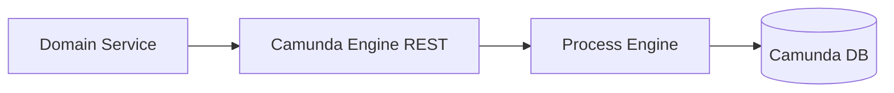
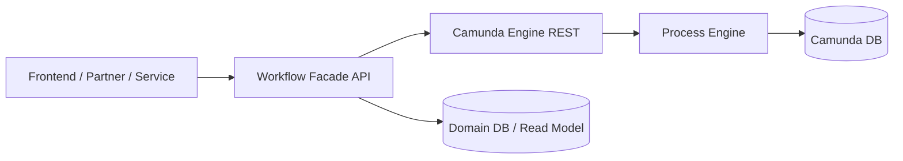
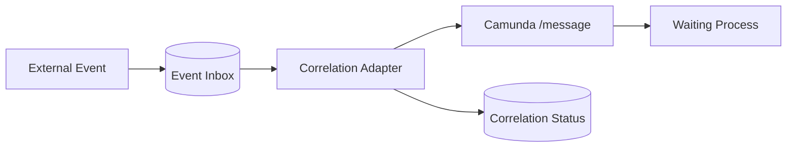
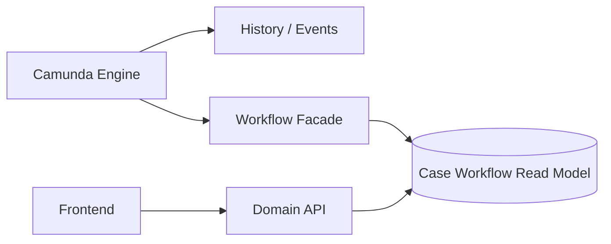
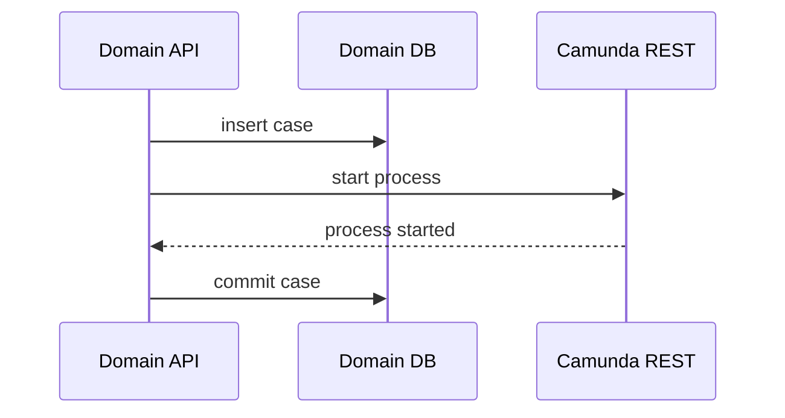
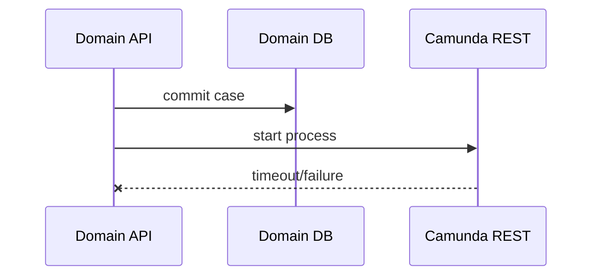
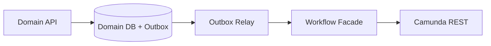
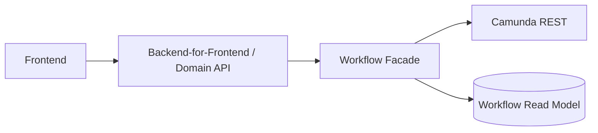
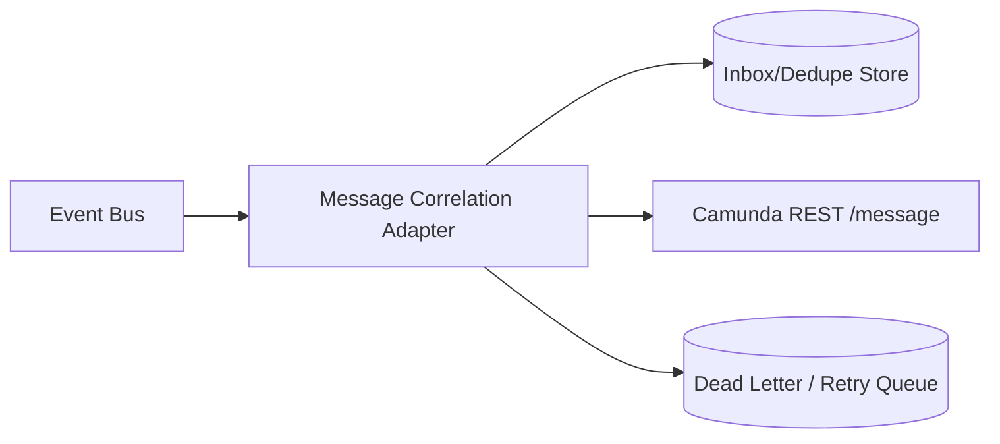

# Part 020 — REST API and Remote Engine Integration

> Target skill: mampu menggunakan Camunda 7 REST API sebagai integration boundary dengan benar, tanpa mengekspos engine sebagai domain API mentah, tanpa mengorbankan security, audit, idempotency, dan process invariants.

Camunda 7 dapat diakses melalui Java API dan REST API. Dalam arsitektur embedded engine, aplikasi Java sering memanggil `RuntimeService`, `TaskService`, atau `ExternalTaskService` langsung. Dalam arsitektur remote engine, aplikasi lain berinteraksi lewat HTTP REST API. Kemampuan REST API sangat luas: deploy, start process, query process/task/history, correlate message, complete user task, fetch external task, set variables, retry jobs, dan banyak lagi.

Kekuatan REST API juga risikonya. Jika REST API engine diekspos langsung ke frontend, partner, atau banyak microservice tanpa boundary, Camunda berubah menjadi public mutable database untuk process state. Itu buruk untuk keamanan, audit, versioning, dan business invariants.

Referensi resmi:

- Camunda 7.24 REST API Overview: https://docs.camunda.org/manual/7.24/reference/rest/overview/
- Camunda 7.24 REST OpenAPI: https://docs.camunda.org/rest/camunda-bpm-platform/7.24/
- Process Engine API: https://docs.camunda.org/manual/7.24/user-guide/process-engine/process-engine-api/
- Message Events: https://docs.camunda.org/manual/7.24/reference/bpmn20/events/message-events/
- External Tasks: https://docs.camunda.org/manual/7.24/user-guide/process-engine/external-tasks/

---

## 1. Kaufman Deconstruction

REST integration skill perlu dipecah menjadi sub-skill berikut:

| Sub-skill | Pertanyaan utama | Output praktis |
|---|---|---|
| Engine REST mental model | REST API mewakili service apa di engine? | Mapping endpoint ke engine service |
| Process start | Kapan start by key vs id vs message? | Start command contract |
| Message correlation | Bagaimana process instance dipilih? | Correlation key strategy |
| User task API | Siapa boleh query/claim/complete task? | Task boundary service |
| External task REST | Bagaimana worker fetch/complete/failure? | Worker client policy |
| Variable API | Bagaimana serialisasi typed variables? | Variable contract discipline |
| Error handling | Bagaimana membaca HTTP error dan engine exception? | Client retry rules |
| Security | Siapa boleh memanggil endpoint mana? | AuthN/AuthZ design |
| API facade | Kapan perlu wrapper service? | Domain API layer |
| Observability | Bagaimana trace HTTP call ke process state? | Correlation/logging standard |

Tujuan part ini bukan menghafal endpoint. Tujuannya adalah memahami **kapan REST API adalah integration mechanism internal** dan kapan perlu dibungkus menjadi **domain workflow API**.

---

## 2. Mental Model: REST API adalah Remote Facade untuk Engine Services

Camunda REST API bukan domain API. REST API adalah remote facade untuk process engine services.

Mapping konseptual:

| REST area | Engine service mental model | Typical use |
|---|---|---|
| `/process-definition` | `RepositoryService` + `RuntimeService` | start by deployed definition |
| `/process-instance` | `RuntimeService` | query/control runtime instance |
| `/message` | `RuntimeService#correlateMessage` | correlate message event |
| `/task` | `TaskService` | query/claim/complete user task |
| `/external-task` | `ExternalTaskService` | fetch/lock/complete/failure workers |
| `/history` | `HistoryService` | audit/query completed state |
| `/job` | `ManagementService` | retries, job metadata |
| `/deployment` | `RepositoryService` | deploy BPMN/DMN/forms |

Camunda documentation menyatakan tujuan REST API adalah menyediakan akses ke interface relevan engine. Itu berarti semua kemampuan mutasi engine bisa tersedia jika endpoint dibuka.

Konsekuensi:

> Treat Camunda REST as a powerful internal control plane, not as a public product API.

---

## 3. Remote Engine Integration Styles

### 3.1 Direct Engine REST Client

Aplikasi memanggil engine REST langsung.



Cocok untuk:

- internal trusted service,
- worker external task,
- admin/ops tooling,
- prototype,
- low-complexity environment.

Risiko:

- service tahu detail endpoint Camunda,
- business invariant tersebar,
- auth scope sulit,
- upgrade/migration lebih sulit,
- frontend/partner bisa tergoda mengakses engine langsung.

### 3.2 Workflow Facade Service

Buat service domain/workflow wrapper di depan engine REST.



Cocok untuk:

- system-of-record workflow,
- external clients,
- regulated domain,
- complex authorization,
- long-lived migration path,
- process definitions with sensitive internal details.

Keuntungan:

- endpoint domain-oriented,
- validation centralized,
- idempotency enforced,
- engine details hidden,
- migration Camunda 7 -> 8 lebih mudah,
- audit enriched with domain context.

### 3.3 API Gateway Only

Gateway memberi auth/routing ke engine REST.


Ini lebih baik daripada expose langsung, tetapi belum cukup jika client masih memanggil endpoint engine mentah. Gateway bukan pengganti domain invariant.

---

## 4. Endpoint Selection: Use Case Matrix

| Use case | Endpoint category | Preferred caller |
|---|---|---|
| Start workflow from business command | workflow facade -> process-definition/message | Domain service/facade |
| Continue process after external event | `/message` via integration adapter | Event adapter |
| Human completes task | task facade -> `/task/{id}/complete` | Backend for UI |
| Worker handles machine work | `/external-task/fetchAndLock` + complete/failure | Worker |
| Operator retries failed job | ops tool -> `/job`/management endpoint | Ops/admin |
| Query audit trail | facade/read model -> history | Reporting/audit service |
| Deploy BPMN/DMN | CI/CD or admin deployment process | Platform pipeline |

Bad rule:

> “Everything can call engine-rest because it has endpoints.”

Better rule:

> Every engine REST call must correspond to an explicit actor, permission, idempotency model, and business invariant.

---

## 5. Starting a Process Instance

Common REST start pattern:

```http
POST /engine-rest/process-definition/key/enforcementCase/start
Content-Type: application/json
```

Request body:

```json
{
  "businessKey": "CASE-2026-00042",
  "variables": {
    "caseId": { "value": "CASE-2026-00042", "type": "String" },
    "subjectEntityId": { "value": "ENT-991", "type": "String" },
    "caseType": { "value": "MARKET_ABUSE", "type": "String" },
    "openedBy": { "value": "investigator-17", "type": "String" }
  }
}
```

Response typically includes identifiers such as process instance id, definition id, business key, ended/suspended state depending endpoint/spec.

### 5.1 Start by Definition Key vs Definition Id

| Method | Meaning | Use when |
|---|---|---|
| Start by key | Use latest deployed version with that key unless tenant/version constraints apply | Most business commands |
| Start by id | Start exact deployed process definition | Migration/test/replay/specific version |
| Start by message | Process starts from message start event | Event-driven creation |

Default production choice:

- Use start by key for normal commands behind workflow facade.
- Use start by id only when version pinning is intentional.
- Use message start when the process begins from an external event and correlation semantics matter.

### 5.2 Business Key Strategy

Business key should be stable, meaningful, and unique enough for process lookup.

Good:

```text
CASE-2026-00042
APPLICATION-88291
ORDER-2026-7781
ENFORCEMENT-ACTION-12345
```

Bad:

```text
UUID random with no domain meaning
customer name
timestamp
process instance id copied as business key
```

Business key is not automatically unique across all process definitions in every use case. Enforce uniqueness at facade/domain layer if required.

### 5.3 Idempotent Start

Start process endpoint itself may create duplicate process instances if called twice. Your API layer must handle idempotency.

Pattern:

```text
POST /cases/{caseId}/workflow/start
Idempotency-Key: start-case-workflow:CASE-2026-00042
```

Facade logic:

1. Check if workflow already exists for case id.
2. If exists, return existing process instance reference.
3. If not exists, start process with business key.
4. Persist mapping transactionally as much as architecture allows.

Naive direct REST call:

```http
POST /process-definition/key/enforcementCase/start
```

If caller retries after network timeout, duplicate process instances can be created.

---

## 6. Message Correlation

Message correlation is one of the most important remote integration operations.

A message is not “send event to every process”. A message is targeted by correlation criteria.

Common request:

```http
POST /engine-rest/message
Content-Type: application/json
```

```json
{
  "messageName": "PaymentCaptured",
  "businessKey": "ORDER-2026-7781",
  "correlationKeys": {
    "paymentId": { "value": "PAY-123", "type": "String" }
  },
  "processVariables": {
    "paymentCapturedAt": { "value": "2026-06-27T12:00:00Z", "type": "String" }
  }
}
```

Message correlation can:

- start a process through message start event,
- continue an execution waiting at intermediate message catch,
- trigger boundary message event,
- deliver data into process variables.

### 6.1 Correlation Design

Use stable domain identifiers:

| Process | Message | Correlation |
|---|---|---|
| Order fulfillment | `PaymentCaptured` | `businessKey=orderId`, `paymentId` |
| Case investigation | `EvidenceUploaded` | `businessKey=caseId`, `evidencePackageId` |
| Loan application | `CreditScoreReceived` | `businessKey=applicationId`, `requestId` |
| Regulatory screening | `WatchlistResultReady` | `businessKey=caseId`, `screeningRunId` |

Do not correlate by unstable UI/session data.

### 6.2 Correlate One vs Correlate All

Camunda APIs distinguish targeted correlation semantics. Production default should be **correlate exactly one** unless broadcast is explicitly intended.

If multiple executions match accidentally, that is usually a data/model bug.

Bad:

```text
correlate message only by messageName=DocumentUploaded
```

Better:

```text
messageName=DocumentUploaded
businessKey=CASE-2026-00042
correlationKeys.documentRequestId=DOCREQ-777
```

### 6.3 Late and Duplicate Messages

External systems send duplicates. Messages arrive late. Your adapter must handle both.

Scenarios:

| Scenario | Risk | Mitigation |
|---|---|---|
| Duplicate message while process still waiting | second correlation fails or hits wrong wait state | dedupe event id |
| Message arrives before process waits | correlation fails | inbox/retry or create process via message start |
| Message arrives after process moved on | correlation fails | event store + reconciliation |
| Message matches multiple instances | exception or wrong continuation | stronger correlation keys |

Inbox pattern:



The adapter stores event id and correlation status, then retries safely.

---

## 7. Completing User Tasks via REST

User task completion should rarely be done by frontend directly against engine REST. Use a backend/facade.

Naive direct call:

```http
POST /engine-rest/task/{taskId}/complete
Content-Type: application/json
```

```json
{
  "variables": {
    "approved": { "value": true, "type": "Boolean" },
    "approvalComment": { "value": "Looks good", "type": "String" }
  }
}
```

Better domain API:

```http
POST /cases/CASE-2026-00042/approval
Content-Type: application/json
```

```json
{
  "decision": "APPROVE",
  "comment": "Evidence is sufficient",
  "taskVersion": 7
}
```

Facade responsibilities:

1. Authenticate user.
2. Authorize action against domain/case/task.
3. Find active task by case id and expected task definition key.
4. Validate command payload.
5. Protect against stale UI/task version.
6. Complete Camunda task with controlled variables.
7. Write domain audit event.
8. Return domain response.

### 7.1 Task ID Leakage

Task id is engine internal. It can be used inside backend but should not become the only authorization primitive.

Bad:

```text
Frontend has taskId and calls /task/{taskId}/complete directly.
```

Risk:

- task id enumeration/guessing risk if auth weak,
- user can complete wrong task,
- UI couples to process model,
- migration harder.

Better:

```text
Frontend calls /cases/{caseId}/actions/{actionName}
Backend resolves task id.
```

### 7.2 Stale Task Completion

Two users may open the same task. One completes it. The other submits later.

Backend should handle:

- task no longer exists,
- task claimed by another user,
- process moved to another state,
- variables changed.

Response should be domain meaningful:

```json
{
  "error": "TASK_ALREADY_COMPLETED",
  "message": "This review task has already been completed by another reviewer."
}
```

Do not expose raw engine exception as product API.

---

## 8. External Task REST Operations

External workers can use REST instead of Java API/client.

Core operations:

| Operation | Purpose |
|---|---|
| Fetch and lock | Acquire tasks for topics |
| Complete | Continue process after work succeeds |
| Handle failure | Report technical failure and retry metadata |
| Handle BPMN error | Throw modeled business error |
| Extend lock | Extend lease for long-running work |
| Unlock | Release lock manually in controlled cases |

Fetch and lock request shape conceptually:

```http
POST /engine-rest/external-task/fetchAndLock
Content-Type: application/json
```

```json
{
  "workerId": "risk-worker-01",
  "maxTasks": 8,
  "usePriority": true,
  "asyncResponseTimeout": 20000,
  "topics": [
    {
      "topicName": "risk-scoring",
      "lockDuration": 60000,
      "variables": ["applicationId", "customerId", "requestedAmount"]
    }
  ]
}
```

Completion conceptually:

```http
POST /engine-rest/external-task/{id}/complete
Content-Type: application/json
```

```json
{
  "workerId": "risk-worker-01",
  "variables": {
    "riskScore": { "value": 720, "type": "Integer" },
    "riskBand": { "value": "HIGH", "type": "String" }
  }
}
```

Failure conceptually:

```http
POST /engine-rest/external-task/{id}/failure
Content-Type: application/json
```

```json
{
  "workerId": "risk-worker-01",
  "errorMessage": "Risk service timeout",
  "errorDetails": "java.net.SocketTimeoutException: ...",
  "retries": 4,
  "retryTimeout": 300000
}
```

BPMN error conceptually:

```http
POST /engine-rest/external-task/{id}/bpmnError
Content-Type: application/json
```

```json
{
  "workerId": "risk-worker-01",
  "errorCode": "RISK_REJECTED",
  "errorMessage": "Risk score exceeds threshold",
  "variables": {
    "rejectionReason": { "value": "HIGH_RISK_SCORE", "type": "String" }
  }
}
```

---

## 9. Variable Serialization in REST

Camunda REST variables are typed. Do not treat all variables as raw JSON without type intent.

Primitive variable:

```json
{
  "approved": { "value": true, "type": "Boolean" },
  "score": { "value": 91, "type": "Integer" },
  "caseId": { "value": "CASE-1", "type": "String" }
}
```

Object/JSON variable needs care. Prefer JSON string/object with explicit serialization format where supported by endpoint/client.

Common discipline:

- Use primitive variables for routing and gateway decisions.
- Use JSON for small immutable snapshots.
- Use domain ids/references for large mutable objects.
- Avoid Java serialized objects over REST.
- Avoid storing entire HTTP request/response payload unless needed and controlled.

Bad:

```json
{
  "customer": {
    "value": "<serialized Java object blob>",
    "type": "Object"
  }
}
```

Better:

```json
{
  "customerId": { "value": "CUST-123", "type": "String" },
  "customerSnapshotVersion": { "value": 4, "type": "Integer" }
}
```

### 9.1 Variable Contract Compatibility

REST clients often live outside the process app lifecycle. Version carefully.

Contract rule:

- Additive variable changes are safer.
- Renaming variables is breaking.
- Changing type is breaking.
- Changing enum values is breaking for gateways/DMN.
- Removing variable is breaking.

Use a contract table per endpoint/action.

Example `StartEnforcementCase`:

| Field | Maps to variable | Type | Required | Version |
|---|---|---|---|---|
| `caseId` | `caseId` | String | yes | v1 |
| `subjectEntityId` | `subjectEntityId` | String | yes | v1 |
| `caseType` | `caseType` | String enum | yes | v1 |
| `priority` | `priority` | String enum | no | v2 |

---

## 10. REST Error Handling

Camunda REST error body typically includes type/message/code. Documentation notes that undocumented errors such as database access problems may become HTTP 500, and built-in exception codes can be used for more reliable automated handling than messages.

Client rule:

| HTTP/status/error | Meaning | Client action |
|---|---|---|
| 400 validation | bad request, invalid query/body, max results | fix caller/data, do not blind retry |
| 401/403 | auth/authz problem | do not retry; alert/config fix |
| 404 | resource not found | check stale task/process id; domain response |
| 409-like conflict if applicable | concurrent modification/state conflict | reload state, user/domain conflict handling |
| 500 | engine/db/unexpected | retry only if operation idempotent |
| network timeout | unknown outcome | reconcile before retrying non-idempotent command |

Do not build clients that parse English message text as primary logic. Use status, exception type/code where available, and domain-level reconciliation.

### 10.1 Unknown Outcome Problem

HTTP timeout does not mean operation failed.

Example:

1. Facade calls `/process-definition/key/x/start`.
2. Engine starts process and commits.
3. Network timeout occurs before response reaches facade.
4. Facade retries.
5. Duplicate instance created.

Mitigation:

- idempotency key stored in facade DB,
- business key uniqueness check,
- query by business key before retry,
- design start through domain transaction/outbox.

---

## 11. Authentication and Authorization

Camunda REST can be shipped with basic authentication implementation, but production setups usually need stronger architecture:

- place engine REST on internal network,
- enable authentication,
- integrate with SSO/OAuth2 via gateway/filter when appropriate,
- scope access by client role,
- avoid sharing admin credentials,
- log all mutating operations,
- separate worker credentials by topic/domain.

### 11.1 Access Classes

| Client | Allowed operations |
|---|---|
| Workflow facade | start, correlate, controlled task operations, selected queries |
| External worker | fetch/lock/complete/failure for topics it owns |
| Ops tool | incidents, retries, suspend/resume with approval |
| Reporting service | history read only |
| CI/CD | deployment endpoints only |
| Frontend | never direct engine REST in most production systems |

### 11.2 Principle of Least Privilege

Bad:

```text
All services use camunda-admin / admin password.
```

Better:

```text
risk-worker-service-account -> only worker operations required for risk topics
case-workflow-api -> start/correlate/task operations for case processes
reporting-reader -> history read endpoints only
ops-admin -> controlled management operations
```

Camunda authorization granularity should be combined with network boundaries and facade-level authorization. Do not rely on one layer only.

---

## 12. API Facade Pattern

A workflow facade turns engine operations into domain operations.

### 12.1 Example: Start Enforcement Case

Public/internal domain endpoint:

```http
POST /enforcement-cases/{caseId}/workflow
```

Request:

```json
{
  "subjectEntityId": "ENT-991",
  "caseType": "MARKET_ABUSE",
  "openedBy": "investigator-17"
}
```

Facade does:

1. Validate case exists.
2. Check caller can start workflow for case.
3. Check workflow not already started.
4. Build Camunda variables.
5. Call start process by key.
6. Persist mapping `caseId -> processInstanceId`.
7. Emit audit event.
8. Return domain response.

Response:

```json
{
  "caseId": "CASE-2026-00042",
  "workflowStatus": "OPENED",
  "workflowReference": "CASE-2026-00042"
}
```

Notice response does not need to expose process instance id unless internal clients need it.

### 12.2 Example: Approve Enforcement Action

Endpoint:

```http
POST /enforcement-cases/{caseId}/actions/approve
```

Facade does:

1. Load case and workflow mapping.
2. Query active Camunda task by process instance and task definition key.
3. Verify user has approval role and is not maker if four-eyes applies.
4. Complete task with `approvalDecision=APPROVED`.
5. Write user operation audit.

This keeps four-eyes invariant outside raw task completion.

---

## 13. Query Discipline

REST query endpoints are tempting. Avoid using Camunda runtime/history as generic business read model.

Bad:

```text
Frontend dashboard queries /process-instance?variables=...
```

Problems:

- slow and hard to index for business dashboard,
- exposes engine schema/model,
- couples UI to BPMN variables,
- query semantics change with process version,
- history cleanup may delete data,
- authorization difficult.

Better:

- project workflow events into domain read model,
- use Camunda queries for operational tools,
- use history for audit/reconciliation, not primary product dashboard.

### 13.1 Read Model Pattern



Read model fields:

| Field | Source |
|---|---|
| `caseId` | domain |
| `workflowStatus` | process milestones |
| `currentHumanTask` | task events/projection |
| `slaDeadline` | process variables/timers |
| `assignedGroup` | task assignment |
| `lastUpdatedAt` | event timestamp |

---

## 14. Deployment via REST

Camunda REST supports deployment endpoints. In production, deployments should usually happen through CI/CD pipeline, not ad-hoc manual calls.

Deployment package may include:

- BPMN files,
- DMN files,
- forms,
- deployment metadata.

Deployment risks:

- starting instances on wrong version,
- missing `historyTimeToLive`,
- inconsistent process application code vs BPMN,
- duplicate deployment from retries,
- deployment of model not validated by tests.

Deployment policy:

1. Validate BPMN/DMN in CI.
2. Run process tests.
3. Version model artifacts.
4. Deploy as immutable artifact.
5. Record deployment id/version.
6. Control which versions can start new instances.
7. Prepare migration if running instances need it.

Do not use REST deployment as a casual runtime model-edit button for production.

---

## 15. Remote Engine Client Abstraction in Java

Even when calling REST, hide Camunda-specific details behind a client abstraction.

```java
public interface WorkflowClient {
    StartWorkflowResult startEnforcementCase(StartEnforcementCaseCommand command);
    void correlateEvidenceUploaded(EvidenceUploadedEvent event);
    void completeInvestigatorReview(CompleteReviewCommand command);
}
```

Implementation can use Spring `WebClient`:

```java
public final class CamundaRestWorkflowClient implements WorkflowClient {
    private final WebClient camunda;

    public CamundaRestWorkflowClient(WebClient camunda) {
        this.camunda = camunda;
    }

    @Override
    public StartWorkflowResult startEnforcementCase(StartEnforcementCaseCommand command) {
        StartProcessRequest request = StartProcessRequest.from(command);

        return camunda.post()
            .uri("/process-definition/key/{key}/start", "enforcementCase")
            .bodyValue(request)
            .retrieve()
            .onStatus(HttpStatusCode::isError, this::mapEngineError)
            .bodyToMono(StartProcessResponse.class)
            .map(response -> new StartWorkflowResult(command.caseId(), response.id()))
            .block();
    }

    private Mono<? extends Throwable> mapEngineError(ClientResponse response) {
        return response.bodyToMono(CamundaErrorResponse.class)
            .map(error -> new WorkflowEngineException(
                response.statusCode().value(),
                error.type(),
                error.message(),
                error.code()
            ));
    }
}
```

Do not scatter raw endpoint calls across services.

Bad:

```java
webClient.post().uri("/engine-rest/task/" + taskId + "/complete") ...
```

appearing in controllers, services, jobs, workers, and tests everywhere.

Better:

- one client module,
- typed request/response,
- error mapping,
- retry policy,
- metrics,
- tracing,
- contract tests.

---

## 16. REST Retry Policy

Not every REST call is safe to retry.

| Operation | Retry safety | Notes |
|---|---|---|
| Query task/process/history | generally safe | Watch load and pagination |
| Fetch and lock | retry carefully | Can lock tasks; client should handle duplicate response ambiguity |
| Complete external task | unknown on timeout | Reconcile task state before retry |
| Start process | unsafe unless idempotency exists | Can duplicate instance |
| Correlate message | unsafe unless event dedupe exists | Duplicate continuation risk |
| Complete user task | unsafe on timeout | Task may already be completed |
| Set retries | operator controlled | Avoid automation loops |

Retry rules:

- Retry GET/query with backoff for transient network failure.
- Retry mutating command only if idempotency/reconciliation exists.
- On timeout after mutation, query state before retry.
- Use circuit breaker for engine outage.
- Protect engine REST from retry storms.

---

## 17. Pagination, Limits, and Query Performance

REST queries may support pagination (`firstResult`, `maxResults`) and count endpoints. Never fetch unbounded result sets.

Bad:

```http
GET /engine-rest/history/process-instance
```

Better:

```http
GET /engine-rest/history/process-instance?startedAfter=...&firstResult=0&maxResults=100
```

Operational rule:

- All list queries must be paginated.
- Use count endpoints sparingly.
- Avoid variable queries on high-cardinality fields without understanding DB impact.
- Use business read models for dashboards.
- Apply maximum results limit.

Camunda REST overview notes query maximum results limit exceptions: exceeding configured max can result in HTTP 400.

---

## 18. HAL and Response Shape Caveats

Camunda REST documentation includes Hypertext Application Language support in some areas. Do not let client code depend unnecessarily on hypermedia structures if your use case only needs stable identifiers/status.

Client design:

- map only fields you need,
- ignore unknown fields,
- tolerate missing optional fields,
- avoid brittle parsing of links,
- version your own facade response.

---

## 19. Multi-Engine and Engine Name

REST overview notes that methods work on the default process engine, and `/engine/{name}` can be prepended to access another engine by process engine name.

Implication:

- In most applications, use one engine endpoint per environment.
- If multiple engines exist, client config must explicitly select engine.
- Do not let arbitrary user input choose engine name.

Example:

```text
/engine/default/process-definition/key/enforcementCase/start
/engine/regulatory-engine/process-definition/key/enforcementCase/start
```

Multi-engine setups add operational complexity and should be justified.

---

## 20. Remote Engine and Transaction Boundaries

A REST call to Camunda is a separate transaction from caller's database transaction.

Scenario:



If domain DB commit fails after process starts, Camunda has a process for missing case.

Reverse order also has failure:



Domain case exists, process may or may not exist.

Mitigations:

| Pattern | Use |
|---|---|
| Outbox | reliable command/event from domain DB to workflow starter |
| Inbox | reliable external event correlation |
| Reconciliation job | repair domain/workflow mismatch |
| Idempotency key | safe retry |
| Process start after commit | avoid process seeing uncommitted domain state |
| Compensating cleanup | handle orphaned process if needed |

### 20.1 Outbox Start Pattern



This decouples domain transaction from workflow start. It may introduce eventual consistency but improves reliability.

---

## 21. API Boundary for Frontend

Frontend should usually not call Camunda REST directly.

Reasons:

- Camunda task/process ids are internal.
- Frontend cannot enforce domain authorization alone.
- BPMN model changes would break UI.
- Sensitive variables may leak.
- Raw task completion allows bypassing business checks.
- Error messages are not product-grade.

Better pattern:



Frontend sees:

```json
{
  "caseId": "CASE-2026-00042",
  "availableActions": ["APPROVE", "REQUEST_MORE_INFO"],
  "currentStep": "SUPERVISOR_REVIEW",
  "slaDeadline": "2026-07-01T09:00:00Z"
}
```

Not:

```json
{
  "taskId": "5e2f...",
  "processDefinitionId": "enforcementCase:17:...",
  "executionId": "...",
  "activityId": "Task_0xabc"
}
```

---

## 22. Message Adapter Pattern

When external systems publish events, use an adapter that owns correlation logic.



Adapter responsibilities:

- validate event schema,
- deduplicate by event id,
- map event to message name,
- build correlation keys,
- handle no matching execution,
- retry late-arriving events,
- record correlation result,
- emit audit/metric.

Mapping example:

| Event | BPMN message | Business key | Correlation key |
|---|---|---|---|
| `EvidencePackageUploaded` | `EvidenceUploaded` | `caseId` | `evidenceRequestId` |
| `PaymentCaptured` | `PaymentCaptured` | `orderId` | `paymentId` |
| `ScreeningCompleted` | `WatchlistResultReady` | `caseId` | `screeningRunId` |

---

## 23. Operational Endpoints and Governance

Some REST operations are powerful and dangerous:

- suspend process definition/instance,
- delete process instance,
- modify process instance,
- set variables,
- set job retries,
- deploy/delete deployment,
- migrate process instance.

These should not be available to ordinary services.

Governance model:

| Operation | Required control |
|---|---|
| Set job retries | incident runbook + permission |
| Modify process instance | change ticket + audit + peer review |
| Delete process instance | strict approval |
| Set variable manually | data repair procedure |
| Deployment | CI/CD only |
| Migration | tested migration plan |

A workflow engine is an operational control plane. Treat it as production infrastructure.

---

## 24. Testing REST Integration

Test categories:

| Test | Purpose |
|---|---|
| Contract test | request/response shape stays compatible |
| Auth test | unauthorized caller rejected |
| Idempotency test | retry start/message does not duplicate |
| Timeout test | unknown outcome handled |
| Correlation test | correct process instance selected |
| Duplicate event test | second event ignored or handled safely |
| Stale task test | completed task cannot be completed again by stale UI |
| Pagination test | list endpoint never unbounded |
| Error mapping test | engine errors map to domain errors |

Example idempotent start test:

```java
@Test
void startCaseWorkflowIsIdempotent() {
    StartWorkflowResult first = workflowApi.startCase("CASE-42", command);
    StartWorkflowResult second = workflowApi.startCase("CASE-42", command);

    assertThat(second.workflowReference()).isEqualTo(first.workflowReference());
    assertThat(camundaProcessCountByBusinessKey("CASE-42")).isEqualTo(1);
}
```

Example duplicate message test:

```java
@Test
void duplicateEvidenceUploadedEventDoesNotAdvanceTwice() {
    adapter.handle(event("EVT-1", "CASE-42", "REQ-7"));
    adapter.handle(event("EVT-1", "CASE-42", "REQ-7"));

    assertThat(inboxStatus("EVT-1")).isEqualTo("CORRELATED_ONCE");
    assertThat(processMilestoneCount("CASE-42", "EvidenceReceived")).isEqualTo(1);
}
```

---

## 25. Common Anti-Patterns

### 25.1 Frontend Directly Completes Camunda Task

Bad:

```text
Browser -> /engine-rest/task/{id}/complete
```

Why bad:

- weak domain authorization,
- UI coupled to BPMN,
- sensitive variables exposure,
- no domain audit enrichment,
- hard migration.

Better:

```text
Browser -> Domain API -> Workflow Facade -> Camunda REST
```

### 25.2 Camunda REST as Enterprise Service Bus

Bad:

- every service starts/correlates/sets variables directly,
- process variables become integration payload,
- domain services read each other's state through Camunda,
- engine becomes central mutable data hub.

Better:

- domain APIs/events for domain state,
- Camunda for orchestration state,
- explicit adapters/facades.

### 25.3 Business Logic in REST Client

Bad:

```java
if (task.getName().contains("Senior")) approveSenior();
```

Better:

- business logic in domain service/facade,
- task definition key used only as controlled routing metadata,
- BPMN names remain human-readable labels.

### 25.4 Retrying Non-Idempotent Start

Bad:

```java
retryTemplate.execute(() -> camunda.startProcess(...));
```

Better:

- idempotency key,
- business key lookup,
- facade persistence,
- outbox.

### 25.5 Raw Engine Errors to Users

Bad response:

```json
{
  "type": "NullValueException",
  "message": "Cannot complete task ..."
}
```

Better:

```json
{
  "error": "ACTION_NOT_AVAILABLE",
  "message": "This case is no longer waiting for approval. Refresh the page."
}
```

### 25.6 Query Camunda as Reporting Database

Bad:

- dashboard runs variable-heavy history queries every 5 seconds,
- no pagination,
- no read model,
- engine DB slows down process execution.

Better:

- project to read model,
- schedule ETL for analytics,
- keep Camunda queries operational.

### 25.7 Exposing Management Endpoints Too Broadly

Bad:

```text
all internal services can set job retries, delete instances, modify variables
```

Better:

- separate ops/admin client,
- approval workflow,
- runbooks,
- audit.

---

## 26. Regulatory Case Management Example

Suppose a regulatory enforcement platform uses Camunda for lifecycle orchestration.

### 26.1 Domain API

```http
POST /enforcement-cases/CASE-2026-00042/workflow/start
```

Facade starts Camunda process:

```json
{
  "businessKey": "CASE-2026-00042",
  "variables": {
    "caseId": { "value": "CASE-2026-00042", "type": "String" },
    "subjectEntityId": { "value": "ENT-991", "type": "String" },
    "caseType": { "value": "MARKET_ABUSE", "type": "String" },
    "openedBy": { "value": "investigator-17", "type": "String" }
  }
}
```

### 26.2 Evidence Upload Event

External document system publishes:

```json
{
  "eventId": "EVT-888",
  "eventType": "EvidencePackageUploaded",
  "caseId": "CASE-2026-00042",
  "evidenceRequestId": "EVREQ-777",
  "documentPackageId": "DOC-PKG-999"
}
```

Adapter correlates:

```json
{
  "messageName": "EvidenceUploaded",
  "businessKey": "CASE-2026-00042",
  "correlationKeys": {
    "evidenceRequestId": { "value": "EVREQ-777", "type": "String" }
  },
  "processVariables": {
    "documentPackageId": { "value": "DOC-PKG-999", "type": "String" },
    "evidenceUploadedEventId": { "value": "EVT-888", "type": "String" }
  }
}
```

### 26.3 Investigator Review

Frontend calls:

```http
POST /enforcement-cases/CASE-2026-00042/reviews/investigator
```

```json
{
  "decision": "REQUEST_SUPERVISOR_REVIEW",
  "comment": "Potential market manipulation pattern detected."
}
```

Backend completes Camunda task only after checking:

- user is assigned/candidate,
- user has investigator role,
- case is in correct state,
- evidence package exists,
- maker-checker invariant if applicable.

### 26.4 Audit

Store audit at domain layer:

```json
{
  "caseId": "CASE-2026-00042",
  "actor": "investigator-17",
  "action": "REQUEST_SUPERVISOR_REVIEW",
  "processInstanceId": "internal-ref",
  "taskDefinitionKey": "InvestigatorReviewTask",
  "timestamp": "2026-06-27T12:00:00Z"
}
```

Camunda history is useful, but regulatory defensibility usually needs enriched domain audit too.

---

## 27. Migration-Aware REST Design

Camunda 7 CE has reached EOL timeline, and many systems need eventual migration thinking. REST facade design can reduce migration pain.

Bad migration posture:

- all services call Camunda 7 REST directly,
- frontend knows task ids and process definition keys,
- process variables are public API,
- worker topics are undocumented,
- no abstraction around message correlation.

Better posture:

- domain workflow facade hides Camunda,
- external workers use topic contracts,
- UI sees domain actions,
- process instance id is internal,
- read model is domain-owned,
- correlation adapters isolate BPMN message names.

Then migration to Camunda 8 or another workflow engine becomes replacement of facade implementation plus model migration, not full ecosystem rewrite.

---

## 28. Production Checklist

Before exposing Camunda REST integration:

- [ ] REST API is not publicly exposed.
- [ ] Authentication is enabled.
- [ ] Authorization model is documented.
- [ ] Each client has least-privilege credentials.
- [ ] Frontend does not call engine REST directly.
- [ ] Domain facade exists for business actions.
- [ ] Process start is idempotent.
- [ ] Message correlation uses stable business/correlation keys.
- [ ] Duplicate and late event handling exists.
- [ ] Mutating REST calls have retry/reconciliation policy.
- [ ] Variable contracts are typed and versioned.
- [ ] Sensitive variables are minimized/masked.
- [ ] List queries are paginated and bounded.
- [ ] Engine REST errors are mapped to domain errors.
- [ ] Operational endpoints are restricted.
- [ ] Deployment endpoints are CI/CD controlled.
- [ ] Logs include business key, process instance id, message name/task id where appropriate.
- [ ] Metrics exist for start/correlation/task completion failures.
- [ ] Contract tests cover REST request/response shape.
- [ ] Migration boundary is explicit.

---

## 29. Self-Correction Questions

Jawab sebelum lanjut:

1. Mengapa Camunda REST API bukan domain API?
2. Kapan direct engine REST client masih acceptable?
3. Mengapa frontend sebaiknya tidak complete task langsung ke engine?
4. Apa risiko retry `start process` tanpa idempotency?
5. Apa perbedaan start by key, start by id, dan start by message?
6. Apa correlation key yang baik?
7. Bagaimana menangani message yang datang sebelum process menunggu?
8. Apa unknown outcome problem pada HTTP timeout?
9. Mengapa Camunda history bukan dashboard database ideal?
10. Operasi REST apa yang harus dianggap operational control plane?

---

## 30. Summary

REST API Camunda 7 memberi akses luas ke engine. Ia sangat berguna untuk remote engine integration, external worker, message correlation, user task backend, deployment, dan operations. Namun akses luas ini harus dibatasi oleh design boundary.

Prinsip utama:

- Treat engine REST as internal control plane.
- Hide raw engine operations behind domain/workflow facade for business clients.
- Use stable business key and correlation keys.
- Make process start and message correlation idempotent.
- Never expose management operations broadly.
- Do not use Camunda runtime/history as generic product read model.
- Map engine errors to domain errors.
- Design REST client abstraction to reduce coupling and migration risk.

Part berikutnya akan membahas testing Camunda processes: unit, integration, scenario, timers, incidents, external tasks, message correlation, and regression strategy.
