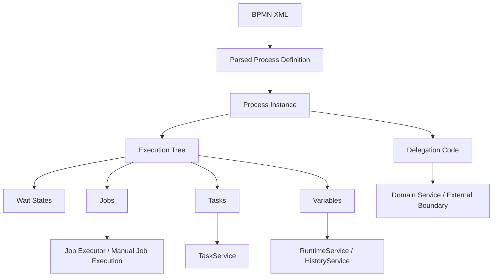
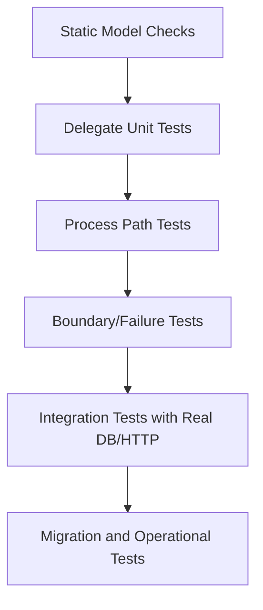
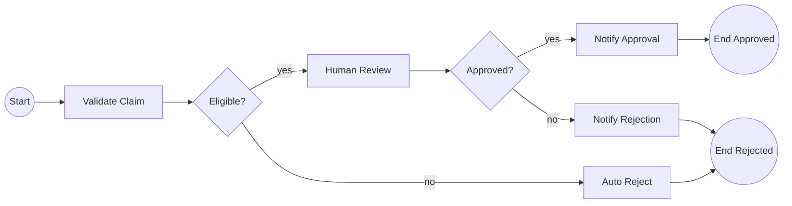
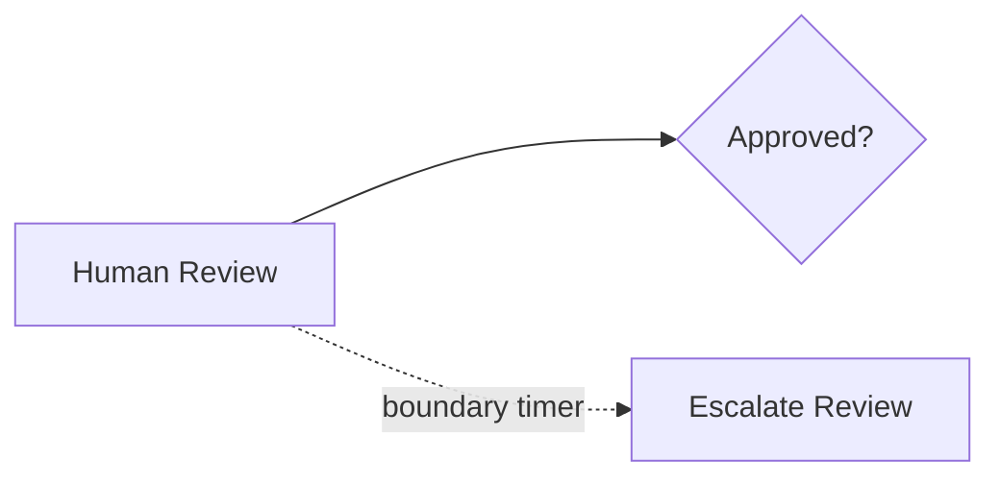
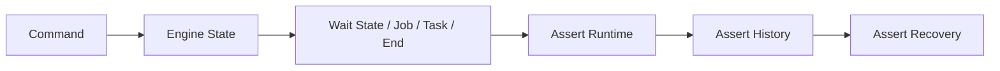

# Part 021 — Testing Camunda Processes: Unit, Integration, Scenario, Regression

> Target skill: mampu menguji proses Camunda 7 sebagai executable state machine, bukan hanya menguji Java delegate. Setelah part ini, Anda harus bisa membuat test suite yang menangkap bug model BPMN, bug transaction boundary, bug message correlation, bug timer, bug incident recovery, dan bug kontrak variable sebelum masuk production.

Camunda process testing sering gagal bukan karena engineer tidak tahu JUnit, tetapi karena salah menentukan **apa yang harus diuji**. Banyak tim hanya menguji delegate class sebagai unit test biasa. Itu berguna, tetapi tidak cukup. Delegate yang benar tetap bisa menghasilkan proses yang salah jika gateway condition salah, message event tidak terkorelasi, timer tidak aktif, variable scope salah, async boundary hilang, atau BPMN error tidak ditangkap.

Part ini membangun pendekatan testing yang lebih dekat ke internal engineering handbook: proses diuji sebagai kombinasi **model**, **engine semantics**, **delegation code**, **integration boundary**, dan **operational recovery**.

Referensi resmi dan pendukung:

- Testing process definitions in Camunda 7: https://docs.camunda.io/docs/8.7/components/best-practices/development/testing-process-definitions-c7/
- Camunda 7.24 Process Engine API: https://docs.camunda.org/manual/7.24/user-guide/process-engine/process-engine-api/
- Camunda 7.24 Transactions in Processes: https://docs.camunda.org/manual/7.24/user-guide/process-engine/transactions-in-processes/
- Camunda 7.24 Job Executor: https://docs.camunda.org/manual/7.24/user-guide/process-engine/the-job-executor/
- Camunda 7.24 External Tasks: https://docs.camunda.org/manual/7.24/user-guide/process-engine/external-tasks/
- Camunda 7.24 Incidents: https://docs.camunda.org/manual/7.24/user-guide/process-engine/incidents/
- Camunda 7.24 Javadocs: https://docs.camunda.org/manual/7.24/reference/javadoc/

---

## 1. Kaufman Deconstruction

Skill testing Camunda perlu dipecah menjadi sub-skill kecil:

| Sub-skill | Pertanyaan utama | Output praktis |
|---|---|---|
| Model validation | Apakah BPMN valid dan executable? | Test deploy/parse BPMN |
| Path testing | Apakah token melewati path yang benar? | Scenario test per route |
| Delegate testing | Apakah adapter Java benar? | Unit test delegate/domain service |
| Variable contract | Apakah variable ada, typed, dan scoped benar? | Assertion variable contract |
| Gateway condition | Apakah kondisi routing total dan eksklusif? | Decision matrix test |
| Timer testing | Apakah timeout/SLA aktif dan recoverable? | Controlled clock/job test |
| Message correlation | Apakah event masuk ke instance yang benar? | Correlation test |
| User task behavior | Apakah assignment, claim, complete benar? | TaskService test |
| Async/job behavior | Apakah job, retry, incident sesuai desain? | ManagementService test |
| External task behavior | Apakah worker contract benar? | Fetch-lock-complete/failure test |
| History/audit | Apakah bukti audit cukup? | HistoryService assertion |
| Regression safety | Apakah perubahan BPMN tidak merusak instance lama? | Version/migration-aware suite |

Prinsip Kaufman: jangan mulai dengan testing framework. Mulai dari **skill yang ingin diamankan**. Framework hanya alat.

---

## 2. Mental Model: Process Test Bukan Delegate Test

Sebuah proses Camunda terdiri dari beberapa lapisan runtime:



Testing hanya delegate berarti Anda menguji node `L`. Tetapi bug workflow sering muncul di node `A` sampai `K`:

- BPMN dapat dideploy, tetapi gateway condition salah.
- Java delegate benar, tetapi variable scope tidak terlihat di subprocess.
- Timer ada di diagram, tetapi tidak pernah dibuat karena boundary event ditempel di activity yang salah.
- Message correlation benar di unit test, tetapi business key tidak unique di production.
- Async boundary tidak ada, sehingga remote side effect terjadi dalam transaction yang rollback.
- Failed job menghasilkan incident, tetapi tidak ada runbook atau retry-safe behavior.

Maka definisi test yang benar:

> Camunda process test adalah executable test terhadap perubahan state engine sebagai respons terhadap command, time, message, task completion, job execution, dan failure.

---

## 3. Testing Pyramid untuk Camunda 7

Gunakan pyramid khusus workflow, bukan generic testing pyramid.



| Layer | Kecepatan | Yang diuji | Tool umum |
|---|---:|---|---|
| Static model checks | sangat cepat | BPMN parse, lint rule, naming convention | model API, parser, review rule |
| Delegate unit test | cepat | mapping input/output, exception, idempotency | JUnit, Mockito |
| Process path test | cepat-sedang | token route, wait state, user task, gateway | ProcessEngineExtension, camunda-bpm-assert |
| Boundary/failure test | sedang | async job, retry, incident, timer, message | ManagementService, controlled clock |
| Integration test | sedang-lambat | DB, REST facade, external task worker, Spring wiring | Spring Boot test, Testcontainers |
| Migration/ops test | lambat | process versioning, instance modification, runbook | real DB clone, migration plan |

Jangan membalik pyramid. Jika semua hal hanya diuji lewat end-to-end UI test, feedback terlalu lambat dan failure terlalu sulit didiagnosis.

---

## 4. Minimum Test Setup

Camunda best-practice testing setup umumnya:

1. JUnit sebagai unit test framework.
2. Camunda JUnit extension untuk menjalankan in-memory process engine.
3. `@Deployment` untuk deploy BPMN/DMN test resource per test.
4. `camunda-bpm-assert` untuk assertion process state.
5. Mocking framework seperti Mockito untuk service/delegate.
6. `Mocks.register(...)` atau expression manager untuk resolve delegate expression dalam process definition.
7. H2 in-memory untuk fast local test; jalankan sebagian suite di DB yang sama dengan production ketika behavior DB relevan.

Contoh dependency Maven konseptual:

```xml
<dependencies>
  <dependency>
    <groupId>org.camunda.bpm</groupId>
    <artifactId>camunda-engine</artifactId>
    <version>${camunda.version}</version>
    <scope>test</scope>
  </dependency>

  <dependency>
    <groupId>org.camunda.bpm</groupId>
    <artifactId>camunda-bpm-junit5</artifactId>
    <version>${camunda.version}</version>
    <scope>test</scope>
  </dependency>

  <dependency>
    <groupId>org.camunda.bpm.assert</groupId>
    <artifactId>camunda-bpm-assert</artifactId>
    <version>${camunda.assert.version}</version>
    <scope>test</scope>
  </dependency>

  <dependency>
    <groupId>org.mockito</groupId>
    <artifactId>mockito-junit-jupiter</artifactId>
    <version>${mockito.version}</version>
    <scope>test</scope>
  </dependency>

  <dependency>
    <groupId>com.h2database</groupId>
    <artifactId>h2</artifactId>
    <scope>test</scope>
  </dependency>
</dependencies>
```

Catatan penting:

- Sesuaikan versi dependency dengan versi engine yang dipakai.
- Untuk Camunda 7.24, pahami juga status lifecycle platform: 7.24 adalah LTS dan minor terakhir.
- Jangan menggunakan library test community tanpa melihat maintenance status.
- Untuk organisasi regulated, pin semua versi dependency dan dokumentasikan alasan upgrade.

---

## 5. Struktur Folder Test yang Disarankan

Contoh struktur:

```text
src/test/java/
  com/acme/workflow/
    claim/ClaimProcessPathTest.java
    claim/ClaimProcessFailureTest.java
    claim/ClaimDelegatesTest.java
    claim/ClaimMessageCorrelationTest.java
    claim/ClaimExternalTaskTest.java
    claim/ClaimAuditTest.java

src/test/resources/
  bpmn/claim-process.bpmn
  dmn/claim-eligibility.dmn
  camunda.cfg.xml
  logback-test.xml
```

Untuk project besar, pisahkan test berdasarkan **process capability**, bukan berdasarkan tipe class Java saja.

Lebih baik:

```text
claim/
  ClaimHappyPathTest
  ClaimRejectionPathTest
  ClaimEscalationTest
  ClaimRecoveryTest
```

Kurang baik:

```text
workflow/
  RuntimeServiceTest
  TaskServiceTest
  DelegateTest
```

Karena bug workflow biasanya muncul sebagai failure behavior, bukan failure service API.

---

## 6. Contoh Process Under Test

Misalkan proses klaim regulatory sederhana:



BPMN semantics yang harus diuji:

- Jika claim eligible, token berhenti di `Human Review`.
- Jika tidak eligible, token tidak membuat user task review.
- Jika approved, proses menjalankan notify approval.
- Jika rejected, proses menjalankan notify rejection.
- Jika validate gagal teknis, job retry/incident sesuai desain.
- Jika review tidak diselesaikan dalam SLA, timer escalation aktif.

---

## 7. Basic Process Path Test

Contoh JUnit 5 konseptual:

```java
@ExtendWith(ProcessEngineExtension.class)
class ClaimProcessPathTest {

  ProcessEngine processEngine;
  RuntimeService runtimeService;
  TaskService taskService;

  @BeforeEach
  void setUp() {
    Mocks.register("validateClaimDelegate", new ValidateClaimDelegate(/* fake service */));
    Mocks.register("notifyApprovalDelegate", new NoopDelegate());
    Mocks.register("notifyRejectionDelegate", new NoopDelegate());
  }

  @Test
  @Deployment(resources = "bpmn/claim-process.bpmn")
  void eligibleClaimShouldWaitAtHumanReview() {
    ProcessInstance pi = runtimeService.startProcessInstanceByKey(
        "claimProcess",
        "CLAIM-001",
        Variables.createVariables()
            .putValue("claimAmount", 10_000)
            .putValue("customerRisk", "LOW")
    );

    assertThat(pi).isWaitingAt("HumanReviewTask");

    Task task = taskService.createTaskQuery()
        .processInstanceId(pi.getId())
        .singleResult();

    assertThat(task).isNotNull();
    assertThat(task.getTaskDefinitionKey()).isEqualTo("HumanReviewTask");
  }
}
```

Test ini tidak hanya memastikan delegate dipanggil. Test ini memastikan **process state** benar setelah command `startProcessInstanceByKey`.

---

## 8. Test dengan Mock Delegate Expression

Dalam model BPMN production, service task sering memakai:

```xml
<camunda:delegateExpression>${validateClaimDelegate}</camunda:delegateExpression>
```

Dalam test, Anda dapat register delegate palsu:

```java
@BeforeEach
void registerDelegates() {
  Mocks.register("validateClaimDelegate", (JavaDelegate) execution -> {
    execution.setVariable("eligible", true);
  });
}
```

Keuntungan:

- Test BPMN path tidak perlu Spring container.
- Fokus test adalah process behavior.
- Delegate bisa dibuat deterministic.
- Failure path bisa disimulasikan dengan mudah.

Contoh failure:

```java
Mocks.register("validateClaimDelegate", (JavaDelegate) execution -> {
  throw new RuntimeException("risk engine unavailable");
});
```

Jika service task async, failure seharusnya menjadi failed job/incident, bukan langsung exception ke caller.

---

## 9. Testing Gateway Decision Matrix

Gateway bug sering terjadi karena engineer hanya test happy path. Untuk XOR gateway, buat matrix eksplisit.

| eligible | risk | expected activity | Catatan |
|---:|---|---|---|
| true | LOW | HumanReviewTask | normal review |
| true | HIGH | SeniorReviewTask | escalated review |
| false | LOW | AutoRejectTask | not eligible |
| false | HIGH | AutoRejectTask | eligibility wins |
| null | LOW | Incident or validation error | invalid input |

Contoh parameterized test:

```java
@ParameterizedTest
@MethodSource("routingCases")
@Deployment(resources = "bpmn/claim-process.bpmn")
void shouldRouteClaim(Boolean eligible, String risk, String expectedActivity) {
  Mocks.register("validateClaimDelegate", (JavaDelegate) execution -> {
    execution.setVariable("eligible", eligible);
    execution.setVariable("risk", risk);
  });

  ProcessInstance pi = runtimeService.startProcessInstanceByKey("claimProcess");

  assertThat(pi).isWaitingAt(expectedActivity);
}
```

Rule penting:

> Setiap gateway yang mengandung business rule harus punya test matrix. Jika matrix terlalu besar, rule mungkin harus dipindah ke DMN.

---

## 10. Testing User Task Lifecycle

User task bukan hanya wait state. User task punya assignment, candidate group, claim, complete, variable mapping, dan authorization implication.

Test yang wajib:

1. Task dibuat pada path yang benar.
2. Task punya `taskDefinitionKey` yang benar.
3. Candidate group/user sesuai policy.
4. Due date/follow-up date sesuai SLA jika digunakan.
5. Completion variable tervalidasi.
6. Completion memindahkan token ke activity berikutnya.

Contoh:

```java
@Test
@Deployment(resources = "bpmn/claim-process.bpmn")
void reviewerShouldCompleteHumanReview() {
  ProcessInstance pi = startEligibleClaim();

  Task task = taskService.createTaskQuery()
      .processInstanceId(pi.getId())
      .taskDefinitionKey("HumanReviewTask")
      .singleResult();

  assertThat(task).isNotNull();

  taskService.claim(task.getId(), "reviewer-001");

  taskService.complete(task.getId(), Variables.createVariables()
      .putValue("approved", true)
      .putValue("reviewComment", "Evidence sufficient"));

  assertThat(pi).hasPassed("HumanReviewTask", "NotifyApprovalTask")
      .isEnded();
}
```

Test negatif:

- Complete tanpa `approved` harus gagal atau route ke validation handling.
- Complete dengan actor salah harus ditolak di application boundary.
- Claim dua kali harus menghasilkan behavior yang dipahami.
- Task local variable tidak boleh hilang jika diperlukan untuk audit.

---

## 11. Testing Timer dan SLA

Timer test harus menjawab dua hal:

1. Apakah timer job dibuat?
2. Apakah saat timer dieksekusi, proses bergerak sesuai desain?

Contoh model:



Test konsep:

```java
@Test
@Deployment(resources = "bpmn/claim-process.bpmn")
void shouldEscalateWhenReviewSlaExpires() {
  ProcessInstance pi = startEligibleClaim();

  Job timerJob = managementService.createJobQuery()
      .processInstanceId(pi.getId())
      .timers()
      .singleResult();

  assertThat(timerJob).isNotNull();

  // Dalam test, gunakan utilitas clock/time control sesuai setup engine test Anda.
  // Setelah waktu melewati due date, jalankan job secara manual.
  managementService.executeJob(timerJob.getId());

  assertThat(pi).hasPassed("ReviewSlaTimer")
      .isWaitingAt("EscalatedReviewTask");
}
```

Kewaspadaan:

- Jangan mengandalkan `Thread.sleep` untuk timer test.
- Job executor biasanya dimatikan dalam unit process test agar deterministic.
- Timer expression harus diuji dengan variasi timezone dan boundary date jika SLA legal/regulatory.
- Timer boundary interrupting dan non-interrupting harus diuji berbeda.

Timer checklist:

| Pertanyaan | Failure yang dicari |
|---|---|
| Timer job dibuat? | boundary event tidak attached/condition salah |
| Due date benar? | ISO duration/date salah |
| Interrupting behavior benar? | human task masih aktif padahal harus batal |
| Non-interrupting behavior benar? | escalation membuat task tambahan tanpa membatalkan task utama |
| Timer repeat aman? | timer storm / duplicate escalation |

---

## 12. Testing Async Boundary dan Failed Job

Untuk service task dengan `asyncBefore="true"`, start process biasanya berhenti sebelum delegate dieksekusi dan menciptakan job.

Contoh:

```java
@Test
@Deployment(resources = "bpmn/claim-process.bpmn")
void asyncValidationShouldCreateJobBeforeDelegateExecution() {
  ProcessInstance pi = runtimeService.startProcessInstanceByKey("claimProcess");

  Job job = managementService.createJobQuery()
      .processInstanceId(pi.getId())
      .activityId("ValidateClaimTask")
      .singleResult();

  assertThat(job).isNotNull();

  managementService.executeJob(job.getId());

  assertThat(pi).isWaitingAt("HumanReviewTask");
}
```

Failure test:

```java
@Test
@Deployment(resources = "bpmn/claim-process.bpmn")
void asyncValidationFailureShouldCreateFailedJob() {
  Mocks.register("validateClaimDelegate", (JavaDelegate) execution -> {
    throw new RuntimeException("risk service down");
  });

  ProcessInstance pi = runtimeService.startProcessInstanceByKey("claimProcess");

  Job job = managementService.createJobQuery()
      .processInstanceId(pi.getId())
      .singleResult();

  assertThrows(Exception.class, () -> managementService.executeJob(job.getId()));

  Job failedJob = managementService.createJobQuery()
      .processInstanceId(pi.getId())
      .withException()
      .singleResult();

  assertThat(failedJob).isNotNull();
  assertThat(failedJob.getRetries()).isLessThan(3);
}
```

Jika test menjalankan job sampai retry habis, assert incident:

```java
Incident incident = runtimeService.createIncidentQuery()
    .processInstanceId(pi.getId())
    .singleResult();

assertThat(incident).isNotNull();
assertThat(incident.getIncidentType()).isEqualTo("failedJob");
```

Catatan: exact retry count bergantung konfigurasi retry cycle. Jangan hardcode angka default tanpa alasan.

---

## 13. Testing BPMN Error vs Technical Exception

BPMN error adalah business-modeled exception. Java exception adalah technical failure. Test harus membedakan keduanya.

Contoh service task yang melempar BPMN error:

```java
Mocks.register("validateClaimDelegate", (JavaDelegate) execution -> {
  throw new BpmnError("CLAIM_NOT_ELIGIBLE", "Claim violates eligibility policy");
});
```

Expected behavior:

```java
@Test
@Deployment(resources = "bpmn/claim-process.bpmn")
void bpmnErrorShouldBeCaughtByBoundaryErrorEvent() {
  ProcessInstance pi = runtimeService.startProcessInstanceByKey("claimProcess");

  assertThat(pi).hasPassed("EligibilityErrorBoundary", "AutoRejectTask")
      .isEnded();
}
```

Technical exception expected behavior:

```java
Mocks.register("validateClaimDelegate", (JavaDelegate) execution -> {
  throw new RuntimeException("database unavailable");
});
```

Expected:

- Jika task synchronous, start command throws dan transaction rollback.
- Jika async, job fails dan retry/incident path berlaku.
- Tidak boleh diam-diam route ke business rejection.

Anti-pattern test:

```java
catch (Exception e) {
  execution.setVariable("approved", false);
}
```

Test semacam ini harus gagal secara review, karena technical outage tidak sama dengan business rejection.

---

## 14. Testing Message Correlation

Message event test harus memastikan korelasi tepat. Yang perlu diuji:

- message name benar;
- business key/correlation variable benar;
- duplicate message behavior jelas;
- late message behavior jelas;
- missing subscription menghasilkan error yang dipahami;
- multi-instance/multiple execution ambiguity ditangani.

Contoh:

```java
@Test
@Deployment(resources = "bpmn/payment-process.bpmn")
void paymentReceivedMessageShouldContinueMatchingInstance() {
  ProcessInstance pi = runtimeService.startProcessInstanceByKey(
      "paymentProcess",
      "PAY-001"
  );

  assertThat(pi).isWaitingAt("WaitForPaymentMessage");

  runtimeService.createMessageCorrelation("PaymentReceived")
      .processInstanceBusinessKey("PAY-001")
      .setVariable("paymentReference", "BANK-123")
      .correlate();

  assertThat(pi).hasPassed("WaitForPaymentMessage")
      .isEnded();
}
```

Duplicate test:

```java
@Test
@Deployment(resources = "bpmn/payment-process.bpmn")
void duplicatePaymentMessageShouldNotCreateSecondCompletion() {
  ProcessInstance pi = startPaymentProcess("PAY-001");

  correlatePayment("PAY-001", "BANK-123");

  assertThrows(MismatchingMessageCorrelationException.class,
      () -> correlatePayment("PAY-001", "BANK-123"));
}
```

Pada production, duplicate event biasanya lebih baik ditahan di inbox/idempotency layer sebelum masuk engine. Namun process-level test tetap perlu membuktikan engine behavior tidak mengejutkan.

---

## 15. Testing External Task Worker Contract

External task test dapat dibuat dari perspektif engine:

```java
@Test
@Deployment(resources = "bpmn/document-process.bpmn")
void shouldCreateExternalTaskForDocumentGeneration() {
  ProcessInstance pi = runtimeService.startProcessInstanceByKey("documentProcess");

  List<LockedExternalTask> tasks = externalTaskService.fetchAndLock(1, "worker-1")
      .topic("generate-document", 30_000)
      .execute();

  assertThat(tasks).hasSize(1);
  assertThat(tasks.get(0).getTopicName()).isEqualTo("generate-document");

  externalTaskService.complete(
      tasks.get(0).getId(),
      "worker-1",
      Variables.createVariables().putValue("documentId", "DOC-001")
  );

  assertThat(pi).hasPassed("GenerateDocumentTask")
      .isEnded();
}
```

Failure path:

```java
externalTaskService.handleFailure(
    externalTask.getId(),
    "worker-1",
    "Document service unavailable",
    "HTTP 503 from document-service",
    0,
    0L
);

Incident incident = runtimeService.createIncidentQuery()
    .processInstanceId(pi.getId())
    .singleResult();

assertThat(incident).isNotNull();
```

Business error path:

```java
externalTaskService.handleBpmnError(
    externalTask.getId(),
    "worker-1",
    "DOCUMENT_POLICY_REJECTED",
    "Document cannot be generated due to policy",
    Variables.createVariables().putValue("policyCode", "DOC-99")
);
```

External task contract checklist:

| Contract | Test |
|---|---|
| Topic name | worker can fetch expected topic |
| Lock duration | lock prevents another worker before expiry |
| Complete variables | required variables visible after completion |
| Failure retries | retries decrease and incident appears at zero |
| BPMN error | modeled boundary error catches business failure |
| Worker id | wrong worker cannot complete locked task |

---

## 16. Testing Variable Serialization and Scope

Variable bugs are expensive because they may only appear after deployment, restart, version upgrade, or class evolution.

Test variables explicitly:

```java
@Test
@Deployment(resources = "bpmn/claim-process.bpmn")
void shouldUseJsonContractNotJavaSerializedObject() {
  ProcessInstance pi = runtimeService.startProcessInstanceByKey(
      "claimProcess",
      Variables.createVariables()
          .putValueTyped("claimPayload",
              Variables.objectValue(new ClaimPayload("CLAIM-001"))
                  .serializationDataFormat(Variables.SerializationDataFormats.JSON)
                  .create())
  );

  ObjectValue value = runtimeService.getVariableTyped(
      pi.getId(),
      "claimPayload",
      false
  );

  assertThat(value.getSerializationDataFormat()).isEqualTo("application/json");
}
```

Scope test:

- variable set in subprocess local scope should not leak unless mapped;
- task local variable should not be assumed visible globally;
- call activity input/output mapping should be tested as contract;
- parallel branch writes should not override each other unexpectedly.

Checklist variable testing:

| Variable issue | Test pattern |
|---|---|
| Missing required variable | start/complete should fail or route to validation error |
| Wrong type | typed value assertion |
| Java serialization | assert serialization format |
| Scope shadowing | local/global variable visibility test |
| Sensitive data | assert not stored in process variable/history where prohibited |
| Large payload | avoid storing full document/blob |

---

## 17. Testing DMN Integration

Jika BPMN memakai Business Rule Task, test dua level:

1. DMN table unit test.
2. BPMN + DMN integration test.

DMN unit test menjawab:

- input combination menghasilkan decision output yang benar;
- hit policy sesuai;
- no match/default match jelas;
- output schema stabil.

BPMN integration test menjawab:

- Business Rule Task memanggil decision yang benar;
- result variable benar;
- gateway setelah DMN membaca result dengan benar;
- version binding sesuai strategi.

Anti-pattern:

> Hanya test DMN dan menganggap BPMN routing pasti benar.

Tetap test bahwa output DMN benar-benar dikonsumsi oleh gateway/action berikutnya.

---

## 18. Testing History and Audit

Untuk workflow regulated, test tidak berhenti saat process ended. Anda perlu memastikan jejak audit cukup.

Contoh:

```java
@Test
@Deployment(resources = "bpmn/claim-process.bpmn")
void shouldRecordReviewerDecisionInHistory() {
  ProcessInstance pi = startEligibleClaim();
  completeReview(pi, true, "Evidence sufficient");

  HistoricProcessInstance historic = historyService.createHistoricProcessInstanceQuery()
      .processInstanceId(pi.getId())
      .singleResult();

  assertThat(historic.getEndTime()).isNotNull();

  HistoricVariableInstance decision = historyService.createHistoricVariableInstanceQuery()
      .processInstanceId(pi.getId())
      .variableName("approved")
      .singleResult();

  assertThat(decision.getValue()).isEqualTo(true);
}
```

Audit testing questions:

- Siapa melakukan task?
- Kapan task dibuat, diklaim, diselesaikan?
- Apa decision input/output yang disimpan?
- Apakah variable sensitif masuk history?
- Apakah user operation log cukup untuk tindakan admin?
- Apakah TTL cleanup tidak menghapus data sebelum retention legal?

---

## 19. Testing Incident Recovery

Incident recovery test bukan berarti harus menguji UI Cockpit. Yang perlu diuji:

- failure menyebabkan state yang recoverable;
- variable correction bisa dilakukan bila memang runbook mengizinkan;
- retry job setelah dependency pulih melanjutkan proses;
- retry tidak menggandakan side effect;
- incident resolved setelah root cause diperbaiki.

Contoh:

```java
@Test
@Deployment(resources = "bpmn/claim-process.bpmn")
void failedAsyncTaskShouldRecoverAfterRetry() {
  AtomicBoolean serviceAvailable = new AtomicBoolean(false);

  Mocks.register("validateClaimDelegate", (JavaDelegate) execution -> {
    if (!serviceAvailable.get()) {
      throw new RuntimeException("risk service down");
    }
    execution.setVariable("eligible", true);
  });

  ProcessInstance pi = runtimeService.startProcessInstanceByKey("claimProcess");
  Job job = singleJob(pi);

  assertThrows(Exception.class, () -> managementService.executeJob(job.getId()));

  serviceAvailable.set(true);

  Job failedJob = singleJob(pi);
  managementService.setJobRetries(failedJob.getId(), 1);
  managementService.executeJob(failedJob.getId());

  assertThat(pi).isWaitingAt("HumanReviewTask");
}
```

Tambahkan assertion idempotency jika delegate memanggil external command.

---

## 20. Testing Process Versioning and Migration Awareness

Walaupun process instance migration akan dibahas detail di part 030, test strategy harus disiapkan sejak awal.

Minimal regression suite:

1. Process v1 happy path tetap valid.
2. Process v2 happy path valid.
3. Existing v1 instance di wait state utama dapat diselesaikan setelah deploy v2.
4. Jika migration diperlukan, mapping activity v1 ke v2 punya test.
5. Variable contract backward-compatible.
6. Message correlation key tidak berubah tanpa adapter.

Versioning test idea:

```java
@Test
void v1InstanceShouldStillCompleteAfterV2Deployment() {
  repositoryService.createDeployment()
      .addClasspathResource("bpmn/claim-process-v1.bpmn")
      .deploy();

  ProcessInstance oldPi = runtimeService.startProcessInstanceByKey("claimProcess");

  repositoryService.createDeployment()
      .addClasspathResource("bpmn/claim-process-v2.bpmn")
      .deploy();

  Task oldTask = taskService.createTaskQuery()
      .processInstanceId(oldPi.getId())
      .singleResult();

  taskService.complete(oldTask.getId(), Map.of("approved", true));

  assertThat(oldPi).isEnded();
}
```

Anti-pattern:

> Deploy BPMN baru dan hanya test instance baru.

Long-running process berarti instance lama bisa hidup selama hari, bulan, bahkan tahun.

---

## 21. H2 vs Production Database

H2 berguna untuk feedback cepat, tetapi tidak boleh menjadi satu-satunya bukti production readiness.

| Area | H2 cukup? | Perlu production-like DB? |
|---|---:|---:|
| Basic BPMN path | ya | tidak wajib |
| Delegate mapping | ya | tidak wajib |
| Query behavior kompleks | sebagian | ya |
| Optimistic locking | sebagian | ya |
| Large history cleanup | tidak | ya |
| DB isolation/deadlock | tidak | ya |
| Index performance | tidak | ya |
| Migration scripts | tidak | ya |

Untuk PostgreSQL/Oracle/SQL Server production, jalankan minimal smoke suite di database yang sama melalui CI profile atau Testcontainers.

---

## 22. Process Test Naming Standard

Nama test harus menjelaskan behavior, bukan method internal.

Baik:

```java
eligibleLowRiskClaimShouldWaitAtHumanReview()
highRiskClaimShouldRequireSeniorReview()
paymentReceivedMessageShouldContinueOnlyMatchingBusinessKey()
asyncValidationFailureShouldCreateRecoverableIncident()
reviewSlaTimerShouldEscalateWithoutCancellingOriginalTask()
```

Buruk:

```java
testStartProcess()
testGateway()
testDelegate()
testTimer()
```

Dalam workflow, nama test adalah dokumentasi behavior.

---

## 23. Scenario Test Matrix per Process

Untuk setiap BPMN production, buat matrix minimal:

| Scenario | Input | Expected wait/end | Failure asserted? | Audit asserted? |
|---|---|---|---|---|
| Happy path | valid low risk | end approved | no | yes |
| Business reject | invalid eligibility | end rejected | no | yes |
| Human reject | eligible + reviewer rejects | end rejected | no | yes |
| SLA escalation | task not completed | escalated review | no | yes |
| Technical failure | dependency down | incident/failed job | yes | yes |
| Duplicate event | same message twice | no duplicate completion | yes | optional |
| Late event | message after end | rejected by adapter/engine | yes | optional |
| Version compatibility | v1 instance after v2 deploy | completes | no | yes |

Jika proses tidak punya matrix seperti ini, Anda belum benar-benar punya executable specification.

---

## 24. Testing Anti-Patterns

### 24.1 Only Delegate Unit Tests

Gejala:

- coverage tinggi;
- production incident tetap sering terjadi;
- bug gateway/timer/message tidak tertangkap.

Solusi:

- tambahkan process path test dan failure path test.

### 24.2 Testing Through UI Only

Gejala:

- test lambat;
- flaky;
- sulit debug;
- hanya happy path.

Solusi:

- UI test hanya untuk critical smoke;
- process behavior test langsung ke engine API.

### 24.3 No Failure Path Test

Gejala:

- incident pertama terjadi di production;
- retry menggandakan side effect;
- operator tidak tahu recovery.

Solusi:

- test BPMN error, Java exception, failed job, incident, retry.

### 24.4 `Thread.sleep` for Timer Test

Gejala:

- flaky;
- lambat;
- gagal random di CI.

Solusi:

- control clock/time atau execute timer job deterministic.

### 24.5 In-Memory Only Forever

Gejala:

- semua test green di H2;
- production DB mengalami lock/performance issue.

Solusi:

- jalankan subset critical di DB production-like.

### 24.6 Snapshot Assertion Terlalu Detail

Gejala:

- test brittle saat minor refactor BPMN;
- tim takut memperbaiki model.

Solusi:

- assert business-relevant state, bukan seluruh XML layout.

---

## 25. Code Review Checklist untuk Process Tests

Gunakan checklist ini saat review PR BPMN:

- [ ] BPMN baru/berubah punya test deployment/parse.
- [ ] Setiap gateway business punya test matrix.
- [ ] Setiap user task punya test creation dan completion.
- [ ] Setiap message catch punya test correlation success/failure.
- [ ] Setiap timer punya test job creation dan firing behavior.
- [ ] Setiap async service task punya test job dan failure behavior.
- [ ] Setiap external task punya test fetch/complete/failure/BPMN error.
- [ ] Setiap BPMN error boundary punya test thrown/caught behavior.
- [ ] Variable contract diuji: required, type, scope, serialization.
- [ ] History/audit minimal diuji untuk regulated decisions.
- [ ] Duplicate/late event behavior jelas.
- [ ] Tests tidak bergantung pada `Thread.sleep`.
- [ ] Test names mendokumentasikan business scenario.
- [ ] Regression suite mempertimbangkan long-running instance versi lama.

---

## 26. Practice Plan 2 Jam

### Latihan 1 — Deploy and Happy Path

Buat test yang deploy BPMN sederhana dan assert proses berhenti di user task.

Goal:

- memahami `@Deployment`;
- memahami process instance state;
- memahami task query.

### Latihan 2 — Gateway Matrix

Tambahkan XOR gateway dengan 4 kombinasi input.

Goal:

- tidak mengandalkan satu happy path;
- membuat decision matrix.

### Latihan 3 — Async Failure

Ubah service task menjadi async dan buat delegate melempar exception.

Goal:

- melihat failed job;
- melihat retry decrement;
- memahami incident trigger.

### Latihan 4 — Timer Escalation

Tambahkan timer boundary di user task.

Goal:

- query timer job;
- execute job deterministic;
- assert task escalation.

### Latihan 5 — Message Correlation

Tambahkan intermediate message catch.

Goal:

- correlate by business key;
- test duplicate message.

---

## 27. Mental Compression

Simpan model ini:



Process test yang baik selalu punya pola:

1. Beri command/event/time/failure.
2. Jalankan engine secara deterministic.
3. Assert state yang terlihat dari engine API.
4. Assert audit bila relevan.
5. Assert recovery bila ada failure.

---

## 28. Ringkasan

Testing Camunda 7 bukan hanya testing Java class. Process model adalah executable artifact yang mengandung routing, state, concurrency, event subscription, job, timer, variable scope, dan recovery semantics. Karena itu, test suite harus menangkap behavior process secara langsung.

Aturan praktis:

- Unit test domain logic dan delegate adapter.
- Process path test untuk setiap business route.
- Failure test untuk BPMN error, Java exception, failed job, incident.
- Timer/message/external task test secara explicit.
- Audit test untuk workflow regulated.
- Production-like DB test untuk locking, history, performance, dan migration-sensitive behavior.

Jika proses tidak bisa diuji secara deterministic, proses itu belum siap production.

---

## 29. Self-Assessment

Anda siap lanjut jika bisa menjawab:

1. Apa perbedaan delegate unit test dan process path test?
2. Mengapa job executor biasanya dimatikan dalam unit process test?
3. Bagaimana menguji async service task failure?
4. Bagaimana membedakan test BPMN error dan Java exception?
5. Bagaimana menguji message correlation by business key?
6. Mengapa H2 tidak cukup untuk semua production-risk test?
7. Apa minimal test matrix untuk gateway business?
8. Bagaimana memastikan workflow regulated punya audit trail yang cukup?
9. Bagaimana test memastikan retry tidak menggandakan side effect?
10. Apa risiko deploy BPMN v2 tanpa test instance v1?

Jika jawaban masih kabur, ulangi part 011, 012, 013, 014, dan 015 sebelum masuk architecture style.
