# Part 022 — Architecture Styles: Embedded, Shared Engine, Remote Engine, Camunda Run

> Target skill: mampu memilih dan mempertahankan arsitektur Camunda 7 yang sesuai constraint organisasi, bukan sekadar mengikuti tutorial. Setelah part ini, Anda harus bisa menjelaskan trade-off embedded engine, shared engine, remote engine, dan Camunda Run dari sisi ownership, scaling, deployment, classloading, testing, security, operations, dan migration.

Camunda 7 fleksibel: engine dapat di-embed di aplikasi Java, dijalankan sebagai shared engine di application server, diakses sebagai remote engine melalui REST, atau dikemas sebagai Camunda Run. Fleksibilitas ini kuat, tetapi juga berbahaya. Banyak incident architecture muncul karena tim memilih style berdasarkan contoh quickstart, bukan berdasarkan invariants sistem.

Part ini memberi decision framework. Fokusnya bukan “mana yang paling modern”, tetapi **mana yang paling sesuai untuk constraint dan failure mode Anda**.

Referensi resmi dan pendukung:

- Camunda 7 Get Started options: https://docs.camunda.org/get-started/
- Spring Boot Integration: https://docs.camunda.org/manual/7.24/user-guide/spring-boot-integration/
- Shared Process Engine tutorial: https://docs.camunda.org/get-started/archive/spring/shared-process-engine/
- REST API Overview: https://docs.camunda.org/manual/7.24/reference/rest/overview/
- External Tasks: https://docs.camunda.org/manual/7.24/user-guide/process-engine/external-tasks/
- Camunda Run production considerations: https://camunda.com/blog/2021/05/what-you-should-know-about-using-camunda-platform-run-in-production/
- Camunda Docker image README: https://github.com/camunda/docker-camunda-bpm-platform/blob/7.24/README.md
- Camunda Platform announcements and lifecycle: https://docs.camunda.org/enterprise/announcement/

---

## 1. Kaufman Deconstruction

Architecture skill di Camunda 7 perlu dipecah menjadi sub-skill berikut:

| Sub-skill | Pertanyaan utama | Output praktis |
|---|---|---|
| Engine placement | Engine hidup di JVM mana? | Embedded/shared/remote decision |
| Process ownership | Siapa pemilik BPMN dan runtime process? | Ownership map |
| Code coupling | Delegate code berjalan bersama engine atau worker? | Coupling model |
| Deployment unit | Apa yang dideploy bersama? | Release topology |
| Scaling model | Apa yang diskalakan: app, engine, worker, DB? | Capacity strategy |
| Failure isolation | Jika worker/app mati, apa yang ikut mati? | Blast-radius analysis |
| Classloading | Siapa menyediakan delegate classes? | Runtime dependency plan |
| Transaction boundary | Transaction app dan engine menyatu atau terpisah? | Consistency strategy |
| Security boundary | Siapa boleh memanggil engine API? | AuthN/AuthZ topology |
| Upgrade model | Bagaimana patch engine tanpa merusak app? | Upgrade playbook |
| Migration path | Apakah style memudahkan move ke remote/Camunda 8? | Migration-aware architecture |

Prinsip Kaufman: jangan langsung debate tool. Deconstruct dulu keputusan arsitektur menjadi constraints yang bisa diamati.

---

## 2. Empat Architecture Style Utama

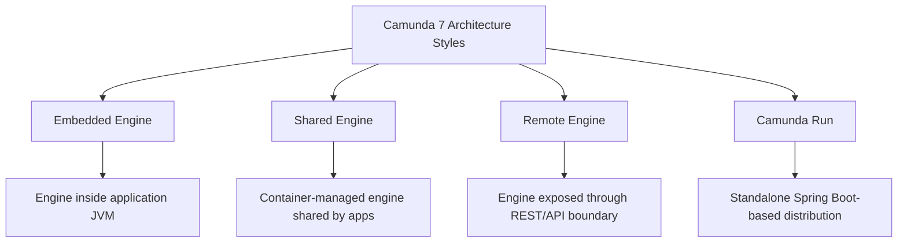

### 2.1 Embedded Engine

Process engine berjalan di JVM aplikasi. Aplikasi memanggil Java API langsung.

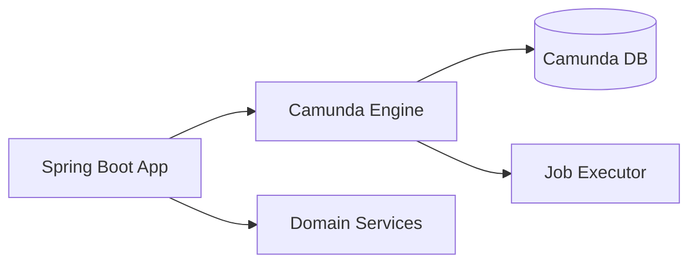

### 2.2 Shared Engine

Engine dikontrol oleh runtime container seperti Apache Tomcat. Beberapa process application dapat memakai engine yang sama.

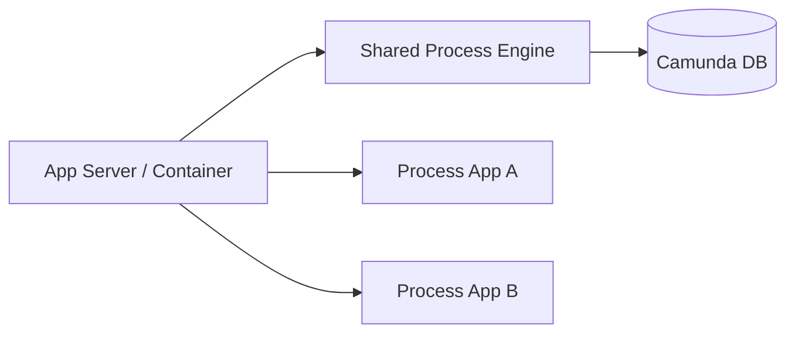

### 2.3 Remote Engine

Engine diperlakukan sebagai service terpisah. Aplikasi memanggil REST API atau memakai external task pattern.

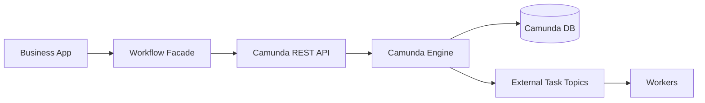

### 2.4 Camunda Run

Distribusi standalone yang menyediakan engine, REST API, dan webapps dengan konfigurasi terpusat. Cocok untuk engine yang ingin dijalankan tanpa membuat aplikasi Java custom untuk runtime engine.

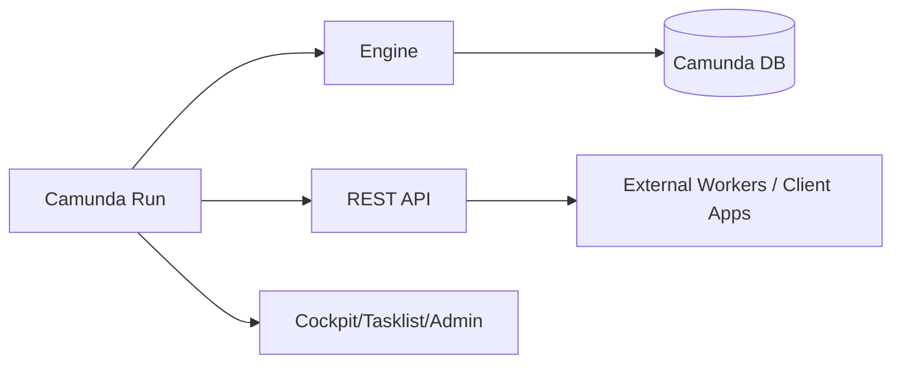

---

## 3. Embedded Engine

### 3.1 Kapan Embedded Masuk Akal

Embedded engine cocok jika:

- satu bounded context memiliki workflow-nya sendiri;
- proses sangat dekat dengan domain service aplikasi;
- tim yang sama mengelola app, BPMN, delegates, DB migration, dan operations;
- low-latency Java API penting;
- deployment process dan domain code memang harus atomic;
- organisasi punya disiplin untuk tidak membuat banyak engine liar.

Contoh:

```text
claim-service
  ├── REST domain API
  ├── Camunda embedded engine
  ├── BPMN claim lifecycle
  ├── Java delegates as adapters
  └── shared application database / Camunda schema
```

### 3.2 Kelebihan Embedded

| Area | Kelebihan |
|---|---|
| Developer experience | sederhana untuk Spring Boot team |
| Type safety | Java API langsung |
| Transaction integration | bisa ikut Spring transaction boundary |
| Deployment | BPMN dan code satu unit |
| Testing | process + delegate mudah diuji bersama |
| Latency | tidak ada HTTP hop untuk engine command |

### 3.3 Risiko Embedded

| Risiko | Dampak |
|---|---|
| Engine lifecycle ikut app | app restart memengaruhi job executor |
| Banyak service embed engine | engine sprawl, DB contention, inconsistent config |
| Upgrade engine tersebar | patch security/bug fix sulit distandardisasi |
| Coupling tinggi | BPMN, delegate, domain service sulit dipisah |
| Job executor di semua node | scaling app bisa scaling job executor tanpa sengaja |
| Operational visibility tersebar | Cockpit/admin harus tahu banyak deployment |

### 3.4 Embedded Guardrails

Jika memilih embedded, tetapkan guardrail:

- Satu engine owner per bounded context.
- Satu Camunda schema per engine ownership boundary, kecuali ada alasan kuat.
- Job executor role jelas: semua node atau dedicated worker node.
- BPMN deployment resources explicit.
- `historyLevel`, job executor config, retry policy, metrics config distandardisasi.
- Jangan expose raw engine API sebagai public API.
- Gunakan facade service untuk start/complete/correlate.
- Dokumentasikan upgrade path Camunda 7.24 LTS.

### 3.5 Embedded Anti-Pattern

```text
Every microservice embeds Camunda because workflow is useful everywhere.
```

Dampak:

- ratusan process definitions;
- ratusan job executor;
- inconsistent retry/history/security config;
- sulit audit end-to-end;
- database menjadi bottleneck;
- support team tidak tahu engine mana yang menjalankan process mana.

Rule:

> Embedded engine boleh dekat dengan domain, tetapi tidak boleh menjadi default reflex untuk semua service.

---

## 4. Shared Process Engine

Shared engine adalah model klasik Camunda 7 di application server/container. Engine dikontrol oleh container, process applications dideploy terpisah.

Camunda shared process engine tutorial menjelaskan bahwa berbeda dari embedded engine, shared process engine dikontrol independen dari aplikasi dan start/stop oleh runtime container seperti Apache Tomcat; beberapa aplikasi atau satu aplikasi modular dapat memakai engine yang sama.

### 4.1 Kapan Shared Engine Masuk Akal

Shared engine cocok jika:

- organisasi sudah punya application server operating model;
- beberapa process application perlu berbagi engine dan webapps;
- deployment process app harus independen dari engine runtime;
- team platform mengelola engine sebagai shared runtime;
- Java EE / servlet container environment masih standar organisasi.

### 4.2 Kelebihan Shared Engine

| Area | Kelebihan |
|---|---|
| Central runtime | satu engine dikontrol platform/container |
| Independent deployment | process app bisa redeploy tanpa engine restart penuh |
| Shared webapps | Cockpit/Tasklist/Admin terintegrasi |
| Library management | engine library disediakan container |
| Familiar for legacy enterprise | cocok untuk Tomcat/WildFly/WebLogic style |

### 4.3 Risiko Shared Engine

| Risiko | Dampak |
|---|---|
| Classloader complexity | delegate class/version conflict |
| Shared blast radius | process app buruk bisa memengaruhi engine bersama |
| Upgrade coordination | semua process app harus kompatibel |
| Tenant/authorization complexity | isolasi antar app/team perlu disiplin |
| Container skill required | debugging lebih sulit bagi Spring Boot-only team |

### 4.4 Classloader Concern

Dalam shared engine, pertanyaan utamanya:

> Saat engine mengeksekusi service task `camunda:class` atau delegate expression, class itu berasal dari mana?

Risiko:

- dua process app membawa versi dependency berbeda;
- delegate class tidak ditemukan setelah redeploy;
- library disediakan container berbeda dengan library app;
- serialization object variable bergantung class versi lama.

Mitigasi:

- prefer delegate expression dengan process application context yang jelas;
- hindari Java serialized object variable;
- pin dependency;
- test redeploy/undeploy;
- dokumentasikan process application boundaries;
- gunakan external task untuk mengurangi classloading coupling bila perlu.

---

## 5. Remote Engine

Remote engine berarti process engine diperlakukan sebagai runtime terpisah. Aplikasi tidak embed engine; aplikasi berinteraksi lewat REST API, external task, atau workflow facade.

### 5.1 Dua Bentuk Remote Engine

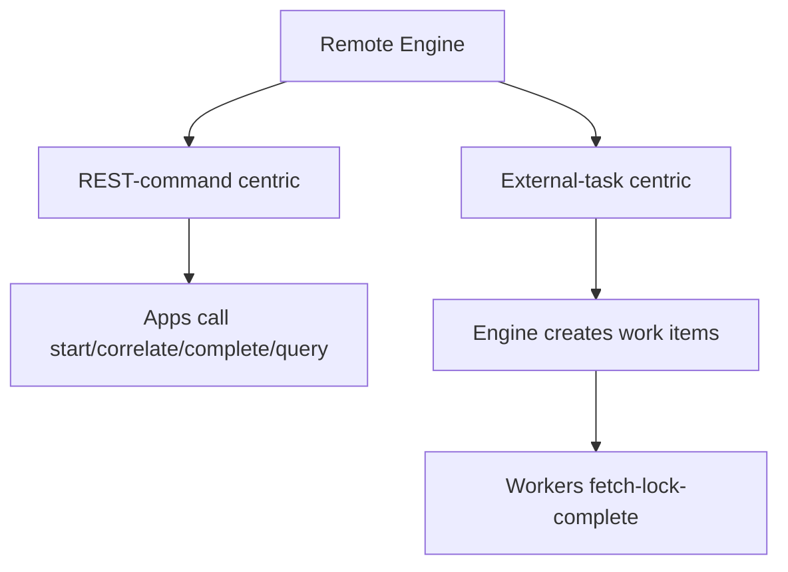

REST-command centric cocok untuk:

- start process;
- correlate business events;
- complete user task via backend;
- query process/task/history via internal API.

External-task centric cocok untuk:

- service work isolated from engine JVM;
- polyglot workers;
- horizontal worker scaling;
- service boundary clear;
- migration-aware architecture.

### 5.2 Kelebihan Remote Engine

| Area | Kelebihan |
|---|---|
| Isolation | engine tidak ikut app lifecycle |
| Polyglot | workers bisa Java/Node/Go/Python |
| Platform ownership | engine dikelola platform team |
| Upgrade control | patch engine lebih terpusat |
| Scaling separation | scale worker tanpa scale engine webapp |
| Migration path | lebih mirip Camunda 8 mental model |

### 5.3 Risiko Remote Engine

| Risiko | Dampak |
|---|---|
| HTTP boundary | latency, retry, auth, timeout |
| API misuse | raw REST API menjadi mutable process DB publik |
| Distributed consistency | app transaction dan engine transaction terpisah |
| Event duplication | message correlation harus idempotent |
| Worker drift | topic contract tidak terdokumentasi |
| Operational split | debugging butuh trace across services |

### 5.4 Workflow Facade Pattern

Jangan biarkan banyak aplikasi memanggil REST API engine langsung. Bungkus dengan workflow facade/domain API.

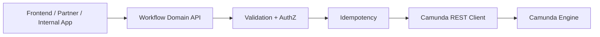

Facade bertanggung jawab untuk:

- validasi command;
- authorization domain;
- idempotency key;
- mapping variable contract;
- hiding engine endpoint details;
- consistent error handling;
- audit enrichment;
- API versioning.

Anti-pattern:

```text
Frontend -> Camunda REST /task/{id}/complete
```

Masalah:

- frontend tahu variable internal;
- authorization engine tidak sama dengan business authorization;
- audit actor/purpose lemah;
- process model refactor memecahkan UI;
- security exposure terlalu luas.

---

## 6. Camunda Run

Camunda Run adalah distribusi standalone berbasis Spring Boot yang menyediakan engine, web applications, dan REST API dengan konfigurasi yang relatif terpusat. Blog pengenalannya menjelaskan Run sebagai distribusi yang menyediakan Cockpit, Tasklist, Admin, dan REST API, serta dapat dikonfigurasi tanpa perlu mengatur application server sendiri.

### 6.1 Kapan Camunda Run Masuk Akal

Camunda Run cocok jika:

- Anda ingin remote engine cepat tanpa membuat Spring Boot app sendiri;
- workload didominasi REST API dan external task workers;
- delegation code di engine JVM minimal;
- operasi ingin artifact runtime standar;
- tim platform ingin satu cara menjalankan engine;
- process applications tidak membutuhkan classloader/container model kompleks.

### 6.2 Kapan Camunda Run Tidak Ideal

Kurang ideal jika:

- Anda butuh banyak custom Java delegation code di engine JVM;
- Anda butuh complex Spring domain service di dalam engine app;
- Anda ingin tight transaction integration dengan business application;
- Anda perlu deployment process app custom yang sangat spesifik;
- Anda belum siap mengamankan REST/webapps.

### 6.3 Production Concern

Untuk production, pikirkan:

- external database, bukan H2 demo;
- authentication/authorization aktif;
- TLS dan reverse proxy;
- admin user bootstrap aman;
- history cleanup config;
- job executor config;
- metrics/logging;
- backup/restore database;
- patch upgrade process;
- secret management;
- disable demo/example resources.

Camunda Run production style harus diperlakukan sebagai platform service, bukan demo executable.

---

## 7. Decision Matrix

| Constraint | Embedded | Shared Engine | Remote Engine | Camunda Run |
|---|---:|---:|---:|---:|
| Spring Boot domain app owns process | sangat cocok | sedang | sedang | rendah-sedang |
| Central platform team owns engine | rendah | cocok | sangat cocok | sangat cocok |
| Polyglot workers | sedang | sedang | sangat cocok | sangat cocok |
| Tight Java transaction integration | sangat cocok | sedang | rendah | rendah |
| Operational isolation | rendah-sedang | sedang | tinggi | tinggi |
| Low setup complexity | tinggi | rendah-sedang | sedang | tinggi |
| Classloader simplicity | tinggi | rendah | tinggi jika external task | tinggi jika external task |
| Independent engine upgrade | rendah | sedang | tinggi | tinggi |
| Migration toward Camunda 8 style | rendah-sedang | rendah-sedang | tinggi | tinggi |
| Legacy app server environment | rendah | tinggi | sedang | rendah-sedang |

Tidak ada pilihan universal. Yang ada adalah fit terhadap constraint.

---

## 8. Ownership Model

Camunda architecture gagal jika ownership tidak jelas.

Tentukan ownership per area:

| Area | Pertanyaan |
|---|---|
| BPMN model | Siapa menyetujui perubahan process definition? |
| Runtime engine | Siapa patch, restart, scale, backup? |
| Camunda database | Siapa owner schema, migration, performance? |
| Delegates/workers | Siapa owner service code? |
| REST API exposure | Siapa owner security boundary? |
| User tasks | Siapa owner assignment/group policy? |
| Incidents | Siapa on-call dan runbook owner? |
| History/audit | Siapa owner retention dan evidence? |
| Upgrade/migration | Siapa memutuskan version strategy? |

Contoh ownership yang sehat:

```text
Workflow Platform Team
  owns: engine runtime, DB schema, Cockpit/Admin, platform config, patches

Domain Workflow Team
  owns: BPMN/DMN, variable contract, task policy, business incidents

Service Team
  owns: external workers, idempotency, service SLAs

Security/Compliance
  owns: auth policy, retention, audit controls
```

Jika semua hal “dimiliki bersama”, biasanya tidak ada yang benar-benar memiliki incident.

---

## 9. Deployment Topologies

### 9.1 Embedded Topology

```text
claim-service.jar
  ├── camunda-engine
  ├── BPMN/DMN resources
  ├── delegates
  ├── domain services
  └── job executor
```

Deploy unit: application jar.

Upgrade impact:

- app code + BPMN + engine library satu release;
- rollback harus mempertimbangkan process definition version;
- old instances tetap mengacu definition lama.

### 9.2 Shared Engine Topology

```text
app-server/
  ├── shared camunda engine libraries
  ├── camunda webapps
  ├── process-app-a.war
  └── process-app-b.war
```

Deploy unit:

- engine/container distribution;
- process application WAR.

Upgrade impact:

- engine upgrade memengaruhi semua process app;
- process app redeploy independen;
- classloader compatibility harus diuji.

### 9.3 Remote Engine Topology

```text
camunda-engine-service
  ├── REST API
  ├── webapps
  └── job executor

workflow-facade-service
  └── domain workflow API

workers
  ├── document-worker
  ├── risk-worker
  └── notification-worker
```

Deploy unit:

- engine;
- facade;
- workers;
- BPMN deployment artifact.

Upgrade impact:

- engine bisa dipatch terpusat;
- worker bisa release independen;
- REST/topic contracts harus backward-compatible.

### 9.4 Camunda Run Topology

```text
camunda-run
  ├── configuration/default.yml
  ├── configuration/production.yml
  ├── deployments/*.bpmn
  ├── REST API
  ├── webapps
  └── engine
```

Deploy unit:

- Run distribution/container image;
- configuration;
- deployment resources;
- external workers.

Upgrade impact:

- patch Run image/distribution;
- validate config compatibility;
- redeploy BPMN carefully.

---

## 10. Scaling Model

Camunda 7 scaling bukan hanya “tambah pod”. Yang perlu dipisah:

| Component | Bottleneck umum | Scaling approach |
|---|---|---|
| REST/API nodes | HTTP throughput | horizontal scale web nodes |
| Job executor | job backlog | tune acquisition/thread pool, horizontal engine nodes |
| External workers | topic throughput | scale workers by topic |
| Database | writes, locks, history | indexes, cleanup, partitioning strategy, capacity planning |
| Cockpit/Tasklist | operator/user load | webapp nodes, query optimization |
| History cleanup | large delete/update | cleanup window/batch tuning |

Dalam embedded architecture, scaling application juga bisa scaling job executor. Itu bisa bagus atau buruk.

Contoh buruk:

```text
Scale app from 2 to 20 pods because REST traffic increased.
All 20 pods run job executor.
Database sees aggressive job acquisition and lock contention.
```

Mitigasi:

- disable job executor on API-only nodes;
- dedicate worker/job nodes;
- configure acquisition carefully;
- monitor job backlog, lock wait, DB CPU.

---

## 11. Transaction Boundary by Architecture

### Embedded

Aplikasi dan engine bisa berbagi transaction manager.

Kelebihan:

- start process dan domain write bisa atomic jika disusun benar.

Risiko:

- remote side effect dalam transaction bisa rollback mismatch;
- transaction panjang;
- accidental coupling.

### Remote

Aplikasi dan engine punya transaction terpisah.

Kelebihan:

- isolation jelas;
- engine failure tidak otomatis rollback domain DB;
- lebih eksplisit.

Risiko:

- perlu outbox/inbox;
- perlu idempotency;
- partial failure harus didesain.

Decision rule:

> Jika command bisnis dan engine command harus konsisten lintas network, jangan mengandalkan distributed transaction. Gunakan outbox/inbox dan idempotent command.

---

## 12. Security Boundary

Architecture style menentukan attack surface.

| Style | Security concern utama |
|---|---|
| Embedded | engine API bisa dipanggil internal app code tanpa boundary jelas |
| Shared | authorization antar process app/team |
| Remote | REST API exposure, authN/authZ, network policy |
| Camunda Run | webapps + REST hardening, admin bootstrap, config secrets |

Security questions:

- Apakah REST API engine reachable dari frontend?
- Apakah Basic Auth/OAuth/proxy policy jelas?
- Apakah operator Cockpit punya least privilege?
- Apakah Tasklist authorization sesuai business role?
- Apakah service account worker punya scope minimum?
- Apakah variable sensitif bisa dilihat operator yang tidak berhak?
- Apakah history retention sesuai compliance?

Anti-pattern:

```text
All support users are Camunda admins because incidents are urgent.
```

Better:

- role incident responder;
- role task supervisor;
- role process viewer;
- role deployment admin;
- break-glass admin with audit.

---

## 13. Classloading and Delegation Strategy

Delegation code placement adalah keputusan arsitektur.

| Strategy | Engine JVM needs domain classes? | Coupling | Use case |
|---|---:|---:|---|
| JavaDelegate embedded | yes | high | simple domain-owned process |
| Shared engine process app delegate | yes | medium-high | container-managed Java process app |
| External task worker | no | low | service isolation/polyglot |
| REST connector/custom client | maybe | medium | internal remote call, use carefully |

Rule praktis:

- Jika delegate membutuhkan banyak domain dependency, embedded bisa masuk akal.
- Jika process engine harus platform-owned, external task lebih bersih.
- Jika process harus migration-aware ke Camunda 8, external task mental model lebih dekat.
- Hindari Java serialized variables karena memperkuat class coupling.

---

## 14. Database Architecture

Camunda DB bukan sekadar persistence internal; ia adalah core runtime state.

Pertanyaan architecture:

- Satu schema untuk banyak process app atau per bounded context?
- Siapa menjalankan schema migration?
- Bagaimana backup/restore diuji?
- Apa RPO/RTO untuk process state?
- Bagaimana history cleanup dijadwalkan?
- Apakah aplikasi lain boleh query langsung ACT_* tables?
- Bagaimana monitoring lock/deadlock/slow query?

Rule:

> Jangan membuat business read model dengan query langsung ke ACT_RU_* atau ACT_HI_* tables. Gunakan API/projection sendiri.

Kenapa:

- schema Camunda internal;
- query custom bisa merusak performance;
- upgrade bisa mengubah asumsi;
- authorization/audit bisa terlewati;
- business meaning berbeda dari engine state.

---

## 15. Process Deployment Strategy

Camunda 7 process definition versioning terjadi saat deploy definition dengan key yang sama. Architecture menentukan bagaimana deployment dilakukan.

| Style | Deployment path umum |
|---|---|
| Embedded Spring Boot | auto deploy resources dari classpath |
| Shared engine | process application WAR dengan `processes.xml` |
| Remote engine | REST deployment endpoint / deployment pipeline |
| Camunda Run | deployment folder or REST deployment |

Deployment checklist:

- process id/key stabil;
- versioning strategy terdokumentasi;
- tenant id jika multi-tenant;
- duplicate filtering bila sesuai;
- migration plan untuk running instances;
- deployment smoke test;
- rollback strategy;
- BPMN/DMN artifact immutable di release.

Anti-pattern:

```text
Edit BPMN in Modeler, upload manually through Cockpit, no Git, no CI, no version discipline.
```

Untuk production, BPMN adalah code. Treat as code.

---

## 16. Architecture Decision Record Template

Gunakan ADR untuk memilih style.

```md
# ADR: Camunda 7 Architecture Style for Claim Workflow

## Status
Accepted

## Context
- Claim workflow is owned by Claims domain team.
- Process has long-running human tasks and SLA escalation.
- Service work calls Risk, Document, Notification services.
- Organization wants easier migration to remote orchestration later.
- Support team needs Cockpit access.

## Decision
Use remote Camunda Run engine with external task workers and a workflow facade.

## Consequences
Positive:
- Engine lifecycle isolated from domain services.
- Workers scale independently.
- REST API hidden behind domain facade.
- Topic contracts prepare migration.

Negative:
- Requires idempotency and outbox/inbox.
- More network boundaries.
- Need platform ownership for engine runtime.

## Guardrails
- No frontend direct access to Camunda REST.
- No Java serialized variables.
- External task topics versioned.
- Incident runbook mandatory before go-live.
```

---

## 17. Pattern: Embedded Domain Workflow

Use when process is truly part of one service boundary.

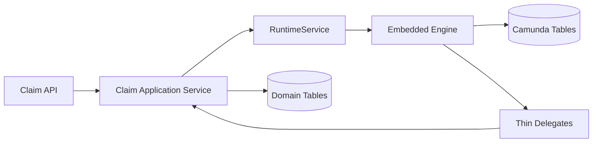

Guardrails:

- public API remains domain API;
- delegates call application services, not repositories randomly;
- async boundaries before remote side effects;
- outbox for external publish;
- no direct controller-to-TaskService exposure;
- dedicated tests for workflow behavior.

Good for:

- bounded workflow;
- strong team ownership;
- low platform complexity.

Bad for:

- enterprise-wide process spanning many teams;
- polyglot workers;
- centralized operations requirement.

---

## 18. Pattern: Remote Engine with External Workers

Use when process orchestrates multiple services.

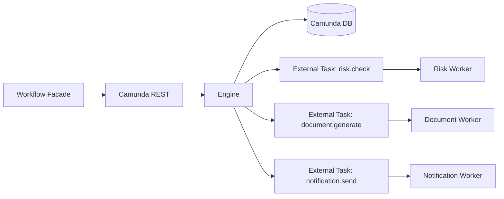

Guardrails:

- topic contracts documented;
- worker id, lock duration, retry policy standardized;
- all workers idempotent;
- no business secrets in process variables unless protected;
- engine REST API private;
- facade validates commands and correlation keys.

Good for:

- cross-service orchestration;
- polyglot teams;
- independent scaling;
- migration-aware design.

Bad for:

- tiny process where remote complexity is unnecessary;
- teams lacking distributed systems discipline.

---

## 19. Pattern: Shared Engine for Legacy Enterprise

Use when organization already operates application servers and process apps.

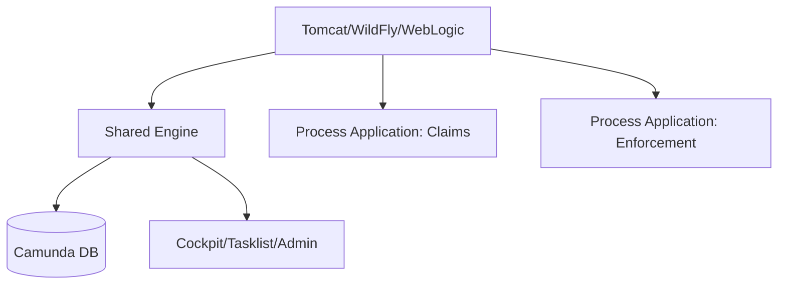

Guardrails:

- process application boundaries explicit;
- dependency conflict testing;
- deployment order documented;
- engine library version controlled by platform;
- all process apps tested against target engine version;
- classloader behavior included in test plan.

Good for:

- existing Camunda 7 enterprise setups;
- centralized engine in app server;
- WAR deployment model.

Bad for:

- cloud-native Spring Boot teams with no app server expertise;
- teams trying to minimize classloader complexity.

---

## 20. Anti-Patterns

### 20.1 Tutorial-Driven Architecture

Gejala:

- “Kita pakai embedded karena quickstart pakai embedded.”
- Tidak ada ADR.
- Tidak ada ownership map.

Solusi:

- pilih style berdasarkan deployment, ownership, scaling, transaction, security, migration.

### 20.2 One Central Engine as Enterprise Service Bus

Gejala:

- semua sistem harus lewat Camunda;
- BPMN memanggil semua service;
- engine menjadi integration bottleneck.

Dampak:

- process model terlalu besar;
- incident blast radius besar;
- team autonomy hilang;
- engine DB overload.

Solusi:

- gunakan bounded workflow;
- pisahkan orchestration yang benar-benar end-to-end;
- gunakan events untuk observability/projection, bukan semua command.

### 20.3 Many Embedded Engines Without Platform Standards

Gejala:

- tiap microservice punya Camunda config sendiri;
- history level berbeda;
- retry policy berbeda;
- incident handling berbeda.

Solusi:

- platform starter/library;
- architecture review;
- standard runbook;
- central inventory.

### 20.4 Frontend Directly Talks to Engine REST

Gejala:

- frontend complete task dengan raw variable names;
- user role di UI dipakai sebagai security utama;
- BPMN refactor memecahkan frontend.

Solusi:

- backend-for-frontend/domain workflow API;
- engine API private;
- task command contract stable.

### 20.5 Shared Engine Without Dependency Discipline

Gejala:

- process app redeploy menyebabkan ClassNotFoundException;
- object variables gagal deserialize;
- dependency version conflict.

Solusi:

- avoid Java serialized objects;
- external task for heavy service work;
- compatibility test per process app.

### 20.6 Remote Engine Without Idempotency

Gejala:

- retry HTTP start membuat duplicate process;
- duplicate message menyelesaikan instance salah;
- worker complete menghasilkan side effect ganda.

Solusi:

- business key strategy;
- outbox/inbox;
- idempotency key;
- unique business constraints;
- duplicate event test.

---

## 21. Migration-Aware Architecture

Karena Camunda 7.24 adalah minor terakhir, architecture baru di Camunda 7 harus migration-aware.

Migration-aware choices:

| Choice | Why it helps |
|---|---|
| External task workers | lebih mudah dipindah ke worker/job model lain |
| Domain workflow facade | hides engine-specific REST/API |
| JSON variables | lebih portable daripada Java serialized object |
| Stable business key | correlation independent dari engine internals |
| BPMN executable subset discipline | mengurangi fitur sulit migrasi |
| Avoid direct DB query | mengurangi coupling ke ACT_* schema |
| Document topic/message contracts | memudahkan replatforming |

Migration-hostile choices:

- heavy JavaDelegate with Spring domain dependency inside engine;
- custom engine plugin everywhere;
- Java serialized variables;
- UI direct to Camunda REST;
- direct SQL queries to engine tables;
- unbounded use of engine-specific extension elements;
- no process version/migration tests.

Rule:

> Bahkan jika tetap memakai Camunda 7 sampai 2030, desain baru sebaiknya tidak menambah coupling yang tidak perlu.

---

## 22. Architecture Review Questions

Sebelum go-live, jawab ini:

1. Engine berjalan di JVM mana?
2. Siapa owner runtime engine?
3. Siapa owner BPMN/DMN?
4. Siapa owner incident recovery?
5. Bagaimana BPMN dideploy?
6. Bagaimana process versioning dikontrol?
7. Bagaimana running instances lama diselesaikan setelah deploy baru?
8. Apakah job executor berjalan di semua node?
9. Bagaimana job acquisition/retry dikonfigurasi?
10. Bagaimana REST API diamankan?
11. Apakah frontend bisa memanggil engine langsung?
12. Apakah variable contract engine-specific atau domain-stable?
13. Apakah service task melakukan remote call sync dalam transaction engine?
14. Apakah external workers idempotent?
15. Apakah history cleanup dikonfigurasi?
16. Apakah DB backup/restore diuji?
17. Apakah Cockpit operator punya least privilege?
18. Apakah architecture punya migration path?

Jika lebih dari tiga jawaban “belum tahu”, architecture belum siap production.

---

## 23. Decision Heuristics

### Pilih Embedded jika:

- workflow milik satu service/domain;
- team yang sama mengelola code dan process;
- tight Java integration penting;
- operational maturity cukup;
- process tidak dimaksudkan sebagai enterprise-wide orchestrator.

### Pilih Shared Engine jika:

- organisasi sudah standardized pada app server;
- process applications perlu berbagi container-managed engine;
- platform team nyaman mengelola shared runtime;
- classloader/deployment discipline kuat.

### Pilih Remote Engine jika:

- engine harus platform-owned;
- banyak service/worker terlibat;
- polyglot worker penting;
- scaling engine dan worker harus dipisah;
- migration-aware architecture penting.

### Pilih Camunda Run jika:

- ingin standalone remote engine cepat;
- service work dilakukan external workers;
- custom engine app minimal;
- konfigurasi runtime ingin distandardisasi;
- cocok dengan supported environment dan lifecycle Anda.

---

## 24. Practice: Architecture Selection Exercise

### Scenario A — Internal Approval in One Spring Boot Service

- Satu team.
- Satu domain DB.
- Approval sederhana dengan 2 user task.
- Delegates hanya update domain state.

Recommendation:

- Embedded engine acceptable.
- Guardrail: no public engine REST, process tests, async only where needed.

### Scenario B — Regulatory Enforcement Case Across Five Systems

- Case spans investigation, legal review, notification, penalty, appeal.
- Banyak team.
- SLA dan audit ketat.
- Several external services.

Recommendation:

- Remote engine or Camunda Run + workflow facade + external workers.
- Guardrail: business key, idempotency, audit projection, strict authorization.

### Scenario C — Existing Java EE Enterprise Platform

- Sudah ada Tomcat/WildFly operational model.
- Banyak WAR process applications.
- Platform team mengelola runtime.

Recommendation:

- Shared engine may fit.
- Guardrail: classloader testing, dependency discipline, process app compatibility matrix.

### Scenario D — New Greenfield in 2026

- Team belum punya Camunda 7 legacy.
- Long-term roadmap cloud-native.
- Need process orchestration.

Recommendation:

- Pertimbangkan Camunda 8 terlebih dahulu.
- Jika harus Camunda 7 karena constraint, gunakan migration-aware remote/external-task style.

---

## 25. Mental Compression

Simpan model ini:

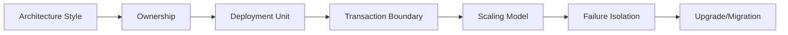

Arsitektur Camunda bukan keputusan library. Ia adalah keputusan tentang **di mana state machine hidup**, **siapa yang mengoperasikannya**, dan **bagaimana failure dipulihkan**.

---

## 26. Ringkasan

Camunda 7 memberi banyak pilihan deployment. Embedded engine sederhana dan kuat untuk domain-owned workflow. Shared engine cocok untuk lingkungan app server enterprise yang matang. Remote engine memberi isolation, scaling, dan migration friendliness, tetapi menuntut disiplin distributed systems. Camunda Run menyederhanakan standalone remote engine, terutama bila dikombinasikan dengan external task workers.

Tidak ada style yang otomatis benar. Pilihan harus diturunkan dari constraints:

- ownership;
- deployment;
- transaction;
- scaling;
- failure isolation;
- security;
- classloading;
- upgrade;
- migration.

Anti-pattern paling berbahaya adalah memilih architecture berdasarkan tutorial. Untuk production, buat ADR, ownership map, deployment strategy, runbook, dan test plan.

---

## 27. Self-Assessment

Anda siap lanjut jika bisa menjawab:

1. Apa perbedaan embedded engine dan shared engine?
2. Mengapa remote engine membutuhkan idempotency/outbox lebih eksplisit?
3. Apa risiko job executor berjalan di semua node embedded app?
4. Kapan Camunda Run cocok untuk production?
5. Mengapa frontend tidak boleh langsung memanggil Camunda REST API?
6. Apa classloader risk di shared process engine?
7. Bagaimana external task mengurangi coupling engine JVM?
8. Apa trade-off tight transaction integration di embedded engine?
9. Mengapa direct SQL ke ACT_* tables berbahaya?
10. Architecture choice mana yang paling migration-aware untuk Camunda 7 baru?

Jika jawaban masih belum tajam, ulangi part 016, 019, 020, dan 021 sebelum masuk database/performance engineering di part berikutnya.
