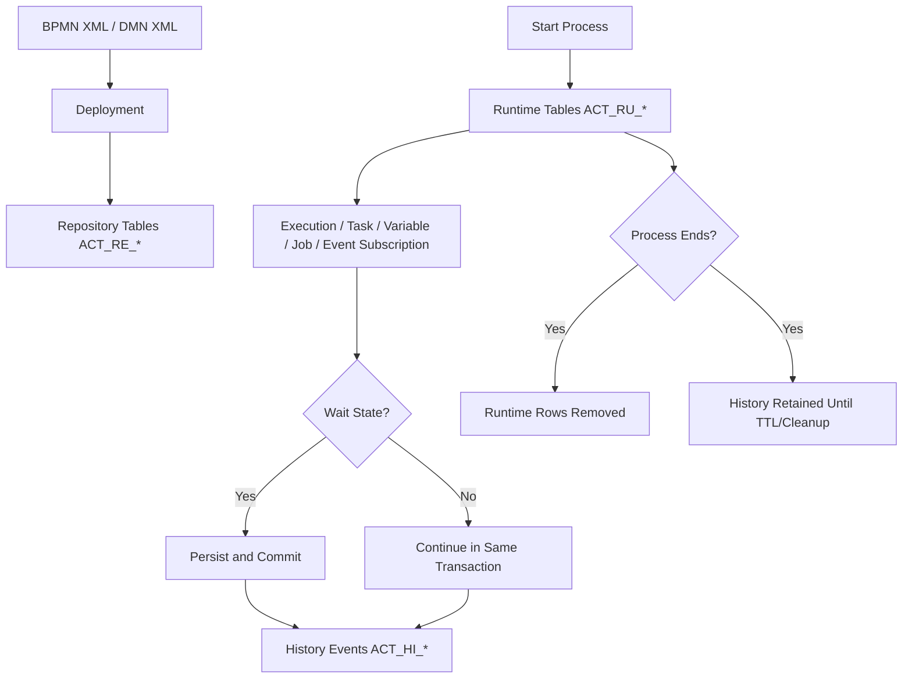
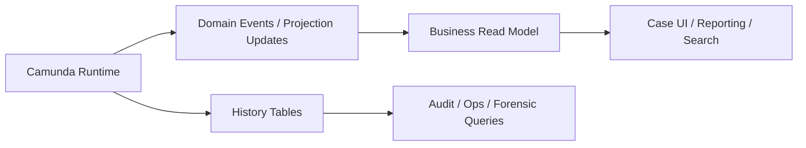
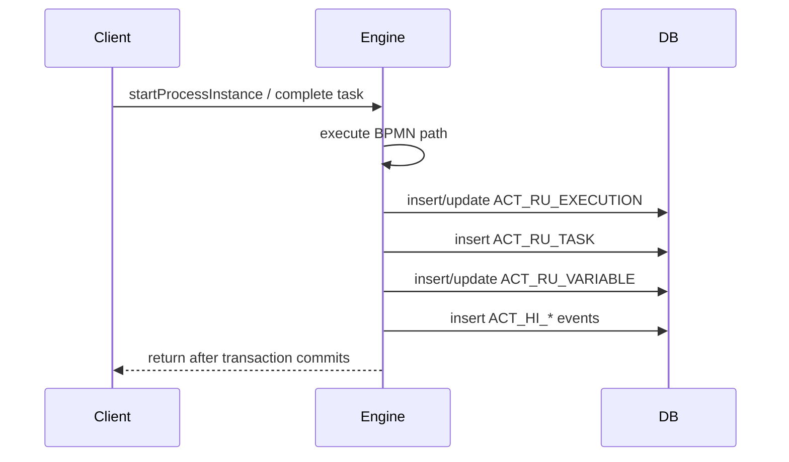
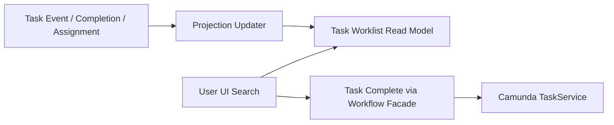
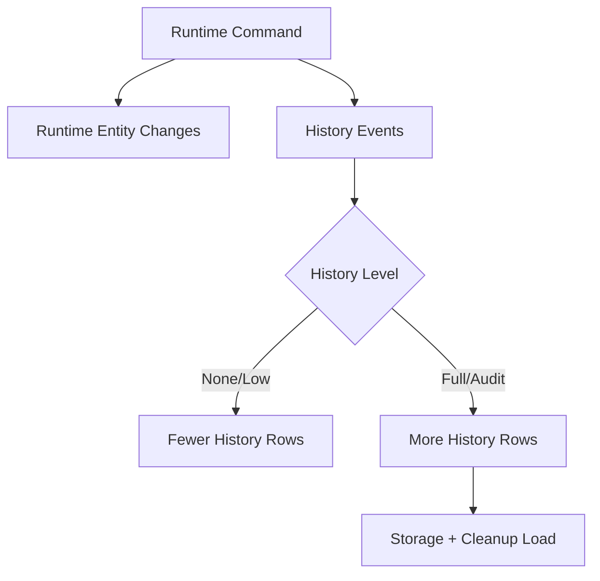
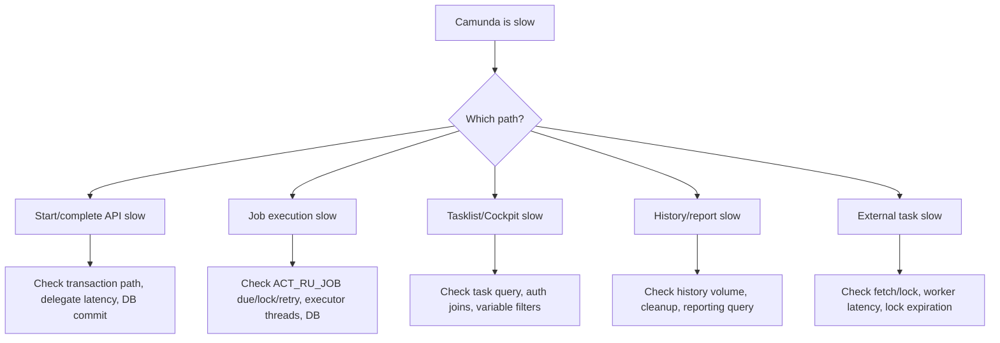

# Part 023 — Database, Persistence, and Performance Engineering

> Target skill: mampu membaca Camunda 7 sebagai stateful database-backed workflow engine, bukan sebagai library BPMN yang kebetulan menyimpan data. Setelah part ini, Anda harus bisa menjelaskan table family `ACT_*`, runtime vs history, query pressure, job table pressure, variable serialization cost, cleanup strategy, indexing risk, dan kenapa direct DB access hampir selalu perlu dibatasi.

Banyak engineer baru memulai Camunda dari Modeler, delegate, dan REST API. Itu normal. Tetapi engineer production-grade harus cepat berpindah ke pertanyaan yang lebih mendasar:

> **Apa yang sebenarnya terjadi pada database ketika token bergerak, user task dibuat, job gagal, variable berubah, process selesai, dan history dibersihkan?**

Camunda 7 adalah process engine yang menyimpan durable runtime state di database. Token, execution, task, job, event subscription, variable, deployment, definition, incident, dan history semuanya punya konsekuensi database. Kalau database tidak dipahami, masalah Camunda akan terlihat seperti misteri: process lambat, Cockpit berat, job executor tertinggal, history cleanup mengganggu traffic, atau query aplikasi tiba-tiba memukul table engine.

Referensi resmi dan pendukung:

- Database Schema: https://docs.camunda.org/manual/7.24/user-guide/process-engine/database/database-schema/
- Database Performance: https://docs.camunda.org/manual/7.24/user-guide/process-engine/database/performance/
- History Cleanup: https://docs.camunda.org/manual/7.24/user-guide/process-engine/history/history-cleanup/
- Job Executor: https://docs.camunda.org/manual/7.24/user-guide/process-engine/the-job-executor/
- Transactions in Processes: https://docs.camunda.org/manual/7.24/user-guide/process-engine/transactions-in-processes/
- Process Engine Concepts: https://docs.camunda.org/manual/7.24/user-guide/process-engine/process-engine-concepts/
- Variables: https://docs.camunda.org/manual/7.24/user-guide/process-engine/variables/

---

## 1. Kaufman Deconstruction

Untuk menguasai database/performance Camunda 7 secara cepat, pecah skill ini menjadi sub-skill yang bisa diuji.

| Sub-skill | Pertanyaan utama | Output praktis |
|---|---|---|
| Schema family mental model | Table `ACT_*` dipakai untuk apa? | Bisa menjelaskan `RE`, `RU`, `HI`, `GE`, `ID` |
| Runtime-state reading | Instance sedang berhenti di mana? | Bisa membaca execution/task/job/event subscription secara konseptual |
| History-state reading | Apa bukti yang tersimpan setelah proses selesai? | Bisa membedakan audit vs runtime |
| Query discipline | Query apa yang boleh dari aplikasi? | Query boundary dan read-model policy |
| Job pressure analysis | Kenapa job backlog naik? | Diagnosis `ACT_RU_JOB` dan job executor |
| Variable cost analysis | Variable apa yang mahal? | Contract variable dan payload-size policy |
| Cleanup strategy | Kapan history dihapus? | TTL, retention, cleanup window |
| Indexing discipline | Kapan index engine perlu ditambah? | Evidence-based index plan |
| Capacity model | Apa bottleneck utama? | DB, job executor, worker, task query, cleanup |
| Failure runbook | Apa yang dicek saat lambat? | Step-by-step triage |

Prinsip Kaufman: belajar cukup untuk self-correct. Dalam konteks ini, self-correction berarti Anda bisa melihat gejala production dan mengaitkannya ke mekanisme database engine, bukan hanya menambah thread atau restart node.

---

## 2. Mental Model: Camunda Database Is the Durable Workflow Memory

Camunda engine menggunakan database sebagai durable memory untuk:

1. deployed artifact,
2. runtime execution state,
3. pending work,
4. correlation subscription,
5. user task state,
6. variable state,
7. incident state,
8. audit/history state,
9. identity/authorization data jika identity engine dipakai.



Kunci mental model:

- `ACT_RE_*` menyimpan **definition/artifact**.
- `ACT_RU_*` menyimpan **state aktif**.
- `ACT_HI_*` menyimpan **jejak historis**.
- `ACT_GE_*` menyimpan data general seperti byte array.
- `ACT_ID_*` menyimpan identity jika fitur identity Camunda dipakai.

Kesalahan umum: menganggap runtime tables sebagai data warehouse. Bukan. Runtime tables harus kecil, cepat, dan didedikasikan untuk engine.

---

## 3. Schema Families

Camunda table names dimulai dengan `ACT`. Bagian kedua menunjukkan family use case.

| Prefix | Meaning | Isi utama | Cara berpikir |
|---|---|---|---|
| `ACT_RE_*` | Repository | Deployment, process definition, decision definition, resources | Static metadata/artifact |
| `ACT_RU_*` | Runtime | Execution, task, variable, job, incident, event subscription | Active process memory |
| `ACT_HI_*` | History | Historic process, activity, task, variable, detail, operation log | Audit/read trail |
| `ACT_GE_*` | General | Byte arrays, properties | Shared supporting data |
| `ACT_ID_*` | Identity | User, group, membership, authorization-related identity data | Built-in identity layer |

Camunda docs menyatakan runtime data disimpan selama process instance berjalan dan dihapus saat instance selesai agar runtime tables tetap kecil dan cepat. Ini penting: **kalau runtime tables membesar tanpa kontrol, biasanya ada long-running instance volume, stuck instance, job backlog, variable bloat, atau incident backlog**.

---

## 4. Main Entity Map

Untuk production debugging, Anda tidak perlu hafal semua table. Anda perlu tahu entity utama.

| Entity konseptual | Table umum | Pertanyaan yang dijawab |
|---|---|---|
| Deployment | `ACT_RE_DEPLOYMENT`, `ACT_GE_BYTEARRAY` | Artifact apa yang dideploy? |
| Process definition | `ACT_RE_PROCDEF` | Versi process mana yang aktif? |
| Execution | `ACT_RU_EXECUTION` | Token/execution runtime ada di mana? |
| Task | `ACT_RU_TASK` | User task apa yang sedang aktif? |
| Variable | `ACT_RU_VARIABLE`, `ACT_GE_BYTEARRAY` | Data process aktif apa yang tersimpan? |
| Job | `ACT_RU_JOB` | Work async/timer apa yang menunggu? |
| Event subscription | `ACT_RU_EVENT_SUBSCR` | Message/signal/compensation apa yang ditunggu? |
| Incident | `ACT_RU_INCIDENT` | Instance apa yang stuck karena failure? |
| Historic process | `ACT_HI_PROCINST` | Process pernah berjalan sampai mana? |
| Historic activity | `ACT_HI_ACTINST` | Activity apa saja yang dilewati? |
| Historic task | `ACT_HI_TASKINST` | User task historis apa yang terjadi? |
| Historic variable | `ACT_HI_VARINST`, `ACT_HI_DETAIL` | Variable historis apa yang terekam? |

Jangan gunakan table names ini sebagai ajakan untuk query langsung dari aplikasi. Ini adalah **diagnostic mental model**. Aplikasi bisnis sebaiknya memakai API engine atau read model terpisah.

---

## 5. Runtime Tables Are Not Your Business Database

Runtime tables adalah internal state engine. Mereka bukan canonical source untuk domain Anda.

Contoh domain buruk:

```text
Regulatory case status = derive langsung dari ACT_RU_TASK + ACT_RU_EXECUTION
```

Masalah:

- status bisnis menjadi tergantung struktur BPMN,
- migration BPMN bisa merusak reporting,
- task query menjadi beban operasional aplikasi,
- history cleanup bisa mengubah asumsi data,
- engine upgrade bisa mengubah detail internal,
- query custom bisa lock/scan table engine,
- audit bisnis tercampur dengan audit engine.

Desain lebih sehat:



Rule praktis:

> Camunda runtime tables menjawab “engine sedang melakukan apa?” Business read model menjawab “case bisnis berada dalam state apa?”

---

## 6. Persistence Lifecycle of a Process Instance

Saat process instance dimulai:

1. engine mencari process definition,
2. membuat execution tree,
3. mengeksekusi path synchronous sampai wait state atau end,
4. menyimpan runtime state,
5. menulis history sesuai history level,
6. commit transaction.

Saat instance mencapai user task:



Saat instance selesai:

- runtime rows untuk instance dihapus,
- history rows tetap ada sesuai history configuration,
- variable runtime hilang,
- historic variable/history detail bisa tetap ada,
- byte arrays terkait runtime bisa dibersihkan jika tidak lagi direferensikan.

Implikasi:

- query runtime tidak cocok untuk audit jangka panjang,
- history query tidak cocok untuk high-throughput transactional UI tanpa desain projection,
- process completion bukan berarti semua bukti compliance siap dalam format yang ingin auditor baca.

---

## 7. Transaction Flush and Why Database Cost Appears Late

Camunda command execution sering mengumpulkan perubahan entity di command context lalu flush ke database menjelang akhir command/transaction. Dari sisi developer, delegate terasa seperti Java biasa. Dari sisi database, satu command bisa menghasilkan banyak insert/update/delete.

Contoh path:

```text
complete user task
  -> update task complete
  -> update execution
  -> set variables
  -> create historic task row
  -> create historic activity row
  -> create job for asyncAfter
  -> delete runtime task
  -> commit
```

Jika error muncul di commit/flush, stack trace bisa terlihat jauh dari kode yang “sebenarnya” menyebabkan konflik. Karena itu troubleshooting Camunda tidak cukup membaca baris delegate. Anda perlu memahami entity apa yang diubah command tersebut.

---

## 8. Database Load Sources

Camunda load biasanya datang dari beberapa sumber berbeda.

| Source | Table pressure | Gejala |
|---|---|---|
| Process start volume | `ACT_RU_EXECUTION`, `ACT_HI_PROCINST` | insert/update tinggi |
| User task UI | `ACT_RU_TASK`, auth tables, variables | task query lambat |
| Async service task | `ACT_RU_JOB` | job backlog, locks |
| Timers | `ACT_RU_JOB` | due date scan, burst execution |
| External task | `ACT_RU_EXT_TASK`, variables | fetch/lock pressure |
| Variable-heavy model | `ACT_RU_VARIABLE`, `ACT_GE_BYTEARRAY`, `ACT_HI_DETAIL` | payload bloat |
| History full/audit | `ACT_HI_*` | write amplification |
| Cockpit/reporting | runtime/history query | operator UI lambat |
| Cleanup | `ACT_HI_*`, `ACT_GE_BYTEARRAY` | delete load, IO spikes |
| Custom dashboard | arbitrary joins | unpredictable scans |

Optimization berbeda untuk setiap source. Menambah job executor threads tidak mempercepat task query. Menambah DB index tidak memperbaiki remote API latency jika worker lambat. Mengurangi history level bisa menurunkan write amplification, tetapi bisa merusak audit requirement.

---

## 9. Query Discipline: The Hard Rule

Production rule:

> Aplikasi bisnis tidak boleh bergantung pada query langsung ke internal Camunda tables kecuali ada explicit platform contract, read-only policy, version lock, dan performance review.

Gunakan pendekatan ini:

| Use case | Preferensi |
|---|---|
| Start process | `RuntimeService` atau REST facade |
| Complete task | `TaskService` atau workflow facade |
| Correlate message | `RuntimeService#correlate...` atau facade |
| Operator recovery | Cockpit/API/admin tooling |
| Business search | Domain read model |
| Regulatory report | Audit projection + selected Camunda history |
| Forensic/debug | Controlled DB read/query with runbook |

Kenapa direct table query berbahaya:

1. schema internal bukan domain contract,
2. query bisa mengganggu engine,
3. join runtime-history bisa mahal,
4. authorization semantics bisa bypassed,
5. upgrade/minor version bisa mengubah asumsi,
6. history cleanup bisa menghapus data yang dikira permanen,
7. query report bisa menahan resource DB saat engine butuh commit.

---

## 10. Task Query Performance

Task query adalah salah satu query paling sering dipakai dan sangat powerful. Karena fiturnya kaya, SQL yang dihasilkan bisa kompleks.

Masalah umum:

- filter candidate groups besar,
- authorization enabled dan join auth table,
- process variable filter,
- sorting by variable,
- pagination tanpa index efektif,
- tasklist custom menampilkan semua task untuk banyak group,
- UI polling terlalu sering,
- query menggabungkan active tasks + business search.

Bad pattern:

```java
List<Task> tasks = taskService.createTaskQuery()
    .taskCandidateGroupIn(userGroups)
    .processVariableValueEquals("caseType", caseType)
    .processVariableValueLike("customerName", "%" + q + "%")
    .orderByTaskCreateTime()
    .desc()
    .list();
```

Masalah:

- process variable filter memaksa join variable table,
- `LIKE` pada variable tidak cocok untuk search,
- query task menjadi search engine,
- group list besar memperlebar predicate,
- sorting bisa mahal.

Better pattern:



Camunda tetap sumber eksekusi task, tetapi UI high-volume membaca dari projection yang didesain untuk search.

---

## 11. Variable Query Cost

Variables sangat menggoda untuk semua hal:

```text
caseId
customerName
riskScore
approvalLevel
documentPayload
fullCaseSnapshot
externalResponse
```

Tetapi setiap variable punya biaya:

- serialization/deserialization,
- runtime row,
- history row/detail,
- indexing/query cost,
- payload storage,
- migration compatibility,
- privacy/security exposure,
- Cockpit display overhead.

Rule desain:

| Variable type | Cocok disimpan di Camunda? | Catatan |
|---|---:|---|
| Correlation key | Ya | kecil, stabil, indexed by usage pattern via API |
| Routing decision result | Ya | primitive/small enum |
| Human task form fields | Sebagian | simpan minimal, domain data di domain DB |
| Large document | Tidak | simpan reference/id saja |
| External API response full | Jarang | simpan normalized result atau reference |
| Full aggregate snapshot | Umumnya tidak | membuat process variable menjadi data lake |
| Sensitive PII | Hindari/minimize | encryption/masking/retention harus jelas |

Practical invariant:

> Variable Camunda adalah state process yang diperlukan engine untuk routing/recovery, bukan tempat menyimpan seluruh state domain.

---

## 12. History Write Amplification

History level menentukan seberapa banyak data historis ditulis.

Semakin tinggi history level:

- audit lebih kaya,
- Cockpit/ops lebih informatif,
- DB write lebih tinggi,
- storage lebih besar,
- cleanup lebih berat,
- privacy retention lebih kompleks.

Mental model:



Regulatory systems sering butuh audit lengkap, tetapi jangan otomatis menyimpan semua variable detail tanpa data classification. Audit yang defensible bukan berarti semua payload disimpan selamanya di Camunda.

---

## 13. History Cleanup Strategy

History cleanup bukan housekeeping kecil. Pada production volume besar, cleanup adalah workload database tersendiri.

Desain cleanup perlu menjawab:

| Pertanyaan | Contoh keputusan |
|---|---|
| Berapa TTL process definition? | 180 hari, 2 tahun, 7 tahun tergantung case type |
| Apakah semua process punya TTL? | Wajib untuk production governance |
| Kapan cleanup window? | Di luar jam puncak |
| Berapa batch size? | Mulai konservatif, ukur DB impact |
| Apakah cleanup bersaing dengan job executor utama? | Pisahkan window/priority/resource bila perlu |
| Apa retention legal/compliance? | Legal hold harus dipisah dari TTL standar |
| Apa data yang harus diproyeksikan sebelum cleanup? | Audit/reporting projection |

Anti-pattern:

```text
historyTimeToLive = null because we might need it someday
```

Ini bukan retention strategy. Ini storage debt.

Better:

```text
case type: enforcement-investigation
engine history TTL: 730 days
audit projection retention: 7 years
legal hold: domain/audit store flag, not implicit Camunda runtime retention
cleanup window: 01:00-04:00 local time
```

---

## 14. Job Table Pressure

`ACT_RU_JOB` adalah table penting untuk async continuation, timer, batch, cleanup, dan internal background work.

Job table pressure muncul ketika:

- job creation rate > job execution rate,
- due timers burst bersamaan,
- retries menghasilkan backlog,
- failed jobs menyisakan incident,
- cleanup/batch jobs bersaing dengan business jobs,
- job executor threads terlalu kecil,
- DB lock/acquisition lambat,
- external systems lambat sehingga jobs lama menahan worker,
- priority/starvation salah konfigurasi.

Diagnostic questions:

| Pertanyaan | Interpretasi |
|---|---|
| Banyak job due tapi tidak dieksekusi? | Acquisition/executor/resource issue |
| Banyak retries rendah? | Delegate/system failure |
| Banyak lock expired? | Worker/thread crash atau long execution |
| Banyak timer due bersamaan? | Timer burst/modeling issue |
| Batch/history cleanup jobs mendominasi? | Operational job contention |
| Job priority range gap? | Starvation risk |

Job executor bukan message broker. Ia polling database table dan mengunci job. Maka performanya sangat tergantung DB, transaction duration, acquisition tuning, thread pool, dan model async.

---

## 15. Connection Pool Sizing

Connection pool sizing sering kelihatan sederhana tetapi menentukan throughput.

Camunda embedded app biasanya memakai koneksi DB untuk:

- request thread aplikasi,
- engine command,
- job executor acquisition,
- job executor worker threads,
- history cleanup,
- batch jobs,
- admin/Cockpit/Tasklist queries,
- custom projections,
- health checks.

Rule kasar:

```text
pool >= web request concurrency needing engine
      + job executor max pool size
      + acquisition/cleanup/batch overhead
      + admin/query overhead
      + margin
```

Tetapi jangan asal membesarkan pool. DB juga punya max connection, CPU, IO, lock, memory. Pool terlalu besar bisa memperburuk contention.

Good practice:

1. ukur actual concurrent DB usage,
2. pisahkan application read model dari engine DB bila memungkinkan,
3. batasi UI polling,
4. jangan jalankan heavy report di primary engine DB,
5. monitor wait time connection pool,
6. monitor DB lock wait dan query latency,
7. load test dengan job executor aktif.

---

## 16. Indexing Strategy

Jangan tambah index karena “query lambat”. Tambah index karena Anda punya evidence:

- query plan,
- cardinality,
- predicate/sort pattern,
- frequency,
- write overhead acceptable,
- engine upgrade compatibility reviewed,
- rollback plan.

Index trade-off:

| Benefit | Cost |
|---|---|
| Query lebih cepat | Insert/update/delete lebih lambat |
| Less scan | Storage lebih besar |
| Better task/report query | Maintenance saat upgrade |
| Better custom read path | Risiko bergantung internal schema |

Preferred order:

1. perbaiki query pattern,
2. pindahkan business search ke projection,
3. kurangi variable filter/sort,
4. tune engine config yang resmi,
5. ukur query plan,
6. baru pertimbangkan index tambahan.

---

## 17. Database Isolation and Locking Reality

Camunda memakai optimistic locking untuk entity internal. Database isolation level dan lock behavior tetap penting.

Risiko umum:

- long transaction di delegate menahan locks,
- slow query menahan resource,
- report query besar mengganggu OLTP engine,
- cleanup delete besar memicu IO spikes,
- job acquisition bersaing di `ACT_RU_JOB`,
- multiple engine nodes polling job table,
- external API completion concurrent memicu conflicts.

Guideline:

> Keep engine transactions short. Let wait states and async boundaries separate expensive work.

Contoh buruk:

```java
public class GenerateReportDelegate implements JavaDelegate {
  @Override
  public void execute(DelegateExecution execution) {
    var data = repository.loadHugeCaseGraph();
    var pdf = pdfService.generate(data);       // CPU + IO heavy
    s3Client.putObject(...);                   // non-transactional remote side effect
    execution.setVariable("reportUrl", url);
  }
}
```

Better:

```text
Camunda service task: enqueue/report command + async boundary
Worker: generate PDF idempotently
Worker: publish completion event
Camunda: message catch continues process
```

---

## 18. Runtime vs History for Reporting

Reporting questions fall into categories.

| Reporting question | Best source |
|---|---|
| What is currently active? | Runtime API/projection |
| What happened before? | History/projection |
| What is business case status? | Domain read model |
| What tasks are assigned to user? | Task projection or TaskService for low volume |
| What is SLA breach trend? | Event/audit projection |
| What did operator modify? | User operation log + audit projection |
| What process path did instance take? | HistoryService / historic activity |

Production reporting anti-pattern:

```sql
SELECT ...
FROM ACT_HI_PROCINST p
JOIN ACT_HI_ACTINST a ON ...
JOIN ACT_HI_VARINST v ON ...
JOIN ACT_HI_TASKINST t ON ...
WHERE v.NAME_ = 'customerName'
  AND v.TEXT_ LIKE '%...%'
ORDER BY p.START_TIME_ DESC
```

This may work in dev. At production volume, it becomes a reporting engine built on top of an OLTP workflow database.

Better:

- emit domain events,
- maintain reporting projection,
- store audit facts in append-only audit store,
- use Camunda history for forensic detail and reconciliation,
- define retention before production.

---

## 19. Process Definition Cache and Deployment Pressure

Camunda parses deployed BPMN/DMN and maintains deployment cache. Production risks:

- too many deployments,
- duplicate deployment on every startup,
- dynamic process generation,
- many versions left active,
- deployment-aware job executor misconfigured,
- classloader mismatch between process definition and delegate code.

Good deployment policy:

| Practice | Why |
|---|---|
| Avoid duplicate deployment on every boot | Reduces repository clutter |
| Use stable process ids | Predictable API contracts |
| Version intentionally | Migration and audit clarity |
| Control deployment per environment | Reproducibility |
| Keep old definitions for running instances | Long-running safety |
| Avoid generating BPMN per customer | Cache/schema/version explosion |

If your business variation is high, prefer DMN/configuration/rule versioning over generating thousands of BPMN definitions.

---

## 20. Timer Scale and Burst Behavior

Timers are persisted as jobs. A timer that looks harmless in BPMN can create major database/job pressure.

Examples:

| Model | Runtime effect |
|---|---|
| One SLA timer per user task | One timer job per task instance |
| Non-interrupting repeating timer | Potential repeated job creation |
| Multi-instance with timer per item | Timer count multiplied by collection size |
| Same due date for many cases | Timer burst |
| Retry cycle with many failed jobs | Periodic retry wave |

Design questions:

1. Is this timer per case, per task, per assignee, or per item?
2. What is maximum concurrent active timer count?
3. Can due dates cluster at midnight or working-hour boundaries?
4. Is SLA monitoring better handled by external scheduler/projection?
5. Does operator need individual timer visibility in Cockpit?

For regulatory workflows, timers are often business-significant. Still, do not create timer explosion when one aggregate SLA projection can detect breach and correlate targeted messages.

---

## 21. Large Payloads and Byte Arrays

Large object variables, serialized Java objects, JSON/XML payloads, deployment resources, and exception stack traces may use byte array storage.

Risks:

- table bloat,
- slow Cockpit variable rendering,
- serialization compatibility failure,
- history duplication,
- backup/restore size,
- cleanup cost,
- accidental PII retention.

Guideline:

```text
Store references, not documents.
Store decisions, not full response bodies.
Store correlation facts, not entire aggregates.
```

Example:

```java
execution.setVariable("documentId", documentId);
execution.setVariable("documentChecksum", checksum);
execution.setVariable("documentClass", "EVIDENCE_PDF");
```

Avoid:

```java
execution.setVariable("documentBytes", pdfBytes);
execution.setVariable("fullExternalResponse", responseBody);
```

---

## 22. Operational Dashboards: What to Monitor

Database/performance dashboard should cover at least:

| Metric | Why it matters |
|---|---|
| Runtime process count | Active instance volume |
| Runtime task count | Human work backlog |
| Job count by due/retry/lock | Async/timer pressure |
| Incident count by type/process | Failure concentration |
| History table growth | Storage/retention risk |
| Cleanup job duration | Housekeeping pressure |
| Task query latency | UI/operator health |
| Job acquisition latency | Executor health |
| DB CPU/IO/locks | Database bottleneck |
| Connection pool wait | App/engine contention |
| Variable payload size distribution | Serialization/storage risk |

Add process-level metrics:

- starts per minute,
- completions per minute,
- active instances by definition version,
- average task age,
- SLA breach count,
- retries exhausted,
- timer due backlog,
- external task lock expiration count.

---

## 23. Capacity Model

A simple model:

```text
Engine DB write load ~= process starts
                     + activity transitions
                     + variable updates
                     + history events
                     + job acquisition/update
                     + task operations
                     + cleanup deletes
```

Throughput is constrained by:

- DB write latency,
- job executor worker time,
- delegate/external system latency,
- variable serialization size,
- history level,
- task query complexity,
- number of engine nodes,
- lock contention,
- connection pool.

Before increasing node count, ask:

1. Is DB already saturated?
2. Are job executor threads actually busy?
3. Are jobs locked but slow, or not acquired?
4. Is workload CPU, IO, remote-service, or DB-bound?
5. Are retries creating duplicate work?
6. Are exclusive jobs serializing expected work?
7. Are all nodes allowed to execute all jobs?

Scaling Camunda is not just scaling JVMs. The database remains the coordination point.

---

## 24. Production Triage Playbook: “Camunda Is Slow”

When someone says Camunda is slow, classify the symptom.



Checklist:

1. Identify exact API/UI path.
2. Measure latency at application boundary.
3. Check DB CPU/IO/locks/connections.
4. Check job backlog and retries.
5. Check incident spike.
6. Check recent deployments/model changes.
7. Check history cleanup window.
8. Check task query pattern.
9. Check external systems called by delegates/workers.
10. Check if non-transactional side effects cause retries.

Do not start with “increase thread pool”. Start with bottleneck classification.

---

## 25. Anti-Patterns

### 25.1 Direct Business Reporting on Camunda Tables

Symptom:

- report query grows over time,
- DB CPU spikes during office hours,
- reporting requires knowledge of BPMN internals,
- process migration breaks reports.

Fix:

- build domain reporting projection,
- use Camunda history only for forensic reconciliation,
- define projection contract explicitly.

### 25.2 Variable Dumping Ground

Symptom:

- variables contain full JSON snapshots,
- task queries filter by arbitrary variables,
- Cockpit variable page slow,
- cleanup takes too long.

Fix:

- classify variables,
- store references,
- use domain DB/read model,
- restrict variable size.

### 25.3 Unbounded History

Symptom:

- `ACT_HI_*` grows forever,
- backup time increases,
- cleanup not configured,
- storage cost surprises everyone.

Fix:

- set TTL,
- define retention by process type,
- configure cleanup window,
- export audit projection before cleanup.

### 25.4 Job Executor as Queue Replacement

Symptom:

- massive async service tasks emulate message queue,
- long-running remote calls inside delegates,
- lock expiration/retry storms,
- DB becomes queue bottleneck.

Fix:

- use external task or real queue where appropriate,
- keep jobs short,
- use async boundary for savepoints, not arbitrary queueing.

### 25.5 One Engine DB for Everything

Symptom:

- workflow engine, reporting, search, BI, audit, and app all hit same DB schema,
- DB changes become impossible,
- performance tuning has conflicting goals.

Fix:

- separate operational engine DB from read/report projections,
- replicate/export data intentionally,
- define ownership boundaries.

---

## 26. Regulatory System Lens

For enforcement lifecycle and complex case management, database decisions become defensibility decisions.

Questions to answer before production:

| Area | Question |
|---|---|
| Case status | Is status derived from process runtime or domain model? |
| Audit | Which facts must survive Camunda history cleanup? |
| Legal hold | Can cleanup be paused per case/domain artifact? |
| Evidence | Are documents stored outside Camunda with immutable references? |
| Operator action | Is user operation log enough, or do we need business audit? |
| Human task | Are assignment/claim/complete events projected? |
| SLA | Is SLA timer in BPMN or monitored in domain projection? |
| Migration | Can old process versions remain queryable? |
| Privacy | Can PII be erased/minimized without corrupting audit? |

For regulated systems, do not let Camunda internals become the only audit story. Camunda history is valuable, but your defensible audit model should be explicit.

---

## 27. Recommended Engineering Policies

Use these as platform defaults.

### 27.1 Variable Policy

```text
Allowed by default:
- IDs
- enums
- booleans
- timestamps
- small decision outputs
- correlation keys
- stable references

Requires review:
- JSON payloads > 10KB
- object serialization
- PII
- arrays/lists with unbounded size
- variables used for task query filters

Rejected by default:
- documents/files
- full aggregate snapshots
- raw external API responses
- secrets/tokens/passwords
```

### 27.2 Query Policy

```text
Allowed:
- engine API for process operations
- controlled HistoryService for ops/debug
- projection DB for business search/report

Requires review:
- direct read-only DB queries
- variable filtering in high-volume UI
- custom Cockpit plugins with broad queries

Rejected:
- direct writes to ACT_* tables
- business app depending on internal schema joins
- report workloads on primary DB without review
```

### 27.3 Cleanup Policy

```text
Every process definition must define history TTL.
Every domain requiring longer retention must export audit data.
Cleanup must have a monitored window.
Cleanup duration and delete counts must be observable.
Legal hold must be modeled outside implicit engine history retention.
```

---

## 28. Self-Correction Exercises

### Exercise 1 — Table Family Drill

Given an incident where user task completion is slow, list which table families are likely involved.

Expected reasoning:

- `ACT_RU_TASK` for task state,
- `ACT_RU_EXECUTION` for token movement,
- `ACT_RU_VARIABLE` if variables updated/read,
- `ACT_HI_*` if history enabled,
- `ACT_RU_JOB` if async boundary created,
- authorization tables if auth query involved.

### Exercise 2 — Variable Contract Review

Review this variable set:

```json
{
  "caseId": "CASE-123",
  "customerName": "Alice",
  "fullCase": "{...500KB...}",
  "riskScore": 87,
  "approvalRoute": "SENIOR_REVIEW",
  "kycDocumentBytes": "base64..."
}
```

Classify each variable.

Expected answer:

- `caseId`: keep,
- `customerName`: maybe projection/domain, only keep if needed for task display and privacy reviewed,
- `fullCase`: reject,
- `riskScore`: keep if routing/audit relevant,
- `approvalRoute`: keep,
- `kycDocumentBytes`: reject; store document reference.

### Exercise 3 — Slow Tasklist

Symptoms:

- Tasklist takes 8 seconds.
- Query filters candidate groups and process variables.
- User has 40 groups.
- History cleanup is not running.

Likely issue:

- task query complexity,
- auth/group predicate,
- variable join/filter,
- missing projection/read model.

Not first fix:

- increasing job executor threads.

### Exercise 4 — History Growth

Symptoms:

- `ACT_HI_DETAIL` grows fastest.
- Process has many variable updates.
- History level is full.
- Cleanup TTL missing for some definitions.

Likely action:

- review history level requirement,
- reduce variable churn,
- set TTL,
- project needed audit facts,
- configure cleanup.

---

## 29. Production Checklist

Before shipping a Camunda 7 process to production, answer:

- [ ] What is expected active instance count?
- [ ] What is expected user task count?
- [ ] What is expected job creation rate?
- [ ] What is max timer count?
- [ ] What variables are stored and why?
- [ ] Are large payloads rejected?
- [ ] Is history TTL configured?
- [ ] Is cleanup window configured and monitored?
- [ ] Are task queries reviewed?
- [ ] Is business search served from projection?
- [ ] Are reports separated from engine DB?
- [ ] Are indexes based on measured query plans?
- [ ] Is DB connection pool sized with job executor in mind?
- [ ] Are job backlog metrics available?
- [ ] Are incident metrics available?
- [ ] Are engine DB backups and restore tested?
- [ ] Is upgrade/migration impact on schema understood?
- [ ] Are direct DB writes forbidden?

---

## 30. Key Takeaways

1. Camunda 7 database is the durable memory of workflow execution.
2. Runtime tables should remain small and fast; do not turn them into a reporting warehouse.
3. History is valuable but must be governed with TTL, cleanup, and audit projection.
4. Variables are not free; payload size, serialization, history, and query usage matter.
5. Job executor performance is tightly coupled to `ACT_RU_JOB`, DB latency, locks, and transaction duration.
6. Task queries can become expensive because they combine worklist semantics, auth, process metadata, and variables.
7. Direct DB access should be diagnostic/controlled, not application architecture.
8. Production performance tuning starts with bottleneck classification, not random thread/index changes.
9. Regulatory defensibility requires explicit audit design, not blind reliance on engine internals.

---

## 31. What Comes Next

Part 024 masuk ke concurrency lebih dalam: optimistic locking, parallel gateway, multi-instance, exclusive jobs, external task races, concurrent user completion, and race-safe design patterns.
