# Part 024 — Concurrency, Optimistic Locking, Parallelism, and Race Conditions

> Target skill: mampu mendesain process model dan integration boundary yang aman terhadap concurrent execution, duplicate commands, parallel joins, external task races, optimistic locking, and non-transactional side effects. Setelah part ini, Anda harus bisa membedakan “parallel in BPMN”, “parallel in job executor”, “parallel in business domain”, dan “parallel in external systems”.

Concurrency di Camunda 7 bukan sekadar “berapa thread”. Ia muncul dari gabungan:

- user task yang diselesaikan bersamaan,
- job executor threads,
- parallel gateway,
- multi-instance activities,
- timers,
- external task workers,
- message correlation,
- multiple engine nodes,
- repeated API commands,
- retries after failure,
- non-transactional remote side effects.

Engineer top-tier tidak menghindari concurrency. Mereka membangun model yang **mengakui concurrency**, membatasi area conflict, membuat command idempotent, dan menyediakan recovery path.

Referensi resmi dan pendukung:

- Transactions in Processes: https://docs.camunda.org/manual/7.24/user-guide/process-engine/transactions-in-processes/
- Job Executor: https://docs.camunda.org/manual/7.24/user-guide/process-engine/the-job-executor/
- Parallel Gateway: https://docs.camunda.org/manual/7.24/reference/bpmn20/gateways/parallel-gateway/
- Multi-Instance: https://docs.camunda.org/manual/7.24/reference/bpmn20/tasks/task-markers/#multiple-instance
- External Tasks: https://docs.camunda.org/manual/7.24/user-guide/process-engine/external-tasks/
- Message Events: https://docs.camunda.org/manual/7.24/reference/bpmn20/events/message-events/
- Process Variables: https://docs.camunda.org/manual/7.24/user-guide/process-engine/variables/

---

## 1. Kaufman Deconstruction

Concurrency skill di Camunda perlu dipotong menjadi sub-skill kecil.

| Sub-skill | Pertanyaan utama | Output praktis |
|---|---|---|
| Transaction boundary reading | Command mana yang commit bersama? | Bisa menempatkan `asyncBefore/asyncAfter` |
| Conflict detection | Row/entity apa yang bisa konflik? | Bisa memprediksi optimistic locking |
| Parallel gateway semantics | Token dibuat/dijoin bagaimana? | Bisa menghindari join surprise |
| Multi-instance semantics | Apakah instances concurrent? | Bisa mengatur variable aggregation |
| Job executor concurrency | Job mana bisa berjalan bersamaan? | Bisa pakai exclusive/non-exclusive tepat |
| API concurrency | Apa yang terjadi jika command duplicate? | Idempotent facade |
| Message correlation race | Event datang sebelum subscription? | Inbox/outbox/correlation strategy |
| External task race | Worker update variable bersamaan? | Local variables + mapping + idempotency |
| Side-effect safety | Remote effect rollback atau tidak? | Outbox/saga/retry-safe design |
| Testing races | Bagaimana membuktikan aman? | Concurrent integration tests |

Tujuan part ini bukan menghafal semua edge case, melainkan membentuk mental model untuk menebak failure sebelum production.

---

## 2. Four Layers of Concurrency

Jangan campur empat layer ini.

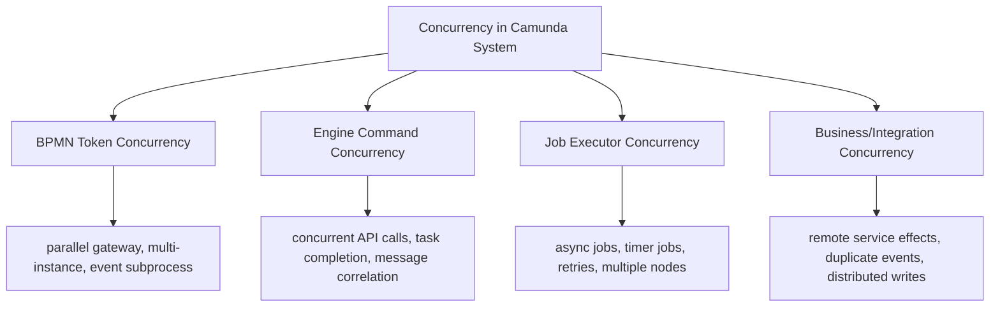

Kesalahan besar: menyelesaikan masalah di layer salah.

| Symptom | Wrong fix | Better thinking |
|---|---|---|
| Parallel join optimistic lock | Add more threads | Add async boundary/retry-safe design |
| Duplicate task completion | Ignore exception | Idempotent command facade |
| External workers update same variable | Increase lock duration | Use local variables + aggregation strategy |
| Message arrives before catch event | Retry correlation randomly | Inbox + subscription readiness design |
| Remote API called twice after retry | Disable retries | Idempotency key/outbox |

---

## 3. Optimistic Locking Mental Model

Camunda uses optimistic locking for internal entity updates. Meaning:

1. two commands can read the same state,
2. both attempt to update/delete,
3. one succeeds,
4. the other observes affected rows = 0 or stale revision,
5. engine throws `OptimisticLockingException`,
6. transaction rolls back.

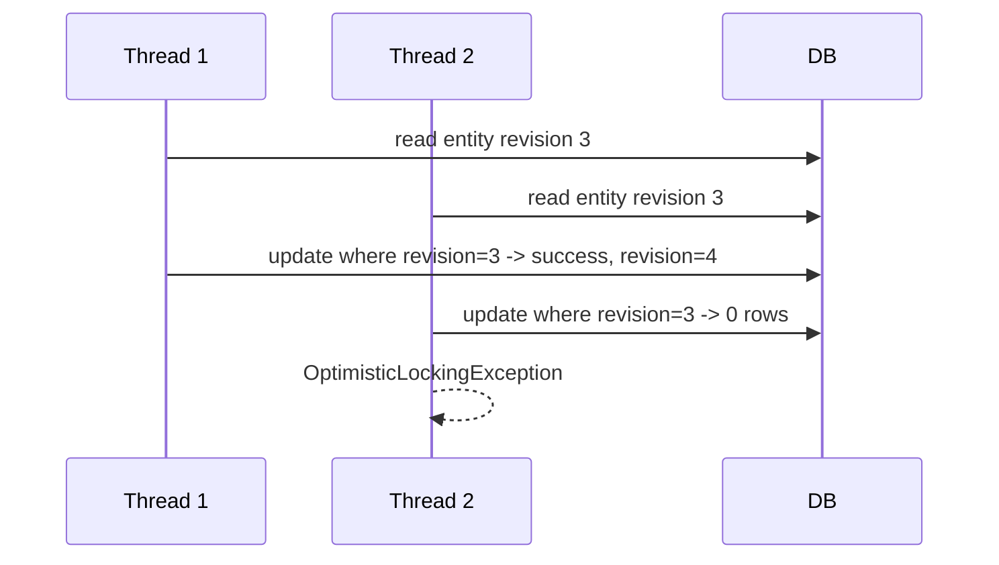

This is not a data corruption bug. It is conflict detection.

Key implication:

> If command is job-executor-triggered, retry is often automatic. If command is external API-triggered, your application boundary must decide retry/idempotency behavior.

---

## 4. Common Optimistic Locking Sites

| Site | Why conflict occurs | Typical fix |
|---|---|---|
| Complete same user task twice | Task can only complete once | Idempotent task command, UI disable, conflict response |
| Parallel gateway join | Two branches arrive concurrently | Async boundary before/after join, retry safe delegates |
| Multi-instance completion | Many instances update shared parent state | Local variables, aggregation boundary |
| External task variable update | Workers update same process variable row | Local variables + IO mapping |
| Message correlation | Multiple messages target same waiting execution | Unique correlation contract/inbox |
| Timer + user action | Timer fires while user completes task | Boundary event design + command conflict handling |
| Process instance modification | Operator changes active execution while jobs run | Suspend/coordinate/runbook |
| Batch operations | Many commands update related entities | Batch window and retry monitoring |

---

## 5. Transaction Boundaries Determine Blast Radius

Camunda executes from one stable state to the next stable state in a transaction. Wait states persist process state and return control. Async continuations add explicit savepoints.

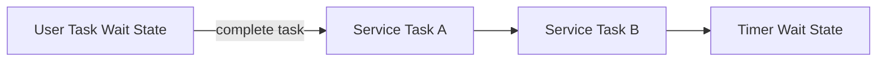

Without async boundaries, completing the user task, executing A, executing B, and reaching timer may be one transaction. If B fails, the user task completion can roll back.

Add `asyncBefore`:

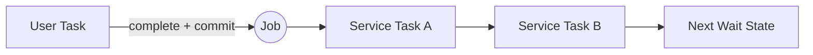

Use async when:

- you need a savepoint before risky work,
- work may fail and should retry independently,
- user action should not roll back because downstream service failed,
- parallel branch join might conflict,
- remote side effect needs idempotent retry boundary,
- long-running service should run outside request thread.

Do not use async everywhere. Every async boundary creates jobs and database load.

---

## 6. Parallel Gateway Is Token Concurrency, Not Magic Thread Parallelism

Parallel gateway forks token paths. Camunda creates concurrent executions for outgoing flows. Whether those branches execute simultaneously depends on wait states, async boundaries, and command execution.

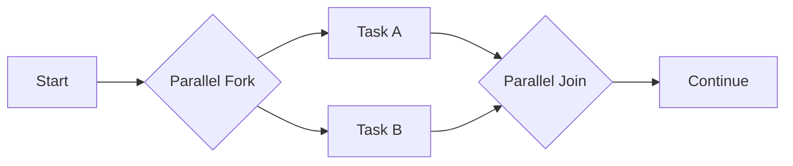

Important semantics:

- fork follows all outgoing flows,
- join waits until enough executions arrive,
- conditions on sequence flows after parallel gateway are ignored,
- parallel gateway does not need to be “balanced” visually,
- Camunda implementation triggers when arrived token count equals incoming sequence flow count; it does not require one token per distinct incoming flow.

The last point is subtle and important. If model structure allows multiple tokens through same incoming path, join behavior may surprise you. Model invariants must ensure token cardinality is what you think it is.

---

## 7. Parallel Gateway Join Conflict

Classic race:

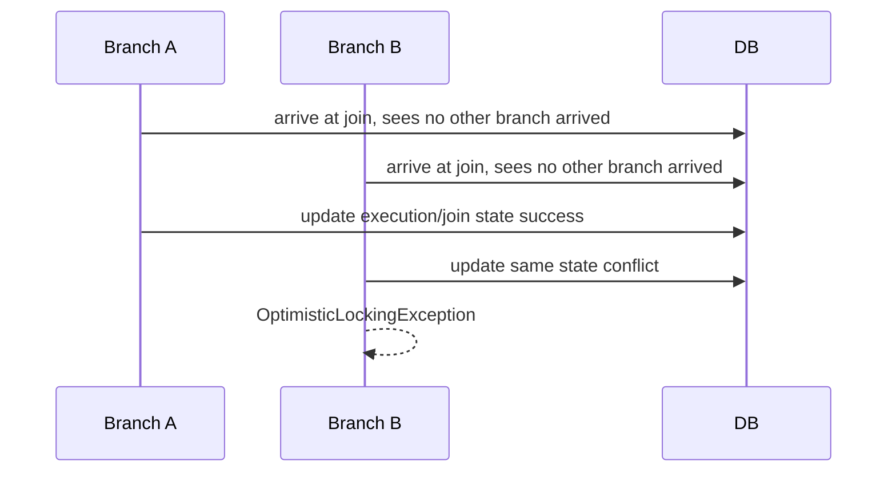

If branches are jobs, job executor retry handles it. If branches are completed by external API/user actions, the caller may receive exception and must retry or treat as conflict.

Pattern:

```text
Before joining parallel async branches:
- make branch side effects idempotent,
- place safe async boundaries after side-effect tasks where appropriate,
- accept optimistic locking as expected conflict,
- ensure retries do not repeat non-transactional effects.
```

Example:

```xml
<serviceTask id="reserveFunds" camunda:delegateExpression="${reserveFundsDelegate}" camunda:asyncBefore="true" camunda:asyncAfter="true" />
<serviceTask id="reserveInventory" camunda:delegateExpression="${reserveInventoryDelegate}" camunda:asyncBefore="true" camunda:asyncAfter="true" />
<parallelGateway id="joinReservations" />
```

The exact placement depends on side effects. Do not blindly copy this. The invariant is: side effects must not be duplicated by retry.

---

## 8. Exclusive Jobs

Exclusive jobs prevent multiple exclusive jobs from the same process instance from being executed at the same time by the job executor, as far as acquisition timing allows. Async continuations and timer events are exclusive by default.

Mental model:

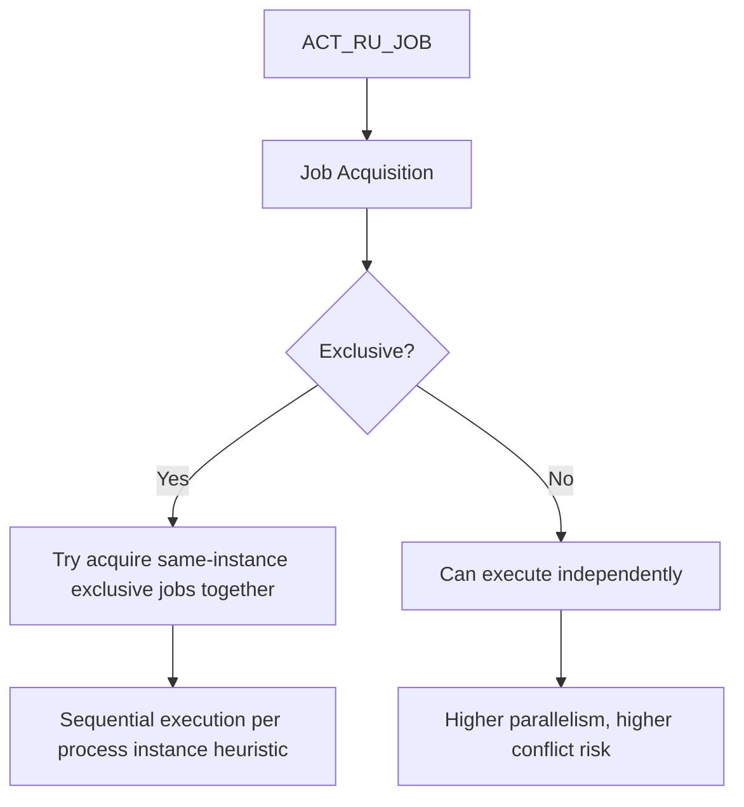

What exclusive jobs are good for:

- reducing optimistic locking in same process instance,
- making async/timer behavior intuitive,
- allowing process instances to run concurrently while serializing jobs inside one instance.

What exclusive jobs are not:

- global lock,
- business lock,
- exact serializability guarantee across all possible late-created jobs,
- substitute for idempotency.

Only set `camunda:exclusive="false"` when you understand shared state, variable writes, join behavior, and side effects.

---

## 9. Job Executor Concurrency vs Business Concurrency

Job executor threads run jobs. That does not mean your business operation is safe to run concurrently.

Example:

```text
Process instance A has jobs J1 and J2.
Process instance B has jobs J3 and J4.
```

With exclusive jobs:

- J1/J2 from A are likely serialized,
- J3/J4 from B are likely serialized,
- A and B can run concurrently.

That is usually desirable: throughput across instances, less conflict within each instance.

But if multiple process instances operate on same domain aggregate, exclusive jobs do not help.

Example:

```text
Case CASE-123 has process instance PI-1 and PI-2 accidentally both active.
Both call approveCase(CASE-123).
```

Exclusive jobs serialize by process instance, not by domain key. You still need domain-level idempotency/locking.

---

## 10. Domain-Level Concurrency Must Be Owned Outside Camunda

Camunda knows process instance IDs. Your domain knows case IDs, account IDs, order IDs, investigation IDs.

If invariant is domain-level, enforce it in domain service.

Example invariant:

```text
A regulatory case can have only one final enforcement decision.
```

Do not rely on BPMN alone. Use domain command handling:

```java
@Transactional
public DecisionResult recordFinalDecision(String caseId, DecisionCommand command) {
  CaseRecord caseRecord = caseRepository.findForUpdateOrOptimistic(caseId);

  if (caseRecord.hasFinalDecision()) {
    return DecisionResult.alreadyRecorded(caseRecord.finalDecisionId());
  }

  Decision decision = caseRecord.recordFinalDecision(command.idempotencyKey(), command.payload());
  caseRepository.save(caseRecord);
  outbox.publish(new FinalDecisionRecorded(caseId, decision.id()));
  return DecisionResult.recorded(decision.id());
}
```

Camunda can orchestrate. Domain service must protect domain invariants.

---

## 11. Idempotency: The Non-Negotiable Rule

Every command crossing a retryable boundary should be idempotent.

Boundaries:

- async job retry,
- external task retry,
- message/event redelivery,
- REST client retry,
- user double submit,
- scheduler retry,
- operator retry.

Idempotency key design:

| Operation | Suggested key |
|---|---|
| Start process | business key + command id |
| Complete task | task id + form submission id |
| Reserve external resource | process instance id + activity id + business key |
| Send notification | notification type + case id + recipient + version |
| Record decision | case id + decision command id |
| Correlate message | external event id + correlation key |

Bad delegate:

```java
paymentClient.charge(card, amount);
execution.setVariable("paid", true);
```

If job retries after remote success but before commit, charge may happen twice.

Better:

```java
String key = execution.getProcessInstanceId() + ":charge:" + execution.getCurrentActivityId();
paymentClient.charge(card, amount, key);
execution.setVariable("paymentCommandKey", key);
```

Even better: outbox/worker pattern when the remote system supports eventual completion.

---

## 12. Non-Transactional Side Effects

Database transaction rollback cannot undo:

- HTTP calls,
- file creation,
- S3 upload,
- email send,
- Kafka publish outside transaction,
- payment charge,
- external approval update.

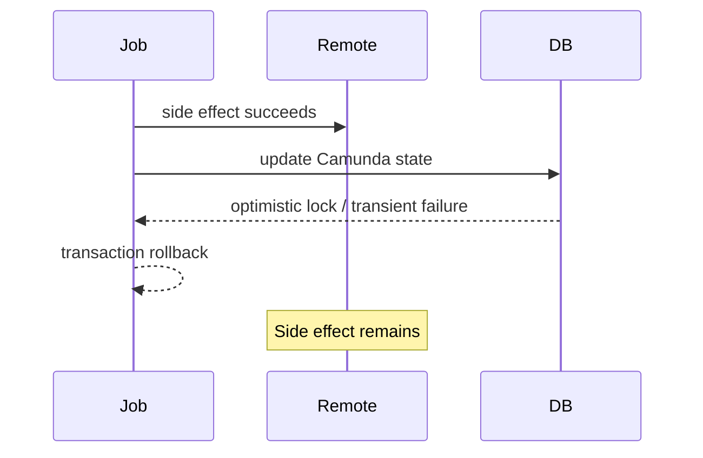

Mitigation:

1. idempotency keys,
2. outbox pattern,
3. command table with unique constraints,
4. remote operation status polling,
5. compensation flow,
6. manual recovery task,
7. explicit business reconciliation.

Never assume Camunda retry is safe unless side effects are safe.

---

## 13. Concurrent User Task Completion

Scenario:

- two browser tabs,
- two operators,
- duplicate submit due to network retry,
- API client timeout then retry.

Engine behavior:

- task completion is a command,
- task can be completed once,
- concurrent completion may throw exception,
- subsequent completion may find task missing.

Facade design:

```java
public CompleteTaskResult completeReviewTask(CompleteReviewCommand command) {
  var submission = submissionRepository.findByIdempotencyKey(command.idempotencyKey());
  if (submission.isPresent()) {
    return submission.get().toResult();
  }

  try {
    taskService.complete(command.taskId(), command.variables());
    submissionRepository.save(Submission.completed(command.idempotencyKey(), command.taskId()));
    return CompleteTaskResult.completed();
  } catch (OptimisticLockingException | NotFoundException e) {
    return resolveTaskCompletionConflict(command);
  }
}
```

The UI should not expose raw engine exceptions as generic failure when the business result may already be completed.

---

## 14. Timer vs User Action Race

Boundary timers commonly race with human completion.

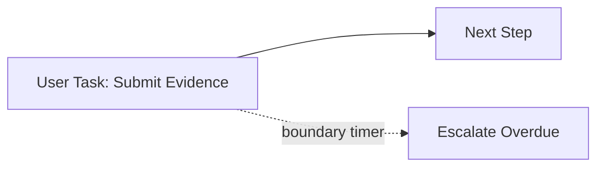

Race:

- user completes task at 10:00:00,
- timer due at 10:00:00,
- job executor fires timer,
- both try to move same execution/task.

Design options:

| Option | When useful |
|---|---|
| Interrupting timer | Task should no longer be completable after timeout |
| Non-interrupting timer | Reminder/escalation while task remains active |
| Domain SLA projection | High-volume SLA monitoring without timer explosion |
| Idempotent escalation | Duplicate escalation harmless |
| Business grace window | Avoid boundary second race |

Make escalation command idempotent:

```text
unique key: caseId + taskDefinitionKey + escalationType + dueAt
```

---

## 15. Message Correlation Race

Message event race has two common forms.

### 15.1 Message Arrives Too Early

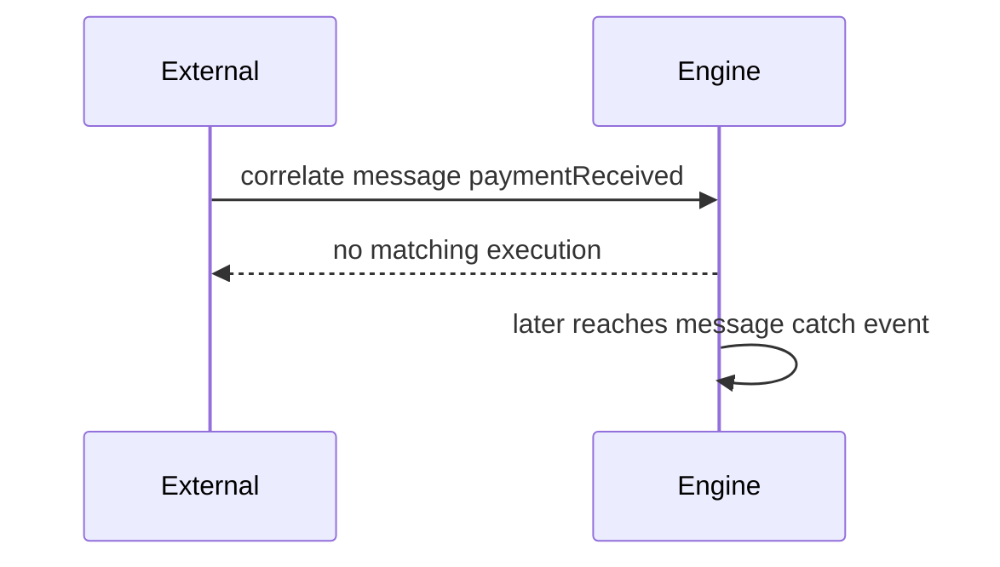

Solutions:

- inbox table stores external event first,
- process polls/consumes from inbox when ready,
- event adapter retries correlation with backoff and idempotency,
- model process so subscription is created before external command is sent,
- use message start event where appropriate.

### 15.2 Duplicate Message Arrives

```text
paymentReceived event delivered twice
```

Solutions:

- external event id uniqueness,
- inbox deduplication,
- correlation only once,
- process variable/domain projection records consumed event,
- second event returns already-consumed result.

Do not solve targeted correlation with signal events. Signal broadcast semantics can wake multiple waiting executions.

---

## 16. External Task Variable Race

External tasks are attractive for isolation, but workers can conflict if they update same process variables.

Bad pattern:

```java
externalTaskService.complete(task, Map.of("status", "APPROVED"));
```

Multiple workers/branches update global variable `status`.

Better:

- use task-local variables,
- use input/output mapping,
- aggregate after join,
- avoid shared mutable global process variable names.

Example naming:

```text
creditCheck.result
sanctionsCheck.result
manualReview.result
```

Aggregation task:

```java
Decision decision = aggregate(
  variable("creditCheck.result"),
  variable("sanctionsCheck.result"),
  variable("manualReview.result")
);
execution.setVariable("caseRoutingDecision", decision.code());
```

In high-concurrency multi-instance, avoid every instance writing the same variable. Use local variables and controlled collection aggregation.

---

## 17. Multi-Instance Concurrency

Multi-instance activity creates multiple activity instances. It can be sequential or parallel.

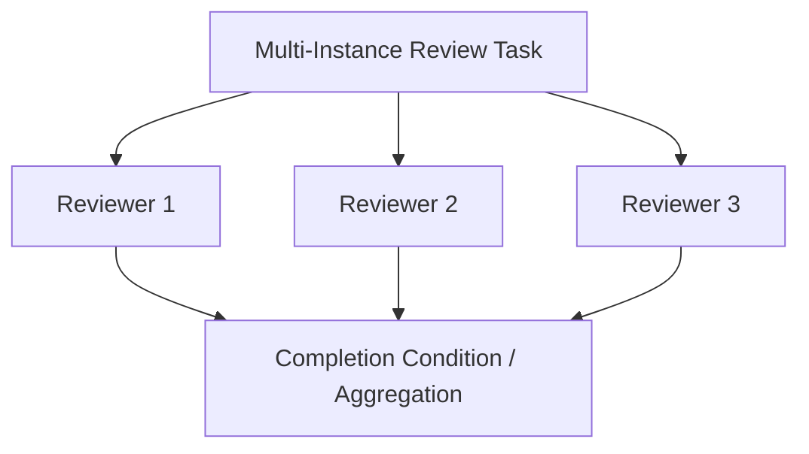

Risks:

- all instances write same variable,
- completion condition reads mutable shared state,
- parallel completions conflict at parent scope,
- one reviewer action races with cancellation/completion condition,
- aggregation is nondeterministic.

Safer pattern:

| Risk | Mitigation |
|---|---|
| Shared variable writes | local variables per instance |
| Non-deterministic aggregation | explicit aggregation task after join |
| Early completion race | idempotent reviewer command |
| Large collection | chunk/batch or externalize worklist |
| Human review audit | store review decision in domain DB |

In regulatory workflows, multi-instance approval needs explicit quorum logic. Do not bury it in collection variable mutations.

---

## 18. Parallelism Decision Matrix

| Need | Use BPMN parallel gateway? | Alternative |
|---|---:|---|
| Two independent human tasks visible at same time | Yes | Separate tasks/projection |
| Two remote calls can run independently | Maybe | External workers / queue |
| Need CPU parallelism | Not primarily | Worker pool outside engine |
| Need wait for all checks | Yes, with aggregation | Event aggregator |
| Need race winner | Event-based gateway | Domain orchestrator |
| Need many items processed | Multi-instance carefully | Batch/worker system |
| Need business concurrent modification protection | No | Domain locking/idempotency |

BPMN parallelism is strongest when it represents business concurrency, not just performance optimization.

---

## 19. Async Boundary Placement Patterns

### 19.1 Save User Action Before Risky Work

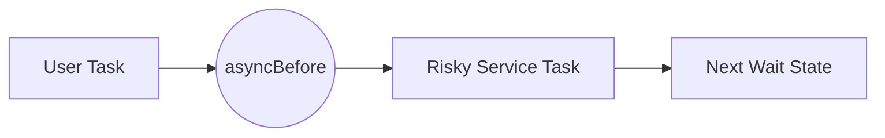

Use when user completion should remain committed even if service fails.

### 19.2 Retry Service Task Without Repeating Previous Work

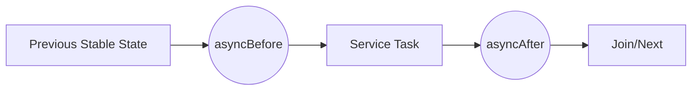

Use when service has side effects and join might conflict; ensure side effect idempotency.

### 19.3 Avoid Join Conflict Repeating Side Effects

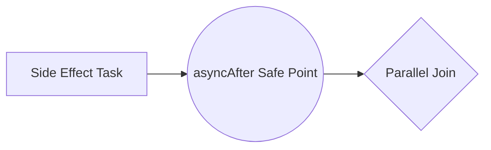

If join throws optimistic lock, retry starts from after side effect, not before it.

### 19.4 Start Process Asynchronously

Use async start when:

- start API should persist instance quickly,
- first delegate may not be available on starting node,
- first path is expensive/risky,
- startup command should not wait for full execution.

---

## 20. Message Correlation Contract

A robust correlation contract defines:

| Field | Purpose |
|---|---|
| message name | BPMN subscription target |
| business key | domain identity |
| correlation variables | disambiguation |
| external event id | deduplication |
| expected process state | prevent wrong-stage correlation |
| payload schema version | evolution |
| retry policy | late subscription handling |
| response semantics | correlated / duplicate / too early / invalid |

Facade pseudo-code:

```java
public CorrelationResult handleExternalEvent(ExternalEvent event) {
  if (!inbox.insertIfAbsent(event.id(), event.payload())) {
    return CorrelationResult.duplicate(event.id());
  }

  try {
    runtimeService.createMessageCorrelation(event.messageName())
        .processInstanceBusinessKey(event.businessKey())
        .setVariable("lastEventId", event.id())
        .correlateWithResult();
    inbox.markCorrelated(event.id());
    return CorrelationResult.correlated();
  } catch (MismatchingMessageCorrelationException e) {
    inbox.markPending(event.id());
    return CorrelationResult.pendingSubscription();
  }
}
```

A pending event is not necessarily an error. It may be an ordering reality.

---

## 21. Testing Concurrent Behavior

Do not rely only on sequential happy-path tests.

Test categories:

| Test | What to prove |
|---|---|
| Duplicate task complete | Second request is safe |
| Parallel branch join | Optimistic lock retry does not duplicate side effects |
| Timer/user race | Escalation and completion produce valid state |
| Duplicate message | Event consumed once |
| Early message | Event eventually correlates or is rejected explicitly |
| External task failure | Retry safe and lock duration appropriate |
| Multi-instance completion | Aggregation deterministic |
| Operator modification with jobs | Runbook avoids corrupt state |

Concurrent test sketch:

```java
@Test
void duplicateCompletionIsIdempotent() throws Exception {
  String taskId = findReviewTask(caseId);
  String idempotencyKey = UUID.randomUUID().toString();

  ExecutorService pool = Executors.newFixedThreadPool(2);
  var f1 = pool.submit(() -> facade.completeReview(taskId, idempotencyKey, payload));
  var f2 = pool.submit(() -> facade.completeReview(taskId, idempotencyKey, payload));

  var r1 = f1.get();
  var r2 = f2.get();

  assertThat(Set.of(r1.status(), r2.status()))
      .containsOnly(CompletionStatus.COMPLETED);
}
```

The exact API depends on your facade. The invariant is duplicate-safe behavior.

---

## 22. Operator Actions and Concurrency

Production operators can:

- retry jobs,
- modify process instance,
- suspend/resume instance,
- correlate message manually,
- delete/restart instance,
- change variables.

These actions can race with job executor or user actions.

Runbook rule:

```text
For invasive repair:
1. suspend process instance or definition if needed,
2. inspect active jobs/tasks/subscriptions,
3. resolve domain state first,
4. modify process state,
5. resume/retry deliberately,
6. record operator rationale.
```

Do not modify active execution while jobs are freely running unless the operation is designed for that.

---

## 23. Case Study: Parallel Regulatory Checks

Scenario:

- A regulatory case requires three checks:
  - sanctions check,
  - risk scoring,
  - evidence completeness check.
- Checks can run in parallel.
- Each check calls a different external system.
- Result is aggregated into route decision.

Bad model:

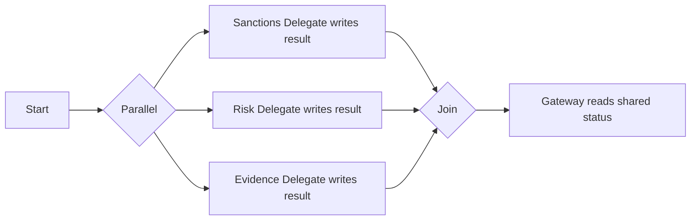

Problems:

- delegates may write shared variable,
- side effects may repeat on retry,
- join conflict may retry side-effect task if no safe boundary,
- gateway hides decision logic,
- external failures create inconsistent partial state.

Better model:

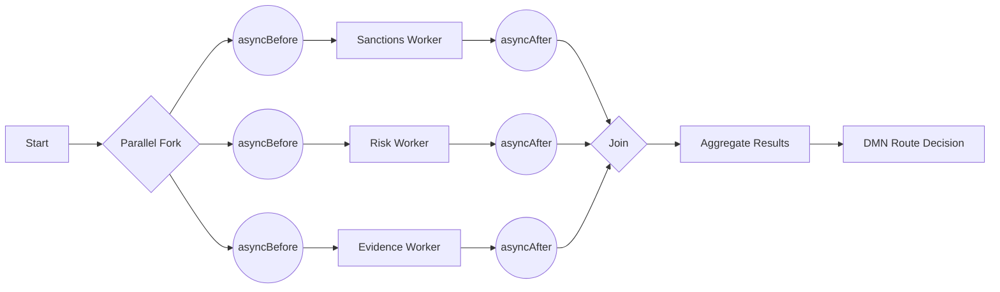

Contracts:

| Check | Idempotency key | Result variable |
|---|---|---|
| Sanctions | `caseId + sanctions + version` | `checks.sanctions.result` |
| Risk | `caseId + risk + version` | `checks.risk.result` |
| Evidence | `caseId + evidence + version` | `checks.evidence.result` |

Aggregation is explicit. DMN decides route. Each external call is retry-safe.

---

## 24. Anti-Patterns

### 24.1 Parallel Gateway for Visual Layout

Using parallel gateway just to make diagram look organized creates real concurrent executions.

Fix: use subprocess/lanes/layout, not gateway, if there is no business concurrency.

### 24.2 Shared Variable from Parallel Branches

```text
branch A sets status = PASSED
branch B sets status = FAILED
```

Nondeterministic and conflict-prone.

Fix: branch-specific variables + aggregation.

### 24.3 Disabling Exclusive Jobs for Speed

Non-exclusive jobs may increase within-instance parallelism but also conflict and side-effect risk.

Fix: measure actual bottleneck; keep exclusive by default unless expert-reviewed.

### 24.4 Catching OptimisticLockingException and Ignoring It

If you ignore conflict without resolving business result, you can lie to caller.

Fix: retry, resolve current state, or return conflict/already-completed semantics.

### 24.5 Remote Calls Without Idempotency

Retries duplicate external effects.

Fix: idempotency key, outbox, remote status query, compensation.

### 24.6 Message Correlation Without Inbox

Lost/early/duplicate messages become operational mysteries.

Fix: event inbox with dedupe and pending state.

### 24.7 Domain Invariant Enforced Only by BPMN Shape

BPMN shape can reduce paths but cannot protect all distributed concurrent modifications.

Fix: domain service owns invariant.

---

## 25. Design Checklist

Before approving a concurrent Camunda model:

- [ ] Which paths can execute concurrently?
- [ ] Which variables are written by each path?
- [ ] Are shared variables avoided or aggregated explicitly?
- [ ] Are service side effects idempotent?
- [ ] Are async boundaries placed before/after risky work intentionally?
- [ ] Are parallel joins retry-safe?
- [ ] Are exclusive jobs left default unless reviewed?
- [ ] Are domain invariants enforced in domain service?
- [ ] Are duplicate user/API commands safe?
- [ ] Are message events deduplicated?
- [ ] Are early messages handled?
- [ ] Are timer/user races modeled?
- [ ] Are multi-instance results deterministic?
- [ ] Are operator repair actions coordinated with running jobs?
- [ ] Are concurrency tests included?

---

## 26. Debugging Checklist

When you see `OptimisticLockingException`:

1. Identify whether command came from job executor or external API.
2. Identify entity/action: task complete, join, variable update, message correlation, modification.
3. Check whether retry is automatic.
4. Check if non-transactional side effects occurred before rollback.
5. Check model for parallel gateway/multi-instance/shared variable.
6. Check external duplicate requests.
7. Check if async boundary can reduce blast radius.
8. Check if idempotency key exists.
9. Check whether exception is expected conflict or symptom of wrong model.
10. Write regression test for the race.

Important distinction:

```text
Expected conflict + safe retry = normal concurrency.
Conflict + duplicated side effect = design bug.
Conflict + user sees random failure = boundary bug.
Conflict + process stuck = recovery/runbook gap.
```

---

## 27. Key Takeaways

1. Camunda concurrency happens across BPMN tokens, engine commands, job executor threads, and external systems.
2. Optimistic locking is conflict detection, not necessarily data corruption.
3. Job-executor-triggered optimistic locking can be retried automatically; external API-triggered conflict must be handled by your boundary.
4. Parallel gateway creates concurrent executions; it is not just diagram layout.
5. Exclusive jobs reduce same-instance conflicts but are not global/domain locks.
6. Domain invariants belong in domain services, not only BPMN shape.
7. Every retryable boundary needs idempotency.
8. Non-transactional side effects are not rolled back with Camunda transaction rollback.
9. External tasks and multi-instance activities require careful variable scoping.
10. Race conditions must be tested intentionally.

---

## 28. What Comes Next

Part 025 will focus on message correlation and event-driven integration in depth: business keys, correlation keys, message start/catch events, duplicate and late events, outbox/inbox, targeted vs broadcast semantics, and designing event ingestion adapters that do not corrupt process state.
