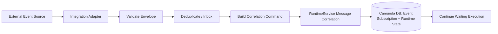
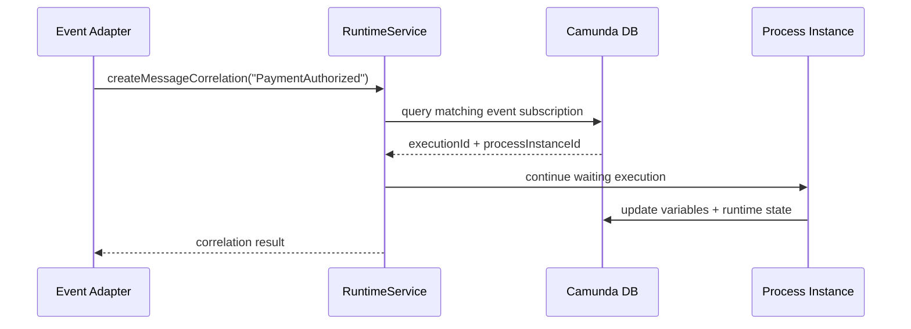
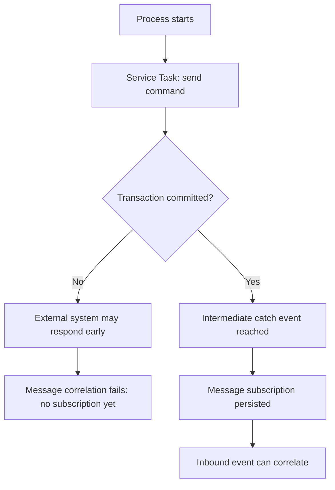
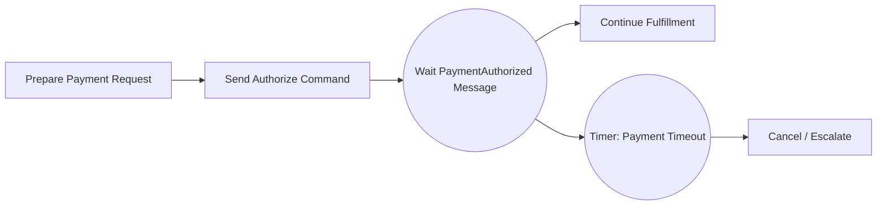
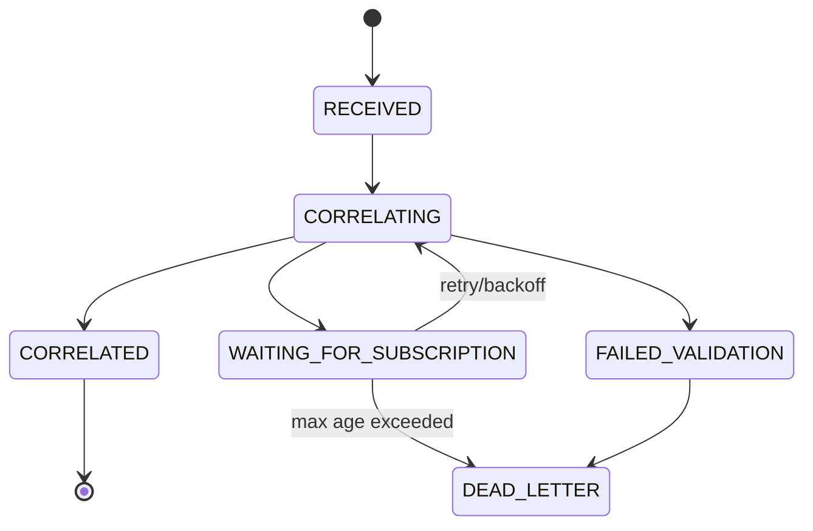
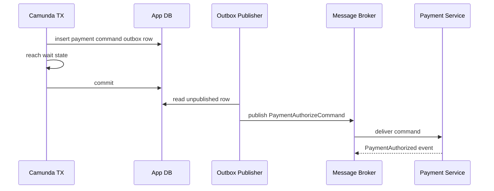
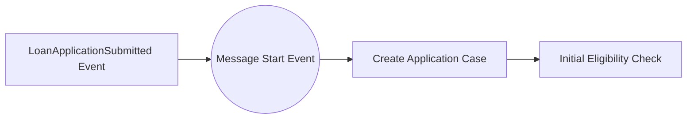
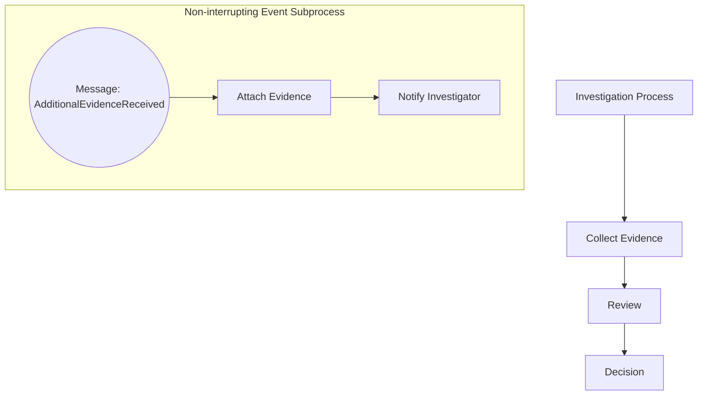
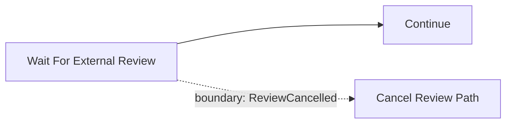
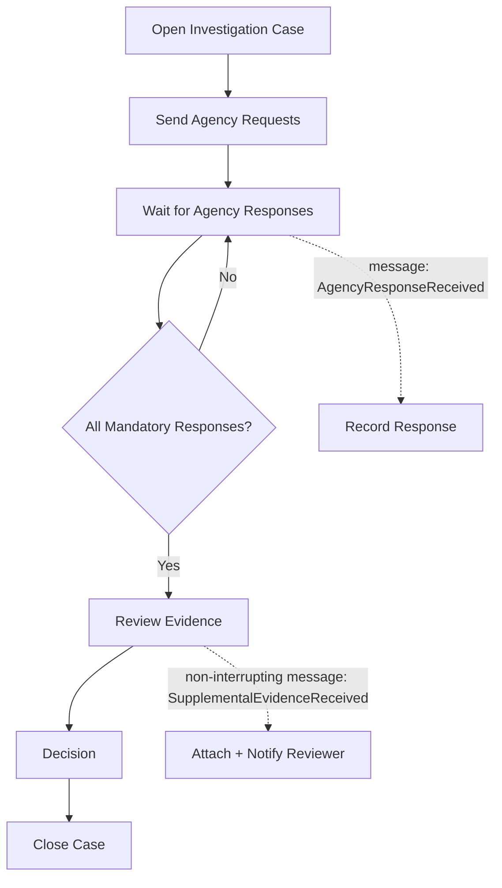

# Part 025 — Message Correlation and Event-Driven Integration

> Target skill: mampu mendesain integrasi event-driven dengan Camunda 7 tanpa kehilangan determinism, tanpa salah pakai signal, tanpa race condition antara event masuk dan subscription BPMN, dan tanpa membuat engine menjadi message broker umum.

Dalam sistem nyata, proses tidak hidup sendirian. Ia menunggu:

- pembayaran dikonfirmasi,
- dokumen diterima,
- fraud check selesai,
- reviewer mengirim keputusan,
- service eksternal mengirim callback,
- status hukum berubah,
- case lain memicu dampak lintas entitas.

Di Camunda 7, banyak integrasi seperti ini dimodelkan dengan **message event** dan dieksekusi lewat **message correlation**. Tetapi ini area yang sering terlihat sederhana dan justru berbahaya. Satu korelasi salah dapat melanjutkan instance yang salah, membuat duplicate continuation, atau menyebabkan event hilang karena tiba sebelum process instance membuka subscription.

Referensi resmi dan pendukung:

- Message Events: https://docs.camunda.org/manual/7.24/reference/bpmn20/events/message-events/
- Signal Events: https://docs.camunda.org/manual/7.24/reference/bpmn20/events/signal-events/
- RuntimeService / Process Engine API: https://docs.camunda.org/manual/7.24/user-guide/process-engine/process-engine-api/
- REST Message API: https://docs.camunda.org/manual/7.24/reference/rest/message/
- Transactions in Processes: https://docs.camunda.org/manual/7.24/user-guide/process-engine/transactions-in-processes/
- Process Variables: https://docs.camunda.org/manual/7.24/user-guide/process-engine/variables/

---

## 1. Kaufman Deconstruction

Skill ini perlu dipotong menjadi sub-skill kecil.

| Sub-skill | Pertanyaan utama | Output praktis |
|---|---|---|
| Message semantics | Event ini harus diterima satu instance atau banyak instance? | Pilihan message vs signal vs external task |
| Subscription lifecycle | Kapan process instance benar-benar menunggu message? | Desain anti-lost-event |
| Correlation contract | Key apa yang cukup unik dan stabil? | Message envelope dan business key |
| Idempotency | Apa yang terjadi kalau event sama datang dua kali? | Inbox/deduplication |
| Ordering | Apa yang terjadi kalau event datang lebih awal/terlambat? | State-aware ingestion |
| Transaction boundary | Kapan subscription commit ke DB? | Penempatan async/wait state |
| Operational observability | Bagaimana tahu event gagal dikorelasikan? | Correlation attempt log |
| Security | Siapa boleh correlate message? | Workflow facade, bukan raw engine API |
| Testing | Bagaimana membuktikan event race aman? | Integration test dengan duplicate/late/out-of-order event |

Kaufman-style simplification:

> Treat every inbound event as an external command to mutate a durable workflow state. Before it touches Camunda, it must pass identity, idempotency, authorization, schema validation, and correlation validation.

---

## 2. Core Mental Model

Camunda tidak “mendengarkan Kafka topic” secara native. Camunda menyimpan **event subscriptions** di database. Saat aplikasi memanggil API korelasi, engine mencari satu atau lebih matching subscription/process definition, lalu melanjutkan execution atau memulai process instance.



Mental model yang benar:

- **Message event** adalah targeted delivery ke recipient tertentu.
- **Signal event** adalah broadcast ke semua active handlers.
- **Message correlation** adalah command terhadap process engine, bukan passive subscription ke infrastructure broker.
- **Business key** bukan magic unique constraint; ia harus didesain, dijaga, dan dipakai konsisten.
- **Correlation keys** biasanya process variables yang dicocokkan saat correlation.
- **Event source** seperti Kafka, RabbitMQ, webhooks, file drop, atau REST callback tetap perlu adapter.

---

## 3. Message vs Signal vs External Task

Keputusan pertama: apakah event ditujukan ke satu process instance, banyak process instance, atau worker eksternal?

| Mekanisme | Semantik | Gunakan ketika | Hindari ketika |
|---|---|---|---|
| Message | Directed to a single recipient | Callback pembayaran untuk order tertentu, document received untuk case tertentu | Perlu broadcast ke banyak listener |
| Signal | Broadcast/global scope | Semua process yang peduli terhadap global policy change | Perlu target satu instance |
| External task | Pull-based work item | Engine memerintahkan worker melakukan pekerjaan | Worker hanya mengirim event spontan |
| User task | Human completion command | Manusia menyelesaikan tanggung jawab eksplisit | Event system-to-system |
| Timer | Time-triggered continuation | Timeout, SLA, reminder | External domain event |

Camunda docs menjelaskan message event sebagai event dengan named message; berbeda dengan signal, message selalu diarahkan ke satu recipient. Signal event sebaliknya memiliki global scope/broadcast semantics dan dikirim ke semua active handlers. Ini bukan detail kecil; ini menentukan correctness model.

### Rule of thumb

- Gunakan **message** untuk: “lanjutkan case/order/request X karena event Y untuk X sudah terjadi.”
- Gunakan **signal** untuk: “beri tahu semua process yang sedang mendengarkan bahwa kondisi global Y terjadi.”
- Gunakan **external task** untuk: “engine meminta worker melakukan unit kerja Y.”
- Jangan gunakan signal sebagai shortcut untuk targeted message.

---

## 4. Message Correlation Contract

Sebuah message correlation production-grade minimal memiliki envelope seperti ini:

```json
{
  "messageId": "evt-2026-06-27-000001",
  "messageName": "PaymentAuthorized",
  "occurredAt": "2026-06-27T13:10:00Z",
  "source": "payment-service",
  "businessKey": "ORDER-2026-000123",
  "correlationKeys": {
    "paymentId": "PAY-9981",
    "orderId": "ORDER-2026-000123"
  },
  "schemaVersion": 3,
  "payload": {
    "authorizedAmount": "1200000.00",
    "currency": "IDR",
    "authorizationCode": "AUTH-7832"
  }
}
```

Contract tersebut harus menjawab:

| Field | Tujuan | Failure jika hilang |
|---|---|---|
| `messageId` | Deduplication | Duplicate event melanjutkan proses dua kali |
| `messageName` | Pilih BPMN subscription | Event salah masuk ke waiting state salah |
| `businessKey` | Stable process identity | Sulit query, audit, dan support |
| `correlationKeys` | Match lebih spesifik | Ambiguous correlation |
| `schemaVersion` | Evolusi payload | Deserialization/semantic drift |
| `occurredAt` | Ordering dan audit | Tidak bisa bedakan late event |
| `source` | Trust boundary | Sulit forensic saat incident |

Jangan biarkan event masuk ke `RuntimeService` tanpa envelope yang konsisten. Engine API bukan integration contract publik; ia adalah internal persistence/runtime API.

---

## 5. How Correlation Works in Camunda 7

Camunda `RuntimeService` menyediakan fluent API untuk message correlation.

```java
MessageCorrelationResult result = runtimeService
    .createMessageCorrelation("PaymentAuthorized")
    .processInstanceBusinessKey("ORDER-2026-000123")
    .setVariable("paymentStatus", "AUTHORIZED")
    .setVariable("authorizationCode", "AUTH-7832")
    .correlateWithResult();
```

Secara konsep, engine mencari matching entity:

1. process definition yang punya message start event dengan message name tersebut, atau
2. execution/process instance yang sedang menunggu message name tersebut dan cocok dengan business key/correlation keys.

Jika correlation dimaksudkan untuk existing process instance, pastikan process instance sudah mencapai wait state yang membuka subscription.



---

## 6. Business Key Strategy

Business key adalah identifier domain yang menempel ke process instance. Ia harus stabil, meaning-rich, dan supportable.

Contoh baik:

| Domain | Business key |
|---|---|
| Order orchestration | `ORDER-2026-000123` |
| Enforcement case | `CASE-2026-01711` |
| Customer onboarding | `ONB-CUST-88210` |
| Dispute | `DISPUTE-2026-000044` |
| License application | `APP-LIC-2026-00451` |

Contoh buruk:

| Bad key | Kenapa buruk |
|---|---|
| Random UUID tanpa mapping support | Sulit operasional dan audit |
| Database primary key internal | Bocor coupling persistence |
| Mutable status + id | Key berubah saat lifecycle berubah |
| Process instance id | Bukan domain identity dan bisa menyulitkan restart/migration |
| User email | Bisa berubah dan punya privacy risk |

### Business key bukan unique constraint universal

Camunda tidak otomatis menjadikan business key sebagai unique constraint untuk semua process definition/tenant. Anda tetap harus menjaga uniqueness di application boundary jika itu invariant bisnis.

Pola yang aman:

```text
unique(process_definition_family, tenant_id, business_key)
```

Atau di application table:

```sql
create table workflow_instance_registry (
  workflow_family varchar(100) not null,
  tenant_id varchar(100) not null,
  business_key varchar(150) not null,
  process_instance_id varchar(64) not null,
  process_definition_key varchar(100) not null,
  started_at timestamp not null,
  ended_at timestamp null,
  primary key (workflow_family, tenant_id, business_key)
);
```

---

## 7. Correlation Keys

Business key sering cukup, tetapi tidak selalu.

Misal satu order punya banyak payment attempts:

```text
businessKey = ORDER-123
paymentId = PAY-1
paymentId = PAY-2
```

Jika proses menunggu authorization untuk payment attempt tertentu, correlation harus memakai `paymentId`.

```java
runtimeService
    .createMessageCorrelation("PaymentAuthorized")
    .processInstanceBusinessKey("ORDER-123")
    .processInstanceVariableEquals("paymentId", "PAY-2")
    .setVariable("paymentStatus", "AUTHORIZED")
    .correlateWithResult();
```

Desain correlation key harus memenuhi:

| Syarat | Alasan |
|---|---|
| Stable | Tidak berubah saat event datang |
| Unique dalam scope yang tepat | Menghindari ambiguous correlation |
| Tersimpan sebelum wait state | Agar subscription bisa dicari |
| Tidak sensitive bila masuk log | Correlation sering muncul di observability |
| Diindeks di read model jika perlu | Correlation attempt debugging |

### Jangan pakai payload sebagai correlation strategy

Payload bisa berubah antar versi. Correlation key harus bagian dari envelope, bukan hasil parsing detail payload yang volatile.

---

## 8. Message Subscription Lifecycle

Lost event sering terjadi karena salah paham lifecycle.



Subscription untuk intermediate message catch event baru aman setelah process execution mencapai wait state dan transaction commit.

Problem klasik:

1. service task memanggil external service secara synchronous,
2. external service sangat cepat mengirim callback,
3. process belum commit sampai intermediate catch event,
4. callback mencoba correlate message,
5. engine belum punya subscription,
6. event dianggap gagal atau hilang.

Solusi yang lebih aman:

- gunakan outbox untuk mengirim command setelah commit,
- letakkan async boundary sebelum external side effect,
- gunakan inbox untuk menahan unmatched event,
- buat event adapter retry correlation,
- modelkan wait state sebelum command keluar bila domain mengizinkan,
- gunakan external task pattern agar worker side effect terjadi setelah job commit.

---

## 9. Pattern: Send Command, Then Wait for Reply

Ini pattern paling umum.



### Model-level invariant

```text
A process instance may continue past Wait PaymentAuthorized only if:
1. the event source is trusted,
2. event messageId has not been processed before,
3. event businessKey matches this process instance,
4. event paymentId matches the active payment attempt,
5. event status is valid for current process state.
```

### Java facade

```java
@Service
public class PaymentEventWorkflowFacade {

    private final RuntimeService runtimeService;
    private final ProcessedMessageRepository processedMessages;

    @Transactional
    public CorrelationOutcome onPaymentAuthorized(PaymentAuthorizedEvent event) {
        if (processedMessages.existsByMessageId(event.messageId())) {
            return CorrelationOutcome.duplicate(event.messageId());
        }

        processedMessages.insertReceived(event.messageId(), event.businessKey(), event.occurredAt());

        MessageCorrelationResult result = runtimeService
            .createMessageCorrelation("PaymentAuthorized")
            .processInstanceBusinessKey(event.businessKey())
            .processInstanceVariableEquals("paymentId", event.paymentId())
            .setVariable("paymentStatus", "AUTHORIZED")
            .setVariable("paymentAuthorizedAt", event.occurredAt().toString())
            .setVariable("authorizationCode", event.authorizationCode())
            .correlateWithResult();

        processedMessages.markCorrelated(event.messageId(), result.getProcessInstance().getId());
        return CorrelationOutcome.correlated(result.getProcessInstance().getId());
    }
}
```

Catatan penting:

- `processedMessages.insertReceived` harus punya unique constraint atas `messageId`.
- Jangan hanya mengandalkan Camunda variable untuk deduplication.
- Jika correlation gagal karena belum ada subscription, jangan otomatis discard event.

---

## 10. Pattern: Inbox Before Correlation

Inbox membuat event durable sebelum dicoba ke engine.

```sql
create table workflow_inbox_message (
  message_id varchar(150) primary key,
  message_name varchar(150) not null,
  business_key varchar(150) not null,
  correlation_key_hash varchar(128) not null,
  payload_json jsonb not null,
  occurred_at timestamp not null,
  received_at timestamp not null,
  status varchar(30) not null,
  correlation_attempts int not null default 0,
  last_error text null,
  correlated_process_instance_id varchar(64) null,
  correlated_at timestamp null
);
```

Lifecycle:



Kapan inbox wajib?

| Kondisi | Wajib? |
|---|---:|
| Event dari broker bisa redeliver | Ya |
| Callback bisa datang sebelum process wait state | Ya |
| Event punya nilai audit/regulatory | Ya |
| Correlation key bisa ambiguous | Ya |
| Simple admin-only manual trigger | Tidak selalu |

Inbox adalah salah satu mekanisme terpenting untuk workflow reliability.

---

## 11. Pattern: Outbox for Command Emission

Jika Camunda delegate mengirim command ke external system, jangan lakukan remote side effect yang tidak idempotent di dalam transaction engine tanpa strategi.

Lebih aman:



Keuntungan:

- command tidak keluar jika transaction rollback,
- wait state dan command intent commit bersama,
- publisher bisa retry secara aman,
- duplicate publish bisa diatasi dengan command idempotency key,
- event callback bisa diproses oleh inbox.

Minimal outbox row:

```sql
create table workflow_outbox_message (
  id uuid primary key,
  aggregate_type varchar(100) not null,
  aggregate_id varchar(150) not null,
  message_type varchar(150) not null,
  payload_json jsonb not null,
  created_at timestamp not null,
  published_at timestamp null,
  publish_attempts int not null default 0
);
```

---

## 12. Correlation Failure Taxonomy

Jangan perlakukan semua correlation failure sama.

| Failure | Kemungkinan penyebab | Respon yang tepat |
|---|---|---|
| No matching subscription | Event terlalu awal, salah key, instance sudah selesai | Retry terbatas + dead-letter |
| Multiple matching subscriptions | Correlation key tidak unik | Stop, investigate, jangan correlateAll sembarangan |
| Process definition match unexpected | Message start event masih aktif | Tambah processDefinitionKey/tenant boundary |
| Authorization failed | Source tidak berhak | Reject + security audit |
| Variable serialization error | Payload/type salah | Dead-letter + schema fix |
| Optimistic locking | Concurrent continuation | Retry command jika aman |
| Duplicate event | Redelivery/event replay | Return duplicate success |
| Late event | Timer/cancel already won race | Mark stale + audit, jangan lanjutkan proses lama |

### No matching subscription bukan selalu error fatal

No match bisa valid jika:

- process belum mencapai wait state,
- event sudah diproses sebelumnya,
- event datang setelah process timeout/cancel,
- event untuk versi process lama,
- event untuk tenant berbeda.

Karena itu adapter butuh state-aware handling, bukan sekadar `try/catch` lalu log error.

---

## 13. Early, Late, Duplicate, and Out-of-Order Events

Production event stream tidak rapi.

### Early event

Event datang sebelum subscription tersedia.

Solusi:

- inbox + retry,
- outbox command emission,
- async boundary sebelum side effect,
- event adapter menunggu registry process instance.

### Late event

Event datang setelah proses timeout/cancel/compensate.

Solusi:

- state-aware inbox,
- mark `STALE`,
- optional compensating event,
- audit note,
- never blindly restart continuation.

### Duplicate event

Event sama datang lagi.

Solusi:

- unique `message_id`,
- idempotent handler,
- return existing correlation outcome.

### Out-of-order event

`PaymentCaptured` datang sebelum `PaymentAuthorized`.

Solusi:

- event semantic validator,
- domain state machine di adapter/read model,
- buffer event sampai predecessor tersedia jika domain mengizinkan,
- dead-letter jika invalid.

---

## 14. Pattern: State-Aware Correlation Adapter

Jangan korelasikan event hanya berdasarkan key. Cek domain state.

```java
@Transactional
public CorrelationOutcome correlate(InboundWorkflowEvent event) {
    InboxMessage inbox = inboxRepository.receiveOrFind(event);
    if (inbox.isAlreadyCorrelated()) {
        return CorrelationOutcome.duplicateSuccess(inbox.getProcessInstanceId());
    }

    WorkflowInstanceRecord instance = registry.findByBusinessKey(event.businessKey())
        .orElseThrow(() -> new UnknownWorkflowBusinessKey(event.businessKey()));

    if (instance.isEnded()) {
        inbox.markStale("Process instance already ended");
        return CorrelationOutcome.stale();
    }

    if (!transitionPolicy.canAccept(instance.currentBusinessState(), event.messageName())) {
        inbox.markRejected("Invalid event for current state");
        return CorrelationOutcome.rejected();
    }

    try {
        MessageCorrelationResult result = runtimeService
            .createMessageCorrelation(event.messageName())
            .processInstanceBusinessKey(event.businessKey())
            .setVariables(event.toCamundaVariables())
            .correlateWithResult();

        inbox.markCorrelated(result.getProcessInstance().getId());
        return CorrelationOutcome.correlated(result.getProcessInstance().getId());
    } catch (MismatchingMessageCorrelationException ex) {
        inbox.markWaitingForSubscription(ex.getMessage());
        return CorrelationOutcome.retryLater();
    }
}
```

The key idea: Camunda is not the only state boundary. The adapter can enforce domain invariants before engine mutation.

---

## 15. Message Start Event Pattern

Message start event memulai process instance dari event.



Gunakan untuk:

- event eksternal memang merupakan trigger lifecycle baru,
- event idempotency bisa dijaga sebelum process start,
- business key jelas dari event,
- process definition selection controlled.

Hati-hati:

- duplicate event bisa memulai duplicate instance jika tidak ada guard,
- message start event subscriptions mengikuti deployment/versioning rules,
- process key dan message name harus version-aware,
- jangan expose public endpoint langsung ke engine REST.

Facade yang lebih aman:

```java
@Transactional
public StartWorkflowOutcome onApplicationSubmitted(ApplicationSubmitted event) {
    if (workflowRegistry.exists("loan-application", event.applicationId())) {
        return StartWorkflowOutcome.duplicate(event.applicationId());
    }

    ProcessInstance pi = runtimeService
        .createMessageCorrelation("LoanApplicationSubmitted")
        .processInstanceBusinessKey(event.applicationId())
        .setVariables(Map.of(
            "applicationId", event.applicationId(),
            "customerId", event.customerId(),
            "submittedAt", event.submittedAt().toString()))
        .correlateStartMessage();

    workflowRegistry.register("loan-application", event.applicationId(), pi.getId());
    return StartWorkflowOutcome.started(pi.getId());
}
```

---

## 16. Event Subprocess for Asynchronous Updates

Kadang process perlu menerima event sambil berada di beberapa state.

Contoh: enforcement case bisa menerima `AdditionalEvidenceReceived` kapan saja selama investigation belum closed.



Gunakan event subprocess jika:

- event bisa datang di banyak activity dalam scope,
- handling event tidak selalu memindahkan main flow,
- event merupakan side update terhadap case/process,
- perlu interrupting cancellation/update di scope tertentu.

Jangan pakai event subprocess untuk semua hal. Jika setiap event bisa terjadi kapan saja, mungkin proses Anda terlalu procedural dan case state perlu dipisahkan.

---

## 17. Message Boundary Event for Targeted Interruptions

Message boundary event cocok untuk cancellation/update yang menargetkan activity tertentu.



Use cases:

- external appointment canceled while waiting,
- document request withdrawn,
- payment attempt canceled,
- investigator reassigned while task active,
- regulator closes case due to jurisdiction change.

Pilih interrupting/non-interrupting berdasarkan invariant:

| Pertanyaan | Interrupting | Non-interrupting |
|---|---|---|
| Apakah activity utama harus dihentikan? | Ya | Tidak |
| Apakah event hanya menambahkan informasi? | Tidak | Ya |
| Apakah continuation ganda aman? | Tidak | Ya, jika modeled |

---

## 18. Avoiding Signal Misuse

Signal tampak mudah karena tidak perlu correlation key. Itu justru bahaya.

Anti-pattern:

```text
PaymentAuthorized thrown as signal "payment-authorized"
```

Jika ada 10.000 order yang sedang menunggu signal itu, semua bisa terpicu. Walaupun Anda membuat signal name dinamis seperti `payment-authorized-${businessKey}`, Anda masih membangun targeted delivery di atas primitive broadcast. Ini bisa dipakai sangat hati-hati untuk intra-process branch interruption, tetapi bukan pattern utama integration.

Gunakan signal untuk:

- policy/global event,
- process-wide broadcast yang memang diinginkan,
- internal branch coordination dengan naming disiplin,
- operational broadcast yang sangat terkontrol.

Gunakan message untuk:

- callback satu order,
- status satu document,
- decision satu case,
- result satu request,
- cancellation satu workflow.

---

## 19. REST Message Correlation Boundary

Camunda REST API menyediakan message delivery. Tetapi raw REST API tidak sama dengan public domain API.

Bad boundary:

```text
External service -> Camunda REST /message directly
```

Problems:

- external service perlu tahu message name internal,
- authorization terlalu luas,
- tidak ada domain validation,
- tidak ada inbox/dedup,
- payload variable langsung masuk engine,
- audit tersebar,
- breaking change BPMN menjadi API breaking change.

Better boundary:

```text
External service -> Workflow Integration API -> Inbox -> RuntimeService/REST internal
```

Workflow Integration API bertanggung jawab atas:

- authentication,
- authorization,
- schema validation,
- idempotency,
- domain state validation,
- correlation mapping,
- observability,
- dead-letter/retry policy.

---

## 20. Correlation Observability

Setiap correlation attempt production harus terlihat.

Minimal fields:

| Field | Kegunaan |
|---|---|
| `message_id` | Dedup dan forensic |
| `message_name` | Route analysis |
| `business_key` | Case/order support |
| `correlation_keys` | Debug ambiguity |
| `received_at` | Latency |
| `attempted_at` | Retry timeline |
| `result` | Correlated, duplicate, stale, no_match, ambiguous, failed |
| `process_instance_id` | Link ke Camunda |
| `error_type` | Triage |
| `payload_schema_version` | Compatibility |

Useful metrics:

```text
workflow_correlation_attempt_total{messageName,result}
workflow_correlation_latency_seconds{messageName}
workflow_inbox_unmatched_total{messageName}
workflow_inbox_oldest_unmatched_age_seconds{messageName}
workflow_duplicate_event_total{source,messageName}
workflow_ambiguous_correlation_total{messageName}
workflow_late_event_total{messageName}
```

Alerts:

- unmatched messages older than SLA,
- ambiguous correlation > 0,
- sudden duplicate spike,
- correlation latency > threshold,
- dead-letter increase,
- event source schema version unknown.

---

## 21. Testing Matrix

Message-driven workflow harus dites dengan skenario yang tidak nyaman.

| Test | Expected result |
|---|---|
| Valid event correlates waiting instance | Process continues |
| Event before wait state | Stored/retried, not lost |
| Duplicate event after success | Duplicate success, no second continuation |
| Event with wrong business key | Rejected or no-match |
| Event with wrong correlation key | No-match/dead-letter |
| Event after timeout | Mark stale, do not resurrect flow |
| Two instances same business key attempt | Registry prevents duplicate |
| Two waiting executions match same event | Ambiguous; system stops |
| Payload schema v1 and v2 | Both handled or rejected clearly |
| Adapter crash after inbox insert | Retry can resume |
| Adapter crash after correlation before mark correlated | Idempotency handles replay |
| Optimistic locking during correlation | Safe retry if command idempotent |

Example JUnit-ish test idea:

```java
@Test
void duplicatePaymentAuthorizedDoesNotContinueTwice() {
    ProcessInstance pi = runtimeService.startProcessInstanceByKey(
        "orderFulfillment",
        "ORDER-1",
        Map.of("paymentId", "PAY-1")
    );

    execute(job()); // move to wait state if async is used

    PaymentAuthorizedEvent event = new PaymentAuthorizedEvent("MSG-1", "ORDER-1", "PAY-1");

    facade.onPaymentAuthorized(event);
    facade.onPaymentAuthorized(event);

    assertThat(runtimeService.createProcessInstanceQuery()
        .processInstanceBusinessKey("ORDER-1")
        .singleResult()).isNotNull();

    assertThat(inboxRepository.find("MSG-1").correlationCount()).isEqualTo(1);
}
```

---

## 22. Regulatory Case Management Example

Scenario: satu enforcement case menunggu laporan dari beberapa external agencies.

Requirements:

- case punya `caseId` sebagai business key,
- setiap agency response punya `requestId`,
- duplicate response harus diabaikan,
- late response setelah decision harus disimpan sebagai supplemental evidence, bukan melanjutkan review lama,
- jika response critical datang saat review berlangsung, reviewer harus diberi notification,
- semua event harus audit-visible.

Design:



Correlation:

```text
businessKey = caseId
correlationKey = requestId
messageId = agencyResponseEventId
```

Adapter logic:

- if case active and request pending: correlate `AgencyResponseReceived`,
- if case under review: correlate/record `SupplementalEvidenceReceived`,
- if case closed: store as post-decision material with special audit status,
- never discard evidence event silently.

---

## 23. Anti-Patterns

| Anti-pattern | Why it fails | Better design |
|---|---|---|
| External systems call Camunda REST directly | No domain validation/dedup | Workflow facade + inbox |
| Signal used for targeted event | Broadcast can trigger many handlers | Message correlation |
| Correlation by process instance id | Coupled to engine runtime id | Business key + domain correlation key |
| No inbox | Lost early events and no audit | Durable inbound event store |
| `correlateAll` by default | Can mutate many instances accidentally | Single correlation unless broadcast intended |
| Payload dumped into variables | Serialization/security/history bloat | Contracted variable mapping |
| Catch-and-ignore no-match | Events disappear | Retry/dead-letter/stale classification |
| Business key mutable | Support and correlation break | Stable domain identifier |
| Correlation inside UI without authorization | Users can mutate wrong process | Task/domain command facade |
| Event schema unversioned | Integration drift | Versioned envelope |
| No late event handling | Process resurrected or event lost | State-aware stale handling |

---

## 24. Production Checklist

Sebelum memakai message correlation di production, jawab ini:

- Apa message name-nya?
- Apakah event targeted ke satu recipient?
- Apa stable business key-nya?
- Apa correlation key tambahan bila business key tidak cukup?
- Apakah key disimpan sebelum wait state?
- Apa idempotency key event?
- Apa yang terjadi bila event datang sebelum subscription?
- Apa yang terjadi bila event datang setelah timeout?
- Apa yang terjadi bila duplicate event datang setelah success?
- Apa yang terjadi bila lebih dari satu subscription match?
- Apakah payload schema versioned?
- Apakah correlation attempt diaudit?
- Apakah external source authorized?
- Apakah raw engine API disembunyikan di balik facade?
- Apakah observability bisa menunjukkan unmatched messages?
- Apakah test mencakup duplicate/late/out-of-order event?

---

## 25. Mental Compression

Ingat model ini:

```text
Event source != Camunda subscription.
Message != signal.
Correlation key != payload.
Business key != uniqueness guarantee.
No-match != always error.
Duplicate != always failure.
Late event != harmless.
Workflow facade != optional glue.
```

Camunda 7 message correlation adalah primitive yang kuat. Tetapi primitive itu harus dibungkus oleh integration boundary yang menjaga identity, idempotency, ordering, authorization, observability, dan domain state.

Top-tier engineer tidak bertanya “bagaimana cara correlate message?”. Mereka bertanya:

> “Bagaimana menjamin event eksternal ini hanya memutasi workflow yang benar, tepat satu kali secara efektif, pada state yang valid, dan tetap bisa diaudit saat ada kegagalan?”
