# Part 026 — Long-Running Processes, Saga, Compensation, and Consistency

> Target skill: mampu mendesain long-running workflow yang aman terhadap partial success, timeout, cancellation, duplicate command, remote side effect, dan human correction, tanpa menyamakan BPMN transaction subprocess dengan database transaction.

Dalam sistem bisnis nyata, proses bisa berlangsung menit, jam, hari, bulan, bahkan tahun. Contoh:

- enforcement investigation,
- license application,
- order fulfillment,
- loan approval,
- dispute handling,
- claims processing,
- regulatory remediation,
- cross-agency review.

Di workflow seperti ini, Anda hampir tidak pernah punya atomic ACID transaction end-to-end. Yang Anda punya adalah **durable orchestration**, **observable state**, **retry**, **compensation**, **timeout**, **manual intervention**, dan **audit trail**.

Referensi resmi dan pendukung:

- Transaction Subprocess: https://docs.camunda.org/manual/7.24/reference/bpmn20/subprocesses/transaction-subprocess/
- Cancel and Compensation Events: https://docs.camunda.org/manual/7.24/reference/bpmn20/events/cancel-and-compensation-events/
- Transactions in Processes: https://docs.camunda.org/manual/7.24/user-guide/process-engine/transactions-in-processes/
- Error Handling: https://docs.camunda.org/manual/7.24/user-guide/process-engine/error-handling/
- Incidents: https://docs.camunda.org/manual/7.24/user-guide/process-engine/incidents/
- External Tasks: https://docs.camunda.org/manual/7.24/user-guide/process-engine/external-tasks/

---

## 1. Kaufman Deconstruction

Saga/compensation skill perlu dipotong menjadi sub-skill:

| Sub-skill | Pertanyaan utama | Output praktis |
|---|---|---|
| Long-running transaction thinking | Apa yang sudah commit di luar Camunda? | Partial success map |
| Compensation modeling | Bagaimana membalik efek yang sudah terjadi? | Compensation command/handler |
| Cancellation modeling | Siapa boleh membatalkan dan kapan? | Cancel path invariant |
| Timeout design | Apa deadline bisnis dan efeknya? | Timer + escalation + cleanup |
| Idempotency | Apa yang terjadi jika retry? | Idempotent command/compensation |
| Consistency model | Invariant mana eventual, mana immediate? | Domain consistency contract |
| Human recovery | Kapan mesin harus berhenti dan minta manusia? | Manual repair task |
| Audit defensibility | Bagaimana membuktikan keputusan? | Append-only event/audit trail |
| Testing failure paths | Bagaimana partial success diuji? | Scenario matrix |

Kaufman-style compression:

> A saga is not a diagram pattern. It is a consistency strategy for coordinating committed side effects across boundaries that cannot share one database transaction.

---

## 2. The Big Misconception: BPMN Transaction Is Not ACID

Camunda punya **transaction subprocess** di BPMN. Nama ini sering menipu engineer.

BPMN transaction subprocess bukan cara membuat database transaction panjang. Ia adalah grouping logical business activities yang punya outcomes seperti success, cancel, atau hazard. Camunda docs secara eksplisit membedakan BPMN transaction dari technical ACID transaction: BPMN transaction bisa berlangsung lama, sering mencakup banyak ACID transactions, kehilangan isolation, dan rollback tradisional tidak mungkin setelah beberapa side effect sudah commit.

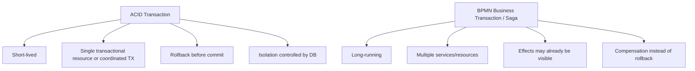

Mental model:

```text
ACID rollback undoes uncommitted work.
Saga compensation performs new committed work to counteract old committed work.
```

Itu perbedaan fundamental.

---

## 3. Partial Success Map

Sebelum menggambar compensation, buat partial success map.

Contoh order fulfillment:

| Step | Side effect | Reversible? | Compensation | Deadline |
|---|---|---:|---|---|
| Reserve inventory | Stock reserved | Ya | Release reservation | 30 min |
| Authorize payment | Funds authorized | Ya/sebagian | Void authorization | 7 days |
| Create shipment | Label created | Ya sebelum pickup | Cancel shipment | Before pickup |
| Capture payment | Funds captured | Tidak fully | Refund | Business-specific |
| Send email | Customer notified | Tidak | Send correction notice | ASAP |

Contoh enforcement case:

| Step | Side effect | Reversible? | Compensation |
|---|---|---:|---|
| Request evidence from agency | External request sent | Tidak sepenuhnya | Send withdrawal/correction |
| Freeze account | Account restricted | Ya dengan audit | Release restriction |
| Publish notice | Public/legal notice created | Tidak murni | Publish correction/amendment |
| Assign investigator | Work allocation changed | Ya | Reassign/revoke task |
| Escalate to committee | Governance step opened | Ya/sebagian | Withdraw agenda item |

Insight:

> Tidak semua side effect punya inverse operation yang sempurna. Kadang compensation adalah correction, apology, amendment, release, refund, or human adjudication.

---

## 4. Saga Building Blocks

Saga di Camunda biasanya dibangun dari primitive berikut:

| Building block | BPMN/Java implementation | Tujuan |
|---|---|---|
| Forward command | Service task / external task / outbox | Melakukan side effect |
| Wait for result | Message catch event / receive task | Menunggu confirmation |
| Timeout | Timer boundary/intermediate event | Batas waktu bisnis |
| Retry | Failed job retry / external task retry | Technical resilience |
| Business failure | BPMN error / result event | Expected negative outcome |
| Compensation | Compensation boundary/event subprocess/service task | Counteraction |
| Cancellation | Interrupting boundary / event subprocess / cancel event | Stop active path |
| Manual repair | User task | Human decision/repair |
| Audit projection | History + domain audit table | Defensibility |

Saga bukan satu elemen BPMN tunggal. Saga adalah kombinasi primitives dengan invariant domain yang jelas.

---

## 5. Retry vs Compensation vs Escalation

Jangan mencampur tiga hal ini.

| Mechanism | Untuk apa | Contoh | Salah pakai jika |
|---|---|---|---|
| Retry | Technical/transient failure | HTTP timeout, DB deadlock | Business rejection di-retry 100 kali |
| Compensation | Undo/counteract committed business side effect | Refund, release inventory | Remote call belum pernah berhasil |
| Escalation/manual repair | Ambiguous/unsafe situation | Unknown payment status | Semua error dilempar ke manusia tanpa retry |

Decision tree:

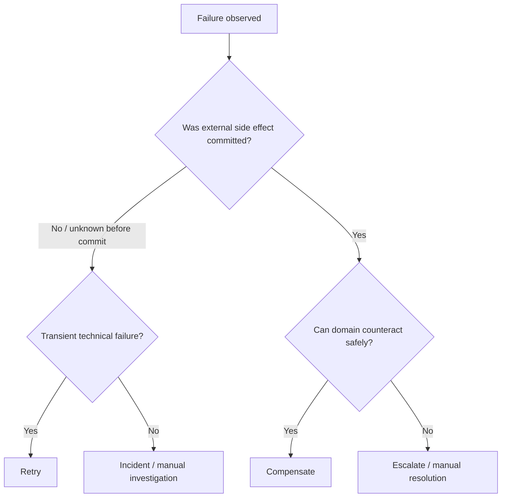

Rule:

```text
Retry repeats the same intent.
Compensation creates a new opposite/corrective intent.
Escalation asks for judgment when automation cannot know the safe action.
```

---

## 6. Idempotency Is Mandatory

Forward actions and compensation actions must both be idempotent.

Example command keys:

| Action | Idempotency key |
|---|---|
| Reserve inventory | `orderId + itemId + reservationAttempt` |
| Release reservation | `reservationId + releaseReason` |
| Authorize payment | `orderId + paymentAttempt` |
| Void authorization | `authorizationId + voidAttempt` |
| Refund payment | `captureId + refundReason + amount` |
| Send evidence request | `caseId + agencyId + requestVersion` |
| Withdraw request | `requestId + withdrawalVersion` |

Bad compensation:

```java
public void refund(String paymentId) {
    paymentClient.refund(paymentId); // no idempotency key
}
```

Better:

```java
public void refund(RefundCommand command) {
    paymentClient.refund(
        command.captureId(),
        command.amount(),
        command.reason(),
        command.idempotencyKey()
    );
}
```

If compensation retries after a network timeout, it must not refund twice.

---

## 7. Pattern: Reservation + Confirmation

This pattern avoids hard-to-reverse side effects.

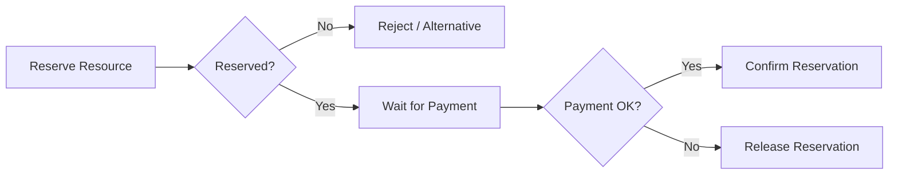

Use for:

- inventory,
- appointment slots,
- temporary account restrictions,
- capacity allocation,
- committee agenda slot,
- limited quota license application.

Invariant:

```text
Reserved resources must have expiration or release path.
No reservation should rely only on the workflow reaching the release task.
```

External systems should also enforce TTL, because process incident or engine downtime must not lock resources forever.

---

## 8. Pattern: Send Command and Compensate If Later Step Fails

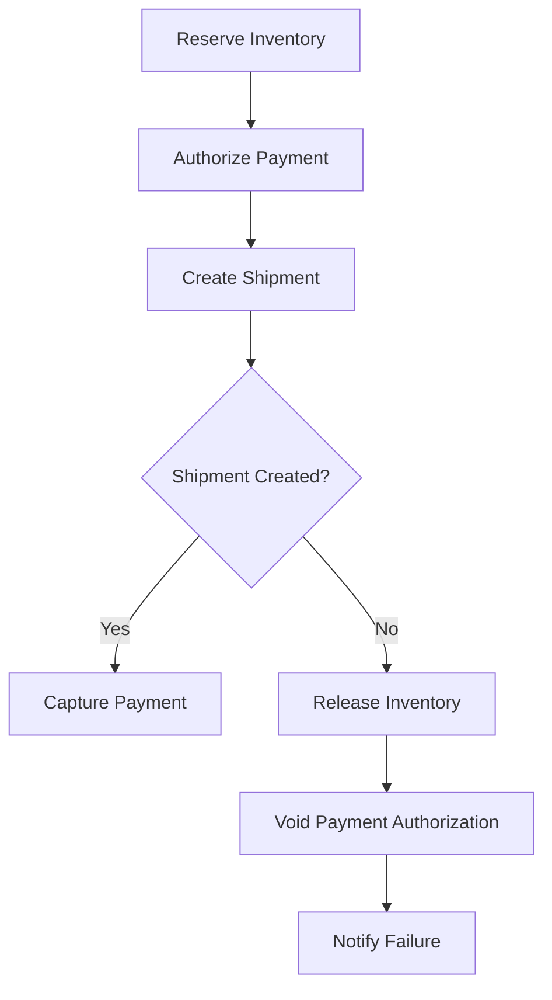

This is simple explicit compensation flow. It is often clearer than BPMN compensation events for engineering teams.

Pros:

- readable,
- easy to test,
- explicit sequence,
- easier observability,
- fewer BPMN semantic surprises.

Cons:

- can get verbose,
- hard to reuse for many branches,
- model may become tangled if every step has compensation wiring.

Use explicit compensation flow when:

- compensation order is business-specific,
- team is not expert in BPMN compensation semantics,
- audit readability matters more than compact diagram,
- there are few side effects.

---

## 9. BPMN Compensation Events

Camunda supports compensation events.

Key semantics:

- compensation handler is associated with an activity/subprocess,
- handler runs only for activities that completed successfully,
- compensation can be thrown for a specific activity or current scope,
- scope compensation includes concurrent branches,
- compensation is triggered hierarchically,
- default compensation order is reverse order of completion,
- compensation boundary event becomes active after attached activity completes successfully,
- compensation is not a magic rollback.

Basic shape:

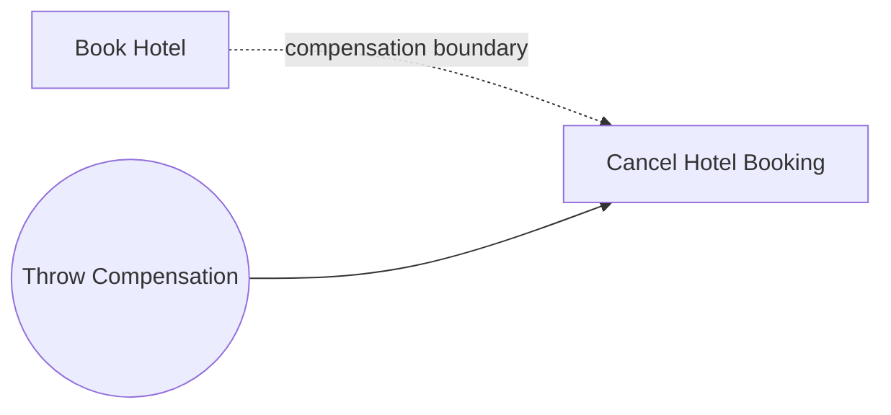

BPMN-ish XML idea:

```xml
<serviceTask id="bookHotel" name="Book Hotel" camunda:delegateExpression="${bookHotelDelegate}" />

<boundaryEvent id="compensateBookHotel" attachedToRef="bookHotel">
  <compensateEventDefinition />
</boundaryEvent>

<association sourceRef="compensateBookHotel" targetRef="cancelHotelBooking" />

<serviceTask id="cancelHotelBooking"
             name="Cancel Hotel Booking"
             isForCompensation="true"
             camunda:delegateExpression="${cancelHotelBookingDelegate}" />
```

### When compensation events are useful

- many activities each have clear inverse handler,
- compensation should follow BPMN completion order,
- modeler audience understands compensation notation,
- handlers are idempotent and observable,
- compensation subscription semantics are tested.

### When explicit compensation flow is better

- compensation order differs from reverse completion order,
- compensation requires business decisions,
- partial compensation requires conditional logic,
- call activities/subprocess boundaries complicate propagation,
- operations team needs very obvious diagrams.

---

## 10. Compensation Variable Snapshot

Compensation has variable subtleties. For embedded subprocesses, compensation handler can access local variables captured when subprocess completed. Higher-scope variables are seen in their current state when compensation is thrown. That can surprise teams.

Practical rule:

```text
Persist compensation input explicitly before completing the forward activity.
Do not rely on mutable process variables still having the right values later.
```

Example:

```java
execution.setVariable("hotelBookingCompensation", Map.of(
    "bookingId", bookingId,
    "provider", provider,
    "cancelBy", cancelBy.toString(),
    "idempotencyKey", "cancel-hotel-" + bookingId
));
```

Better yet, persist compensation command in application DB/outbox:

```sql
create table saga_compensation_action (
  id uuid primary key,
  saga_id varchar(150) not null,
  action_type varchar(100) not null,
  action_key varchar(150) not null,
  payload_json jsonb not null,
  status varchar(30) not null,
  created_at timestamp not null,
  executed_at timestamp null,
  unique(action_key)
);
```

---

## 11. Transaction Subprocess: Use Carefully

A BPMN transaction subprocess can have success, cancel, and hazard outcomes.

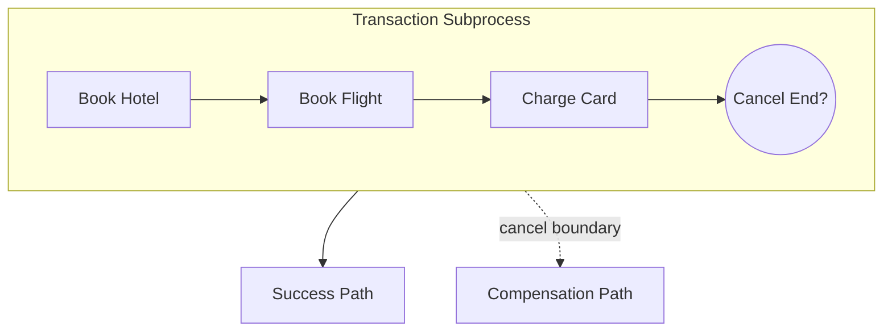

Important semantics:

- cancel end event can only be used with transaction subprocess,
- cancel boundary event catches cancellation,
- cancel boundary interrupts active executions in transaction scope,
- compensation runs synchronously before leaving cancel boundary path,
- only one cancel boundary event is allowed for a transaction subprocess,
- if transaction ends by hazard/error not handled in scope, compensation may not run.

### Practical warning

Do not use transaction subprocess because it “sounds correct”. Use it only when the team understands:

- cancel end event semantics,
- compensation subscription activation,
- optimistic locking consequences,
- variable snapshot behavior,
- limitations around call activity propagation,
- operational recovery path if compensation fails.

For many teams, explicit saga flow is easier to support.

---

## 12. Cancellation Model

Cancellation is not always compensation.

Types:

| Type | Meaning | Example |
|---|---|---|
| User cancellation | Actor withdraws request | Applicant withdraws license application |
| Business cancellation | Domain condition invalidates process | Payment expired |
| System cancellation | Platform/operator stops workflow | Duplicate process started |
| Legal/regulatory cancellation | Authority invalidates path | Jurisdiction removed |
| Timeout cancellation | Deadline passed | Agency did not respond |

Cancellation design must answer:

- what active work must stop?
- what side effects must be compensated?
- what side effects must remain as audit record?
- who is notified?
- is cancellation reversible?
- can new process be started later?
- what happens to late events?

---

## 13. Pattern: Interrupting Event Subprocess for Cancellation

A process-wide cancellation signal/message often fits event subprocess.

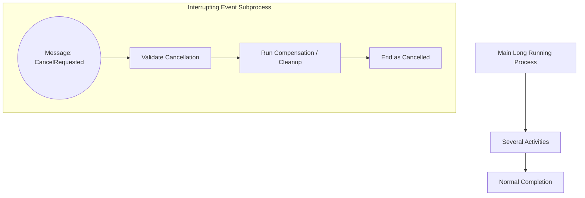

Use this when:

- cancellation can occur across many states,
- it should interrupt current scope,
- cleanup path is shared,
- cancellation is domain command with authorization.

Avoid this when:

- cancellation rules differ heavily by state,
- some states cannot be cancelled,
- cancellation requires local state-specific compensation,
- event subprocess would become a giant hidden control flow.

In those cases, explicit state-specific boundary events or gateways may be clearer.

---

## 14. Timeout Is a Business Event

Timer is not just technical scheduling. It represents a business fact:

```text
The process has waited long enough that the domain must move to another state.
```

Examples:

- payment authorization expired,
- agency did not respond within legal deadline,
- reviewer missed SLA,
- customer did not provide document,
- reservation hold expired.

Timer handling should not only “go to failure”. It should model domain response:

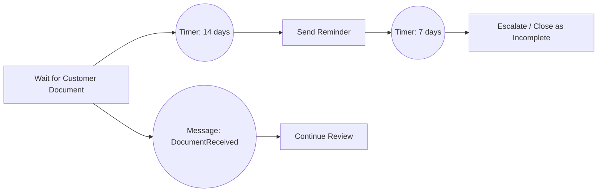

Timer checklist:

- Is the duration based on calendar days, business days, or legal deadline?
- What timezone matters?
- What happens if event arrives after timer fired?
- Is there a grace period?
- Is timeout reversible?
- Does timeout need notification?
- Does timeout require compensation?
- Does timer volume create job executor load?

---

## 15. Human Repair as First-Class Path

There are states automation cannot safely resolve:

- external system says payment succeeded but no capture id,
- compensation API returns unknown status,
- duplicate case records exist,
- legal notice already published with wrong data,
- investigator changed decision after escalation,
- timeout fired but event arrived one second later,
- conflicting agencies provide inconsistent evidence.

Do not hide these in logs. Model them.

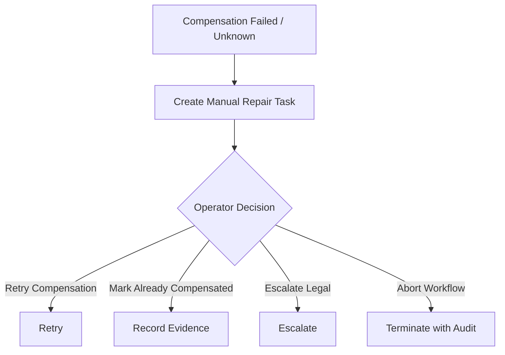

A good manual repair task includes:

- business key,
- current process state,
- failed action,
- external system reference,
- retry history,
- suggested options,
- risk notes,
- audit requirement,
- link to Cockpit/business UI.

---

## 16. Saga State vs Process State

Do not rely only on BPMN token position to know domain state.

Maintain domain state explicitly:

```text
ORDER_CREATED
INVENTORY_RESERVED
PAYMENT_AUTHORIZED
SHIPMENT_CREATED
PAYMENT_CAPTURED
FULFILLED
CANCELLING
COMPENSATING
CANCELLED
MANUAL_REPAIR_REQUIRED
```

Why?

- UI/read models need domain state,
- event adapter needs state-aware correlation,
- audit needs business terms,
- migration may move tokens but domain state remains meaningful,
- operations team should not infer business state from activity id only.

Camunda process state and domain state should be related but not identical.

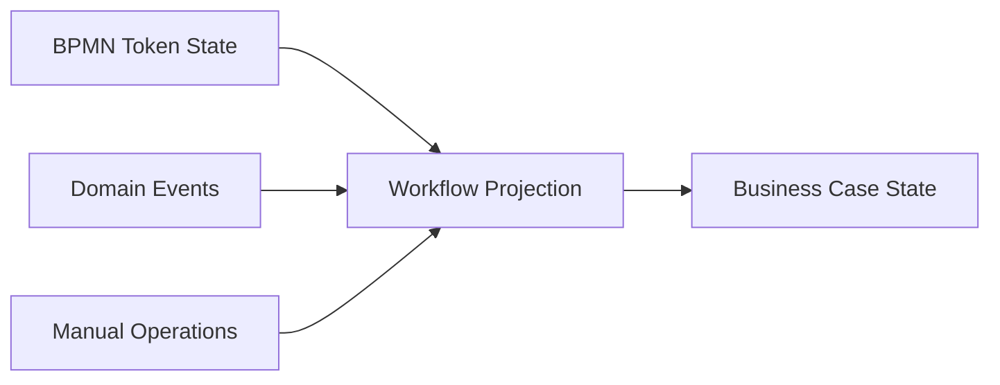

---

## 17. Designing Compensation Commands

A compensation command is not “call inverse API”. It is a domain command with contract.

Example:

```java
public record ReleaseInventoryReservationCommand(
    String reservationId,
    String orderId,
    String reason,
    String requestedBy,
    String idempotencyKey,
    Instant requestedAt
) {}
```

Command contract:

| Field | Why |
|---|---|
| `reservationId` | Target exact side effect |
| `orderId` | Audit/business context |
| `reason` | Legal/support trace |
| `requestedBy` | Actor/system accountability |
| `idempotencyKey` | Retry safety |
| `requestedAt` | Temporal audit |

Compensation handler should classify outcomes:

| Outcome | Meaning | Process behavior |
|---|---|---|
| Success | Compensation completed | Continue |
| Already done | Idempotent success | Continue |
| Retryable failure | Timeout/temporary error | Retry |
| Business impossible | Cannot release/refund | Manual repair |
| Unknown | No reliable status | Query/reconcile/manual repair |

---

## 18. Outbox + Saga

For side effects, outbox works for both forward and compensating commands.

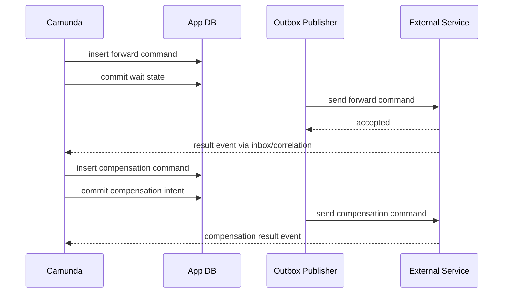

This gives you:

- durable intent,
- retryable publish,
- audit trail,
- separation of Camunda transaction from external side effect,
- idempotency at service boundary.

---

## 19. Case Study: Regulatory Enforcement Lifecycle

Imagine an enforcement workflow:

1. open case,
2. request data from entities,
3. freeze suspicious account,
4. collect evidence,
5. review by investigator,
6. escalate to committee,
7. issue decision,
8. publish notice,
9. monitor remediation.

Some actions are reversible, some are not.

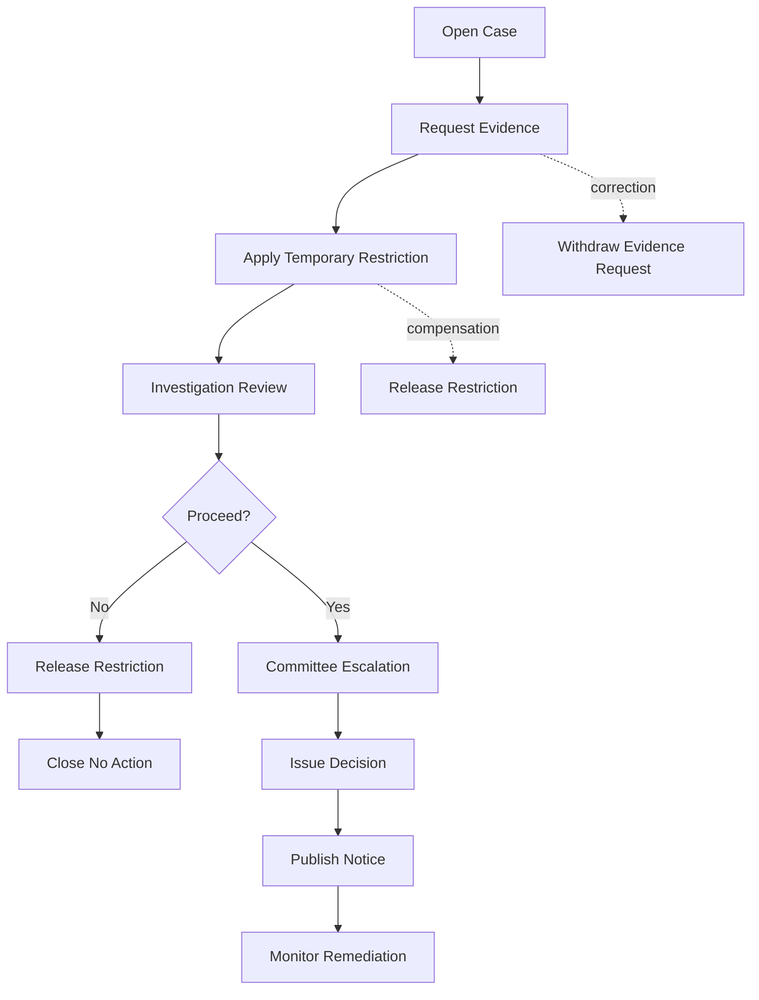

Important distinctions:

- withdrawing evidence request may not erase the fact it was sent,
- releasing account restriction requires audit reason,
- public notice may need amendment rather than deletion,
- legal deadlines may override normal retry strategy,
- manual decision path must be explicit.

Regulatory saga invariant:

```text
Every irreversible or externally visible action must have an audit-visible correction or escalation path, even if it has no true technical rollback.
```

---

## 20. Testing Saga Failure Paths

Do not only test happy path.

| Scenario | Expected behavior |
|---|---|
| Forward step fails before external commit | Retry or incident, no compensation |
| Forward step succeeds then later step fails | Compensation command emitted |
| Compensation API timeout | Retry with same idempotency key |
| Compensation returns already compensated | Treat as success |
| Compensation returns impossible | Manual repair task |
| Cancel event while parallel branches active | Active work interrupted safely |
| Timer fires before reply event | Timeout path wins; late event marked stale |
| Reply event and timer race | One path wins; other handled idempotently |
| Duplicate compensation command | No duplicate external effect |
| Process incident during compensation | Recovery resumes safely |
| Operator manually repairs | Audit records decision |
| New process version deployed mid-saga | Running instance behavior still valid |

Example test naming style:

```java
@Test
void paymentCaptureFailureAfterInventoryReservationReleasesInventory() {}

@Test
void duplicateReleaseReservationCommandIsIdempotentSuccess() {}

@Test
void latePaymentAuthorizedAfterTimeoutIsMarkedStale() {}

@Test
void compensationUnknownStatusCreatesManualRepairTask() {}
```

---

## 21. Operational Runbook for Saga Incidents

When saga incident occurs, operator needs structured questions:

1. What is the business key?
2. Which forward side effects have definitely succeeded?
3. Which side effects are unknown?
4. Which compensation actions have been attempted?
5. Which actions are safe to retry?
6. Which external systems need reconciliation?
7. Has customer/entity/regulator been notified?
8. Is legal/audit approval required before repair?
9. Should process continue, compensate, or terminate?
10. What evidence must be attached to the case?

A runbook should map incident types:

| Incident | Operator action |
|---|---|
| Failed job before side effect | Retry after fix |
| Failed job after side effect unknown | Check external reference before retry |
| Compensation failed retryable | Retry job/command |
| Compensation impossible | Create/complete manual repair path |
| Duplicate saga instance | Suspend duplicate and reconcile side effects |
| Late event after cancellation | Attach as audit evidence, do not continue old wait state |

---

## 22. Anti-Patterns

| Anti-pattern | Why it fails | Better design |
|---|---|---|
| Treat BPMN transaction as DB transaction | Long-running work cannot hold ACID rollback | Saga + compensation |
| Compensation without idempotency | Retry can double-refund/release | Idempotency key per compensation command |
| Only happy-path BPMN | Partial success invisible | Explicit failure/compensation paths |
| Swallow exception after side effect | Engine thinks success but state unknown | Record outcome and create incident/manual repair |
| Timer directly terminates without cleanup | Resources left reserved | Timeout cleanup/compensation |
| Every failure becomes BPMN error | Technical failures bypass retry/incident semantics | Distinguish retry vs business failure |
| Compensation handler depends on mutable variables | Wrong data used later | Persist compensation input |
| Direct remote side effect in same transaction | Rollback cannot undo external commit | Outbox/external task/idempotency |
| No manual repair path | Unsafe automation or stuck incidents | First-class repair workflow |
| Signal used to cancel one saga | Broadcast risk | Message/event subprocess with correlation |
| Domain state inferred only from token | Poor UI/audit/support | Business state projection |
| Compensation hidden in delegate code | Model lies about behavior | Model compensation visibly |

---

## 23. Design Checklist

Before approving long-running process design:

- What side effects can commit outside Camunda?
- Which side effects are reversible, partially reversible, or irreversible?
- What is the compensation command for each reversible side effect?
- Is each forward and compensation command idempotent?
- Is there an outbox/inbox around external communication?
- What is the timeout for each reservation/wait state?
- What happens to late events after timeout/cancel?
- Is cancellation authorized and state-aware?
- Is human repair modeled for unknown/impossible states?
- Are business state and BPMN token state both observable?
- Are compensation inputs persisted immutably?
- Do tests cover partial success and duplicate retry?
- Does operations have a runbook?
- Does audit show who/what/when/why for compensation?

---

## 24. Mental Compression

Keep these distinctions sharp:

```text
Rollback != compensation.
Retry != compensation.
Cancellation != failure.
Timeout != technical error.
Incident != business rejection.
BPMN transaction != ACID transaction.
Process state != domain state.
Automation != judgment.
```

Saga design is mostly about humility. Distributed business processes fail in ways no single database can hide. Camunda 7 gives you durable state, BPMN control flow, jobs, timers, incidents, and compensation primitives. Your job is to add domain invariants, idempotent boundaries, observable side effects, and human recovery where automation cannot be trusted.

Top-tier engineer does not ask “how do I model rollback in BPMN?”. They ask:

> “Which committed effects can become externally visible, what consistency promise do we owe the business, and what exact corrective action is safe, idempotent, observable, and auditable?”
