# Part 027 — Microservices Boundaries and Process Ownership

> Target skill: mampu menentukan siapa pemilik proses, siapa pemilik data, siapa pemilik worker, dan siapa pemilik incident saat Camunda 7 dipakai di sistem microservices; bukan sekadar “taruh BPMN di tengah lalu semua service dipanggil dari sana”.

Camunda sering terlihat seperti jawaban mudah untuk masalah koordinasi microservices:

- proses jadi terlihat,
- state long-running disimpan,
- retry dan timeout punya tempat,
- human task bisa digabung dengan service task,
- audit trail tersedia,
- incident bisa dioperasikan.

Tetapi justru karena Camunda membuat orkestrasi terlihat mudah, banyak sistem jatuh ke anti-pattern: **workflow engine berubah menjadi distributed monolith controller**.

Di part ini, kita tidak belajar “cara memanggil microservice dari BPMN”. Itu sudah dibahas di service task, external task, REST, message correlation, dan saga. Fokus part ini adalah **architecture judgment**: di mana batas proses, di mana batas service, di mana data harus hidup, dan siapa yang bertanggung jawab saat proses gagal.

---

## 1. The First 20 Hours Lens

Josh Kaufman menyarankan memecah skill besar menjadi sub-skill yang bisa dilatih. Untuk Camunda + microservices, sub-skill utamanya bukan XML BPMN. Sub-skill utamanya adalah **boundary design**.

### 1.1 Sub-Skill Yang Harus Dikuasai

| Sub-skill | Pertanyaan yang harus bisa dijawab |
|---|---|
| Process ownership | Service mana yang berhak mendefinisikan lifecycle end-to-end? |
| Data ownership | Data apa yang boleh jadi process variable, dan data apa yang harus tetap di service sumber? |
| Work ownership | Siapa yang menjalankan service task: engine, Java delegate, external worker, atau service lain via event? |
| Failure ownership | Jika retry habis, tim mana yang menerima alert dan memperbaiki state? |
| Deployment ownership | Siapa yang boleh deploy BPMN version baru? |
| API ownership | Aplikasi luar bicara langsung ke engine atau lewat workflow facade? |
| Observability ownership | Metric mana yang milik platform engine dan mana yang milik proses bisnis? |
| Migration ownership | Desain mana yang membuat migrasi ke Camunda 8 / engine lain lebih mudah? |

### 1.2 Skill Trap

Banyak engineer belajar Camunda dari tutorial yang sederhana:


Tutorial seperti ini berguna untuk memahami mekanik dasar. Namun di microservices, masalahnya bukan lagi “apakah service task bisa memanggil HTTP endpoint”. Masalahnya:

- apakah workflow engine boleh tahu detail domain internal service?
- apakah variable process menjadi duplikasi database domain?
- apakah job executor dipakai untuk remote I/O yang tidak idempotent?
- apakah deployment BPMN bisa mematahkan contract worker?
- apakah incident workflow bisa dioperasikan oleh tim yang benar?

Jika pertanyaan ini tidak dijawab, Camunda menjadi pusat coupling baru.

---

## 2. Mental Model: Process Is Coordination State, Not Domain Ownership

Microservices sehat biasanya punya prinsip:

> Setiap bounded context memiliki model, storage, invariant, dan API sendiri.

Camunda process tidak boleh otomatis mengambil alih semua itu.

### 2.1 Tiga Jenis State

| Jenis state | Pemilik ideal | Contoh | Boleh jadi process variable? |
|---|---|---|---|
| Domain source-of-truth | Domain service | case status, account balance, license status, payment state | Biasanya tidak, kecuali snapshot kecil |
| Coordination state | Workflow engine | step saat ini, waiting message, due date, retry state | Ya |
| Read model / reporting state | Projection/reporting service | dashboard case summary, SLA breach count | Tidak langsung; biasanya diproyeksikan dari history/event |

Rule praktis:

> Camunda menyimpan **state koordinasi**, bukan menggantikan database domain.

### 2.2 Process Variable Yang Sehat

Process variable yang sehat biasanya:

- kecil,
- serializable,
- versioned,
- tidak mengandung object graph besar,
- tidak menjadi sumber kebenaran domain,
- berisi correlation key, decision result, atau snapshot minimal,
- aman untuk muncul di history sesuai kebijakan data protection.

Contoh sehat:

```json
{
  "caseId": "CASE-2026-000123",
  "businessKey": "CASE-2026-000123",
  "riskBand": "HIGH",
  "requiresSeniorApproval": true,
  "currentReviewRound": 2,
  "submissionReceivedAt": "2026-06-27T09:15:00+07:00"
}
```

Contoh tidak sehat:

```json
{
  "case": {
    "id": "CASE-2026-000123",
    "parties": [
      { "name": "...", "address": "...", "documents": ["large-base64..."] }
    ],
    "evidenceFiles": ["large-base64..."],
    "fullDomainAggregate": "..."
  }
}
```

Masalah contoh kedua:

- sulit migrasi schema,
- history membengkak,
- privacy risk,
- query lambat,
- object serialization rentan class evolution,
- ownership domain kabur.

---

## 3. Vocabulary: Istilah Boundary Yang Harus Konsisten

Sebelum mendesain architecture, sepakati vocabulary.

### 3.1 Process Owner

**Process owner** adalah tim/service yang bertanggung jawab terhadap lifecycle end-to-end proses.

Tanggung jawabnya:

- BPMN definition,
- process variables contract,
- versioning,
- deployment,
- incident triage level pertama,
- SLA process,
- business-level observability,
- migration plan.

Process owner tidak otomatis berarti pemilik semua domain data.

### 3.2 Domain Service Owner

**Domain service owner** adalah tim/service yang memiliki invariant dan data domain tertentu.

Contoh:

- Case Service memiliki case record.
- Payment Service memiliki payment state.
- Document Service memiliki evidence/document metadata.
- Identity Service memiliki user/group identity.
- Risk Service memiliki risk score calculation.

Workflow boleh meminta domain service melakukan command, tetapi tidak boleh mengedit database domain langsung.

### 3.3 Worker Owner

**Worker owner** adalah tim yang menjalankan external task worker atau adapter yang mengerjakan activity tertentu.

Contoh:

- `risk-score-worker` dikelola Risk team.
- `document-verification-worker` dikelola Document team.
- `notification-worker` dikelola Platform team.

Worker owner harus memiliki:

- retry policy,
- idempotency policy,
- error mapping,
- monitoring,
- operational runbook,
- contract test.

### 3.4 Platform Owner

**Platform owner** adalah tim yang mengelola engine runtime:

- database,
- job executor sizing,
- Cockpit/Admin/Tasklist,
- REST/webapp security,
- backup/restore,
- patching,
- observability platform,
- shared conventions.

Di organisasi kecil, process owner dan platform owner bisa sama. Di organisasi besar, ini sebaiknya dibedakan.

---

## 4. Orchestration vs Choreography

Microservices biasanya punya dua gaya koordinasi ekstrem.

### 4.1 Choreography

Setiap service publish event, service lain bereaksi.

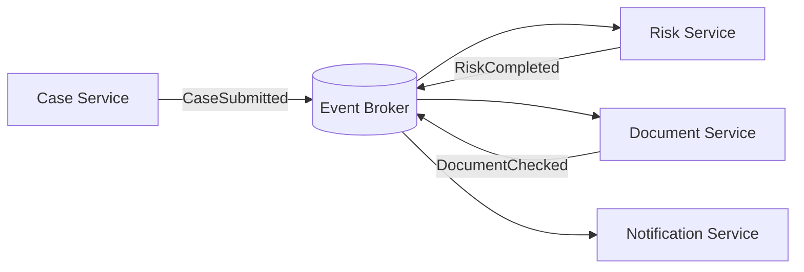

Kelebihan:

- service autonomous,
- coupling temporal rendah,
- scalable event distribution,
- tidak ada central coordinator.

Kekurangan:

- flow end-to-end sulit terlihat,
- timeout sulit dikontrol,
- compensation tersebar,
- audit journey perlu dibangun manual,
- incident sering lintas tim,
- sulit menjelaskan “proses sedang di mana?”.

### 4.2 Orchestration

Satu process owner mengoordinasikan langkah end-to-end.

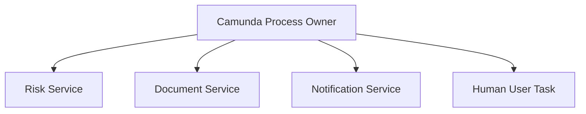

Kelebihan:

- proses terlihat eksplisit,
- timeout dan SLA terpusat,
- recovery state jelas,
- audit trail lebih natural,
- human workflow mudah digabung,
- compensation bisa dimodelkan.

Kekurangan:

- berisiko menjadi central coupling,
- process owner bisa terlalu banyak tahu detail domain,
- engine bisa menjadi bottleneck organizational,
- deployment coordination lebih sensitif,
- service autonomy bisa turun jika kontrak buruk.

### 4.3 Rule Praktis

Gunakan orchestration ketika:

- proses long-running,
- butuh human task,
- butuh SLA/timer/escalation,
- butuh audit end-to-end,
- butuh explicit compensation,
- alur bisnis perlu dipahami non-engineer,
- flow memiliki banyak branch yang harus dikendalikan.

Gunakan choreography ketika:

- event berdiri sendiri,
- banyak subscriber independen,
- urutan tidak dikontrol satu owner,
- tidak butuh state machine end-to-end,
- proses bisa eventually consistent tanpa coordinator eksplisit.

Kombinasi paling sehat sering seperti ini:

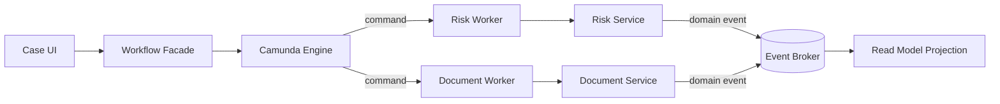

Camunda mengoordinasikan lifecycle. Domain service tetap publish event untuk ecosystem lain.

---

## 5. Architecture Style Untuk Microservices + Camunda 7

### 5.1 Central Workflow Platform

Satu Camunda platform menjalankan banyak process definition dari banyak tim.

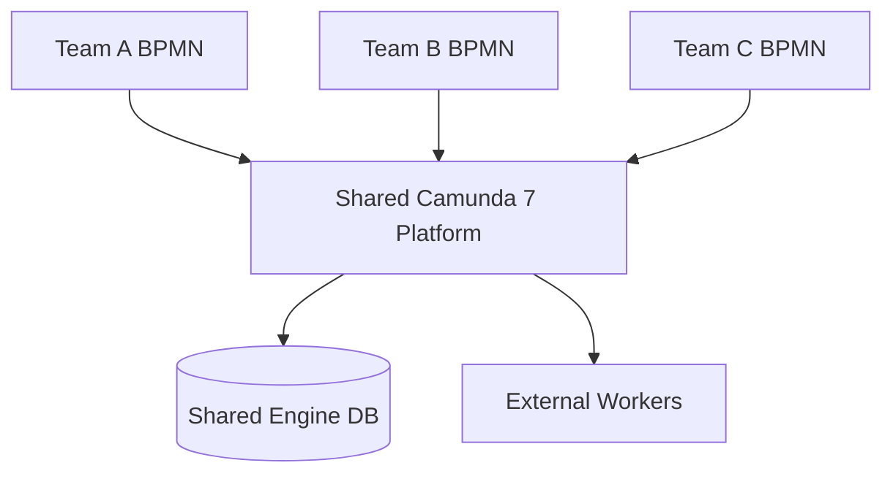

Cocok jika:

- organisasi butuh standard workflow platform,
- tim platform kuat,
- process definitions punya governance,
- multi-team Cockpit/Tasklist/Admin dikelola terpusat,
- workload engine bisa diprediksi.

Risiko:

- noisy neighbor,
- shared database pressure,
- release coordination,
- authorization complexity,
- cross-team incident ownership kabur.

Mitigasi:

- tenant/process namespace jelas,
- deployment ownership jelas,
- platform SLO terpisah dari process SLO,
- job priority convention,
- history TTL per process definition,
- shared modeling standards.

### 5.2 Context-Owned Engine

Setiap bounded context atau domain penting memiliki engine sendiri.

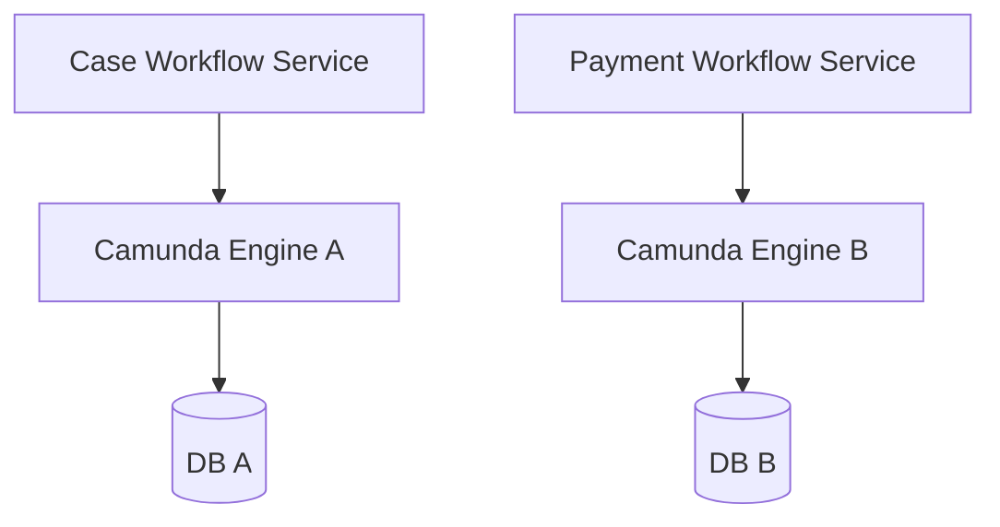

Cocok jika:

- process ownership kuat per domain,
- compliance/tenant isolation tinggi,
- traffic profile berbeda,
- failure blast radius harus kecil,
- tim mampu mengoperasikan engine sendiri.

Risiko:

- operational overhead,
- duplicate platform work,
- standards diverge,
- sulit membuat cross-domain observability.

Mitigasi:

- platform template,
- shared library untuk conventions,
- central dashboard,
- paved road untuk deployment dan metrics,
- common incident taxonomy.

### 5.3 Remote Engine with Workflow Facade

Aplikasi tidak bicara langsung ke Camunda REST. Mereka bicara ke workflow facade/service.

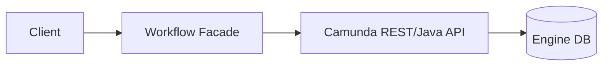

Cocok jika:

- ingin menyembunyikan detail Camunda dari client,
- perlu idempotency dan authorization domain-aware,
- ingin migration-aware boundary,
- banyak consumer internal/eksternal,
- perlu stable API contract.

Ini biasanya default yang paling sehat untuk enterprise.

### 5.4 Embedded Engine Inside Business Service

Camunda engine embedded di service domain.

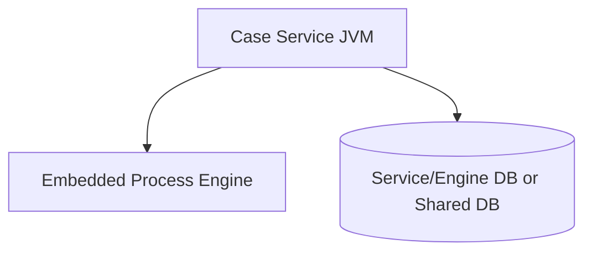

Cocok jika:

- process milik satu service,
- Java delegate butuh local domain service,
- team owner sama,
- traffic moderate,
- operational model sederhana.

Risiko:

- domain service lifecycle tercampur dengan engine lifecycle,
- job executor berjalan di app node,
- scaling HTTP app ikut scaling workflow jobs,
- upgrade Camunda mengikat upgrade service,
- migrasi ke remote/worker model lebih sulit jika delegates tebal.

Mitigasi:

- delegates tetap thin,
- remote side effect pakai async boundary,
- job executor role bisa dikontrol per node,
- database schema dikelola eksplisit,
- process API tetap difasadekan.

---

## 6. Ownership Matrix

Gunakan matrix ini sebelum membuat BPMN production.

| Artefak / Aktivitas | Owner wajib | Secondary owner | Catatan |
|---|---|---|---|
| BPMN model | Process owner | Platform architect | Harus punya code review/model review |
| DMN table | Business/rule owner | Process owner | Rule versioning terpisah dari process |
| Process variable contract | Process owner | Worker/domain owner | Harus documented dan testable |
| External task topic | Process owner + worker owner | Platform owner | Topic adalah API contract |
| Java delegate | Process app owner | Domain owner | Jangan mengandung hidden domain ownership |
| Engine runtime | Platform owner | Process owner | DB, job executor, webapps, security |
| Incident first response | Process owner | Platform owner | Platform handle engine failure; process owner handle business failure |
| Domain command endpoint | Domain service owner | Process owner | Command harus idempotent |
| Domain event | Domain service owner | Consumers | Event bukan private workflow signal |
| History retention | Compliance + process owner | Platform owner | TTL harus explicit |
| Process migration | Process owner | Platform owner | Running instance strategy wajib |

Jika owner tidak bisa ditulis, desain belum production-ready.

---

## 7. Process Owner Service Pattern

Pattern paling aman: buat service khusus sebagai process owner.

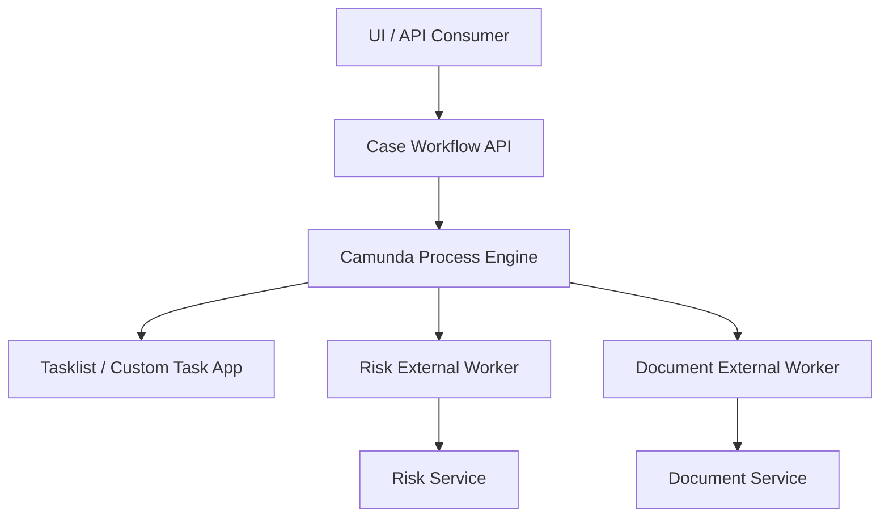

### 7.1 Struktur Package Contoh

```text
com.example.caseworkflow
├── api
│   ├── CaseWorkflowController.java
│   ├── StartCaseRequest.java
│   └── CompleteReviewRequest.java
├── process
│   ├── CaseProcessKeys.java
│   ├── CaseVariables.java
│   ├── CaseMessages.java
│   └── CaseTopics.java
├── orchestration
│   ├── CaseWorkflowService.java
│   ├── MessageCorrelationService.java
│   └── TaskCommandService.java
├── workers
│   ├── RiskAssessmentWorker.java
│   └── DocumentVerificationWorker.java
├── delegates
│   └── PrepareCaseVariablesDelegate.java
├── audit
│   └── WorkflowAuditProjection.java
└── resources
    ├── bpmn/case-enforcement.bpmn
    └── dmn/risk-routing.dmn
```

### 7.2 API Facade Contoh

Jangan expose Camunda REST langsung ke client bisnis.

Buruk:

```http
POST /engine-rest/process-definition/key/caseProcess/start
```

Lebih baik:

```http
POST /cases/{caseId}/workflow/start-review
```

Payload:

```json
{
  "initiatorUserId": "u-123",
  "reason": "initial-submission",
  "idempotencyKey": "case-2026-000123:start-review:v1"
}
```

Facade melakukan:

- authorization domain-aware,
- idempotency check,
- business key setup,
- variable contract mapping,
- process start/correlation,
- error translation,
- audit event emission.

### 7.3 Why This Matters

Jika client tahu endpoint Camunda REST mentah, maka:

- client tahu process definition key,
- client tahu variable name internal,
- client tahu task id semantics,
- migrasi engine susah,
- authorization sulit domain-aware,
- API contract bocor ke detail runtime.

Workflow facade membuat Camunda menjadi implementation detail, bukan public architecture boundary.

---

## 8. External Task as Boundary Contract

External task bukan sekadar teknik “worker polling”. Ia adalah boundary contract antara process owner dan service owner.

### 8.1 Topic Naming Convention

Buruk:

```text
serviceTask1
callApi
processData
```

Baik:

```text
risk.assess-case.v1
document.verify-evidence.v1
notification.send-review-reminder.v1
case.freeze-entity.v1
```

Topic name harus menjelaskan:

- domain capability,
- action,
- version,
- ownership.

### 8.2 External Task Contract

Setiap topic harus punya contract:

```yaml
topic: risk.assess-case.v1
owner: risk-platform-team
inputVariables:
  - caseId: string
  - businessKey: string
  - requestedAt: iso-datetime
outputVariables:
  - riskScore: number
  - riskBand: LOW|MEDIUM|HIGH
  - riskAssessmentId: string
bpmnErrors:
  - code: RISK_POLICY_NOT_APPLICABLE
  - code: RISK_REQUIRES_MANUAL_REVIEW
technicalFailures:
  retryPolicy: R3/PT10M
idempotencyKey: businessKey + topic + activityInstanceId
sla:
  p95: 5s
  timeoutBoundary: PT15M
```

### 8.3 Worker Responsibility

Worker harus:

- fetch and lock topic yang dimiliki,
- validasi input variable,
- panggil domain service via idempotent command/query,
- complete dengan output minimal,
- handle BPMN error untuk business outcome,
- handle failure untuk technical/transient problem,
- renew lock jika pekerjaan panjang,
- expose metrics.

Worker tidak boleh:

- mutate process variable sembarangan,
- menyembunyikan business failure sebagai technical retry,
- complete task sebelum side effect benar-benar committed,
- memakai lock duration ekstrem sebagai pengganti reliability,
- mengandalkan process variable sebagai database domain.

---

## 9. Command/Event Boundary Pattern

Untuk remote service, gunakan command/event language.

### 9.1 Command Dari Workflow Ke Domain Service

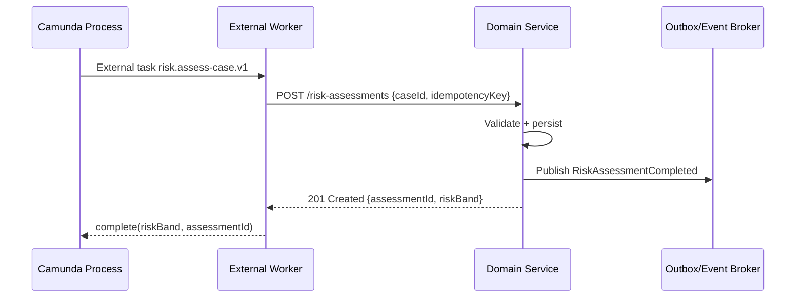

Workflow command harus idempotent.

### 9.2 Event Dari Domain Ke Workflow

Jika workflow menunggu hasil asynchronous:

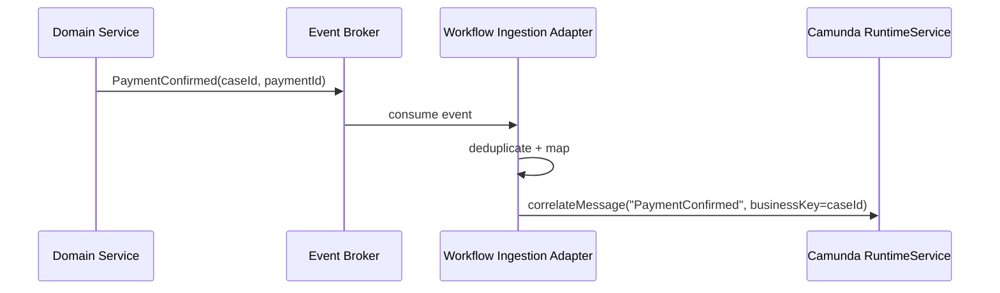

Adapter bertanggung jawab terhadap:

- deduplication,
- schema version mapping,
- correlation key mapping,
- late event policy,
- retry/parking lot,
- observability.

Jangan biarkan semua domain service langsung memanggil Camunda REST tanpa governance.

---

## 10. Data Ownership Rules

### 10.1 Jangan Query Camunda DB Untuk Domain Read Model

Buruk:

```sql
SELECT *
FROM ACT_RU_VARIABLE
WHERE NAME_ = 'caseStatus'
```

Masalah:

- schema Camunda bukan public contract,
- runtime rows hilang saat process selesai,
- variable serialization kompleks,
- query mahal,
- upgrade risk,
- authorization bypass.

Lebih baik:

- expose workflow status via facade,
- build read model dari history/events,
- sink history ke analytics/projection,
- gunakan `HistoryService`/REST untuk operational read yang memang engine-level.

### 10.2 Jangan Simpan Full Domain Aggregate Di Variable

Workflow butuh cukup data untuk routing, bukan semua data domain.

| Data | Simpan di Camunda? | Alasan |
|---|---:|---|
| `caseId` | Ya | Correlation/reference |
| `riskBand` | Ya | Routing decision snapshot |
| `documentIds` kecil | Kadang | Jika perlu routing dan aman privacy |
| full evidence file | Tidak | Besar, sensitif, bukan coordination state |
| payment ledger | Tidak | Domain source-of-truth |
| reviewer decision | Ya | Process/audit relevant |
| full user profile | Tidak | Privacy dan staleness risk |

---

## 11. Deployment Ownership

Microservices architecture gagal jika deployment boundary tidak jelas.

### 11.1 BPMN Deployment Is Code Deployment

BPMN bukan konfigurasi ringan. BPMN adalah executable program.

BPMN change bisa mengubah:

- transaction boundary,
- job creation,
- wait state,
- message subscription,
- variable mapping,
- incident behavior,
- history footprint,
- worker contract,
- user task assignment,
- SLA behavior.

Karena itu BPMN harus melewati:

- code review,
- model review,
- automated tests,
- migration assessment,
- rollback plan,
- release note untuk operations.

### 11.2 Deployment Coordination Dengan Worker

Jika BPMN menambah external task topic baru, worker harus tersedia.

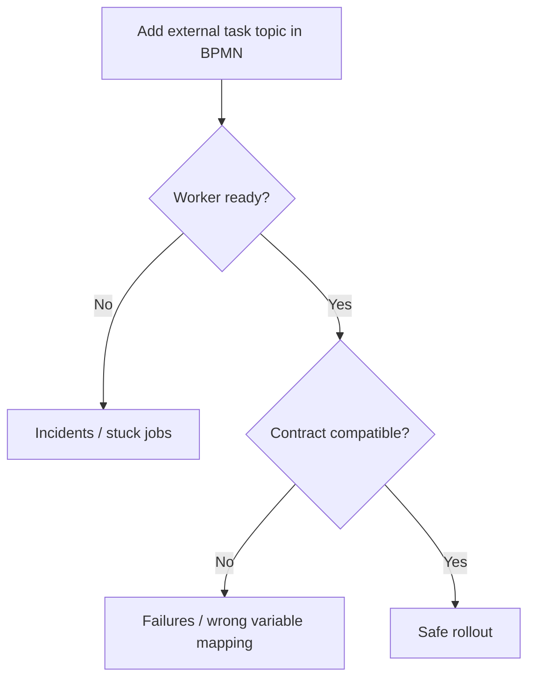

Safe rollout strategy:

1. Deploy worker yang support contract baru.
2. Deploy BPMN version baru.
3. Start new instances on new version.
4. Monitor incidents and backlog.
5. Decide migration for old instances.
6. Retire old worker contract only when no old instances need it.

---

## 12. Incident Ownership

Incident tanpa owner adalah operational debt.

### 12.1 Incident Taxonomy

| Incident type | Likely owner | Example |
|---|---|---|
| BPMN modeling defect | Process owner | wrong gateway condition |
| Worker technical failure | Worker owner | external task failure exhausted |
| Domain validation failure incorrectly modeled | Process owner + domain owner | business rejection thrown as Java exception |
| Engine/database failure | Platform owner | DB unavailable, job executor stuck |
| Authorization/task assignment defect | Process owner + IAM owner | task invisible to group |
| Message correlation failure | Ingestion/process owner | event cannot find subscription |
| Variable serialization failure | Process app owner | object class changed |

### 12.2 Runbook Minimal

Setiap process production harus punya runbook:

```md
# Runbook: case-enforcement-process

## Business owner
Enforcement Operations

## Technical process owner
Case Workflow Team

## Platform owner
Workflow Platform Team

## Common incidents
- failedJob in risk assessment
- message correlation not found
- SLA timer backlog
- user task assigned to wrong group

## First checks
- Cockpit process instance view
- Incident activity id
- Job retries and exception stacktrace
- External worker logs by businessKey
- Domain service status

## Recovery actions
- retry job only if idempotent
- correct variable only with audit note
- correlate missing message from parking lot
- escalate to domain owner if domain invariant failed

## Forbidden actions
- direct update to ACT_RU_* tables
- delete incident without root cause
- complete user task on behalf of user without audit approval
```

---

## 13. Process as Integration Layer: Useful, But Dangerous

Camunda bisa menjadi integration layer. Tetapi jangan jadikan Camunda sebagai ESB baru.

### 13.1 Tanda Camunda Mulai Menjadi ESB

- Semua service call lewat Camunda walau tidak long-running.
- BPMN berisi mapping teknis antar payload service.
- Process variable berisi payload besar dari banyak sistem.
- Banyak service task hanya “copy field A ke endpoint B”.
- Engine REST dipakai sebagai generic API gateway.
- Business process owner tidak tahu isi model karena terlalu teknis.
- Perubahan kecil di service contract memaksa update banyak BPMN.

### 13.2 Batas Sehat

Camunda cocok mengoordinasikan:

- urutan bisnis,
- human approval,
- timeout,
- retries,
- compensation,
- audit journey,
- cross-service business outcome.

Camunda tidak cocok menjadi:

- transformation pipeline umum,
- high-throughput event router,
- canonical data model store,
- API gateway,
- business data warehouse,
- replacement domain service.

---

## 14. Bounded Context Mapping

Sebelum membuat BPMN, gambar bounded context.

Contoh regulatory enforcement lifecycle:

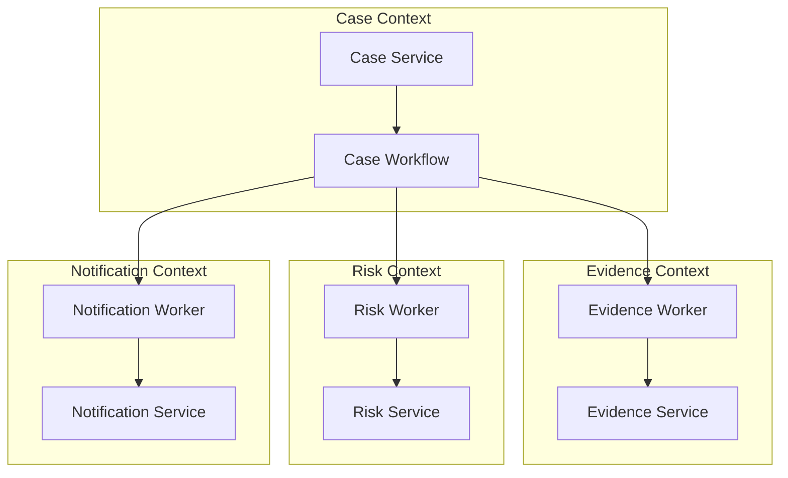

Pertanyaan desain:

1. Apakah `Case Workflow` bagian dari Case Context atau platform shared?
2. Apakah Risk Context boleh dipanggil synchronous, atau harus via external worker?
3. Apakah Evidence Context publish event saat evidence lengkap?
4. Apakah workflow boleh menyimpan evidence metadata?
5. Siapa pemilik task assignment group?
6. Siapa yang menutup case secara domain: workflow atau Case Service?

Jawaban yang sehat biasanya:

- workflow memutuskan kapan meminta domain action,
- domain service memutuskan apakah action valid,
- domain service tetap update source-of-truth,
- workflow menyimpan hasil minimal untuk routing,
- read model menyatukan status untuk UI.

---

## 15. UI Boundary and Task Application

Tasklist bawaan berguna, tetapi enterprise sering butuh custom task app.

### 15.1 Jangan Campur UI State Dengan Process State

Buruk:

```json
{
  "expandedPanel": "evidence",
  "lastOpenedTab": "notes",
  "clientSideDraft": "..."
}
```

Di process variable.

UI state harus di UI/backend UI, bukan process engine.

### 15.2 Task Completion Contract

Custom task app sebaiknya tidak langsung mengirim variable bebas ke `TaskService.complete`.

Gunakan command:

```http
POST /cases/{caseId}/tasks/{taskId}/complete-review
```

Payload:

```json
{
  "decision": "APPROVE",
  "reasonCode": "EVIDENCE_SUFFICIENT",
  "comment": "All mandatory documents verified.",
  "idempotencyKey": "task-789:complete:v1"
}
```

Server melakukan:

- task ownership check,
- authorization check,
- task still active check,
- input validation,
- variable mapping,
- audit note,
- complete task.

---

## 16. Process Definition Granularity

### 16.1 Satu Giant Process vs Banyak Process

Giant process:

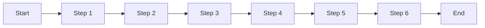

Kelebihan:

- end-to-end terlihat satu diagram,
- correlation lebih sederhana,
- audit journey linear.

Kekurangan:

- sulit versioning,
- sulit modular ownership,
- model membesar,
- regression test berat,
- perubahan kecil risk tinggi.

Modular process:

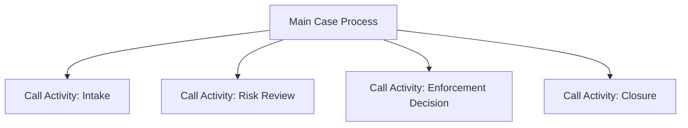

Kelebihan:

- modular,
- reusable,
- testing per module,
- ownership bisa dipisah.

Kekurangan:

- variable mapping lebih penting,
- version binding harus jelas,
- parent-child incident perlu runbook,
- end-to-end trace lebih kompleks.

Rule:

> Pecah proses ketika sub-lifecycle punya owner, versioning, retry/recovery, atau reuse yang berbeda. Jangan pecah hanya agar diagram terlihat pendek.

---

## 17. Camunda 7 Specific Boundary Concerns

### 17.1 JavaDelegate Coupling

Embedded Camunda 7 memudahkan `JavaDelegate` memanggil Spring beans lokal.

Itu nyaman, tetapi membuat coupling:

- BPMN deployment terikat classpath,
- delegate refactor bisa mematahkan running process,
- domain service dan workflow engine satu lifecycle,
- migrasi ke Camunda 8 lebih sulit.

Gunakan `JavaDelegate` untuk:

- mapping kecil,
- local validation ringan,
- preparing variables,
- calling application service yang memang satu bounded context.

Hindari `JavaDelegate` untuk:

- long remote I/O,
- cross-domain business transaction,
- heavy computation,
- side effect tidak idempotent,
- logic yang seharusnya domain service.

### 17.2 External Task as Future-Proof Boundary

External task lebih cocok jika:

- worker dimiliki tim lain,
- teknologi non-Java,
- long-running work,
- scaling worker berbeda dari engine,
- ingin loose deployment coupling,
- ingin migration path ke worker-style architecture.

### 17.3 Message Correlation Boundary

Message correlation cocok untuk event dari luar ke process.

Namun harus ada adapter yang mengelola:

- event schema version,
- deduplication,
- correlation fallback,
- event parking lot,
- alert untuk unmatched event.

Jangan biarkan event broker langsung menjadi “magic message correlation” tanpa observability.

---

## 18. Architecture Decision Record Template

Gunakan ADR untuk setiap process production.

```md
# ADR: Ownership and Integration Strategy for Case Enforcement Process

## Context
We need to orchestrate enforcement case lifecycle across Case, Evidence, Risk, Notification, and Human Review capabilities.

## Decision
The Case Workflow Team owns the BPMN process. Domain data remains in each domain service. Camunda variables store correlation keys and routing snapshots only. Cross-domain work is executed through external task workers owned by respective domain teams.

## Consequences
- Process visibility and SLA handling are centralized.
- Domain services remain source-of-truth.
- Worker contracts require versioning.
- Incidents are triaged by process owner first, then routed to worker/domain/platform owners.

## Alternatives Considered
- Pure event choreography.
- Embedded Java delegates calling all services directly.
- Shared central workflow team owning all domain integration.

## Operational Model
- BPMN deployed by Case Workflow Team.
- Engine runtime operated by Workflow Platform Team.
- Worker topics have owner, SLA, retry policy, and contract tests.
```

---

## 19. Anti-Patterns

### 19.1 Camunda as Universal Service Bus

Gejala:

- setiap service call lewat BPMN,
- proses tidak punya business meaning,
- model dipenuhi technical routing,
- payload besar lewat variables.

Fix:

- pindahkan technical integration ke integration layer,
- gunakan Camunda hanya untuk business lifecycle,
- gunakan event broker/API gateway sesuai peran.

### 19.2 Process Owns Domain Data

Gejala:

- process variable menjadi full case record,
- domain database jarang dipakai,
- UI membaca data dari Camunda history,
- data correction lewat variable update.

Fix:

- domain service tetap source-of-truth,
- variable hanya coordination snapshot,
- buat read model eksplisit.

### 19.3 No Process Owner

Gejala:

- BPMN dibuat platform team,
- domain team tidak merasa memiliki,
- incident dilempar antar tim,
- tidak ada business runbook.

Fix:

- tetapkan process owner,
- buat ownership matrix,
- enforce model review.

### 19.4 Hidden Synchronous Distributed Transaction

Gejala:

- satu service task memanggil 5 HTTP service sebelum wait state,
- rollback dianggap bisa membatalkan semua side effect,
- tidak ada idempotency.

Fix:

- pecah dengan async boundary,
- gunakan saga/compensation,
- gunakan outbox/idempotency.

### 19.5 Direct Engine REST Exposure

Gejala:

- frontend memanggil `/engine-rest/task/{id}/complete`,
- variable internal bocor ke client,
- authorization generic tidak cukup.

Fix:

- gunakan workflow facade/custom task API,
- map domain command ke engine operation.

### 19.6 Topic Without Contract

Gejala:

- worker membaca variable dengan asumsi diam-diam,
- BPMN change mematahkan worker,
- tidak ada version suffix.

Fix:

- document topic contract,
- version topic,
- contract test.

---

## 20. Review Checklist

Sebelum production, jawab ini:

### 20.1 Ownership

- [ ] Siapa process owner?
- [ ] Siapa platform owner?
- [ ] Siapa worker owner per topic?
- [ ] Siapa domain owner per command/event?
- [ ] Siapa first responder incident?

### 20.2 Boundary

- [ ] Apakah Camunda menyimpan hanya coordination state?
- [ ] Apakah domain data tetap di domain service?
- [ ] Apakah client memakai workflow facade?
- [ ] Apakah external task topic punya contract?
- [ ] Apakah message correlation lewat ingestion adapter?

### 20.3 Release

- [ ] Apakah BPMN change lewat test dan review?
- [ ] Apakah worker compatible dengan BPMN version baru?
- [ ] Apakah process instance migration strategy jelas?
- [ ] Apakah rollback plan realistis?

### 20.4 Operations

- [ ] Apakah incident taxonomy jelas?
- [ ] Apakah runbook tersedia?
- [ ] Apakah metrics process-level tersedia?
- [ ] Apakah history TTL sesuai compliance?
- [ ] Apakah direct DB mutation dilarang?

---

## 21. Practice: Boundary Design Drill

Ambil proses berikut:

> A customer submits a dispute. The system validates documents, checks risk, asks an analyst for review, requests additional evidence if needed, waits for customer response, makes decision, notifies customer, and closes case.

Latihan:

1. Tentukan bounded context.
2. Tentukan process owner.
3. Tentukan domain source-of-truth.
4. Tentukan variable contract minimal.
5. Tentukan external task topics.
6. Tentukan message events dari luar.
7. Tentukan SLA timers.
8. Tentukan incident owner per failure.
9. Tentukan deployment order untuk BPMN + workers.
10. Tentukan read model untuk UI.

Contoh jawaban minimal:

```yaml
processOwner: dispute-workflow-team
platformOwner: workflow-platform-team
businessKey: disputeId
variables:
  - disputeId
  - customerId
  - riskBand
  - evidenceStatus
  - reviewDecision
topics:
  - document.validate-dispute-evidence.v1
  - risk.assess-dispute.v1
  - notification.send-dispute-update.v1
messages:
  - CustomerEvidenceSubmitted
  - CustomerWithdrawsDispute
sourceOfTruth:
  dispute: Dispute Service
  evidence: Document Service
  risk: Risk Service
  customerCommunication: Notification Service
```

---

## 22. Key Takeaways

- Camunda process adalah **coordination state**, bukan pemilik semua domain data.
- Di microservices, boundary design lebih penting daripada BPMN syntax.
- External task topic adalah API contract dan harus punya owner/version.
- Workflow facade melindungi client dari detail Camunda dan memudahkan migrasi.
- Orchestration cocok untuk long-running, human-heavy, SLA-heavy, audit-heavy process.
- Choreography tetap berguna untuk event ecosystem yang tidak butuh central lifecycle.
- BPMN deployment adalah code deployment.
- Incident tanpa owner adalah defect architecture.

---

## 23. Sumber Resmi dan Bacaan Lanjutan

- Camunda 7.24 — External Tasks: https://docs.camunda.org/manual/7.24/user-guide/process-engine/external-tasks/
- Camunda 7.24 — Process Engine Concepts: https://docs.camunda.org/manual/7.24/user-guide/process-engine/process-engine-concepts/
- Camunda 7.24 — Process Engine API: https://docs.camunda.org/manual/7.24/user-guide/process-engine/process-engine-api/
- Camunda 7.24 — REST API Overview: https://docs.camunda.org/manual/7.24/reference/rest/overview/
- Camunda Blog — Microservices Workflow Automation Cheat Sheet: https://camunda.com/blog/2018/12/microservices-workflow-automation-cheatsheet/
- Camunda Blog — BPMN and Microservices Orchestration: https://camunda.com/blog/2018/08/bpmn-for-microservices-orchestration-a-primer-part-1/
