# Part 028 — BPMN Pattern Catalog for Real Systems

> Target skill: mampu memilih, memodifikasi, dan menggabungkan pola BPMN yang production-safe; bukan sekadar menyalin diagram contoh.

Pattern catalog ini adalah jembatan antara teori Camunda dan desain proses nyata. Kita akan memakai pola yang sering muncul di enterprise systems:

- approval,
- maker-checker,
- SLA escalation,
- retry + manual recovery,
- async service orchestration,
- event-driven continuation,
- cancellation,
- reopening,
- split-aggregate,
- batch-triggered workflow,
- evidence collection,
- exception lane.

Setiap pattern akan dibahas dengan format:

1. intent,
2. model shape,
3. Camunda mechanics,
4. variable contract,
5. failure model,
6. test cases,
7. anti-pattern.

---

## 1. How to Read This Catalog

Pattern bukan template mati. Pattern adalah **struktur solusi** untuk recurring problem.

Jangan mulai dari pertanyaan:

> “Elemen BPMN apa yang harus saya pakai?”

Mulai dari pertanyaan:

> “Invariant bisnis apa yang harus dipertahankan, event apa yang bisa terjadi, dan failure apa yang harus bisa dipulihkan?”

### 1.1 Pattern Selection Decision Tree

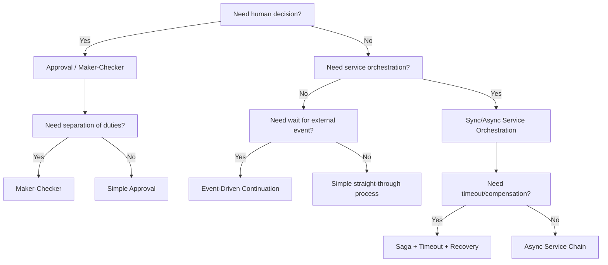

### 1.2 Production Pattern Checklist

Setiap pattern harus menjawab:

- Apa business key-nya?
- Apa terminal states-nya?
- Apa wait states-nya?
- Apa transaction boundary-nya?
- Apa variable contract-nya?
- Apa idempotency key-nya?
- Apa retry policy-nya?
- Apa manual recovery path-nya?
- Apa audit evidence-nya?
- Apa test matrix-nya?

---

## 2. Pattern 1 — Simple Approval Workflow

### 2.1 Intent

Gunakan ketika proses membutuhkan satu keputusan manusia sebelum lanjut.

Contoh:

- approve refund,
- approve document submission,
- approve account closure,
- approve internal request.

### 2.2 Model Shape

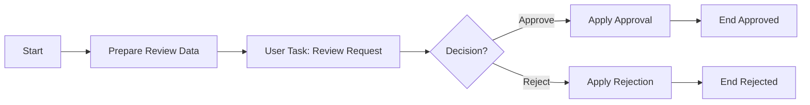

### 2.3 Camunda Mechanics

Elemen utama:

- service task untuk prepare data,
- user task untuk review,
- exclusive gateway untuk decision,
- service task untuk side effect domain,
- end event berbeda untuk audit readability.

User task adalah wait state natural. Saat token mencapai user task, engine menyimpan state dan membuat task. Completion task melanjutkan eksekusi.

### 2.4 Variable Contract

```yaml
businessKey: requestId
input:
  requestId: string
  requesterUserId: string
  requestType: string
processVariables:
  approvalDecision: APPROVE|REJECT
  approvalReasonCode: string
  reviewerUserId: string
  reviewedAt: iso-datetime
```

### 2.5 Implementation Notes

Task completion sebaiknya melalui application facade:

```java
@Transactional
public void completeApproval(String taskId, CompleteApprovalCommand command) {
    // 1. check task exists and active
    // 2. check assignee/candidate authorization
    // 3. validate business decision
    // 4. map command to variables
    // 5. complete task
}
```

Jangan biarkan UI mengirim variable bebas langsung ke engine.

### 2.6 Failure Model

| Failure | Handling |
|---|---|
| Reviewer tidak punya authorization | reject command before `TaskService.complete` |
| Decision kosong | validation error before complete |
| Apply approval gagal transient | async service task retry |
| Apply approval gagal permanent | incident/manual recovery atau BPMN business error |
| Task completed dua kali | idempotency/task active check |

### 2.7 Test Cases

- approve path.
- reject path.
- missing decision rejected.
- unauthorized user cannot complete.
- duplicate complete is safe.
- apply approval failure creates retry/incident.
- history contains reviewer and decision.

### 2.8 Anti-Pattern

- Gateway condition membaca string bebas tanpa enum.
- Reviewer decision disimpan hanya di comment, bukan variable typed.
- Apply approval dilakukan sebelum user task complete tanpa transaction boundary jelas.
- UI langsung memanggil `/engine-rest/task/{id}/complete` dengan arbitrary variables.

---

## 3. Pattern 2 — Maker-Checker / Four-Eyes Principle

### 3.1 Intent

Gunakan ketika orang yang membuat/mengubah request tidak boleh menjadi approver final.

Contoh:

- regulatory action approval,
- bank transfer approval,
- enforcement sanction recommendation,
- privilege access request,
- master data change.

### 3.2 Model Shape

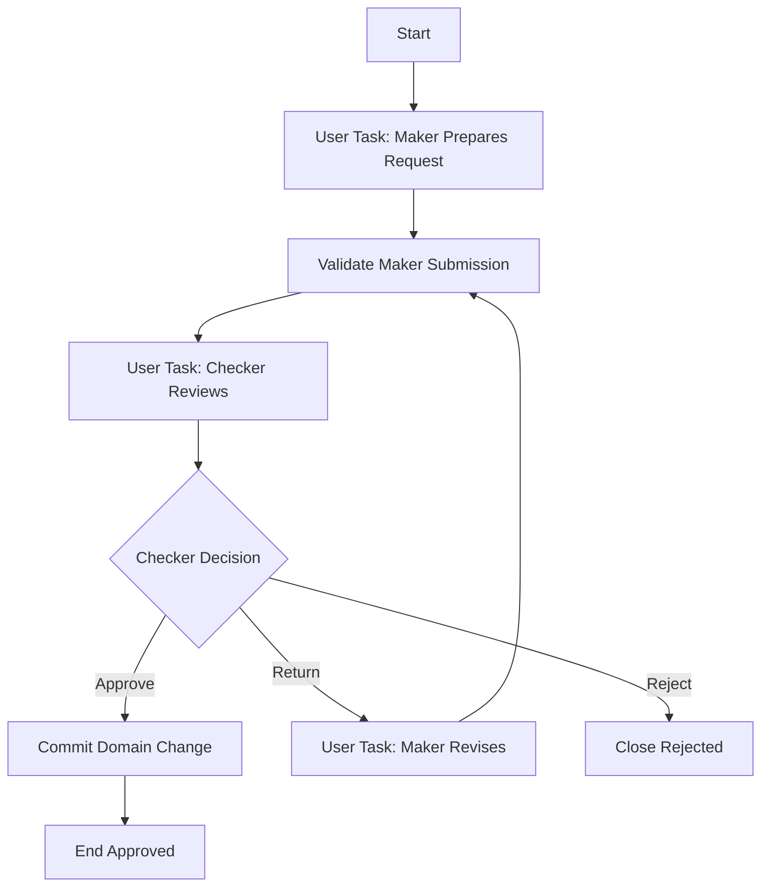

### 3.3 Separation-of-Duties Invariant

Invariant:

```text
checkerUserId != makerUserId
```

Jangan hanya mengandalkan UI untuk menyembunyikan task dari maker. Enforce di backend completion command.

### 3.4 Variable Contract

```yaml
makerUserId: string
checkerUserId: string
makerSubmissionVersion: number
checkerDecision: APPROVE|RETURN|REJECT
checkerReasonCode: string
revisionCount: number
```

### 3.5 Assignment Strategy

Pilihan assignment:

| Strategy | Cocok untuk | Risiko |
|---|---|---|
| candidate group checker | pool review umum | maker bisa claim jika masih di group sama tanpa guard tambahan |
| dynamic candidate group | role berdasarkan domain | mapping group harus audit-able |
| explicit assignee | reviewer sudah ditentukan | bottleneck jika reviewer unavailable |
| custom task app filtering | UX baik | tetap perlu backend enforcement |

### 3.6 Camunda Mechanics

- User task maker dan checker menjadi wait state berbeda.
- Exclusive gateway membaca `checkerDecision`.
- Loop return-to-maker harus punya batas atau escalation.
- Revision count membantu mencegah infinite loop diam-diam.

### 3.7 Failure Model

| Failure | Handling |
|---|---|
| Maker mencoba complete checker task | reject command |
| Checker return berulang tanpa batas | revision threshold + escalation |
| Checker group salah | task reassignment with audit |
| Commit domain change gagal | async service task + retry/incident |
| Maker resign/unavailable | delegation/reassignment policy |

### 3.8 Test Cases

- maker submit then checker approve.
- maker cannot approve own request.
- checker return loops to maker.
- revision count increments.
- max revision triggers escalation.
- checker reject closes process.
- reassignment is audited.

### 3.9 Anti-Pattern

- Four-eyes rule hanya di BPMN lane, bukan enforced.
- Maker/checker user id tidak disimpan.
- Loop return tanpa batas dan tanpa SLA.
- Checker decision hardcoded di delegate.

---

## 4. Pattern 3 — SLA Timer Escalation

### 4.1 Intent

Gunakan ketika task atau state tidak boleh menunggu selamanya.

Contoh:

- review harus selesai dalam 2 hari kerja,
- customer harus mengirim evidence dalam 7 hari,
- worker harus menyelesaikan verification dalam 30 menit,
- supervisor harus diberi tahu jika analyst idle.

### 4.2 Model Shape: Non-Interrupting Reminder

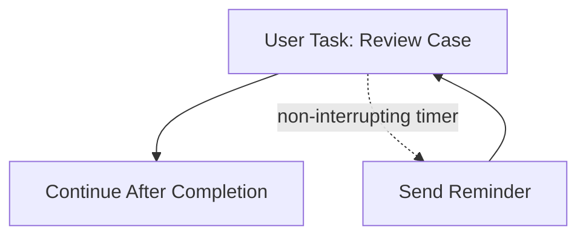

### 4.3 Model Shape: Interrupting Deadline

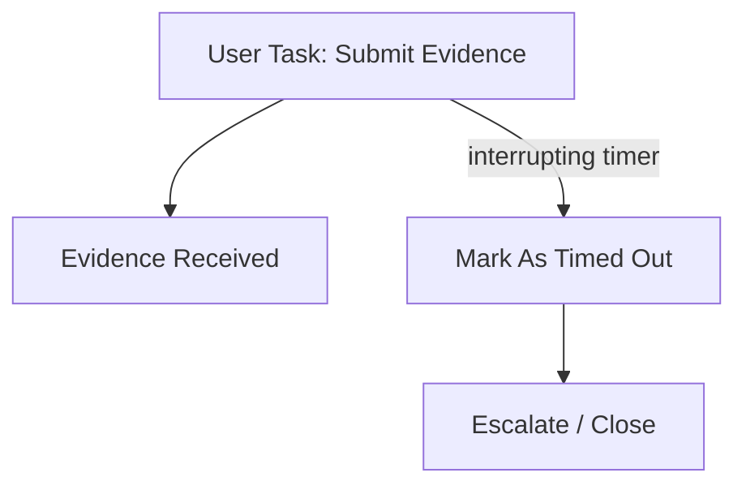

### 4.4 Timer Type Decision

| Timer type | Use when | Effect |
|---|---|---|
| Non-interrupting boundary timer | reminder/escalation but work can continue | original task remains active |
| Interrupting boundary timer | deadline cancels current work | original task removed, token moves to timeout path |
| Timer intermediate catch | process intentionally waits fixed duration | token waits without attached task |
| Event subprocess timer | global timeout inside scope | can interrupt scope or run side path |

### 4.5 Variable Contract

```yaml
reviewDueAt: iso-datetime
slaPolicyId: string
reminderCount: number
escalationLevel: number
lastReminderAt: iso-datetime
```

### 4.6 Camunda Mechanics

Timer event creates timer job. Job executor acquires and executes the timer job. For boundary timer, execution path depends on interrupting vs non-interrupting behavior.

### 4.7 Failure Model

| Failure | Handling |
|---|---|
| Timer expression invalid | deployment/test failure |
| Timer job backlog | monitor job executor and DB |
| Reminder send fails | async service retry |
| Non-interrupting reminder creates spam | cap reminder count |
| Deadline races with task completion | test concurrent completion/timer scenario |

### 4.8 Test Cases

- task completes before timer.
- non-interrupting timer sends reminder and task remains active.
- interrupting timer removes task and follows timeout path.
- reminder count capped.
- timer job failure creates incident/retry.

### 4.9 Anti-Pattern

- Timer duration hardcoded tanpa policy name.
- Non-interrupting timer looping tanpa cap.
- SLA hanya di dashboard, bukan di process behavior.
- Deadline path tidak punya business owner.

---

## 5. Pattern 4 — Retry With Manual Recovery

### 5.1 Intent

Gunakan ketika service task bisa gagal transient, tetapi setelah retry habis operator harus bisa memperbaiki dan melanjutkan.

Contoh:

- call payment service,
- send notification,
- create document package,
- register external case,
- invoke government API.

### 5.2 Model Shape

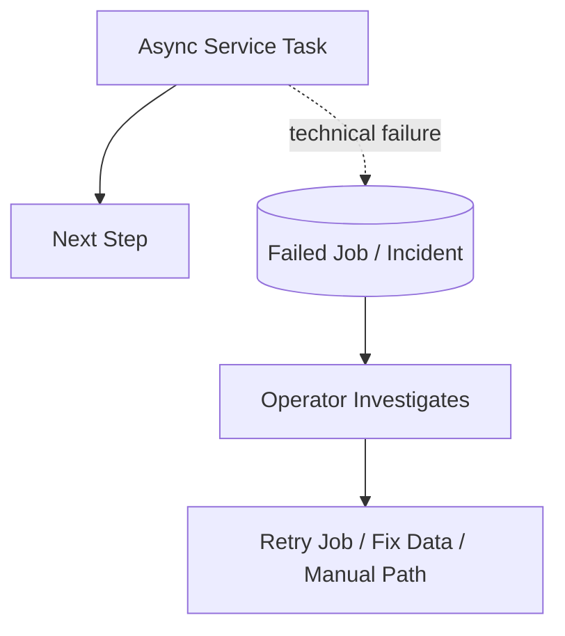

Dalam BPMN, technical failure biasanya tidak digambar sebagai path eksplisit. Ia muncul sebagai failed job/incident. Tetapi runbook harus eksplisit.

### 5.3 Camunda Mechanics

- Beri `asyncBefore="true"` pada service task dengan side effect remote.
- Set retry cycle yang realistis.
- Pastikan delegate/worker idempotent.
- Jika failure business, lempar BPMN error atau complete dengan decision variable, bukan Java exception transient.

### 5.4 Variable Contract

```yaml
externalRequestId: string
idempotencyKey: string
lastAttemptAt: iso-datetime
externalSystemStatus: string
```

### 5.5 Retry Policy Examples

| Use case | Retry cycle | Reasoning |
|---|---|---|
| internal HTTP transient | `R5/PT1M` | fast recovery expected |
| flaky third-party API | `R4/PT15M` | avoid hammering external system |
| nightly batch dependency | `R3/PT1H` | wait for upstream recovery |
| non-idempotent side effect | avoid blind retry | require idempotency before retry |

### 5.6 Failure Model

| Failure | Correct response |
|---|---|
| Timeout | retry if idempotent |
| 5xx | retry with backoff |
| 4xx validation | BPMN business path or incident, not infinite retry |
| duplicate request | domain idempotency handles safely |
| side effect committed but response lost | query by idempotency key before repeating |

### 5.7 Test Cases

- transient failure then retry success.
- retry exhausted creates incident.
- retry job after variable correction succeeds.
- duplicate command does not duplicate side effect.
- 4xx business rejection follows business path.

### 5.8 Anti-Pattern

- Semua exception ditangkap lalu process lanjut sukses.
- Retry tanpa idempotency.
- BPMN error dipakai untuk network timeout.
- Operator diminta update database Camunda langsung.

---

## 6. Pattern 5 — Async Service Orchestration

### 6.1 Intent

Gunakan ketika workflow perlu memanggil beberapa service, tetapi setiap service call harus durable dan recoverable.

### 6.2 Model Shape


### 6.3 Camunda Mechanics

Setiap service task penting diberi async boundary sehingga:

- state sebelum task disimpan,
- job executor menjalankan task,
- failure menjadi failed job,
- retry bisa dilakukan,
- incident bisa dioperasikan.

### 6.4 When to Use Java Delegate vs External Task

| Implementation | Use when |
|---|---|
| JavaDelegate async | local process application owns logic, Java/Spring same lifecycle |
| External task | worker/service owner terpisah, non-Java, scaling berbeda, long-running work |
| Message send + wait | truly asynchronous domain service, result arrives later by event |

### 6.5 Failure Model

| Failure | Handling |
|---|---|
| Validate documents down | failed job retry |
| Risk service slow | external task lock extension or message wait pattern |
| Review package creation partial success | idempotency key + query-before-create |
| Multiple service calls in one delegate | split into separate tasks unless atomic local unit |

### 6.6 Anti-Pattern

Satu service task melakukan semua:

```java
validateDocuments();
assessRisk();
createReviewPackage();
sendNotification();
```

Masalah:

- failure point tidak terlihat,
- retry mengulang semua side effect,
- observability buruk,
- tidak ada recovery granularity.

---

## 7. Pattern 6 — Event-Driven Continuation

### 7.1 Intent

Gunakan ketika process harus menunggu event dari luar.

Contoh:

- customer submits evidence,
- payment confirmed,
- background verification completed,
- external agency sends response,
- appeal filed.

### 7.2 Model Shape

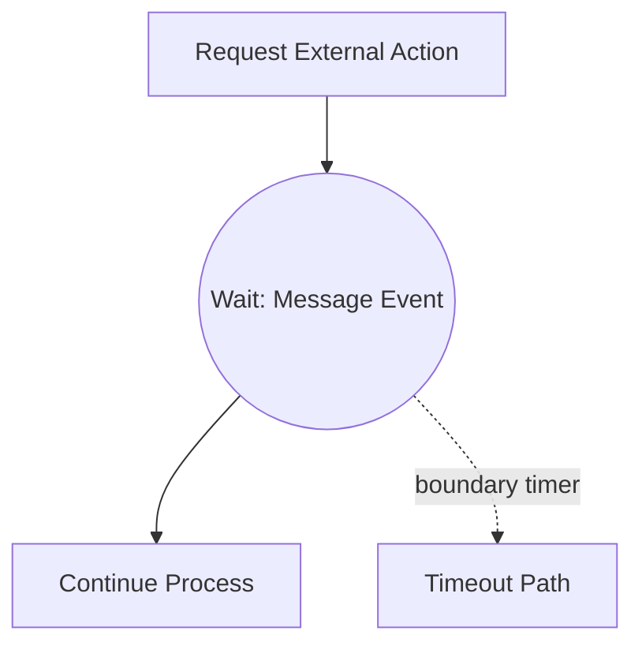

### 7.3 Camunda Mechanics

- Intermediate message catch event membuat subscription.
- External adapter memanggil message correlation.
- Business key/correlation key harus stabil.
- Timer boundary/intermediate harus menangani event yang tidak pernah datang.

### 7.4 Variable Contract

```yaml
businessKey: caseId
messageName: CustomerEvidenceSubmitted
correlationKeys:
  caseId: string
expectedEventVersion: v1
waitStartedAt: iso-datetime
waitDeadlineAt: iso-datetime
```

### 7.5 Ingestion Adapter Pattern

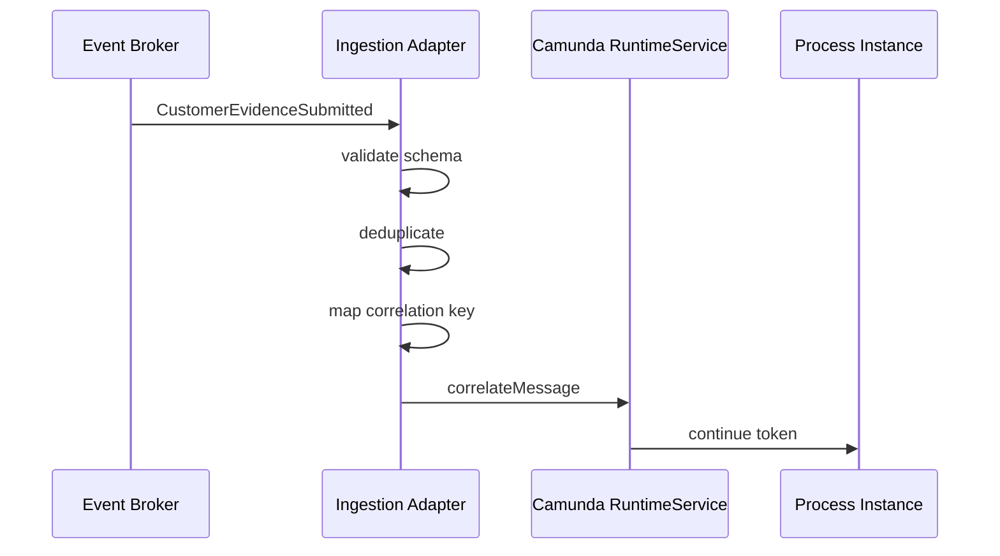

### 7.6 Failure Model

| Failure | Handling |
|---|---|
| Event duplicate | dedup store in adapter |
| Event arrives before subscription | parking lot / start earlier / reorder design |
| Event arrives after timeout | late event policy |
| Correlation not found | dead-letter/parking lot with alert |
| Multiple matching executions | improve correlation key |

### 7.7 Test Cases

- event correlates to waiting process.
- wrong case id not correlated.
- duplicate event ignored.
- timeout path executes if event absent.
- late event handled according to policy.

### 7.8 Anti-Pattern

- Menggunakan signal untuk targeted message.
- Correlation hanya berdasarkan message name.
- Tidak ada timeout.
- Domain service langsung correlate ke engine tanpa adapter/dedup.

---

## 8. Pattern 7 — Cancellation Flow

### 8.1 Intent

Gunakan ketika proses aktif bisa dibatalkan oleh user, system, timeout, atau business event.

Contoh:

- applicant withdraws application,
- customer cancels order,
- regulator closes investigation early,
- duplicate case detected,
- upstream entity invalidated.

### 8.2 Model Shape: Boundary Message Cancellation

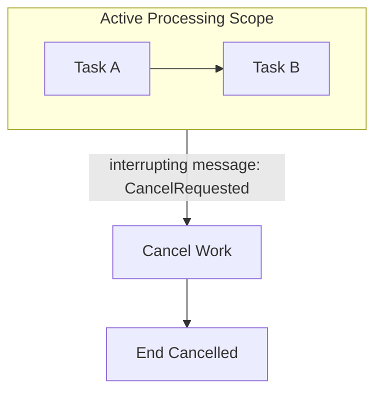

### 8.3 Model Shape: Event Subprocess Cancellation

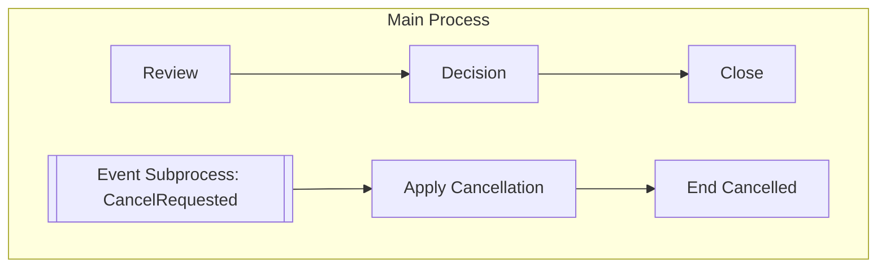

### 8.4 Camunda Mechanics

- Interrupting boundary event cancels attached activity/scope.
- Event subprocess can listen inside process/subprocess scope.
- Cancellation must perform domain side effects explicitly.
- Terminate end event should be used carefully because it kills tokens in scope.

### 8.5 Variable Contract

```yaml
cancelRequestedBy: string
cancelReasonCode: string
cancelRequestedAt: iso-datetime
cancellationSource: USER|SYSTEM|TIMEOUT|ADMIN
```

### 8.6 Failure Model

| Failure | Handling |
|---|---|
| Cancellation races with approval | define precedence rule |
| Cancel domain side effect fails | async retry/incident |
| Already completed process receives cancel event | reject or record as late event |
| Partial downstream work exists | compensation/cancel commands |

### 8.7 Test Cases

- cancel during user task.
- cancel during external wait.
- cancel after completion rejected.
- cancel side effect fails and retries.
- cancellation audit fields recorded.

### 8.8 Anti-Pattern

- Delete process instance as cancellation without business audit.
- Terminate end event used to hide incomplete state.
- Cancellation does not notify domain systems.
- No race policy between complete and cancel.

---

## 9. Pattern 8 — Case Reopening

### 9.1 Intent

Gunakan ketika proses yang sudah selesai secara bisnis bisa dibuka kembali karena appeal, correction, missing evidence, or regulatory instruction.

### 9.2 Model Shape: New Process Instance Linked to Previous Case

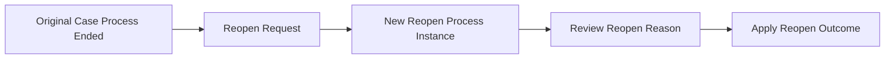

### 9.3 Model Shape: Long-Lived Process With Reopen Event

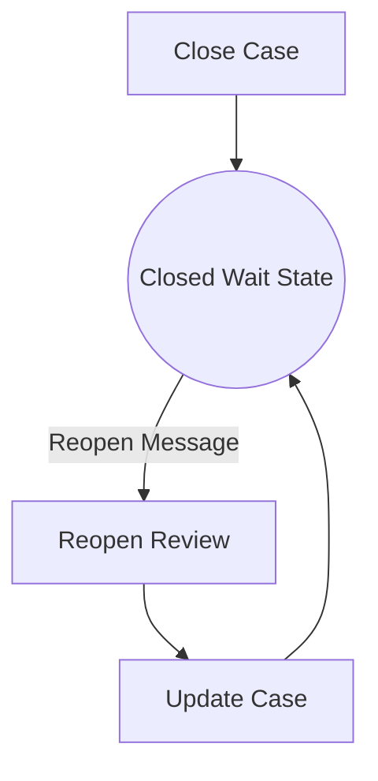

### 9.4 Decision: Same Instance or New Instance?

| Approach | Use when | Trade-off |
|---|---|---|
| New process instance | closure is final for audit, reopen is separate lifecycle | cleaner audit, easier versioning |
| Same long-lived instance | case remains administratively open to future event | process may live for years, versioning harder |
| Process instance modification/restart | operational repair, not normal business path | needs strict governance |

Default enterprise recommendation:

> Model reopening as a new process instance linked to the original business case, unless the business explicitly defines a long-lived closed-wait state.

### 9.5 Variable Contract

```yaml
caseId: string
originalProcessInstanceId: string
reopenRequestId: string
reopenReasonCode: string
reopenRequestedBy: string
reopenDecision: ACCEPT|REJECT
```

### 9.6 Failure Model

| Failure | Handling |
|---|---|
| Duplicate reopen request | idempotency by `reopenRequestId` |
| Original case not closed | reject or route to correction process |
| Domain case cannot be reopened | business rejection path |
| Old process version incompatible | use new process instance |

### 9.7 Anti-Pattern

- Use process instance modification as normal business reopen.
- Reopen by updating historic data.
- Long-lived closed wait state without retention/TTL strategy.

---

## 10. Pattern 9 — Split and Aggregate

### 10.1 Intent

Gunakan ketika process harus menjalankan beberapa work item paralel dan menunggu hasilnya sebelum lanjut.

Contoh:

- collect review from multiple departments,
- verify multiple documents,
- assess multiple entities,
- send requests to several external agencies.

### 10.2 Model Shape: Parallel Gateway

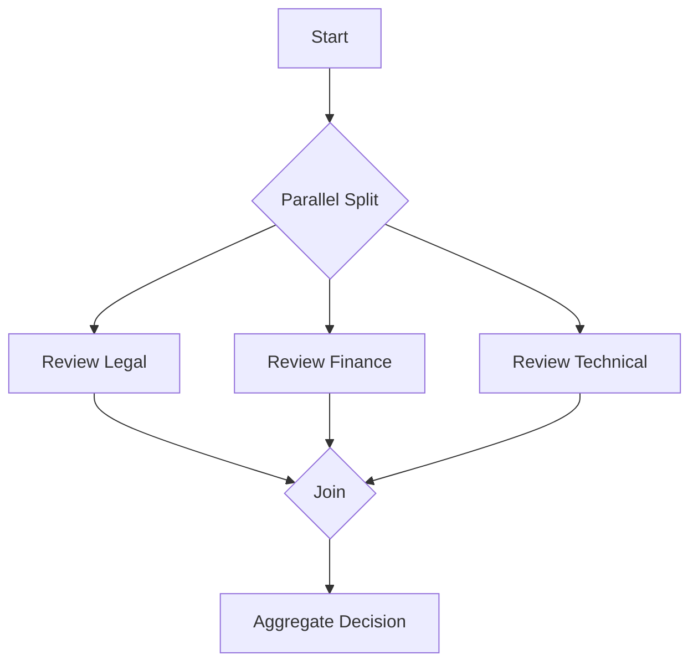

### 10.3 Model Shape: Multi-Instance Task

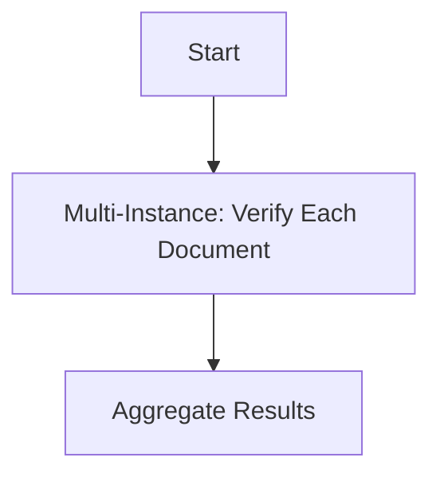

### 10.4 Parallel Gateway vs Multi-Instance

| Need | Prefer |
|---|---|
| fixed known branches with different semantics | parallel gateway |
| dynamic list of similar work | multi-instance |
| each branch has distinct SLA/owner | explicit branches |
| N documents/entities/users | multi-instance |

### 10.5 Variable Contract

```yaml
reviewResults:
  legal: APPROVE|REJECT|CONDITIONALLY_APPROVE
  finance: APPROVE|REJECT|CONDITIONALLY_APPROVE
  technical: APPROVE|REJECT|CONDITIONALLY_APPROVE
documentIds: array<string>
documentVerificationResults: array<object>
```

### 10.6 Failure Model

| Failure | Handling |
|---|---|
| One branch stuck | branch-specific timer/escalation |
| Parallel variable writes conflict | local variables or unique keys |
| Join waits forever | ensure every split path reaches join or termination path |
| Multi-instance large list overloads jobs | chunking/batch strategy |

### 10.7 Test Cases

- all branches complete.
- one branch rejects.
- one branch times out.
- concurrent branch completion does not corrupt variables.
- multi-instance empty list behavior defined.
- large list performance tested.

### 10.8 Anti-Pattern

- Parallel gateway join used after conditional branches that may not all execute.
- Branches write same variable key concurrently.
- Multi-instance used for thousands of items without capacity analysis.

---

## 11. Pattern 10 — Evidence Collection Loop

### 11.1 Intent

Gunakan ketika process memerlukan dokumen/evidence tambahan dari user atau pihak luar, berulang sampai cukup atau deadline habis.

### 11.2 Model Shape

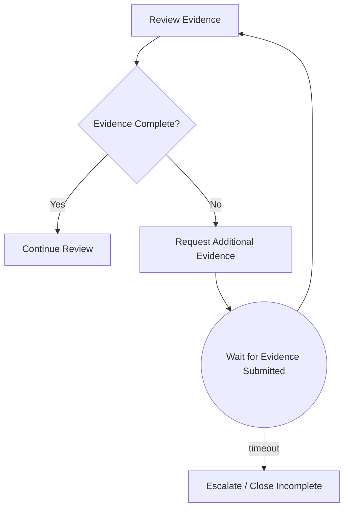

### 11.3 Variable Contract

```yaml
evidenceStatus: COMPLETE|INCOMPLETE|EXPIRED
missingEvidenceTypes: array<string>
evidenceRequestCount: number
lastEvidenceRequestAt: iso-datetime
evidenceDeadlineAt: iso-datetime
```

### 11.4 Design Notes

- Evidence storage should be in Document/Evidence service, not Camunda variables.
- Process stores status and IDs only.
- Request loop must have cap or deadline.
- Missing evidence types should be controlled vocabulary.

### 11.5 Failure Model

| Failure | Handling |
|---|---|
| User submits wrong document | loop back with updated missing list |
| User never responds | timeout path |
| Evidence event duplicate | dedup in ingestion adapter |
| Evidence malware scan pending | wait for separate message/event |

### 11.6 Anti-Pattern

- Store file content in process variable.
- Infinite request loop.
- Evidence completeness logic hidden in UI.
- No audit of what was requested and when.

---

## 12. Pattern 11 — Exception Lane / Business Exception Handling

### 12.1 Intent

Gunakan ketika proses punya business exception yang bukan technical error.

Contoh:

- policy not applicable,
- duplicate case suspected,
- sanctions list hit,
- customer identity mismatch,
- insufficient evidence,
- conflict of interest.

### 12.2 Model Shape

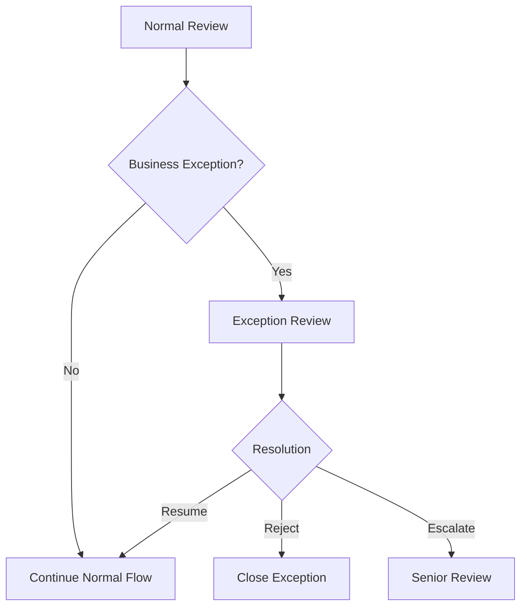

### 12.3 Camunda Mechanics

Business exception can be modeled as:

- gateway decision,
- BPMN error boundary from service task,
- escalation event,
- separate user task path,
- event subprocess.

Do not confuse business exception with Java exception.

### 12.4 Variable Contract

```yaml
businessExceptionCode: string
businessExceptionReason: string
exceptionRaisedAt: iso-datetime
exceptionResolution: RESUME|REJECT|ESCALATE
exceptionResolvedBy: string
```

### 12.5 Failure Model

| Situation | Model as |
|---|---|
| Policy says request cannot continue | business path/BPMN error |
| HTTP timeout | technical failure/retry |
| Missing required document | business path/evidence loop |
| NullPointerException in delegate | technical failure/incident |
| Senior approval needed | escalation/user task path |

### 12.6 Anti-Pattern

- Throw Java exception for expected business rejection.
- Catch all technical exception and route to business exception lane.
- Exception lane has no owner and no SLA.

---

## 13. Pattern 12 — Batch-Triggered Workflow

### 13.1 Intent

Gunakan ketika process instances dibuat dari batch/schedule/event stream.

Contoh:

- nightly compliance review generation,
- periodic license renewal check,
- remediation campaign,
- bulk notification process,
- monthly risk re-assessment.

### 13.2 Model Shape

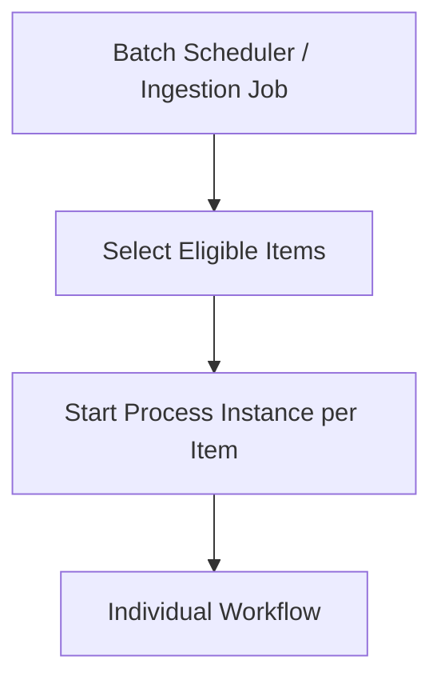

### 13.3 Design Principle

Jangan jadikan satu process instance menampung ribuan item jika setiap item punya lifecycle sendiri.

Lebih baik:

- batch controller memilih item,
- start one process instance per business entity,
- gunakan business key per item,
- idempotency untuk prevent duplicate start,
- monitor backlog.

### 13.4 Variable Contract

```yaml
campaignId: string
entityId: string
batchRunId: string
batchSelectedAt: iso-datetime
businessKey: entityId + ':' + campaignId
```

### 13.5 Failure Model

| Failure | Handling |
|---|---|
| Batch starts duplicate instances | idempotent start by business key/campaign |
| Too many instances at once | throttle/chunk |
| Engine DB pressure | capacity planning |
| One item fails | isolate as individual incident |
| Batch query source changes while running | snapshot selected ids |

### 13.6 Anti-Pattern

- One massive BPMN process with 100k multi-instance items.
- No idempotency on batch start.
- Batch controller directly writes Camunda DB.
- No campaign/run id.

---

## 14. Pattern 13 — Supervisor Escalation Chain

### 14.1 Intent

Gunakan ketika task tidak selesai atau keputusan tertentu harus naik ke level otoritas lebih tinggi.

### 14.2 Model Shape

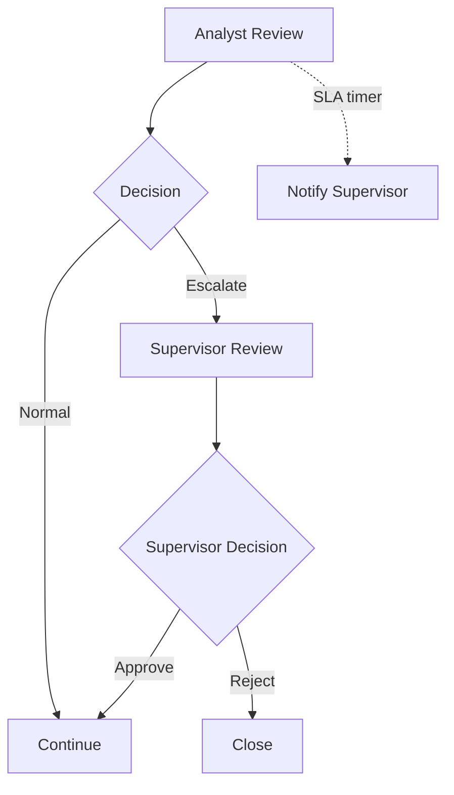

### 14.3 Variable Contract

```yaml
escalationReasonCode: string
escalationLevel: number
supervisorUserId: string
escalatedAt: iso-datetime
```

### 14.4 Design Notes

- Escalation can be due to SLA or business decision.
- SLA escalation may be non-interrupting reminder or interrupting reassignment.
- Business escalation usually explicit path.
- Store reason code for audit.

### 14.5 Anti-Pattern

- Escalation as email only without process state.
- Supervisor task has no SLA.
- Escalation reason is free text only.

---

## 15. Pattern 14 — Manual Repair Task

### 15.1 Intent

Gunakan ketika business process dapat diperbaiki manual tanpa mengubah database engine langsung.

### 15.2 Model Shape

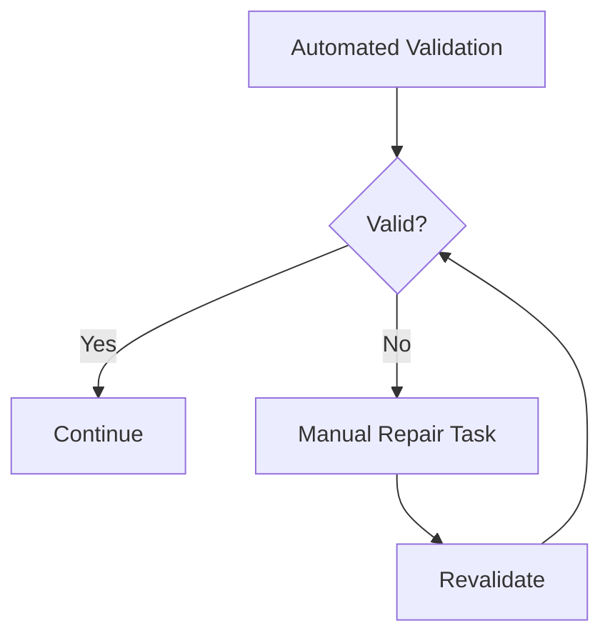

### 15.3 Variable Contract

```yaml
repairReasonCode: string
repairAttemptCount: number
repairPerformedBy: string
repairNotes: string
```

### 15.4 When To Use

Use manual repair when:

- expected data quality issue,
- human can fix source data,
- process should continue after correction,
- correction must be audited.

Do not use manual repair to hide:

- modeling bug,
- delegate bug,
- platform outage,
- missing idempotency.

### 15.5 Anti-Pattern

- Operator fixes process by SQL update to `ACT_RU_VARIABLE`.
- Manual task has broad free-form variable update.
- Repair path skips validation.

---

## 16. Pattern 15 — Decision Table Driven Routing

### 16.1 Intent

Gunakan ketika routing rules berubah lebih sering daripada process structure.

### 16.2 Model Shape

```mermaid
flowchart LR
    A[Collect Inputs] --> B[Business Rule Task: Determine Route]
    B --> C{Route}
    C -->|LOW_RISK| D[Auto Approve]
    C -->|MEDIUM_RISK| E[Analyst Review]
    C -->|HIGH_RISK| F[Senior Review]
```

### 16.3 Variable Contract

```yaml
riskBand: LOW|MEDIUM|HIGH
route: AUTO_APPROVE|ANALYST_REVIEW|SENIOR_REVIEW
ruleVersion: string
```

### 16.4 Design Notes

- DMN decides route, BPMN executes route.
- Do not encode entire process in DMN.
- Store decision result and enough audit metadata.
- Test DMN and BPMN integration.

### 16.5 Anti-Pattern

- Gateway expression duplicates DMN logic.
- DMN returns low-level task IDs.
- Rule table has side effects.

---

## 17. Combining Patterns

Real process usually combines several patterns.

Example enforcement lifecycle:

```mermaid
flowchart TD
    A[Start Case] --> B[DMN: Determine Initial Route]
    B --> C{Route}
    C -->|Low Risk| D[Auto Close]
    C -->|Review| E[Evidence Collection Loop]
    E --> F[Maker Prepares Recommendation]
    F --> G[Checker Reviews]
    G --> H{Decision}
    H -->|Approve| I[Async: Apply Enforcement Action]
    H -->|Return| F
    H -->|Reject| J[Close No Action]
    I --> K[Notify Parties]
    K --> L[Closed]
    E -. timeout .-> M[Escalate Incomplete Evidence]
```

Pattern composition rules:

- Keep each subprocess focused.
- Use explicit variable contracts between modules.
- Avoid hidden loops.
- Put timers where business actually waits.
- Prefer business error path for expected outcomes.
- Let technical failures become incidents/retries.

---

## 18. Pattern Smell Catalog

| Smell | Likely issue | Fix |
|---|---|---|
| BPMN has too many gateways | rules belong in DMN or domain service | extract decision |
| BPMN has no wait states | maybe workflow engine is unnecessary | use simple service/API |
| Every task is service task | process may be technical pipeline | check business lifecycle |
| Every failure goes to same error path | conflates business and technical failures | classify failure |
| Variables contain huge JSON | data ownership issue | store reference/snapshot only |
| No business key | poor correlation/operation | define stable key |
| Many signals | misuse of broadcast | use message correlation |
| No timers on external waits | stuck process risk | add timeout policy |
| Manual task with no audit fields | weak compliance | capture actor, decision, reason |
| Loops with no limit | infinite process risk | add cap/escalation/deadline |

---

## 19. Test Matrix Template Per Pattern

Gunakan matrix ini untuk setiap BPMN pattern.

```yaml
process: case-review-process
pattern: maker-checker-with-sla
happyPaths:
  - maker submits, checker approves
  - maker submits, checker rejects
alternatePaths:
  - checker returns for revision
  - maker revises and resubmits
failurePaths:
  - commit approval service fails transiently
  - commit approval retries exhausted
  - checker task timer escalates
raceCases:
  - checker completes while SLA timer fires
  - cancel message arrives while task completion is submitted
securityCases:
  - maker attempts checker completion
  - unauthorized user attempts claim
historyAssertions:
  - makerUserId captured
  - checkerUserId captured
  - decision and reason captured
  - SLA escalation recorded
```

---

## 20. Modeling Style Rules

### 20.1 Naming

Use business language:

Good:

- `Review Evidence`
- `Assess Risk`
- `Wait for Customer Evidence`
- `Escalate Missing Evidence`
- `Apply Enforcement Action`

Bad:

- `Task 1`
- `Call API`
- `Set Variables`
- `Check Data`
- `Service Task`

### 20.2 Gateway Labels

Gateway outgoing sequence flows should answer the gateway question.

Good:

```text
Gateway: Evidence complete?
Flows: Yes / No
```

Bad:

```text
Gateway: Check
Flows: flow1 / flow2
```

### 20.3 Explicit End States

Use meaningful end event names:

- `End: Approved`
- `End: Rejected`
- `End: Cancelled`
- `End: Timed Out`
- `End: Closed No Action`

This improves Cockpit/history readability.

### 20.4 Avoid Technical Noise

Do not model every internal Java method as BPMN task. BPMN should show business-significant steps and durable boundaries.

---

## 21. Production Pattern Review Board

Untuk proses penting, lakukan review dengan empat perspektif:

### 21.1 Business Review

- Apakah diagram bisa dijelaskan ke business owner?
- Apakah keputusan dan SLA sesuai policy?
- Apakah terminal states lengkap?
- Apakah exception paths sesuai real operations?

### 21.2 Engineering Review

- Apakah boundary async tepat?
- Apakah external task contract jelas?
- Apakah variables minimal dan versioned?
- Apakah idempotency ada untuk side effect?

### 21.3 Operations Review

- Apakah incidents punya owner?
- Apakah failed job bisa diretry aman?
- Apakah Cockpit view cukup untuk triage?
- Apakah runbook tersedia?

### 21.4 Compliance Review

- Apakah decision actor/reason/time tercatat?
- Apakah retention/TTL sesuai?
- Apakah sensitive data tidak bocor ke variables/history?
- Apakah manual override diaudit?

---

## 22. Capstone Drill For This Part

Desain BPMN untuk skenario:

> A regulated entity submits a remediation plan. The system validates required documents, assesses risk, assigns analyst review, applies maker-checker approval, requests additional evidence if needed, escalates after SLA breach, waits for external agency feedback, then either accepts the plan, rejects it, or reopens the review if new evidence arrives within 30 days.

Gunakan minimal pattern:

- evidence collection loop,
- DMN routing,
- maker-checker,
- SLA escalation,
- event-driven continuation,
- cancellation or timeout,
- reopening strategy.

Deliverables latihan:

1. Mermaid BPMN-style diagram.
2. Variable contract.
3. External task topics.
4. Message events.
5. Failure model.
6. Test matrix.
7. Anti-pattern yang harus dihindari.

---

## 23. Key Takeaways

- Pattern adalah struktur reasoning, bukan template copy-paste.
- Approval workflow harus punya decision contract, authorization, dan audit.
- Maker-checker harus enforce separation-of-duties di backend, bukan hanya UI/BPMN lane.
- SLA timer harus punya business semantics: reminder, escalation, timeout, atau cancellation.
- Technical retry sebaiknya menjadi failed job/incident, bukan business path palsu.
- Event-driven continuation butuh correlation key, timeout, dedup, dan late-event policy.
- Cancellation harus menjadi business transition yang diaudit, bukan sekadar delete process instance.
- Split-aggregate harus memperhatikan join semantics, variable conflict, dan branch timeout.
- Batch-triggered workflow membutuhkan idempotency dan throttling.
- Pattern composition harus menjaga boundary, ownership, dan failure model tetap eksplisit.

---

## 24. Sumber Resmi dan Bacaan Lanjutan

- Camunda 7.24 — BPMN 2.0 Implementation Reference: https://docs.camunda.org/manual/7.24/reference/bpmn20/
- Camunda 7.24 — User Task: https://docs.camunda.org/manual/7.24/reference/bpmn20/tasks/user-task/
- Camunda 7.24 — Service Task: https://docs.camunda.org/manual/7.24/reference/bpmn20/tasks/service-task/
- Camunda 7.24 — Timer Events: https://docs.camunda.org/manual/7.24/reference/bpmn20/events/timer-events/
- Camunda 7.24 — Message Events: https://docs.camunda.org/manual/7.24/reference/bpmn20/events/message-events/
- Camunda 7.24 — Error Events: https://docs.camunda.org/manual/7.24/reference/bpmn20/events/error-events/
- Camunda 7.24 — Gateways: https://docs.camunda.org/manual/7.24/reference/bpmn20/gateways/
- Camunda 7.24 — Subprocesses: https://docs.camunda.org/manual/7.24/reference/bpmn20/subprocesses/
