# Part 029 — Regulatory and Complex Case Management Patterns

This part is about modelling **complex case systems** with Camunda 7 BPMN.

The dangerous mistake is to treat every case as a linear approval workflow:

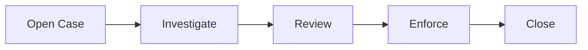

That diagram is useful as an executive summary, but it is usually false as an executable model.

A real regulatory or enforcement case often has:

- uncertain sequence;
- long-running human work;
- parallel evidence streams;
- conditional escalation;
- legal hold;
- reviewer independence;
- reopening;
- cross-entity propagation;
- deadline pressure;
- partial decisions;
- audit requirements;
- manual override;
- operational repair.

Camunda 7 BPMN can model this well, but only if we separate **case state**, **process execution state**, **decision state**, and **evidence state**.

The goal of this part is to build the mental model and pattern vocabulary required to design regulatory workflows that remain understandable, auditable, and repairable under real production pressure.

---

## 1. Kaufman Deconstruction

Following Josh Kaufman's skill acquisition method, we deconstruct this topic into sub-skills that can be practiced independently.

| Sub-skill | What you must be able to do |
|---|---|
| Case lifecycle modelling | Define the durable business states of a case independently from BPMN tokens |
| Procedural orchestration | Use BPMN for ordered work, waits, escalation, and handoff |
| Evidence modelling | Keep evidence as domain data, not arbitrary process variables |
| Human workflow | Model assignment, review, maker-checker, escalation, and ownership |
| Defensible decisioning | Combine BPMN, DMN, domain records, and history for explainable outcomes |
| Cross-entity impact | Propagate effects across parties, accounts, licenses, transactions, or related cases |
| Change handling | Reopen, supplement, modify, migrate, and repair cases safely |
| Audit design | Preserve who/what/when/why without leaking sensitive data everywhere |
| Operational recovery | Make stuck states and manual correction first-class design concerns |

The practice target is not "draw a case workflow". The target is:

> Given a complex regulatory lifecycle, design a Camunda 7 process architecture that preserves business invariants, supports human judgment, and remains operationally recoverable.

---

## 2. Source Grounding

This part builds on Camunda 7 concepts already covered:

- BPMN executable elements: tasks, events, gateways, subprocesses, call activities.
- User tasks and task assignment.
- DMN decisions.
- Variables and typed values.
- History, incidents, job executor, and process instance modification.
- Process instance migration and restart.

Camunda 7.24 also includes a CMMN 1.1 implementation reference covering plan items, lifecycles, entry/exit criteria, human tasks, process tasks, case tasks, decision tasks, stages, milestones, sentries, and markers. However, this series is focused on **Java BPMN with Camunda 7**, so CMMN is treated as a conceptual comparison, not as the primary implementation style.

Official references:

- Camunda 7.24 Process Engine Concepts: https://docs.camunda.org/manual/7.24/user-guide/process-engine/process-engine-concepts/
- Camunda 7.24 BPMN 2.0 Reference: https://docs.camunda.org/manual/7.24/reference/bpmn20/
- Camunda 7.24 User Task Reference: https://docs.camunda.org/manual/7.24/reference/bpmn20/tasks/user-task/
- Camunda 7.24 DMN Engine: https://docs.camunda.org/manual/7.24/user-guide/dmn-engine/
- Camunda 7.24 Variables: https://docs.camunda.org/manual/7.24/user-guide/process-engine/variables/
- Camunda 7.24 History: https://docs.camunda.org/manual/7.24/user-guide/process-engine/history/
- Camunda 7.24 CMMN 1.1 Reference: https://docs.camunda.org/manual/7.24/reference/cmmn11/

---

## 3. Core Mental Model: Case Is Not Process

A case is a **domain aggregate**.

A BPMN process instance is an **execution controller**.

They overlap, but they are not the same object.

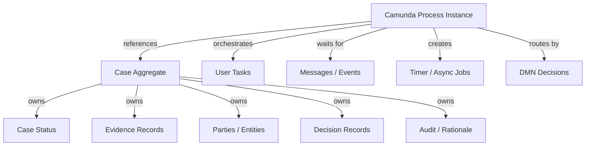

A strong design usually has this shape:

| Concern | Owned by |
|---|---|
| Business case id | Domain application |
| Case status | Domain aggregate/read model |
| Process instance id | Camunda/runtime metadata |
| Human tasks | Camunda TaskService |
| Evidence files | Domain document/evidence service |
| Legal rationale | Domain decision record |
| Timers and escalations | Camunda BPMN |
| Audit trail | Camunda history + domain audit |
| Corrective operations | Controlled admin service |

The process instance should reference the case by `businessKey` and/or a stable `caseId` variable.

The case aggregate should not depend on Camunda execution internals such as execution id, job id, or activity instance id as part of its business identity.

### 3.1 Why This Separation Matters

If the case state is only "where the token currently is", you cannot model:

- multiple active investigations;
- reopened cases;
- evidence supplement while review is active;
- external legal hold;
- partial decision;
- appeal after closure;
- cross-case linkage;
- manual correction;
- migration from one process definition to another.

Camunda runtime state is optimized for execution. Regulatory state is optimized for truth, defensibility, and domain querying.

The design principle:

> Use BPMN to coordinate work. Use domain data to represent legally meaningful state.

---

## 4. Case State vs Process State

A typical enforcement case may have these domain states:

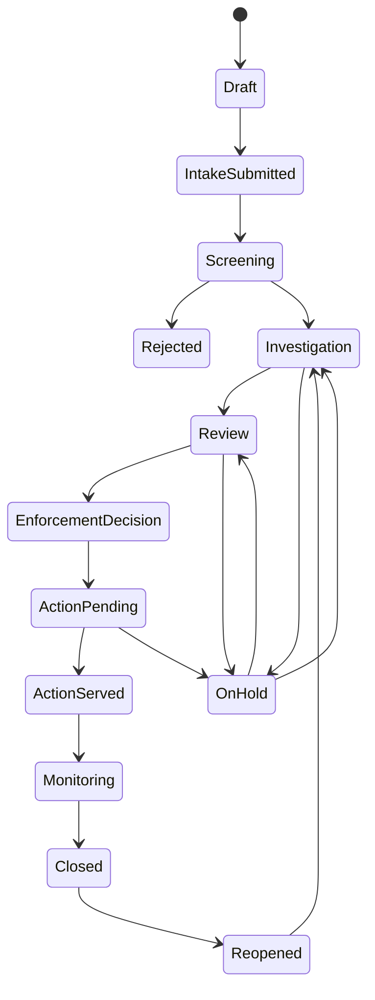

But the BPMN process may have active tokens like:

- `Collect Evidence`;
- `Request External Report`;
- `Supervisor Review`;
- `Wait for Party Response`;
- `Escalation Timer`;
- `Legal Hold Boundary Event`;
- `Prepare Enforcement Notice`.

These are not the same axis.

### 4.1 Example

Domain state:

```text
Case status = Investigation
```

Process execution state:

```text
Active activities:
- Investigator Review User Task
- Wait for Bank Response Message Event
- SLA Timer Job
- Evidence Quality Check External Task
```

A single domain status can have multiple active process activities.

A single active process activity may not justify changing the domain status.

### 4.2 Practical Rule

Use domain status for:

- dashboard filtering;
- permissions;
- legal reporting;
- external API state;
- management reporting;
- case-level lifecycle;
- regulatory obligations.

Use process state for:

- task routing;
- wait states;
- escalation;
- retry;
- operational diagnosis;
- workflow orchestration.

---

## 5. Recommended Architecture for Regulatory Case Workflow

A robust Camunda 7 case architecture usually has these components:

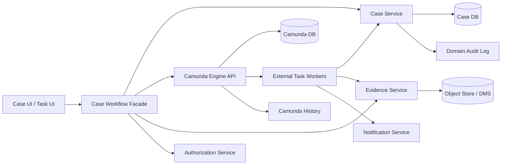

The façade is important. Do not let arbitrary UI screens or services directly manipulate process instances.

### 5.1 Case Workflow Facade Responsibilities

The façade should expose business operations:

```java
public interface CaseWorkflowFacade {
    CaseId openCase(OpenCaseCommand command);

    void submitIntake(CaseId caseId, SubmitIntakeCommand command);

    void completeScreening(CaseId caseId, ScreeningOutcome outcome);

    void claimInvestigationTask(TaskId taskId, UserId userId);

    void completeInvestigation(TaskId taskId, InvestigationCompletion command);

    void requestLegalHold(CaseId caseId, LegalHoldRequest command);

    void reopenCase(CaseId caseId, ReopenCaseCommand command);

    void escalate(CaseId caseId, EscalationCommand command);
}
```

It should hide technical operations:

- `RuntimeService.startProcessInstanceByKey(...)`;
- `TaskService.complete(...)`;
- `RuntimeService.correlateMessage(...)`;
- `ManagementService.setJobRetries(...)`;
- `RuntimeService.createProcessInstanceModification(...)`.

The façade becomes the policy boundary where you validate:

- user permission;
- case status;
- task ownership;
- required rationale;
- evidence completeness;
- duplicate command prevention;
- audit fields.

---

## 6. Pattern: Case Shell Process

A **case shell process** is a top-level BPMN process that represents the lifecycle of the case at a high level and delegates complex sections to subprocesses or call activities.

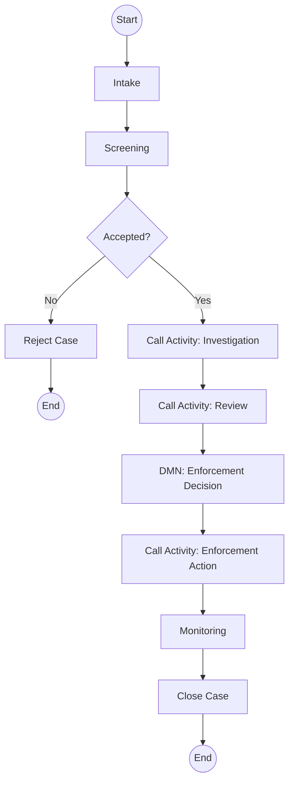

### 6.1 When to Use

Use a case shell process when:

- the lifecycle has clear macro phases;
- each phase is complex enough to own its own BPMN model;
- running instances may need migration per phase;
- teams have separate ownership over phase behavior;
- auditors need a readable high-level lifecycle.

### 6.2 Implementation Notes

Use the case id as the business key:

```java
runtimeService.startProcessInstanceByKey(
    "regulatoryCase",
    caseId.value(),
    Variables.putValue("caseId", caseId.value())
);
```

Use call activities for phase modules:

```xml
<bpmn:callActivity
    id="CallActivity_Investigation"
    name="Investigation"
    calledElement="caseInvestigation"
    camunda:calledElementBinding="latest">
  <bpmn:extensionElements>
    <camunda:in source="caseId" target="caseId" />
    <camunda:out source="investigationOutcome" target="investigationOutcome" />
  </bpmn:extensionElements>
</bpmn:callActivity>
```

Be deliberate with `calledElementBinding`.

| Binding | Use when |
|---|---|
| `latest` | New phase instance should always use latest version |
| `deployment` | Parent and child must be released as one tested package |
| `version` | Regulatory behavior must bind to a fixed approved version |
| `versionTag` | You have explicit version governance and release labels |

For regulated systems, `latest` is convenient but risky. A case that enters "Investigation" tomorrow may run a different subprocess version than one that entered yesterday. That can be correct only if version governance allows it.

### 6.3 Anti-Pattern

Do not make a 500-element BPMN model named `CaseLifecycle`.

The shell should show the lifecycle. The details should live in focused subprocesses.

---

## 7. Pattern: Investigation Workbench

The **investigation workbench** pattern separates evidence gathering from procedural approval.

An investigator often needs flexibility:

- add evidence;
- request information;
- wait for third parties;
- invite subject response;
- perform risk scoring;
- escalate to supervisor;
- pause for legal hold;
- close as no further action.

This is not always linear.

### 7.1 BPMN Shape

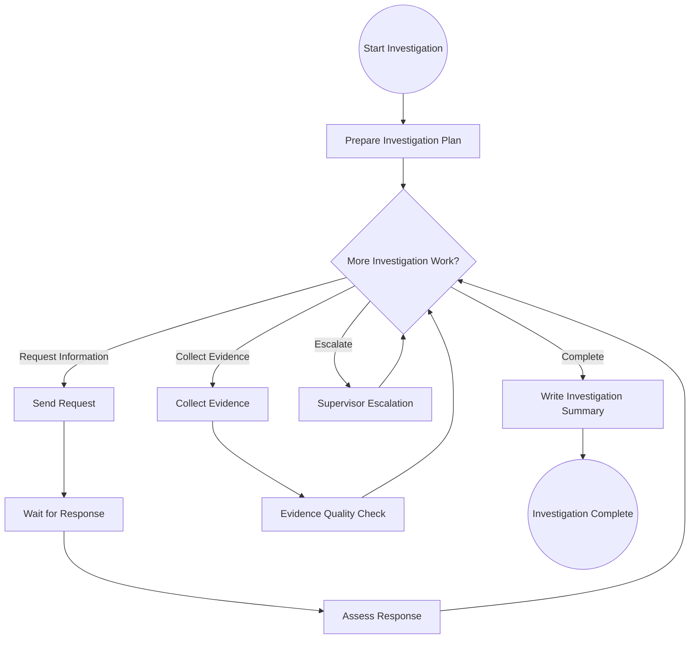

### 7.2 Design Tension

BPMN wants explicit paths.

Investigation work often wants dynamic task creation.

You have three implementation options:

| Option | Description | Best for | Risk |
|---|---|---|---|
| Explicit BPMN loop | Model repeated request/collect/assess steps | Common controlled variation | Can become large |
| Workbench domain tasks | Domain app manages investigation checklist; BPMN waits for completion | Highly dynamic evidence work | BPMN loses detail |
| Hybrid | BPMN orchestrates milestones; domain task system handles granular evidence work | Most regulatory case platforms | Requires clear boundary |

For advanced systems, the hybrid is often best.

### 7.3 Hybrid Design

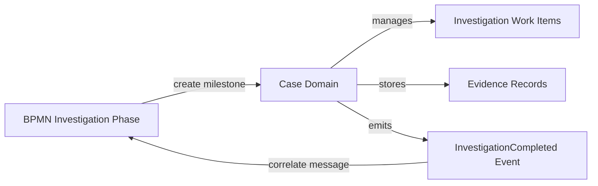

BPMN has a wait state:

```text
Wait for Investigation Completed
```

The case domain handles:

- dynamic evidence checklist;
- investigator notes;
- attachment metadata;
- source provenance;
- evidence validation;
- supplementary requests.

When the domain says the investigation phase is ready, it emits an event:

```json
{
  "eventId": "evt-7781",
  "eventType": "InvestigationCompleted",
  "caseId": "CASE-2026-000123",
  "completedBy": "user-413",
  "completedAt": "2026-06-27T09:30:00Z",
  "summaryId": "INV-SUM-9912"
}
```

The integration layer correlates:

```java
runtimeService.createMessageCorrelation("InvestigationCompleted")
    .processInstanceBusinessKey(caseId)
    .setVariable("investigationSummaryId", summaryId)
    .correlateWithResult();
```

### 7.4 Invariant

Never complete the BPMN investigation phase only because a user clicked "Done".

Complete it because the domain has validated:

- mandatory evidence exists;
- evidence provenance is recorded;
- no blocking information request is open;
- investigator declaration is captured;
- conflict-of-interest checks are complete;
- required risk score is present;
- completion rationale is stored.

---

## 8. Pattern: Evidence Collection Loop

Evidence collection is not just "upload file".

A defensible evidence record needs:

- source;
- timestamp;
- collector;
- chain of custody;
- document type;
- confidentiality classification;
- case relevance;
- verification status;
- replacement/supersession;
- retention category.

### 8.1 Domain Model

```java
public record EvidenceRecord(
    String evidenceId,
    String caseId,
    EvidenceType type,
    EvidenceSource source,
    ConfidentialityLevel confidentiality,
    VerificationStatus verificationStatus,
    String collectedBy,
    Instant collectedAt,
    String storageReference,
    String checksum,
    String rationale
) {}
```

Keep the evidence in a domain evidence service. Do not store file bytes as Camunda variables.

Use process variables only for stable references:

```json
{
  "caseId": "CASE-2026-000123",
  "primaryEvidenceBundleId": "EVB-2938",
  "evidenceCompleteness": "SUFFICIENT"
}
```

### 8.2 BPMN Shape

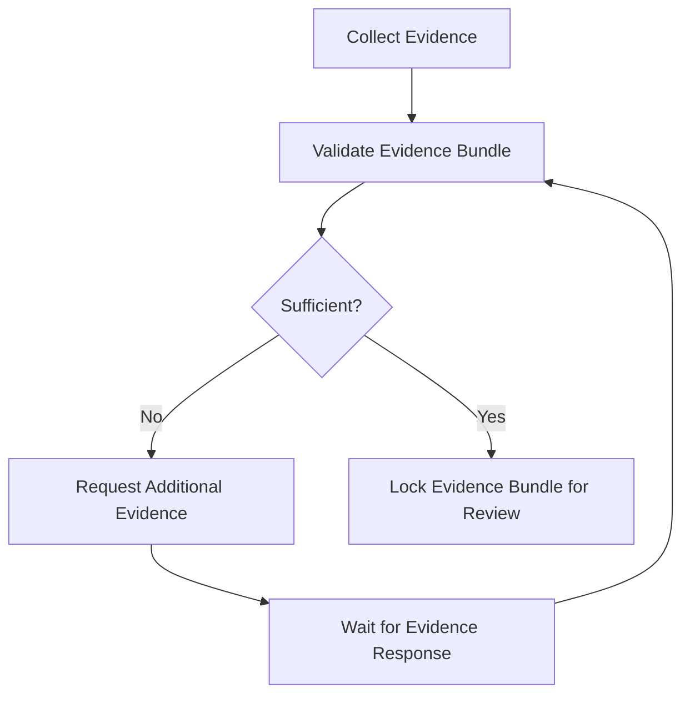

### 8.3 Anti-Patterns

| Anti-pattern | Why it fails |
|---|---|
| Store evidence payload in process variables | Bloats Camunda DB and creates security/retention problems |
| Store only file URL without metadata | Loses chain of custody and provenance |
| Let reviewer modify evidence directly | Breaks separation between evidence collection and review |
| No supersession model | Cannot explain which version was considered |
| Evidence completeness as a Boolean | Regulatory sufficiency usually has categories and rationale |

### 8.4 Quality Gate

Before moving to review, require a quality gate:

```java
public record EvidenceQualityResult(
    boolean sufficient,
    List<String> missingRequirements,
    List<String> warnings,
    String assessedBy,
    Instant assessedAt
) {}
```

Then route via DMN or gateway:

```java
DecisionResult result = decisionService.evaluateDecisionByKey("evidenceCompleteness")
    .variables(Variables
        .putValue("caseType", caseType)
        .putValue("riskBand", riskBand)
        .putValue("evidenceTypes", evidenceTypes)
        .putValue("hasSubjectResponse", hasSubjectResponse))
    .evaluate();
```

---

## 9. Pattern: Maker-Checker with Independence

Regulatory decisions frequently require independence:

- the creator cannot approve their own recommendation;
- supervisor review must come from a different unit;
- high-risk cases require legal review;
- enforcement action requires delegated authority.

### 9.1 BPMN Shape

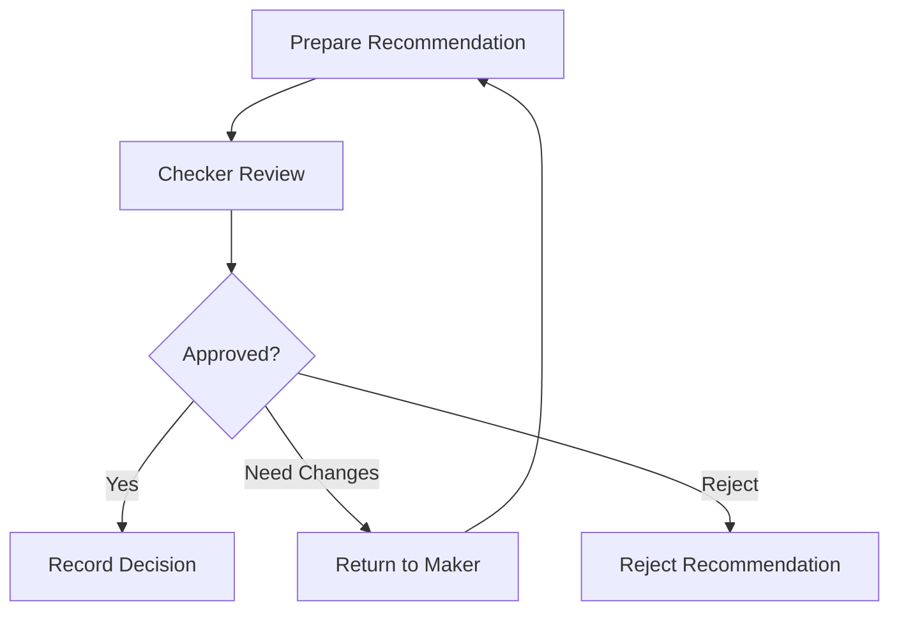

### 9.2 Invariant

The invariant is not "there are two user tasks".

The invariant is:

```text
Recommendation author and approval actor must be independent under the applicable policy.
```

This should be enforced in the application layer, not only by BPMN assignment.

```java
public void completeCheckerTask(String taskId, CheckerDecision decision, UserId actor) {
    Task task = taskService.createTaskQuery()
        .taskId(taskId)
        .singleResult();

    String caseId = (String) taskService.getVariable(taskId, "caseId");
    Recommendation recommendation = recommendationRepository.currentForCase(caseId);

    independencePolicy.assertCanApprove(
        actor,
        recommendation.author(),
        recommendation.riskBand(),
        recommendation.caseType()
    );

    decisionRepository.recordCheckerDecision(caseId, decision, actor);

    taskService.complete(taskId, Map.of(
        "checkerDecision", decision.outcome().name()
    ));
}
```

### 9.3 Why Not Just Use Candidate Groups?

Candidate groups are necessary but insufficient.

They answer:

> Who may see or claim the task?

They do not fully answer:

> Is this particular actor legally independent from the maker for this specific case?

That check may require domain data:

- case type;
- assigned unit;
- previous participation;
- relationship to subject;
- conflict declaration;
- delegated authority threshold.

### 9.4 Audit Record

Store a separate approval record:

```java
public record ApprovalRecord(
    String approvalId,
    String caseId,
    String taskId,
    String recommendationId,
    String approverUserId,
    ApprovalOutcome outcome,
    String rationale,
    Instant decidedAt,
    String policyVersion
) {}
```

Camunda history can prove the task was completed. The domain approval record explains the legal meaning of that completion.

---

## 10. Pattern: Escalation Ladder

Escalation in regulatory systems is not only a notification.

Escalation may change:

- owner;
- due date;
- priority;
- authority level;
- required review path;
- audit classification;
- reporting obligation.

### 10.1 BPMN Shape

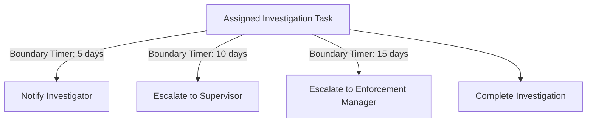

Use non-interrupting timers when the original work should continue.

Use interrupting timers when the original path must be stopped and replaced.

### 10.2 Escalation Event vs Timer Boundary

| Need | Prefer |
|---|---|
| Deadline reached | Timer boundary event |
| Business actor manually escalates | Message event or task completion outcome |
| Higher-level process must be notified | Signal only if broadcast is intentional |
| Current work should continue | Non-interrupting boundary event |
| Current work must be replaced | Interrupting boundary event |
| Escalation is a business outcome | Domain event + audit record |

### 10.3 Escalation Record

```java
public record EscalationRecord(
    String escalationId,
    String caseId,
    String sourceActivityId,
    EscalationLevel level,
    EscalationReason reason,
    String triggeredBy,
    Instant triggeredAt,
    String resultingOwner,
    String rationale
) {}
```

Without this domain record, you may only know that a timer fired, not why the escalation mattered.

---

## 11. Pattern: Legal Hold

Legal hold is a strong business condition.

It can mean:

- do not close the case;
- do not destroy records;
- suspend enforcement action;
- stop automated reminders;
- require legal sign-off;
- preserve all evidence;
- prevent modification except by authorized role.

### 11.1 BPMN Shape

A legal hold can be modelled as an event subprocess:

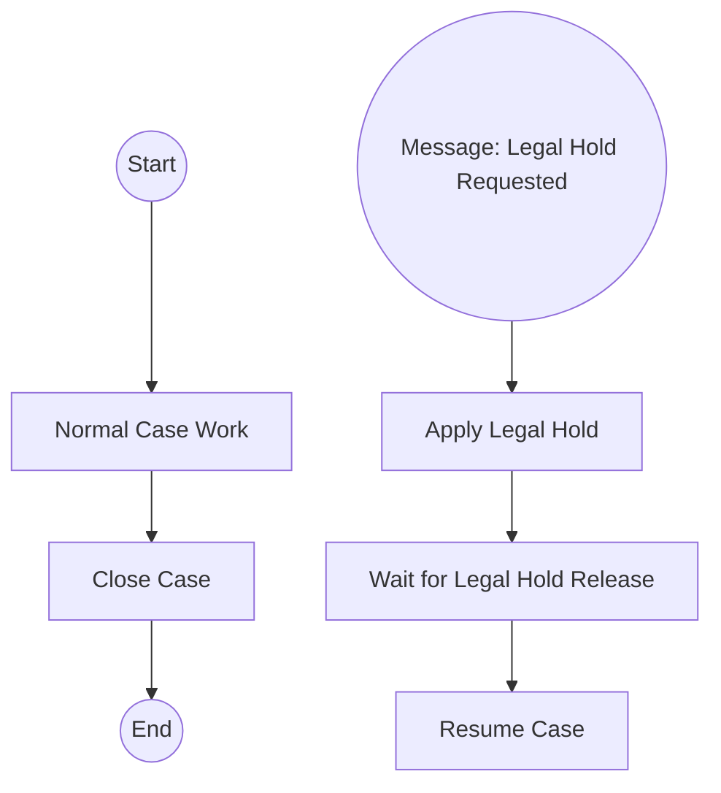

Conceptually, this is an interrupting or non-interrupting cross-cutting event depending on policy.

### 11.2 Prefer Domain Flag + BPMN Reaction

The domain case should have a durable legal hold flag:

```java
public record LegalHold(
    String holdId,
    String caseId,
    LegalHoldStatus status,
    String reason,
    String requestedBy,
    Instant requestedAt,
    String releasedBy,
    Instant releasedAt
) {}
```

The BPMN process should react:

```java
runtimeService.createMessageCorrelation("LegalHoldRequested")
    .processInstanceBusinessKey(caseId)
    .setVariable("legalHoldId", holdId)
    .correlate();
```

### 11.3 Guard Critical Commands

Even if the process is paused, application commands must still check the domain flag.

```java
public void closeCase(CaseId caseId, UserId actor) {
    CaseAggregate caze = caseRepository.get(caseId);

    if (caze.hasActiveLegalHold()) {
        throw new BusinessRuleViolation("Case cannot be closed during active legal hold");
    }

    caze.close(actor);
}
```

Do not rely only on "the BPMN token cannot reach Close Case".

A user, admin, migration, restart, or integration bug can bypass normal flow if the domain model has no guard.

---

## 12. Pattern: Cross-Entity Impact

A regulatory case may affect multiple entities:

- customer;
- account;
- license;
- merchant;
- transaction;
- branch;
- officer;
- related company;
- previous case;
- external filing.

### 12.1 Modelling Problem

If one case creates ten enforcement actions across ten entities, should we create:

1. one process instance with multi-instance branches;
2. one parent process and child process per entity;
3. one case domain aggregate with domain tasks;
4. separate cases linked by relation?

There is no universal answer.

### 12.2 Decision Matrix

| Scenario | Recommended shape |
|---|---|
| Same decision, multiple mechanical notifications | Multi-instance service task or external task |
| Each entity needs independent human review | Child process per entity |
| Entities may diverge into different lifecycle states | Separate related cases |
| Cross-entity linkage is only reporting metadata | Domain relation, not BPMN branch |
| Failure of one entity blocks all | Parent orchestrates and joins |
| Failure of one entity should not block all | Parent monitors child outcomes asynchronously |

### 12.3 Parent-Child Process Design

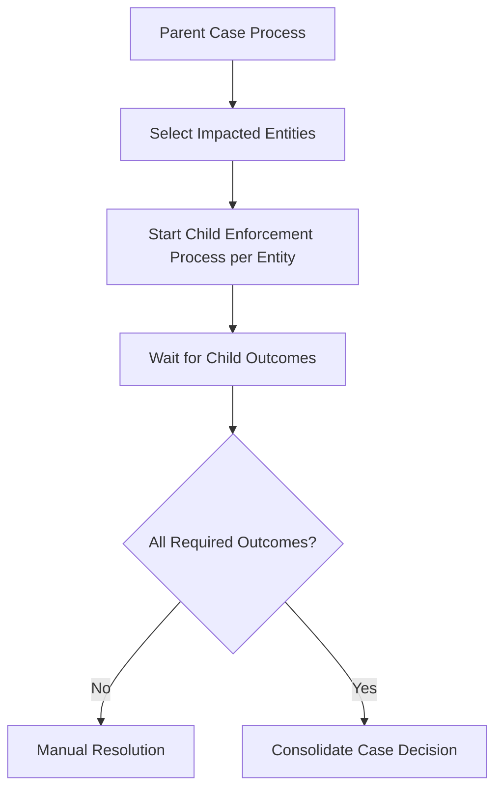

Each child process gets:

- same `caseId`;
- unique `entityId`;
- unique `businessKey`, for example `CASE-2026-000123:ENTITY-991`;
- child-specific decision variables.

### 12.4 Avoid Over-Joining

Parallel joins can become dangerous if some branches are optional, cancelled, or manually resolved.

Prefer explicit aggregation state:

```java
public record EntityOutcome(
    String caseId,
    String entityId,
    OutcomeStatus status,
    boolean requiredForClosure,
    Instant completedAt
) {}
```

Then parent process waits for a domain event:

```text
AllRequiredEntityOutcomesCompleted
```

This avoids making BPMN token joins carry complex domain semantics.

---

## 13. Pattern: Subject Response Window

Many regulatory workflows require the subject to respond within a window.

### 13.1 BPMN Shape

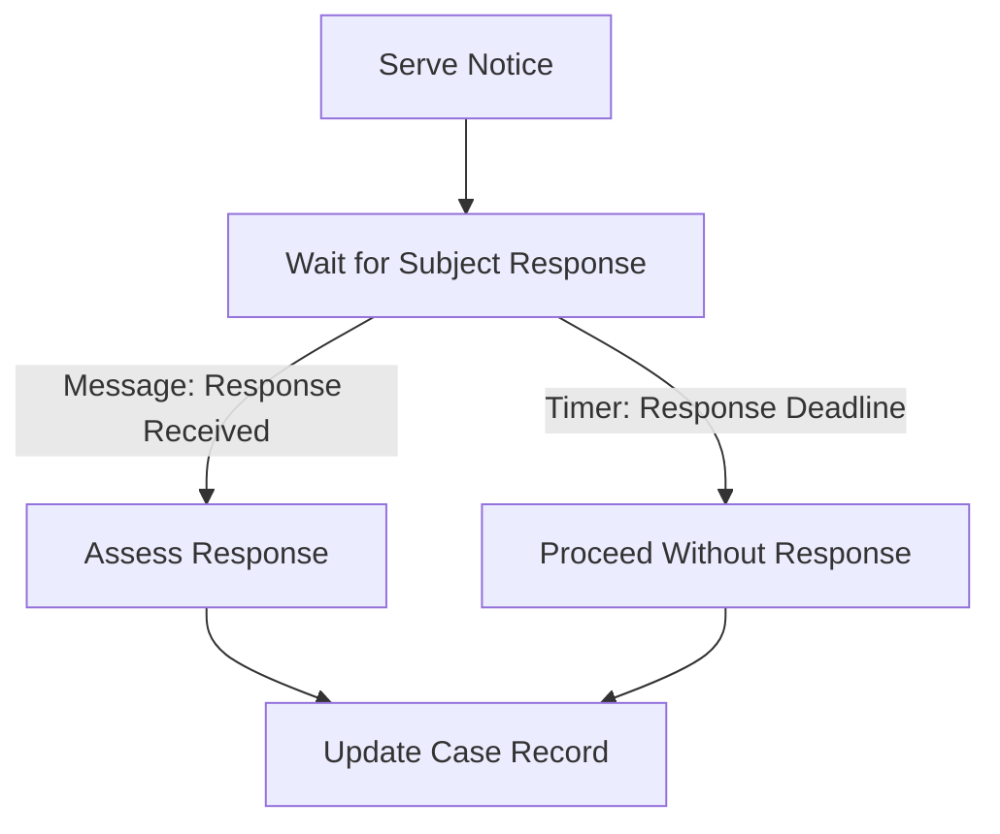

This is a classic event race: either message or timer wins.

### 13.2 Design Requirements

The response window needs a domain record:

```java
public record ResponseWindow(
    String windowId,
    String caseId,
    String noticeId,
    Instant openedAt,
    Instant dueAt,
    ResponseWindowStatus status,
    String responseId,
    Instant respondedAt
) {}
```

Do not rely only on timer existence.

You need the domain record because:

- legal due date may be extended;
- subject may submit late response;
- response may be invalid;
- service date may be disputed;
- deadline basis may be audited.

### 13.3 Deadline Change

If the response deadline changes, update both:

1. the domain response window due date;
2. the Camunda timer trigger, if needed.

In Camunda 7, changing an existing timer is not a simple "set date" operation in BPMN. Often you model deadline change as:

- cancel current waiting activity and start a new one via process instance modification;
- or design the wait state to consult the domain due date at timer fire and reschedule if not due;
- or place deadline handling in domain scheduler and correlate message to BPMN.

For regulatory systems, the second and third options are often safer because all deadline changes are explicit domain records.

---

## 14. Pattern: Appeal and Reopening

Closure is often not final.

A case can be reopened because of:

- appeal;
- new evidence;
- court order;
- internal quality review;
- mistaken closure;
- migration repair;
- external regulator request.

### 14.1 BPMN Shape

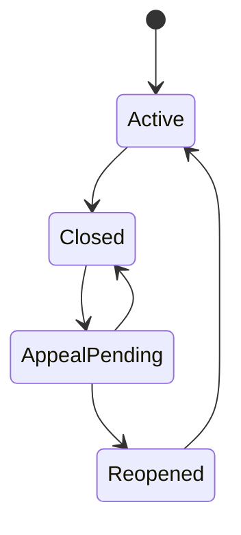

### 14.2 Two Implementation Styles

| Style | Description | Best when |
|---|---|---|
| Long-running process remains open at "Closed" wait state | Process waits for reopen/appeal message | Reopen is common and process retention allows it |
| Process ends and restart/new process handles reopening | Closed case has no active process until reopen | Reopen is rare or retention/cost matters |

A long-running wait state at closure is operationally convenient but can keep many process instances alive.

An ended process with a reopening process is cleaner for large-volume systems.

### 14.3 Reopen as New Chapter

A good pattern is to keep one case aggregate but create a new **case chapter**:

```java
public record CaseChapter(
    String chapterId,
    String caseId,
    ChapterType type,
    int sequence,
    String openedBy,
    Instant openedAt,
    String reason,
    ChapterStatus status
) {}
```

A reopened case is not the same as pretending closure never happened.

It is a new chapter with explicit reason and authority.

---

## 15. Pattern: Manual Override with Governance

Manual override is unavoidable in serious systems.

The anti-pattern is hiding override under admin-only database update or arbitrary process instance modification.

### 15.1 Override Types

| Override type | Example |
|---|---|
| Assignment override | Reassign task from absent investigator |
| Deadline override | Extend response window |
| Path override | Skip a task due to exceptional policy |
| Evidence override | Accept incomplete evidence with justification |
| Decision override | Senior official overrides recommendation |
| Process repair | Cancel wrong activity and start correct one |
| Migration override | Move running instance to new process version |

### 15.2 Design Principle

Every override requires:

- authority;
- reason;
- scope;
- before state;
- after state;
- timestamp;
- actor;
- approver if needed;
- linkage to process operation.

```java
public record OverrideRecord(
    String overrideId,
    String caseId,
    OverrideType type,
    String requestedBy,
    String approvedBy,
    String reason,
    String beforeSnapshotRef,
    String afterSnapshotRef,
    Instant executedAt,
    String processOperationRef
) {}
```

### 15.3 BPMN Shape

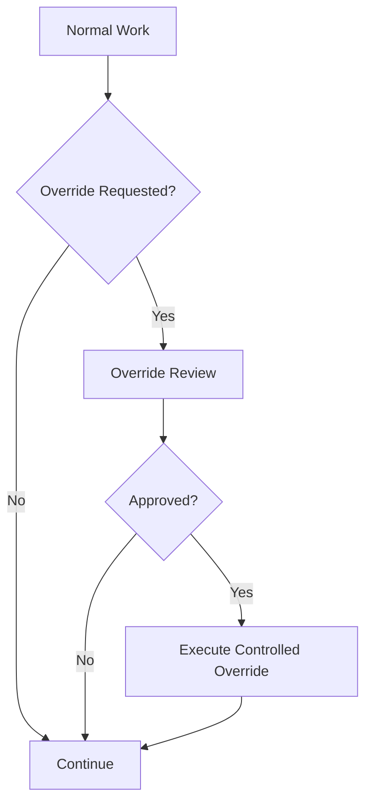

### 15.4 Execute Through Service

Do not let operators call `RuntimeService` directly from random scripts.

Create a controlled service:

```java
public class CaseOverrideService {

    public void skipEvidenceCollection(
        CaseId caseId,
        String activityInstanceId,
        OverrideApproval approval
    ) {
        overridePolicy.assertApproved(approval, OverrideType.SKIP_EVIDENCE_COLLECTION);

        String processInstanceId = processIndex.findProcessInstanceId(caseId);

        RuntimeService runtime = processEngine.getRuntimeService();

        runtime.createProcessInstanceModification(processInstanceId)
            .cancelActivityInstance(activityInstanceId)
            .startBeforeActivity("ReviewRecommendation")
            .setVariable("evidenceOverrideApproved", true)
            .execute();

        overrideRepository.record(...);
    }
}
```

Every dangerous engine operation must be wrapped in a business operation.

---

## 16. Pattern: Regulatory Decision Record

A process outcome is not a decision record.

A decision record should capture:

- legal basis;
- policy version;
- inputs considered;
- decision maker;
- authority;
- rationale;
- evidence bundle;
- dissent or comments;
- effective date;
- notification requirements;
- appeal rights;
- publication rules.

### 16.1 Decision Record Model

```java
public record RegulatoryDecision(
    String decisionId,
    String caseId,
    DecisionType type,
    DecisionOutcome outcome,
    String decisionMaker,
    String authorityBasis,
    String policyVersion,
    String evidenceBundleId,
    String rationale,
    Instant decidedAt,
    Instant effectiveAt
) {}
```

### 16.2 BPMN Shape

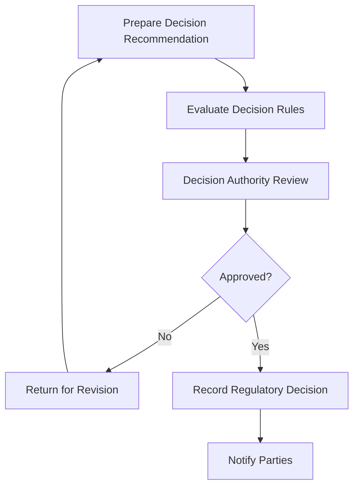

### 16.3 DMN Role

Use DMN for deterministic decision aids:

- required authority level;
- required evidence classes;
- penalty band;
- review route;
- notification requirement;
- appeal window;
- publication rule.

Do not use DMN as the only record of the final decision.

DMN can say:

```text
PenaltyBand = HIGH
RequiredReviewer = SENIOR_MANAGER
AppealWindowDays = 30
```

The final decision record says:

```text
Senior Manager X decided Enforcement Action Y for reason Z based on evidence bundle E.
```

---

## 17. Pattern: Case Projection for Query and Reporting

Do not query Camunda runtime tables as your primary case dashboard.

A case dashboard needs business concepts:

- case number;
- subject;
- risk band;
- current owner;
- due date;
- legal hold status;
- open tasks;
- current phase;
- SLA breach;
- enforcement action;
- appeal status.

Build a projection:

```java
public record CaseDashboardRow(
    String caseId,
    String caseNumber,
    String subjectName,
    CaseStatus status,
    String currentPhase,
    String primaryOwner,
    RiskBand riskBand,
    Instant nextDueAt,
    boolean legalHold,
    int openTaskCount,
    boolean slaBreached
) {}
```

The projection can consume:

- domain events;
- TaskService events or task polling;
- Camunda history;
- process instance lifecycle events;
- external worker events.

### 17.1 Why Projection Matters

Camunda's execution state is precise but not always useful for business search.

A manager asks:

> Which high-risk enforcement cases are due this week and blocked by external response?

That is a business query.

Do not implement it with fragile SQL joins over `ACT_RU_*`.

---

## 18. Pattern: Case Timeline

Regulatory defensibility needs timeline reconstruction.

A good case timeline combines:

- domain audit;
- task events;
- decision events;
- evidence events;
- process milestones;
- notices;
- external responses;
- override records.

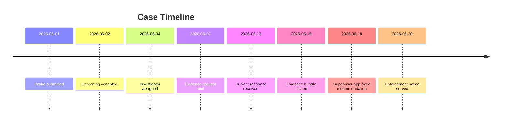

### 18.1 Timeline Event Contract

```java
public record CaseTimelineEvent(
    String eventId,
    String caseId,
    TimelineEventType type,
    String title,
    String actor,
    Instant occurredAt,
    String sourceSystem,
    String sourceReference,
    Map<String, String> attributes
) {}
```

Make the timeline explicit. Do not expect auditors to inspect raw process variables and history tables.

---

## 19. Pattern: Policy Versioning

Regulatory workflow is driven by policy.

Policy changes may affect:

- screening threshold;
- risk scoring;
- required review level;
- appeal window;
- evidence sufficiency;
- penalty matrix;
- notification wording.

### 19.1 Version Everything That Affects Outcome

| Artifact | Versioning approach |
|---|---|
| BPMN process | Camunda process definition version + release notes |
| DMN decision | Decision definition version + decision requirements version |
| Policy document | Legal/policy document version |
| Form template | Form version |
| Notice template | Template version |
| Evidence checklist | Checklist version |
| Authority matrix | Config/DMN version |
| Java code | Git commit/build version |

### 19.2 Store Applied Versions

```java
public record AppliedPolicyContext(
    String caseId,
    String processDefinitionId,
    String decisionDefinitionId,
    String policyVersion,
    String formVersion,
    String noticeTemplateVersion,
    String applicationBuildVersion
) {}
```

This is essential when a case is challenged months later.

The question is not only:

> What is the rule today?

The question is:

> What rule was applied to this case at that time, and why?

---

## 20. Pattern: Quality Review and Sampling

Regulatory systems often require quality assurance:

- sample completed cases;
- review high-risk decisions;
- review random percentage;
- review new staff decisions;
- review post-closure complaints.

### 20.1 BPMN Shape

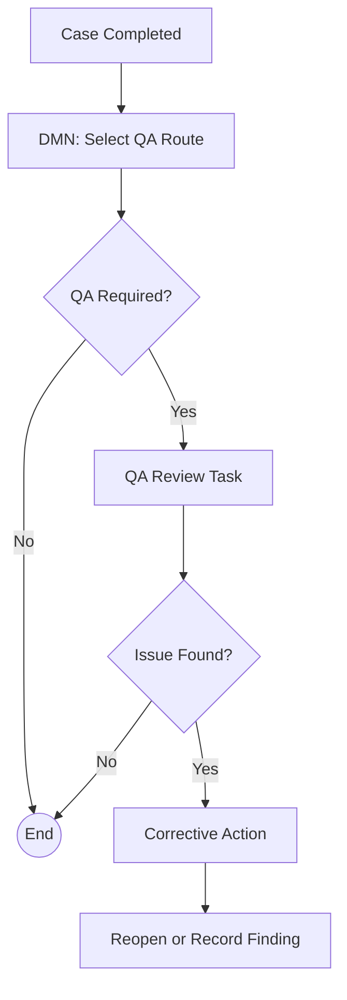

### 20.2 DMN Inputs

- risk band;
- enforcement amount;
- staff tenure;
- case type;
- previous QA findings;
- random sampling seed;
- legal sensitivity.

### 20.3 Audit Outcome

Quality review should not silently mutate the original case.

Create a QA finding record:

```java
public record QualityFinding(
    String findingId,
    String caseId,
    QualityFindingSeverity severity,
    String reviewer,
    String rationale,
    String correctiveAction,
    Instant foundAt
) {}
```

---

## 21. Pattern: Confidentiality and Need-to-Know

Case workflows often contain sensitive data.

Confidentiality is not a UI-only concern.

### 21.1 Data Classification

Classify:

- case metadata;
- subject identity;
- evidence;
- decision rationale;
- legal advice;
- whistleblower information;
- privileged communication;
- enforcement notices.

### 21.2 Process Variable Rule

Do not put highly sensitive detail into general process variables.

Prefer:

```json
{
  "caseId": "CASE-2026-000123",
  "confidentialityLevel": "RESTRICTED",
  "evidenceBundleId": "EVB-2938"
}
```

over:

```json
{
  "whistleblowerName": "...",
  "rawComplaintText": "...",
  "legalAdvice": "..."
}
```

Process variables may appear in logs, history, Cockpit, REST responses, or debugging tools depending on configuration and authorization.

### 21.3 Authorization Strategy

Authorization must be enforced at multiple layers:

- API/facade permission;
- task candidate/assignee;
- case domain permission;
- evidence service permission;
- admin operation permission;
- reporting/export permission.

---

## 22. Pattern: Split Operational and Legal Closure

Operational closure means workflow work is done.

Legal closure means the case is legally closed.

They are not always the same.

### 22.1 Example

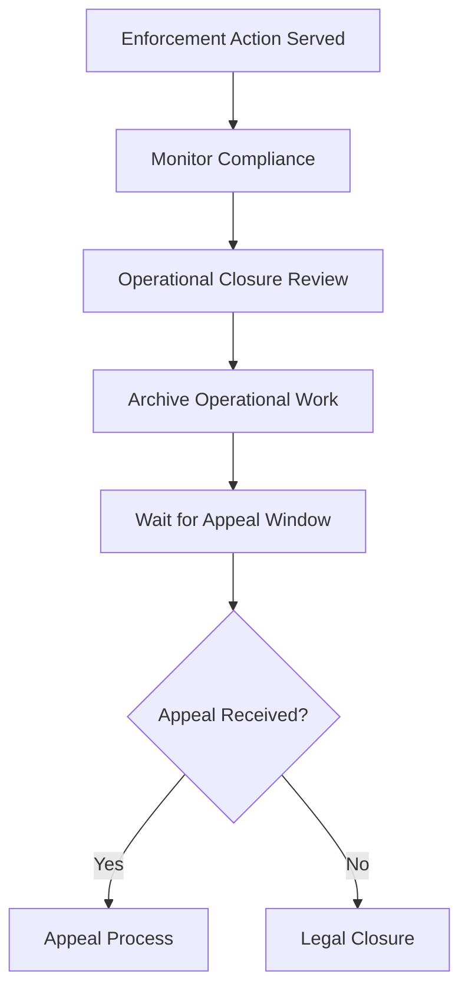

Operational closure can happen before legal closure.

If you collapse both into one `Close Case` task, you lose legal precision.

---

## 23. Pattern: External Agency Interaction

Regulatory workflows often interact with external agencies:

- courts;
- banks;
- police;
- licensing boards;
- tax authorities;
- other regulators.

### 23.1 BPMN Shape

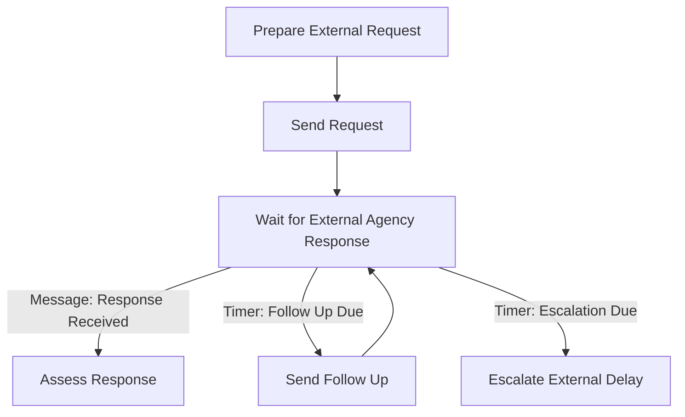

### 23.2 Integration Rules

- Use message correlation for targeted responses.
- Use idempotency keys on incoming external messages.
- Store external reference numbers.
- Treat late responses as domain events even if BPMN has moved on.
- Keep external payload in domain store, not process variable blob.
- Record proof of send/receipt.

---

## 24. Pattern: Enforcement Notice Generation

Notice generation must be deterministic, reviewable, and reproducible.

### 24.1 Components

| Component | Owner |
|---|---|
| Notice template | Document/template service |
| Case data | Case service |
| Decision data | Decision record |
| Evidence summary | Evidence service |
| Rendered document | Document service |
| Service event | Notification/service-of-process system |
| BPMN orchestration | Camunda |

### 24.2 BPMN Shape

```mermaid
flowchart TD
    A[Record Decision] --> B[Generate Draft Notice]
    B --> C[Legal Review Notice]
    C --> D{Approved?}
    D -->|No| E[Revise Notice]
    E --> C
    D -->|Yes| F[Serve Notice]
    F --> G[Record Service]
```

### 24.3 Anti-Pattern

Do not generate notice text inside a JavaDelegate from process variables.

Use a document generation service with:

- template version;
- input snapshot;
- rendering timestamp;
- generated file checksum;
- reviewer approval;
- service record.

---

## 25. Pattern: Time Semantics

Time is legally important.

A deadline may depend on:

- submission timestamp;
- business day calendar;
- timezone;
- service date;
- public holiday;
- extension;
- suspension period;
- legal hold;
- court order.

### 25.1 Domain Deadline Model

```java
public record LegalDeadline(
    String deadlineId,
    String caseId,
    DeadlineType type,
    Instant baseTime,
    String timezone,
    int durationDays,
    BusinessCalendarId calendarId,
    Instant dueAt,
    DeadlineStatus status,
    String basis
) {}
```

### 25.2 BPMN Timer

Use BPMN timer for operational wake-up, not as the only source of truth.

The timer says:

> wake this process at this time.

The domain deadline says:

> this is the legally meaningful due date and how it was calculated.

### 25.3 Timer Firing Guard

When a timer fires, re-check the domain deadline:

```java
public void onDeadlineTimer(DelegateExecution execution) {
    String caseId = (String) execution.getVariable("caseId");
    LegalDeadline deadline = deadlineRepository.findActive(caseId, DeadlineType.SUBJECT_RESPONSE);

    if (!deadline.isDue(clock.instant())) {
        throw new NotYetDueException("Timer fired but domain deadline has been extended");
    }

    caseService.markResponseWindowExpired(caseId);
}
```

Then design retry or rescheduling behavior deliberately.

---

## 26. Pattern: Case Event Taxonomy

A case system needs a clear event taxonomy.

### 26.1 Event Categories

| Category | Example |
|---|---|
| Lifecycle | `CaseOpened`, `CaseClosed`, `CaseReopened` |
| Assignment | `InvestigatorAssigned`, `TaskReassigned` |
| Evidence | `EvidenceAdded`, `EvidenceBundleLocked` |
| Decision | `RecommendationSubmitted`, `DecisionApproved` |
| Deadline | `DeadlineCreated`, `DeadlineExtended`, `DeadlineBreached` |
| Communication | `NoticeServed`, `ResponseReceived` |
| Override | `ManualOverrideApproved`, `ProcessRepairExecuted` |
| External | `AgencyResponseReceived`, `CourtOrderReceived` |
| Security | `RestrictedEvidenceAccessed` |

### 26.2 Process Correlation Events

Not every domain event should correlate into BPMN.

Only correlate events that the process is explicitly waiting for or must react to.

| Domain event | BPMN correlation? |
|---|---|
| `EvidenceAdded` | Usually no |
| `EvidenceBundleLocked` | Maybe yes |
| `InvestigationCompleted` | Yes |
| `RestrictedEvidenceAccessed` | No, audit only |
| `SubjectResponseReceived` | Yes |
| `DeadlineExtended` | Maybe, depending timer design |
| `CourtOrderReceived` | Yes if it changes flow |
| `CaseNoteAdded` | No |

---

## 27. Anti-Pattern Catalog

### 27.1 Linear Case Fantasy

Symptoms:

- every case goes through the same line;
- reopen is missing;
- appeal is bolted on later;
- legal hold is not modelled;
- external delays are ignored;
- investigation variation is hidden in notes.

Fix:

- separate macro lifecycle from dynamic investigation tasks;
- add explicit wait states and exceptional events;
- model reopen/appeal as first-class paths.

### 27.2 Process Variable as Case Database

Symptoms:

- hundreds of variables;
- JSON blobs holding full case;
- UI reads variables directly;
- business reports query Camunda tables;
- migration breaks object deserialization.

Fix:

- keep case aggregate in domain DB;
- use Camunda variables for routing references and small state;
- expose case API/projection.

### 27.3 Audit by Accident

Symptoms:

- "Camunda history has it" is the audit strategy;
- no rationale records;
- no policy version;
- no evidence snapshot;
- no override reason;
- no legal authority record.

Fix:

- create explicit domain audit and timeline;
- use Camunda history as execution trace, not full legal explanation.

### 27.4 Human Override via SQL

Symptoms:

- support team updates `ACT_RU_*` tables;
- process repairs are not recorded;
- task reassignment has no reason;
- replay is impossible.

Fix:

- build controlled override service;
- record before/after snapshots;
- require authorization and approval.

### 27.5 Signal for Targeted Events

Symptoms:

- one signal wakes multiple unrelated cases;
- event handling becomes nondeterministic;
- duplicate effects occur.

Fix:

- use message correlation for targeted case events;
- use signal only for intentional broadcast.

### 27.6 One Giant Regulatory Process

Symptoms:

- BPMN model unreadable;
- every policy change touches same file;
- testing takes too long;
- migration impossible to reason about.

Fix:

- shell process + call activities;
- DMN for decisions;
- domain workbench for dynamic parts;
- explicit version strategy.

---

## 28. Case Design Checklist

Before approving a regulatory BPMN design, answer these questions.

### 28.1 Identity

- What is the business key?
- What is the case id?
- Can multiple process instances exist for one case?
- How are child processes linked?
- How do we find active process instance for a case?

### 28.2 State

- What is domain case status?
- What is BPMN process state?
- What states are legally meaningful?
- What states are operational only?
- What happens after closure?

### 28.3 Evidence

- Where is evidence stored?
- How is provenance captured?
- How is evidence locked for decision?
- How are superseded records handled?
- Who can view restricted evidence?

### 28.4 Decision

- What decision record is created?
- Which policy version applies?
- Which DMN decisions support it?
- What rationale is required?
- Who has authority?

### 28.5 Human Workflow

- Who can claim tasks?
- Who can complete tasks?
- What independence rules apply?
- How are reassignment and delegation audited?
- What happens when users are absent?

### 28.6 Time

- What deadlines exist?
- Which calendar/timezone applies?
- What extends or pauses deadline?
- What timer wakes the process?
- What is legally due vs operationally scheduled?

### 28.7 Events

- Which domain events exist?
- Which events correlate to BPMN?
- What is idempotency key?
- How are late events handled?
- How are duplicates handled?

### 28.8 Operations

- How are incidents triaged?
- What repair operations are allowed?
- Who can execute overrides?
- What gets recorded?
- Can repair be tested in lower environment?

### 28.9 Versioning

- What happens to running cases after process change?
- Which cases migrate?
- Which remain on old version?
- Are current tasks semantically equivalent?
- How are policy versions stored?

---

## 29. Deliberate Practice

### Exercise 1 — Split Case State from Process State

Given this status list:

```text
OPEN
INVESTIGATING
AWAITING_SUBJECT_RESPONSE
UNDER_REVIEW
ACTION_PENDING
CLOSED
REOPENED
```

Separate into:

- domain status;
- BPMN activity;
- timer condition;
- task state;
- communication state.

Expected insight: `AWAITING_SUBJECT_RESPONSE` might be a response window domain object and BPMN wait state, but not necessarily a top-level case status.

### Exercise 2 — Design Evidence Workflow

Create a BPMN model for:

- add evidence;
- validate evidence;
- request more evidence;
- lock bundle;
- reviewer requests supplement;
- supplement added after review starts.

Then identify which data belongs in domain store vs process variables.

### Exercise 3 — Model Legal Hold

Design legal hold as:

1. interrupting event subprocess;
2. non-interrupting event subprocess;
3. domain flag only plus command guards.

Compare consequences.

### Exercise 4 — Build Override Policy

Define an override matrix:

| Operation | Who can request | Who approves | Required reason | Process operation |
|---|---|---|---|---|

Include at least:

- reassign task;
- extend deadline;
- skip evidence;
- restart closed case;
- migrate running case.

---

## 30. Top 1% Engineering Heuristics

1. **Never confuse token position with legal state.**
2. **Keep domain truth outside Camunda runtime variables.**
3. **Use BPMN for orchestration, not as your case database.**
4. **Treat every manual override as a product feature, not an admin hack.**
5. **Model legal hold, appeal, reopening, and external delay from day one.**
6. **Use DMN for decision support, not for hiding unreviewed policy.**
7. **Make evidence provenance explicit.**
8. **Build a case timeline projection.**
9. **Store applied policy versions.**
10. **Design repair and migration before production incidents force them.**

---

## 31. Summary

Complex regulatory case management is not about drawing a more complicated BPMN diagram.

It is about splitting the system into the right responsibilities:

- domain case aggregate for truth;
- BPMN process for orchestration;
- DMN for deterministic decision support;
- task service for human work;
- evidence service for provenance;
- audit/timeline projection for defensibility;
- controlled operations for repair.

The mature mental model is:

> A regulatory workflow is a legally meaningful case lifecycle coordinated by a process engine, not a process engine instance pretending to be the case.

In the next part, we go deeper into dynamic workflows, process versioning, process instance migration, process instance modification, restart, and safe change management for running Camunda 7 systems.
