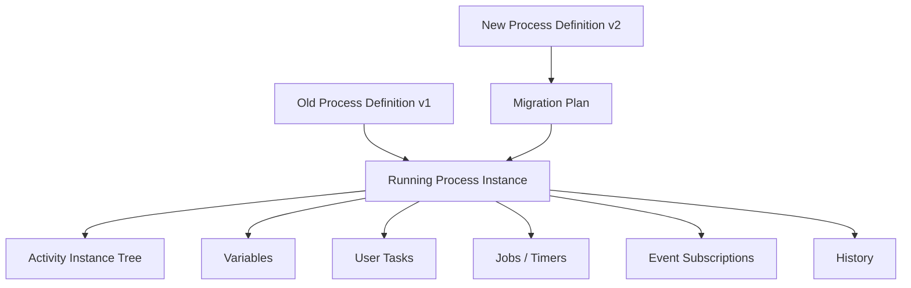
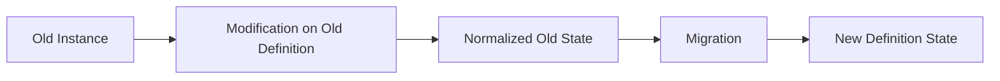
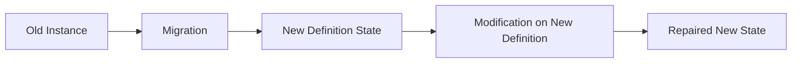
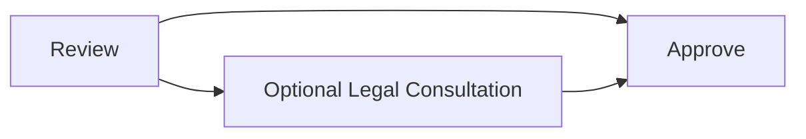

# Part 030 — Dynamic Workflows, Change Management, and Process Instance Modification

A process model is a program.

A running process instance is a long-lived execution of that program.

In normal application development, when you deploy a new version of code, active requests finish in milliseconds or seconds. In workflow systems, active process instances may live for days, months, or years.

That changes everything.

This part covers how to think about dynamic workflow change in Camunda 7:

- process definition versioning;
- compatibility;
- migration;
- modification;
- restart;
- suspension;
- repair;
- operational governance;
- testing change safely.

The central question:

> When the process model changes, what should happen to already-running process instances?

The wrong answer is:

> They automatically use the new model.

In Camunda 7, they do not. Existing process instances remain on their original process definition unless you explicitly migrate or modify them.

---

## 1. Kaufman Deconstruction

We decompose dynamic workflow change into sub-skills.

| Sub-skill | Capability |
|---|---|
| Version awareness | Know which process definition version an instance is running |
| Compatibility analysis | Determine whether old and new activities are semantically equivalent |
| Migration planning | Build and validate migration plans |
| Modification | Cancel/start activities inside a running instance safely |
| Restart | Recreate terminated process instances from history |
| Suspension | Pause definitions/instances/jobs intentionally |
| Repair operation design | Wrap engine operations in business-safe services |
| Audit governance | Record why a change was made and who approved it |
| Testing | Prove migration/repair works before production |

The target skill is not "know the API".

The target skill is:

> Given a running population of process instances and a changed BPMN model, choose whether to leave, migrate, modify, restart, or manually repair each group without violating business invariants.

---

## 2. Source Grounding

Official Camunda 7.24 references used in this part:

- Process Versioning: https://docs.camunda.org/manual/7.24/user-guide/process-engine/process-versioning/
- Process Instance Migration: https://docs.camunda.org/manual/7.24/user-guide/process-engine/process-instance-migration/
- Process Instance Modification: https://docs.camunda.org/manual/7.24/user-guide/process-engine/process-instance-modification/
- Process Instance Restart: https://docs.camunda.org/manual/7.24/user-guide/process-engine/process-instance-restart/
- RuntimeService Javadoc: https://docs.camunda.org/manual/7.24/reference/javadoc/
- REST API: https://docs.camunda.org/manual/7.24/reference/rest/
- Cockpit Enterprise features for migration/modification/restart: https://docs.camunda.org/manual/7.24/webapps/cockpit/

Key facts:

- Deploying a new process definition version does not automatically affect existing running instances.
- Process instance migration has two steps: create a migration plan, then apply it to instances.
- Migration maps semantically equivalent activities and preserves activity/task/variable state when possible.
- For non-equivalent activities, Camunda recommends combining migration with process instance modification.
- Process instance modification can start or cancel activities in a running process.
- Restart creates a new process instance from historic data and requires sufficient history.

---

## 3. Mental Model: Workflow Change Is State Surgery

A process instance has:

- process definition id;
- activity instance tree;
- execution tree;
- active tasks;
- jobs;
- event subscriptions;
- variables;
- incidents;
- history;
- business meaning.

Changing it is not just "moving a pointer".



A migration or modification may affect:

| Runtime object | Possible effect |
|---|---|
| Activity instance | Mapped, cancelled, newly started |
| Task instance | Preserved, cancelled, recreated |
| Variables | Preserved, shadowed, added, removed manually |
| Timer job | Preserved, recreated, event trigger updated |
| Message subscription | Preserved or changed depending mapping |
| Incident | May remain, resolve, or become irrelevant |
| History | Records operations, but not full business rationale |
| Domain state | Must be checked separately |

Top-level principle:

> A process change is safe only if runtime state and business state remain semantically consistent.

---

## 4. Taxonomy of Change

Not all workflow changes are equal.

### 4.1 Cosmetic Change

Examples:

- label rename;
- diagram layout change;
- documentation update;
- element name update with same id and behavior.

Usually:

- deploy new version;
- old instances remain;
- no migration needed.

### 4.2 Forward-Only Change

Examples:

- new path for future cases;
- new policy threshold for new submissions;
- new notification template for future actions.

Usually:

- deploy new version;
- start new instances on new version;
- leave old instances on old version.

### 4.3 Compatible In-Flight Change

Examples:

- add optional task after current phase;
- rename activity but preserve semantic role;
- add timer to future wait state;
- add review only for instances not yet past screening.

Usually:

- migration may be possible;
- group instances by current activity;
- migrate eligible groups.

### 4.4 Incompatible In-Flight Change

Examples:

- split one task into two independent tasks;
- merge two approvals into one decision;
- replace timer semantics;
- change variable contract;
- change call activity lifecycle;
- remove currently active activity.

Usually:

- migration alone is insufficient;
- use modification before/after migration;
- or leave old instances on old definition;
- or create manual repair plan.

### 4.5 Emergency Repair

Examples:

- wrong gateway condition routed cases incorrectly;
- boundary timer missing;
- service task used wrong endpoint;
- external event correlated to wrong activity;
- process stuck due to modelling error.

Usually:

- stop new starts;
- deploy fixed model;
- classify affected instances;
- use modification/migration/restart with explicit approval;
- record repair audit.

---

## 5. Process Versioning in Camunda 7

When a BPMN process is deployed with the same process definition key, Camunda creates a new version.

Conceptually:

```text
caseLifecycle:1
caseLifecycle:2
caseLifecycle:3
```

Starting by key usually starts the latest version:

```java
runtimeService.startProcessInstanceByKey("caseLifecycle", businessKey, variables);
```

Starting by id starts a specific version:

```java
runtimeService.startProcessInstanceById(processDefinitionId, businessKey, variables);
```

### 5.1 Versioning Rule

Every process start must be intentional about version.

| Start method | Meaning |
|---|---|
| `startProcessInstanceByKey` | Use latest deployed version |
| `startProcessInstanceById` | Use explicit definition |
| `startProcessInstanceByKeyAndTenantId` | Use latest for tenant |
| Call activity with `latest` binding | Use latest child process |
| Call activity with `deployment` binding | Use version deployed with parent |
| Call activity with `version` binding | Use explicit child version |
| Call activity with `versionTag` binding | Use governance tag |

### 5.2 Version Pinning Decision

Use explicit versioning when:

- regulatory policy must be frozen per case;
- cases started under one rule set must finish under that rule set;
- changes require approval;
- child process change could alter outcome;
- migration must be planned.

Use latest when:

- behavior is operational and not legally outcome-changing;
- all active/future cases are allowed to use the newest behavior;
- the child process is stateless utility orchestration;
- regression testing is strong.

---

## 6. Compatibility Analysis

Before migration, classify each BPMN change.

### 6.1 Activity Compatibility

Two activities are semantically equivalent when completing the target activity has the same business meaning as completing the source activity.

| Source | Target | Equivalent? | Notes |
|---|---|---|---|
| `Review Case` | `Review Case` | Yes | Same id/name/meaning |
| `Validate Address` | `Validate Postal Address` | Maybe | Equivalent if scope unchanged |
| `Supervisor Approval` | `Legal Approval` | No | Different authority |
| `Collect Evidence` | `Evidence Workbench` | Maybe | Depends if active task can map |
| `Send Notice` | `Generate Notice` | No | Different side effect |
| `Wait for Payment` | `Wait for Subject Response` | No | Different event |

Camunda validates technical mapping. It cannot fully validate business semantics.

### 6.2 Variable Compatibility

Ask:

- Are existing variables still valid?
- Did variable names change?
- Did type/serialization format change?
- Did JSON schema change?
- Did object class evolve incompatibly?
- Does new gateway expect variables old instances do not have?
- Do old variables have legal meaning under new policy?

### 6.3 Event Compatibility

Ask:

- Are message names unchanged?
- Are correlation keys unchanged?
- Are timers semantically equivalent?
- Should event triggers be updated?
- Are boundary events still attached to equivalent activities?
- Do active external tasks still use same topic?

### 6.4 Task Compatibility

Ask:

- Should current assignee remain?
- Is task form compatible?
- Are candidate groups compatible?
- Are task listeners compatible?
- Does the task still represent the same obligation?
- Are task local variables still valid?

### 6.5 Decision Compatibility

Ask:

- Did DMN decision key/version change?
- Are historic decisions still explainable?
- Does new BPMN use a different decision point?
- Should in-flight cases use old or new rule?
- Is policy version recorded?

---

## 7. Instance Population Analysis

Do not migrate "all instances" blindly.

Group instances by current state.

```java
List<ProcessInstance> instances = runtimeService
    .createProcessInstanceQuery()
    .processDefinitionKey("caseLifecycle")
    .processDefinitionVersion(3)
    .active()
    .list();
```

Then inspect activity instances:

```java
ActivityInstance tree = runtimeService.getActivityInstance(processInstanceId);
```

Create a migration inventory:

| Group | Current activity | Count | Suggested action |
|---|---:|---:|---|
| A | `ScreeningTask` | 120 | Migrate directly |
| B | `WaitForSubjectResponse` | 80 | Migrate with event trigger update |
| C | `SupervisorApproval` | 35 | Leave on old version |
| D | `SendNotice` async job | 8 | Complete/retry before migration |
| E | Incident at `GenerateNotice` | 3 | Repair manually |
| F | Legal hold | 12 | Exclude until release |

### 7.1 Why Grouping Matters

A process definition migration is applied to process instances, but safety is determined by each instance's active state.

An instance at `Screening` may migrate easily.

An instance with active timer, boundary event, local variables, user task form state, and external task lock may require special handling.

---

## 8. Migration Plan

Camunda's migration API has two conceptual steps:

1. create a migration plan;
2. apply it to process instances.

### 8.1 Simple Migration

```java
MigrationPlan migrationPlan = runtimeService
    .createMigrationPlan(sourceProcessDefinitionId, targetProcessDefinitionId)
    .mapActivities("ScreeningTask", "ScreeningTask")
    .mapActivities("InvestigationTask", "InvestigationTask")
    .mapActivities("SupervisorReview", "SupervisorReview")
    .build();

runtimeService
    .newMigration(migrationPlan)
    .processInstanceIds(processInstanceIds)
    .execute();
```

### 8.2 Auto Mapping

Camunda can generate mapping for equal activity ids:

```java
MigrationPlan migrationPlan = runtimeService
    .createMigrationPlan(sourceDefinitionId, targetDefinitionId)
    .mapEqualActivities()
    .build();
```

Auto mapping is a convenience, not a substitute for semantic review.

Equal ids do not always mean equal meaning.

### 8.3 Updating Event Triggers

For timers/messages/conditional events, you may need to update event triggers.

Example:

```java
MigrationPlan migrationPlan = runtimeService
    .createMigrationPlan(sourceDefinitionId, targetDefinitionId)
    .mapActivities("WaitForResponse", "WaitForResponse")
    .mapActivities("ResponseDeadlineTimer", "ResponseDeadlineTimer")
        .updateEventTrigger()
    .build();
```

Use this only after understanding whether the old timer/message subscription should preserve old behavior or adopt new behavior.

### 8.4 Batch Migration

For large populations, use asynchronous batch operation:

```java
runtimeService
    .newMigration(migrationPlan)
    .processInstanceIds(processInstanceIds)
    .executeAsync();
```

Batch migration is operationally safer for large sets because it avoids a single massive transaction, but it requires monitoring.

---

## 9. Migration Governance

A migration plan is not just code. It is an operational change.

### 9.1 Migration Record

Create a domain/operations record:

```java
public record ProcessMigrationRecord(
    String migrationId,
    String processDefinitionKey,
    String sourceDefinitionId,
    String targetDefinitionId,
    String reason,
    String approvedBy,
    Instant approvedAt,
    int targetInstanceCount,
    MigrationStatus status
) {}
```

### 9.2 Migration Instruction Record

```java
public record MigrationInstructionRecord(
    String migrationId,
    String sourceActivityId,
    String targetActivityId,
    boolean updateEventTrigger,
    String semanticJustification
) {}
```

### 9.3 Instance Outcome Record

```java
public record MigrationInstanceOutcome(
    String migrationId,
    String processInstanceId,
    String businessKey,
    MigrationOutcomeStatus status,
    String errorMessage,
    Instant completedAt
) {}
```

Camunda records engine-level history and batch data, but your governance record explains the business reason.

---

## 10. Process Instance Modification

Migration moves an instance from one definition to another while preserving equivalent state.

Modification changes the current execution state of a running instance.

Camunda's process instance modification API can:

- start execution before an activity;
- start execution after an activity;
- start execution on a sequence flow;
- cancel a running activity instance;
- cancel all running instances of an activity;
- set variables with instructions.

### 10.1 Simple Modification

```java
runtimeService
    .createProcessInstanceModification(processInstanceId)
    .cancelAllForActivity("WrongReviewTask")
    .startBeforeActivity("CorrectReviewTask")
    .setVariable("repairReason", "Wrong gateway condition in v12")
    .execute();
```

### 10.2 Start Before Activity

Use when the process must execute an activity as if token arrived there.

```java
runtimeService
    .createProcessInstanceModification(processInstanceId)
    .startBeforeActivity("LegalReview")
    .execute();
```

### 10.3 Start After Activity

Use carefully. It skips the activity behavior.

```java
runtimeService
    .createProcessInstanceModification(processInstanceId)
    .startAfterActivity("EvidenceCollection")
    .execute();
```

This is dangerous if the activity has side effects or creates required data.

### 10.4 Start Transition

Use only when you understand sequence flow semantics.

```java
runtimeService
    .createProcessInstanceModification(processInstanceId)
    .startTransition("Flow_AfterScreeningToInvestigation")
    .execute();
```

### 10.5 Cancel Activity Instance

Cancel a specific active activity instance:

```java
ActivityInstance activityInstance = runtimeService
    .getActivityInstance(processInstanceId);

String activityInstanceId = findActivityInstanceId(activityInstance, "DuplicateReviewTask");

runtimeService
    .createProcessInstanceModification(processInstanceId)
    .cancelActivityInstance(activityInstanceId)
    .execute();
```

Prefer cancelling a specific activity instance when multiple instances of the same activity can exist.

### 10.6 Cancel All For Activity

```java
runtimeService
    .createProcessInstanceModification(processInstanceId)
    .cancelAllForActivity("ReviewTask")
    .execute();
```

This is broader and riskier. It cancels all activity instances for that activity id.

---

## 11. Modification Safety Rules

### 11.1 Never Modify From Inside the Same Instance

Camunda documentation warns that modification of the same process instance by an activity within that instance is not recommended and can cause undefined behavior.

Do not write a delegate that modifies its own process instance.

Bad:

```java
public class SelfRepairDelegate implements JavaDelegate {
    @Override
    public void execute(DelegateExecution execution) {
        execution.getProcessEngineServices()
            .getRuntimeService()
            .createProcessInstanceModification(execution.getProcessInstanceId())
            .cancelAllForActivity("CurrentTask")
            .startBeforeActivity("OtherTask")
            .execute();
    }
}
```

Better:

- emit a repair request;
- let an external admin/operations service execute it;
- run in a separate transaction and governance context.

### 11.2 Domain Invariant First

Before modification:

```java
casePolicy.assertCanRepair(caseId, repairType, actor);
```

After modification:

```java
caseConsistencyChecker.assertConsistent(caseId, processInstanceId);
```

### 11.3 Do Not Skip Side Effects Accidentally

If an activity sends a notice, charges a fee, creates a decision, or locks evidence, `startAfterActivity` can make history appear as if the path progressed while the domain side effect is missing.

Use a domain checklist:

| Activity | Required side effect | Can skip? |
|---|---|---|
| `GenerateNotice` | Notice document exists | No |
| `ServeNotice` | Service proof recorded | No |
| `EvidenceCollection` | Evidence bundle locked or override approved | Maybe |
| `SupervisorReview` | Approval record exists | No |
| `NotifyAssignee` | Operational email only | Maybe |

### 11.4 Use Repair Variables Carefully

Do not pollute process variables with extensive repair data.

Good:

```java
.setVariable("repairId", repairId)
.setVariable("repairApplied", true)
```

Store full repair rationale in domain/operations audit.

---

## 12. Combining Migration and Modification

Some changes cannot be handled by migration alone.

Example:

Old model:

```text
InvestigationTask -> SupervisorReview
```

New model:

```text
InvestigationTask -> EvidenceQualityGate -> SupervisorReview
```

For instances currently at `SupervisorReview`, you may need to:

1. cancel `SupervisorReview`;
2. start `EvidenceQualityGate`;
3. migrate to new version;
4. later reach new `SupervisorReview`.

Or:

1. migrate equivalent tasks only;
2. use modification after migration for selected instances.

### 12.1 Sequence Option A — Modify Then Migrate

Use when current state is invalid in old model and must be normalized first.



### 12.2 Sequence Option B — Migrate Then Modify

Use when target model has the desired repair activity.



### 12.3 Decision Matrix

| Situation | Prefer |
|---|---|
| Source active activity has no target equivalent | Modify before migration |
| Target has new required task | Migrate then start new task |
| Wrong branch already taken | Modify current instance; migrate after stable |
| Current user task still valid | Migrate directly |
| Active timer semantics changed | Migrate with event trigger update or recreate wait state |
| Domain state inconsistent | Repair domain first, then process |

---

## 13. Restarting Process Instances

Restart is different from migration and modification.

Restart applies after process instance termination and creates a new process instance based on historic data.

Camunda restart requires historic data. In practice, set history level appropriately if restart is part of your operational strategy.

### 13.1 Simple Restart

```java
runtimeService
    .restartProcessInstances(processDefinitionId)
    .startBeforeActivity("InvestigationTask")
    .processInstanceIds(oldProcessInstanceId)
    .execute();
```

Camunda creates a new process instance. The restarted instance has a different id from the historic instance.

### 13.2 Variables

Camunda restart can restore the last set of variables, but only global variables are set automatically in the restarted process instance. Local variables must be set manually if needed.

### 13.3 When to Use Restart

Use restart when:

- an instance was wrongly cancelled;
- closure/termination happened incorrectly;
- you need to recreate state from historic instance;
- old process ended but business case must continue.

Do not use restart when:

- the original process is still running;
- you only need to move one active token;
- historic data is insufficient;
- local state cannot be reconstructed;
- domain state and process history diverged.

### 13.4 Restart Governance

Restart should create a new case chapter or repair record.

```java
public record ProcessRestartRecord(
    String restartId,
    String oldProcessInstanceId,
    String newProcessInstanceId,
    String caseId,
    String reason,
    String approvedBy,
    Instant executedAt
) {}
```

---

## 14. Suspension and Activation

Suspension is a pause mechanism.

You can suspend:

- process definition;
- process instance;
- job definition;
- job;
- batch.

Use suspension to stop execution while preserving state.

### 14.1 Use Cases

| Use case | Suspension target |
|---|---|
| Stop new starts during incident | Process definition |
| Pause one problematic case | Process instance |
| Stop recurring failing async job | Job definition/job |
| Pause mass operation | Batch |
| Freeze cases under legal hold | Domain flag plus maybe process instance |

### 14.2 Caution

Suspension is not a business state by itself.

A suspended process instance means engine execution is paused. It does not automatically mean:

- legal hold;
- case on hold;
- investigation paused;
- authority revoked.

Record business reason separately.

---

## 15. Dynamic Workflow vs Explicit Versioning

Many teams ask:

> Can we make the workflow fully dynamic so we do not need redeploy/migration?

Usually, the better question is:

> Which parts of the workflow are truly dynamic, and which parts require controlled versioning?

### 15.1 Stable BPMN + Dynamic Rules

Use BPMN for stable lifecycle:

```text
Screen -> Investigate -> Review -> Decide -> Notify
```

Use DMN/config/domain data for variation:

- required review level;
- checklist items;
- SLA duration;
- escalation path;
- notice template;
- evidence classes.

### 15.2 Dynamic Task Workbench

Use domain-managed work items for ad hoc work:

```text
Investigation Workbench
- add evidence
- request info
- interview subject
- internal note
- escalate question
```

BPMN waits for milestone completion:

```text
InvestigationCompleted
```

This avoids redeploying BPMN for every checklist variation.

### 15.3 Explicit Process Versions

Use BPMN versions for structural changes:

- new mandatory phase;
- changed legal path;
- new decision authority;
- new external wait state;
- changed compensation behavior;
- changed escalation topology.

### 15.4 Anti-Pattern: Workflow in Database Tables

A fully dynamic workflow stored as rows like this is tempting:

```text
step_id | next_step_id | assignee_rule | condition_expression
```

It often becomes a worse, less observable process engine.

If you need dynamic behavior, define exactly what is dynamic and keep the rest explicit.

---

## 16. Hotfixing a Broken Process Model

A production process model bug usually falls into one of these categories.

### 16.1 Wrong Gateway Condition

Symptom:

- cases routed to wrong branch.

Repair:

1. deploy fixed process definition;
2. identify affected instances;
3. classify by current activity and domain state;
4. for future instances, use new version;
5. for running instances, modify wrong branch to correct branch or migrate;
6. create repair audit.

Example modification:

```java
runtimeService.createProcessInstanceModification(processInstanceId)
    .cancelAllForActivity("WrongManualReview")
    .startBeforeActivity("CorrectAutomatedCheck")
    .setVariable("repairId", repairId)
    .execute();
```

### 16.2 Missing Async Boundary

Symptom:

- remote call rollback causes entire process start to fail;
- no incident created;
- user sees error after process start.

Repair:

1. add `asyncBefore` to risky service task;
2. deploy new version;
3. new instances use fixed version;
4. existing failed start attempts may need restart or manual case creation;
5. add idempotency to delegate.

### 16.3 Broken Timer

Symptom:

- timer due date wrong;
- escalation too early/late;
- jobs stuck.

Repair options:

- migrate with event trigger update;
- cancel and recreate waiting activity;
- modify domain deadline and reschedule externally;
- manually adjust jobs only as last resort through controlled operation.

### 16.4 Broken Delegate

Symptom:

- incidents at service task.

Repair:

1. deploy application fix;
2. keep process definition if model unchanged;
3. retry failed jobs;
4. if variables corrupted, repair variables first;
5. if side effects duplicated, reconcile domain before retry.

### 16.5 Wrong Message Name or Correlation

Symptom:

- external event cannot correlate;
- event subscriptions waiting for wrong message.

Repair:

- deploy fixed model;
- migrate waiting instances with event trigger update if appropriate;
- or use modification to leave/re-enter wait state;
- ensure integration emits new and old message during transition if needed.

---

## 17. Migration Testing

Migration must be tested as behavior, not just API call.

### 17.1 Test Fixtures

Create representative process instances:

- at each user task;
- at each message wait state;
- at each timer;
- inside subprocess;
- inside multi-instance;
- with incidents;
- with variables;
- with local variables;
- with active external tasks;
- with legal hold domain flag.

### 17.2 Test Structure

```java
@Test
void migratesScreeningTaskWithoutChangingAssignee() {
    ProcessInstance instance = startOldVersionAtScreening();

    Task oldTask = taskService.createTaskQuery()
        .processInstanceId(instance.getId())
        .singleResult();

    taskService.setAssignee(oldTask.getId(), "alice");

    MigrationPlan plan = runtimeService
        .createMigrationPlan(oldDefinitionId, newDefinitionId)
        .mapActivities("ScreeningTask", "ScreeningTask")
        .build();

    runtimeService.newMigration(plan)
        .processInstanceIds(instance.getId())
        .execute();

    Task migratedTask = taskService.createTaskQuery()
        .processInstanceId(instance.getId())
        .singleResult();

    assertThat(migratedTask.getAssignee()).isEqualTo("alice");
    assertThat(migratedTask.getTaskDefinitionKey()).isEqualTo("ScreeningTask");
}
```

### 17.3 Validate Variables

```java
Map<String, Object> variables = runtimeService.getVariables(instance.getId());

assertThat(variables)
    .containsEntry("caseId", "CASE-1")
    .containsEntry("riskBand", "HIGH");
```

### 17.4 Validate Event Behavior

After migration:

- can the task be completed?
- does the timer fire?
- does the message correlate?
- does the external task worker complete?
- does the gateway evaluate?
- does history remain meaningful?
- does domain state still match process state?

---

## 18. Migration Runbook

A production migration needs a runbook.

### 18.1 Pre-Migration

- Freeze BPMN deployment window.
- Verify source and target process definition ids.
- Export count of running instances by activity.
- Identify exclusions.
- Validate migration plan in lower environment.
- Prepare rollback/repair plan.
- Prepare communication to operations.
- Obtain approval.
- Create migration record.

### 18.2 During Migration

- Suspend new starts if needed.
- Execute small pilot batch.
- Monitor incidents, jobs, batch status, DB load.
- Validate sample instances in Cockpit/API.
- Continue batch by group.
- Record per-group result.
- Resume new starts if suspended.

### 18.3 Post-Migration

- Verify instance counts.
- Verify task counts.
- Verify job counts.
- Verify expected event subscriptions.
- Verify domain projection consistency.
- Close migration record.
- Document anomalies.
- Add regression tests for future.

---

## 19. Rollback Strategy

Rollback for workflow migration is not always simple.

Once a process instance is migrated and users complete tasks in the new model, reversing to old model may not be semantically possible.

### 19.1 Rollback Options

| Option | Works when |
|---|---|
| Reverse migration | Source and target still semantically compatible |
| Modification repair | Only small subset of tokens wrong |
| Leave migrated instances and patch forward | New model is mostly correct |
| Restart from history | Instance termination/closure was wrong and history sufficient |
| Manual case repair | Domain state needs authoritative correction |

### 19.2 Safer Strategy

Prefer "patch forward" if:

- migration has already been partially acted on;
- users completed new tasks;
- domain decisions were recorded;
- external notices were sent;
- child processes started.

In workflow systems, rollback may create more inconsistency than a forward repair.

---

## 20. Change Design Patterns

### 20.1 Backward-Compatible Addition

Add new optional path but do not affect current active tasks.



Strategy:

- deploy new version;
- new instances use new path;
- old instances stay old;
- no migration.

### 20.2 Mandatory Future Gate

Add a new task before a future activity.

```text
Old: Investigation -> Decision
New: Investigation -> Evidence Quality Gate -> Decision
```

Strategy:

- migrate only instances not yet past investigation;
- instances already at decision may stay old or be modified back;
- policy decides.

### 20.3 Current Task Rename

```text
Old: Validate Address
New: Validate Postal Address
```

Strategy:

- map old to new if same semantic obligation;
- preserve assignee and task state;
- update task form compatibility.

### 20.4 Task Split

```text
Old: Review Case
New: Legal Review + Supervisor Review
```

Strategy:

- active old review tasks are not automatically equivalent;
- decide whether old task can complete under old model;
- or cancel old task and start first new review task;
- create business communication to users.

### 20.5 Task Merge

```text
Old: Legal Review + Supervisor Review
New: Authority Review
```

Strategy:

- if both old tasks active/completed partially, define consolidation rule;
- migration may not be enough;
- domain decision record may need manual reconciliation.

### 20.6 Timer Semantics Change

```text
Old: 10 calendar days
New: 10 business days after service date
```

Strategy:

- do not blindly update event trigger;
- calculate domain deadlines;
- recreate wait states if needed;
- store deadline basis.

---

## 21. Process Instance Repair Service

Build a service layer for dangerous operations.

```java
public interface ProcessRepairService {
    RepairId repairWrongBranch(WrongBranchRepairCommand command);

    RepairId moveToActivity(MoveTokenCommand command);

    RepairId cancelDuplicateTask(CancelDuplicateTaskCommand command);

    RepairId migrateCaseInstances(MigrationCommand command);

    RepairId restartCaseProcess(RestartCommand command);
}
```

### 21.1 Repair Command

```java
public record MoveTokenCommand(
    String caseId,
    String processInstanceId,
    String cancelActivityInstanceId,
    String startBeforeActivityId,
    String reason,
    String requestedBy,
    String approvedBy
) {}
```

### 21.2 Repair Execution

```java
@Transactional
public RepairId moveToken(MoveTokenCommand command) {
    repairPolicy.assertAllowed(command);

    CaseAggregate caze = caseRepository.get(command.caseId());
    ProcessInstanceState state = processInspector.inspect(command.processInstanceId());

    repairValidator.assertConsistent(caze, state, command);

    RepairRecord record = repairRepository.createPending(command);

    runtimeService
        .createProcessInstanceModification(command.processInstanceId())
        .cancelActivityInstance(command.cancelActivityInstanceId())
        .startBeforeActivity(command.startBeforeActivityId())
        .setVariable("lastRepairId", record.id())
        .execute();

    repairRepository.markExecuted(record.id(), clock.instant());

    caseProjectionRebuilder.rebuild(command.caseId());

    return record.id();
}
```

### 21.3 Why Transaction Boundary Matters

If repair record and engine modification are in the same transaction, rollback can keep them consistent.

But if the repair operation also calls external systems, use outbox.

Do not send external notifications inside the same repair transaction unless idempotency and retry semantics are clear.

---

## 22. Instance Modification UI

Camunda Cockpit Enterprise can visually compose process instance modifications on the BPMN diagram.

That is powerful, but in regulated systems it should not replace governance.

Use Cockpit UI for:

- diagnosis;
- controlled admin operations;
- expert repair.

Still require:

- ticket/reference;
- approval;
- reason;
- before/after evidence;
- domain consistency check;
- post-repair verification.

A visual engine operation is not automatically a valid business operation.

---

## 23. Deployment Strategy

### 23.1 Release Process

A workflow release should include:

- BPMN diff;
- DMN diff;
- Java delegate diff;
- variable contract diff;
- form diff;
- migration classification;
- testing evidence;
- rollback/forward-fix plan;
- operational notes;
- business approval.

### 23.2 BPMN Diff Checklist

For every changed element:

| Question | Answer |
|---|---|
| Was activity id changed? | |
| Was activity type changed? | |
| Was gateway condition changed? | |
| Was timer expression changed? | |
| Was message name changed? | |
| Was external task topic changed? | |
| Was async boundary added/removed? | |
| Was variable mapping changed? | |
| Was call activity binding changed? | |
| Was listener/delegate changed? | |

### 23.3 Release Notes Template

```markdown
# Workflow Release Notes

## Process
- Key:
- Source definition:
- Target definition:
- Release version:
- Build:

## Business Change
- Summary:
- Policy reference:
- Effective date:

## Technical Change
- BPMN:
- DMN:
- Java:
- Variables:
- Forms:

## Running Instance Strategy
- Leave on old:
- Migrate:
- Modify:
- Restart:
- Excluded:

## Risks
- User tasks:
- Timers:
- External tasks:
- Incidents:
- Reports:

## Approval
- Product:
- Operations:
- Legal/Compliance:
- Engineering:
```

---

## 24. Handling Call Activity Changes

Call activities complicate change management.

You must consider:

- parent process version;
- child process version;
- call activity binding;
- variable mappings;
- active child instances;
- parent waiting state.

### 24.1 Binding Risk

| Binding | Change impact |
|---|---|
| `latest` | New child versions affect future calls immediately |
| `deployment` | Parent release controls child version |
| `version` | Explicit but must be updated manually |
| `versionTag` | Controlled by version tag governance |

### 24.2 Active Child Migration

If a parent process waits for a child process, migrating the parent does not automatically make the child semantically compatible.

Treat parent and child migration separately.

Inventory:

```text
Parent caseLifecycle:v4
  active at CallActivity_Investigation
  child caseInvestigation:v2
    active at EvidenceCollection
```

Plan:

1. migrate child if needed;
2. then migrate parent if call activity mapping is compatible;
3. verify parent-child linkage remains valid;
4. verify variable output mapping.

---

## 25. Handling External Task Changes

External task changes affect workers.

### 25.1 Change Types

| Change | Risk |
|---|---|
| Topic rename | Existing workers no longer fetch tasks |
| Variable contract change | Worker fails or misbehaves |
| Retry policy change | Operational behavior changes |
| Lock duration change | Throughput/stuck task behavior changes |
| BPMN error code change | Worker cannot signal business error correctly |
| Result variable change | Downstream gateways break |

### 25.2 Deployment Order

For compatible changes:

1. deploy worker that supports old and new contract;
2. deploy BPMN new version;
3. migrate eligible instances;
4. remove old contract support after all old tasks drain.

For incompatible changes:

1. leave old instances on old topic;
2. keep old worker running;
3. start new instances on new topic;
4. drain old population;
5. decommission old worker.

---

## 26. Handling Form Changes

User tasks often have forms. Form changes can break active tasks.

Ask:

- Does active task use embedded form key?
- Did required fields change?
- Did variable names change?
- Are old task local variables compatible?
- Can user submit old form after deployment?
- Does frontend route by task definition key or form key?

For regulated systems, avoid changing the meaning of an active task form without migration communication.

A current task assigned to a user should not silently become a different obligation.

---

## 27. Handling DMN Changes

DMN changes can be:

- forward-only;
- retroactive;
- effective-date based;
- case-type based;
- policy-version based.

### 27.1 Forward-Only DMN

New process instances use latest decision version.

Running cases keep their prior result if decision already evaluated.

### 27.2 Re-Evaluate In-Flight

If policy says active cases must use new rule:

- identify cases not yet decided;
- store new policy version;
- ensure gateway/task path re-evaluates;
- migrate/modify if process structure changed.

### 27.3 Never Lose Historic Decision Meaning

Store:

- decision definition id;
- evaluated inputs;
- output result;
- policy version;
- evaluation time.

---

## 28. Data Contract Change

Process variable changes are high risk.

### 28.1 Rename Variable

Old:

```text
riskScore
```

New:

```text
riskBand
```

Strategy:

- support both temporarily;
- migration script sets `riskBand` from `riskScore`;
- gateway handles missing values explicitly;
- remove old only after old instances drain.

### 28.2 Type Change

Old:

```text
riskScore = Integer
```

New:

```text
riskScore = Decimal
```

Strategy:

- migrate variable value explicitly;
- check serialization format;
- update DMN input type;
- test old values.

### 28.3 Object Variable Change

Avoid Java serialized object variables for long-running process contracts.

Prefer JSON with explicit schema version:

```json
{
  "schemaVersion": 2,
  "caseId": "CASE-1",
  "riskBand": "HIGH"
}
```

---

## 29. Large-Scale Change and Batches

For thousands or millions of instances:

- avoid one giant synchronous migration;
- use batches;
- throttle load;
- monitor job executor;
- monitor database;
- segment by state;
- pause between groups;
- prepare retry strategy.

### 29.1 Batch Operational Metrics

Track:

- total instances selected;
- completed;
- failed;
- remaining;
- incident count;
- average duration;
- DB CPU/IO;
- job executor backlog;
- user task count before/after.

---

## 30. Consistency Checker

After migration or modification, run a consistency checker.

```java
public interface CaseProcessConsistencyChecker {
    ConsistencyReport check(String caseId, String processInstanceId);
}
```

Example checks:

| Check | Description |
|---|---|
| Case exists | `caseId` variable maps to domain case |
| Status compatible | Domain status matches active BPMN phase |
| Task ownership | Open user tasks map to valid actors/groups |
| Evidence gate | Review task requires locked evidence or override |
| Deadline | Active timers match domain deadlines |
| Legal hold | Held cases do not have forbidden active work |
| Child linkage | Child processes correspond to domain impacted entities |
| Variables | Required variables exist and have expected type |
| Incidents | No unresolved incident in migrated population |

---

## 31. Anti-Pattern Catalog

### 31.1 Deploy and Pray

Symptoms:

- new BPMN deployed;
- no running instance inventory;
- no migration plan;
- no release note;
- old instances forgotten.

Fix:

- classify change;
- inventory instances;
- define running instance strategy.

### 31.2 Auto-Mapping Without Semantics

Symptoms:

- `mapEqualActivities()` used blindly;
- activity ids reused with changed meaning;
- task assignees remain on legally different work.

Fix:

- review semantic equivalence;
- require instruction rationale.

### 31.3 Modify as Business Logic

Symptoms:

- process instance modification used routinely for normal path variation;
- delegates dynamically move tokens;
- model no longer represents actual behavior.

Fix:

- model normal variation explicitly;
- reserve modification for repair/admin/change.

### 31.4 SQL Repair

Symptoms:

- update Camunda tables directly;
- delete jobs manually;
- change variables via SQL;
- no audit.

Fix:

- use supported APIs;
- wrap in governed service;
- record repair.

### 31.5 Versionless Policy

Symptoms:

- BPMN changes because policy changed;
- cases do not record which policy applied;
- audit cannot explain past decisions.

Fix:

- store applied policy context;
- version BPMN/DMN/forms/templates/config.

### 31.6 Single Migration for All Instances

Symptoms:

- all running instances migrated together;
- incidents explode;
- some states incompatible;
- rollback impossible.

Fix:

- group by active activity/state;
- pilot; batch; monitor.

---

## 32. Production Checklist

Before changing a process model:

### 32.1 Change Classification

- Is it cosmetic?
- Is it forward-only?
- Is it compatible for running instances?
- Is it incompatible?
- Is it emergency repair?

### 32.2 Running Instance Strategy

- Which instances stay on old definition?
- Which migrate?
- Which require modification?
- Which require restart?
- Which are excluded?
- Which require manual review?

### 32.3 Technical Compatibility

- Activity ids?
- Task forms?
- Message names?
- Timer definitions?
- External task topics?
- Variable names/types?
- DMN decision versions?
- Call activity bindings?
- Async boundaries?
- Listeners/delegates?

### 32.4 Operational Safety

- Migration tested?
- Repair service ready?
- Backups/snapshots available?
- Approval recorded?
- Batch size defined?
- Monitoring dashboard ready?
- Roll-forward plan ready?
- Support team briefed?

### 32.5 Audit

- Reason captured?
- Approver captured?
- Affected population captured?
- Before/after states captured?
- Policy version captured?
- Outcome captured?

---

## 33. Deliberate Practice

### Exercise 1 — Version Strategy

You have process `caseLifecycle:v4`.

A new law requires a legal review before enforcement action for all cases that have not yet served notice.

Design:

- new BPMN change;
- instance grouping;
- migration plan;
- modification plan for cases already at action preparation;
- cases excluded.

### Exercise 2 — Timer Change

Old rule: response due in 10 calendar days from notice generation.

New rule: response due in 10 business days from confirmed service date.

Design:

- domain deadline change;
- BPMN timer change;
- migration behavior for active wait states;
- audit record;
- test cases.

### Exercise 3 — Broken Gateway Repair

A gateway incorrectly sent high-risk cases to standard review.

Design a repair operation:

- identify affected cases;
- stop new damage;
- modify running instances;
- handle cases already completed;
- create audit trail.

### Exercise 4 — External Task Contract Migration

Topic `generate-notice-v1` changes to `generate-notice-v2`.

Design deployment order:

- worker compatibility;
- BPMN version;
- old instance drain;
- monitoring;
- decommission.

---

## 34. Top 1% Engineering Heuristics

1. **A deployed BPMN model is versioned code. Treat it like production code.**
2. **Running process instances are not automatically upgraded. Decide intentionally.**
3. **Migration is for semantic equivalence. Modification is for state surgery. Restart is for terminated instances.**
4. **Engine validation is not business validation.**
5. **Never mutate Camunda tables directly. Use supported APIs and governance.**
6. **Do not modify a process instance from inside itself.**
7. **Group instances by active state before migration.**
8. **Preserve user task meaning. Do not silently change a human obligation.**
9. **Store applied policy versions and migration rationale outside Camunda runtime variables.**
10. **Prefer patch-forward to rollback after users or external systems have acted.**

---

## 35. Summary

Dynamic workflow change is where workflow engineering becomes real engineering.

The core distinction:

| Operation | Meaning |
|---|---|
| Deploy new version | Future starts may use new model |
| Migration | Move running instances to another definition using semantic mappings |
| Modification | Change active state inside a running instance |
| Restart | Create new instance from terminated historic instance |
| Suspension | Pause execution |
| Repair service | Governed business wrapper around dangerous engine operations |

The mature mindset:

> Workflow change is not a modelling activity. It is production state management with legal, operational, and audit consequences.

In the next part, we consolidate the most important Camunda 7 anti-patterns and common pitfalls into a direct diagnostic catalog.
