# Part 031 — Camunda 7 Anti-Patterns and Common Pitfalls

> Target: setelah membaca part ini, kita tidak hanya bisa mengenali desain Camunda yang buruk, tetapi juga bisa menjelaskan **kenapa buruk**, failure mode apa yang akan muncul, bagaimana mendeteksinya lebih awal, dan bagaimana memperbaikinya tanpa merusak running instance.

Camunda 7 adalah workflow engine yang cukup kecil untuk di-embed di aplikasi Java, tetapi cukup kuat untuk menjalankan proses bisnis long-running yang melibatkan manusia, sistem eksternal, timer, retry, audit, history, dan recovery manual.

Karena fleksibel, Camunda juga mudah disalahgunakan.

Anti-pattern di Camunda jarang terlihat sebagai compile error. Biasanya muncul sebagai:

- proses yang tampak benar di demo tetapi macet di produksi,
- incident yang tidak bisa dijelaskan oleh operator,
- proses yang sulit dimigrasikan,
- variable yang tidak bisa dibaca karena class berubah,
- history table membengkak,
- retry menyebabkan duplicate side effect,
- model BPMN berubah menjadi spaghetti,
- task user tidak punya ownership yang defensible,
- atau engine menjadi distributed monolith yang semua tim takut menyentuhnya.

Part ini adalah katalog kegagalan desain.

---

## 1. Cara Membaca Anti-Pattern

Setiap anti-pattern perlu dibaca dengan empat lensa:

| Lensa | Pertanyaan |
|---|---|
| Symptom | Apa tanda awalnya di code, model, DB, Cockpit, atau support ticket? |
| Root cause | Asumsi mental model apa yang salah? |
| Failure mode | Apa yang terjadi saat traffic, parallelism, failure, atau perubahan versi meningkat? |
| Correction | Boundary, modeling, code, atau operasi apa yang perlu diubah? |

Anti-pattern Camunda sering terjadi karena tim melihat BPMN sebagai diagram, bukan sebagai executable persisted state machine.

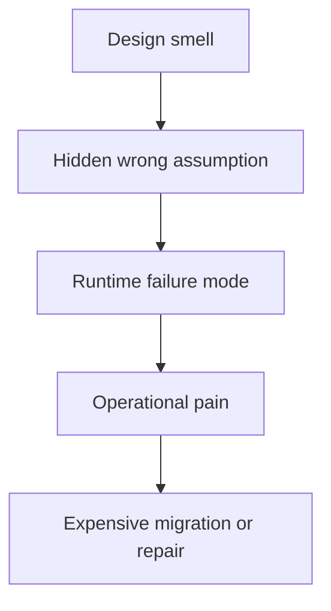

---

## 2. Mental Model Singkat: Di Mana Anti-Pattern Muncul

Camunda 7 memiliki beberapa lapisan keputusan:

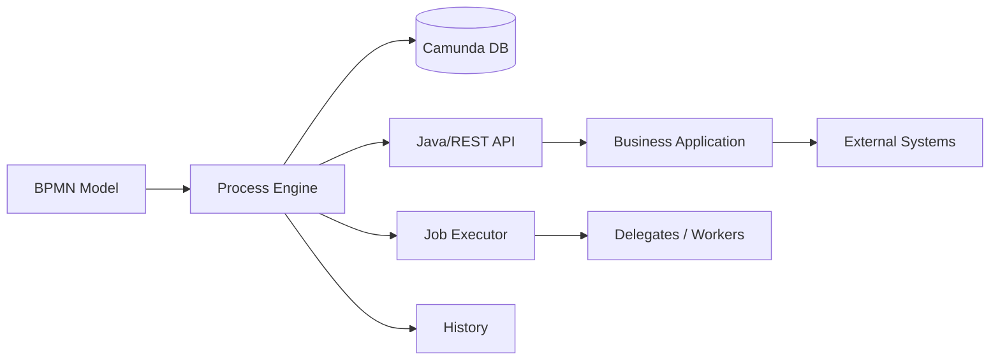

Anti-pattern biasanya muncul saat boundary antar lapisan dilanggar:

- BPMN melakukan keputusan yang seharusnya di DMN/domain service.
- Delegate mengandung seluruh use case.
- Variable menjadi database business entity.
- Camunda DB dipakai sebagai read model aplikasi.
- Job executor diperlakukan seperti message broker.
- Cockpit dipakai sebagai primary business operations UI.
- REST API engine diekspos langsung ke frontend.

---

## 3. Anti-Pattern #1 — God Process

### Bentuk

Satu BPMN berisi semua variasi bisnis, semua exception path, semua approval, semua SLA, semua integrasi, semua recovery, semua cabang region, semua produk, semua tenant.

### Symptom

- Diagram tidak bisa dibaca tanpa zoom besar.
- Lebih dari 40-60 activity dalam satu process definition tanpa modularisasi jelas.
- Banyak XOR gateway berantai.
- Naming activity generik: `Validate`, `Check`, `Process`, `Review`, `Handle Error`.
- Setiap perubahan kecil memaksa regression test seluruh proses.
- Tim takut deploy process version baru.

### Root Cause

Tim menganggap BPMN adalah kanvas untuk semua logic, bukan kontrak orchestration level.

### Failure Mode

- Migration plan menjadi sangat sulit karena banyak activity id berubah.
- Instance lama sulit diperbaiki karena state bisa berada di terlalu banyak posisi.
- Audit trail terlalu noisy.
- Operator tidak bisa membedakan path normal, exception, dan repair.
- Gateway condition saling overlap.

### Correction

Pecah proses berdasarkan boundary berikut:

| Boundary | Gunakan |
|---|---|
| Reusable business capability | Call activity |
| Local grouping dengan lifecycle parent sama | Embedded subprocess |
| Reactive exception handling scoped | Event subprocess |
| Rule matrix | DMN |
| Complex human casework | Case shell + child processes |
| System integration with independent retry | External task / async service task |

### Refactoring Heuristic

Jika satu BPMN perlu menjawab semua pertanyaan berikut, kemungkinan sudah menjadi God Process:

- Siapa melakukan apa?
- Rule bisnis apa yang berlaku?
- Bagaimana integrasi teknis dilakukan?
- Bagaimana error recovery dilakukan?
- Bagaimana audit/legal evidence disusun?
- Bagaimana variasi produk/tenant/region dipilih?

Pisahkan pertanyaan-pertanyaan itu ke layer berbeda.

---

## 4. Anti-Pattern #2 — Spaghetti Gateway

### Bentuk

Model berisi banyak gateway nested tanpa invariant eksplisit. Setiap gateway hanya punya label teknis seperti `yes/no`, `valid/invalid`, `approved/rejected` tanpa menyatakan invariant bisnis.

### Symptom

- XOR gateway bersarang 5-8 level.
- Parallel join menunggu token yang tidak selalu dibuat.
- Inclusive gateway dipakai karena “fleksibel”, bukan karena join semantics dipahami.
- Default flow mengarah ke path sukses tanpa logging.
- Test path hanya mencakup happy path.

### Root Cause

Gateway dipakai sebagai pengganti decision model.

### Failure Mode

- Deadlock di join.
- Path tidak deterministic.
- Incident muncul jauh dari root decision.
- Model sulit dibaca oleh non-engineer.
- Rule change memicu perubahan BPMN besar.

### Correction

Gunakan pola:

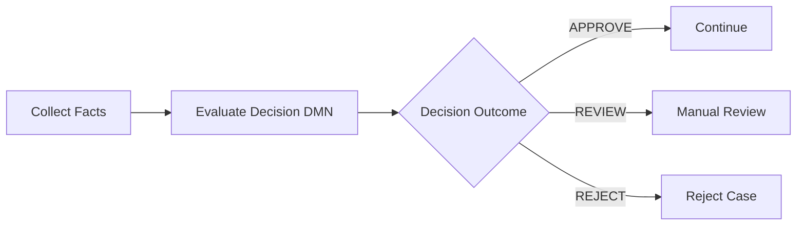

Gateway boleh ada, tetapi gateway sebaiknya routing berdasarkan outcome yang sudah diberi nama, bukan menghitung rule kompleks di expression.

### Rule

Satu gateway sebaiknya menjawab satu pertanyaan bisnis yang jelas:

```text
Bad: Is valid?
Good: Is applicant eligible for automated approval?

Bad: Error?
Good: Did payment provider return a recoverable business decline?
```

---

## 5. Anti-Pattern #3 — God Delegate

### Bentuk

`JavaDelegate` berisi seluruh use case: validasi, rule, query DB, call HTTP, update entity, publish event, set variable, choose next state, logging, audit, retry decision.

```java
@Component
public class ProcessApplicationDelegate implements JavaDelegate {
  @Override
  public void execute(DelegateExecution execution) {
    // parse variables
    // query database
    // call external service
    // decide business rule
    // update domain status
    // send notification
    // write audit
    // set 25 process variables
  }
}
```

### Symptom

- Delegate sulit ditest tanpa engine.
- Delegate name generik: `ProcessCaseDelegate`, `HandleApprovalDelegate`.
- BPMN hanya jadi sequence of Java methods.
- Business analyst tidak bisa membaca behavior dari model.
- Retry delegate menyebabkan duplicate side effects.

### Root Cause

Tim memakai Camunda sebagai trigger untuk service method, bukan orchestration boundary.

### Failure Mode

- Error handling tidak terlihat di BPMN.
- Retry tidak aman.
- Incident tidak informatif.
- Migrasi proses tidak menyelesaikan coupling karena logic tersembunyi di Java.
- Versi delegate berubah saat instance lama masih berjalan.

### Correction: Thin Delegate Pattern

```java
@Component("reserveInventoryDelegate")
public class ReserveInventoryDelegate implements JavaDelegate {

  private final InventoryCommandHandler handler;

  public ReserveInventoryDelegate(InventoryCommandHandler handler) {
    this.handler = handler;
  }

  @Override
  public void execute(DelegateExecution execution) {
    var command = new ReserveInventoryCommand(
        (String) execution.getVariable("orderId"),
        (String) execution.getBusinessKey(),
        (String) execution.getVariable("reservationRequestId")
    );

    var result = handler.handle(command);

    execution.setVariable("inventoryReservationId", result.reservationId());
    execution.setVariable("inventoryReserved", result.reserved());
  }
}
```

Delegate hanya adapter:

- baca input contract,
- panggil domain/application service,
- translate output ke process variables,
- lempar exception yang tepat.

Business invariant tetap di domain service.

---

## 6. Anti-Pattern #4 — Variable Dumping Ground

### Bentuk

Semua data dimasukkan sebagai process variable: payload request lengkap, response lengkap, entity lengkap, list besar, object Java serialized, file metadata, decision explanation, temporary values, UI state.

### Symptom

- `ACT_RU_VARIABLE` dan `ACT_HI_VARINST` membengkak.
- Query Cockpit lambat.
- Variable sulit dipahami karena nama tidak konsisten.
- Serialized object gagal deserialize setelah class berubah.
- Variable sensitive masuk history tanpa masking.
- Gateway expression membaca nested JSON besar.

### Root Cause

Tim mengira process variable adalah application database.

### Failure Mode

- DB growth cepat.
- History cleanup berat.
- Data retention sulit dipenuhi.
- Security exposure.
- Migration classpath problem.
- Performance buruk saat variable fetch.

### Correction

Pisahkan data:

| Data | Simpan di |
|---|---|
| Routing state kecil | Process variable |
| Business entity lengkap | Domain database |
| Large document/file | Object storage / document service |
| Audit event bisnis | Audit/event store |
| Temporary calculation | Transient variable / local code |
| User form draft | Form/application storage |
| Decision result summary | Process variable kecil + decision history |

### Naming Contract

Gunakan variable yang eksplisit:

```text
caseId
caseType
riskTier
approvalOutcome
reviewDeadline
lastExternalEventId
paymentAttemptCount
```

Hindari:

```text
data
payload
request
response
object
result
flag
status
```

---

## 7. Anti-Pattern #5 — Java Serialized Object Variables

### Bentuk

Process variable menyimpan object Java biasa dengan Java serialization.

```java
execution.setVariable("customer", customerEntity);
```

### Symptom

- Instance lama gagal saat class berubah.
- Worker yang berbeda tidak punya class yang sama.
- REST client tidak bisa membaca variable.
- Migration antar service sulit.
- Security review menolak Java serialization.

### Root Cause

Object in-memory disamakan dengan long-running persisted contract.

### Failure Mode

Long-running instance hidup lebih lama daripada versi class. Begitu class berubah, serialized variable menjadi debt.

### Correction

Gunakan primitive atau JSON contract eksplisit.

```java
ObjectValue customerSnapshot = Variables
    .objectValue(customerSnapshotDto)
    .serializationDataFormat(Variables.SerializationDataFormats.JSON)
    .create();

execution.setVariable("customerSnapshot", customerSnapshot);
```

Lebih baik lagi, simpan hanya ID dan ringkasan immutable:

```json
{
  "customerId": "C-10091",
  "riskTier": "HIGH",
  "snapshotVersion": 3
}
```

---

## 8. Anti-Pattern #6 — Business Status = Process Activity Name

### Bentuk

Aplikasi menampilkan status bisnis dengan membaca current BPMN activity.

```text
Current activity: Review Application
=> Business status: UNDER_REVIEW
```

### Symptom

- Rename activity merusak UI/report.
- Multiple token menyebabkan status ambigu.
- Parallel path membingungkan dashboard.
- Migrasi BPMN mengubah status historis.

### Root Cause

Process state disamakan dengan business state.

### Failure Mode

Business users melihat status berubah karena refactoring teknis, bukan karena event bisnis.

### Correction

Buat explicit business status projection.

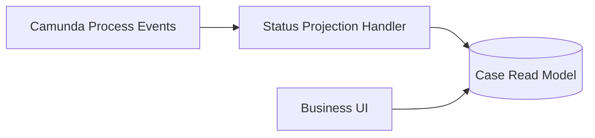

Camunda activity tetap operational state. Business status harus punya lifecycle sendiri.

---

## 9. Anti-Pattern #7 — Synchronous Remote Call Inside Same Transaction

### Bentuk

Service task synchronous memanggil HTTP/gRPC eksternal dalam transaksi engine yang sama tanpa async boundary dan tanpa idempotency.

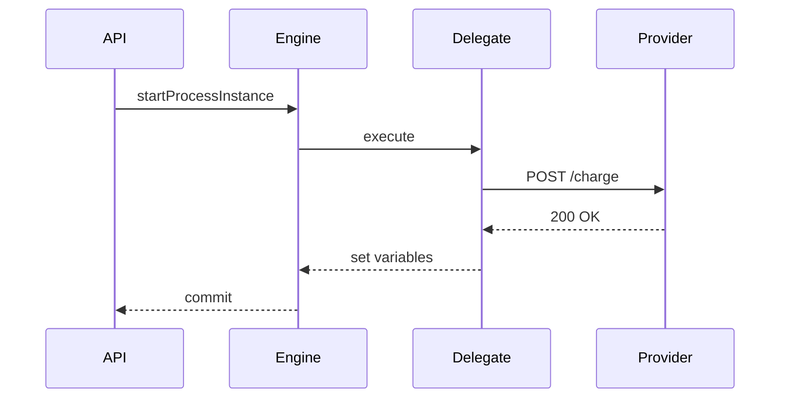

### Symptom

- API caller timeout.
- External system berhasil, tetapi Camunda rollback.
- Retry menciptakan duplicate request.
- Incident message tidak cukup untuk replay aman.

### Root Cause

Technical transaction boundary dianggap sama dengan business transaction boundary.

### Failure Mode

External side effect tidak ikut rollback dengan DB Camunda.

### Correction

Gunakan async boundary + idempotency.

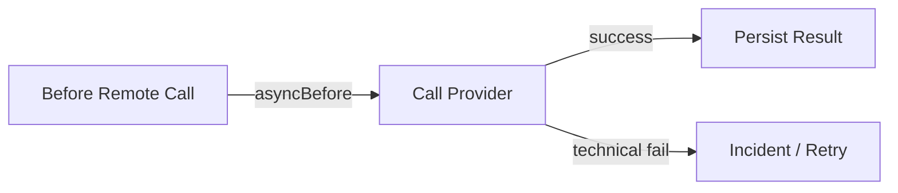

Command ke external system harus punya idempotency key:

```text
idempotencyKey = processInstanceId + ':' + activityId + ':' + businessCommandId
```

Untuk integrasi kritikal, gunakan outbox + message correlation atau external task.

---

## 10. Anti-Pattern #8 — Async Everywhere

### Bentuk

Semua service task diberi `asyncBefore="true"` karena dianggap lebih aman.

### Symptom

- Banyak job kecil.
- Job executor backlog tinggi.
- Process latency naik.
- Cockpit penuh incident noisy.
- Boundary transaksi terlalu granular.
- Debug path sulit karena setiap step dipisah job.

### Root Cause

Async boundary diperlakukan sebagai best practice universal.

### Failure Mode

DB dan job executor menjadi bottleneck. Setiap boundary berarti job creation, acquisition, locking, execution, retry, dan history event tambahan.

### Correction

Gunakan async boundary saat ada alasan:

| Situasi | Async? |
|---|---|
| Remote side effect | Ya, sering `asyncBefore` |
| Expensive calculation | Ya, jika perlu retry/decoupling |
| Pure in-memory mapping | Tidak |
| Gateway routing sederhana | Tidak |
| Before parallel fan-out | Sering ya |
| Before wait state alami | Biasanya tidak perlu |
| User task | Sudah wait state alami |
| Timer/message catch | Sudah wait state alami |

---

## 11. Anti-Pattern #9 — No Async Boundary Before Risky Side Effect

### Bentuk

Kebalikan dari anti-pattern sebelumnya: semua dibiarkan synchronous.

### Symptom

- Failure di step terakhir rollback semua step sebelumnya.
- Error message muncul ke API caller, bukan ke operational incident queue.
- Proses gagal start padahal sebagian side effect sudah terjadi.

### Correction

Letakkan transaction save point sebelum side effect:

```xml
<bpmn:serviceTask id="chargePayment" camunda:delegateExpression="${chargePaymentDelegate}" camunda:asyncBefore="true">
  <bpmn:extensionElements>
    <camunda:failedJobRetryTimeCycle>R5/PT10M</camunda:failedJobRetryTimeCycle>
  </bpmn:extensionElements>
</bpmn:serviceTask>
```

---

## 12. Anti-Pattern #10 — Misusing BPMN Error for Technical Failure

### Bentuk

Semua exception ditangkap lalu dilempar sebagai `BpmnError` supaya proses masuk path error.

```java
try {
  paymentClient.charge(command);
} catch (Exception e) {
  throw new BpmnError("PAYMENT_FAILED");
}
```

### Symptom

- Network timeout diperlakukan seperti business decline.
- Tidak ada retry teknis.
- Process lanjut ke rejection padahal provider sedang down.
- Audit menyatakan keputusan bisnis, bukan technical outage.

### Root Cause

Tim tidak membedakan business error dan technical exception.

### Failure Mode

Business outcome salah.

### Correction

| Failure | Representasi |
|---|---|
| Card declined | BPMN error / business result |
| Customer ineligible | DMN outcome / BPMN path |
| HTTP 503 provider down | Java exception -> retry/incident |
| Timeout unknown outcome | retry with idempotency / reconciliation |
| Validation bug | exception -> incident |

---

## 13. Anti-Pattern #11 — Swallowing Exceptions

### Bentuk

Delegate menangkap exception, log error, lalu process lanjut.

```java
try {
  provider.call();
} catch (Exception ex) {
  log.error("failed", ex);
}
```

### Symptom

- Process marked completed padahal business action gagal.
- Tidak ada incident.
- Operator tahu gagal dari sistem eksternal, bukan Camunda.
- Audit trail menyesatkan.

### Root Cause

Tim ingin menghindari incident, bukan memperbaiki recovery model.

### Correction

- Lempar exception untuk technical failure.
- Gunakan BPMN error untuk business failure yang valid.
- Gunakan escalation/user task untuk manual decision.
- Tambahkan runbook untuk incident umum.

---

## 14. Anti-Pattern #12 — Signal for Targeted Message

### Bentuk

Signal event dipakai untuk melanjutkan satu process instance tertentu.

### Symptom

- Banyak instance bergerak karena satu event.
- Race antar tenant atau case.
- Sulit menjamin recipient tunggal.

### Root Cause

Message dan signal semantics tertukar.

### Correction

Gunakan message event dengan correlation key/business key untuk targeted recipient.

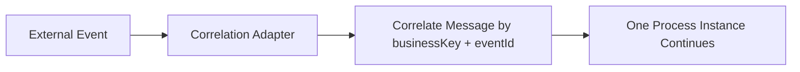

Gunakan signal hanya untuk broadcast semantics yang memang disengaja, misalnya “global shutdown notice” untuk semua active processes yang listen ke signal tersebut.

---

## 15. Anti-Pattern #13 — Missing Business Key

### Bentuk

Process instance dimulai tanpa business key.

### Symptom

- Operator mencari instance berdasarkan variable query lambat.
- Message correlation rapuh.
- Duplicate process instance sulit dideteksi.
- External system tidak punya stable reference.

### Correction

Business key harus menjadi stable business identity.

```java
runtimeService.startProcessInstanceByKey(
    "enforcementCaseProcess",
    caseId,
    variables
);
```

Jika satu business entity bisa punya beberapa process, buat convention:

```text
case:{caseId}:main
case:{caseId}:appeal:{appealId}
order:{orderId}:fulfillment
customer:{customerId}:kyc-review:{reviewId}
```

---

## 16. Anti-Pattern #14 — Direct Camunda DB Mutation

### Bentuk

Operasi support memperbaiki job, variable, incident, atau task dengan `UPDATE ACT_RU_*` langsung.

### Symptom

- Incident tidak resolved walau retries diubah.
- History/user operation log tidak lengkap.
- Cache engine inconsistent.
- Upgrade schema risk meningkat.

### Root Cause

Camunda DB dianggap public API.

### Correction

Gunakan API:

```java
managementService.setJobRetries(jobId, 3);
runtimeService.setVariable(executionId, "manualCorrectionReason", reason);
runtimeService.createProcessInstanceModification(processInstanceId)
    .cancelAllForActivity("wrongActivity")
    .startBeforeActivity("correctActivity")
    .execute();
```

Untuk operasi massal, gunakan batch API atau Cockpit Enterprise feature jika tersedia.

---

## 17. Anti-Pattern #15 — Cockpit as Business Backoffice

### Bentuk

Business user melakukan operasi reguler lewat Cockpit: assign case, approve, reject, correct data, trigger next action.

### Symptom

- Semua user diberi access luas ke Cockpit.
- Operasi bisnis tidak punya validation domain.
- Perubahan variable dilakukan manual tanpa business guardrail.
- Audit berbunyi “operator modified variable”, bukan “supervisor approved override”.

### Root Cause

Cockpit adalah operational tool, bukan business UI.

### Correction

Buat business backoffice sendiri yang memanggil application facade.

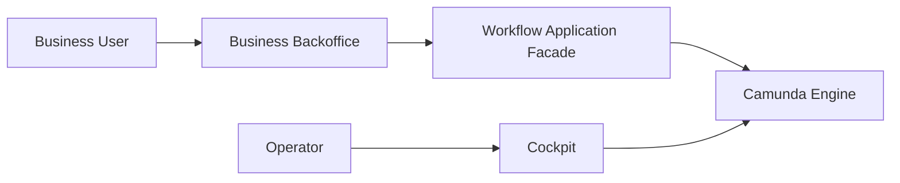

Cockpit untuk operator teknis: inspect, retry, suspend, migration, incident resolution.

Business operation harus punya domain authorization, validation, audit, dan reason code.

---

## 18. Anti-Pattern #16 — Direct Engine REST from Frontend

### Bentuk

SPA/frontend langsung memanggil Camunda REST API untuk start process, complete task, set variables, atau correlate message.

### Symptom

- UI tahu process definition key, task id, variable names.
- Security model sulit.
- Variable contract bocor ke frontend.
- Perubahan BPMN merusak UI.

### Root Cause

Engine API dipakai sebagai product API.

### Correction

Tambahkan workflow facade:

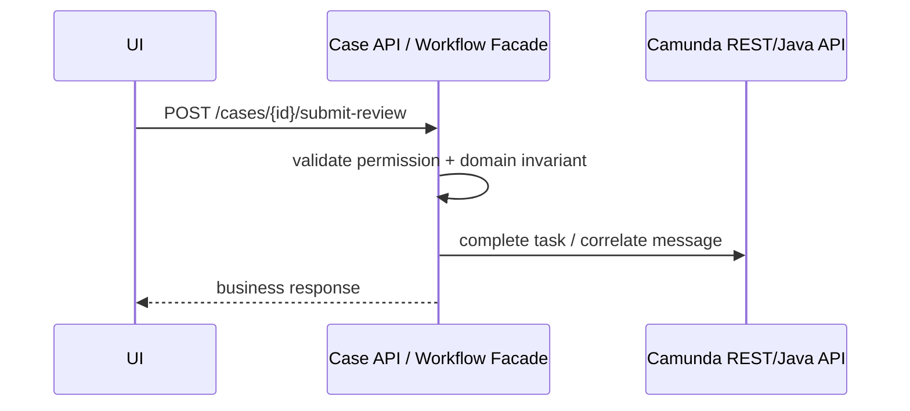

Facade menyembunyikan process internals dan menjaga contract stabil.

---

## 19. Anti-Pattern #17 — Process Model Coupled to UI Steps

### Bentuk

Setiap screen menjadi user task atau setiap button menjadi BPMN activity.

### Symptom

- BPMN berubah tiap UI redesign.
- Process instance menunggu “Fill Tab 2” atau “Click Submit”.
- Human work tidak sesuai responsibility, hanya layout.

### Root Cause

User journey UI disamakan dengan workflow responsibility.

### Correction

User task mewakili unit of accountability, bukan screen.

```text
Bad user task: Fill Address Page
Good user task: Provide Applicant Information

Bad user task: Click Approve Button
Good user task: Risk Officer Review
```

Form boleh punya banyak step. Workflow task tetap satu responsibility.

---

## 20. Anti-Pattern #18 — Timer Explosion

### Bentuk

Setiap instance membuat banyak timer untuk reminder kecil, polling, repeated checks, SLA, escalation, cleanup, dan internal scheduling.

### Symptom

- `ACT_RU_JOB` penuh timer.
- Job executor sibuk mengambil timer kecil.
- Timer due date cluster menyebabkan spike.
- SLA timer membuat incident saat delegate lambat.

### Root Cause

Timer BPMN dipakai sebagai general scheduler.

### Correction

Gunakan timer BPMN hanya untuk business-relevant wait:

| Kebutuhan | Solusi |
|---|---|
| SLA deadline per case | BPMN timer boundary/event subprocess |
| Reminder email periodik | Scheduler eksternal / notification service |
| Poll external status | External worker/backoff scheduler |
| Cleanup technical data | Batch job platform |
| Business timeout | BPMN timer |

---

## 21. Anti-Pattern #19 — Unbounded History

### Bentuk

History level tinggi, TTL tidak jelas, variable besar disimpan, cleanup tidak diatur.

### Symptom

- `ACT_HI_*` tumbuh cepat.
- Backup/restore lambat.
- Cockpit lambat.
- GDPR/retention risk.
- Disk growth menjadi incident platform.

### Root Cause

Audit dianggap sama dengan menyimpan semua hal selamanya.

### Correction

Definisikan retention per process definition:

| Process Type | History Need | TTL Example |
|---|---:|---:|
| Payment authorization | Low-medium | 90-365 days |
| Regulatory enforcement | High | 7-10 years |
| Onboarding draft | Low | 30-90 days |
| Internal approval | Medium | 1-3 years |

Jangan jadikan Camunda history sebagai satu-satunya regulatory audit. Buat audit projection/domain event log untuk evidence yang harus stabil lintas engine migration.

---

## 22. Anti-Pattern #20 — No Incident Runbook

### Bentuk

Tim punya monitoring incident, tetapi tidak punya prosedur pemulihan.

### Symptom

- Operator bertanya ke developer setiap failed job.
- Retry dilakukan tanpa tahu apakah aman.
- Incident di-resolve dengan variable edit random.
- Tidak ada reason code.

### Correction

Setiap service task eksternal/async harus punya runbook:

```text
Activity: chargePayment
Failure types:
- PROVIDER_TIMEOUT
- PROVIDER_5XX
- DUPLICATE_COMMAND
- INVALID_MERCHANT_CONFIGURATION

Safe retry:
- PROVIDER_TIMEOUT: yes if idempotencyKey present
- PROVIDER_5XX: yes after provider status page green
- DUPLICATE_COMMAND: no, reconcile first
- INVALID_MERCHANT_CONFIGURATION: no, fix config first

Operator action:
1. Check idempotency key in variable paymentCommandId.
2. Query payment provider by command id.
3. If no charge found, set retries=1.
4. If charge found, correlate PaymentCharged message.
5. Record reason code and ticket id.
```

---

## 23. Anti-Pattern #21 — Retry Without Idempotency

### Bentuk

Failed job retry memanggil operasi eksternal yang tidak idempotent.

### Symptom

- Duplicate charge.
- Duplicate email.
- Duplicate shipment.
- Duplicate ticket.
- Operator takut retry.

### Correction

Buat semua side effect yang bisa diretry menjadi idempotent.

| Side Effect | Idempotency Strategy |
|---|---|
| Payment charge | Provider idempotency key / command id |
| Email notification | notification event id |
| Shipment booking | booking request id |
| Case creation | unique business key |
| Document generation | deterministic document request id |

Jika external system tidak mendukung idempotency, gunakan reconciliation step sebelum retry.

---

## 24. Anti-Pattern #22 — Overusing Execution and Task Listeners

### Bentuk

Listeners dipakai untuk business logic utama.

### Symptom

- Behavior tersembunyi dari BPMN shape.
- Listener order sulit dipahami.
- Test path tidak jelas.
- Task complete memiliki side effect tak terlihat.

### Root Cause

Listener terasa convenient karena bisa disisipkan di lifecycle event.

### Correction

Gunakan listener untuk cross-cutting atau lifecycle adapter kecil:

- set assignment metadata,
- emit audit technical event,
- normalize form field,
- record task opened/closed,
- enforce simple invariant.

Jangan gunakan listener untuk:

- payment charge,
- approval decision,
- case transition utama,
- external API orchestration,
- complex validation.

---

## 25. Anti-Pattern #23 — No Versioning Strategy

### Bentuk

Process definition baru dideploy tanpa strategy untuk instance lama.

### Symptom

- Instance lama tertahan di activity yang tidak ada di versi baru.
- Delegate berubah incompatible.
- Form key berubah.
- Message name/correlation key berubah.
- Operator tidak tahu versi mana yang sedang berjalan.

### Correction

Buat version policy:

| Perubahan | Migration Needed? |
|---|---|
| Tambah label activity | Tidak, jika id tetap |
| Rename activity id | Ya/berisiko |
| Tambah service task before wait state | Mungkin |
| Ubah variable contract | Ya, jika instance lama masih aktif |
| Ubah call activity binding | Sangat mungkin |
| Ubah message name | Ya, untuk waiting subscriptions |
| Ubah form key | Mungkin, tergantung active task |

Activity id adalah compatibility contract. Jangan rename sembarangan.

---

## 26. Anti-Pattern #24 — Activity ID as Auto-Generated Garbage

### Bentuk

Activity id seperti `Activity_0x72as9`, `Gateway_1lq83mm`, `Event_0abc` dibiarkan masuk production.

### Symptom

- Incident sulit dibaca.
- Migration mapping sulit.
- Metrics tidak bermakna.
- Runbook tidak bisa menunjuk activity jelas.

### Correction

Gunakan stable id:

```text
StartEvent_CaseSubmitted
Task_CollectEvidence
Gateway_RiskTierRouting
ServiceTask_CheckSanctions
UserTask_SupervisorReview
BoundaryTimer_ReviewSlaExceeded
EndEvent_CaseClosed
```

Label boleh human-friendly. ID harus stable dan operation-friendly.

---

## 27. Anti-Pattern #25 — Message Correlation by Variable Query Only

### Bentuk

Event eksternal mencari process instance berdasarkan variable longgar.

```java
runtimeService.createMessageCorrelation("PaymentReceived")
    .processInstanceVariableEquals("orderId", orderId)
    .correlate();
```

### Symptom

- Multiple match exception.
- No match karena variable belum committed.
- Correlation lambat.
- Duplicate instance menerima event tidak jelas.

### Correction

Gunakan business key dan correlation keys yang dirancang.

```java
runtimeService.createMessageCorrelation("PaymentReceived")
    .processInstanceBusinessKey(orderId)
    .setVariable("paymentEventId", eventId)
    .correlateWithResult();
```

Untuk event ingestion yang rawan duplicate, masukkan inbox table sebelum correlate.

---

## 28. Anti-Pattern #26 — Treating Job Executor as Queue

### Bentuk

Job executor dipakai untuk high-throughput work queue umum.

### Symptom

- Banyak service task async untuk setiap item batch.
- Job backlog besar.
- Engine DB menjadi bottleneck queue.
- Prioritas bisnis sulit.
- Noisy incident.

### Root Cause

Job executor memang mengambil pekerjaan, tetapi ia dirancang untuk melanjutkan process execution, bukan menggantikan Kafka/RabbitMQ/SQS/worker queue.

### Correction

Gunakan job executor untuk workflow continuations. Untuk high-volume data processing, gunakan queue platform dan correlate result ke Camunda jika business process perlu menunggu.

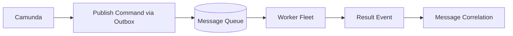

---

## 29. Anti-Pattern #27 — Multi-Instance Without Backpressure

### Bentuk

Multi-instance parallel memanggil external system untuk ratusan/ribuan item.

### Symptom

- External API rate limit.
- DB spike.
- Optimistic locking.
- Job executor saturation.
- Incident storm.

### Correction

Untuk fan-out besar, gunakan batch process atau queue.

Jika tetap memakai BPMN multi-instance:

- batasi collection size,
- gunakan async boundary dengan retry cycle,
- gunakan idempotency per item,
- set job priority,
- monitor backlog,
- pertimbangkan sequential multi-instance.

---

## 30. Anti-Pattern #28 — Tenant Isolation by Convention Only

### Bentuk

Tenant id disimpan sebagai variable tetapi tidak dipakai di authorization, query boundary, deployment, atau API.

### Symptom

- User bisa melihat task tenant lain melalui salah konfigurasi filter.
- Message event salah correlate.
- Report bercampur.
- Admin operasi tidak tenant-scoped.

### Correction

Tenant isolation harus konsisten:

| Layer | Tenant Control |
|---|---|
| API | tenant context required |
| Process definition | tenant-aware deployment jika diperlukan |
| Task query | tenant filter |
| Message correlation | tenant id + business key |
| Authorization | tenant-specific group/permission |
| Reporting | tenant partition/filter |
| Audit | tenant id explicit |

---

## 31. Anti-Pattern #29 — Process Instance Modification as Normal Business Flow

### Bentuk

Operator rutin memindahkan token karena BPMN tidak memodelkan path bisnis.

### Symptom

- Modification terjadi setiap hari.
- Banyak instance punya path yang tidak sesuai model.
- Audit butuh penjelasan manual.
- Developers menolak memperbaiki BPMN karena “bisa dimodify di Cockpit”.

### Root Cause

Repair tool dipakai sebagai business workflow.

### Correction

Jika modification sering, modelnya kurang lengkap. Tambahkan explicit path:

- manual correction task,
- reopen event,
- supervisor override,
- escalation subprocess,
- cancellation/retry path.

Process instance modification tetap dipakai untuk exceptional repair, bukan routine operation.

---

## 32. Anti-Pattern #30 — No Domain-Level State Machine

### Bentuk

Camunda menjadi satu-satunya state machine untuk semua entity bisnis.

### Symptom

- Domain service tidak bisa menjawab status tanpa query Camunda.
- Jika process corrupt, business entity tidak punya invariant sendiri.
- Reprocessing event sulit.
- Migration engine berarti migration business state.

### Correction

Gunakan dua state:

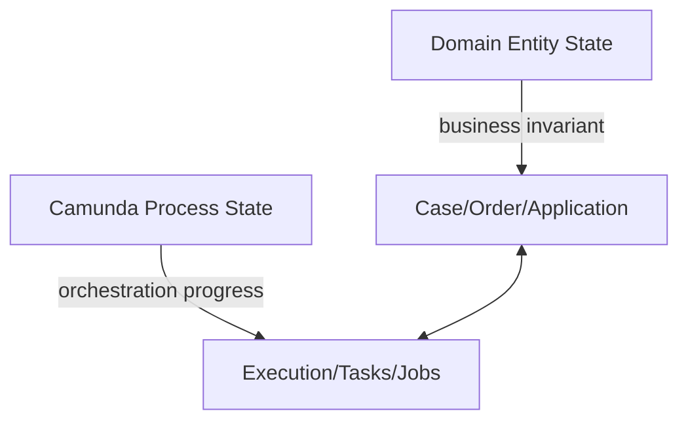

Domain state menjawab “apa status bisnis entity?”

Process state menjawab “workflow sedang menunggu apa?”

---

## 33. Anti-Pattern #31 — “Happy Path Only” Process Tests

### Bentuk

Test hanya memastikan process instance selesai untuk satu input.

### Symptom

- Gateway edge tidak dites.
- Timer tidak dites.
- Failed job tidak dites.
- Message duplicate tidak dites.
- User task authorization tidak dites.

### Correction

Testing matrix minimum:

| Area | Test |
|---|---|
| Gateway | setiap condition + default path |
| Timer | due, not due, escalation, cancel |
| Message | match, no match, duplicate, late |
| Async job | success, exception, retry exhaustion |
| External task | complete, failure, BPMN error |
| User task | claim, complete, invalid actor |
| Variable | serialization, missing variable, type mismatch |
| Migration | active wait states mapping |

---

## 34. Anti-Pattern #32 — Process Documentation Separate from BPMN

### Bentuk

Runbook, business meaning, SLA, variable contract, and ownership hanya ada di Confluence dan tidak sinkron dengan BPMN.

### Symptom

- Model tidak punya annotations/extension docs.
- Activity id tidak match runbook.
- Operator tidak tahu owner activity.
- Variable contract berubah tanpa update docs.

### Correction

Setiap process definition perlu executable + operational metadata:

```text
Process: enforcement-case-main
Owner: Enforcement Platform Team
Business owner: Case Operations
Critical variables: caseId, riskTier, reviewDeadline, regulatoryClockId
Incidents owner: Platform L2 first, Case Ops second
SLA: initial review within 5 business days
Migration policy: wait-state only migration, no active service task migration
```

Gunakan BPMN documentation element untuk context kecil, dan repo docs untuk detail.

---

## 35. Anti-Pattern #33 — One Environment, One Reality

### Bentuk

Proses hanya diuji di local H2 atau hanya di dev environment tanpa volume, concurrency, dan real DB behavior.

### Symptom

- Optimistic locking baru muncul di production.
- Query performance beda drastis.
- Serialization classpath beda.
- Timer behavior beda karena timezone/clock.
- Job executor config tidak sama.

### Correction

Pipeline environment minimal:

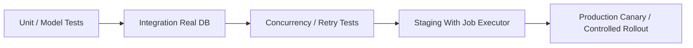

H2 bagus untuk cepat, bukan bukti production readiness.

---

## 36. Anti-Pattern Severity Matrix

| Anti-Pattern | Severity | Usually Found By | Fix Cost If Late |
|---|---:|---|---:|
| God Process | High | Change request/migration | Very High |
| God Delegate | High | Testing/retry failure | High |
| Variable Dumping Ground | High | DB growth/security review | High |
| Sync Remote Call Same Tx | Critical | Incident/duplicate side effect | Very High |
| BPMN Error for Technical Failure | Critical | Business outcome audit | High |
| Direct DB Mutation | Critical | Inconsistent incident/history | Very High |
| No Business Key | High | Operations/correlation | Medium-High |
| Signal for Targeted Message | Critical | Production event bug | High |
| Cockpit as Backoffice | High | Security/audit review | High |
| Unbounded History | High | DB/storage incident | High |
| No Runbook | Medium-High | L2 support | Medium |
| Activity ID Garbage | Medium | Incident/migration | Medium |
| Async Everywhere | Medium | Performance/backlog | Medium |
| No Versioning Strategy | Critical | Release/migration | Very High |

---

## 37. Anti-Pattern Detection Checklist

Gunakan checklist ini saat review BPMN/process application.

### Modeling Review

- Apakah setiap gateway punya pertanyaan bisnis eksplisit?
- Apakah rule kompleks dipindahkan ke DMN/domain service?
- Apakah activity id stable dan readable?
- Apakah boundary subprocess/call activity masuk akal?
- Apakah semua event semantics benar: message vs signal vs error vs escalation?
- Apakah timer merepresentasikan business wait, bukan technical scheduler?

### Data Review

- Apakah process variable kecil, named, dan version-aware?
- Apakah tidak ada Java serialized entity long-running?
- Apakah sensitive data tidak masuk history tanpa alasan?
- Apakah business status tidak bergantung pada current activity?

### Integration Review

- Apakah remote side effect punya async boundary?
- Apakah retry idempotent?
- Apakah duplicate/late/out-of-order event ditangani?
- Apakah correlation memakai business key/correlation key stabil?

### Operation Review

- Apakah failed job punya runbook?
- Apakah Cockpit hanya operational tool?
- Apakah manual modification exceptional, bukan routine?
- Apakah history TTL dan cleanup jelas?
- Apakah incident owner jelas?

### Versioning Review

- Apakah change compatible dengan active instances?
- Apakah migration plan tersedia untuk wait state aktif?
- Apakah form/DMN/delegate contract backward compatible?
- Apakah deployment bisa rollback secara operasional?

---

## 38. Review Kata-Kunci yang Harus Dihindari

Dalam BPMN/Java/process docs, kata-kata ini sering menandakan smell:

| Kata | Kemungkinan Smell |
|---|---|
| `data` | variable tidak spesifik |
| `payload` | dumping ground |
| `process everything` | god delegate/process |
| `handle error` | error taxonomy tidak jelas |
| `retry manually` | runbook tidak matang |
| `temporary` | akan menjadi permanent debt |
| `just modify in cockpit` | missing business flow |
| `call service directly` | transaction boundary risk |
| `signal this case` | message/signal confusion |
| `status from activity` | business state coupling |

---

## 39. A Practical Refactoring Sequence

Jika sistem Camunda sudah terlanjur memiliki banyak anti-pattern, jangan refactor semua sekaligus. Urutkan berdasarkan blast radius.

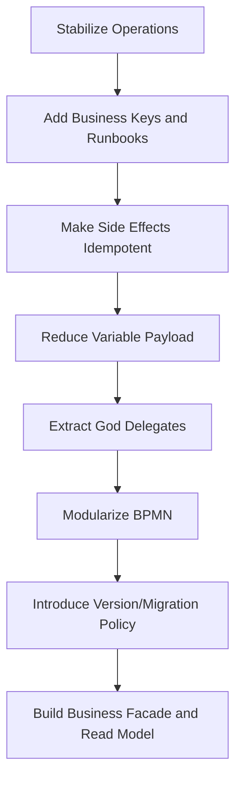

### Step 1 — Stabilize Incident Handling

Buat runbook untuk top failed jobs. Jangan mulai dengan redesign besar kalau operator masih tidak bisa recover.

### Step 2 — Add Business Identity

Pastikan process instance bisa dicari, dikorelasikan, dan diaudit dengan business key dan IDs domain.

### Step 3 — Make Retries Safe

Side effect tanpa idempotency adalah bom waktu. Perbaiki sebelum menaikkan retry atau async volume.

### Step 4 — Shrink Variable Contract

Kurangi payload besar dan Java object serialization. Ini mengurangi DB pressure dan migration risk.

### Step 5 — Extract Logic

Refactor God Delegate menjadi thin delegate + application service.

### Step 6 — Modularize Process

Baru setelah logic dan data contract jelas, pecah BPMN menjadi subprocess/call activity/DMN.

---

## 40. Mini Case Study: Payment Workflow yang Buruk

### Model Buruk

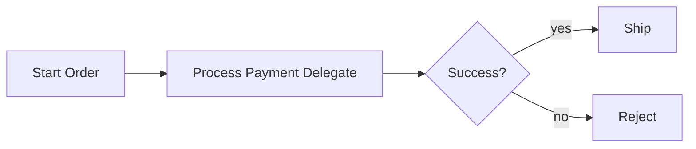

Masalah:

- `Process Payment Delegate` melakukan validasi, charge, DB update, email, dan decision.
- No async boundary.
- No idempotency.
- Technical timeout masuk reject.
- No runbook.
- Business status dari activity.

### Model Lebih Baik

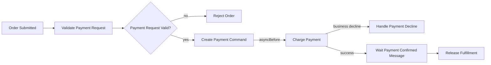

Perbaikan:

- Validation jelas.
- Charge punya async boundary.
- Business decline berbeda dari technical exception.
- Result event dikorelasikan.
- Payment command id idempotent.
- Fulfillment hanya lanjut setelah confirmation.

---

## 41. Kaufman Deliberate Practice

Latihan efektif untuk part ini bukan menghafal katalog. Latih kemampuan diagnosis.

### Drill 1 — Smell Review

Ambil satu BPMN production/non-production. Tandai:

- gateway tanpa invariant,
- activity id buruk,
- service task tanpa async boundary sebelum remote call,
- variable besar,
- missing business key,
- listener yang menyimpan business logic.

### Drill 2 — Failure Story

Untuk setiap service task, tulis:

```text
Jika step ini gagal setelah side effect eksternal berhasil tetapi sebelum Camunda commit, apa yang terjadi?
```

Jika jawaban tidak jelas, desain belum production-grade.

### Drill 3 — Recovery Rehearsal

Simulasikan incident:

- failed job retry exhausted,
- external task retries zero,
- message event late,
- duplicate event,
- user completed task dengan data salah,
- timer escalation salah trigger.

Buat operator action yang aman.

---

## 42. Summary

Anti-pattern Camunda 7 hampir selalu berasal dari satu kesalahan mental model: menganggap process engine sebagai framework aplikasi biasa.

Process engine adalah runtime untuk state machine bisnis yang long-running, durable, recoverable, dan operationally visible. Karena itu desain yang baik harus memperlakukan BPMN, variables, delegates, messages, jobs, incidents, history, dan operations sebagai satu sistem.

Prinsip praktis:

- BPMN untuk orchestration, bukan semua logic.
- DMN/domain service untuk keputusan dan invariant kompleks.
- Delegate tipis sebagai adapter.
- Variable kecil, eksplisit, version-aware.
- Remote side effect harus idempotent dan transaction-aware.
- Business status jangan bergantung pada current BPMN activity.
- Cockpit untuk operasi teknis, bukan business backoffice.
- Migration/versioning harus dipikirkan sebelum deploy.
- Incident harus punya runbook, bukan sekadar retry button.

Jika Anda bisa mengenali anti-pattern ini saat design review, Anda sudah berada jauh di atas level “bisa pakai Camunda”. Anda mulai berpikir sebagai engineer yang menjaga workflow platform tetap aman, bisa diaudit, bisa dipulihkan, dan bisa berevolusi.

---

## References

- Camunda 7.24 Documentation — BPMN 2.0 Implementation Reference: https://docs.camunda.org/manual/7.24/reference/bpmn20/
- Camunda 7.24 Documentation — Process Engine Concepts: https://docs.camunda.org/manual/7.24/user-guide/process-engine/process-engine-concepts/
- Camunda 7.24 Documentation — Transactions in Processes: https://docs.camunda.org/manual/7.24/user-guide/process-engine/transactions-in-processes/
- Camunda 7.24 Documentation — Process Variables: https://docs.camunda.org/manual/7.24/user-guide/process-engine/variables/
- Camunda 7.24 Documentation — External Tasks: https://docs.camunda.org/manual/7.24/user-guide/process-engine/external-tasks/
- Camunda 7.24 Documentation — Incidents: https://docs.camunda.org/manual/7.24/user-guide/process-engine/incidents/
- Camunda 7.24 Documentation — Cockpit: https://docs.camunda.org/manual/7.24/webapps/cockpit/
