# Part 032 — Cockpit, Tasklist, Admin, and Operational Playbooks

> Target: setelah membaca part ini, kita bisa mengoperasikan Camunda 7 seperti production workflow platform: menemukan instance bermasalah, membaca incident, retry dengan aman, suspend/resume, memahami Tasklist/Admin boundary, dan menulis runbook yang mengurangi ketergantungan operator pada developer.

Part sebelumnya membahas anti-pattern. Part ini membahas operasi.

Di production, keahlian Camunda tidak selesai pada modeling BPMN dan menulis delegate. Sistem workflow yang serius harus bisa menjawab:

- Instance ini sedang menunggu apa?
- Kenapa job ini gagal?
- Apakah aman untuk retry?
- Siapa yang boleh mengubah variable?
- Kapan suspend process definition?
- Apakah incident ini technical, business, atau data issue?
- Apakah operation ini akan muncul di audit trail?
- Apa yang dilakukan operator L1, L2, developer, dan business owner?

Camunda Cockpit, Tasklist, dan Admin menyediakan surface operasi. Tetapi production readiness ditentukan oleh playbook dan boundary di sekitar tool tersebut.

---

## 1. Operational Mental Model

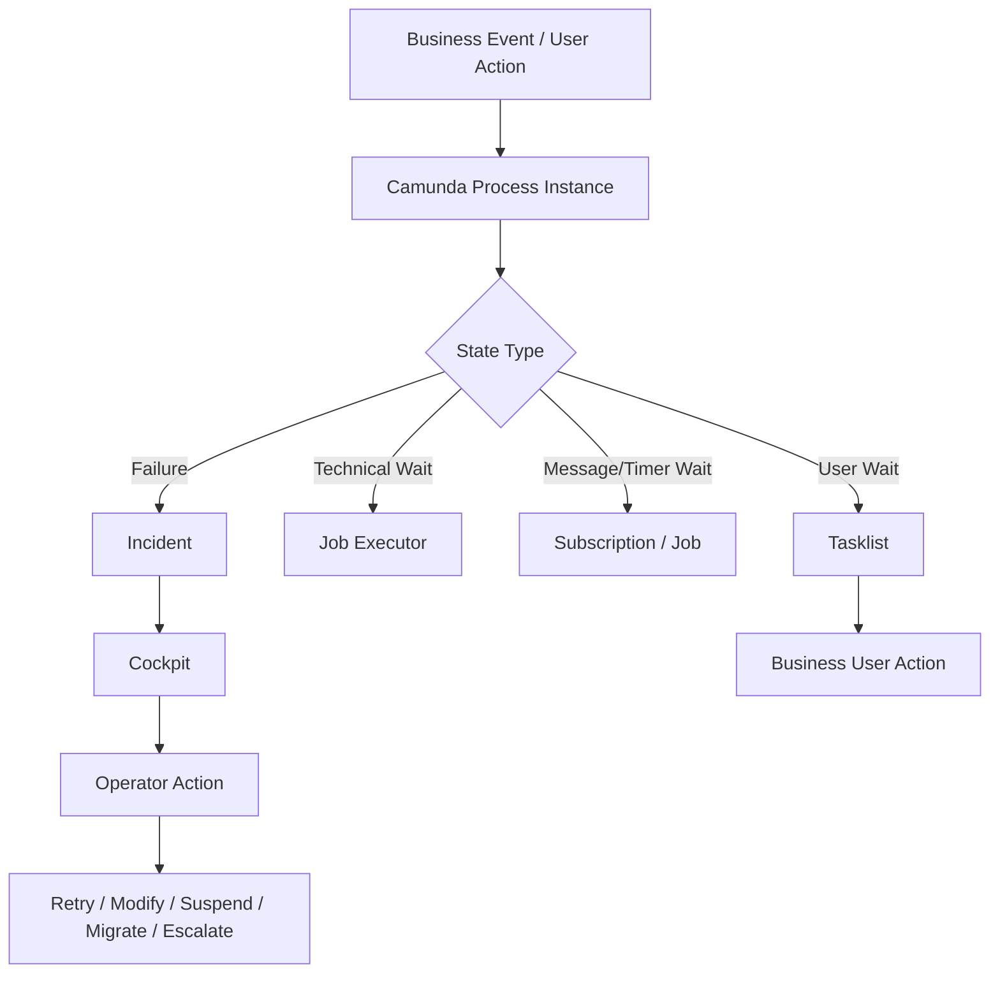

Tool responsibility:

| Tool | Primary User | Purpose | Should Not Be |
|---|---|---|---|
| Cockpit | Operator, developer, platform support | Monitor and operate process/decision/case instances | Business backoffice UI |
| Tasklist | Human task worker/business user | Claim, work, complete user tasks | Admin repair console |
| Admin | Platform/admin team | Manage users, groups, tenants, authorizations, system info, audit | General business configuration tool |
| REST/Java API | Application/facade/operator automation | Controlled workflow operations | Exposed directly to browser UI |

---

## 2. Cockpit: Apa yang Harus Dibaca Operator

Camunda Cockpit adalah web application untuk monitoring dan operations. Dari sisi produksi, Cockpit adalah lensa untuk melihat hubungan antara:

- process definition,
- process instance,
- activity instance,
- incident,
- job,
- variable,
- history,
- batch operation,
- deployment,
- decision instance.

Cockpit menjadi kuat kalau history level dan data contract dirancang benar. Jika history terlalu rendah atau variable kacau, Cockpit tetap bisa dibuka, tetapi insight-nya buruk.

### Cockpit Navigation Mental Model

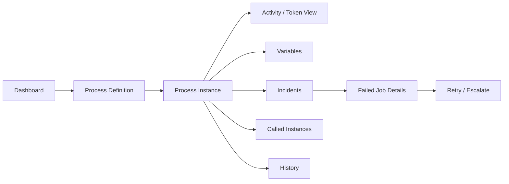

### Questions Cockpit Should Answer

| Question | Cockpit Area |
|---|---|
| Process version mana yang digunakan? | Process definition / instance detail |
| Instance sedang menunggu activity apa? | Process instance diagram/activity view |
| Apakah ada incident? | Incident tab/status dot |
| Job apa yang gagal? | Failed jobs |
| Variable apa yang relevan? | Variables panel |
| Apakah ada subprocess/call activity? | Called instance drill-down |
| Apakah instance suspended? | Instance/definition state |
| Apakah operation pernah dilakukan? | User operation log/auditing |

---

## 3. Incident Triage Model

Incident bukan “error log”. Incident adalah tanda bahwa execution tidak akan lanjut otomatis tanpa tindakan administratif.

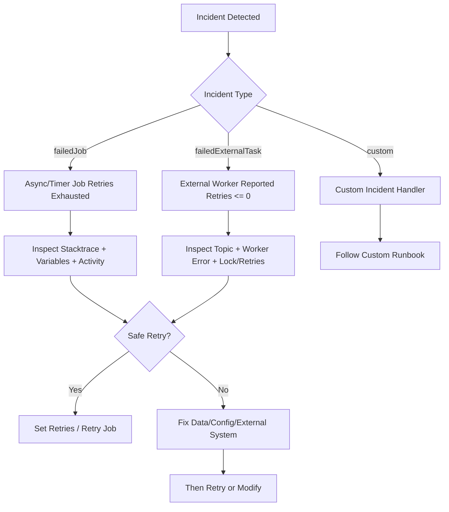

### Incident Classification

| Class | Example | Primary Owner | Usual Action |
|---|---|---|---|
| Transient external failure | HTTP 503, timeout | Platform/app ops | Retry after external recovery |
| Persistent config failure | Missing API key, invalid endpoint | App/platform team | Fix config, redeploy/reload, retry |
| Data contract failure | Missing variable, wrong type | App team | Correct variable or migrate/fix code |
| Business exception mis-modeled | Decline thrown as exception | Process owner/dev | Model BPMN error/DMN outcome |
| Worker bug | NullPointerException | Dev team | Fix worker/delegate, deploy, retry |
| Authorization failure | User/worker lacks permission | Admin/security | Fix group/authorization, retry |
| Duplicate side effect uncertainty | Payment timeout after request | App + business ops | Reconcile, then correlate/retry |

---

## 4. Failed Job Triage

Failed jobs biasanya berasal dari:

- asynchronous continuation,
- timer event,
- async service task,
- failed delegate,
- optimistic locking retry exhaustion,
- failed expression/listener.

### What to Inspect

| Field | Why It Matters |
|---|---|
| Process definition key/version | Determines code/model compatibility |
| Process instance id/business key | Links incident to business case |
| Activity id | Maps to runbook |
| Exception message | First clue, not final diagnosis |
| Stacktrace | Code/config root cause |
| Retries | Whether job can be acquired again |
| Due date | When job becomes executable |
| Lock owner/lock expiration | Whether another executor may be holding it |
| Variables | Input contract at failure time |
| External side effect id | Determines retry safety |

### Retry Decision Tree

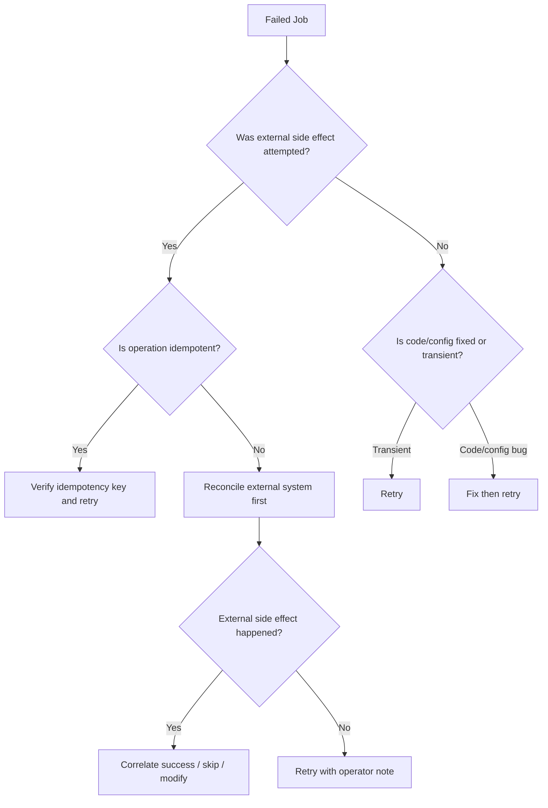

### Safe Retry Checklist

Before retrying a failed job, operator should know:

- What activity failed?
- What command was attempted?
- Is the command idempotent?
- Did the external system receive the command?
- Is the root cause fixed or transient?
- Are variables still valid?
- Will retry send duplicate notification/payment/shipment?
- Is there a ticket/reason code for audit?

If one of these is unknown, do not blindly retry high-risk side effects.

---

## 5. Cockpit Failed Job Operations

In Cockpit, failed jobs are visible through process status indicators and incident details. The operational action is usually “retry failed job”, which sets retry values so the job executor can acquire and execute the job again.

Operationally, this means:

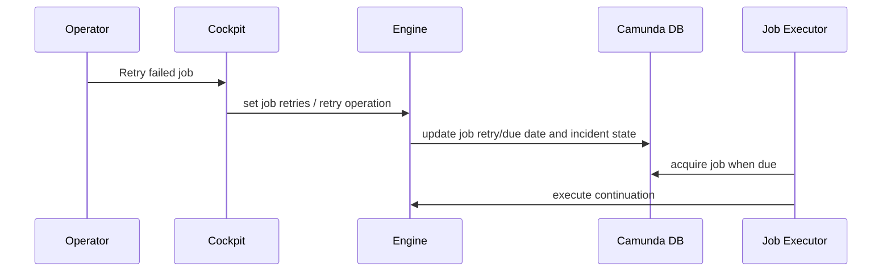

### What Retry Does Not Mean

Retry does not mean:

- root cause is fixed,
- side effect is safe,
- external system did not already process request,
- business outcome is still valid,
- data contract is now correct.

Retry only tells engine: “this job may be acquired again.”

---

## 6. External Task Incident Operations

External task failure differs from internal job failure.

Worker reports failure with retries and retry timeout. When retries reach zero or below, engine creates `failedExternalTask` incident. The task will not be fetched again until retries are reset.

### External Task Triage

| Check | Reason |
|---|---|
| Topic name | Identifies worker family/runbook |
| Worker id | Which worker reported failure |
| Error message/details | Worker-level root cause |
| Lock expiration | Whether task is locked/stale |
| Retries | Whether task can be fetched |
| Retry timeout | When it becomes available |
| Business key | Which business case affected |
| Idempotency key | Safe completion/retry |

### Common External Task Problems

| Problem | Symptom | Action |
|---|---|---|
| Worker down | tasks pending, no progress | restart/scale worker |
| Lock duration too short | duplicate work or lock extension failures | increase lock or extend lock during work |
| Lock duration too long | slow recovery after worker crash | reduce lock or heartbeat/extend pattern |
| Topic typo | tasks never fetched | fix worker topic or BPMN topic |
| Retries zero | incident created | inspect, fix, reset retries |
| Business error reported as failure | incidents for valid outcomes | use `handleBpmnError` |

---

## 7. Variable Correction Playbook

Variable correction is powerful and dangerous. It changes execution context, not just display data.

### When Variable Correction Is Legitimate

- Input variable missing due to known ingestion bug.
- Type mismatch fixed by deterministic transformation.
- Manual data correction approved by business owner.
- External reconciliation result needs to be recorded before retry.

### When It Is Dangerous

- Variable controls gateway already passed.
- Variable is historical evidence.
- Variable update bypasses domain validation.
- Variable contains sensitive data.
- Running delegate may read it concurrently.

### Variable Correction Template

```text
Business key:
Process instance id:
Activity id:
Variable name:
Old value:
New value:
Reason code:
Approved by:
Ticket:
Expected next operation:
Rollback plan:
```

### Prefer Application Facade for Business Correction

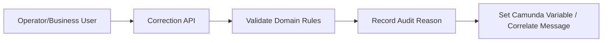

Do not let routine business correction happen through raw variable editing in Cockpit.

---

## 8. Process Instance Suspension

Suspension pauses execution. It can apply at process definition, process instance, or job level depending on operation.

### When to Suspend

| Situation | Suspend Scope |
|---|---|
| Bad process version deployed | Process definition version |
| External provider causing duplicate risk | Affected process instances/jobs |
| Incident storm from one activity | Process instances at affected activity |
| Security incident | Definition or whole application boundary |
| Migration prep | Selected instances |

### When Not to Suspend

- As substitute for fixing broken delegate.
- As routine business hold if BPMN should model “on hold”.
- Without clear resume criteria.
- Without impact analysis on timers/SLA.

### Suspension Runbook

```text
1. Identify blast radius: definition key, version, tenant, business segment.
2. Decide scope: definition vs instance vs job.
3. Communicate impact: new starts? active instances? timers? tasks?
4. Suspend with reason/ticket.
5. Fix root cause or perform migration/correction.
6. Resume in controlled order.
7. Monitor job backlog and incident rate.
```

---

## 9. Process Instance Modification

Process instance modification can start or cancel activity instances inside a running process. It is a surgical tool.

### Legitimate Use Cases

- Repair instance stuck due to model bug.
- Move token after manual reconciliation.
- Skip activity that is no longer valid because of external irreversible event.
- Re-enter an activity after correcting data.
- Cancel duplicate token caused by earlier defect.

### Dangerous Use Cases

- Routine business override.
- Replacing missing BPMN path.
- Moving token without understanding variable requirements.
- Skipping compensation/cleanup.
- Applying mass modification without dry-run and sample verification.

### Modification Pre-Flight Checklist

| Check | Why |
|---|---|
| Is current activity a safe wait state? | Modifying active service execution is risky |
| What variables does target activity require? | Missing contract causes new incident |
| What side effects already happened? | Avoid duplicate/skip damage |
| What history/audit explanation exists? | Defensibility |
| Is this single instance or batch? | Blast radius |
| Is there a rollback plan? | Repair safety |

### Example Java API Pattern

```java
runtimeService.createProcessInstanceModification(processInstanceId)
    .cancelAllForActivity("UserTask_WrongReview")
    .startBeforeActivity("UserTask_CorrectReview")
    .setAnnotation("Moved after approved support ticket INC-10421")
    .execute();
```

Use annotation/reason whenever available in your operational tooling, and keep external audit if API surface does not capture full business reason.

---

## 10. Process Instance Restart

Restart is different from modification. Restart creates a new process instance based on historical data from a completed/terminated instance, usually starting before selected activities.

### Restart Use Cases

- Accidentally completed process needs re-run from known point.
- Process terminated due to bad deployment.
- Need to replay part of business flow with corrected code.
- Recreate instance after failed migration.

### Restart Risks

- Duplicate external side effects.
- Old variables may be stale.
- Business state may have moved forward.
- History might not include all required data at right level.

### Restart Rule

Restart should be treated as new business execution with explicit reason and side-effect reconciliation.

---

## 11. Process Instance Migration Operations

Migration moves running instances from one process definition version to another.

### Operational Model

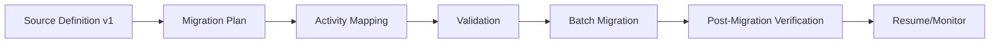

### Migration Checklist

- Are active wait states mapped?
- Are activity ids stable?
- Are event subscriptions compatible?
- Are called process versions compatible?
- Are variable contracts compatible?
- Are task forms compatible?
- Are job definitions compatible?
- Are history/audit expectations documented?
- Is there a sample migration before batch?
- Is rollback strategy defined?

Migration is not a deploy step. It is an operational change with business impact.

---

## 12. Tasklist Operations

Tasklist is for working on user tasks.

### Core Task Lifecycle

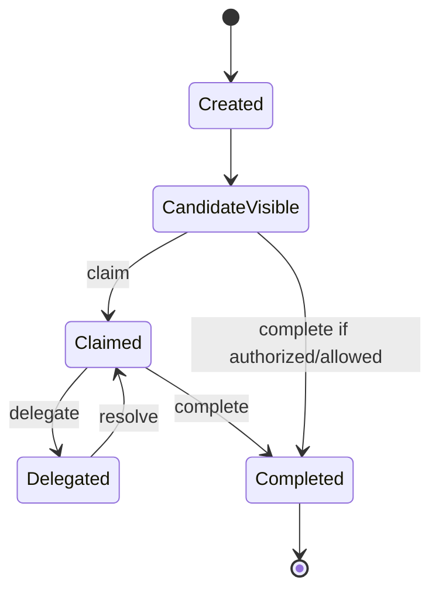

### What Tasklist Should Handle

- Showing task filters.
- Claiming task.
- Completing task with form data.
- Delegating/resolving task if process supports it.
- Viewing task context.
- Applying user assignment model.

### What Tasklist Should Not Become

- Incident repair interface.
- Variable admin editor for business users.
- Replacement for domain validation.
- Cross-case investigation workbench for complex regulatory cases unless extended with proper domain UI.

### User Task Support Questions

| Question | Owner |
|---|---|
| User cannot see task | Admin/security + task assignment config |
| User sees wrong tenant task | Security/authorization urgent |
| Task form fails submit | App/dev team |
| Task completed wrong | Business owner + operator repair |
| Task stuck after completion | Process incident triage |
| Candidate group wrong | BPMN/config/delegate assignment review |

---

## 13. Task Assignment Playbook

### Assignment Sources

| Source | Example | Risk |
|---|---|---|
| Static BPMN candidate group | `camunda:candidateGroups="risk-officer"` | inflexible across tenant/region |
| Expression | `${assigneeResolver.resolve(execution)}` | hidden logic if too complex |
| Task listener | dynamic assignment on create | listener overuse risk |
| API assignment | TaskService claim/setAssignee | needs authorization/audit |

### Assignment Failure Modes

| Symptom | Possible Cause |
|---|---|
| Nobody sees task | candidate group empty/wrong tenant/filter |
| Too many users see task | group too broad |
| Task claimed by wrong person | authorization too loose |
| Reassignment not audited | custom UI bypasses user operation log/domain audit |
| SLA timer fires despite work | timer boundary not canceled/completed as expected |

### Good Assignment Contract

```text
Task: UserTask_SupervisorReview
Candidate group rule: region supervisor group by case.region
Assignee rule: none at creation; user claims from candidate pool
Escalation: after PT48H notify group lead; after PT72H create escalation task
Authorization: only candidate group can claim; only assignee can complete
Audit: claim, unclaim, delegate, complete, escalation captured
```

---

## 14. Admin: Identity, Group, Tenant, Authorization

Admin is used for administrative management.

Operationally important areas:

- user management,
- group management,
- tenant management,
- authorization management,
- system management,
- auditing.

### Authorization Mental Model

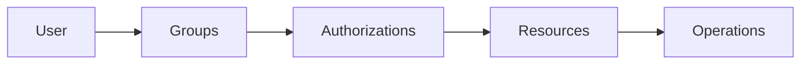

Do not model production security as “everyone is admin”.

### Minimum Role Separation

| Role | Capabilities |
|---|---|
| Business task user | view/claim/complete assigned tasks |
| Business supervisor | reassign/escalate domain tasks through business UI |
| Operator L1 | view incidents, basic retry low-risk jobs |
| Operator L2 | variable correction, suspension, instance repair with approval |
| Developer support | diagnose stacktrace/model/code issue |
| Platform admin | authorization, deployment, system config |
| Auditor | read-only audit/history/report access |

### Admin Anti-Patterns

- Shared admin account.
- Granting `ALL` permissions to broad group.
- Mixing developer and business operator permissions.
- No tenant-level permission strategy.
- No periodic access review.
- No mapping from Camunda permissions to organization roles.

---

## 15. Auditing Operations

Production operations must be explainable. “We clicked retry” is not enough for regulated systems.

### Audit Dimensions

| Dimension | Example |
|---|---|
| Who | operator user id |
| What | set job retries, modified variable, suspended instance |
| When | timestamp |
| Where | process instance/business key/activity id |
| Why | reason code/ticket/business approval |
| Before/after | previous and new values if applicable |
| Outcome | job succeeded, incident remains, escalated |

Camunda user operation log can record many engine operations, but regulated systems often need a domain-level audit log as well.

### Operator Note Pattern

For every risky operation, require:

```text
reasonCode: EXTERNAL_PROVIDER_RECOVERED
incidentTicket: INC-2026-000412
approvedBy: ops-lead@example.com
businessImpact: 17 cases delayed; no duplicate payment risk
nextReviewAt: 2026-06-28T09:00:00+07:00
```

---

## 16. Batch Operations

Batch operations are useful for high-volume operational work:

- set job retries for many instances,
- migrate process instances,
- restart instances,
- delete historic instances,
- suspend/activate groups of instances depending on feature availability/configuration.

### Batch Risk Model

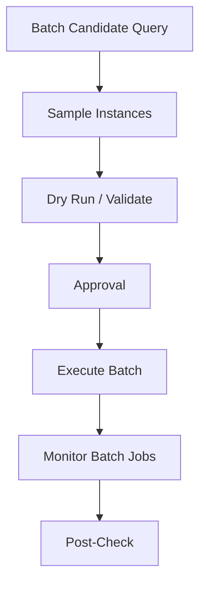

### Batch Checklist

- Query criteria reviewed?
- Count known?
- Sample verified?
- Exclusion list needed?
- Operation idempotent?
- Job executor capacity available?
- Maintenance window needed?
- Rollback/compensation plan exists?
- Business owner approved?
- Post-batch verification query ready?

Batch operation without candidate discipline is how one incident becomes a platform outage.

---

## 17. Deployment Operations

A process deployment is an operational event.

### Deployment Pre-Check

| Check | Why |
|---|---|
| BPMN parse validation | prevent invalid deployment |
| Activity ids stable | migration/ops compatibility |
| History TTL set | cleanup compliance |
| Delegate beans exist | avoid runtime expression failure |
| DMN version compatible | decision behavior stability |
| Form keys valid | task completion readiness |
| Message names stable | event subscription compatibility |
| Migration plan needed? | active instance continuity |
| Rollback plan | production safety |

### Deployment Modes

| Mode | Operational Concern |
|---|---|
| Auto-deploy in Spring Boot | accidental deployment on app start |
| RepositoryService deployment | controlled by app/release pipeline |
| Camunda Run deployment | operational package boundary |
| Shared engine process application | classloader/process archive concerns |

### Release Rule

Do not deploy BPMN changes without answering:

```text
What happens to currently running instances?
```

---

## 18. Operational Queries: Java API Examples

### Find Incidents by Process Definition

```java
List<Incident> incidents = runtimeService.createIncidentQuery()
    .processDefinitionKey("enforcementCaseMain")
    .list();
```

### Find Failed Jobs

```java
List<Job> failedJobs = managementService.createJobQuery()
    .withException()
    .noRetriesLeft()
    .list();
```

### Set Job Retries

```java
managementService.setJobRetries(jobId, 3);
```

### Find Active User Tasks by Business Key

```java
List<Task> tasks = taskService.createTaskQuery()
    .processInstanceBusinessKey("CASE-2026-0001")
    .active()
    .list();
```

### Correlate Message After Reconciliation

```java
runtimeService.createMessageCorrelation("PaymentConfirmed")
    .processInstanceBusinessKey(orderId)
    .setVariable("paymentConfirmationId", confirmationId)
    .correlateWithResult();
```

### Suspend Process Instance

```java
runtimeService.suspendProcessInstanceById(processInstanceId);
```

### Activate Process Instance

```java
runtimeService.activateProcessInstanceById(processInstanceId);
```

Wrap these operations behind internal operator APIs if you need approval, reason capture, and audit enrichment.

---

## 19. Operational REST Examples

Exact endpoint details can vary by distribution/security setup, but the operational pattern should be stable.

### Get Incidents

```http
GET /engine-rest/incident?processDefinitionKeyIn=enforcementCaseMain
```

### Set Job Retries

```http
PUT /engine-rest/job/{jobId}/retries
Content-Type: application/json

{
  "retries": 3
}
```

### Correlate Message

```http
POST /engine-rest/message
Content-Type: application/json

{
  "messageName": "PaymentConfirmed",
  "businessKey": "ORDER-1001",
  "processVariables": {
    "paymentConfirmationId": {
      "value": "PAY-777",
      "type": "String"
    }
  }
}
```

### Complete Task

```http
POST /engine-rest/task/{taskId}/complete
Content-Type: application/json

{
  "variables": {
    "reviewOutcome": {
      "value": "APPROVED",
      "type": "String"
    }
  }
}
```

Do not expose these raw endpoints directly to end-user browser applications.

---

## 20. Operational Dashboards

Cockpit is interactive. Production also needs dashboards and alerts.

### Minimum Workflow Health Signals

| Signal | Why |
|---|---|
| Active process instances by definition/version | workload and version spread |
| Incident count by activity id/type | failure hotspot |
| Failed jobs no retries | stuck execution |
| Job backlog by due date/priority | executor pressure |
| External task backlog by topic | worker pressure |
| User task age by task definition key | SLA/human bottleneck |
| Timer jobs due soon/overdue | SLA/timer health |
| History cleanup duration/backlog | DB maintenance health |
| Process completion rate | business throughput |
| Migration/batch job progress | operation safety |

### Alert Design

Bad alert:

```text
Incident count > 0
```

Better alert:

```text
P1: failedJob incidents at ServiceTask_ChargePayment > 5 in 10m for production tenant.
P2: external task backlog topic payment-charge age p95 > 15m.
P3: user task SupervisorReview age > SLA for high-risk cases.
```

Alert harus actionable dan punya owner.

---

## 21. Incident Runbook Template

Gunakan template ini untuk setiap risky activity.

```md
# Runbook: <Activity ID>

## Activity
- Process definition key:
- Activity id:
- Activity label:
- Type: service task / external task / timer / message / user task
- Owner team:

## Business Meaning
- What this step does:
- Business impact if stuck:
- SLA impact:

## Inputs
- Required variables:
- External IDs:
- Idempotency key:

## Side Effects
- External systems called:
- Is side effect idempotent?
- How to check if side effect happened:

## Common Failures
| Error | Meaning | Safe Retry | Action |
|---|---|---|---|
| ... | ... | yes/no | ... |

## Triage
1. Check business key.
2. Inspect variables.
3. Check external system by idempotency key.
4. Determine whether retry is safe.
5. Record ticket and reason.

## Recovery
- Retry steps:
- Variable correction steps:
- Message correlation steps:
- Escalation path:

## Do Not
- Do not retry if...
- Do not modify variable...
- Do not skip activity unless...
```

---

## 22. Example Runbook: Payment Charge Failed Job

```md
# Runbook: ServiceTask_ChargePayment

## Activity
- Process: orderFulfillment
- Activity id: ServiceTask_ChargePayment
- Owner: Payments Platform

## Business Meaning
Charges customer before fulfillment release.

## Inputs
- orderId
- paymentCommandId
- amount
- currency
- paymentMethodToken

## Side Effects
- Calls payment provider POST /charges
- Idempotency key: paymentCommandId

## Common Failures
| Error | Meaning | Safe Retry | Action |
|---|---|---|---|
| HTTP 503 | Provider unavailable | Yes | Retry after provider green |
| Timeout | Unknown outcome | Maybe | Query provider by paymentCommandId first |
| 400 INVALID_TOKEN | Business/input issue | No | Send to manual payment review |
| Duplicate command | Provider already processed | No direct retry | Correlate PaymentConfirmed if charge exists |

## Recovery
1. Search provider charge by paymentCommandId.
2. If charge exists, correlate PaymentConfirmed.
3. If no charge and provider healthy, set job retries to 1.
4. If token invalid, modify process to manual review path or correlate PaymentDeclined business event.
5. Record incident ticket.
```

---

## 23. Example Runbook: User Task Stuck

```md
# Runbook: UserTask_SupervisorReview Stuck

## Symptom
Task age exceeds 72h.

## Checks
1. Is task assigned or candidate only?
2. Is candidate group populated?
3. Does tenant filter exclude correct users?
4. Did SLA timer fire?
5. Is assignee inactive?
6. Is task form throwing error?

## Recovery
- If candidate group wrong: correct assignment through approved support operation.
- If assignee inactive: reassign to supervisor group.
- If form bug: deploy fix; user retries complete.
- If SLA timer missing: raise process model defect; manually escalate current case if approved.

## Audit
Record old assignee, new assignee, reason, approving supervisor, and ticket.
```

---

## 24. Example Runbook: Message Correlation Failed

```md
# Runbook: PaymentConfirmed Message Not Correlated

## Symptom
External event arrived but process remains waiting.

## Checks
1. Is process instance waiting at MessageCatch_PaymentConfirmed?
2. Is businessKey equal to orderId?
3. Is message name exactly PaymentConfirmed?
4. Did event arrive before subscription commit?
5. Was event duplicate and already consumed?
6. Does tenant id match?

## Recovery
- If early event: store in inbox and replay correlation.
- If wrong business key: correct upstream mapping and correlate manually after approval.
- If process no longer waiting: mark event as late and attach to audit.
- If duplicate: ignore idempotently.
```

---

## 25. L1/L2/L3 Support Split

### L1 Operator

Can:

- identify affected business key,
- read incident dashboard,
- follow low-risk retry runbook,
- escalate with required context.

Should not:

- edit variables,
- modify process instance,
- retry non-idempotent side effects,
- suspend process definition.

### L2 Workflow Operator

Can:

- reset retries after validation,
- perform approved variable corrections,
- suspend/resume selected instances,
- run batch operations with approval,
- correlate messages manually after reconciliation.

### L3 Developer/Platform

Can:

- diagnose stacktrace/code/model defects,
- create migration plan,
- deploy hotfix,
- design repair script,
- update runbook.

### Business Owner

Approves:

- manual override,
- skip/reopen/reject business path,
- data correction affecting outcome,
- compensating action.

---

## 26. Production Operation Review Board

For regulated systems, create lightweight review for risky operations.

### Require Approval For

- process instance modification,
- batch migration,
- batch retry for side-effect tasks,
- variable correction affecting business outcome,
- suspend process definition,
- delete historic data,
- manual message correlation for financial/legal event.

### Do Not Require Approval For

- retry low-risk transient technical failure with idempotency,
- reassign task within same authorized group,
- view incident details,
- export operational report.

---

## 27. Post-Incident Review

After a significant incident, do not stop at “retry succeeded”.

### Review Questions

- Why did the incident occur?
- Was the error technical or business?
- Did BPMN model represent it correctly?
- Was retry safe because of design or luck?
- Did operator have enough information?
- Was business impact measured?
- Did history/audit capture the repair?
- Should this become a BPMN path, DMN rule, validation, or runbook update?
- Should alert threshold change?
- Are tests missing?

### Output

```text
Root cause:
Affected instances:
Business impact:
Immediate recovery:
Permanent fix:
Runbook update:
Test update:
Monitoring update:
Owner:
Due date:
```

---

## 28. Operational Maturity Levels

| Level | Characteristics |
|---:|---|
| 0 | Developers manually inspect DB/logs |
| 1 | Cockpit used ad hoc, no runbooks |
| 2 | Incidents visible, basic retry guidance |
| 3 | Runbooks per critical activity, L1/L2 split |
| 4 | Dashboards, alerts, audit, approval workflow |
| 5 | Automated safe recovery, chaos/recovery drills, migration discipline |

Top-tier workflow engineering is not “zero incidents”. It is controlled failure with bounded impact and clear recovery.

---

## 29. Common Operational Mistakes

### Mistake: Retrying Because “It Usually Works”

Retry without knowing idempotency is gambling.

### Mistake: Editing Variables to Force a Gateway

If gateway already passed, variable edit might do nothing or corrupt future logic.

### Mistake: Suspending Whole Definition Too Quickly

Suspending definition can block unrelated healthy instances or new starts. Analyze blast radius.

### Mistake: Treating Task Reassignment as Technical Operation Only

Task ownership is often business/legal responsibility. Reassignment needs reason.

### Mistake: Using Cockpit for Business Decisions

Cockpit operation is not domain validation. Build business facade.

### Mistake: Ignoring History Level Until Audit Needs It

History level is not free to change retroactively. Decide upfront.

---

## 30. Practice: Triage a Failed Payment Job

Given:

```text
Process: orderFulfillment:17
Business key: ORDER-9912
Activity: ServiceTask_ChargePayment
Incident type: failedJob
Exception: java.net.SocketTimeoutException
Variables:
  paymentCommandId = PAYCMD-88
  amount = 120000
  currency = IDR
Retries = 0
```

Do not immediately retry.

Correct triage:

1. Identify side effect: payment charge.
2. Identify idempotency key: `PAYCMD-88`.
3. Query provider by `PAYCMD-88`.
4. If provider has successful charge, do not retry charge; correlate success or move to confirmation path.
5. If provider has no charge and provider is healthy, set retries to 1.
6. If provider status unknown, wait/reconcile.
7. Record ticket and reason.

---

## 31. Practice: Triage a Stuck Review Task

Given:

```text
Task: UserTask_SupervisorReview
Created: 5 days ago
Candidate group: risk-supervisor-jakarta
Assignee: null
SLA: 48 hours
No incident
```

Diagnosis:

- This is not a technical incident.
- It is a human workflow/SLA issue.
- Check whether candidate group exists and users are members.
- Check Tasklist filters.
- Check tenant/authorization.
- Check if SLA timer modeled correctly.

Recovery:

- If assignment config wrong, correct and notify group.
- If SLA timer missing or broken, create manual escalation and model fix.
- Do not modify process token unless there is a modeled or approved repair path.

---

## 32. Practice: Triage a Message That Arrived Early

Given:

```text
Event: DocumentVerified
Business key: CASE-1007
Engine error: Cannot correlate message; no process definition or execution matches
Process instance exists but still at ServiceTask_SubmitDocumentVerification
```

Likely cause:

- Event arrived before process reached message catch wait state.

Correction:

- Do not discard event.
- Store external events in inbox table.
- Replay correlation when subscription exists.
- Alternatively redesign with event subprocess or stateful event adapter if business event can arrive at multiple phases.

---

## 33. Building an Operator API

A mature platform often wraps Camunda operations behind internal operator APIs.

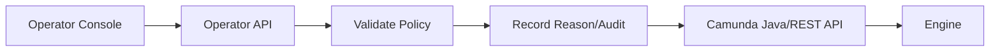

### Example Operations

```text
POST /ops/process-instances/{id}/retry-failed-job
POST /ops/process-instances/{id}/correct-variable
POST /ops/process-instances/{id}/correlate-message
POST /ops/process-instances/{id}/suspend
POST /ops/process-instances/{id}/modify
```

Each operation should require:

- actor,
- reason code,
- ticket id,
- business key,
- expected state,
- safety validation,
- audit event.

---

## 34. Designing for Operability at Modeling Time

Operability is not added at the end. Model it.

### Add Meaningful Activity IDs

```text
ServiceTask_SubmitSanctionsCheck
UserTask_InvestigatorReview
BoundaryTimer_InvestigatorReviewSla
MessageCatch_SanctionsCheckCompleted
```

### Add Explicit Recovery Paths

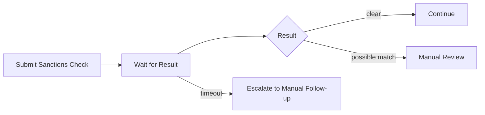

### Add Manual Repair Tasks for Business-Correctable Failures

Not every issue should be token modification. If a correction is business-expected, model it.

---

## 35. Kaufman Deliberate Practice

### Drill 1 — Cockpit Walkthrough

For a sample process instance, answer:

- process definition key/version,
- business key,
- current activity,
- active jobs,
- active tasks,
- variable contract,
- incident status,
- history trail.

### Drill 2 — Incident Simulation

Create an async service task that throws exception until a variable is corrected.

Practice:

1. observe incident,
2. inspect failed job,
3. correct variable safely,
4. set retries,
5. verify completion,
6. document runbook.

### Drill 3 — External Task Failure

Make worker report failure with retries zero.

Practice:

- inspect external task incident,
- reset retries,
- restart worker,
- complete task,
- verify history.

### Drill 4 — Suspension and Resume

Suspend a process instance with timer/job. Observe:

- whether job executor acquires it,
- what Tasklist shows,
- what happens after resume,
- whether SLA calculation needs adjustment.

---

## 36. Production Readiness Checklist

Before declaring a Camunda workflow production-ready, require:

### Model

- Stable activity ids.
- Explicit error/timer/message semantics.
- Business key strategy.
- Version/migration policy.
- Clear ownership per process.

### Code

- Thin delegates.
- Idempotent side effects.
- Clear exception taxonomy.
- Configurable retry cycles.
- Tests for failure paths.

### Data

- Small variable contract.
- No unsafe Java serialized long-running entities.
- Sensitive data minimized.
- History TTL configured.

### Operations

- Cockpit access controlled.
- Admin roles separated.
- Runbooks for risky activities.
- Dashboards and alerts.
- Batch operation approval.
- Manual correction audit.

### Support

- L1/L2/L3 split.
- Escalation path.
- Post-incident review process.
- Known incident catalog.

---

## 37. Summary

Camunda operations require more than knowing where the retry button is.

A production-grade Camunda 7 system needs:

- a clear separation between Cockpit, Tasklist, Admin, business UI, and operator API,
- runbooks that classify failures and define safe recovery,
- idempotency evidence before retrying side-effect jobs,
- explicit variable correction governance,
- suspension/modification/migration discipline,
- dashboards that track workflow health, not only JVM health,
- audit records that explain not only what changed, but why.

The key mental model: Cockpit shows the engine state; it does not replace business judgment. Tasklist handles human work; it does not replace domain case management. Admin manages access; it does not define operational policy. A top-tier engineer designs the workflow so support teams can operate it safely without becoming accidental process developers.

---

## References

- Camunda 7.24 Documentation — Cockpit: https://docs.camunda.org/manual/7.24/webapps/cockpit/
- Camunda 7.24 Documentation — Cockpit Failed Jobs: https://docs.camunda.org/manual/7.24/webapps/cockpit/bpmn/failed-jobs/
- Camunda 7.24 Documentation — Tasklist: https://docs.camunda.org/manual/7.24/webapps/tasklist/
- Camunda 7.24 Documentation — Admin: https://docs.camunda.org/manual/7.24/webapps/admin/
- Camunda 7.24 Documentation — Incidents: https://docs.camunda.org/manual/7.24/user-guide/process-engine/incidents/
- Camunda 7.24 Documentation — Process Instance Modification: https://docs.camunda.org/manual/7.24/user-guide/process-engine/process-instance-modification/
- Camunda 7.24 Documentation — Process Instance Restart: https://docs.camunda.org/manual/7.24/user-guide/process-engine/process-instance-restart/
- Camunda 7.24 Documentation — Process Instance Migration: https://docs.camunda.org/manual/7.24/user-guide/process-engine/process-instance-migration/
- Camunda 7.24 Documentation — Authorization Service: https://docs.camunda.org/manual/7.24/user-guide/process-engine/authorization-service/
- Camunda 7.24 Documentation — User Operation Log: https://docs.camunda.org/manual/7.24/user-guide/process-engine/history/user-operation-log/
