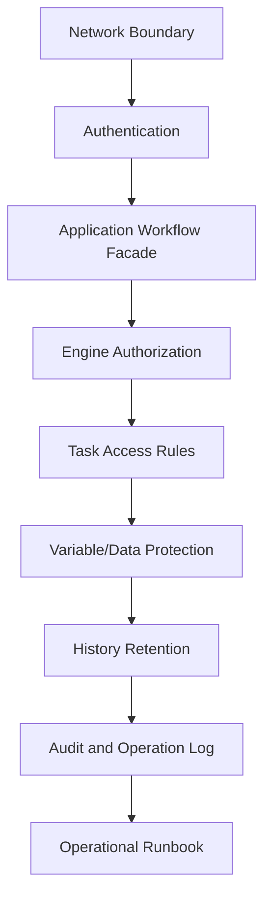
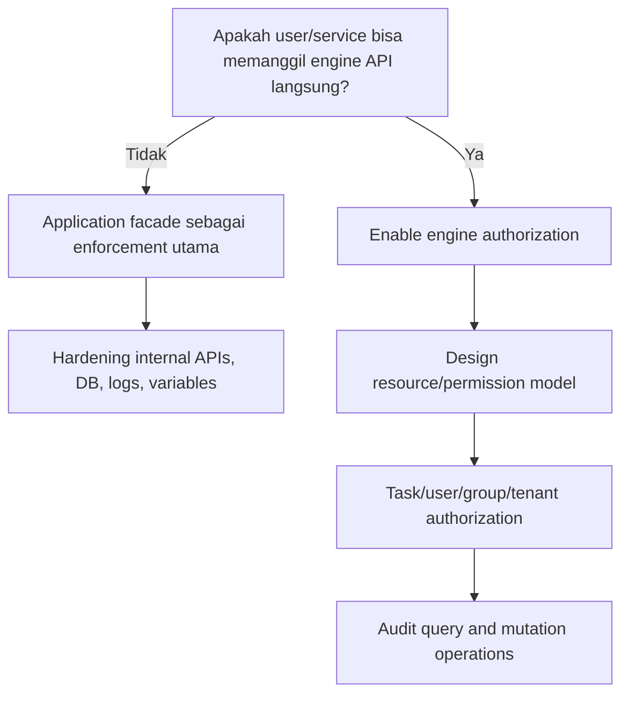
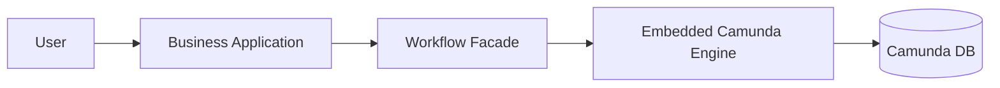
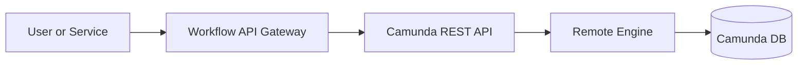
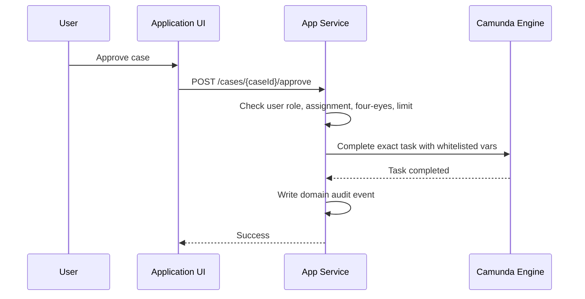
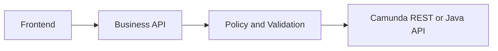
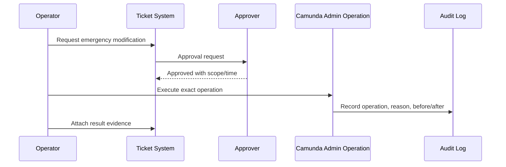
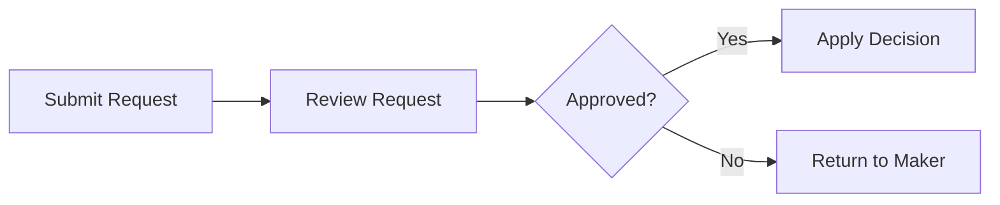
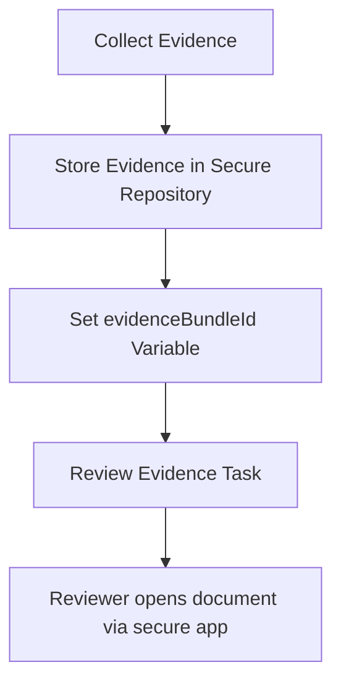

# Part 033 — Security, Authorization, and Data Protection

> Goal part ini: membangun cara berpikir security untuk Camunda 7 sebagai **runtime workflow yang menyimpan state bisnis, task manusia, history, incident, variable, dan operasi administratif**. Fokusnya bukan sekadar “nyalakan login”, tetapi bagaimana membatasi siapa boleh melakukan apa, data apa yang boleh terlihat, operasi apa yang harus diaudit, dan bagaimana mencegah workflow platform menjadi jalur bypass kontrol aplikasi.

Camunda 7 security harus dibaca dari sudut pandang arsitektur. Engine bisa embedded di dalam aplikasi, shared di application server, atau diekspos lewat REST/webapps. Setiap mode memiliki threat model berbeda. Dokumentasi resmi Camunda menegaskan bahwa authorization engine memiliki cost dan kompleksitas; authorization terutama dibutuhkan ketika pihak yang tidak sepenuhnya dipercaya dapat berinteraksi langsung dengan Process Engine API, REST API, atau webapps. Jika aplikasi sepenuhnya mengontrol akses ke engine API, aplikasi dapat menjadi enforcement boundary utama.

Referensi resmi utama:

- Camunda 7.24 — Security Instructions: `https://docs.camunda.org/manual/7.24/user-guide/security/`
- Camunda 7.24 — Authorization Service: `https://docs.camunda.org/manual/7.24/user-guide/process-engine/authorization-service/`
- Camunda 7.24 — Admin Authorization Management: `https://docs.camunda.org/manual/7.24/webapps/admin/authorization-management/`
- Camunda 7.24 — Webapps Authentication: `https://docs.camunda.org/manual/7.24/webapps/shared-options/authentication/`
- Camunda 7.24 — CSRF Prevention: `https://docs.camunda.org/manual/7.24/webapps/shared-options/csrf-prevention/`
- Camunda 7.24 — History Cleanup: `https://docs.camunda.org/manual/7.24/user-guide/process-engine/history/history-cleanup/`

---

## 1. Mental Model: Camunda Security Is Layered, Not Single-Feature

A common mistake adalah menganggap Camunda security = `authorizationEnabled=true`. Itu terlalu sempit.

Camunda security terdiri dari beberapa lapis:



Setiap lapis menjawab pertanyaan berbeda:

| Layer | Pertanyaan | Failure jika hilang |
|---|---|---|
| Network boundary | Siapa bisa mencapai REST/webapps/DB? | API internal terbuka ke user atau service yang tidak tepat |
| Authentication | Identitas user/service valid atau tidak? | Anonymous/impersonated actor bisa menjalankan command |
| Application facade | Command apa yang diperbolehkan oleh use case? | User bisa memanggil engine API di luar journey bisnis |
| Engine authorization | Resource engine apa yang boleh diakses? | User bisa query/modify task/process yang bukan miliknya |
| Task access | Human task milik siapa dan dalam role apa? | Claim/complete/observe task lintas role |
| Variable protection | Data sensitif boleh disimpan/dilihat dimana? | PII/secret bocor lewat Cockpit, history, REST, logs |
| History retention | Berapa lama data historis harus hidup? | Data retained terlalu lama atau hilang sebelum legal period |
| Audit | Siapa melakukan operasi administratif? | Tidak bisa membuktikan chain-of-custody atau authorized override |
| Runbook | Bagaimana recovery aman dilakukan? | Operator memperbaiki incident secara ad-hoc tanpa kontrol |

Top 1% engineer tidak berhenti pada “fitur apa yang tersedia”. Mereka memetakan **asset**, **actor**, **trust boundary**, **command**, **read model**, dan **evidence**.

---

## 2. Asset Map: Apa yang Sebenarnya Harus Dilindungi?

Camunda bukan hanya library BPMN. Dalam production, ia menyimpan dan memproses asset penting:

| Asset | Contoh | Risiko |
|---|---|---|
| Process definitions | BPMN, DMN, form references | Business logic tampering, unsafe deployment |
| Process instances | running case/order/request | Unauthorized visibility atau mutation |
| User tasks | approval, review, investigation | Unauthorized completion, assignment abuse |
| Variables | customer id, risk score, PII, decision result | Data leakage, schema abuse, history exposure |
| External tasks/jobs | work items, retries, locks | Replay, duplicate command, stuck processing |
| Incidents | failed jobs, error messages | Leakage via stack traces atau operational bypass |
| History | activity trail, variable history, task history | Over-retention, under-retention, evidence gap |
| Admin operations | retry, modify, migrate, suspend, delete | Unauthorized repair, hidden manipulation |
| DB tables | ACT_RU, ACT_HI, ACT_RE, ACT_GE | Direct mutation, data exfiltration |
| Delegation code | JavaDelegate, listener, script | RCE-like behavior through unsafe custom code/deployment |

Security design harus dimulai dari asset map ini. Tanpa asset map, authorization rules biasanya menjadi kumpulan grant/revoke yang sulit dijelaskan.

---

## 3. Actor Model: Jangan Campur User, Operator, Worker, dan Service Account

Camunda production biasanya memiliki aktor berikut:

| Actor | Contoh | Hak yang wajar |
|---|---|---|
| Business user | reviewer, approver, case officer | melihat/mengerjakan task miliknya atau group-nya |
| Supervisor | team lead, escalation owner | melihat queue tim, reassign task tertentu, bukan admin penuh |
| Operator | production support | melihat incidents, retry jobs, inspect variables terbatas |
| Workflow admin | platform engineer | deployment, migration, cleanup, authorization config |
| External worker | service worker | fetch/lock/complete topic tertentu |
| Backend service | workflow facade | start process, correlate message, complete use-case command |
| Auditor | compliance/internal audit | read-only historical trace, no mutation |
| DBA | database operations | backup/restore/index, bukan business mutation langsung |
| Deployer/CI | pipeline identity | deploy BPMN/DMN dengan kontrol review |

Anti-pattern umum: semua aktor diberi akses `camunda-admins` karena lebih cepat saat development. Ini merusak audit dan membuat production support tidak defensible.

---

## 4. Decision Framework: Apakah Perlu Engine Authorization?

Camunda docs menyatakan authorization memiliki cost dan kompleksitas. Jadi keputusan harus eksplisit.



Gunakan engine authorization jika:

- Camunda REST API diekspos ke browser, backoffice, integration client, atau service yang tidak full-trust.
- Camunda webapps seperti Cockpit/Tasklist/Admin digunakan oleh banyak role dengan hak berbeda.
- User dapat membuat query sendiri atau menjalankan command engine langsung.
- Multi-tenant access perlu dibatasi pada level engine.
- Regulatory requirement meminta enforcement dan audit langsung pada resource workflow.

Engine authorization bisa tidak menjadi enforcement utama jika:

- Engine embedded di aplikasi dan hanya internal domain service yang memanggil API engine.
- Semua user-level authorization sudah dilakukan oleh application layer.
- REST/webapps tidak diekspos ke untrusted actor.
- Operational users yang masuk ke Cockpit memang full-trust dan dikontrol secara organisasi.

Namun “tidak memakai engine authorization” bukan berarti tidak ada security. Itu berarti enforcement dipindah ke application facade, gateway, identity provider, network, dan operational policy.

---

## 5. Architecture Boundary Patterns

### 5.1 Embedded Engine Behind Application Facade



Karakteristik:

- User tidak memanggil engine API langsung.
- Application facade menjalankan authorization use-case.
- Engine authorization sering tidak menjadi primary control.
- Cocok untuk product/application-specific workflow.

Security rule:

- Jangan expose raw `RuntimeService`, `TaskService`, atau `HistoryService` dari controller publik.
- Buat command API berbasis domain: `approveCase`, `assignInvestigator`, `submitEvidence`, `cancelCase`.
- Query task melalui read model aplikasi jika perlu masking/aggregation.

Contoh buruk:

```java
@PostMapping("/engine/task/{taskId}/complete")
public void complete(@PathVariable String taskId, @RequestBody Map<String, Object> vars) {
    taskService.complete(taskId, vars);
}
```

Masalah:

- Tidak ada validasi ownership.
- Semua variable bebas ditulis user.
- Task id menjadi capability token.
- Tidak ada audit bisnis.

Contoh lebih baik:

```java
@PostMapping("/cases/{caseId}/approval")
public void approveCase(@PathVariable String caseId,
                        @RequestBody ApprovalRequest request,
                        Principal principal) {
    approvalApplicationService.approve(caseId, principal.getName(), request);
}
```

Facade melakukan:

- resolve case;
- cek role/assignment;
- temukan task yang valid;
- validasi command;
- tulis audit domain;
- complete task dengan variable whitelisted.

### 5.2 Remote Engine with Workflow API Gateway



Rule:

- Gateway harus menjadi policy enforcement point.
- Jangan expose REST API mentah ke frontend umum.
- Semua endpoint harus mengikat command ke business key, tenant, role, dan allowed transition.
- REST credentials jangan dibagikan ke browser.

### 5.3 Webapps for Operators Only

Cockpit/Admin/Tasklist bisa sangat berguna, tetapi juga sangat powerful.

Rule:

- Pisahkan operator access dari business user access.
- Batasi network access dengan VPN/internal network/zero-trust gateway.
- Pakai SSO dan MFA jika tersedia di organisasi.
- Jangan menjadikan Cockpit sebagai backoffice bisnis utama tanpa policy layer.
- Sensitive variables harus diproteksi karena Cockpit bisa memperlihatkan runtime/history data sesuai akses.

---

## 6. Authentication: Identitas Dulu, Baru Authorization

Authentication menjawab “siapa aktornya?”. Authorization menjawab “aktor ini boleh melakukan apa?”. Jangan campur keduanya.

Minimum production posture:

| Area | Requirement |
|---|---|
| Webapps | SSO/enterprise login, no default admin in production |
| REST API | authenticated service access, no anonymous engine command |
| Internal services | service identity, mTLS/API gateway/token-based auth |
| External workers | credential per worker class/topic, revocable |
| CI/CD deployer | deployment identity terpisah dari human admin |
| Database | no application user with unnecessary DDL/admin rights |

Untuk Spring Boot embedded deployment, authentication sering dipegang oleh Spring Security. Camunda webapps/REST integration harus dipastikan mengikuti konfigurasi security aplikasi, bukan dibiarkan default terbuka.

---

## 7. Authorization Service: Resource, Permission, User/Group

Camunda Authorization Service bekerja dengan konsep:

- user;
- group;
- resource type;
- resource id;
- permission;
- authorization type seperti grant/revoke/global.

Resource yang umum relevan:

| Resource | Apa yang dikontrol |
|---|---|
| `PROCESS_DEFINITION` | start instance, read definition, update instance by definition |
| `PROCESS_INSTANCE` | read/update runtime instance |
| `TASK` | read/update/complete task |
| `DEPLOYMENT` | deployment read/delete |
| `DECISION_DEFINITION` | decision execution/read |
| `BATCH` | migration/restart/modification batch operations |
| `AUTHORIZATION` | authorization management |
| `USER`, `GROUP`, `TENANT` | identity/tenant administration |
| `HISTORIC_PROCESS_INSTANCE`, `HISTORIC_TASK` | historical visibility |
| `SYSTEM` | system-level admin actions |

### 7.1 Authorization Is Not a Substitute for Domain Policy

Misalnya user punya permission complete task. Itu belum tentu berarti action “approve loan” valid.

Domain policy tetap harus menjawab:

- Apakah task ini masih berada di state yang benar?
- Apakah user punya role pada case ini?
- Apakah user memenuhi four-eyes rule?
- Apakah approval amount melewati limit user?
- Apakah required evidence sudah lengkap?
- Apakah task completion variable valid?

Camunda authorization membatasi akses resource. Domain policy membatasi makna bisnis.

### 7.2 Avoid Over-Broad Grants

Contoh grant berbahaya:

- semua user bisa `READ` semua `PROCESS_INSTANCE`;
- semua reviewer bisa `UPDATE` semua `TASK`;
- semua support bisa `UPDATE` semua process definition;
- service account bisa deploy dan delete deployment sekaligus;
- external worker credentials bisa complete semua topic.

Preferensi:

- grant by group and resource;
- keep admin groups small;
- separate read-only auditor role;
- separate operator role from platform admin;
- explicit emergency role with approval/audit.

---

## 8. Task Access: Assignment Bukan Selalu Authorization

User task memiliki assignee, candidate users, candidate groups, owner, delegation state, dan lifecycle. Ini adalah model kerja manusia. Tetapi jangan otomatis menganggap assignment sama dengan security boundary lengkap.

Pattern yang aman:



Hal yang perlu dicek sebelum `taskService.complete()`:

- task belongs to expected process definition;
- task belongs to business key/case id;
- task is currently active;
- task key equals expected activity id;
- user is assignee/candidate/group member or delegated authority;
- user did not create/request the same approval if four-eyes applies;
- payload variables are whitelisted;
- task is not suspended;
- process instance tenant matches user tenant;
- command idempotency key belum pernah dipakai.

Contoh guard:

```java
public void approve(String caseId, String userId, ApprovalCommand command) {
    CaseRecord caseRecord = caseRepository.getRequired(caseId);
    permissionService.assertCanApprove(userId, caseRecord);

    Task task = taskService.createTaskQuery()
        .processInstanceBusinessKey(caseId)
        .taskDefinitionKey("ApproveCase")
        .active()
        .singleResult();

    if (task == null) {
        throw new IllegalStateException("No active approval task for case " + caseId);
    }

    taskOwnershipPolicy.assertUserCanComplete(userId, task, caseRecord);

    Map<String, Object> vars = Map.of(
        "approvalDecision", command.decision().name(),
        "approvalReasonCode", command.reasonCode()
    );

    taskService.complete(task.getId(), vars);
    auditLog.recordCaseApproved(caseId, userId, command.decision());
}
```

---

## 9. Multi-Tenancy and Tenant Isolation

Camunda 7 supports tenant concepts, but tenant isolation is not magic. Tenant id must be propagated consistently across:

- deployment;
- process definition;
- process instance;
- task query;
- history query;
- external task fetch;
- REST/API facade;
- business read model;
- audit logs.

### 9.1 Tenant Design Questions

| Question | Why it matters |
|---|---|
| Apakah tenant = customer, business unit, region, or legal entity? | Menentukan isolation granularity |
| Apakah process definition berbeda per tenant? | Deployment/versioning complexity |
| Apakah worker boleh memproses lintas tenant? | Credential and data leakage risk |
| Apakah operator boleh melihat semua tenant? | Admin/audit model |
| Apakah history retention berbeda per tenant? | Compliance and cleanup design |
| Apakah tenant id disimpan juga di domain DB? | Cross-store consistency |

### 9.2 Tenant Anti-Pattern

Anti-pattern: memakai tenant id hanya di domain database tetapi tidak di Camunda query.

Akibat:

- task/process instance bisa ditemukan lintas tenant;
- operator dashboard bercampur;
- message correlation salah target;
- audit trail tidak konsisten.

Better:

- tenant id is part of command context;
- tenant id is required in process start/correlation;
- tenant id is asserted during task completion;
- tenant id is included in logs/metrics labels carefully;
- tenant-aware query wrappers are mandatory.

---

## 10. Variable Data Protection

Variable adalah area security paling sering diremehkan.

Masalah utama:

- variable muncul di runtime table;
- variable bisa masuk history table;
- variable bisa terlihat di Cockpit;
- variable bisa dikembalikan oleh REST API;
- serialized object bisa sulit dibaca, dievolusi, dan diamankan;
- stack trace/error message bisa mencetak variable atau payload;
- form variable bisa ditulis user jika tidak divalidasi.

### 10.1 Classification

Klasifikasikan variable sebelum menyimpannya:

| Class | Contoh | Storage policy |
|---|---|---|
| Control variable | `approvalDecision`, `retryable`, `riskBand` | Boleh di Camunda jika kecil dan non-sensitive |
| Correlation variable | `caseId`, `customerId`, `eventId` | Simpan minimal; hindari PII mentah jika bisa |
| Display variable | `caseReference`, `summary` | Masking bila muncul di UI |
| Sensitive variable | NIK, passport, financial data, evidence content | Prefer external secure store + reference |
| Secret | API token, password, private key | Jangan simpan di Camunda variable |
| Large payload | document, attachment, JSON besar | Simpan di object/document store, variable hanya pointer |
| Derived decision | score, risk result | Simpan jika dibutuhkan audit, tapi pertimbangkan TTL/masking |

### 10.2 Prefer Reference over Payload

Bad:

```java
runtimeService.startProcessInstanceByKey(
    "caseReview",
    businessKey,
    Map.of("passportScanBase64", base64Image)
);
```

Better:

```java
runtimeService.startProcessInstanceByKey(
    "caseReview",
    businessKey,
    Map.of(
        "caseId", caseId,
        "evidenceBundleId", evidenceBundleId,
        "riskBand", riskBand
    )
);
```

Rationale:

- workflow engine needs control data, not full confidential payload;
- evidence store can enforce encryption/access/versioning;
- history cleanup does not become primary data deletion mechanism;
- audit can reference immutable evidence id;
- Cockpit exposure is reduced.

### 10.3 Whitelist Completion Variables

Never accept arbitrary variable map from frontend.

Bad:

```java
taskService.complete(taskId, request.getVariables());
```

Better:

```java
Map<String, Object> variables = new HashMap<>();
variables.put("decision", request.decision());
variables.put("reasonCode", request.reasonCode());
variables.put("reviewCompletedAt", clock.instant().toString());

taskService.complete(taskId, variables);
```

Add validation:

- allowed keys;
- allowed types;
- allowed enum values;
- max length;
- no nested arbitrary object;
- no script/expression input;
- tenant/business key match;
- user role match.

---

## 11. History Retention as Security Control

History is not just observability. It is also data exposure and compliance surface.

Camunda history cleanup removes historic data based on configurable time-to-live. TTL defines how long historic data remains before cleanup. Camunda supports defining TTL in model XML and changing it after deployment via Java/REST API. History cleanup can be triggered manually or scheduled; automatic cleanup requires cleanup window configuration.

### 11.1 Retention Matrix

| Process type | Example | Retention driver | Suggested approach |
|---|---|---|---|
| Regulatory case | enforcement investigation | legal/audit | long TTL, strict access, external evidence store |
| Low-risk internal request | leave request | operational | short TTL |
| Financial approval | payment approval | finance audit | medium/long TTL by regulation |
| Customer support | complaint case | privacy + support | limited TTL, masked summary |
| Test/demo | sandbox process | none | very short TTL or isolated DB |

### 11.2 TTL Is Not Full Data Governance

TTL only cleans history after completion/removal time rules. It does not solve:

- runtime variable exposure while instance is active;
- data copied to logs;
- data copied to custom read models;
- data in external worker logs;
- backups;
- object/document store retention;
- screenshots/manual exports;
- audit trails outside Camunda.

So data governance must be end-to-end.

---

## 12. REST API Hardening

Camunda REST API is powerful because it exposes engine commands. Treat it as privileged internal API unless explicitly wrapped and locked down.

### 12.1 High-Risk REST Operations

| Operation class | Risk |
|---|---|
| Start process | unauthorized business action |
| Correlate message | wrong instance continuation |
| Complete task | bypass UI/domain validation |
| Modify instance | state tampering |
| Set variables | data injection or leakage |
| Retry job | repeated side effect |
| Suspend/activate | denial of process execution |
| Deploy/delete definitions | business logic tampering |
| Query history | data exfiltration |
| Batch migration/restart | mass-impact operation |

### 12.2 REST Boundary Rule

Do not expose raw Camunda REST to general frontend. Prefer:



The Business API should expose verbs like:

- `POST /cases/{caseId}/submit`
- `POST /cases/{caseId}/assign-investigator`
- `POST /cases/{caseId}/review-decision`
- `POST /cases/{caseId}/request-more-evidence`
- `POST /cases/{caseId}/cancel`

Not raw verbs like:

- `POST /task/{id}/complete`
- `POST /process-instance/{id}/variables`
- `POST /message`
- `POST /modification/execute`

### 12.3 Service Account Scope

If a service account must call REST directly:

- one account per integration domain;
- credentials rotated;
- only required network path;
- no shared admin token;
- audit service account usage;
- alert on unusual endpoint/method usage;
- use topic/process-specific gateway validation where possible.

---

## 13. External Worker Security

External task workers need particular attention because they can complete work and influence process state.

### 13.1 Topic-Level Contract

A worker should only fetch topics it owns.

Bad:

```java
client.subscribe("*") // conceptual anti-pattern
```

Better:

```java
client.subscribe("risk-scoring-v1")
    .lockDuration(30_000)
    .handler(riskScoringHandler)
    .open();
```

Policy:

- topic names are API contracts;
- one worker identity per topic family;
- worker validates business key/tenant/context;
- complete variables are whitelisted;
- failure messages do not include secrets;
- BPMN error codes are stable and documented;
- lock duration is limited;
- idempotency key is passed to downstream commands.

### 13.2 Worker Input Data

Do not pass everything to the worker just because it is convenient.

Better worker input:

```json
{
  "caseId": "CASE-2026-0001",
  "tenantId": "regulator-a",
  "riskAssessmentRequestId": "RAR-123"
}
```

Avoid:

```json
{
  "fullCustomerRecord": { "...": "..." },
  "allEvidenceFilesBase64": ["..."],
  "operatorToken": "..."
}
```

---

## 14. Custom Code, Delegates, Scripts, and Expressions

Camunda executes custom code through delegates, listeners, expressions, scripts, connectors, and external workers.

Security questions:

- Who can deploy BPMN/DMN/scripts?
- Can modelers reference arbitrary Spring beans?
- Are scripts allowed in production models?
- Can form input reach expression/script evaluation?
- Are delegates thin adapters or privileged god objects?
- Are secrets fetched from vault/config, not variables?
- Is deployment reviewed like application code?

### 14.1 Treat BPMN Deployment Like Code Deployment

BPMN can change runtime behavior. DMN can change decisions. Scripts/expressions can execute logic. Therefore:

- BPMN/DMN changes require code review;
- deployment pipeline should be controlled;
- production deployment identity should be separate;
- model diff should be reviewed;
- dangerous listeners/scripts should be flagged;
- process version and migration plan should be approved;
- rollback plan should exist.

### 14.2 Avoid User-Controlled Expressions

Never let user input become expression or script content.

Bad conceptually:

```java
execution.setVariable("conditionExpression", request.getExpression());
```

Then using that expression dynamically is a security and correctness hazard.

Better:

- user chooses enum/decision code;
- application maps code to safe behavior;
- DMN or Java validates allowed transitions.

---

## 15. Admin and Operator Security

Operations like retry, variable correction, process instance modification, migration, restart, suspension, and deletion are powerful. They can be necessary for recovery, but they are also mutation paths outside normal business flow.

### 15.1 Separate Roles

| Role | Capabilities |
|---|---|
| Read-only observer | view process state and incidents, no mutation |
| Incident operator | retry jobs, add incident annotations, limited variable view |
| Case support | reassign task, request user correction, no process migration |
| Platform admin | deployment, migration, cleanup, authorization |
| Security admin | user/group/authorization management |
| Emergency admin | break-glass, time-limited, approval-required |

### 15.2 Break-Glass Pattern

For high-impact systems:



Minimum fields for operator action:

- ticket id;
- process instance id/business key;
- actor;
- reason;
- before state;
- operation performed;
- after state;
- approval id;
- timestamp;
- rollback/compensation note.

---

## 16. Database Security

Camunda DB is not a business API.

Rules:

- application user should not have broad DBA privileges;
- direct update/delete to `ACT_*` tables is forbidden for business repair;
- read-only reporting queries should be isolated and tested;
- backups must be encrypted and retention-controlled;
- DB access should be logged;
- schema updates should follow Camunda version migration procedure;
- sensitive history tables must be considered data stores, not just technical logs.

Anti-pattern:

```sql
UPDATE ACT_RU_VARIABLE
SET TEXT_ = 'approved'
WHERE NAME_ = 'decision'
  AND PROC_INST_ID_ = '...';
```

This bypasses:

- engine cache assumptions;
- history consistency;
- listeners;
- authorization;
- audit;
- optimistic locking model;
- incident trace.

Use engine API or explicit application repair procedure.

---

## 17. Secrets Management

Never store secrets in:

- BPMN XML properties;
- process variables;
- task variables;
- form fields;
- history variables;
- external task variables;
- incident messages;
- logs;
- DMN tables.

Store secrets in:

- environment/config secret manager;
- vault;
- cloud secret service;
- Kubernetes secrets with proper controls;
- application configuration with rotation.

Delegate should resolve secrets at runtime from secure configuration:

```java
@Component
public class PaymentGatewayDelegate implements JavaDelegate {
    private final PaymentClient paymentClient;

    public PaymentGatewayDelegate(PaymentClient paymentClient) {
        this.paymentClient = paymentClient;
    }

    @Override
    public void execute(DelegateExecution execution) {
        String caseId = (String) execution.getVariable("caseId");
        paymentClient.submitPayment(caseId); // client owns token management
    }
}
```

The delegate should not read `apiToken` from process variables.

---

## 18. Audit and Evidence

Camunda history gives technical process trace, but regulatory audit often needs more:

| Evidence question | Camunda source | Additional source usually needed |
|---|---|---|
| Who completed task? | historic task/user operation log | identity provider/session log |
| Why was decision made? | variables/DMN history | decision rationale/comment/evidence record |
| Was four-eyes rule enforced? | process path/task history | domain policy audit |
| Who retried failed job? | user operation log/operator logs | ticket approval |
| Was evidence changed? | process variable maybe reference | document store immutable version history |
| Did user have authority then? | not always enough | IAM/group snapshot or authorization audit |

### 18.1 Audit Event Shape

A useful domain audit event:

```json
{
  "eventType": "CASE_APPROVED",
  "caseId": "CASE-2026-0001",
  "processInstanceId": "...",
  "taskDefinitionKey": "ApproveCase",
  "taskId": "...",
  "actorUserId": "user-123",
  "actorGroups": ["senior-reviewer"],
  "decision": "APPROVED",
  "reasonCode": "SUFFICIENT_EVIDENCE",
  "policyVersion": "approval-policy-2026-02",
  "timestamp": "2026-06-27T10:15:30Z",
  "correlationId": "..."
}
```

Do not rely only on engine history if you need domain-level explanation.

---

## 19. Secure Modeling Patterns

### 19.1 Four-Eyes / Maker-Checker

Invariant: actor who created/submitted request cannot approve it.

Implementation:

- store `submittedBy` as control variable or domain field;
- candidate group = reviewer group;
- application policy checks `currentUser != submittedBy`;
- if violated, reject command before `complete()`;
- write audit event.

BPMN shape:



Security point: BPMN expresses flow, but policy enforcement must be in task completion boundary.

### 19.2 Sensitive Evidence Review

Invariant: process references evidence, but evidence content stays in secure document store.



Avoid attaching sensitive document directly to process history unless retention/access requirements are fully clear.

### 19.3 Operator Repair with Approval

Invariant: abnormal state mutation requires approval.

- incident occurs;
- operator diagnoses;
- ticket created;
- approver grants repair scope;
- operator retries/modifies via controlled API;
- operation logged;
- post-repair validation runs.

---

## 20. Anti-Patterns

### 20.1 Raw Engine API Exposed to Frontend

Symptom:

- frontend calls `/engine-rest/task/{id}/complete`;
- task ids visible in browser;
- variable map generated in JavaScript;
- no domain-level validation.

Fix:

- use application command endpoints;
- enforce role/business policy server-side;
- whitelist variables;
- write domain audit.

### 20.2 Everything Is Admin

Symptom:

- all support users in `camunda-admins`;
- no separation between read, retry, migration, authorization;
- incident recovery done manually without ticket.

Fix:

- define role matrix;
- restrict high-impact operations;
- add break-glass workflow;
- audit operator actions.

### 20.3 PII in Variables by Default

Symptom:

- customer profile copied into process variables;
- evidence files as base64 variable;
- variables visible in Cockpit;
- history retained for years.

Fix:

- store references;
- classify variables;
- mask display;
- configure TTL;
- limit history level if appropriate;
- externalize sensitive storage.

### 20.4 Signal as Tenant-Wide Command

Signal is broadcast-like. Using signal for targeted sensitive business command can notify unintended executions.

Fix:

- use message correlation with business key/correlation key for targeted delivery;
- validate tenant and recipient instance.

### 20.5 Direct DB Repair

Symptom:

- support modifies `ACT_RU_*` tables manually.

Fix:

- use engine API;
- create repair command;
- audit before/after;
- validate process state.

### 20.6 Unreviewed BPMN Deployment

Symptom:

- modeler uploads BPMN directly to production;
- scripts/listeners/delegate expressions not reviewed;
- migration impact unknown.

Fix:

- BPMN/DMN as code;
- CI validation;
- architecture review for risky changes;
- controlled deployment identity.

---

## 21. Security Review Checklist

### 21.1 Boundary

- [ ] Is Camunda REST API exposed? To whom?
- [ ] Are webapps exposed? To which roles?
- [ ] Is access behind SSO/MFA/VPN/zero-trust gateway?
- [ ] Is raw engine API hidden behind application facade for business users?
- [ ] Are service accounts scoped and rotated?

### 21.2 Authorization

- [ ] Is engine authorization enabled only where it is actually needed?
- [ ] Are permissions role-specific rather than admin-by-default?
- [ ] Are task operations checked against domain policy?
- [ ] Are tenant constraints applied consistently?
- [ ] Are history permissions considered separately from runtime permissions?

### 21.3 Data

- [ ] Are variables classified?
- [ ] Are secrets forbidden in variables?
- [ ] Are large/sensitive payloads stored externally?
- [ ] Are completion variables whitelisted?
- [ ] Is history TTL configured per process/decision where required?
- [ ] Are logs checked for sensitive data leakage?

### 21.4 Operations

- [ ] Are retry/modify/migrate/suspend operations restricted?
- [ ] Is break-glass process defined?
- [ ] Are operator actions linked to tickets?
- [ ] Are before/after states captured?
- [ ] Are incident messages sanitized?

### 21.5 Deployment

- [ ] Are BPMN/DMN changes reviewed?
- [ ] Are scripts/listeners/delegate expressions reviewed?
- [ ] Is CI validating models?
- [ ] Is deployment identity separated from admin identity?
- [ ] Is migration plan required for process changes affecting running instances?

---

## 22. Deliberate Practice

### Exercise 1 — Threat Model a Workflow

Pick one existing approval workflow and produce:

- actor list;
- asset list;
- commands;
- read models;
- sensitive variables;
- admin operations;
- audit events;
- highest-risk misuse case.

Expected output: one-page threat model.

### Exercise 2 — Replace Raw Task Complete Endpoint

Given this endpoint:

```java
@PostMapping("/tasks/{taskId}/complete")
void complete(@PathVariable String taskId, @RequestBody Map<String, Object> vars) {
    taskService.complete(taskId, vars);
}
```

Rewrite it as domain command endpoint with:

- business key;
- authenticated user;
- role check;
- expected task definition key;
- whitelisted variables;
- audit event.

### Exercise 3 — Variable Classification

Create a table for one process:

| Variable | Purpose | Class | Runtime needed? | History needed? | Masking? | External storage? |
|---|---|---|---|---|---|---|

Then remove at least 30% of unnecessary variables from Camunda storage.

### Exercise 4 — Operator Role Matrix

Define four roles:

- observer;
- incident operator;
- workflow admin;
- auditor.

For each, decide allowed operations:

- view incidents;
- retry failed jobs;
- modify instance;
- migrate instance;
- view variables;
- view history;
- deploy BPMN;
- manage users/groups;
- run history cleanup.

---

## 23. Summary

Security in Camunda 7 is a system design problem. Engine authorization is important, but only one layer. A production-grade design protects the engine boundary, wraps raw commands in domain APIs, separates actors and roles, classifies variables, controls history retention, audits operator mutation, and treats BPMN/DMN deployment like code deployment.

Core invariant:

> A workflow platform must never become a privileged bypass around the business application, identity model, data governance, or operational audit process.

If you can explain who can start, see, mutate, retry, migrate, delete, deploy, and audit every process instance and task, your security model is becoming production-grade.
