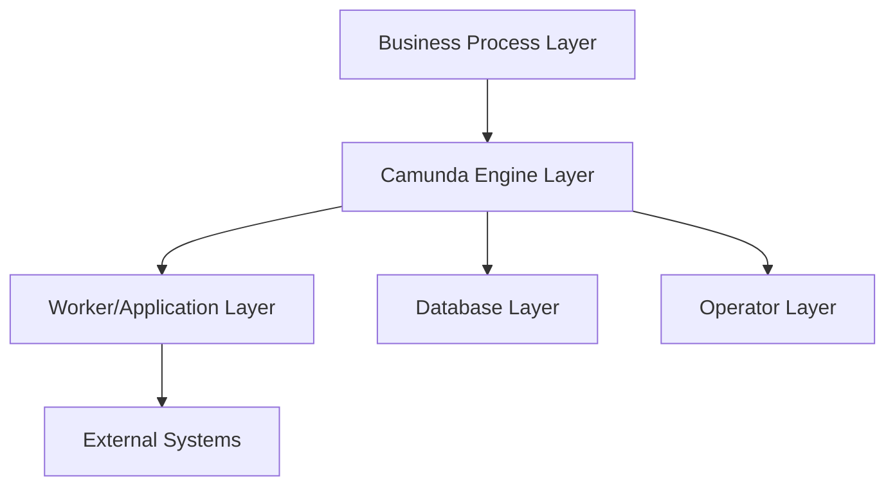
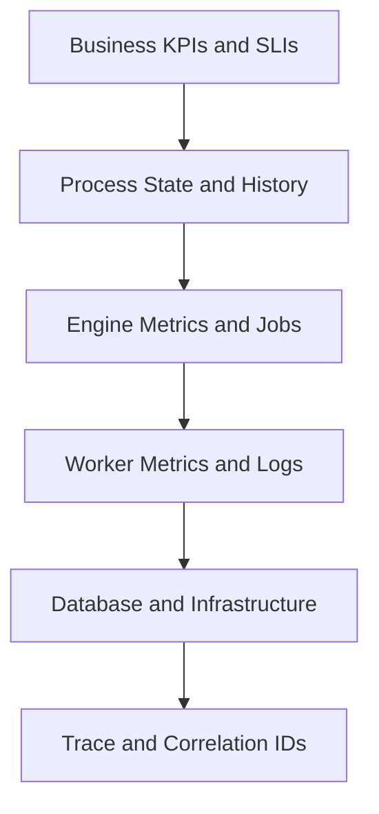
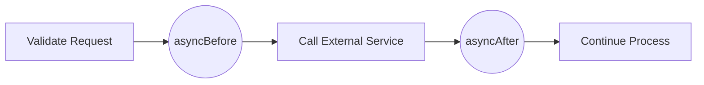

# Part 034 — Observability, Metrics, and Reliability Engineering

> Goal part ini: membangun kemampuan membaca Camunda 7 sebagai **production workflow platform**, bukan hanya aplikasi Java. Kita akan mendesain observability untuk engine, job executor, database, external workers, process KPIs, incidents, history cleanup, dan operator recovery. Targetnya: ketika workflow melambat, stuck, salah korelasi, retry terus, atau history DB membengkak, kita tahu sinyal mana yang harus dibaca dan tindakan mana yang aman.

Camunda 7 observability bukan hanya JVM metrics. Process engine memiliki lifecycle khusus: token bergerak, wait state disimpan, async continuation menjadi job, job executor mengakuisisi dan mengunci job, worker dapat fail/retry, incidents muncul saat retries habis, dan history cleanup bersaing memakai job executor resource.

Referensi resmi utama:

- Camunda 7.24 — Metrics: `https://docs.camunda.org/manual/7.24/user-guide/process-engine/metrics/`
- Camunda 7.24 — Job Executor: `https://docs.camunda.org/manual/7.24/user-guide/process-engine/the-job-executor/`
- Camunda 7.24 — Incidents: `https://docs.camunda.org/manual/7.24/user-guide/process-engine/incidents/`
- Camunda 7.24 — History Cleanup: `https://docs.camunda.org/manual/7.24/user-guide/process-engine/history/history-cleanup/`
- Camunda Blog — Monitoring Camunda Platform 7 with Prometheus: `https://camunda.com/blog/2022/10/monitoring-camunda-platform-7-with-prometheus/`

---

## 1. Mental Model: Observe Four Systems, Not One

Camunda production behavior adalah gabungan dari empat sistem:



| Layer | Yang diamati | Failure yang terlihat |
|---|---|---|
| Business process | cycle time, SLA breach, open tasks, case state | customer/regulatory outcome terlambat |
| Engine | jobs, incidents, process instances, variables, history | process stuck, retry loop, migration issue |
| Worker/application | delegate latency, external task completion, downstream failures | service task gagal, duplicate side effect |
| Database | query latency, locks, table growth, cleanup load | engine lambat, job acquisition lambat |
| External systems | HTTP/API availability, queues, event bus, document store | process menunggu event/response |
| Operator | retry, modification, suspension, manual recovery | recovery lambat atau tidak auditable |

Observability yang hanya melihat CPU/JVM heap tidak cukup. Workflow bisa gagal secara bisnis meskipun JVM sehat.

---

## 2. Camunda Built-In Metrics: Apa yang Diberikan Engine?

Camunda process engine reports runtime metrics to database tables `ACT_RU_METER_LOG` and `ACT_RU_TASK_METER_LOG`. Metrics can be queried through `ManagementService#createMetricsQuery()`, task worker counts can be queried via `ManagementService#getUniqueTaskWorkerCount`, and engine metrics are reported with reporter identifiers so load in a cluster can be attributed to individual engine instances. By default, built-in metrics are reported; metrics reporting can be disabled with configuration flags.

Camunda docs also state that the engine flushes collected metrics to runtime database tables at a default interval of 15 minutes, and the reporter id defaults to a value derived from local IP and engine name. This means built-in metrics are useful for usage/load trends, but they are not a substitute for low-latency alerting unless exported or supplemented.

### 2.1 Built-In Metrics Are Necessary but Not Sufficient

Built-in metrics can tell you about engine usage and load, such as activity/process/job-related counts. But production reliability needs additional signals:

- job backlog age;
- due timer delay;
- failed job count by process/activity;
- incident age and MTTR;
- external task lock expiration rate;
- worker completion latency;
- message correlation failures;
- variable serialization failures;
- database query latency;
- history cleanup progress;
- process-specific SLA breach;
- business-level throughput and abandonment.

Built-in metrics answer “how much happened?”. Reliability metrics answer “is the system healthy enough to meet user/business obligations?”.

---

## 3. Observability Pyramid for Camunda 7



### 3.1 Logs

Logs answer: “what happened around this command?”.

Important log fields:

- `correlationId`;
- `businessKey`;
- `processInstanceId`;
- `processDefinitionKey`;
- `activityId` / `taskDefinitionKey`;
- `jobId` / `externalTaskId`;
- `tenantId`;
- `workerId`;
- `topicName`;
- `commandType`;
- `retryCount`;
- `errorCode`;
- `durationMs`.

Do not log:

- secrets;
- full variable payload;
- PII;
- evidence content;
- raw tokens;
- complete serialized object graphs.

### 3.2 Metrics

Metrics answer: “how is the system behaving over time?”.

Metric categories:

| Category | Examples |
|---|---|
| Throughput | started process instances/min, completed tasks/min, completed external tasks/min |
| Backlog | due jobs waiting, external tasks open, active user tasks |
| Latency | service task duration, external worker duration, task age, process cycle time |
| Failure | incidents, failed jobs, BPMN errors, worker failures, correlation misses |
| Capacity | DB connections, job executor threads, worker concurrency, queue depth |
| Cleanup | history cleanup duration, deleted rows, cleanup retries |
| Business | SLA breach, approval aging, case aging, escalation count |

### 3.3 Traces

Distributed tracing is useful when process execution crosses services.

Trace propagation should cover:

- API request that starts process;
- delegate execution;
- external task worker handling;
- downstream HTTP calls;
- message/event publication;
- message correlation back to Camunda;
- audit event writes.

Camunda process instance id is not a trace id. Use both:

- trace id for request/service path;
- business key for business identity;
- process instance id for engine identity;
- event id for event idempotency.

### 3.4 Audit/Event Logs

Audit answers: “who did what and why?”.

It is different from logs. Logs are for debugging; audit is evidence.

Audit should be immutable or append-only, include actor/reason/policy version, and be retention-controlled.

---

## 4. What to Monitor in the Engine

### 4.1 Job Backlog

Async continuation, timers, retries, batches, and history cleanup all create jobs.

Key signals:

| Signal | Interpretation |
|---|---|
| due jobs count increasing | job executor cannot keep up |
| oldest due job age increasing | SLA/timer drift |
| failed jobs count increasing | downstream/code issue |
| retries approaching zero | incident soon |
| lock expiration frequent | executor/worker too slow or crashing |
| exclusive job queue long | process instance serialization bottleneck |
| timer jobs huge spike | model or campaign causing timer storm |

Useful query concept:

```java
long dueJobs = managementService.createJobQuery()
    .executable()
    .count();

long failedJobs = managementService.createJobQuery()
    .withException()
    .count();
```

For production dashboards, aggregate by:

- process definition key;
- activity id;
- job handler type;
- tenant;
- due date bucket;
- retries count.

### 4.2 Incident Count and Age

Incident count alone is not enough. Track age and process impact.

| Metric | Why it matters |
|---|---|
| open incidents | how many stuck units |
| oldest incident age | worst unresolved business delay |
| incidents by process key | hotspot process |
| incidents by activity id | faulty task/delegate/worker |
| incidents by tenant | blast radius |
| incidents created rate | new failure velocity |
| incident MTTA/MTTR | support effectiveness |

Alerting rule examples:

- Critical process has any incident older than 15 minutes.
- Incident creation rate > baseline for 10 minutes.
- Same activity creates > N incidents in 5 minutes.
- Oldest incident age exceeds business SLA threshold.

### 4.3 Process Instance Aging

Some workflows are long-running, but aging still matters.

Track:

- active instances by process key;
- active instances by current activity;
- oldest active instance per process;
- process duration p50/p95/p99;
- user task age;
- wait event age;
- escalation count;
- reopened cases.

Do not treat all long-running instances as unhealthy. Define expected duration by process and state.

Example:

| Activity | Expected age | Alert threshold |
|---|---:|---:|
| `WaitForPayment` | 1–7 days | 10 days |
| `RiskScoring` | < 2 min | 10 min |
| `ManualReview` | < 2 business days | 3 business days |
| `WaitForEvidence` | < 14 days | 21 days |

### 4.4 Message Correlation Failures

Message correlation is an integration boundary. Failures often indicate event ordering, wrong key, wrong tenant, duplicate event, or process already moved on.

Track:

- correlation attempts;
- successful correlations;
- no-match failures;
- multiple-match failures;
- duplicate event ignored;
- late event ignored;
- event inbox backlog;
- correlation latency from event creation to process continuation.

### 4.5 Variable Serialization Failures

Variable problems often appear after deployment:

- class moved/renamed;
- serialized Java object incompatible;
- JSON shape changed;
- payload too large;
- unknown enum;
- external worker writes unexpected type.

Track:

- variable serialization exceptions;
- incidents on activities that set/read variables;
- DB LOB/table growth;
- large variable count;
- REST variable deserialization failures.

---

## 5. What to Monitor in External Workers

External task workers are independent executors. Their health is not fully visible from JVM engine metrics.

### 5.1 Worker SLIs

| SLI | Meaning |
|---|---|
| fetch latency | time to receive work after available |
| lock-to-complete duration | worker processing time |
| completion success rate | worker correctness/availability |
| failure rate | downstream/code instability |
| BPMN error rate | expected business exception frequency |
| lock expiration rate | worker crashed or lock too short |
| retries remaining distribution | how close to incident |
| topic backlog | work waiting by topic |
| worker concurrency | processing capacity |
| downstream latency | dependency health |

### 5.2 Worker Logging Contract

Every worker log should include:

```json
{
  "businessKey": "CASE-2026-0001",
  "processInstanceId": "...",
  "externalTaskId": "...",
  "topicName": "risk-scoring-v1",
  "workerId": "risk-worker-a-3",
  "attempt": 2,
  "lockDurationMs": 30000,
  "durationMs": 842,
  "result": "completed"
}
```

For failure:

```json
{
  "businessKey": "CASE-2026-0001",
  "externalTaskId": "...",
  "topicName": "risk-scoring-v1",
  "errorType": "DOWNSTREAM_TIMEOUT",
  "retriesRemaining": 2,
  "retryTimeoutMs": 60000,
  "durationMs": 5000
}
```

Error message must be safe for operators to view. Do not put access token, full payload, or PII in `handleFailure` error details.

---

## 6. Database Observability

Camunda engine performance is deeply tied to DB performance.

Monitor:

| Area | Signals |
|---|---|
| Connection pool | active, idle, wait time, timeout count |
| Query latency | p95/p99 query time for runtime/history/job queries |
| Locks/deadlocks | DB lock wait, deadlock count |
| Table growth | `ACT_HI_*`, `ACT_RU_JOB`, `ACT_RU_VARIABLE`, `ACT_GE_BYTEARRAY` |
| Index health | slow queries, sequential scans, missing indexes |
| Transaction duration | long-running command, cleanup transaction timeout |
| Cleanup | cleanup job duration, rows deleted, retries |
| Backup/restore | backup duration, replication lag |

### 6.1 History Table Growth

History cleanup removes historical data based on TTL. Camunda docs describe removal-time-based cleanup as default and recommended in most scenarios because removal time exists in each history table, enabling simpler deletes. Cleanup is implemented via jobs and performed by the job executor, so it competes with other jobs. Cleanup window, batch size, and degree of parallelism affect load.

Operational implications:

- history cleanup is not free;
- cleanup can steal job executor threads and DB connections;
- too-large cleanup batch can cause transaction timeout;
- too-high cleanup parallelism can hurt production workload;
- no cleanup window means automatic cleanup may not run;
- TTL changes may not affect already-written removal times under removal-time strategy.

### 6.2 Monitor History Cleanup as a First-Class Workload

Metrics:

- cleanable history count;
- cleanup job success/failure;
- cleanup duration;
- rows deleted per run;
- cleanup retries;
- oldest removable data age;
- `ACT_HI_*` table size;
- cleanup window utilization;
- DB load during cleanup.

Alert examples:

- cleanup job failed and retries exhausted;
- history table growth above forecast;
- cleanup duration exceeds window;
- oldest removable data age > retention + grace period;
- cleanup uses too many DB connections during peak.

---

## 7. SLO Design for Workflow Platforms

SLOs must match workflow semantics. “API p99 latency” alone misses human tasks, timers, and long-running cases.

### 7.1 Candidate SLIs

| SLI | Example |
|---|---|
| Process start acceptance | 99.9% of start commands accepted within 1s |
| Task visibility | 99% of created user tasks visible in UI within 5s |
| Service task completion | 99% of automated tasks complete within 2 min |
| External task pickup | 95% of external tasks fetched within 30s |
| Incident recovery | 95% of critical incidents acknowledged within 15 min |
| Timer accuracy | 99% of due timers executed within 2 min of due date |
| Message continuation | 99% of valid inbound events correlated within 30s |
| History cleanup | removable history cleaned within 7 days of eligibility |
| Process cycle time | p95 case completion within business SLA |
| Operator mutation audit | 100% high-risk operations linked to ticket/reason |

### 7.2 Error Budget Thinking

For critical automated tasks:

- define allowed failure rate;
- define retry budget;
- define manual recovery threshold;
- define when to pause process starts;
- define when to disable worker or circuit-break downstream calls.

Example:

```text
SLO: 99% of RiskScoring external tasks complete successfully within 2 minutes.
Error budget events:
- task reaches incident
- task duration > 2 minutes
- worker lock expires twice
- downstream timeout consumes all retries
```

This lets reliability discussion move from “Camunda seems slow” to measurable failure budget.

---

## 8. Dashboard Design

A mature Camunda dashboard has layers.

### 8.1 Executive/Business Dashboard

Audience: product owner, operations manager, regulatory lead.

Signals:

- open cases by status;
- cases breaching SLA;
- average/p95 cycle time;
- workload by team;
- approvals pending;
- reopened cases;
- escalation count.

### 8.2 Workflow Operations Dashboard

Audience: support/operator.

Signals:

- open incidents by severity/process/activity;
- failed jobs by retries left;
- oldest due job;
- stuck process instances by activity;
- open external tasks by topic;
- oldest user task by group;
- message correlation failures;
- suspended definitions/instances.

### 8.3 Platform Engineering Dashboard

Audience: platform/SRE/backend engineer.

Signals:

- engine JVM CPU/heap/GC/thread pool;
- DB connection pool;
- job executor acquisition/execution;
- transaction duration;
- DB query latency;
- history table growth;
- cleanup job metrics;
- worker fleet health;
- deployment/migration batch status.

### 8.4 Security/Audit Dashboard

Audience: security/compliance.

Signals:

- admin logins;
- authorization changes;
- high-impact operations;
- failed login/auth events;
- process modification/restart/migration;
- variable correction;
- break-glass usage;
- direct DB access events if available;
- history cleanup runs.

---

## 9. Alert Design: Page Humans Only for Actionable Signals

Alerting should be tied to runbooks. Do not page on every warning log.

### 9.1 Good Alert Shape

An alert should include:

- process key/activity/topic;
- severity;
- current value;
- threshold;
- age;
- blast radius;
- likely cause;
- first diagnostic link/query;
- runbook link;
- safe action.

Example:

```text
ALERT: Critical Camunda incident age exceeded
Process: enforcement-case
Activity: ApplySanctionDecision
Oldest incident age: 42m
Open incidents: 7
Tenant: regulator-a
Likely causes: downstream sanction service timeout after retry exhaustion
Runbook: RB-CAM-INC-003
First action: check downstream health; do not retry until service recovered
```

### 9.2 Alert Matrix

| Alert | Severity | First action |
|---|---|---|
| Critical process incident > 15 min | page | inspect activity/downstream; stop blind retry |
| Due job age > threshold | page if SLA impacted | check job executor/DB/load |
| External task backlog growing | page/warn | scale workers/check downstream |
| Lock expiration spike | warn/page | inspect worker crashes/lock duration |
| History cleanup failed | warn | inspect cleanup job; schedule maintenance |
| History table growth abnormal | warn | check TTL/cleanup/window |
| Message correlation no-match spike | page if critical | check event schema/correlation key/order |
| Failed jobs retries <= 1 spike | warn/page | prevent incident storm |
| Task SLA breach | business alert | notify team/escalate |
| Admin high-risk operation | security event | verify ticket/approval |

### 9.3 Avoid Alert Anti-Patterns

- Alert on total active instances without context.
- Alert on any failed job before retry policy has chance to work.
- Alert on logs containing `Exception` without severity mapping.
- Alert on CPU alone without business impact.
- Alert without runbook.
- Alert on every process-specific SLA from platform team instead of routing to business owner.

---

## 10. Capacity Planning

Capacity planning starts from workload shape, not from CPU guesswork.

### 10.1 Workload Inputs

Collect:

- process starts per minute/hour/day;
- average activities per instance;
- async continuations per instance;
- timers per instance;
- external tasks per instance;
- user tasks per instance;
- variable count/size per instance;
- history level;
- retention TTL;
- expected incidents/failures;
- batch/migration frequency;
- cleanup window;
- worker latency distribution;
- downstream dependency latency.

### 10.2 Job Volume Estimate

Approximate:

```text
jobs_per_instance = async_continuations + timers + external_tasks + batch_related_jobs
jobs_per_day = process_starts_per_day * jobs_per_instance
required_job_throughput = jobs_per_day / available_processing_seconds
```

Then add peak factor:

```text
peak_job_throughput = required_job_throughput * peak_multiplier
```

If timers all become due at 09:00, average daily throughput is misleading. Use due-time distribution.

### 10.3 DB Growth Estimate

Approximate:

```text
runtime_size ≈ active_instances * avg_runtime_rows_per_instance
history_growth_per_day ≈ completed_instances_per_day * avg_history_rows_per_instance
history_retained ≈ history_growth_per_day * retention_days
bytearray_growth ≈ serialized_payloads_per_day * avg_payload_size * retention_days
```

Variables and history level dominate DB growth. Large serialized objects and file-like data in variables can make growth nonlinear.

### 10.4 Worker Capacity Estimate

For external workers:

```text
required_concurrency = arrival_rate_per_second * average_processing_time_seconds
```

Add safety margin and downstream limits.

Example:

```text
arrival_rate = 20 tasks/sec
avg_processing_time = 0.5 sec
required_concurrency = 10
with 2x margin = 20 workers/threads
```

But if downstream API allows only 5 concurrent calls, scaling workers to 20 causes failures. Capacity is end-to-end.

### 10.5 Job Executor Sizing

Consider:

- number of job executor threads;
- max jobs per acquisition;
- acquisition wait/backoff;
- DB connection pool;
- exclusive job serialization;
- async boundary placement;
- timer spikes;
- history cleanup jobs;
- batch operations;
- cluster node count.

More threads are not always better. Too many threads can increase DB contention, lock conflicts, downstream pressure, and retry storms.

---

## 11. Reliability Patterns

### 11.1 Async Boundary as Failure Isolation

Use async boundaries to create save points and job retries around unreliable operations.



Benefit:

- failure becomes failed job/incident;
- transaction before async boundary commits;
- retry can be configured;
- operator can inspect/retry;
- duplicate side effect must still be handled.

### 11.2 Idempotency Everywhere

Retries are only safe if side effects are idempotent.

Use:

- business key;
- command id;
- external request id;
- outbox event id;
- unique downstream idempotency key;
- duplicate detection in worker.

### 11.3 Backpressure

When downstream is degraded:

- reduce worker concurrency;
- increase retry timeout;
- circuit-break external calls;
- pause process starts if necessary;
- suspend specific process definitions only with governance;
- prevent retry storm.

### 11.4 Bulkhead by Topic/Process

Separate worker pools by criticality:

| Pool | Example | Reason |
|---|---|---|
| critical-decision | sanction decision, payment approval | protected capacity |
| low-priority-notification | email/SMS | can lag |
| cleanup/batch | history cleanup/migration | avoid competing with live processing |
| tenant-specific | high-value tenant | blast radius control |

### 11.5 Degrade Gracefully

Not all failures should block all processes.

Examples:

- notification failure should create retry/incident without rolling back approval;
- analytics event failure should use outbox and not block user task completion;
- document preview unavailable should not prevent evidence submission if original upload succeeded;
- non-critical enrichment can be skipped or manually reviewed.

---

## 12. Runbooks

### 12.1 Failed Job / Incident Runbook

1. Identify process key, activity id, business key, tenant.
2. Determine if failure is transient, data-related, code-related, or downstream-related.
3. Check if side effect may already have happened.
4. Check retries remaining and retry configuration.
5. Check downstream health.
6. If safe, retry one instance or small sample.
7. If systemic, stop blind retry and fix root cause.
8. If data repair needed, use controlled API/modification.
9. Record action, reason, before/after.
10. Add regression test or alert improvement.

### 12.2 Job Backlog Runbook

1. Check oldest due job age and count.
2. Separate timer jobs, async jobs, batch/cleanup jobs.
3. Check job executor nodes and acquisition logs.
4. Check DB connection pool and slow queries.
5. Check recent deployment/migration/timer storm.
6. Temporarily reduce cleanup/batch if competing.
7. Scale job executor carefully if DB has capacity.
8. Verify backlog drains and timer accuracy recovers.

### 12.3 External Task Backlog Runbook

1. Identify topic and tenant/process distribution.
2. Check worker fleet availability and errors.
3. Check downstream dependency latency/failure.
4. Check lock expiration rate.
5. Increase workers only if downstream can handle it.
6. Tune lock duration/retry timeout if needed.
7. For poison data, move to manual repair path.
8. Confirm completion rate exceeds arrival rate.

### 12.4 Message Correlation Failure Runbook

1. Inspect event id, business key, correlation key, tenant.
2. Check if process subscription exists.
3. Determine no-match vs multiple-match.
4. Check if event is duplicate/late/out-of-order.
5. Check process instance already completed/moved on.
6. If event should be replayed, use inbox replay with idempotency.
7. If model bug, create controlled migration/modification plan.

### 12.5 History Cleanup Runbook

1. Check cleanup window configured.
2. Check cleanup jobs exist and retries.
3. Check TTL on process/decision definitions.
4. Check table growth and DB load.
5. Reduce batch size if transaction timeout.
6. Limit parallelism if cleanup hurts live traffic.
7. Exclude nodes if needed in cluster.
8. Verify removable data age decreases.

---

## 13. Observability Implementation Patterns

### 13.1 Workflow Facade Metrics

Instrument business commands:

```java
public void approveCase(String caseId, String userId, ApprovalCommand command) {
    long start = System.nanoTime();
    try {
        approvalService.approve(caseId, userId, command);
        metrics.counter("workflow.command.success", tags("command", "approveCase")).increment();
    } catch (Exception e) {
        metrics.counter("workflow.command.failure", tags("command", "approveCase", "error", e.getClass().getSimpleName())).increment();
        throw e;
    } finally {
        metrics.timer("workflow.command.duration", tags("command", "approveCase"))
            .record(System.nanoTime() - start, TimeUnit.NANOSECONDS);
    }
}
```

Add tags carefully. Avoid high-cardinality labels like raw `businessKey` in metrics. Put those in logs/traces.

### 13.2 Delegate Metrics

For delegates:

```java
@Override
public void execute(DelegateExecution execution) {
    String activityId = execution.getCurrentActivityId();
    String processKey = execution.getProcessDefinitionId().split(":")[0];

    Timer.Sample sample = Timer.start(meterRegistry);
    try {
        service.call((String) execution.getVariable("caseId"));
        meterRegistry.counter("camunda.delegate.success",
            "process", processKey,
            "activity", activityId).increment();
    } catch (Exception ex) {
        meterRegistry.counter("camunda.delegate.failure",
            "process", processKey,
            "activity", activityId,
            "error", ex.getClass().getSimpleName()).increment();
        throw ex;
    } finally {
        sample.stop(meterRegistry.timer("camunda.delegate.duration",
            "process", processKey,
            "activity", activityId));
    }
}
```

### 13.3 External Worker Metrics

Track per topic:

- fetched;
- completed;
- failed;
- BPMN error;
- lock expired;
- duration;
- downstream error;
- retries remaining.

### 13.4 Query-Based Engine Probes

A scheduled probe can query engine health and publish metrics:

```java
@Component
public class CamundaEngineProbe {
    private final ManagementService managementService;
    private final RuntimeService runtimeService;

    @Scheduled(fixedDelayString = "PT30S")
    public void collect() {
        long executableJobs = managementService.createJobQuery().executable().count();
        long failedJobs = managementService.createJobQuery().withException().count();
        long activeInstances = runtimeService.createProcessInstanceQuery().active().count();

        gauge("camunda.jobs.executable", executableJobs);
        gauge("camunda.jobs.failed", failedJobs);
        gauge("camunda.process.instances.active", activeInstances);
    }
}
```

Caution:

- query probes add DB load;
- avoid expensive high-frequency history queries;
- aggregate in DB carefully;
- sample less frequently for expensive dimensions;
- use indexes and query plans.

---

## 14. Testing Observability

Observability must be tested. Otherwise dashboards fail exactly during incident.

Test cases:

| Scenario | Expected signal |
|---|---|
| delegate throws technical exception | failed job metric/log/incident after retries |
| external worker returns failure | failure counter and retries decrease |
| worker crashes after lock | lock expiration/backlog visible |
| message no match | correlation failure metric/log |
| history cleanup disabled | cleanup dashboard shows no automatic run |
| task SLA exceeded | business alert fires |
| variable serialization error | clear activity/process error signal |
| DB slow query | platform dashboard detects latency |
| operator retry | audit/security event emitted |

### 14.1 Chaos-Style Drills

Run controlled drills in staging:

- disable one worker topic;
- make downstream return 500;
- create timer spike;
- deploy process with bad delegate configuration;
- fill history tables in test environment;
- simulate DB connection pool exhaustion;
- force message duplicate and late event.

For each drill, ask:

- Did alert fire?
- Was it routed correctly?
- Did runbook help?
- Was data safe?
- Did recovery avoid duplicate side effect?
- Did we add regression test after?

---

## 15. Common Anti-Patterns

### 15.1 JVM-Only Monitoring

Symptom:

- CPU, heap, GC dashboards exist;
- no incident/job/task/process dashboards.

Fix:

- add engine, process, worker, DB, business KPIs.

### 15.2 No Business Key in Logs

Symptom:

- logs contain processInstanceId only;
- support team works with case/customer/order id;
- correlation takes too long.

Fix:

- include business key and correlation id in all workflow logs.

### 15.3 Alert on Failed Jobs Too Early

Failed jobs can be normal during retryable transient failures. Alert when:

- retries near exhaustion;
- incident created;
- failure rate exceeds baseline;
- critical activity affected;
- backlog/age violates SLO.

### 15.4 Blind Retry Storm

Symptom:

- operator retries hundreds of incidents while downstream remains down;
- duplicate side effects occur;
- DB and downstream overloaded.

Fix:

- check root cause first;
- retry sample;
- use backpressure;
- ensure idempotency;
- bulk retry only with approval.

### 15.5 Dashboard Without Runbook

A dashboard that shows red without a next action creates anxiety, not reliability.

Fix:

- each alert has owner and runbook;
- dashboard links to Cockpit/query/logs;
- runbooks include safe/unsafe actions.

### 15.6 Metrics with High Cardinality

Bad labels:

- `businessKey`;
- `processInstanceId`;
- `taskId`;
- raw user id;
- raw exception message;
- full tenant/customer id if huge cardinality.

Use these in logs/traces, not metrics labels.

### 15.7 History Cleanup Ignored Until DB Crisis

Symptom:

- history grows for months;
- cleanup window absent;
- TTL missing;
- DB suddenly slow.

Fix:

- set TTL from first production deployment;
- monitor history growth;
- test cleanup;
- forecast retention storage;
- run cleanup in low-load window.

---

## 16. Production Readiness Checklist

### 16.1 Metrics

- [ ] Built-in Camunda metrics understood and exported/queryable.
- [ ] Job backlog and oldest due job monitored.
- [ ] Failed jobs and incidents monitored by process/activity.
- [ ] External task backlog and completion monitored by topic.
- [ ] Message correlation failures monitored.
- [ ] History cleanup monitored.
- [ ] DB connection/query/table growth monitored.
- [ ] Business process SLIs defined.

### 16.2 Logs and Traces

- [ ] Logs include correlation id, business key, process instance id where relevant.
- [ ] Worker logs include topic, worker id, external task id.
- [ ] Sensitive data not logged.
- [ ] Distributed trace propagates across API/delegate/worker/downstream.
- [ ] Error logs classify transient vs permanent/business failure.

### 16.3 Alerts

- [ ] Alerts are tied to SLOs or actionable failure modes.
- [ ] Each alert has owner and runbook.
- [ ] Critical incidents page correct team.
- [ ] Business SLA alerts route to business operations.
- [ ] Cleanup/storage alerts route to platform/DB team.
- [ ] Security/admin operation alerts route to security/compliance as needed.

### 16.4 Reliability

- [ ] Async boundaries protect unreliable operations.
- [ ] Retry policies are explicit and safe.
- [ ] Side effects are idempotent.
- [ ] Worker concurrency matches downstream capacity.
- [ ] History cleanup does not starve live jobs.
- [ ] Batch/migration operations are scheduled and monitored.
- [ ] Capacity model exists for peak load and retention.

### 16.5 Operations

- [ ] Incident runbook exists.
- [ ] Job backlog runbook exists.
- [ ] External task backlog runbook exists.
- [ ] Message correlation runbook exists.
- [ ] History cleanup runbook exists.
- [ ] Operator actions are audited.
- [ ] Drills are performed in staging.

---

## 17. Deliberate Practice

### Exercise 1 — Build a Workflow Health Dashboard Spec

Choose one process and define dashboard panels:

- active instances by activity;
- open user tasks by age;
- incidents by activity;
- external task backlog by topic;
- message correlation failure count;
- process cycle time p50/p95;
- SLA breach count;
- oldest due job;
- history growth.

For each panel, define:

- source query/metric;
- refresh interval;
- owner;
- action if abnormal.

### Exercise 2 — Define SLOs

Define three SLOs:

1. one user-facing SLO;
2. one engine/worker SLO;
3. one operational recovery SLO.

Example:

```text
SLO: 99% of critical external tasks are completed or escalated within 5 minutes.
SLI: count of tasks completed/escalated within 5 minutes / total critical external tasks.
Error events: incident, lock expiration > 2, duration > 5 minutes.
Owner: Workflow Platform Team.
```

### Exercise 3 — Write an Incident Runbook

Pick one common failure:

- downstream API timeout;
- invalid variable serialization;
- message no-match;
- history cleanup failure;
- timer storm.

Write:

- detection signal;
- triage steps;
- safe actions;
- unsafe actions;
- rollback/compensation;
- postmortem checklist.

### Exercise 4 — Capacity Estimate

Given:

- 100,000 process starts/day;
- 5 async jobs/process;
- 2 timers/process;
- 3 external tasks/process;
- average external task duration 400ms;
- peak multiplier 4x;
- history retention 365 days.

Estimate:

- jobs/day;
- average jobs/sec;
- peak jobs/sec;
- worker concurrency;
- history growth questions you must answer before production.

---

## 18. Summary

Camunda 7 observability must cover the whole workflow system: business process health, engine state, job executor behavior, worker health, database performance, history cleanup, and operator actions. Built-in metrics are useful but insufficient alone. The production-grade approach defines SLIs/SLOs, dashboards, alerts, runbooks, capacity models, and drills.

Core invariant:

> A workflow platform is healthy only when business obligations, engine execution, worker processing, data retention, and recovery operations are all observable and actionable.

The next part is the final capstone. It will combine BPMN, DMN, Java delegates, external tasks, user tasks, SLA, incidents, security, and observability into one production-grade Camunda 7 system design.
