# Part 035 — Capstone: Production-Grade Camunda 7 Workflow System

> Goal part ini: mengikat seluruh seri menjadi satu rancangan end-to-end yang bisa dipakai sebagai **engineering blueprint**. Kita akan mendesain sistem Camunda 7 production-grade untuk kasus regulatory enforcement lifecycle: BPMN, DMN, Java/Spring, external tasks, human workflow, SLA, incident recovery, observability, security, audit, testing, deployment, dan migration readiness.

Capstone ini bukan tutorial “deploy process pertama”. Fokusnya adalah keputusan arsitektural dan operasional: kapan state disimpan, siapa pemilik data, bagaimana korelasi event aman, bagaimana failure direcover, bagaimana audit bisa dipertahankan, dan bagaimana sistem tetap bisa dimigrasikan ketika Camunda 7 tidak lagi menjadi target jangka panjang.

Referensi resmi utama:

- Camunda 7.24 — Process Engine Concepts: `https://docs.camunda.org/manual/7.24/user-guide/process-engine/process-engine-concepts/`
- Camunda 7.24 — Transactions in Processes: `https://docs.camunda.org/manual/7.24/user-guide/process-engine/transactions-in-processes/`
- Camunda 7.24 — BPMN 2.0 Reference: `https://docs.camunda.org/manual/7.24/reference/bpmn20/`
- Camunda 7.24 — DMN Engine: `https://docs.camunda.org/manual/7.24/user-guide/dmn-engine/`
- Camunda 7.24 — External Tasks: `https://docs.camunda.org/manual/7.24/user-guide/process-engine/external-tasks/`
- Camunda 7.24 — Incidents: `https://docs.camunda.org/manual/7.24/user-guide/process-engine/incidents/`
- Camunda 7.24 — History and History Cleanup: `https://docs.camunda.org/manual/7.24/user-guide/process-engine/history/`
- Camunda 7.24 — Authorization Service: `https://docs.camunda.org/manual/7.24/user-guide/process-engine/authorization-service/`
- Camunda 7.24 — Metrics: `https://docs.camunda.org/manual/7.24/user-guide/process-engine/metrics/`
- Camunda 7 to 8 Migration Tooling: `https://docs.camunda.io/docs/8.7/guides/migrating-from-camunda-7/migration-tooling/`

---

## 1. Capstone Scenario: Regulatory Enforcement Case Lifecycle

Kita akan mendesain workflow bernama **Regulatory Enforcement Case Lifecycle**.

Domain ringkas:

1. Laporan pelanggaran masuk dari kanal eksternal.
2. Sistem melakukan triage awal.
3. Case dibuat dan diklasifikasikan berdasarkan risiko.
4. Investigator mengumpulkan evidence.
5. Supervisor melakukan review.
6. Jika case serius, legal reviewer masuk.
7. Jika enforcement layak, sistem membuat notice dan menunggu response pihak terkait.
8. Response dianalisis.
9. Keputusan enforcement dibuat.
10. Case ditutup, diekskalasi, atau direopen.

Non-functional constraints:

| Constraint | Implikasi desain |
|---|---|
| Long-running | Process bisa berjalan hari sampai bulan; semua external wait harus durable. |
| Human-heavy | User task harus punya assignment, SLA, audit, dan authorization. |
| Regulatory defensibility | Keputusan, evidence, override, dan manual repair harus traceable. |
| Integration-heavy | Event eksternal harus idempotent dan correlated secara eksplisit. |
| Sensitive data | Variable minimization dan data masking wajib. |
| Operational recovery | Incident harus bisa ditriage tanpa direct DB mutation. |
| Migration-aware | BPMN, DMN, worker contract, dan API boundary harus tidak mengunci sistem terlalu dalam ke Camunda 7. |

---

## 2. Skill Integration Map

Capstone ini menggabungkan sub-skill dari seluruh seri.

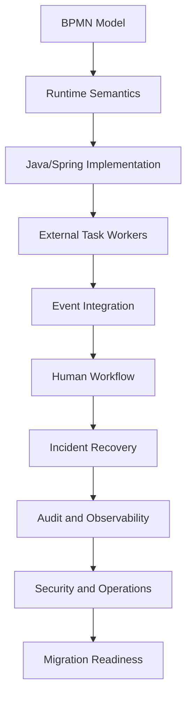

Kriteria “top-tier” bukan banyaknya elemen BPMN yang dipakai. Kriterianya adalah apakah setiap elemen punya alasan runtime yang jelas.

Contoh:

| Elemen | Alasan yang valid | Alasan yang lemah |
|---|---|---|
| `asyncBefore` | Membuat transaction boundary sebelum side effect remote. | “Supaya aman aja.” |
| Message catch | Menunggu event targeted dari case tertentu. | “Karena kelihatannya event-driven.” |
| Signal | Broadcast event global yang memang boleh diterima banyak instance. | Mengirim response untuk satu case. |
| BPMN error | Business alternative yang diketahui dan dimodelkan. | Semua Java exception. |
| Incident | Technical stuck-state yang perlu recovery operator. | Skenario bisnis normal. |
| DMN | Decision table versioned dan auditable. | Menghindari menulis gateway. |

---

## 3. Target Architecture

Kita pilih architecture style berikut:

- Spring Boot application dengan embedded Camunda 7 engine.
- Dedicated workflow-service sebagai owner process lifecycle.
- Domain services tetap punya database dan model sendiri.
- External task workers untuk integration yang lambat/remote/berisiko.
- REST/API facade di depan engine API.
- Event inbox untuk inbound event correlation.
- Outbox untuk outbound side effects.
- Audit projection terpisah untuk business timeline.
- Direct query ke Camunda DB dilarang untuk business read model.

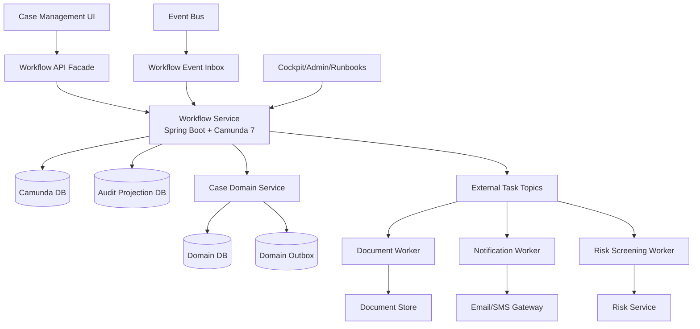

### 3.1 Why This Architecture Is Defensible

| Choice | Why |
|---|---|
| Dedicated workflow-service | Process ownership jelas; engine tidak tersebar di semua microservice. |
| API facade | UI dan service lain tidak bergantung langsung pada Camunda API. |
| External task workers | Remote side effect tidak mengunci engine transaction. |
| Inbox/outbox | Idempotency, replay, dan audit lebih mudah. |
| Audit projection | Business timeline tidak bergantung pada struktur internal Camunda history. |
| Thin delegates | BPMN orchestration tidak berubah menjadi domain monolith. |

### 3.2 What We Deliberately Avoid

| Anti-pattern | Kenapa dihindari |
|---|---|
| UI langsung call Camunda REST | Authorization, variable leakage, dan process coupling buruk. |
| Semua service task sebagai synchronous JavaDelegate | Remote failure bisa rollback transaction engine dan menciptakan duplicate side effect. |
| Semua data case disimpan sebagai process variable | Variable bloat, serialization risk, PII leakage, dan migration sulit. |
| Signal untuk response case tertentu | Signal broadcast; targeted event harus message correlation. |
| Direct update ke `ACT_*` tables | Merusak invariant engine dan audit. |

---

## 4. Process Boundary: What Belongs in Camunda?

Pertanyaan utama: apa yang menjadi process state, apa yang menjadi domain state?

### 4.1 Camunda Owns Orchestration State

Camunda cocok menyimpan:

- process instance id;
- business key;
- current workflow position;
- pending wait state;
- job/timer state;
- task assignment;
- minimal routing variables;
- external task state;
- incident state;
- history of process execution.

### 4.2 Domain Service Owns Business Entity State

Domain service cocok menyimpan:

- case profile;
- complainant/respondent data;
- evidence metadata;
- regulatory classification;
- legal basis;
- enforcement decision record;
- final disposition;
- confidential attachments;
- immutable business audit timeline.

### 4.3 Boundary Rule

> Camunda tells us **where the work is in the process**. Domain services tell us **what the business entity means**.

Jika process variable mulai berisi object besar seperti `FullCaseDossier`, `RespondentProfile`, `EvidenceBundle`, atau `LegalOpinion`, desain sudah bergeser ke arah salah.

Gunakan variable seperti:

```json
{
  "caseId": "CASE-2026-000123",
  "riskBand": "HIGH",
  "caseType": "MARKET_ABUSE",
  "requiresLegalReview": true,
  "slaTier": "P1",
  "respondentResponseDeadline": "2026-07-12"
}
```

Jangan gunakan variable seperti:

```json
{
  "case": {
    "allEvidence": [],
    "allParties": [],
    "allDocuments": [],
    "allNotes": [],
    "fullLegalOpinion": "..."
  }
}
```

---

## 5. BPMN Model: High-Level Lifecycle

Model utama sengaja dibuat sebagai **case shell process**. Detail teknis dipecah ke subprocess/call activity/DMN/worker.

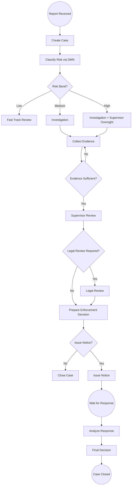

### 5.1 BPMN Runtime Design

| Activity | Implementation style | Transaction boundary |
|---|---|---|
| Create Case | JavaDelegate calling local/domain service | synchronous if local and idempotent |
| Classify Risk | Business Rule Task / DMN | same transaction acceptable |
| Risk Screening | External Task | async wait state |
| Human Investigation | User Task | natural wait state |
| SLA Escalation | Boundary Timer | durable timer job |
| Issue Notice | External Task or outbox delegate | asyncBefore recommended |
| Wait for Response | Message Catch Event | durable message subscription |
| Analyze Response | Service Task + DMN | depends on remote calls |
| Final Decision | User Task + DMN guidance | human wait state |
| Close Case | Delegate + domain event | asyncBefore if side effect external |

### 5.2 One BPMN Rule

Keep the top-level model readable enough that an operator can answer:

1. where is the case stuck;
2. who owns the next action;
3. what event is being waited for;
4. whether delay is expected or exceptional;
5. what safe recovery action exists.

Jika operator tidak bisa membaca model saat incident, model terlalu clever.

---

## 6. BPMN Implementation Skeleton

Berikut skeleton konseptual BPMN. Ini bukan file lengkap untuk copy-paste production, tetapi menunjukkan elemen yang relevan.

```xml
<bpmn:process id="regulatory_enforcement_case" name="Regulatory Enforcement Case" isExecutable="true">

  <bpmn:startEvent id="Start_ReportReceived" name="Report Received" />

  <bpmn:serviceTask id="Task_CreateCase" name="Create Case"
      camunda:delegateExpression="${createCaseDelegate}" />

  <bpmn:businessRuleTask id="Task_ClassifyRisk" name="Classify Risk"
      camunda:decisionRef="case_risk_classification"
      camunda:resultVariable="riskDecision" />

  <bpmn:exclusiveGateway id="Gateway_RiskBand" name="Risk Band?" />

  <bpmn:userTask id="Task_Investigate" name="Investigate Case"
      camunda:candidateGroups="investigator" />

  <bpmn:boundaryEvent id="Timer_InvestigationSla" attachedToRef="Task_Investigate" cancelActivity="false">
    <bpmn:timerEventDefinition>
      <bpmn:timeDuration>PT48H</bpmn:timeDuration>
    </bpmn:timerEventDefinition>
  </bpmn:boundaryEvent>

  <bpmn:userTask id="Task_SupervisorReview" name="Supervisor Review"
      camunda:candidateGroups="supervisor" />

  <bpmn:serviceTask id="Task_IssueNotice" name="Issue Notice"
      camunda:type="external"
      camunda:topic="issue-notice" />

  <bpmn:intermediateCatchEvent id="Catch_ResponseReceived" name="Response Received">
    <bpmn:messageEventDefinition messageRef="Message_ResponseReceived" />
  </bpmn:intermediateCatchEvent>

  <bpmn:userTask id="Task_FinalDecision" name="Final Decision"
      camunda:candidateGroups="decision-maker" />

  <bpmn:endEvent id="End_CaseClosed" name="Case Closed" />

</bpmn:process>
```

Important notes:

- `businessKey` harus diisi dengan `caseId` saat start process.
- Message response harus dikorelasikan dengan `caseId`, bukan payload fuzzy.
- `Task_IssueNotice` dipilih sebagai external task karena side effect ke document/email gateway bisa lambat dan perlu retry/lock control.
- Boundary timer investigation SLA dibuat non-interrupting agar task tetap berjalan, tetapi escalation event bisa dibuat.

---

## 7. DMN Design: Risk Classification and Routing

DMN dipakai untuk keputusan yang:

- eksplisit;
- versioned;
- bisa diuji;
- perlu audit;
- berubah lebih sering daripada flow utama.

### 7.1 Decision: `case_risk_classification`

Input:

| Input | Type | Source |
|---|---|---|
| `caseType` | string | report intake |
| `entityRiskScore` | number | risk service |
| `priorViolations` | number | domain service |
| `publicImpact` | string | triage assessment |
| `crossEntityImpact` | boolean | domain analysis |

Output:

| Output | Type | Meaning |
|---|---|---|
| `riskBand` | string | LOW, MEDIUM, HIGH, CRITICAL |
| `requiresSupervisor` | boolean | supervisor review mandatory |
| `requiresLegalReview` | boolean | legal review mandatory |
| `slaTier` | string | P1, P2, P3 |

### 7.2 Example Decision Table

| caseType | entityRiskScore | priorViolations | publicImpact | crossEntityImpact | riskBand | requiresSupervisor | requiresLegalReview | slaTier |
|---|---:|---:|---|---|---|---|---|---|
| MARKET_ABUSE | >= 80 | - | HIGH | - | CRITICAL | true | true | P1 |
| DATA_BREACH | >= 70 | >= 1 | MEDIUM | true | HIGH | true | true | P1 |
| LICENSING | < 40 | 0 | LOW | false | LOW | false | false | P3 |
| - | >= 60 | >= 2 | - | - | HIGH | true | true | P2 |
| - | - | - | - | - | MEDIUM | true | false | P2 |

### 7.3 DMN Contract Rules

| Rule | Reason |
|---|---|
| Jangan return object besar dari DMN. | Decision output harus stable dan minimal. |
| Simpan decision version dalam audit projection. | Defensibility butuh tahu rule version saat keputusan dibuat. |
| Jangan buat DMN memanggil service eksternal. | DMN harus deterministic dan testable. |
| Jangan ubah hit policy tanpa migration analysis. | Output shape dan semantics berubah. |
| DMN bukan workflow. | Sequence, wait, retry, dan human task tetap BPMN/domain. |

---

## 8. API Facade Design

External systems tidak boleh langsung memanggil engine API kecuali memang sistem tersebut adalah trusted operator/internal integration.

### 8.1 Public Workflow Commands

```http
POST /cases/intake
POST /cases/{caseId}/evidence
POST /cases/{caseId}/respondent-response
POST /cases/{caseId}/manual-escalation
POST /cases/{caseId}/reopen
GET  /cases/{caseId}/workflow-state
GET  /cases/{caseId}/timeline
```

### 8.2 Start Process Command

```java
@RestController
@RequestMapping("/cases")
class CaseIntakeController {

    private final CaseWorkflowApplicationService workflow;

    @PostMapping("/intake")
    CaseIntakeResponse intake(@RequestBody CaseIntakeRequest request) {
        return workflow.startCase(request);
    }
}
```

```java
@Service
class CaseWorkflowApplicationService {

    private final RuntimeService runtimeService;
    private final CaseDomainClient caseDomainClient;

    @Transactional
    public CaseIntakeResponse startCase(CaseIntakeRequest request) {
        CaseId caseId = caseDomainClient.createCase(request);

        Map<String, Object> variables = Map.of(
            "caseId", caseId.value(),
            "caseType", request.caseType(),
            "intakeChannel", request.channel(),
            "schemaVersion", 1
        );

        ProcessInstance instance = runtimeService.startProcessInstanceByKey(
            "regulatory_enforcement_case",
            caseId.value(),
            variables
        );

        return new CaseIntakeResponse(caseId.value(), instance.getProcessInstanceId());
    }
}
```

### 8.3 Why This Is Better Than Direct Engine Exposure

The facade can enforce:

- request validation;
- authorization;
- idempotency key;
- variable minimization;
- business key convention;
- audit write;
- error mapping;
- API compatibility if engine is replaced later.

---

## 9. Message Correlation Design

Inbound external event: respondent submits response.

### 9.1 Event Contract

```json
{
  "eventId": "evt-2026-000991",
  "eventType": "RESPONDENT_RESPONSE_RECEIVED",
  "caseId": "CASE-2026-000123",
  "responseId": "RESP-00991",
  "receivedAt": "2026-07-01T09:31:00+07:00",
  "schemaVersion": 1
}
```

### 9.2 Inbox First, Then Correlate

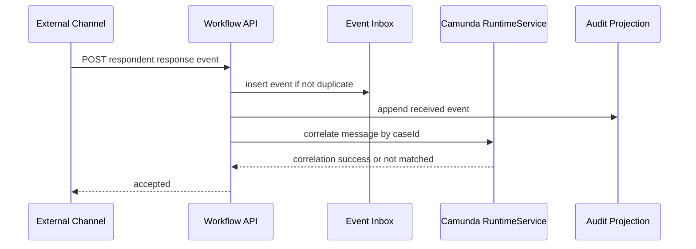

### 9.3 Correlation Code

```java
@Service
class RespondentResponseHandler {

    private final RuntimeService runtimeService;
    private final WorkflowEventInbox inbox;
    private final AuditTimeline auditTimeline;

    @Transactional
    public void handle(RespondentResponseReceived event) {
        if (!inbox.recordIfNew(event.eventId(), event.caseId())) {
            return;
        }

        auditTimeline.append(event.caseId(), "RESPONDENT_RESPONSE_RECEIVED", event.eventId());

        runtimeService.createMessageCorrelation("Message_ResponseReceived")
            .processInstanceBusinessKey(event.caseId())
            .setVariable("responseId", event.responseId())
            .setVariable("responseReceivedAt", event.receivedAt().toString())
            .correlateWithResult();
    }
}
```

### 9.4 Edge Cases

| Edge case | Handling |
|---|---|
| Duplicate event | Inbox uniqueness by `eventId`. |
| Response before process waits | Store in inbox; scheduled reconciliation or explicit state check. |
| Response after case closed | Record event; domain decides whether reopen is allowed. |
| Multiple active subscriptions by same business key | Model bug or correlation ambiguity; fail fast. |
| No matching execution | Return accepted but create operational task/event for reconciliation. |

---

## 10. External Task Worker Design

Use external task for `issue-notice` because it involves document generation, persistence, and notification gateway.

### 10.1 Topic Contract

Topic: `issue-notice`

Input variables:

| Variable | Required | Meaning |
|---|---|---|
| `caseId` | yes | business identity |
| `noticeTemplate` | yes | template key |
| `recipientPartyId` | yes | recipient reference |
| `noticeDeadline` | yes | response deadline |
| `schemaVersion` | yes | contract version |

Output variables:

| Variable | Meaning |
|---|---|
| `noticeId` | created notice identifier |
| `noticeIssuedAt` | timestamp |
| `responseDeadline` | final response deadline |

Failure modes:

| Failure | Worker behavior |
|---|---|
| Document template missing | `handleBpmnError` if business-known. |
| Email gateway timeout | `handleFailure` with retries. |
| Recipient invalid | BPMN error if validation outcome. |
| Document service 500 | technical failure retry. |
| Duplicate completion after network timeout | idempotency by `caseId + taskDefinitionKey`. |

### 10.2 Worker Pseudocode

```java
@Component
class IssueNoticeWorker {

    private final ExternalTaskService externalTaskService;
    private final NoticeService noticeService;

    public void execute(ExternalTask task) {
        String caseId = task.getVariable("caseId");
        String template = task.getVariable("noticeTemplate");

        try {
            NoticeResult result = noticeService.issueNotice(
                new IssueNoticeCommand(
                    caseId,
                    template,
                    task.getId()
                )
            );

            externalTaskService.complete(
                task,
                Map.of(
                    "noticeId", result.noticeId(),
                    "noticeIssuedAt", result.issuedAt().toString(),
                    "responseDeadline", result.responseDeadline().toString()
                )
            );
        } catch (InvalidRecipientException ex) {
            externalTaskService.handleBpmnError(
                task,
                "INVALID_NOTICE_RECIPIENT",
                ex.getMessage()
            );
        } catch (Exception ex) {
            externalTaskService.handleFailure(
                task,
                ex.getMessage(),
                stacktrace(ex),
                Math.max(task.getRetries() - 1, 0),
                Duration.ofMinutes(10).toMillis()
            );
        }
    }
}
```

### 10.3 Lock Duration Rule

Lock duration must be longer than expected normal execution but shorter than acceptable recovery delay if worker crashes.

| Worker type | Suggested lock thinking |
|---|---|
| Fast API call | seconds to low minutes |
| Document generation | minutes, with heartbeat/extension if needed |
| Batch-heavy processing | split into smaller tasks if possible |
| Human or manual work | do not use external task as human task |

---

## 11. Human Workflow Design

Human workflow is not just `userTask`. It is a combination of ownership, candidate groups, form contract, SLA, escalation, authorization, and audit.

### 11.1 Task Types

| Task | Candidate group | Key SLA | Audit requirement |
|---|---|---|---|
| Investigate Case | investigator | 48h for P1, 5d for P2 | evidence actions, notes, assignments |
| Supervisor Review | supervisor | 24h for P1 | approval/rejection reason |
| Legal Review | legal-reviewer | 72h | legal basis, opinion summary |
| Final Decision | decision-maker | 24h after response analysis | decision rationale, override if any |

### 11.2 Assignment Rules

Do not encode complex assignment in BPMN expressions if it depends on business policy. Use a domain assignment service or DMN.

Bad:

```xml
camunda:assignee="${caseType == 'X' ? 'alice' : 'bob'}"
```

Better:

```xml
camunda:candidateGroups="${assignmentDecision.candidateGroup}"
```

Or compute assignment before task creation through a controlled delegate/listener that writes minimal variables.

### 11.3 SLA Escalation Pattern

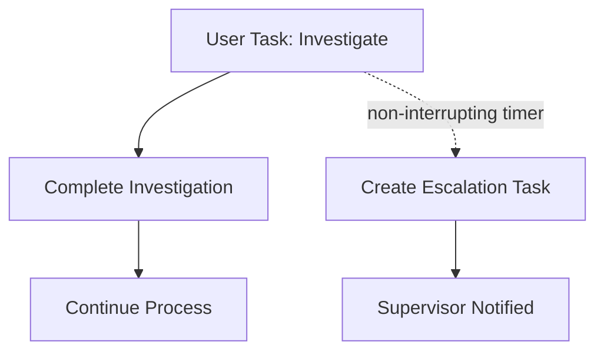

Rules:

- Use non-interrupting timer if the original user can still finish.
- Use interrupting timer if the work must be reassigned or canceled.
- Record escalation reason and timestamp in audit projection.
- Do not create unlimited repeating timers without cleanup/guardrails.

---

## 12. Error, Retry, and Incident Model

Production-grade Camunda design needs a taxonomy.

### 12.1 Failure Taxonomy

| Failure type | Example | BPMN representation | Recovery owner |
|---|---|---|---|
| Business alternative | invalid recipient, case not admissible | BPMN error / gateway path | business user/domain |
| Temporary technical failure | HTTP 503, timeout | failed job/external task retry | system/operator |
| Permanent technical failure | bad template config | incident + operator action | platform/app team |
| Late external event | response after closure | domain rule / reopen process | business owner |
| Duplicate command | repeated intake request | idempotency guard | application service |
| Model defect | no matching gateway branch | incident + hotfix/migration | workflow team |

### 12.2 Retry Budget

A retry budget must encode business tolerance.

| Operation | Retry strategy |
|---|---|
| Risk service call | short retries; fallback manual triage if unavailable. |
| Document generation | moderate retry; incident if template/service issue. |
| Email notification | retry with backoff; manual resend task after exhaustion. |
| Message correlation | no blind retry if no subscription; reconcile with inbox. |
| Domain state update | idempotent command; retry only if safe. |

### 12.3 Incident Runbook Template

For every incident category, define:

```yaml
incidentType: failedJob
processDefinitionKey: regulatory_enforcement_case
activityId: Task_IssueNotice
symptom: Job retries exhausted while issuing notice
firstChecks:
  - Check external document service status
  - Check notice template version
  - Check caseId and recipientPartyId variables
safeActions:
  - Fix template configuration
  - Retry failed job from Cockpit
  - If recipient invalid, move to manual correction path through process modification only with approval
unsafeActions:
  - Do not update ACT_RU_JOB directly
  - Do not delete incident row manually
  - Do not complete process instance without audit record
owner: workflow-platform-team
businessOwner: enforcement-operations
```

---

## 13. Transaction Boundary Design

### 13.1 Boundary Principles

| Situation | Boundary decision |
|---|---|
| Pure variable computation | synchronous is fine. |
| DMN classification | synchronous is fine if deterministic. |
| Local DB update in same Spring transaction | possible, but use carefully. |
| Remote HTTP call | prefer async boundary or external task. |
| Side effect that cannot be rolled back | asyncBefore + idempotency/outbox. |
| Parallel branches updating same variable | avoid or isolate local variables. |
| Long processing | external task or split process. |

### 13.2 Example Critical Boundary

Before issuing notice:

```xml
<bpmn:serviceTask id="Task_IssueNotice"
    name="Issue Notice"
    camunda:type="external"
    camunda:topic="issue-notice"
    camunda:asyncBefore="true" />
```

Why:

- process state is committed before remote side effect;
- retry can be controlled by job/external task semantics;
- worker crash does not lose process state;
- incident is visible operationally.

### 13.3 Common Boundary Mistake

Bad:

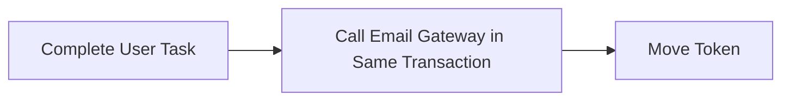

If email is sent but transaction rolls back, retry may send duplicate email. If transaction commits but email fails after partial side effect, state becomes ambiguous.

Better:

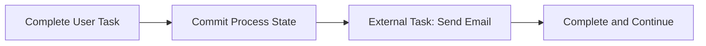

---

## 14. Data Contract and Variable Strategy

### 14.1 Variable Inventory

| Variable | Type | Scope | Mutable | Sensitive | Notes |
|---|---|---|---|---|---|
| `caseId` | string | process | no | low | business key mirror |
| `caseType` | string | process | no-ish | low | routing |
| `riskBand` | string | process | yes | low | DMN output |
| `slaTier` | string | process | yes | low | DMN output |
| `requiresLegalReview` | boolean | process | yes | low | routing |
| `responseId` | string | process | yes | medium | reference only |
| `noticeId` | string | process | yes | medium | reference only |
| `evidenceSummary` | string | avoid | yes | high | store in domain/audit, not variable |
| `legalOpinionText` | string | avoid | yes | high | store outside Camunda variable |

### 14.2 Serialization Rules

- Prefer primitive/string variables for routing.
- Prefer reference IDs over large objects.
- Avoid Java serialized object variables for long-running processes.
- Use JSON only for stable small contracts.
- Include schema version when payload shape matters.
- Do not store secrets, tokens, raw documents, or full confidential notes in variables.

### 14.3 Variable Update Discipline

Every variable must answer:

1. Who writes it?
2. Who reads it?
3. Is it used for routing?
4. Is it persisted in history?
5. Is it safe to expose in Cockpit/REST?
6. What happens if its schema changes?
7. Can it be recomputed from domain source of truth?

If the team cannot answer, the variable probably should not exist.

---

## 15. Audit and Regulatory Defensibility

Camunda history is useful, but it is not automatically a business audit ledger.

### 15.1 Two-Layer Audit

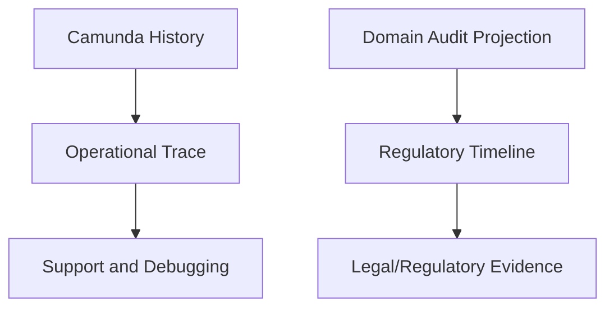

Camunda history answers:

- which activity ran;
- when task was created/completed;
- which variables changed;
- which job/incident happened.

Business audit answers:

- who made a decision;
- what evidence was considered;
- what rule version applied;
- what override was used;
- what legal basis existed;
- whether segregation of duties was preserved.

### 15.2 Timeline Event Shape

```json
{
  "timelineEventId": "tl-2026-000882",
  "caseId": "CASE-2026-000123",
  "eventType": "SUPERVISOR_REVIEW_COMPLETED",
  "actorId": "user-811",
  "actorRole": "SUPERVISOR",
  "occurredAt": "2026-07-03T15:20:00+07:00",
  "source": "CAMUNDA_TASK_COMPLETE",
  "processInstanceId": "...",
  "taskDefinitionKey": "Task_SupervisorReview",
  "decisionVersion": "case_review_policy:2026.07",
  "reasonCode": "SUFFICIENT_EVIDENCE",
  "summary": "Supervisor approved escalation to legal review."
}
```

### 15.3 Audit Invariant

> A process instance may be modified for recovery, but the recovery itself must be more auditable than the original failure.

That means process modification requires:

- reason;
- actor;
- approval if sensitive;
- before/after state;
- impacted case id;
- link to incident;
- rollback or correction plan.

---

## 16. Security Model

### 16.1 Layers

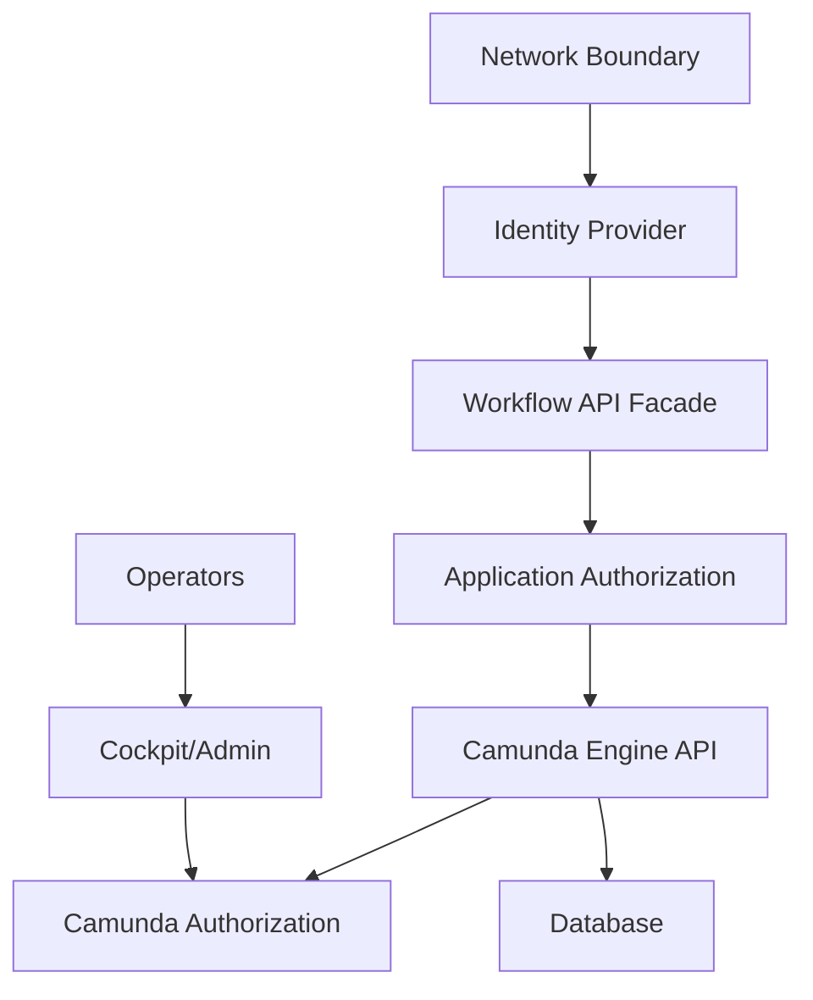

### 16.2 Access Rules

| Actor | Access |
|---|---|
| Case officer | case UI actions only; no direct engine API. |
| Investigator | assigned/candidate investigation tasks. |
| Supervisor | review/escalation tasks and limited case visibility. |
| Legal reviewer | legal tasks and restricted evidence. |
| Workflow operator | Cockpit incident retry/inspect, no domain data mutation. |
| Platform admin | configuration/admin, break-glass only. |
| External worker | only topic-specific worker credential. |

### 16.3 Sensitive Data Rules

- Do not expose raw Camunda variables through general API.
- Do not store access tokens as variables.
- Do not store document content as variables.
- Mask variables in operator UI if needed through custom tooling/facade.
- Use retention/TTL based on legal basis.
- Separate domain authorization from engine authorization.

---

## 17. Observability and SLOs

### 17.1 Golden Signals

| Signal | Why it matters |
|---|---|
| Open incidents by age | Detect stuck workflow. |
| Failed job count by activity | Identify broken model/delegate/downstream. |
| Job acquisition latency | Detect engine/database pressure. |
| External task backlog by topic | Detect worker capacity issue. |
| User task age by SLA tier | Detect operational bottleneck. |
| Message correlation failure rate | Detect integration contract issue. |
| History cleanup lag | Detect future database growth risk. |
| Process cycle time by case type | Detect business process health. |

### 17.2 Example SLOs

| SLO | Target |
|---|---|
| P1 case intake to triage task created | 99% under 2 minutes |
| External task `issue-notice` completion | 99% under 10 minutes excluding downstream outage |
| Critical incident acknowledgement | 95% under 15 minutes |
| User task SLA breach detection | 99% within 5 minutes |
| Message correlation reconciliation | 99% within 10 minutes |

### 17.3 Dashboard Layout

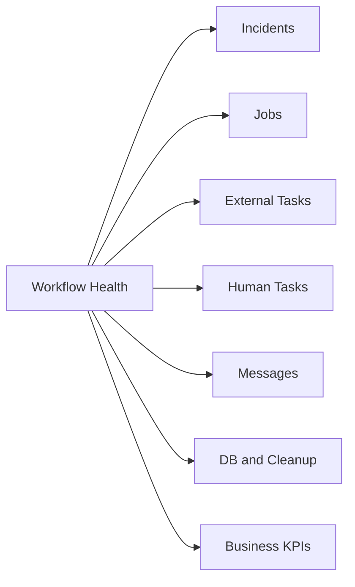

Dashboard panels:

- active process instances by definition/version;
- incident count by process/activity;
- failed jobs and retries remaining;
- external task backlog by topic;
- oldest locked external task;
- user tasks by candidate group and age;
- SLA breached tasks;
- message correlation failures;
- Camunda DB latency and table growth;
- history cleanup duration and backlog;
- top process cycle-time percentiles.

---

## 18. Testing Strategy

A production-grade workflow system needs more than delegate unit tests.

### 18.1 Test Pyramid

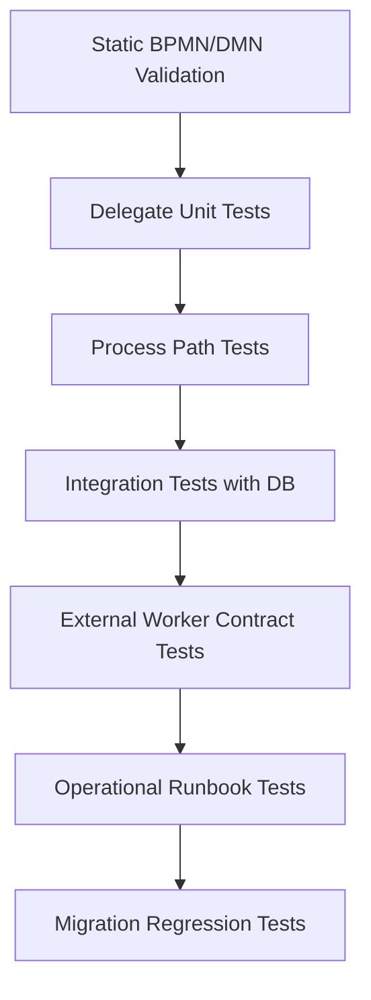

### 18.2 Test Matrix

| Test | Example assertion |
|---|---|
| BPMN parse test | model deploys successfully. |
| DMN decision test | risk inputs produce expected outputs. |
| Golden path | case reaches investigation then final close. |
| Low-risk path | fast-track skips legal review. |
| High-risk path | supervisor and legal review required. |
| SLA timer | non-interrupting escalation created after duration. |
| Message correlation | response event continues exactly one instance. |
| Duplicate event | second event does not move process twice. |
| External task failure | retries decrease and incident created after exhaustion. |
| BPMN error | invalid recipient routes to correction task. |
| Process modification | repair action leaves audit event. |
| Migration | old instance can map to new definition safely. |

### 18.3 Example Process Test Shape

```java
@Test
void highRiskCaseRequiresSupervisorAndLegalReview() {
    ProcessInstance instance = runtimeService.startProcessInstanceByKey(
        "regulatory_enforcement_case",
        "CASE-TEST-001",
        Map.of(
            "caseId", "CASE-TEST-001",
            "caseType", "MARKET_ABUSE",
            "entityRiskScore", 95,
            "priorViolations", 2,
            "publicImpact", "HIGH",
            "crossEntityImpact", true
        )
    );

    assertThat(instance).isStarted();

    // Assertions depend on the test library used, but intent is:
    // - DMN classified risk as CRITICAL
    // - investigation user task exists
    // - supervisor review is required
    // - legal review is required before final decision
}
```

---

## 19. Deployment and Release Strategy

### 19.1 Deployment Units

| Artifact | Versioning approach |
|---|---|
| BPMN | versioned by deployment; semantic changelog. |
| DMN | versioned decision key/version; test matrix required. |
| Java delegates | application version; backward-compatible variable contracts. |
| External workers | independent deploy; topic contract version. |
| Forms/UI | compatible with task definition keys and variable schema. |
| Audit projection | backward-compatible event consumers. |

### 19.2 Release Checklist

Before deploying a new process version:

- BPMN parse test passes.
- DMN regression test passes.
- Migration impact analyzed.
- Running instance count by version known.
- Activity ids stable unless intentionally changed.
- Task definition keys stable if UI/authorization depends on them.
- Message names stable or migration/reconciliation planned.
- External task topics stable or workers deployed first.
- Variables added are optional or defaulted.
- Variables removed are no longer read by old code.
- History TTL and cleanup impact reviewed.
- Rollback plan documented.

### 19.3 Backward Compatibility Rules

| Change | Risk |
|---|---|
| Add optional variable | low |
| Add new path after gateway with default safe branch | medium |
| Rename activity id | high for migration/history/tests |
| Rename message name | high for correlation |
| Rename external task topic | high for worker compatibility |
| Change DMN hit policy | high for decision semantics |
| Change user task key | high for UI/authorization/reporting |
| Remove wait state with running instances | high for migration |

---

## 20. Migration Readiness

Even if the system remains on Camunda 7, design should avoid unnecessary lock-in.

### 20.1 Migration-Friendly Choices

| Choice | Benefit |
|---|---|
| API facade instead of exposing engine API | engine replacement less painful. |
| Thin delegates | domain logic portable. |
| External task contract explicit | worker logic can be adapted. |
| Minimal variables | state mapping easier. |
| Stable business key | instance/event mapping easier. |
| Audit projection outside Camunda history | business evidence survives engine migration. |
| BPMN kept executable and simple | conversion analysis easier. |
| DMN tested independently | rule migration safer. |

### 20.2 Migration-Hostile Choices

| Choice | Problem |
|---|---|
| Heavy JavaDelegate business logic | engine-coupled domain behavior. |
| Java serialized variables | poor portability and schema evolution. |
| Direct DB queries to `ACT_*` tables | internal schema dependency. |
| UI bound to Camunda REST response shape | expensive front-end migration. |
| Complex listeners everywhere | hidden behavior hard to analyze. |
| Dynamic expression spaghetti | difficult to convert or reason about. |

### 20.3 Migration Preparation Checklist

- Inventory BPMN/DMN definitions and versions.
- Inventory running instances by definition version and activity id.
- Inventory Java delegates, listeners, expressions, external task topics.
- Inventory variables by name/type/sensitivity/reader/writer.
- Inventory REST API usage and direct engine clients.
- Inventory Cockpit/manual operations used in production.
- Identify process models with unsupported/complex constructs.
- Identify business-critical instances that cannot be migrated automatically.
- Build regression tests before conversion.
- Define coexistence strategy for old and new engine.

---

## 21. Production Readiness Review

Use this review before launch.

### 21.1 BPMN Review

| Question | Pass criteria |
|---|---|
| Is each wait state intentional? | Every wait has owner/event/SLA. |
| Are async boundaries placed before risky side effects? | Remote/non-idempotent work not hidden inside one transaction. |
| Are gateway branches complete? | Default path or explicit incident/business fallback. |
| Are messages targeted? | Message correlation uses business key/correlation key. |
| Are signals only broadcast? | No single-case response uses signal. |
| Are timers bounded? | No unbounded timer explosion. |
| Is model readable by operator? | Operational path visible. |

### 21.2 Data Review

| Question | Pass criteria |
|---|---|
| Is every variable justified? | writer/reader/scope/sensitivity known. |
| Are large objects avoided? | references instead of full payload. |
| Is sensitive data protected? | no secrets/raw documents/full legal notes in variables. |
| Is schema evolution planned? | schemaVersion/defaults/backward compatibility. |
| Is audit separate from operational history? | domain audit projection exists. |

### 21.3 Reliability Review

| Question | Pass criteria |
|---|---|
| Are retries idempotent? | duplicate-safe commands/workers. |
| Are incidents actionable? | runbook per critical activity. |
| Are external workers monitored? | backlog/lock/failure metrics. |
| Are message failures reconciled? | inbox and unmatched-event handling. |
| Is history cleanup configured? | TTL/window/batch impact known. |
| Is DB capacity planned? | table growth and query discipline understood. |

### 21.4 Security Review

| Question | Pass criteria |
|---|---|
| Is engine API shielded? | facade for non-operator users. |
| Are operators least-privileged? | role-based Cockpit/Admin access. |
| Are external workers scoped? | topic-specific credentials. |
| Are manual repairs audited? | reason/actor/incident link captured. |
| Is sensitive task data controlled? | UI/API filters and domain authorization. |

---

## 22. Final End-to-End Flow

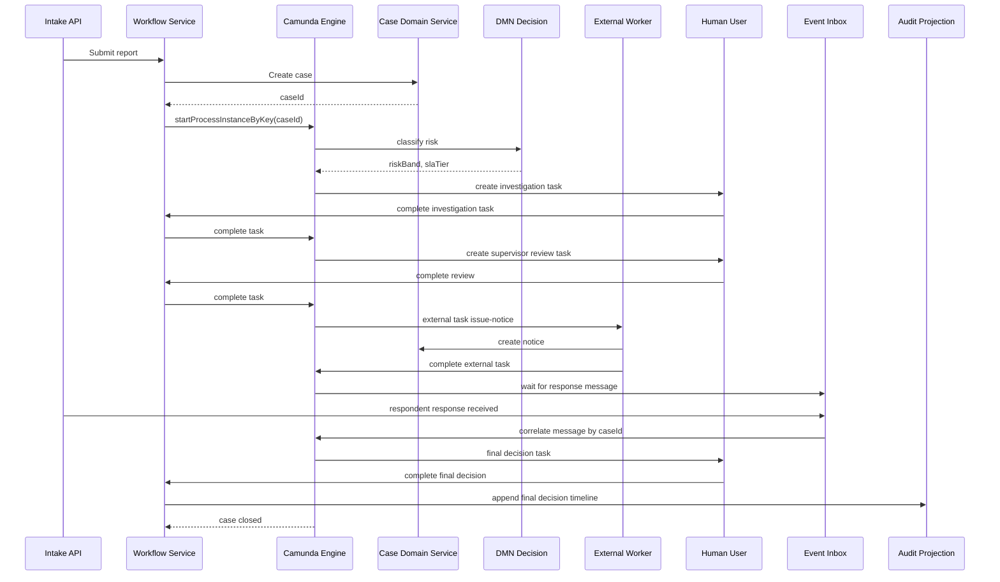

---

## 23. Failure Walkthroughs

### 23.1 Document Service Down During Notice Issuance

Expected behavior:

1. External task worker fetches `issue-notice`.
2. Document service timeout occurs.
3. Worker calls `handleFailure` with retry decrement and backoff.
4. External task remains visible as retryable work.
5. After retries exhausted, incident appears.
6. Operator checks downstream status/template config.
7. Once fixed, operator retries incident or worker completes after retry.
8. Audit timeline records delay/escalation if SLA impacted.

No direct DB update. No manual process completion without evidence.

### 23.2 Respondent Response Arrives Too Early

Expected behavior:

1. Event API receives response before process reaches message catch.
2. Inbox records event id and case id.
3. Correlation fails because no subscription exists yet.
4. Event remains `UNMATCHED` or `PENDING_RECONCILIATION`.
5. Reconciliation job retries correlation when process enters wait state.
6. If process never expects response, business exception queue handles it.

Do not drop early events.

### 23.3 Supervisor Completes Task Twice

Expected behavior:

1. First complete succeeds and moves token.
2. Second complete returns not found/already completed through facade.
3. API maps to idempotent outcome if same command id, or conflict if different command.
4. Audit does not duplicate decision.

Do not expose raw engine exception to end-user.

### 23.4 New BPMN Version Deployed While Old Instances Run

Expected behavior:

1. New instances use new definition version.
2. Old instances continue on old version.
3. Team checks whether old instances need migration.
4. Migration plan maps source activity ids to target activity ids.
5. High-risk instances tested in lower environment with production-like state.
6. Migration operation is audited.

Do not assume deploy automatically changes running instances.

---

## 24. Capstone Implementation Roadmap

### 24.1 Build Order

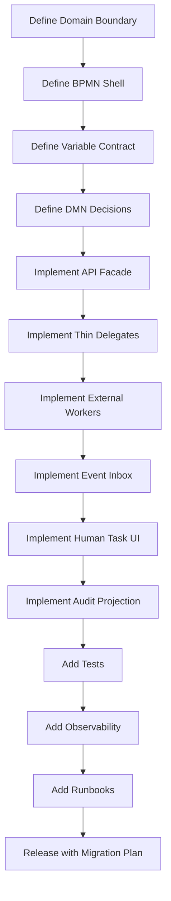

### 24.2 First 20 Hours Practice Plan

Even at capstone level, Kaufman's method still applies.

| Timebox | Practice |
|---|---|
| 0-2h | Draw BPMN shell and define process boundaries. |
| 2-4h | Implement start process and business key convention. |
| 4-6h | Add DMN risk decision and tests. |
| 6-8h | Add investigation user task and task completion API. |
| 8-10h | Add SLA timer and escalation path. |
| 10-12h | Add external task issue-notice worker. |
| 12-14h | Add message correlation via inbox. |
| 14-16h | Add failure tests: retry, BPMN error, duplicate event. |
| 16-18h | Add audit timeline and operator runbook. |
| 18-20h | Perform production readiness review and migration review. |

The goal is not to finish a full platform in 20 hours. The goal is to build enough working structure to self-correct design mistakes early.

---

## 25. Reference Package Structure

```text
workflow-service/
  src/main/java/com/example/workflow/
    api/
      CaseIntakeController.java
      TaskActionController.java
      EventCorrelationController.java
    application/
      CaseWorkflowApplicationService.java
      RespondentResponseHandler.java
      TaskCompletionService.java
    camunda/
      delegate/
        CreateCaseDelegate.java
        PrepareDecisionDelegate.java
      listener/
        AuditTaskListener.java
        AssignmentListener.java
      config/
        CamundaEngineConfiguration.java
    worker/
      IssueNoticeWorker.java
      RiskScreeningWorker.java
    audit/
      AuditTimeline.java
      AuditEventPublisher.java
    inbox/
      WorkflowEventInbox.java
      EventReconciliationJob.java
    security/
      WorkflowAuthorizationService.java
    observability/
      WorkflowMetricsPublisher.java
  src/main/resources/
    bpmn/
      regulatory-enforcement-case.bpmn
    dmn/
      case-risk-classification.dmn
      legal-review-routing.dmn
    application.yml
  src/test/java/com/example/workflow/
    ProcessPathTest.java
    RiskClassificationDmnTest.java
    MessageCorrelationTest.java
    ExternalTaskFailureTest.java
    MigrationCompatibilityTest.java
```

---

## 26. Code Review Checklist for Camunda PRs

Use this checklist for every BPMN/DMN/delegate/worker PR.

### BPMN

- Are activity ids stable and meaningful?
- Are wait states intentional?
- Are async boundaries placed correctly?
- Are message names and correlation keys explicit?
- Are timers bounded and operationally visible?
- Are user tasks assigned through policy, not hardcoded shortcuts?
- Are BPMN errors reserved for business alternatives?

### DMN

- Are inputs explicit and typed?
- Are outputs minimal and stable?
- Are hit policies documented?
- Are default rules intentional?
- Are regression tests included?
- Is rule version captured in audit when needed?

### Java Delegates

- Is delegate thin?
- Is domain logic outside engine-specific class?
- Are side effects idempotent?
- Are variables validated before use?
- Does exception behavior match BPMN/incident strategy?
- Are no large/sensitive objects written as variables?

### External Workers

- Is topic contract documented?
- Is lock duration rational?
- Is completion idempotent?
- Are BPMN errors distinguished from technical failures?
- Are retries/backoff configured?
- Are worker metrics emitted?

### Operations

- Is runbook updated?
- Are dashboards/alerts updated?
- Are incidents actionable?
- Is migration impact analyzed?
- Is security/authorization impact reviewed?

---

## 27. Final Mental Model

A production-grade Camunda 7 system is not a diagram with code attached. It is a **durable orchestration runtime** where:

- BPMN defines visible process state and wait semantics.
- DMN defines auditable decision logic.
- Java delegates adapt process flow to application services.
- External tasks isolate remote side effects.
- User tasks model human responsibility.
- Messages model targeted external continuation.
- Timers model time-based obligation.
- Incidents model stuck technical work.
- History supports operational trace.
- Domain audit supports regulatory evidence.
- Observability turns runtime behavior into action.
- Security limits who can see, act, repair, and override.
- Migration readiness keeps the system evolvable.

The deepest skill is not memorizing Camunda APIs. The deepest skill is being able to look at a workflow and answer:

1. What state is durable right now?
2. What transaction boundary protects this action?
3. What happens if this side effect succeeds but the process rolls back?
4. What happens if the same event arrives twice?
5. What happens if this human task is never completed?
6. What evidence proves why this decision was made?
7. What can an operator safely do at 03:00 when this is stuck?
8. What breaks when we deploy a new version?
9. What would be hard to migrate later?
10. Which invariant must never be violated?

If you can answer these questions before production, you are no longer just using Camunda. You are engineering a workflow platform.

---

## 28. Series Completion

This is the final part of the planned series.

Completed series:

- Part 001 — Kaufman Skill Map
- Part 002 — Platform Reality and Version Strategy
- Part 003 — Workflow Engine Mental Model
- Part 004 — BPMN Executable Subset
- Part 005 — Token Flow and Gateway Semantics
- Part 006 — Events, Timers, Messages, Signals, Errors, Escalations
- Part 007 — User Task and Human Workflow
- Part 008 — Subprocess, Call Activity, and Modular Processes
- Part 009 — DMN Business Rules and Decision Integration
- Part 010 — Process Engine API and Services
- Part 011 — Command Context, Transactions, and Wait States
- Part 012 — Job Executor Internals
- Part 013 — Variables, Serialization, and Data Contracts
- Part 014 — History, Audit, and Operational Trace
- Part 015 — Incidents, Errors, and Recovery Model
- Part 016 — Spring Boot Embedded Engine
- Part 017 — Delegation Code, JavaDelegate, Listeners, Expressions
- Part 018 — Service Task Implementation Patterns
- Part 019 — External Task Pattern
- Part 020 — REST API and Remote Engine Integration
- Part 021 — Testing Camunda Processes
- Part 022 — Architecture Styles
- Part 023 — Database, Persistence, and Performance
- Part 024 — Concurrency, Locking, and Parallelism
- Part 025 — Message Correlation and Event-Driven Integration
- Part 026 — Long-Running Processes and Saga Design
- Part 027 — Microservices Boundaries and Process Ownership
- Part 028 — BPMN Pattern Catalog
- Part 029 — Regulatory Case Management Patterns
- Part 030 — Dynamic Workflows and Change Management
- Part 031 — Anti-Patterns and Common Pitfalls
- Part 032 — Cockpit, Tasklist, Admin, and Operational Playbooks
- Part 033 — Security, Authorization, and Data Protection
- Part 034 — Observability, Metrics, and Reliability Engineering
- Part 035 — Capstone Production-Grade Camunda 7 System

Seri **Learn Java BPMN with Camunda BPM Platform 7** selesai.
