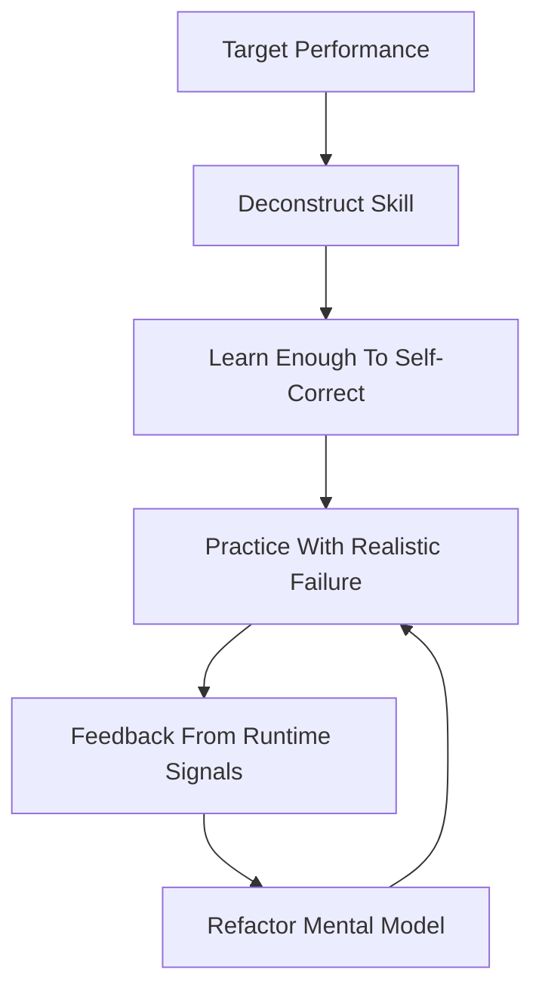
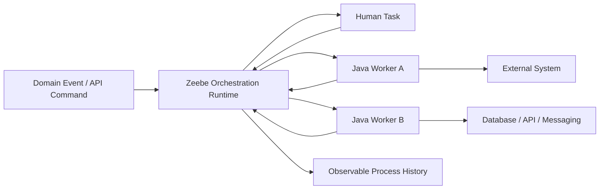
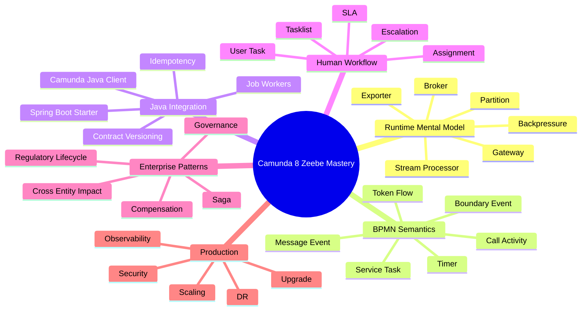
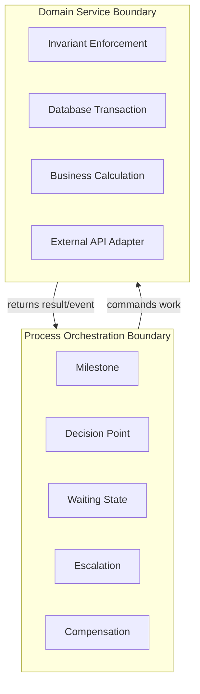
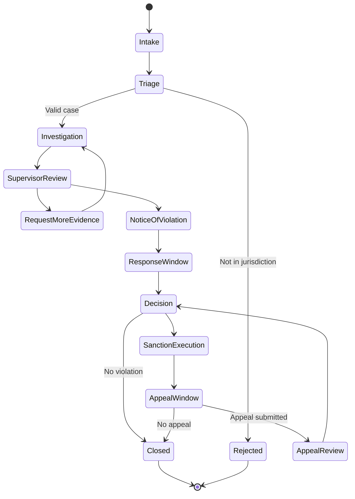

------
title: Learn Java BPMN with Camunda 8 Zeebe - Part 001
description: Kaufman-style skill map for mastering Camunda 8 Zeebe as an advanced Java process orchestration engineer.
series: learn-java-bpmn-camunda8-zeebe
seriesTitle: Learn Java BPMN with Camunda 8 Zeebe
order: 1
partTitle: Kaufman Skill Map
tags:
  - java
  - bpmn
  - camunda
  - zeebe
  - workflow
  - orchestration
  - distributed-systems
  - series
date: 2026-06-28
---

# Part 001 — Kaufman Skill Map for Camunda 8 Zeebe

> Goal part ini bukan langsung membuat BPMN atau worker. Goal-nya adalah membentuk **peta skill**, batasan seri, cara latihan, dan mental model awal supaya belajar Camunda 8 Zeebe tidak jatuh menjadi hafalan API.

Camunda 8 dengan Zeebe harus dipelajari sebagai gabungan dari beberapa disiplin:

1. **BPMN execution semantics**: memahami bagaimana model berubah menjadi token, event, job, incident, dan state transition.
2. **Distributed orchestration**: memahami broker, partition, gateway, exporter, backpressure, dan failure mode.
3. **Java worker engineering**: membangun job worker yang idempotent, observable, versionable, secure, dan production-ready.
4. **Human workflow and governance**: mengelola task, escalation, SLA, auditability, approval, exception handling, dan change control.
5. **Platform operations**: deployment, scaling, upgrade, observability, disaster recovery, tenant/security model, dan migration strategy.

Bila kita mempelajari Camunda 8 hanya seperti “BPMN + Spring annotation”, hasilnya dangkal. Skill sebenarnya adalah mampu merancang **business process runtime** yang tetap benar ketika service lambat, event datang dua kali, worker restart di tengah side effect, schema berubah, user task stuck, SLA terlewat, dan proses harus diaudit berbulan-bulan setelah kejadian.

---

## 1. Apa Yang Berubah Dari Seri Camunda 7

Kita tidak akan mengulang seri Camunda 7. Seri ini mengambil posisi bahwa kamu sudah paham:

- BPMN dasar.
- Process engine concept.
- Java service layer.
- Database transaction.
- REST/messaging integration.
- Design pattern Java.
- Persistence/JDBC/transaction management.
- Camunda 7 model seperti embedded engine, JavaDelegate, Cockpit, external task, dan process engine API.

Camunda 8 bukan sekadar Camunda 7 dengan versi lebih baru. Camunda sendiri menekankan bahwa Camunda 8 **bukan drop-in replacement** untuk Camunda 7; migrasi bisa membutuhkan penyesuaian BPMN, refactoring code, dan bahkan re-architecture. Karena itu, skill map seri ini menghindari jebakan “mencari padanan 1:1 Camunda 7”.

Mental shift utama:

| Dimensi | Camunda 7 mindset | Camunda 8 / Zeebe mindset |
|---|---|---|
| Engine placement | Bisa embedded di aplikasi Java | Remote orchestration cluster |
| Business logic | Sering berada dekat dengan engine via JavaDelegate | Berada di worker/service eksternal |
| Transaction boundary | Sering terasa satu database transaction | Distributed, asynchronous, at-least-once oriented |
| Runtime state | Relational DB engine state | Partitioned event stream + derived state |
| Scaling | Engine/database-centric | Broker partition + worker scaling |
| Failure handling | Exception + transaction rollback sering dominan | Fail job, BPMN error, incident, retry, compensation |
| Observability | Cockpit/process engine DB | Operate/exported records/metrics/logs/traces |
| API style | Java process engine API | Camunda Java Client, REST/gRPC, Orchestration Cluster API |

---

## 2. Kaufman Framework: Cara Belajar Skill Ini

Josh Kaufman dalam *The First 20 Hours* mendorong pendekatan skill acquisition praktis: tentukan target performa, pecah skill, belajar cukup untuk mengoreksi diri, hilangkan hambatan latihan, dan lakukan latihan fokus minimal 20 jam.

Untuk seri ini, framework tersebut kita adaptasi menjadi **engineering skill acquisition loop**:

Intinya: kamu tidak belajar Camunda 8 dengan membaca semua dokumentasi secara pasif. Kamu belajar dengan membuat model, menjalankannya, membuatnya gagal secara sengaja, membaca state-nya di Operate/log/metrics, lalu memperbaiki desain.

---

## 3. Target Performance Level

Target seri ini bukan “bisa membuat proses approve/reject sederhana”. Targetnya adalah:

> Mampu mendesain, mengimplementasikan, mengoperasikan, dan mengevaluasi solusi orchestration berbasis Camunda 8 Zeebe untuk sistem enterprise yang long-running, audit-sensitive, distributed, dan change-heavy.

Dalam konteks engineer senior/tech lead, performa yang diharapkan:

1. Bisa menjelaskan **mengapa BPMN dipakai**, bukan hanya bagaimana menggambar BPMN.
2. Bisa memutuskan kapan memakai orchestration, choreography, event streaming, scheduler, state machine, atau plain service call.
3. Bisa membuat worker Java yang aman terhadap retry, duplicate delivery, timeout, dan partial failure.
4. Bisa mendesain process variable contract tanpa menjadikan Zeebe sebagai database domain.
5. Bisa membedakan technical failure, business error, incident, compensation, dan escalation.
6. Bisa membaca gejala production: stuck instance, hot partition, backpressure, worker starvation, incident burst.
7. Bisa membuat governance: versioning BPMN, migration policy, review checklist, audit policy, and operational runbook.
8. Bisa memimpin migration discussion dari Camunda 7 ke 8 tanpa terjebak “replace dependency saja”.

---

## 4. Skill Decomposition

Camunda 8 Zeebe mastery bisa dipecah menjadi 12 sub-skill.

| No | Sub-skill | Yang Harus Dikuasai | Bukti Praktis |
|---:|---|---|---|
| 1 | Zeebe architecture | Broker, gateway, partition, exporter, stream processor | Bisa menggambar request path dan failure path |
| 2 | BPMN runtime semantics | Token flow, element lifecycle, scope, boundary events | Bisa prediksi state instance tanpa melihat Operate |
| 3 | Job worker model | Activation, completion, fail, error, timeout, retry | Worker aman terhadap restart dan duplicate execution |
| 4 | Data contract | Variables, mappings, schema, sensitive data, large payload | Contract stabil lintas versi process/worker |
| 5 | Error taxonomy | Technical failure vs business error vs incident | Error handling bisa diaudit dan tidak ambigu |
| 6 | Message correlation | Correlation key, TTL, race, idempotent publish | Event-driven process tidak miss/duplicate case |
| 7 | Human workflow | User task lifecycle, assignment, SLA, escalation | Task tidak menjadi black hole operasional |
| 8 | Decision automation | FEEL, DMN, rule governance | Policy tidak terkubur dalam Java worker |
| 9 | Long-running process design | waiting state, compensation, migration, versioning | Bisa hidup selama bulan/tahun dengan perubahan |
| 10 | Production operations | topology, scaling, backpressure, observability | Bisa diagnose bottleneck dan incident burst |
| 11 | Security | Identity, client credentials, permission, secrets | Worker dan user hanya punya akses yang perlu |
| 12 | Platform engineering | starter, template, review, CI/CD, standards | Banyak team bisa memakai Camunda tanpa chaos |

---

## 5. First-Principles Model

Di level paling dasar, Camunda 8 Zeebe adalah sistem untuk menjaga **state proses bisnis** tetap eksplisit dan dapat diamati ketika pekerjaan tersebar di banyak manusia, service, event, dan waktu.

Ada tiga bentuk kebenaran yang perlu dibedakan:

| Jenis kebenaran | Pemilik | Contoh | Risiko bila dicampur |
|---|---|---|---|
| Process truth | Zeebe | Case sedang menunggu review supervisor | Process model jadi database domain |
| Domain truth | Business service/database | Status enforcement case, amount, legal basis | Workflow state tidak sinkron dengan domain |
| Operational truth | Observability tools | Worker timeout, incident, retry count | Bug produksi sulit didiagnosis |

Rule praktis:

> Zeebe menyimpan state orkestrasi. Domain service menyimpan state bisnis. Observability stack menyimpan state operasional. Jangan membuat satu layer berpura-pura menjadi tiga-tiganya.

---

## 6. Apa Yang Harus Dipelajari “Cukup” Sebelum Praktik

Kaufman menyarankan belajar cukup untuk bisa mengoreksi diri. Untuk Camunda 8, “cukup” berarti kamu bisa menjawab pertanyaan berikut sebelum menulis banyak kode:

1. Ketika process instance dimulai, partition mana yang memprosesnya?
2. Ketika service task aktif, siapa yang mengeksekusi business logic?
3. Ketika worker mati setelah memanggil external API tetapi sebelum complete job, apa yang terjadi?
4. Apa beda `fail job` dan `throw BPMN error`?
5. Kapan incident dibuat?
6. Apa yang terjadi bila message correlation key salah?
7. Apakah process variable adalah sumber kebenaran domain?
8. Apakah retry aman untuk task yang punya side effect?
9. Bagaimana process version baru memengaruhi instance lama?
10. Bagaimana cara membuktikan ke auditor bahwa escalation terjadi sesuai aturan?

Jika belum bisa menjawab pertanyaan ini, coding worker hanya akan menghasilkan false confidence.

---

## 7. Practice Design: 20 Jam Pertama

Seri ini panjang, tetapi Kaufman-style foundation tetap memakai 20 jam pertama sebagai fase akuisisi keluwesan dasar.

### Hour 1–2: Architecture Sketch

Deliverable:

- Gambar broker/gateway/worker/exporter.
- Jelaskan perbedaan Camunda 7 vs Camunda 8 dalam 10 kalimat.
- Tulis failure assumptions.

### Hour 3–4: Minimal Process

Deliverable:

- BPMN sederhana: start → service task → end.
- Java worker pertama.
- Deploy dan start process instance.
- Lihat instance di Operate.

### Hour 5–6: Failure Injection

Deliverable:

- Worker sengaja throw exception.
- Worker fail job dengan retries berkurang.
- Trigger incident.
- Resolve incident.

### Hour 7–8: Idempotency Drill

Deliverable:

- Worker melakukan side effect simulasi.
- Simulasikan duplicate job execution.
- Tambahkan idempotency key.
- Buktikan external side effect hanya terjadi sekali.

### Hour 9–10: Message Correlation

Deliverable:

- Intermediate message catch event.
- Publish message dengan correlation key benar dan salah.
- Uji race condition: message datang sebelum process menunggu.
- Tambahkan TTL strategy.

### Hour 11–12: Timer and SLA

Deliverable:

- Boundary timer di user task.
- Escalation path.
- Timer start event.
- Catat efek operasional timer-heavy model.

### Hour 13–14: Human Task

Deliverable:

- User task dengan candidate group.
- Complete task via Tasklist/API.
- Model reassignment/escalation.
- Tentukan task ownership policy.

### Hour 15–16: DMN and FEEL

Deliverable:

- DMN untuk risk classification.
- Gateway FEEL expression.
- Test rule changes tanpa ubah worker.
- Dokumentasi decision contract.

### Hour 17–18: Versioning Drill

Deliverable:

- Deploy process v1 dan v2.
- Start instance lama dan baru.
- Ubah variable contract secara backward-compatible.
- Tulis migration impact note.

### Hour 19–20: Capstone Mini

Deliverable:

- Mini enforcement lifecycle: intake → validate → review → decision → notify → appeal window.
- Minimal 3 worker.
- 1 user task.
- 1 timer SLA.
- 1 incident path.
- 1 message correlation path.
- Runbook singkat.

---

## 8. Skill Tree Seri Ini

---

## 9. Learning Contract: Yang Akan Kita Optimalkan

Seri ini mengoptimalkan hal-hal berikut:

1. **Mental model over recipe**: setiap API dipahami lewat state transition dan failure consequence.
2. **Runtime truth over diagram beauty**: BPMN yang bagus adalah BPMN yang benar saat dijalankan, bukan yang terlihat rapi di slide.
3. **Contract clarity over convenience**: variable contract, worker contract, message contract harus eksplisit.
4. **Operational defensibility over happy path**: incident, retry, audit, escalation, dan support procedure adalah bagian desain, bukan afterthought.
5. **Evolution over first deployment**: proses bisnis berubah; desain harus bisa survive versioning dan migration.

---

## 10. Anti-Goals

Kita tidak akan:

- Mengulang BPMN dasar yang sudah umum.
- Mengulang Java basic, Spring basic, REST basic, JDBC basic, atau design pattern umum.
- Menganggap Camunda 8 sebagai engine embedded seperti Camunda 7.
- Menjadikan BPMN sebagai gambar dokumentasi pasif.
- Menulis worker yang hanya berhasil di happy path.
- Menggunakan process variables sebagai dumping ground semua data domain.
- Menganggap retry selalu aman.
- Mengabaikan Operate, metrics, logs, dan runbook.

---

## 11. Engineer-Level Rubric

Gunakan rubric ini untuk mengukur perkembangan.

### Level 1 — User

- Bisa model simple BPMN.
- Bisa deploy process.
- Bisa membuat worker basic.
- Bisa complete job.

### Level 2 — Builder

- Bisa membuat proses dengan message, timer, user task, dan error path.
- Bisa membuat worker dengan retry handling.
- Bisa membaca incident di Operate.
- Bisa menulis variable mapping sederhana.

### Level 3 — Production Engineer

- Worker idempotent.
- Failure taxonomy jelas.
- Contract versioning aman.
- Observability memadai.
- SLA dan escalation bisa dipertanggungjawabkan.
- Load/failure test dilakukan sebelum production.

### Level 4 — Architect

- Bisa memilih orchestration vs choreography.
- Bisa mendesain multi-process, multi-entity impact.
- Bisa menetapkan process governance.
- Bisa merancang topology, security, and upgrade strategy.
- Bisa mengarahkan migration Camunda 7 ke 8.

### Level 5 — Platform Lead

- Bisa membuat internal Camunda platform golden path.
- Bisa mencegah anti-pattern lintas team.
- Bisa membuat review checklist dan operational standards.
- Bisa menghubungkan workflow design dengan compliance, audit, and business risk.

---

## 12. Core Vocabulary

| Istilah | Mental model ringkas |
|---|---|
| Zeebe | Distributed workflow engine di Camunda 8 Orchestration Cluster |
| Broker | Node yang memproses command, menyimpan state runtime, dan memberi job ke worker |
| Gateway | Stateless entry point untuk request client menuju broker |
| Partition | Shard/event stream tempat state process instance diproses |
| Stream processor | Komponen internal yang membaca record stream dan menjalankan state machine |
| Record | Entry di stream; bisa command, event, rejection, atau bentuk record lain |
| Command | Permintaan perubahan state |
| Event | Fakta bahwa state sudah berubah |
| Rejection | Command tidak valid untuk state saat ini atau tidak bisa diterima |
| Job | Unit kerja yang dibuat dari service task atau construct tertentu |
| Worker | Client eksternal yang mengambil job dan menjalankan business logic |
| Incident | Keadaan yang memerlukan intervensi operator/manusia |
| Exporter | Mekanisme untuk mengalirkan state changes ke storage/consumer eksternal |
| Operate | UI/API operational untuk monitoring dan troubleshooting process instance |
| Tasklist | UI/API untuk human task workflow |

---

## 13. Strategic Mental Model: Orchestration Boundary

Salah satu keputusan arsitektur paling penting adalah menentukan **apa yang masuk ke BPMN** dan **apa yang tetap di service/domain layer**.

Masukkan ke BPMN bila:

- State-nya perlu terlihat oleh business/operator.
- Waktu tunggunya panjang.
- Ada human decision.
- Ada SLA/escalation.
- Ada cross-service coordination.
- Ada audit significance.
- Ada compensation path.

Jangan masukkan ke BPMN bila:

- Itu hanya private method call.
- Itu loop teknis internal service.
- Itu validasi field kecil tanpa nilai audit.
- Itu algoritma domain yang lebih cocok di code.
- Itu data transformation stateless sederhana.

---

## 14. Regulatory Systems Lens

Untuk sistem regulatory/enforcement lifecycle, Camunda 8 berguna ketika proses memiliki sifat berikut:

- Banyak status eksplisit: intake, triage, investigation, notice, response, hearing, sanction, appeal, closure.
- Banyak aktor: officer, supervisor, legal, respondent, external agency.
- Banyak deadline: response window, appeal window, investigation SLA, escalation threshold.
- Banyak bukti: documents, decision basis, notes, correspondence, audit record.
- Banyak exception: incomplete data, invalid party, conflict of interest, external dependency failure.
- Banyak dampak lintas entity: satu violation memengaruhi license, organization, person, location, product, transaction, atau previous case.

Namun, jangan menjadikan satu process instance sebagai “seluruh dunia kasus”. Biasanya desain yang lebih defensible adalah kombinasi:

- Root process untuk case lifecycle.
- Child process untuk sub-investigation, notification, appeal, or sanction execution.
- Domain database untuk entity relationships.
- Event stream untuk domain events.
- Zeebe untuk orchestration state.

---

## 15. Common Early Misconceptions

### Misconception 1: “BPMN adalah flowchart.”

BPMN di Camunda 8 adalah executable contract. Sequence flow, boundary event, message event, and service task punya runtime semantics.

### Misconception 2: “Worker sama seperti JavaDelegate.”

Worker adalah remote client. Ia tidak hidup di transaction boundary engine. Worker harus tahan network failure, retry, duplicate execution, timeout, and partial side effects.

### Misconception 3: “Retry memperbaiki semua failure.”

Retry hanya aman bila operation idempotent atau side effect dikontrol. Retry tanpa idempotency bisa menggandakan pembayaran, notifikasi, sanksi, atau integrasi eksternal.

### Misconception 4: “Process variable boleh menyimpan semua data.”

Process variable seharusnya menyimpan data orchestration-relevant, bukan seluruh aggregate domain. Data besar, sensitif, atau frequently updated lebih cocok disimpan di domain system dan direferensikan dengan ID.

### Misconception 5: “Kalau ada incident berarti desain gagal.”

Incident adalah mekanisme operasional. Yang buruk bukan incident itu sendiri, tetapi incident tanpa taxonomy, owner, runbook, atau observability.

---

## 16. Practice Project Sepanjang Seri

Kita akan memakai satu capstone berulang:

> **Regulatory Enforcement Lifecycle Platform**

High-level lifecycle:

Kita akan memakai capstone ini untuk membahas:

- Job worker boundary.
- User task assignment.
- SLA timer.
- Message correlation.
- DMN risk classification.
- Compensation.
- Audit and evidence capture.
- Multi-entity impact.
- Versioning.
- Operational runbook.

---

## 17. Review Checklist Untuk Setiap BPMN Model

Sebelum process model dianggap “serius”, jawab checklist ini:

### Intent

- Apa tujuan bisnis proses ini?
- Apa outcome terminal yang sah?
- Siapa process owner?
- Apa domain event yang memulai proses?

### Runtime

- Di mana proses bisa menunggu lama?
- Di mana human task muncul?
- Di mana service task bisa gagal?
- Di mana message correlation dibutuhkan?
- Di mana timer/SLA dibutuhkan?

### Data

- Variable apa yang benar-benar orchestration-relevant?
- Data apa yang harus tetap di domain service?
- Apakah variable contract versioned?
- Apakah ada sensitive data?

### Failure

- Failure mana technical retry?
- Failure mana business error?
- Failure mana incident?
- Failure mana butuh compensation?
- Siapa owner setiap incident?

### Operations

- Bagaimana operator tahu proses stuck?
- Bagaimana retry dilakukan?
- Bagaimana cancel dilakukan?
- Bagaimana audit evidence dihasilkan?
- Bagaimana model berubah tanpa merusak instance lama?

---

## 18. Latihan Mandiri Part 001

Kerjakan sebelum lanjut ke Part 002.

### Exercise 1 — Explain in 10 Sentences

Tulis 10 kalimat yang menjelaskan mengapa Camunda 8 Zeebe tidak boleh dipelajari seperti Camunda 7 embedded engine.

### Exercise 2 — Draw Your Architecture Assumption

Gambar arsitektur awal kamu:

- Java service.
- Camunda 8 cluster.
- Worker.
- External systems.
- Operator UI.
- Observability.

Bandingkan dengan diagram di part ini.

### Exercise 3 — Define Your Process Boundary

Ambil satu proses regulasi/enforcement yang kamu kenal. Buat tabel:

| Step | Masuk BPMN? | Tetap di service? | Alasan |
|---|---:|---:|---|
| Intake validation |  |  |  |
| Jurisdiction decision |  |  |  |
| Evidence upload |  |  |  |
| Supervisor approval |  |  |  |
| Notification sending |  |  |  |
| Appeal deadline |  |  |  |

### Exercise 4 — Failure Thought Experiment

Untuk setiap service task, jawab:

1. Apa side effect-nya?
2. Apa yang terjadi bila worker crash setelah side effect berhasil?
3. Apakah retry aman?
4. Apa idempotency key-nya?
5. Apa indikator incident-nya?

---

## 19. Definition of Done

Part ini selesai bila kamu bisa:

- Menjelaskan skill map Camunda 8 Zeebe tanpa bergantung pada jargon.
- Membedakan process truth, domain truth, dan operational truth.
- Menentukan boundary awal BPMN vs service layer.
- Menjelaskan mengapa worker harus idempotent.
- Menyebutkan minimal 8 sub-skill yang akan dilatih dalam seri ini.
- Membuat 20-hour practice plan pribadi.

---

## 20. Source Notes

Referensi faktual utama untuk orientasi seri:

- Camunda 8 migration guide: `https://docs.camunda.io/docs/guides/migrating-from-camunda-7/`
- Camunda 8 Zeebe architecture: `https://docs.camunda.io/docs/components/zeebe/technical-concepts/architecture/`
- Camunda 8 partitions: `https://docs.camunda.io/docs/components/zeebe/technical-concepts/partitions/`
- Camunda 8 internal processing: `https://docs.camunda.io/docs/components/zeebe/technical-concepts/internal-processing/`
- Camunda Java Client: `https://docs.camunda.io/docs/apis-tools/java-client/getting-started/`
- Camunda Spring Boot Starter: `https://docs.camunda.io/docs/apis-tools/camunda-spring-boot-starter/getting-started/`
- Job worker guide: `https://docs.camunda.io/docs/apis-tools/java-client/job-worker/`
- Camunda best practice on problems and exceptions: `https://docs.camunda.io/docs/components/best-practices/development/dealing-with-problems-and-exceptions/`

---

## 21. Next Part

Part berikutnya membahas **Zeebe Architecture Mental Model** secara teknis: broker, gateway, partition, stream processor, exporter, event stream, command, event, rejection, incident, and backpressure.
