------
title: Learn Java BPMN with Camunda 8 Zeebe - Part 002
description: Deep mental model of Zeebe architecture: brokers, gateways, partitions, stream processors, exporters, records, commands, events, rejections, incidents, and production implications.
series: learn-java-bpmn-camunda8-zeebe
seriesTitle: Learn Java BPMN with Camunda 8 Zeebe
order: 2
partTitle: Zeebe Architecture Mental Model
tags:
  - java
  - bpmn
  - camunda
  - zeebe
  - workflow
  - orchestration
  - architecture
  - distributed-systems
  - event-sourcing
  - series
date: 2026-06-28
---

# Part 002 — Zeebe Architecture Mental Model

> Goal part ini adalah membuat kamu bisa membaca Camunda 8 Zeebe sebagai **distributed state machine runtime**, bukan sebagai library workflow biasa.

Camunda 8 Zeebe adalah runtime yang memproses workflow secara distributed. Untuk engineer Java senior, pemahaman utama bukan “bagaimana memanggil API”, tetapi:

- Di mana state disimpan?
- Siapa yang mengeksekusi business logic?
- Apa yang terjadi ketika command diterima?
- Apa yang terjadi ketika command tidak valid?
- Bagaimana proses berjalan tanpa thread Java yang menunggu selama berhari-hari?
- Bagaimana Zeebe menjaga process execution tetap maju walaupun worker, network, atau service eksternal gagal?

Mental model yang akan kita pakai:

> Zeebe adalah orchestration runtime berbasis partitioned append-only event stream, di mana broker memproses command menjadi event lewat stream processor, worker eksternal menjalankan business logic, dan exporter memindahkan record ke sistem observability/history.

---

## 1. Arsitektur Tingkat Tinggi

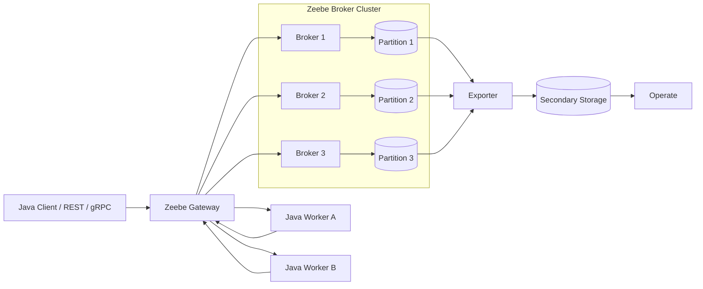

Komponen utama:

| Komponen | Tanggung jawab | Yang tidak dilakukan |
|---|---|---|
| Java Client | Mengirim command, deploy resource, start process, publish message, worker API | Tidak menyimpan runtime state |
| Gateway | Entry point stateless/sessionless ke broker cluster | Tidak menjalankan business logic |
| Broker | Memproses command, menyimpan state active instance, assign jobs | Tidak berisi application business logic |
| Partition | Stream/shard tempat state instance diproses | Tidak membagi satu instance ke banyak partition |
| Stream processor | Membaca record secara sekuensial dan menjalankan state machine | Tidak menunggu external service secara blocking |
| Worker | Mengambil job dan menjalankan business logic eksternal | Tidak mengontrol token flow secara langsung |
| Exporter | Mengalirkan state changes ke sistem lain | Tidak menjadi sumber utama command processing |
| Operate | Monitoring/troubleshooting process instance | Tidak menggantikan observability service-level |

---

## 2. Gateway: Stateless Entry Point

Gateway adalah pintu masuk client menuju broker cluster. Dari perspektif aplikasi Java, kamu biasanya tidak berbicara langsung ke partition. Kamu berbicara ke gateway, lalu gateway meneruskan request ke broker/partition yang sesuai.

Sifat gateway:

- Stateless.
- Sessionless.
- Bisa diskalakan horizontal.
- Cocok di-load-balance.
- Tidak menjalankan business logic.
- Tidak menyimpan state process instance.

Konsekuensi arsitektural:

1. Jangan menaruh asumsi sticky session di gateway.
2. Jangan menganggap gateway adalah engine.
3. Gateway failure harus dianggap sebagai connectivity failure, bukan process failure.
4. Client harus punya retry strategy yang sadar idempotency.

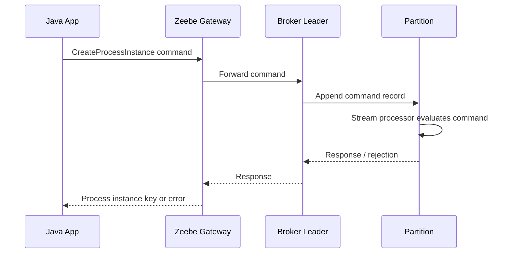

---

## 3. Broker: Runtime Workhorse

Broker adalah bagian utama yang memproses runtime workflow. Secara konseptual, broker bertugas:

- Menerima dan memproses command.
- Menyimpan dan mengelola state active process instance.
- Membuat dan meng-assign job ke worker.
- Mereplikasi partition untuk fault tolerance.
- Mengekspor record state changes melalui exporter.

Hal penting:

> Broker tidak menjalankan business logic aplikasi. Business logic berada di worker/service eksternal.

Ini adalah perbedaan besar dari style embedded/delegate. Bila service task mencapai titik eksekusi, Zeebe membuat job. Worker mengambil job tersebut, memanggil service/domain logic, lalu melaporkan hasil ke Zeebe.

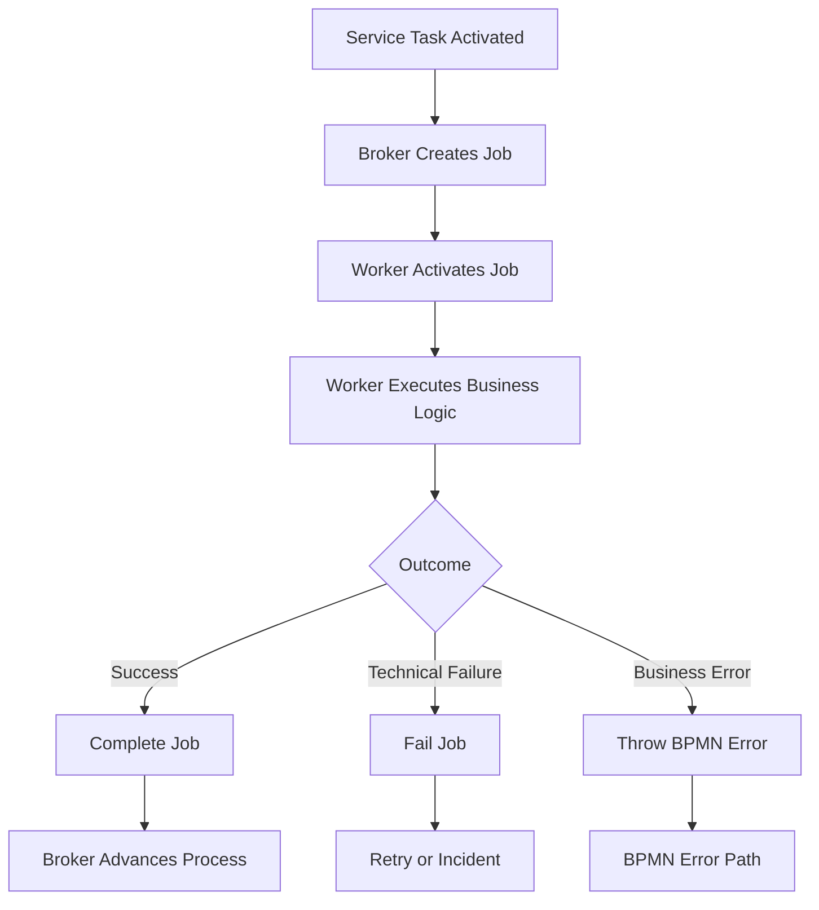

---

## 4. Partition: The Unit of Process State

Partition adalah konsep yang sering diabaikan oleh developer aplikasi, padahal sangat menentukan scaling dan behavior.

Mental model:

> Partition adalah shard append-only stream tempat state process instance berada dan diproses.

Ketika process instance dibuat, instance tersebut ditempatkan pada satu partition. Setelah itu, state instance diproses di partition yang sama sampai instance selesai/terminate. Ini berarti satu instance tidak “loncat-loncat” antar partition untuk setiap step.

### 4.1 Partition Routing

Secara praktis:

| Cara start process | Cara partition dipilih | Implikasi |
|---|---|---|
| CreateProcessInstance | Gateway memilih partition, biasanya round-robin | Load instance tersebar |
| Message start event | Berdasarkan correlation key message | Correlation key memengaruhi distribusi |
| Timer start event | Umumnya terkait scheduling internal | Perlu hati-hati untuk timer-heavy workload |

### 4.2 Why It Matters

Partition memengaruhi:

- Throughput process instance creation.
- Hotspot bila correlation key tidak seimbang.
- Backpressure per partition.
- Failure isolation.
- Capacity planning.
- Latency command processing.

Anti-pattern awal:

```text
Semua message correlation key = tenantId tunggal
```

Bila satu tenant besar menghasilkan mayoritas traffic, correlation berbasis tenant saja bisa membuat distribusi buruk. Correlation key harus dipilih berdasarkan kebutuhan bisnis dan distribusi workload, bukan sekadar field yang paling mudah tersedia.

---

## 5. Append-Only Event Stream

Zeebe memproses state lewat record stream. Partition menyimpan stream process-related records yang append-only. Setiap record punya posisi yang mengidentifikasi urutannya dalam partition.

Mental model sederhana:

```text
position 1: DEPLOY_PROCESS command
position 2: PROCESS_DEPLOYED event
position 3: CREATE_PROCESS_INSTANCE command
position 4: PROCESS_INSTANCE_CREATED event
position 5: ELEMENT_ACTIVATING event
position 6: ELEMENT_ACTIVATED event
position 7: JOB_CREATED event
position 8: COMPLETE_JOB command
position 9: JOB_COMPLETED event
position 10: ELEMENT_COMPLETED event
```

Urutan sebenarnya lebih detail, tetapi model ini cukup untuk memahami prinsip:

1. Client/broker menulis command.
2. Stream processor membaca command.
3. State machine memutuskan command valid atau tidak.
4. Jika valid, state berubah dan event ditulis.
5. Jika tidak valid, command ditolak/rejected.
6. Follow-up command bisa ditulis untuk mendorong process execution.

---

## 6. Command, Event, Rejection

Ini vocabulary inti.

| Tipe | Arti | Contoh | Cara berpikir |
|---|---|---|---|
| Command | Permintaan mengubah state | Start process, complete job, publish message | “Saya ingin sesuatu terjadi.” |
| Event | Fakta state sudah berubah | Job created, activity completed | “Sesuatu sudah terjadi.” |
| Rejection | Command tidak bisa diterapkan | Complete job yang sudah completed | “Permintaan tidak valid untuk state saat ini.” |

Zeebe internally menjalankan state machine. Command hanya valid bila lifecycle entity memungkinkan transition tersebut.

Contoh:

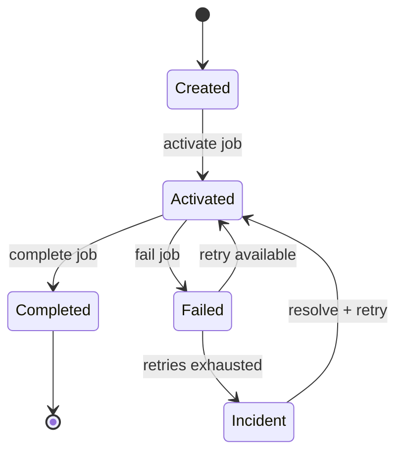

Kalau worker mencoba complete job yang sudah expired/handled, command bisa gagal. Ini bukan sekadar exception Java; ini berarti command tidak cocok dengan state runtime.

---

## 7. Stream Processor: The Deterministic State Machine Executor

Stream processor membaca record stream secara sekuensial. Untuk setiap command, ia:

1. Membaca command berikutnya.
2. Mengecek state entity saat ini.
3. Menentukan apakah command valid.
4. Mengubah state jika valid.
5. Menolak command bila tidak valid.
6. Menulis event state baru.
7. Menulis follow-up command jika process harus lanjut.

Contoh service task:

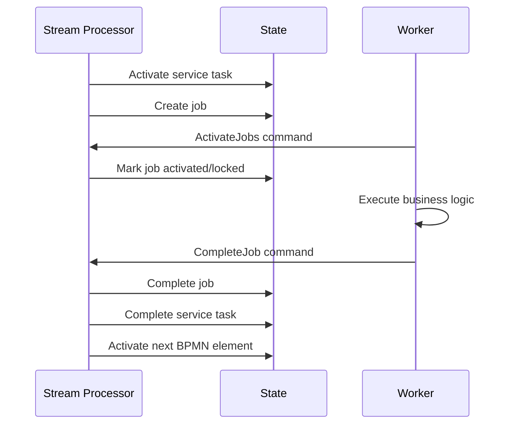

Perhatikan: worker tidak “menggerakkan token” secara langsung. Worker melaporkan job selesai. Zeebe yang memproses completion dan melanjutkan token flow.

---

## 8. Why Zeebe Is Not A Blocking Workflow Thread

Salah satu miskonsepsi umum: “process instance seperti thread yang tidur di timer/user task.”

Bukan begitu.

Process instance adalah state dalam runtime. Ketika mencapai waiting state, Zeebe menyimpan state dan berhenti mengeksekusi sampai ada event/command yang relevan:

- User task completed.
- Message correlated.
- Timer triggered.
- Job completed.
- Incident resolved.
- Process modified/cancelled.

Tidak ada thread Java yang sleep selama 14 hari.

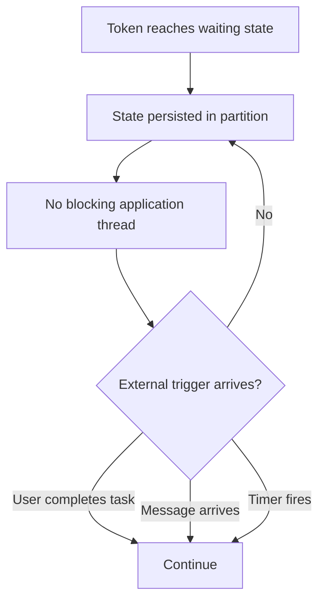

Ini yang membuat workflow engine cocok untuk long-running process.

---

## 9. Job Worker Model

Job worker adalah client eksternal yang mengambil job dari Zeebe. Dalam Java, worker dapat dibuat dengan Camunda Java Client atau Spring Boot Starter.

Siklus sederhana:

1. Worker membuka subscription/activation untuk job type tertentu.
2. Zeebe memberikan job yang available.
3. Worker menjalankan business logic.
4. Worker menyelesaikan job dengan salah satu outcome:
   - complete job,
   - fail job,
   - throw BPMN error.

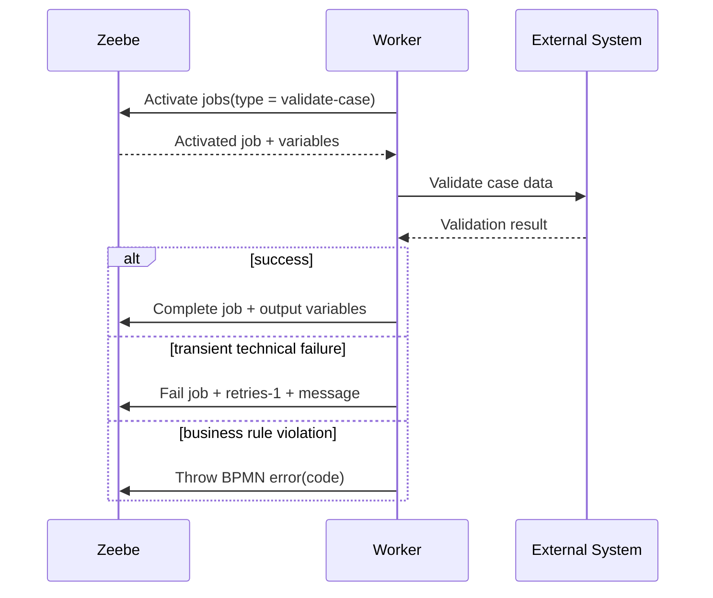

Rule penting:

> Worker harus didesain seperti distributed message consumer: idempotent, observable, retry-aware, timeout-aware, and contract-driven.

---

## 10. Worker Is Not The Process Owner

Worker bukan pemilik proses. Worker adalah adapter dari process orchestration menuju business capability.

| Salah | Benar |
|---|---|
| Worker menentukan seluruh alur proses | BPMN menentukan alur orchestration |
| Worker menyimpan process state sendiri | Zeebe menyimpan orchestration state |
| Worker mengambil data apa saja dari variable bebas | Worker punya input contract eksplisit |
| Worker swallow exception agar proses lanjut | Worker mengklasifikasikan failure secara sadar |
| Worker complete job setelah partial failure | Worker fail/error sesuai taxonomy |

Worker yang bagus biasanya kecil, spesifik, dan punya boundary jelas:

```java
@JobWorker(type = "validate-jurisdiction")
public Map<String, Object> validateJurisdiction(final ActivatedJob job) {
    var command = mapper.toCommand(job.getVariablesAsMap());
    var result = jurisdictionService.validate(command);
    return Map.of(
        "jurisdictionValid", result.valid(),
        "jurisdictionReason", result.reasonCode()
    );
}
```

Kode di atas hanya ilustrasi bentuk. Detail Spring Boot Starter, dependency, configuration, error handling, dan testing akan dibahas di part khusus.

---

## 11. Technical Failure vs Business Error vs Incident

Camunda 8 mendorong kita membedakan tiga hal yang sering dicampur.

| Kondisi | Contoh | Aksi worker | Efek process |
|---|---|---|---|
| Technical failure transient | HTTP 503, timeout, database unavailable | Fail job, decrement retry | Retry atau incident bila habis |
| Business error expected | Not eligible, jurisdiction invalid, duplicate case | Throw BPMN error | Masuk BPMN error boundary/path |
| Unexpected/operational stuck | Retry habis, invalid mapping, missing worker | Incident | Operator intervention |

Anti-pattern:

```text
Semua error dilempar sebagai RuntimeException dan berharap engine tahu maksud bisnisnya.
```

Better:

```text
Classify failure explicitly:
- transient technical -> fail job
- expected business outcome -> BPMN error or normal result path
- unrecoverable operational issue -> incident/runbook
```

---

## 12. Incident As Operational State

Incident bukan sekadar log error. Incident adalah state operasional yang menunjukkan process instance tidak bisa lanjut tanpa intervensi.

Dalam praktik, incident bisa muncul karena:

- Job retries habis.
- Worker tidak tersedia.
- Variable mapping gagal.
- Expression error.
- Message/contract mismatch.
- External dependency gagal terlalu lama.

Incident yang bagus harus punya:

- Error message bermakna.
- Owner team jelas.
- Runbook.
- Correlation ke service logs/traces.
- Severity policy.
- Retry/cancel/escalate procedure.

---

## 13. Exporters and History

Zeebe broker fokus pada active runtime processing. Untuk visibility, monitoring, audit, dan search, record diekspor oleh exporter ke sistem lain, misalnya storage yang dipakai Operate.

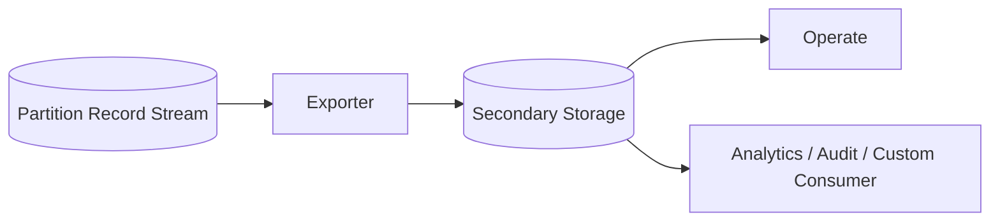

Konsekuensi penting:

1. Operational UI biasanya membaca derived/exported state, bukan langsung “database engine” seperti pola lama.
2. Export lag dapat membuat visibility sedikit tertinggal dari command processing.
3. Jangan membangun business invariant kritis dari secondary history store.
4. Untuk audit dan BI, pahami perbedaan runtime state vs exported historical projection.

---

## 14. Backpressure

Backpressure adalah mekanisme perlindungan ketika broker menerima request lebih cepat daripada kemampuan prosesnya. Dalam kondisi ini, client request dapat ditolak agar sistem tetap stabil.

Mental model:

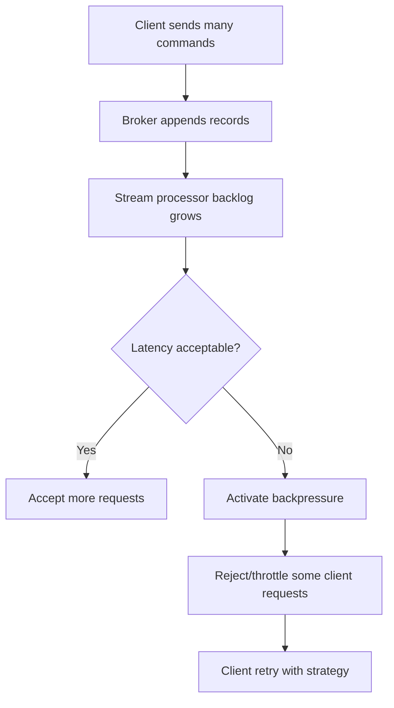

Engineering consequences:

- Backpressure bukan bug; itu sinyal kapasitas.
- Client harus menangani resource exhausted/retryable failure.
- Retry tanpa jitter bisa memperparah load.
- Complete/fail job path sangat penting karena membantu mengosongkan active work.
- Scaling worker saja tidak selalu menyelesaikan backpressure; bottleneck bisa di broker/partition/exporter/service eksternal.

---

## 15. Process Instance Creation Semantics

Process instance bisa dibuat beberapa cara:

1. Explicit command: create process instance.
2. Message start event.
3. Timer start event.

Asynchronous creation berarti response bisa dikembalikan sebelum seluruh proses selesai. Untuk short-running process, ada mode create-and-await-result, tetapi ini harus dipakai hati-hati.

Risk utama create-and-await-result:

- Client timeout tidak berarti process gagal.
- Client retry bisa membuat instance baru bila tidak ada uniqueness/idempotency guard.
- Process yang punya side effect tidak boleh dianggap seperti local function call.

Rule praktis:

> Treat process start as command submission, not as synchronous method invocation, unless the process is intentionally short, idempotent, and failure-designed.

---

## 16. Business ID and Domain Correlation

Camunda 8 menyediakan business ID untuk mengaitkan process instance dengan domain identifier seperti case number, order ID, ticket ID, atau enforcement case reference.

Untuk regulatory systems, business ID sangat penting karena operator biasanya tidak mencari `processInstanceKey`; mereka mencari:

- case number,
- license number,
- organization ID,
- violation ID,
- respondent ID,
- appeal reference.

Namun business ID bukan pengganti domain database. Ia adalah pointer/correlation handle untuk observability dan lookup.

Pattern:

```text
businessId = enforcementCaseNumber
variables.caseId = UUID internal domain aggregate
variables.caseType = "LICENSE_VIOLATION"
variables.riskBand = "HIGH"
```

Jangan:

```text
businessId = seluruh JSON case
```

---

## 17. Why ACID Thinking Breaks

Dalam aplikasi monolitik, kita sering berpikir:

```text
begin transaction
  update database
  complete workflow step
commit
```

Di Camunda 8 distributed model, worker dan Zeebe tidak berada dalam satu local ACID transaction. Worker mungkin:

1. Mengambil job.
2. Memanggil external API.
3. External API berhasil.
4. Worker crash sebelum complete job.
5. Zeebe melihat job timeout/retry.
6. Worker lain mengambil job yang sama.
7. External API dipanggil lagi.

Itulah mengapa idempotency bukan enhancement; idempotency adalah invariant.

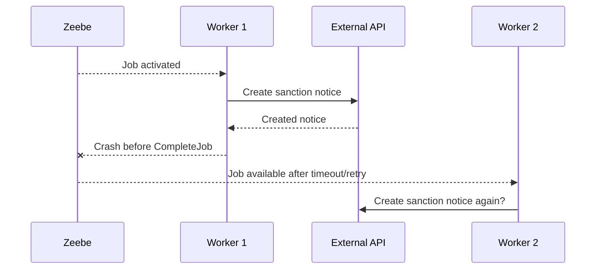

Tanpa idempotency key, sistem bisa membuat notice ganda.

Better:

```text
idempotencyKey = processInstanceKey + elementInstanceKey + businessAction
```

Atau, untuk domain-sensitive operation:

```text
idempotencyKey = caseId + actionType + semanticVersion
```

Pilihan key harus mengikuti invariant domain.

---

## 18. Exactly-Once Is The Wrong Default Assumption

Dalam distributed system, “exactly once” end-to-end biasanya adalah ilusi bila melibatkan external systems. Yang lebih sehat:

- Zeebe menjaga state orchestration dan job lifecycle.
- Worker melakukan operation secara idempotent.
- External system menerima idempotency key atau punya unique constraint.
- Completion ke Zeebe dilakukan setelah side effect aman.
- Duplicate attempts menghasilkan same outcome, bukan duplicate side effect.

Design target:

```text
At-least-once attempt + idempotent side effect + observable completion
```

---

## 19. Failure Model by Component

| Component | Failure | Efek | Mitigasi |
|---|---|---|---|
| Gateway | Unreachable | Client cannot send command | Retry, multiple gateways, LB |
| Broker leader | Node down | Partition failover | Replication factor, HA topology |
| Partition hot | High latency/backpressure | Commands rejected/delayed | Key design, partition count, capacity test |
| Worker down | Jobs not completed | Timeout/retry/incident | Multiple workers, health checks, autoscaling |
| External API down | Job failure | Retry or incident | Circuit breaker, retry policy, fallback path |
| Exporter lag | UI/history delay | Operate may lag runtime | Monitor exporter, storage capacity |
| Operate down | Reduced visibility | Runtime may still run | Separate ops runbook, logs/metrics |
| Identity issue | Auth failure | Client/user cannot access | Credential rotation, least privilege, monitoring |

---

## 20. Design Invariants

Untuk production-grade Zeebe solution, pegang invariant berikut:

### Invariant 1 — Broker Does Not Own Business Logic

Semua business operation harus berada di worker/domain service.

### Invariant 2 — Process Variable Is Not Domain Database

Variable hanya menyimpan orchestration-relevant state.

### Invariant 3 — Worker Side Effects Must Be Idempotent

Retry dan duplicate execution harus aman.

### Invariant 4 — BPMN Error Is Business-Semantic

Jangan pakai BPMN error untuk HTTP timeout biasa.

### Invariant 5 — Incident Requires Ownership

Incident tanpa owner dan runbook adalah operational debt.

### Invariant 6 — Partition Hotspots Are Architecture Bugs

Jika key design membuat satu partition panas, itu bukan sekadar tuning problem.

### Invariant 7 — Visibility Store Is A Projection

Jangan memakai exported/history store sebagai source of truth untuk command-critical invariant.

---

## 21. Practical Architecture Patterns

### Pattern 1 — Thin Worker, Rich Domain Service

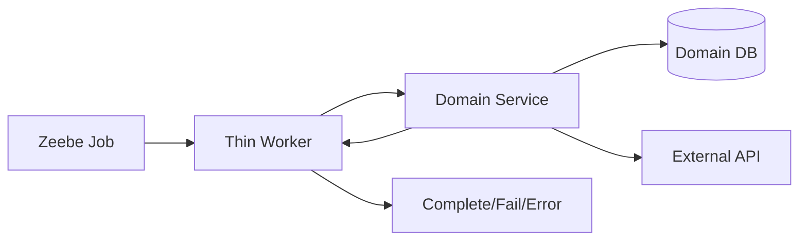

Worker responsibilities:

- Map variables to command DTO.
- Call domain service.
- Classify result/failure.
- Return output variables.
- Emit logs/metrics/traces.

Domain service responsibilities:

- Enforce invariants.
- Manage database transactions.
- Integrate external systems through adapters.
- Provide idempotency guarantees.

### Pattern 2 — Process As Explicit Lifecycle, Service As Invariant Owner

```text
BPMN: case is waiting for supervisor review
Domain DB: case entity, evidence, legal basis, party relationships
Worker: moves data/results between process and domain service
```

### Pattern 3 — Event-Driven Start With Idempotent Guard

```text
Domain event: ComplaintAccepted(caseId)
Command: start process with businessId = caseNumber
Uniqueness: only one active root process for businessId
Worker: all side effects keyed by caseId/action
```

---

## 22. Anti-Patterns

### Anti-Pattern 1 — Zeebe As Database

Symptoms:

- Huge variables.
- Entire aggregate JSON in process state.
- Sensitive documents in variables.
- Domain queries implemented by searching process variables.

Fix:

- Store domain data in domain DB/document store.
- Store IDs and orchestration-relevant summary in variables.
- Use business ID for correlation.

### Anti-Pattern 2 — Worker As God Service

Symptoms:

- One worker handles many unrelated job types.
- Worker reads arbitrary variables.
- Worker decides next process path secretly.
- BPMN becomes decorative.

Fix:

- One job type = one business capability boundary.
- BPMN owns visible flow.
- Worker returns explicit result variables or BPMN error.

### Anti-Pattern 3 — Retry Without Idempotency

Symptoms:

- Duplicate emails.
- Duplicate sanctions.
- Duplicate payment/refund.
- Duplicate external ticket.

Fix:

- Idempotency key.
- Unique constraints.
- External deduplication.
- Complete job only after durable side effect outcome.

### Anti-Pattern 4 — Business Error As Incident

Symptoms:

- Expected rejection creates incident.
- Operators resolve normal business outcome manually.
- BPMN hides business alternatives.

Fix:

- Model expected business alternative with gateway/result or BPMN error boundary.
- Reserve incident for operational intervention.

### Anti-Pattern 5 — Ignoring Backpressure

Symptoms:

- Clients retry immediately in tight loop.
- More workers are added blindly.
- Broker CPU/storage/exporter bottleneck ignored.

Fix:

- Exponential backoff + jitter.
- Load testing.
- Monitor broker and exporter metrics.
- Capacity planning per partition.

---

## 23. Java Engineer Implications

For Java engineer, Zeebe architecture changes how we code.

### 23.1 Client Lifecycle

Create and manage client as infrastructure, not per request object. Connection/authentication concerns belong in configuration.

### 23.2 DTO Boundary

Never pass raw variable map deep into domain logic.

Bad:

```java
jurisdictionService.validate(job.getVariablesAsMap());
```

Better:

```java
var command = jurisdictionMapper.from(job.getVariablesAsMap());
var result = jurisdictionService.validate(command);
return jurisdictionMapper.toVariables(result);
```

### 23.3 Error Classification

Bad:

```java
catch (Exception e) {
    throw new RuntimeException(e);
}
```

Better conceptually:

```java
try {
    var result = service.execute(command);
    return mapper.toVariables(result);
} catch (TransientDependencyException e) {
    failJobWithRetry(job, e);
} catch (BusinessRuleViolation e) {
    throwBpmnError(job, e.code(), e.message());
} catch (Exception e) {
    failJobWithoutHidingContext(job, e);
}
```

Implementation detail akan dibahas di Part 017 dan Part 018.

### 23.4 Observability

Setiap worker harus log minimal:

- job type,
- job key,
- process instance key,
- element id,
- business id/case id,
- idempotency key,
- external request id,
- outcome,
- duration,
- retry count.

---

## 24. Architecture Review Questions

Gunakan pertanyaan ini untuk review desain awal:

1. Job type apa saja yang ada dan siapa owner-nya?
2. Untuk setiap job type, apa input/output variable contract-nya?
3. Apa side effect setiap worker?
4. Apa idempotency key setiap side effect?
5. Apa retry policy setiap job?
6. Apa beda business error dan technical failure di proses ini?
7. Apa incident yang mungkin muncul dan siapa owner-nya?
8. Apa correlation key untuk message event?
9. Apakah correlation key menyebabkan hotspot?
10. Apa business ID process instance?
11. Data apa yang tidak boleh masuk variable?
12. Apa observability signal untuk stuck process?
13. Apa strategy bila worker deployment rollback?
14. Apa strategy bila BPMN v2 mengubah variable contract?
15. Apa yang terjadi bila Operate tidak tersedia?

---

## 25. Mini Case Study: Enforcement Case Intake

Bayangkan proses:

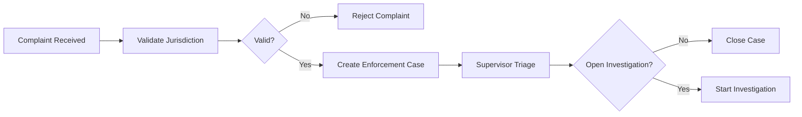

### Naive Design

- Store entire complaint in variables.
- Worker validates jurisdiction and creates case in same method.
- RuntimeException on all failure.
- Retry count default.
- No idempotency key.
- No business ID.
- No incident owner.

### Better Design

- businessId = complaintNumber or enforcementCaseNumber.
- variables contain complaintId, caseId, jurisdictionCode, riskBand.
- validate-jurisdiction worker is read-only/idempotent.
- create-case worker has idempotency key `complaintId:create-case:v1`.
- Invalid jurisdiction is business result, not incident.
- External API timeout is fail job with retry.
- Retry exhaustion creates incident owned by case-platform team.
- Supervisor triage is explicit user task.

---

## 26. Hands-On Exercise

Sebelum lanjut ke Part 003, lakukan latihan berikut.

### Exercise 1 — Draw The Request Path

Gambar sequence untuk:

1. Start process instance.
2. Activate service task.
3. Worker complete job.
4. Zeebe advance ke next element.

Gunakan komponen:

- Java Client.
- Gateway.
- Broker.
- Partition.
- Stream processor.
- Worker.

### Exercise 2 — Classify Failures

Untuk proses enforcement intake, klasifikasikan:

| Failure | Technical failure | Business error | Incident candidate | Reason |
|---|---:|---:|---:|---|
| External citizen registry timeout |  |  |  |  |
| Complaint outside jurisdiction |  |  |  |  |
| Missing required variable due to model bug |  |  |  |  |
| Duplicate complaint |  |  |  |  |
| Worker deployment missing job type |  |  |  |  |

### Exercise 3 — Partition Thinking

Pilih correlation key untuk message event `EvidenceSubmitted`.

Bandingkan opsi:

| Candidate key | Pros | Cons | Hotspot risk |
|---|---|---|---|
| tenantId | Easy | One big tenant may dominate | High |
| caseId | Natural case affinity | Must be available in event | Medium/Low |
| officerId | Useful for assignment | Not stable for case lifecycle | Medium |
| evidenceId | Unique | Hard to correlate waiting process | Low but wrong semantics |

### Exercise 4 — Idempotency Drill

Untuk worker `send-notice-of-violation`, jawab:

1. Apa external side effect-nya?
2. Apa yang terjadi bila worker crash setelah notice dikirim?
3. Apa idempotency key yang benar?
4. Di mana idempotency state disimpan?
5. Apa output variable setelah sukses?
6. Apa BPMN error yang mungkin expected?
7. Apa technical failure yang retryable?
8. Kapan incident dibuat?

---

## 27. Definition of Done

Part ini selesai bila kamu bisa:

- Menggambar arsitektur Zeebe dengan gateway, broker, partition, worker, exporter.
- Menjelaskan mengapa broker tidak menjalankan business logic.
- Menjelaskan partition sebagai event stream/shard.
- Menjelaskan command, event, dan rejection.
- Menjelaskan stream processor sebagai state machine executor.
- Menjelaskan mengapa waiting state tidak memakai blocking thread.
- Menjelaskan job worker lifecycle.
- Menjelaskan kenapa ACID thinking tidak cukup.
- Mengidentifikasi minimal 5 anti-pattern awal.
- Membuat failure model per component.

---

## 28. Source Notes

Referensi faktual utama:

- Zeebe architecture: `https://docs.camunda.io/docs/components/zeebe/technical-concepts/architecture/`
- Zeebe partitions: `https://docs.camunda.io/docs/components/zeebe/technical-concepts/partitions/`
- Zeebe internal processing: `https://docs.camunda.io/docs/components/zeebe/technical-concepts/internal-processing/`
- Camunda Java Client: `https://docs.camunda.io/docs/apis-tools/java-client/getting-started/`
- Job worker guide: `https://docs.camunda.io/docs/apis-tools/java-client/job-worker/`
- Problems and exceptions best practices: `https://docs.camunda.io/docs/components/best-practices/development/dealing-with-problems-and-exceptions/`
- Process instance creation: `https://docs.camunda.io/docs/components/concepts/process-instance-creation/`
- Camunda glossary/backpressure: `https://docs.camunda.io/docs/reference/glossary/`

---

## 29. Next Part

Part berikutnya membahas **Camunda 8 Platform Components**: Orchestration Cluster, Zeebe, Operate, Tasklist, Identity/Admin, Optimize, Connectors, Web Modeler, Console, SaaS vs Self-Managed, dan boundary runtime/visibility/management plane.
