------
title: Learn Java BPMN with Camunda 8 Zeebe - Part 003
description: Deep platform-level map of Camunda 8 components: Orchestration Cluster, Zeebe, Operate, Tasklist, Admin/Identity, APIs, Connectors, Optimize, Modeler, Console, storage roles, and responsibility boundaries.
series: learn-java-bpmn-camunda8-zeebe
seriesTitle: Learn Java BPMN with Camunda 8 Zeebe
order: 3
partTitle: Camunda 8 Platform Components
tags:
  - java
  - bpmn
  - camunda
  - zeebe
  - orchestration-cluster
  - operate
  - tasklist
  - identity
  - connectors
  - platform-architecture
  - series
date: 2026-06-28
---

# Part 003 — Camunda 8 Platform Components

> Goal part ini adalah membuat kamu bisa membaca Camunda 8 sebagai **platform orchestration**, bukan hanya Zeebe engine. Setelah part ini, kamu harus bisa menjawab: komponen mana yang mengeksekusi proses, komponen mana yang hanya memberi visibility, komponen mana yang mengelola akses, dan di mana Java application kamu masuk.

Camunda 8 sering disalahpahami karena orang datang dari Camunda 7 dengan mental model:

> “Ada satu process engine, ada database, lalu aplikasi Java menempel ke engine.”

Di Camunda 8, mental model yang lebih tepat adalah:

> “Ada orchestration runtime terdistribusi yang menjalankan process state, ada surface operasional untuk melihat dan mengelola runtime, ada API layer untuk integrasi, ada worker/connector di luar engine untuk menjalankan pekerjaan, dan ada platform plane untuk modeling, deployment, governance, analytics, dan identity.”

Kita tidak akan mengulang “apa itu BPMN”, “apa itu service task”, atau dasar Java integration yang sudah dibahas di seri lain. Fokus part ini adalah **peta komponen dan boundary tanggung jawab**.

---

## 1. Camunda 8 sebagai Platform, Bukan Hanya Engine

Camunda 8 punya beberapa lapisan konseptual:

1. **Design time**: tempat model proses, decision, form, dan deployment package disiapkan.
2. **Runtime execution**: tempat process instance benar-benar berjalan.
3. **Human work surface**: tempat manusia mengambil, mengklaim, dan menyelesaikan user task.
4. **Operational visibility**: tempat operator/debugger melihat instance, incident, variable, dan flow state.
5. **Integration execution**: tempat task eksternal diproses oleh worker atau connector.
6. **Security and access control**: tempat user, client, role, permission, dan machine access dikelola.
7. **Analytics and improvement**: tempat historical process data dianalisis untuk improvement.
8. **Deployment and management plane**: tempat cluster, environment, organization, dan lifecycle deployment dikelola.

Diagram sederhana:

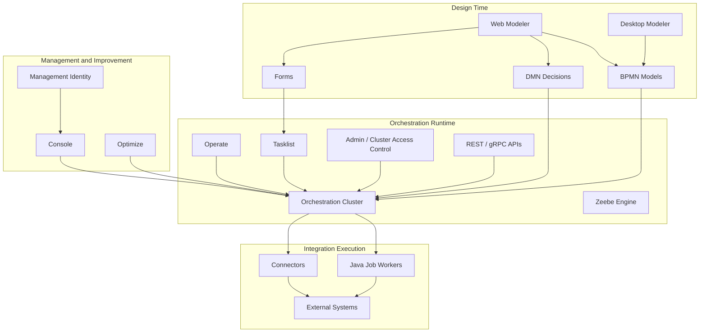

Arsitektur ini penting karena kegagalan desain biasanya terjadi saat boundary komponen dicampur.

Contoh kesalahan umum:

- menganggap Operate sebagai primary source of truth process state;
- menaruh business logic di form;
- membuat worker bergantung pada detail UI Tasklist;
- menganggap Optimize sebagai operational debugger;
- memperlakukan Console sebagai runtime API;
- menganggap process variable sebagai database domain utama;
- menyamakan Admin/Identity runtime dengan identity management seluruh perusahaan.

---

## 2. Orchestration Cluster: Core Runtime Camunda 8

Dalam Camunda 8 modern, konsep pusatnya adalah **Orchestration Cluster**.

Secara fungsional, Orchestration Cluster adalah core runtime yang mencakup:

- **Zeebe** sebagai workflow engine;
- **Operate** untuk monitoring dan troubleshooting process instance;
- **Tasklist** untuk interaksi user task;
- **Admin / integrated authentication and authorization** untuk akses terhadap resource cluster;
- **APIs** untuk interaksi programatik dengan runtime.

Mulai Camunda 8.8, Camunda melakukan konsolidasi arsitektur: komponen core seperti Zeebe, Operate, Tasklist, dan Identity/Admin dikonsolidasikan ke dalam Orchestration Cluster sebagai unit deployment tunggal pada arsitektur baru. Dampaknya besar: deployment, konfigurasi, scaling, API access, dan security boundary harus dibaca dengan model baru, bukan sekadar “beberapa aplikasi Spring Boot terpisah”.

Mental model:

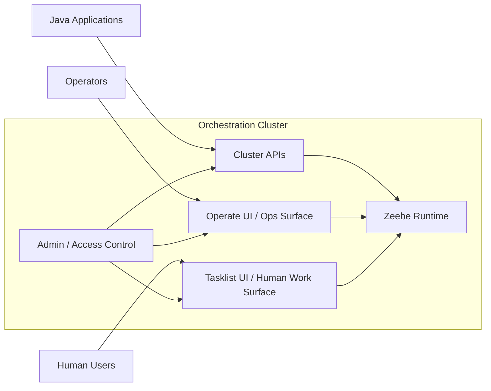

Hal yang harus diingat:

- Zeebe adalah execution core.
- Operate dan Tasklist adalah surface di atas runtime.
- Admin/access control mengatur siapa boleh melakukan apa.
- API adalah pintu integrasi programatik.
- Java worker bukan bagian internal engine; worker berada di luar dan mengambil job dari runtime.

---

## 3. Zeebe: Execution Engine

Zeebe adalah komponen yang benar-benar menjalankan process instance.

Tugas Zeebe:

- menerima deployment BPMN/DMN/form resource yang relevan;
- membuat process instance;
- memproses BPMN token flow;
- membuat job untuk service task;
- menerima completion/failure/error command dari worker;
- memproses message correlation;
- memproses timer;
- membuat incident ketika execution tidak bisa lanjut;
- menyimpan event stream dan runtime state;
- menyediakan data runtime untuk API dan exporter/visibility layer.

Zeebe tidak bertugas:

- menjalankan business logic Java langsung di thread engine;
- memanggil database domain kamu secara embedded;
- menjadi UI untuk human task;
- menjadi analytics warehouse;
- menggantikan semua microservice kamu;
- menyimpan seluruh object graph domain aplikasi.

### 3.1 Zeebe sebagai state machine runtime

Zeebe memproses command menjadi event/rejection. Jika command valid, state berubah dan event tercatat. Jika command tidak valid, command ditolak.

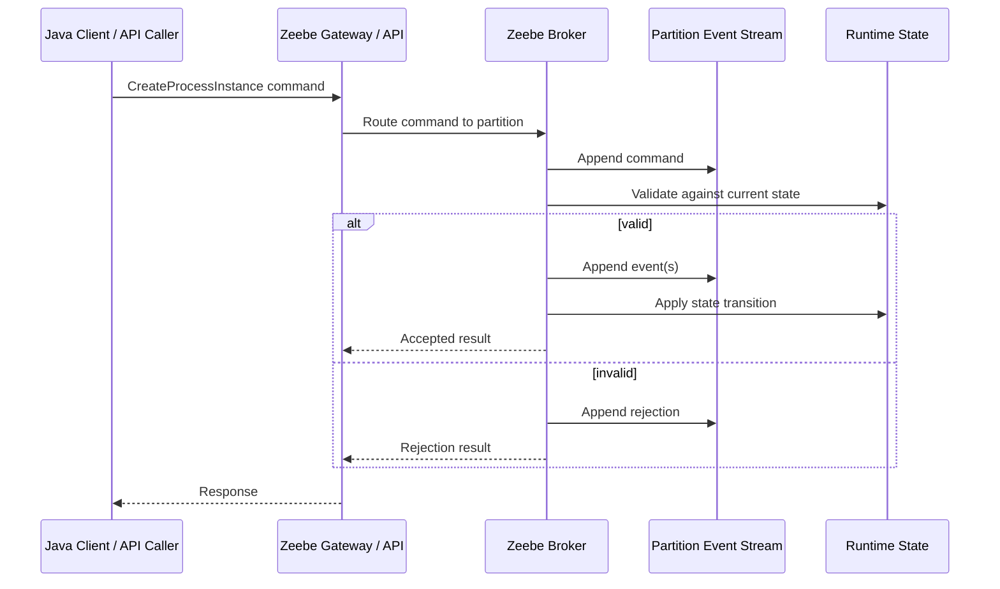

Implikasi engineering:

- process progress bukan “method call berhasil”; progress adalah hasil command yang berhasil diproses;
- retry harus diasumsikan mungkin;
- duplicate command harus dipertimbangkan;
- external side effect harus idempotent;
- worker harus tahan terhadap timeout, duplicate activation, dan partial failure;
- observability harus mengikuti process instance, job, dan business correlation id.

---

## 4. Gateway: Entry Point ke Zeebe Runtime

Gateway adalah pintu masuk client ke Zeebe.

Tugas gateway:

- menerima request dari client;
- melakukan routing command ke broker/partition yang tepat;
- menjaga abstraction agar client tidak perlu tahu topology broker detail;
- menyediakan API entry point untuk aplikasi eksternal.

Gateway bukan tempat business logic.

Anti-pattern:

```text
Client -> Gateway -> berharap gateway menyimpan session/user state/domain cache
```

Gateway harus dipahami sebagai **routing/API boundary**, bukan application server. Jika kamu butuh business transaction, validation kompleks, authorization domain, rate limiting domain, atau enrichment, tempatnya adalah application service milik kamu, bukan gateway.

Pola yang lebih sehat:

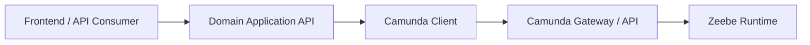

Kenapa tidak langsung dari frontend ke Camunda?

Karena process orchestration command biasanya perlu:

- authorization domain;
- request validation;
- idempotency key;
- audit event;
- correlation id;
- mapping dari external DTO ke process variable contract;
- rejection handling;
- business command policy.

---

## 5. Broker, Partition, dan Runtime State

Zeebe broker memproses record pada partition. Partition adalah unit ordering dan distribusi state. Setiap partition punya stream dan state terkait.

Mental model:

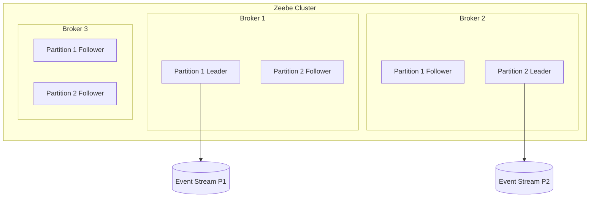

Konsekuensi:

- setiap process instance berada pada partition tertentu;
- ordering kuat berlaku dalam boundary partition tersebut;
- cluster scaling tidak sama dengan “semua instance diproses paralel tanpa batas”;
- hot partition bisa terjadi bila distribusi load/correlation tidak seimbang;
- deployment dan command routing perlu dipahami sebagai operation terhadap distributed runtime.

Untuk Java engineer, ini mengubah cara memikirkan “transaction”. Kamu tidak lagi berada dalam satu local transaction DB + engine. Kamu bekerja dengan distributed state transition.

---

## 6. Operate: Operational Visibility, Bukan Source of Business Truth

Operate adalah UI/surface untuk monitoring dan troubleshooting process instance yang berjalan di Zeebe.

Operate membantu:

- melihat process instance;
- melihat posisi token;
- melihat incident;
- melihat variable runtime;
- retry atau resolve incident;
- memahami kenapa instance stuck;
- melakukan operational debugging.

Operate bukan:

- domain database;
- reporting warehouse final;
- audit ledger legal utama;
- API business application;
- replacement untuk observability stack;
- tempat business users menjalankan task harian, kecuali role mereka memang operator proses.

Pola penggunaan sehat:

```text
Developer debugging       -> Operate
Production incident triage -> Operate
Human work assignment      -> Tasklist/custom task app
Business KPI trend         -> Optimize / BI pipeline
Legal audit record         -> domain audit/event store
```

### 6.1 Kapan Operate cukup?

Operate cukup ketika pertanyaanmu seperti:

- “Instance ini stuck di mana?”
- “Incident-nya apa?”
- “Variable mana yang menyebabkan expression gagal?”
- “Worker gagal berapa kali?”
- “Apakah message sudah correlated?”

Operate tidak cukup ketika pertanyaanmu seperti:

- “Berapa rata-rata waktu penyelesaian kasus per kantor wilayah selama 12 bulan?”
- “Apakah semua evidence retention policy terpenuhi?”
- “Apa legal chain of custody dokumen ini?”
- “Apa aggregate risk exposure dari semua kasus aktif?”

Pertanyaan seperti itu membutuhkan domain model, audit model, analytics model, atau governance model tambahan.

---

## 7. Tasklist: Human Work Surface

Tasklist adalah surface untuk user task: assign, claim, complete, dan interaksi manusia terhadap workflow.

Tasklist cocok untuk:

- human task standar;
- internal operations;
- approval flow sederhana sampai menengah;
- work queue;
- assignment dan completion;
- quick adoption tanpa membangun custom UI penuh.

Tasklist tidak selalu cukup untuk:

- case management UI kompleks;
- regulatory portal multi-actor;
- evidence-heavy workflow;
- advanced task prioritization;
- role-specific decision cockpit;
- offline review;
- document collaboration;
- deeply customized authorization;
- complex search/filtering by domain attributes.

Dalam sistem enterprise, sering ada dua pilihan:

### Opsi A — Pakai Tasklist langsung

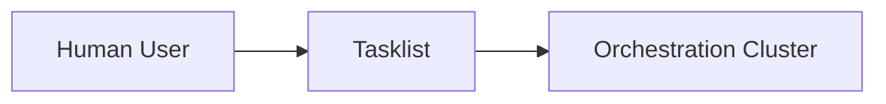

Cocok ketika:

- user internal;
- form sederhana;
- lifecycle task standar;
- tidak butuh domain UI khusus;
- time-to-market penting.

### Opsi B — Bangun custom task application

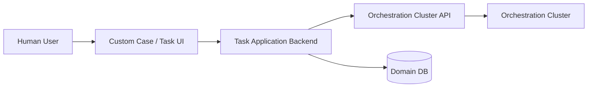

Cocok ketika:

- task perlu digabung dengan domain data besar;
- form punya aturan validasi kompleks;
- task assignment mengikuti organisasi kompleks;
- auditability tinggi;
- task search/filter harus berdasarkan domain fields;
- user journey lebih mirip case management daripada simple approval.

Rule of thumb:

> Tasklist adalah human task execution surface. Ia bukan otomatis menjadi full case management application.

---

## 8. Admin, Identity, dan Access Control

Camunda 8 punya beberapa area identity/access yang perlu dibedakan.

Pada Orchestration Cluster modern, Admin mengatur access control untuk resource runtime cluster: Zeebe, Operate, Tasklist, dan API cluster. Dalam self-managed architecture modern juga ada konsep Management Identity untuk platform components seperti Console, Web Modeler, dan Optimize.

Mental model:

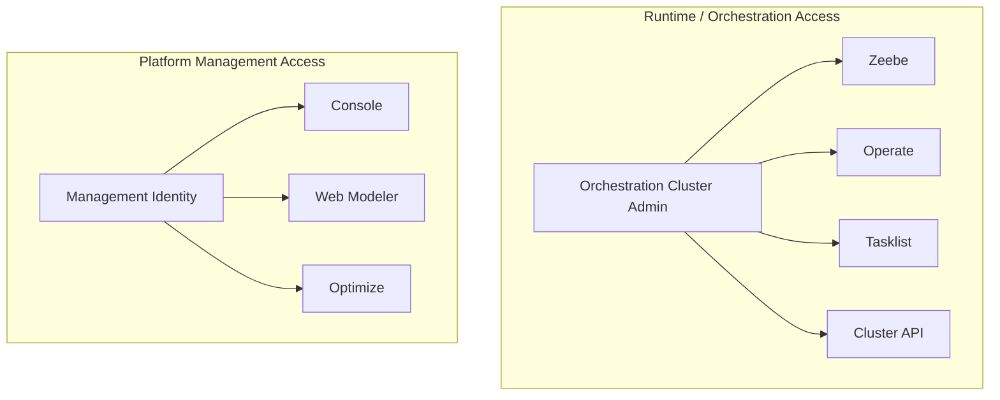

Hal yang sering keliru:

- mengira satu identity concept otomatis mencakup semua component dan semua deployment mode;
- menganggap user task authorization sama dengan domain authorization;
- memberi client credential terlalu luas;
- memakai satu machine client untuk semua environment;
- tidak memisahkan deployment permission dari runtime operation permission;
- tidak menyiapkan model permission untuk support engineer vs platform engineer vs business operator.

### 8.1 Runtime permission bukan domain permission

Misalnya user punya permission menyelesaikan user task di Camunda. Itu belum tentu berarti secara domain ia boleh menyetujui sanksi regulasi senilai besar.

Arsitektur defensible:

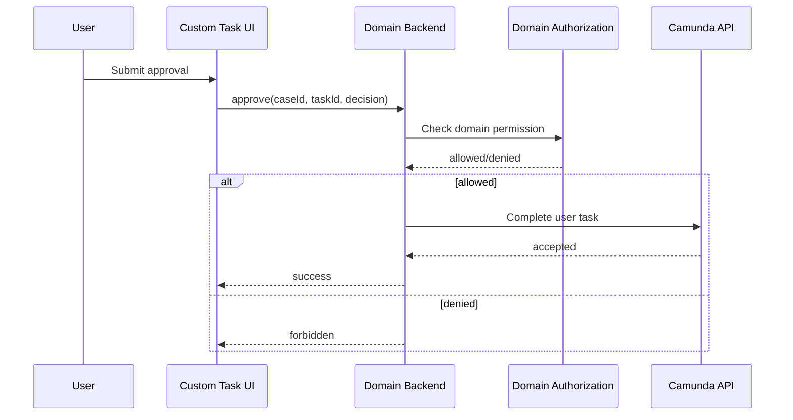

Domain authorization tetap harus berada di domain application jika konsekuensi bisnis/legal tinggi.

---

## 9. APIs: Programmatic Access Boundary

Camunda 8 exposes APIs untuk:

- deploy process/decision/form resources;
- start process instance;
- publish message;
- activate/complete/fail jobs;
- query/manage tasks;
- inspect/process operational data;
- manage runtime resources sesuai permission.

Dalam Java ecosystem, integrasi modern diarahkan lewat **Camunda Java Client**. Pada versi modern, Java client menyediakan akses ke Orchestration Cluster APIs dan menggantikan pola lama Zeebe-only client. Detail coding akan dibahas di part 015.

Untuk sekarang, pahami boundary-nya:

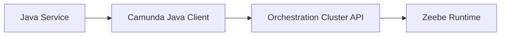

API bukan tempat untuk mengabaikan domain boundary. Sebaiknya application kamu membungkus Camunda API dalam service yang eksplisit:

```java
public interface EnforcementWorkflowPort {
    ProcessInstanceRef openCase(OpenCaseCommand command);
    void submitEvidence(SubmitEvidenceCommand command);
    void escalateCase(EscalateCaseCommand command);
    void completeReview(CompleteReviewCommand command);
}
```

Jangan biarkan seluruh codebase bebas memanggil Camunda client secara langsung tanpa abstraction. Jika semua class bisa start process, publish message, dan complete task sesuka hati, kamu kehilangan process governance.

---

## 10. Connectors: Integration as Managed Building Blocks

Connectors adalah cara untuk menghubungkan process ke external systems, applications, dan data tanpa selalu menulis custom Java worker untuk setiap integrasi.

Connectors cocok untuk:

- HTTP call sederhana;
- SaaS integration standar;
- prototyping;
- low-code integration;
- integration yang tidak membutuhkan logic domain kompleks;
- reusable integration template.

Custom Java worker lebih cocok ketika:

- logic butuh domain model kompleks;
- idempotency/transaction handling rumit;
- perlu library internal;
- perlu observability khusus;
- perlu performance tuning;
- perlu strict versioning dan testing;
- integrasi menyentuh system of record kritikal.

Comparison:

| Concern | Connector | Java Worker |
|---|---:|---:|
| Setup speed | High | Medium |
| Complex domain logic | Low/Medium | High |
| Testability with Java tooling | Medium | High |
| Governance | Medium/High if standardized | High if platform template exists |
| Debugging complex failures | Medium | High |
| Best for | Standard integration | Domain-grade side effects |

Rule:

> Use connectors for integration steps. Use workers for domain behavior.

Anti-pattern:

```text
BPMN + Connector chain becomes hidden application code.
```

Jika process model berisi 30 connector steps dengan transformation kompleks, kamu mungkin sedang membangun application logic di BPMN layer tanpa compiler, test suite, refactoring tools, dan ownership yang jelas.

---

## 11. Optimize: Analytics and Improvement

Optimize adalah komponen analytics/business intelligence untuk process improvement.

Optimize membantu menjawab:

- bottleneck proses;
- cycle time;
- throughput;
- SLA trends;
- variant analysis;
- operational dashboards;
- business process improvement.

Optimize bukan:

- incident debugger utama;
- domain data warehouse lengkap;
- legal audit store;
- replacement untuk BI enterprise jika data perlu join lintas banyak bounded context;
- runtime command API.

Pattern yang sehat:

```text
Operate  -> troubleshoot current process instance
Tasklist -> complete human work
Optimize -> understand historical process performance
Domain BI -> cross-domain business analytics
```

Untuk regulatory systems, Optimize bisa sangat berguna untuk melihat process performance, tetapi legal defensibility tetap butuh audit model domain yang eksplisit.

---

## 12. Web Modeler dan Desktop Modeler

Modeler adalah design-time tool untuk BPMN, DMN, dan forms.

### 12.1 Web Modeler

Cocok untuk:

- collaborative modeling;
- review bersama business/tech;
- version-aware design workflow;
- SaaS/platform-integrated modeling;
- modeling governance.

### 12.2 Desktop Modeler

Cocok untuk:

- local development;
- Git-based workflow;
- IDE-adjacent engineering;
- offline/controlled modeling;
- explicit file review lewat pull request.

Untuk engineering team, pola terbaik biasanya hybrid:

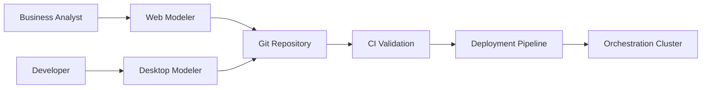

Yang penting bukan tool mana yang dipilih, tetapi governance:

- siapa boleh mengubah model;
- siapa review model;
- bagaimana BPMN diuji;
- bagaimana deployment dilakukan;
- bagaimana breaking change dicegah;
- bagaimana model version dipromosikan antar environment.

---

## 13. Console: Management Plane

Console berperan sebagai management plane untuk organization, cluster, client, dan deployment management tergantung mode/platform.

Jangan campur Console dengan runtime UI:

| Surface | Fokus |
|---|---|
| Console | manage platform/cluster/environment |
| Operate | troubleshoot process instance |
| Tasklist | complete human task |
| Optimize | analyze process performance |
| Modeler | design process/decision/form |

Kesalahan umum:

- memberi semua engineer akses admin console karena mereka butuh debug process;
- menggunakan console-level client credential untuk worker production;
- tidak memisahkan platform admin dan process operator;
- tidak punya environment promotion discipline.

Production posture yang sehat:

```text
Platform Admin     -> Console/admin-level permissions
Process Operator   -> Operate incident permissions
Business User      -> Tasklist task permissions
Deployment Bot     -> deploy-only permissions
Worker Application -> job/message/process permissions sesuai kebutuhan
Read-only Auditor  -> read-only process visibility
```

---

## 14. Storage Roles: Runtime State vs Visibility Data

Camunda 8 memisahkan runtime execution data dari data operational/analytical. Ini sangat penting.

Simplified model:

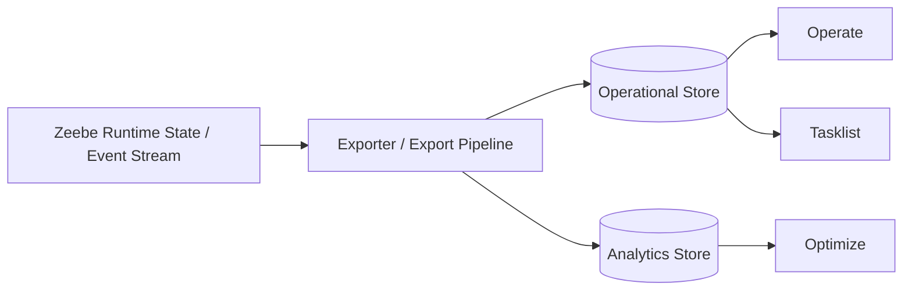

Apa artinya?

- Zeebe state adalah execution-critical.
- Visibility store membantu UI/query/debugging.
- Analytics store membantu insight historical.
- Data di UI bukan alasan untuk mengabaikan domain audit.
- Latency/export lag bisa mempengaruhi visibility, bukan selalu execution.

### 14.1 Implication for application design

Jangan mendesain application flow seperti ini:

```text
Start process -> immediately query Operate -> assume source of truth -> update domain state
```

Lebih aman:

```text
Application command -> start process -> persist own command/audit state -> observe process events asynchronously if needed
```

Jika UI perlu menampilkan status kasus, pertimbangkan domain projection sendiri:

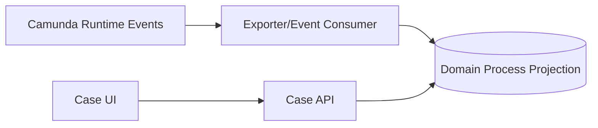

Untuk sistem enforcement/regulatory, projection ini sering lebih defensible daripada langsung menampilkan semua dari Operate, karena:

- field bisa disesuaikan domain;
- audit dan retention bisa dikontrol;
- access control domain bisa diterapkan;
- data bisa digabung dengan case, party, evidence, sanction, appeal.

---

## 15. Where Your Java Application Fits

Dalam Camunda 8, Java application kamu biasanya masuk dalam beberapa role:

### 15.1 Process API Application

Application yang menerima request dari luar dan menerjemahkannya menjadi process command.

Contoh:

```text
POST /cases/{caseId}/submit-evidence
  -> validate domain state
  -> persist evidence metadata
  -> publish Camunda message EvidenceSubmitted
```

### 15.2 Job Worker Application

Application yang mengambil job dari Zeebe dan mengeksekusi work.

Contoh:

```text
Job type: calculate-risk-score
  -> load case facts
  -> calculate risk
  -> persist risk assessment
  -> complete job with result summary
```

### 15.3 Task Backend Application

Application yang membungkus user task completion dengan domain behavior.

Contoh:

```text
POST /tasks/{taskId}/approve-sanction
  -> check domain authorization
  -> validate sanction decision
  -> persist decision audit
  -> complete Camunda user task
```

### 15.4 Process Projection Consumer

Application yang membaca event/export/projection dan membangun read model domain.

Contoh:

```text
Camunda instance advanced to EnforcementNoticeIssued
  -> update case process status projection
  -> emit notification event
```

### 15.5 Deployment Automation

CI/CD job yang melakukan deployment BPMN/DMN/form resource.

Contoh:

```text
main branch merge
  -> validate BPMN
  -> run process tests
  -> deploy to staging
  -> run smoke workflow
  -> promote to production
```

---

## 16. Component Boundary Matrix

Gunakan matrix ini saat review desain.

| Need | Correct Component / Layer | Common Wrong Choice |
|---|---|---|
| Execute process instance | Zeebe | Operate |
| Inspect stuck process | Operate | Custom SQL/query hack |
| Complete human task | Tasklist or custom task app via API | Worker pretending to be human |
| Execute domain side effect | Java worker/domain service | BPMN expression/connector chain |
| Standard SaaS call | Connector | Custom worker for trivial call |
| Analyze cycle time | Optimize / BI | Operate screenshots |
| Manage cluster/platform | Console | Worker app config |
| Manage runtime permissions | Admin/access control | Domain database roles only |
| Enforce domain permission | Domain backend | Tasklist permission only |
| Store legal audit | Domain audit store | Process variables only |
| Debug worker failure | Worker logs/traces + Operate | BPMN diagram only |
| Share model with business | Web Modeler | Java code comments |
| Git-based model review | Desktop Modeler + Git | Manual upload only |

---

## 17. Platform Topology by Environment

Untuk belajar, local environment boleh sederhana. Untuk production, topology harus eksplisit.

### 17.1 Local learning topology

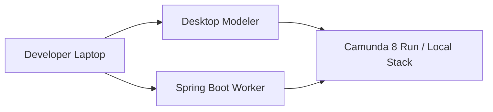

Fokus:

- modeling;
- deploy BPMN;
- start instance;
- implement worker;
- observe Operate/Tasklist;
- test behavior.

### 17.2 Team development topology

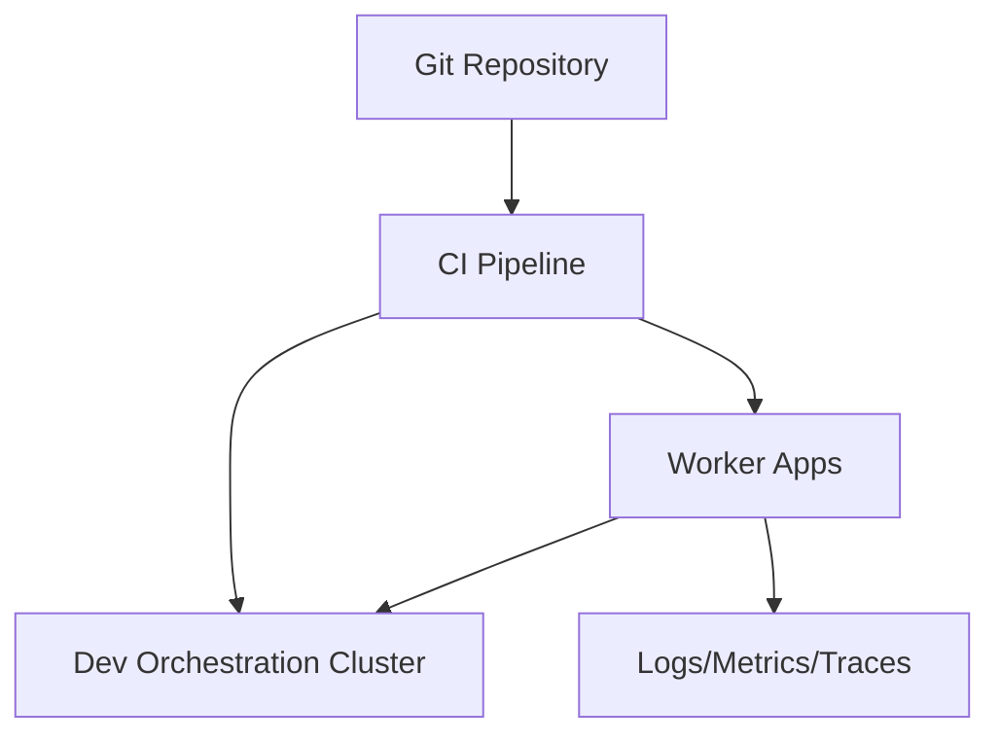

Fokus:

- repeatability;
- validation;
- shared environment;
- worker observability;
- integration tests.

### 17.3 Production topology

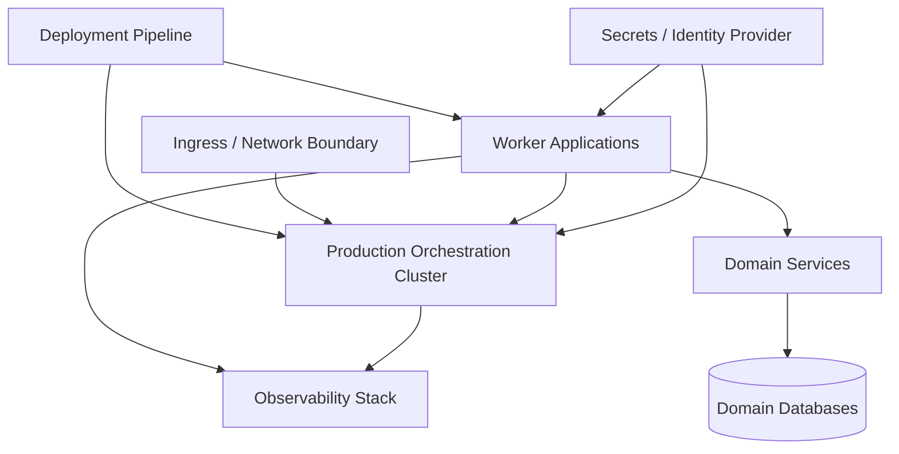

Fokus:

- separation of duties;
- least privilege;
- controlled deployment;
- resilience;
- observability;
- recovery;
- auditability.

---

## 18. SaaS vs Self-Managed Mental Model

Camunda 8 bisa digunakan sebagai SaaS atau Self-Managed. Perbedaannya bukan hanya “siapa menjalankan server”. Perbedaannya adalah ownership operational risk.

| Concern | SaaS | Self-Managed |
|---|---|---|
| Cluster operation | Mostly Camunda-managed | Your platform team |
| Infrastructure responsibility | Lower | Higher |
| Custom network/control | Limited/managed | High |
| Upgrade burden | Lower | Higher |
| Data residency/control | Depends plan/region | More direct control |
| Kubernetes complexity | Mostly hidden | Your responsibility |
| Enterprise integration | Needs secure connectivity | Fully controllable |

Untuk engineer, pertanyaan utamanya:

```text
Apakah organisasi ingin membeli orchestration capability,
atau ingin mengoperasikan orchestration platform sendiri?
```

SaaS cocok ketika:

- ingin fokus pada process application;
- platform ops capacity terbatas;
- managed service acceptable;
- compliance/data residency cocok.

Self-Managed cocok ketika:

- ada requirement hosting internal/on-prem;
- network integration kompleks;
- platform engineering kuat;
- regulatory constraints memaksa kontrol penuh;
- deployment/upgrade lifecycle harus dikontrol internal.

---

## 19. Production Ownership Model

Komponen banyak berarti ownership harus jelas.

Minimal ownership map:

| Area | Primary Owner | Secondary Owner |
|---|---|---|
| BPMN model correctness | Process engineering team | Domain architects |
| Java workers | Service owning team | Platform team |
| Orchestration cluster | Platform/SRE | Vendor/Camunda support |
| Access control | Platform/Security | Application owners |
| Task UX | Product/application team | Process team |
| Incidents | Ops + service owner | Platform team |
| BPMN deployment pipeline | Platform + owning team | QA |
| Migration governance | Architecture group | Delivery teams |
| Audit/legal defensibility | Domain/compliance owner | Engineering |

Anti-pattern:

> “Camunda team owns everything that happens in a process.”

Lebih sehat:

> Platform team owns platform capability. Process/application teams own process correctness and worker behavior. Domain teams own legal/business correctness.

---

## 20. Failure Mode by Component

Top 1% engineer tidak hanya tahu komponen. Ia tahu bagaimana komponen gagal.

| Component | Failure Mode | User-visible Symptom | Engineering Response |
|---|---|---|---|
| Zeebe broker | partition unavailable, processing lag | process commands slow/fail | check cluster health, partition leadership, resource pressure |
| Gateway/API | network/auth/routing failure | client cannot start/complete/publish | retry with backoff, inspect ingress/auth, client config |
| Worker app | exception, timeout, duplicate side effect | job retries, incident, external inconsistency | idempotency, logs, traces, fail/error correctly |
| Operate | visibility lag/unavailable | cannot inspect instances | separate execution health from UI health |
| Tasklist | task UI unavailable | users cannot complete tasks | fallback/custom task API strategy if critical |
| Identity/Admin | auth failure | users/clients denied | token/client/permission diagnosis |
| Connector runtime | integration failure | connector task fails | inspect connector logs/config/secrets |
| Optimize | reporting lag | dashboard stale | do not confuse with runtime outage |
| Modeler | design/deploy blocked | cannot publish new model | Git/CI fallback if required |

Key invariant:

> UI unavailability is not always runtime unavailability. Worker failure is not always engine failure. Analytics lag is not process failure.

---

## 21. Component Selection Heuristics

Gunakan heuristics ini saat desain.

### 21.1 Should this be BPMN?

Use BPMN if:

- lifecycle spans multiple steps/actors/systems;
- visibility matters;
- retry/escalation/timeout matters;
- business stakeholders must understand flow;
- process state is long-running;
- auditability of path matters.

Avoid BPMN if:

- logic is purely algorithmic;
- execution is synchronous and local;
- no lifecycle/state visibility needed;
- flow changes rarely and is better as code;
- performance requires tight in-memory loop.

### 21.2 Should this be worker or connector?

Use worker if:

- domain logic involved;
- side effect must be idempotent;
- testing important;
- data access complex;
- observability deep;
- security and compliance high.

Use connector if:

- integration is simple;
- behavior is standardized;
- speed matters more than custom control;
- low-code maintainability is desired.

### 21.3 Should this use Tasklist or custom UI?

Use Tasklist if:

- task is simple;
- users are internal;
- UI customization is minimal;
- process-first workflow is acceptable.

Use custom UI if:

- user journey is domain-heavy;
- task must be shown with rich case context;
- authorization is complex;
- data editing/audit is sophisticated;
- UX is competitive/regulatory-critical.

---

## 22. Anti-Pattern Catalog: Component Confusion

### 22.1 Operate as Business Portal

Symptom:

- business users are told to use Operate to manage normal work.

Problem:

- Operate is designed for monitoring/troubleshooting, not domain UX.

Better:

- Tasklist or custom task/case app.

### 22.2 Tasklist as Domain Authorization Engine

Symptom:

- “If Tasklist lets user complete it, then domain approval is valid.”

Problem:

- runtime task permission is not equivalent to business/legal authorization.

Better:

- enforce domain authorization in backend before completing task.

### 22.3 Process Variables as Database

Symptom:

- full customer/case/document object stored as process variable and repeatedly mutated.

Problem:

- bloated runtime state, schema evolution pain, sensitive data risk.

Better:

- store identifiers and process-relevant facts; keep domain state in domain services.

### 22.4 Connector Spaghetti

Symptom:

- BPMN contains long chains of connectors with implicit transformation logic.

Problem:

- hidden application code, poor testing, weak ownership.

Better:

- move domain-grade logic to worker/service.

### 22.5 Console Permission Overreach

Symptom:

- broad admin permissions given to fix runtime tasks.

Problem:

- violates least privilege and auditability.

Better:

- separate platform admin, process operator, deployer, worker client, business user.

### 22.6 Modeler as Deployment Governance

Symptom:

- deployment done manually from modeler without CI validation.

Problem:

- no reproducibility, weak review, unclear rollback.

Better:

- Git + CI + deployment bot + versioned artifacts.

---

## 23. Applied Example: Regulatory Enforcement Platform

Misalnya kita membangun enforcement lifecycle:

1. Case opened.
2. Evidence collected.
3. Risk scored.
4. Investigator reviews.
5. Notice issued.
6. Entity responds.
7. Legal review.
8. Sanction approved.
9. Appeal window monitored.
10. Case closed or reopened.

Komponen yang sehat:

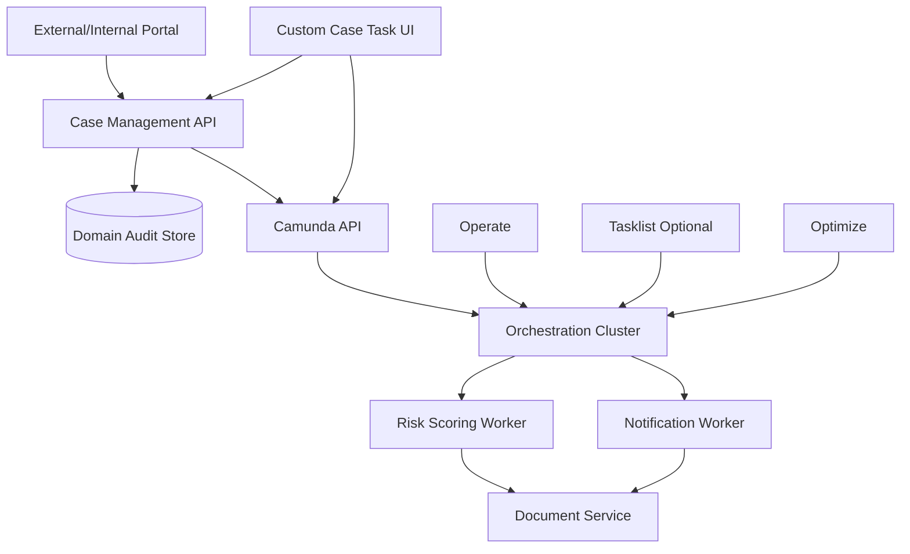

Design decision:

- BPMN owns lifecycle orchestration.
- Case API owns domain command and authorization.
- Workers own side effects.
- Domain services own records of legal significance.
- Operate owns operational troubleshooting.
- Optimize owns performance insight.
- Tasklist may be used for simple internal tasks, but custom UI likely needed for rich case work.

---

## 24. Review Checklist

Sebelum menyebut desain Camunda 8 “production-ready”, jawab pertanyaan ini:

### Runtime

- Komponen mana yang mengeksekusi process instance?
- Apakah process state dan domain state dipisahkan?
- Apakah variable payload minimal dan versionable?
- Apakah process lifecycle long-running didesain eksplisit?

### Integration

- Mana yang worker, mana yang connector?
- Apakah side effect idempotent?
- Apakah worker contract stabil?
- Apakah error/failure/incident semantics jelas?

### Human workflow

- Apakah Tasklist cukup atau butuh custom UI?
- Apakah domain authorization diverifikasi sebelum complete task?
- Apakah audit decision disimpan di domain layer?

### Security

- Apakah machine client least privilege?
- Apakah deployment permission dipisah dari runtime permission?
- Apakah operator permission dipisah dari admin permission?

### Observability

- Apakah Operate digunakan untuk incident triage?
- Apakah worker logs/traces correlated dengan process instance?
- Apakah dashboard analytics tidak dipakai sebagai runtime truth?

### Governance

- Apakah BPMN masuk Git?
- Apakah model diuji sebelum deployment?
- Apakah versioning strategy jelas?
- Apakah ownership model jelas?

---

## 25. Kaufman Practice Drill

Latihan 90 menit untuk menguatkan skill part ini:

1. Gambar ulang arsitektur Camunda 8 dari memori.
2. Tandai komponen mana yang runtime, UI, integration, analytics, management, dan identity.
3. Ambil satu proses nyata dari pekerjaanmu.
4. Bagi komponen desainnya menjadi:
   - BPMN lifecycle;
   - worker side effects;
   - human task UI;
   - domain database;
   - audit store;
   - observability;
   - platform operations.
5. Tulis 10 hal yang tidak boleh disimpan di process variables.
6. Tulis 5 task yang cukup pakai Tasklist dan 5 task yang butuh custom UI.
7. Tulis permission model minimal untuk:
   - platform admin;
   - process operator;
   - business reviewer;
   - deployment bot;
   - worker client;
   - auditor.

Output latihan harus berupa satu diagram dan satu matrix ownership.

---

## 26. Key Takeaways

- Camunda 8 adalah orchestration platform, bukan hanya BPMN engine.
- Orchestration Cluster adalah core runtime modern yang mencakup Zeebe, Operate, Tasklist, Admin/access control, dan APIs.
- Zeebe menjalankan process instance; Operate memberi visibility; Tasklist menangani human work; Optimize memberi analytics; Console/Identity mengelola platform/access tergantung scope.
- Java worker berada di luar engine dan menjalankan side effect/domain work.
- Process variables bukan domain database.
- Runtime permission bukan domain authorization.
- UI unavailability tidak selalu berarti engine down.
- Analytics lag tidak selalu berarti process stuck.
- Production design membutuhkan boundary, ownership, security, observability, dan deployment governance.

---

## 27. Source Anchor Notes

Materi ini diselaraskan dengan dokumentasi resmi Camunda 8 tentang:

- Orchestration Cluster dan komponennya.
- Release notes Camunda 8.8 tentang konsolidasi arsitektur Orchestration Cluster.
- Camunda 8 concepts overview tentang separation runtime execution data vs analytical/operational data.
- Access control overview tentang Admin/Identity dan authorization Orchestration Cluster.
- Self-managed/reference architecture tentang komponen dan management identity.

