------
title: Learn Java BPMN with Camunda 8 Zeebe - Part 004
description: Deep mental shift from Camunda 7 to Camunda 8 Zeebe: embedded engine to remote orchestration cluster, JavaDelegate to job worker, transaction boundary redesign, incidents, variables, user tasks, and migration thinking.
series: learn-java-bpmn-camunda8-zeebe
seriesTitle: Learn Java BPMN with Camunda 8 Zeebe
order: 4
partTitle: Camunda 7 to Camunda 8 Thinking Shift
tags:
  - java
  - bpmn
  - camunda
  - camunda-7
  - camunda-8
  - zeebe
  - migration
  - job-worker
  - distributed-systems
  - series
date: 2026-06-28
---

# Part 004 — Camunda 7 to Camunda 8 Thinking Shift

> Goal part ini adalah memutus “Camunda 7 muscle memory” yang berbahaya saat masuk Camunda 8. Camunda 8 bukan Camunda 7 yang dibungkus cloud. Ia adalah runtime orchestration yang berbeda secara arsitektur, eksekusi, deployment, transaction boundary, dan integration model.

Kalimat paling penting:

> Migrasi dari Camunda 7 ke Camunda 8 adalah **perubahan mental model**, bukan hanya perubahan dependency Maven.

Jika kamu sudah menguasai Camunda 7, kamu punya advantage besar dalam BPMN thinking. Tapi kamu juga membawa beberapa kebiasaan yang bisa menjadi liability:

- berpikir engine embedded dalam aplikasi;
- menulis JavaDelegate sebagai bagian dari process execution transaction;
- membaca engine database sebagai sumber observability;
- mengandalkan synchronous call stack;
- menyimpan domain object besar di variables;
- mencampur process transaction dan domain transaction;
- memperlakukan BPMN sebagai extension langsung dari Java application.

Camunda 8 memaksa kita berpikir lebih eksplisit tentang distributed boundaries.

---

## 1. The Big Shift

Perbandingan ringkas:

| Dimension | Camunda 7 Mental Model | Camunda 8 Zeebe Mental Model |
|---|---|---|
| Runtime | Process engine sering embedded / dekat dengan app | Remote orchestration cluster |
| Execution | JavaDelegate/listener bisa dieksekusi dalam engine context | External job worker mengambil job |
| Transaction | Banyak flow dapat bergantung pada DB transaction lokal engine/app | Distributed command/event/job lifecycle |
| State | Relational engine DB sebagai state utama engine | Event stream + runtime state partitioned |
| Integration | Delegate, listener, external task | Job worker, connector, API |
| Client model | Engine API / REST / embedded services | Orchestration Cluster API / Java client |
| Failure | Java exception sering dekat dengan command transaction | Fail job, throw BPMN error, incident, retry |
| Scaling | Scale app/engine/database topology | Scale cluster, partitions, workers, APIs |
| Operations | Cockpit/Admin-style engine ops | Operate/Tasklist/Admin/Optimize/platform ops |
| Migration | Convert model/code sometimes possible | Redesign boundaries often required |

Diagram mental shift:

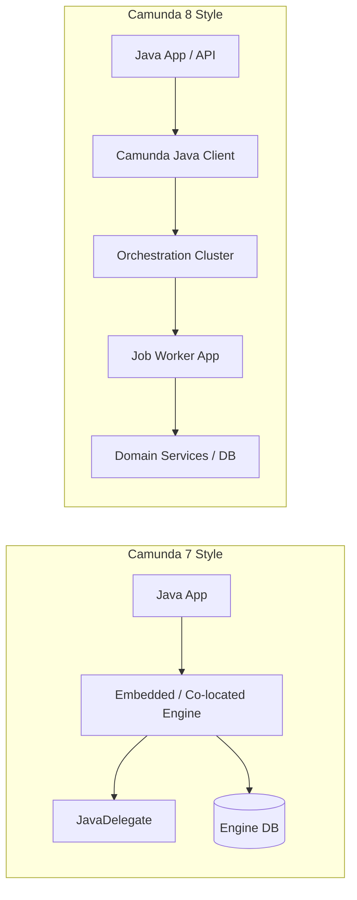

Kamu masih bisa membangun process application dengan Java. Tapi Java sekarang berada **di luar runtime engine** sebagai client, worker, backend, projection consumer, atau deployment automation.

---

## 2. Embedded Engine to Remote Orchestration Cluster

### 2.1 Camunda 7 habit

Dalam banyak instalasi Camunda 7, engine berada dalam aplikasi Java atau sangat dekat dengan aplikasi:

```text
Spring Boot App
  ├── REST Controller
  ├── Domain Service
  ├── Camunda Process Engine
  ├── JavaDelegate
  └── Shared Database / Transaction Manager
```

Kelebihan:

- mudah memanggil service lokal;
- mudah ikut transaksi lokal;
- debugging call stack terasa familiar;
- deployment app dan process bisa berdekatan.

Trade-off:

- tight coupling;
- engine DB menjadi pusat banyak concern;
- scaling process dan app sering bercampur;
- boundary ownership kabur;
- process execution bisa terlalu dekat dengan implementation detail.

### 2.2 Camunda 8 model

Camunda 8 menempatkan runtime orchestration sebagai remote cluster:

```text
Application Service
  └── Camunda Client/API call

Orchestration Cluster
  └── Process execution

Worker Application
  └── Activated jobs and side effects
```

Konsekuensi:

- setiap interaksi dengan process adalah network call;
- network failure harus dianggap normal;
- client retry harus dikontrol;
- command result bukan local transaction commit domain;
- process state dan domain state harus disinkronkan dengan pola eksplisit;
- observability harus correlation-aware.

### 2.3 New invariant

> Jangan desain Camunda 8 seolah-olah engine adalah library lokal. Desainlah seolah-olah engine adalah distributed orchestration service.

---

## 3. JavaDelegate to Job Worker

Ini perubahan paling terasa untuk Java developer.

### 3.1 Camunda 7 JavaDelegate style

```java
public class CheckEligibilityDelegate implements JavaDelegate {
    @Override
    public void execute(DelegateExecution execution) {
        String caseId = (String) execution.getVariable("caseId");
        boolean eligible = eligibilityService.check(caseId);
        execution.setVariable("eligible", eligible);
    }
}
```

Mental model:

- delegate dipanggil oleh engine;
- delegate punya akses ke execution context;
- variable dibaca/ditulis lewat execution;
- exception bisa mempengaruhi transaction;
- service lokal bisa langsung dipanggil.

### 3.2 Camunda 8 worker style

Pseudo-code conceptual:

```java
@JobWorker(type = "check-eligibility")
public Map<String, Object> checkEligibility(final ActivatedJob job) {
    String caseId = (String) job.getVariablesAsMap().get("caseId");
    boolean eligible = eligibilityService.check(caseId);

    return Map.of("eligible", eligible);
}
```

Mental model:

- Zeebe membuat job;
- worker mengaktifkan job dari luar;
- worker memproses job;
- worker menyelesaikan, menggagalkan, atau melempar BPMN error;
- variable update dikirim sebagai command ke runtime;
- retry/timeout/duplicate possibility harus dipertimbangkan.

### 3.3 Delegate-to-worker bukan copy-paste

Yang keliru:

```text
JavaDelegate.execute() body -> taruh semua ke @JobWorker method
```

Kadang cukup untuk demo. Tidak cukup untuk production.

Yang harus direview:

| Concern | Pertanyaan Migration |
|---|---|
| Transaction | Apakah delegate dulu bergantung pada transaksi engine/database lokal? |
| Service access | Apakah service yang dipanggil masih lokal atau perlu remote API? |
| Idempotency | Apakah side effect aman jika worker dipanggil ulang? |
| Variables | Apakah variable contract eksplisit dan kecil? |
| Error handling | Exception mana business error, mana technical failure? |
| Retry | Apakah retry engine aman untuk external side effect? |
| Security | Worker credential punya permission minimal? |
| Observability | Apakah logs/traces punya processInstanceKey/jobKey/correlationId? |

---

## 4. Transaction Boundary Redesign

Ini bagian paling penting untuk engineer senior.

### 4.1 Camunda 7 local transaction temptation

Di Camunda 7, pola seperti ini sering terjadi:

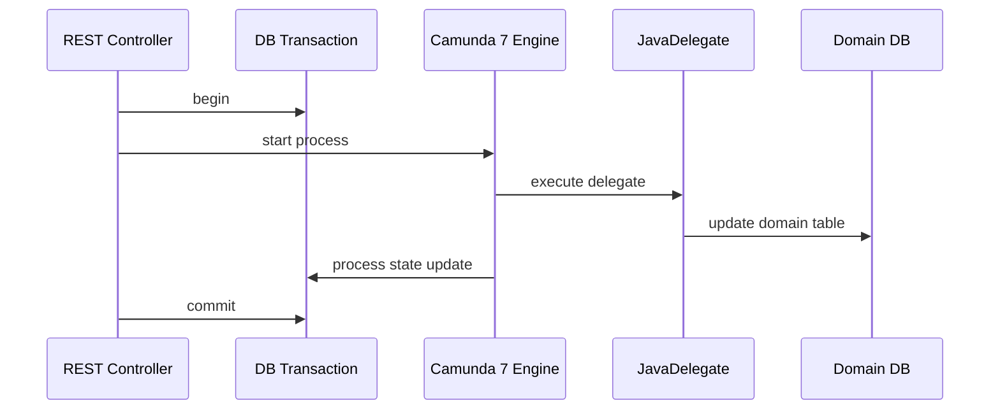

Ada variasi yang valid, tapi kebiasaan ini membuat orang berpikir:

> “Process state dan domain state bisa selalu commit bersama.”

Di Camunda 8, asumsi itu tidak sehat.

### 4.2 Camunda 8 distributed boundary

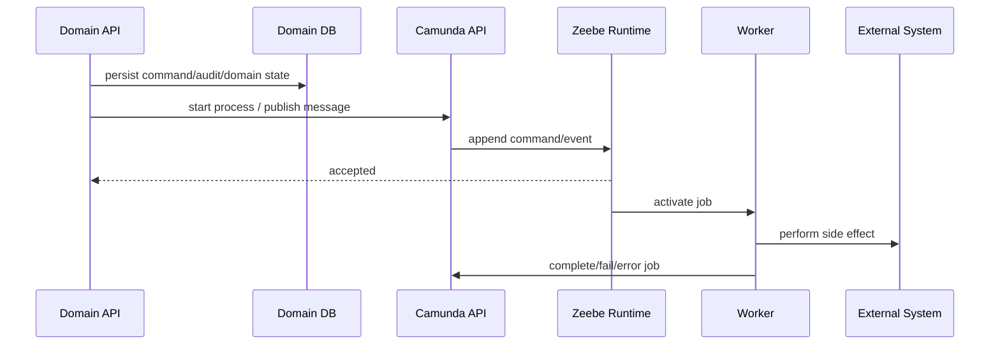

Tidak ada satu ACID transaction yang mencakup:

- domain DB update;
- Camunda process command;
- worker side effect;
- external system call;
- task completion;
- message publish.

Maka kamu butuh pattern seperti:

- transactional outbox;
- idempotency key;
- command log;
- process projection;
- compensating action;
- reconciliation job;
- explicit recovery workflow.

### 4.3 Design invariant

> Di Camunda 8, consistency adalah desain arsitektur, bukan efek samping dari shared transaction manager.

---

## 5. Synchronous Call Stack to Asynchronous Progress

### 5.1 Old instinct

```text
startProcessInstance()
  -> delegate A runs
  -> delegate B runs
  -> process reaches wait state
  -> method returns
```

Di Camunda 7, beberapa execution path terasa synchronous karena engine dan delegate berada dalam call stack yang sama.

### 5.2 Zeebe instinct

```text
send command
  -> runtime accepts command
  -> stream processor advances state
  -> job created
  -> worker eventually activates job
  -> worker eventually completes/fails/errors
  -> process eventually advances
```

Kata “eventually” bukan kelemahan. Itu realitas distributed orchestration.

Sequence:

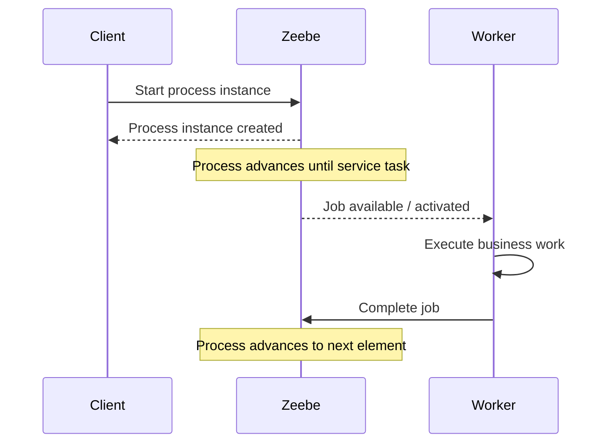

Client tidak boleh mengasumsikan semua task downstream selesai saat start process response diterima.

---

## 6. Exception to Failure/Error/Incident Taxonomy

Camunda 7 developer sering membawa kebiasaan:

```java
throw new RuntimeException("something failed");
```

Di Camunda 8, kamu harus membedakan:

1. **Technical failure**: worker tidak bisa menyelesaikan job karena masalah teknis sementara atau retryable.
2. **Business error**: proses harus mengambil path bisnis alternatif yang dimodelkan dengan BPMN error.
3. **Incident**: runtime tidak bisa melanjutkan execution tanpa intervensi atau perbaikan.
4. **Rejection**: command tidak valid terhadap state saat ini.

Matrix:

| Situation | Camunda 8 Response | BPMN Impact |
|---|---|---|
| Downstream API timeout | fail job, retry | stay on task until retry exhausted |
| Invalid business eligibility | throw BPMN error | follow boundary/error event path |
| Missing required variable due to bug | fail job or incident | operator/developer fix needed |
| Complete already-completed job | rejection/ignored by client handling | no business path |
| Fraud detected | BPMN error or explicit process variable + gateway | modeled path |
| Non-retryable integration config error | fail with low/no retries or incident | needs ops fix |

### 6.1 Anti-pattern: business outcome as technical failure

Bad:

```text
Customer not eligible -> fail job -> incident appears
```

Problem:

- not eligible is not an operational failure;
- operator sees false incident;
- SLA/incident metrics polluted;
- BPMN hides valid business path.

Better:

```text
Customer not eligible -> BPMN error / modeled gateway path -> process follows rejection/alternative path
```

### 6.2 Anti-pattern: technical outage as BPMN path

Bad:

```text
Payment API timeout -> BPMN error -> process goes to manual rejection
```

Problem:

- temporary outage becomes business decision;
- process path lies;
- recovery is hard.

Better:

```text
Payment API timeout -> fail job with retry -> incident if exhausted
```

---

## 7. Variables: From Execution Context to Contract

### 7.1 Camunda 7 habit

```java
execution.setVariable("customer", customerEntity);
execution.setVariable("case", caseAggregate);
execution.setVariable("payload", hugeJson);
```

This habit is dangerous in Camunda 8.

Camunda 8 process variables should be treated as **process contract data**, not arbitrary Java heap serialization.

Good variable properties:

- JSON-compatible;
- small;
- explicit;
- versionable;
- process-relevant;
- safe to expose to operators with permission;
- not a replacement for domain tables;
- not a dumping ground for complete API responses.

### 7.2 Better variable model

Bad:

```json
{
  "case": {
    "id": "CASE-123",
    "documents": [ ... huge objects ... ],
    "parties": [ ... full PII ... ],
    "investigationHistory": [ ... large nested history ... ]
  }
}
```

Better:

```json
{
  "caseId": "CASE-123",
  "riskBand": "HIGH",
  "requiresLegalReview": true,
  "noticeDeadline": "2026-07-30",
  "schemaVersion": 3
}
```

Full details live in domain services:

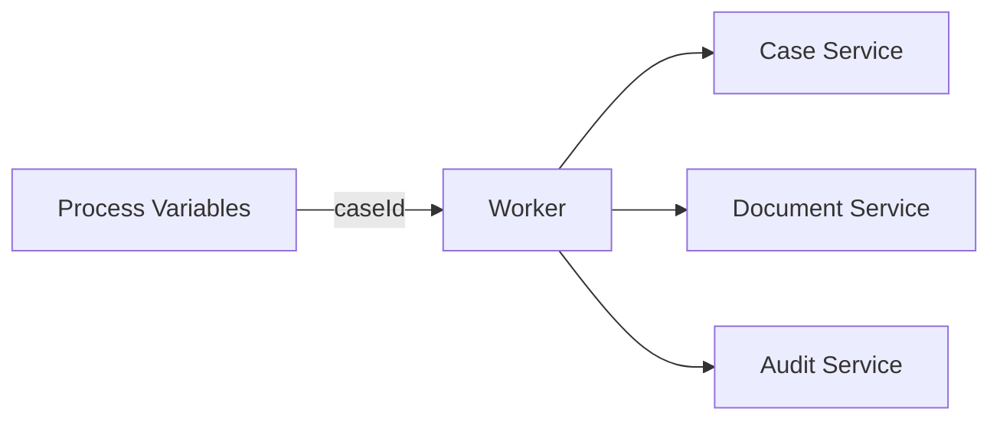

### 7.3 New invariant

> Variables should move the process forward. Domain databases should preserve the business truth.

---

## 8. Service Task Semantics: From Implementation Binding to Job Contract

In Camunda 7, service task often binds directly to Java implementation:

```xml
camunda:class="com.example.CheckEligibilityDelegate"
```

Or expression/delegate expression:

```xml
camunda:delegateExpression="${checkEligibilityDelegate}"
```

In Camunda 8, service task typically declares a job type contract:

```text
zeebe:taskDefinition type="check-eligibility"
```

Meaning:

- BPMN says: “this process needs work of type check-eligibility.”
- Worker says: “I can process jobs of type check-eligibility.”
- They meet through a contract, not direct class binding.

### 8.1 Contract surface

A job type contract includes:

- job type name;
- expected input variables;
- expected output variables;
- BPMN error codes that may be thrown;
- retry semantics;
- timeout expectations;
- idempotency behavior;
- ownership team;
- compatibility/versioning policy.

Example contract:

```yaml
jobType: calculate-risk-score
owner: enforcement-risk-team
inputs:
  caseId: string
  schemaVersion: integer
outputs:
  riskScore: number
  riskBand: LOW | MEDIUM | HIGH
businessErrors:
  - CASE_NOT_FOUND
  - INSUFFICIENT_EVIDENCE
technicalFailurePolicy:
  retries: 3
  retryBackoff: PT30S
idempotencyKey: processInstanceKey + jobType + caseId
```

This contract is more important than the Java annotation itself.

---

## 9. User Tasks: From Camunda 7 Assumptions to Camunda 8 Task Model

Camunda 7 user tasks often involved:

- task listeners;
- form keys;
- embedded/custom forms;
- identity links;
- engine task service;
- custom tasklist or built-in tasklist depending setup.

Camunda 8 user task model has evolved. Modern Camunda 8 has **Camunda user tasks** and Tasklist/API integration. Older job-based user task patterns should be treated carefully because platform recommendations evolve across versions.

Thinking shift:

| Concern | Camunda 7 Habit | Camunda 8 Thinking |
|---|---|---|
| User task API | Engine task service | Orchestration Cluster Task API / Tasklist |
| Form | Form key/custom embedded assumptions | Camunda Forms / linked forms / custom UI contract |
| Assignment | Identity links inside engine | Cluster task model + domain authorization if needed |
| Completion | Complete task in engine transaction | Complete task via API, often after domain validation |
| Task listener | Inline listener behavior | Worker/process/API/domain event patterns |

### 9.1 Critical shift for regulatory systems

Do not put high-stakes decision validity solely in task completion.

Bad:

```text
Task completed with variable approved=true -> sanction approved
```

Better:

```text
Custom backend validates authority, persists decision, records audit, then completes task with decision reference.
```

Sequence:

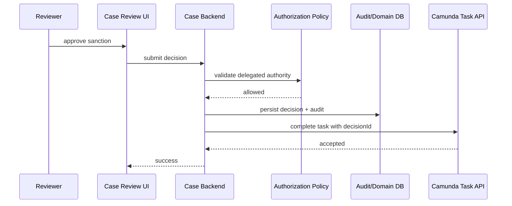

---

## 10. Process Instance State vs Case State

Camunda 7 projects often blur engine state and case state because engine DB is near the application.

Camunda 8 makes this separation explicit.

### 10.1 Process instance state

Owned by Camunda:

- current BPMN element;
- active jobs;
- timers;
- incidents;
- tokens;
- process variables;
- process lifecycle.

### 10.2 Case/domain state

Owned by your application:

- case metadata;
- party identity;
- evidence records;
- legal decisions;
- document retention;
- sanctions;
- appeal records;
- financial exposure;
- audit trail;
- permissions;
- reporting projections.

### 10.3 Good relationship

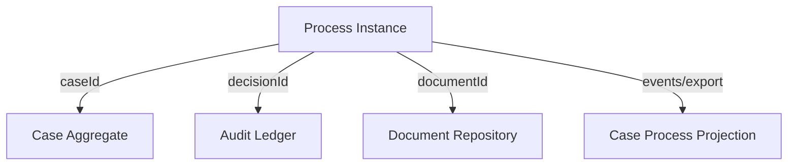

Invariant:

> Camunda knows where the process is. Your domain knows what the business facts mean.

---

## 11. Migration Is Not One Task

A serious Camunda 7 to 8 migration decomposes into multiple workstreams:

1. **Model conversion**: BPMN/DMN XML, namespaces, supported element compatibility.
2. **Code conversion**: JavaDelegate/listener/external task to worker/API model.
3. **Runtime architecture**: embedded engine to orchestration cluster.
4. **Transaction redesign**: local transaction to distributed consistency patterns.
5. **User task redesign**: Tasklist/API/custom UI/form migration.
6. **Data redesign**: variable model, domain DB boundary, audit/projected status.
7. **Security redesign**: client credentials, runtime permissions, domain authorization.
8. **Operations redesign**: Operate, metrics, logs, alerts, incident handling.
9. **Deployment redesign**: model deployment pipeline, versioning, rollback, promotion.
10. **Team ownership redesign**: platform vs process vs application vs compliance ownership.

Migration tool can help identify and convert parts of BPMN/DMN/code, but architecture still needs engineering judgment.

---

## 12. Migration Classification Matrix

Before migrating, classify each process.

| Process Type | Example | Migration Approach |
|---|---|---|
| Simple straight-through process | request -> service call -> done | likely convert + worker refactor |
| Delegate-heavy process | many JavaDelegates/listeners | code boundary redesign |
| Transaction-heavy process | engine and domain DB tightly coupled | architecture redesign |
| Human-task-heavy process | many forms/task listeners | task/form UX redesign |
| Case-management process | long-running, reopen, appeal, escalation | possible process decomposition |
| Legacy database-dependent process | SQL queries into engine/domain mixed | data model separation |
| External-task-based process | Camunda 7 external task workers | easier conceptual mapping to job workers |
| High-compliance process | audit/legal/regulatory | defensibility review required |

Rule:

> The more a Camunda 7 process depends on embedded engine semantics, the less it should be treated as mechanical migration.

---

## 13. Code Migration Patterns

### 13.1 JavaDelegate with pure computation

Camunda 7:

```java
public void execute(DelegateExecution execution) {
    int score = calculateScore(execution.getVariables());
    execution.setVariable("score", score);
}
```

Camunda 8 migration:

```java
@JobWorker(type = "calculate-score")
public Map<String, Object> calculateScore(ActivatedJob job) {
    int score = calculateScore(job.getVariablesAsMap());
    return Map.of("score", score);
}
```

Risk: low, if pure and deterministic.

### 13.2 JavaDelegate with external side effect

Camunda 7:

```java
public void execute(DelegateExecution execution) {
    paymentClient.charge(...);
    execution.setVariable("charged", true);
}
```

Camunda 8 migration needs:

- idempotency key;
- external call result persistence;
- retry policy;
- duplicate handling;
- compensation path if needed.

Better worker shape:

```java
@JobWorker(type = "charge-payment")
public Map<String, Object> chargePayment(ActivatedJob job) {
    ChargeCommand command = mapper.fromJob(job);
    ChargeResult result = paymentService.chargeIdempotently(command);
    return Map.of("paymentId", result.paymentId(), "paymentStatus", result.status());
}
```

### 13.3 Delegate using internal engine API

Risk: high.

Examples:

- querying executions/tasks directly;
- modifying process instance internally;
- relying on engine command context;
- using process engine services inside delegate;
- manipulating history/runtime tables indirectly.

Migration approach:

- identify intent;
- replace with explicit Camunda 8 API if valid;
- move domain query to domain DB;
- redesign process if it depends on engine internals.

---

## 14. BPMN Migration Patterns

### 14.1 Class-bound service task to job type

Before:

```text
Service Task -> camunda:class="CheckEligibilityDelegate"
```

After:

```text
Service Task -> zeebe task type: check-eligibility
```

### 14.2 Delegate expression to worker routing

Before:

```text
camunda:delegateExpression="${riskDelegate}"
```

After:

```text
zeebe task type: calculate-risk-score
```

### 14.3 Task listener to explicit process step

Before:

```text
User Task complete listener -> update audit, notify user, change status
```

After options:

1. backend validates and persists before complete;
2. explicit service task after user task;
3. event-driven projection;
4. worker triggered by process path.

Better:

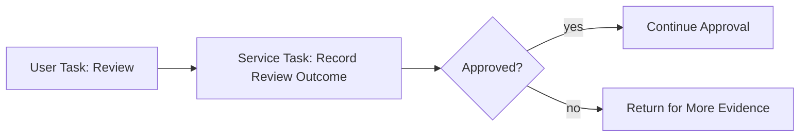

Why better?

- side effect visible in BPMN;
- retry/error behavior explicit;
- audit action has owner;
- process path is understandable.

---

## 15. Listener Thinking to Explicit Modeling

Camunda 7 listeners often hide important behavior:

- on start: initialize fields;
- on complete: send notification;
- on assignment: write audit;
- on take transition: enforce condition.

In Camunda 8, prefer explicitness.

Bad migration:

```text
Keep invisible behavior in worker/internal callbacks wherever possible.
```

Better:

```text
If behavior matters to process lifecycle, model it.
If behavior is purely technical, keep it in platform/app layer.
If behavior is audit/legal, persist in domain audit layer.
```

Decision table:

| Behavior | Where It Belongs |
|---|---|
| Send business notification | BPMN service task / worker |
| Technical metrics | worker/platform instrumentation |
| Legal decision audit | domain backend/audit service |
| SLA escalation | BPMN timer/escalation path |
| UI decoration | frontend/task app |
| Assignment policy | task assignment config + domain policy if complex |
| Data enrichment | worker/domain service |

---

## 16. External Task to Job Worker

Camunda 7 external tasks are conceptually closer to Camunda 8 job workers than JavaDelegate is.

Mapping:

| Camunda 7 External Task | Camunda 8 Job Worker |
|---|---|
| Topic | Job type |
| Fetch and lock | Activate jobs |
| Complete | Complete job |
| Handle failure | Fail job |
| BPMN error | Throw error |
| Worker id | Worker identity/name |
| Lock duration | Job timeout/activation semantics |

Migration is still not automatic because:

- APIs differ;
- variable handling differs;
- security differs;
- retry/backoff semantics may differ;
- process XML extension changes;
- operational tooling changes;
- worker deployment/scaling changes.

But external-task-based Camunda 7 designs often migrate more naturally because they already accepted an external worker boundary.

---

## 17. Incident Handling Shift

### 17.1 Camunda 7 instinct

- inspect Cockpit;
- look at failed job;
- retry job;
- fix delegate issue;
- maybe update variables;
- rely on engine DB/history.

### 17.2 Camunda 8 instinct

- inspect Operate;
- identify failed element/job;
- inspect variables and incident message;
- inspect worker logs/traces by job/process/correlation id;
- fix worker/config/data;
- retry/resolve incident;
- verify process advances;
- update runbook if repeated.

Incident response must include both runtime and worker side:

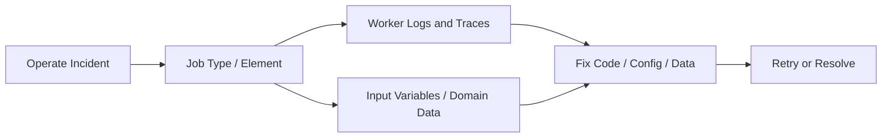

Anti-pattern:

> Retrying incident repeatedly without understanding whether worker side effect is idempotent.

---

## 18. Deployment Shift

### 18.1 Camunda 7 common pattern

- BPMN packaged inside application;
- deployment on application startup;
- engine and app version coupled;
- delegates/classes bundled with process app.

### 18.2 Camunda 8 pattern

- BPMN/DMN/forms deployed to Orchestration Cluster;
- workers deployed as separate apps/services;
- process definition version and worker version must be compatible;
- CI/CD must validate model and worker contract together.

Diagram:

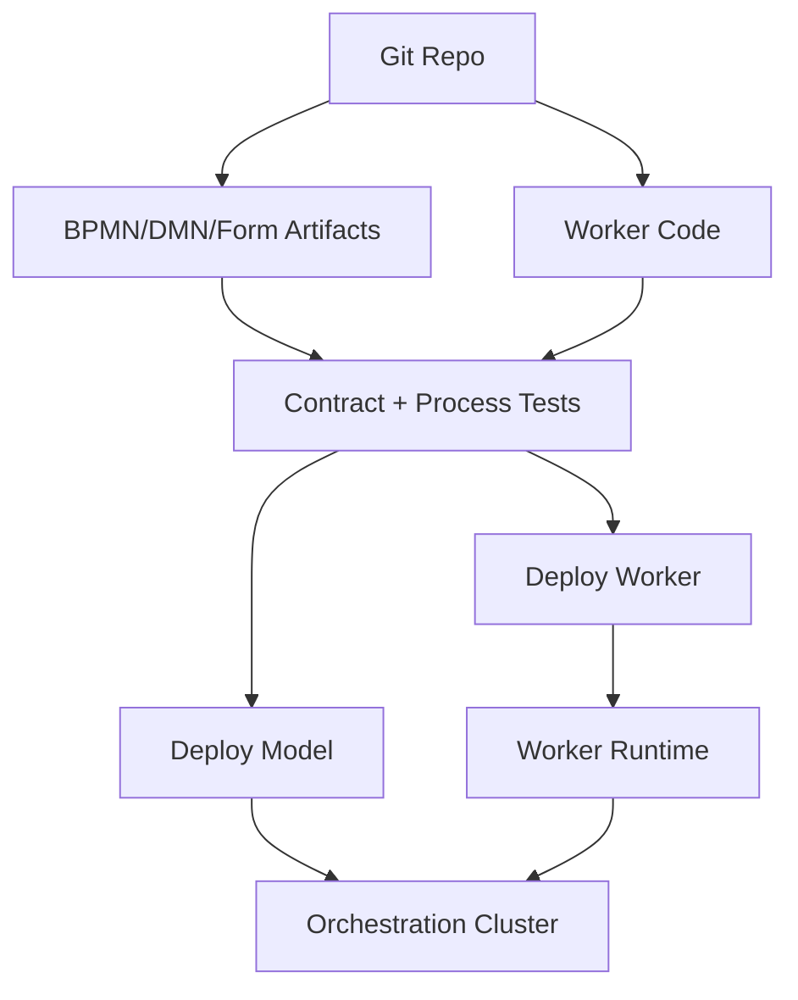

Important invariant:

> Model deployment and worker deployment are independent, but their contracts must be governed together.

---

## 19. Versioning Shift

Camunda 7 projects often rely on app deployment coupling. Camunda 8 requires more explicit compatibility.

### 19.1 Versioning dimensions

- BPMN process definition version;
- DMN decision version;
- form version;
- worker application version;
- job type contract version;
- variable schema version;
- external API version;
- user task UI version.

### 19.2 Job type versioning strategies

#### Stable job type with backward-compatible schema

```text
calculate-risk-score
```

Use when:

- input/output changes are backward compatible;
- worker can handle schemaVersion;
- old process instances can still complete.

#### Explicit versioned job type

```text
calculate-risk-score.v2
```

Use when:

- behavior changes materially;
- output semantics changed;
- old and new process definitions must run side by side;
- regulatory/audit interpretation differs.

Rule:

> Version job types when behavior contract changes, not merely when Java implementation changes.

---

## 20. Operational Shift

Camunda 8 operations involve at least four views:

1. **Process view**: Operate, incidents, process instances.
2. **Worker view**: logs, metrics, traces, deployment health.
3. **Cluster view**: partitions, brokers, gateway/API health, resource usage.
4. **Business view**: SLA, backlog, throughput, escalations, compliance state.

Camunda 7 teams often over-focus on engine view. Camunda 8 requires cross-boundary diagnosis.

Example: “Case not moving.”

Diagnostic tree:

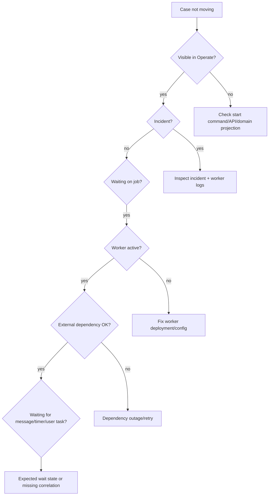

---

## 21. Migration Anti-Patterns

### 21.1 Mechanical BPMN Conversion Only

Symptom:

- model converted;
- namespaces updated;
- app compiles;
- but runtime semantics not reviewed.

Problem:

- transaction, error, worker, variable, user task, and security boundaries may be wrong.

Better:

- run semantic migration review per process.

### 21.2 Delegate Body Copy-Paste

Symptom:

- JavaDelegate code pasted into job worker.

Problem:

- ignores idempotency, distributed failure, security, observability.

Better:

- extract domain service, wrap worker adapter, define contract.

### 21.3 Engine DB Replacement Fantasy

Symptom:

- looking for Camunda 8 equivalent SQL tables to query directly.

Problem:

- wrong abstraction; runtime uses different architecture.

Better:

- use APIs, exporters/projections, Operate/Optimize, domain read models.

### 21.4 Same Variable Payloads

Symptom:

- old serialized Java object variables moved to JSON wholesale.

Problem:

- large payloads, compatibility issues, sensitive data exposure.

Better:

- process-specific DTO and domain references.

### 21.5 Ignoring Running Instances

Symptom:

- migrate definitions but no plan for active Camunda 7 instances.

Problem:

- long-running processes may span months/years.

Better:

- choose per process: let finish, migrate manually, restart in C8, bridge events, or run dual systems.

### 21.6 One Worker for Everything

Symptom:

- single giant worker app handles all job types.

Problem:

- scaling, ownership, deployment blast radius, dependency sprawl.

Better:

- group workers by bounded context/ownership/SLA.

### 21.7 User Task UI Underestimation

Symptom:

- assume Tasklist automatically replaces custom Camunda 7 task app.

Problem:

- forms, authorization, evidence, decision UX, search, and audit may require redesign.

Better:

- classify tasks by complexity and choose Tasklist/custom UI per class.

---

## 22. Better Architecture for Migrated Process Apps

Reference target:

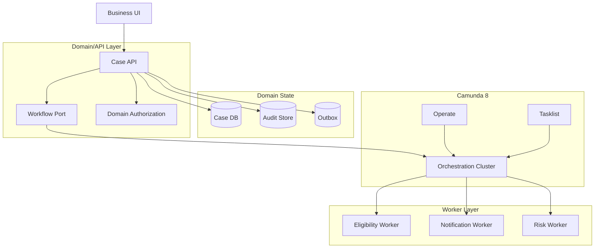

Key properties:

- workflow access behind a port;
- domain state separate from process variables;
- user actions validated by domain backend;
- worker layer owns side effects;
- Operate/Tasklist are surfaces, not hidden dependencies;
- outbox handles reliable domain-to-process messaging if needed.

---

## 23. Migration Decision Tree

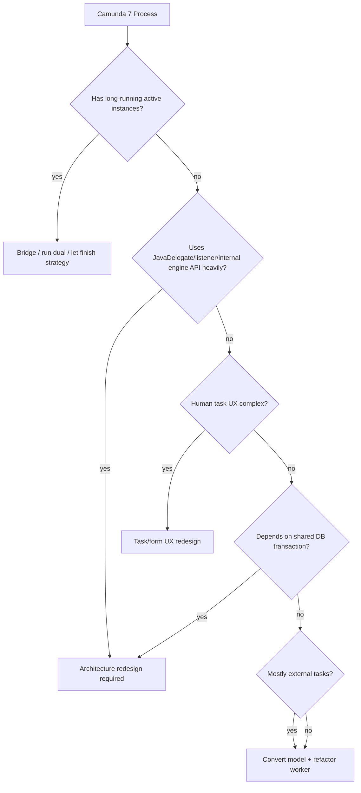

This tree is not a replacement for analysis, but it prevents naive migration estimates.

---

## 24. Practical Migration Checklist

### 24.1 Per BPMN model

- List all service tasks.
- Identify implementation type: class, delegate expression, external task, connector, script, expression.
- List all listeners.
- List all user tasks and forms.
- List all boundary events and error events.
- List all timer/message/signal usage.
- Identify unsupported or changed semantics.
- Identify process variables and payload size.
- Identify running instance strategy.

### 24.2 Per Java implementation

- Identify engine API usage.
- Identify transaction assumptions.
- Identify external side effects.
- Identify retry safety.
- Identify business errors.
- Extract domain logic from engine adapter.
- Create worker contract.
- Add idempotency.
- Add logs/traces/correlation.
- Add tests.

### 24.3 Per user task

- Identify form type.
- Identify assignment model.
- Identify candidate groups/users.
- Identify completion side effects.
- Identify domain authorization.
- Decide Tasklist vs custom UI.
- Define task completion API boundary.

### 24.4 Per deployment

- Decide model deployment pipeline.
- Decide worker deployment pipeline.
- Define compatibility matrix.
- Define rollback strategy.
- Define environment promotion.
- Define permission model.

---

## 25. Applied Example: Sanction Approval Migration

### 25.1 Camunda 7 version

```text
Open Case
  -> JavaDelegate: load case and calculate risk
  -> User Task: investigator review
     -> complete listener writes audit
  -> JavaDelegate: generate notice PDF
  -> JavaDelegate: send email
  -> Timer: wait appeal window
  -> close case
```

Hidden problems:

- delegate loads domain objects directly;
- listener writes audit invisibly;
- email side effect may not be idempotent;
- PDF generation coupled to engine transaction;
- task completion may skip domain authorization;
- variables may contain large case object.

### 25.2 Camunda 8 redesigned version

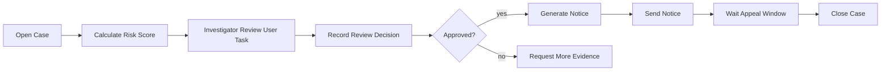

Worker contracts:

```yaml
calculate-risk-score:
  inputs: [caseId, schemaVersion]
  outputs: [riskScore, riskBand, requiresLegalReview]

record-review-decision:
  inputs: [caseId, decisionId]
  outputs: [reviewOutcome]

generate-notice:
  inputs: [caseId, noticeTemplateVersion]
  outputs: [documentId]

send-notice:
  inputs: [caseId, documentId, recipientPartyId]
  outputs: [notificationId, sentAt]
```

Domain backend responsibility:

- validate reviewer authority;
- persist decision;
- create decisionId;
- complete task with decisionId only.

Process variables:

```json
{
  "caseId": "CASE-2026-0001",
  "schemaVersion": 2,
  "riskBand": "HIGH",
  "decisionId": "DEC-9981",
  "documentId": "DOC-7721",
  "noticeDeadline": "2026-07-28"
}
```

---

## 26. Kaufman Practice Drill

Latihan 2 jam:

1. Ambil satu proses Camunda 7 yang kamu kenal.
2. Tandai semua service task:
   - JavaDelegate;
   - listener;
   - external task;
   - expression/script;
   - user task side effect.
3. Untuk setiap implementation, tulis:
   - apakah pure computation;
   - apakah external side effect;
   - apakah perlu domain transaction;
   - apakah bisa retry;
   - apakah business error atau technical failure.
4. Ubah semua service task menjadi job type contract.
5. Buat variable schema minimal.
6. Buat task completion boundary jika ada human decision.
7. Buat migration risk rating:
   - low;
   - medium;
   - high;
   - redesign.
8. Buat satu diagram target Camunda 8.

Output akhir harus berupa:

- satu BPMN-level migration map;
- satu worker contract table;
- satu variable schema;
- satu risk register.

---

## 27. Review Rubric

Kamu mulai paham Camunda 8 migration jika bisa menjelaskan hal berikut tanpa melihat dokumentasi:

- Kenapa JavaDelegate tidak sama dengan job worker.
- Kenapa transaction boundary harus didesain ulang.
- Kenapa process variables bukan domain object store.
- Kenapa Tasklist permission bukan domain authorization.
- Kenapa external task dari Camunda 7 lebih dekat ke job worker daripada JavaDelegate.
- Kenapa Operate bukan business portal.
- Kenapa running instance strategy penting.
- Kenapa migration tool membantu, tetapi tidak menggantikan architecture review.
- Kenapa versioning job type dan variable schema penting.
- Kenapa idempotency adalah requirement, bukan nice-to-have.

---

## 28. Key Takeaways

- Camunda 8 adalah remote orchestration runtime, bukan embedded Camunda 7 engine.
- JavaDelegate mindset harus diganti dengan job worker contract mindset.
- Local transaction assumptions harus diganti dengan distributed consistency patterns.
- Business error, technical failure, rejection, dan incident harus dipisahkan.
- Process variables harus menjadi process contract, bukan object dump.
- User task completion harus dibungkus domain validation untuk proses high-stakes.
- Migration harus diklasifikasikan berdasarkan coupling, transaction dependency, human UX, active instances, dan side effect risk.
- External task pattern lebih mudah dimigrasikan dibanding JavaDelegate-heavy process, tetapi tetap butuh review.
- Good migration menghasilkan arsitektur yang lebih eksplisit, observable, idempotent, dan defensible.

---

## 29. Source Anchor Notes

Materi ini diselaraskan dengan dokumentasi resmi Camunda 8 tentang:

- Migration journey dari Camunda 7 ke Camunda 8.
- Code conversion JavaDelegate/external task menuju worker model.
- Diagram converter dan migration tooling.
- Orchestration Cluster API dan Camunda Java Client modern.
- Camunda user task migration guidance.
- Camunda 8 architecture dan runtime component model.

