------
title: Learn Java BPMN with Camunda 8 Zeebe - Part 005
description: BPMN execution semantics in Camunda 8 Zeebe: token flow, element lifecycle, commands/events, gateways, scopes, events, subprocesses, and modeling invariants for production-grade orchestration.
series: learn-java-bpmn-camunda8-zeebe
seriesTitle: Learn Java BPMN with Camunda 8 Zeebe
order: 5
partTitle: BPMN Execution Semantics in Zeebe
tags:
- java
- bpmn
- camunda
- camunda-8
- zeebe
- orchestration
- workflow
- distributed-systems
date: 2026-06-28
------

# Part 005 — BPMN Execution Semantics in Zeebe

> Fokus bagian ini: memahami **bagaimana model BPMN benar-benar dieksekusi oleh Zeebe**, bukan sekadar bagaimana menggambar BPMN yang valid.

Di Camunda 8, BPMN adalah **execution contract**. Model BPMN bukan dokumentasi pasif, bukan flowchart untuk meeting, dan bukan wrapper cantik untuk kode Java. Model BPMN mendefinisikan bagaimana process instance bergerak dari satu state ke state lain di dalam runtime Zeebe.

Kalau kita membawa mental model Camunda 7 secara langsung, kita mudah salah membaca behavior Camunda 8. Di Camunda 7, banyak developer terbiasa berpikir:

- "engine berada di aplikasi saya"
- "delegate dieksekusi dalam transaksi yang saya pahami"
- "exception Java bisa menjadi bagian utama dari kontrol alur"
- "database engine adalah sumber utama kebenaran runtime"

Di Zeebe, mental model yang lebih aman adalah:

- process instance adalah state yang berkembang melalui log event
- BPMN element menghasilkan command dan event internal
- pekerjaan eksternal dilakukan oleh worker
- proses berhenti di wait state sampai ada event/command yang membuatnya lanjut
- runtime harus diasumsikan distributed, asynchronous, dan at-least-once pada boundary tertentu

Bagian ini membangun bahasa yang presisi untuk membaca process execution.

---

## 1. Skill Target

Setelah bagian ini, kita harus bisa:

1. Membaca BPMN sebagai **state machine terdistribusi**.
2. Menjelaskan kapan process instance lanjut, berhenti, gagal, atau menunggu.
3. Membedakan token flow konseptual BPMN dengan record/event processing internal Zeebe.
4. Mendesain model yang tidak bergantung pada asumsi "kode berjalan inline".
5. Menghindari anti-pattern model yang terlihat benar tetapi rapuh di production.

---

## 2. Minimal Mental Model

BPMN execution di Zeebe bisa dipahami melalui tiga lapisan:

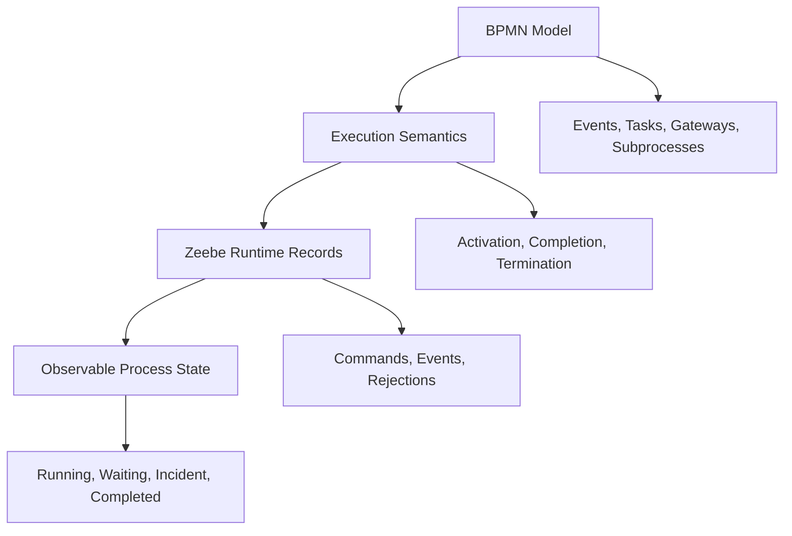

Penjelasan:

| Lapisan | Pertanyaan utama | Contoh |
|---|---|---|
| BPMN Model | Apa elemen yang digambar? | service task, exclusive gateway, timer boundary event |
| Execution Semantics | Apa arti runtime elemen itu? | create job, wait for message, evaluate condition |
| Zeebe Records | Apa yang ditulis/diproses runtime? | command, event, rejection, incident |
| Observable State | Apa yang terlihat di Operate/API? | active element, incident, completed instance |

Developer top-tier tidak berhenti di layer model. Ia selalu bertanya:

> "Elemen ini membuat runtime menunggu apa, menghasilkan command apa, dan failure mode-nya apa?"

---

## 3. BPMN Is Executable State, Not Just Diagram

BPMN dalam Camunda 8 adalah kombinasi dari:

1. **Control-flow contract**  
   Urutan dan cabang proses.

2. **Wait-state contract**  
   Titik di mana runtime berhenti sampai sesuatu terjadi.

3. **Integration contract**  
   Titik di mana runtime menciptakan job untuk worker atau connector.

4. **Data contract**  
   Variabel apa yang dibutuhkan, diubah, dan diteruskan.

5. **Operational contract**  
   Titik mana yang bisa menjadi incident, retry, escalation, atau manual repair.

Contoh sederhana:

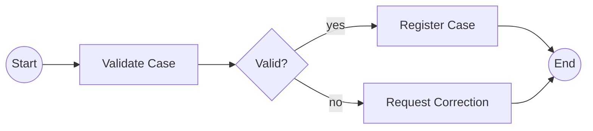

Ini bukan hanya "alur validasi". Secara runtime:

- start event mengaktifkan instance
- service task `Validate Case` membuat job
- worker mengambil job
- hasil worker mengubah variable
- gateway mengevaluasi expression
- salah satu path diambil
- user task atau service task berikutnya menahan/melanjutkan token

Kalau worker tidak tersedia, proses akan berhenti di service task. Kalau expression gateway salah, instance bisa masuk incident. Kalau variable tidak sesuai kontrak, model mungkin deploy tetapi gagal saat runtime.

---

## 4. Token Flow: Useful but Incomplete

BPMN sering diajarkan dengan konsep **token**. Token adalah metafora: sebuah penanda eksekusi yang bergerak melewati elemen.

Konsep token berguna untuk membaca model:

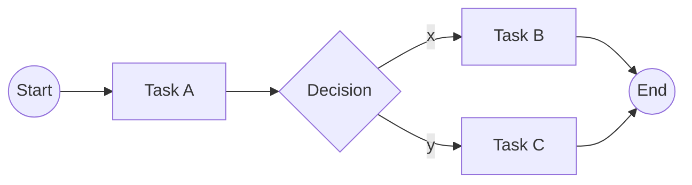

Secara konseptual:

1. token mulai dari start event
2. masuk Task A
3. selesai Task A
4. masuk gateway
5. gateway memilih satu path
6. token masuk Task B atau Task C
7. instance selesai saat token mencapai end event

Tetapi di Zeebe, token flow hanya **abstraksi BPMN**. Runtime sebenarnya bekerja melalui record stream dan state processing. Karena itu, jangan membuat desain yang bergantung pada asumsi seperti:

- "task berikutnya pasti langsung terjadi pada thread yang sama"
- "dua task berurutan sama dengan satu transaksi"
- "kalau variable diubah di worker, semua hal berikutnya pasti atomik bersama side effect worker"
- "exception Java dapat mengontrol alur seperti method call biasa"

Mental model yang lebih benar:

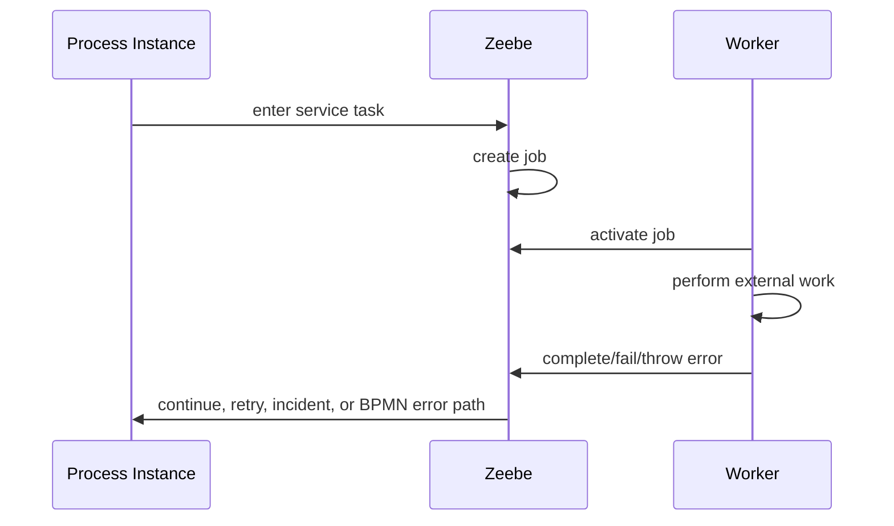

---

## 5. Element Lifecycle

Setiap BPMN element yang dieksekusi dapat dipikirkan sebagai lifecycle:

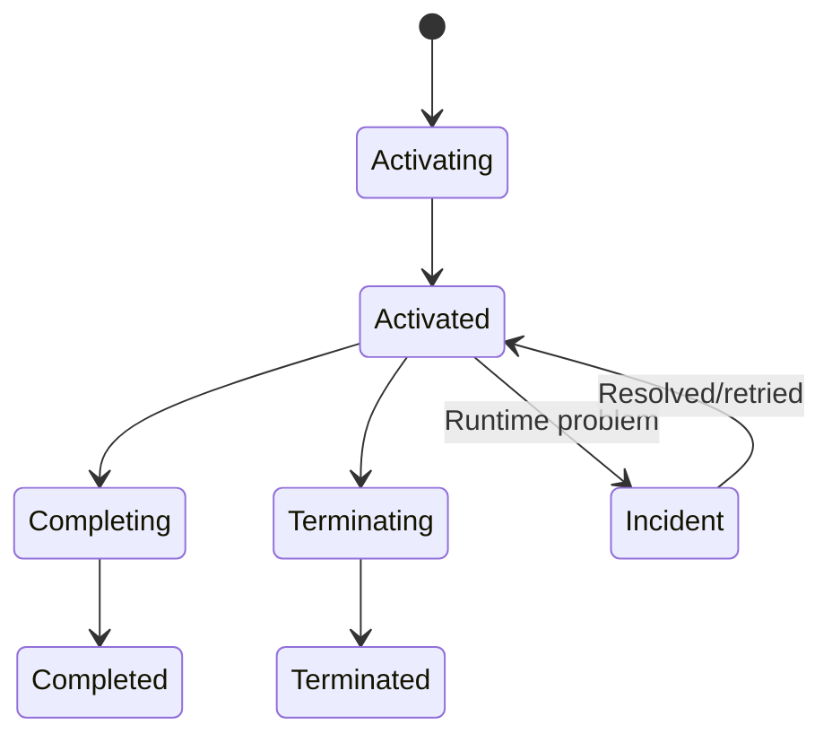

Tidak semua state ini selalu terlihat secara eksplisit di UI, tetapi ini membantu menganalisis behavior.

### 5.1 Activation

Element activation berarti process instance memasuki elemen tersebut.

Contoh:

- start event diaktifkan saat instance dibuat
- service task diaktifkan saat incoming sequence flow tiba
- boundary event diaktifkan sebagai event subscription pada scope tertentu
- subprocess diaktifkan saat token masuk scope subprocess

Pertanyaan desain:

> "Saat elemen ini aktif, apakah proses langsung lanjut, membuat job, memasang subscription, atau menunggu input?"

### 5.2 Completion

Element completion berarti elemen telah menyelesaikan tugas semantiknya.

Contoh:

- service task complete setelah job worker mengirim complete command
- gateway complete setelah condition dievaluasi dan outgoing path dipilih
- timer catch event complete setelah timer trigger
- message catch event complete setelah message correlated
- subprocess complete setelah semua path internal selesai

Pertanyaan desain:

> "Apa bukti valid bahwa elemen ini boleh complete?"

### 5.3 Termination

Element termination terjadi ketika elemen atau scope dihentikan dari luar alur normal.

Contoh:

- interrupting boundary event menghentikan activity yang ditempeli
- terminate end event menghentikan scope
- cancellation dari parent bisa menghentikan child execution
- process instance dibatalkan operator/API

Pertanyaan desain:

> "Kalau elemen ini dihentikan, side effect eksternal apa yang sudah mungkin terjadi?"

Ini penting untuk worker dan compensation. Zeebe bisa menghentikan proses, tetapi tidak otomatis membatalkan side effect yang sudah terjadi di sistem eksternal.

---

## 6. Wait State

Wait state adalah titik ketika process instance tidak bisa lanjut sampai ada trigger eksternal atau waktu.

Contoh wait state di Camunda 8:

| Elemen | Menunggu apa? |
|---|---|
| Service task | job completed/failed/error oleh worker |
| Receive/message catch event | message correlated |
| Timer catch/boundary event | timer due |
| User task | task completion |
| Call activity | called process selesai |
| Event-based gateway | salah satu event terjadi |

Service task adalah wait state yang sangat penting: saat task dimasuki, Zeebe membuat job dan instance berhenti sampai worker menyelesaikannya. Dokumentasi Camunda menjelaskan bahwa service task menghasilkan job, dan process instance menunggu sampai job tersebut complete.

Konsekuensi:

- tidak ada worker berarti instance menunggu
- worker lambat berarti instance lambat
- worker gagal berarti retry atau incident
- worker duplicate/timeout berarti idempotency wajib dipikirkan
- variable output worker menjadi input untuk elemen berikutnya

---

## 7. Commands, Events, and Rejections

Zeebe memproses perubahan state dengan pola command/event.

Secara konseptual:

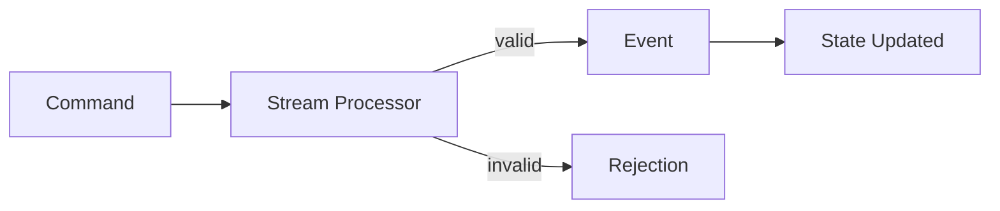

| Jenis record | Makna |
|---|---|
| Command | permintaan untuk melakukan sesuatu |
| Event | fakta bahwa sesuatu sudah terjadi |
| Rejection | command tidak valid atau tidak bisa diterapkan |

Contoh:

| Command | Kemungkinan hasil |
|---|---|
| Create process instance | process instance created atau rejected |
| Complete job | job completed atau rejected |
| Fail job | job failed, retry scheduled, atau incident |
| Publish message | message published, correlated, expired |
| Resolve incident | incident resolved atau rejected |

Mental model penting:

> Command adalah niat. Event adalah fakta.

Dalam sistem distributed, ini krusial. Worker tidak boleh menganggap side effect orchestration terjadi hanya karena ia mengirim command. Worker harus siap command ditolak, timeout, duplicated, atau tidak diketahui hasilnya karena failure komunikasi.

---

## 8. Process Instance Lifecycle

Lifecycle sederhana process instance:

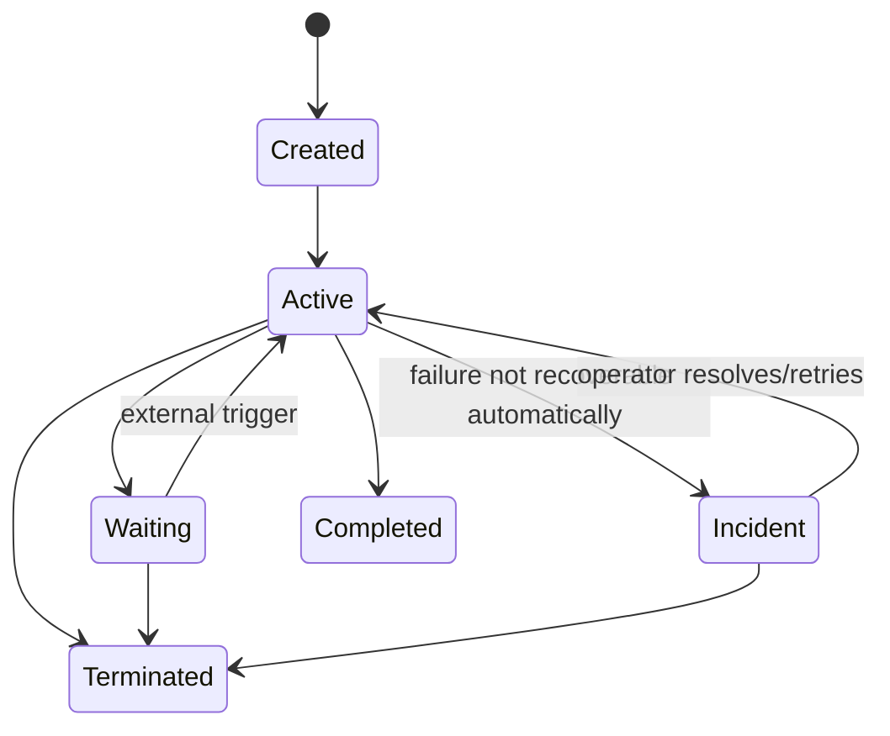

State "Active" dan "Waiting" sering bergantian sangat cepat. Sebuah instance long-running biasanya menghabiskan mayoritas waktunya di wait state, bukan di active computation.

Contoh regulatory enforcement lifecycle:

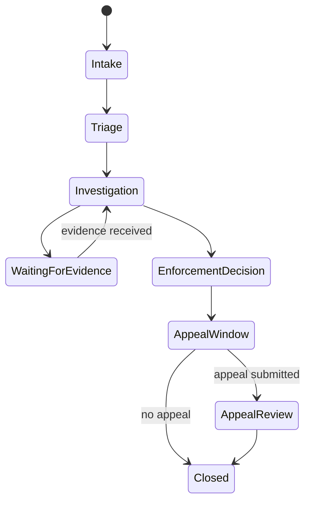

Model ini cocok untuk BPMN jika setiap transition punya trigger, owner, SLA, dan audit requirement yang jelas. Namun jangan memaksa seluruh domain object menjadi satu process instance raksasa tanpa boundary.

---

## 9. Start Events

Start event menentukan cara process instance dibuat.

Jenis umum:

| Start event | Cocok untuk |
|---|---|
| None start event | instance dibuat eksplisit via API/client |
| Message start event | instance dibuat dari message/correlation |
| Timer start event | scheduled/recurring process |
| Signal-like/event patterns | broad trigger pattern, tergantung dukungan/runtime design |

### 9.1 None Start Event

None start event cocok ketika aplikasi menentukan kapan instance dibuat.

Contoh:

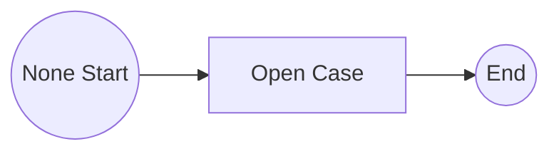

Pola ini cocok untuk:

- command dari REST API internal
- UI "create case"
- batch importer
- integration service
- event consumer yang sengaja memulai process

Pertanyaan desain:

- Siapa owner creation?
- Apa idempotency key-nya?
- Apa business key/correlation key equivalent yang digunakan?
- Bagaimana mencegah duplicate case?

### 9.2 Message Start Event

Message start event cocok ketika external event adalah trigger utama.

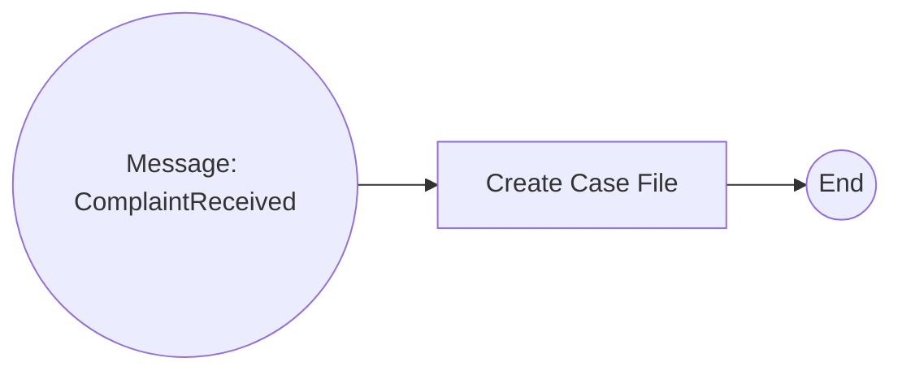

Pola ini cocok untuk:

- event dari platform lain
- incoming external complaint
- webhook
- document submitted
- fraud alert generated

Risiko:

- duplicate message
- wrong correlation key
- event datang sebelum deployment siap
- event TTL habis
- schema message berubah

### 9.3 Timer Start Event

Timer start event cocok untuk scheduled process, misalnya nightly review atau periodic escalation scan.

Hindari menggunakan timer start event untuk semua jenis scheduling teknis. Kalau yang dibutuhkan adalah high-volume scheduler dengan jutaan trigger granular, desain harus dianalisis lebih hati-hati. Timer dalam BPMN membawa makna process, bukan sekadar cron replacement.

---

## 10. End Events

End event menyelesaikan path. Completion instance bergantung pada semua active path/scope.

Jenis end behavior:

| End pattern | Semantik |
|---|---|
| None end | path selesai normal |
| Error end | melempar BPMN error ke catching boundary/event subprocess |
| Terminate end | menghentikan scope terkait |
| Message end | mengirim message/event tertentu jika dimodelkan |
| Escalation/compensation patterns | tergantung elemen dan dukungan modeling |

Prinsip:

> End event bukan hanya dekorasi. Ia mendefinisikan bagaimana path selesai dan apakah completion normal atau abnormal.

Anti-pattern:

- semua path berakhir di same generic end tanpa semantic
- error teknis dimodelkan sebagai end event bisnis
- terminate end digunakan untuk "membersihkan" model yang sebenarnya salah boundary
- end event diberi label ambigu seperti "Done" untuk semua hal

Label yang lebih baik:

- `Case Registered`
- `Rejected As Duplicate`
- `Closed After Appeal`
- `Escalated To Manual Review`
- `Terminated By Operator`

---

## 11. Sequence Flow

Sequence flow adalah edge antar element. Dalam BPMN executable, sequence flow menentukan urutan runtime.

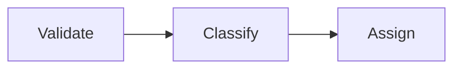

Tiga rule penting:

1. Sequence flow tidak sama dengan method call.
2. Sequence flow tidak membawa data sendiri; data ada di variables.
3. Sequence flow tidak menjamin transaction boundary dengan service eksternal.

Label sequence flow harus meaningful jika mengandung keputusan:

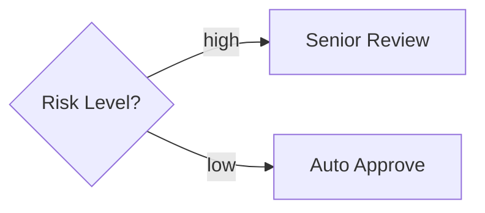

Label buruk:

- yes/no tanpa konteks
- ok/not ok
- path1/path2
- true/false jika business user tidak paham

Label baik:

- `eligible`
- `missing evidence`
- `risk score >= threshold`
- `requires enforcement action`

---

## 12. Exclusive Gateway

Exclusive gateway memilih satu outgoing path berdasarkan condition.

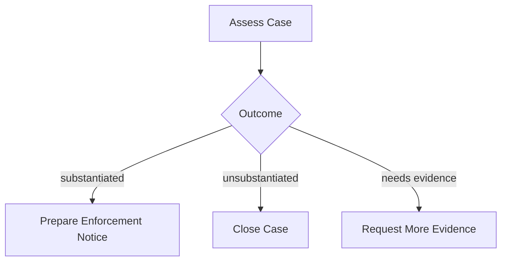

Execution behavior:

1. token masuk gateway
2. outgoing conditions dievaluasi
3. satu path dipilih
4. jika tidak ada condition valid dan tidak ada default, instance bisa gagal/incident
5. path yang tidak dipilih tidak aktif

Desain condition:

- condition harus berbasis variable yang jelas
- variable harus disiapkan oleh previous task/worker
- default flow harus digunakan jika business semantics memungkinkan
- condition harus mutually exclusive secara eksplisit

Anti-pattern:

```text
condition A: riskScore > 50
condition B: riskScore > 80
```

Jika riskScore = 90, dua condition benar. Walau engine punya urutan evaluasi, desain seperti ini buruk karena business meaning ambiguous.

Lebih baik:

```text
low: riskScore < 50
medium: riskScore >= 50 and riskScore < 80
high: riskScore >= 80
```

---

## 13. Parallel Gateway

Parallel gateway membuat atau menyatukan beberapa path paralel.

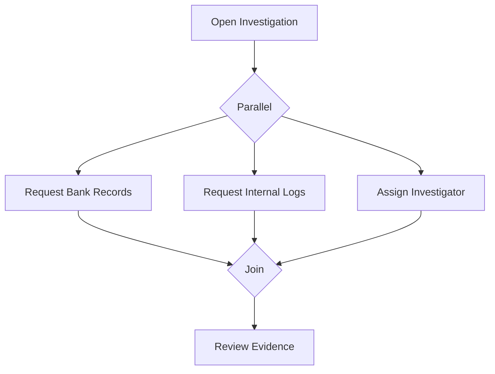

Mental model:

- fork: satu token menjadi beberapa active paths
- join: menunggu semua expected incoming paths
- join bukan "merge data"; join hanya sinkronisasi control flow
- data race secara business tetap harus diatur

Risiko:

- salah join menyebabkan instance stuck
- parallel worker side effects tidak deterministik dari sisi waktu
- external services bisa complete dalam urutan berbeda
- variable write conflict jika beberapa path menulis variable yang sama

Rule:

> Pada parallel path, jangan biarkan dua path menulis variable top-level yang sama tanpa ownership jelas.

Buruk:

```json
{
  "status": "done"
}
```

Dari dua path berbeda.

Lebih baik:

```json
{
  "evidenceRequests": {
    "bankRecords": {
      "status": "completed"
    },
    "internalLogs": {
      "status": "completed"
    }
  }
}
```

---

## 14. Inclusive Gateway

Inclusive gateway memilih satu atau lebih path berdasarkan condition, lalu join menunggu path yang benar-benar diaktifkan.

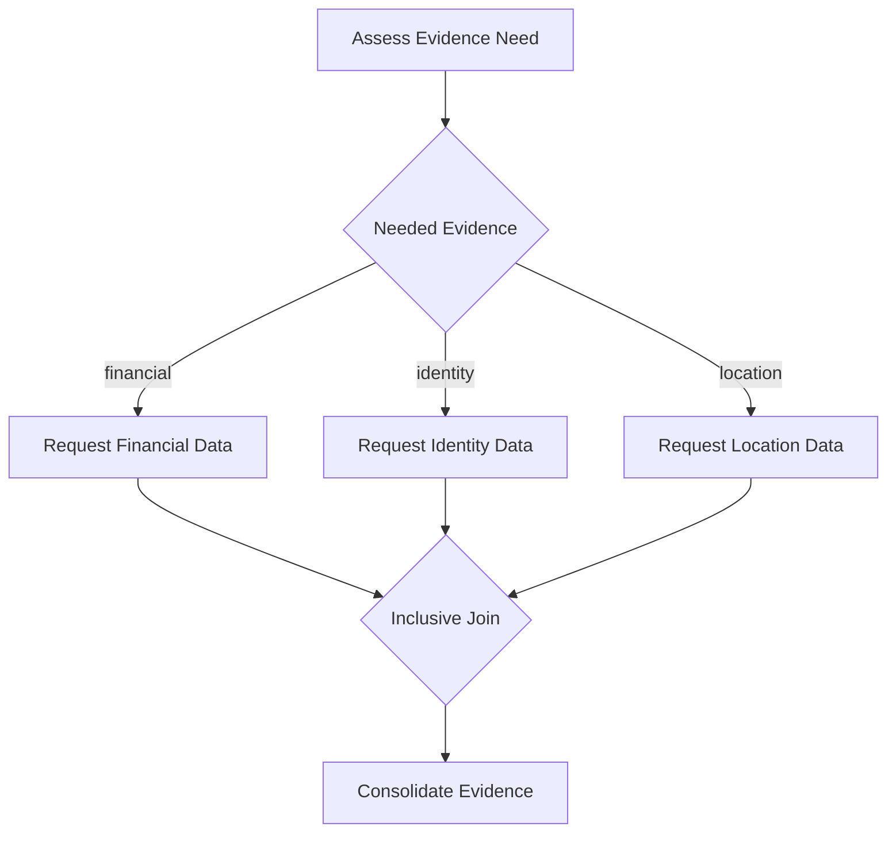

Inclusive gateway powerful tetapi lebih sulit dibaca dan diuji.

Gunakan jika:

- jumlah path optional jelas
- business semantics memang "one or more"
- join behavior dipahami
- test cases mencakup kombinasi path

Hindari jika:

- path terlalu banyak
- condition overlap tidak jelas
- team belum matang dalam BPMN testing
- lebih sederhana memakai subprocess/multi-instance

---

## 15. Event-Based Gateway

Event-based gateway menunggu salah satu dari beberapa event. Event pertama yang terjadi menang; event lain dibatalkan.

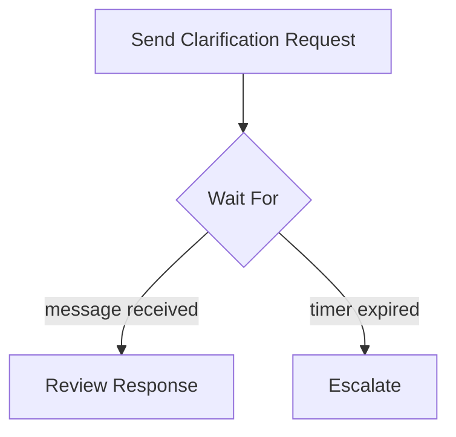

Cocok untuk:

- wait for response vs timeout
- wait for customer action vs cancellation
- wait for appeal vs appeal deadline
- wait for external approval vs SLA breach

Pertanyaan penting:

- Apakah losing event harus benar-benar dibatalkan?
- Apakah late message harus diabaikan, direkam, atau membuka proses baru?
- Apakah timer expiration adalah business event atau operational fallback?

Dalam regulatory workflow, late evidence setelah deadline sering bukan sekadar "ignored"; bisa menjadi new case event, appeal material, atau reopening trigger.

---

## 16. Service Task

Service task adalah work item untuk automated work.

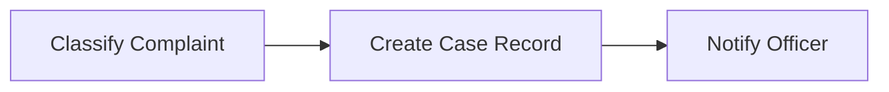

Di Camunda 8, service task biasanya menghasilkan job dengan type tertentu. Worker subscribe ke job type tersebut, mengambil job, menjalankan logic, lalu complete/fail/throw BPMN error.

Service task harus dianggap sebagai boundary antara:

- process orchestration
- executable business/technical logic
- external system side effect

Prinsip desain:

| Aspek | Rule |
|---|---|
| Job type | nama stabil dan meaningful |
| Input | minimal, explicit |
| Output | terstruktur, backward-compatible |
| Side effect | idempotent |
| Error | business error vs technical failure dipisahkan |
| Timeout | sesuai real execution time |
| Retries | disesuaikan dengan jenis failure |

Detail job worker dibahas di Part 006.

---

## 17. User Task

User task menandai human work.

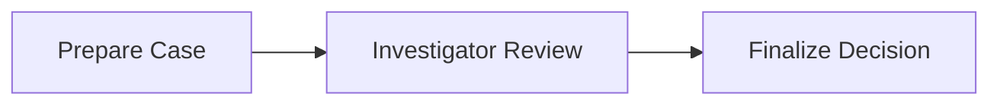

User task bukan sekadar "pause". Ia adalah contract:

- siapa yang boleh mengerjakan
- data apa yang ditampilkan
- form apa yang digunakan
- keputusan apa yang boleh diambil
- SLA apa yang berlaku
- audit evidence apa yang dibutuhkan

Anti-pattern:

- user task bernama `Review`
- tidak ada assignment strategy
- semua keputusan disimpan sebagai free text
- worker setelah user task menebak maksud user dari field ambigu
- user task dipakai sebagai generic manual escape hatch

Lebih baik:

- `Review Evidence Completeness`
- `Approve Enforcement Recommendation`
- `Submit Corrective Action Plan`
- `Confirm Appeal Eligibility`

---

## 18. Receive Task and Message Catch Events

Receive task/message catch event menunggu external message.

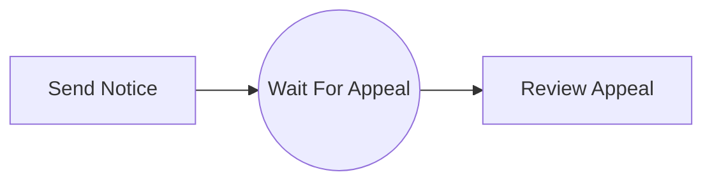

Message waiting state harus memiliki:

- message name
- correlation key
- TTL strategy
- duplicate handling
- late message handling
- schema compatibility
- observability

Jangan menganggap message correlation sebagai simple callback. Ini distributed coordination. Kegagalan yang harus dipikirkan:

| Failure | Contoh |
|---|---|
| Message arrives too early | event dipublish sebelum subscription aktif |
| Message arrives too late | TTL habis atau process sudah lewat |
| Wrong correlation key | message tidak match instance |
| Duplicate message | external system retry |
| Schema drift | payload tidak sesuai expectation |
| Cross-tenant collision | correlation key tidak cukup unik |

---

## 19. Boundary Events

Boundary event menempel pada activity dan menangkap event saat activity masih aktif.

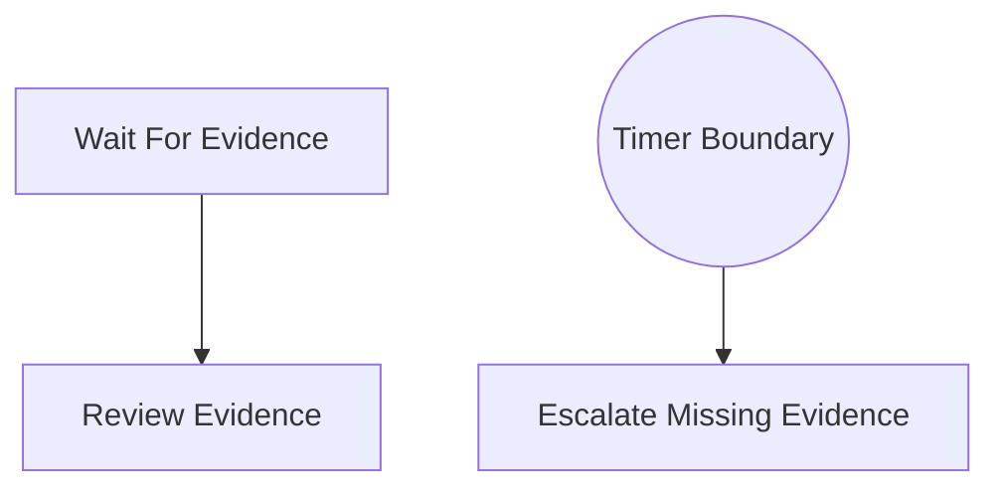

Dalam BPMN diagram sebenarnya, boundary event menempel di activity. Mermaid tidak merepresentasikan attachment BPMN secara sempurna, tetapi model konseptualnya:

```mermaid
flowchart TD
    W[User Task: Provide Evidence]
    W --> R[Review Evidence]
    W -.timer expires.-> E[Escalate]
```

### 19.1 Interrupting Boundary Event

Interrupting boundary event menghentikan activity yang ditempeli.

Contoh:

- user belum submit evidence sampai deadline
- activity dihentikan
- process masuk escalation

Risiko:

- jika user submit setelah timeout, apa yang terjadi?
- apakah UI/task sudah dihapus?
- apakah external notification sudah dikirim?
- apakah data partial harus disimpan?

### 19.2 Non-Interrupting Boundary Event

Non-interrupting boundary event membuat path tambahan tanpa menghentikan activity utama.

Contoh:

- reminder dikirim setiap 3 hari
- escalation notification dikirim tetapi task tetap aktif
- audit alert dibuat tanpa membatalkan review

Gunakan untuk side-path yang tidak mengubah core lifecycle.

---

## 20. Subprocess Scope

Subprocess menciptakan scope. Scope penting karena boundary event, variable visibility, completion, dan termination bergantung pada scope.

```mermaid
flowchart TD
    A[Open Case] --> S[Subprocess: Investigation]
    S --> B[Decision]
    B --> C((End))
```

Gunakan subprocess untuk:

- mengelompokkan lifecycle lokal
- memasang boundary event pada satu area
- membuat model lebih readable
- mengisolasi error/timeout
- mendefinisikan reusable mental block

Contoh investigation subprocess:

```mermaid
flowchart TD
    A[Assign Investigator] --> B[Collect Evidence]
    B --> C[Analyze Evidence]
    C --> D[Prepare Recommendation]
```

Boundary timer pada subprocess bisa berarti:

> "Seluruh investigation phase punya deadline."

Boundary timer pada task bisa berarti:

> "Task evidence collection punya deadline."

Itu dua makna berbeda. Modeler harus memilih scope yang benar.

---

## 21. Event Subprocess

Event subprocess memungkinkan scope merespons event tertentu.

Contoh mental model:

```mermaid
flowchart TD
    P[Main Process: Enforcement Case]
    P -.message: appeal submitted.-> E[Event Subprocess: Handle Appeal]
    P -.message: withdrawal received.-> W[Event Subprocess: Handle Withdrawal]
```

Cocok untuk:

- cancellation request
- appeal submission
- urgent external intervention
- compliance override
- fraud signal during active process

Pertanyaan desain:

- Apakah event interrupting atau non-interrupting?
- Scope mana yang mendengarkan event?
- Event valid di phase apa saja?
- Apa yang terjadi jika event datang saat process sudah closed?
- Bagaimana audit trail dikaitkan?

---

## 22. Call Activity

Call activity memanggil process definition lain.

```mermaid
flowchart LR
    A[Main Case Process] --> B[[Call: Evidence Collection]]
    B --> C[Decision]
```

Call activity cocok ketika:

- subprocess cukup kompleks untuk punya lifecycle sendiri
- ada ownership berbeda
- process bisa reused
- versioning perlu dikelola terpisah
- observability child process bernilai

Risiko:

- parent-child coupling berlebihan
- variable mapping bocor
- child process berubah tanpa compatibility
- terlalu banyak small processes membuat observability sulit
- versioning tidak dirancang

Rule:

> Call activity adalah boundary arsitektur, bukan hanya cara merapikan diagram.

---

## 23. Multi-Instance

Multi-instance menjalankan activity untuk koleksi item.

Contoh:

```mermaid
flowchart TD
    A[Identify Violations] --> B[Assess Each Violation]
    B --> C[Aggregate Findings]
```

Secara BPMN, `Assess Each Violation` bisa multi-instance.

Cocok untuk:

- review setiap dokumen
- validasi setiap applicant
- notify setiap stakeholder
- check setiap obligation
- collect approval dari beberapa authority

Desain collection variable:

```json
{
  "violations": [
    {
      "violationId": "V-001",
      "type": "late_report",
      "severity": "medium"
    },
    {
      "violationId": "V-002",
      "type": "missing_license",
      "severity": "high"
    }
  ]
}
```

Output jangan menimpa satu variable global secara konflik. Gunakan struktur per item.

Buruk:

```json
{
  "assessmentResult": "high"
}
```

Baik:

```json
{
  "violationAssessments": [
    {
      "violationId": "V-001",
      "result": "medium"
    },
    {
      "violationId": "V-002",
      "result": "high"
    }
  ]
}
```

Pertanyaan penting:

- sequential atau parallel?
- berapa jumlah maksimum item?
- apakah setiap item memanggil external system?
- bagaimana partial failure ditangani?
- apakah aggregate step deterministic?

---

## 24. Variable Semantics at Runtime

Variables adalah data process instance. Namun variable bukan domain database.

Rule penting:

1. Variables adalah data yang process butuhkan untuk routing, assignment, decision, dan integration.
2. Domain state utama tetap sebaiknya berada di domain system of record.
3. Jangan menyimpan payload besar jika cukup menyimpan reference.
4. Jangan menyimpan sensitive data tanpa alasan runtime yang jelas.
5. Variable structure harus versionable.

Contoh variable yang baik:

```json
{
  "case": {
    "caseId": "CASE-2026-000912",
    "type": "market_conduct",
    "priority": "high",
    "jurisdiction": "ID"
  },
  "triage": {
    "riskScore": 87,
    "riskBand": "high",
    "requiresSeniorReview": true
  },
  "evidence": {
    "requiredCategories": ["transaction_log", "customer_statement"],
    "collectionDeadline": "2026-07-12"
  }
}
```

Variable yang buruk:

```json
{
  "data": "... huge unstructured payload ...",
  "flag": true,
  "status": "ok",
  "result": "done"
}
```

Kenapa buruk?

- tidak self-explanatory
- sulit dievaluasi gateway
- sulit backward-compatible
- raw payload besar
- semantic tersembunyi di worker code

---

## 25. Input/Output Mapping

Input/output mapping adalah boundary penting antara process scope dan activity.

Gunanya:

- membatasi data yang masuk worker/subprocess
- mengubah struktur variable untuk contract lokal
- mencegah worker tergantung pada seluruh process variable
- mengontrol output agar tidak merusak state global

Mental model:

```mermaid
flowchart LR
    PV[Process Variables] --> IM[Input Mapping]
    IM --> A[Activity/Worker]
    A --> OM[Output Mapping]
    OM --> PV2[Updated Process Variables]
```

Pattern:

| Pattern | Kapan dipakai |
|---|---|
| Narrow input | worker hanya butuh subset variable |
| Scoped output | hasil worker masuk namespace khusus |
| Mapping to child | call activity butuh contract berbeda |
| Mapping from child | parent hanya mengambil hasil akhir |
| Data minimization | sensitive/large variable tidak perlu masuk worker |

Anti-pattern:

- worker membaca semua variable dan memutuskan sendiri
- output worker menimpa root variable tanpa mapping
- mapping expression terlalu kompleks sampai menjadi business logic besar
- variable names berubah tanpa versioning

---

## 26. BPMN Error vs Technical Failure

BPMN error adalah business error yang dimodelkan. Technical failure adalah kegagalan eksekusi/infrastruktur.

Contoh business error:

- applicant not eligible
- duplicate case found
- evidence invalid
- appeal submitted after legal deadline
- sanction amount below statutory minimum

Contoh technical failure:

- HTTP timeout
- database unavailable
- auth token expired
- downstream 503
- JSON parsing error karena schema breaking
- network partition

Modeling rule:

| Situasi | Gunakan |
|---|---|
| Business alternate path | BPMN error / gateway |
| Temporary technical failure | fail job with retry |
| Permanent technical failure needing operator | incident |
| External system accepted request but result pending | wait for message/event |
| Manual decision needed | user task |

Anti-pattern:

- semua exception worker dilempar sebagai BPMN error
- semua business rejection dijadikan incident
- gateway dipakai untuk technical retry
- retry digunakan untuk policy conflict

---

## 27. Incidents as Operational State

Incident adalah kondisi runtime yang butuh intervensi atau repair. Incident bukan business path normal.

Contoh incident yang legitimate:

- expression evaluation gagal karena variable hilang
- job retries habis
- called process tidak ditemukan
- message correlation command invalid
- model bug menyebabkan instance stuck

Incident harus punya:

- error message actionable
- context variable cukup
- owner/team jelas
- runbook resolusi
- retry/reprocess strategy
- alerting severity

Anti-pattern:

> "Kalau applicant tidak eligible, fail job retries 0 supaya operator lihat di Operate."

Itu salah. Tidak eligible adalah business outcome, bukan incident.

---

## 28. Determinism and Replay Awareness

Zeebe menggunakan event stream dan state processing. Karena itu, process execution harus dipikirkan sebagai state transition yang bisa direkonstruksi dari events.

Praktisnya untuk modeler:

- BPMN flow harus deterministic berdasarkan variables/events
- side effect eksternal harus terjadi di worker, bukan implicit dalam model
- hasil decision harus disimpan jika perlu audit
- time/event triggers harus eksplisit
- perubahan model harus version-aware

Pertanyaan review:

1. Apakah gateway condition bergantung pada variable yang stabil?
2. Apakah worker output cukup untuk menjelaskan path yang diambil?
3. Apakah side effect eksternal punya idempotency key?
4. Apakah ada state penting hanya tersimpan di memori worker?
5. Apakah process bisa dipahami dari history dan variables?

---

## 29. Modeling for Runtime Behavior

Model BPMN production-grade harus dibaca dari empat perspektif sekaligus:

```mermaid
flowchart TD
    A[BPMN Element] --> B[Business Meaning]
    A --> C[Runtime Semantics]
    A --> D[Failure Mode]
    A --> E[Operational Handling]
```

Contoh `Request Evidence`:

| Perspektif | Pertanyaan |
|---|---|
| Business | Evidence apa yang diminta dan mengapa? |
| Runtime | Apakah ini user task, service task, message wait, atau subprocess? |
| Failure | Apa yang terjadi jika tidak ada response? |
| Ops | Bagaimana operator melihat status dan memperbaiki? |

Kalau sebuah elemen tidak bisa dijelaskan dengan empat perspektif ini, model belum siap production.

---

## 30. Anti-Patterns in BPMN Execution Semantics

### 30.1 Flowchart-Only BPMN

Gejala:

- model bagus untuk presentasi
- tidak jelas variable contract
- tidak ada error path
- tidak ada wait-state semantics
- worker harus menebak maksud model

Dampak:

- runtime fragile
- production incident sulit dianalisis
- business audit lemah

### 30.2 One Giant Process

Gejala:

- semua lifecycle dimasukkan satu diagram
- ratusan element
- gateway nested
- banyak exception path
- sulit melihat happy path

Dampak:

- versioning sulit
- migration sulit
- ownership kabur
- testing explode

Solusi:

- gunakan subprocess untuk local complexity
- gunakan call activity untuk architectural boundary
- pisahkan process lifecycle besar menjadi process graph jika perlu

### 30.3 Hidden State in Workers

Gejala:

- BPMN terlihat sederhana
- worker memiliki banyak branching internal
- process variable hanya `status`
- business rule ada di Java

Dampak:

- BPMN tidak audit-friendly
- perubahan business rule butuh code deploy
- process history tidak menjelaskan keputusan

Solusi:

- expose decision sebagai DMN/gateway/user decision
- worker hanya melakukan technical integration atau bounded logic
- simpan decision result sebagai variable

### 30.4 Gateway as Exception Handler

Gejala:

- technical failure disimpan sebagai variable
- gateway memilih retry/manual repair
- process menjadi pseudo-error-framework

Dampak:

- retry semantics tidak konsisten
- incident visibility hilang
- worker dan BPMN saling menipu

Solusi:

- fail job untuk technical retry
- BPMN error untuk business alternate path
- incident untuk unrecoverable operational issue

### 30.5 Unbounded Message Waiting

Gejala:

- process menunggu message tanpa deadline
- tidak ada timeout
- tidak ada cancellation
- tidak ada late message policy

Dampak:

- instance hidup selamanya
- data retention memburuk
- business owner tidak tahu backlog sebenarnya

Solusi:

- pasang timer boundary/event-based gateway
- define TTL/policy
- create escalation path
- archive/close stale instance jika sesuai business rule

---

## 31. Production Review Checklist

Gunakan checklist ini sebelum model masuk production.

### 31.1 Control Flow

- Apakah happy path jelas?
- Apakah setiap gateway punya condition yang mutually exclusive?
- Apakah default path digunakan bila perlu?
- Apakah join gateway cocok dengan fork-nya?
- Apakah parallel/inclusive behavior diuji?

### 31.2 Wait States

- Apa semua wait state teridentifikasi?
- Apakah setiap wait state punya owner?
- Apakah timeout/SLA diperlukan?
- Apa yang terjadi jika trigger tidak pernah datang?
- Apa yang terjadi jika trigger datang terlambat?

### 31.3 Data

- Variable apa yang wajib ada sebelum setiap element?
- Siapa yang menulis variable?
- Apakah ada path paralel menulis variable sama?
- Apakah sensitive data diminimalkan?
- Apakah schema variable versionable?

### 31.4 Error and Incident

- Business error dimodelkan sebagai business path?
- Technical failure menggunakan retry/incident?
- Incident message actionable?
- Ada runbook?
- Ada owner untuk manual repair?

### 31.5 Operations

- Apakah operator bisa memahami instance dari Operate?
- Apakah task labels meaningful?
- Apakah process versioning dirancang?
- Apakah metrics penting bisa diturunkan?
- Apakah debugging tidak membutuhkan membaca semua kode worker?

---

## 32. Practice: Read a BPMN Like Runtime

Ambil model sederhana:

```mermaid
flowchart TD
    A((Complaint Received)) --> B[Validate Complaint]
    B --> C{Valid?}
    C -->|no| D[Reject Complaint]
    C -->|yes| E[Create Case]
    E --> F[Assign Investigator]
    F --> G[Investigation Review]
    G --> H{Need More Evidence?}
    H -->|yes| I[Request Evidence]
    I --> J((Wait Evidence))
    J --> G
    H -->|no| K[Prepare Recommendation]
    K --> L((End))
```

Analisis seperti engineer:

| Element | Runtime question |
|---|---|
| Complaint Received | API start atau message start? |
| Validate Complaint | job type apa? retry berapa? |
| Valid? | variable apa yang dievaluasi? |
| Reject Complaint | service task notification atau end state? |
| Create Case | idempotent? case already exists? |
| Assign Investigator | automatic assignment atau user task? |
| Investigation Review | human task dengan form apa? |
| Need More Evidence? | decision berasal dari user atau DMN? |
| Request Evidence | side effect notification? |
| Wait Evidence | message correlation key? timeout? |
| Prepare Recommendation | worker, DMN, atau human task? |

Top-tier engineer tidak hanya bertanya "diagramnya benar?". Ia bertanya:

> "Apakah diagram ini bisa bertahan saat event duplicate, worker mati, user terlambat, schema berubah, dan operator harus memperbaiki instance jam 2 pagi?"

---

## 33. Summary

BPMN execution semantics di Zeebe harus dipahami sebagai kombinasi dari:

- token flow sebagai model konseptual
- element lifecycle sebagai runtime behavior
- wait state sebagai boundary asynchronous
- command/event/rejection sebagai runtime truth
- variables sebagai process data contract
- incidents sebagai operational repair state
- BPMN errors sebagai business alternate path
- subprocess/call activity sebagai scope dan architecture boundary

Kunci mental model:

> BPMN bukan gambar alur. BPMN adalah kontrak eksekusi yang mengikat business state, runtime state, integration boundary, failure handling, dan operational visibility.

Di part berikutnya, kita masuk ke elemen paling penting untuk Java engineer di Camunda 8: **service task dan job worker model**.

---

## References

- Camunda 8 Docs — Service tasks: `https://docs.camunda.io/docs/components/modeler/bpmn/service-tasks/`
- Camunda 8 Docs — Zeebe architecture and technical concepts: `https://docs.camunda.io/docs/components/zeebe/technical-concepts/architecture/`
- Camunda 8 Docs — Job workers: `https://docs.camunda.io/docs/components/concepts/job-workers/`
- Camunda 8 Docs — Dealing with problems and exceptions: `https://docs.camunda.io/docs/components/best-practices/development/dealing-with-problems-and-exceptions/`
- Camunda 8 Docs — Orchestration Cluster REST API: `https://docs.camunda.io/docs/apis-tools/orchestration-cluster-api-rest/`
