------
title: Learn Java BPMN with Camunda 8 Zeebe - Part 006
description: Service task and job worker model in Camunda 8 Zeebe: job lifecycle, Java worker design, activation, completion, failure, BPMN errors, retries, timeout, backpressure, scaling, and anti-patterns.
series: learn-java-bpmn-camunda8-zeebe
seriesTitle: Learn Java BPMN with Camunda 8 Zeebe
order: 6
partTitle: Service Task and Job Worker Model
tags:
- java
- bpmn
- camunda
- camunda-8
- zeebe
- job-worker
- service-task
- distributed-systems
- spring-boot
date: 2026-06-28
------

# Part 006 — Service Task and Job Worker Model

> Fokus bagian ini: memahami **service task dan job worker** sebagai integration boundary utama antara BPMN process dan dunia Java/external systems.

Dalam Camunda 8, service task bukan tempat menaruh Java code seperti `JavaDelegate` di Camunda 7. Service task adalah **declaration of work**. Saat process instance masuk service task, Zeebe membuat job. Job worker eksternal mengambil job tersebut, menjalankan business/technical logic, lalu melaporkan hasilnya.

Ini adalah perubahan arsitektural besar:

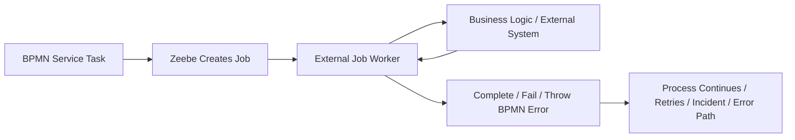

Service task dan worker adalah tempat banyak sistem Camunda 8 berhasil atau gagal. Model BPMN yang bersih bisa tetap gagal di production jika worker tidak idempotent, job type kacau, retries salah, variable contract tidak stabil, atau timeout/backpressure diabaikan.

---

## 1. Skill Target

Setelah bagian ini, kita harus bisa:

1. Mendesain job worker sebagai adapter yang aman untuk distributed orchestration.
2. Memilih job type, variable contract, retry, timeout, dan error behavior secara sadar.
3. Membedakan `complete job`, `fail job`, dan `throw BPMN error`.
4. Menulis mental model worker lifecycle yang benar.
5. Menghindari anti-pattern seperti "worker sebagai mini process engine".
6. Menyiapkan worker yang scalable, observable, idempotent, dan production-ready.

---

## 2. Service Task as Job Producer

Service task merepresentasikan work item dengan type tertentu. Saat service task dimasuki, job dibuat. Process instance berhenti di sana sampai job diselesaikan.

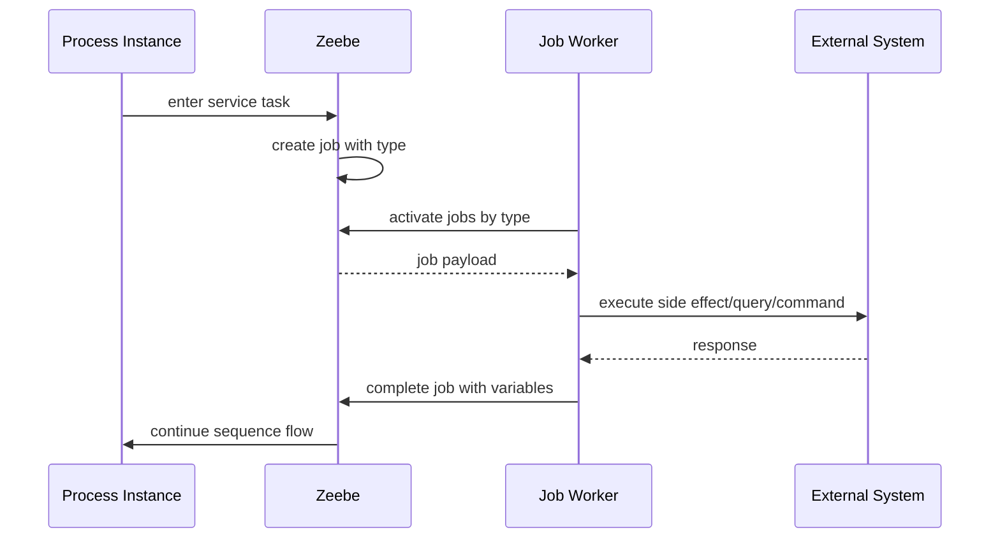

Perhatikan: Zeebe tidak memanggil worker seperti function call. Worker yang mengambil job.

Konsekuensi:

- worker boleh berada di service berbeda
- worker bisa discale horizontal
- worker bisa mati tanpa membunuh engine
- process instance bisa menunggu worker
- boundary antara process dan code menjadi asynchronous
- network failure dan duplicate handling harus dipikirkan

---

## 3. Job Type Is a Contract

Job type adalah string yang menghubungkan BPMN service task dengan worker.

Contoh job type:

```text
case.validate-complaint
case.create-record
notification.send-case-opened
evidence.request-documents
sanction.calculate-amount
```

Job type bukan detail teknis sembarangan. Ia adalah API contract.

### 3.1 Naming Guidelines

Gunakan nama yang:

- stabil
- domain-oriented
- specific enough
- tidak terlalu implementasi detail
- tidak mengandung versi kecuali ada alasan kuat
- konsisten lintas process

Bagus:

```text
case.validate-intake
case.assign-investigator
evidence.request-from-party
notice.generate-enforcement-draft
```

Kurang bagus:

```text
worker1
do-task
java-service
http-call
validate
send
```

### 3.2 Domain vs Technical Job Type

Ada dua pendekatan:

| Pendekatan | Contoh | Kapan cocok |
|---|---|---|
| Domain job type | `case.validate-intake` | logic domain jelas |
| Technical job type | `http-json-call` | generic connector-like worker |

Untuk platform internal, domain job type biasanya lebih maintainable. Technical generic worker mudah berubah menjadi "God worker" yang menjalankan semua hal berdasarkan headers.

Rule:

> Default ke domain job type. Gunakan generic technical worker hanya jika governance, validation, observability, dan security sudah matang.

---

## 4. Worker Is an Adapter, Not the Process Owner

Worker harus menjalankan satu bounded responsibility.

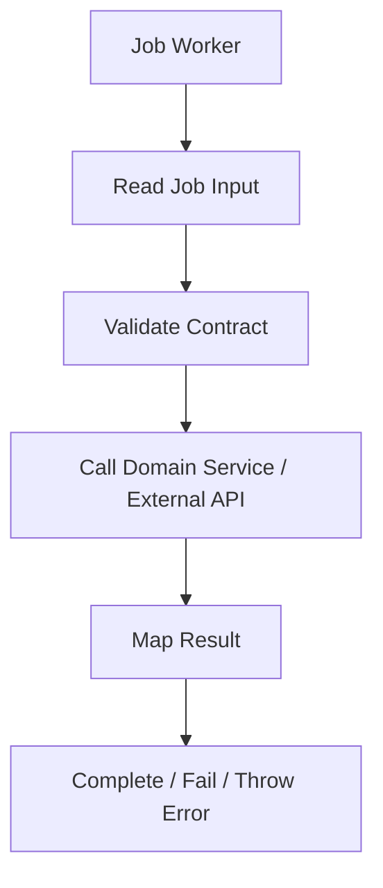

Worker tidak boleh mengambil alih orchestration utama.

### 4.1 Good Worker Responsibility

Worker boleh:

- memanggil external API
- melakukan transformasi kecil
- validasi input contract
- menjalankan calculation bounded
- menulis ke domain service
- membuat command ke system of record
- menghasilkan output variable

Worker sebaiknya tidak:

- membaca seluruh process state lalu memutuskan semua path
- menjalankan loop workflow internal panjang
- menyimpan state proses di memory lokal
- membuat retry system sendiri tanpa alasan
- menyembunyikan business decision besar
- memanggil banyak service tanpa boundary yang jelas
- menjadi orchestrator kedua di luar BPMN

### 4.2 Worker as Hexagonal Adapter

Pola arsitektur yang sehat:

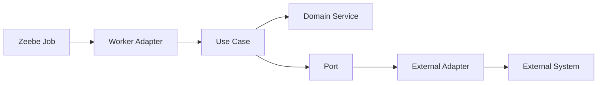

Worker adapter bertugas:

- mapping job variables ke command/use-case input
- mapping result ke output variables
- translating technical failure ke fail job
- translating business alternate outcome ke BPMN error atau structured result

Use case/domain service tetap testable tanpa Camunda dependency.

---

## 5. Job Lifecycle

Lifecycle job worker:

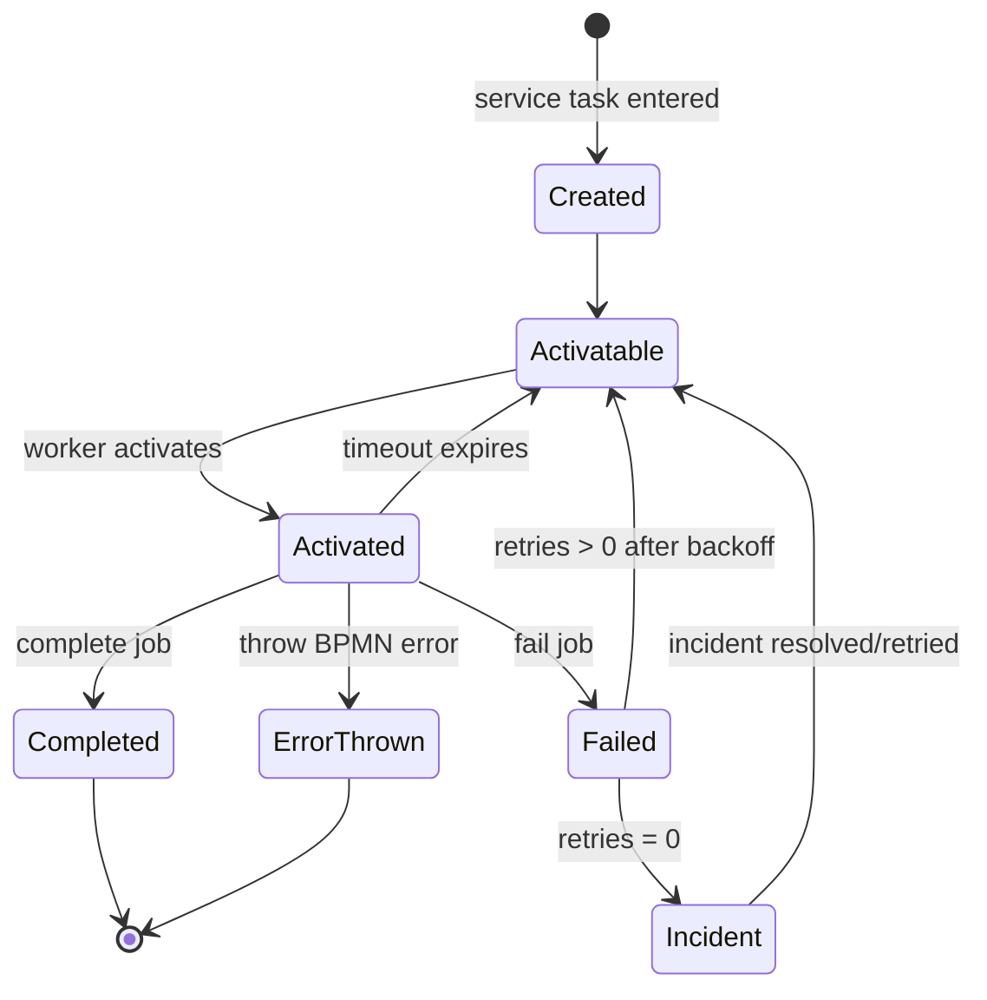

### 5.1 Created

Job dibuat saat service task active. Job membawa:

- job key
- process instance key
- process definition key
- BPMN process id
- element id
- job type
- custom headers
- variables
- retries
- deadline/timeout-related metadata

### 5.2 Activated

Worker melakukan polling/activation untuk job type tertentu. Saat job diaktifkan, job dikunci untuk worker tersebut dalam durasi timeout.

### 5.3 Completed

Worker selesai sukses dan mengirim variables output.

### 5.4 Failed

Worker gagal secara teknis atau sementara. Worker mengirim fail command dengan remaining retries dan optional backoff/error message.

### 5.5 BPMN Error Thrown

Worker mengirim BPMN error jika hasilnya adalah business error yang dimodelkan di BPMN.

### 5.6 Timed Out

Jika worker mengaktifkan job lalu tidak menyelesaikannya sebelum timeout, job bisa kembali tersedia untuk worker lain. Karena itu idempotency sangat penting.

---

## 6. Complete Job

Complete job digunakan saat worker berhasil menyelesaikan tanggung jawabnya.

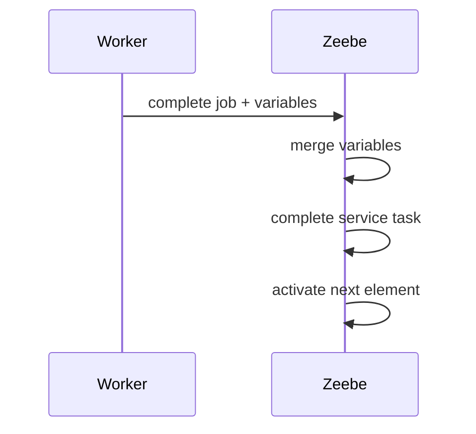

Contoh output variables:

```json
{
  "validation": {
    "isValid": true,
    "reason": null,
    "validatedAt": "2026-06-28T10:15:30Z"
  }
}
```

### 6.1 Completion Rules

Worker boleh complete hanya jika:

- input valid
- side effect yang menjadi tanggung jawabnya sudah berhasil atau aman dianggap accepted
- output variables memenuhi contract
- result tidak membutuhkan business alternate path
- tidak ada ambiguity pada outcome

### 6.2 Complete with Minimal Output

Jangan mengembalikan semua response external system mentah-mentah.

Buruk:

```json
{
  "externalResponse": {
    "massive": "payload",
    "internalFields": "...",
    "sensitiveData": "..."
  }
}
```

Baik:

```json
{
  "caseRecord": {
    "caseId": "CASE-2026-00921",
    "created": true,
    "systemOfRecord": "case-core"
  }
}
```

Process variable harus memuat hal yang dibutuhkan untuk proses, bukan semua data yang tersedia.

---

## 7. Fail Job

Fail job digunakan untuk technical/operational failure.

Contoh:

- HTTP 503
- timeout ke downstream
- temporary database lock
- rate limit
- transient network failure
- dependency unavailable
- unexpected serialization issue

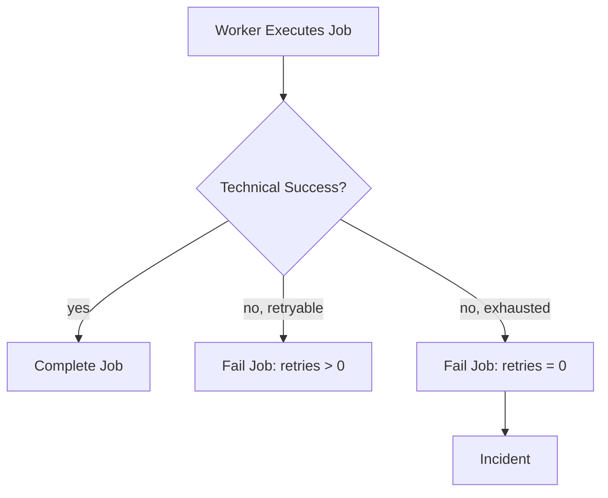

### 7.1 Remaining Retries

Retries adalah bagian dari job state. Saat fail job dengan retries lebih dari nol, job akan tersedia lagi sesuai retry/backoff semantics. Saat retries menjadi nol, incident dibuat.

Pola sederhana:

```text
initial retries: 3

attempt 1 fails -> fail job retries = 2
attempt 2 fails -> fail job retries = 1
attempt 3 fails -> fail job retries = 0 -> incident
```

### 7.2 Error Message Must Be Actionable

Buruk:

```text
Failed
```

Lebih baik:

```text
Downstream case-core returned HTTP 503 while creating case record. correlationId=abc-123, caseDraftId=DR-9912. Retry may succeed.
```

Jangan bocorkan secret/token/PII di error message.

### 7.3 Retry Backoff

Retry backoff mencegah retry langsung yang memperparah outage. Backoff harus disesuaikan:

| Failure | Backoff |
|---|---|
| short network glitch | seconds |
| rate limit | based on rate limit window |
| downstream maintenance | minutes |
| permanent validation issue | do not retry as technical failure |

Anti-pattern:

- retry langsung 100 kali
- semua failure disamakan
- tidak ada jitter di worker-side calls
- retry Camunda ditambah retry HTTP client tak terkendali

---

## 8. Throw BPMN Error

Throw BPMN error digunakan untuk business error yang sudah dimodelkan.

Contoh:

- complaint duplicate
- applicant not eligible
- evidence incomplete
- case out of jurisdiction
- appeal submitted after deadline

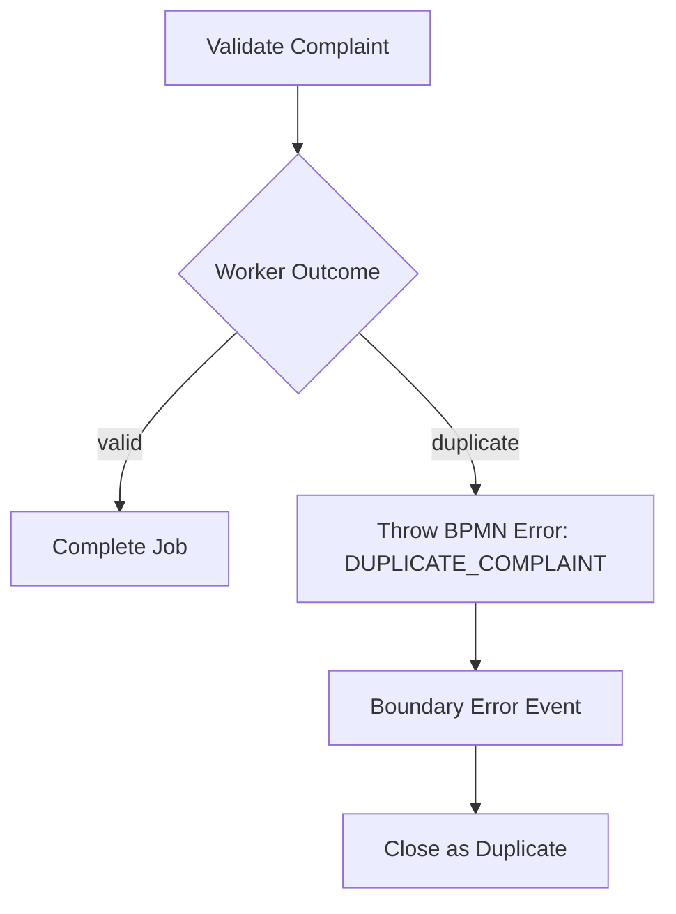

### 8.1 Technical Failure Is Not BPMN Error

Jangan lakukan ini:

```text
HTTP 503 -> throw BPMN error DOWNSTREAM_UNAVAILABLE
```

Kecuali business benar-benar ingin mengambil alternate path ketika dependency unavailable. Biasanya ini technical failure dan harus fail job.

### 8.2 Business Error Taxonomy

Gunakan error code yang stabil:

```text
CASE_DUPLICATE
OUT_OF_JURISDICTION
EVIDENCE_INCOMPLETE
APPEAL_DEADLINE_EXPIRED
POLICY_NOT_APPLICABLE
```

Hindari:

```text
ERROR_1
BAD_REQUEST
NOT_OK
FAIL
INVALID
```

Error code adalah public contract antara worker dan BPMN model.

---

## 9. Complete vs Fail vs Throw Error

Tabel keputusan:

| Outcome | Worker action | Process meaning |
|---|---|---|
| Work succeeded | complete job | process continues |
| Temporary technical failure | fail job with retries > 0 | retry later |
| Technical failure exhausted | fail job with retries = 0 | incident |
| Expected business alternate outcome | throw BPMN error or complete with result for gateway | modeled business path |
| Invalid process contract | fail job or incident | model/data bug |
| Duplicate command but idempotently accepted | complete job with existing result | process continues safely |

### 9.1 BPMN Error vs Gateway Result

Ada dua cara memodelkan business alternate outcome:

#### Option A — Complete job, then gateway

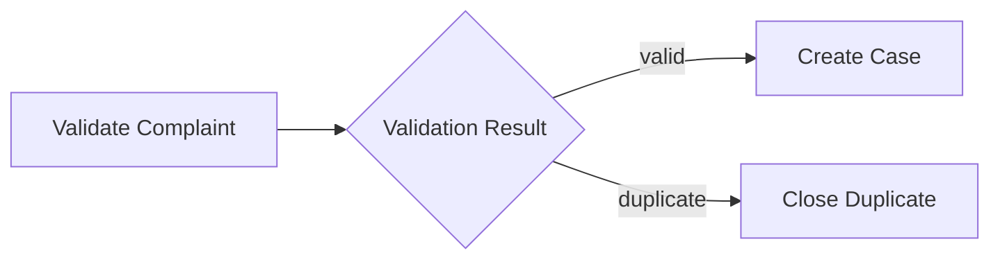

Worker completes with:

```json
{
  "validation": {
    "status": "duplicate"
  }
}
```

Cocok jika outcome adalah normal decision result.

#### Option B — Throw BPMN error

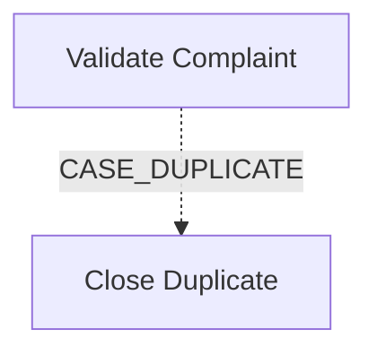

Cocok jika activity cannot complete normally karena business exception yang perlu boundary semantics.

Rule praktis:

- Use gateway result untuk expected classification.
- Use BPMN error untuk exceptional-but-business-modeled failure of an activity.
- Jangan gunakan BPMN error untuk semua branching.

---

## 10. Job Timeout

Saat worker mengaktifkan job, ada timeout/deadline. Jika worker tidak complete/fail/error sebelum timeout, job bisa diaktifkan lagi.

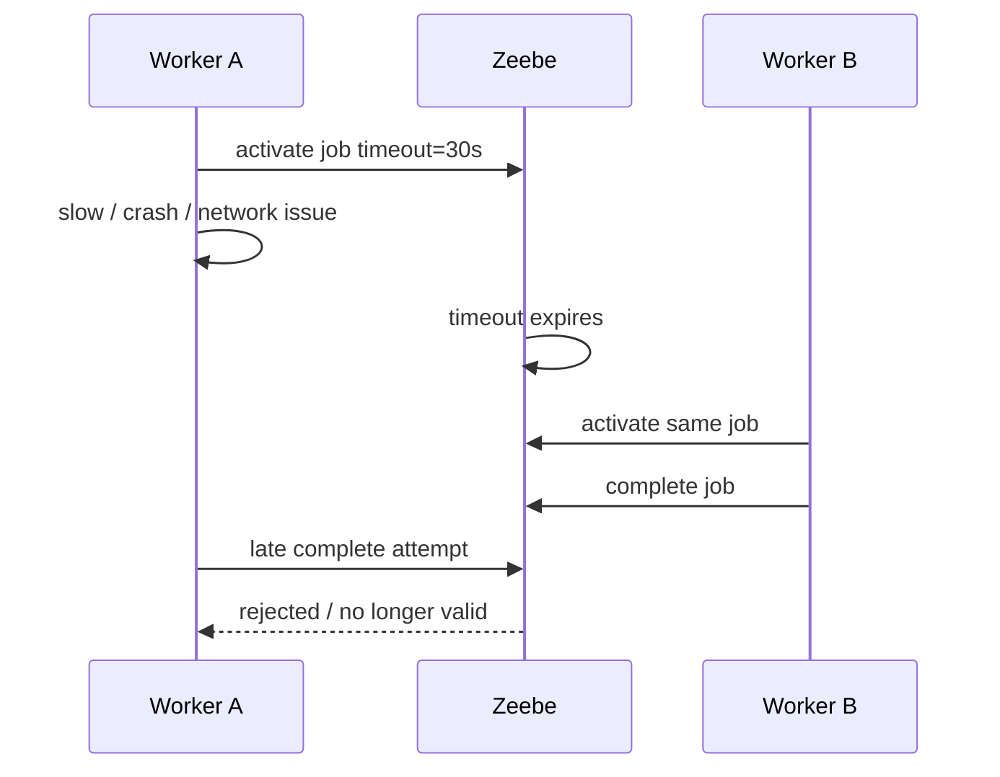

Konsekuensi:

- worker harus idempotent
- external call harus punya idempotency key
- late completion harus ditangani
- job timeout harus lebih besar dari normal execution time
- jangan set timeout terlalu tinggi tanpa alasan

### 10.1 Choosing Timeout

| Work type | Timeout guideline |
|---|---|
| quick calculation | short |
| HTTP call | slightly above client timeout + margin |
| document generation | based on expected duration |
| long-running external process | do not block worker; start external job then wait for message |
| human work | use user task, not service task timeout |

Anti-pattern:

> Worker menunggu external batch selesai selama 45 menit sambil memegang job.

Lebih baik:

1. service task mengirim command ke external system
2. complete job dengan `requestId`
3. process menunggu message callback
4. external system publish message saat selesai

---

## 11. Worker Polling and Activation

Worker tidak dipanggil oleh Zeebe. Worker membuka subscription/polling ke job type.

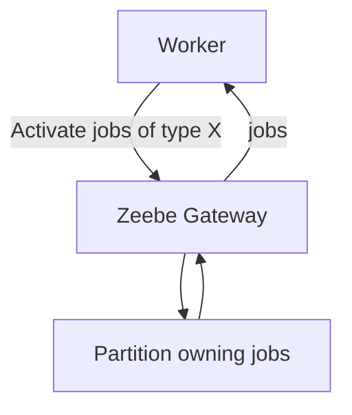

Parameter penting:

| Parameter | Makna |
|---|---|
| job type | jenis job yang diambil |
| max jobs active | jumlah job yang boleh aktif bersamaan |
| timeout | durasi lock/lease job |
| poll interval/backoff | behavior saat tidak ada job/failure |
| fetch variables | subset variables yang diambil |
| worker name/id | identitas worker untuk observability |

### 11.1 Fetch Variables

Jangan ambil semua variable jika tidak perlu.

Buruk:

```text
fetch all variables
```

Baik:

```text
fetch case.caseId, triage.riskBand, evidence.requiredCategories
```

Manfaat:

- payload kecil
- coupling lebih rendah
- sensitive data lebih terkendali
- worker contract lebih jelas

---

## 12. Worker Concurrency

Worker concurrency harus disesuaikan dengan:

- CPU work
- blocking IO
- external system capacity
- job timeout
- rate limit
- downstream SLA
- retry behavior
- partition distribution

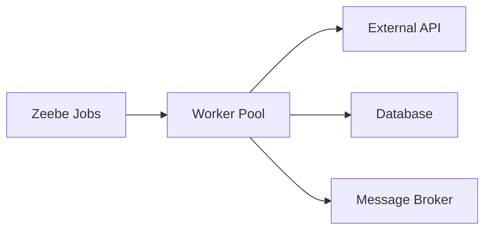

Bottleneck sering bukan Zeebe. Bottleneck sering ada di:

- downstream API
- database connection pool
- thread pool
- serialization
- network
- rate limiting
- worker CPU
- bad retry storm

### 12.1 Max Jobs Active

Jika `maxJobsActive` terlalu kecil:

- throughput rendah
- worker idle
- process backlog naik

Jika terlalu besar:

- worker mengambil terlalu banyak job
- job timeout meningkat
- downstream overloaded
- memory naik
- retry storm

Mulai dari angka konservatif, load test, lalu tune.

### 12.2 Horizontal Scaling

Beberapa worker instance bisa subscribe job type yang sama.

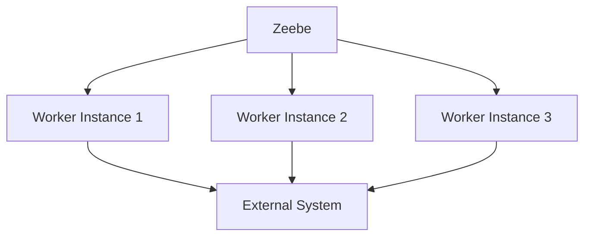

Pastikan:

- worker stateless atau state externalized
- idempotency kuat
- downstream capacity cukup
- metrics per instance dan aggregate tersedia
- deployment rolling tidak memutus job lama secara buruk

---

## 13. Backpressure

Backpressure terjadi ketika sistem menahan laju supaya tidak collapse.

Dalam Camunda 8 ecosystem, backpressure bisa muncul dari:

- Zeebe cluster load
- gateway limit
- worker overload
- external dependency overload
- network saturation
- exporter/secondary storage lag

Worker harus menghormati sinyal failure/backoff, bukan retry agresif.


Ini retry amplification loop.

Mitigasi:

- bounded concurrency
- retry backoff
- circuit breaker untuk external calls
- rate limiter
- queue depth metrics
- worker autoscaling berbasis backlog dan latency
- bulkhead per downstream
- failure classification yang benar

---

## 14. Idempotency

Job worker harus diasumsikan bisa mengeksekusi job lebih dari sekali.

Penyebab:

- worker complete command timeout
- worker crash setelah side effect tetapi sebelum complete
- job timeout terlalu pendek
- network failure
- retry
- redeployment
- duplicate external request

### 14.1 Idempotency Key

Gunakan idempotency key stabil.

Candidate:

- process instance key + element id
- process business id + activity semantic
- external request id yang disimpan di variable
- domain command id

Contoh:

```text
idempotencyKey = caseId + ":create-case-record"
```

Atau:

```text
idempotencyKey = processInstanceKey + ":" + elementId
```

Pilihan tergantung apakah business operation harus idempotent per process attempt atau per domain entity.

### 14.2 Idempotent Create Pattern

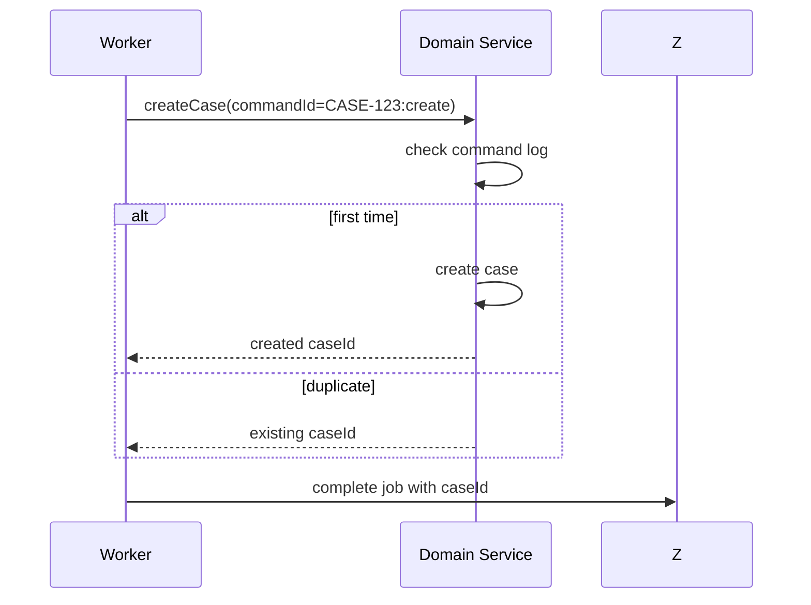

Domain service sebaiknya punya command log/idempotency table.

### 14.3 Idempotent Notification Pattern

Notifikasi adalah side effect yang sering duplicate.

Gunakan:

- notification id
- recipient + template + business event id
- outbox pattern
- external provider idempotency key jika tersedia
- audit log

Jangan mengandalkan "worker tidak akan pernah retry".

---

## 15. Variable Contract

Worker input/output harus dianggap API.

### 15.1 Input Contract Example

```json
{
  "case": {
    "caseId": "CASE-2026-00921",
    "jurisdiction": "ID",
    "category": "market_conduct"
  },
  "complaint": {
    "complaintId": "CMP-812",
    "submittedAt": "2026-06-28T09:00:00Z"
  }
}
```

### 15.2 Output Contract Example

```json
{
  "validation": {
    "status": "valid",
    "checkedAt": "2026-06-28T09:03:17Z",
    "rulesetVersion": "intake-validation-2026.06"
  }
}
```

### 15.3 Contract Rules

- required fields explicit
- optional fields documented
- enum values stable
- timestamps include timezone
- numbers have units/currency
- nested object ownership clear
- backward-compatible addition preferred
- destructive rename requires versioning/migration

---

## 16. Custom Headers

Custom headers pada service task bisa membawa metadata untuk worker.

Contoh:

```json
{
  "operation": "create-case",
  "priority": "high",
  "schemaVersion": "2026-06"
}
```

Gunakan untuk:

- routing behavior kecil
- template name
- operation name
- schema version
- static config
- feature flag yang dikontrol model

Jangan gunakan header untuk:

- data business besar
- secret
- dynamic state
- complex decision table
- mengganti DMN/gateway

Header adalah konfigurasi task, bukan database mini.

---

## 17. Java Worker Design

Struktur worker Java yang sehat:

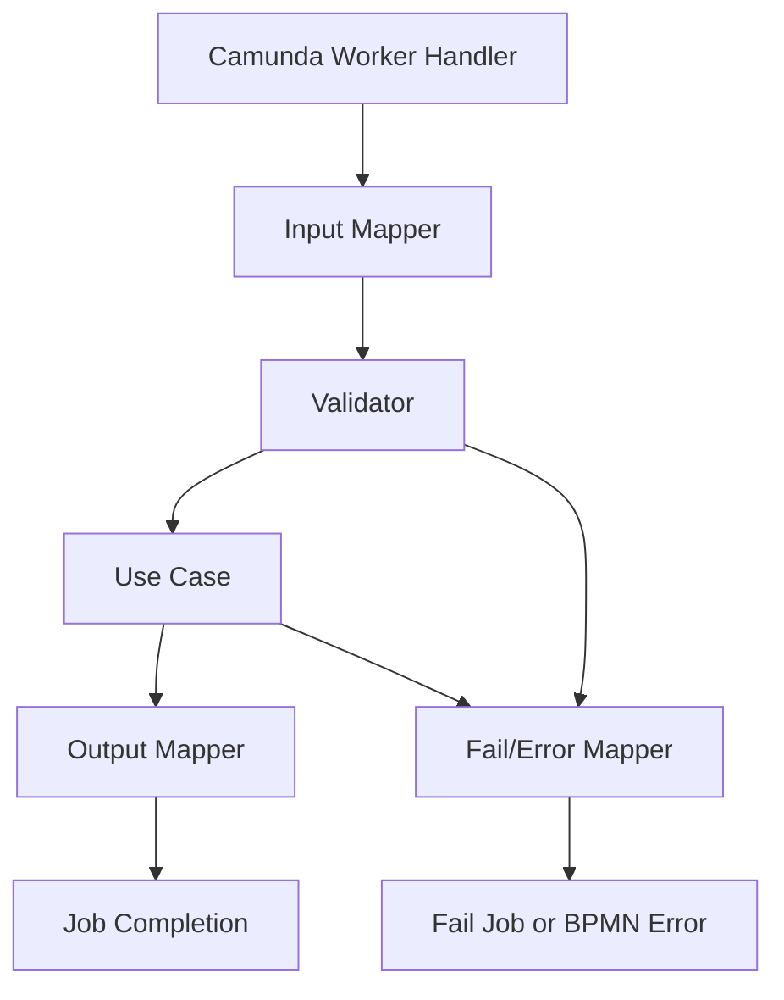

### 17.1 Layering

```text
adapter-camunda/
  CaseValidationWorker.java
  JobVariableMapper.java

application/
  ValidateComplaintUseCase.java
  ValidateComplaintCommand.java
  ValidateComplaintResult.java

domain/
  ComplaintPolicy.java
  JurisdictionRule.java

infrastructure/
  CaseCoreClient.java
  IdempotencyRepository.java
```

Worker class tidak boleh penuh business logic. Ia boundary adapter.

### 17.2 Pseudocode

```java
public final class ValidateComplaintWorker {

    private final ValidateComplaintUseCase useCase;
    private final JobResultMapper mapper;

    public void handle(JobClient client, ActivatedJob job) {
        try {
            ValidateComplaintCommand command = mapper.toCommand(job);
            ValidateComplaintResult result = useCase.validate(command);

            if (result.isDuplicate()) {
                client.newThrowErrorCommand(job)
                    .errorCode("CASE_DUPLICATE")
                    .errorMessage("Complaint is duplicate of case " + result.duplicateCaseId())
                    .variables(mapper.toDuplicateVariables(result))
                    .send()
                    .join();
                return;
            }

            client.newCompleteCommand(job)
                .variables(mapper.toVariables(result))
                .send()
                .join();

        } catch (RetryableDependencyException ex) {
            client.newFailCommand(job)
                .retries(job.getRetries() - 1)
                .errorMessage(safeMessage(ex))
                .retryBackoff(Duration.ofSeconds(30))
                .send()
                .join();

        } catch (InvalidJobContractException ex) {
            client.newFailCommand(job)
                .retries(0)
                .errorMessage("Invalid job contract: " + safeMessage(ex))
                .send()
                .join();
        }
    }
}
```

Catatan:

- contoh ini pseudocode pedagogis
- pada production, hindari `.join()` sembarangan jika framework sudah menyediakan async handling
- error mapping harus disesuaikan dengan client/starter yang digunakan
- jangan log sensitive variables

---

## 18. Spring Boot Worker Model

Dengan Spring Boot starter, worker bisa diregistrasi sebagai bean/annotation handler. Namun mental model tetap sama: worker mengambil job, menjalankan logic, lalu complete/fail/error.

Struktur umum:

```java
@Component
public class CaseWorkers {

    private final ValidateComplaintUseCase validateComplaint;

    public CaseWorkers(ValidateComplaintUseCase validateComplaint) {
        this.validateComplaint = validateComplaint;
    }

    @JobWorker(type = "case.validate-complaint")
    public Map<String, Object> validateComplaint(final ActivatedJob job) {
        // Map variables, call use case, return output variables
        return Map.of(
            "validation",
            Map.of(
                "status", "valid",
                "checkedAt", Instant.now().toString()
            )
        );
    }
}
```

Untuk worker serius, jangan biarkan method annotation menjadi tempat semua logic. Tetap gunakan mapper/use case/error classifier.

### 18.1 Return Map vs Explicit Completion

Ada worker style yang mengembalikan map untuk auto-complete, dan ada style eksplisit menggunakan client command. Pilih berdasarkan kebutuhan:

| Style | Cocok untuk |
|---|---|
| Auto-complete return variables | simple happy path |
| Explicit command | BPMN error, custom fail, custom retry, advanced control |

Jika worker punya business errors dan retry classification, explicit handling sering lebih jelas.

---

## 19. Error Classification Architecture

Buat error classifier.

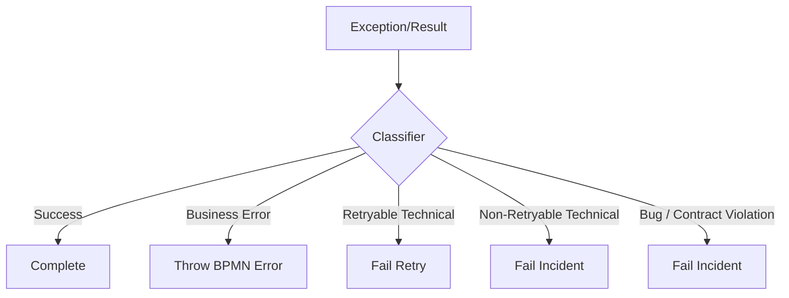

Contoh kategori:

| Category | Examples | Action |
|---|---|---|
| Success | external accepted | complete |
| Business alternate | duplicate, ineligible | BPMN error or gateway result |
| Retryable dependency | 503, timeout | fail retries > 0 |
| Non-retryable dependency | 404 config missing | fail retries = 0 |
| Contract bug | missing required variable | fail retries = 0 |
| Security failure | invalid credentials | fail retries = 0 and alert |
| Rate limit | 429 | fail with backoff |

Error classifier harus reusable lintas worker.

---

## 20. Worker Observability

Worker tanpa observability adalah production liability.

Minimal metrics:

- jobs activated count
- jobs completed count
- jobs failed count
- BPMN errors thrown count
- handling duration
- external call duration
- retry count distribution
- incident-causing failures
- timeout/late completion symptoms
- payload size
- concurrency active jobs
- downstream status code distribution

Logs harus mengandung:

- job type
- process instance key
- element id
- business correlation id
- worker instance id
- attempt/retries
- external correlation id
- sanitized error message

Trace context:

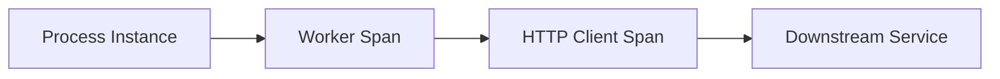

OpenTelemetry-style tracing sangat membantu untuk melihat path dari process ke service.

Jangan log:

- access token
- password
- PII tanpa masking
- full document payload
- legal sensitive evidence
- giant variables

---

## 21. Worker Deployment

Worker deployment harus mengikuti prinsip microservice production biasa.

Checklist:

- graceful shutdown
- readiness probe
- liveness probe
- bounded thread pool
- bounded HTTP connection pool
- config per environment
- secret management
- retry/backoff config
- idempotency store
- structured logs
- metrics endpoint
- versioned dependencies
- rolling deployment tested
- worker disabled flag jika perlu
- compatibility with BPMN deployed versions

### 21.1 Graceful Shutdown

Worker yang sedang memproses job harus diberi waktu menyelesaikan atau fail dengan aman.

Tanpa graceful shutdown:

- job timeout meningkat
- duplicate execution naik
- partial side effect naik
- deployment menyebabkan incident/noise

### 21.2 Compatibility

Jangan deploy worker baru yang hanya mendukung variable schema baru jika process lama masih berjalan.

Pola:

- support old and new schema during transition
- deploy backward-compatible worker first
- deploy BPMN new version
- migrate/complete old instances
- remove old support later

---

## 22. Service Task Granularity

Pertanyaan desain: satu service task harus sebesar apa?

Terlalu kecil:


Dampak:

- BPMN noisy
- overhead tinggi
- business meaning tenggelam

Terlalu besar:

```mermaid
flowchart LR
    A[Process Entire Case]
```

Dampak:

- BPMN tidak menjelaskan orchestration
- worker menjadi monolith
- observability buruk
- retry tidak granular

Rule:

> Service task harus merepresentasikan satu business-capability step yang punya clear responsibility, input, output, failure mode, dan owner.

Contoh granularity baik:

```mermaid
flowchart LR
    A[Validate Intake] --> B[Create Case Record] --> C[Assign Investigator] --> D[Send Opening Notice]
```

Masing-masing meaningful, observable, dan testable.

---

## 23. Long-Running External Work

Service task worker tidak ideal untuk menunggu proses eksternal panjang secara blocking.

Buruk:

```mermaid
sequenceDiagram
    participant W as Worker
    participant S as External Batch
    W->>S: start report generation
    W->>S: wait 30 minutes
    S-->>W: report ready
    W->>Z: complete job
```

Lebih baik:

```mermaid
flowchart TD
    A[Start Report Generation] --> B((Wait Report Ready Message))
    B --> C[Attach Report]
```

Worker pertama:

1. kirim command ke external system
2. simpan request id
3. complete job

Lalu process menunggu message callback dengan correlation key.

Manfaat:

- worker tidak menahan job lama
- timeout lebih sederhana
- external completion menjadi event eksplisit
- process visibility lebih baik
- recovery lebih jelas

---

## 24. Worker and Transaction Boundaries

Worker sering melakukan:

1. call external service
2. update local database
3. complete job

Ini bukan satu atomic transaction dengan Zeebe.

```mermaid
sequenceDiagram
    participant W as Worker
    participant DB as Local DB
    participant Z as Zeebe

    W->>DB: write side effect
    DB-->>W: committed
    W->>Z: complete job
    Z--xW: network failure
```

Apa statusnya?

- DB sudah commit
- worker tidak yakin complete job diterima
- job bisa retry
- side effect bisa duplicate jika tidak idempotent

Solusi:

- idempotency key
- transactional outbox untuk side effects tertentu
- command log
- detect existing operation on retry
- complete with existing result

Jangan mencari "distributed transaction" sebagai default. Desain untuk at-least-once boundary.

---

## 25. Outbox Pattern with Worker

Jika worker perlu publish event setelah domain change:

```mermaid
flowchart TD
    A[Worker] --> B[Domain Transaction]
    B --> C[Update Domain State]
    B --> D[Insert Outbox Event]
    D --> E[Outbox Publisher]
    E --> F[Message Broker]
    A --> G[Complete Job]
```

Catatan:

- complete job dan DB transaction tetap tidak atomik bersama
- outbox menjamin domain event publish setelah DB commit
- idempotency tetap diperlukan untuk retry worker
- process variable bisa menyimpan domain command result

---

## 26. Worker Security

Worker adalah privileged integration component.

Security checklist:

- client credentials scoped minimal
- secret tidak ada di BPMN variable/header
- TLS configured
- token refresh handled
- outbound API credentials isolated
- PII masked in logs
- worker only fetches needed variables
- tenant/environment boundary jelas
- audit for manual completion/failure if supported
- dependency scanning

Worker sering punya akses ke:

- process data
- domain systems
- notification systems
- document stores
- identity/user info

Jadi worker harus diperlakukan sebagai production service, bukan script kecil.

---

## 27. Job Worker Testing

Testing pyramid:

```mermaid
flowchart TD
    A[Unit Test Mapper/Error Classifier] --> B[Use Case Tests]
    B --> C[Worker Handler Tests]
    C --> D[BPMN Contract Tests]
    D --> E[Integration Tests with Camunda]
    E --> F[Load/Failure Tests]
```

### 27.1 Unit Test

Test:

- variable mapping
- missing required field
- enum handling
- error classification
- output variable shape
- idempotency key generation

### 27.2 Worker Handler Test

Test:

- success -> complete variables
- duplicate -> BPMN error
- retryable dependency -> fail with retries
- non-retryable contract issue -> incident path
- sanitized error message
- no sensitive log

### 27.3 BPMN Contract Test

Test process path:

- worker output drives gateway correctly
- BPMN error caught by correct boundary event
- incident created for missing variable
- retries behave as expected
- message wait after start command pattern works

### 27.4 Failure Test

Simulate:

- worker crashes after external side effect
- complete command timeout
- downstream slow response
- duplicate job activation after timeout
- rate limit storm
- invalid variable schema

---

## 28. Worker Anti-Patterns

### 28.1 God Worker

One worker handles many unrelated job types with huge switch.

```java
switch (operation) {
    case "validate": ...
    case "notify": ...
    case "assign": ...
    case "calculate": ...
    case "archive": ...
}
```

Dampak:

- ownership kabur
- deploy risk besar
- observability buruk
- security scope terlalu luas
- business process tersembunyi di code

### 28.2 BPMN as Thin Wrapper Around Worker

Gejala:

```mermaid
flowchart LR
    A((Start)) --> B[Run Everything] --> C((End))
```

Dampak:

- Camunda hanya menjadi queue
- process visibility tidak bernilai
- audit trail lemah
- business tidak bisa review lifecycle

### 28.3 Worker Without Idempotency

Gejala:

- create record duplicate
- double notification
- double payment/request
- duplicate sanction letter
- repeated document generation

Dampak:

- regulatory/financial/legal risk
- manual cleanup
- user trust turun

### 28.4 Infinite Technical Retry

Gejala:

- retries tinggi tanpa classifier
- backoff tidak ada
- incident tidak pernah muncul
- dependency down menyebabkan storm

Dampak:

- overload
- noisy logs
- delayed recovery
- process stuck invisible

### 28.5 Business Errors as Incidents

Gejala:

- ineligible applicant -> fail retries 0
- duplicate case -> incident
- missing evidence -> incident

Dampak:

- operator menangani business normal flow sebagai error
- SLA dan metrics salah
- audit buruk

### 28.6 Fetch All Variables Everywhere

Gejala:

- every worker receives all process variables
- payload besar
- sensitive data tersebar
- coupling tinggi

Dampak:

- privacy risk
- performance issue
- schema evolution sulit

### 28.7 Long Blocking Worker

Gejala:

- worker menunggu external system lama
- job timeout tinggi sekali
- worker thread habis

Dampak:

- low throughput
- hard recovery
- duplicate risk
- poor observability

---

## 29. Production Checklist for Service Task

Untuk setiap service task, review:

### 29.1 Contract

- Job type jelas?
- Input variables documented?
- Output variables documented?
- Error codes documented?
- Headers documented?
- Schema version strategy ada?

### 29.2 Execution

- Worker owner jelas?
- Timeout disesuaikan?
- Retries disesuaikan?
- Backoff ada?
- Idempotency key ada?
- External side effects classified?

### 29.3 Failure

- Retryable vs non-retryable jelas?
- BPMN error vs fail job jelas?
- Incident message actionable?
- Runbook ada?
- Late completion/timeout considered?

### 29.4 Operations

- Metrics ada?
- Logs structured?
- Trace correlation ada?
- Alerts ada?
- Dashboard ada?
- Worker deployment safe?

### 29.5 Security

- Fetch variables minimal?
- Secrets tidak bocor?
- PII masked?
- Credentials scoped?
- Tenant/environment separation?

---

## 30. Example: Regulatory Case Worker Design

Process fragment:

```mermaid
flowchart TD
    A[Validate Intake] --> B{Validation Status}
    B -->|valid| C[Create Case Record]
    B -->|duplicate| D[Close as Duplicate]
    B -->|out of jurisdiction| E[Transfer or Reject]
```

### 30.1 Service Task

Job type:

```text
case.validate-intake
```

Input variables:

```json
{
  "complaint": {
    "complaintId": "CMP-10092",
    "submittedAt": "2026-06-28T09:00:00Z",
    "jurisdiction": "ID",
    "subjectEntityId": "ENT-812"
  }
}
```

Output variables on success:

```json
{
  "intakeValidation": {
    "status": "valid",
    "riskBand": "medium",
    "rulesetVersion": "intake-2026.06",
    "validatedAt": "2026-06-28T09:01:22Z"
  }
}
```

Business duplicate as gateway result:

```json
{
  "intakeValidation": {
    "status": "duplicate",
    "duplicateCaseId": "CASE-2026-00812",
    "rulesetVersion": "intake-2026.06"
  }
}
```

Or as BPMN error if model uses boundary error:

```text
errorCode = CASE_DUPLICATE
```

Technical failure:

```text
case-core search endpoint timed out after 2s. complaintId=CMP-10092. Retry may succeed.
```

### 30.2 Idempotency

For validation-only read operation, idempotency might be less critical. For create case:

```text
idempotencyKey = complaintId + ":create-case-record"
```

Domain service behavior:

- if no case exists for key, create case
- if exists, return existing case id
- worker completes with case id either way

---

## 31. Local Development Strategy

For developer productivity:

- run Camunda locally or use SaaS dev cluster
- deploy BPMN automatically in dev
- keep worker config externalized
- use test process ids
- use deterministic sample variables
- provide replayable job payload examples
- use wiremock/testcontainers for downstream
- provide Makefile/script for common operations
- expose metrics/logs locally

A good internal handbook should include:

```text
make camunda-up
make deploy-process
make start-instance SAMPLE=valid-case
make worker-run
make test-process
```

Golden path matters. If every developer has a different worker setup, production consistency suffers.

---

## 32. Worker Review Rubric

A worker is production-ready when:

| Dimension | Standard |
|---|---|
| Responsibility | one bounded job type/capability |
| Contract | input/output/error documented |
| Idempotency | side effects protected |
| Failure | classified and mapped |
| Observability | metrics/logs/traces |
| Security | least privilege, sanitized logs |
| Testing | unit, contract, integration, failure |
| Scaling | concurrency/backpressure tuned |
| Compatibility | supports process version transition |
| Runbook | incident handling documented |

Top-tier review question:

> "What happens if this worker completes the external side effect, crashes before completing the job, and the job is executed again by another worker?"

If answer is unclear, worker is not production-ready.

---

## 33. Summary

Service task dan job worker adalah boundary paling penting di Camunda 8.

Key mental models:

- service task creates job
- process waits until job outcome
- worker pulls work, engine does not call worker inline
- complete job means successful work
- fail job means technical/operational failure
- throw BPMN error means modeled business alternate outcome
- timeout implies possible duplicate execution
- retries require idempotency
- job type is a contract
- variables are API payload
- worker is adapter, not process owner
- observability and runbook are part of design

Kalau Part 005 mengajarkan cara membaca BPMN sebagai execution contract, Part 006 mengajarkan bagaimana kontrak itu menyentuh Java code dan external systems dengan aman.

Di part berikutnya, kita masuk lebih dalam ke **error events, failures, incidents, dan boundary decision antara business error vs technical failure**.

---

## References

- Camunda 8 Docs — Service tasks: `https://docs.camunda.io/docs/components/modeler/bpmn/service-tasks/`
- Camunda 8 Docs — Job workers concept: `https://docs.camunda.io/docs/components/concepts/job-workers/`
- Camunda 8 Docs — Java Client Job Worker: `https://docs.camunda.io/docs/apis-tools/java-client/job-worker/`
- Camunda 8 Docs — Camunda Spring Boot Starter: `https://docs.camunda.io/docs/apis-tools/camunda-spring-boot-starter/getting-started/`
- Camunda 8 Docs — Dealing with problems and exceptions: `https://docs.camunda.io/docs/components/best-practices/development/dealing-with-problems-and-exceptions/`
- Camunda 8 Docs — Fail job REST API: `https://docs.camunda.io/docs/apis-tools/orchestration-cluster-api-rest/specifications/fail-job/`
