# Part 007 — Error Events, Failures, and Incidents

> Goal: build a production mental model for **what should be retried, what should be modeled, what should become an incident, and what should be escalated to a human/operator**.

This part is intentionally not a generic BPMN error primer. We assume you already understand the basic service task/job worker model from the previous part. Here we focus on the failure semantics that distinguish senior Camunda 8 engineers from people who merely know how to attach a boundary event.

In Camunda 8, failure handling is not just a modeling concern. It is a distributed-systems contract among:

- the BPMN model,
- the Zeebe broker,
- the job worker,
- external systems,
- Operate/operator intervention,
- domain stakeholders,
- audit/compliance expectations.

The critical mistake is treating all failures as one thing.

They are not.

A payment rejection, missing evidence, malformed variable, database outage, unexpected NullPointerException, unhandled BPMN error, failed FEEL expression, expired token, and unsupported regulatory decision path are all “errors” in casual language. In Zeebe, they require different reactions.

---

## 1. Kaufman Skill Deconstruction

Following Josh Kaufman's method, we break this skill into sub-skills that can be practiced independently.

### 1.1 Target Performance

After this part, you should be able to look at any failed process instance and answer quickly:

1. Is this a **business reaction** that belongs in BPMN?
2. Is this a **technical reaction** that belongs in retry/backoff/incident handling?
3. Is this a **model defect** that must not be patched operationally forever?
4. Is this a **data contract defect** between worker and process?
5. Is this a **side-effect consistency problem** requiring idempotency or compensation?
6. Is this an **operator intervention point** that must be documented and audited?

### 1.2 Sub-Skills

| Sub-skill | You know it when you can... |
|---|---|
| Error taxonomy | Classify a failure without debating whether it is “business” or “technical” forever. |
| BPMN error modeling | Use error boundary events and error event subprocesses only when a modeled process reaction is required. |
| Retry design | Choose retry count/backoff based on failure type and external dependency behavior. |
| Incident design | Design incidents as actionable operational stops, not as hidden business workflow states. |
| Worker exception mapping | Map Java exceptions into complete/fail/throw-error decisions consistently. |
| Operate runbook | Provide enough context for operators to resolve incidents safely. |
| Audit defensibility | Explain why a process took a failure path, retried, stopped, or escalated. |

### 1.3 Practice Loop

For each service task in a real process model, ask:

```text
What can go wrong?
Can it safely retry?
Would retrying duplicate a side effect?
Does the business need to see a different path?
If it stops, who can fix it?
What information do they need?
How do we prove what happened later?
```

This is the actual skill. The notation is secondary.

---

## 2. The Core Mental Model: Error Handling Is Reaction Design

A weak model asks:

> “Is this a business error or technical error?”

A stronger model asks:

> “What reaction should the system take, and at what layer should that reaction live?”

Camunda's own guidance is aligned with this distinction: what matters is not the source of the problem, but whether the reaction is modeled in the business process or handled generically through retries/incidents.

### 2.1 Reaction Categories

| Reaction | Layer | Typical use |
|---|---|---|
| Complete job | Worker → Zeebe | Work succeeded; process may continue. |
| Fail job with retries | Worker/engine | Temporary failure; retry later. |
| Fail job with zero retries | Worker/engine/operator | Processing cannot continue automatically; create incident. |
| Throw BPMN error | BPMN model | Known alternative process path. |
| Escalate to human task | BPMN model | Human decision required. |
| Compensation | BPMN/domain | Previous successful side effect must be counteracted. |
| Cancel/terminate | BPMN/model | Process should be stopped by design. |
| External alert | Observability/platform | Ops must investigate system health. |

The advanced skill is choosing correctly under pressure.

### 2.2 A Practical Decision Tree

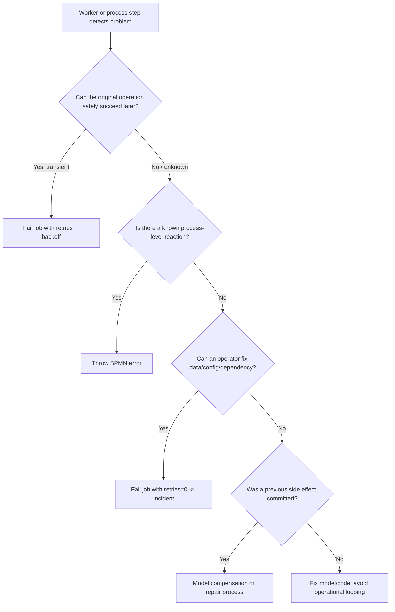

Notice the position of BPMN error: it is not the default. It is used when the process has a meaningful modeled reaction.

---

## 3. Job Outcomes: Complete, Fail, Throw Error

When a worker handles a job, there are three conceptual outcomes.

### 3.1 Complete Job

Use `CompleteJob` when:

- the external work succeeded,
- the side effect is complete or intentionally accepted,
- the result variables are safe to merge into the process,
- continuing the process is correct.

Example:

```java
client.newCompleteCommand(job.getKey())
    .variables(Map.of(
        "payment", Map.of(
            "status", "CAPTURED",
            "providerReference", providerReference
        )
    ))
    .send()
    .join();
```

Risk: completing too early after initiating asynchronous work. If the process continues before the external side effect is truly durable, you have modeled a false state.

### 3.2 Fail Job

Use `FailJob` when the worker cannot complete the work and the process should not follow a modeled BPMN alternative path yet.

Examples:

- database unavailable,
- remote service timeout,
- rate limit,
- temporary credential refresh failure,
- optimistic lock conflict in downstream service,
- malformed payload that can be corrected operationally.

Typical shape:

```java
int remainingRetries = Math.max(job.getRetries() - 1, 0);

client.newFailCommand(job.getKey())
    .retries(remainingRetries)
    .errorMessage("Payment provider timeout while capturing authorization")
    .retryBackoff(Duration.ofMinutes(2))
    .send()
    .join();
```

If retries remain, Zeebe can make the job available again. If retries reach zero, an incident is created.

### 3.3 Throw BPMN Error

Use `ThrowError` when the worker is not merely saying “I failed.” It is saying:

> “The work reached a known domain outcome, and the BPMN model must take the corresponding path.”

Examples:

- applicant not eligible,
- payment rejected due to insufficient funds,
- evidence package incomplete,
- regulatory case requires supervisor review,
- account closed,
- duplicate claim detected,
- external decision returned “manual review required”.

Typical shape:

```java
client.newThrowErrorCommand(job.getKey())
    .errorCode("PAYMENT_REJECTED")
    .errorMessage("Payment provider rejected the capture request")
    .variables(Map.of(
        "payment", Map.of(
            "status", "REJECTED",
            "reason", "INSUFFICIENT_FUNDS"
        )
    ))
    .send()
    .join();
```

Do not throw a BPMN error for a random Java exception unless the process genuinely has a modeled reaction for it.

---

## 4. BPMN Error Event Semantics

A BPMN error is a modeled deviation from the default path.

It has two sides:

1. **Throw side** — an error is raised.
2. **Catch side** — a boundary event or event subprocess catches it.

### 4.1 Error Definition

A BPMN error definition has an `errorCode`. The code is the matching key used by catch events.

Example:

```xml
<bpmn:error id="Error_PaymentRejected" errorCode="PAYMENT_REJECTED" />
```

Use stable, domain-oriented codes. Avoid Java class names or infrastructure terms.

Bad:

```text
NullPointerException
HttpClientException
ProviderReturned400
```

Better:

```text
PAYMENT_REJECTED
CUSTOMER_NOT_ELIGIBLE
EVIDENCE_INCOMPLETE
CASE_REQUIRES_MANUAL_REVIEW
```

### 4.2 Boundary Error Event

Boundary error event is appropriate when a specific activity may result in an alternate path.

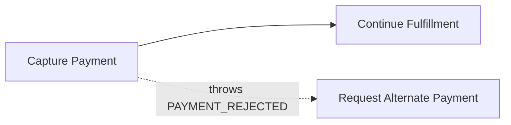

In BPMN terms:

- the token enters the service task,
- a job is created,
- worker throws a BPMN error,
- the service task is terminated,
- the boundary error path is activated.

### 4.3 Error Event Subprocess

Use an error event subprocess when many tasks inside a scope share one error reaction.

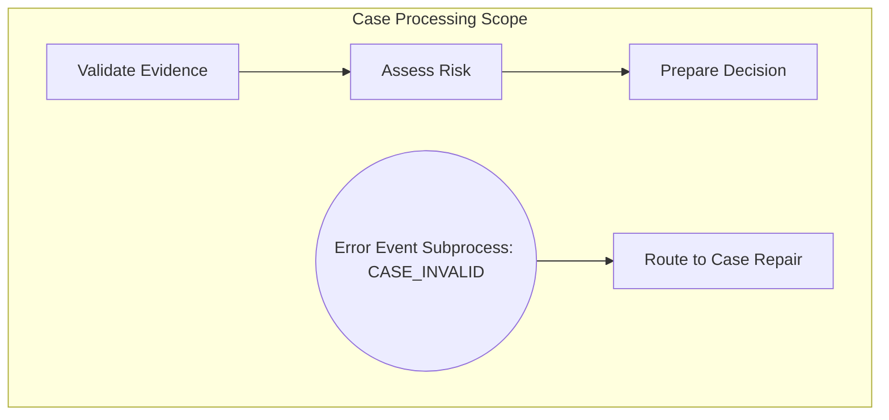

This avoids attaching the same boundary event to every task.

### 4.4 Propagation

Error propagation starts where the error is thrown:

1. Check catchers in the current scope.
2. If none match, propagate to parent scope.
3. If called by a parent process via call activity, the parent may catch it.
4. If no catcher exists, an incident is created for unhandled error.

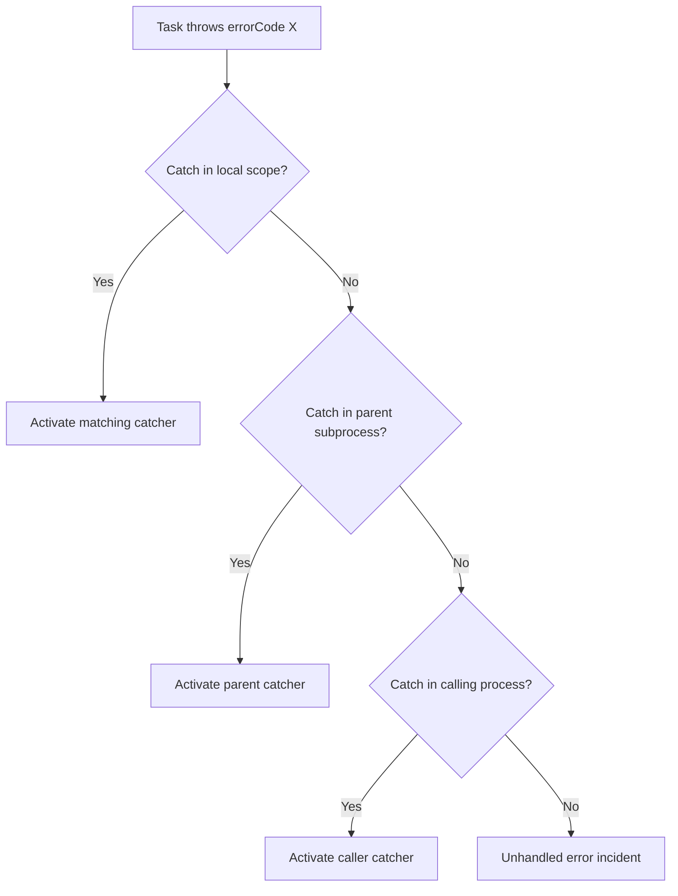

### 4.5 Catch-All Events

A catch-all error event can catch any error code when no specific code matches.

Use it carefully.

It is useful for:

- common cleanup,
- safe fallback,
- conversion into manual review,
- scoped repair path.

It is dangerous when it hides missing explicit handling.

Rule:

> A catch-all event must produce a visible, reviewable process state. It must not silently swallow important domain outcomes.

---

## 5. Business Reaction vs Technical Reaction

The common debate “business vs technical error” is often misleading. A technical-looking event can have a business reaction, and a business-looking event can be better handled technically.

### 5.1 Examples

| Situation | Better reaction | Why |
|---|---|---|
| Payment provider timeout | Fail job with retry/backoff | No business decision yet; provider may recover. |
| Payment provider says card declined | Throw BPMN error | Known domain outcome; customer needs alternate path. |
| Scoring service unavailable but policy says approve low-risk applications manually | Throw BPMN error or route to user task | The business defined a reaction. |
| FEEL condition returns non-boolean | Incident | Model/data defect; no domain path. |
| Evidence missing from applicant | BPMN error or gateway path | Known case state requiring repair. |
| Worker cannot parse required variable | Incident | Contract defect requiring fix. |
| Duplicate external callback | Ignore/idempotent complete, or correlate by message ID | Not a BPMN failure if duplicate is expected. |

### 5.2 Better Terminology

Use these terms in design reviews:

- **Modeled reaction**: visible in BPMN.
- **Generic technical reaction**: retry/backoff/incident.
- **Operational reaction**: operator fixes data/config/dependency.
- **Compensating reaction**: undo or repair previous committed side effect.
- **Engineering reaction**: code/model/schema must be changed.

This vocabulary prevents endless debates and anchors the design in responsibility boundaries.

---

## 6. Incident Semantics

An incident is a stop in process execution requiring intervention or correction.

Incidents are not bugs by definition, but they are always a signal that automatic execution cannot proceed safely.

### 6.1 Common Incident Causes

| Incident trigger | Likely root cause |
|---|---|
| Job failed with no retries left | External system failure, worker bug, bad variables, downstream outage. |
| Condition does not return boolean | FEEL/model defect or invalid variable type. |
| Timer expression invalid | Model/data defect. |
| Decision cannot be evaluated | DMN input missing, invalid expression, version issue. |
| BPMN error thrown but not caught | Model incomplete or worker threw wrong error code. |

### 6.2 Incident Lifecycle

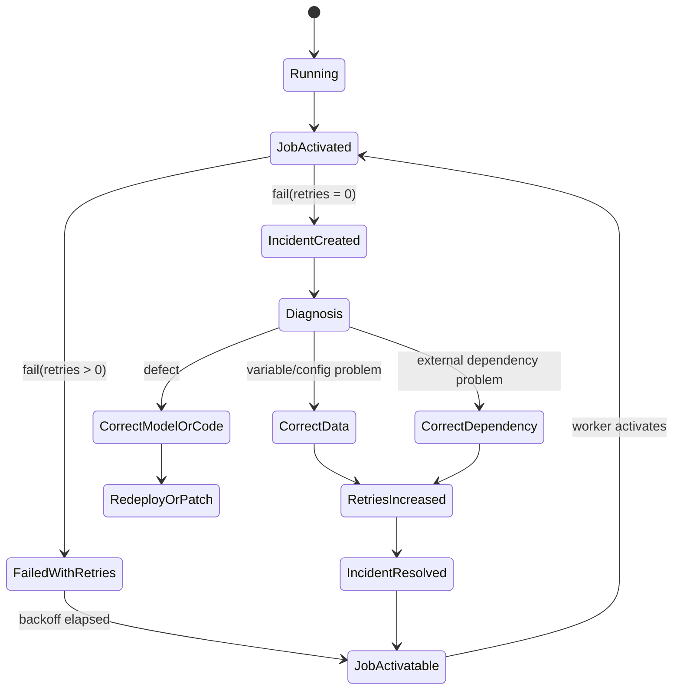

The runbook matters as much as the model. If operators do not know what to do, you have created a stuck process graveyard.

### 6.3 Incident Is Not a Business State

Anti-pattern:

> “If a case needs manual review, let the worker fail with zero retries so an operator sees it in Operate.”

This is wrong.

Manual review is a business state. Model it as a user task, escalation, or review subprocess.

Use incident when something is abnormal for the runtime contract:

- data violates expected shape,
- dependency cannot be reached after retries,
- model expression is invalid,
- worker cannot safely determine next state,
- process cannot continue without correction.

### 6.4 Incident Context Requirements

When raising an incident intentionally by failing a job with zero retries, include diagnostic context.

Minimum useful context:

```json
{
  "incidentContext": {
    "worker": "payment-capture-worker",
    "operation": "capturePayment",
    "externalSystem": "payment-provider-x",
    "externalReference": "auth-98231",
    "failureCategory": "DEPENDENCY_UNAVAILABLE",
    "safeToRetry": true,
    "lastAttemptAt": "2026-06-28T08:15:30Z",
    "operatorHint": "Verify provider outage status, then increase retries to 3 and resolve incident."
  }
}
```

Do not put secrets, tokens, full request payloads, or regulated personal data in process variables just for debugging. Prefer external logs/traces with correlation IDs.

---

## 7. Retry Design

Retry design is not “set retries to 3 everywhere.”

Retries encode assumptions about:

- side-effect safety,
- dependency recovery time,
- user-visible latency,
- duplicate execution risk,
- ordering assumptions,
- cost of repeated calls,
- incident noise tolerance.

### 7.1 Retry Categories

| Failure type | Retry? | Backoff | Notes |
|---|---:|---:|---|
| Network timeout before known side effect | Yes, if idempotent | Exponential or bounded | Use idempotency key. |
| HTTP 429/rate limit | Yes | Respect provider reset/backoff | Avoid synchronized retry storms. |
| HTTP 503 | Yes | Increasing | Treat as dependency recovery. |
| HTTP 400 validation | Usually no | None | Map to BPMN error or incident depending on source. |
| Authorization failure | Sometimes | Short | If token refresh possible; otherwise incident. |
| Deserialization error | No | None | Contract defect; incident. |
| Duplicate request | No failure | N/A | Handle idempotently. |
| Business rejection | No technical retry | N/A | Throw BPMN error or complete with status. |

### 7.2 Retry Budget

A retry budget defines how much automatic recovery you allow before human/operator intervention.

Example:

```text
payment-capture:
  maxAttempts: 5
  backoff: 30s, 2m, 5m, 15m
  incidentAfter: 5th failure
  safeRetryRequirement: idempotency key = processInstanceKey + activityId + operationName
```

Retry budget should be explicit for high-risk steps.

### 7.3 Backoff Strategy

Immediate retries are often harmful:

- they amplify outages,
- they hit rate limits,
- they consume worker capacity,
- they produce incident storms,
- they duplicate side effects when idempotency is weak.

Use backoff when dependency recovery is time-based.

```java
Duration backoffFor(int remainingRetries) {
    return switch (remainingRetries) {
        case 4 -> Duration.ofSeconds(30);
        case 3 -> Duration.ofMinutes(2);
        case 2 -> Duration.ofMinutes(5);
        case 1 -> Duration.ofMinutes(15);
        default -> Duration.ZERO;
    };
}
```

### 7.4 Retry and Job Timeout Are Different

A job activation timeout is not a retry.

If a worker activates a job but does not complete/fail it before the activation timeout, Zeebe can make the job available again. Another worker may process it. The remaining retry count is not necessarily decremented by timeout.

This creates a key distributed-systems hazard:

> Two workers may perform the same external side effect if the first worker is slow, partitioned, or stuck.

Therefore every side-effecting worker must be idempotent.

---

## 8. Java Worker Exception Mapping

A production worker should not let exception mapping be accidental.

Do not scatter `try/catch` decisions randomly. Create a policy.

### 8.1 Exception Taxonomy

```java
sealed interface WorkerOutcome permits
    WorkerOutcome.Success,
    WorkerOutcome.RetryableFailure,
    WorkerOutcome.BusinessError,
    WorkerOutcome.NonRetryableIncident {

    record Success(Map<String, Object> variables) implements WorkerOutcome {}

    record RetryableFailure(
        String message,
        int remainingRetries,
        Duration backoff,
        Map<String, Object> diagnosticVariables
    ) implements WorkerOutcome {}

    record BusinessError(
        String errorCode,
        String message,
        Map<String, Object> variables
    ) implements WorkerOutcome {}

    record NonRetryableIncident(
        String message,
        Map<String, Object> diagnosticVariables
    ) implements WorkerOutcome {}
}
```

This is not mandatory API style. It is an architectural pattern: separate domain classification from Zeebe command emission.

### 8.2 Mapping Example

```java
WorkerOutcome classify(Throwable error, ActivatedJob job) {
    return switch (error) {
        case PaymentRejectedException e ->
            new WorkerOutcome.BusinessError(
                "PAYMENT_REJECTED",
                e.getMessage(),
                Map.of("payment", Map.of("status", "REJECTED", "reason", e.reasonCode()))
            );

        case RateLimitedException e ->
            new WorkerOutcome.RetryableFailure(
                "Payment provider rate limited request",
                Math.max(job.getRetries() - 1, 0),
                e.retryAfter().orElse(Duration.ofMinutes(2)),
                Map.of("lastFailure", Map.of("category", "RATE_LIMITED"))
            );

        case MalformedProcessVariableException e ->
            new WorkerOutcome.NonRetryableIncident(
                "Invalid process variable contract: " + e.getMessage(),
                Map.of("lastFailure", Map.of("category", "INVALID_VARIABLE_CONTRACT"))
            );

        default ->
            new WorkerOutcome.RetryableFailure(
                "Unexpected worker failure: " + error.getClass().getSimpleName(),
                Math.max(job.getRetries() - 1, 0),
                Duration.ofSeconds(30),
                Map.of("lastFailure", Map.of("category", "UNEXPECTED"))
            );
    };
}
```

### 8.3 Emitting the Outcome

```java
void emitOutcome(CamundaClient client, ActivatedJob job, WorkerOutcome outcome) {
    switch (outcome) {
        case WorkerOutcome.Success success ->
            client.newCompleteCommand(job.getKey())
                .variables(success.variables())
                .send()
                .join();

        case WorkerOutcome.BusinessError businessError ->
            client.newThrowErrorCommand(job.getKey())
                .errorCode(businessError.errorCode())
                .errorMessage(businessError.message())
                .variables(businessError.variables())
                .send()
                .join();

        case WorkerOutcome.RetryableFailure failure ->
            client.newFailCommand(job.getKey())
                .retries(failure.remainingRetries())
                .errorMessage(failure.message())
                .retryBackoff(failure.backoff())
                .variables(failure.diagnosticVariables())
                .send()
                .join();

        case WorkerOutcome.NonRetryableIncident incident ->
            client.newFailCommand(job.getKey())
                .retries(0)
                .errorMessage(incident.message())
                .variables(incident.diagnosticVariables())
                .send()
                .join();
    }
}
```

The important idea is not the exact class structure. The important idea is that failure classification is centralized, reviewable, and testable.

---

## 9. Modeling Patterns

### 9.1 Known Business Rejection

Use when an external system or domain rule returns a definitive outcome.

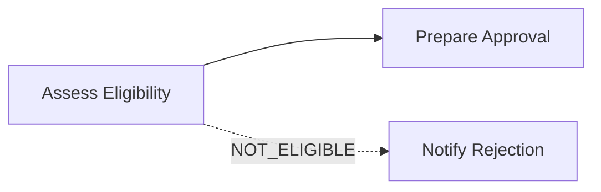

Worker behavior:

```text
External decision = NOT_ELIGIBLE
=> throw BPMN error NOT_ELIGIBLE
=> boundary event routes to rejection notification
```

Why not fail job?

Because retrying will not change a deterministic decision unless inputs change. The process has a valid path.

### 9.2 Dependency Outage

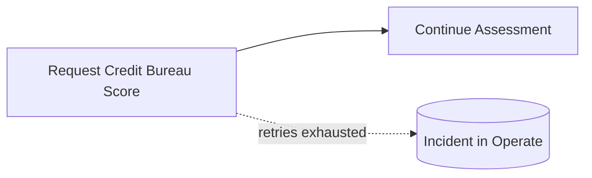

Worker behavior:

```text
HTTP 503 / timeout
=> fail job retries-- with backoff
=> incident only after budget exhausted
```

Why not BPMN error?

Because there is no business outcome yet. The infrastructure failed to produce one.

Exception: if policy says “after bureau unavailable for 2 hours, route to manual risk review,” then model that as an explicit business reaction. Do not pretend it is purely technical.

### 9.3 Repairable Data Defect

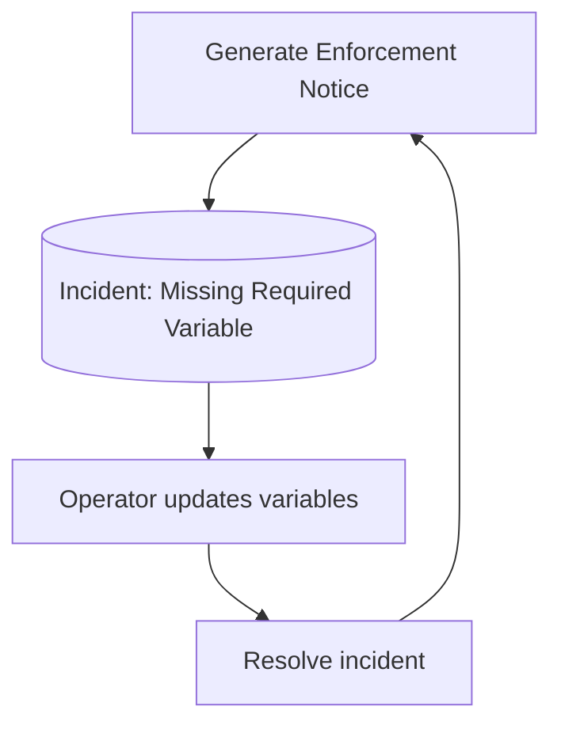

Use when:

- process variable is missing,
- value type is wrong,
- document reference is invalid,
- configuration is incomplete.

Do not create a BPMN path for every malformed payload unless the business process actually includes payload repair.

### 9.4 Manual Review Is Not Incident

Wrong:

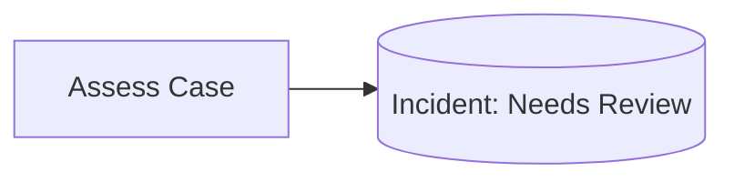

Right:

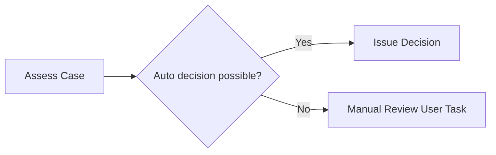

A human business decision is not a runtime failure.

### 9.5 Scoped Error Event Subprocess

Use when any step in a subprocess may invalidate the whole scope.

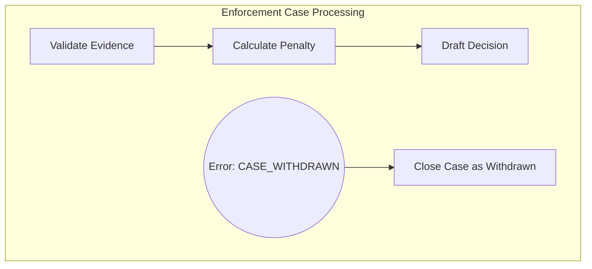

This is useful for regulatory lifecycle modeling where an external event invalidates ongoing work.

---

## 10. Error Code Taxonomy

Error codes are API contracts between workers and BPMN.

Treat them as versioned domain terms.

### 10.1 Naming Guidelines

Good error codes:

```text
PAYMENT_REJECTED
CUSTOMER_NOT_ELIGIBLE
CASE_WITHDRAWN
EVIDENCE_INCOMPLETE
SUPERVISOR_APPROVAL_REQUIRED
DUPLICATE_APPLICATION
```

Bad error codes:

```text
ERROR_1
BAD_REQUEST
HTTP_400
JAVA_EXCEPTION
SERVICE_FAILED
UNKNOWN_ERROR
```

### 10.2 Error Code Categories

| Category | Example | Typical catcher |
|---|---|---|
| Domain rejection | `NOT_ELIGIBLE` | Boundary event to rejection path. |
| Repair required | `EVIDENCE_INCOMPLETE` | User task or repair subprocess. |
| Alternative fulfillment | `PAYMENT_REJECTED` | Alternate payment path. |
| Governance path | `SUPERVISOR_APPROVAL_REQUIRED` | Approval subprocess. |
| Lifecycle transition | `CASE_WITHDRAWN` | Close/terminate branch. |
| Cross-process signal | `RELATED_CASE_BLOCKED` | Escalation or waiting path. |

### 10.3 Versioning Error Codes

Avoid changing the meaning of an existing error code.

If behavior changes materially:

- introduce a new error code,
- keep old catcher for existing model versions,
- document worker compatibility,
- test both old and new process versions.

Example:

```text
EVIDENCE_INCOMPLETE       // old: route to submitter correction
EVIDENCE_REQUIRES_REVIEW  // new: route to internal analyst first
```

---

## 11. Variable Mapping for Error Paths

When a worker throws a BPMN error with variables, those variables should be intentionally mapped and scoped.

### 11.1 What to Include

Good error payload:

```json
{
  "eligibility": {
    "status": "NOT_ELIGIBLE",
    "reasonCode": "MINIMUM_AGE_NOT_MET",
    "evaluatedAt": "2026-06-28T09:00:00Z"
  }
}
```

Bad error payload:

```json
{
  "fullHttpResponse": "...",
  "stackTrace": "...",
  "rawApplicantPayload": "...",
  "accessToken": "..."
}
```

### 11.2 Scope Discipline

Error path variables should answer:

- What outcome was reached?
- Why does the process take this path?
- What data is needed by the next modeled activity?
- What correlation ID points to deeper diagnostics?

They should not become a debugging dump.

---

## 12. Incidents and Compliance

For regulated workflows, incidents are not just operational interruptions. They may become audit evidence.

### 12.1 Audit Questions

A regulator, internal auditor, or incident review board may ask:

- Why did the process stop?
- Which system made the decision?
- Was this a business rejection or technical failure?
- Who changed variables?
- Who resolved the incident?
- Did the process retry automatically?
- Was the retry safe?
- Was any external side effect duplicated?
- Did the model have an explicit path for this scenario?

Your design should make these questions answerable.

### 12.2 Operator Actions Must Be Constrained

If an operator can resolve incidents by changing arbitrary variables, you need governance.

Recommended controls:

- runbooks per incident category,
- approved variable patch schemas,
- incident reason codes,
- privileged roles for retry updates,
- immutable external audit log for high-risk corrections,
- correlation between Operate action and internal ticket/change request,
- post-incident review for repeated incidents.

### 12.3 Incident Rate Is a Process Quality Metric

High incident rate usually means one of:

- weak input validation,
- unstable dependency,
- poor retry/backoff,
- non-idempotent worker,
- too much data in process variables,
- model expression fragility,
- business scenario not modeled,
- bad deployment/version compatibility.

Do not normalize incident noise.

---

## 13. Anti-Patterns

### 13.1 BPMN Error for Every Java Exception

Symptom:

```java
catch (Exception e) {
    client.newThrowErrorCommand(job.getKey())
        .errorCode("SYSTEM_ERROR")
        .send();
}
```

Why it is bad:

- hides technical failures in business model,
- bypasses retry/backoff,
- creates misleading process state,
- makes operators think the process handled the situation intentionally.

Correct approach:

- classify known domain outcomes as BPMN errors,
- fail retryable technical problems,
- create incidents for unrecoverable runtime/data defects.

### 13.2 Incident as Manual Review Queue

Manual review should be a user task or case work item, not an incident.

### 13.3 Infinite Retry Mindset

High retry counts can hide systemic defects and create cost explosions.

Retries must have:

- a maximum,
- backoff,
- idempotency,
- diagnostics,
- eventual operator path.

### 13.4 Catch-All Error That Swallows Everything

A catch-all boundary event that routes to “continue anyway” can destroy auditability.

Use catch-all only with explicit review, repair, or safe fallback.

### 13.5 Error Code Coupled to Provider Terms

Provider-specific error codes should be translated into domain codes.

Bad:

```text
STRIPE_CARD_DECLINED
BUREAU_SCORE_503
```

Better:

```text
PAYMENT_REJECTED
RISK_SCORE_UNAVAILABLE
```

Provider detail can be stored separately as diagnostic metadata.

### 13.6 Failing Job After Side Effect Without Idempotency

If the worker successfully performed an external side effect but fails before completing the job, Zeebe may retry the job. Without idempotency, duplicate side effects are possible.

Rule:

> Every side-effecting worker must use an idempotency key derived from stable process/job/domain identifiers.

---

## 14. Production Review Checklist

For every service task, review this checklist.

### 14.1 Worker Outcome Checklist

- [ ] What does success mean?
- [ ] What variables are produced on success?
- [ ] What known domain outcomes exist?
- [ ] Which outcomes are BPMN errors?
- [ ] Which failures are retryable?
- [ ] What retry count and backoff are used?
- [ ] What happens after retries are exhausted?
- [ ] Is the worker idempotent?
- [ ] What side effects can duplicate?
- [ ] What diagnostic variables are safe to store?
- [ ] What logs/traces correlate with the process instance?

### 14.2 BPMN Error Checklist

- [ ] Is every thrown `errorCode` caught where expected?
- [ ] Is every catch path a meaningful process reaction?
- [ ] Are catch-all events justified?
- [ ] Are error codes domain-oriented?
- [ ] Are error variables mapped intentionally?
- [ ] Is error propagation across subprocess/call activity understood?
- [ ] Are old process versions still compatible with worker error codes?

### 14.3 Incident Checklist

- [ ] Does incident message explain the failure enough for an operator?
- [ ] Is there a runbook?
- [ ] Can the incident be resolved safely?
- [ ] Are variable patches governed?
- [ ] Are repeated incidents tracked as engineering defects?
- [ ] Is incident resolution auditable?

---

## 15. Lab: Build a Failure-Aware Worker

### 15.1 Scenario

You are implementing `assess-case-risk` for a regulatory enforcement process.

Inputs:

```json
{
  "caseId": "CASE-2026-0001",
  "entityId": "ENT-9001",
  "evidencePackageId": "EVP-222",
  "riskAssessment": null
}
```

External system responses:

| External response | Desired reaction |
|---|---|
| `LOW`, `MEDIUM`, `HIGH` | Complete job with risk assessment. |
| `EVIDENCE_INCOMPLETE` | Throw BPMN error to evidence repair path. |
| `MANUAL_REVIEW_REQUIRED` | Throw BPMN error to analyst review path. |
| HTTP 503 | Fail job with retries/backoff. |
| Missing `caseId` | Fail with zero retries; incident. |
| Unexpected JSON shape | Fail with zero retries; incident. |

### 15.2 BPMN Shape

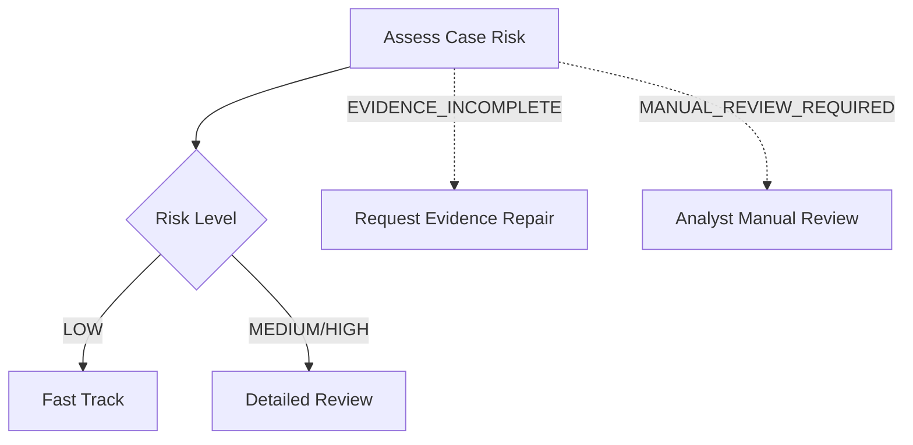

### 15.3 Worker Classification

```java
WorkerOutcome assessRisk(ActivatedJob job) {
    CaseRiskRequest request = parseAndValidate(job.getVariablesAsMap());

    RiskResponse response = riskClient.assess(
        request,
        IdempotencyKey.of(job.getProcessInstanceKey(), job.getElementId(), request.caseId())
    );

    return switch (response.status()) {
        case LOW, MEDIUM, HIGH ->
            new WorkerOutcome.Success(Map.of(
                "riskAssessment", Map.of(
                    "level", response.status().name(),
                    "score", response.score(),
                    "assessedAt", response.assessedAt().toString()
                )
            ));

        case EVIDENCE_INCOMPLETE ->
            new WorkerOutcome.BusinessError(
                "EVIDENCE_INCOMPLETE",
                "Risk engine requires additional evidence",
                Map.of("evidence", Map.of("status", "INCOMPLETE"))
            );

        case MANUAL_REVIEW_REQUIRED ->
            new WorkerOutcome.BusinessError(
                "MANUAL_REVIEW_REQUIRED",
                "Risk engine requires manual analyst review",
                Map.of("riskAssessment", Map.of("status", "MANUAL_REVIEW_REQUIRED"))
            );
    };
}
```

### 15.4 Tests You Must Write

- successful low-risk completion,
- successful high-risk completion,
- evidence incomplete BPMN error,
- manual review BPMN error,
- HTTP 503 decrements retries and applies backoff,
- malformed variables create incident,
- idempotency key is stable across retries,
- duplicate worker execution does not duplicate downstream side effect.

---

## 16. Mental Compression

When in doubt, remember this:

```text
Complete job: the work succeeded.
Fail job with retries: the work may succeed later.
Fail job with zero retries: the runtime cannot continue safely without intervention.
Throw BPMN error: the process has a known modeled reaction.
Incident: abnormal stop, not business-as-usual human work.
Compensation: previous successful side effect must be repaired or counteracted.
```

This distinction is the backbone of production-grade Camunda 8 modeling.

---

## 17. Source References

- Camunda 8 Docs — Error events: `https://docs.camunda.io/docs/components/modeler/bpmn/error-events/`
- Camunda 8 Docs — Incidents: `https://docs.camunda.io/docs/components/concepts/incidents/`
- Camunda 8 Docs — Job workers: `https://docs.camunda.io/docs/components/concepts/job-workers/`
- Camunda 8 Docs — Dealing with problems and exceptions: `https://docs.camunda.io/docs/components/best-practices/development/dealing-with-problems-and-exceptions/`
- Camunda 8 Docs — Orchestration Cluster REST API: fail job / throw job error / resolve incident.
