# Part 008 — Message Correlation and Event-Driven Processes

> Goal: master message correlation as a **routing contract** between asynchronous external events and waiting process instances.

Message correlation is one of the most powerful features in Camunda 8, but it is also one of the easiest to misuse.

A beginner thinks:

> “A message is how I send data to a process.”

A production engineer thinks:

> “A message is an asynchronously delivered fact that must be routed to the correct process subscription using stable identity, time semantics, idempotency, and explicit ownership.”

That difference matters.

Incorrect message design causes:

- duplicate process instances,
- missed callbacks,
- race conditions,
- messages correlated to the wrong case,
- non-reproducible incident investigations,
- broken version migration,
- hidden coupling between systems,
- “ghost” events that nobody can explain.

This part builds the mental model needed to avoid those failures.

---

## 1. Kaufman Skill Deconstruction

### 1.1 Target Performance

After this part, you should be able to design event-driven BPMN processes where:

- every message has a clear owner,
- every correlation key is stable and defensible,
- every message name is intentional,
- TTL is chosen based on race-condition tolerance,
- duplicate delivery is safe,
- message start events do not accidentally create process storms,
- intermediate catch events do not miss expected callbacks,
- external event routers are observable and testable.

### 1.2 Sub-Skills

| Sub-skill | You know it when you can... |
|---|---|
| Subscription model | Explain why messages are correlated to subscriptions, not directly to process instances. |
| Correlation key design | Choose keys that align with domain identity and partitioning behavior. |
| Message name design | Separate event type from entity identity. |
| TTL design | Decide when buffering is required and when fire-and-forget discard is safer. |
| Idempotency | Use message IDs and domain deduplication to tolerate duplicate delivery. |
| Race handling | Design around “message arrives before subscription opens.” |
| Event routing | Build a small adapter service that translates external events into Camunda messages. |
| Version thinking | Understand how message start events interact with process definition versions. |

### 1.3 Practice Loop

For each event your process receives, write:

```text
Message name:
Correlation key:
Message ID:
TTL:
Producer:
Consumer process:
Expected subscription state when event arrives:
Duplicate behavior:
Late arrival behavior:
No-subscription behavior:
Audit correlation ID:
```

If you cannot fill this in, you have not designed the event contract yet.

---

## 2. Core Mental Model: Message = Name + Correlation Key + Time + Identity

Camunda message correlation is not a generic pub/sub broadcast. It is targeted routing.

A message is matched to a subscription using:

```text
message name + correlation key
```

Additional behavior is affected by:

```text
message ID + time-to-live + receiver type + process version state
```

### 2.1 Subscription, Not Direct Send

A process instance is not usually addressed directly by process instance key when using BPMN messages. Instead:

1. The process reaches a message catch event or boundary event.
2. Zeebe opens a message subscription.
3. The subscription has a message name and correlation key.
4. An external system publishes a message.
5. Zeebe matches message name + correlation key to open subscription.
6. The waiting process continues.

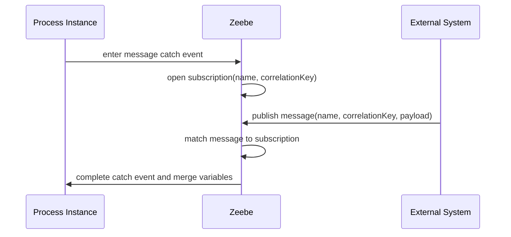

The key design implication:

> The process must know what identity it is waiting on before the subscription opens.

### 2.2 Message Name

The message name describes the type of event.

Examples:

```text
payment-authorized
payment-rejected
case-evidence-submitted
appeal-received
provider-score-returned
```

Do not put entity identity into the message name.

Bad:

```text
payment-authorized-for-order-123
appeal-received-for-case-2026-0007
```

Better:

```text
name: payment-authorized
correlationKey: order-123
```

### 2.3 Correlation Key

The correlation key identifies the entity or conversation the event belongs to.

Examples:

```text
orderId
caseId
applicationId
customerOnboardingId
claimId
externalAssessmentId
```

The key must be stable. A correlation key that changes during the process is usually a bug.

### 2.4 Message ID

Message ID is an optional uniqueness key used to reject duplicate buffered messages with the same name, correlation key, and ID.

Good message ID candidates:

```text
external event id
Kafka topic-partition-offset
webhook delivery id
payment provider event id
case management event id
```

Do not generate a new random UUID every time you retry publishing the same event. That defeats deduplication.

### 2.5 TTL

TTL controls buffering.

If TTL is zero and no matching subscription is open, the message is discarded.

If TTL is positive, the message may wait in the buffer until a matching subscription opens or TTL expires.

TTL is not merely a technical timeout. It is a business/temporal assumption:

> “How long is this event still meaningful if the process is not yet waiting?”

---

## 3. Message Start Event vs Intermediate Catch Event

### 3.1 Message Start Event

A message start event creates a new process instance when a message with the matching name is correlated.

Use it when an external event is the natural beginning of the process.

Examples:

- order placed,
- application submitted,
- case opened,
- appeal received,
- invoice received.

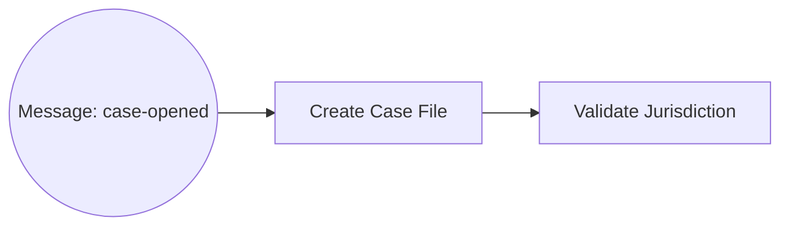

### 3.2 Intermediate Message Catch Event

An intermediate catch event waits inside an existing process instance.

Use it when the process is already running and expects an external continuation event.

Examples:

- wait for payment confirmation,
- wait for document upload,
- wait for background check result,
- wait for external agency response,
- wait for appeal submission during a window.

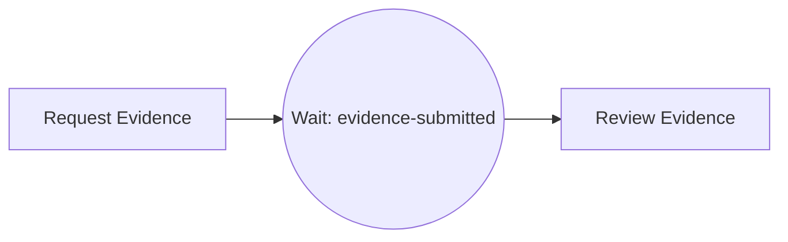

### 3.3 Boundary Message Event

Boundary message events listen while an activity is active.

Use when an external event can interrupt or accompany a running activity.

Examples:

- cancellation received while waiting for payment,
- escalation received while manual task active,
- withdrawal received while case is being reviewed,
- supplemental evidence submitted while analyst task remains open.

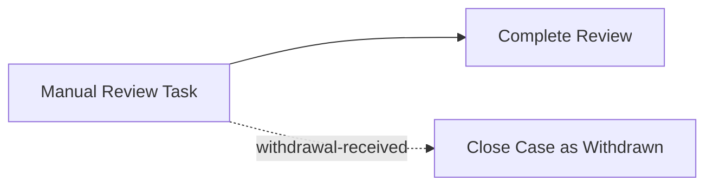

A non-interrupting boundary event can allow multiple messages to be correlated while the activity continues. Use it only when repeated events are intentional.

### 3.4 Message Throw Event

In Camunda 8, message throw events and message end events are represented as BPMN semantics but are executed as jobs. Zeebe itself does not publish the outbound message for you. A job worker must process the event and publish to Kafka, REST, AMQP, another Camunda message, or another external channel.

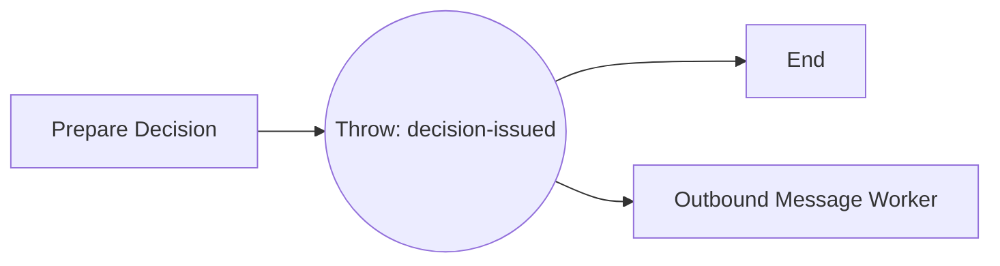

Design implication:

> An outbound message event is still a side-effecting service task from an execution perspective. It needs idempotency, retry, and observability.

---

## 4. Message Correlation Lifecycle

### 4.1 Intermediate Catch Event Lifecycle

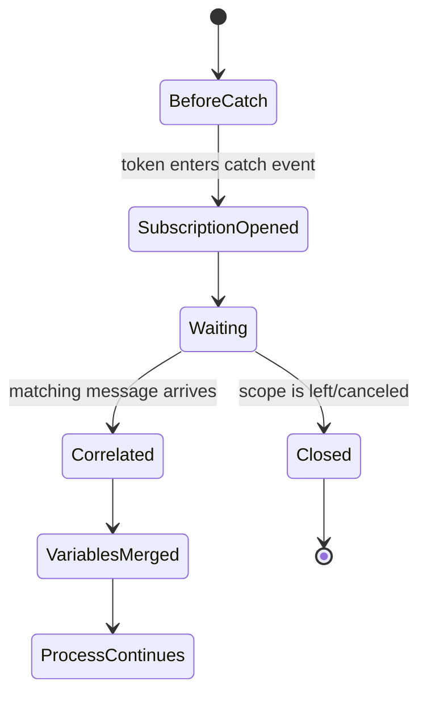

Important point:

> After a subscription opens, changing the process variable used by the correlation key does not update the existing subscription.

So if the subscription was created with `caseId = CASE-1`, and later a variable update changes `caseId` to `CASE-2`, the subscription is still waiting for `CASE-1`.

Do not mutate correlation identity after entering a wait state.

### 4.2 Publish Without Open Subscription

If a message is published before a matching subscription exists:

- TTL = 0: message is discarded.
- TTL > 0: message may be buffered.

This is the classic race condition.

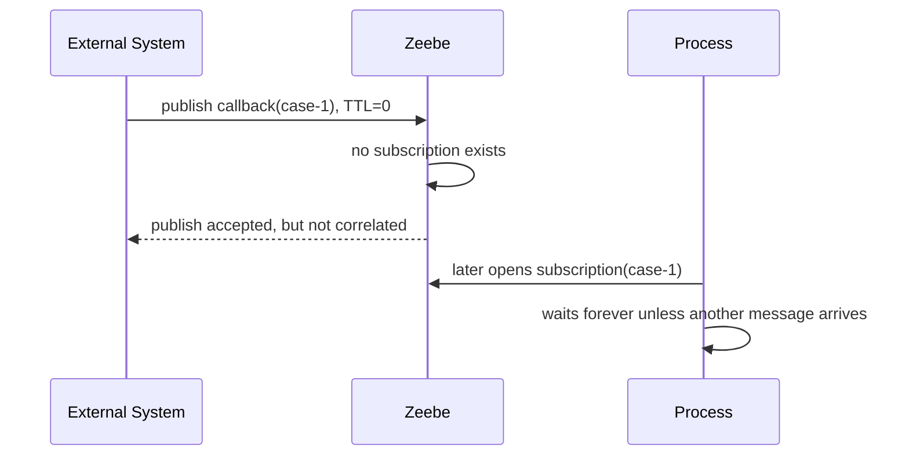

With TTL:

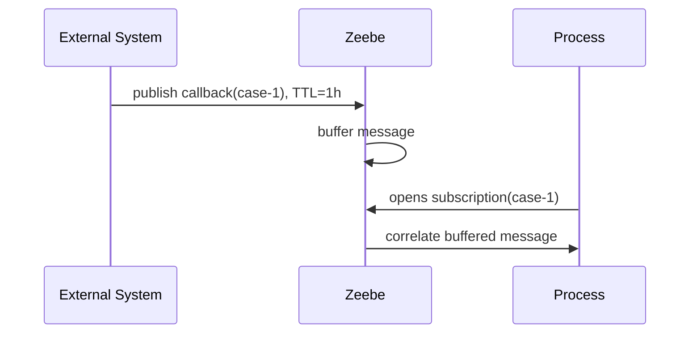

TTL is the tool for “message may arrive before process is ready.”

---

## 5. Designing Correlation Keys

Correlation key design is architecture, not naming.

### 5.1 Good Correlation Key Properties

A good key is:

- stable,
- unique enough for the process boundary,
- known by the event producer,
- known by the process before waiting,
- non-sensitive,
- compact,
- deterministic,
- version-independent,
- not reused across unrelated conversations.

### 5.2 Candidate Keys

| Domain | Good candidate | Risky candidate |
|---|---|---|
| Order process | `orderId` | customer email |
| Regulatory case | `caseId` | entity name |
| Payment callback | payment intent id or order id | card number, transaction description |
| Background check | assessment request id | applicant full name |
| Appeal window | case id + appeal period id | case id alone if multiple appeals possible |
| Batch item | batch id + item id | batch id alone |

### 5.3 Composite Keys

Composite keys are often necessary.

Examples:

```text
CASE-2026-0001:APPEAL-WINDOW-1
ORDER-123:PAYMENT-AUTH-456
BATCH-2026-06-28:ITEM-00009
```

Prefer explicit delimiters and documented structure.

Avoid ambiguous concatenation:

```text
caseId + appealId
```

because `CASE-1` + `23` and `CASE-12` + `3` can collide if not delimited.

### 5.4 Correlation Key and Partitioning

Messages are routed based on correlation key. This can create hot spots if many messages use the same key.

Bad for high-volume aggregation:

```text
correlationKey = "global"
```

Better:

```text
correlationKey = entityId
correlationKey = batchId
correlationKey = caseId
```

If one key receives massive throughput, you need to reconsider whether one process instance should coordinate all those events.

---

## 6. Message Name Design

Message names are contracts. Treat them like API endpoints.

### 6.1 Naming Convention

Recommended style:

```text
<domain-object>-<event-past-tense>
```

Examples:

```text
case-opened
case-withdrawn
evidence-submitted
payment-authorized
payment-rejected
risk-score-returned
appeal-received
```

Avoid commands as incoming event names:

```text
start-case
process-payment
approve-application
```

Why?

A message usually represents a fact that already happened outside the process, not a command telling the process what to do.

### 6.2 Versioning Message Names

Avoid versioning message names prematurely.

Bad:

```text
evidence-submitted-v1
evidence-submitted-v2
```

Better:

```text
evidence-submitted
payload.schemaVersion = 2
```

Version the payload schema first. Version the message name only when event semantics change.

### 6.3 Global Uniqueness for Start Events

For message start events, message names should be globally intentional. If multiple process definitions can start from the same message, one external event can start more than you intended.

Rule:

> A message start event name must be treated as part of the platform-wide event contract.

---

## 7. TTL Design

TTL is one of the most misunderstood properties.

### 7.1 TTL = 0

Use TTL = 0 when:

- event is only valid if the process is already waiting,
- late buffering would be dangerous,
- duplicate start prevention is required for a single active instance pattern,
- producer can retry or send another event later,
- you prefer missed correlation to stale correlation.

Example:

```json
{
  "name": "payment-confirmed",
  "correlationKey": "ORDER-123",
  "timeToLive": 0
}
```

### 7.2 TTL > 0

Use TTL > 0 when:

- event may arrive before the process opens its subscription,
- external systems race with internal process setup,
- process performs work before waiting,
- callback delivery cannot be repeated easily,
- aggregation requires collecting messages over a time window.

Example:

```json
{
  "name": "risk-score-returned",
  "correlationKey": "ASSESSMENT-9001",
  "messageId": "bureau-event-777",
  "timeToLive": 3600000
}
```

### 7.3 TTL Is Not Retention

Do not use message TTL as your audit log.

Message buffering is runtime delivery behavior. Your system of record for external events should be elsewhere:

- event store,
- Kafka topic,
- webhook delivery log,
- audit table,
- object storage,
- domain case history.

### 7.4 TTL Sizing

| Scenario | Suggested thinking |
|---|---|
| Callback may arrive seconds before subscription | TTL 5–15 minutes. |
| Human upload may happen before process reaches wait state | TTL aligned with user action window. |
| Regulatory appeal accepted within 14 days | Model timer/window explicitly; do not rely only on TTL. |
| Batch aggregation | TTL equals aggregation window. |
| High-risk stale event | TTL 0 or very short. |

The TTL should be explainable in a design review.

---

## 8. Message ID and Idempotency

Distributed event systems deliver duplicates. Pretending otherwise creates production failures.

### 8.1 Message ID Purpose

A message ID helps prevent duplicate buffered messages with the same name, correlation key, and ID.

Example:

```json
{
  "name": "payment-authorized",
  "correlationKey": "ORDER-123",
  "messageId": "stripe_evt_1N9abc",
  "timeToLive": 3600000
}
```

Use stable IDs from the source event.

### 8.2 Duplicate Delivery Cases

Duplicates happen when:

- webhook provider retries after timeout,
- Kafka consumer restarts and reprocesses offset,
- event router retries after network failure,
- process publisher gets 503 and does not know if publish succeeded,
- operator manually replays events,
- batch import is rerun.

### 8.3 Idempotency Layers

Use multiple layers:

| Layer | Responsibility |
|---|---|
| Source system | Provide stable event ID. |
| Event router | Deduplicate known deliveries if possible. |
| Camunda message ID | Prevent duplicate buffered equal messages. |
| Process model | Avoid duplicate active instances by key where required. |
| Worker/service | Idempotent side effects after correlation. |
| Audit store | Preserve complete delivery history. |

Message ID helps, but it is not a complete distributed exactly-once guarantee.

---

## 9. Publish Message vs Correlate Message

There are two important interaction styles.

### 9.1 Publish Message

Publishing is fire-and-forget.

Properties:

- can buffer messages using TTL,
- does not wait for correlation result,
- good for asynchronous delivery,
- caller should not assume correlation succeeded.

Use it when:

- event delivery is asynchronous,
- buffering is desired,
- caller does not need immediate process instance key,
- event router records its own audit.

### 9.2 Correlate Message

Correlation endpoint gives immediate feedback if a message is correlated.

Properties:

- useful when caller needs confirmation,
- does not support buffering,
- message must correlate now or fail/not correlate,
- response may return a process instance key.

Use it when:

- synchronous API request must know whether a process consumed the message,
- no buffering is desired,
- the producer can handle “no subscription available” explicitly.

### 9.3 Decision Table

| Need | Use |
|---|---|
| Buffer early callback | Publish message with TTL > 0 |
| Fire-and-forget event routing | Publish message |
| Immediate confirmation | Correlate message |
| Reject if no process is waiting | Correlate message or publish with TTL 0 plus external audit |
| Start process idempotently by event | Message start event + correlation key + TTL strategy |

---

## 10. Starting Processes by Message

Starting by message is different from creating a process instance by BPMN process ID.

### 10.1 Create Instance by BPMN ID

Use when your application directly chooses the process definition.

```java
client.newCreateInstanceCommand()
    .bpmnProcessId("case_enforcement")
    .latestVersion()
    .variables(Map.of("caseId", "CASE-2026-0001"))
    .send()
    .join();
```

### 10.2 Start by Message

Use when an event should route to the appropriate message start subscription.

```java
client.newPublishMessageCommand()
    .messageName("case-opened")
    .correlationKey("CASE-2026-0001")
    .messageId("case-event-8899")
    .timeToLive(Duration.ZERO)
    .variables(Map.of("caseId", "CASE-2026-0001"))
    .send()
    .join();
```

With a correlation key, message start events can support single-active-instance behavior per key.

### 10.3 When Message Start Is Better

Use message start when:

- the event producer should not know BPMN process ID,
- multiple start events exist,
- process version selection should be owned by deployment subscriptions,
- the event contract is more stable than the process model name,
- you want event-driven architecture semantics.

### 10.4 When Direct Create Is Better

Use direct create when:

- application intentionally starts a specific process,
- version selection is explicit,
- start is a command rather than event fact,
- there is no ambiguity about process ownership,
- you need create-with-result behavior.

---

## 11. Common Event-Driven Patterns

### 11.1 Callback Wait Pattern

Use for async external services.

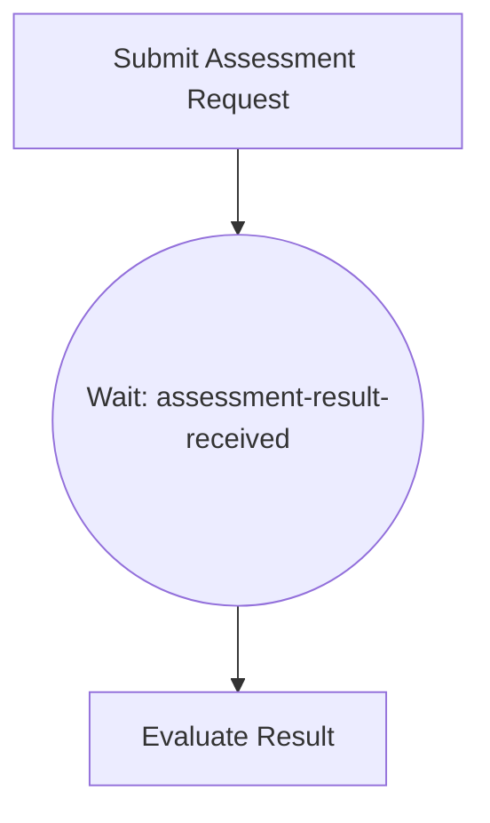

Design:

```text
messageName: assessment-result-received
correlationKey: assessmentRequestId
messageId: externalEventId
TTL: enough to cover callback-before-wait race
```

Why `assessmentRequestId` instead of `caseId`?

If a case can have multiple assessment requests, `caseId` alone is ambiguous.

### 11.2 Single Active Instance Pattern

Use when an event should create at most one active process instance per entity.

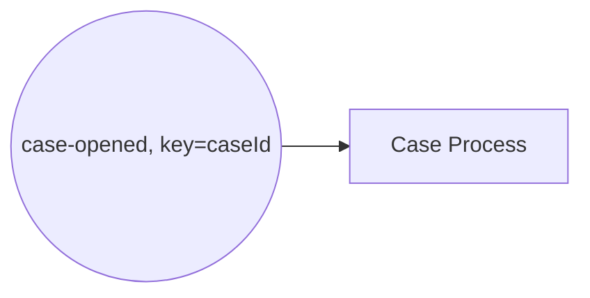

Design:

```text
messageName: case-opened
correlationKey: caseId
TTL: 0 unless you intentionally want buffering
```

This prevents duplicate active instances for the same key while one is active.

### 11.3 Message Aggregator Pattern

Use when multiple messages for one entity must be collected.

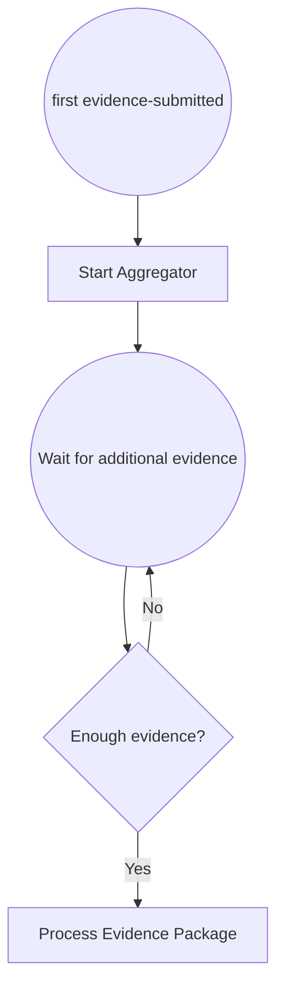

Design:

```text
messageName: evidence-submitted
correlationKey: caseId or evidencePackageId
messageId: evidenceDocumentId or delivery event id
TTL: aggregation window
```

Be careful: a single aggregator instance can become a hot spot if many events map to the same key.

### 11.4 Cancellation/Withdrawal Boundary Pattern

Use when an external event can interrupt active work.

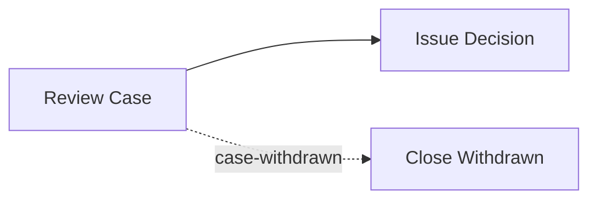

Design:

```text
messageName: case-withdrawn
correlationKey: caseId
TTL: short or zero depending on whether withdrawal before review should be handled elsewhere
```

### 11.5 Appeal Window Pattern

Use explicit timer plus message catch.

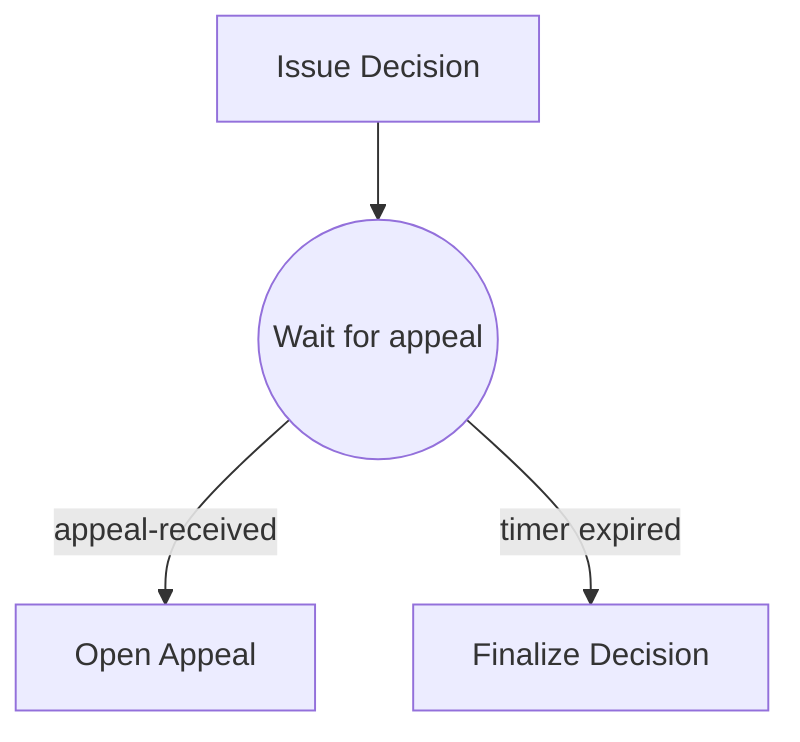

Design:

```text
messageName: appeal-received
correlationKey: caseId + appealWindowId
TTL: not a replacement for the legal appeal window
```

Do not encode legal deadlines purely in message TTL. Use BPMN timers for business-visible time windows.

### 11.6 External Event Router Pattern

Build a small adapter that receives external events and publishes Camunda messages.

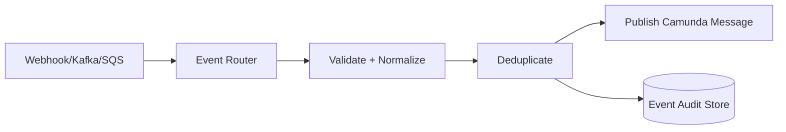

The router owns:

- authentication of source event,
- payload validation,
- schema normalization,
- message name mapping,
- correlation key extraction,
- message ID selection,
- delivery audit,
- retry/backoff to Camunda,
- dead-letter handling.

Do not put all of this logic inside random process workers.

---

## 12. Race Conditions and How to Design Against Them

### 12.1 Callback Before Wait

Problem:

1. Process calls external service.
2. External service responds very quickly.
3. Message is published before process reaches catch event.
4. Message is discarded if TTL = 0.
5. Process waits forever.

Solutions:

- publish with TTL > 0,
- use an event router with retry/correlation confirmation,
- reorder model so subscription is opened before external request when possible,
- use a request-response worker instead of async callback if the operation is truly synchronous,
- store callback externally and have process poll/worker check state.

### 12.2 Subscription Key Computed from Late Variable

Problem:

```text
catch event correlationKey = = externalRequestId
```

but `externalRequestId` is not set before entering the catch event.

Result:

- expression failure,
- wrong subscription key,
- incident,
- or wait on unexpected value.

Solution:

- set and validate correlation identity before opening subscription,
- use explicit input mapping,
- test process path with missing/null variables.

### 12.3 Correlating on Non-Unique Key

Problem:

```text
correlationKey = customerId
```

but a customer can have multiple active orders.

Result:

- event may correlate to only one matching subscription,
- wrong order can continue,
- process appears nondeterministic from business perspective.

Solution:

- use `orderId`, `requestId`, or composite key,
- model customer-level process separately if customer-level correlation is truly intended.

### 12.4 Event Replay Starts New Instances

Problem:

Old events are replayed into message start events and create new process instances.

Solutions:

- stable message ID,
- event router deduplication,
- single-active-instance correlation key,
- external processed-event table,
- replay mode that disables live publish or routes to test environment.

---

## 13. Java Event Router Example

The event router is usually a better place than a BPMN worker to translate external callbacks into Camunda messages.

### 13.1 Input Event

```json
{
  "eventId": "risk-bureau-event-9921",
  "eventType": "RiskAssessmentCompleted",
  "assessmentRequestId": "RA-10001",
  "caseId": "CASE-2026-0001",
  "result": {
    "score": 71,
    "level": "MEDIUM"
  },
  "occurredAt": "2026-06-28T10:00:00Z"
}
```

### 13.2 Mapping

```java
record IncomingRiskEvent(
    String eventId,
    String eventType,
    String assessmentRequestId,
    String caseId,
    RiskResult result,
    Instant occurredAt
) {}

record CamundaMessageEnvelope(
    String name,
    String correlationKey,
    String messageId,
    Duration ttl,
    Map<String, Object> variables
) {}

CamundaMessageEnvelope mapToCamundaMessage(IncomingRiskEvent event) {
    if (!"RiskAssessmentCompleted".equals(event.eventType())) {
        throw new IllegalArgumentException("Unsupported event type: " + event.eventType());
    }

    return new CamundaMessageEnvelope(
        "risk-assessment-completed",
        event.assessmentRequestId(),
        event.eventId(),
        Duration.ofHours(1),
        Map.of(
            "riskAssessment", Map.of(
                "requestId", event.assessmentRequestId(),
                "caseId", event.caseId(),
                "score", event.result().score(),
                "level", event.result().level(),
                "completedAt", event.occurredAt().toString()
            )
        )
    );
}
```

### 13.3 Publishing

```java
void publish(CamundaClient client, CamundaMessageEnvelope envelope) {
    client.newPublishMessageCommand()
        .messageName(envelope.name())
        .correlationKey(envelope.correlationKey())
        .messageId(envelope.messageId())
        .timeToLive(envelope.ttl())
        .variables(envelope.variables())
        .send()
        .join();
}
```

### 13.4 Router Responsibilities

A production router should:

- authenticate incoming event,
- validate schema,
- reject unsupported event types,
- derive message name deterministically,
- derive correlation key deterministically,
- use source event ID as message ID,
- store inbound event audit before publishing,
- retry Camunda publish with backoff on transient errors,
- expose metrics per message name and outcome,
- dead-letter invalid events with reason.

---

## 14. Event Contract Template

Every external event consumed by Camunda should have a contract.

```md
# Event Contract: risk-assessment-completed

## Producer
Risk Bureau Adapter

## Consumer
Camunda process: `case_enforcement`

## Message name
`risk-assessment-completed`

## Correlation key
`assessmentRequestId`

## Why this key
A case may request multiple assessments. `caseId` alone is not specific enough.

## Message ID
Source event ID from risk bureau delivery: `eventId`.

## TTL
1 hour.

## TTL rationale
Callback may arrive before the process enters the wait state because the external bureau can respond immediately after request submission.

## Payload
```json
{
  "riskAssessment": {
    "requestId": "RA-10001",
    "caseId": "CASE-2026-0001",
    "score": 71,
    "level": "MEDIUM",
    "completedAt": "2026-06-28T10:00:00Z"
  }
}
```

## Duplicate behavior
Duplicate source event IDs are deduplicated by router and published with same Camunda `messageId`.

## Late arrival behavior
After TTL expires, event is not correlated. Router audit keeps event for manual reconciliation.

## Security classification
No secrets. Contains case identifier and risk score; treat as restricted internal data.

## Observability
Metrics: `camunda_message_publish_total{name="risk-assessment-completed", outcome="..."}`.
Logs include eventId, assessmentRequestId, caseId, and Camunda publish result.
```

This document is often more valuable than the diagram in production incidents.

---

## 15. Message Variables and Data Boundaries

By default, message variables are merged into the process instance unless output mappings customize behavior.

### 15.1 Good Payload Shape

```json
{
  "payment": {
    "authorizationId": "AUTH-123",
    "status": "AUTHORIZED",
    "authorizedAt": "2026-06-28T11:00:00Z"
  }
}
```

### 15.2 Bad Payload Shape

```json
{
  "rawWebhook": { "...": "entire provider payload" },
  "headers": { "authorization": "Bearer ..." },
  "debug": "massive text blob"
}
```

Do not use process variables as an event lake.

### 15.3 Output Mapping

Use output mapping on message catch events when:

- incoming payload is larger than needed,
- variable names conflict,
- you want scoped transformation,
- you need to prevent accidental overwrite,
- only part of the payload should enter process state.

Pattern:

```text
message payload -> event-specific variable -> mapped business variable
```

Example:

```json
{
  "_event": {
    "riskAssessmentCompleted": {
      "score": 71,
      "level": "MEDIUM"
    }
  }
}
```

Then map to:

```json
{
  "riskAssessment": {
    "score": 71,
    "level": "MEDIUM"
  }
}
```

---

## 16. Message Correlation in Regulatory Systems

For regulatory/case-management platforms, message correlation often maps to lifecycle identity.

### 16.1 Common Regulatory Events

| Event | Message name | Correlation key |
|---|---|---|
| Case opened | `case-opened` | `caseId` |
| Evidence submitted | `evidence-submitted` | `caseId` or `evidencePackageId` |
| Entity responded | `entity-response-received` | `noticeId` or `caseId:noticeId` |
| Appeal received | `appeal-received` | `caseId:appealWindowId` |
| Related case updated | `related-case-updated` | `caseRelationshipId` |
| External agency replied | `agency-response-received` | `agencyRequestId` |
| Case withdrawn | `case-withdrawn` | `caseId` |

### 16.2 Defensibility Questions

For every correlated event, you should be able to prove:

- who produced it,
- when it occurred,
- when it was received,
- which process subscription consumed it,
- why that correlation key was correct,
- whether it was duplicate,
- whether it arrived before or after the process waited,
- whether it changed a legal/regulatory deadline,
- what process path it triggered.

### 16.3 Avoid “Case ID Everywhere”

`caseId` is convenient but often too broad.

Use narrower keys for conversations:

```text
caseId:noticeId
caseId:evidenceRequestId
caseId:appealWindowId
caseId:agencyRequestId
caseId:remediationPlanId
```

The key should identify the waiting conversation, not merely the top-level case.

---

## 17. Anti-Patterns

### 17.1 Random Correlation Key

```java
.correlationKey(UUID.randomUUID().toString())
```

This makes correlation impossible unless the process has the same random value. Correlation keys must be shared stable identity.

### 17.2 Correlating on Mutable State

Bad:

```text
correlationKey = currentAssignee
```

Assignees change. Use stable business IDs.

### 17.3 Message Name Contains Entity ID

Bad:

```text
payment-authorized-ORDER-123
```

This explodes message definitions and breaks the subscription model.

### 17.4 TTL as Business Deadline

Bad:

```text
Appeal allowed for 14 days, so set message TTL to 14 days.
```

Use BPMN timer to model the appeal deadline. TTL only controls buffering before correlation.

### 17.5 Fire-and-Forget Without Audit

Publishing a message does not necessarily mean it was correlated. Your router must record publish attempts and outcomes.

### 17.6 One Global Correlation Key

Bad:

```text
correlationKey = "all-events"
```

This creates hot spots, ambiguity, and correlation chaos.

### 17.7 Using Messages for Internal Synchronous Calls

If a worker needs a synchronous result from a service, a normal service call may be clearer than message choreography.

Messages are excellent for asynchronous facts, callbacks, and external events. They are not automatically the best abstraction for every interaction.

### 17.8 Ignoring Process Versions

Message start subscriptions are affected by deployed process versions. When new versions are deployed, start-event subscription behavior can change. Treat message start event changes as API changes.

---

## 18. Testing Strategy

Message-driven processes need more than happy-path tests.

### 18.1 Test Cases

For each message event, test:

- message with correct name/key correlates,
- wrong key does not correlate,
- wrong name does not correlate,
- duplicate message behavior,
- message arrives before subscription with TTL = 0,
- message arrives before subscription with TTL > 0,
- message arrives after scope is left,
- payload output mapping,
- multiple active instances with different keys,
- multiple active instances with same broad key, if allowed,
- process version behavior for message start events.

### 18.2 Contract Tests for Event Router

Test mapping from external event to Camunda message:

```java
@Test
void mapsRiskAssessmentCompletedEvent() {
    IncomingRiskEvent event = fixtureRiskEvent();

    CamundaMessageEnvelope envelope = mapper.mapToCamundaMessage(event);

    assertThat(envelope.name()).isEqualTo("risk-assessment-completed");
    assertThat(envelope.correlationKey()).isEqualTo("RA-10001");
    assertThat(envelope.messageId()).isEqualTo("risk-bureau-event-9921");
    assertThat(envelope.ttl()).isEqualTo(Duration.ofHours(1));
}
```

### 18.3 Race Tests

Create a test where the message is published before the process reaches the catch event.

Expected behavior depends on TTL:

- TTL = 0: process waits.
- TTL > 0: process continues after subscription opens.

This one test catches many production bugs.

---

## 19. Operational Observability

Message correlation must be visible.

### 19.1 Metrics

Recommended metrics:

```text
incoming_events_total{source,eventType,outcome}
camunda_message_publish_total{name,outcome}
camunda_message_publish_latency_seconds{name}
camunda_message_publish_retries_total{name}
camunda_message_invalid_total{reason}
camunda_message_deadletter_total{name,reason}
camunda_message_correlation_confirmed_total{name}
```

### 19.2 Logs

Every publish log should include:

```json
{
  "messageName": "risk-assessment-completed",
  "correlationKey": "RA-10001",
  "messageId": "risk-bureau-event-9921",
  "sourceSystem": "risk-bureau",
  "sourceEventType": "RiskAssessmentCompleted",
  "caseId": "CASE-2026-0001",
  "publishOutcome": "ACCEPTED"
}
```

Do not log sensitive payloads by default.

### 19.3 Reconciliation

For important events, build reconciliation views:

| Event ID | Received | Published to Camunda | Correlated? | Process instance | Status |
|---|---:|---:|---:|---|---|
| `evt-1` | yes | yes | unknown/fire-and-forget | unknown | accepted |
| `evt-2` | yes | yes | yes | `225179...` | correlated |
| `evt-3` | yes | no | no | n/a | dead-letter |

Fire-and-forget publish should not mean blind operation.

---

## 20. Production Review Checklist

### 20.1 Message Contract Checklist

- [ ] Is the message name stable and domain-oriented?
- [ ] Is the correlation key stable and specific enough?
- [ ] Is the message ID stable across retries?
- [ ] Is TTL chosen intentionally?
- [ ] Is the payload minimal and schema-versioned?
- [ ] Is the source event audited externally?
- [ ] Are duplicate events safe?
- [ ] Are early events handled?
- [ ] Are late events handled?
- [ ] Are wrong-key events observable?
- [ ] Is start-event name globally reviewed?

### 20.2 BPMN Model Checklist

- [ ] Is the process variable for correlation key set before the catch event?
- [ ] Is the correlation key expression tested?
- [ ] Are message names unique where required?
- [ ] Are boundary events interrupting/non-interrupting intentionally?
- [ ] Are timers used for business deadlines instead of TTL?
- [ ] Are output mappings used to prevent variable pollution?
- [ ] Is message start behavior safe under replay?

### 20.3 Event Router Checklist

- [ ] Authenticates producer.
- [ ] Validates schema.
- [ ] Maps event type to message name.
- [ ] Extracts deterministic correlation key.
- [ ] Uses stable message ID.
- [ ] Stores audit before publishing.
- [ ] Retries Camunda publish safely.
- [ ] Dead-letters invalid/unroutable events.
- [ ] Exposes metrics and logs.
- [ ] Supports replay without uncontrolled duplicate process starts.

---

## 21. Lab: Model an Appeal Window

### 21.1 Scenario

A regulatory decision is issued. The regulated entity has a defined appeal window. If an appeal arrives during the window, the case enters appeal handling. If no appeal arrives before the deadline, the decision becomes final.

### 21.2 BPMN Shape

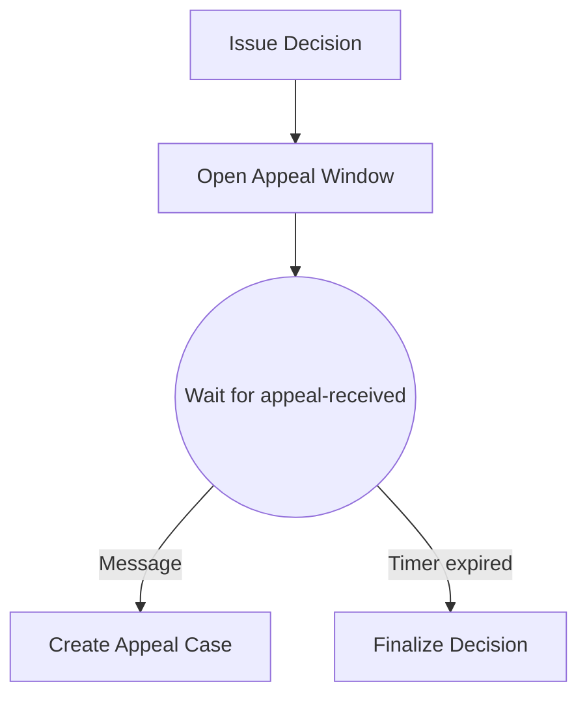

### 21.3 Event Contract

```text
messageName: appeal-received
correlationKey: caseId + ":" + appealWindowId
messageId: externalAppealSubmissionId
TTL: short buffer, e.g. 1 hour, not the legal appeal period
business deadline: BPMN timer based on decision.issuedAt + appealPeriod
```

### 21.4 Why Not `caseId` Alone?

A case can have multiple appeal-like windows:

- initial decision appeal,
- penalty appeal,
- remediation plan appeal,
- reopened decision appeal.

A broad key may correlate an appeal to the wrong waiting state.

### 21.5 Tests

- appeal during active window routes to appeal case,
- no appeal before timer finalizes decision,
- appeal after timer goes to external reconciliation/manual handling,
- duplicate appeal submission does not create duplicate appeal case,
- appeal event published before wait state is buffered if TTL permits,
- appeal event with old appealWindowId does not affect new window.

---

## 22. Mental Compression

Remember this model:

```text
Message name = event type.
Correlation key = conversation identity.
Message ID = duplicate identity.
TTL = buffer window.
Subscription = what the process is currently waiting for.
Publish = accepted for delivery, not guaranteed consumed.
Correlate = immediate consumption attempt.
```

If these six concepts are clear, most message-correlation bugs become diagnosable.

---

## 23. Source References

- Camunda 8 Docs — Message events: `https://docs.camunda.io/docs/components/modeler/bpmn/message-events/`
- Camunda 8 Docs — Messages: `https://docs.camunda.io/docs/components/concepts/messages/`
- Camunda 8 Docs — Message aggregation: `https://docs.camunda.io/docs/components/concepts/message-aggregation/`
- Camunda 8 Docs — Routing events to processes: `https://docs.camunda.io/docs/components/best-practices/development/routing-events-to-processes/`
- Camunda 8 Docs — Orchestration Cluster REST API: publish message / correlate message.
