# Part 009 — Timers, Escalations, and SLA Modeling

Timer modeling is where many BPMN systems quietly become unreliable.

The problem is rarely that a timer event is hard to draw. The problem is that a timer encodes **time as part of business state**. Once time enters the process, the model must answer questions that are not visual-only:

- What does it mean when a deadline expires?
- Does the process stop, continue, notify, escalate, or fork additional work?
- Is lateness a business state, a monitoring signal, or a technical failure?
- Can the timer fire more than once?
- Is exact timing required, or is “not before due date” enough?
- Who owns the consequences of delay?

In Camunda 8 / Zeebe, timers are executed by an asynchronous distributed workflow engine. That means we must model timers with production semantics, not spreadsheet semantics.

The target of this part is to make you comfortable designing **deadline-aware, escalation-capable, operationally safe process models**.

---

## 1. The Kaufman Deconstruction

For this skill, decompose timer/SLA mastery into six sub-skills:

| Sub-skill | Question it answers |
|---|---|
| Timer semantics | What exactly happens when a timer is scheduled and triggered? |
| Deadline modeling | Is the deadline interrupting, non-interrupting, repeating, or observational? |
| SLA interpretation | Is SLA a process branch, an operational metric, or a contractual obligation? |
| Escalation modeling | Who must be notified or activated when normal flow is no longer enough? |
| Temporal correctness | How do time zones, dynamic due dates, and async triggering affect behavior? |
| Operational survivability | How do timer-heavy models behave under load, incident, redeploy, and upgrade? |

The mistake beginners make is treating all of these as one thing: “add a timer boundary event.”

A top-tier engineer separates them.

---

## 2. Mental Model: Time Is a Business Event

A timer is not merely a delay.

A timer is a **future event scheduled by process state**.

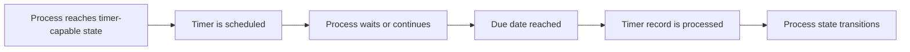

The key point is the last step: a timer changes process state.

So the design question is not:

> How long should we wait?

The better question is:

> What state transition must happen if time passes without the expected business event?

Examples:

| Situation | Poor framing | Better framing |
|---|---|---|
| User has not reviewed a case | “Wait 3 days.” | “After 3 business days, case enters overdue-review path.” |
| External system has not replied | “Retry later.” | “Technical retry until exhausted; business timeout after 24 hours.” |
| Appeal window expires | “Timer ends.” | “Appeal right lapses and enforcement action becomes executable.” |
| SLA almost breached | “Notify manager.” | “Open escalation task while original review continues.” |

Timer design is state-transition design.

---

## 3. Timer Event Types in Camunda 8

Camunda 8 supports timer start events, intermediate timer catch events, and timer boundary events.

### 3.1 Timer Start Event

A timer start event creates a new process instance when the timer fires.

Use it for scheduled process initiation:

- daily reconciliation
- periodic compliance review
- reminder batch generation
- scheduled case reassessment
- recurring enforcement status sweep

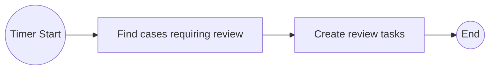

Important semantics:

- The timer is scheduled when the process is deployed.
- Each timer start event must define a date or cycle.
- When the timer triggers, a new process instance starts.
- When a new process version is deployed, timers of the previous process version for the same BPMN process ID are canceled.

This last point is easy to miss. If you use timer start events for scheduled jobs, deployment strategy becomes part of scheduler behavior.

### 3.2 Intermediate Timer Catch Event

An intermediate timer catch event pauses the process instance at that point.

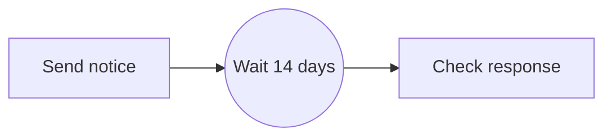

Use it when waiting is itself part of the business lifecycle:

- wait for appeal window
- wait for cooling-off period
- wait until legally allowed action date
- wait until scheduled reassessment

Do not use it as a technical sleep before retrying a service call. Job retries and worker backoff are better for technical retry.

### 3.3 Interrupting Timer Boundary Event

An interrupting timer boundary event is attached to an activity. When it fires, it terminates that activity and takes the timer path.

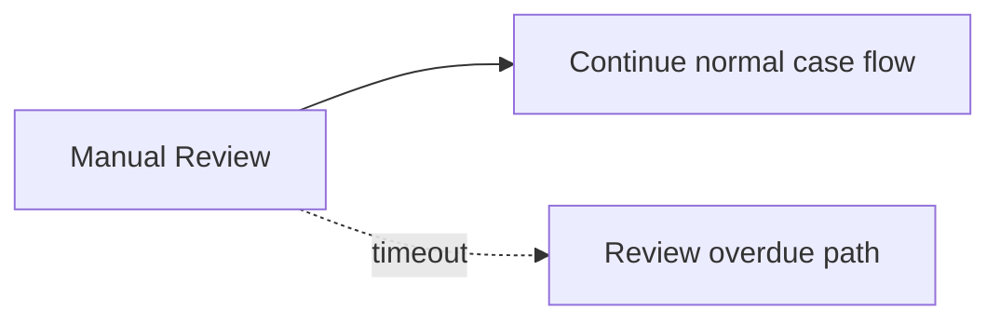

Use it when the original activity must stop:

- user task expired
- external waiting window expired
- review opportunity ended
- approval not received within allowed period

The semantics are strict: the attached activity is no longer active.

### 3.4 Non-Interrupting Timer Boundary Event

A non-interrupting timer boundary event starts additional work while the attached activity remains active.

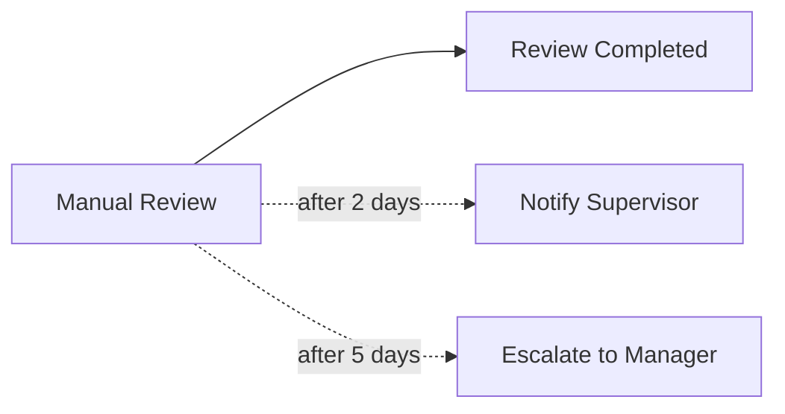

Use it when the original work should continue:

- send reminder
- notify supervisor
- create escalation task
- update risk flag
- emit operational signal

This is the classic SLA warning pattern.

---

## 4. Timer Definition Types

A timer can be defined using:

| Type | Meaning | Example use |
|---|---|---|
| Time date | Specific timestamp | Enforcement action allowed at a known date |
| Time duration | Relative duration | Wait 14 days after notice sent |
| Time cycle | Repeating schedule | Run review every day or notify repeatedly |

### 4.1 Time Date

Use a time date when the deadline is absolute.

Examples:

- `2026-07-01T09:00:00Z`
- `2026-07-01T16:00:00+07:00`
- `2026-07-01T09:00:00+02:00[Europe/Berlin]`

Use this for legally defined or externally calculated deadlines.

### 4.2 Time Duration

Use a time duration when the deadline is relative to activation time.

Examples:

- `PT15M` — fifteen minutes
- `PT2H` — two hours
- `P3D` — three days
- `P14D` — fourteen days

Use this for process-local waiting windows.

### 4.3 Time Cycle

Use a time cycle when the timer must repeat.

Examples:

- repeated reminders
- periodic status polling as a business concept
- recurring audit checks

Be careful: repeating timers multiply process activity. A timer that looks harmless in one process instance can become expensive when multiplied by thousands of active instances.

---

## 5. Static Timer vs Expression Timer

Timer values can be static or expression-based.

Static timer:

```text
P14D
```

Expression timer:

```text
= appealWindowDuration
```

or:

```text
= date and time(enforcementAllowedAt)
```

Use static timers when the rule is stable and universal.

Use expression timers when the deadline depends on process data:

- jurisdiction
- case type
- risk level
- notice date
- holiday calendar result
- respondent category
- service channel

However, do not calculate complex legal deadlines directly inside BPMN expressions if the logic requires domain policy, calendar exceptions, or audit explanation. In that case, calculate the deadline in a dedicated decision/service boundary and store the resulting timestamp as process data.

Recommended pattern:

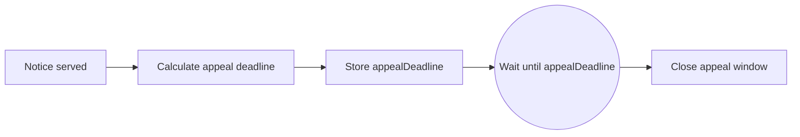

This creates an auditable checkpoint: the deadline was calculated once, recorded, and then used by the timer.

---

## 6. Important Zeebe Timing Invariant

Zeebe is asynchronous.

A timer should be modeled as:

> Trigger no earlier than its due date.

Not as:

> Trigger exactly at the due date.

This distinction matters.

If your SLA says “notify manager at 09:00:00 exactly,” you should not treat the workflow engine as a hard real-time scheduler. You can model the business deadline, but operational delivery may be delayed under load.

Design implications:

- Do not require sub-second timer precision.
- Do not use timers for hard real-time control systems.
- Make timeout handlers idempotent.
- Use due timestamps in variables to calculate real lateness.
- Record actual trigger time in worker/task logic if audit requires it.

A robust SLA model compares:

```text
dueAt vs observedAt
```

not merely:

```text
timer fired
```

---

## 7. SLA Is Not One Thing

“SLA” is overloaded. In workflow systems, at least four concepts are often mixed together:

| Concept | Meaning | BPMN representation |
|---|---|---|
| Deadline | A time after which state changes | Timer event |
| Warning | A signal before/after risk of breach | Non-interrupting timer |
| Breach | A business condition after due date | Process branch or variable state |
| Metric | Operational measurement | Operate/Optimize/metrics/exported records |

Do not encode every SLA as a branch. Some SLAs are better measured outside the process model.

### 7.1 Process-Level SLA

Use BPMN when the SLA changes workflow behavior.

Example:

- If review exceeds 3 days, assign supervisor.
- If payment not received in 7 days, cancel order.
- If appeal period expires, move case to enforcement-ready state.

### 7.2 Observability-Level SLA

Use monitoring when the SLA does not change workflow behavior.

Example:

- 95th percentile time from intake to review must be under 2 days.
- Average investigation duration must be reported monthly.
- Count overdue tasks by department.

Do not add BPMN timers only to collect analytics.

### 7.3 Hybrid SLA

Common in enterprise systems:

- BPMN models the state transition.
- Metrics measure performance.
- Alerts notify platform/application operators.
- Human task queues show overdue work.

This separation avoids turning BPMN into a monitoring dashboard.

---

## 8. Deadline Modeling Patterns

### 8.1 Hard Timeout Pattern

Use interrupting boundary timer.

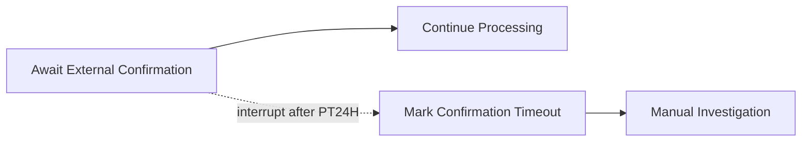

Use when the original wait is no longer valid after timeout.

Good for:

- external confirmation deadline
- expired approval opportunity
- legal response window expiry

Avoid when:

- work may still complete after timeout and must be accepted
- timeout is only a notification
- multiple reminders are required

### 8.2 Reminder Pattern

Use non-interrupting boundary timer.


Use when the original work remains valid.

### 8.3 Escalation Ladder Pattern

Use multiple non-interrupting timers or one timer leading to escalation logic.

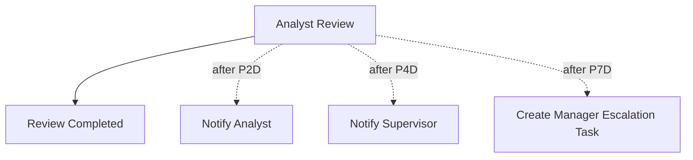

This is readable when the number of levels is small.

If escalation levels are data-driven, use a worker/decision table to calculate the next escalation step.

### 8.4 Expiry Window Pattern

Use intermediate timer catch after a known business action.

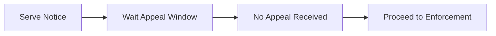

But in real systems, appeal may arrive asynchronously. So combine timer with message event or event subprocess.

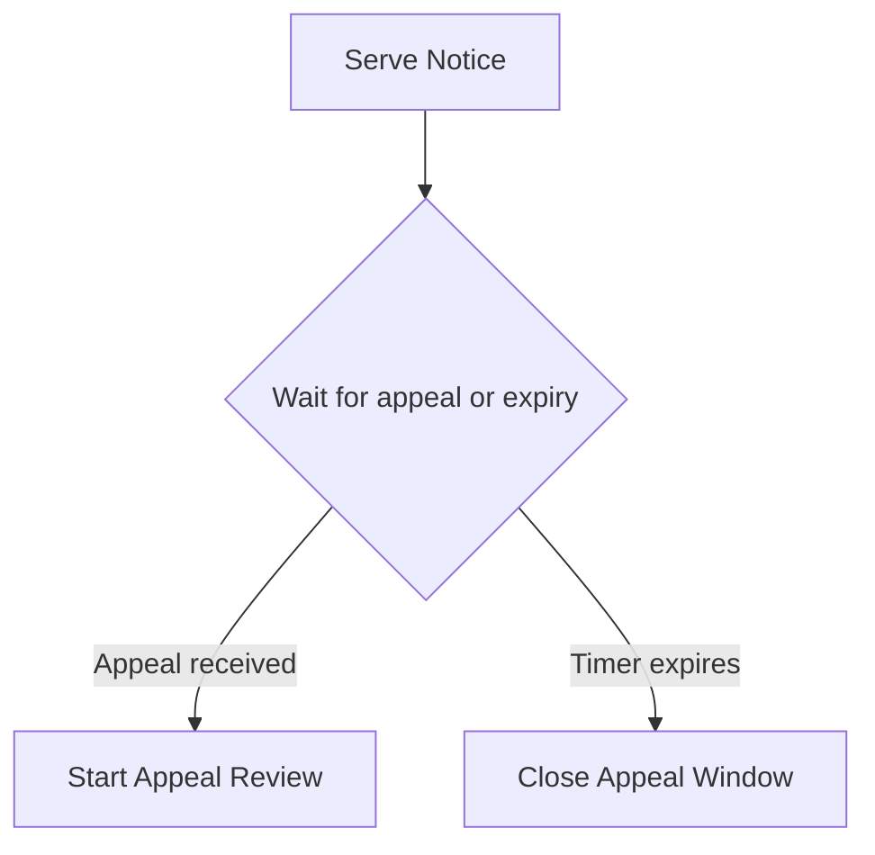

In BPMN, this is commonly modeled using event-based gateway, message catch event, timer catch event, or an event subprocess depending on scope.

### 8.5 Almost-Anywhere Cancellation Pattern

Use interrupting event subprocess.

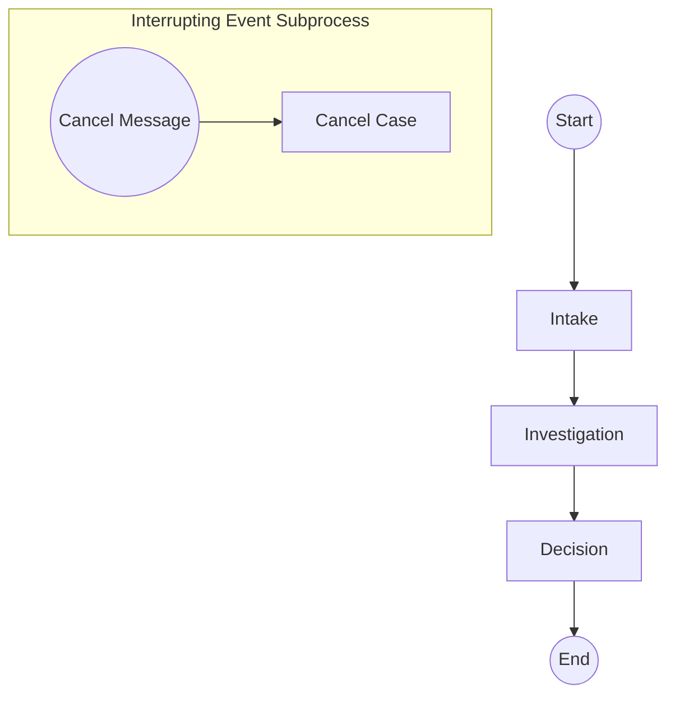

Use when a cancel/expiry signal can happen at many points in the process.

---

## 9. Escalation Events vs Timer Events

A timer says:

> Time has passed.

An escalation says:

> A non-critical business condition must be communicated to a higher scope.

Escalation events are not errors. They are not failures. They are a BPMN mechanism for raising a condition while allowing execution to continue, unless the catching construct changes behavior.

### 9.1 Error vs Escalation

| Dimension | Error | Escalation |
|---|---|---|
| Meaning | Something prevents normal completion | Something requires attention/higher-level reaction |
| Criticality | Critical | Non-critical |
| Typical result | Interrupt or alternative path | Notify, fork work, escalate responsibility |
| Use case | Validation failed, business rejection | Review overdue, manager attention needed |
| Worker command | Throw BPMN error | Usually modeled in BPMN as escalation event |

Use escalation when the original work is still meaningful but oversight or additional work is needed.

### 9.2 Timer-to-Escalation Pattern

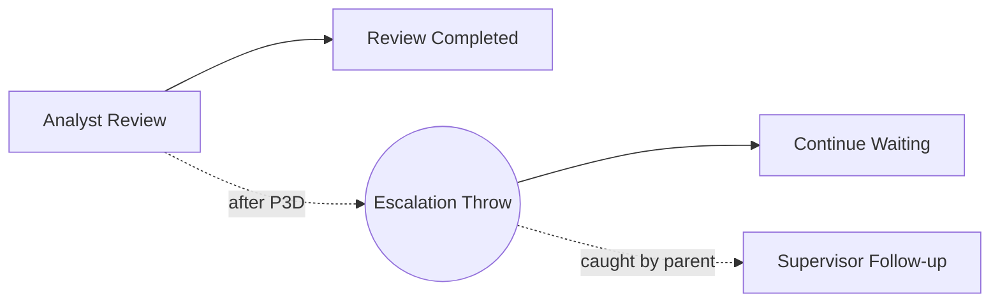

This pattern keeps the overdue condition explicit as business language.

A timer boundary event can also go directly to a service task that creates an escalation task. The advantage of an escalation event is semantic clarity across flow scopes.

---

## 10. SLA Modeling for Regulatory Enforcement

Regulatory systems are deadline-heavy. But not every deadline is the same.

### 10.1 Common Temporal Concepts

| Concept | Example | Recommended representation |
|---|---|---|
| Service deadline | Respondent has 14 days after notice | Calculated timestamp + timer catch |
| Internal target | Analyst should review within 3 days | Non-interrupting timer + task priority/escalation |
| Legal expiry | Appeal window has closed | Timer branch changes case state |
| Supervisory escalation | Case inactive too long | Non-interrupting boundary timer or event subprocess |
| Cooling-off period | Cannot proceed before date | Intermediate timer catch |
| Recertification | Periodic review required | Timer start event or external scheduler + process start |

### 10.2 Enforcement Notice Example

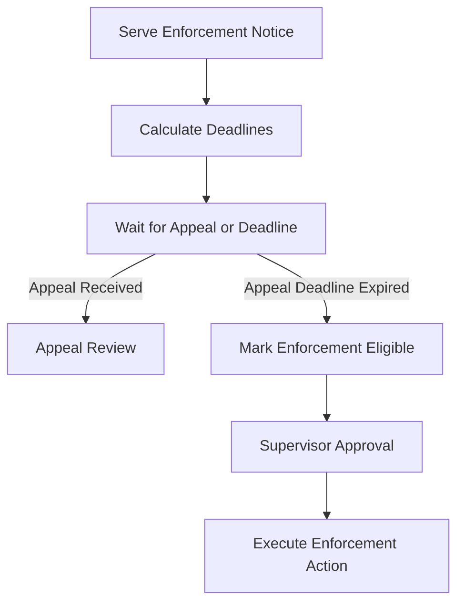

The critical invariant:

> The appeal deadline must be computed and persisted before waiting.

Do not recompute it at the point of expiry unless the policy says the deadline is dynamic.

### 10.3 Internal Review SLA Example

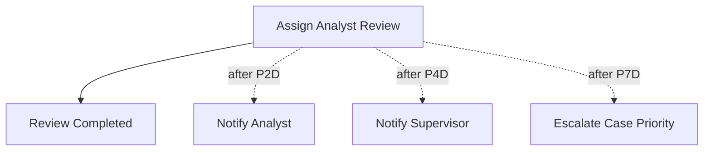

The review itself is not canceled. The organization merely applies increasing pressure.

This is why non-interrupting boundary timers are often more correct than interrupting timers for internal SLAs.

---

## 11. Time Zones and Calendar Rules

Do not hide calendar policy inside BPMN diagrams.

Important questions:

- Is the deadline based on UTC, local office time, respondent location, or court jurisdiction?
- Are weekends counted?
- Are public holidays excluded?
- Does the day of service count as day zero or day one?
- What happens if the deadline falls on a non-business day?
- Is daylight saving time relevant?

Recommended architecture:

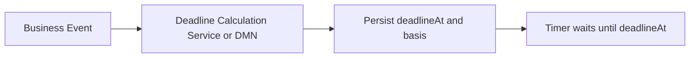

Persist not only the timestamp, but also the basis:

```json
{
  "noticeServedAt": "2026-06-28T09:00:00+07:00",
  "deadlineAt": "2026-07-12T17:00:00+07:00",
  "deadlinePolicy": "APPEAL_14_CALENDAR_DAYS_FROM_SERVICE",
  "jurisdiction": "ID-JK",
  "calculationVersion": "2026.1"
}
```

This helps audit, dispute handling, and future policy changes.

---

## 12. Timer Explosion Anti-Pattern

A timer explosion happens when too many process instances schedule too many timers too casually.

Example:

- 1 million active cases
- each has 5 non-interrupting repeating timers
- each timer sends reminders or creates jobs
- each fired timer causes worker load, notifications, writes, and visibility records

The diagram looked simple. The runtime is not.

### 12.1 Warning Signs

- Repeating timers attached to high-cardinality activities
- Timer start events used as general cron replacement for many small tasks
- Non-interrupting timers that create unbounded side work
- Multiple overlapping reminder ladders
- Long-running cases with dozens of temporal hooks

### 12.2 Mitigations

| Problem | Mitigation |
|---|---|
| Too many per-instance reminders | Use task query/reporting plus batch notification process |
| Repeating timers per case | Central scheduled sweep process |
| Timer branch creates duplicate notifications | Idempotency key per reminder level |
| Timer fired after work completed externally | Check current domain state before side effect |
| Long-running process stores all deadline complexity | Move calendar policy to deadline service |

### 12.3 Sweep Process Alternative

Instead of one repeating timer per case, use one scheduled process to query due work.

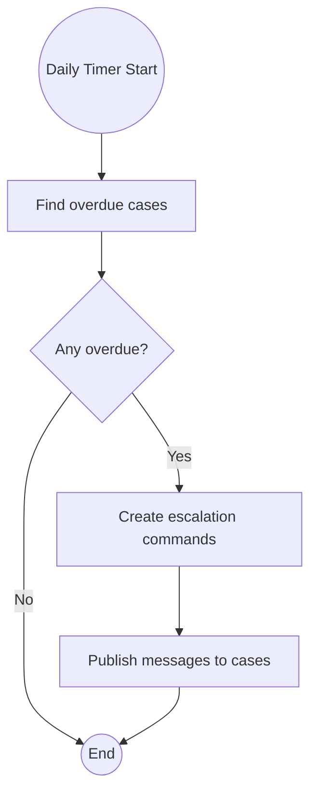

This is often better for large portfolios.

Use per-instance timers for business-critical state transitions. Use sweep processes for operational reminders and analytics-driven notifications.

---

## 13. Idempotency for Timer Handlers

Timer branches often send notifications, create tasks, update priority, or publish events.

All of these side effects must be idempotent.

Example idempotency key:

```text
case:{caseId}:sla-review:P4D:supervisor-notification
```

Worker logic should behave like this:

```java
public void handleSupervisorEscalation(EscalationCommand command) {
    String key = "case:%s:sla-review:P4D:supervisor-notification".formatted(command.caseId());

    if (notificationRepository.existsByIdempotencyKey(key)) {
        return;
    }

    notificationService.notifySupervisor(command.caseId(), command.supervisorId());
    notificationRepository.markSent(key);
}
```

Do not rely on “timer fires once” as your only guarantee. Process retries, worker retries, duplicate commands, or downstream uncertainty can still produce duplicate side effects if your worker is not idempotent.

---

## 14. Timer Testing Strategy

Testing timer behavior must cover path semantics, not just BPMN syntax.

### 14.1 Test Cases

| Test | What it proves |
|---|---|
| Timer path triggers | Process continues correctly after due date |
| Timer does not trigger early | Business logic does not assume premature transition |
| Interrupting timer cancels activity | Original activity cannot complete after timeout |
| Non-interrupting timer keeps activity alive | Reminder path does not block normal completion |
| Dynamic timer expression resolves | Variables are present and valid |
| Past due date behavior is acceptable | Process does not surprise users with immediate firing |
| Repeating timer stops correctly | No unbounded reminder loop |
| Handler idempotency | Duplicate side effects are prevented |

### 14.2 What to Avoid

Avoid tests that only assert that a BPMN element exists.

Bad test:

```text
Model contains a timer boundary event.
```

Better test:

```text
When analyst review is still active after P4D, supervisor follow-up is created and review task remains active.
```

Best test:

```text
When analyst review is completed before P4D, supervisor follow-up is not created; if the timer branch is retried after notification uncertainty, only one supervisor notification exists.
```

---

## 15. Modeling Checklist

Before approving a timer model, ask:

1. Is this timer business-visible or purely technical?
2. Is the deadline absolute, relative, or recurring?
3. Should the current activity be interrupted?
4. Can this timer fire more than once?
5. What happens if the timer fires late?
6. Is the timer handler idempotent?
7. Is the deadline calculation auditable?
8. Does the timer branch leak too much operational detail into BPMN?
9. Could a central sweep process be simpler and cheaper?
10. Is this modeled as SLA because workflow behavior changes, or only because metrics are desired?

---

## 16. Common Anti-Patterns

### 16.1 Timer as Technical Retry

Do not model every HTTP retry as BPMN timer loop.

Use job failure/retry/backoff for technical retry. Use BPMN timer when the business state changes after time passes.

### 16.2 Timer as Monitoring Dashboard

Do not add timers only to measure elapsed time.

Use metrics, exported records, Optimize, or operational reporting.

### 16.3 Interrupting Timer for Soft SLA

If the task should remain valid, do not interrupt it.

Use non-interrupting boundary timer.

### 16.4 Non-Interrupting Timer Without Idempotency

A reminder task without an idempotency key can spam users after retries or repeated cycles.

### 16.5 Dynamic Timer Without Validated Variables

Timer expressions depend on variables. Validate them before entering the timer.

### 16.6 Legal Deadline Hidden in Diagram

A `P14D` hardcoded in BPMN may be wrong if deadline rules depend on jurisdiction, service channel, or holidays.

### 16.7 Timer Start as Full Scheduler Replacement

Timer start events are useful, but they are not a complete enterprise scheduling platform. For large data scans, calendar-based windows, tenant-specific schedules, or operational controls, consider an external scheduler or one scheduled orchestration that dispatches work.

---

## 17. Practical Modeling Heuristics

Use this decision tree:

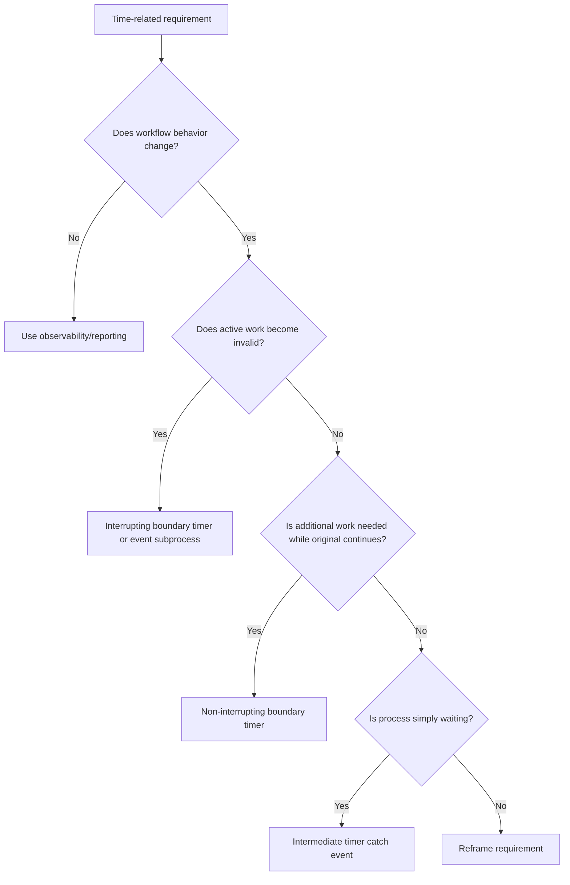

Escalation decision tree:

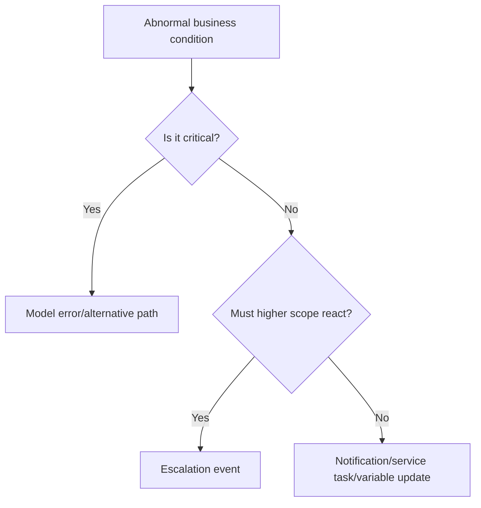

---

## 18. Practice Drill

Build this model:

> A regulatory case is assigned to an analyst. The analyst should complete review within 3 days. After 2 days, send a reminder. After 3 days, create supervisor follow-up but do not cancel the analyst task. After 7 days, interrupt the analyst review and reassign the case to a senior investigator. If the respondent submits a withdrawal request at any time before decision, interrupt the whole process and close the case.

Expected modeling choices:

- Analyst task with non-interrupting timer after `P2D`
- Analyst task with non-interrupting timer after `P3D`
- Analyst task with interrupting timer after `P7D`
- Interrupting event subprocess for withdrawal message
- Idempotent notification and follow-up workers
- Clear variable contract: `caseId`, `assignedAnalystId`, `supervisorId`, `reviewDueAt`, `seniorQueue`

Ask yourself:

- Which timers represent soft SLA?
- Which timer represents hard transition?
- What side effects must be idempotent?
- What should happen if analyst completes review at day 6?
- What should happen if withdrawal arrives after senior reassignment?

---

## 19. Key Takeaways

- A timer is a future process event, not just a delay.
- Use intermediate timer catch events when waiting is the business state.
- Use interrupting boundary timers when active work must be canceled.
- Use non-interrupting boundary timers for reminders and soft escalations.
- SLA can be a branch, a metric, or both; do not confuse them.
- Escalation events are non-critical business signals to higher scope, not technical failures.
- Timer handlers must be idempotent.
- Timer-heavy models require scale review.
- Legal/calendar deadlines should be calculated in explicit domain boundaries and persisted.
- Zeebe timers should not be modeled as exact hard-real-time triggers.

---

## 20. Source Anchors

- Camunda 8 Docs — Timer events: `https://docs.camunda.io/docs/components/modeler/bpmn/timer-events/`
- Camunda 8 Docs — Escalation events: `https://docs.camunda.io/docs/components/modeler/bpmn/escalation-events/`
- Camunda 8 Docs — Event subprocess: `https://docs.camunda.io/docs/components/modeler/bpmn/event-subprocesses/`
- Camunda 8 Docs — Modeling beyond the happy path: `https://docs.camunda.io/docs/components/best-practices/modeling/modeling-beyond-the-happy-path/`
