# Part 010 — Subprocesses, Call Activities, and Reuse Boundaries

Subprocess and call activity modeling is not merely diagram organization.

It is architectural decomposition.

A subprocess answers:

> Should this logic live inside the current process scope?

A call activity answers:

> Should this logic be a separately versioned, deployable, reusable process contract?

The difference matters because Camunda 8 / Zeebe executes process instances as stateful distributed workflows. Scope boundaries affect variables, cancellation, event handling, versioning, debugging, and operational ownership.

This part teaches how to decompose process models without creating unmaintainable “BPMN microservices.”

---

## 1. Kaufman Deconstruction

To master subprocess and reuse design, break the skill into seven parts:

| Sub-skill | Question it answers |
|---|---|
| Scope semantics | What variables and events are visible where? |
| Embedded subprocess usage | When should logic remain inside the same BPMN file? |
| Event subprocess usage | How do we react to events across a scope? |
| Call activity usage | When should logic become a separately callable process? |
| Version binding | Which version of the called process should run? |
| Variable mapping | What data crosses the boundary? |
| Decomposition governance | Who owns the reusable process contract? |

Most modeling mistakes come from using subprocesses as visual folders or call activities as copy-paste reduction tools.

That is too shallow.

---

## 2. Mental Model: Process Scope as a Boundary

A BPMN scope is a runtime container.

It can own:

- active element instances
- local variables
- boundary events
- event subprocesses
- lifecycle rules
- cancellation behavior
- output mappings

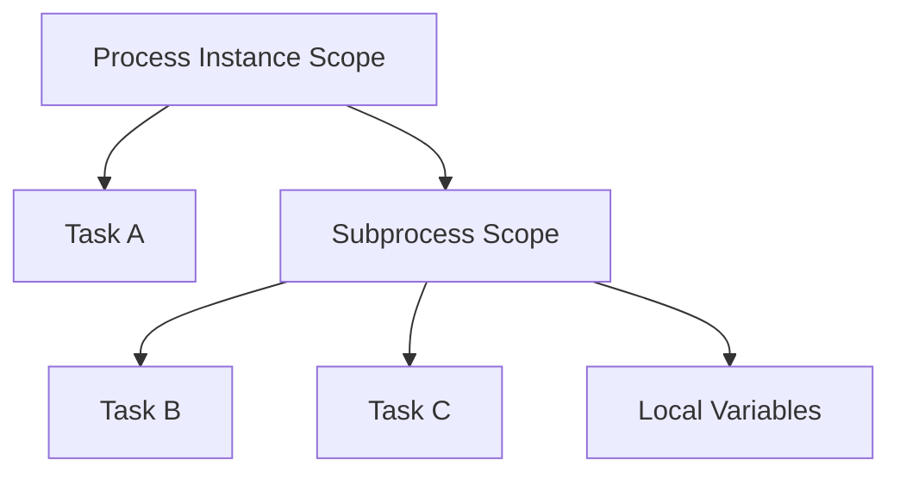

Do not think of a subprocess as a rectangle around tasks.

Think of it as:

> A nested runtime scope with its own local state and event handling surface.

---

## 3. The Four Main Constructs

| Construct | Runtime meaning | Use when |
|---|---|---|
| Embedded subprocess | Nested scope inside same process model | Group tightly coupled flow and attach boundary events |
| Event subprocess | Event-triggered nested flow inside a scope | React to messages/timers/errors/escalations while scope is active |
| Call activity | Invoke another process instance | Reuse separately owned/versioned process logic |
| Ad-hoc subprocess | Flexible set of activities without strict sequence | Human-driven or dynamic work blocks |

This part focuses mainly on embedded subprocesses, event subprocesses, and call activities because they define the most common architecture boundaries.

---

## 4. Embedded Subprocess

An embedded subprocess groups elements inside the same process definition.

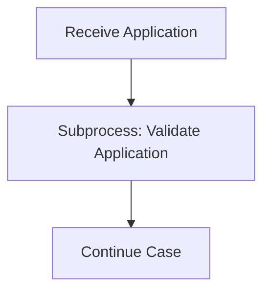

Inside the subprocess:

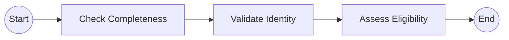

Use embedded subprocess when:

- the logic is part of the same process lifecycle
- the logic is not independently reusable
- the logic shares the same ownership and release cadence
- you need to attach boundary events to a group of activities
- you want local variable scope
- you want to simplify diagram readability without creating a separate process contract

Camunda 8 semantics to remember:

- An embedded subprocess must have exactly one none start event.
- Other start events are not allowed inside a normal embedded subprocess.
- The subprocess stays active while one of its contained elements is active.
- When the last contained element completes, the subprocess completes.
- Interrupting boundary events attached to the subprocess terminate all active elements inside it.

---

## 5. Embedded Subprocess as Boundary Event Surface

One of the best reasons to use an embedded subprocess is to attach a boundary event to a whole region of work.

Example:

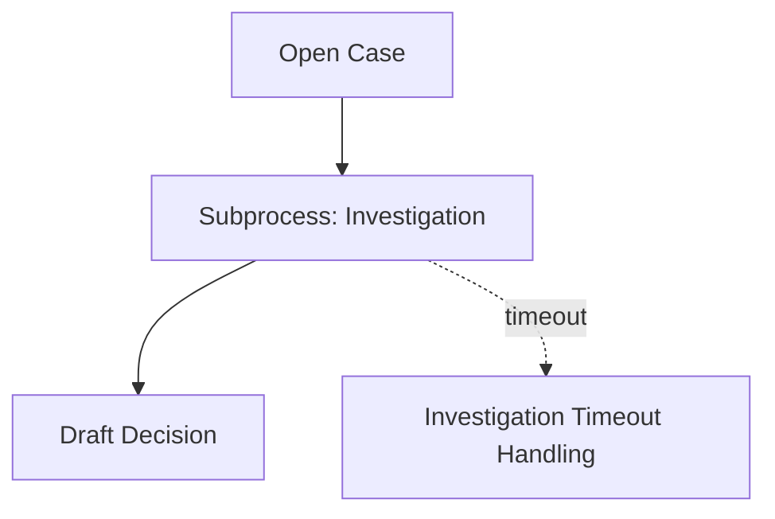

This says:

> While any investigation activity is active, the timeout may interrupt the entire investigation scope.

Without the subprocess, you might attach duplicate timers to many tasks. That creates visual clutter and semantic drift.

Good use cases:

- investigation window
- appeal review phase
- document collection phase
- settlement negotiation phase
- remediation monitoring phase

The subprocess gives the phase a boundary.

---

## 6. Local Variable Scope

Embedded subprocesses can have local variables.

This is useful when intermediate data should not leak into the parent process.

Example:

```json
{
  "candidateViolations": [...],
  "temporaryRiskScores": [...],
  "validationWarnings": [...]
}
```

These may be useful inside an investigation subprocess but should not become global case variables.

Recommended rule:

> Promote only stable business state to parent scope.

Bad global variables:

```json
{
  "temp1": "...",
  "intermediateResult": "...",
  "workerDebugPayload": "...",
  "rawApiResponse": "..."
}
```

Better parent variables:

```json
{
  "investigationOutcome": "VIOLATION_FOUND",
  "recommendedAction": "FORMAL_WARNING",
  "evidenceBundleId": "evb-2026-00017"
}
```

Use output mappings to control what exits the subprocess.

---

## 7. Event Subprocess

An event subprocess is triggered by an event while its containing scope is active.

It behaves like a scoped reaction mechanism.

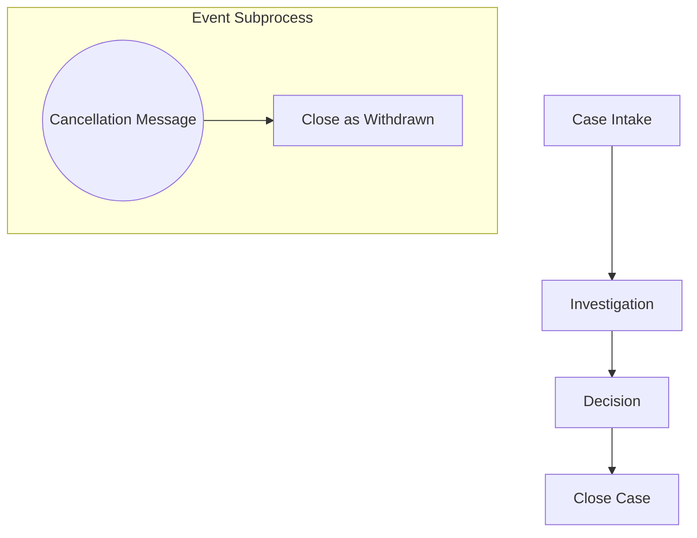

Use event subprocess when a condition can occur across many points in a scope.

Examples:

- case withdrawal received
- respondent submits additional evidence
- supervisor override issued
- global timeout reached
- emergency hold applied
- legal injunction received

### 7.1 Interrupting Event Subprocess

An interrupting event subprocess terminates all active work in the containing scope.

Use when the event invalidates the current path:

- case canceled
- appeal withdrawn
- legal hold blocks all processing
- duplicate case detected

### 7.2 Non-Interrupting Event Subprocess

A non-interrupting event subprocess starts additional work while current work continues.

Use when the event adds work but does not invalidate the main flow:

- additional document received
- status inquiry received
- new evidence submitted
- supervisor comment added

---

## 8. Boundary Event vs Event Subprocess

| Need | Boundary event | Event subprocess |
|---|---|---|
| React while one activity is active | Good fit | Usually too broad |
| React while a phase is active | Attach to embedded subprocess | Good if event should be handled inside phase |
| React almost anywhere in process | Not ideal | Good fit |
| Access containing scope variables | Limited by boundary position | Stronger fit because it is inside scope |
| Visual local exception handling | Good | Good for repeated/cross-cutting events |

Heuristic:

- Use boundary event for local reaction.
- Use event subprocess for scope-wide reaction.

---

## 9. Call Activity

A call activity invokes another BPMN process.

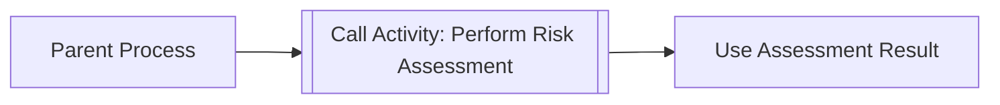

At runtime:

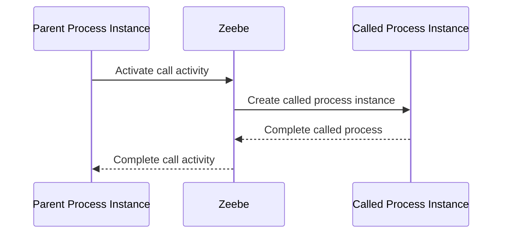

Use call activity when:

- the child process is reused by multiple parents
- the child process has separate ownership
- the child process deserves independent versioning
- the child process has its own operational lifecycle
- the child process is large enough to obscure parent intent
- the parent only needs a stable result contract

Do not use call activity merely to make a diagram smaller.

---

## 10. Call Activity Lifecycle Semantics

When the call activity is entered:

1. Zeebe creates a new process instance of the referenced process.
2. The child process starts at its none start event.
3. The parent waits at the call activity.
4. When the child completes, the parent leaves the call activity.
5. Output variables are propagated according to mapping rules.

This is not a function call in Java.

A call activity is a **parent-child process instance relationship**.

That means:

- the child may be visible as its own instance
- incidents may occur in the child
- variable propagation must be designed
- version binding matters
- interrupting the call activity may terminate the child

---

## 11. Binding Type and Version Strategy

A call activity must define the BPMN process ID of the called process.

Camunda 8 supports different binding strategies:

| Binding type | Meaning | Use when |
|---|---|---|
| `latest` | Use latest deployed version at activation time | Fast-moving internal flows, low compatibility risk |
| `deployment` | Use the version deployed with the calling process | Strong release consistency |
| `versionTag` | Use latest version with a matching version tag | Controlled compatibility line |

If no binding type is specified, `latest` is the default.

That default can be dangerous.

### 11.1 Why `latest` Can Be Dangerous

Suppose parent process version 3 expects child output:

```json
{
  "riskLevel": "HIGH"
}
```

Then child process version 7 changes output to:

```json
{
  "risk": {
    "level": "HIGH"
  }
}
```

If parent uses `latest`, new parent instances may call child version 7 and fail or behave incorrectly.

This is runtime coupling through a hidden contract.

### 11.2 Recommended Strategy

| Situation | Recommended binding |
|---|---|
| Parent and child released together | `deployment` |
| Child has stable compatibility tags | `versionTag` |
| Prototype/internal sandbox | `latest` acceptable |
| Highly regulated process | Prefer `deployment` or `versionTag` |
| Shared platform process used by many teams | `versionTag` plus compatibility policy |

Top-tier teams do not treat process versioning as an afterthought.

---

## 12. Variable Mapping at Call Boundaries

The call activity boundary must be treated like an API boundary.

### 12.1 Input Mapping

Input mapping defines what parent data becomes available to the child.

Good input contract:

```json
{
  "caseId": "CASE-2026-000123",
  "subjectId": "ORG-9421",
  "assessmentType": "ENFORCEMENT_RISK",
  "requestedBy": "process:formal-investigation"
}
```

Bad input contract:

```json
{
  "entireCaseObject": { "...": "huge mutable object" },
  "allVariables": "implicitly copied",
  "debugPayload": "..."
}
```

### 12.2 Output Mapping

Output mapping defines what the child returns to the parent.

Good output contract:

```json
{
  "riskAssessmentId": "RA-2026-9981",
  "riskLevel": "HIGH",
  "riskRationaleSummary": "Pattern matched high-risk enforcement criteria"
}
```

The parent should not depend on child internal variables.

### 12.3 Disable Accidental Propagation

For parallel flows and multi-instance call activities, uncontrolled variable propagation can cause overwrites.

Recommended rule:

> Explicitly map outputs for call activities used in reusable, parallel, or regulated flows.

---

## 13. Embedded Subprocess vs Call Activity

Use this matrix:

| Question | Embedded subprocess | Call activity |
|---|---|---|
| Same BPMN file? | Yes | No |
| Separate process instance? | No | Yes |
| Separate versioning? | No | Yes |
| Reusable by many parents? | Not directly | Yes |
| Best for local phase? | Yes | Sometimes |
| Best for platform capability? | No | Yes |
| Contract boundary needed? | Light | Strong |
| Operational ownership independent? | No | Yes |

Heuristic:

- Use embedded subprocess for **local structure**.
- Use call activity for **reusable process capability**.

---

## 14. Decomposition Patterns

### 14.1 Phase Boundary Pattern

Use embedded subprocess to model a phase.

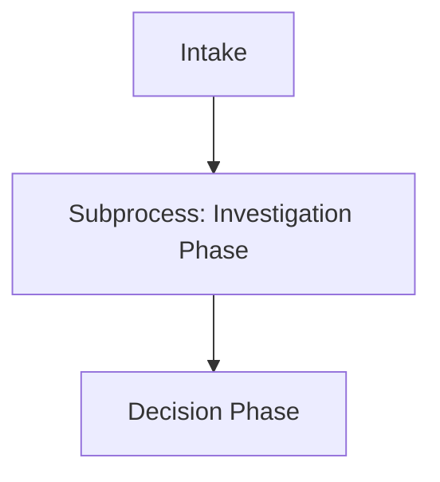

Good when:

- boundary events apply to the whole phase
- local variables should be scoped
- phase belongs to parent lifecycle

### 14.2 Shared Capability Pattern

Use call activity for a reusable organizational capability.

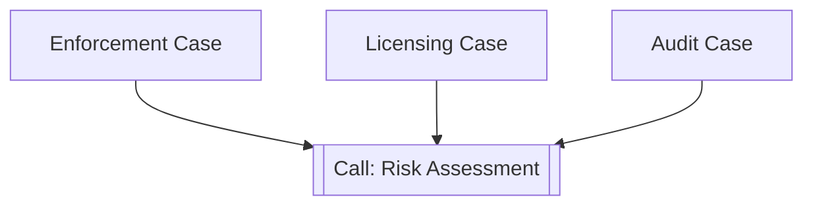

Good when:

- multiple process families need the same capability
- capability has its own governance
- output contract can be stable

### 14.3 Policy Decision Wrapper Pattern

Use call activity when decisioning itself is a managed process.

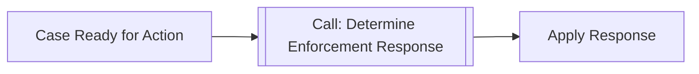

This is useful when the decision process includes:

- DMN decisions
- human review
- evidence checks
- supervisor approval
- audit summary generation

If it is only a single DMN evaluation, do not wrap it in a call activity unnecessarily.

### 14.4 Parent-Orchestrated Child Work Pattern

The parent coordinates several child processes.

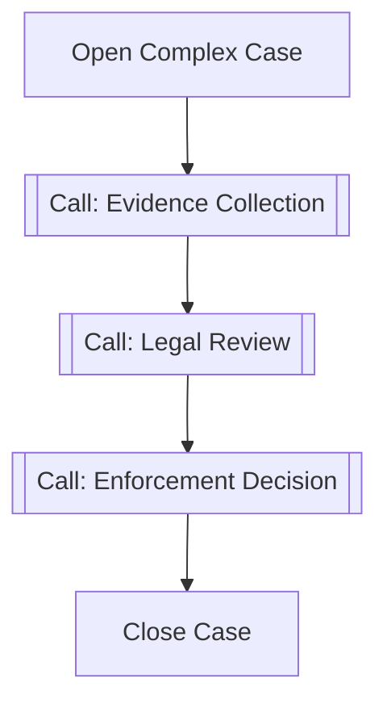

This keeps parent readable but can create operational dependency chains. Use only when each child is meaningfully independent.

### 14.5 Fan-Out Call Activity Pattern

Use multi-instance call activity when the same child process must run for many entities.

Example:

- assess each regulated entity
- request documents from multiple parties
- run regional compliance checks

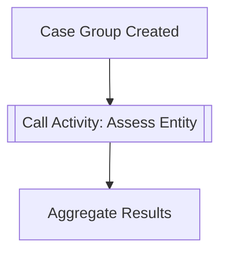

Warning: output mapping and aggregation must be designed carefully. Do not allow child instances to overwrite the same parent variable.

---

## 15. Anti-Patterns

### 15.1 Subprocess as Visual Folder Only

If the subprocess has no meaningful scope, no boundary event, no local variable need, and no readability benefit, it may be unnecessary.

A visual folder is not architecture.

### 15.2 Call Activity for Every Repeated Fragment

Do not create a called process for every repeated two-task fragment.

This creates:

- version sprawl
- deployment coupling
- debugging complexity
- unclear ownership
- hidden variable contracts

Reuse has a cost.

### 15.3 Hidden Contract Through `latest`

Using `latest` without compatibility discipline can break parent processes after child deployments.

This is equivalent to calling an unversioned API in production.

### 15.4 Propagate-All Variables

Letting all child variables flow back to parent is convenient early and dangerous later.

It can cause:

- accidental overwrite
- data leakage
- large payload growth
- unclear ownership
- hard-to-debug variable changes

### 15.5 Mega Parent Process

A parent process that calls dozens of child processes may become a distributed monolith.

Symptoms:

- parent knows too many child details
- every change requires cross-team coordination
- incidents are hard to localize
- variables become global shared state

### 15.6 Child Process Without Stable Meaning

A called process should represent a stable business capability, not a temporary implementation detail.

Bad child process names:

- `do-step-3`
- `common-flow`
- `misc-validation`
- `helper-process`

Good child process names:

- `perform-risk-assessment`
- `collect-respondent-evidence`
- `conduct-legal-review`
- `approve-enforcement-action`

---

## 16. Naming and Contract Guidelines

### 16.1 Process ID Naming

Use stable capability names:

```text
risk-assessment-process
legal-review-process
evidence-collection-process
respondent-notification-process
```

Avoid version numbers in BPMN process ID unless you intentionally model a separate capability line.

Versioning should usually use deployment/versionTag mechanics, not process ID suffixes.

### 16.2 Call Activity Name

The call activity label should describe the parent intent:

```text
Assess enforcement risk
Collect missing evidence
Run legal sufficiency review
```

The child process ID describes the reusable capability:

```text
perform-risk-assessment
collect-evidence
conduct-legal-review
```

### 16.3 Contract Document

For each shared called process, document:

- process ID
- owner team
- supported binding strategy
- input variables
- output variables
- BPMN errors thrown
- escalation events used
- incidents requiring owner response
- compatibility guarantees
- deprecation policy

Treat called processes as internal platform APIs.

---

## 17. Failure and Cancellation Semantics

### 17.1 Incident in Child Process

If the child process hits an incident, the parent call activity remains waiting.

Operationally, this means:

- parent appears stuck at call activity
- child contains the concrete failure
- runbook must tell operators where to inspect
- alerting should include parent-child correlation

### 17.2 Interrupting Boundary Event on Call Activity

If an interrupting boundary event attached to a call activity triggers, the call activity and created child process are terminated.

Important consequence:

> Variables from the child are not propagated if the call is interrupted.

So timeout/cancellation paths must not depend on child output variables.

### 17.3 Child Business Error

A child process can model business errors internally, or it can communicate results through outputs.

Use BPMN error propagation only when the parent should branch because the child cannot complete its promised capability.

Do not throw BPMN errors for ordinary negative outcomes if those outcomes are valid results.

Example:

| Outcome | Better representation |
|---|---|
| Risk assessment returns HIGH | Normal output variable |
| Evidence collection incomplete | Normal outcome or BPMN error depending on contract |
| Legal review cannot proceed due missing jurisdiction | BPMN error if parent must handle alternative path |
| Worker HTTP timeout | Technical failure/retry, not BPMN business error |

---

## 18. Regulatory Case Example

Imagine a formal enforcement lifecycle:

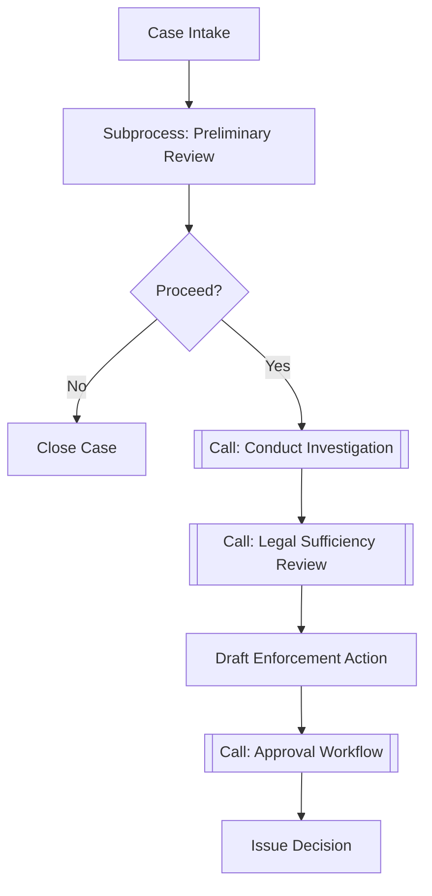

### 18.1 Embedded Subprocess Choice

`Preliminary Review` is embedded because:

- it is local to this process
- it likely shares parent variables
- it is not reused independently
- it may need a boundary timer for intake SLA

### 18.2 Call Activity Choice

`Conduct Investigation` is called because:

- it may be long-running
- it may be reused across case types
- it may have its own team/process owner
- it may have complex child lifecycle
- it has a clear output contract: investigation result

### 18.3 Approval Workflow Choice

`Approval Workflow` may be called if approval logic is standardized across many enforcement processes.

But if approval is specific to this process, embed it instead.

---

## 19. Review Checklist

Before approving subprocess/call activity design, ask:

1. Is this a scope boundary or just a visual grouping?
2. Does the subprocess need local variables?
3. Does a boundary event apply to the whole group?
4. Does the logic deserve independent ownership?
5. Does the logic deserve independent versioning?
6. Is the called process contract documented?
7. Is binding type explicit and justified?
8. Are input/output mappings explicit?
9. Could variables be accidentally overwritten in parallel flows?
10. Does the runbook explain parent-child incident handling?
11. Can the parent tolerate child version evolution?
12. Is the model easier to understand after decomposition?

If decomposition increases operational uncertainty more than it improves clarity, do not decompose yet.

---

## 20. Practice Drill

Design a BPMN decomposition for this scenario:

> A regulator receives a complaint. The complaint enters preliminary screening. If accepted, the system opens a formal case. The case requires evidence collection from multiple entities, legal review, risk assessment, and final approval. Evidence collection is reused by other processes. Risk assessment is a standard platform process. Legal review is specific to this enforcement flow. A withdrawal request can arrive anytime before final approval and must interrupt the case.

Expected design:

- Embedded subprocess: `Preliminary Screening`
- Call activity: `Collect Evidence`
- Call activity: `Perform Risk Assessment`
- Embedded subprocess: `Legal Review` if not reused
- Embedded subprocess or call activity: `Final Approval`, depending on reuse/governance
- Interrupting event subprocess: `Withdrawal Received`
- Explicit input/output mapping for called processes
- Non-`latest` binding for regulated production release

Questions to answer:

- Which child processes are platform capabilities?
- Which subprocesses are merely local phases?
- What variables are allowed to cross each boundary?
- What happens if evidence collection times out?
- Which team owns incidents in each child process?

---

## 21. Key Takeaways

- Subprocesses are runtime scopes, not just visual containers.
- Embedded subprocesses are best for local phases, boundary-event surfaces, and local variable control.
- Event subprocesses model cross-cutting event reactions inside an active scope.
- Call activities invoke separate process instances and should be treated as process APIs.
- Binding type is a production architecture decision.
- `latest` is convenient but can create hidden runtime coupling.
- Variable mapping is contract design.
- Reuse should be earned through stable meaning, ownership, and compatibility.
- Over-decomposition creates BPMN distributed monoliths.
- Good process architecture makes parent intent clear and child contracts explicit.

---

## 22. Source Anchors

- Camunda 8 Docs — Subprocess overview: `https://docs.camunda.io/docs/components/modeler/bpmn/subprocesses/`
- Camunda 8 Docs — Embedded subprocess: `https://docs.camunda.io/docs/components/modeler/bpmn/embedded-subprocesses/`
- Camunda 8 Docs — Event subprocess: `https://docs.camunda.io/docs/components/modeler/bpmn/event-subprocesses/`
- Camunda 8 Docs — Call activities: `https://docs.camunda.io/docs/components/modeler/bpmn/call-activities/`
