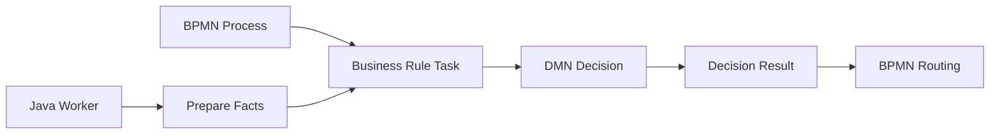
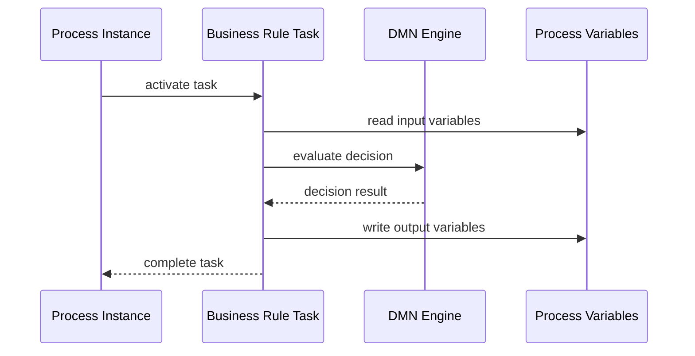
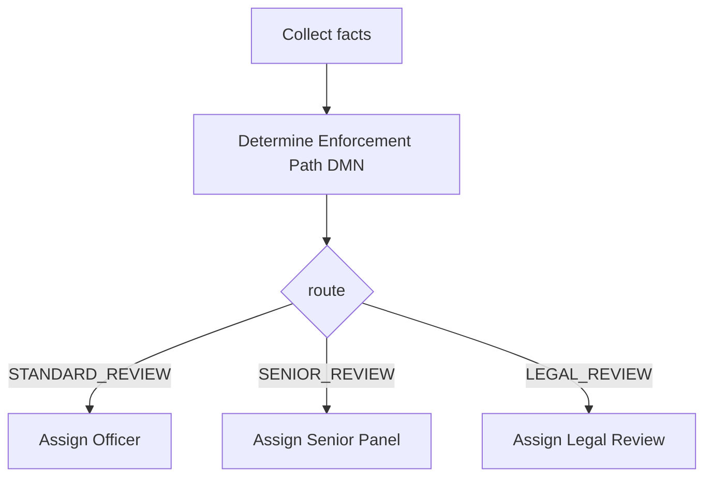
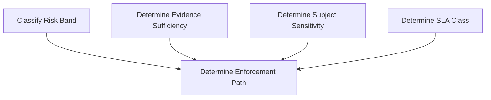
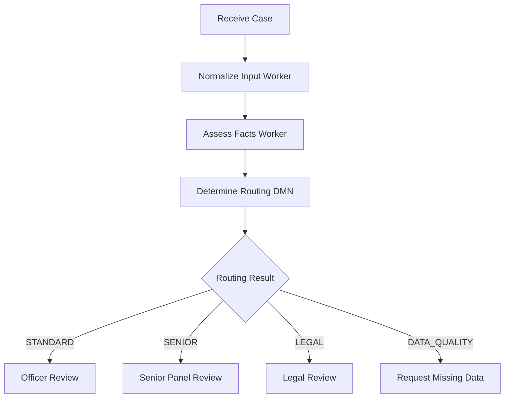
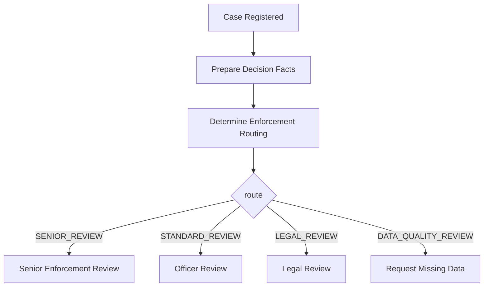

# Part 012 — DMN Decision Automation with Zeebe

DMN adalah cara membuat decision logic menjadi eksplisit, terstruktur, versioned, dan bisa direview. Dalam Camunda 8, DMN sering dipakai lewat business rule task di BPMN, tetapi DMN juga bisa dievaluasi langsung dari aplikasi Java.

Mental model inti:

> BPMN menjawab “urutan dan lifecycle kerja apa yang terjadi?” DMN menjawab “berdasarkan fakta saat ini, keputusan apa yang harus diambil?”

Jika BPMN adalah state transition map, DMN adalah policy evaluation boundary.

Dokumentasi Camunda menjelaskan bahwa DMN decision table terdiri dari input, output, dan rules; business rule task dipakai untuk mengevaluasi business rule seperti DMN decision; ketika process instance tiba di business rule task, internal DMN decision engine mengevaluasi decision lalu process berlanjut.

---

## 1. Why DMN Matters in Camunda 8

Tanpa DMN, business rule sering bocor ke tiga tempat:

1. Gateway FEEL expression yang makin panjang.
2. Worker Java yang diam-diam menjadi policy engine.
3. Frontend/form yang mengunci decision rule di UI.

Akibatnya:

- sulit audit;
- sulit explain;
- sulit test;
- sulit versioning;
- sulit dikontrol oleh business owner;
- perubahan kecil memicu deploy kode;
- process model terlihat sederhana tapi decision tersembunyi.

DMN memisahkan concern:



BPMN tidak perlu tahu seluruh detail rule. BPMN cukup tahu decision result.

---

## 2. Decision Boundary

DMN harus dipakai ketika ada decision yang memenuhi beberapa karakteristik:

| Signal | Artinya |
|---|---|
| Rule bisa dijelaskan sebagai table | DMN cocok |
| Business user perlu review | DMN cocok |
| Rule berubah lebih sering dari process lifecycle | DMN cocok |
| Decision butuh reason/result eksplisit | DMN cocok |
| Rule punya banyak kombinasi input | DMN cocok |
| Rule hanya satu boolean sederhana | FEEL gateway cukup |
| Rule butuh external API call | Worker dulu, DMN setelah facts tersedia |
| Rule butuh ML/scoring kompleks | Worker/scoring service, DMN untuk policy interpretation |

Contoh DMN cocok:

- menentukan priority case;
- menentukan review path;
- menentukan SLA class;
- menentukan required approval level;
- menentukan eligibility;
- menentukan enforcement action recommendation;
- menentukan document checklist;
- menentukan escalation target.

Contoh DMN kurang cocok:

- mengirim email;
- query database;
- memanggil risk scoring API;
- transformasi payload sangat teknis;
- kalkulasi numerik berat;
- orchestration sequence.

---

## 3. Anatomy of a DMN Decision Table

Decision table memiliki:

- decision id;
- decision name;
- input clauses;
- output clauses;
- rules;
- hit policy.

Contoh konseptual:

| amount | subjectType | repeatOffender | output route | output priority | reasonCode |
|---|---|---|---|---|---|
| `> 100000000` | `"BANK"` | `true` | `"SENIOR_REVIEW"` | `"P1"` | `"HIGH_RISK_REGULATED_REPEAT"` |
| `> 100000000` | `-` | `false` | `"ENHANCED_REVIEW"` | `"P2"` | `"HIGH_AMOUNT"` |
| `-` | `-` | `-` | `"STANDARD_REVIEW"` | `"P3"` | `"DEFAULT"` |

DMN tidak hanya menghasilkan `true/false`. DMN bisa menghasilkan structured output yang menjadi language untuk BPMN.

---

## 4. DMN as Policy Contract

Sebuah DMN decision seharusnya punya contract yang jelas.

### 4.1 Input Contract

Contoh:

```json
{
  "amount": 125000000,
  "subjectType": "BANK",
  "repeatOffender": true,
  "validatedEvidenceCount": 4
}
```

Rule:

- semua input wajib typed;
- enum value harus stabil;
- null hanya jika punya makna domain;
- input harus facts, bukan transport payload;
- jangan masukkan object besar jika hanya butuh beberapa field.

### 4.2 Output Contract

Contoh:

```json
{
  "route": "SENIOR_REVIEW",
  "priority": "P1",
  "reasonCode": "HIGH_RISK_REGULATED_REPEAT",
  "requiresManagerApproval": true
}
```

Output harus:

- mudah dipakai BPMN;
- punya enum yang terdokumentasi;
- cukup kaya untuk audit;
- stabil terhadap perubahan rule internal.

---

## 5. BPMN Business Rule Task

Di BPMN Camunda 8, business rule task merepresentasikan evaluasi rule. Untuk DMN implementation, task mengacu ke decision id.

Alur runtime:



Dalam model yang baik, business rule task adalah boundary eksplisit:

- sebelum task: facts sudah disiapkan;
- di task: policy dievaluasi;
- setelah task: process route memakai result.

Gateway setelah DMN seharusnya sederhana:

```feel
enforcementRouting.route = "SENIOR_REVIEW"
```

Bukan mengulang rule DMN.

---

## 6. Hit Policies: The Decision Table Brain

Hit policy menentukan cara rule table menghasilkan hasil.

Pilih hit policy berdasarkan makna domain, bukan asal table berjalan.

### 6.1 Unique

Hanya satu rule boleh match.

Cocok untuk:

- classification tunggal;
- priority tier;
- eligibility final;
- route selection tunggal.

Risiko:

- jika dua rule match, table invalid secara makna;
- butuh rule saling eksklusif.

### 6.2 First

Rule pertama yang match dipakai.

Cocok untuk:

- ordered precedence;
- exception-before-default;
- policy dengan urutan prioritas eksplisit.

Risiko:

- row ordering menjadi semantic;
- reviewer harus paham bahwa baris atas lebih kuat.

### 6.3 Any

Beberapa rule boleh match tetapi harus menghasilkan output sama.

Cocok jika banyak kondisi mengarah ke conclusion sama.

Risiko:

- tidak cocok jika output berbeda.

### 6.4 Collect

Mengumpulkan semua output dari rule yang match.

Cocok untuk:

- checklist dokumen;
- daftar reason codes;
- daftar required approvals;
- daftar notification recipients;
- daftar remediation actions.

Risiko:

- consumer harus siap menerima list;
- urutan output tidak boleh diasumsikan kecuali ditentukan.

### 6.5 Rule of Thumb

| Domain Need | Hit Policy |
|---|---|
| satu route final | Unique atau First |
| exception precedence | First |
| banyak required items | Collect |
| duplicate logic boleh asal hasil sama | Any |
| score aggregation | Collect + aggregation, atau worker jika kompleks |

---

## 7. Designing DMN for Regulatory Systems

Regulatory workflow membutuhkan decision yang bisa dijelaskan setelah kejadian. Maka DMN output harus memberi traceability.

Contoh decision: `Determine Enforcement Path`

Inputs:

- `caseType`
- `subjectCategory`
- `riskBand`
- `validatedEvidenceCount`
- `repeatOffender`
- `jurisdiction`

Outputs:

- `route`
- `priority`
- `approvalLevel`
- `reasonCode`
- `slaClass`



Jangan output hanya `true`.

Buruk:

```json
{
  "approved": false
}
```

Lebih baik:

```json
{
  "decision": "REJECT",
  "reasonCode": "INSUFFICIENT_VALIDATED_EVIDENCE",
  "requiredAction": "REQUEST_ADDITIONAL_EVIDENCE"
}
```

Regulatory defensibility berasal dari ability to explain, bukan hanya ability to route.

---

## 8. DRD: Decision Requirements Diagram

Untuk decision yang besar, satu decision table sering tidak cukup. DRD membantu memecah decision menjadi sub-decision.

Contoh:



Prinsip decomposition:

- sub-decision punya makna domain mandiri;
- output sub-decision bisa dijelaskan;
- jangan memecah hanya karena table panjang;
- jangan membuat dependency graph yang susah dipahami;
- sub-decision harus punya contract stabil.

DRD cocok ketika decision final adalah komposisi dari beberapa policy area.

---

## 9. DMN and Java Client Evaluation

Selain lewat BPMN business rule task, decision bisa dievaluasi dari Java application.

Use case:

- pre-check sebelum start process;
- API endpoint untuk preview decision;
- test harness;
- batch policy simulation;
- migration validation;
- explainability endpoint.

Contoh konseptual dengan Camunda Java Client:

```java
var result = camundaClient
    .newEvaluateDecisionCommand()
    .decisionId("determine_enforcement_path")
    .variables(Map.of(
        "amount", new BigDecimal("125000000"),
        "subjectType", "BANK",
        "repeatOffender", true,
        "validatedEvidenceCount", 4
    ))
    .send()
    .join();
```

Catatan desain:

- jangan membuat application layer dan BPMN memakai decision id berbeda;
- centralize decision id constants;
- versioning harus eksplisit;
- test output shape, bukan hanya successful evaluation;
- preview endpoint harus memakai input contract yang sama dengan process.

---

## 10. Versioning and Deployment Strategy

DMN adalah artifact runtime seperti BPMN. Perubahan DMN bukan sekadar perubahan spreadsheet.

### 10.1 Versioning Questions

Sebelum mengubah decision:

1. Apakah running process instance harus memakai rule lama atau rule baru?
2. Apakah rule change berlaku untuk semua kasus baru saja?
3. Apakah legal basis perubahan perlu dicatat?
4. Apakah output contract berubah?
5. Apakah BPMN gateway downstream masih kompatibel?
6. Apakah historical decision explanation tetap bisa direkonstruksi?

### 10.2 Backward-Compatible Change

Umumnya aman:

- menambah rule yang menghasilkan output enum existing;
- mengubah threshold tanpa ubah output shape;
- menambah reason code optional jika consumer toleran;
- memperbaiki typo label non-contract.

Berisiko:

- mengganti decision id;
- mengganti output field name;
- mengganti enum value;
- mengubah hit policy;
- mengubah output dari scalar ke list;
- menghapus default rule.

### 10.3 Decision Version Principle

> Decision result contract lebih penting daripada internal rule rows.

BPMN dan worker boleh bergantung pada output contract, bukan detail row DMN.

---

## 11. Testing DMN

DMN harus diuji seperti code, tetapi dengan test style yang sesuai rule.

### 11.1 Table-Level Test

Untuk setiap decision:

- one test per important rule;
- one test for default rule;
- boundary threshold tests;
- unknown enum tests;
- null/missing field tests;
- multi-hit conflict tests jika hit policy Unique;
- collect ordering/contents tests jika hit policy Collect.

Contoh test matrix:

| Case | amount | subjectType | repeatOffender | expected route | expected reason |
|---|---:|---|---|---|---|
| high regulated repeat | 125000000 | BANK | true | SENIOR_REVIEW | HIGH_RISK_REGULATED_REPEAT |
| high non-repeat | 125000000 | MERCHANT | false | ENHANCED_REVIEW | HIGH_AMOUNT |
| normal | 1000000 | MERCHANT | false | STANDARD_REVIEW | DEFAULT |
| missing subject | 1000000 | null | false | DATA_QUALITY_REVIEW | MISSING_SUBJECT_TYPE |

### 11.2 BPMN Integration Test

DMN test saja tidak cukup. Test juga bahwa BPMN memakai hasil DMN dengan benar.

Scenario:

1. Start process dengan facts tertentu.
2. Process masuk business rule task.
3. DMN menghasilkan result.
4. Gateway route sesuai result.
5. User task/service task berikutnya aktif sesuai expected path.

### 11.3 Regression Pack

Setiap rule change harus menjalankan regression pack.

Untuk regulatory platform, regression pack sebaiknya menyimpan canonical cases:

- low-risk normal case;
- high-risk regulated entity;
- repeat offender;
- insufficient evidence;
- appeal eligible;
- appeal expired;
- cross-jurisdiction case;
- sanction-related case;
- emergency escalation case.

---

## 12. DMN Governance

DMN adalah production logic. Maka harus punya governance.

### 12.1 Ownership

Setiap decision harus punya:

- technical owner;
- business/policy owner;
- approval process;
- change log;
- test suite;
- output contract documentation;
- deployment history.

### 12.2 Review Checklist

Sebelum merge/deploy DMN:

- Apakah decision id stabil?
- Apakah hit policy benar secara domain?
- Apakah default rule ada jika diperlukan?
- Apakah output enum terdokumentasi?
- Apakah reason code cukup untuk audit?
- Apakah null/missing data ditangani?
- Apakah table overlap disengaja?
- Apakah downstream BPMN kompatibel?
- Apakah test mencakup rule baru?

### 12.3 Change Control

Untuk environment regulated:

- rule change harus punya ticket/legal basis;
- reviewer harus melihat diff rule;
- decision version harus tercatat;
- deployment harus bisa dikaitkan ke approval;
- historical output harus explainable.

---

## 13. DMN Patterns

### 13.1 Classification Pattern

Input facts → output classification.

Contoh:

- risk band;
- SLA class;
- priority;
- subject sensitivity.

Output:

```json
{
  "riskBand": "HIGH"
}
```

### 13.2 Routing Pattern

Input facts → output route.

```json
{
  "route": "LEGAL_REVIEW",
  "reasonCode": "SANCTION_RELATED"
}
```

Gateway:

```feel
routing.route = "LEGAL_REVIEW"
```

### 13.3 Checklist Pattern

Input facts → collect output items.

Contoh required documents:

```json
[
  { "documentType": "IDENTITY_PROOF", "mandatory": true },
  { "documentType": "TRANSACTION_HISTORY", "mandatory": true },
  { "documentType": "BENEFICIAL_OWNER_DECLARATION", "mandatory": true }
]
```

BPMN lalu membuat multi-instance task untuk checklist items.

### 13.4 Approval Matrix Pattern

Input amount/risk/entity → required approval level.

```json
{
  "approvalLevel": "DIRECTOR",
  "fourEyesRequired": true,
  "legalReviewRequired": true
}
```

### 13.5 Reason Code Pattern

Semua rule output menyertakan reason code.

Manfaat:

- explainability;
- audit;
- analytics;
- appeal handling;
- customer/regulator communication.

---

## 14. DMN Anti-Patterns

### 14.1 God Decision Table

Satu table mengatur semua hal:

- route;
- SLA;
- assignment;
- notification;
- approval;
- document checklist;
- legal basis.

Dampak:

- table terlalu besar;
- overlap sulit dilihat;
- change impact tidak jelas;
- owner kabur.

Solusi: pecah menjadi decision yang punya domain responsibility.

### 14.2 Boolean Decision Trap

Decision hanya output true/false.

Dampak:

- miskin reason;
- downstream butuh rule tambahan;
- audit lemah.

Solusi: output decision + reason + next action.

### 14.3 Duplicate Gateway Logic

DMN menentukan route, tapi gateway mengulang kondisi input.

Buruk:

```feel
amount > 100000000 and subjectType = "BANK"
```

Padahal DMN sudah output:

```json
{
  "route": "SENIOR_REVIEW"
}
```

Solusi:

```feel
route = "SENIOR_REVIEW"
```

### 14.4 No Default Rule

Jika tidak ada rule match, process gagal atau result kosong.

Kadang ini benar jika input invalid. Tapi untuk routing operational, sering lebih baik punya explicit default:

```json
{
  "route": "DATA_QUALITY_REVIEW",
  "reasonCode": "NO_POLICY_RULE_MATCHED"
}
```

### 14.5 Business Rule in Worker

Worker menghitung decision final tanpa DMN, lalu BPMN hanya mengikuti.

Dampak:

- policy tersembunyi di Java;
- business reviewer tidak bisa inspect;
- change butuh redeploy code;
- audit lebih sulit.

Solusi: worker menyiapkan facts; DMN membuat policy decision.

### 14.6 Table as Spreadsheet Dump

DMN menyalin spreadsheet policy tanpa modeling ulang.

Dampak:

- duplikasi;
- conflicting rows;
- ambiguous default;
- output tidak typed.

Solusi: treat DMN as executable model, bukan file import.

---

## 15. DMN + BPMN Architecture Pattern

Pola yang sehat:



Boundary-nya jelas:

- normalize input: Java worker;
- assess facts: Java worker or external service;
- policy decision: DMN;
- lifecycle routing: BPMN;
- human work: user task;
- side effect: worker/connector.

Ini membuat architecture defensible.

---

## 16. Decision Result Modeling

Jangan asal output variable ke global process scope.

Gunakan namespace:

```json
{
  "enforcementRouting": {
    "route": "SENIOR_REVIEW",
    "priority": "P1",
    "reasonCodes": ["HIGH_AMOUNT", "REPEAT_SUBJECT"],
    "approvalLevel": "DIRECTOR",
    "evaluatedAt": "2026-06-28T10:15:30Z",
    "decisionId": "determine_enforcement_path"
  }
}
```

Catatan:

- `evaluatedAt` bisa ditambahkan oleh worker/process layer jika DMN engine tidak menghasilkannya.
- `decisionId` berguna untuk traceability.
- `decisionVersion` juga berguna jika tersedia dari evaluation metadata.

Gateway:

```feel
enforcementRouting.route = "SENIOR_REVIEW"
```

User task assignment:

```feel
if enforcementRouting.priority = "P1" then "senior-enforcement" else "enforcement-officer"
```

Lebih baik lagi assignment juga bisa DMN sendiri jika matrix kompleks.

---

## 17. Error Handling Around DMN

DMN bisa gagal atau menghasilkan output tidak expected.

Kemungkinan:

- input missing;
- wrong type;
- no rule matched;
- multiple rules matched under incompatible hit policy;
- output field missing;
- expression error;
- deployment/version issue.

### 17.1 Business vs Technical Handling

| Situation | Handling |
|---|---|
| subject type missing | modeled data quality path |
| unknown enum from upstream | data quality path or incident depending contract |
| DMN not deployed | incident/technical failure |
| no rule matched but possible domain case | default rule |
| no rule matched but impossible | incident/contract failure |
| output shape changed | test should catch before deploy |

Jangan semua error DMN dijadikan BPMN error. BPMN error cocok jika itu business outcome yang sudah dimodelkan. Technical deployment/config error harus incident.

---

## 18. Performance Considerations

DMN biasanya ringan, tetapi jangan abaikan:

- huge table dengan banyak rules;
- high-volume process start;
- repeated evaluation dalam loop;
- decision dipanggil untuk setiap item multi-instance;
- table dipakai sebagai replacement database.

Prinsip:

1. Gunakan DMN untuk policy, bukan data lookup besar.
2. Precompute facts di worker.
3. Hindari evaluate decision berkali-kali jika result sama bisa disimpan.
4. Load test path volume tinggi.
5. Ukur latency business rule task dalam end-to-end process.

---

## 19. Capstone Mini: Enforcement Routing Decision

Kita desain mini decision.

### 19.1 Input Facts

```json
{
  "caseType": "AML",
  "subjectCategory": "BANK",
  "riskBand": "HIGH",
  "validatedEvidenceCount": 5,
  "repeatOffender": true,
  "sanctionRelated": false
}
```

### 19.2 Decision Output

```json
{
  "route": "SENIOR_REVIEW",
  "priority": "P1",
  "approvalLevel": "DIRECTOR",
  "slaClass": "EXPEDITED",
  "reasonCode": "HIGH_RISK_REGULATED_REPEAT"
}
```

### 19.3 BPMN Usage



### 19.4 Test Cases

| Scenario | Expected |
|---|---|
| high risk bank repeat | senior review P1 |
| sanction related case | legal review P1 |
| missing evidence | data quality review |
| low risk non-repeat | standard review |
| unknown subject category | data quality review or incident by contract |

---

## 20. Production Readiness Checklist

Sebuah DMN decision siap production jika:

- decision id stabil;
- input contract terdokumentasi;
- output contract terdokumentasi;
- hit policy benar;
- default behavior jelas;
- reason code tersedia;
- null/missing data behavior jelas;
- table-level tests ada;
- BPMN integration tests ada;
- owner jelas;
- deployment/version strategy jelas;
- downstream gateway tidak mengulang rule;
- rule change process tersedia;
- observability/traceability cukup.

---

## 21. Summary

DMN membuat business policy menjadi executable, reviewable, dan auditable. Di Camunda 8, DMN paling efektif jika dipakai sebagai boundary antara facts dan process route.

Prinsip utama:

1. BPMN mengatur lifecycle; DMN mengatur decision.
2. Worker menyiapkan facts; DMN membuat policy decision.
3. Gateway membaca decision result, bukan mengulang rule.
4. Hit policy adalah semantic contract.
5. Output harus kaya reason, bukan hanya boolean.
6. Decision table harus versioned, tested, dan governed.
7. DMN bukan spreadsheet dump dan bukan database lookup.

Di bagian berikutnya, kita akan masuk ke user task dan Tasklist: bagaimana Camunda 8 memodelkan human workflow, assignment, candidate users/groups, task lifecycle, dan boundary antara human decision dengan automated orchestration.

---

## References

- Camunda 8 Docs — DMN in Modeler: https://docs.camunda.io/docs/components/modeler/dmn/
- Camunda 8 Docs — Decision table overview: https://docs.camunda.io/docs/components/modeler/dmn/decision-table/
- Camunda 8 Docs — Decision table rule: https://docs.camunda.io/docs/components/modeler/dmn/decision-table-rule/
- Camunda 8 Docs — Business rule tasks: https://docs.camunda.io/docs/components/modeler/bpmn/business-rule-tasks/
- Camunda 8 Docs — Business rule task linking: https://docs.camunda.io/docs/components/modeler/web-modeler/modeling/advanced-modeling/business-rule-task-linking/
- Camunda 8 Docs — Evaluate a decision Java client example: https://docs.camunda.io/docs/apis-tools/java-client-examples/decision-evaluate/
- Camunda 8 Docs — BPMN, DMN, and FEEL: https://docs.camunda.io/docs/components/concepts/bpmn-dmn-feel/
