# Part 013 — Camunda User Tasks and Tasklist

User task adalah titik di mana proses berhenti menunggu manusia. Dalam Camunda 8, user task bukan sekadar “form screen”. Ia adalah **stateful wait state** di orchestration runtime yang mewakili pekerjaan manusia, assignment, authorization, due date, priority, form, variables, dan transition ke proses berikutnya.

Mental model inti:

> BPMN user task adalah kontrak bahwa proses membutuhkan human decision/input sebelum token boleh bergerak. Tasklist atau custom task app hanyalah interface untuk menjalankan kontrak itu.

Kesalahan paling umum adalah menganggap user task sebagai halaman UI. Akibatnya model menjadi rapuh: assignment kacau, audit trail miskin, draft data bocor ke variable proses, approval tidak defensible, dan workflow sulit dioperasikan.

Dalam Camunda 8, user task perlu didesain sebagai boundary antara:

- process orchestration;
- manusia sebagai actor;
- task application;
- authorization;
- form/input contract;
- business decision;
- auditability.

---

## 1. Why User Tasks Are Harder Than Service Tasks

Service task relatif mudah: ada job, worker mengambil job, worker complete/fail/error.

User task lebih sulit karena melibatkan:

- manusia yang tidak deterministic;
- waktu tunggu panjang;
- reassignment;
- role/team queue;
- draft dan intermediate input;
- authorization;
- notification;
- escalation;
- cancellation;
- audit trail;
- human error;
- approval defensibility;
- regulatory evidence.

Service task biasanya punya lifecycle sederhana:

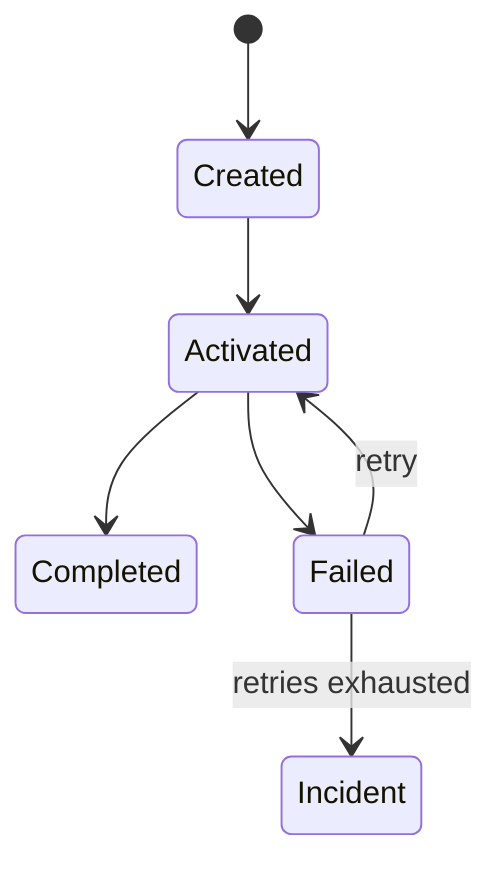

User task punya lifecycle manusiawi:

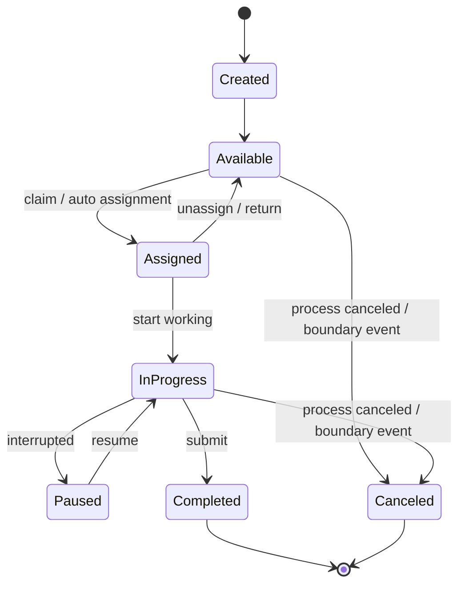

Poin penting: sebagian lifecycle ini bisa ada di Tasklist atau custom task app, bukan semuanya harus menjadi BPMN state. BPMN harus memodelkan business-significant state, bukan setiap klik UI.

---

## 2. User Task as a Wait State

Ketika process instance mencapai user task:

1. user task element diaktifkan;
2. task metadata dihitung dari model dan expression;
3. form binding, assignment, due date, priority, dan attributes lain menjadi bagian task state;
4. process token berhenti;
5. task tersedia untuk Tasklist/custom app;
6. manusia menyelesaikan pekerjaan;
7. completion mengirim variables/action;
8. token bergerak ke element berikutnya.

Secara mental, user task adalah:

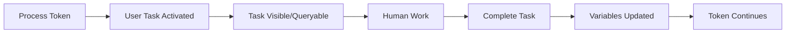

Artinya:

- proses tidak lanjut hanya karena user membuka task;
- assignment bukan completion;
- form submission bukan validasi domain otomatis;
- completion harus diperlakukan sebagai state transition;
- cancellation harus dipikirkan sebagai valid outcome;
- task visibility dan process authorization adalah concern berbeda.

---

## 3. Camunda 8 User Task Types

Camunda 8 historically memiliki beberapa cara user task direpresentasikan. Untuk seri ini, fokus utama adalah **Camunda user task** modern, bukan job-based user task legacy.

### 3.1 Camunda user task

Camunda user task adalah user task managed oleh Camunda runtime dan dapat digunakan bersama Tasklist/API modern.

Use this by default for:

- human approval;
- case review;
- manual evidence inspection;
- maker-checker;
- regulatory decision step;
- exception handling oleh operator;
- customer support workflow;
- compliance sign-off.

### 3.2 Job-based user task legacy thinking

Dalam beberapa context lama, user task bisa dipahami seperti job yang dikonsumsi oleh application. Itu membuat mental model terlalu dekat dengan service task. Untuk Camunda 8 modern, jangan mulai dari sini kecuali ada alasan compatibility.

Anti-pattern:

> Membuat semua human task sebagai service task custom lalu membangun task queue sendiri tanpa alasan platform.

Ini menghilangkan banyak capability platform: Tasklist, task APIs, lifecycle event, assignment, form integration, observability, dan governance.

---

## 4. Anatomy of a Production User Task

User task production minimal harus menjawab pertanyaan berikut:

| Dimension | Pertanyaan |
|---|---|
| Intent | Keputusan/aksi manusia apa yang dibutuhkan? |
| Actor | Siapa boleh mengerjakan? |
| Assignment | Apakah langsung assigned atau masuk queue? |
| Authorization | Apakah user benar-benar boleh melihat/mengubah task? |
| Input | Data apa yang harus dikumpulkan? |
| Validation | Invariant apa yang wajib dipenuhi sebelum complete? |
| Outcome | Apa kemungkinan hasil task? |
| SLA | Kapan task dianggap terlambat? |
| Escalation | Apa yang terjadi jika tidak selesai? |
| Cancellation | Apa yang terjadi jika process dibatalkan saat task aktif? |
| Audit | Apa yang perlu dibuktikan nanti? |

Contoh user task buruk:

```text
Review Case
```

Contoh user task lebih baik:

```text
Review Enforcement Evidence
- assignee/candidate group: enforcement-reviewers
- form: evidence-review-form
- due date: case.sla.reviewDueAt
- outcomes: acceptEvidence | requestMoreInfo | rejectEvidence
- validation: decisionReason required if reject/requestMoreInfo
- escalation: supervisor review after SLA breach
```

---

## 5. Assignment Model

Camunda user task mendukung assignment metadata seperti:

- `assignee`;
- `candidateUsers`;
- `candidateGroups`.

Nilai ini bisa static atau expression.

Contoh static:

```text
assignee = jane@example.com
candidateGroups = enforcement-reviewers, senior-officers
```

Contoh expression:

```text
assignee = = case.ownerUserId
candidateUsers = = case.availableReviewers
candidateGroups = = ["enforcement-reviewers", case.region + "-supervisors"]
```

Prinsip desain:

- gunakan `assignee` jika task memang milik orang tertentu;
- gunakan `candidateGroups` untuk queue/team work;
- gunakan `candidateUsers` dengan hati-hati karena sulit scale secara governance;
- jangan hardcode user pribadi dalam model production;
- gunakan group/role abstractions untuk longevity;
- normalisasi user id sesuai identity provider;
- treat assignment expression as production code.

---

## 6. Assignment Is Not Authorization

Ini salah satu perbedaan paling penting.

Assignment menjawab:

> Siapa yang secara workflow diharapkan mengerjakan task?

Authorization menjawab:

> Siapa yang secara security diizinkan melihat/mengubah resource?

Dalam Camunda 8 modern, terutama Tasklist V2, jangan berasumsi bahwa `candidateUsers` dan `candidateGroups` otomatis menjadi security filter detail yang sama seperti task queue logic lama. Dokumentasi Camunda menyatakan bahwa Tasklist V2 mengandalkan authorization pada level process definition, sedangkan candidate users/groups bukan dievaluasi untuk task visibility seperti Tasklist V1.

Implikasi production:

- candidate group tetap berguna sebagai workflow metadata;
- security tetap harus dikonfigurasi lewat authorization model;
- custom task app harus enforce authorization sendiri atau menggunakan API/platform authorization dengan benar;
- jangan menganggap hidden in UI sama dengan secure;
- jangan menaruh data sensitif hanya karena “task tidak muncul di list user tertentu”.

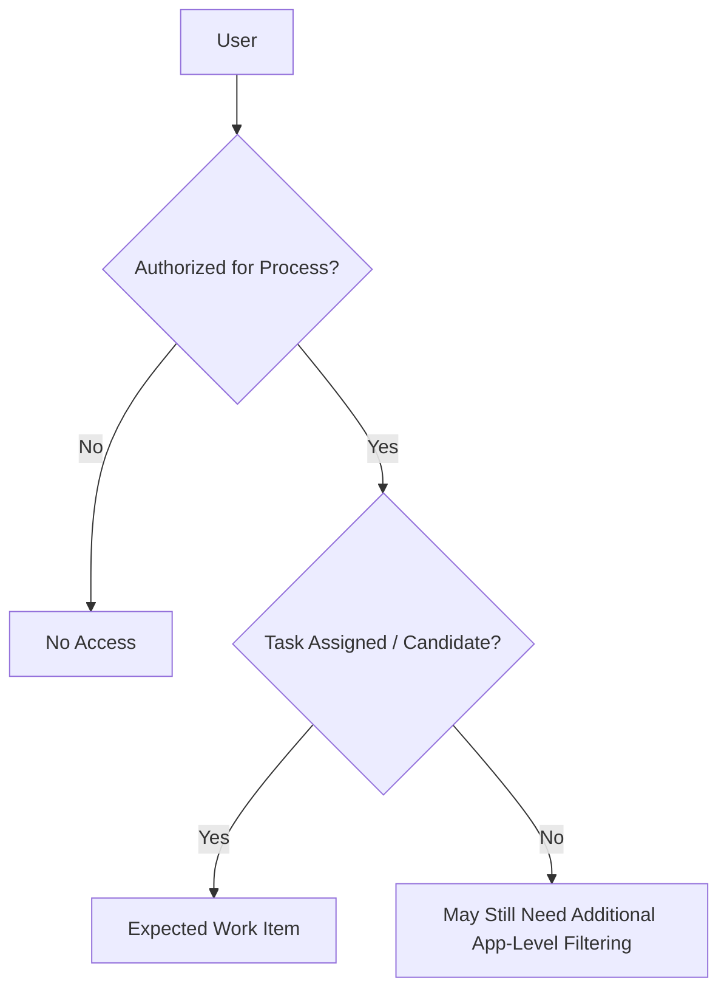

Rule:

> Assignment is workflow routing. Authorization is security. Jangan campur keduanya.

---

## 7. Tasklist Mental Model

Tasklist adalah application untuk user interaction dengan task. Tasklist biasanya menyediakan kemampuan seperti:

- melihat daftar task;
- claim/assign task;
- unassign task;
- membuka form;
- mengisi variables;
- complete task;
- melihat context proses tertentu;
- bekerja dengan task yang assigned atau available.

Tasklist bukan domain system of record. Tasklist bukan case management platform lengkap. Tasklist adalah human task execution surface.

Gunakan Tasklist ketika:

- workflow relatif generic;
- form cukup standar;
- authorization dan UX sesuai kebutuhan;
- user group internal;
- time-to-value penting;
- tidak perlu domain-specific case dashboard kompleks.

Bangun custom task app ketika:

- UX sangat domain-specific;
- butuh combined case/task timeline;
- butuh cross-entity dashboard;
- butuh policy-driven filtering kompleks;
- butuh embedded document/evidence viewer;
- butuh offline/draft workflow;
- butuh role-based workbench yang lebih kaya;
- Tasklist tidak cukup sebagai operational interface.

---

## 8. Tasklist vs Custom Task Application

Jangan pilih berdasarkan selera UI. Pilih berdasarkan ownership boundary.

| Concern | Tasklist | Custom Task App |
|---|---|---|
| Fast setup | Sangat baik | Lebih mahal |
| Generic task queue | Baik | Harus dibangun |
| Domain UX | Terbatas | Sangat kuat |
| Case dashboard | Terbatas | Sangat kuat |
| Complex authorization | Tergantung platform | Bisa custom, tetapi risk tinggi |
| Document/evidence workflow | Bisa, tapi generic | Bisa sangat domain-specific |
| Draft workflow | Terbatas | Bisa explicit |
| Audit narrative | Perlu integrasi | Bisa menyatu dengan domain audit |
| Maintenance | Platform-managed | Team-owned |

Mental model:

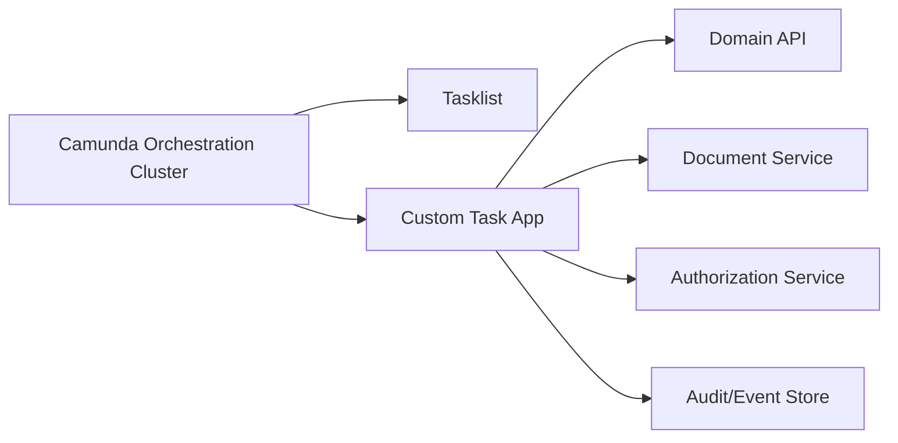

Custom task app bukan berarti workflow pindah keluar dari Camunda. Ia hanya mengganti human interface.

---

## 9. User Task Lifecycle and CQRS Thinking

Camunda documentation menjelaskan bahwa task status dapat diturunkan dari event stream/CQRS pattern. Ini penting: jangan berpikir user task selalu punya satu kolom status mutable yang menjadi source of truth.

Task lifecycle events dapat mencakup:

- create/activate;
- assign;
- update;
- complete;
- cancel;
- custom lifecycle actions di task app;
- derived state untuk UI.

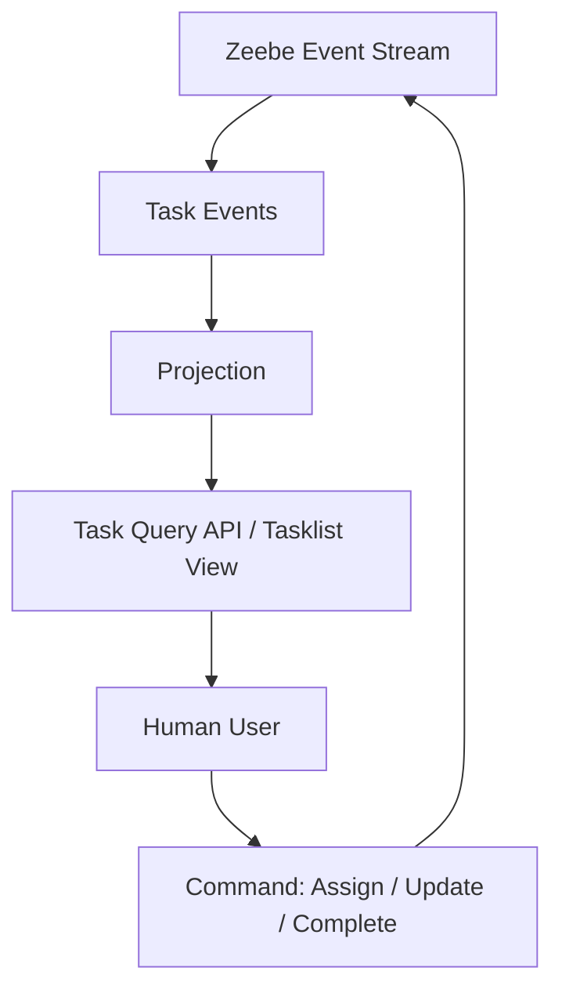

Implikasi:

- query view bisa eventually consistent;
- UI harus tahan terhadap stale state;
- action bisa gagal karena state sudah berubah;
- optimistic refresh lebih aman daripada asumsi lokal;
- task app harus menampilkan conflict dengan jelas.

Contoh conflict:

1. User A membuka task.
2. User B menyelesaikan task lebih dulu.
3. User A submit form.
4. API menolak karena task sudah completed/canceled.

Handling yang benar:

- jangan overwrite;
- refresh task state;
- tampilkan “task no longer available”;
- persist draft jika dibutuhkan;
- jangan membuat process side effect kedua.

---

## 10. Complete Task Semantics

Completing task adalah process transition.

Pada completion, biasanya terjadi:

- task lifecycle transition;
- variables dikirim/diupdate;
- optional action/outcome dicatat;
- user task selesai;
- BPMN token lanjut.

Completion bukan sekadar submit UI. Ia harus memenuhi invariant.

Contoh completion request concept:

```json
{
  "variables": {
    "evidenceReview": {
      "decision": "REJECTED",
      "reason": "Document does not match registered entity",
      "reviewedBy": "officer-123",
      "reviewedAt": "2026-06-28T08:30:00Z"
    }
  },
  "action": "rejectEvidence"
}
```

Checklist sebelum complete:

- user authorized?;
- user allowed to perform this outcome?;
- required variables present?;
- variables schema valid?;
- decision reason adequate?;
- task still active?;
- no stale version conflict?;
- all linked documents uploaded?;
- no prohibited field modified?;
- audit context captured?

---

## 11. Outcome Modeling

Banyak user task secara bisnis punya lebih dari satu outcome.

Contoh:

- approve;
- reject;
- request correction;
- escalate;
- defer;
- cancel;
- return to maker.

Jangan modelkan outcome hanya sebagai free-text comment. Gunakan explicit variable/action.

Bad:

```json
{
  "comment": "looks okay"
}
```

Better:

```json
{
  "reviewOutcome": "APPROVED",
  "reviewReason": "Evidence satisfies minimum threshold",
  "reviewerUserId": "officer-123"
}
```

Gateway setelah task:

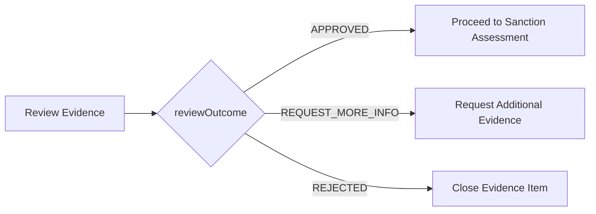

Outcome taxonomy harus stabil. Hindari string liar yang berubah-ubah.

---

## 12. User Task Variables

User task variables adalah salah satu sumber kekacauan terbesar.

Pisahkan:

| Data Type | Simpan Di Mana? |
|---|---|
| Final process decision | Process variable |
| Temporary UI draft | Task app storage / draft API |
| Large document binary | Document store |
| Document reference | Process variable |
| Domain entity state | Domain service/database |
| Audit narrative | Audit/event store + selected process variables |
| UI-only flags | Frontend state |

Anti-pattern:

```json
{
  "formDraftCurrentTab": "tab3",
  "isModalOpen": true,
  "temporaryUploadedBase64": "...",
  "reviewDecisionMaybe": "not sure yet"
}
```

Process variables harus merepresentasikan state yang dibutuhkan proses, bukan state UI.

Good variable structure:

```json
{
  "caseId": "CASE-2026-00091",
  "evidenceReview": {
    "decision": "REQUEST_MORE_INFO",
    "reasonCode": "MISSING_SIGNATURE",
    "reasonText": "Signed authorization letter is missing",
    "reviewedBy": "officer-123",
    "reviewedAt": "2026-06-28T08:30:00Z"
  }
}
```

---

## 13. User Task Listeners

User task listeners adalah mechanism untuk menjalankan custom logic saat lifecycle event user task terjadi. Mereka mirip job worker: engine membuat job listener, worker memprosesnya.

Use cases:

- dynamic assignment;
- validation before completion;
- notification on assignment;
- priority correction;
- due date calculation;
- denying invalid transition;
- enrich task metadata;
- audit hook;
- policy-based reassignment.

Supported conceptual lifecycle events include:

- creating;
- assigning;
- updating;
- completing;
- canceling.

Blocking behavior penting:

> User task listener dapat menahan lifecycle transition sampai listener selesai. Jika listener lambat atau error, human workflow terasa lambat atau gagal.

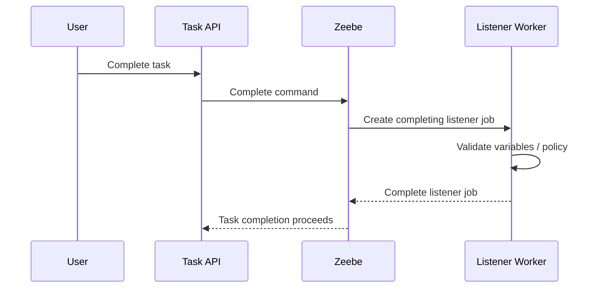

Design rules:

- listener harus cepat;
- listener harus idempotent;
- listener tidak boleh melakukan side effect besar tanpa idempotency;
- listener failure harus punya retry/incident runbook;
- heavy processing sebaiknya setelah completion sebagai service task;
- validation listener boleh menolak transition jika invariant tidak terpenuhi;
- listener bukan tempat business process utama disembunyikan.

---

## 14. Validation Strategy

Ada tiga lapis validation:

| Layer | Purpose | Example |
|---|---|---|
| Form validation | Fast UX feedback | required field, min/max length |
| Task listener/API validation | Workflow invariant | reviewer cannot approve own submission |
| Domain service validation | System-of-record invariant | case status allows approval |

Jangan hanya mengandalkan form validation. User bisa bypass UI melalui API atau custom integration.

Contoh invariant maker-checker:

```java
public void validateReviewCompletion(ReviewCommand command, CaseSnapshot caseSnapshot) {
    if (command.reviewerUserId().equals(caseSnapshot.createdBy())) {
        throw new BusinessValidationException("Reviewer cannot approve their own case");
    }

    if (command.decision() == ReviewDecision.REJECTED && isBlank(command.reason())) {
        throw new BusinessValidationException("Reject decision requires reason");
    }
}
```

Mapping ke user task listener:

```java
@JobWorker(type = "validate-evidence-review-completion")
public void validateCompletion(final ActivatedJob job, final JobClient client) {
    var vars = job.getVariablesAsMap();

    // Parse, validate, and either complete listener job or deny transition
    // Exact API shape depends on Camunda Java Client version.
}
```

Catatan: API detail bisa berubah per versi client. Pattern-nya yang harus stabil: validate lifecycle transition di boundary server-side.

---

## 15. Due Dates, Follow-Up Dates, and Priority

Human work butuh temporal metadata.

Common concepts:

- due date: kapan task harus selesai;
- follow-up date: kapan task perlu diperhatikan kembali;
- priority: urutan kerja relatif;
- escalation date: kapan proses harus eskalasi;
- SLA state: on-time, warning, breached.

Jangan campur semuanya menjadi satu field `deadline`.

Contoh model:

```json
{
  "taskPlanning": {
    "dueAt": "2026-07-02T17:00:00+07:00",
    "followUpAt": "2026-07-01T09:00:00+07:00",
    "priority": 80,
    "slaPolicy": "EVIDENCE_REVIEW_P3"
  }
}
```

Design pattern:

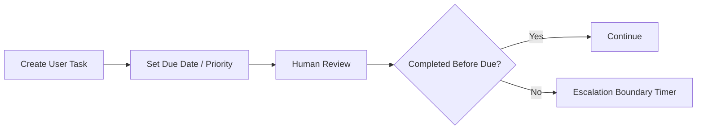

Jangan berharap due date sendiri mengubah proses. Jika process behavior harus berubah saat overdue, modelkan timer/escalation secara eksplisit.

---

## 16. Human Workflow Patterns

### 16.1 Role queue pattern

Task masuk ke candidate group. User mengambil task saat siap.

Use when:

- team-based operation;
- work can be done by any qualified officer;
- throughput important;
- no single owner upfront.

Risk:

- no one claims task;
- cherry picking;
- overloaded queue;
- unclear SLA ownership.

Mitigation:

- due date;
- priority;
- queue dashboard;
- escalation timer;
- supervisor reassignment.

### 16.2 Direct assignment pattern

Task langsung assigned ke user tertentu.

Use when:

- case owner jelas;
- accountability penting;
- relationship/context matters;
- handoff cost tinggi.

Risk:

- user absent;
- bottleneck;
- stale assignment.

Mitigation:

- delegation rule;
- out-of-office handling;
- reassignment listener;
- supervisor override.

### 16.3 Maker-checker pattern

Orang yang membuat/mengubah tidak boleh menjadi approver final.

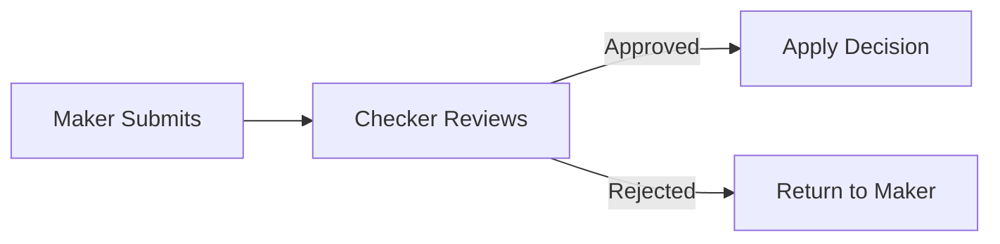

Invariant:

```text
checkerUserId != makerUserId
```

Enforce in server-side validation, not only UI.

### 16.4 Four-eyes approval pattern

Dua approval independen dibutuhkan.

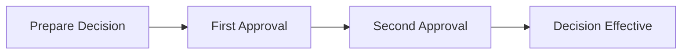

Avoid:

- same user approving twice;
- second approver merely rubber-stamping;
- approval reason omitted.

### 16.5 Peer review with correction loop

Review bisa mengembalikan task ke submitter.

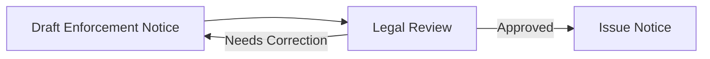

Need guardrails:

- max loop count?;
- reason required;
- versioned draft;
- audit of changes.

---

## 17. Task Cancellation Semantics

User task bisa dibatalkan karena:

- process instance terminated;
- interrupting boundary event;
- event subprocess;
- parent scope canceled;
- migration or operational correction.

Cancellation bukan error. Itu valid lifecycle transition.

User experience harus jelas:

- task disappeared karena case closed?;
- task canceled karena escalated?;
- draft masih available?;
- user perlu diberi notice?;
- pending documents perlu cleanup?;
- audit event tercatat?

Pattern:

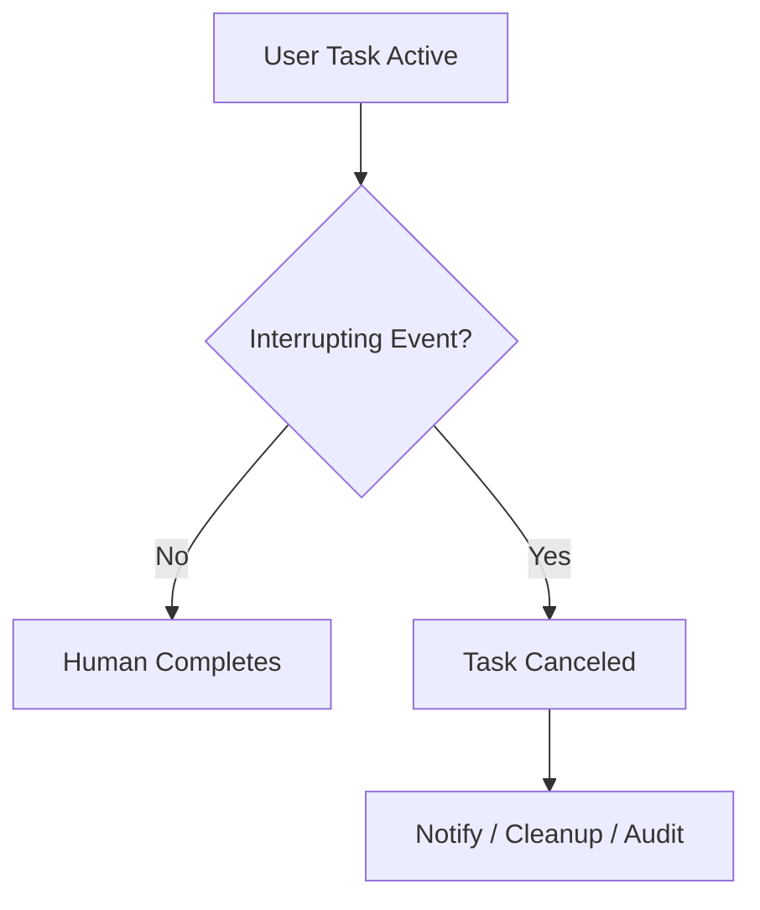

Jangan menganggap task yang tidak terlihat berarti selesai.

---

## 18. Task APIs and Consistency

Task APIs memungkinkan custom app untuk:

- search task;
- get task;
- assign/unassign;
- update;
- complete;
- get form;
- search variables;
- interact dengan user task lifecycle.

Karena Camunda 8 architecture menggunakan event stream dan projections, banyak query API harus diperlakukan sebagai eventually consistent. UI harus robust terhadap:

- stale list;
- task already assigned;
- task already completed;
- form not yet visible after deployment;
- variables not projected yet;
- authorization change propagation.

Task app rules:

- always handle 404/409/400 meaningful response;
- refresh task before destructive action;
- show task state conflict;
- make completion idempotency-aware where possible;
- keep drafts outside process variables;
- avoid long lock-free editing without conflict detection.

---

## 19. Custom Task Application Architecture

Production custom task app should not talk to everything directly without structure.

Recommended layers:

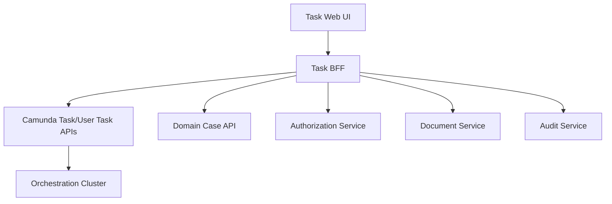

Why BFF?

- hide Camunda API details from browser;
- enforce domain authorization;
- assemble task + case + documents;
- normalize errors;
- handle draft storage;
- protect credentials;
- centralize audit.

Avoid browser directly using privileged Camunda credentials.

---

## 20. Regulatory Human Workflow Design

Untuk regulatory enforcement lifecycle, user task harus defensible.

Defensible task design includes:

- explicit task purpose;
- clear actor role;
- visible evidence;
- required decision reason;
- policy reference;
- timestamp;
- actor identity;
- versioned input snapshot;
- outcome taxonomy;
- audit trail;
- escalation path;
- separation of duties;
- override reason.

Example: “Approve Sanction Recommendation”

```json
{
  "sanctionApproval": {
    "outcome": "APPROVED",
    "policyBasis": "ENF-POL-2026-04",
    "reason": "Severity and repeat violation criteria satisfied",
    "approvedBy": "director-19",
    "approvedAt": "2026-06-28T09:15:00+07:00",
    "evidenceSnapshotId": "snap-8f31"
  }
}
```

This is better than:

```json
{
  "approved": true
}
```

The second version is not defensible.

---

## 21. Anti-Patterns

### 21.1 User task as generic TODO

Symptom:

```text
Do Manual Step
```

Problem:

- no actor clarity;
- no decision clarity;
- no SLA;
- no audit semantics;
- no outcome contract.

Fix: name task by business decision/action.

### 21.2 Hardcoded people in BPMN

Bad:

```text
assignee = john.smith@example.com
```

Use role/group/expression unless truly personal ownership.

### 21.3 Assignment as security

Candidate group is not full authorization model. Treat assignment and authorization separately.

### 21.4 Process variables as UI draft

Never store every keystroke or tab state in process variables.

### 21.5 Completion without server validation

Form required field is not enough. Use task listener/API/domain validation.

### 21.6 Hidden business rule in Tasklist/custom UI

If route depends on policy, express it in BPMN/DMN/worker domain boundary, not purely in UI.

### 21.7 Long-running task with no escalation

Every task that matters operationally needs deadline thinking.

### 21.8 Over-modeling UI microstates in BPMN

Do not create BPMN tasks for every screen step unless each is business-significant.

### 21.9 No cancellation handling

Users need to know why task disappeared or why draft can no longer be submitted.

### 21.10 Listener doing heavy side effects

Blocking listener should not call slow unreliable external systems unless carefully designed.

---

## 22. Production Checklist

Before a user task goes to production, answer:

- What exact human decision/action does this task represent?
- Is the task name business-specific?
- Who can work on it?
- Is assignment separate from authorization?
- Are candidate groups stable and managed?
- Is form schema versioned and reviewed?
- Are required variables explicit?
- Are outcomes enumerated?
- Are rejection/exception reasons required?
- Is server-side validation present?
- Is maker-checker enforced if needed?
- Is due date/follow-up date defined?
- Is escalation modeled?
- Is cancellation behavior understood?
- Is audit data sufficient?
- Are documents referenced, not embedded?
- Is custom task app robust to stale state?
- Is lifecycle conflict handled?
- Are user task listeners idempotent and fast?
- Is there an operational runbook for listener incidents?

---

## 23. Practice: Design a Regulatory Review Task

Design a user task for this scenario:

> A regulatory officer must review submitted evidence before a case can proceed to sanction assessment. The officer cannot be the same person who uploaded the evidence. If evidence is incomplete, the officer can request more information. If evidence is invalid, the evidence item is rejected. The task must be completed within three business days.

Expected design:

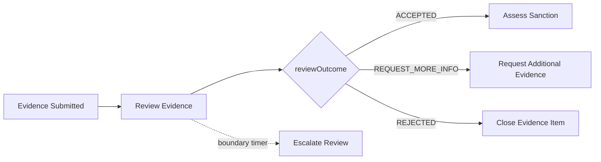

Variables:

```json
{
  "evidenceReview": {
    "outcome": "REQUEST_MORE_INFO",
    "reasonCode": "MISSING_DOCUMENT",
    "reasonText": "Company registry extract is missing",
    "reviewedBy": "officer-123",
    "reviewedAt": "2026-06-28T10:00:00+07:00"
  }
}
```

Validation invariants:

```text
reviewedBy != evidence.uploadedBy
reasonText required when outcome != ACCEPTED
documentReferences must contain at least one uploaded document
case.status must be EVIDENCE_REVIEW
```

---

## 24. Key Takeaways

User task mastery is not about dragging a BPMN element into a diagram. It is about designing human work as a reliable, auditable, secure process transition.

Remember:

- user task is a wait state;
- Tasklist is an interface, not the process itself;
- assignment is not authorization;
- completion is a state transition;
- form validation is not enough;
- user task listeners are powerful but blocking;
- drafts should not pollute process variables;
- human workflow needs escalation and cancellation design;
- regulatory workflows need defensible decisions.

A top-tier engineer designs user tasks as part of a socio-technical system: humans, runtime, API, UI, security, audit, documents, and process state all have separate responsibilities.

---

## References

- Camunda Docs — User tasks: https://docs.camunda.io/docs/components/modeler/bpmn/user-tasks/
- Camunda Docs — Tasklist overview: https://docs.camunda.io/docs/components/tasklist/userguide/using-tasklist/
- Camunda Docs — User task lifecycle: https://docs.camunda.io/docs/apis-tools/frontend-development/task-applications/user-task-lifecycle/
- Camunda Docs — User task listeners: https://docs.camunda.io/docs/components/concepts/user-task-listeners/
- Camunda Docs — Task API: https://docs.camunda.io/docs/apis-tools/tasklist-api-rest/controllers/tasklist-api-rest-task-controller/
