# Part 014 — Forms, Documents, and User Input

Forms dan documents adalah tempat workflow bertemu realitas operasional: manusia mengisi data, mengunggah bukti, memilih keputusan, dan menjelaskan alasan. Di sistem regulatory, kualitas form dan document handling menentukan apakah proses bisa diaudit, diuji, dioperasikan, dan dipertanggungjawabkan.

Mental model inti:

> Form bukan domain model. Form adalah interaction contract untuk mengumpulkan input manusia pada titik proses tertentu. Document bukan process variable besar. Document adalah external binary resource yang direferensikan oleh workflow.

Kesalahan paling mahal biasanya bukan salah BPMN gateway, tetapi salah batas data:

- binary file disimpan di variable proses;
- form field langsung dianggap domain truth;
- validation hanya di frontend;
- draft user mencemari process state;
- document reference tidak immutable;
- schema berubah tanpa compatibility;
- evidence tidak punya audit snapshot;
- form terlalu pintar dan menyembunyikan business rule.

---

## 1. Where Forms Fit in Camunda 8

Camunda Forms dapat dibuat di Modeler dan dihubungkan ke:

- user task;
- start event.

Ketika diagram dengan linked form dideploy, Tasklist dapat menggunakan form schema untuk render form pada task yang terkait.

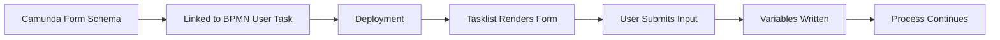

Form berada di interaction layer. Ia bukan pengganti:

- BPMN routing;
- DMN decision;
- domain validation;
- document storage;
- audit service;
- authorization policy.

---

## 2. Form as Contract, Not UI Decoration

A production form must define:

| Dimension | Meaning |
|---|---|
| Purpose | Task/start event apa yang dilayani? |
| Fields | Input apa yang dikumpulkan? |
| Keys | Variable apa yang akan dibaca/ditulis? |
| Validation | Apa batas input di UI? |
| Visibility | Field mana muncul berdasarkan condition? |
| Default | Apa nilai awal? |
| Compatibility | Apakah perubahan schema aman untuk running instance? |
| Security | Apakah field sensitif? |
| Audit | Field mana perlu dibuktikan nanti? |

Bad form design:

```text
Form name: Review Form
Fields:
- comment
- approved
```

Better:

```text
Form name: Evidence Review Form v1
Fields:
- evidenceReview.outcome
- evidenceReview.reasonCode
- evidenceReview.reasonText
- evidenceReview.reviewedBy
- evidenceReview.reviewedAt
- evidenceReview.documentReferences
```

---

## 3. Data Binding Mental Model

Form elements bind to form variables using keys. When rendered in Tasklist, values can be populated from variables and submitted back as variables.

Simple binding:

```text
field key = applicantName
```

Nested binding:

```text
field key = evidenceReview.reasonText
```

Design rules:

- use stable keys;
- avoid UI-specific names;
- group related fields under an object;
- avoid large flat variable namespace;
- be explicit with outcome objects;
- do not bind confidential fields unless needed;
- avoid binding directly into domain aggregate shape if form lifecycle differs from domain lifecycle.

Example:

```json
{
  "evidenceReview": {
    "outcome": "REQUEST_MORE_INFO",
    "reasonCode": "MISSING_SIGNATURE",
    "reasonText": "Authorization letter is not signed",
    "documentReferences": [
      {
        "documentId": "doc-93d4",
        "contentHash": "sha256:...",
        "fileName": "authorization-letter.pdf"
      }
    ]
  }
}
```

---

## 4. Form Variables vs Process Variables vs Domain State

Do not collapse all state into process variables.

| State | Example | Best Location |
|---|---|---|
| Process routing state | `reviewOutcome` | Process variable |
| Human submitted decision | `evidenceReview` | Process variable + audit |
| UI draft | partially typed comment | Task app draft store |
| Binary file | PDF evidence | Document store |
| Domain aggregate | Case entity, enforcement order | Domain database |
| Derived display data | formatted company name | UI/BFF projection |
| Immutable audit event | who approved what and when | Audit/event store |

Bad:

```json
{
  "case": {
    "fullDomainAggregateWithEverything": { }
  },
  "uploadedPdfBase64": "...",
  "draftComment": "still typing",
  "currentAccordion": "panel-2"
}
```

Good:

```json
{
  "caseId": "CASE-2026-00188",
  "reviewOutcome": "APPROVED",
  "evidenceReview": {
    "reason": "Minimum legal threshold satisfied",
    "documentRefs": ["doc-93d4", "doc-a80b"]
  }
}
```

---

## 5. Validation Boundaries

Camunda Forms support UI-level validation such as required fields and numeric/text constraints. This is useful, but insufficient for production invariants.

Validation layers:

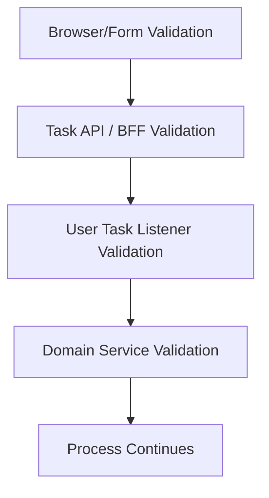

### 5.1 Form validation

Good for:

- required input;
- min/max length;
- field format;
- simple numeric constraints;
- conditional visibility;
- immediate user feedback.

Not enough for:

- separation of duties;
- policy compliance;
- authorization;
- stale task state;
- duplicate submit;
- document integrity;
- domain aggregate transition;
- regulatory rule validation.

### 5.2 Server-side validation

Use BFF/API/domain service/user task listener to enforce invariants.

Example invariants:

```text
reviewer cannot approve own evidence upload
rejection requires reasonCode and reasonText
approval requires at least one verified document reference
sanction amount must be within policy limit
case must still be in EVIDENCE_REVIEW state
```

### 5.3 Domain validation

Final source-of-truth validation belongs to domain services if the form changes domain state.

Rule:

> Form validation improves UX. It does not prove business correctness.

---

## 6. Linked Forms vs Embedded/External Forms

In Camunda 8 modern usage, linked Camunda Forms are first-class with Modeler/Tasklist. API support around user task forms may distinguish linked forms from embedded/custom forms.

Use linked Camunda Forms when:

- Tasklist can render the form;
- form is mostly data capture;
- you want quick iteration;
- schema can be governed in Modeler;
- field library is sufficient.

Use custom/external form when:

- UI is highly domain-specific;
- complex document review needed;
- multi-panel evidence comparison;
- draft autosave;
- rich validation UX;
- interactive maps/charts/tables;
- complex authorization rules;
- custom accessibility/internationalization needs.

Pattern:

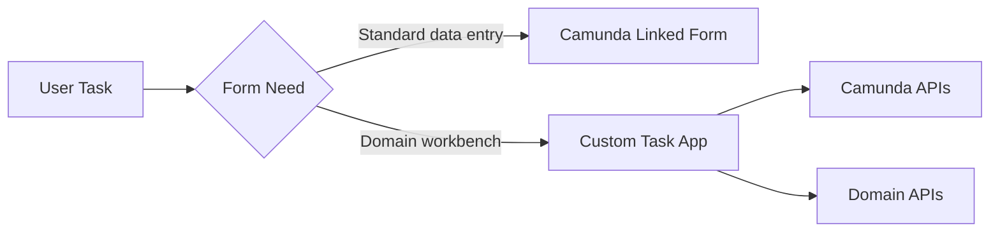

Do not force a complex regulatory case review into a generic form if the user needs a real workbench.

---

## 7. Form Schema Evolution

Forms evolve. Running process instances may still reference old tasks or old variable shapes.

Safe changes:

- add optional field;
- improve label/description;
- add UI helper text;
- add non-breaking validation for new optional path;
- change layout without changing keys.

Risky changes:

- rename key;
- remove required field;
- change field type;
- change enum values;
- change nested object shape;
- make optional field required for already-running instances;
- alter meaning of existing outcome.

Dangerous example:

```text
v1 key: reviewApproved = true/false
v2 key: evidenceReview.outcome = APPROVED/REJECTED/REQUEST_MORE_INFO
```

This is a semantic migration, not just a form edit.

Better compatibility strategy:

```json
{
  "evidenceReview": {
    "schemaVersion": 2,
    "outcome": "APPROVED"
  }
}
```

For production:

- version form intentionally;
- track which process model uses which form;
- keep old form available while old instances exist;
- migrate variables explicitly if needed;
- write regression tests for form submission payloads.

---

## 8. Document Handling Mental Model

Documents are binary data: PDFs, images, scans, letters, evidence files, reports.

In Camunda 8, document handling can support use cases such as:

- uploading document to a BPMN process;
- displaying/downloading document;
- sending document with connectors;
- intelligent document processing;
- storing document references in process variables.

Mental model:

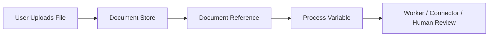

The process should carry a **reference**, not the binary payload.

Bad:

```json
{
  "evidencePdfBase64": "JVBERi0xLjQKJ..."
}
```

Good:

```json
{
  "evidenceDocuments": [
    {
      "documentId": "doc-93d4",
      "contentHash": "sha256:...",
      "fileName": "company-registry.pdf",
      "mimeType": "application/pdf",
      "uploadedBy": "officer-123",
      "uploadedAt": "2026-06-28T10:30:00+07:00"
    }
  ]
}
```

---

## 9. Filepicker and Document References

Camunda Forms can use Filepicker to let users upload files. A Filepicker should be treated as producing document metadata/reference data, not raw business truth.

Important design points:

- support single vs multiple files intentionally;
- restrict accepted file formats;
- enforce size limits;
- validate required documents;
- capture upload actor/time;
- scan files if required;
- verify document content separately from upload event;
- do not assume “uploaded” means “valid evidence”.

Document lifecycle example:

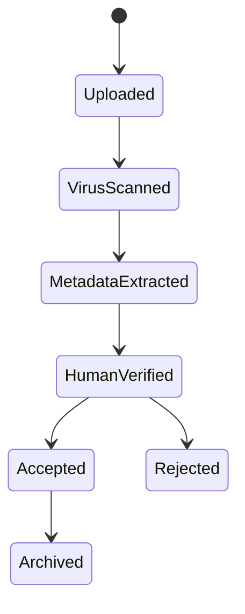

BPMN can model key lifecycle points, but document processing details may belong in document/evidence services.

---

## 10. Evidence Intake Pattern

For regulatory systems, document upload is rarely enough. You need evidence intake.

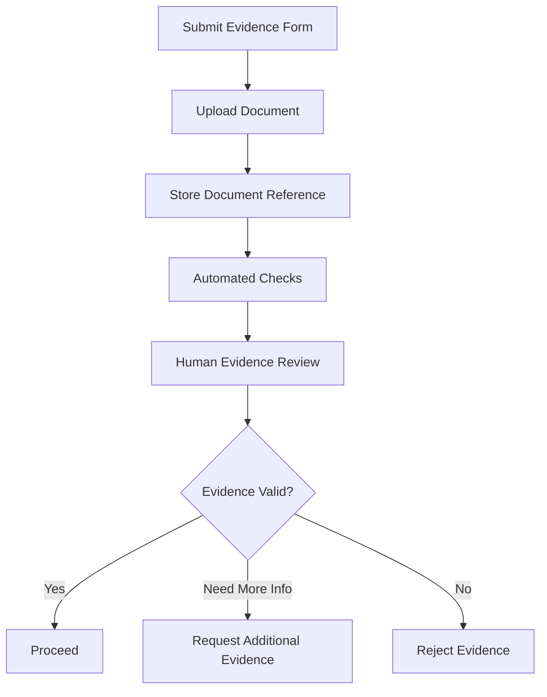

Evidence intake should capture:

- document reference;
- evidence type;
- source;
- uploader;
- upload timestamp;
- content hash;
- classification;
- verification status;
- reviewer;
- review reason;
- link to case/entity;
- retention policy.

Example variable:

```json
{
  "evidenceIntake": {
    "evidenceType": "COMPANY_REGISTRY_EXTRACT",
    "documentRef": {
      "documentId": "doc-93d4",
      "contentHash": "sha256:abc...",
      "fileName": "registry-extract.pdf"
    },
    "submittedBy": "applicant-77",
    "submittedAt": "2026-06-28T10:30:00+07:00"
  }
}
```

---

## 11. Document Reference Integrity

Document reference must be stable enough for audit.

Minimum metadata:

| Field | Purpose |
|---|---|
| `documentId` | lookup reference |
| `contentHash` | integrity check |
| `fileName` | human context |
| `mimeType` | rendering/handling |
| `sizeBytes` | operational/security limit |
| `uploadedBy` | accountability |
| `uploadedAt` | audit |
| `source` | user/API/connector/import |
| `classification` | sensitivity/retention |

Do not rely only on file name.

Bad:

```json
{
  "file": "evidence.pdf"
}
```

Better:

```json
{
  "documentRef": {
    "documentId": "doc-93d4",
    "contentHash": "sha256:7b3d...",
    "fileName": "evidence.pdf",
    "mimeType": "application/pdf",
    "sizeBytes": 184299,
    "uploadedBy": "officer-123",
    "uploadedAt": "2026-06-28T10:30:00+07:00"
  }
}
```

---

## 12. Large Payload Anti-Pattern

Do not store large payloads in process variables.

Why:

- slows exports/projections;
- increases storage cost;
- hurts Operate visibility;
- makes incidents harder to inspect;
- leaks sensitive content;
- creates serialization problems;
- complicates retention/deletion;
- makes migration harder.

Rule:

> Process variables should carry orchestration data and references, not binary objects or full domain aggregates.

Use:

- document store for binary;
- domain database for aggregate;
- process variable for IDs and routing facts;
- audit store for immutable evidence trail.

---

## 13. Security and Privacy

Forms and documents often contain sensitive data.

Security considerations:

- least privilege access;
- field-level sensitivity classification;
- document access authorization;
- encryption at rest/in transit;
- retention policy;
- malware scanning;
- audit logging;
- secure download links;
- masking/redaction;
- avoidance of sensitive data in logs;
- environment separation;
- test data sanitization.

Dangerous patterns:

- document ID guessable by user;
- raw document links stored in UI logs;
- PII copied into process variables unnecessarily;
- form data sent to analytics tooling;
- exception logs containing variable payloads;
- broad Tasklist access to sensitive process definitions.

For regulatory systems, design data minimization explicitly:

```text
Does the process need the full personal address, or only jurisdictionCode?
Does the worker need the PDF, or only verificationStatus?
Does the gateway need sanctionAmount, or only sanctionTier?
```

---

## 14. Auditability

Human input should be explainable later.

Audit questions:

- Who submitted this input?
- When?
- From which task/process/case?
- What data was visible at the time?
- What documents were attached?
- What version of the form was used?
- What policy/rule was applied?
- Was there override?
- Was separation of duties respected?
- Was document content unchanged?

Process variables alone may not be sufficient. Use audit events.

Example audit event:

```json
{
  "eventType": "EVIDENCE_REVIEW_COMPLETED",
  "caseId": "CASE-2026-00188",
  "processInstanceKey": "2251799813685251",
  "taskKey": "2251799813686001",
  "actor": "officer-123",
  "occurredAt": "2026-06-28T10:45:00+07:00",
  "outcome": "REQUEST_MORE_INFO",
  "reasonCode": "MISSING_SIGNATURE",
  "documentRefs": [
    {
      "documentId": "doc-93d4",
      "contentHash": "sha256:abc..."
    }
  ],
  "formVersion": "evidence-review-form:v2"
}
```

---

## 15. Start Forms

Forms can be attached to start events to initiate process instances.

Use cases:

- complaint intake;
- application submission;
- evidence submission;
- internal request initiation;
- manual case creation.

Start form design concerns:

- who can start process?;
- what data is required to create a valid instance?;
- what document uploads are allowed?;
- how to prevent duplicate submissions?;
- is submission idempotent?;
- does a domain entity need to be created first?;
- is there pre-validation before process start?

Pattern:


In many enterprise systems, start form should call a controlled backend rather than directly starting process with raw user input. This lets you validate, deduplicate, create domain state, and then start Camunda with clean variables.

---

## 16. Backend-for-Frontend for Forms

For simple Tasklist forms, direct platform-rendered form may be enough. For complex systems, use BFF.

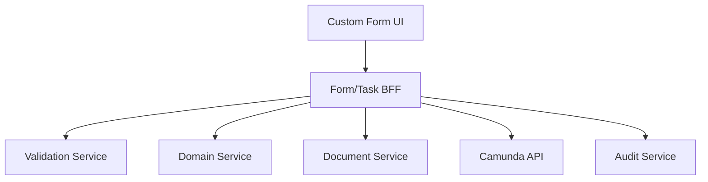

BFF responsibilities:

- fetch task context;
- fetch domain data;
- fetch document metadata;
- enforce authorization;
- save drafts;
- normalize payload;
- validate before complete;
- submit variables to Camunda;
- write audit event;
- handle stale task conflicts.

Do not let frontend assemble critical regulatory payload from scattered APIs without server validation.

---

## 17. Draft Handling

Humans abandon forms. Browsers crash. Reviews take hours. Drafts matter.

But process variables should generally contain committed workflow state, not every draft edit.

Draft pattern:

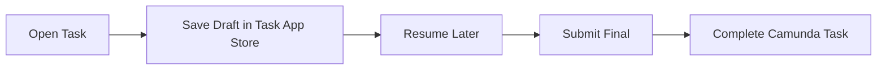

Draft store key:

```text
taskKey + userId + formVersion
```

Draft rules:

- draft is not process truth;
- draft must be access-controlled;
- draft may expire;
- draft should handle task cancellation;
- final submit must revalidate against current state;
- draft must not allow unauthorized completion.

---

## 18. Conditional Fields and Dynamic Forms

Conditional fields are useful but can hide complexity.

Example:

- show `rejectionReason` only when outcome is `REJECTED`;
- show `additionalInfoRequest` only when outcome is `REQUEST_MORE_INFO`;
- show sanction amount only for monetary sanction.

Good:

```text
If outcome == REJECTED, require rejection reason.
```

Danger:

```text
If riskScore > 80 and country == X and documentType == Y, silently show alternative legal pathway.
```

If conditional logic becomes policy logic, move it to DMN or backend validation.

Rule:

> Forms may adapt presentation. They should not secretly own business policy.

---

## 19. Form + DMN Pattern

A strong pattern is:

1. Form collects facts.
2. BPMN passes facts to DMN.
3. DMN produces decision/recommendation.
4. Human task confirms/overrides with reason.
5. BPMN routes based on explicit result.

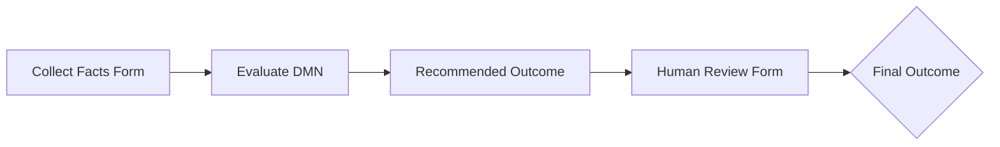

This avoids putting decision tables in UI.

Example:

```json
{
  "sanctionRecommendation": {
    "recommendedTier": "TIER_2",
    "dmnDecisionId": "sanction-tier-decision",
    "ruleId": "R-17"
  },
  "humanOverride": {
    "overridden": true,
    "finalTier": "TIER_1",
    "reason": "Mitigating evidence accepted"
  }
}
```

---

## 20. Document Review Pattern

Document review usually needs more than upload.

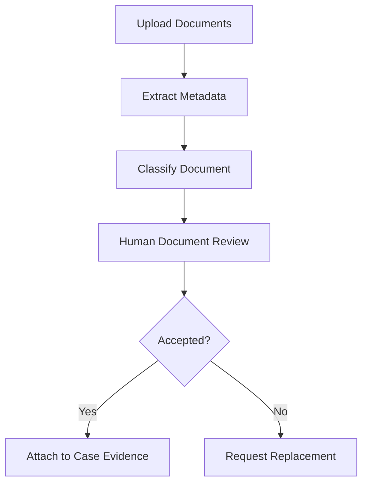

Review fields:

```json
{
  "documentReview": {
    "documentId": "doc-93d4",
    "status": "REJECTED",
    "reasonCode": "ILLEGIBLE_SCAN",
    "reasonText": "The uploaded scan is not readable",
    "reviewedBy": "officer-123",
    "reviewedAt": "2026-06-28T11:00:00+07:00"
  }
}
```

Do not conflate `uploaded` with `accepted`.

---

## 21. Testing Forms and Documents

Test levels:

| Test | Purpose |
|---|---|
| Form schema validation | Keys, required fields, element config |
| Payload contract test | Submitted variables match expected shape |
| Task completion test | BPMN moves correctly after submit |
| Validation test | Invalid payload rejected server-side |
| Document upload test | Document reference created and stored |
| Security test | Unauthorized user cannot access document/task |
| Regression test | Old form payload still works after changes |

Example payload contract test:

```java
@Test
void evidenceReviewPayloadShouldMapToProcessVariables() {
    var payload = new EvidenceReviewSubmission(
        ReviewOutcome.REQUEST_MORE_INFO,
        "MISSING_SIGNATURE",
        "Authorization letter is not signed"
    );

    var variables = mapper.toCamundaVariables(payload);

    assertThat(variables).containsEntry("evidenceReview.outcome", "REQUEST_MORE_INFO");
}
```

In practice, variable serialization may use nested maps/JSON objects rather than dotted keys. The principle is to test the contract, not the UI screenshot.

---

## 22. Operational Failure Modes

Forms and documents fail in ways BPMN diagrams often ignore.

| Failure | Mitigation |
|---|---|
| User submits stale task | Refresh and show conflict |
| Document upload succeeds but task complete fails | Keep uploaded doc reference; allow retry/cleanup |
| Task complete succeeds but audit write fails | Design transaction/outbox boundary carefully |
| File too large | Enforce limit before upload |
| Unsupported file type | Restrict accepted MIME/extension server-side |
| Malware scan pending | Model verification state |
| Form schema changed | Version form and payload mapper |
| Missing document reference | Completion validation |
| Sensitive variable exposed | Data minimization and masking |

Key principle:

> Human input workflows must be recoverable. Assume users retry, refresh, duplicate, abandon, and submit stale data.

---

## 23. Anti-Patterns

### 23.1 Form as domain model

A form changes often. A domain model should be stable and behavior-rich. Do not equate them.

### 23.2 Binary in process variable

Never store base64 files as variables except tiny controlled metadata-like payloads.

### 23.3 UI-only validation

Frontend validation can be bypassed. Always enforce business invariant server-side.

### 23.4 Hidden policy in conditional fields

If the form decides eligibility, move that logic to DMN/backend.

### 23.5 Unversioned form keys

Changing `approved` to `decision.outcome` without migration breaks running instances.

### 23.6 File name as identity

`evidence.pdf` is not identity. Use document ID/content hash.

### 23.7 Upload equals accepted

Uploaded documents still need verification/classification.

### 23.8 Draft as process truth

Do not complete or route process based on unfinished draft.

### 23.9 Overcollecting sensitive data

Every extra field becomes liability: storage, access, retention, breach impact.

### 23.10 No document retention model

Regulatory documents need retention/deletion policy from day one.

---

## 24. Production Checklist

Before shipping a form/document workflow:

- Is form purpose tied to a specific process step?
- Are field keys stable and meaningful?
- Are variables grouped by business concept?
- Is UI validation separated from domain validation?
- Is server-side validation implemented?
- Are form schema changes versioned?
- Are running instances compatible?
- Are documents stored as references?
- Are binary payloads kept out of process variables?
- Are file type and size restricted?
- Is document access authorized?
- Is malware/content validation required?
- Is document reference integrity captured?
- Are upload, review, acceptance, and rejection separate states?
- Is audit event written for critical submissions?
- Is draft stored outside process variables?
- Is stale task submit handled?
- Is sensitive data minimized?
- Is retention policy defined?

---

## 25. Practice: Evidence Submission Form

Design a form for submitting regulatory evidence.

Required fields:

- evidence type;
- document upload;
- submitter role;
- source of evidence;
- description;
- confidentiality level;
- certification checkbox;
- optional notes.

Recommended variable shape:

```json
{
  "evidenceSubmission": {
    "schemaVersion": 1,
    "evidenceType": "COMPANY_REGISTRY_EXTRACT",
    "source": "REGULATED_ENTITY",
    "description": "Latest registry extract submitted by company representative",
    "confidentiality": "RESTRICTED",
    "certifiedTrueCopy": true,
    "documentRefs": [
      {
        "documentId": "doc-93d4",
        "contentHash": "sha256:abc...",
        "fileName": "registry-extract.pdf",
        "mimeType": "application/pdf"
      }
    ]
  }
}
```

Completion validation:

```text
evidenceType required
documentRefs length >= 1
certifiedTrueCopy must be true for regulated-entity submissions
confidentiality must be one of PUBLIC, INTERNAL, RESTRICTED, SECRET
document MIME must be allowed
file must pass malware scan before accepted review
```

BPMN shape:

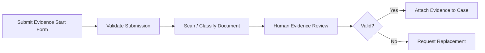

---

## 26. Key Takeaways

Forms and documents are not secondary implementation details. They define the quality of human workflow.

Remember:

- form is an interaction contract;
- form is not domain model;
- document is a resource, not a variable blob;
- process variables should carry routing facts and references;
- UI validation is helpful but insufficient;
- server-side validation protects invariants;
- document references need integrity metadata;
- drafts should not pollute process state;
- schema evolution must be intentional;
- regulatory systems need audit-ready input and evidence handling.

A strong Camunda 8 engineer designs form/document flows as durable contracts across human work, process state, domain services, document storage, and audit requirements.

---

## References

- Camunda Docs — Build forms with Modeler: https://docs.camunda.io/docs/components/modeler/forms/utilizing-forms/
- Camunda Docs — Get user task form: https://docs.camunda.io/docs/apis-tools/orchestration-cluster-api-rest/specifications/get-user-task-form/
- Camunda Docs — Document handling getting started: https://docs.camunda.io/docs/components/document-handling/getting-started/
- Camunda Docs — Upload a document to a BPMN process: https://docs.camunda.io/docs/components/document-handling/upload-document-to-bpmn-process/
- Camunda Docs — Upload document API: https://docs.camunda.io/docs/apis-tools/orchestration-cluster-api-rest/specifications/create-document/
