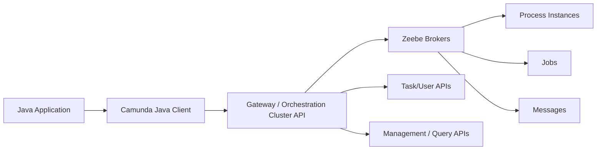
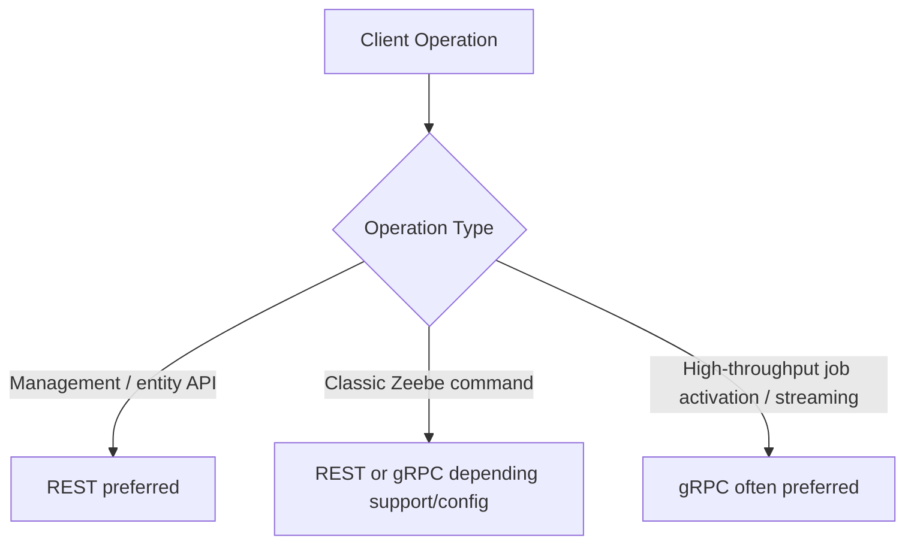
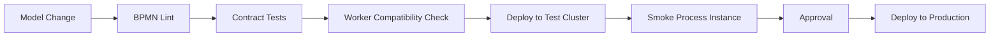
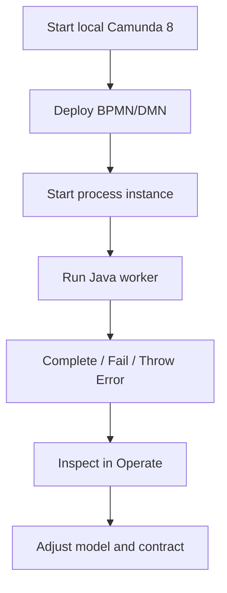

# Part 015 — Camunda Java Client Foundation

Camunda Java Client adalah boundary utama antara aplikasi Java dan Camunda 8 Orchestration Cluster. Di Camunda 7, banyak developer terbiasa berpikir bahwa engine berada di dalam aplikasi, satu transaksi dengan aplikasi, dan bisa disentuh lewat Java API internal. Di Camunda 8, mental model itu salah.

Camunda 8 adalah remote orchestration runtime. Aplikasi Java tidak “menjalankan engine”. Aplikasi Java mengirim command ke cluster, menerima job dari cluster, lalu melaporkan hasil eksekusi.

Mental model paling penting:

> Java Client bukan domain service, bukan repository, dan bukan workflow engine. Java Client adalah transport-safe command gateway menuju Orchestration Cluster.

Karena itu, desain aplikasi Java harus memisahkan:

- domain logic;
- orchestration command;
- worker execution;
- data contract;
- retry/failure mapping;
- observability;
- authentication;
- operational configuration.

Kalau semua dicampur di `@Service`, aplikasi akan terlihat jalan di local tetapi rapuh di production.

---

## 1. Skill Target for This Part

Setelah bagian ini, target skill bukan sekadar “bisa start process”. Targetnya:

1. memahami kapan memakai Java Client langsung dan kapan memakai Spring Boot Starter;
2. memahami lifecycle client sebagai resource jangka panjang;
3. memahami REST vs gRPC dalam konteks Camunda 8 modern;
4. mampu deploy BPMN/DMN, start instance, publish message, complete/fail/throw error untuk job;
5. mampu mendesain abstraction layer agar kode Java tidak terikat terlalu kuat ke vendor API;
6. mampu membaca error client sebagai symptom dari masalah transport, auth, contract, atau engine state;
7. mampu membuat production-safe client wrapper.

---

## 2. Current API Reality: Camunda Java Client vs Zeebe Java Client

Mulai Camunda 8.8, **Zeebe Java Client digantikan oleh Camunda Java Client**. Ini bukan hanya rename kosmetik. Camunda Java Client diarahkan untuk berinteraksi dengan Orchestration Cluster secara lebih luas, bukan hanya Zeebe command klasik.

Practical implication:

| Area | Old Thinking | Modern Thinking |
|---|---|---|
| Client name | `ZeebeClient` | `CamundaClient` |
| Scope | Mostly Zeebe commands | Orchestration Cluster APIs |
| Default protocol | gRPC | REST where possible |
| Future compatibility | Deprecated path | Preferred path |
| Worker capability | Job worker | Job worker plus wider API ecosystem |

Migration mental rule:

> Untuk kode baru, gunakan `io.camunda:camunda-client-java`. Jangan membuat platform baru di atas `zeebe-client-java` kecuali sedang mempertahankan legacy sementara.

Dependency baseline:

```xml
<dependency>
  <groupId>io.camunda</groupId>
  <artifactId>camunda-client-java</artifactId>
  <version>${camunda.version}</version>
</dependency>
```

Gradle:

```kotlin
implementation("io.camunda:camunda-client-java:${camundaVersion}")
```

Versioning rule:

- pin client version explicitly;
- align with platform version where possible;
- read migration notes before upgrading minor versions;
- avoid using deprecated `zeebe.*` metrics/class names for new systems;
- keep generated REST clients separate from Camunda Java Client abstractions.

---

## 3. What the Java Client Actually Does

The client provides command builders and worker primitives.



Common responsibilities:

| Responsibility | Example |
|---|---|
| Deploy resources | BPMN, DMN, forms/resources depending on API support |
| Create process instances | Start a process by BPMN process id or key |
| Publish messages | Correlate external event to waiting process instance |
| Implement workers | Activate jobs by type and execute business logic |
| Report job result | Complete, fail, throw BPMN error |
| Query/manage process data | Depends on current Orchestration Cluster API support |
| Authenticate | No auth, basic, OIDC, SaaS credentials, mTLS/OIDC cases |

The client does **not** replace:

- domain service;
- database transaction manager;
- distributed lock;
- event broker;
- audit ledger;
- human task application;
- retry orchestration inside your business systems.

---

## 4. Client Lifecycle

A `CamundaClient` should usually be a long-lived object.

Bad pattern:

```java
public void startCase(String caseId) {
    try (CamundaClient client = CamundaClient.newClientBuilder().build()) {
        client.newCreateInstanceCommand()
            .bpmnProcessId("case-intake")
            .latestVersion()
            .variables(Map.of("caseId", caseId))
            .send()
            .join();
    }
}
```

Why bad:

- creates transport resources repeatedly;
- reinitializes auth/token machinery repeatedly;
- makes latency noisier;
- can leak resources if exception paths are sloppy;
- hides operational configuration inside business methods.

Better plain Java model:

```java
public final class CamundaClientProvider implements AutoCloseable {

    private final CamundaClient client;

    public CamundaClientProvider(URI grpcAddress, URI restAddress) {
        this.client = CamundaClient.newClientBuilder()
            .grpcAddress(grpcAddress)
            .restAddress(restAddress)
            .build();
    }

    public CamundaClient client() {
        return client;
    }

    @Override
    public void close() {
        client.close();
    }
}
```

Spring Boot model:

- let the Camunda Spring Boot Starter create the client bean;
- inject `CamundaClient` into orchestration adapters;
- keep worker business logic in separate services;
- configure endpoints/auth through properties, not Java literals.

Lifecycle invariant:

> Create the client once per process application runtime, share it safely, and close it on application shutdown.

---

## 5. REST vs gRPC Mental Model

Camunda 8 modern client communication uses both REST and gRPC. Since Camunda Java Client, REST is preferred by default where possible. gRPC remains important, especially around job activation/streaming and performance-sensitive worker behavior.



Practical default:

```java
CamundaClient client = CamundaClient.newClientBuilder()
    .grpcAddress(URI.create("http://localhost:26500"))
    .restAddress(URI.create("http://localhost:8080"))
    .build();
```

Prefer gRPC by default where applicable:

```java
CamundaClient client = CamundaClient.newClientBuilder()
    .grpcAddress(URI.create("http://localhost:26500"))
    .restAddress(URI.create("http://localhost:8080"))
    .preferRestOverGrpc(false)
    .build();
```

Decision table:

| Situation | Default Recommendation |
|---|---|
| Simple process commands | REST default is fine |
| Management/query-oriented integration | REST default is natural |
| Worker throughput tuning | evaluate gRPC |
| Job streaming | gRPC path matters |
| Strict proxy/load balancer environment | test both protocols explicitly |
| Legacy Zeebe client migration | verify changed defaults carefully |

Production warning:

> Do not treat REST vs gRPC as an aesthetic choice. It affects connection behavior, proxy behavior, long polling, observability, timeout handling, and worker throughput.

---

## 6. Configuration Surface

A production client needs explicit configuration. Relying only on implicit defaults is acceptable for local experiments, not platform engineering.

Minimum local self-managed config:

```yaml
camunda:
  client:
    mode: self-managed
    grpc-address: http://localhost:26500
    rest-address: http://localhost:8080
    prefer-rest-over-grpc: true
```

SaaS-style config shape:

```yaml
camunda:
  client:
    mode: saas
    auth:
      client-id: ${CAMUNDA_CLIENT_ID}
      client-secret: ${CAMUNDA_CLIENT_SECRET}
    cloud:
      cluster-id: ${CAMUNDA_CLUSTER_ID}
      region: ${CAMUNDA_CLUSTER_REGION}
```

Common advanced knobs:

```yaml
camunda:
  client:
    request-timeout: PT10S
    request-timeout-offset: PT1S
    keep-alive: PT60S
    max-message-size: 5MB
    max-metadata-size: 16KB
    prefer-rest-over-grpc: true
```

Configuration invariants:

1. endpoint config belongs to environment, not code;
2. credentials belong to secret manager, not config file committed to Git;
3. timeout values should be part of SLO design;
4. message size limits should influence variable contract design;
5. protocol choice should be load-tested, not guessed.

---

## 7. Authentication Models

Authentication differs by deployment topology.

| Topology | Common Auth Model |
|---|---|
| Local dev | no auth or basic depending distro |
| Camunda SaaS | client credentials / cloud config |
| Self-managed secured | OIDC client credentials |
| Enterprise mTLS/OIDC | identity-provider specific setup |

Do not hide auth inside worker code. Auth is platform concern.

Bad:

```java
@Service
public class PaymentWorker {
    private final CamundaClient client = CamundaClient.newClientBuilder()
        .restAddress(URI.create("https://prod.example.com"))
        .build();
}
```

Better:

```java
@Component
public class PaymentWorker {
    private final PaymentService paymentService;

    public PaymentWorker(PaymentService paymentService) {
        this.paymentService = paymentService;
    }

    // worker method receives job through configured infrastructure
}
```

Security invariants:

- client credentials are machine identity;
- each process application should have least privilege;
- worker identity should not be reused for administration by default;
- secrets should rotate without rebuild;
- auth failure must be visible through logs/metrics/alerts.

---

## 8. Deploying Resources

Deployment is a command to the cluster. In production, deployments should be controlled, versioned, and repeatable.

Simple deployment:

```java
DeploymentEvent deployment = client.newDeployResourceCommand()
    .addResourceFromClasspath("bpmn/case-intake.bpmn")
    .addResourceFromClasspath("dmn/risk-score.dmn")
    .send()
    .join();
```

Important deployment rules:

| Rule | Why |
|---|---|
| Deploy from CI/CD, not random developer machine | reproducibility |
| Keep BPMN/DMN in version control | reviewability |
| Use explicit resource naming | traceability |
| Validate before deploy | fail fast |
| Separate deploy from start | rollback/control |
| Record deployed version metadata | auditability |

A production deployment pipeline should include:



Anti-pattern:

```java
@PostConstruct
void deployEverythingAtStartup() {
    client.newDeployResourceCommand()
        .addResourceFromClasspath("all-models.bpmn")
        .send()
        .join();
}
```

This can be acceptable in demos, but risky in production because every app boot becomes a deployment event.

Better patterns:

- local/dev auto-deploy only;
- CI/CD controlled deployment for shared environments;
- production deploy separated from worker rollout;
- model version recorded in release notes.

---

## 9. Creating Process Instances

Starting a process instance is not “calling a function”. It is creating durable workflow state in the cluster.

Simple start:

```java
ProcessInstanceEvent event = client.newCreateInstanceCommand()
    .bpmnProcessId("case-intake")
    .latestVersion()
    .variables(Map.of(
        "caseId", "CASE-2026-0001",
        "source", "portal"
    ))
    .send()
    .join();
```

Start and await result:

```java
ProcessInstanceResult result = client.newCreateInstanceCommand()
    .bpmnProcessId("eligibility-check")
    .latestVersion()
    .variables(Map.of("applicantId", applicantId))
    .withResult()
    .send()
    .join();
```

Use `withResult()` carefully. It is useful for short-running process-as-service cases, but dangerous for long-running workflows.

Decision table:

| Use Case | Start Mode |
|---|---|
| Long-running case lifecycle | async start, store process instance key |
| Short eligibility decision orchestration | possible `withResult()` |
| Human workflow | async start |
| External event starts workflow | message start event may be better |
| Public API request needing immediate response | start async and return tracking id |

Production start wrapper:

```java
public final class CaseWorkflowClient {

    private final CamundaClient client;

    public CaseWorkflowClient(CamundaClient client) {
        this.client = client;
    }

    public long startCaseIntake(StartCaseCommand command) {
        Map<String, Object> variables = Map.of(
            "caseId", command.caseId(),
            "subjectId", command.subjectId(),
            "intakeChannel", command.intakeChannel(),
            "requestId", command.requestId()
        );

        ProcessInstanceEvent event = client.newCreateInstanceCommand()
            .bpmnProcessId("case-intake")
            .latestVersion()
            .variables(variables)
            .send()
            .join();

        return event.getProcessInstanceKey();
    }
}
```

Notice the boundary:

- API layer validates request;
- domain layer decides whether case may start;
- workflow adapter sends command;
- database stores mapping if required;
- process variable contains workflow-relevant snapshot, not full domain aggregate.

---

## 10. Publishing Messages

Publishing a message is how an external event enters a waiting process instance.

```java
client.newPublishMessageCommand()
    .messageName("EvidenceReceived")
    .correlationKey(caseId)
    .timeToLive(Duration.ofHours(2))
    .variables(Map.of(
        "evidenceId", evidenceId,
        "receivedAt", receivedAt.toString()
    ))
    .send()
    .join();
```

Message command invariant:

> A successful publish command means the message was accepted by the cluster. It does not mean your business operation is complete, and depending on TTL/correlation state, it may or may not immediately correlate to a waiting instance.

Message design checklist:

| Field | Design Question |
|---|---|
| message name | Is this business event stable? |
| correlation key | Is it immutable and unique enough? |
| TTL | Should the event wait for a process or expire quickly? |
| message id | Do we need duplicate prevention? |
| variables | What minimal event payload is needed? |

Wrapper:

```java
public void publishEvidenceReceived(EvidenceReceived event) {
    client.newPublishMessageCommand()
        .messageName("EvidenceReceived")
        .correlationKey(event.caseId())
        .messageId(event.eventId())
        .timeToLive(Duration.ofHours(6))
        .variables(Map.of(
            "evidenceId", event.evidenceId(),
            "evidenceType", event.evidenceType(),
            "receivedAt", event.receivedAt().toString()
        ))
        .send()
        .join();
}
```

Anti-pattern:

```java
client.newPublishMessageCommand()
    .messageName("Update")
    .correlationKey(userInput.get("id").toString())
    .variables(userInput)
    .send()
    .join();
```

Problems:

- vague event name;
- unstable correlation key;
- uncontrolled variables;
- no message id;
- no explicit TTL;
- no audit contract.

---

## 11. Job Commands from the Client Perspective

When using plain Java workers, handler receives `JobClient` and `ActivatedJob`. The handler then reports outcome.

Complete:

```java
client.newCompleteCommand(job.getKey())
    .variables(Map.of("notificationSent", true))
    .send()
    .join();
```

Fail technical job:

```java
client.newFailCommand(job.getKey())
    .retries(job.getRetries() - 1)
    .errorMessage("Payment provider timeout")
    .retryBackoff(Duration.ofMinutes(2))
    .send()
    .join();
```

Throw modeled BPMN error:

```java
client.newThrowErrorCommand(job.getKey())
    .errorCode("PAYMENT_DECLINED")
    .errorMessage("Payment method declined by provider")
    .variables(Map.of("declineReason", "INSUFFICIENT_FUNDS"))
    .send()
    .join();
```

Outcome selection:

| Worker Outcome | Client Command | BPMN Meaning |
|---|---|---|
| Success | complete | continue normal flow |
| Temporary technical failure | fail with retries left | retry later |
| Exhausted technical failure | fail with retries `0` | incident / operator action |
| Business exception modeled in BPMN | throw error | boundary/event subprocess handles it |

Do not use Java exceptions directly as process semantics. Convert them.

```java
try {
    PaymentResult result = paymentService.charge(command);

    jobClient.newCompleteCommand(job.getKey())
        .variables(Map.of("paymentId", result.paymentId()))
        .send()
        .join();

} catch (PaymentDeclinedException ex) {
    jobClient.newThrowErrorCommand(job.getKey())
        .errorCode("PAYMENT_DECLINED")
        .errorMessage(ex.getMessage())
        .send()
        .join();

} catch (PaymentProviderUnavailableException ex) {
    jobClient.newFailCommand(job.getKey())
        .retries(job.getRetries() - 1)
        .retryBackoff(Duration.ofMinutes(5))
        .errorMessage(ex.getMessage())
        .send()
        .join();
}
```

---

## 12. Async Command Handling

Most client commands return a future-like abstraction. `.join()` is convenient but can hide blocking behavior.

Synchronous adapter style:

```java
public long startProcess(StartCaseCommand command) {
    return client.newCreateInstanceCommand()
        .bpmnProcessId("case-intake")
        .latestVersion()
        .variables(command.toVariables())
        .send()
        .join()
        .getProcessInstanceKey();
}
```

Async style:

```java
public CompletableFuture<Long> startProcessAsync(StartCaseCommand command) {
    return client.newCreateInstanceCommand()
        .bpmnProcessId("case-intake")
        .latestVersion()
        .variables(command.toVariables())
        .send()
        .toCompletableFuture()
        .thenApply(ProcessInstanceEvent::getProcessInstanceKey);
}
```

Production guidance:

- synchronous style is fine for administrative tools and simple API adapters;
- async style is better when composing non-blocking flows;
- never block event-loop threads unintentionally;
- apply timeouts at API boundary;
- do not return internal client futures from domain services.

---

## 13. Designing a Client Adapter Layer

Do not spread Camunda commands everywhere. Create a narrow adapter.


Port:

```java
public interface CaseWorkflowPort {
    long startCaseIntake(StartCaseWorkflowCommand command);
    void publishEvidenceReceived(EvidenceReceivedWorkflowEvent event);
}
```

Adapter:

```java
public final class CamundaCaseWorkflowAdapter implements CaseWorkflowPort {

    private final CamundaClient client;

    public CamundaCaseWorkflowAdapter(CamundaClient client) {
        this.client = client;
    }

    @Override
    public long startCaseIntake(StartCaseWorkflowCommand command) {
        return client.newCreateInstanceCommand()
            .bpmnProcessId("case-intake")
            .latestVersion()
            .variables(command.toVariables())
            .send()
            .join()
            .getProcessInstanceKey();
    }

    @Override
    public void publishEvidenceReceived(EvidenceReceivedWorkflowEvent event) {
        client.newPublishMessageCommand()
            .messageName("EvidenceReceived")
            .correlationKey(event.caseId())
            .messageId(event.eventId())
            .timeToLive(Duration.ofHours(6))
            .variables(event.toVariables())
            .send()
            .join();
    }
}
```

Benefits:

- test application logic without Camunda;
- isolate version/API changes;
- enforce naming conventions;
- centralize error mapping;
- centralize metrics;
- prevent variable contract sprawl.

---

## 14. Error Handling Taxonomy

Client command can fail for different reasons. Treat all failures as “Camunda is down” and you will debug slowly.

| Failure Type | Example | Likely Layer |
|---|---|---|
| Authentication failure | invalid client secret | platform/security |
| Authorization failure | missing permission/tenant | identity/access control |
| Endpoint unreachable | DNS/TLS/network | infrastructure |
| Timeout | overloaded cluster/proxy/slow response | infra/runtime |
| Invalid command | wrong BPMN id, bad variable payload | application contract |
| Rejection | process/message/job state invalid | orchestration state |
| Resource exhausted | cluster backpressure | capacity/load |

Adapter-level pattern:

```java
public long startCaseIntake(StartCaseWorkflowCommand command) {
    try {
        return client.newCreateInstanceCommand()
            .bpmnProcessId("case-intake")
            .latestVersion()
            .variables(command.toVariables())
            .send()
            .join()
            .getProcessInstanceKey();
    } catch (CompletionException ex) {
        throw mapCamundaFailure("start-case-intake", command.caseId(), ex);
    }
}
```

Mapping should preserve:

- operation name;
- business correlation id;
- process id/message name/job type;
- tenant id if any;
- retryability classification;
- original exception as cause.

Example custom exception:

```java
public final class WorkflowCommandException extends RuntimeException {
    private final String operation;
    private final String correlationId;
    private final boolean retryable;

    public WorkflowCommandException(
        String operation,
        String correlationId,
        boolean retryable,
        String message,
        Throwable cause
    ) {
        super(message, cause);
        this.operation = operation;
        this.correlationId = correlationId;
        this.retryable = retryable;
    }

    public String operation() {
        return operation;
    }

    public String correlationId() {
        return correlationId;
    }

    public boolean retryable() {
        return retryable;
    }
}
```

---

## 15. Variable Serialization Boundary

The Java Client serializes variables to JSON-compatible data. Treat variable shape as public contract between BPMN and workers.

Good:

```java
public record StartCaseVariables(
    String caseId,
    String subjectId,
    String intakeChannel,
    String requestId
) {}
```

Avoid:

```java
client.newCreateInstanceCommand()
    .variables(domainAggregate)
    .send()
    .join();
```

Problems:

- accidental leakage of internal fields;
- fragile serialization;
- large payloads;
- versioning problems;
- sensitive data exposure;
- BPMN coupled to domain object structure.

Recommended mapper:

```java
public final class WorkflowVariables {

    public static Map<String, Object> startCase(StartCaseCommand command) {
        return Map.of(
            "caseId", command.caseId(),
            "subject", Map.of(
                "subjectId", command.subjectId(),
                "subjectType", command.subjectType()
            ),
            "intake", Map.of(
                "channel", command.channel(),
                "receivedAt", command.receivedAt().toString()
            ),
            "requestId", command.requestId()
        );
    }
}
```

Contract invariant:

> Process variables are orchestration facts, not an object dump.

---

## 16. Multi-Tenancy Awareness

In tenant-aware systems, every command must have a tenant story.

Questions:

- Is tenant id explicit in command?
- Does worker retrieve jobs from allowed tenants only?
- Does message correlation include tenant context if required?
- Does deployment target one tenant or shared tenant?
- Does observability include tenant dimension without exploding cardinality?

Example shape:

```java
client.newCreateInstanceCommand()
    .bpmnProcessId("case-intake")
    .latestVersion()
    .tenantId("regulator-a")
    .variables(variables)
    .send()
    .join();
```

Worker side concept:

```java
client.newWorker()
    .jobType("case-risk-score")
    .tenantId("regulator-a")
    .handler(handler)
    .open();
```

Do not retrofit tenancy later if regulatory/data isolation matters. It affects keys, deployment, authorization, audit, and operations.

---

## 17. Observability at Client Boundary

Every command wrapper should emit structured logs and metrics.

Recommended dimensions:

| Dimension | Example |
|---|---|
| operation | `start_process`, `publish_message`, `complete_job` |
| process id | `case-intake` |
| message name | `EvidenceReceived` |
| job type | `case-risk-score` |
| tenant | `regulator-a` |
| outcome | `success`, `failure`, `timeout`, `rejected` |
| latency bucket | request latency |
| correlation id | request/case/event id |

Structured log example:

```java
log.info("workflow command completed operation={} processId={} caseId={} processInstanceKey={}",
    "start-case-intake",
    "case-intake",
    command.caseId(),
    processInstanceKey);
```

Metric example concept:

```text
workflow_command_total{operation="publish_message",message="EvidenceReceived",outcome="success"}
workflow_command_latency_seconds{operation="start_process",process="case-intake"}
workflow_command_failure_total{operation="complete_job",reason="timeout"}
```

Avoid high-cardinality labels such as raw `caseId` in metrics. Put correlation ids in logs/traces, not metric labels.

---

## 18. Production-Safe Wrapper Example

A more realistic wrapper:

```java
public final class WorkflowGateway {

    private final CamundaClient client;
    private final Clock clock;
    private final WorkflowMetrics metrics;

    public WorkflowGateway(CamundaClient client, Clock clock, WorkflowMetrics metrics) {
        this.client = client;
        this.clock = clock;
        this.metrics = metrics;
    }

    public long startLatest(String processId, String businessKey, Map<String, Object> variables) {
        long started = clock.millis();
        try {
            ProcessInstanceEvent event = client.newCreateInstanceCommand()
                .bpmnProcessId(processId)
                .latestVersion()
                .variables(variables)
                .send()
                .join();

            metrics.recordSuccess("start_process", processId, clock.millis() - started);
            return event.getProcessInstanceKey();
        } catch (RuntimeException ex) {
            metrics.recordFailure("start_process", processId, ex);
            throw new WorkflowCommandException(
                "start_process",
                businessKey,
                isRetryable(ex),
                "Failed to start process " + processId,
                ex
            );
        }
    }

    public void publish(String messageName, String correlationKey, String messageId, Duration ttl, Map<String, Object> variables) {
        long started = clock.millis();
        try {
            client.newPublishMessageCommand()
                .messageName(messageName)
                .correlationKey(correlationKey)
                .messageId(messageId)
                .timeToLive(ttl)
                .variables(variables)
                .send()
                .join();

            metrics.recordSuccess("publish_message", messageName, clock.millis() - started);
        } catch (RuntimeException ex) {
            metrics.recordFailure("publish_message", messageName, ex);
            throw new WorkflowCommandException(
                "publish_message",
                correlationKey,
                isRetryable(ex),
                "Failed to publish message " + messageName,
                ex
            );
        }
    }

    private boolean isRetryable(Throwable ex) {
        // Keep this conservative. Transport failures may be retryable;
        // invalid command/authorization failures generally are not.
        return true;
    }
}
```

This wrapper is intentionally boring. Boring wrappers make production systems easier to inspect.

---

## 19. Local Development Flow

For local learning and worker development:



Minimal local smoke test:

```java
try (CamundaClient client = CamundaClient.newClientBuilder()
    .grpcAddress(URI.create("http://localhost:26500"))
    .restAddress(URI.create("http://localhost:8080"))
    .build()) {

    client.newTopologyRequest().send().join();

    client.newDeployResourceCommand()
        .addResourceFromClasspath("bpmn/hello-world.bpmn")
        .send()
        .join();

    client.newCreateInstanceCommand()
        .bpmnProcessId("hello-world")
        .latestVersion()
        .variables(Map.of("name", "Camunda"))
        .send()
        .join();
}
```

Local smoke test should verify:

- endpoint reachable;
- auth config valid;
- deployment resource valid;
- process id matches BPMN;
- variables serialize;
- workers activate jobs;
- incidents visible if failure is forced.

---

## 20. Testing Strategy for Client Code

Do not make every test depend on a live cluster.

Testing layers:

| Layer | What to Test | Tooling Style |
|---|---|---|
| Unit | variable mapper, command object | plain JUnit |
| Adapter | correct command construction | mock/wrapper tests |
| Contract | BPMN expects variable names/job types | process tests |
| Integration | real client to local cluster/test runtime | Testcontainers/Camunda Process Test depending part |
| E2E | process + worker + external service stub | environment test |

Unit test variable mapper:

```java
@Test
void mapsStartCaseVariables() {
    StartCaseCommand command = new StartCaseCommand(
        "CASE-1",
        "SUBJECT-9",
        "portal",
        "REQ-123"
    );

    Map<String, Object> vars = WorkflowVariables.startCase(command);

    assertThat(vars).containsEntry("caseId", "CASE-1");
    assertThat(vars).containsEntry("requestId", "REQ-123");
}
```

Contract test idea:

- BPMN service task type must equal worker type constant;
- BPMN message name must equal publisher constant;
- DMN id must equal business rule task reference;
- variable names used in FEEL must exist in known variable contract.

---

## 21. Common Anti-Patterns

### 21.1 Client Per Request

Symptom:

- high latency;
- token churn;
- resource leak;
- unstable behavior under load.

Fix:

- one long-lived client bean/provider per process application.

### 21.2 Workflow Commands Inside Domain Entities

Bad:

```java
caseAggregate.startWorkflow(camundaClient);
```

Fix:

- domain emits intent;
- application service calls workflow port;
- adapter uses Camunda client.

### 21.3 Blind `.latestVersion()` Everywhere

`latestVersion()` is convenient, but may be unsafe for controlled rollout.

Use latest when:

- process model is backward compatible;
- worker contracts support it;
- deployment strategy expects latest.

Use explicit version or version tag strategy when:

- regulated process rollout requires approval;
- in-flight migrations matter;
- blue/green model rollout is needed.

### 21.4 Variables as Dump Truck

Sending huge object graphs causes:

- serialization fragility;
- message size issues;
- sensitive data exposure;
- slow Operate inspection;
- bad FEEL dependencies.

Fix:

- define minimal variable contracts.

### 21.5 Retrying Non-Idempotent Commands Blindly

Retrying a publish/start command from an upstream service can duplicate business workflows if no idempotency strategy exists.

Fix:

- use command id/request id/message id;
- store domain-to-process mapping;
- make upstream operation idempotent.

### 21.6 Using Message Publish as Synchronous RPC

Message publish is event injection, not direct call/return.

Fix:

- model response as separate event;
- or use process start with result only for short-running deterministic workflows.

---

## 22. Regulatory System Example

Suppose we have enforcement case intake.

Application API:

```http
POST /cases
```

Domain facts:

- case id allocated;
- subject identified;
- allegation received;
- intake channel known;
- initial risk scoring pending.

Workflow start variables:

```json
{
  "caseId": "CASE-2026-0001",
  "subject": {
    "subjectId": "SUBJECT-123",
    "subjectType": "LICENSED_ENTITY"
  },
  "intake": {
    "channel": "PORTAL",
    "receivedAt": "2026-06-28T10:15:30Z"
  },
  "requestId": "REQ-789"
}
```

Do not include:

- entire complaint PDF;
- full subject profile;
- investigator notes;
- all previous cases;
- internal authorization data.

Workflow adapter:

```java
public long startEnforcementCase(EnforcementCaseCreated event) {
    return client.newCreateInstanceCommand()
        .bpmnProcessId("enforcement-case-lifecycle")
        .latestVersion()
        .variables(Map.of(
            "caseId", event.caseId(),
            "subject", Map.of(
                "subjectId", event.subjectId(),
                "subjectType", event.subjectType()
            ),
            "intake", Map.of(
                "channel", event.channel(),
                "receivedAt", event.receivedAt().toString()
            ),
            "requestId", event.requestId()
        ))
        .send()
        .join()
        .getProcessInstanceKey();
}
```

---

## 23. Production Readiness Checklist

Before putting Java Client usage in production, verify:

- [ ] using `camunda-client-java`, not new legacy Zeebe client code;
- [ ] client version is pinned and upgrade policy exists;
- [ ] endpoint/auth configuration comes from environment/secrets;
- [ ] client is long-lived and closed on shutdown;
- [ ] REST vs gRPC default has been explicitly reviewed;
- [ ] command wrappers exist for start/message/deploy/admin operations;
- [ ] variable contracts are explicit and tested;
- [ ] message names/correlation keys/message IDs are standardized;
- [ ] command failure taxonomy is mapped;
- [ ] logs include operation and business correlation id;
- [ ] metrics avoid high-cardinality labels;
- [ ] deployment commands are separated from application startup for production;
- [ ] tenant strategy is explicit;
- [ ] retry/idempotency strategy exists for upstream callers.

---

## 24. Kaufman Drill: 90-Minute Client Foundation Practice

Use this practice loop:

1. create minimal BPMN with one service task `log-intake`;
2. deploy BPMN using Java Client;
3. start process instance with a typed variable mapper;
4. open a plain Java worker for `log-intake`;
5. complete job with output variable;
6. force a technical failure and inspect retry behavior;
7. throw BPMN error and catch it with boundary event;
8. publish a message to a waiting process;
9. add structured logging around every command;
10. refactor raw commands into `WorkflowGateway`.

The learning goal is not syntax. The goal is to feel the boundary:

> Java sends commands and handles jobs. Zeebe owns durable orchestration state.

---

## 25. Summary

Camunda Java Client is the primary Java integration surface for Camunda 8. Treat it as a production infrastructure boundary, not as a convenience utility sprinkled across code.

Core takeaways:

- use Camunda Java Client for new Camunda 8 Java code;
- model the client as a long-lived infrastructure resource;
- understand REST/gRPC defaults and choose deliberately;
- wrap workflow commands behind application ports;
- keep process variables explicit, small, and versionable;
- distinguish command failure, job failure, BPMN error, and incident;
- make observability part of the adapter from day one.

In the next part, we move from plain Java Client foundation to idiomatic Spring Boot integration: auto-configuration, `@JobWorker`, property management, worker method signatures, auto-completion, profiles, and production application structure.

---

## References

- Camunda Docs — Camunda Java Client: https://docs.camunda.io/docs/apis-tools/java-client/getting-started/
- Camunda Docs — Migrate to Camunda Java Client: https://docs.camunda.io/docs/apis-tools/migration-manuals/migrate-to-camunda-java-client/
- Camunda Docs — Job Worker: https://docs.camunda.io/docs/apis-tools/java-client/job-worker/
- Camunda Docs — Camunda Spring Boot Starter: https://docs.camunda.io/docs/apis-tools/camunda-spring-boot-starter/getting-started/
- Camunda Docs — Supported Environments: https://docs.camunda.io/docs/reference/supported-environments/
