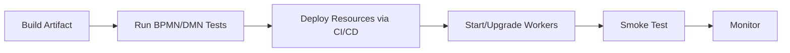
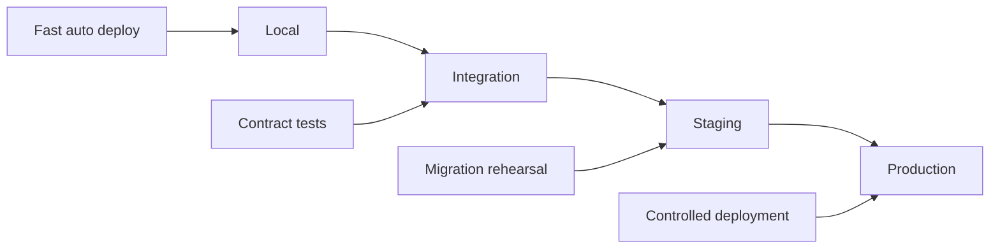

# Part 016 — Spring Boot Integration with Camunda 8

Spring Boot integration is where Camunda 8 becomes productive for Java teams. The danger is that convenience hides architectural boundaries. A worker method with `@JobWorker` feels like a controller method, but it is not an HTTP endpoint. It is a distributed job handler activated by an orchestration cluster.

Mental model:

> Spring Boot hosts process application code. Camunda 8 owns orchestration state. `@JobWorker` is an adapter boundary between durable workflow state and local business capability.

This means we design Spring Boot integration around:

- configuration externalization;
- worker registration;
- explicit variable contracts;
- controlled auto-completion;
- failure mapping;
- idempotency;
- observability;
- environment profiles;
- testability.

---

## 1. Current API Reality

For modern Camunda 8, use **Camunda Spring Boot Starter**, not the old Spring Zeebe SDK for new work.

The starter:

- integrates Camunda 8 APIs into Spring Boot;
- uses the Camunda Java Client under the hood;
- supports REST and gRPC configuration;
- provides worker annotations;
- follows Camunda public API compatibility policy with semantic versioning constraints except alpha features;
- replaces Spring Zeebe SDK in the modern line.

Dependency baseline for current Spring Boot 4 track:

```xml
<dependency>
  <groupId>io.camunda</groupId>
  <artifactId>camunda-spring-boot-starter</artifactId>
  <version>${camunda.version}</version>
</dependency>
```

For Spring Boot 3.5 track in Camunda 8.9+:

```xml
<dependency>
  <groupId>io.camunda</groupId>
  <artifactId>camunda-spring-boot-3-starter</artifactId>
  <version>${camunda.version}</version>
</dependency>
```

Practical recommendation:

| Situation | Dependency Choice |
|---|---|
| new service ready for Spring Boot 4 | `camunda-spring-boot-starter` or explicit Boot 4 module |
| existing estate on Spring Boot 3.5 | `camunda-spring-boot-3-starter` |
| legacy Spring Zeebe SDK | migrate before relying on later Camunda versions |
| non-Spring Java service | plain `camunda-client-java` |

Do not mix old and new starters casually. Dependency ambiguity creates confusing auto-configuration and runtime behavior.

---

## 2. Architecture Placement

A process application should not become a ball of worker methods.

Recommended structure:

```text
case-orchestration-service/
  src/main/java/com/acme/caseorchestration/
    CaseOrchestrationApplication.java
    camunda/
      WorkerConfiguration.java
      WorkflowGateway.java
      WorkerErrorMapper.java
    workers/
      RiskScoringWorker.java
      EvidenceValidationWorker.java
      NotificationWorker.java
    application/
      StartCaseUseCase.java
      PublishEvidenceUseCase.java
    domain/
      CaseRiskPolicy.java
      EvidenceValidationPolicy.java
    infrastructure/
      RiskScoringClient.java
      DocumentRepository.java
      NotificationClient.java
  src/main/resources/
    application.yml
    application-local.yml
    bpmn/
    dmn/
```

Layering:

```mermaid
flowchart TB
    A[BPMN Service Task] --> B[@JobWorker Adapter]
    B --> C[Application Service]
    C --> D[Domain Service / Policy]
    C --> E[External System Client]
    B --> F[Camunda Completion / Failure / BPMN Error]
```

Boundary rule:

> Worker classes translate between Camunda job contract and application use case. They should not contain complex business policy.

---

## 3. Configuration Modes

The starter supports modes with meaningful defaults. Use one mode at a time.

### 3.1 Local/Self-Managed

```yaml
camunda:
  client:
    mode: self-managed
    grpc-address: http://localhost:26500
    rest-address: http://localhost:8080
```

### 3.2 SaaS

```yaml
camunda:
  client:
    mode: saas
    auth:
      client-id: ${CAMUNDA_CLIENT_ID}
      client-secret: ${CAMUNDA_CLIENT_SECRET}
    cloud:
      cluster-id: ${CAMUNDA_CLUSTER_ID}
      region: ${CAMUNDA_CLUSTER_REGION}
```

### 3.3 Protocol Preference

```yaml
camunda:
  client:
    prefer-rest-over-grpc: true
```

Use gRPC preference where worker activation/streaming behavior or performance testing says so:

```yaml
camunda:
  client:
    prefer-rest-over-grpc: false
```

### 3.4 Important Config Rule

Configuration properties can map to environment variables using Spring Boot conventions. For example:

```yaml
camunda:
  client:
    worker:
      defaults:
        max-jobs-active: 32
```

can become an environment variable such as:

```bash
CAMUNDA_CLIENT_WORKER_DEFAULTS_MAXJOBSACTIVE=32
```

Use this for platform deployment, but keep a documented mapping. Environment-variable names become unreadable quickly.

---

## 4. Profile Strategy

Use profiles to separate local convenience from production safety.

`application.yml`:

```yaml
spring:
  application:
    name: case-orchestration-service

camunda:
  client:
    enabled: true
    request-timeout: PT10S
    request-timeout-offset: PT1S
    worker:
      defaults:
        max-jobs-active: 16
        timeout: PT5M
        auto-complete: true
```

`application-local.yml`:

```yaml
camunda:
  client:
    mode: self-managed
    grpc-address: http://localhost:26500
    rest-address: http://localhost:8080
```

`application-prod.yml`:

```yaml
camunda:
  client:
    mode: saas
    auth:
      client-id: ${CAMUNDA_CLIENT_ID}
      client-secret: ${CAMUNDA_CLIENT_SECRET}
    cloud:
      cluster-id: ${CAMUNDA_CLUSTER_ID}
      region: ${CAMUNDA_CLUSTER_REGION}
    worker:
      defaults:
        max-jobs-active: ${CAMUNDA_WORKER_MAX_JOBS_ACTIVE:32}
        timeout: PT10M
```

Production invariants:

- no hardcoded secrets;
- no random local endpoint in production config;
- worker concurrency tuned per job type;
- request timeout explicit;
- logs show active mode/profile on startup;
- actuator health/metrics integrated.

---

## 5. Basic Worker

Minimal worker:

```java
@Component
public class NotificationWorker {

    private final NotificationService notificationService;

    public NotificationWorker(NotificationService notificationService) {
        this.notificationService = notificationService;
    }

    @JobWorker(type = "send-notification")
    public Map<String, Object> sendNotification(ActivatedJob job) {
        String caseId = (String) job.getVariablesAsMap().get("caseId");

        String notificationId = notificationService.sendCaseNotification(caseId);

        return Map.of(
            "notification", Map.of(
                "sent", true,
                "notificationId", notificationId
            )
        );
    }
}
```

This is okay for learning, but we can do better.

Problems:

- manual variable map access;
- no typed contract;
- no explicit error mapping;
- no idempotency key;
- no structured logging.

---

## 6. Typed Worker Input

Define a command record:

```java
public record SendNotificationJob(
    String caseId,
    String recipientId,
    String templateCode,
    String requestId
) {}
```

Worker:

```java
@Component
public class NotificationWorker {

    private final NotificationService notificationService;

    public NotificationWorker(NotificationService notificationService) {
        this.notificationService = notificationService;
    }

    @JobWorker(type = "send-notification", fetchVariables = {
        "caseId",
        "recipientId",
        "templateCode",
        "requestId"
    })
    public Map<String, Object> sendNotification(SendNotificationJob job) {
        NotificationResult result = notificationService.send(
            job.caseId(),
            job.recipientId(),
            job.templateCode(),
            job.requestId()
        );

        return Map.of(
            "notification", Map.of(
                "notificationId", result.notificationId(),
                "sentAt", result.sentAt().toString()
            )
        );
    }
}
```

The key improvement is not less code. It is a clearer contract.

Contract rule:

> Worker method parameters should communicate what the BPMN job requires, not how variables happen to be stored internally.

---

## 7. Fetch Variables Deliberately

By default, workers may receive more variable data than needed. Fetch only what the worker needs.

```java
@JobWorker(
    type = "risk-score-case",
    fetchVariables = {"caseId", "subject", "allegationSummary"}
)
public RiskScoreResult scoreCase(RiskScoreInput input) {
    return riskScoringService.score(input);
}
```

Why this matters:

| Reason | Explanation |
|---|---|
| performance | less payload over network |
| memory | fewer large variable maps in worker |
| security | less accidental sensitive data exposure |
| coupling | worker does not depend on unrelated process data |
| evolvability | changing other variables does not break worker |

Anti-pattern:

```java
@JobWorker(type = "risk-score-case")
public Map<String, Object> score(ActivatedJob job) {
    Map<String, Object> everything = job.getVariablesAsMap();
    // parse whatever happens to be present
}
```

---

## 8. Worker Metadata Injection

Workers often need keys and headers for observability/idempotency.

```java
@JobWorker(type = "validate-evidence")
public Map<String, Object> validateEvidence(
    EvidenceValidationInput input,
    @JobKey long jobKey,
    @ProcessInstanceKey long processInstanceKey,
    @ElementInstanceKey long elementInstanceKey,
    @CustomHeaders Map<String, String> headers
) {
    log.info("validating evidence jobKey={} processInstanceKey={} elementInstanceKey={} headers={}",
        jobKey,
        processInstanceKey,
        elementInstanceKey,
        headers);

    EvidenceValidationResult result = validationService.validate(input);

    return Map.of(
        "evidenceValidation", Map.of(
            "valid", result.valid(),
            "code", result.code()
        )
    );
}
```

Use metadata for:

- logging;
- trace correlation;
- idempotency keys;
- conditional adapter behavior based on custom headers;
- debugging.

Do not use metadata for:

- hidden business rule branching;
- authorization bypass;
- fragile model-specific hacks.

---

## 9. Auto-Completion

By default, Spring worker methods can auto-complete jobs after the method returns successfully.

Auto-complete style:

```java
@JobWorker(type = "calculate-risk")
public Map<String, Object> calculateRisk(RiskInput input) {
    RiskResult result = riskService.calculate(input);
    return Map.of("risk", result);
}
```

This is clean when:

- all work is synchronous;
- method return fully represents output variables;
- failure can be expressed by throwing exception or BPMN error;
- no asynchronous callback is needed.

Important constraint:

> Auto-completion completes after method returns. If business work continues asynchronously after return, auto-completion is wrong.

Manual completion style:

```java
@JobWorker(type = "submit-to-external-registry", autoComplete = false)
public void submitToRegistry(JobClient client, ActivatedJob job) {
    RegistrySubmissionCommand command = job.getVariablesAsType(RegistrySubmissionCommand.class);

    registryClient.submitAsync(command)
        .thenAccept(result -> client.newCompleteCommand(job.getKey())
            .variables(Map.of("registrySubmissionId", result.submissionId()))
            .send())
        .exceptionally(ex -> {
            client.newFailCommand(job.getKey())
                .retries(job.getRetries() - 1)
                .errorMessage(ex.getMessage())
                .send();
            return null;
        });
}
```

Manual completion is more complex. Use it only when it buys correctness.

---

## 10. Returning Variables

With auto-complete, a worker can return output variables.

Good output style:

```java
public record RiskScoreOutput(
    String level,
    int score,
    String modelVersion,
    String evaluatedAt
) {}

@JobWorker(type = "score-case-risk")
public Map<String, Object> scoreRisk(RiskScoreInput input) {
    RiskScoreOutput output = riskService.score(input);
    return Map.of("riskScore", output);
}
```

Avoid flattening everything:

```java
return Map.of(
    "score", 85,
    "level", "HIGH",
    "version", "v3",
    "time", "..."
);
```

Prefer namespaced variable groups:

```json
{
  "riskScore": {
    "score": 85,
    "level": "HIGH",
    "modelVersion": "v3",
    "evaluatedAt": "2026-06-28T10:20:00Z"
  }
}
```

Benefits:

- fewer naming collisions;
- easier versioning;
- cleaner Operate inspection;
- clearer FEEL expressions.

---

## 11. BPMN Error from Spring Worker

Business error should be modeled, not hidden as technical exception.

```java
@JobWorker(type = "verify-license")
public Map<String, Object> verifyLicense(VerifyLicenseInput input) {
    LicenseStatus status = licenseService.verify(input.licenseId());

    if (status == LicenseStatus.REVOKED) {
        throw new BpmnError(
            "LICENSE_REVOKED",
            "The license is revoked and cannot proceed"
        );
    }

    return Map.of("licenseVerified", true);
}
```

Use BPMN error when:

- the condition is expected in the business domain;
- BPMN has an error boundary/event subprocess to handle it;
- operations should not investigate it as infrastructure failure;
- the alternative path is part of the process design.

Do not use BPMN error for:

- database unavailable;
- HTTP 503;
- serialization bug;
- null pointer;
- worker misconfiguration;
- authorization misconfiguration.

---

## 12. Technical Failure Mapping

Letting random Java exceptions escape can be acceptable initially because the framework can fail the job, but production systems need intentional mapping.

Pattern:

```java
@Component
public class RiskScoringWorker {

    private final RiskScoringService riskScoringService;
    private final WorkerFailureMapper failureMapper;

    public RiskScoringWorker(RiskScoringService riskScoringService, WorkerFailureMapper failureMapper) {
        this.riskScoringService = riskScoringService;
        this.failureMapper = failureMapper;
    }

    @JobWorker(type = "risk-score-case", autoComplete = false)
    public void score(JobClient client, ActivatedJob job) {
        try {
            RiskScoreInput input = job.getVariablesAsType(RiskScoreInput.class);
            RiskScoreOutput output = riskScoringService.score(input);

            client.newCompleteCommand(job.getKey())
                .variables(Map.of("riskScore", output))
                .send()
                .join();

        } catch (InvalidCaseDataException ex) {
            client.newThrowErrorCommand(job.getKey())
                .errorCode("INVALID_CASE_DATA")
                .errorMessage(ex.getMessage())
                .send()
                .join();

        } catch (Exception ex) {
            FailureDecision decision = failureMapper.map(job, ex);

            client.newFailCommand(job.getKey())
                .retries(decision.remainingRetries())
                .retryBackoff(decision.backoff())
                .errorMessage(decision.message())
                .send()
                .join();
        }
    }
}
```

Failure mapper:

```java
public record FailureDecision(
    int remainingRetries,
    Duration backoff,
    String message
) {}
```

Mapping rule:

| Exception | Workflow Outcome |
|---|---|
| known business invalid state | BPMN error |
| transient external dependency | fail job, retry later |
| permanent technical/config issue | fail job, possibly retries 0 |
| unexpected bug | fail job, operator visibility |

---

## 13. Idempotency in Spring Workers

Spring makes it easy to call a service. Zeebe makes it possible for the same job to be retried. External systems make duplicate side effects expensive.

Worker idempotency key candidates:

- `job.getKey()` for job-attempt uniqueness;
- process instance key + element id for activity-level uniqueness;
- domain business key such as `caseId` + action name;
- request id passed as variable;
- external event id.

For side effects, prefer business idempotency key:

```java
@JobWorker(type = "create-enforcement-notice")
public Map<String, Object> createNotice(
    NoticeInput input,
    @ProcessInstanceKey long processInstanceKey,
    @ElementInstanceKey long elementInstanceKey
) {
    String idempotencyKey = "create-notice:%s:%d:%d".formatted(
        input.caseId(),
        processInstanceKey,
        elementInstanceKey
    );

    NoticeResult result = noticeService.createNotice(input, idempotencyKey);

    return Map.of("notice", Map.of(
        "noticeId", result.noticeId(),
        "createdAt", result.createdAt().toString()
    ));
}
```

Do not rely only on worker retry count for idempotency. Retry count tells you how many attempts remain, not whether the external side effect already happened.

---

## 14. Worker Concurrency and Resource Tuning

Key tuning properties:

- execution threads;
- max jobs active;
- job timeout;
- polling interval/backoff;
- stream enabled/disabled depending use case;
- message size.

Example:

```yaml
camunda:
  client:
    execution-threads: 8
    worker:
      defaults:
        max-jobs-active: 32
        timeout: PT5M
      override:
        risk-score-case:
          max-jobs-active: 8
          timeout: PT2M
        generate-large-report:
          max-jobs-active: 2
          timeout: PT30M
```

Tuning mental model:

| Worker Type | Concurrency Strategy |
|---|---|
| CPU-heavy | lower concurrency, watch CPU saturation |
| IO-heavy | higher concurrency, watch downstream limits |
| external rate-limited API | concurrency below provider quota |
| long-running report | low concurrency, longer timeout |
| document processing | bound by memory and file size |

Anti-pattern:

```yaml
camunda:
  client:
    worker:
      defaults:
        max-jobs-active: 500
```

Unless tested, this can overload:

- worker heap;
- downstream services;
- database pools;
- HTTP clients;
- external APIs;
- gateway and broker.

---

## 15. Worker Type Naming

Worker type is an integration contract. Treat it like an API route.

Good names:

```text
case-risk-score
validate-evidence
create-enforcement-notice
send-hearing-reminder
sync-license-status
```

Bad names:

```text
serviceTask1
javaDelegate
worker
process
handleTask
foo
```

Naming rules:

- verb-object or domain action;
- stable across implementation refactor;
- no technology leakage;
- no class name leakage;
- no version in name unless supporting parallel incompatible contracts;
- ownership documented.

Worker type constant:

```java
public final class WorkerTypes {
    private WorkerTypes() {}

    public static final String CASE_RISK_SCORE = "case-risk-score";
    public static final String VALIDATE_EVIDENCE = "validate-evidence";
    public static final String CREATE_NOTICE = "create-enforcement-notice";
}
```

Use constants in workers and BPMN lint/contract tests.

---

## 16. Worker Contract Documentation

Every production worker should have a small contract block.

Example:

```md
## Worker: case-risk-score

Type: case-risk-score
Owner: Case Risk Platform Team
Input variables:
- caseId: string, required
- subject.subjectId: string, required
- allegationSummary.category: string, required

Output variables:
- riskScore.level: LOW | MEDIUM | HIGH
- riskScore.score: integer 0..100
- riskScore.modelVersion: string
- riskScore.evaluatedAt: ISO-8601 timestamp

Business errors:
- INVALID_CASE_DATA

Technical failure policy:
- retry transient risk provider failures with exponential backoff
- incident on invalid worker configuration
```

This contract should live near code and be referenced from BPMN review.

---

## 17. Application Startup and Deployment

It is tempting to auto-deploy BPMN resources from Spring Boot startup.

For local dev:

```yaml
camunda:
  client:
    deployment:
      enabled: true
```

For production, be careful. Deployment at app startup can create uncontrolled model versions.

Recommended production model:



Deployment and worker rollout are related but not identical:

- deploying new BPMN creates new definitions;
- workers must support new job types/contracts;
- old process instances may still use old paths;
- rollback may require model and worker compatibility strategy.

Production rule:

> Avoid coupling application boot to production model deployment unless your platform explicitly controls and audits that behavior.

---

## 18. Health and Readiness

A worker service can be “up” but not useful.

Readiness should consider:

- application started;
- Camunda client configured;
- cluster reachable if required;
- critical dependencies reachable;
- workers registered;
- no fatal config mismatch.

But beware:

- strict readiness checks against Camunda can cause cascading restarts during cluster maintenance;
- too-soft checks hide broken workers;
- health design must match deployment strategy.

Suggested split:

| Signal | Meaning |
|---|---|
| liveness | JVM is not deadlocked/fatally broken |
| readiness | service can accept work |
| dependency health | Camunda/downstream status visible separately |
| worker metrics | activation/handled/failure rates |

---

## 19. Observability

Worker logs should include:

- job type;
- job key;
- process instance key;
- element id/name if available;
- business key/case id;
- tenant id if applicable;
- attempt/retry count;
- outcome;
- latency;
- error code.

Example:

```java
long started = System.nanoTime();
try {
    RiskScoreOutput output = riskService.score(input);
    log.info("worker completed type={} caseId={} processInstanceKey={} durationMs={}",
        WorkerTypes.CASE_RISK_SCORE,
        input.caseId(),
        processInstanceKey,
        Duration.ofNanos(System.nanoTime() - started).toMillis());
    return Map.of("riskScore", output);
} catch (Exception ex) {
    log.warn("worker failed type={} caseId={} processInstanceKey={} retries={} error={}",
        WorkerTypes.CASE_RISK_SCORE,
        input.caseId(),
        processInstanceKey,
        retries,
        ex.toString(),
        ex);
    throw ex;
}
```

Metric examples:

```text
camunda_worker_job_total{type="case-risk-score",outcome="completed"}
camunda_worker_job_total{type="case-risk-score",outcome="failed"}
camunda_worker_duration_seconds{type="case-risk-score"}
camunda_worker_external_call_seconds{system="risk-provider"}
```

Avoid metric labels:

- case id;
- job key;
- process instance key;
- raw exception message;
- user id.

Those belong in logs/traces, not metrics labels.

---

## 20. Custom Headers

BPMN custom headers can pass worker configuration from model to worker.

Examples:

- template code;
- notification channel;
- external endpoint alias;
- SLA category;
- feature flag key.

Worker:

```java
@JobWorker(type = "send-notification")
public Map<String, Object> send(
    NotificationInput input,
    @CustomHeaders Map<String, String> headers
) {
    String template = headers.getOrDefault("template", "default-case-update");
    NotificationResult result = notificationService.send(input, template);

    return Map.of("notificationId", result.notificationId());
}
```

Use custom headers for stable configuration, not secret values.

Bad header usage:

```text
apiKey = super-secret-token
sql = select * from ...
logic = if high risk then escalate
```

Good header usage:

```text
template = enforcement-notice-created
channel = email
policy = risk-v3
```

---

## 21. Documents in Workers

When document handling is enabled, Spring worker methods can receive document context through annotations such as `@Document` depending on starter capability/version.

Conceptual worker:

```java
@JobWorker(type = "analyze-document")
public Map<String, Object> analyzeDocument(
    DocumentAnalysisInput input,
    @Document DocumentContext documentContext
) {
    List<DocumentEntry> documents = documentContext.getDocuments();
    DocumentAnalysisResult result = documentAnalysisService.analyze(input.caseId(), documents);

    return Map.of("documentAnalysis", result);
}
```

Document rules:

- fetch only what is needed;
- avoid loading huge files fully into memory unless safe;
- scan/validate content type;
- store derived result as variable, not raw file content;
- preserve document reference for audit;
- enforce authorization outside worker convenience layer.

---

## 22. Testing Spring Workers

Testing strategy:

| Test Type | Purpose |
|---|---|
| pure unit test | business logic without Camunda |
| worker adapter test | variable mapping and error mapping |
| Spring slice test | bean/config wiring |
| process test | BPMN path + worker interaction |
| integration test | real client/runtime behavior |

Unit test application service:

```java
@Test
void calculatesHighRiskCase() {
    RiskScoringService service = new RiskScoringService(policy, repository);

    RiskScoreOutput output = service.score(new RiskScoreInput(
        "CASE-1",
        "SUBJECT-1",
        "MARKET_ABUSE"
    ));

    assertThat(output.level()).isEqualTo("HIGH");
}
```

Worker adapter test:

```java
@Test
void workerReturnsRiskScoreVariable() {
    RiskScoringService service = mock(RiskScoringService.class);
    when(service.score(any())).thenReturn(new RiskScoreOutput("HIGH", 92, "v3", "2026-06-28T00:00:00Z"));

    RiskScoringWorker worker = new RiskScoringWorker(service);

    Map<String, Object> result = worker.score(new RiskScoreInput("CASE-1", "SUBJECT-1", "MARKET_ABUSE"));

    assertThat(result).containsKey("riskScore");
}
```

The goal is fast feedback before involving runtime.

---

## 23. Worker as Controller Anti-Pattern

Because `@JobWorker` resembles Spring MVC annotations, teams often treat it like a controller.

Bad:

```java
@JobWorker(type = "do-everything")
public Map<String, Object> doEverything(ActivatedJob job) {
    // parse variables
    // validate request
    // call DB
    // call external service
    // calculate policy
    // send notification
    // generate document
    // decide next state
    // format variables
}
```

Problems:

- impossible to test cleanly;
- hard to observe;
- hard to retry safely;
- no reusable domain logic;
- orchestration hidden inside worker;
- worker becomes mini-process engine.

Better:

```java
@JobWorker(type = "calculate-enforcement-recommendation")
public Map<String, Object> calculate(RecommendationInput input) {
    Recommendation recommendation = recommendationUseCase.calculate(input);
    return RecommendationVariables.from(recommendation);
}
```

The worker adapts. The use case decides.

---

## 24. Environment Promotion

A Camunda Spring Boot process application should promote through environments with stable contracts.



Promotion checklist:

- same worker type names across environments;
- environment-specific endpoints only in config;
- credentials rotated per environment;
- BPMN/DMN deployment artifact versioned;
- worker image versioned;
- process smoke test automated;
- Operate visibility checked;
- incident handling runbook linked.

---

## 25. Worker Rollout Strategy

When changing worker code, ask:

1. Does BPMN job type remain same?
2. Do input variables remain backward compatible?
3. Do output variables remain backward compatible?
4. Do BPMN FEEL expressions depend on changed output?
5. Are in-flight instances using old expectations?
6. Can old and new worker versions run simultaneously?
7. Is external side effect idempotency still valid?

Safe change examples:

- add optional output field;
- accept additional optional input field;
- improve retry/backoff without changing BPMN behavior;
- improve logging/metrics.

Risky change examples:

- rename worker type;
- rename variable used by gateway;
- change error code;
- change output object shape;
- make previously synchronous side effect asynchronous;
- reduce job timeout below realistic execution time.

---

## 26. Regulatory Workflow Example

BPMN service task:

```text
Type: assess-enforcement-priority
```

Input variables:

```json
{
  "caseId": "CASE-2026-0001",
  "subject": {
    "subjectId": "SUBJECT-123",
    "subjectType": "LICENSED_ENTITY"
  },
  "allegation": {
    "category": "MARKET_ABUSE",
    "severity": "HIGH"
  }
}
```

Worker input:

```java
public record EnforcementPriorityInput(
    String caseId,
    Subject subject,
    Allegation allegation
) {}
```

Worker output:

```java
public record EnforcementPriorityOutput(
    String priority,
    String rationaleCode,
    String policyVersion,
    String assessedAt
) {}
```

Worker:

```java
@Component
public class EnforcementPriorityWorker {

    private final EnforcementPriorityUseCase useCase;

    public EnforcementPriorityWorker(EnforcementPriorityUseCase useCase) {
        this.useCase = useCase;
    }

    @JobWorker(
        type = "assess-enforcement-priority",
        fetchVariables = {"caseId", "subject", "allegation"}
    )
    public Map<String, Object> assess(EnforcementPriorityInput input) {
        EnforcementPriorityOutput output = useCase.assess(input);

        return Map.of("enforcementPriority", output);
    }
}
```

BPMN gateway can then use:

```feel
=enforcementPriority.priority = "HIGH"
```

This is clean because:

- worker owns calculation;
- BPMN owns routing;
- output variable is namespaced;
- policy version is auditable;
- input/output contract is explicit.

---

## 27. Common Anti-Patterns

### 27.1 Business Logic in Worker Annotation Layer

Fix: move policy into application/domain services.

### 27.2 Fetching All Variables Everywhere

Fix: use `fetchVariables` and typed inputs.

### 27.3 Using Auto-Complete for Async Work

Fix: disable auto-complete and complete manually after callback.

### 27.4 Throwing BPMN Error for Infrastructure Failure

Fix: fail job and let retry/incident behavior work.

### 27.5 No Idempotency Around External Calls

Fix: use business idempotency keys and external dedupe.

### 27.6 Model Deployment on Every Production Startup

Fix: use CI/CD controlled deployment.

### 27.7 Worker Type Coupled to Java Class Name

Fix: use domain action names.

### 27.8 Environment Config Hidden in Code

Fix: externalize using Spring config/secrets.

---

## 28. Production Readiness Checklist

- [ ] using Camunda Spring Boot Starter, not new legacy Spring Zeebe SDK code;
- [ ] dependency matches Spring Boot major version strategy;
- [ ] client mode is explicit per environment;
- [ ] credentials are externalized;
- [ ] REST/gRPC preference is deliberate;
- [ ] worker types are stable domain contracts;
- [ ] every worker has documented input/output/error contract;
- [ ] `fetchVariables` used for non-trivial workers;
- [ ] auto-completion is reviewed per worker;
- [ ] manual completion used for async callbacks;
- [ ] BPMN errors separated from technical failures;
- [ ] retry/backoff policy documented;
- [ ] idempotency exists for side effects;
- [ ] worker concurrency tuned per downstream capacity;
- [ ] structured logs include process/job/business correlation;
- [ ] metrics avoid high-cardinality labels;
- [ ] production deployment is not accidental at app startup;
- [ ] tests cover worker contract and BPMN integration.

---

## 29. Kaufman Drill: 2-Hour Spring Worker Practice

Practice loop:

1. create Spring Boot app with Camunda starter;
2. configure local self-managed mode;
3. create BPMN with service task `assess-enforcement-priority`;
4. implement typed worker input/output;
5. return namespaced variable;
6. add gateway using FEEL expression over output;
7. add BPMN error boundary for invalid case data;
8. map transient external failure to technical failure;
9. add idempotency key around a fake external call;
10. write unit test for use case and worker adapter;
11. run process and inspect in Operate.

Learning goal:

> Feel how Spring Boot reduces boilerplate but does not remove distributed workflow responsibilities.

---

## 30. Summary

Spring Boot integration makes Camunda 8 practical for Java teams, but the convenience layer must be treated carefully.

Core takeaways:

- use the Camunda Spring Boot Starter for modern Spring integration;
- keep worker classes as adapter layer, not business policy containers;
- configure mode, endpoints, auth, and protocol through properties;
- use typed input/output contracts and `fetchVariables`;
- understand auto-completion before relying on it;
- map BPMN errors separately from technical failures;
- design idempotency for every external side effect;
- tune worker concurrency based on downstream capacity;
- separate production resource deployment from application startup.

The next part moves deeper into worker design contracts: job type naming, DTO boundaries, input/output evolution, worker ownership, versioning, headers, and compatibility discipline.

---

## References

- Camunda Docs — Camunda Spring Boot Starter: https://docs.camunda.io/docs/apis-tools/camunda-spring-boot-starter/getting-started/
- Camunda Docs — Camunda Spring Boot Starter Configuration: https://docs.camunda.io/docs/apis-tools/camunda-spring-boot-starter/configuration/
- Camunda Docs — Properties Reference: https://docs.camunda.io/docs/apis-tools/camunda-spring-boot-starter/properties-reference/
- Camunda Docs — Migrate to Camunda Spring Boot Starter: https://docs.camunda.io/docs/apis-tools/migration-manuals/migrate-to-camunda-spring-boot-starter/
- Camunda Docs — Job Worker: https://docs.camunda.io/docs/apis-tools/java-client/job-worker/
- Camunda Docs — Supported Environments: https://docs.camunda.io/docs/reference/supported-environments/
