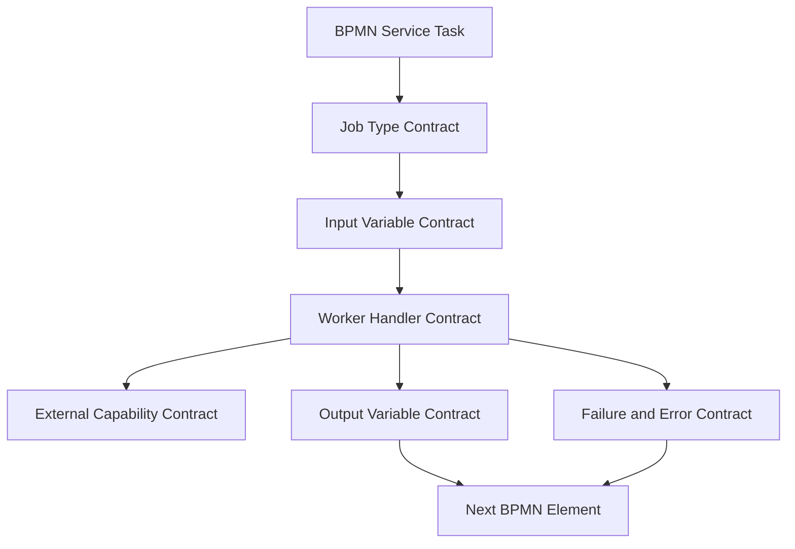
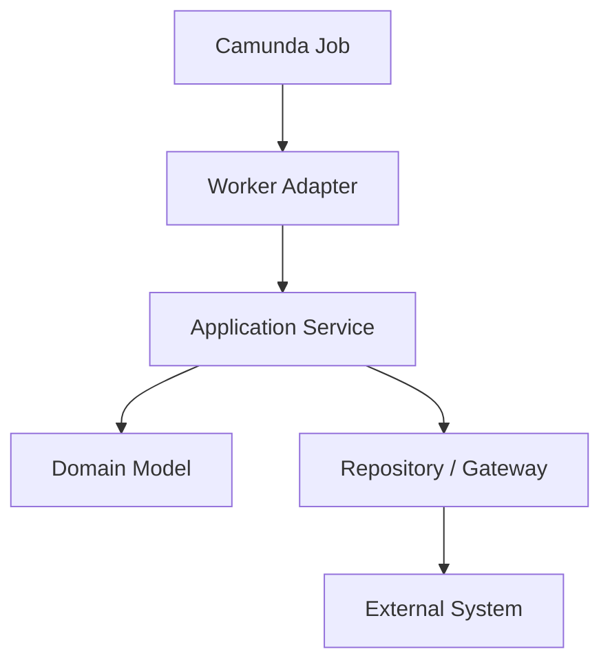
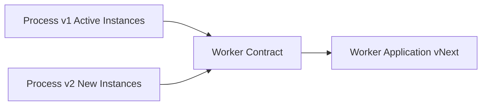
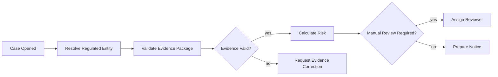

# Part 017 — Worker Design and Contract Boundaries

A Camunda 8 worker is not “some Java code behind a BPMN box”. It is a distributed integration boundary between durable process state and an independently deployable capability.

The simplest useful mental model is:

> A BPMN service task creates a job. The job type names a capability contract. A worker subscribes to that type, receives a constrained variable payload, performs one controlled side effect or decision, then returns an explicit result or failure.

That sentence is dense. It gives us the design invariant for this entire part:

> Design workers as contracts first, implementations second.

When this is done well, BPMN models stay readable, workers stay replaceable, retries are safe, versioning is manageable, incidents are actionable, and teams can evolve independently. When this is done poorly, the process becomes a distributed ball of mud: arbitrary variables, overloaded job types, hidden branching in Java, duplicate side effects, and incidents no one can diagnose.

Camunda’s own best-practice guidance for workers is directionally simple: write glue code in a worker application, separate handlers by task type, think about idempotency, and read/write as little process data as possible. This part turns that advice into a production design discipline.

---

## 1. What a Worker Really Owns

A worker owns **implementation of a capability**, not ownership of the process.

A worker may:

- validate data;
- call a downstream service;
- compute an enrichment;
- submit a command;
- evaluate an external system response;
- prepare a result for the process;
- translate a technical failure into a process-visible failure mode.

A worker should not own:

- end-to-end process control flow;
- business process ordering;
- long-running case lifecycle;
- escalation policy;
- compensation orchestration;
- hidden process state transitions;
- final authority over whether a process has advanced.

Those belong in BPMN, DMN, forms, human task policy, and domain services.

Bad worker:

```java
@JobWorker(type = "process-case")
public Map<String, Object> processCase(Map<String, Object> variables) {
    if (isHighRisk(variables)) {
        createInspection();
        sendNotice();
        waitForManualReviewSomehow();
    } else {
        autoApprove();
    }
    return Map.of("done", true);
}
```

Good worker:

```java
@JobWorker(type = "case-risk.calculate")
public RiskAssessmentResult calculateRisk(RiskAssessmentCommand command) {
    RiskAssessment assessment = riskService.assess(command.caseId(), command.subjectId());
    return RiskAssessmentResult.from(assessment);
}
```

The difference is not syntax. The difference is ownership.

The bad worker hides orchestration. The good worker exposes a capability result that BPMN can route.

---

## 2. Contract Layers

A production service task has several contracts stacked together.



Each layer must be explicit.

| Layer | Question | Failure If Ignored |
|---|---|---|
| BPMN service task | What process step is this? | Model becomes vague and unreviewable |
| Job type | Which capability handles this job? | Workers accidentally compete or break each other |
| Input variables | What does the worker require? | Runtime incident, null bugs, excessive payload |
| Worker handler | What is the Java method allowed to do? | Hidden orchestration and side effects |
| External capability | Which downstream contract is called? | Coupling and retry hazards |
| Output variables | What does the process need next? | Variable pollution and data races |
| Failure/error | How does the process react? | Incidents without resolution path |

The practical rule:

> If a worker contract cannot be described without reading its Java method body, the process application is under-designed.

---

## 3. Job Type Is a Public API

The job type is often treated as a string. That is too weak.

A job type is a **public API name** consumed by:

- BPMN modelers;
- Java worker applications;
- deployment pipelines;
- observability dashboards;
- incident handlers;
- platform governance;
- sometimes multiple teams.

Camunda service tasks use a job type to determine which workers can activate jobs. That means the job type is the routing key between process model and implementation.

### 3.1 Naming Strategy

Prefer names that encode business capability, not implementation detail.

Good:

```text
case-risk.calculate
evidence-package.validate
notice.generate-draft
inspection.schedule
payment-obligation.register
sanction-proposal.prepare
```

Risky:

```text
javaDelegate1
callRestApi
processData
handleTask
caseWorker
submit
```

A useful naming template:

```text
<domain-context>.<capability>.<verb>
```

Examples:

```text
enforcement-case.open
regulated-entity.resolve-profile
evidence.validate-package
review.assign-officer
notice.issue
appeal.register
```

For platform-level shared workers:

```text
document.render-template
notification.send-email
audit.append-event
identity.resolve-user
```

### 3.2 Avoid Encoding Runtime Data in Job Type

Do not do this:

```text
send-email-high-priority
send-email-low-priority
send-email-for-region-a
send-email-for-region-b
```

Use a stable job type and pass business options through variables or headers:

```text
notification.send-email
```

With input:

```json
{
  "priority": "HIGH",
  "region": "ID-JK",
  "templateCode": "ENFORCEMENT_NOTICE_V3"
}
```

Reason:

- job type cardinality affects worker configuration and observability;
- model changes become expensive;
- dynamic routing becomes string-sprawl;
- worker deployments become brittle.

### 3.3 Version in Job Type?

Use version suffixes only for **breaking worker contract changes**.

Acceptable:

```text
evidence.validate-package.v2
```

Avoid versioning for small compatible changes:

```text
evidence.validate-package.v17
```

A job type version is a major API boundary. It should mean:

- old and new process instances may run at the same time;
- old worker may remain alive until old instances drain;
- dashboards and runbooks distinguish the two;
- contract tests exist for both.

Better default:

- keep the job type stable;
- evolve inputs backward-compatibly;
- add optional fields;
- keep old output fields until no active consumers remain;
- use process versioning for model evolution;
- introduce a new job type only when old and new semantics cannot safely coexist.

---

## 4. BPMN Element Name vs Job Type

A BPMN element has a visible name and a technical job type. They should not always be identical.

Example:

```text
BPMN label: Validate Evidence Package
Job type: evidence-package.validate
```

The label is for process readability. The type is for worker routing.

Good labels:

- start with a verb;
- describe business intent;
- remain understandable to non-Java stakeholders;
- avoid implementation mechanisms.

Good job types:

- are stable;
- are unique;
- are machine-oriented;
- express capability ownership;
- avoid whitespace and presentation language.

A model review should check both.

---

## 5. Input Contract: The Worker Should Not Receive the Universe

By default, it is easy to give a worker too much process data. This is a production smell.

A worker should receive the smallest payload required to perform the capability.

Bad input shape:

```json
{
  "case": { "...": "large nested object" },
  "applicant": { "...": "full profile" },
  "evidence": { "...": "all evidence metadata" },
  "reviewHistory": ["..."],
  "internalFlags": { "...": "everything" },
  "draftDocuments": { "...": "large data" }
}
```

Good input shape:

```json
{
  "caseId": "CASE-2026-000091",
  "evidencePackageId": "EVP-8812",
  "validationPolicy": "ENFORCEMENT_EVIDENCE_V4"
}
```

Why small input matters:

- less accidental coupling;
- less variable serialization overhead;
- easier contract testing;
- lower leakage of sensitive data;
- fewer backward compatibility hazards;
- clearer worker ownership;
- smaller incident context;
- easier replay reasoning.

### 5.1 Use BPMN Input Mappings

Input mappings transform process variables into the worker-local contract.

Conceptually:


Example mapping intent:

```text
source: =case.id
target: caseId

source: =evidence.packageId
target: evidencePackageId

source: ="ENFORCEMENT_EVIDENCE_V4"
target: validationPolicy
```

The worker then receives a small command object:

```java
public record ValidateEvidencePackageCommand(
    String caseId,
    String evidencePackageId,
    String validationPolicy
) {}
```

And handler:

```java
@JobWorker(type = "evidence-package.validate", fetchVariables = {
    "caseId",
    "evidencePackageId",
    "validationPolicy"
})
public ValidateEvidencePackageResult validate(ValidateEvidencePackageCommand command) {
    return validationService.validate(command);
}
```

This keeps the Java method honest.

### 5.2 `fetchVariables` Is Not a Substitute for a Contract

`fetchVariables` reduces what the worker receives. It does not define semantic meaning.

This is only a transport optimization:

```java
@JobWorker(type = "notice.issue", fetchVariables = {"caseId", "noticeTemplate"})
```

The real contract should also exist in:

- BPMN input mappings;
- Java command DTO;
- validation rules;
- contract tests;
- runbook documentation;
- versioning policy.

---

## 6. Output Contract: Return Only What the Process Needs

A worker should not dump downstream responses into process variables.

Bad:

```java
return Map.of("externalSystemFullResponse", response);
```

Good:

```java
return new IssueNoticeResult(
    response.noticeId(),
    response.status(),
    response.issuedAt(),
    response.deliveryChannel()
);
```

Then map output into the process shape.

Example output object:

```java
public record IssueNoticeResult(
    String noticeId,
    String status,
    OffsetDateTime issuedAt,
    String deliveryChannel
) {}
```

Result variable design:

```json
{
  "notice": {
    "id": "NTC-2026-9012",
    "status": "ISSUED",
    "issuedAt": "2026-06-28T10:15:30Z",
    "deliveryChannel": "EMAIL"
  }
}
```

Avoid:

- returning raw HTTP responses;
- returning stack traces as variables;
- returning binary payloads;
- returning secrets;
- returning internal DTOs that mirror downstream schemas;
- merging temporary worker data into root variables.

### 6.1 Output Mapping as Anti-Pollution Layer

Without output discipline, variables become a shared mutable junk drawer.

Use output mapping to transform job variables before merging them into the process instance.


This has a strong architectural benefit:

> The worker can change internal response shape while the process variable contract remains stable.

---

## 7. Headers: Static Configuration, Not Business State

Camunda service task headers can pass static parameters to workers. Use them as configuration hints, not dynamic domain state.

Good header use:

```text
templateCode = ENFORCEMENT_NOTICE_V3
channel = EMAIL
maxAttachmentCount = 10
```

Bad header use:

```text
caseId = CASE-123
subjectName = John Doe
amount = 100000
```

Why?

Headers are modeled with the BPMN element. They are static relative to the model. Business state belongs in variables or domain storage.

Good worker pattern:

```java
@JobWorker(type = "notice.generate-draft")
public GenerateNoticeDraftResult generate(
    GenerateNoticeDraftCommand command,
    ActivatedJob job
) {
    String templateCode = job.getCustomHeaders().get("templateCode");
    return noticeDraftService.generate(command.caseId(), templateCode);
}
```

Header rules:

- no secrets;
- no per-instance mutable business state;
- no user input;
- no large JSON blobs;
- no environment-specific URLs if they can be externalized in application configuration;
- no hidden branching matrix that should be visible in BPMN/DMN.

---

## 8. Worker as Adapter, Not Domain Core

In well-structured Java systems, workers sit at the application boundary.



The worker adapter should:

- deserialize and validate command;
- call one application service;
- map domain result to process result;
- map known exceptions to BPMN error or technical failure;
- add observability context.

The worker adapter should not:

- contain domain rules;
- build SQL directly;
- orchestrate many unrelated downstream systems;
- parse large dynamic maps everywhere;
- know about every BPMN path;
- decide high-level lifecycle transitions.

Example:

```java
@Component
public class EvidencePackageWorker {

    private final EvidencePackageApplicationService service;

    public EvidencePackageWorker(EvidencePackageApplicationService service) {
        this.service = service;
    }

    @JobWorker(type = "evidence-package.validate")
    public ValidateEvidencePackageResult validate(ValidateEvidencePackageCommand command) {
        return service.validate(command);
    }
}
```

The application service owns domain use case semantics:

```java
@Service
public class EvidencePackageApplicationService {

    public ValidateEvidencePackageResult validate(ValidateEvidencePackageCommand command) {
        EvidencePackage pkg = evidenceRepository.get(command.evidencePackageId());
        ValidationReport report = policyEngine.validate(pkg, command.validationPolicy());

        return new ValidateEvidencePackageResult(
            report.status().name(),
            report.findings(),
            report.policyVersion()
        );
    }
}
```

This keeps the worker replaceable.

---

## 9. Error Contract

Every worker needs an explicit failure taxonomy.

At minimum:

| Situation | Worker Response | BPMN Reaction |
|---|---|---|
| Temporary downstream outage | fail job with retries/backoff | retry, possibly incident |
| Rate limit | fail job with backoff | retry later |
| Invalid technical payload | fail job, maybe incident | human fix or model fix |
| Known business rejection | throw BPMN error | modeled error path |
| Domain state conflict that business can handle | throw BPMN error or return status | modeled path |
| Duplicate side effect detected | complete job idempotently | continue |
| Irrecoverable programmer bug | fail job to incident | engineer investigation |

Do not collapse these into one exception handler.

Bad:

```java
catch (Exception e) {
    throw new RuntimeException(e);
}
```

Better conceptual mapping:

```java
try {
    return service.issueNotice(command);
} catch (DuplicateNoticeException e) {
    return IssueNoticeResult.alreadyIssued(e.noticeId());
} catch (RecipientNotEligibleException e) {
    throw BpmnErrors.recipientNotEligible(e.reasonCode());
} catch (RateLimitException e) {
    throw TechnicalFailure.retryable("Downstream rate limited", e);
} catch (DownstreamUnavailableException e) {
    throw TechnicalFailure.retryable("Notice system unavailable", e);
}
```

In Camunda terms:

- technical failure should usually fail the job;
- a known business condition should be modeled as BPMN error or explicit output status;
- failing a job with retries exhausted can create an incident;
- incidents need meaningful diagnostic details.

### 9.1 BPMN Error Codes as API

BPMN error codes are also contract names.

Good:

```text
RECIPIENT_NOT_ELIGIBLE
EVIDENCE_PACKAGE_INVALID
CASE_ALREADY_CLOSED
NOTICE_REQUIRES_MANUAL_APPROVAL
```

Bad:

```text
ERROR
FAIL
EXCEPTION
400
IllegalStateException
```

A BPMN error code should be:

- stable;
- business-readable;
- documented;
- handled in the model;
- test-covered;
- not tied to Java exception class names.

---

## 10. Compatibility and Versioning

A deployed BPMN process may have long-running instances. A worker contract must support old and new instances simultaneously.

This is the core versioning problem:



If `Process v1` and `Process v2` use the same job type, the worker must remain compatible with both.

### 10.1 Compatible Changes

Usually safe:

- add optional input field;
- add output field that consumers ignore;
- accept additional enum value only if old behavior is preserved;
- make validation more tolerant;
- add a new custom header with default value;
- improve retry behavior without changing business outcome;
- enrich logs/metrics.

### 10.2 Breaking Changes

Usually unsafe:

- remove required input field;
- rename input field;
- change output variable path;
- change business meaning of a status;
- change BPMN error code;
- change idempotency key semantics;
- change side effect target;
- change authorization assumptions;
- change worker from read-only to write-side-effect;
- change synchronous command into asynchronous request without process redesign.

Breaking changes need one of these strategies:

1. new job type;
2. new process version plus compatibility adapter;
3. model-level migration plan;
4. dual workers until old instances drain;
5. explicit incident/runbook handling for old versions.

### 10.3 Contract Envelope

For long-lived domains, use an explicit command envelope.

```java
public record WorkerCommand<T>(
    String contractVersion,
    String operationId,
    String processInstanceKey,
    String businessKey,
    T payload
) {}
```

Example:

```json
{
  "contractVersion": "1.1",
  "operationId": "CASE-2026-000091:VALIDATE_EVIDENCE:1",
  "processInstanceKey": "2251799813689751",
  "businessKey": "CASE-2026-000091",
  "payload": {
    "caseId": "CASE-2026-000091",
    "evidencePackageId": "EVP-8812"
  }
}
```

The envelope is not always necessary for small workers, but it is valuable when:

- the same capability is used by multiple processes;
- idempotency matters;
- auditability matters;
- worker contracts evolve frequently;
- there are multiple producer versions.

---

## 11. Ownership Model

A worker has at least three owners:

| Concern | Owner |
|---|---|
| Business meaning of the step | Process owner / product owner |
| BPMN model and contract | Process application team |
| Worker implementation | Capability service team or process app team |
| Runtime platform | Platform/SRE team |
| Incident resolution | Shared: process app + owning service |
| Compliance evidence | Process owner + audit/compliance function |

Ambiguous ownership creates operational pain.

For each job type, document:

```yaml
jobType: evidence-package.validate
businessMeaning: Validate submitted evidence package against enforcement evidence policy.
owningTeam: enforcement-platform
runtimeApplication: enforcement-process-workers
inputContract: ValidateEvidencePackageCommand v1
outputContract: ValidateEvidencePackageResult v1
bpmnErrors:
  - EVIDENCE_PACKAGE_INVALID
  - EVIDENCE_POLICY_NOT_APPLICABLE
technicalIncidents:
  - evidence repository unavailable
  - policy engine timeout
runbook: runbooks/evidence-package-validate.md
slo: 99% completed within 30s excluding downstream outage
```

This small metadata block prevents a lot of later confusion.

---

## 12. Observability Contract

A worker should emit stable observability signals.

Minimum dimensions:

- job type;
- process id;
- process instance key;
- element id;
- business key/case id if allowed;
- operation id/idempotency key;
- outcome;
- duration;
- retryable/non-retryable classification;
- downstream dependency;
- BPMN error code if thrown.

Avoid high-cardinality labels in metrics:

Bad metric label:

```text
caseId=CASE-2026-000091
subjectName=...
errorMessage=raw stack trace
```

Good metric labels:

```text
jobType=evidence-package.validate
outcome=success|bpmn_error|technical_failure|duplicate
errorCode=EVIDENCE_PACKAGE_INVALID
```

Logs can include more context if access-controlled. Metrics should stay bounded.

Example structured log:

```json
{
  "event": "worker.completed",
  "jobType": "evidence-package.validate",
  "processId": "enforcement-case-lifecycle",
  "processInstanceKey": "2251799813689751",
  "elementId": "ValidateEvidencePackageTask",
  "caseId": "CASE-2026-000091",
  "operationId": "CASE-2026-000091:VALIDATE_EVIDENCE:1",
  "durationMs": 431,
  "outcome": "VALID"
}
```

---

## 13. Testing Worker Contracts

Testing only Java methods is not enough. Testing only BPMN deployment is not enough. Contract testing links them.

### 13.1 Worker Unit Test

Validate pure Java behavior:

```java
@Test
void validatesEvidencePackage() {
    var command = new ValidateEvidencePackageCommand(
        "CASE-1",
        "EVP-1",
        "ENFORCEMENT_EVIDENCE_V4"
    );

    ValidateEvidencePackageResult result = worker.validate(command);

    assertThat(result.status()).isEqualTo("VALID");
}
```

### 13.2 BPMN Contract Test

Validate the model produces the expected worker input and consumes expected output.

Check:

- service task has expected job type;
- required input mappings exist;
- output mapping does not leak temporary variables;
- BPMN error boundary exists for declared error codes;
- retry count is intentional;
- headers are valid.

### 13.3 Consumer-Driven Contract Test

If multiple process models call the same worker, each process is a consumer.

Contract artifact:

```json
{
  "jobType": "notice.generate-draft",
  "requiredInputs": ["caseId", "templateCode"],
  "optionalInputs": ["language", "deliveryChannel"],
  "outputs": ["noticeDraft.id", "noticeDraft.status"],
  "bpmnErrors": ["TEMPLATE_NOT_APPLICABLE"]
}
```

Test it against BPMN model and Java DTO binding.

---

## 14. Static Review Checklist

For every service task, ask:

- Is the BPMN label business-readable?
- Is the job type stable and capability-oriented?
- Is the worker input minimal?
- Are required inputs mapped explicitly?
- Are outputs scoped and mapped intentionally?
- Are custom headers static and non-sensitive?
- Is retry count intentional?
- Are business errors modeled?
- Is incident behavior acceptable?
- Is idempotency key defined if side effects exist?
- Is the worker owner clear?
- Is runbook ownership clear?
- Is observability defined?
- Is version compatibility considered?
- Is the worker doing orchestration that belongs in BPMN?

Use this as a pull request checklist for BPMN changes.

---

## 15. Common Anti-Patterns

### 15.1 The God Worker

One job type handles many unrelated actions.

```text
case.process
```

Symptoms:

- huge switch statements;
- BPMN becomes decorative;
- Java owns routing;
- changes are risky;
- incidents require reading code.

Fix:

- split by capability;
- move routing to BPMN/DMN;
- create explicit job types.

### 15.2 The Map Soup Worker

Everything is `Map<String, Object>`.

Problem:

- no schema;
- no compile-time checks;
- fragile casting;
- poor testability;
- hidden variable dependencies.

Fix:

- typed command DTO;
- explicit validation;
- input mappings;
- contract tests.

### 15.3 The Full-State Worker

Worker receives the entire process variable document.

Problem:

- over-coupling;
- accidental data leakage;
- large payloads;
- hidden dependencies.

Fix:

- `fetchVariables`;
- input mapping;
- command object.

### 15.4 The Raw Response Worker

Worker returns raw downstream API response.

Problem:

- downstream schema leaks into process;
- sensitive data exposure;
- unstable variables;
- hard migration.

Fix:

- map to stable process result;
- use output mapping;
- store large details outside process variables.

### 15.5 The Hidden Business Error

Worker fails job for business condition.

Problem:

- incident is raised for normal business path;
- operations team sees false alarms;
- business process stops unnecessarily.

Fix:

- throw BPMN error;
- return explicit status;
- model alternate path.

### 15.6 The Infinite Compatibility Breaker

Worker changes input/output silently.

Problem:

- old process instances fail;
- incidents appear days/weeks later;
- rollback is difficult.

Fix:

- contract versioning;
- backward compatibility;
- dual workers;
- process version strategy.

---

## 16. Regulatory Workflow Example

Consider enforcement case lifecycle:



Service task contracts:

| BPMN Label | Job Type | Input | Output | Errors |
|---|---|---|---|---|
| Resolve Regulated Entity | `regulated-entity.resolve-profile` | `entityReference` | `regulatedEntity.id`, `status` | `ENTITY_NOT_FOUND` |
| Validate Evidence Package | `evidence-package.validate` | `caseId`, `evidencePackageId`, `policyCode` | `evidence.status`, `findings` | `EVIDENCE_PACKAGE_INVALID` |
| Calculate Risk | `case-risk.calculate` | `caseId`, `regulatedEntityId`, `evidenceSummary` | `risk.score`, `risk.level` | none or `RISK_POLICY_NOT_APPLICABLE` |
| Assign Reviewer | `review.assign-officer` | `caseId`, `riskLevel`, `region` | `review.assignee`, `review.assignmentId` | `NO_REVIEWER_AVAILABLE` |
| Prepare Notice | `notice.generate-draft` | `caseId`, `templateCode`, `riskLevel` | `noticeDraft.id`, `status` | `TEMPLATE_NOT_APPLICABLE` |

Notice what is not here:

- no `process-case` god task;
- no Java method deciding whole lifecycle;
- no raw entity profile dump;
- no hidden user assignment policy inside random code;
- no business invalidity represented as technical failure.

---

## 17. Worker Contract Template

Use this template for production job types.

```md
# Worker Contract: <job-type>

## Business Meaning

What business capability does this worker implement?

## Owner

- Business owner:
- Engineering owner:
- Runtime application:
- Runbook:

## BPMN Usage

- Process IDs:
- Element IDs:
- Retry policy:
- Boundary events:

## Input Contract

Required variables:

| Name | Type | Description |
|---|---|---|

Optional variables:

| Name | Type | Default | Description |
|---|---|---|---|

## Headers

| Name | Type | Description |
|---|---|---|

## Output Contract

| Name | Type | Description |
|---|---|---|

## BPMN Errors

| Code | Meaning | Modeled Handler |
|---|---|---|

## Technical Failures

| Failure | Retryable | Incident Action |
|---|---|---|

## Idempotency

- Idempotency key:
- Duplicate behavior:
- Side effects:

## Compatibility Policy

- Compatible changes:
- Breaking change strategy:

## Observability

- Metrics:
- Logs:
- Traces:
- Dashboards:
```

A team that maintains this template seriously will avoid most worker-level production failures.

---

## 18. Practice Exercise

Take one service task from a previous Camunda 7 process and rewrite it as a Camunda 8 worker contract.

Do not write Java first.

Write:

1. BPMN label;
2. job type;
3. input mapping;
4. output mapping;
5. business error codes;
6. retry policy;
7. idempotency key;
8. worker owner;
9. runbook action;
10. compatibility strategy.

Then write the Java DTO and handler.

The goal is not to produce more code. The goal is to make the runtime boundary explicit.

---

## 19. Key Takeaways

- A job type is a contract, not a casual string.
- A worker implements one capability; BPMN owns orchestration.
- Input variables should be minimal and intentionally mapped.
- Output variables should be stable and intentionally merged.
- Headers are for static configuration, not dynamic business state.
- BPMN error codes and output statuses are part of the business contract.
- Retry and incident semantics must be designed, not left to defaults.
- Long-running process instances make backward compatibility mandatory.
- Typed Java DTOs, contract tests, and runbooks are production necessities.
- The best workers are boring adapters around explicit domain capabilities.

---

## References

- Camunda Docs — Service tasks: https://docs.camunda.io/docs/components/modeler/bpmn/service-tasks/
- Camunda Docs — Variables: https://docs.camunda.io/docs/components/concepts/variables/
- Camunda Docs — Data flow: https://docs.camunda.io/docs/components/modeler/bpmn/data-flow/
- Camunda Docs — Writing good workers: https://docs.camunda.io/docs/components/best-practices/development/writing-good-workers/
- Camunda Docs — Dealing with problems and exceptions: https://docs.camunda.io/docs/components/best-practices/development/dealing-with-problems-and-exceptions/
