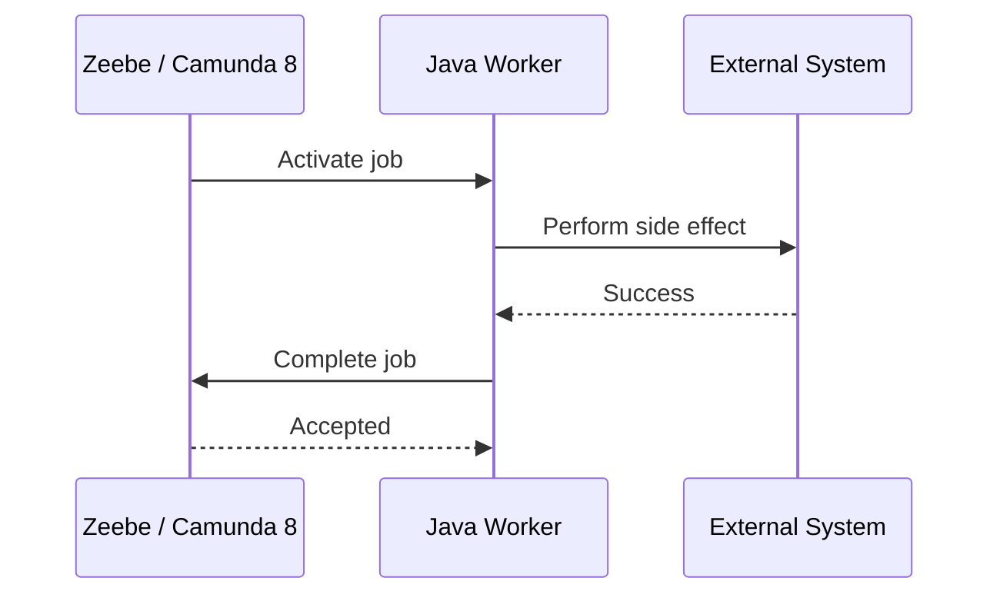
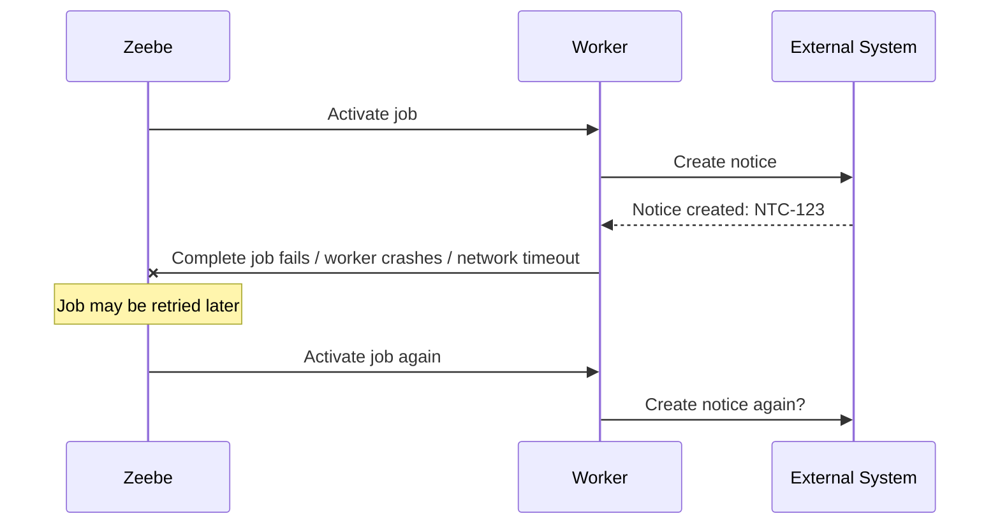
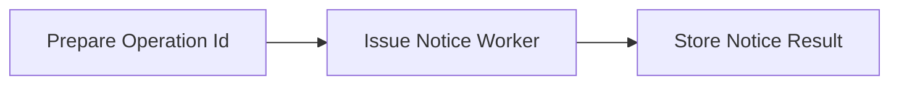
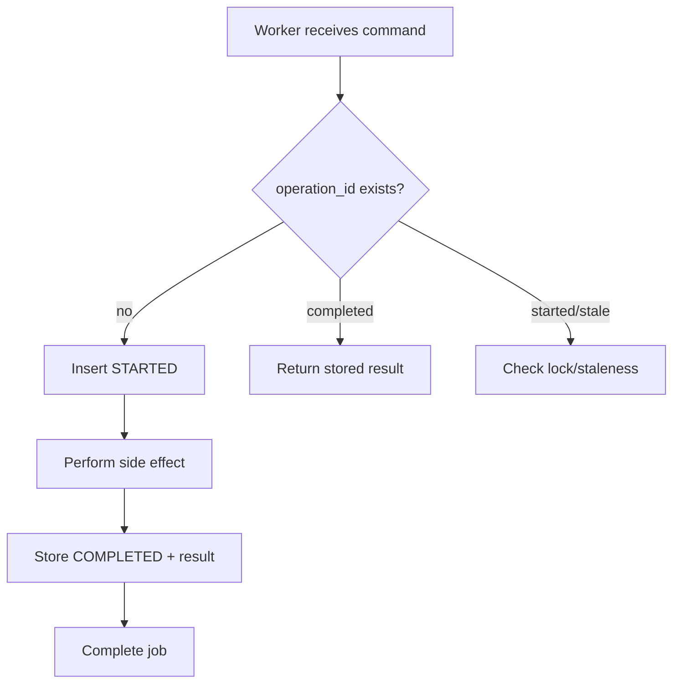
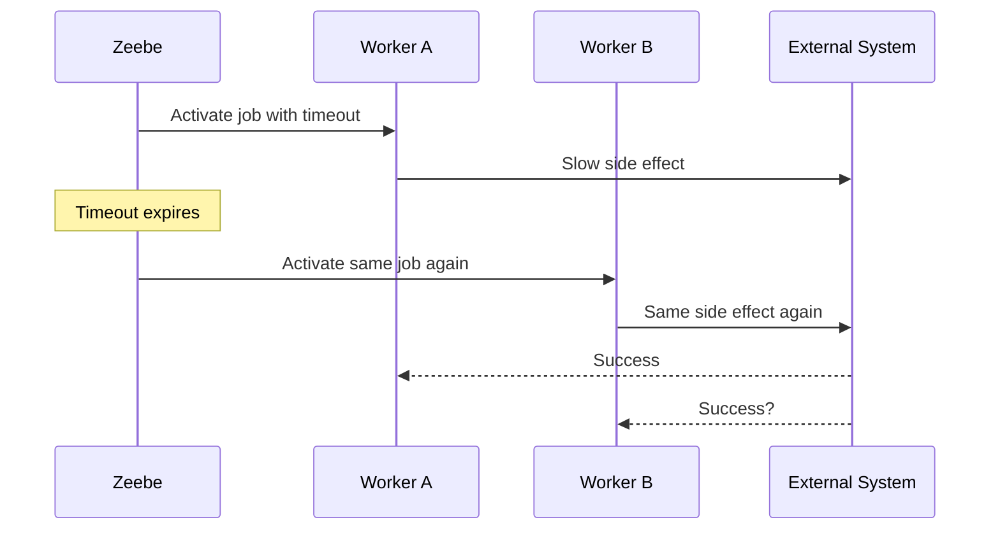
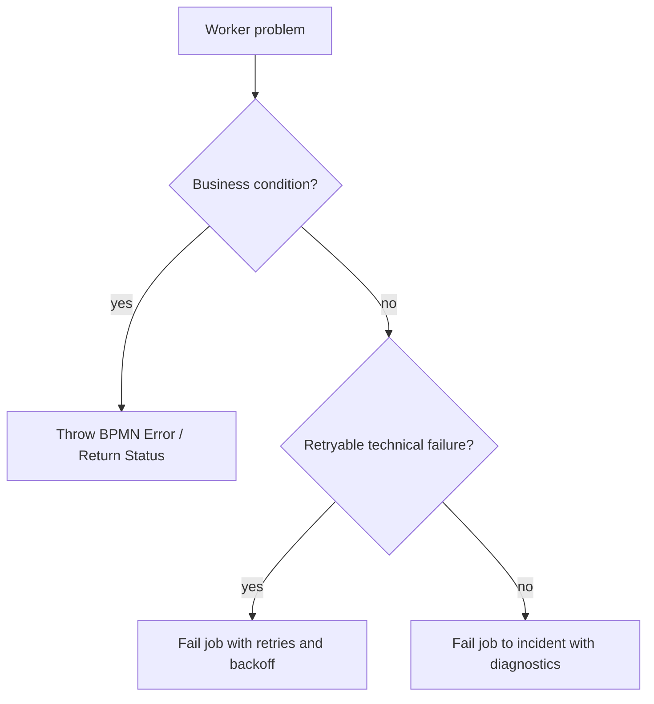
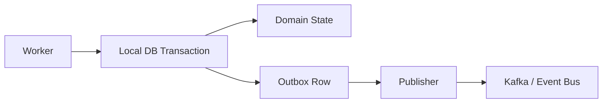
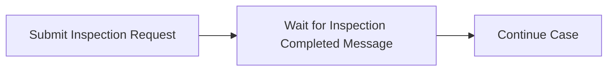

# Part 018 — Idempotency, Retries, and Side Effects

This is one of the most important production topics in Camunda 8.

A worker can crash. A network call can timeout. A downstream service can succeed while the worker fails before completing the job. A job can be retried. A worker can process the same logical business operation more than once. A process instance can remain alive for days, months, or years. Operators can manually retry incidents.

Therefore:

> Any worker that performs a side effect must be designed as if duplicate attempts are possible.

This does not mean every worker is literally executed twice. It means a production-safe design must not be broken if the same logical operation is attempted again after failure, timeout, retry, redeployment, or operator action.

Camunda’s best-practice guidance says to think about idempotency and to read/write as little data as possible from/to the process. The deeper reason is that process orchestration and external side effects do not share one atomic transaction.

---

## 1. The Fundamental Distributed Systems Problem

A service task involves at least two systems:



The happy path is simple. Production is not.

There is no single ACID transaction spanning:

- Zeebe job activation;
- worker execution;
- downstream HTTP call;
- database write;
- message publish;
- job completion command;
- process token continuation.

That creates failure windows.

---

## 2. Failure Windows

The dangerous failures happen between side effect and job completion.



If the worker naively calls `createNotice()` again, the organization may send two legal notices.

That is not a retry problem. That is a design problem.

### 2.1 Failure Matrix

| Failure Point | Side Effect Happened? | Job Completed? | Risk |
|---|---:|---:|---|
| Worker crashes before side effect | No | No | Safe retry |
| External call fails before commit | No or unknown | No | Need retry classification |
| External call succeeds, response lost | Maybe | No | Duplicate risk |
| External call succeeds, worker crashes | Yes | No | Duplicate risk |
| Job complete command fails after side effect | Yes | Unknown | Duplicate risk |
| Job completes, worker response lost | Yes | Maybe | Worker must not retry completion blindly without knowing state |
| Operator retries incident | Maybe | No | Duplicate risk |
| Worker timeout expires while still running | Maybe | No | Concurrent duplicate risk |

The invariant:

> Retrying the worker must converge to the same business outcome, not multiply the side effect.

---

## 3. What Idempotency Means

An operation is idempotent when repeating it with the same logical intent produces the same final result.

Examples:

| Operation | Naturally Idempotent? | Why |
|---|---:|---|
| Read case status | Yes | No mutation |
| Set case status to `UNDER_REVIEW` | Usually yes | Same state assignment |
| Append audit event | No | Duplicate audit rows possible |
| Send email | No | Recipient may receive duplicates |
| Create legal notice | No | Duplicate legal artifacts |
| Reserve funds | No | Double reservation possible |
| Upsert by stable key | Yes if constrained | Same key converges |
| Create if absent by operation id | Yes if enforced | Duplicate returns existing result |

In workflow systems, idempotency is not an academic property. It is the safety boundary between orchestration retry and real-world damage.

---

## 4. Idempotency Key Design

Every side-effecting worker needs a stable idempotency key.

A good idempotency key represents the **business operation**, not the technical attempt.

Bad keys:

```text
random UUID generated inside each worker attempt
current timestamp
job key only
HTTP request id generated per retry
```

Good keys:

```text
CASE-2026-000091:ISSUE_NOTICE:NOTICE_OF_BREACH
CASE-2026-000091:EVIDENCE_VALIDATE:EVP-8812:V4
PROCESS-2251799813689751:TASK-IssueNotice
SANCTION-8821:REGISTER_OBLIGATION:1
```

### 4.1 Candidate Key Parts

Useful components:

- process instance key;
- BPMN element id;
- case id or business key;
- command type;
- target entity id;
- version of the business operation;
- explicit attempt-independent operation id.

Avoid components that change on retry:

- generated UUID per attempt;
- worker host id;
- activation timestamp;
- retry count;
- job deadline;
- thread id.

### 4.2 Operation ID as Process Variable

A robust pattern is to create the operation id before the side-effecting worker.



Example variable:

```json
{
  "issueNoticeOperationId": "CASE-2026-000091:ISSUE_NOTICE:NOTICE_OF_BREACH"
}
```

Worker input:

```java
public record IssueNoticeCommand(
    String caseId,
    String noticeType,
    String recipientId,
    String operationId
) {}
```

Do not let the worker silently invent operation identity if the process needs auditability.

---

## 5. Idempotency Store Pattern

A common implementation is an idempotency table.

```sql
create table worker_operation_log (
    operation_id        varchar(200) primary key,
    job_type            varchar(200) not null,
    business_key        varchar(200) not null,
    process_instance_key varchar(64),
    status              varchar(40) not null,
    result_json         jsonb,
    error_code          varchar(100),
    created_at          timestamp not null,
    updated_at          timestamp not null
);
```

Status values:

```text
STARTED
COMPLETED
FAILED_RETRYABLE
FAILED_FINAL
```

Basic algorithm:



### 5.1 Java Sketch

```java
@JobWorker(type = "notice.issue")
public IssueNoticeResult issue(IssueNoticeCommand command) {
    return idempotency.execute(command.operationId(), "notice.issue", () -> {
        NoticeResponse response = noticeClient.issue(new IssueNoticeRequest(
            command.caseId(),
            command.noticeType(),
            command.recipientId(),
            command.operationId()
        ));

        return new IssueNoticeResult(
            response.noticeId(),
            response.status(),
            response.issuedAt()
        );
    });
}
```

`idempotency.execute()` should:

1. insert or load operation row;
2. return previous successful result if already completed;
3. prevent unsafe concurrent duplicate execution;
4. persist result before job completion;
5. classify stale in-progress operations;
6. expose diagnostics for incidents.

### 5.2 Transaction Boundary

Important:

```text
local DB transaction != Zeebe job transaction != external system transaction
```

The idempotency store helps convergence. It does not magically create a global transaction.

---

## 6. Downstream Idempotency Beats Local Guessing

The best idempotency boundary is often the downstream system itself.

If calling an external service, prefer APIs that accept an idempotency key:

```http
POST /notices
Idempotency-Key: CASE-2026-000091:ISSUE_NOTICE:NOTICE_OF_BREACH
```

Request body:

```json
{
  "caseId": "CASE-2026-000091",
  "noticeType": "NOTICE_OF_BREACH",
  "recipientId": "ENT-991"
}
```

Expected downstream behavior:

- first request creates notice;
- duplicate request with same key returns existing notice;
- duplicate request with same key but different payload is rejected;
- response includes stable notice id.

If downstream does not support idempotency:

- wrap it with your own idempotency service;
- use a unique business constraint where possible;
- query-before-create only if race-safe;
- redesign workflow to require human confirmation for dangerous duplicates;
- treat it as high-risk integration.

### 6.1 Query-Before-Create Is Not Enough

Naive pattern:

```java
if (!noticeClient.exists(caseId, noticeType)) {
    noticeClient.create(caseId, noticeType);
}
```

This has a race condition.

Two workers can both see “not exists” then both create.

Better:

- create with idempotency key;
- create with unique business key;
- use compare-and-set semantics;
- let downstream enforce uniqueness.

---

## 7. Worker Timeout and Concurrent Duplicate Risk

A worker activates a job for a limited time. If it does not complete/fail/error the job within the timeout, the job can become available again.

Risk:



This is why idempotency must protect the external operation, not just Java control flow.

Timeout design rules:

- set timeout longer than expected worker execution plus buffer;
- keep workers short and bounded;
- avoid blocking indefinitely;
- use external async pattern for long operations;
- use idempotency for all side effects;
- monitor timeout-related duplicates;
- do not “fix” long-running workers only by increasing timeout forever.

---

## 8. Retry Semantics

A worker can fail a job and specify remaining retries. When retries are exhausted, Camunda can raise an incident that requires intervention.

Retry design should be explicit.

### 8.1 Failure Classification

| Failure | Retry? | Example | Handling |
|---|---:|---|---|
| Network timeout | Yes | HTTP timeout | fail job with backoff |
| 503 service unavailable | Yes | downstream outage | fail job with backoff |
| 429 rate limit | Yes, longer backoff | quota exhausted | fail job with retry backoff |
| 400 invalid request due to model bug | No | missing required field | fail to incident with details |
| Business not eligible | No technical retry | recipient ineligible | BPMN error or explicit status |
| Duplicate already completed | Complete | existing notice found | return stored result |
| Optimistic lock conflict | Usually yes | concurrent domain update | retry with short backoff |
| Permission denied | Usually no | bad credentials | incident/runbook |
| Unknown exception | Limited retry | unexpected bug | retry briefly then incident |

### 8.2 Retry Backoff

Immediate retry can amplify outages.

Bad:

```text
Downstream outage → thousands of immediate retries → worse outage
```

Better:

```text
fail job with retryBackoff → allow dependency to recover → reduce pressure
```

Backoff policy should reflect failure type:

| Failure | Backoff |
|---|---|
| transient network blip | seconds |
| rate limit | minutes or value from `Retry-After` |
| downstream maintenance | longer interval |
| domain lock contention | short jittered delay |
| unknown bug | limited retries then incident |

Do not use one retry policy for every failure.

---

## 9. Incident Design

An incident is not just “something failed”. It is an operational work item.

A good incident has enough information for an operator or engineer to decide the next action.

Include:

- job type;
- process id;
- process instance key;
- BPMN element id;
- business key/case id;
- operation id;
- failure category;
- downstream dependency;
- last known side-effect status;
- retry count exhausted reason;
- suggested recovery action.

Avoid:

- raw unstructured stack traces only;
- sensitive payloads;
- huge JSON variables;
- generic messages like “failed”;
- business conditions that should have BPMN paths.

### 9.1 Incident Detail Variable

For final technical failure, persist a small diagnostic object.

```json
{
  "lastWorkerFailure": {
    "jobType": "notice.issue",
    "operationId": "CASE-2026-000091:ISSUE_NOTICE:NOTICE_OF_BREACH",
    "category": "DOWNSTREAM_UNAVAILABLE",
    "dependency": "notice-service",
    "safeToRetry": true,
    "sideEffectStatus": "UNKNOWN",
    "message": "Notice service timed out after 10s",
    "occurredAt": "2026-06-28T10:15:30Z"
  }
}
```

This is useful in Operate and in runbooks.

Do not store secrets or full request bodies.

---

## 10. BPMN Error vs Failed Job

This distinction is critical.

Use BPMN error when the process has a modeled business response.

Examples:

- evidence package invalid;
- recipient not eligible;
- reviewer unavailable;
- policy not applicable;
- case already closed;
- manual approval required.

Use failed job when the worker could not complete due to technical/execution failure.

Examples:

- downstream timeout;
- database unavailable;
- malformed technical contract;
- authentication failure;
- unexpected exception;
- dependency rate limit.

Do not use incidents for normal business outcomes.



---

## 11. Side Effect Classification

Not all workers need the same safety level.

| Worker Type | Example | Idempotency Requirement |
|---|---|---|
| Pure computation | calculate risk score from input | deterministic result enough |
| Read-only lookup | resolve entity profile | safe, but watch stale data |
| Local state mutation | mark case reviewed | unique operation or state transition guard |
| External command | issue notice | strict idempotency key |
| Message publish | publish case event | outbox/dedup required |
| Human notification | send email/SMS | strict dedup or acceptable duplicate policy |
| Financial/legal action | register obligation/sanction | strongest idempotency + audit |

A useful principle:

> The more irreversible the side effect, the stronger the idempotency boundary must be.

---

## 12. Outbox Pattern for Message Side Effects

If a worker needs to update local state and publish a message, use an outbox.

Bad:

```java
repository.save(caseUpdate);
eventPublisher.publish(event); // may fail after DB commit
```

Better:

```java
@Transactional
public Result updateCaseAndRecordEvent(Command command) {
    caseRepository.apply(command);
    outboxRepository.insert(new OutboxEvent(command.operationId(), eventPayload));
    return result;
}
```

Then a separate publisher sends outbox events reliably.



This separates:

- local consistency;
- external publication;
- retry of message sending;
- deduplication by event id.

### 12.1 Completing the Job

When using outbox, decide what job completion means.

Option A: complete after outbox row inserted.

- Good when process only needs guarantee that event will eventually publish.
- Requires strong outbox publisher SLO.

Option B: wait for external publish confirmation.

- Stronger immediate semantics.
- Increases worker runtime coupling.
- May require callback/message event instead.

For long or uncertain publication, prefer splitting into explicit BPMN steps.

---

## 13. Inbox/Dedup Pattern for Incoming Events

For workers or event routers that publish messages to Camunda, duplicate inbound events are possible.

Use an inbox table:

```sql
create table inbound_event_log (
    event_id        varchar(200) primary key,
    event_type      varchar(200) not null,
    business_key    varchar(200),
    received_at     timestamp not null,
    processed_at    timestamp,
    status          varchar(40) not null
);
```

Before publishing a Camunda message:

1. insert event id;
2. if duplicate, skip or return previous outcome;
3. derive message name and correlation key;
4. publish message with message id if supported by the API path;
5. mark processed.

This matters when upstream event brokers redeliver events.

---

## 14. Idempotent Completion Result

When a duplicate attempt detects a completed side effect, it should usually complete the job with the same result.

Example:

```java
public IssueNoticeResult issue(IssueNoticeCommand command) {
    Optional<IssueNoticeResult> existing = operationLog.findCompleted(command.operationId());
    if (existing.isPresent()) {
        return existing.get();
    }

    return operationLog.executeOnce(command.operationId(), () -> noticeClient.issue(command));
}
```

This allows process continuation after uncertain failure.

Do not fail a duplicate attempt just because the side effect already happened.

Bad:

```java
if (noticeAlreadyExists) {
    throw new IllegalStateException("Notice already exists");
}
```

Better:

```java
if (noticeAlreadyExistsForOperationId) {
    return existingNoticeResult;
}
```

---

## 15. Handling Unknown Outcome

The hardest case: the worker does not know whether the downstream side effect succeeded.

Example:

```text
POST /notices timed out after 10 seconds
```

Possible realities:

1. request never reached downstream;
2. request reached downstream but failed;
3. request reached downstream and succeeded;
4. response succeeded but network lost it.

Design options:

### 15.1 Downstream Supports Idempotency

Retry with same idempotency key.

Best outcome.

### 15.2 Downstream Has Query by Business Key

Query for existing result by operation id or business key.

Then:

- if found, complete with existing result;
- if not found, retry create;
- if ambiguous, fail with retry/backoff or incident.

### 15.3 Downstream Has No Safe Query

Treat as dangerous.

Possible responses:

- fail to incident with “sideEffectStatus=UNKNOWN”;
- require human reconciliation;
- build a wrapper service that creates idempotency;
- redesign integration.

Do not blindly retry irreversible operations with unknown outcome.

---

## 16. Practical Retry Wrapper

A worker-level retry wrapper should not hide all errors. It should classify them.

```java
public <T> T executeWithFailureMapping(String jobType, Supplier<T> action) {
    try {
        return action.get();
    } catch (BusinessRuleException e) {
        throw new BpmnBusinessError(e.code(), e.getMessage());
    } catch (RateLimitedException e) {
        throw new RetryableWorkerFailure(
            "RATE_LIMITED",
            e.retryAfter(),
            e
        );
    } catch (DownstreamUnavailableException e) {
        throw new RetryableWorkerFailure(
            "DOWNSTREAM_UNAVAILABLE",
            Duration.ofSeconds(30),
            e
        );
    } catch (InvalidWorkerContractException e) {
        throw new NonRetryableWorkerFailure(
            "INVALID_WORKER_CONTRACT",
            e
        );
    }
}
```

The exact exception integration depends on whether you use auto-completion, manual completion, Spring worker options, or direct Java client commands. The architectural principle is stable:

> classify first, then decide whether to complete, throw BPMN error, fail with retry, or fail to incident.

---

## 17. Manual Completion for Complex Side Effects

Auto-completion is convenient. For complex side effects, manual completion can make control clearer.

Use manual completion when:

- completion result depends on explicit idempotency store update;
- you need to complete only after a local transaction commits;
- you need precise failure command with retry/backoff;
- you need custom diagnostics;
- the worker framework’s default exception mapping is too coarse.

Pseudo-flow:

```java
@JobWorker(type = "notice.issue", autoComplete = false)
public void issue(IssueNoticeCommand command, JobClient client, ActivatedJob job) {
    try {
        IssueNoticeResult result = issueNoticeIdempotently(command);

        client.newCompleteCommand(job.getKey())
            .variables(result)
            .send()
            .join();

    } catch (RetryableFailure e) {
        client.newFailCommand(job.getKey())
            .retries(Math.max(job.getRetries() - 1, 0))
            .retryBackoff(e.backoff())
            .errorMessage(e.getMessage())
            .send()
            .join();

    } catch (BusinessFailure e) {
        client.newThrowErrorCommand(job.getKey())
            .errorCode(e.code())
            .errorMessage(e.getMessage())
            .send()
            .join();
    }
}
```

Do not copy this blindly. The important part is the explicit outcome mapping.

---

## 18. Retrying Long-Running External Work

A worker should not block for hours waiting for an external system.

Bad:

```text
Service task: Submit Inspection Request
Worker: calls inspection system and waits synchronously for completion for 2 hours
```

Better:



Worker does only submission:

```text
inspection.request-submit
```

External callback or event router publishes:

```text
InspectionCompleted
correlationKey = caseId or inspectionRequestId
```

This avoids:

- huge worker timeouts;
- duplicate concurrent work;
- blocked threads;
- invisible waiting;
- fragile retry semantics.

---

## 19. Retry Count Is a Business/Operational Decision

Do not pick retry count randomly.

Ask:

- How often does the dependency fail transiently?
- How expensive is each retry?
- Is the side effect idempotent?
- Is the failure likely to resolve automatically?
- How quickly does the business need escalation?
- Would repeated attempts violate rate limits?
- Is operator intervention useful?

Example policy:

| Job Type | Retries | Backoff | Rationale |
|---|---:|---|---|
| `regulated-entity.resolve-profile` | 5 | 30s, 1m, 5m | profile service transient failures common |
| `notice.issue` | 3 | 1m, 5m, 15m | side effect protected by idempotency key |
| `payment-obligation.register` | 1 | none/incident | legal-financial action needs reconciliation |
| `risk.calculate` | 3 | 10s | deterministic local/domain compute |
| `notification.send-email` | 5 | provider-specific | duplicate protected by operation id |

---

## 20. Regulatory Systems: Defensible Side Effects

In enforcement lifecycle systems, side effects are not just technical writes. They can have legal meaning.

Examples:

- issuing a notice;
- assigning an officer;
- recording evidence received;
- notifying regulated entity;
- imposing sanction;
- registering obligation;
- publishing decision;
- closing case.

For each side effect, define:

| Question | Why It Matters |
|---|---|
| What is the legal/business meaning? | Determines reversibility |
| What is the operation id? | Prevents duplicate action |
| What system is source of truth? | Prevents process variable misuse |
| Can it be retried safely? | Determines failure handling |
| Can it be compensated? | Determines BPMN design |
| How is it audited? | Supports defensibility |
| Who can repair it? | Determines incident runbook |
| What evidence is stored? | Supports later review/appeal |

Do not treat `complete job` as proof that the business side effect happened. Store evidence in the source system and return a reference.

---

## 21. Anti-Patterns

### 21.1 Random UUID Idempotency

Generating a new UUID inside the worker attempt is not idempotency.

```java
String operationId = UUID.randomUUID().toString();
```

Each retry creates a new operation.

Fix:

- derive operation id from process/business identity;
- create operation id before side effect;
- persist it.

### 21.2 Blind Retry of Irreversible Action

```java
catch (Exception e) {
    failJobWithRetry();
}
```

This may duplicate a legal notice, payment, sanction, or notification.

Fix:

- classify unknown outcome;
- query by idempotency key;
- incident if unsafe.

### 21.3 Treating Incident as Dead Letter Queue

Incident is not a normal business queue.

Fix:

- model expected business alternatives;
- use incidents for exceptional technical repair;
- provide runbooks.

### 21.4 Long Blocking Worker

Worker waits for external human/system completion.

Fix:

- split submit and wait;
- use message correlation;
- use timer/escalation path.

### 21.5 Process Variable as Source of Truth

Worker stores final legal artifact only as process variable.

Fix:

- store artifact in domain/document system;
- keep reference in process variable.

### 21.6 Retry Storm

All workers retry immediately during downstream outage.

Fix:

- backoff;
- circuit breaker;
- rate limiting;
- bulkhead;
- platform-level alerting.

---

## 22. Production Checklist

Before deploying a side-effecting worker, verify:

- Does it have a stable operation id?
- Is the operation id attempt-independent?
- Is downstream idempotent or wrapped?
- Can duplicate attempts return the same result?
- Are unknown outcomes handled explicitly?
- Is retry classification documented?
- Is BPMN error used for business alternatives?
- Is fail job used for technical failure?
- Is retry backoff configured intentionally?
- Is timeout longer than expected execution?
- Could timeout create concurrent duplicate attempts?
- Is there an incident diagnostic object?
- Is the source of truth outside process variables?
- Is the runbook clear about safe retry vs reconciliation?
- Are metrics/logs emitted with operation id?
- Are tests covering duplicate execution?

---

## 23. Practice Exercise

Design a worker for this scenario:

> A regulatory case process must issue a formal notice to a regulated entity. Duplicate notices are legally problematic. The notice service sometimes times out. The process must continue once a notice is confirmed issued.

Write:

1. job type;
2. operation id format;
3. input contract;
4. output contract;
5. downstream idempotency behavior;
6. retry policy;
7. unknown outcome handling;
8. BPMN error codes;
9. incident diagnostic object;
10. duplicate execution test cases.

Expected shape:

```text
jobType = notice.issue-formal
operationId = <caseId>:ISSUE_FORMAL_NOTICE:<noticeType>
```

Duplicate test cases:

- first attempt succeeds and completion succeeds;
- first attempt succeeds but completion fails;
- first attempt times out but downstream created notice;
- duplicate attempt returns existing notice;
- duplicate with different payload is rejected to incident;
- downstream unavailable retries with backoff;
- recipient ineligible throws BPMN error.

---

## 24. Key Takeaways

- Camunda retries and external side effects do not share one atomic transaction.
- Side-effecting workers must be idempotent by design.
- Idempotency key must represent the logical business operation, not the technical attempt.
- Unknown outcome is more dangerous than known failure.
- Downstream-supported idempotency is better than local guessing.
- Worker timeout can create concurrent duplicate execution risk.
- Retry strategy must classify failures, not blindly retry everything.
- BPMN error is for modeled business alternatives; failed job is for technical execution failure.
- Incidents need diagnostic context and runbooks.
- In regulated systems, side-effect defensibility matters as much as technical correctness.

---

## References

- Camunda Docs — Writing good workers: https://docs.camunda.io/docs/components/best-practices/development/writing-good-workers/
- Camunda Docs — Dealing with problems and exceptions: https://docs.camunda.io/docs/components/best-practices/development/dealing-with-problems-and-exceptions/
- Camunda Docs — Service tasks: https://docs.camunda.io/docs/components/modeler/bpmn/service-tasks/
- Camunda Docs — Fail job API: https://docs.camunda.io/docs/apis-tools/orchestration-cluster-api-rest/specifications/fail-job/
- Camunda Docs — Messages: https://docs.camunda.io/docs/components/concepts/messages/
