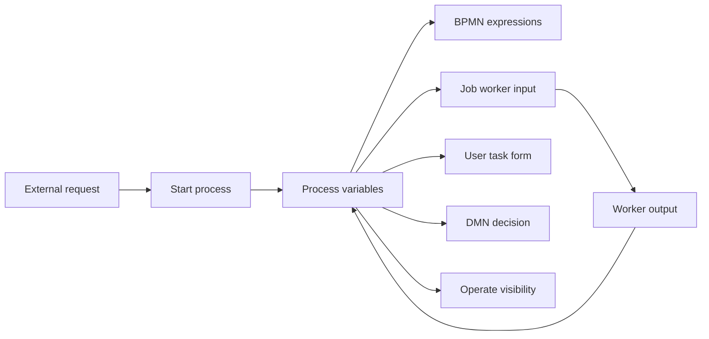
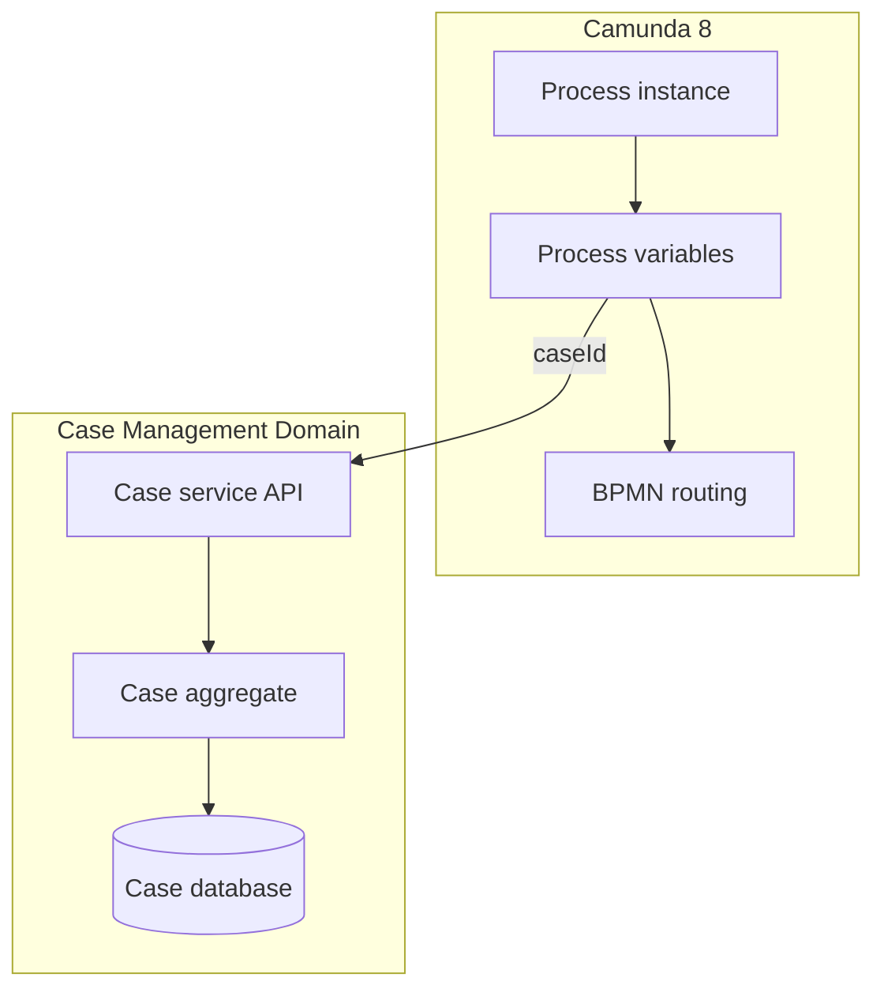
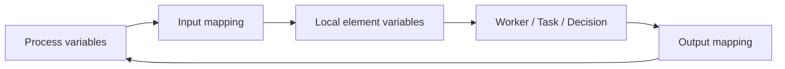
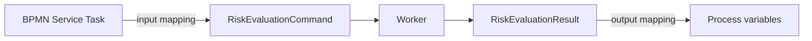
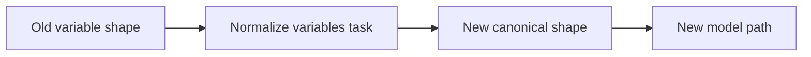
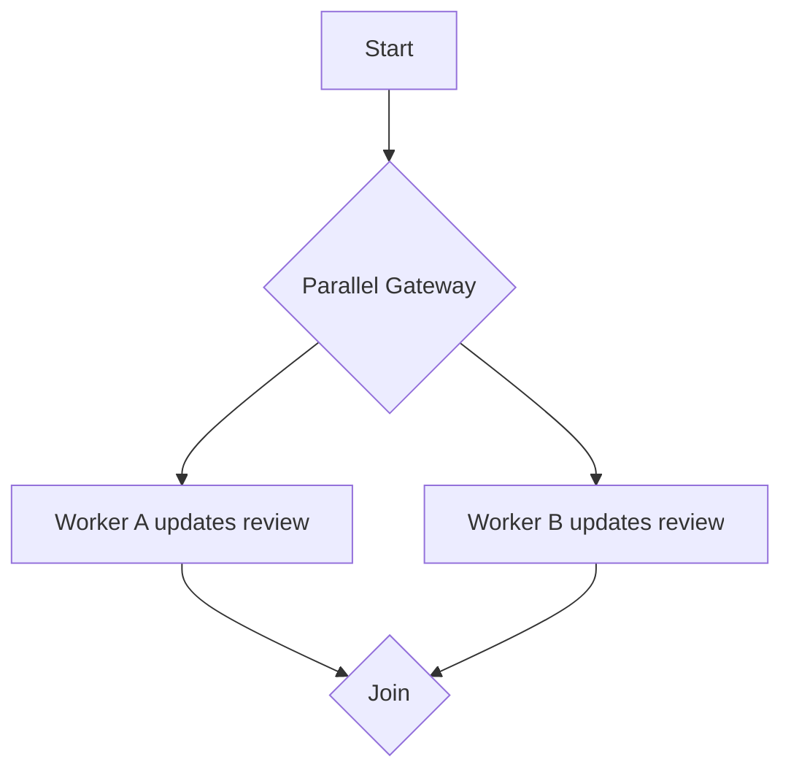
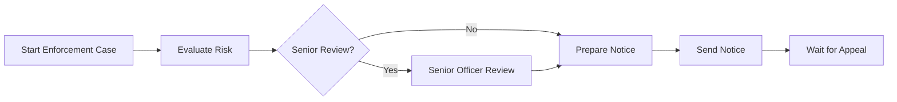

# Part 019 — Variable Modeling and Data Contracts

A Camunda 8 process instance is not your application database.

That sentence is the first invariant of production-grade variable modeling.

In Camunda 8, variables are the data carried by a process instance and made available to BPMN elements, expressions, mappings, jobs, user tasks, decisions, connectors, and APIs. They are essential. But if we treat them as the canonical domain store, we create brittle process models, oversized event streams, privacy risks, accidental coupling, slow debugging, unsafe migrations, and difficult incident recovery.

The goal of this part is to build the mental model needed to design variables as explicit contracts.

We want variables to answer:

- what does the process need to route correctly?
- what does the next worker need to perform its task?
- what does a human task need to render and complete safely?
- what does a decision need to evaluate deterministically?
- what must be auditable at process level?
- what must stay outside Camunda and be referenced by ID?

We do **not** want variables to become:

- a duplicate domain database;
- an unbounded JSON dump;
- a place for serialized Java objects;
- a dumping ground for API responses;
- an implicit integration contract;
- a long-term storage mechanism for documents, large payloads, secrets, or raw evidence blobs.

---

## 1. Kaufman Deconstruction

The subskill is **variable modeling for long-running process orchestration**.

Break it into five smaller skills:

| Subskill | Question | Failure If Ignored |
|---|---|---|
| Scope design | Where should the variable live? | Data leaks across unrelated elements |
| Contract design | What shape should the worker receive and return? | Workers depend on unstable global process data |
| Mapping design | How should data enter and exit elements? | Accidental overwrite, variable pollution |
| Evolution design | How does JSON change over time? | Old instances break after deployment |
| Governance design | What data is allowed in process state? | Privacy, audit, performance, compliance risk |

The important point: variable modeling is not syntax. It is architecture.

---

## 2. The Core Mental Model

A process instance is a long-running state machine. Variables are part of its state.



This means a variable is not just a Java value. It can affect:

- which path the process takes;
- which job is created;
- which worker can complete correctly;
- which user sees which form data;
- which incident is understandable;
- which audit trail is defensible;
- which old process instances continue to work after model changes.

A bad variable design becomes a distributed coupling mechanism.

A good variable design becomes a stable orchestration contract.

---

## 3. Camunda 8 Variable Basics

Camunda 8 variables are JSON-like process data. They can be primitive values or JSON objects.

Typical variable payload:

```json
{
  "caseId": "CASE-2026-000123",
  "subjectId": "SUBJ-9912",
  "risk": {
    "score": 82,
    "level": "HIGH",
    "evaluatedAt": "2026-06-28T09:15:00Z"
  },
  "review": {
    "required": true,
    "reason": "high_risk_score"
  }
}
```

What this is good for:

- routing;
- correlation;
- task rendering;
- decision inputs;
- concise process-level facts;
- references to external records.

What this is bad for:

- storing the full case file;
- storing large documents;
- storing raw downstream responses;
- storing secrets;
- storing Java object graphs;
- preserving every historical version of domain state.

### Key Difference From Camunda 7

Camunda 7 could store richer variable types, including serialized Java objects depending on configuration. Camunda 8 process variables should be treated as JSON data. That changes the application contract.

Instead of this Camunda 7-style mindset:

```java
execution.setVariable("case", complexJavaCaseObject);
```

Use this Camunda 8-style mindset:

```json
{
  "caseId": "CASE-2026-000123",
  "caseSnapshot": {
    "type": "ENFORCEMENT",
    "status": "UNDER_REVIEW",
    "riskLevel": "HIGH"
  }
}
```

And keep the full `Case` aggregate in the owning domain service.

---

## 4. Variables vs Domain State

A clean architecture separates process state from domain state.



### Process State

Process state answers:

- where is the process token?
- what decision was made for orchestration?
- what task is waiting?
- what message is expected?
- what correlation key should be used?
- what minimal facts are required for the next step?

### Domain State

Domain state answers:

- what is the authoritative case status?
- who owns the case?
- what evidence is attached?
- what historical decisions were made?
- what legal constraints apply?
- what domain invariant must always hold?

### Practical Rule

Use Camunda variables for **orchestration facts**.

Use domain services/databases for **authoritative business records**.

---

## 5. The Variable Classification Model

Before adding a variable, classify it.

| Class | Example | Store in Camunda? | Notes |
|---|---|---:|---|
| Correlation identity | `caseId`, `applicationId`, `subjectId` | Yes | Usually small, stable, high value |
| Routing fact | `riskLevel`, `reviewRequired` | Yes | Good for gateways and SLA paths |
| Human task input | `applicantName`, `caseSummary` | Sometimes | Prefer compact display snapshot |
| Decision input | `risk.score`, `priorViolations` | Yes | Keep deterministic and explicit |
| Worker input | `paymentId`, `documentRef` | Yes | Should be minimal contract |
| Worker output | `verificationStatus` | Yes | Avoid raw response dump |
| Domain aggregate | full `Case` object | No | Store in domain DB, reference by ID |
| Raw API response | full downstream JSON | Usually no | Normalize to process facts |
| Document binary | PDF/image/base64 | No | Store externally, use document reference |
| Secret | token/password/key | No | Use secret manager/runtime config |
| Large list | thousands of entities | Usually no | Use query by reference or batch process design |
| Audit event | every low-level history item | Usually no | Use domain/audit store; Camunda has execution history views |

A variable must earn its place in the process state.

---

## 6. Variable Scope

Variables can exist at process level or local scope.

The production question is:

> Who should be able to see and modify this variable?

If every element can see and overwrite every variable, the process becomes a shared mutable global object.

That is dangerous.

### Global Process-Level Variables

Good for:

- process identity;
- stable references;
- final outcome;
- facts needed across multiple phases;
- correlation keys;
- high-level status flags.

Examples:

```json
{
  "caseId": "CASE-2026-000123",
  "subjectId": "SUBJ-9912",
  "caseType": "ENFORCEMENT",
  "riskLevel": "HIGH",
  "reviewRequired": true
}
```

### Local Variables

Good for:

- worker-specific intermediate values;
- subprocess-local state;
- temporary decision inputs;
- multi-instance element data;
- task form local transformations.

Example:

```json
{
  "reviewPayload": {
    "reviewerGroup": "senior-enforcement-officers",
    "priorityReason": "high_risk_score"
  }
}
```

### Scope Smell

If a variable is used by one task only, it probably does not need to become global.

If a variable is used by many unrelated elements, check whether it is a real shared fact or accidental coupling.

---

## 7. Input and Output Mappings

Input/output mappings are the main tool for controlling variable flow.

Without mappings, workers and tasks tend to receive too much and return too much.

With mappings, each BPMN element has an explicit data boundary.



### Input Mapping

Input mapping creates or transforms local variables for an element.

Conceptually:

```text
source expression from process state -> target local variable
```

Example intent:

```text
= caseId -> investigationRequest.caseId
= risk.level -> investigationRequest.riskLevel
= applicant.name -> investigationRequest.displayName
```

The worker receives a clean input contract instead of the entire process variable bag.

### Output Mapping

Output mapping controls what comes back into the process instance.

Conceptually:

```text
source expression from local result -> target process variable
```

Example intent:

```text
= result.status -> investigation.status
= result.findingsSummary -> investigation.summary
= result.requiresEscalation -> escalation.required
```

### Why This Matters

By default, it is easy for worker output to merge into process variables. That is convenient in demos but unsafe in larger systems.

A worker might return:

```json
{
  "status": "APPROVED",
  "message": "OK",
  "debug": {
    "requestHeaders": {},
    "rawResponse": {}
  }
}
```

If this is blindly merged, your process state becomes polluted with implementation details.

Output mapping is the boundary that says:

> Only these facts matter to the process.

---

## 8. Contract-First Variable Design

A BPMN service task should have a data contract just like an API endpoint.

Bad worker contract:

```java
@JobWorker(type = "evaluate-risk")
public Map<String, Object> evaluate(final ActivatedJob job) {
    Map<String, Object> variables = job.getVariablesAsMap();
    // Reads whatever happens to exist.
    // Writes whatever feels useful.
    return Map.of("risk", callRiskEngine(variables));
}
```

This worker is coupled to the entire process.

Better worker contract:

```java
public record RiskEvaluationCommand(
    String caseId,
    String subjectId,
    String caseType,
    List<String> allegedViolationCodes
) {}

public record RiskEvaluationResult(
    String riskLevel,
    int riskScore,
    boolean seniorReviewRequired,
    String evaluationId
) {}
```

Worker:

```java
@JobWorker(type = "risk.evaluate.v1")
public RiskEvaluationResult evaluate(final RiskEvaluationCommand command) {
    var result = riskService.evaluate(
        command.caseId(),
        command.subjectId(),
        command.caseType(),
        command.allegedViolationCodes()
    );

    return new RiskEvaluationResult(
        result.level().name(),
        result.score(),
        result.requiresSeniorReview(),
        result.evaluationId()
    );
}
```

Then output mapping decides process state:

```text
result.riskLevel -> risk.level
result.riskScore -> risk.score
result.seniorReviewRequired -> review.seniorRequired
result.evaluationId -> risk.evaluationId
```

This creates a stable boundary:



---

## 9. Naming Variables

Variable names are architecture.

Bad names:

```json
{
  "data": {},
  "payload": {},
  "response": {},
  "status": "OK",
  "result": {}
}
```

These names are ambiguous. They become impossible to reason about across a 20-step process.

Better names:

```json
{
  "caseId": "CASE-2026-000123",
  "risk": {
    "level": "HIGH",
    "score": 82,
    "evaluationId": "RISK-EVAL-88219"
  },
  "investigation": {
    "required": true,
    "status": "PENDING_ASSIGNMENT"
  },
  "enforcementDecision": {
    "outcome": "PROCEED_TO_NOTICE",
    "decidedAt": "2026-06-28T10:15:00Z"
  }
}
```

### Naming Guidelines

Prefer:

- domain noun: `risk`, `investigation`, `notice`, `appeal`;
- precise boolean: `seniorReviewRequired`, not `flag`;
- process-level outcome: `enforcementDecision.outcome`;
- external reference: `documentRef`, `evaluationId`, `paymentIntentId`;
- timestamp with meaning: `noticeSentAt`, not `date`.

Avoid:

- generic `payload`;
- overloaded `status` at root;
- names tied to implementation: `apiResponse`, `serviceResult`;
- abbreviations only one team understands;
- names that hide legal/business meaning.

---

## 10. Status Variables Are Dangerous

A process instance already has execution state. The domain service also has domain state. Adding a variable named `status` creates ambiguity.

Which one is authoritative?

```json
{
  "status": "APPROVED"
}
```

Approved by whom? The process? The reviewer? The risk engine? The domain aggregate?

Better:

```json
{
  "risk": {
    "status": "EVALUATED",
    "level": "LOW"
  },
  "humanReview": {
    "outcome": "APPROVED"
  },
  "caseLifecycle": {
    "targetState": "NOTICE_PREPARATION"
  }
}
```

Even better: store the authoritative lifecycle status in the case service and keep only the process-relevant facts in Camunda.

---

## 11. Variable Granularity

There are two bad extremes:

### Extreme 1: One Giant Payload

```json
{
  "case": {
    "everything": "..."
  }
}
```

Problems:

- every task depends on the full structure;
- changes become risky;
- workers deserialize too much;
- Operate visibility becomes noisy;
- output updates can overwrite sibling data;
- large variable payloads hurt performance and readability.

### Extreme 2: Hundreds of Flat Variables

```json
{
  "caseId": "...",
  "caseType": "...",
  "riskScore": 82,
  "riskLevel": "HIGH",
  "riskReason1": "...",
  "riskReason2": "...",
  "reviewRequired": true,
  "reviewGroup": "...",
  "noticeTemplate": "..."
}
```

Problems:

- no conceptual grouping;
- name collisions;
- hard to understand ownership;
- weak schema evolution.

### Preferred: Small Domain-Oriented Objects

```json
{
  "caseRef": {
    "caseId": "CASE-2026-000123",
    "caseType": "ENFORCEMENT",
    "subjectId": "SUBJ-9912"
  },
  "risk": {
    "score": 82,
    "level": "HIGH",
    "evaluationId": "RISK-EVAL-88219"
  },
  "review": {
    "seniorRequired": true,
    "candidateGroup": "senior-enforcement-officers"
  }
}
```

This balances readability, mapping, and ownership.

---

## 12. Data Minimization

Production rule:

> The best process variable is the smallest variable that preserves correct orchestration.

Ask these questions before storing data:

1. Does BPMN routing need this?
2. Does a later worker need this exact value?
3. Does a human task need to render this?
4. Does a DMN decision need this?
5. Does an operator need this to resolve incidents?
6. Is this safe to expose in process visibility tools?
7. Could this be fetched from the owning service by ID?
8. Is this value stable enough for long-running instances?

If the answer is mostly no, do not store it as a variable.

---

## 13. Large Payload Risks

Large variables are a production smell.

Examples:

- full PDF content;
- base64 image;
- thousands of records;
- full REST response;
- full customer profile;
- every evidence item;
- verbose calculation trace;
- HTML email body;
- large generated document draft.

Risks:

- increased network transfer to workers;
- slower variable serialization/deserialization;
- noisy incident analysis;
- sensitive data exposure;
- harder backup/retention governance;
- bigger event/state footprint;
- more expensive query and export behavior;
- harder schema migration.

### Better Pattern: Reference + Snapshot

```json
{
  "caseId": "CASE-2026-000123",
  "evidenceBundle": {
    "bundleId": "EVB-77192",
    "documentCount": 14,
    "classification": "CONFIDENTIAL",
    "latestVersion": 3
  }
}
```

The process knows enough to route and display. The document/evidence service owns the payload.

---

## 14. Sensitive Data Handling

Do not store secrets in process variables.

Avoid:

```json
{
  "accessToken": "eyJ...",
  "password": "...",
  "apiKey": "...",
  "privateKey": "..."
}
```

Also be careful with:

- personally identifiable information;
- health/financial data;
- investigation-sensitive data;
- legal privilege information;
- internal risk scores;
- raw evidence;
- protected whistleblower identity;
- confidential document content.

### Safer Pattern

```json
{
  "caseId": "CASE-2026-000123",
  "subjectRef": {
    "subjectId": "SUBJ-9912",
    "displayNameMasked": "A***** H*****"
  },
  "documentRef": {
    "documentId": "DOC-77891",
    "classification": "RESTRICTED"
  }
}
```

Workers retrieve sensitive details from authorized services at execution time.

### Visibility Invariant

Assume variables may be visible to:

- operators;
- support engineers;
- process admins;
- audit tooling;
- exported data consumers;
- logs or traces if carelessly instrumented.

Therefore, variables must be intentionally classified.

---

## 15. Variable Ownership

Every variable should have an owner.

| Variable | Owner | Writer | Readers |
|---|---|---|---|
| `caseRef` | Case platform | Start process adapter | Most steps |
| `risk` | Risk service | `risk.evaluate.v1` worker | Gateway, review task |
| `review` | Review process | DMN / assignment step | User task, SLA step |
| `notice` | Notice service | `notice.prepare.v1` worker | Send notice step |
| `appeal` | Appeal process | Message correlation / user task | Appeal subprocess |

Without ownership, any worker can mutate anything.

That is not orchestration. That is global state chaos.

---

## 16. Schema Evolution

Long-running process instances may survive multiple deployments.

Therefore variable schemas must evolve safely.

### Dangerous Change

Old process variable:

```json
{
  "riskLevel": "HIGH"
}
```

New BPMN expression:

```feel
=risk.level = "HIGH"
```

Old instances do not have `risk.level`. They may fail, route incorrectly, or create incidents depending on expression behavior.

### Safer Evolution

For a transition period, support both:

```feel
=if risk != null and risk.level != null then risk.level = "HIGH" else riskLevel = "HIGH"
```

Better: migrate old instances or introduce a normalization task.



### Versioned Contract Pattern

```json
{
  "risk": {
    "schemaVersion": 2,
    "score": 82,
    "level": "HIGH",
    "evaluationId": "RISK-EVAL-88219"
  }
}
```

Use schema version when:

- the object is shared by multiple workers;
- old instances remain alive for a long time;
- downstream behavior changes by schema;
- audit interpretation depends on field meaning.

Do not version every tiny object unnecessarily. Version only meaningful contracts.

---

## 17. Backward-Compatible Variable Changes

Generally safe:

- add optional field;
- add new nested object while keeping old field;
- add output variable consumed only by later new tasks;
- introduce new variable with default behavior;
- make worker tolerant of missing optional values.

Risky:

- rename field;
- change enum value;
- change type from string to object;
- move field to nested object without bridge;
- remove field used by old instances;
- change boolean semantics;
- change timestamp timezone/format;
- change meaning of an existing field.

### Enum Evolution

Bad:

```json
{
  "riskLevel": "H"
}
```

Better:

```json
{
  "risk": {
    "level": "HIGH"
  }
}
```

Enums should be readable and stable.

For regulatory systems, enum values may appear in audit logs, reports, appeals, and legal explanations. Do not casually rename them.

---

## 18. Variable Contract Documentation

Each production process should document its top-level variable contract.

Example:

```md
## Process Variable Contract: Enforcement Intake

### caseRef
Owner: case-platform
Writer: start adapter
Shape:
{
  "caseId": "string",
  "caseType": "ENFORCEMENT | INSPECTION | COMPLAINT",
  "subjectId": "string"
}
Required: yes
Mutable: no after start

### risk
Owner: risk-service
Writer: risk.evaluate.v1
Shape:
{
  "schemaVersion": 1,
  "score": "number",
  "level": "LOW | MEDIUM | HIGH | CRITICAL",
  "evaluationId": "string"
}
Required: after risk evaluation
Mutable: yes, only by risk service tasks
```

This document is not bureaucracy. It prevents hidden coupling.

---

## 19. Java DTO Design

Use typed DTOs at worker boundaries.

### Input DTO

```java
public record NoticePreparationCommand(
    CaseRef caseRef,
    RiskSummary risk,
    ReviewOutcome reviewOutcome
) {
    public NoticePreparationCommand {
        Objects.requireNonNull(caseRef, "caseRef is required");
        Objects.requireNonNull(reviewOutcome, "reviewOutcome is required");
    }
}

public record CaseRef(
    String caseId,
    String caseType,
    String subjectId
) {}

public record RiskSummary(
    Integer score,
    String level,
    String evaluationId
) {}

public record ReviewOutcome(
    String decision,
    String reviewerId,
    String decidedAt
) {}
```

### Output DTO

```java
public record NoticePreparationResult(
    String noticeId,
    String templateId,
    String status,
    String preparedAt
) {}
```

### Worker

```java
@JobWorker(type = "notice.prepare.v1")
public NoticePreparationResult prepareNotice(final NoticePreparationCommand command) {
    var notice = noticeService.prepare(
        command.caseRef().caseId(),
        command.reviewOutcome().decision(),
        command.risk() == null ? null : command.risk().level()
    );

    return new NoticePreparationResult(
        notice.id(),
        notice.templateId(),
        notice.status().name(),
        notice.preparedAt().toString()
    );
}
```

The worker output should be intentionally small.

---

## 20. Validation Boundary

There are multiple places to validate data:

| Layer | Responsibility |
|---|---|
| Form validation | User input shape and required fields |
| Worker input validation | Required technical/business preconditions |
| DMN validation | Decision input completeness |
| Domain service validation | Authoritative domain invariants |
| BPMN gateway | Routing based on already-valid facts |

Do not put domain invariants only in FEEL expressions.

Bad:

```feel
=case.status = "OPEN" and case.balance > 0 and case.owner.active = true
```

Better:

- domain service validates case can proceed;
- worker returns explicit process fact;
- BPMN routes on that fact.

```json
{
  "caseEligibility": {
    "eligible": true,
    "reason": "all_preconditions_satisfied"
  }
}
```

Gateway:

```feel
=caseEligibility.eligible = true
```

---

## 21. Worker Output Normalization

Workers should normalize external outputs into process facts.

Bad:

```java
return externalRiskApiClient.evaluate(request);
```

This leaks downstream schema into process state.

Better:

```java
var response = externalRiskApiClient.evaluate(request);

return new RiskEvaluationResult(
    mapScore(response),
    mapLevel(response),
    response.assessmentId(),
    response.reasons().stream()
        .map(this::mapReasonCode)
        .toList()
);
```

The BPMN process should not know the downstream API's internal payload.

---

## 22. Variable Updates and Concurrency

Parallel paths can update variables.



If both workers write to the same variable object, the final result may be surprising depending on merge behavior and timing.

Avoid shared writes in parallel paths.

### Better Pattern

Give each branch its own output namespace:

```json
{
  "review": {
    "legal": {
      "outcome": "APPROVED"
    },
    "technical": {
      "outcome": "NEEDS_MORE_INFO"
    }
  }
}
```

Then aggregate deliberately:

```json
{
  "reviewSummary": {
    "overallOutcome": "NEEDS_MORE_INFO"
  }
}
```

### Invariant

A variable should have one logical writer per process phase.

---

## 23. Correlation Variables

Correlation keys must be stable.

Bad correlation key:

```json
{
  "customerEmail": "person@example.com"
}
```

Emails change, may be duplicated, may be sensitive, and may not be unique.

Better:

```json
{
  "caseId": "CASE-2026-000123"
}
```

For message correlation, design the correlation variable early and never casually change it.

Recommended properties:

- immutable for the lifetime of the process;
- globally unique within the message name's domain;
- non-sensitive or safely pseudonymous;
- available to both publisher and waiting process;
- not derived from mutable display data.

---

## 24. Human Task Variables

Human tasks need display data, but display data can become stale.

Example:

```json
{
  "taskDisplay": {
    "caseNumber": "CASE-2026-000123",
    "subjectName": "Acme Trading Ltd",
    "riskLevel": "HIGH",
    "summary": "Potential reporting violation detected."
  }
}
```

Question:

> Should this data be a snapshot or live data?

### Snapshot Pattern

Use snapshot when:

- the task should reflect what was known at assignment time;
- auditability matters;
- reviewer decision must be based on captured facts;
- later domain changes should not alter historical decision context.

### Reference Pattern

Use reference when:

- the task UI can fetch live data;
- data changes frequently;
- user must see latest case state;
- sensitive data should not be copied into Camunda variables.

Often, use both:

```json
{
  "caseId": "CASE-2026-000123",
  "reviewTaskSnapshot": {
    "riskLevelAtAssignment": "HIGH",
    "assignedAt": "2026-06-28T10:00:00Z"
  }
}
```

---

## 25. Decision Variables

DMN decisions should receive a clear input context.

Bad:

```text
Decision reads arbitrary global variables.
```

Better:

```json
{
  "decisionInput": {
    "caseType": "ENFORCEMENT",
    "riskLevel": "HIGH",
    "priorViolationCount": 3,
    "subjectCategory": "LICENSED_ENTITY"
  }
}
```

Decision output:

```json
{
  "routingDecision": {
    "route": "SENIOR_REVIEW",
    "reasonCode": "HIGH_RISK_AND_PRIOR_VIOLATIONS"
  }
}
```

Keep DMN input/output stable and explicitly mapped.

---

## 26. Variable Design for Regulatory Defensibility

In regulatory systems, variables have legal and operational consequences.

Process state may be used to explain:

- why a case escalated;
- why a deadline was applied;
- why a notice was generated;
- which policy version was used;
- what human decision occurred;
- why a case was paused or reopened;
- what event triggered appeal handling.

Therefore, store concise decision facts.

Example:

```json
{
  "enforcementRouting": {
    "route": "FORMAL_NOTICE",
    "reasonCode": "CRITICAL_RISK_SCORE",
    "policyVersion": "enforcement-routing-2026.04",
    "decidedAt": "2026-06-28T11:10:00Z"
  }
}
```

Do not store pages of raw policy explanation. Store references and reason codes.

---

## 27. Variable Modeling Patterns

### Pattern 1: Reference Plus Snapshot

```json
{
  "caseId": "CASE-2026-000123",
  "caseSnapshot": {
    "type": "ENFORCEMENT",
    "riskLevel": "HIGH",
    "capturedAt": "2026-06-28T10:00:00Z"
  }
}
```

Use when the process needs stable context but the domain service remains authoritative.

### Pattern 2: Command Object Per Worker

```json
{
  "noticeCommand": {
    "caseId": "CASE-2026-000123",
    "template": "FORMAL_NOTICE_V2",
    "recipientId": "SUBJ-9912"
  }
}
```

Use input mapping to create a clean command object.

### Pattern 3: Result Object Per Step

```json
{
  "noticePreparation": {
    "noticeId": "NOTICE-8891",
    "status": "PREPARED"
  }
}
```

Use output mapping to store only process-relevant facts.

### Pattern 4: Versioned Shared Contract

```json
{
  "appeal": {
    "schemaVersion": 1,
    "received": true,
    "receivedAt": "2026-06-28T13:00:00Z",
    "channel": "PORTAL"
  }
}
```

Use when multiple process versions and workers depend on the object.

### Pattern 5: Explicit Routing Decision

```json
{
  "routing": {
    "nextStep": "SENIOR_REVIEW",
    "reason": "HIGH_RISK_SCORE",
    "decidedBy": "dmn:routing-decision:2026.04"
  }
}
```

Use when auditability matters.

---

## 28. Variable Anti-Patterns

### Anti-Pattern 1: Process as Database

Symptom:

- every domain update is written into process variables.

Consequence:

- Camunda becomes shadow database;
- domain consistency becomes unclear;
- large payloads accumulate;
- data retention becomes difficult.

Fix:

- store references and orchestration facts only.

### Anti-Pattern 2: Raw API Response Dump

Symptom:

```json
{
  "riskApiResponse": {
    "headers": {},
    "debug": {},
    "vendorSpecificNestedPayload": {}
  }
}
```

Consequence:

- external API leaks into process model;
- vendor change breaks BPMN;
- sensitive data may leak.

Fix:

- normalize worker output.

### Anti-Pattern 3: Root-Level Status

Symptom:

```json
{
  "status": "DONE"
}
```

Consequence:

- ambiguous state;
- gateways become misleading;
- operators misread process.

Fix:

- namespace status by domain concept.

### Anti-Pattern 4: Worker Reads Everything

Symptom:

```java
job.getVariablesAsMap()
```

used everywhere.

Consequence:

- hidden coupling;
- untestable contracts;
- accidental dependency on unrelated fields.

Fix:

- typed DTOs and fetch only needed variables.

### Anti-Pattern 5: Secrets in Variables

Symptom:

```json
{
  "apiKey": "..."
}
```

Consequence:

- security incident waiting to happen.

Fix:

- secrets come from runtime secret manager/config.

### Anti-Pattern 6: Variable Rename Without Migration

Symptom:

- BPMN changed from `riskLevel` to `risk.level`.

Consequence:

- old process instances fail.

Fix:

- compatibility expression, migration, or normalization step.

---

## 29. Production Variable Review Checklist

Before deploying a BPMN model, review every top-level variable.

| Question | Good Answer |
|---|---|
| Who owns this variable? | A named service/process/team |
| Who writes it? | One logical writer per phase |
| Who reads it? | Known BPMN elements/workers/tasks |
| Is it needed for orchestration? | Yes, clearly |
| Is it sensitive? | Classified and minimized |
| Is it large? | No; reference used if large |
| Is it stable for long-running instances? | Yes or versioned |
| Is it documented? | Contract exists |
| Can old instances survive changes? | Compatibility plan exists |
| Can operators understand it? | Names and values are meaningful |

---

## 30. Mini Project: Variable Contract for Enforcement Intake

Design the variable contract for this process:



### Suggested Contract

```json
{
  "caseRef": {
    "caseId": "CASE-2026-000123",
    "caseType": "ENFORCEMENT",
    "subjectId": "SUBJ-9912"
  },
  "risk": {
    "schemaVersion": 1,
    "score": 82,
    "level": "HIGH",
    "evaluationId": "RISK-EVAL-88219",
    "evaluatedAt": "2026-06-28T09:15:00Z"
  },
  "review": {
    "seniorRequired": true,
    "candidateGroup": "senior-enforcement-officers",
    "outcome": null
  },
  "notice": {
    "noticeId": null,
    "templateId": null,
    "sentAt": null
  },
  "appeal": {
    "correlationKey": "CASE-2026-000123",
    "received": false
  }
}
```

### Review

Good:

- clear namespaces;
- stable references;
- no full case object;
- no document binary;
- explicit risk result;
- explicit review contract;
- correlation key is stable.

Potential improvement:

- split `review` into `reviewRequirement` and `reviewOutcome` if both have different lifecycle owners;
- store `policyVersion` in `risk` or `routing` for defensibility;
- avoid mutable nulls by adding fields only when available if your convention prefers sparse JSON.

---

## 31. Practical Heuristics

Use these heuristics in real architecture reviews:

1. If a worker cannot be unit-tested without the full process variable map, its contract is too broad.
2. If a gateway reads a deeply nested vendor response, the process is coupled to the wrong abstraction.
3. If a human task displays sensitive data copied from another system, verify authorization and retention.
4. If a variable name is generic, it will become ambiguous later.
5. If two parallel branches write the same object, design an aggregation step.
6. If a variable is larger than an operator can understand quickly, it probably belongs elsewhere.
7. If a process instance may live longer than one deployment, variable schemas need evolution strategy.
8. If a variable is needed only by one worker, make it local through input mapping.
9. If a value determines legal/regulatory outcome, store reason code and policy version.
10. If a value is authoritative domain state, keep it in the domain service and reference it.

---

## 32. Summary

Variable modeling in Camunda 8 is not about putting JSON into a process.

It is about designing a stable, minimal, auditable orchestration contract.

The best process variable design has these properties:

- small;
- explicit;
- named by domain meaning;
- scoped intentionally;
- mapped at element boundaries;
- version-aware;
- safe for long-running instances;
- separated from domain state;
- safe for visibility and audit;
- easy for workers, forms, DMN, and operators to understand.

The senior-level move is to stop asking:

> Can Camunda store this variable?

And start asking:

> Should this fact become part of the orchestration state?

That question is the difference between a workflow demo and a production process platform.

