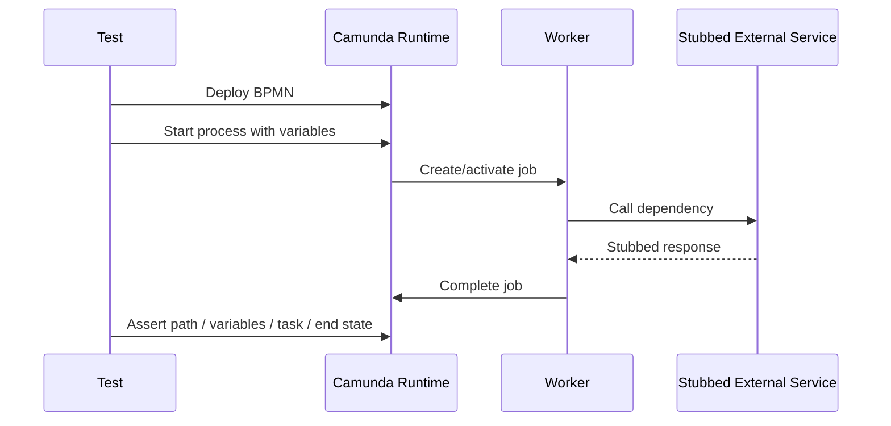
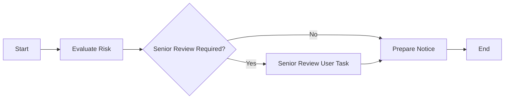
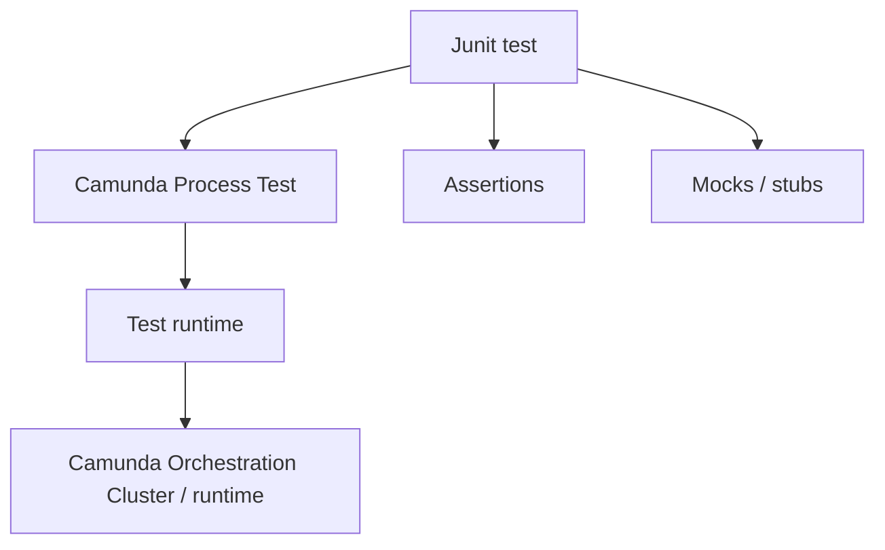
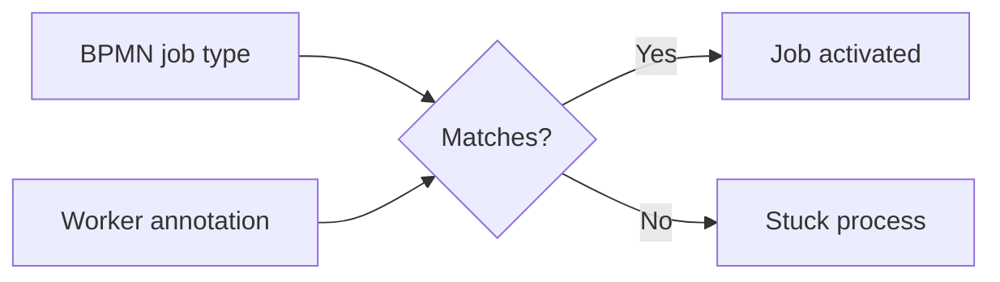
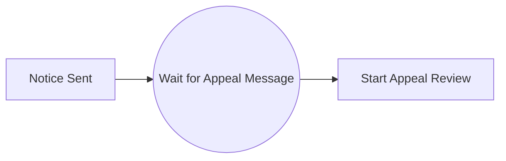
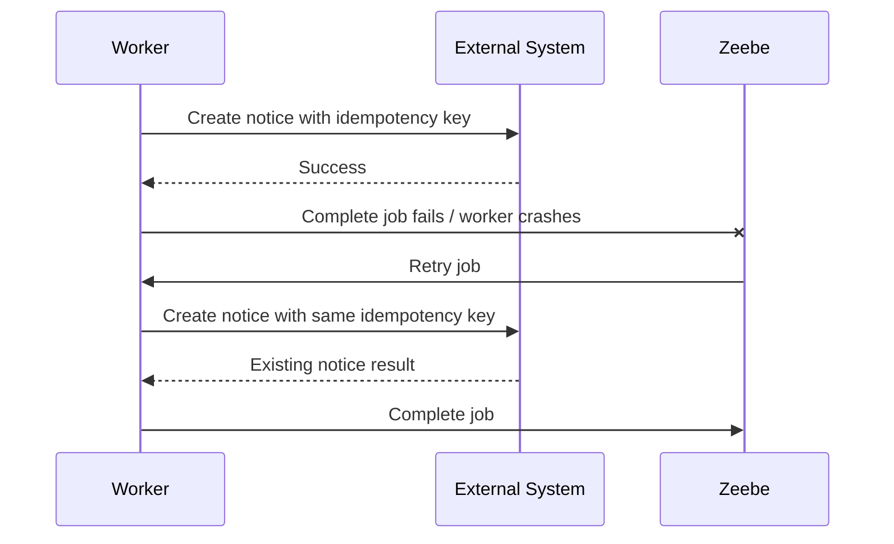
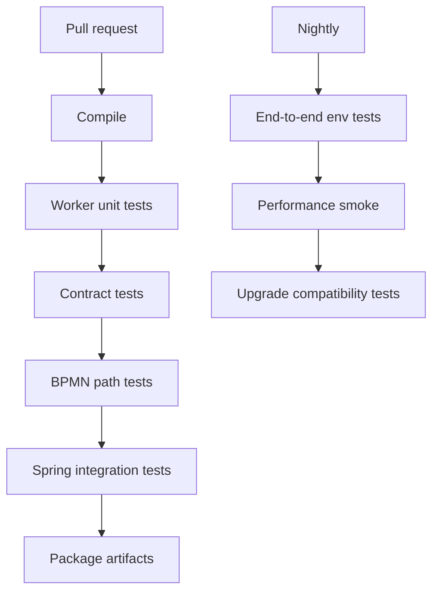
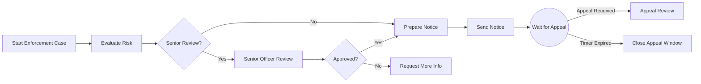

# Part 020 — Testing Process Applications

Executable BPMN is production code.

It has branches, side effects, retries, timers, message correlation, user tasks, versioning, and failure modes. Therefore, it needs a testing strategy as serious as application code.

The mistake is to test only workers and assume the process is correct because the Java code compiles.

A Camunda 8 process application has multiple contracts:

- BPMN model syntax;
- BPMN execution path;
- worker job type contract;
- variable input/output contract;
- message correlation contract;
- user task contract;
- DMN contract;
- timer/SLA behavior;
- incident behavior;
- integration behavior with external services;
- operational recoverability.

This part builds a practical testing model for Camunda 8 process applications in Java.

---

## 1. Kaufman Deconstruction

The subskill is **testing long-running distributed process applications**.

Break it into six smaller skills:

| Subskill | What You Test | Tooling |
|---|---|---|
| Worker unit testing | Java business/adapter logic | JUnit, Mockito, AssertJ |
| Contract testing | worker input/output variable shape | DTO tests, fixture JSON, schema checks |
| BPMN path testing | token flow and process outcomes | Camunda Process Test |
| Integration testing | process + workers + real-ish dependencies | Spring Boot Test, Testcontainers |
| Time/message testing | timers, messages, race boundaries | Process test runtime helpers |
| Regression testing | model changes do not break old assumptions | path matrix, fixtures, migration cases |

The goal is not 100% line coverage. The goal is confidence that process behavior remains correct under normal, exceptional, and operational conditions.

---

## 2. The Testing Pyramid for Camunda 8

A process application should not rely only on end-to-end tests.

```mermaid
pyramid
    title Camunda 8 Process Testing Pyramid
    "Exploratory / UAT / Production rehearsal" : 5
    "End-to-end environment tests" : 10
    "Integration tests: process + workers + dependencies" : 20
    "BPMN path and contract tests" : 30
    "Worker unit tests and pure domain tests" : 35
```

The exact percentages do not matter. The shape does.

Most tests should be cheap and deterministic. A smaller number should validate full integration behavior.

---

## 3. What Makes Process Testing Different

Normal service testing asks:

> Given request X, does method/service Y return Z?

Process testing asks:

> Given process instance state X and external events Y, does the orchestration reach the correct wait state, complete the correct tasks, create the correct jobs, handle failures correctly, and preserve the right variables?

That means we test behavior across time.



A process test often asserts intermediate states, not just final output.

---

## 4. Test Categories

### 4.1 Worker Unit Tests

Purpose:

- validate pure Java logic;
- validate downstream adapter behavior;
- validate error classification;
- validate output normalization;
- validate idempotency handling.

Should not require a Camunda runtime.

### 4.2 Worker Contract Tests

Purpose:

- validate input DTO shape;
- validate missing variable handling;
- validate output variable structure;
- validate compatibility with BPMN mappings.

Can be done with fixture JSON.

### 4.3 BPMN Path Tests

Purpose:

- validate process token flow;
- validate gateway routing;
- validate events;
- validate user task creation;
- validate call activity behavior;
- validate incidents for expected technical failures.

Requires Camunda process test runtime.

### 4.4 Integration Tests

Purpose:

- validate BPMN + worker registration + Spring wiring;
- validate job type names;
- validate actual serialization;
- validate real database/outbox/testcontainers dependencies;
- validate error/retry behavior.

### 4.5 End-to-End Tests

Purpose:

- validate deployed system shape;
- validate auth, API, network, task UI, connectors;
- validate operational observability;
- validate deployment packaging.

Keep these fewer and more scenario-focused.

---

## 5. What Not To Do

### Anti-Pattern: Only Manual Testing in Operate/Tasklist

Manual testing is useful for exploration. It is not a regression strategy.

Problems:

- slow;
- inconsistent;
- not repeatable;
- misses edge cases;
- cannot protect refactoring;
- depends on tester memory.

### Anti-Pattern: Only Worker Tests

A worker can be perfect while the process is broken.

Examples:

- wrong job type in BPMN;
- wrong variable mapping;
- gateway expression reads wrong field;
- message correlation key mismatch;
- user task not assigned;
- timer duration incorrect;
- BPMN error code mismatch.

### Anti-Pattern: Only Happy Path

Happy path tests are necessary but weak.

Most production issues come from:

- missing variables;
- technical failure;
- duplicate message;
- expired timer;
- retry exhausted;
- boundary event misconfiguration;
- changed variable schema;
- unhandled business error.

---

## 6. Worker Unit Test Example

Suppose we have a risk worker:

```java
@JobWorker(type = "risk.evaluate.v1")
public RiskEvaluationResult evaluate(final RiskEvaluationCommand command) {
    var result = riskService.evaluate(command.caseId(), command.subjectId());

    return new RiskEvaluationResult(
        result.score(),
        result.level().name(),
        result.requiresSeniorReview(),
        result.evaluationId()
    );
}
```

Test the worker logic as normal Java:

```java
class RiskEvaluationWorkerTest {

    private final RiskService riskService = mock(RiskService.class);
    private final RiskEvaluationWorker worker = new RiskEvaluationWorker(riskService);

    @Test
    void returnsNormalizedRiskResult() {
        when(riskService.evaluate("CASE-1", "SUBJ-1"))
            .thenReturn(new RiskResult(82, RiskLevel.HIGH, true, "EVAL-1"));

        var result = worker.evaluate(new RiskEvaluationCommand("CASE-1", "SUBJ-1"));

        assertThat(result.score()).isEqualTo(82);
        assertThat(result.level()).isEqualTo("HIGH");
        assertThat(result.seniorReviewRequired()).isTrue();
        assertThat(result.evaluationId()).isEqualTo("EVAL-1");
    }
}
```

This catches mapping mistakes in Java, but not BPMN mistakes.

---

## 7. Contract Test With JSON Fixtures

Create a fixture for the worker input expected from BPMN mappings.

`src/test/resources/fixtures/risk-evaluate-input-v1.json`:

```json
{
  "caseId": "CASE-1",
  "subjectId": "SUBJ-1"
}
```

Test deserialization:

```java
class RiskEvaluationContractTest {

    private final ObjectMapper objectMapper = new ObjectMapper();

    @Test
    void riskEvaluateInputContractIsStable() throws Exception {
        var json = Files.readString(Path.of(
            "src/test/resources/fixtures/risk-evaluate-input-v1.json"
        ));

        var command = objectMapper.readValue(json, RiskEvaluationCommand.class);

        assertThat(command.caseId()).isEqualTo("CASE-1");
        assertThat(command.subjectId()).isEqualTo("SUBJ-1");
    }
}
```

For high-stakes processes, also validate output fixtures.

```json
{
  "score": 82,
  "level": "HIGH",
  "seniorReviewRequired": true,
  "evaluationId": "EVAL-1"
}
```

The contract test prevents accidental rename like `subjectId` -> `partyId` without migration.

---

## 8. BPMN Path Test Concept

A BPMN path test should answer:

- given these start variables;
- when these jobs complete with these outputs;
- then the process reaches this task/path/end state;
- and process variables contain these facts.

Example process:



Test scenarios:

| Scenario | Input | Risk Output | Expected |
|---|---|---|---|
| Low risk | basic case | `seniorReviewRequired=false` | skip review, prepare notice |
| High risk | risky case | `seniorReviewRequired=true` | create senior review task |
| Missing subject | missing input | job failure/incident or BPMN error | visible failure path |

---

## 9. Camunda Process Test Mental Model

Camunda Process Test is the modern testing library for Camunda 8 process applications.

The testing runtime should let you:

- deploy BPMN resources;
- start process instances;
- interact with jobs;
- complete jobs;
- publish messages;
- inspect state;
- assert user tasks;
- test with a managed runtime or a remote runtime;
- run repeatable tests in CI.

The important architecture is:



Use the current Camunda Process Test library for new tests. Do not start new work on deprecated testing libraries unless maintaining old test suites.

---

## 10. Test Runtime Choice

There are typically two useful runtime modes:

### Managed Test Runtime

Good for:

- CI;
- local tests;
- repeatable process path tests;
- fast feedback;
- isolated runtime lifecycle.

Trade-offs:

- requires Docker/Testcontainers depending on configuration;
- may not match every production setting.

### Remote Runtime

Good for:

- tests against Camunda 8 Run;
- shared test environment;
- compatibility validation;
- debugging real runtime behavior.

Trade-offs:

- slower;
- environment-dependent;
- harder to isolate;
- risk of test data pollution.

Recommended approach:

- use managed runtime for normal CI;
- use remote/runtime-environment tests for deployment verification;
- do not make every pull request depend on a fragile shared environment.

---

## 11. A Practical BPMN Test Structure

Organize tests by process and behavior.

```text
src/test/java
└── com/example/enforcement/process
    ├── EnforcementIntakeProcessTest.java
    ├── EnforcementMessageCorrelationTest.java
    ├── EnforcementTimerTest.java
    ├── EnforcementIncidentTest.java
    └── EnforcementVariableContractTest.java

src/test/resources
└── bpmn
    └── enforcement-intake.bpmn
└── fixtures
    ├── start-low-risk.json
    ├── start-high-risk.json
    ├── risk-result-low.json
    └── risk-result-high.json
```

One giant `ProcessTest` class becomes unmaintainable.

Group by behavior.

---

## 12. Process Path Matrix

Before writing tests, create a path matrix.

Example:

| Path ID | Scenario | Start Variables | External Events | Expected Result |
|---|---|---|---|---|
| P1 | Low risk auto notice | low-risk case | none | notice prepared |
| P2 | High risk senior review approved | high-risk case | review complete approved | notice prepared |
| P3 | High risk rejected | high-risk case | review complete rejected | case closed/rework |
| P4 | Notice delivery fails transiently | valid case | worker fail then retry | eventually sent |
| P5 | Appeal received before timeout | notice sent | appeal message | appeal subprocess started |
| P6 | Appeal not received | notice sent | timer fires | process closes waiting period |
| P7 | Invalid case input | missing caseId | none | incident or validation error path |

This matrix is a living artifact. It is more useful than random test names.

---

## 13. Testing Gateway Routing

Gateway tests should assert branch selection from process facts.

Bad test:

```java
@Test
void processWorks() {
    // huge scenario, vague assertion
}
```

Better tests:

```java
@Test
void routesToSeniorReviewWhenRiskIsHigh() {
    // start process
    // complete risk evaluation with seniorReviewRequired = true
    // assert senior review user task exists
    // assert notice task is not created yet
}

@Test
void skipsSeniorReviewWhenRiskIsLow() {
    // start process
    // complete risk evaluation with seniorReviewRequired = false
    // assert prepare notice job is created
}
```

The test name documents the business rule.

---

## 14. Testing Variable Mappings

Variable mapping bugs are common.

Example bugs:

- task expects `caseRef.caseId` but BPMN maps `caseId`;
- output writes `riskLevel` but gateway reads `risk.level`;
- worker returns `seniorReviewRequired` but output mapping writes `review.required`;
- form submits `decision` but gateway reads `review.outcome`.

A good process test verifies not only that the process moves, but that variables are shaped correctly at boundaries.

Assertions should cover:

- worker input is minimal;
- output variables are namespaced correctly;
- raw response does not leak;
- gateway variables exist before gateway execution;
- old fixture shapes still work if supported.

---

## 15. Testing Job Worker Registration

One of the simplest production failures:

- BPMN service task job type: `risk.evaluate.v1`
- Java worker annotation: `risk-evaluate-v1`

The process waits forever because no worker matches the job type.

Integration test should catch this.



At minimum, have a test that starts the process and verifies expected jobs are picked up by registered workers.

---

## 16. Testing BPMN Errors

If a worker throws a BPMN error, the process must have a matching catch event or event subprocess.

Test cases:

| Case | Worker Behavior | Expected BPMN Result |
|---|---|---|
| Known business rejection | throw BPMN error `CASE_NOT_ELIGIBLE` | boundary path taken |
| Missing required document | throw BPMN error `DOCUMENT_MISSING` | user correction task created |
| Unexpected technical exception | fail job | retry/incident, not business path |

Do not test only the worker throwing the error. Test the BPMN catch behavior.

---

## 17. Testing Technical Failure and Incidents

A worker failure should be classified correctly.

Example:

- transient downstream timeout -> fail job with retry;
- validation bug -> fail job, maybe incident;
- business invalid case -> BPMN error;
- duplicate idempotency key already completed -> complete job with existing result.

Process tests should include expected incident behavior for important failure cases.

Why?

Because operational behavior is part of the product.

An incident should be understandable and recoverable.

Test questions:

- does retry count decrement as expected?
- does the process create an incident after retries are exhausted?
- is the incident attached to the correct BPMN element?
- can corrected variables and retry continue the process?
- does manual retry duplicate side effects?

---

## 18. Testing Message Correlation

Message tests must verify name and correlation key.

Example process:



Test cases:

| Scenario | Message Name | Correlation Key | Expected |
|---|---|---|---|
| Correct appeal | `AppealReceived` | `CASE-1` | message caught |
| Wrong name | `AppealSubmitted` | `CASE-1` | not caught |
| Wrong key | `AppealReceived` | `CASE-2` | not caught |
| Duplicate message | same | same | idempotent behavior expected |
| Early message | before wait state | depends on TTL/buffering | either buffered or missed by design |

Message correlation bugs are subtle because publish success does not always mean business success.

Test the actual waiting behavior.

---

## 19. Testing Timers

Timer tests should validate business deadlines without waiting real time.

Examples:

- appeal window expires after 14 days;
- SLA escalation fires after 2 business days;
- reminder repeats every 24 hours;
- boundary timer interrupts user task;
- non-interrupting timer creates reminder while task remains active.

Test cases:

| Timer Type | Expected Test Assertion |
|---|---|
| Interrupting boundary timer | original task cancelled, escalation path active |
| Non-interrupting boundary timer | original task still active, reminder created |
| Intermediate timer | process waits until timer advanced |
| Timer start | instance created at configured schedule |

Avoid tests that sleep for real time.

Use runtime time-control helpers where available.

---

## 20. Testing User Tasks

User task tests should verify:

- task is created at the right point;
- assignment/candidate metadata is correct;
- form key/schema binding is correct;
- required variables are present;
- completion variables route the process correctly;
- cancellation works on boundary events;
- maker-checker constraints are enforced outside or around task completion.

Example scenarios:

| Scenario | Completion Variables | Expected |
|---|---|---|
| Senior reviewer approves | `review.outcome=APPROVED` | prepare notice |
| Senior reviewer rejects | `review.outcome=REJECTED` | close/rework path |
| Missing outcome | no `review.outcome` | validation failure or incident |
| Timer expires | no completion | escalation path |

A user task is not just a UI pause. It is a process contract.

---

## 21. Testing DMN Decisions

DMN tests should exist at two levels.

### Decision Unit Tests

Given inputs, assert decision outputs.

Example matrix:

| Risk Level | Prior Violations | Case Type | Expected Route |
|---|---:|---|---|
| LOW | 0 | COMPLAINT | STANDARD_REVIEW |
| HIGH | 0 | ENFORCEMENT | SENIOR_REVIEW |
| HIGH | 3 | ENFORCEMENT | FORMAL_NOTICE |
| CRITICAL | any | ENFORCEMENT | IMMEDIATE_ESCALATION |

### BPMN Integration Tests

Assert that the business rule task receives correct inputs and that process routing uses decision output correctly.

This catches mapping issues that pure DMN tests cannot catch.

---

## 22. Testing Connectors

Connector testing depends on usage.

For out-of-the-box connector tasks:

- test BPMN configuration;
- test expected variable mapping;
- test mocked external system response if supported;
- test failure path;
- test secrets/config are environment-driven.

For custom connector/worker style integration:

- test adapter logic as normal Java;
- test process path around connector result;
- test error mapping.

Do not let connector tasks become untestable black boxes in critical flows.

---

## 23. Testing Long-Running Processes

Long-running process tests should include lifecycle scenarios.

Examples:

- process waits for external event;
- event arrives after worker deployment changed;
- old variable schema still routes correctly;
- appeal arrives after notice sent;
- case suspended then resumed;
- deadline escalates while human task remains open;
- cancellation event terminates child subprocesses.

A process that lives for months must survive:

- code deployments;
- BPMN deployments;
- variable schema changes;
- worker version changes;
- operator retries;
- user delays;
- external duplicate events.

Test at least the critical lifecycle variants.

---

## 24. Testing Process Versioning

When BPMN changes, tests should answer:

- do new instances use the new model?
- do old instances continue safely?
- does called process binding behave as expected?
- did job type versions change intentionally?
- do variable contracts remain backward-compatible?
- do user task forms still accept old variable shapes?

Regression tests should include old fixtures.

Example:

```text
fixtures/
  v1/start-high-risk.json
  v1/risk-result-high.json
  v2/start-high-risk.json
  v2/risk-result-high.json
```

When a field changes, tests force the team to choose migration or compatibility.

---

## 25. Testing Idempotency

Every side-effecting worker needs idempotency tests.

Example side effect:

- create notice;
- send email;
- create payment;
- submit enforcement action;
- register document;
- publish event.

Test failure window:



Test expected behavior:

- second attempt does not create duplicate notice;
- worker returns same logical result;
- process continues safely.

---

## 26. Testing Observability

Critical processes should test or at least verify observability fields.

Worker logs should include:

- process instance key;
- element id;
- job key;
- job type;
- business key/case ID;
- idempotency key;
- error code for classified failure.

Do not assert every log line in unit tests. But for platform templates, test that logging/tracing helpers enrich context correctly.

Observability is not cosmetic. It determines incident resolution speed.

---

## 27. Test Data Design

Test data should be intentional.

Bad:

```json
{
  "foo": "bar",
  "amount": 100
}
```

Better:

```json
{
  "caseRef": {
    "caseId": "CASE-TEST-LOW-RISK-001",
    "caseType": "ENFORCEMENT",
    "subjectId": "SUBJECT-LOW-RISK"
  },
  "intake": {
    "allegedViolationCodes": ["LATE_REPORTING"],
    "receivedAt": "2026-06-28T09:00:00Z"
  }
}
```

Use readable IDs. Future maintainers should understand the scenario from the fixture.

---

## 28. CI Strategy

A practical CI setup:



Pull request tests should be reliable and not excessively slow.

Nightly or pre-release tests can be heavier.

---

## 29. Production Readiness Test Checklist

Before releasing a process application, validate:

### BPMN

- all service task job types have workers;
- all gateway expressions are tested;
- all message names/correlation keys are tested;
- timers are tested or reviewed;
- boundary events behave as intended;
- call activities use intentional version binding;
- error events match worker error codes.

### Variables

- start variables have fixtures;
- worker input/output contracts are tested;
- mappings do not leak raw responses;
- sensitive variables are not stored;
- old variable shapes are considered;
- parallel branches do not overwrite shared objects accidentally.

### Workers

- unit tests cover normal/error paths;
- idempotency is tested for side effects;
- retry classification is tested;
- BPMN error vs technical failure is tested;
- typed DTO deserialization is tested;
- observability context exists.

### Operations

- incidents are understandable;
- failed jobs can be retried safely;
- operator recovery procedure is documented;
- logs/traces include business correlation;
- deployment versioning is intentional.

---

## 30. Capstone Test Matrix: Enforcement Intake

Process:



Test matrix:

| ID | Scenario | Assertions |
|---|---|---|
| T01 | Low risk case | skips senior review, prepares notice |
| T02 | High risk approved | creates senior review task, approval leads to notice |
| T03 | High risk rejected | rejection leads to more info path |
| T04 | Risk service timeout | job retry/incident behavior correct |
| T05 | Risk service business rejection | BPMN error path triggered |
| T06 | Notice creation duplicate retry | no duplicate notice created |
| T07 | Appeal message correct key | appeal review starts |
| T08 | Appeal message wrong key | process remains waiting |
| T09 | Appeal timer expires | close appeal window path runs |
| T10 | Old v1 variable fixture | still supported or explicitly migrated |
| T11 | Missing required caseId | fails with clear incident or validation path |
| T12 | User task completed without decision | validation prevents unsafe routing |

This matrix is the difference between “we tested the demo” and “we trust the workflow”.

---

## 31. How To Think Like a Senior Engineer

A senior process engineer does not ask only:

> Does the happy path complete?

They ask:

- What happens if this worker executes twice?
- What happens if this variable is missing?
- What happens if this message arrives early?
- What happens if this timer fires while a user is editing?
- What happens if the BPMN model changes while instances are waiting?
- What happens if a retry succeeds after partial side effect?
- What will an operator see at 02:00 when this incident happens?
- Can we prove the process followed the required regulatory path?

Testing is how those questions become executable knowledge.

---

## 32. Summary

Testing Camunda 8 process applications requires more than Java unit tests.

A production-grade testing strategy includes:

- unit tests for workers;
- contract tests for variables and DTOs;
- BPMN path tests for token flow;
- message and timer tests;
- user task tests;
- DMN tests;
- failure and incident tests;
- idempotency tests;
- integration tests with Spring and dependencies;
- regression tests for BPMN and variable evolution;
- operational recovery checks.

The key mental shift is this:

> BPMN is executable code, and orchestration behavior is a product contract.

If the process matters to the business, its paths, failures, variables, and recovery behavior must be tested like any other critical software system.

