# Part 021 — Orchestration vs Choreography

Orchestration and choreography are not enemies.

They are two coordination styles. A top-tier engineer does not ask, "Should we use BPMN or events?" The better question is:

> Which parts of the business lifecycle need an explicit controlling state machine, and which parts should remain autonomous reactions to events?

Camunda 8 Zeebe gives us a durable orchestration runtime. Event streaming gives us a durable notification and propagation substrate. Enterprise systems usually need both.

This part builds the decision model.

---

## 1. Kaufman Deconstruction

The subskill is **choosing the correct coordination model for distributed business processes**.

Break it down into smaller skills:

| Subskill | Question You Must Answer |
|---|---|
| Lifecycle ownership | Who owns the end-to-end state? |
| Failure ownership | Who is responsible when step 4 fails after steps 1–3 succeeded? |
| Visibility need | Does a human/operator need to see the whole lifecycle? |
| Coupling control | Is central coordination helpful or harmful here? |
| Data authority | Which service owns truth, and which system only observes? |
| Event semantics | Is an event a command, fact, notification, or correlation signal? |
| Recovery semantics | Should recovery be modeled, retried, compensated, or ignored? |
| Governance | Is the lifecycle auditable, regulated, and change-controlled? |

The goal is not ideological purity. The goal is a design that remains understandable under failure.

---

## 2. The Core Distinction

### Orchestration

In orchestration, one process explicitly controls the sequence of work.


The process says:

- what happens first;
- what happens next;
- what waits;
- what times out;
- what retries;
- what escalates;
- what compensates;
- what completes the lifecycle.

This is useful when the lifecycle itself has business meaning.

### Choreography

In choreography, services react to events without a central controller owning every step.

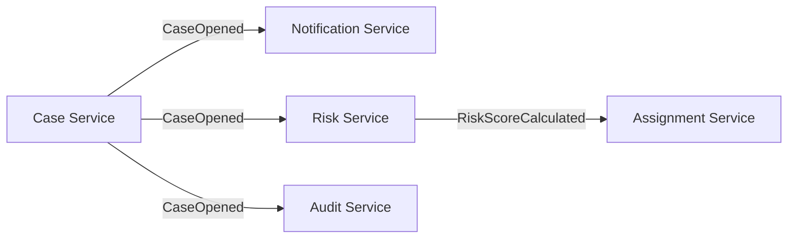

The event says:

- something happened;
- consumers may react;
- producer does not know every downstream action;
- downstream services remain autonomous.

This is useful when reactions are independent and do not require one end-to-end state machine.

---

## 3. The Wrong Framing

A common weak premise is:

> Microservices should never be orchestrated because orchestration creates coupling.

That is incomplete.

Orchestration creates **explicit coupling**. Choreography often creates **implicit coupling**.

Implicit coupling can be worse:

- nobody owns the full lifecycle;
- business users cannot explain current state;
- failures are scattered across logs;
- duplicate events create duplicate actions;
- downstream behavior changes without upstream visibility;
- audit reconstruction requires joining many service logs;
- recovery requires tribal knowledge.

The real trade-off is not coupling vs no coupling. It is **visible coupling vs hidden coupling**.

---

## 4. The Decision Heuristic

Use orchestration when most answers are "yes":

| Question | If Yes, Prefer |
|---|---|
| Is there a legally/business-defined lifecycle? | Orchestration |
| Must humans see status across multiple steps? | Orchestration |
| Is there a clear owner of the end-to-end outcome? | Orchestration |
| Are timeouts/escalations part of the business rule? | Orchestration |
| Do failures require modeled recovery? | Orchestration |
| Are steps sequentially dependent? | Orchestration |
| Do you need versioned process definitions? | Orchestration |
| Is auditability/regulatory defensibility critical? | Orchestration |

Use choreography when most answers are "yes":

| Question | If Yes, Prefer |
|---|---|
| Are consumers optional or independently deployable? | Choreography |
| Is the producer only announcing a fact? | Choreography |
| Can consumers fail without blocking the producer lifecycle? | Choreography |
| Are reactions many-to-many and evolving? | Choreography |
| Is central sequencing unnecessary? | Choreography |
| Is the event useful beyond one process? | Choreography |
| Should services own their local process independently? | Choreography |

---

## 5. Business-Level Synchrony vs Technical Communication Style

Do not confuse **business synchrony** with **technical synchrony**.

A business step can be logically synchronous while the technical implementation is asynchronous.

Example:

> "Assess risk before assigning investigator."

Business-level: synchronous dependency. Assignment must wait for risk.

Technical-level: risk engine may receive a message and respond later.

The BPMN model may represent this as:

- one service task that waits until the worker completes;
- send task + receive task;
- message throw + message catch;
- service task that delegates asynchronous implementation details to a worker.

Camunda's best-practice documentation generally recommends service tasks as the default for synchronous request/response, while send tasks are useful for sending asynchronous messages and receive tasks for incoming asynchronous messages.

The model should expose business-relevant waiting, not every protocol detail.

---

## 6. Three Integration Styles

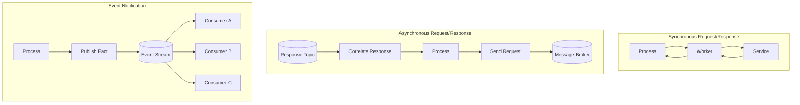

### Style A — synchronous request/response

Use when the process needs a result before continuing.

Examples:

- validate tax ID;
- reserve appointment slot;
- calculate risk score;
- fetch customer profile snapshot;
- submit decision to authoritative case service.

Model with service task.

### Style B — asynchronous request/response

Use when the process sends a request and waits for a later response.

Examples:

- third-party background check;
- external agency response;
- payment settlement;
- document verification by OCR service;
- external registry lookup.

Model with service task if the technical async detail should be hidden, or send/receive/message events if the waiting itself is business-visible.

### Style C — event notification

Use when the process publishes a fact and does not own every reaction.

Examples:

- case opened;
- evidence uploaded;
- decision issued;
- appeal period started;
- enforcement action closed.

Model with a send task or service task that publishes an event.

---

## 7. Orchestration Boundary

An orchestration process should own a **business lifecycle**, not a random technical call chain.

Good orchestration boundary:

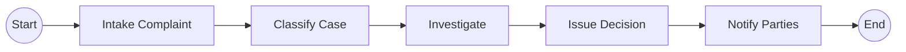

Bad orchestration boundary:

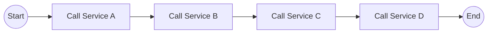

The second model may be valid only if those calls are real business milestones. Otherwise, it is an integration script disguised as BPMN.

---

## 8. Choreography Boundary

A choreographed event should be a **stable fact**, not an imperative disguised as an event.

Good events:

```text
CaseOpened
EvidenceSubmitted
RiskScoreCalculated
DecisionApproved
AppealReceived
EnforcementActionClosed
```

Suspicious events:

```text
SendEmailNow
CreateTaskForInvestigator
CallRiskService
UpdateDatabase
RetryPayment
```

Those names are commands. Commands can be fine, but do not pretend they are facts.

A fact says: "this happened."

A command says: "do this."

A correlation message says: "this response belongs to that waiting instance."

Mixing these categories creates brittle architecture.

---

## 9. Event Taxonomy

| Type | Meaning | Producer Knows Consumers? | Example |
|---|---|---:|---|
| Domain event | A business fact happened | No | `CaseOpened` |
| Integration event | A fact published for external systems | Usually no | `CaseReadyForAssignment` |
| Command message | A requested action | Yes | `CalculateRiskScore` |
| Reply message | Response to a request | Yes | `RiskScoreCalculatedForRequest` |
| Correlation message | Resume waiting process instance | Yes | `ExternalAssessmentCompleted` |
| Audit event | Immutable trail of action | No | `DecisionNoticeSent` |

In Camunda 8, a message used for process correlation needs a clear **message name** and **correlation key**. A Kafka event may contain the payload, but the worker or event router must decide whether it should publish/correlate a Camunda message.

---

## 10. Hybrid Pattern: Orchestrated Core, Choreographed Edges

This is often the best enterprise pattern.

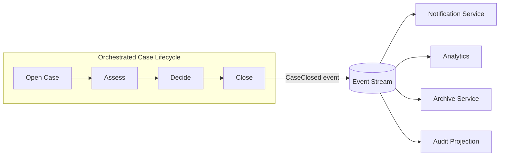

The process owns the core lifecycle. Events distribute facts to autonomous consumers.

This avoids two extremes:

- central process controls every downstream side effect;
- event soup hides the lifecycle.

---

## 11. Hybrid Pattern: Event-Started Orchestration

A process can start from an event.

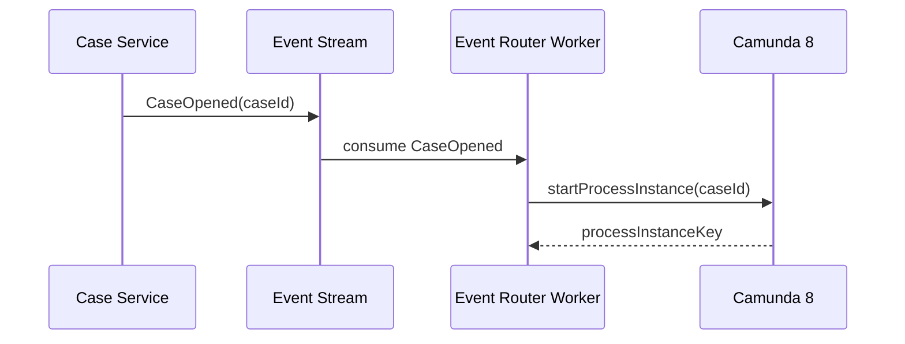

Use this when the authoritative source of creation is outside Camunda, but the resulting lifecycle should be orchestrated.

Key design point:

- external service owns entity creation;
- Camunda owns lifecycle progression;
- process instance key is not the domain ID;
- correlation key should be stable, usually the domain ID.

---

## 12. Hybrid Pattern: Orchestration Publishes Facts

A process can publish events after meaningful milestones.

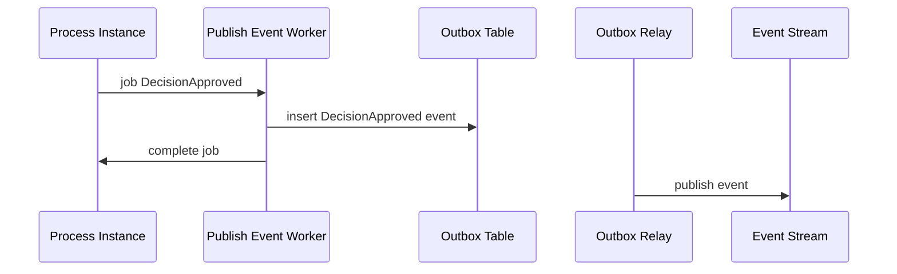

This pattern works well when event publication must be reliable and auditable.

The worker should not directly publish to Kafka and complete the job without thinking through the failure window. If publishing succeeds but job completion fails, the job may be retried and publish a duplicate. If job completion succeeds but publishing fails, downstream systems miss the event.

Use idempotent event IDs and an outbox where required.

---

## 13. Pattern: Process as Policy, Services as Authority

The process should often own **policy sequencing**, not the authoritative domain data.

Example:

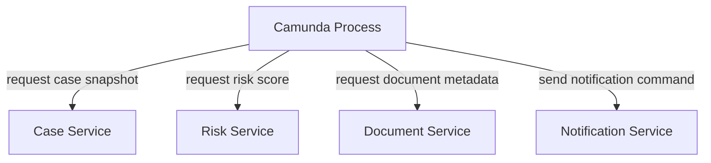

The process asks services to act. It does not replace them.

Good invariant:

> Camunda variables are orchestration context. Domain services remain system of record.

---

## 14. Pattern: Event Router as Anti-Corruption Layer

Do not let every service know Camunda internals.

Instead, use an event router.

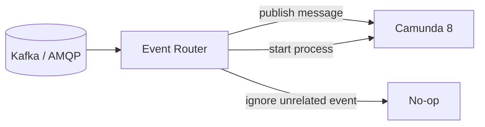

The router maps external event shape to Camunda correlation semantics.

Responsibilities:

- validate event schema;
- deduplicate by event ID;
- derive correlation key;
- choose message name;
- publish message or start process;
- track routing result;
- avoid leaking process instance keys to external producers.

Example Java shape:

```java
public final class CaseEventRouter {

    private final CamundaClient camundaClient;
    private final RoutedEventRepository routedEvents;

    public void route(CaseEvent event) {
        if (routedEvents.alreadyHandled(event.eventId())) {
            return;
        }

        switch (event.type()) {
            case "CASE_OPENED" -> startCaseLifecycle(event);
            case "EVIDENCE_SUBMITTED" -> correlateEvidenceSubmitted(event);
            case "APPEAL_RECEIVED" -> correlateAppealReceived(event);
            default -> {
                routedEvents.markIgnored(event.eventId(), event.type());
                return;
            }
        }

        routedEvents.markHandled(event.eventId());
    }

    private void startCaseLifecycle(CaseEvent event) {
        camundaClient
            .newCreateInstanceCommand()
            .bpmnProcessId("regulatory-case-lifecycle")
            .latestVersion()
            .variables(Map.of(
                "caseId", event.caseId(),
                "sourceEventId", event.eventId()
            ))
            .send()
            .join();
    }

    private void correlateEvidenceSubmitted(CaseEvent event) {
        camundaClient
            .newPublishMessageCommand()
            .messageName("EvidenceSubmitted")
            .correlationKey(event.caseId())
            .messageId(event.eventId())
            .variables(Map.of(
                "caseId", event.caseId(),
                "evidenceId", event.payload().get("evidenceId")
            ))
            .send()
            .join();
    }

    private void correlateAppealReceived(CaseEvent event) {
        camundaClient
            .newPublishMessageCommand()
            .messageName("AppealReceived")
            .correlationKey(event.caseId())
            .messageId(event.eventId())
            .variables(Map.of(
                "caseId", event.caseId(),
                "appealId", event.payload().get("appealId")
            ))
            .send()
            .join();
    }
}
```

This code is intentionally simple. In production, separate routing, idempotency, schema validation, error handling, and client adapter concerns.

---

## 15. Pattern: Command Worker for Service Autonomy

A Camunda worker should not contain deep domain logic.

It should call the owning service.

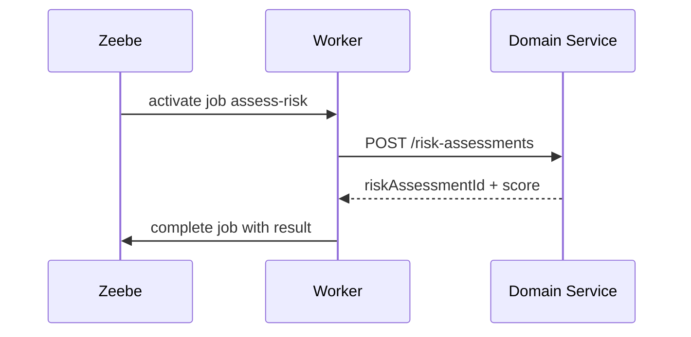

The domain service owns:

- validation;
- transaction;
- persistence;
- domain invariants;
- authorization;
- audit record;
- idempotency if the operation mutates state.

The worker owns:

- job contract;
- mapping variables to request;
- retry/error mapping;
- telemetry;
- idempotency key propagation;
- process output mapping.

---

## 16. Pattern: Process-Local Decision, Event-Global Fact

A process may use DMN internally, then publish the result as a fact.

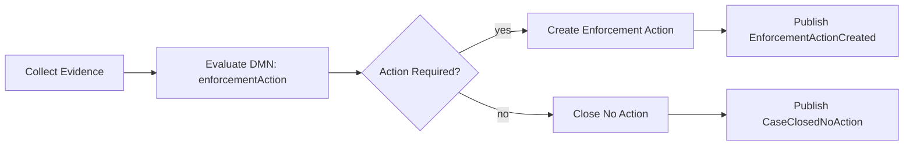

DMN is local policy. Event is global fact.

Do not publish every intermediate variable. Publish facts that external consumers can rely on.

---

## 17. Pattern: Escalation as Orchestration, Notification as Choreography

Escalation often belongs in the process.

Notification usually belongs at the edge.

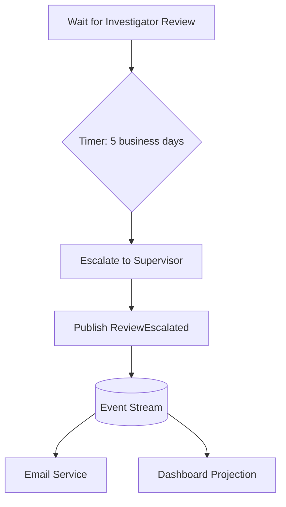

The process owns the escalation state. The notification service owns email/SMS/channel delivery.

This keeps the process defensible without over-modeling every notification path.

---

## 18. Pattern: Process State Projection

Some consumers need read models, not orchestration control.

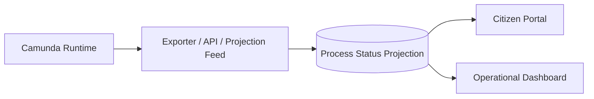

A process status projection can answer:

- current milestone;
- assigned group;
- pending wait state;
- due date;
- escalation state;
- high-level outcome.

Do not make every consumer call Operate APIs for business integration. Build stable read models when needed.

---

## 19. Orchestration Smells

### Smell 1 — BPMN as integration spaghetti

Symptoms:

- dozens of tiny service tasks;
- no business labels;
- each task maps to one HTTP endpoint;
- business stakeholders cannot read it;
- every service deployment requires BPMN change.

Fix:

- raise abstraction;
- group technical steps behind service-owned APIs;
- model business milestones;
- keep implementation detail in workers/services.

### Smell 2 — Process owns all domain state

Symptoms:

- process variables contain complete aggregate records;
- workers read/write huge JSON blobs;
- services are thin CRUD wrappers;
- incidents expose sensitive data;
- state repair is hard.

Fix:

- keep domain state in domain services;
- keep process variables minimal;
- store references and decisions;
- use data contracts.

### Smell 3 — Central process controls optional reactions

Symptoms:

- BPMN has branches for analytics, email, archive, dashboard, BI, ML, cache refresh;
- failure of optional consumer blocks core lifecycle;
- process changes whenever a new consumer appears.

Fix:

- publish domain/integration events;
- let optional consumers subscribe;
- model only required business effects.

### Smell 4 — One process to rule them all

Symptoms:

- one giant BPMN diagram for a whole organization;
- many unrelated actors and lifecycles;
- multi-entity state tangled together;
- versioning becomes impossible.

Fix:

- split by lifecycle ownership;
- use call activities carefully;
- use events for cross-lifecycle propagation;
- define process APIs.

---

## 20. Choreography Smells

### Smell 1 — Event soup

Symptoms:

- hundreds of events;
- inconsistent names;
- unclear source of truth;
- no lifecycle owner;
- consumers rely on event order that is not guaranteed globally.

Fix:

- define event taxonomy;
- publish only stable facts;
- document event ownership;
- use process orchestration where lifecycle matters.

### Smell 2 — Hidden process in consumers

Symptoms:

- each service stores partial workflow state;
- retries and timers implemented independently;
- escalation logic duplicated;
- no single operator view.

Fix:

- move lifecycle policy into BPMN;
- keep services authoritative for local data;
- use events for notifications and projections.

### Smell 3 — Commands masquerading as events

Symptoms:

- event names are imperative;
- consumers must act exactly once;
- producer expects a specific consumer to react;
- missing consumer is a business failure.

Fix:

- model as command/reply or service task;
- make dependency explicit;
- correlate reply to process instance.

### Smell 4 — No recovery owner

Symptoms:

- failure requires manual database changes;
- no process instance shows where the case is blocked;
- compensating actions are ad hoc;
- teams disagree about who should fix the issue.

Fix:

- define failure ownership;
- model recovery in BPMN where business-visible;
- use incidents for technical intervention;
- use compensation or forward recovery for completed side effects.

---

## 21. Regulatory Systems Lens

In regulatory enforcement systems, orchestration is usually justified for the core case lifecycle.

Why:

- process stage has legal meaning;
- deadlines matter;
- human decision checkpoints must be auditable;
- evidence intake must be traceable;
- escalation must be defensible;
- outcome must be explainable;
- recovery must not depend on hidden logs;
- process changes often require governance.

But not everything belongs in BPMN.

Good split:

| Concern | Preferred Ownership |
|---|---|
| Case lifecycle | Camunda process |
| Case aggregate state | Case service |
| Evidence binary/document metadata | Document service |
| Risk scoring model | Risk service / DMN where policy-level |
| Notifications | Notification service + events |
| Audit log | Audit service / event store |
| Analytics | Projection/warehouse |
| SLA escalation state | Camunda process |
| User task assignment policy | Camunda + IAM/task app |
| Long-term record retention | Archive service |

---

## 22. Designing an Orchestration Contract

A process should expose a contract to the rest of the system.

Minimum process contract:

```yaml
process:
  bpmnProcessId: regulatory-case-lifecycle
  versioning: versionTag + deployment governance
  startsBy:
    - command: StartCaseLifecycle
      requiredVariables:
        - caseId
        - caseType
        - openedAt
  messages:
    - name: EvidenceSubmitted
      correlationKey: caseId
      variables:
        - evidenceId
        - submittedAt
    - name: AppealReceived
      correlationKey: caseId
      variables:
        - appealId
        - receivedAt
  publishedFacts:
    - CaseAssessmentStarted
    - DecisionIssued
    - EnforcementActionClosed
  workerContracts:
    - classify-case
    - assign-investigator
    - request-evidence
    - issue-decision
```

This makes orchestration a platform contract, not a hidden implementation detail.

---

## 23. Choosing BPMN Elements for Integration

| Situation | Recommended Modeling |
|---|---|
| Need response before continuing | Service task |
| Send event/fact to broker | Send task or service task with clear label |
| Wait for external response | Message catch event / receive task / service task depending abstraction |
| Wait for external event with business meaning | Message intermediate catch event |
| Start lifecycle from external event | Message start event or start command from router |
| Optional downstream consumers | Publish event; do not model each consumer |
| Human intervention required | User task |
| Business rule decision | DMN business rule task |
| Technical failure retry | Job failure/retry/backoff |
| Business alternate path | BPMN error/escalation/gateway |

---

## 24. Operational Visibility Model

Orchestration gives visibility, but only for what it owns.

A good visibility architecture combines:

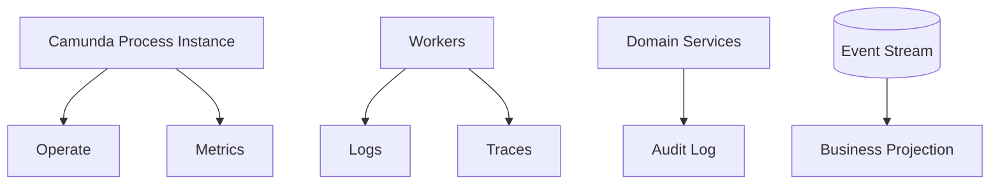

Operate shows process execution and incidents. It is not a replacement for domain audit, log aggregation, tracing, or analytics.

Design visibility per concern:

| Concern | Visibility Source |
|---|---|
| Where is process blocked? | Operate / process projection |
| Why did worker fail? | worker logs/traces |
| What business action occurred? | domain audit log |
| Who approved? | task/user audit + domain record |
| Which event was emitted? | event outbox/broker metadata |
| Which SLA breached? | process variable/projection + metrics |

---

## 25. Modeling Example: Case Assignment

### Bad purely choreographed design

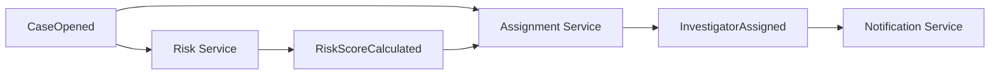

This can work, but there are hidden questions:

- What if risk score never arrives?
- Who owns assignment timeout?
- What if assignment fails?
- Can a supervisor manually override?
- Where does a caseworker see current stage?
- How is reassignment audited?

### Better orchestrated core

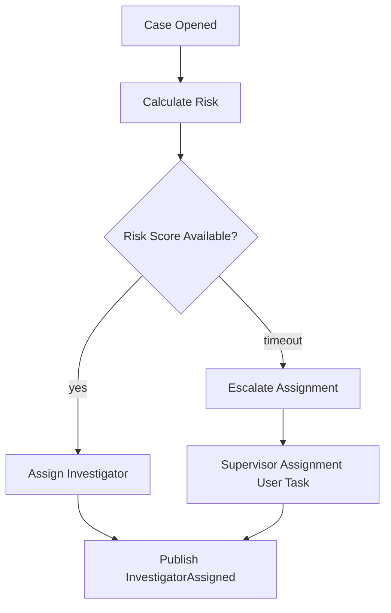

Now the process owns the business lifecycle and failure path.

---

## 26. Modeling Example: Notifications

### Bad over-orchestrated design

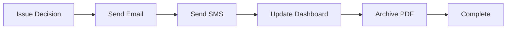

This blocks the business process on optional delivery channels.

### Better edge choreography

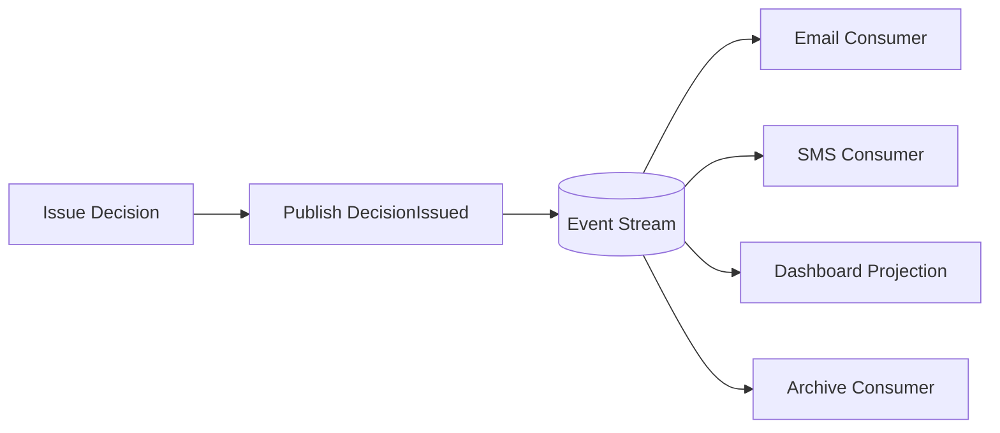

If a legally required notice must be sent before the decision is effective, keep that notice as part of orchestration. Optional channels should be choreographed.

---

## 27. Failure Ownership Matrix

| Failure | Orchestration Responsibility | Service Responsibility |
|---|---|---|
| Risk service unavailable | retry/backoff/incident/escalation | expose stable error semantics |
| Duplicate job activation | use idempotency key | deduplicate operation |
| Event publish duplicate | use message/event ID | consumer idempotency |
| Notification delivery failure | only if legally required | channel retry/dead-letter |
| Evidence missing | wait/escalate/request again | document service owns metadata |
| Assignment conflict | model alternate path | assignment service enforces invariant |
| Process model bug | incident/runbook/version fix | n/a |
| Domain validation error | BPMN business path or modeled rejection | domain service returns meaningful result |

---

## 28. Versioning Implications

Orchestration versioning is explicit.

A process definition version determines behavior for future instances. Existing instances may continue under old versions unless migrated. That is useful for governance.

Choreography versioning is distributed.

Event schema changes affect all consumers. Behavior changes may be harder to see.

Use this decision:

- if policy change must be approved, deployed, visible, and possibly applied only to new cases, orchestration versioning is valuable;
- if new consumers can react to old facts without changing producer behavior, event schema versioning is enough.

---

## 29. Performance Considerations

Do not orchestrate high-volume low-value technical events.

Bad fit:

- every click;
- every telemetry sample;
- every internal cache update;
- every row-level CRUD change;
- every low-value notification attempt.

Good fit:

- long-running business case;
- multi-step approval;
- regulated decision lifecycle;
- cross-service business transaction;
- human-in-the-loop workflow;
- external wait state;
- compensation/recovery process.

Zeebe is scalable, but not every event deserves a process instance.

---

## 30. Team Ownership

Orchestration introduces a process owner role.

Possible ownership models:

| Model | Works When | Risk |
|---|---|---|
| Central workflow team owns all BPMN | strong governance required | bottleneck |
| Domain team owns its process | domains are mature | inconsistent modeling |
| Platform team owns runtime/golden path | many teams build processes | requires standards |
| Process council reviews production BPMN | regulated environments | review overhead |

For serious systems, use platform engineering:

- BPMN standards;
- worker contract templates;
- naming conventions;
- test requirements;
- incident runbooks;
- process review checklist;
- versioning rules.

---

## 31. Practical Checklist

Before choosing orchestration, ask:

- What is the lifecycle name?
- Who owns the lifecycle outcome?
- What are the legally/business-relevant states?
- Which waits are business-visible?
- Which failures require human visibility?
- Which steps mutate external systems?
- Which actions must be idempotent?
- Which outputs must be published as facts?
- What data is needed in process variables?
- What stays in domain services?
- What is the versioning policy?
- What is the operational runbook?

Before choosing choreography, ask:

- Is the event a stable fact?
- Who owns the event schema?
- Can consumers fail independently?
- Does producer need a reply?
- Is global ordering required?
- How are duplicates handled?
- How is event replay handled?
- How are downstream failures observed?
- Is there a hidden lifecycle emerging across services?

---

## 32. Mental Model Summary

Orchestration is best for **explicit lifecycle control**.

Choreography is best for **autonomous reaction to facts**.

The best enterprise design usually looks like this:

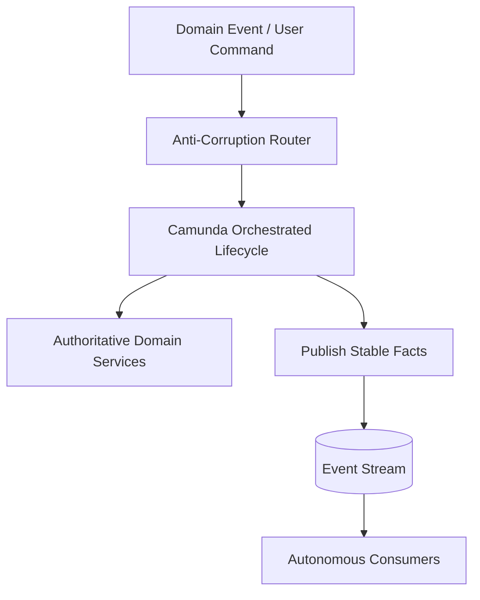

This gives you:

- explicit lifecycle;
- autonomous services;
- visible recovery;
- stable events;
- clear contracts;
- auditability;
- scalability;
- governance without centralizing everything.

---

## 33. Top 1% Engineering Rubric

You understand orchestration vs choreography when you can:

- explain lifecycle ownership without mentioning tooling;
- identify hidden processes in event-driven systems;
- distinguish domain event, command, reply, and correlation message;
- decide when BPMN should expose a wait state;
- keep domain state out of process variables;
- design idempotent publication and correlation;
- define failure ownership per step;
- prevent BPMN from becoming integration spaghetti;
- prevent events from becoming ungoverned soup;
- design hybrid architecture with clear contracts.

---

## 34. References

- Camunda 8 Docs — Service integration patterns with BPMN: https://docs.camunda.io/docs/components/best-practices/development/service-integration-patterns/
- Camunda 8 Docs — Writing good workers: https://docs.camunda.io/docs/components/best-practices/development/writing-good-workers/
- Camunda 8 Docs — Dealing with problems and exceptions: https://docs.camunda.io/docs/components/best-practices/development/dealing-with-problems-and-exceptions/
- Camunda 8 Docs — Messages: https://docs.camunda.io/docs/components/concepts/messages/
- Camunda 8 Docs — BPMN coverage: https://docs.camunda.io/docs/components/modeler/bpmn/bpmn-coverage/

---

## 35. What Comes Next

Part 022 moves from coordination style to **business transaction design**.

We will cover Saga and compensation patterns: how to design long-running business transactions where ACID rollback is impossible, side effects may already have happened, and regulatory auditability matters.
