# Part 022 — Saga and Compensation Patterns

Distributed business processes cannot rely on one ACID transaction across all participating systems.

Once a worker calls another service, sends a message, assigns a task, charges money, reserves inventory, creates a case record, or notifies a party, the process has caused an external effect. If a later step fails, the system cannot simply roll back the world.

This is where Saga and compensation thinking becomes essential.

A top-tier Camunda engineer does not treat compensation as a BPMN decoration. They treat it as an explicit business recovery design.

---

## 1. Kaufman Deconstruction

The subskill is **designing recoverable long-running business transactions**.

Break it into smaller skills:

| Subskill | Core Question |
|---|---|
| Side-effect classification | What has already changed outside the process? |
| Recovery choice | Retry, compensate, escalate, ignore, or continue? |
| Business transaction boundary | Which steps belong to the same business outcome? |
| Compensation semantics | What does "undo" really mean in this domain? |
| Idempotency | Can compensation run more than once safely? |
| Ordering | Must compensation occur in a specific order? |
| Auditability | Can we explain what was done and why it was reversed? |
| Human control | Which recovery steps require approval? |
| Regulatory defensibility | Is the recovery legally/business acceptable? |

The goal is to stop thinking in database rollback terms and start thinking in **business recovery terms**.

---

## 2. Saga Mental Model

A Saga is a sequence of local transactions coordinated toward a larger business outcome.

Each local transaction commits independently.

If the larger outcome cannot be completed, the system executes compensating actions or forward recovery steps.

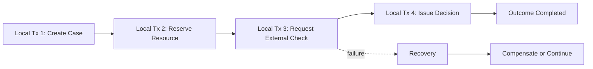

The Saga is not about pretending distributed rollback exists. It is about making recovery explicit.

---

## 3. Technical Transaction vs Business Transaction

A technical transaction is usually short:

```text
BEGIN
  insert row
  update row
  commit
END
```

A business transaction can last minutes, days, months, or years:

```text
Open investigation
Collect evidence
Wait for response
Review finding
Issue decision
Handle appeal period
Close enforcement action
```

The business transaction is not protected by one database transaction.

In Camunda 8, Zeebe tracks the process state, but external services commit their own local changes. That means the design must answer:

- what if the service succeeds but job completion fails?
- what if job completion succeeds but event publication fails?
- what if a timeout happens after external action succeeds?
- what if compensation succeeds but process update fails?
- what if compensation itself fails?

These are not edge cases. They are normal distributed system conditions.

---

## 4. Compensation Is Not Rollback

Rollback restores a previous technical state.

Compensation performs a new business action that semantically counteracts a previous action.

Examples:

| Original Action | Compensation |
|---|---|
| Reserve appointment slot | Release slot |
| Assign investigator | Unassign or reassign case |
| Send preliminary notice | Send correction/withdrawal notice |
| Create external request | Cancel request if allowed |
| Publish decision | Issue amended decision or reversal |
| Freeze account | Unfreeze account with reason |
| Apply penalty | Reverse penalty entry or create offset |

Some actions cannot be truly undone.

If a party already read a notice, you cannot unsend knowledge. You can only issue a correction, withdrawal, or superseding action.

That is why compensation must be domain-specific.

---

## 5. Forward Recovery vs Backward Recovery

There are two broad strategies.

### Backward recovery

Undo previous successful steps.

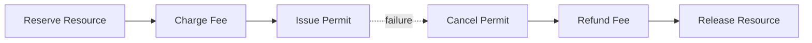

Use when the business outcome must be abandoned.

### Forward recovery

Continue toward a valid outcome through alternate steps.

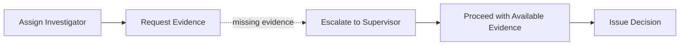

Use when the business can continue after exception handling.

Forward recovery is often better in regulatory systems because historical actions remain part of the case record.

---

## 6. BPMN Compensation Semantics in Camunda 8

Camunda 8 supports BPMN compensation events and compensation handlers.

Core semantics:

- a compensation boundary event is attached to an activity whose effects may need reversal;
- the attached compensation handler contains the undo/reversal logic;
- when a compensation throw/end event is reached, handlers for completed activities in scope are invoked;
- handlers for active or terminated activities are not invoked;
- by default, compensation handlers in scope are invoked without a guaranteed business order;
- compensation can be triggered for a specific activity when order matters;
- compensation handlers may be service tasks, subprocesses, or call activities depending on complexity.

Mental model:

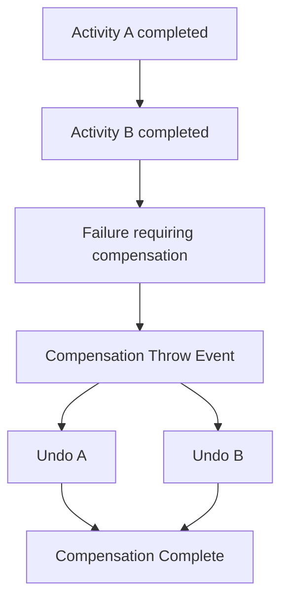

The compensation throw event remains active until invoked handlers complete.

---

## 7. Simple BPMN Compensation Pattern

Use this when each completed action has a simple compensating action.

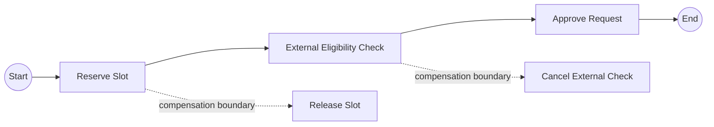

If approval fails after reservation/check, a compensation throw event can invoke the handlers.

The handler should call the owning service. It should not directly mutate another service's database.

---

## 8. Compensation Handler as Embedded Subprocess

Use embedded subprocess when undo requires multiple local steps but remains part of the same process scope.

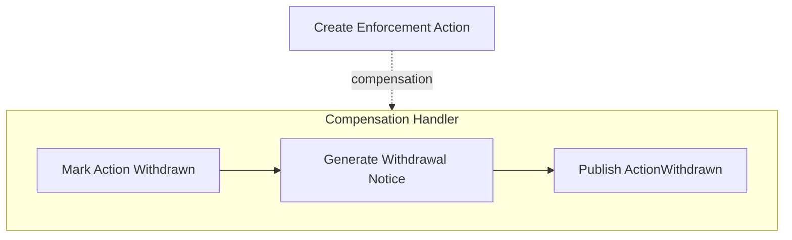

Good fit:

- a small sequence of reversal actions;
- same lifecycle ownership;
- no need for independent versioning;
- compensation steps are strongly tied to the original activity.

---

## 9. Compensation Handler as Call Activity

Use call activity when compensation is complex enough to deserve its own process.

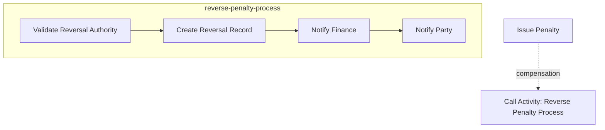

Good fit:

- compensation has separate governance;
- compensation can be reused;
- compensation has its own user tasks;
- compensation needs its own versioning;
- compensation itself has meaningful milestones.

Camunda documentation notes that call activity can be useful as a compensation handler because child-process compensation handlers are not automatically invoked from the parent scope. This forces you to design child-process reversal intentionally.

---

## 10. Ordered Compensation

Default compensation may invoke handlers in the same scope without a specific order.

If order matters, do not rely on accidental engine behavior.

Model the order explicitly by triggering compensation for specific activities.

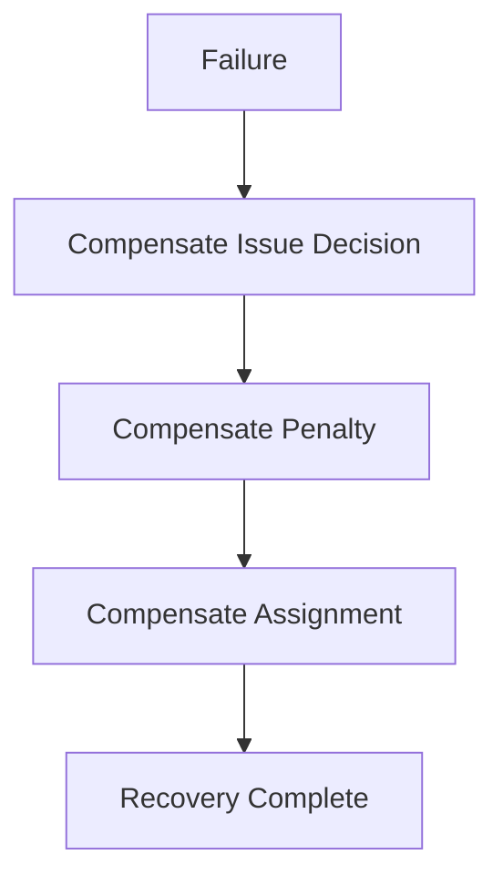

Order matters when:

- downstream effects depend on upstream reversal;
- legal notice must be withdrawn before financial reversal;
- child record must be closed before parent status changes;
- external provider requires reverse sequence;
- audit trail must reflect human-approved order.

---

## 11. Multi-Instance Compensation

Multi-instance compensation is easy to misunderstand.

If a multi-instance activity has a compensation handler, the handler may be invoked once for the activity, not once per item. The handler is then responsible for reverting the effects of all completed instances unless you model the handler itself as multi-instance.

Example:

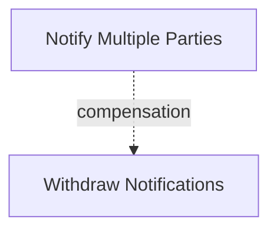

The handler must know which notifications were actually sent.

Better design:

- store notification IDs returned by notification service;
- use idempotent withdrawal command;
- compensate only completed side effects;
- record partial compensation result.

---

## 12. Compensation From Event Subprocess

A powerful pattern is error event subprocess + compensation.

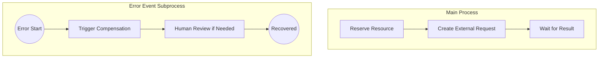

Use this when a failure should interrupt normal flow and trigger recovery for already completed activities.

Important distinction:

- technical retry handles transient infrastructure failure;
- BPMN error/event subprocess handles business-level recovery;
- compensation reverses completed effects;
- human task may decide final recovery if the law/policy is not automatic.

---

## 13. Saga Design Algorithm

Use this algorithm for each process.

### Step 1 — List side effects

Create a table.

| Step | External Effect? | Owning System | Reversible? | Compensation |
|---|---:|---|---:|---|
| Create case | yes | Case Service | no | close/cancel case |
| Reserve resource | yes | Resource Service | yes | release reservation |
| Send notice | yes | Notification Service | partially | send correction |
| Create penalty | yes | Penalty Service | yes | reverse penalty |
| Publish event | yes | Event Bus | no | publish correcting event |

### Step 2 — Classify failure after each step

For every boundary, ask:

```text
If failure occurs after this step succeeded, what must happen?
```

Options:

- retry same step;
- continue with alternate path;
- compensate previous steps;
- escalate to human;
- mark incident;
- terminate with recorded outcome;
- publish correction.

### Step 3 — Decide recovery model

| Condition | Preferred Recovery |
|---|---|
| transient technical failure | retry/backoff |
| bad input but repairable | incident + variable repair |
| business rejection | BPMN error path |
| completed reversible effect no longer desired | compensation |
| irreversible effect needs correction | forward recovery/correction |
| ambiguous legal/policy judgment | user task |
| impossible invariant violation | incident + engineering runbook |

### Step 4 — Make recovery idempotent

Every compensation worker needs an idempotency key.

Example:

```text
compensationKey = processInstanceKey + ':' + activityId + ':' + originalBusinessOperationId + ':compensate'
```

Prefer domain-level operation IDs where possible.

### Step 5 — Test recovery paths

Do not ship Saga without tests for:

- failure before side effect;
- failure after side effect before job completion;
- duplicate compensation command;
- compensation service unavailable;
- partial compensation success;
- human override;
- timeout during recovery;
- process cancellation during compensation.

---

## 14. Worker Design for Compensating Actions

A compensation worker is not special Java magic. It is still a worker processing a job. But its contract must be stricter.

Example:

```java
@JobWorker(type = "release-resource-reservation")
public Map<String, Object> releaseReservation(
        @Variable String caseId,
        @Variable String reservationId,
        ActivatedJob job) {

    String idempotencyKey = "release-reservation:" + reservationId;

    ReleaseResult result = resourceClient.releaseReservation(
        new ReleaseReservationCommand(
            reservationId,
            caseId,
            idempotencyKey,
            "Process compensation triggered by " + job.getProcessInstanceKey()
        )
    );

    return Map.of(
        "reservationReleased", result.released(),
        "reservationReleaseReference", result.reference(),
        "reservationReleaseAt", result.releasedAt().toString()
    );
}
```

Rules:

- call the owning service;
- send an idempotency key;
- include business reason;
- capture external reference;
- return minimal result variables;
- do not swallow business failure;
- do not delete audit trail;
- do not assume compensation always means restore exact previous state.

---

## 15. Original Action Must Produce Compensation Inputs

A compensating action needs data from the original action.

Bad original worker:

```java
return Map.of("reserved", true);
```

Good original worker:

```java
return Map.of(
    "reservation", Map.of(
        "id", result.reservationId(),
        "status", result.status(),
        "reservedAt", result.reservedAt().toString()
    )
);
```

Compensation cannot release a reservation if the process did not store the reservation ID or if the domain service cannot derive it idempotently.

Design each side-effecting task with this question:

> What minimal reference is needed to reverse, correct, audit, or reconcile this action later?

---

## 16. Irreversible Actions

Some actions are irreversible.

Examples:

- external party received a legal notice;
- public registry was updated;
- data was disclosed;
- enforcement decision was published;
- human saw confidential information;
- physical inspection already occurred.

Do not model fake compensation.

Instead, model correction.

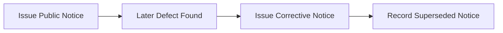

The business semantics are not "undo notice". They are "issue correction and supersede previous notice."

This matters for regulatory defensibility.

---

## 17. Compensation vs BPMN Error

BPMN error and compensation solve different problems.

| Concept | Purpose |
|---|---|
| BPMN error | route business exception to alternate path |
| Job failure | retry or create incident for technical failure |
| Compensation | reverse/correct completed effects |
| Escalation | notify/route business urgency without necessarily failing |
| Incident | require operational intervention |

Example:

- `INSUFFICIENT_EVIDENCE` may be a BPMN error or gateway path;
- `HTTP_503` should usually be job failure/retry;
- `NOTICE_ALREADY_SENT_BUT_DECISION_WITHDRAWN` may trigger compensation/correction;
- `LEGAL_REVIEW_REQUIRED` may create user task/escalation.

---

## 18. Compensation vs Retry

Do not compensate too early.

If a service is temporarily unavailable, retry.

If the business outcome is still desired, continue trying.

Compensation is appropriate when:

- the desired outcome has changed;
- the process cannot legally continue;
- a later business failure invalidates earlier effects;
- a timeout makes the original action no longer useful;
- a human rejects the transaction;
- external policy requires reversal.

Bad:

```text
Payment API timeout -> refund payment
```

Maybe the payment succeeded but the response timed out. Refund may be wrong.

Better:

```text
Payment API timeout -> query payment status -> decide retry/continue/refund/escalate
```

---

## 19. Unknown Outcome Pattern

The hardest failures are unknown outcomes.

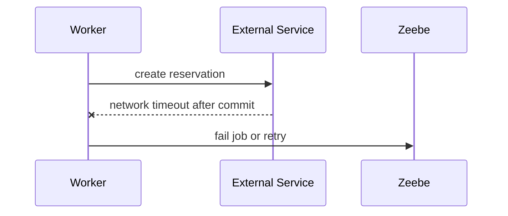

Did the reservation happen? Maybe.

Handle with reconciliation.

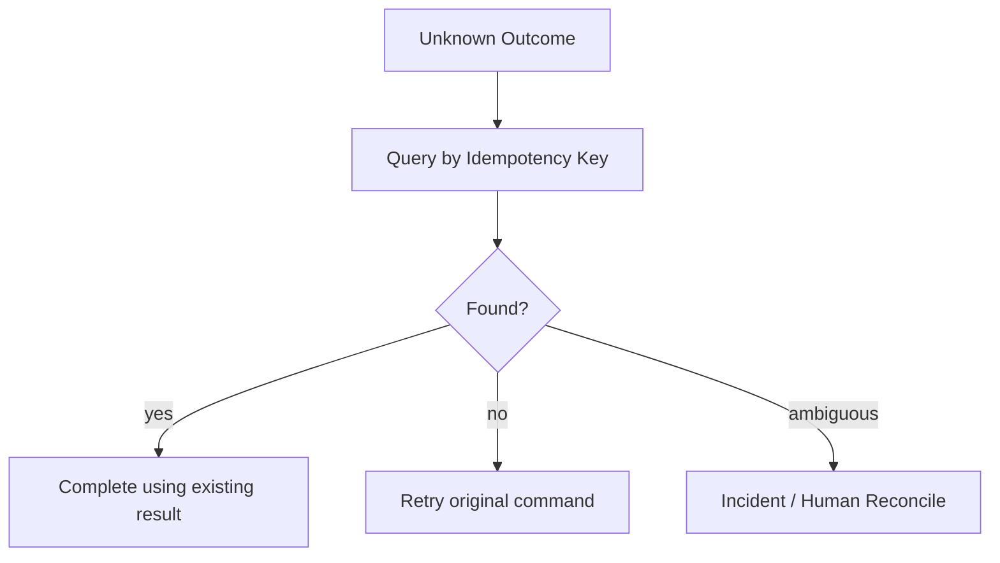

This is why idempotency keys are not optional for side-effecting workers.

---

## 20. Compensation and Audit Trail

Never delete evidence of the original action.

Compensation should append a new record.

Bad audit model:

```text
delete penalty row
```

Good audit model:

```text
PenaltyCreated
PenaltyReversalRequested
PenaltyReversed
ReversalNoticeSent
```

In regulated systems, the story matters:

- who initiated reversal;
- why reversal occurred;
- which rule allowed it;
- which original action was reversed;
- whether affected parties were notified;
- whether reversal itself failed or was partial.

---

## 21. Human Approval in Compensation

Not all compensation should be automatic.

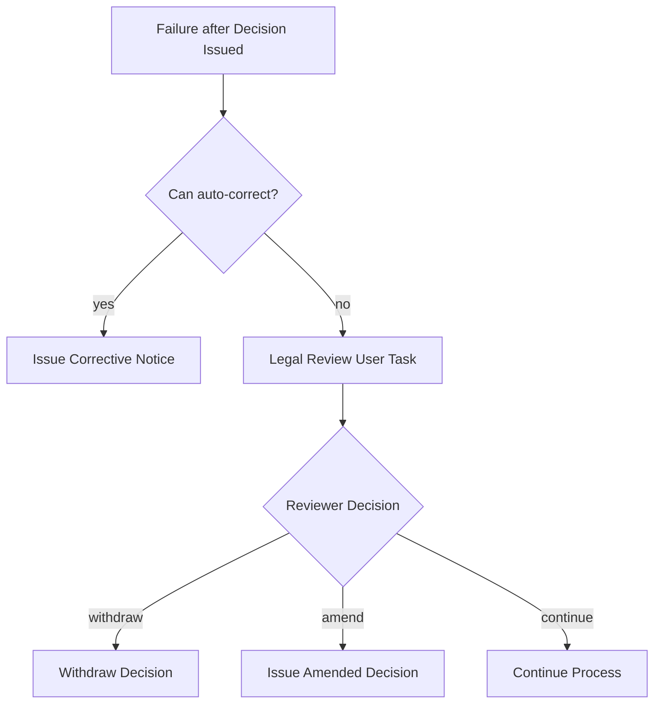

Use user tasks when:

- legal interpretation is required;
- compensation has external impact;
- reversal may harm a party;
- policy allows multiple valid recoveries;
- audit requires human authorization.

---

## 22. Compensation State Model

For critical actions, track compensation state explicitly.

```yaml
enforcementAction:
  id: EA-123
  status: ISSUED
  compensation:
    required: true
    status: IN_PROGRESS
    reason: DECISION_WITHDRAWN
    requestedAt: 2026-06-28T10:00:00+07:00
    completedAt: null
    reference: null
```

Avoid boolean-only variables like:

```yaml
compensated: true
```

They are too weak for operations and audit.

Use state:

```text
NOT_REQUIRED
REQUIRED
IN_PROGRESS
COMPLETED
PARTIAL
FAILED
MANUAL_REVIEW_REQUIRED
```

---

## 23. Saga Log Pattern

A Saga log records side effects and recovery state.

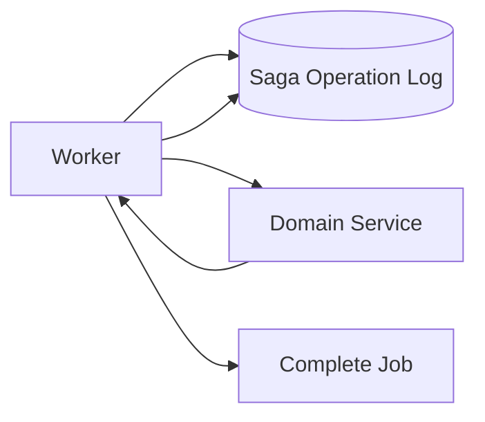

Example fields:

```sql
create table saga_operation_log (
    operation_id varchar(128) primary key,
    process_instance_key bigint not null,
    bpmn_process_id varchar(128) not null,
    activity_id varchar(128) not null,
    operation_type varchar(64) not null,
    business_key varchar(128) not null,
    external_reference varchar(128),
    status varchar(32) not null,
    request_hash varchar(128) not null,
    result_json jsonb,
    failure_reason text,
    created_at timestamp not null,
    updated_at timestamp not null
);
```

Use this when you need strong operational recovery and reconciliation across process and services.

---

## 24. Process-Level Saga Example

Case enforcement flow:

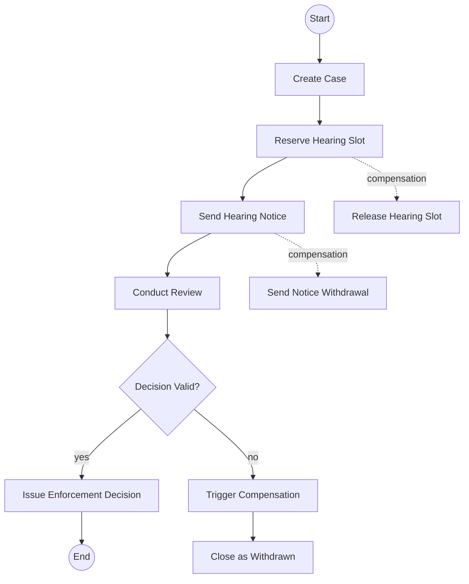

Reasoning:

- case creation may not be deleted; close/cancel instead;
- hearing slot can be released;
- notice cannot be unsent, so send withdrawal/correction;
- decision invalidity routes to compensation;
- compensation results are visible.

---

## 25. Process-Level Saga With Forward Recovery

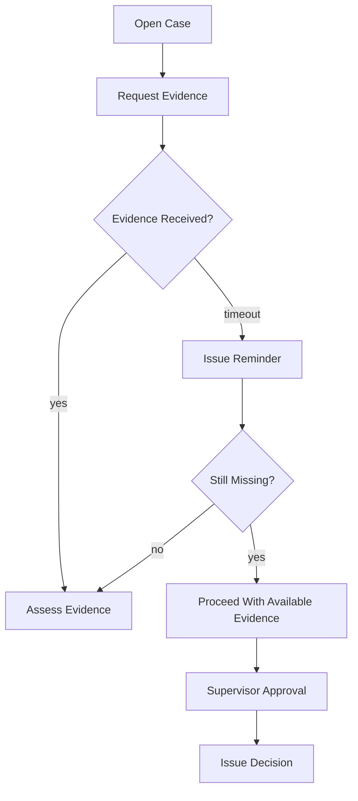

This is not compensation. Nothing is being undone. The process recovers forward through policy-approved alternate paths.

Use this often in regulatory workflows.

---

## 26. Avoid Transaction Subprocess Confusion

BPMN has a transaction subprocess concept, but you must verify execution support and semantics for your target Camunda 8 version. Do not assume a BPMN transaction subprocess gives you distributed ACID semantics.

In most Camunda 8 Saga designs, explicit compensation events, error event subprocesses, service tasks, call activities, user tasks, and clear worker contracts are more important than drawing a transaction boundary.

The invariant remains:

> External side effects commit in their own systems. Your process models recovery; it does not magically roll them back.

---

## 27. Compensation Testing Matrix

For every compensation path, test:

| Scenario | Expected Result |
|---|---|
| original action succeeds, later failure triggers compensation | compensation worker invoked |
| original action fails before side effect | compensation not invoked |
| original action times out after external commit | reconciliation uses idempotency key |
| compensation worker fails with retries left | retry/backoff |
| compensation worker exhausts retries | incident visible |
| compensation triggered twice | idempotent no duplicate reversal |
| ordered compensation required | handlers execute in modeled order |
| irreversible action | corrective action, not fake undo |
| human approval rejects compensation | alternate recovery path |
| process canceled during compensation | handler interruption behavior understood |

---

## 28. Operational Runbook for Compensation Incidents

A compensation incident is serious because the system is already in recovery mode.

Runbook should include:

1. Identify original action.
2. Identify compensation activity.
3. Check external system state.
4. Check idempotency key / operation log.
5. Determine whether compensation already succeeded externally.
6. If succeeded externally but job failed, complete/retry safely.
7. If failed externally but retryable, increase retries with corrected variables.
8. If impossible automatically, route to manual recovery task.
9. Record operator decision.
10. Publish correction/recovery event if required.

Never resolve compensation incidents blindly.

---

## 29. Anti-Patterns

### Anti-pattern 1 — Compensation as delete

Deleting records destroys auditability.

Prefer reversing records, superseding records, or status transitions.

### Anti-pattern 2 — Compensation without original reference

If the original task does not store external reference IDs, compensation becomes guesswork.

### Anti-pattern 3 — Compensating technical failures

Do not compensate because HTTP timed out. First determine whether the original effect happened.

### Anti-pattern 4 — Non-idempotent compensation

Compensation can be retried. It must tolerate duplicates.

### Anti-pattern 5 — Generic `undo-everything` process

Recovery is domain-specific. Generic undo usually hides invalid assumptions.

### Anti-pattern 6 — Modeling fake reversibility

Some actions cannot be undone. Model correction, not fiction.

### Anti-pattern 7 — Business recovery as incident only

Incidents are for operational intervention. Business recovery should be modeled if it is expected.

### Anti-pattern 8 — Process variables as recovery database

Process variables are orchestration state, not a substitute for domain audit and reconciliation records.

---

## 30. Review Checklist

Before approving a Saga process, verify:

- every side-effecting activity is identified;
- each side effect has owner system;
- each side effect has external reference captured;
- every compensation action is idempotent;
- irreversible actions use correction/supersession;
- ordered compensation is explicitly modeled;
- multi-instance compensation is understood;
- compensation failure creates actionable incident;
- human approval exists where policy requires it;
- audit trail appends instead of deletes;
- tests cover duplicate and unknown outcome scenarios;
- runbook exists for compensation incidents;
- domain services, not workers, enforce domain invariants.

---

## 31. Regulatory Enforcement Example

Suppose a regulator starts an enforcement action:

1. Create enforcement case.
2. Freeze related account.
3. Notify respondent.
4. Request evidence.
5. Review evidence.
6. Decide action invalid due to jurisdiction issue.

Naive compensation:

```text
Delete case, unfreeze account, delete notice
```

Defensible compensation:

```text
Close case as invalid jurisdiction
Release account freeze with reference to invalid jurisdiction finding
Issue notice of withdrawal/correction
Preserve original notice and withdrawal notice
Publish EnforcementActionWithdrawn event
Record reviewer and legal basis
```

This is the difference between technical undo and regulatory-grade recovery.

---

## 32. Java Design Structure

Use clear packages:

```text
com.example.enforcement.workflow
  worker
    CreateEnforcementActionWorker
    ReverseEnforcementActionWorker
    ReleaseFreezeWorker
  contract
    CreateEnforcementActionInput
    CreateEnforcementActionOutput
    ReverseEnforcementActionInput
  client
    EnforcementCaseClient
    AccountFreezeClient
    NotificationClient
  saga
    SagaOperationLog
    SagaOperationRepository
    IdempotencyKeyFactory
  error
    BusinessErrorMapper
    RetryClassifier
```

Keep compensation code visible. Do not hide it inside generic helper methods.

---

## 33. Compensation Worker Contract Example

```java
public record ReversePenaltyInput(
    String caseId,
    String penaltyId,
    String reasonCode,
    String requestedBy,
    String legalBasis
) {}

public record ReversePenaltyOutput(
    String reversalId,
    String penaltyId,
    String status,
    Instant reversedAt
) {}
```

The compensation worker should validate:

- `penaltyId` exists;
- reason code is allowed;
- legal basis is present;
- caller/process is authorized;
- reversal is idempotent;
- reversal result is captured.

---

## 34. Top 1% Engineering Rubric

You understand Saga and compensation when you can:

- explain why distributed rollback is not available;
- identify every external side effect in a process;
- distinguish retry, BPMN error, incident, compensation, and forward recovery;
- design idempotent original and compensating workers;
- handle unknown outcomes through reconciliation;
- model irreversible actions honestly;
- trigger ordered compensation where needed;
- test compensation and duplicate execution;
- build operational runbooks for recovery incidents;
- defend recovery choices in audit/regulatory review.

---

## 35. References

- Camunda 8 Docs — Compensation events: https://docs.camunda.io/docs/components/modeler/bpmn/compensation-events/
- Camunda 8 Docs — Compensation handler marker: https://docs.camunda.io/docs/components/modeler/bpmn/compensation-handler/
- Camunda 8 Docs — Dealing with problems and exceptions: https://docs.camunda.io/docs/components/best-practices/development/dealing-with-problems-and-exceptions/
- Camunda 8 Docs — Incidents: https://docs.camunda.io/docs/components/concepts/incidents/
- Camunda 8 Docs — Service tasks: https://docs.camunda.io/docs/components/modeler/bpmn/service-tasks/

---

## 36. What Comes Next

Part 023 moves from Saga recovery to **long-running case and lifecycle modeling**.

We will design processes that last weeks, months, or years without becoming unbounded BPMN monsters: case lifecycle state, suspension, reopening, appeal, escalation, reassignment, and regulatory defensibility.
