# Part 023 — Long-Running Case and Lifecycle Modeling

A short workflow can often be modeled as a direct sequence of tasks.

A long-running regulatory case cannot.

It may last days, months, or years. It may wait for documents, human decisions, appeals, remediation evidence, external agency responses, statutory deadlines, organizational reassignment, policy changes, and reopening events. Some actions are linear. Some are parallel. Some are reversible. Some are not. Some must be visible to auditors long after the runtime process instance is gone.

This part is about designing that kind of system with Camunda 8 Zeebe without turning one BPMN file into an immortal monster.

The key shift is simple but deep:

> A process instance is an orchestration thread. A case is a domain object with lifecycle, ownership, evidence, policy, and audit semantics.

They overlap, but they are not the same thing.

---

## 1. Kaufman Deconstruction

The subskill is **modeling long-running business lifecycles without losing control of state, ownership, and auditability**.

Break it into smaller skills:

1. Separate case state from process execution state.
2. Model stable lifecycle milestones as domain concepts.
3. Use BPMN for executable orchestration, not as the only case database.
4. Design waiting states around explicit events, tasks, and timers.
5. Model suspension, reopening, appeal, escalation, and cancellation intentionally.
6. Keep long-running process variables small, stable, and meaningful.
7. Decompose open-ended workflows into bounded episodes.
8. Preserve auditability across process versions and service changes.

The first 20 hours should not be spent drawing prettier BPMN. They should be spent building the judgment to answer:

- Should this be one process instance or many?
- Should this be a BPMN state, a domain state, a task state, or an event?
- Should this wait inside Zeebe or in a domain service?
- What happens after six months, a model upgrade, a reopened case, or a failed downstream system?

---

## 2. The Core Mental Model

A long-running case-oriented system usually has four state layers.

| Layer | Owned By | Example | Should BPMN Own It? |
|---|---|---|---|
| Domain case state | Case service / domain model | `UNDER_INVESTIGATION`, `DECISION_PENDING`, `CLOSED` | No, BPMN may drive it, but should not be the only source |
| Process execution state | Zeebe | Waiting at `Receive Evidence`, active user task, timer subscription | Yes |
| Human task state | Tasklist/custom task service | Assigned, claimed, completed, reassigned | Partly, depending on platform boundary |
| Audit/evidence state | Audit/event/evidence services | Notice served, document received, decision approved | No, BPMN should reference it |

A top-tier design does not collapse these layers into one giant variable object called `case`.

It uses each layer for what it is good at:

- **Domain service** stores durable business truth.
- **Zeebe process** coordinates the next executable step.
- **Task system** exposes human work and assignment.
- **Audit/evidence system** preserves defensibility.

### 2.1 Why This Matters in Zeebe

Zeebe is a distributed workflow engine with event-sourced process execution. It can keep process instances waiting at user tasks, receive tasks, message events, timers, and other wait states.

But that does not mean every business lifecycle fact should live as a process variable.

Long-running processes amplify every modeling mistake:

- Bad variable shape becomes long-lived compatibility debt.
- Bad version binding becomes upgrade risk.
- Bad task ownership becomes stuck work.
- Bad timer modeling becomes operational noise.
- Bad correlation key design becomes unrecoverable event loss.
- Bad case/process boundary becomes audit ambiguity.

---

## 3. Case Is Not Process

A **case** is the business object.

A **process instance** is one executable path that coordinates work related to that object.

For example, a regulatory enforcement case may have this lifecycle:

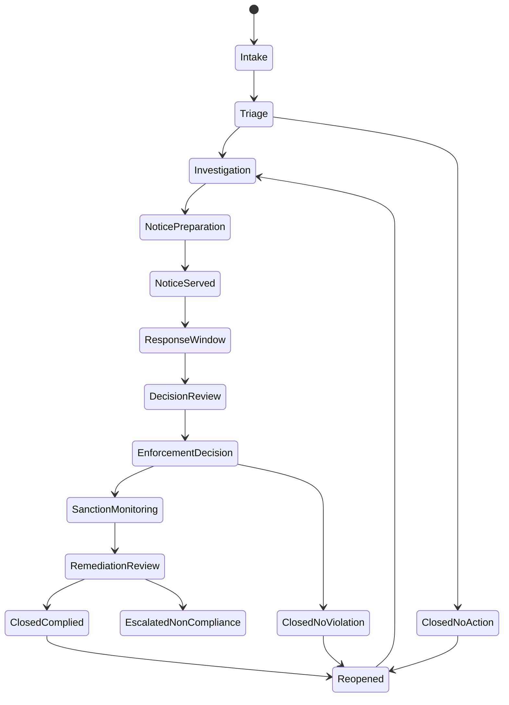

This state diagram is not automatically one BPMN process.

It is a domain lifecycle map. BPMN may implement some transitions, observe others, and delegate some to services.

### 3.1 Better Question

Do not ask:

> How do I draw the entire case lifecycle in BPMN?

Ask:

> Which lifecycle transitions require orchestration, waiting, human work, retry, audit, SLA, or external integration?

That question produces better process boundaries.

---

## 4. Process Boundary Heuristics

Use one process instance when:

- the sequence has a clear start and end;
- the process owns the next-step coordination;
- intermediate waiting states are explicit and bounded;
- the model can be versioned without trapping old instances forever;
- the process variables can remain small and stable;
- failures can be handled within one owner boundary.

Use multiple process instances when:

- different lifecycle episodes have independent ownership;
- parts can run independently or in parallel;
- some subflows have separate versioning cadence;
- a subflow can be repeated, reopened, or canceled independently;
- one entity spawns many child entities;
- a parent should coordinate but not micromanage every detail.

Use a domain state machine when:

- the transition is purely domain validation;
- no orchestration is required;
- state change must be synchronous with a command;
- the state is queried frequently by business applications;
- the state must survive process deletion, migration, or re-modeling.

Use an event stream when:

- many consumers care about the same fact;
- no single orchestrator owns the end-to-end flow;
- eventual consistency is acceptable;
- downstream work should react independently.

---

## 5. A Practical Layered Architecture

A production case platform should usually look more like this:

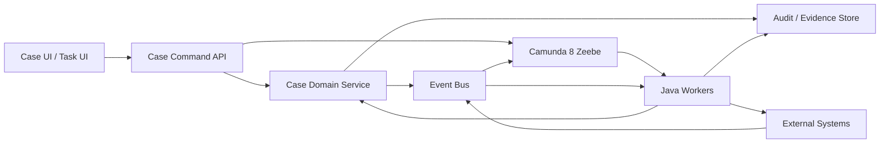

Important boundaries:

- The Case Domain Service owns business invariants.
- Zeebe owns executable orchestration state.
- Workers translate process work into domain commands or external calls.
- Audit/evidence storage is append-friendly and queryable outside BPMN.
- Event bus broadcasts facts, not hidden process control commands.

### 5.1 The Case Service Should Not Be Dumb Storage

A common weak architecture uses Camunda as the real lifecycle owner and a database as a passive variable dump.

That is fragile.

The case service should protect invariants such as:

- a closed case cannot receive ordinary investigative actions unless reopened;
- a sanction cannot be imposed before required notice is served;
- an appeal cannot be accepted after the statutory window unless an override is recorded;
- an officer cannot approve their own enforcement decision in four-eyes mode;
- evidence cannot be deleted if it was used in a final decision;
- deadline extensions must cite a legal basis.

BPMN coordinates when these checks happen. The domain service enforces whether they are valid.

---

## 6. Modeling Long-Running Waiting States

Long-running cases spend most of their time waiting.

A wait may be caused by:

- a human task;
- an external document submission;
- a statutory response window;
- a downstream agency reply;
- an appeal deadline;
- a remediation deadline;
- a scheduled review;
- a policy exception approval;
- a manual suspension/resume action.

In BPMN, these waits map to different constructs.

| Wait Type | BPMN Construct | Key Design Concern |
|---|---|---|
| Human work | User task | Assignment, authorization, due date, reassignment |
| External event | Message catch / receive task | Correlation key, TTL, idempotency |
| Deadline | Timer boundary/intermediate event | Clock semantics, escalation, cancellation |
| Interrupting urgent event | Event subprocess / boundary event | Scope, cancellation behavior |
| Reusable episode | Call activity | Version binding, input/output contract |
| Parallel entity work | Multi-instance activity/subprocess | Local variable isolation, fan-in semantics |

### 6.1 Waiting Is a Contract

Every wait state should define:

- what event/task/timer releases it;
- who owns the condition;
- how it is correlated;
- how long it can wait;
- what happens if it expires;
- whether it is interrupting or non-interrupting;
- what audit record proves the transition;
- what process variable changes are allowed.

If you cannot answer those questions, the BPMN shape is not production-ready.

---

## 7. Regulatory Enforcement Lifecycle Example

Consider an enforcement case:

1. Complaint received.
2. Intake validation.
3. Triage decision.
4. Investigation.
5. Evidence collection.
6. Notice of alleged violation.
7. Respondent response window.
8. Legal review.
9. Enforcement decision.
10. Sanction/remediation monitoring.
11. Closure or escalation.
12. Appeal/reopening.

A naive BPMN model draws all of this in one diagram.

A better architecture separates stable lifecycle from bounded episodes.

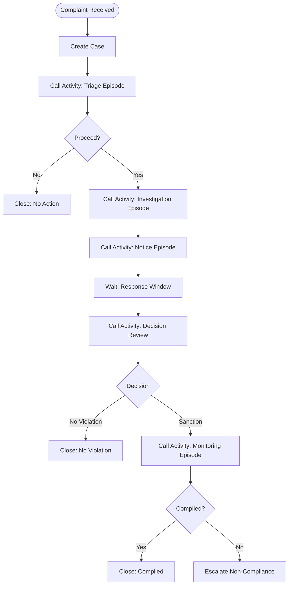

This parent process is a lifecycle coordinator, not a full implementation dump.

The actual details of investigation, notice, decision review, and monitoring can live in separate called processes with their own tests, ownership, and version strategy.

---

## 8. Episode-Oriented Modeling

An **episode** is a bounded piece of lifecycle work with a meaningful start and end.

Examples:

- intake episode;
- triage episode;
- investigation episode;
- evidence request episode;
- notice service episode;
- response window episode;
- legal review episode;
- sanction monitoring episode;
- appeal episode;
- reopening episode.

This style works well because long-running cases are often not one linear procedure. They are a sequence of bounded procedural episodes around a durable case object.

### 8.1 Episode Contract

Every episode should define:

```yaml
episode: investigation
authorizedCaseStates:
  - UNDER_INVESTIGATION
startsWhen:
  - triageDecision == PROCEED
endsWith:
  - investigationSummaryCreated
  - investigationCancelled
  - investigationEscalated
input:
  - caseId
  - investigationScope
  - assignedTeam
output:
  - investigationOutcome
  - evidenceSummaryId
  - recommendedNextAction
sideEffects:
  - create investigation tasks
  - request evidence
  - append audit events
failurePolicy:
  - technical retry for service errors
  - incident for unrecoverable integration failure
  - business error for invalid state
```

Without this contract, a call activity is just diagram reuse. With it, the episode becomes an architectural module.

---

## 9. Stable State Machine, Flexible Orchestration

For long-running systems, the domain lifecycle should be more stable than the BPMN implementation.

The lifecycle state machine might remain stable for years:

- `INTAKE`
- `TRIAGE`
- `UNDER_INVESTIGATION`
- `NOTICE_PENDING`
- `RESPONSE_WINDOW`
- `DECISION_PENDING`
- `SANCTION_MONITORING`
- `APPEAL_PENDING`
- `CLOSED`
- `REOPENED`
- `SUSPENDED`

But the orchestration can evolve:

- new evidence validation task;
- new external registry check;
- new AI-assisted document triage;
- new approval threshold;
- new appeal routing;
- new remediation monitoring cadence.

That is healthy.

If your case lifecycle breaks every time BPMN changes, the boundary is wrong.

---

## 10. Command-Oriented Worker Pattern

Workers should not mutate the entire case object directly.

A worker should usually issue a domain command:

```java
public record ServeNoticeCommand(
    String caseId,
    String noticeTemplateId,
    String respondentPartyId,
    String processInstanceKey,
    String idempotencyKey
) {}
```

The case service handles validation:

```java
public NoticeResult serveNotice(ServeNoticeCommand command) {
    CaseFile caseFile = repository.getForUpdate(command.caseId());

    if (!caseFile.isInState(CaseState.NOTICE_PENDING)) {
        throw new BusinessRuleViolation("CASE_NOT_READY_FOR_NOTICE");
    }

    if (noticeRepository.existsByIdempotencyKey(command.idempotencyKey())) {
        return noticeRepository.getResult(command.idempotencyKey());
    }

    NoticeResult result = noticeGateway.serve(command);
    caseFile.recordNoticeServed(result.noticeId(), result.servedAt());
    audit.append(NoticeServed.from(command, result));
    repository.save(caseFile);
    return result;
}
```

The worker then maps outcomes to BPMN concepts:

- success → complete job with small output;
- domain invalid state → throw BPMN error or fail without retry depending on model;
- temporary infrastructure failure → fail job with retry/backoff;
- unknown external outcome → complete to a reconciliation step or fail to incident based on policy.

---

## 11. Modeling Reopen

Reopen is a lifecycle concept, not just a loop arrow.

A case may be reopened because:

- new evidence appears;
- a court/appeal body reverses a decision;
- remediation failed after closure;
- duplicate cases are merged;
- prior decision was procedurally defective;
- statutory review is triggered.

There are two common designs.

### 11.1 Reopen as New Episode

Use when reopening is rare, explicit, and auditable.

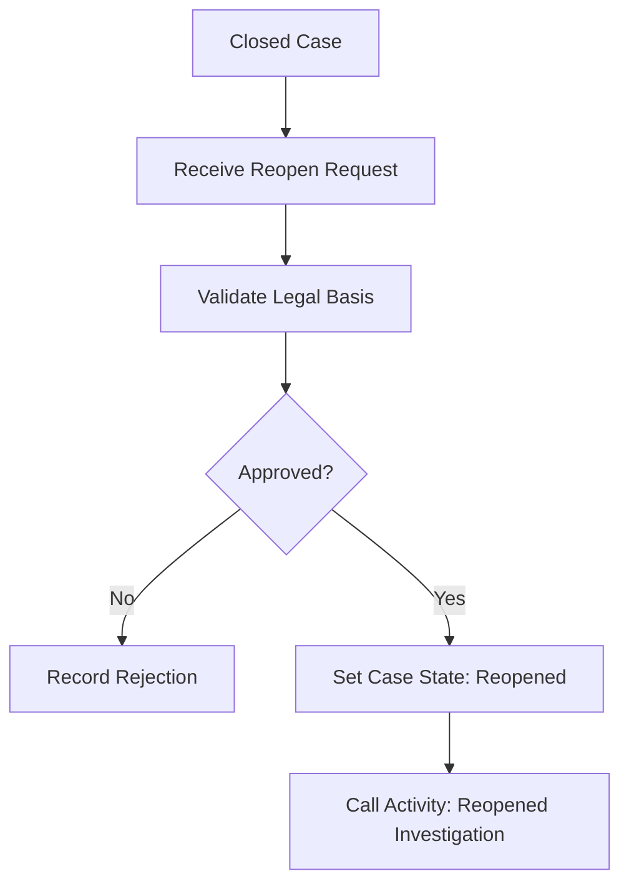

This is often the safest design for regulatory systems.

### 11.2 Reopen as Message to Existing Instance

Use only if the original process instance is intentionally kept alive after closure-like waiting.

This is less common because keeping process instances around forever creates upgrade and operational burden.

A better design is usually:

- close the original process;
- persist case state and audit trail;
- start a new `case-reopen-process` correlated by `caseId`;
- link the new process to the original process instance key for traceability.

---

## 12. Modeling Suspension and Resume

Suspension is not the same as waiting.

A process waits because it expects an event or task. A case is suspended because normal progression is legally or operationally paused.

Examples:

- court injunction;
- bankruptcy stay;
- law enforcement hold;
- missing jurisdiction confirmation;
- respondent unreachable;
- policy moratorium.

Design options:

### 12.1 Domain Suspension with Process Wait

The domain state becomes `SUSPENDED`, and the process waits for a resume message.

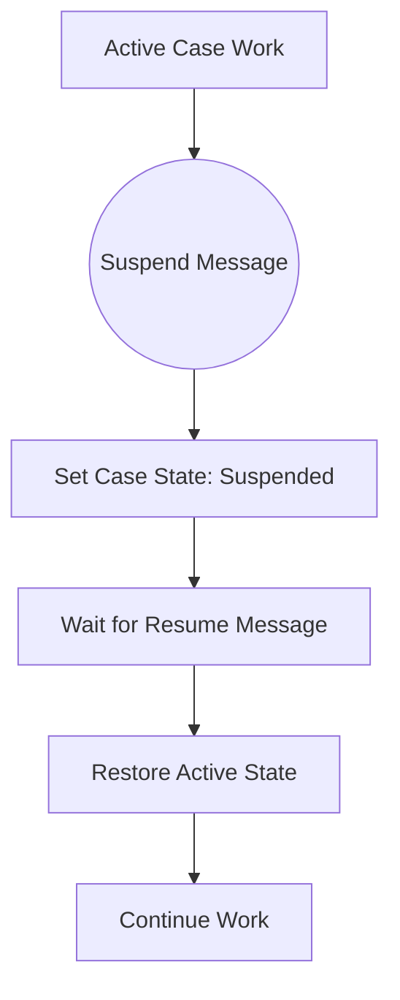

This is simple when suspension happens at known points.

### 12.2 Event Subprocess for Suspension

Use an interrupting event subprocess when suspension can happen from many points in the process scope.

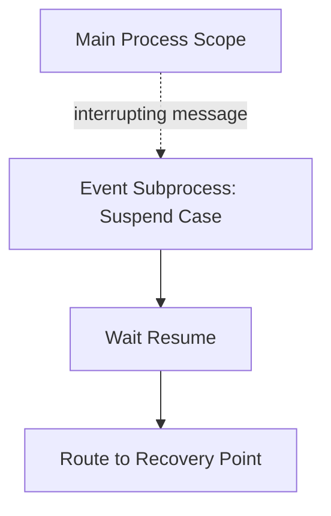

Be careful: interrupting event subprocesses can cancel active work. In regulatory workflows, that may be correct or disastrous depending on the legal semantics.

### 12.3 Non-Interrupting Notification

If suspension should block future commands but not cancel current tasks, model it in the domain service and let existing tasks fail validation or become hidden by authorization rules.

This avoids accidentally terminating work that must remain visible for audit.

---

## 13. Modeling Appeal

Appeal is usually not a loop back to the previous task.

It is a separate legal/control pathway with its own ownership, deadlines, evidence, and possible outcomes.

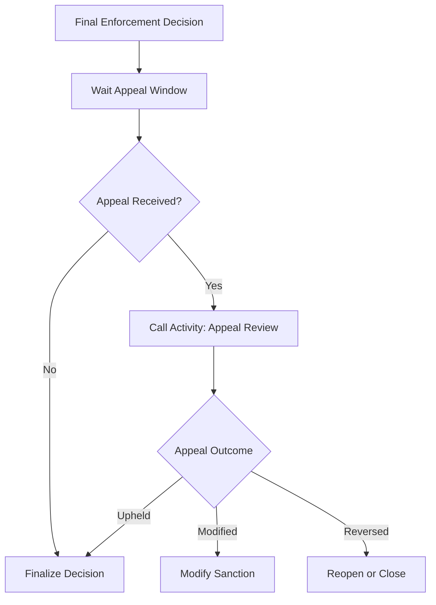

Appeal design checklist:

- What is the appeal filing deadline?
- Can the deadline be extended?
- Does appeal suspend enforcement automatically?
- Who can accept or reject appeal validity?
- Is new evidence allowed?
- Can the original decision maker participate?
- What happens to monitoring deadlines during appeal?
- How is the appeal outcome linked to the original decision?

---

## 14. Modeling Escalation

Escalation is a controlled change in priority, authority, route, or consequence.

Do not model escalation as a random email notification.

Escalation should answer:

- what condition triggered it;
- what authority receives it;
- what work is canceled or preserved;
- whether the case state changes;
- whether the SLA clock changes;
- whether the escalation can be reversed;
- how audit proves escalation was justified.

### 14.1 Escalation Ladder

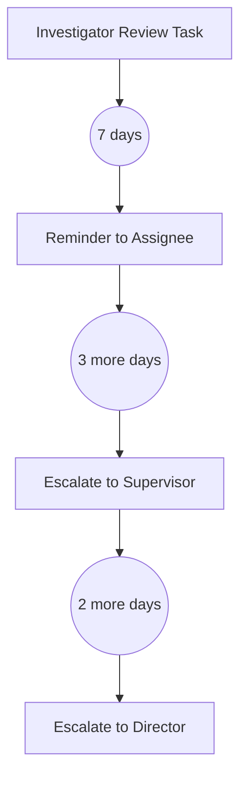

This should be paired with a domain escalation record:

```json
{
  "caseId": "CASE-2026-000123",
  "escalationLevel": "SUPERVISOR",
  "trigger": "INVESTIGATOR_REVIEW_OVERDUE",
  "triggeredAt": "2026-06-28T10:15:00Z",
  "previousOwner": "officer-231",
  "newOwner": "supervisor-22",
  "processInstanceKey": "2251799813685311"
}
```

---

## 15. Avoiding the Immortal Process

An immortal process is a process instance intended to represent the entire lifetime of a business object forever.

It is tempting.

It gives a nice diagram.

It is often wrong.

Problems:

- old process versions remain active for years;
- model migration becomes unavoidable;
- variable schemas become frozen or messy;
- task authorization rules drift;
- old worker types must remain supported;
- timers accumulate;
- stuck instances become hard to reason about;
- process graph becomes too large to review;
- audit depends on runtime internals instead of durable records.

### 15.1 Better Alternative

Use a **case lifecycle service** plus **bounded orchestration episodes**.

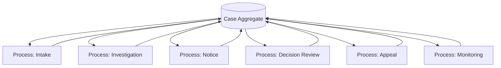

The case aggregate is durable and queryable. BPMN episodes are executable and replaceable.

---

## 16. The Case Lifecycle Coordinator Pattern

A coordinator process can be useful when the lifecycle is mostly linear and controlled.

Responsibilities:

- invoke episodes;
- wait for major business events;
- enforce high-level routing;
- manage high-level SLA timers;
- update milestone state through domain commands;
- avoid embedding detailed work rules.

Non-responsibilities:

- store all evidence;
- calculate all policy decisions;
- own every assignment rule;
- act as a reporting database;
- replace domain validation;
- replace audit storage.

### 16.1 Coordinator BPMN Shape

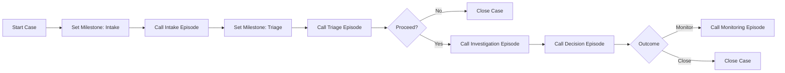

The coordinator contains the lifecycle skeleton. Each episode owns details.

---

## 17. State Transition as an Explicit Worker

Every major lifecycle transition should be explicit.

Bad design:

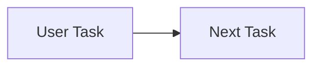

The model hides the fact that case state changed.

Better design:

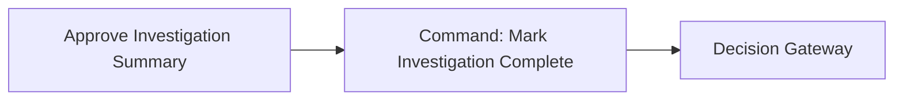

This makes lifecycle transition auditable and testable.

The worker should emit a domain event like:

```json
{
  "eventType": "CaseInvestigationCompleted",
  "caseId": "CASE-2026-000123",
  "fromState": "UNDER_INVESTIGATION",
  "toState": "DECISION_PENDING",
  "processInstanceKey": "2251799813685311",
  "causation": "task:investigation-summary-approval",
  "occurredAt": "2026-06-28T10:15:00Z"
}
```

---

## 18. Versioning Long-Running Lifecycles

Long-running process design must assume versions will change while instances are active.

Plan for:

- new tasks;
- new policy rules;
- new worker contracts;
- changed forms;
- changed assignment logic;
- added appeal branch;
- changed SLA;
- changed document requirements.

Design principles:

1. Keep process variables backward compatible.
2. Use stable domain commands.
3. Avoid removing worker types still used by active instances.
4. Use call activity binding intentionally.
5. Version reusable episodes separately.
6. Record process definition version/key in audit events.
7. Decide whether old cases continue on old procedure or migrate.

### 18.1 Policy Version vs Process Version

In regulatory systems, policy version may matter more than process version.

A case may be processed under:

- law effective date;
- policy manual version;
- decision rule version;
- form version;
- BPMN process version;
- worker implementation version.

Do not mix these into one concept.

A process version tells what orchestration model executed.
A policy version tells what rule basis was applied.
A form version tells what information was collected.
An audit event tells what actually happened.

---

## 19. Long-Running Variable Strategy

Long-running process variables should be:

- small;
- stable;
- non-sensitive where possible;
- identifiers rather than large documents;
- current routing facts, not full domain objects;
- compatible across process versions;
- safe to expose in operational tools.

Good variable shape:

```json
{
  "caseId": "CASE-2026-000123",
  "primaryPartyId": "PTY-009",
  "caseType": "MARKET_ABUSE",
  "riskTier": "HIGH",
  "jurisdiction": "ID",
  "currentMilestone": "INVESTIGATION",
  "policyVersion": "2026.03",
  "correlation": {
    "caseKey": "case:CASE-2026-000123"
  }
}
```

Bad variable shape:

```json
{
  "case": {
    "allParties": [],
    "allDocumentsBase64": [],
    "allInvestigatorNotes": [],
    "allAuditEvents": [],
    "allExternalSystemResponses": []
  }
}
```

The second shape creates performance, privacy, compatibility, and audit problems.

---

## 20. Handling Human Reassignment Over Time

Long-running tasks face organizational drift:

- people leave;
- teams merge;
- permissions change;
- region ownership changes;
- case risk tier changes;
- conflict-of-interest appears later.

Therefore assignment should often be computed by an assignment service rather than hard-coded in BPMN.

Worker pattern:

```java
@JobWorker(type = "assign-case-reviewer")
public Map<String, Object> assignReviewer(ActivatedJob job) {
    String caseId = (String) job.getVariablesAsMap().get("caseId");
    Assignment assignment = assignmentService.assignReviewer(caseId);

    return Map.of(
        "reviewerUserId", assignment.userId(),
        "reviewerGroupId", assignment.groupId(),
        "assignmentPolicyVersion", assignment.policyVersion()
    );
}
```

Then the user task reads assignment variables.

This is better than embedding all routing policy in FEEL.

---

## 21. Handling Deadlines and Legal Time

Deadlines in regulatory systems are not just timestamps.

They may depend on:

- business days;
- holidays;
- service date;
- jurisdiction;
- respondent type;
- extension requests;
- suspension periods;
- appeal status;
- force majeure exceptions.

Do not let every BPMN timer calculate legal time independently.

Use a deadline service:

```java
public record DeadlineRequest(
    String caseId,
    String deadlineType,
    String jurisdiction,
    Instant anchorTime,
    String policyVersion
) {}
```

The worker returns:

```json
{
  "responseDeadlineAt": "2026-07-28T16:59:59Z",
  "deadlineCalculationId": "DLC-123",
  "deadlinePolicyVersion": "2026.03"
}
```

The BPMN timer uses the calculated deadline.
The domain/audit service records how it was calculated.

---

## 22. Event Subprocess for Cross-Cutting Case Events

Some events can happen at many points:

- case withdrawn;
- case merged;
- legal hold imposed;
- urgent risk escalation;
- respondent deceased/dissolved;
- duplicate case detected;
- conflict of interest detected.

An event subprocess can model cross-cutting behavior.

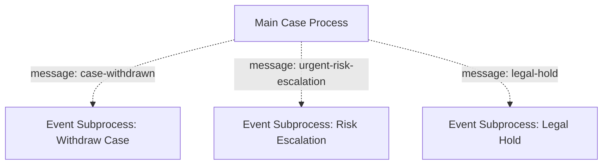

Use this carefully.

Questions:

- Is the event interrupting or non-interrupting?
- Which active tasks should be canceled?
- Which downstream operations must be compensated?
- Does the case state change immediately?
- Can the event happen multiple times?
- How is it authorized?
- What if it arrives before the process is ready?

---

## 23. Pattern: Milestone Event Publishing

A lifecycle process should publish milestone events for external visibility.

Examples:

- `CaseCreated`
- `CaseTriaged`
- `InvestigationOpened`
- `NoticeServed`
- `ResponseWindowExpired`
- `DecisionApproved`
- `SanctionImposed`
- `AppealReceived`
- `CaseClosed`
- `CaseReopened`

Each event should include:

- case ID;
- business event type;
- domain state before/after;
- process instance key;
- process definition ID/version;
- actor or system;
- policy version;
- causation ID;
- correlation ID;
- occurred at;
- audit record ID.

This gives external systems durable facts without coupling them to Zeebe internals.

---

## 24. Pattern: Watchdog Process

Sometimes the main lifecycle should not own every monitoring responsibility.

A watchdog process can monitor deadlines, missing evidence, compliance obligations, or stale tasks.

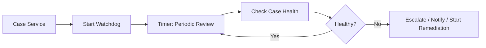

Use watchdogs when:

- monitoring cadence may change independently;
- many cases share monitoring policy;
- alerts should not complicate the main process;
- monitoring continues after an episode ends;
- operations team owns monitoring separately.

Avoid watchdogs when they duplicate logic already modeled in a precise timer or SLA boundary event.

---

## 25. Pattern: Case Snapshot at Decision Point

A final decision should be based on a stable snapshot.

Do not let reviewers unknowingly decide on a moving target.

Pattern:

1. Collect evidence.
2. Create decision packet snapshot.
3. Freeze packet version.
4. Review decision packet.
5. Approve/reject based on packet ID.
6. Record decision with packet ID.

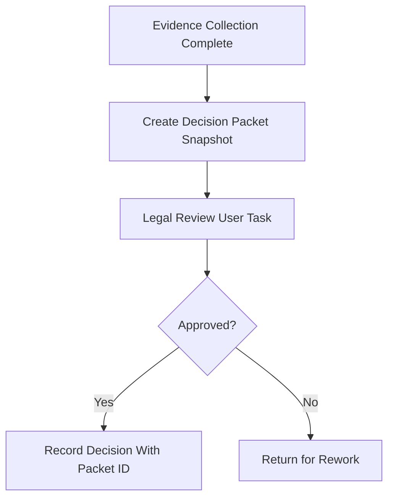

This is critical for defensibility. Audit should show what evidence was available at the time of decision.

---

## 26. Pattern: Rework Loop with Guardrails

Rework is common in human workflows.

Bad rework loop:

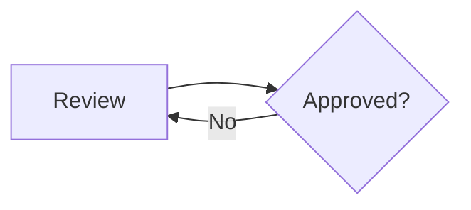

This hides who fixes the problem and why.

Better:

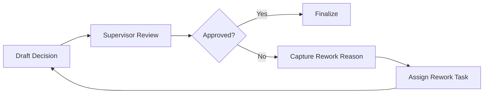

Rework needs:

- reason code;
- comments;
- owner;
- due date;
- attempt count;
- escalation policy;
- audit link;
- optional max iteration guard.

---

## 27. Anti-Patterns

### 27.1 The Universe Process

One BPMN model contains every lifecycle branch, every exception, every appeal, every monitoring rule, every entity, every notification, every SLA, and every data transformation.

Symptoms:

- unreadable model;
- merge conflicts in Web/Desktop Modeler;
- impossible testing matrix;
- every change risks every case;
- process instance migration pressure;
- unclear ownership.

Better: lifecycle coordinator plus episode processes.

### 27.2 Process Variable as Case Database

The process variable stores entire case state, evidence, audit history, external responses, and derived reports.

Better: store IDs and routing facts. Use domain services for durable state.

### 27.3 Hidden State Transition

A user task completion silently implies a major lifecycle change.

Better: explicit transition worker or domain command.

### 27.4 Reopen as Loop to Beginning

The model loops a closed case back to intake as if history did not matter.

Better: reopen episode with legal basis and audit trail.

### 27.5 Timer Everywhere

Every SLA is a boundary timer attached to every task.

Better: classify deadlines. Some belong in BPMN, some in a deadline service, some in watchdog processes.

### 27.6 FEEL as Policy Engine

Complex legal eligibility logic is encoded in gateway expressions.

Better: use DMN or policy service, versioned and tested independently.

### 27.7 Long-Lived Worker Contract Drift

Active old process instances still call worker type `serve-notice`, but the worker now expects a different variable shape.

Better: backward-compatible DTOs, explicit worker versioning, stable commands.

### 27.8 Audit by Screenshot

The organization relies on Operate screenshots to prove what happened.

Better: durable audit events with domain meaning and process linkage.

---

## 28. Production Review Checklist

Before approving a long-running case process, review:

### Case/Process Boundary

- Is the durable case state owned outside BPMN?
- Are process variables small and stable?
- Is the process instance an orchestration thread, not the case database?
- Are major lifecycle transitions explicit?

### Wait States

- Is every wait correlated correctly?
- Is every timer legally meaningful?
- Is expiration behavior modeled?
- Are interrupting vs non-interrupting semantics intentional?

### Human Workflow

- Are assignment rules externalized where they may change?
- Are reassignments and stale tasks handled?
- Are due dates, priorities, and escalation rules explicit?
- Is maker-checker enforced by domain logic, not only UI?

### Versioning

- Can old process instances still complete?
- Are worker contracts backward compatible?
- Are called process binding types intentional?
- Are form/policy/decision versions recorded?

### Auditability

- Are domain events emitted for major milestones?
- Are evidence and decision packets referenced by ID?
- Is causation/correlation recorded?
- Can an auditor reconstruct who did what, when, and under which policy?

### Operations

- Are incidents actionable?
- Are stuck tasks detectable?
- Are long waits expected and observable?
- Is there a runbook for reopening, suspension, resume, and migration?

---

## 29. Practice Drill

Model a regulatory enforcement case with the following requirements:

1. A complaint starts a case.
2. Triage can close the case or start investigation.
3. Investigation may request evidence from multiple parties.
4. Notice must be served before decision.
5. Respondent has a response window.
6. Decision requires maker-checker approval.
7. Sanctions require monitoring.
8. Case may be suspended at any time.
9. Case may be appealed after decision.
10. Case may be reopened after closure with legal basis.

Deliverables:

- domain lifecycle state diagram;
- top-level coordinator BPMN;
- episode list with contracts;
- variable schema;
- domain event list;
- failure model;
- versioning strategy;
- audit checklist.

The goal is not to draw the most detailed BPMN. The goal is to defend every boundary.

---

## 30. Key Takeaways

Long-running case modeling is not about drawing all possible work into one BPMN diagram.

It is about separating durable business lifecycle from executable orchestration.

Use Camunda 8 Zeebe for what it does well:

- explicit process flow;
- human work coordination;
- timers and wait states;
- message correlation;
- service orchestration;
- incident visibility;
- auditable execution milestones.

Do not force Zeebe to be:

- your case database;
- your policy engine;
- your evidence store;
- your authorization system;
- your reporting warehouse;
- your only audit system;
- your entire domain model.

The top 1% skill is judgment: knowing which state belongs where, and designing lifecycle boundaries that can survive time, failure, policy change, audit, and migration.

---

## Reference Anchors

- Camunda 8 variables and scopes: https://docs.camunda.io/docs/components/concepts/variables/
- Camunda 8 message concepts: https://docs.camunda.io/docs/components/concepts/messages/
- Camunda 8 event subprocesses: https://docs.camunda.io/docs/components/modeler/bpmn/event-subprocesses/
- Camunda 8 call activities: https://docs.camunda.io/docs/components/modeler/bpmn/call-activities/
- Camunda 8 user tasks: https://docs.camunda.io/docs/components/modeler/bpmn/user-tasks/
