# Part 024 — Multi-Entity and Cross-Process Impact

Real enterprise workflows rarely operate on one clean entity.

A regulatory case may involve:

- one complaint;
- multiple respondents;
- multiple regulated products;
- multiple alleged violations;
- multiple evidence requests;
- multiple jurisdictions;
- multiple sanctions;
- multiple remediation obligations;
- linked prior cases;
- external agencies;
- parent organizations and subsidiaries;
- downstream notifications and reports.

If you model all of that as one giant process instance with one giant variable, the system will eventually fail under its own conceptual weight.

This part teaches how to model **multi-entity orchestration** and **cross-process impact** with Camunda 8 Zeebe while preserving clear ownership, correlation, idempotency, auditability, and operational control.

---

## 1. Kaufman Deconstruction

The subskill is **coordinating many related entities without losing consistency, traceability, or process clarity**.

Break it into smaller skills:

1. Identify entity boundaries.
2. Decide instance-per-case vs instance-per-entity vs instance-per-action.
3. Design parent-child orchestration.
4. Use multi-instance safely.
5. Correlate messages with stable keys.
6. Aggregate child outcomes without shared mutable chaos.
7. Propagate impact explicitly as events/commands.
8. Contain failure at the right boundary.
9. Preserve graph traceability across processes.

The first 20 hours should develop the judgment to avoid two extremes:

- **one process per universe**;
- **event soup with no orchestration owner**.

---

## 2. The Entity Graph Mental Model

Before drawing BPMN, draw the entity graph.

Example regulatory graph:

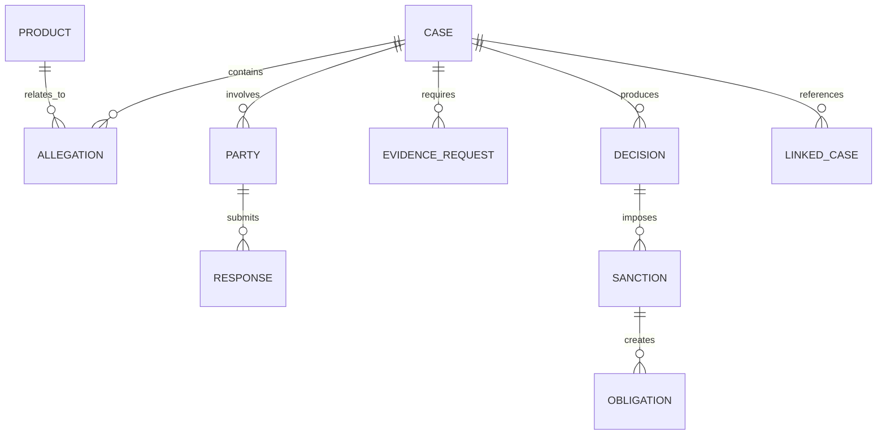

This graph tells you what exists.

BPMN tells you what work happens.

Do not confuse the two.

### 2.1 Entity Boundary Questions

For each entity, ask:

- Does it have its own lifecycle?
- Can it fail independently?
- Can it be assigned to a different team?
- Can it be versioned independently?
- Can it be repeated many times?
- Does it require separate audit trail?
- Does it need its own SLA?
- Does it produce an outcome that parent work aggregates?

If the answer is yes several times, it may deserve its own process or episode.

---

## 3. Process Instance Granularity

There are three common levels.

### 3.1 Instance per Case

One process coordinates the entire case.

Good for:

- simple linear lifecycle;
- small number of child entities;
- central ownership;
- predictable duration;
- low parallelism.

Risk:

- model becomes too large;
- arrays of children become shared mutable state;
- parallel work creates variable collisions;
- child failures are hard to isolate.

### 3.2 Instance per Entity

Each major entity gets its own process.

Examples:

- one investigation process per allegation;
- one evidence request process per party;
- one remediation process per obligation;
- one appeal process per decision.

Good for:

- independent ownership;
- parallel work;
- independent failure/retry;
- separate SLA;
- separate audit.

Risk:

- correlation complexity;
- parent aggregation complexity;
- more process instances;
- process graph observability required.

### 3.3 Instance per Action/Episode

A process is a bounded action, such as sending a notice or requesting evidence.

Good for:

- reusable operations;
- clear side-effect boundary;
- high volume;
- precise idempotency.

Risk:

- too many tiny processes;
- orchestration becomes fragmented;
- parent lifecycle may be hidden.

---

## 4. Parent-Child Orchestration Pattern

A parent process coordinates child processes but does not own their internal details.

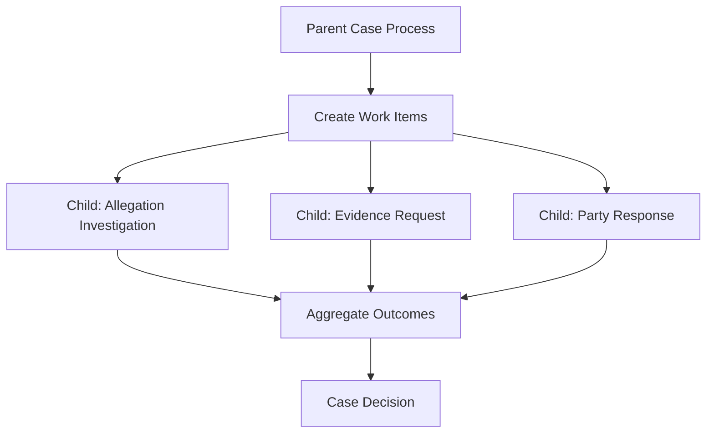

In BPMN, this may be implemented using:

- call activities;
- multi-instance call activities;
- message-based child processes;
- Java worker that starts child instances;
- external event aggregation.

The right choice depends on coupling and lifecycle.

---

## 5. Call Activity vs Message-Started Child Process

### 5.1 Call Activity

Use call activity when parent and child are structurally part of one orchestration.

Strengths:

- parent waits naturally for child completion;
- parent-child relationship is explicit;
- BPMN composition is readable;
- input/output mapping is direct;
- failure can be surfaced through the call activity boundary.

Weaknesses:

- child version binding matters;
- parent lifecycle is coupled to child completion;
- parent may block for long-running child work;
- cancellation semantics require care.

### 5.2 Message-Started Child Process

Use message-started child process when child lifecycle is independent.

Strengths:

- loose coupling;
- child can outlive or vary independently from parent;
- natural event-driven integration;
- easier cross-system triggers;
- parent can observe completion via messages/events.

Weaknesses:

- parent must aggregate manually;
- message correlation and idempotency become critical;
- no automatic call stack semantics;
- visibility requires process graph tracing.

### 5.3 Decision Matrix

| Criterion | Prefer Call Activity | Prefer Message-Started Child |
|---|---|---|
| Parent must wait synchronously | Yes | Not necessarily |
| Child is reusable module of parent | Yes | Maybe |
| Child has independent lifecycle | Maybe | Yes |
| Child can be triggered externally | No | Yes |
| Parent-child version coupling is acceptable | Yes | Less so |
| Completion must return direct output | Yes | Use completion message/event |
| Many external producers exist | No | Yes |

---

## 6. Multi-Instance Pattern

A multi-instance activity runs once for each item in a collection.

Common examples:

- request evidence from each party;
- assess each allegation;
- notify each affected respondent;
- review each sanction obligation;
- verify each document;
- collect approvals from multiple roles.

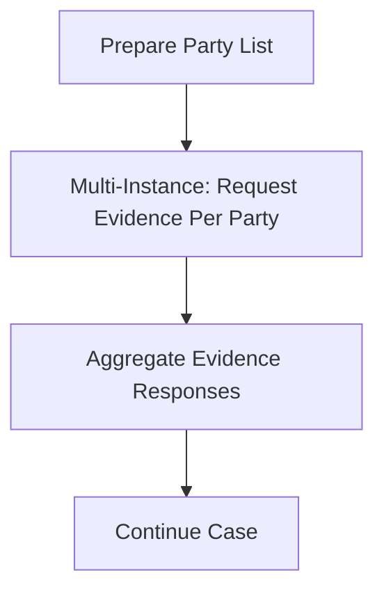

### 6.1 Multi-Instance Is Not Just a Loop

Think of it as controlled fan-out/fan-in.

Key questions:

- Is it sequential or parallel?
- What is the input collection?
- What is the per-item local variable?
- What result does each item produce?
- How are results collected?
- What if one item fails?
- What if one item times out?
- Can partial completion continue?
- Can the list change after fan-out starts?

### 6.2 Avoid Shared Mutable Variables

Parallel multi-instance is dangerous if each instance writes to the same process variable.

Bad pattern:

```json
{
  "partyReviewResult": "... overwritten by parallel instances ..."
}
```

Better pattern:

```json
{
  "partyReviewResults": [
    {
      "partyId": "PTY-001",
      "result": "RESPONSE_RECEIVED",
      "evidenceBundleId": "EVB-111"
    },
    {
      "partyId": "PTY-002",
      "result": "NO_RESPONSE",
      "evidenceBundleId": null
    }
  ]
}
```

In Camunda 8, use per-instance local variables and explicit output collection mapping to avoid collisions.

---

## 7. Multi-Instance Call Activity

A powerful pattern is multi-instance call activity.

Example: one child process per allegation.

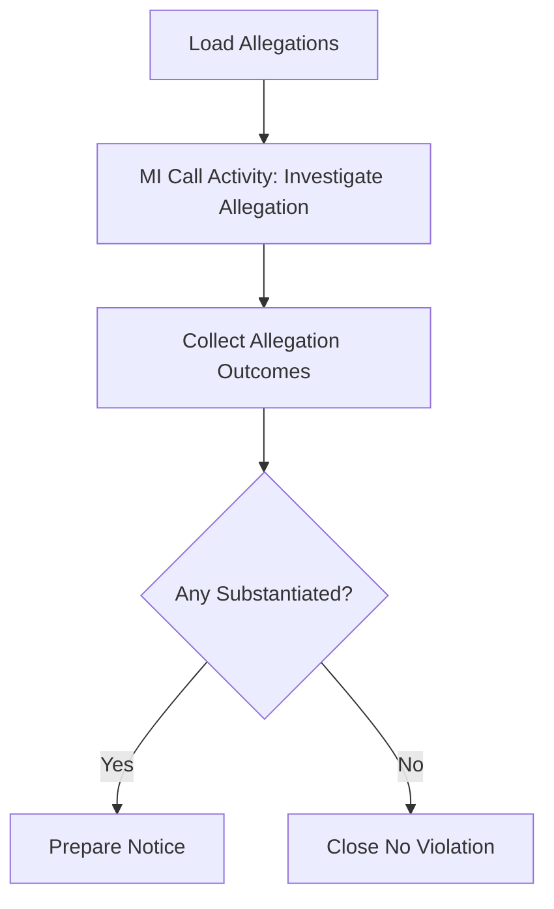

Input collection:

```json
{
  "allegations": [
    { "allegationId": "ALG-001", "type": "MISREPORTING" },
    { "allegationId": "ALG-002", "type": "UNLICENSED_ACTIVITY" }
  ]
}
```

Per-child input:

```json
{
  "caseId": "CASE-2026-000123",
  "allegationId": "ALG-001",
  "policyVersion": "2026.03"
}
```

Parent output:

```json
{
  "allegationOutcomes": [
    {
      "allegationId": "ALG-001",
      "outcome": "SUBSTANTIATED",
      "summaryId": "SUM-101"
    },
    {
      "allegationId": "ALG-002",
      "outcome": "NOT_SUBSTANTIATED",
      "summaryId": "SUM-102"
    }
  ]
}
```

### 7.1 Design Rule

A child process should return a summary, not the whole child universe.

Return:

- child ID;
- outcome;
- relevant evidence/summary IDs;
- completion timestamp;
- business status;
- error classification if modeled.

Do not return:

- all documents;
- all comments;
- all audit events;
- all external raw responses;
- all transient variables.

---

## 8. Aggregation Patterns

Multi-entity orchestration eventually needs aggregation.

Aggregation means the parent decides what child outcomes mean together.

### 8.1 All Must Complete

Use when every child result is required.

Example:

- every allegation must be assessed before final decision;
- every mandatory approval must be completed;
- every required regulator notification must succeed.

### 8.2 Any Can Trigger

Use when one result can move the case forward.

Example:

- any high-risk allegation triggers escalation;
- any party response with new evidence triggers review;
- any failed sanction obligation triggers enforcement.

### 8.3 Quorum / Threshold

Use when a threshold matters.

Example:

- at least two reviewers approve;
- majority committee decision;
- risk score crosses threshold;
- number of affected consumers exceeds trigger.

### 8.4 Best Effort

Use when some failures do not block final outcome.

Example:

- notify multiple systems, but one non-critical channel can fail;
- collect optional feedback;
- enrich case with non-authoritative data.

### 8.5 Explicit Aggregator Worker

Avoid complex gateway expressions for aggregation.

Use a worker or DMN decision:

```java
@JobWorker(type = "aggregate-allegation-outcomes")
public Map<String, Object> aggregate(ActivatedJob job) {
    CaseAggregationInput input = mapper.fromJob(job, CaseAggregationInput.class);
    AggregationResult result = aggregationService.aggregateAllegations(input.caseId());

    return Map.of(
        "caseOutcomeRecommendation", result.recommendation(),
        "substantiatedCount", result.substantiatedCount(),
        "aggregationId", result.aggregationId()
    );
}
```

The gateway can then route on a small, stable result variable.

---

## 9. Message Aggregator Pattern

Sometimes children are not called directly by the parent. They emit completion events.

A message aggregator process groups messages by correlation key and continues when criteria are met.

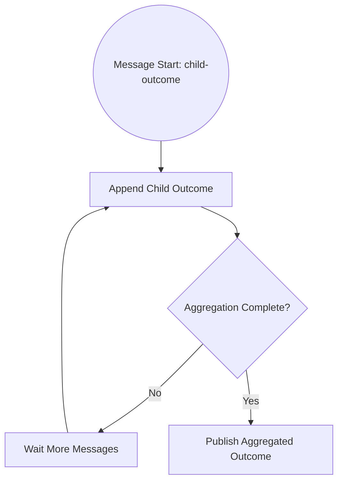

Useful for:

- child work started by many producers;
- batched document intake;
- external agency responses;
- asynchronous validation events;
- cross-case impact events.

Design fields:

```json
{
  "messageName": "allegation-investigation-completed",
  "correlationKey": "case:CASE-2026-000123",
  "messageId": "ALG-001:investigation-completed:v1",
  "variables": {
    "caseId": "CASE-2026-000123",
    "allegationId": "ALG-001",
    "outcome": "SUBSTANTIATED",
    "summaryId": "SUM-101"
  }
}
```

### 9.1 Aggregation Requires Idempotency

The same child completion message may be published twice.

The aggregator must deduplicate by:

- message ID;
- child entity ID;
- event type;
- version/sequence;
- idempotency key.

Never aggregate by blind append unless duplicate records are acceptable.

---

## 10. Impact Propagation Pattern

Cross-entity impact happens when one finding affects many other objects.

Examples:

- one party sanction affects all open cases involving that party;
- one product defect affects many complaints;
- one license revocation affects pending approvals;
- one systemic risk finding triggers review across multiple entities;
- one appeal decision invalidates downstream sanctions.

Do not hide this in one worker loop without traceability.

Model it explicitly:

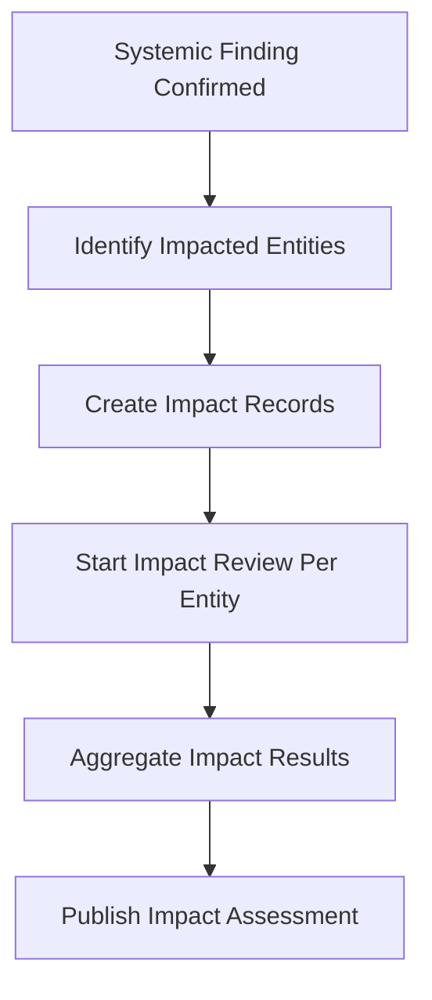

Impact record shape:

```json
{
  "impactId": "IMP-2026-001",
  "sourceCaseId": "CASE-2026-000123",
  "targetEntityType": "CASE",
  "targetEntityId": "CASE-2026-000456",
  "impactType": "REVIEW_REQUIRED",
  "reason": "COMMON_RESPONDENT_SANCTIONED",
  "sourceProcessInstanceKey": "2251799813685311",
  "status": "PENDING_REVIEW"
}
```

### 10.1 Impact Propagation Is a Domain Concept

The domain service should own impact records.

BPMN orchestrates:

- identify;
- review;
- notify;
- escalate;
- aggregate;
- close impact.

The impact graph should be queryable without reading process variables.

---

## 11. Process Graph Traceability

When a case spawns child processes, traces must remain connected.

Record identifiers consistently:

- `caseId`
- `parentProcessInstanceKey`
- `childProcessInstanceKey`
- `processDefinitionId`
- `processDefinitionVersion`
- `businessKey` / application correlation ID
- `correlationKey`
- `causationId`
- `idempotencyKey`
- `sourceEventId`
- `targetEntityId`

### 11.1 Trace Graph Example

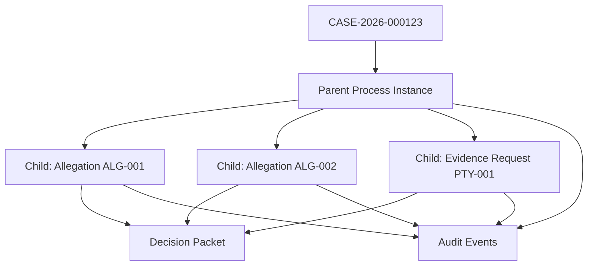

Operate shows runtime state. Your domain/audit platform should show business traceability.

---

## 12. Failure Containment

In multi-entity workflows, not every child failure should fail the parent.

Classify child failure semantics.

| Child Failure | Parent Reaction |
|---|---|
| Technical temporary failure | child retries; parent waits |
| Child incident | parent may wait and expose aggregate health |
| Business ineligible | child returns modeled outcome |
| Optional child failure | parent records warning and continues |
| Critical child failure | parent escalates or terminates path |
| Unknown external outcome | reconciliation path |

### 12.1 Parent Should See Business Outcome, Not Stack Trace

Bad child output:

```json
{
  "error": "java.net.SocketTimeoutException"
}
```

Better child output:

```json
{
  "childEntityId": "PTY-001",
  "outcome": "REQUIRES_RECONCILIATION",
  "reasonCode": "NOTICE_DELIVERY_OUTCOME_UNKNOWN",
  "reconciliationId": "REC-009"
}
```

Technical errors belong in incidents/retries. Parent business logic should consume business-level outcomes.

---

## 13. Cross-Process Cancellation

Cancellation is hard across process boundaries.

Questions:

- Does canceling the parent cancel children?
- Does canceling one child affect siblings?
- Are already completed children compensated?
- Are external side effects reversible?
- Are user tasks canceled or preserved?
- Is cancellation legal or only operational?
- What audit event proves cancellation?

### 13.1 Parent-Owned Child Cancellation

Use when child work has no independent legal standing.

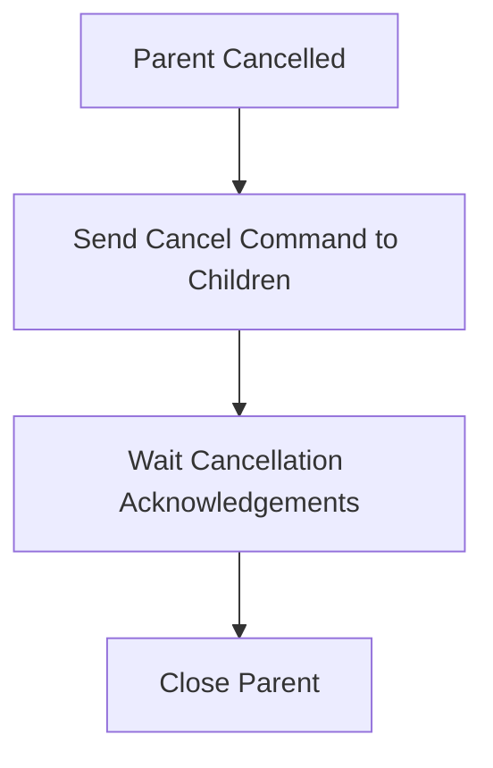

### 13.2 Independent Child Completion

Use when child work must complete even if parent route changes.

Example: evidence request already issued to a respondent may require formal withdrawal notice, not silent task cancellation.

This is domain behavior, not just BPMN cleanup.

---

## 14. Dynamic Fan-Out

Sometimes the list of children is not known at the beginning.

Examples:

- new affected parties discovered during investigation;
- new linked cases found by graph analysis;
- new evidence obligations created after review;
- new sanctions added after decision.

Do not force dynamic discovery into a static multi-instance if the list changes over time.

Options:

1. Use a loop with explicit discovery phases.
2. Use message-started child processes per discovered entity.
3. Use a domain work queue and a coordinator process.
4. Use a watchdog/aggregator that waits until discovery is closed.

### 14.1 Discovery Closure

The hardest part is knowing when fan-out is complete.

Define a closure rule:

- all known parties reviewed and discovery phase closed;
- no new entities found after final search;
- supervisor approved entity list;
- statutory discovery deadline expired;
- external registry scan completed;
- risk threshold no longer requires expansion.

Without a closure rule, the parent can wait forever.

---

## 15. Entity List Snapshot Pattern

For defensibility, fan-out should often use a snapshot of the entity list.

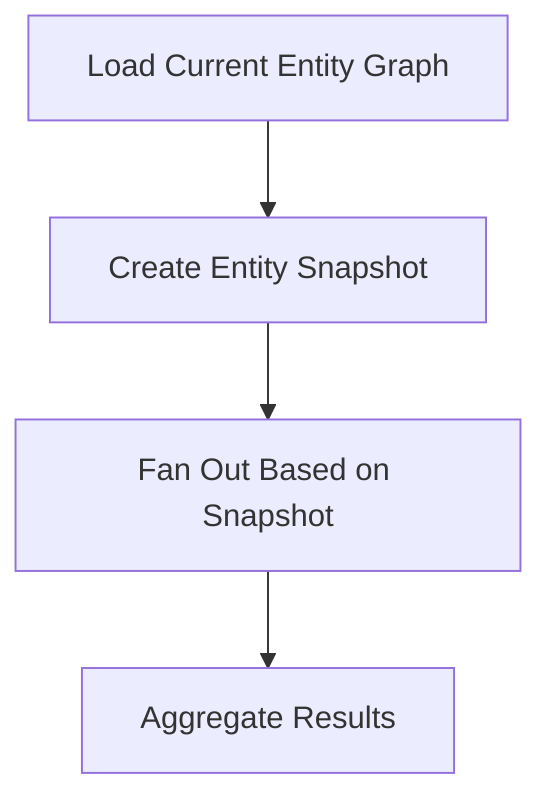

Snapshot record:

```json
{
  "snapshotId": "SNAP-2026-000123-01",
  "caseId": "CASE-2026-000123",
  "snapshotType": "AFFECTED_PARTIES_FOR_NOTICE",
  "entityIds": ["PTY-001", "PTY-002", "PTY-003"],
  "createdAt": "2026-06-28T10:15:00Z",
  "createdBy": "process:2251799813685311",
  "basis": "notice-required-party-selection-v2"
}
```

Then each child references the snapshot ID.

This answers audit questions later:

- Which entities were known at the time?
- Why were these entities included?
- What rule selected them?
- Did later-discovered entities require another cycle?

---

## 16. Cross-Case Linking

Cases can be linked in several ways:

- duplicate;
- parent/child;
- same respondent;
- same product;
- same incident;
- evidence dependency;
- precedent/appeal dependency;
- systemic investigation group.

Do not model all linked cases inside one parent BPMN unless the group has its own managed lifecycle.

Create explicit link records:

```json
{
  "linkId": "LNK-001",
  "sourceCaseId": "CASE-2026-000123",
  "targetCaseId": "CASE-2026-000456",
  "linkType": "COMMON_RESPONDENT",
  "createdBy": "systemic-risk-analysis",
  "createdAt": "2026-06-28T10:15:00Z"
}
```

Then orchestrate review if the link has consequences.

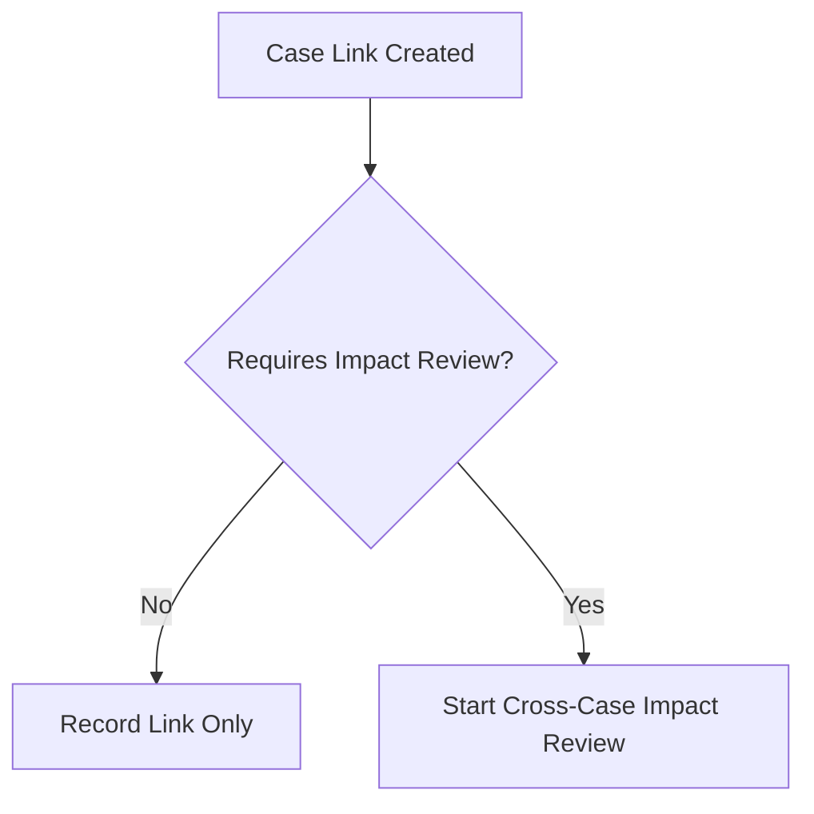

---

## 17. Cross-Entity Authorization

Multi-entity workflows often cross security boundaries.

Examples:

- investigator can see one party but not another;
- enforcement team can see sanction but not whistleblower identity;
- regional team can see local cases only;
- legal reviewer can see privileged evidence;
- external respondent can submit evidence only for their party record.

Do not assume parent process visibility equals child entity visibility.

Authorization should be enforced by:

- domain APIs;
- task visibility rules;
- evidence service access checks;
- document-level permissions;
- query-layer filtering;
- audit logging.

BPMN can route work based on role/group variables, but it should not be the only security layer.

---

## 18. Correlation Key Design

Correlation keys must be stable and entity-specific.

Examples:

| Message | Correlation Key |
|---|---|
| Evidence received for case | `case:CASE-2026-000123` |
| Party response received | `case:CASE-2026-000123:party:PTY-001` |
| Allegation investigation completed | `case:CASE-2026-000123:allegation:ALG-001` |
| Sanction obligation update | `sanction:SAN-001:obligation:OBL-009` |
| Cross-case impact result | `impact:IMP-2026-001` |

Bad correlation keys:

- email address;
- mutable display name;
- current assignee;
- case status;
- random value not stored anywhere;
- external reference that can be reused by another tenant.

### 18.1 Correlation Key Namespace

Use namespaces to avoid collisions:

```text
case:{caseId}
case:{caseId}:party:{partyId}
case:{caseId}:allegation:{allegationId}
case:{caseId}:document-request:{requestId}
sanction:{sanctionId}:obligation:{obligationId}
impact:{impactId}
```

In multi-tenant systems, include tenant boundary where needed:

```text
tenant:{tenantId}:case:{caseId}:party:{partyId}
```

---

## 19. Idempotency Across Process Graphs

In a graph of processes, duplicates can happen at many points:

- parent starts same child twice;
- child completion event published twice;
- external webhook retries;
- worker times out after side effect;
- aggregator receives duplicate message;
- cancellation command repeats;
- impact discovery runs twice.

Use idempotency keys at the business-operation level.

Examples:

| Operation | Idempotency Key |
|---|---|
| Start allegation process | `caseId + allegationId + investigationVersion` |
| Serve notice to party | `caseId + partyId + noticeType + noticeVersion` |
| Create impact record | `sourceCaseId + targetEntityId + impactType + sourceFindingId` |
| Complete obligation check | `obligationId + checkPeriod` |
| Publish child completion | `childProcessInstanceKey + outcomeType` |

Idempotency should be enforced by domain storage or operation log, not only by process variables.

---

## 20. Consistency Model

Cross-process orchestration is eventually consistent.

There is no single distributed transaction across:

- parent process;
- child process;
- domain case record;
- external service;
- audit log;
- message broker;
- document store.

Therefore design for:

- idempotent commands;
- retry-safe workers;
- reconciliation paths;
- compensating actions;
- observable intermediate states;
- explicit pending/unknown statuses;
- audit events for partial progress.

### 20.1 Pending Is a Real State

Do not collapse pending into failure.

Examples:

- `NOTICE_DELIVERY_PENDING`
- `EXTERNAL_REGISTRY_CHECK_PENDING`
- `PARTY_RESPONSE_PENDING`
- `CHILD_INVESTIGATION_PENDING`
- `IMPACT_REVIEW_PENDING`
- `CANCELLATION_ACK_PENDING`

Pending states let the system be honest.

---

## 21. Process Graph Observability

Operate helps inspect process instances, but multi-process systems need business-level observability.

Dashboards should answer:

- Which child processes exist for this case?
- Which entity is each child handling?
- Which children are complete, waiting, failed, or incidented?
- Which parent is waiting for which child?
- Which impact records are pending?
- Which messages were published but not correlated?
- Which entity snapshots were used?
- Which deadlines are approaching?

### 21.1 Health Summary Example

```json
{
  "caseId": "CASE-2026-000123",
  "parentProcessInstanceKey": "2251799813685311",
  "children": {
    "total": 12,
    "completed": 9,
    "waiting": 2,
    "incident": 1
  },
  "blockedBy": [
    {
      "entityType": "PARTY",
      "entityId": "PTY-003",
      "reason": "NOTICE_DELIVERY_UNKNOWN",
      "childProcessInstanceKey": "2251799813685999"
    }
  ]
}
```

This is not just operational convenience. It is how teams avoid losing work in complex orchestration graphs.

---

## 22. Modeling Linked Failures

A child process incident may impact parent routing.

Options:

### 22.1 Parent Waits Silently

Good when operations resolves child incident and parent can simply continue.

Risk: parent appears stuck without business context.

### 22.2 Child Publishes Business Failure

Good when failure is modeled as a business outcome.

Example: `PARTY_UNREACHABLE`.

### 22.3 Parent Receives Escalation Message

Good when incident should trigger supervisory action.

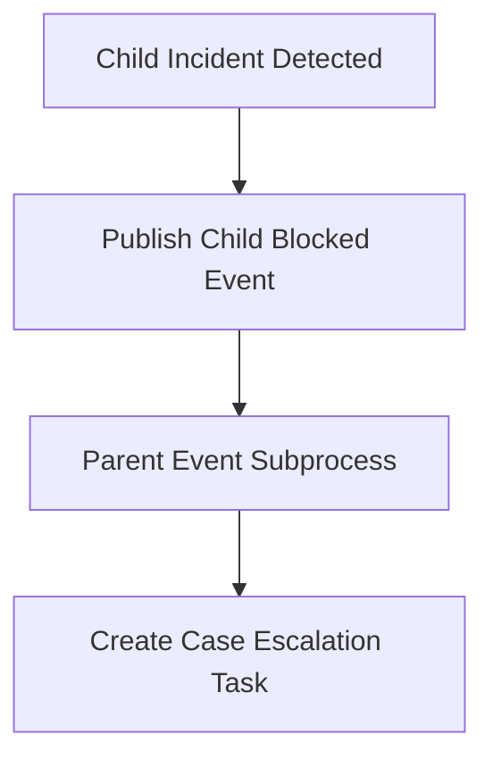

### 22.4 External Health Monitor

Good when process engine incidents need aggregation outside BPMN.

Use an operational service that reads process/incident data and creates business alerts.

---

## 23. When Not to Use Multi-Instance

Avoid multi-instance when:

- the list changes continuously;
- each child has long independent lifecycle;
- child count may be huge;
- each child requires separate authorization boundary;
- parent does not need direct fan-in;
- child failure should not block parent;
- child creation must be externally triggered;
- child processes are owned by different teams.

Use message-started processes, domain queues, or explicit child process creation instead.

### 23.1 High Cardinality Warning

If you have thousands or millions of child entities, do not blindly fan out a BPMN multi-instance.

Consider:

- batch processes;
- external job queues;
- streaming processing;
- chunked orchestration;
- aggregate status records;
- sampling/review workflows;
- backpressure controls.

BPMN should coordinate business workflow, not replace a high-volume data processing engine.

---

## 24. Chunked Fan-Out Pattern

When entity count is large, split into chunks.

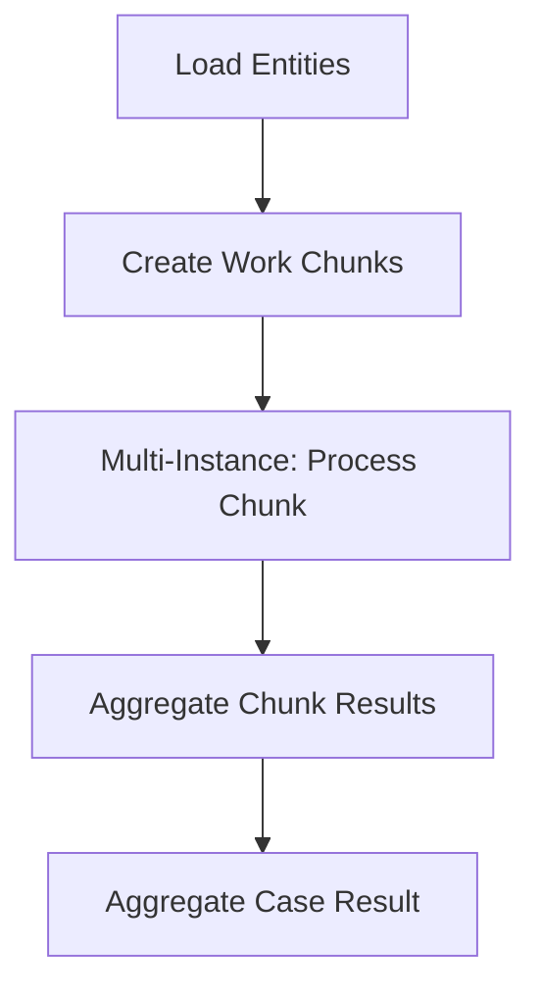

Chunk record:

```json
{
  "chunkId": "CHK-001",
  "caseId": "CASE-2026-000123",
  "entityType": "AFFECTED_CUSTOMER",
  "fromIndex": 0,
  "toIndex": 499,
  "snapshotId": "SNAP-001"
}
```

This keeps orchestration manageable.

---

## 25. Pattern: Parent Does Not Own Child Data

A parent should usually not store every child detail.

Parent variable:

```json
{
  "caseId": "CASE-2026-000123",
  "allegationSummary": {
    "total": 8,
    "substantiated": 3,
    "notSubstantiated": 5,
    "summaryId": "AGG-001"
  }
}
```

Child data lives in child domain records:

```json
{
  "allegationId": "ALG-001",
  "caseId": "CASE-2026-000123",
  "outcome": "SUBSTANTIATED",
  "evidenceBundleId": "EVB-001",
  "reviewer": "officer-12",
  "auditTrailId": "AUD-992"
}
```

This separation keeps parent flow stable.

---

## 26. Pattern: Explicit Join Decision

After fan-in, avoid routing directly on raw arrays with complex FEEL.

Better:

1. Aggregate child outcomes in worker/DMN.
2. Produce stable decision variable.
3. Route with simple gateway.

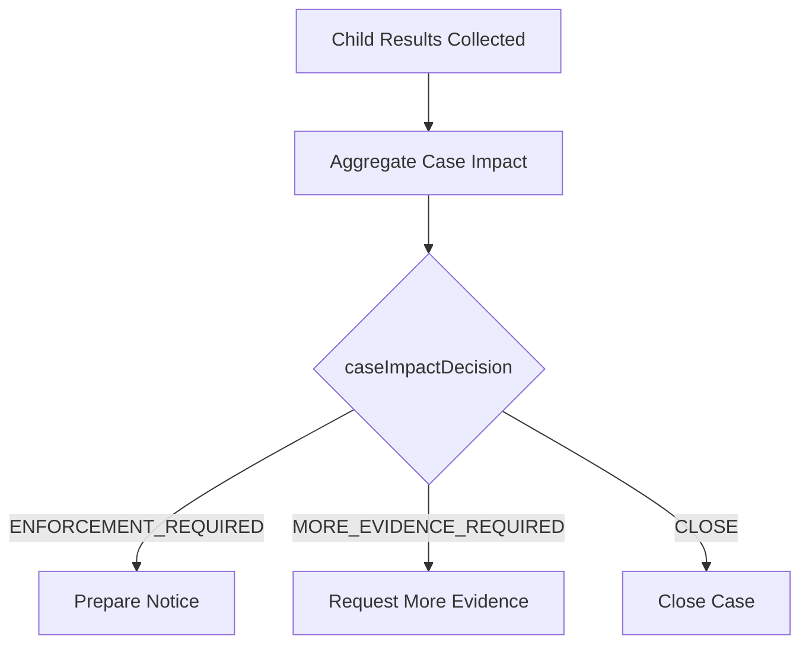

Gateway condition examples:

```feel
= caseImpactDecision = "ENFORCEMENT_REQUIRED"
```

not:

```feel
= count(for x in allegationOutcomes return if x.outcome = "SUBSTANTIATED" then x else null) > 0
  and some complex nested party-risk calculation
```

The latter belongs in tested domain/decision logic.

---

## 27. Pattern: Causation Chain

Every cross-process action should preserve causation.

Example chain:

1. Complaint received.
2. Case created.
3. Allegation identified.
4. Child investigation started.
5. Evidence request issued.
6. Party response received.
7. Allegation substantiated.
8. Notice prepared.
9. Decision approved.

Each event should include:

```json
{
  "eventId": "EVT-009",
  "correlationId": "CASE-2026-000123",
  "causationId": "EVT-008",
  "sourceProcessInstanceKey": "2251799813685999",
  "sourceElementId": "AssessAllegation",
  "businessEntityType": "ALLEGATION",
  "businessEntityId": "ALG-001"
}
```

This is essential for audit, debugging, and impact analysis.

---

## 28. Regulatory Capstone Example

Scenario:

A market abuse complaint names one firm, three individuals, two products, and five suspicious transactions. Investigation may reveal linked cases and additional respondents. If any allegation is substantiated, notices must be served to all affected parties. Each party has a response window. Decision review must aggregate allegation findings, party responses, and legal risk assessment. Sanctions may create multiple obligations that require monitoring.

### 28.1 Proposed Process Architecture

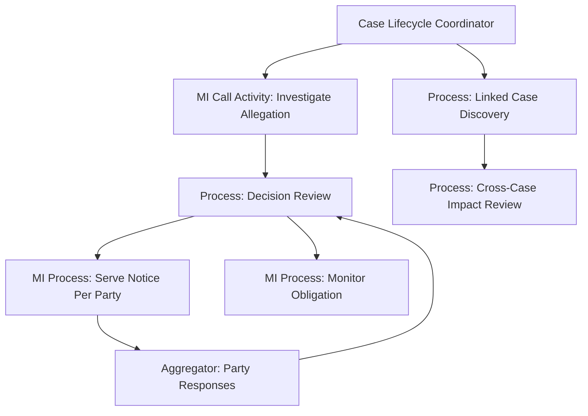

### 28.2 Entity Ownership

| Entity | Owner | Process Role |
|---|---|---|
| Case | Case service | Parent lifecycle and milestones |
| Allegation | Investigation service | Child investigation process |
| Party | Party service | Notice/response correlation |
| Evidence | Evidence service | Document references and packet snapshots |
| Decision | Decision service | Decision review process |
| Sanction | Enforcement service | Sanction creation and monitoring |
| Obligation | Monitoring service | Child monitoring process |
| Impact record | Impact service | Cross-case review process |

### 28.3 Correlation Keys

```text
case:CASE-2026-000123
case:CASE-2026-000123:allegation:ALG-001
case:CASE-2026-000123:party:PTY-001
case:CASE-2026-000123:decision:DEC-001
sanction:SAN-001:obligation:OBL-001
impact:IMP-001
```

### 28.4 Parent Summary Variables

```json
{
  "caseId": "CASE-2026-000123",
  "currentMilestone": "DECISION_REVIEW",
  "allegationAggregationId": "AGG-ALG-001",
  "partyResponseAggregationId": "AGG-PTY-001",
  "decisionPacketId": "PKT-DEC-001",
  "caseImpactDecision": "ENFORCEMENT_REQUIRED"
}
```

No huge party arrays. No raw evidence. No audit dump.

---

## 29. Anti-Patterns

### 29.1 One Process Instance Per Universe

The parent process contains every child entity lifecycle.

Better: parent-child orchestration and explicit aggregation.

### 29.2 Array as Workflow Engine

A variable contains an array of entities, and workers mutate array entries to represent child status.

Better: child records/processes with summary aggregation.

### 29.3 Parallel Multi-Instance Shared Variable Collision

Parallel items write the same variable name.

Better: local variables and output collection.

### 29.4 Hidden Fan-Out in Java Worker

A worker starts 500 child processes or sends 500 notifications with no trace records, no idempotency, and no aggregate state.

Better: create fan-out records, process chunks, record child links.

### 29.5 Magic Correlation

Messages correlate using mutable names, email addresses, or ambiguous external IDs.

Better: stable namespaced business keys.

### 29.6 Parent Waits Forever

Parent waits for all children but has no timeout, no partial result policy, and no incident/health view.

Better: completion rules, timeout paths, and aggregate status.

### 29.7 Technical Failure Becomes Business Decision

A failed child API call causes parent to decide “no violation”.

Better: technical failure must be retried/incidents/reconciled, not treated as business outcome.

### 29.8 Child Owns Parent State

Child process directly mutates parent lifecycle state without parent/domain validation.

Better: child emits outcome; parent/domain service decides transition.

### 29.9 Cross-Case Impact Without Impact Records

A worker silently updates linked cases.

Better: explicit impact records and impact review process.

### 29.10 Gateway as Aggregation Engine

A gateway expression performs complex filtering, counting, and policy decisions over nested arrays.

Better: aggregator worker or DMN decision with test coverage.

---

## 30. Production Review Checklist

### Entity Boundary

- Are entities identified before BPMN design?
- Does each entity with independent lifecycle have an owner?
- Are parent and child responsibilities clear?
- Are child outcomes summarized, not dumped?

### Correlation

- Are correlation keys stable and namespaced?
- Are message IDs/idempotency keys defined?
- Are duplicate events safe?
- Are late messages handled?

### Fan-Out/Fan-In

- Is entity list snapshot needed?
- Is fan-out cardinality bounded?
- Is parallel variable collision avoided?
- Is aggregation explicit and tested?
- Is completion policy defined?

### Failure

- Does parent know child health?
- Are child incidents operationally visible?
- Are business failures distinct from technical failures?
- Are cancellation semantics defined?
- Are unknown outcomes reconciled?

### Traceability

- Are parent/child process keys linked?
- Are domain entity IDs recorded?
- Are causation/correlation IDs preserved?
- Can an auditor reconstruct why an entity was affected?

### Scalability

- Is high-cardinality work chunked or externalized?
- Are workers idempotent?
- Is backpressure considered?
- Are process variables kept small?

---

## 31. Practice Drill

Design a Camunda 8 process architecture for this case:

A complaint affects 1 firm, 12 customers, 4 products, 9 suspicious transactions, and 3 linked prior cases. Each product must be reviewed by a product specialist. Each affected customer may submit evidence. Linked prior cases must be assessed for impact. A final decision can proceed when all mandatory product reviews complete and either all customer response windows expire or all customers respond earlier. If any linked case impact is critical, supervisor escalation is required before final decision.

Deliverables:

1. Entity graph.
2. Process instance granularity decision.
3. Parent/child process diagram.
4. Correlation key scheme.
5. Fan-out/fan-in strategy.
6. Aggregation rules.
7. Timeout policy.
8. Failure containment policy.
9. Process variable schemas.
10. Audit event list.

The expected answer is not one huge BPMN. The expected answer is a defensible orchestration graph.

---

## 32. Key Takeaways

Multi-entity orchestration requires graph thinking.

The strongest Camunda 8 designs separate:

- entity graph;
- domain state;
- process execution;
- child work;
- aggregation;
- impact records;
- audit trail;
- operational visibility.

Use multi-instance when the collection is known and bounded.
Use call activity when child work is structurally part of parent orchestration.
Use message-started child processes when child lifecycle is independent.
Use aggregators when outcomes arrive asynchronously.
Use domain impact records when one entity affects another.

Above all: do not let BPMN diagrams hide entity relationships.

A top-tier engineer can explain not only what the model does, but why each process boundary exists, how each child is correlated, what happens under duplicate messages, how partial failure is contained, and how an auditor can reconstruct the full graph later.

---

## Reference Anchors

- Camunda 8 multi-instance activities: https://docs.camunda.io/docs/components/modeler/bpmn/multi-instance/
- Camunda 8 variables and local scopes: https://docs.camunda.io/docs/components/concepts/variables/
- Camunda 8 call activities and binding: https://docs.camunda.io/docs/components/modeler/bpmn/call-activities/
- Camunda 8 message concepts and aggregator pattern: https://docs.camunda.io/docs/components/concepts/messages/
- Camunda 8 publish message API: https://docs.camunda.io/docs/apis-tools/orchestration-cluster-api-rest/specifications/publish-message/
